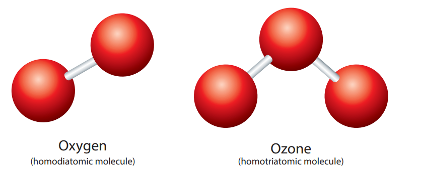
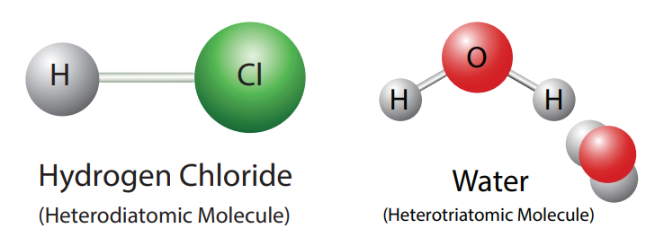

# ATOMS AND MOLECULES

**Learning Objectives**

At the end of the lesson the students will be able to: 
- acquire the ability to learn about the atoms and molecules. 
- comprehend atomic mass and molecular mass. 
- have information about gram atomic mass and gram molecular mass. 
- perceive the intended meaning of Avogadro’s hypothesis of gases. 
- interpret the application of Avogadro’s hypothesis. 
- determine the atomicity of a molecule. 
- interpret the relation between vapour density and relative molecular mass. - have the facts about the relationship between the volume of a gas and the number of molecules present in it. 
- grasp the idea of mole concept and solve many problems using it. 
- calculate the percentage of composition of a compund.

**INTRODUCTION**

You have learnt, in your lower classes that matter is around us everywhere. Matter is made of atoms. Curiously the idea of atom was first proposed by the Greek philosophers in the fifth century BC (BCE). But, their theory was more philosophical than scientific.

The first scientific theory of the atom was proposed by John Dalton. Few of the postulates of Dalton’s theory about an atom were found incorrect by the later on studies made by J.J. Thomson, Rutherford, Neils Bohr and Schrodinger. In the light of the result of the researches most of the limitations of the Dalton’s theory were

removed and a new theory known as the modern atomic theory was put forward. **‘The main postulates of modern atomic theory’** are as follows: 

- An atom is no longer indivisible (after
the discovery of the electron, proton, and neutron).

- Atoms of the same element may have different atomic mass. (discovery of **isotopes** 17Cl35, 17Cl37).

- Atoms of different elements may have same atomic masses (discovery of **Isobars** 18Ar40, 20Ca40).

- Atoms of one element can be transmuted into atoms of other elements. In other words, atom is no longer indestructible (discovery of artificial transmutation).

- Atoms may not always combine in a simple whole number ratio (E.g. Glucose C6H12O6 C:H:O = 6:12:6 or 1:2:1 and Sucrose C12H22O11 C:H:O = 12:22:11).

- Atom is the **smallest particle** t**hat takes part in a chemical reaction.**

- The mass of an atom can be converted into energy (E = mc2).

The modern atomic theory is the basis for all the studies of chemical and physical processes that involve atoms. You have studied the most fundamental ideas about an atom in your lower classes. Let us discuss some more concepts about atoms in this lesson.

## ATOM AND ATOMIC MASS

As you know, anything that has mass and occupies space is called matter. Atoms are the building blocks of matter. Since matter has mass, it must be due to its atoms. According to the modern atomic theory, an atom contains subatomic particles such as protons, neutrons and electrons. **Protons and neutrons have considerable mass, but electrons don't have such a considerable mass. Thus, the mass of an** atom is mainly contributed by its protons and neutrons and hence **the sum of the number of protons and neutrons of an atom is called its mass number**.

Individual atoms are very small and it is difficult to measure their masses. You can measure the mass of macroscopic materials in gram or kilogram. The mass of an atom is measured in atomic mass unit (amu).

Atomic mass unit is one-twelfth of the mass of a carbon-12 atom; an isotope of carbon, which contains 6 protons and 6 neutrons.

(**Note:** The symbol ‘amu’ is no longer used in the modern system and instead, it uses the symbol ‘U’ to denote unified atomic mass. The mass of a proton or neutron is approximately 1 amu).

### Relative Atomic Mass (RAM)

As an atom is very small, its absolute mass cannot be determined directly. The early pioneers of chemistry used to measure the atomic mass of an atom relative to an atom of another element. They measured the masses of equal number of atoms of two or more elements at a time, to determine their relative masses. They established one element as a standard, gave it an arbitrary value of atomic mass and using this value they measured the relative mass of other elements. The mass obtained by this way is called relative atomic mass. In the beginning, the mass of hydrogen atom was chosen as a standard and masses of other atoms were compared with it, because of the existence of isotopic character of hydrogen (1H1,1H2,1H3). Later hydrogen atom was replaced by oxygen atom as the standard. Now, the stable isotope of carbon (C-12) with atomic mass 12 is used as the standard for measuring the relative atomic mass of an element.

**Relative atomic mass of an element is the ratio between the average mass of its isotopes to 1/12th part of the mass of a carbon-12 atom. It is denoted as Ar. It is otherwise called “Standard Atomic Weight”.**

**Relative Atomic Mass**

**(Ar)** = Average mass of the isotopes of the element / 1/12thof the mass of one Carbon-12 atom1

Modern methods of determination of atomic mass by Mass Spectrometry uses C-12 as standard. For most of the elements, the relative atomic mass is very closer to a whole number and it is rounded off to a whole number, to make calculations easier. Table 7.1 lists some of the elements of periodic table and their Ar values.

**Table 7.1** Relative atomic mass of elements (C-12 Scale)

**DO YOU KNOW**

Relative Atomic Mass is only a ratio, so it has no unit. If the atomic mass of an element is expressed in grams, it is called as **Gram Atomic Mass**

Gram Atomic Mass of hydrogen = 1 g 
Gram Atomic Mass of carbon = 12 g 
Gram Atomic Mass of nitrogen = 14 g 
Gram Atomic Mass of oxygen = 16 g

### Average Atomic Mass (AAM)

How can one measure the atomic mass of an element? It is somewhat more complicated because most of the naturally occuring elements exist as a mixture of isotopes, each of which has its own mass. Thus, it is essential to consider this isotopic mixture while calculating the atomic mass of an element.

**The average atomic mass of an element is the weighted average of the masses of its naturally occurring isotopes.**

But, the abundance of isotopes of each element may differ. So, the abundancy of all these isotopes are taken into consideration while calculating the atomic mass. Then, what do we mean by a weighted average? Let us

consider an element which exists as a mixture of 50% of an isotope having a mass of 9 amu, and 50% of another isotope having a mass of 10 amu. Then, its average atomic mass is calculated by the following equation: 

Average atomic mass = (Mass of 1st isotope × % abundance of 1st isotope) + (Mass of 2nd isotope × % abundance of 2nd isotope)

Thus, for the given element the average

atomic mass = (9 × 50 / 100) (10 × 50 / 100)
            = 4.5 + 5 
            = 9.5 amu 

**(Note:** In the calculations involving percentages, you need to convert percentage abundance into fractional abundance. For example, 50 percent is converted into 50/100 or 0.50 as shown in the a foresaid calculation.)

The atomic masses of elements, given in the periodic table, are average atomic masses. Sometimes, the term atomic weight is used to mean average atomic mass. It is observed, from the periodic table that atomic masses of most of the elements are not whole numbers. For instance, the atomic mass of carbon given in the periodic table is 12.01 amu, not 12.00 amu. The reason is that while calculating the atomic mass of carbon, both of its natural isotopes such as carbon-12. and carbon-13 are considered. The natural abundance of C-12 and C-13 are 98.90 % and 1.10 % respectively. The average of the atomic mass of carbon is calculated as follows:

Average atomic mass of carbon

= (12 × 98.9 / 100) + (13 × 1.1 / 100) 
= (12 × 0.989) + (13 × 0.011) 
= 11.868 + 0.143 = 12.011 amu 

So it is important to understand that if it is mentioned that the atomic mass of carbon is 12 amu, it refers to the average atomic mass of the carbon isotopes, not the mass of the individual atoms of carbon.

**Table 7.2** Atomic mass of some elements

| Atomic Number |Name |Symbol |Atomic Mass(amu) |
|------|------|------|------|
| 1 |Hydrogen |H |1.008 |
| 2 |Helium |He |4.003 |
| 3 |Lithium |Li |6.941 |
| 4 |B er yllium |Be |9.012 |
| 5 |B oron |B |10.811 |

**Calculation of average atomic mass – Solved Examples**
**Example 1:** Oxygen is the most abundant element in both the Earth’s crust and the human body. It exists as a mixture of three stable isotopes in nature as shown in Table 7.3:

**Table 7.3** Isotopes of oxygen

| Isotope |Mass (amu) |% abundance |
|------|------|------|
| O168 |15.9949 |99.757 |
| O178 |16.9991 |0.038 |
| O188 |17.9992 |0.205 |

The atomic mass of oxygen = (15.9949 × 0.99757) + (16.9991 ×
0.00038) + (17.9992 × 0.00205)
                          = 15.999 amu.

**Example 2:** Boron naturally occurs as a mixture of boron-10 (5 protons + 5 neutrons) and boron-11 (5 protons + 6 neutrons) isotopes. The percentage abundance of B-10 is 20 and that of B-11 is 80. Then, the atomic mass of boron is calculated as follows:

Atomic mass of

boron = (10 × 20 / 100) + (11 × 80 / 100)

    = (10 × 0.20) + (11 × 0.80) 
    = 2 + 8.8 
    = 10.8 amu

## MOLECULE AND MOLECULAR MASS

Except noble gases, atoms of most of the elements are found in the combined form with itself or atoms of other elements. It is called as a molecule. **A molecule is a combination of two or more atoms held together by strong chemical forces of attraction, i.e. chemical bonds.**

**7.2.1 Classification of molecules**

A molecule may contain atoms of the same element or may contain atoms of two or more elements joined in a fixed ratio, in accordance with the law of definite proportions. Thus, a molecule may be an **element or a compound**. If the molecule is made of similar kind of atoms, then it is called **homoatomic molecule**.

The molecule that consist of atoms of different elements is called heteroatomic **molecule.** A compound is a heteroatomic molecule. The number of atoms present in the molecule is called its ‘**atomicity**’**.**

**Table 7.4 Classification of molecules**

| Atomicity |No. of atoms present |Name |
|------|------|------|
| 1 |1 |Monoatomic |
| 2 |2 |Diatomic |
| 3 |3 |Triatomic |
| >3 |>3 |Polyatomic |
  

Let us consider oxygen. Oxygen gas exists in two allotropic forms: Oxygen (O2) and Ozone (O3). In oxygen molecule, there are two oxygen atoms. So its atomicity is two. Since both the atoms are similar, oxygen (O2) is a homodiatomic molecule. Other elements.

**Activity 7.1**

Complete the following table by filling the appropriate values /terms

| Element |No. of Protons |No. of Neutrons |Mass Number |Stable Isotopes (abundance) |Atomic Mass (amu) |
|------|------|------|------|------|------|
|| 7 |||N-14 (99.6 %) |
||| 8 ||N-15 (0.4 %) |
| Silicon |14 ||28 |Si-28 (92.2 %) |
| Silicon |14|| |Si-29 (4.7 %) |
| Silicon||16 ||Si-30 (3.1 %) |
| |17 |||Cl-35 (75 %) |
| | 17|||Cl-37 (25 %) |

that exist as diatomic molecules are hydrogen (H2), nitrogen (N2) and halogens: fluorine (F3), chlorine (Cl2), bromine (Br2) and iodine (I<su>2).

**Figure 7.1** Homoatomic molecules

Ozone (O3) contains three oxygen atoms and hence it is called homotriatomic molecule. If a molecule contains more than three atoms, then it is called **polyatomic molecule**.

Conisder hydrogen chloride. It consists of two atoms, but of different elements, i.e. hydrogen and chlorine. So, its atomicity is two. It is a heterodiatomic molecule. Similarly, the water molecule contains two hydrogen atoms and one oxygen atom. So its atomicity is three. It is a heterotriatomic molecule.

**Figure 7.2** Heteroatomic molecules

---
**Activity 7.2**

**Classify the following molecules based on their atomicity and fill in the table:**

Fluorine (F2), Carbon dioxide (CO2), Phosphorous (P4), Sulphur (S8), Ammonia (NH3), Hydrogen iodide (HI), Sulphuric Acid (H2SO4), Methane (CH4), Glucose (C6H12O6), Carbon monoxide (CO)

| Mole cule |Di - atomic |Tri - atomic |Poly - atomic |
|------|------|------|------|
| Homo |
| Hetero |
---

## 7.2.2   Relative Molecular Mass  (RMM)

As the molecules are made of atoms, they also have their own mass. The mass of the molecule of an element or compound is measured in the C-12 scale and hence called relative molecular mass.

**The Relative Molecular Mass of a molecule is the ratio between the mass of one molecule of the substance to 1 /12th mass of anatom of Carbon -12.**

---
**DO YOU KNOW**

Relative Molecular Mass is only a ratio. So, it has no unit. If the molecular mass of a com- pound is expressed in grams, it is called **_Gram Molecular Mass._**

Gram Molecular Mass of water = 18 g 
Gram Molecular Mass of carbon dioxide = 44 g 
Gram Molecular Mass of ammonia = 17 g 
Gram Molecular Mass of HCl = 36.5 g

---

The relative molecular mass is obtained by adding together the relative atomic masses of all the atoms present in a molecule.

**Calculation of relative molecular mass – Solved examples:**

**Example 1:** Relative molecular mass of sulphuric acid (H2SO4) is calculated as follows: Sulphuric acid conatins 2 atoms of hydrogen, 1 atom of sulphur and 4 atoms of oxygen.

Therefore, Relative molecular mass of sulphuric acid = (2 × mass of hydrogen) +(1 × mass of sulphur) + (4 × mass of oxygen)

    = (2 × 1) + (1 × 32) + (4 × 16) 
    = 98 
i.e., one molecule of (H2SO4) is 98 times as heavy a 1 /12th of the mass of a carbon –12.

**Example 2:** Relative molecular mass of water (H2O) is calculated as follows: A water molecule is made of 2 atoms of hydrogen and one atom of oxygen.

So, the relative molecular mass of water = (2 × mass of hydrogen) + (1 × mass of oxygen) 

= (2 × 1) + (1 × 16) 

= 18 

i.e., one molecule of H2O is 18 times as heavy as 1 12th
of the mass of a carbon –12.

## DIFFERENCE BETWEEN ATOMS AND MOLECULES

Even though atoms are the basic components of molecules, they differ in many aspects when compared to the molecules. Table 7.5 consolidates the major difference between atoms and molecules.

**Table 7.5 Difference between atoms and** molecules

| Atom |Mole cule |
|------|------|
| An atom is the smallest particle of an element |A molecule is the smallest particle of an element or compound. |
| Atom does not exist in free state except in  noble gas |Molecule exists in a free a state |
| Except some of noblegas, other atoms arehighly reactive |Molecules are less reactive |
| Atom does not have a chemical bond |Atoms in a molecule are held by chemical bonds |

## MOLE CONCEPT

So far we discussed about matters in terms of individual atoms and molecules. Atomic mass units provide a relative scale for the masses of the elements. Since the atoms have such small masses, no usable scale can be devised to weigh them in the calibrated units of atomic mass units. In any real situation, we deal with macroscopic samples containing enormous number of atoms. Therefore, it is convenient to have a special unit to describe a very large number of atoms. The idea of a ‘unit’ to denote a particular number of objects is not new. For example, **the pair (2 items) and the dozen (12 items)**, are all familiar units. Chemists measure atoms and molecules in ‘moles’. So, you can now understand that ‘mole’ denotes a number of particles.

In the SI system, the **_mole (mol)_ is _the amount of a substance that contains as many elementary entities (atoms, molecules, or other particles) as there are atoms in exactly 12 g (or 0.012 kg) of the carbon-12 isotope. The_** actual number of atoms in 12 g of carbon-12 is determined experimentally. This is called **Avogadro’s Number (NA), named after an Italian** scientist **Amedeo Avogadro** who proposed its significance. Its value is 6.023 × 1023. So one mole of a substance contains ## × 1023
 entities. Thus, 5 moles of oxygen molecules contain 5 × 6.023 ×1023 molecules. 
 
 **Mole Concept:** The study of the collection of particles by using mole as the counting unit, in order to express the mass and volume of such unit particles in a bulk of matter is known as **mole concept**.

The number of moles of a substance can be calculated by various means depending on the data available, as follows:

- Number of moles of molecules.

- Number of moles of atoms.

- Number of moles of a gas (Standard molar volume at STP = 22.4 litre).

- Number of moles of ions.

**Note:** 

STP-Standard Temperature and Pressure(273.15 K,1.00 atm)

**Mole of atoms:** 

mole of an element contains 6.023 × 1023 atoms and it is equal to its gram atomic mass.

i.e., one mole of oxygen atom contains 6.023 × 1023</su> atoms of oxygen and its gram atomic mass is 16 g.

**Mole of molecules:** One mole of matter contains 6.023 × 1023

molecules and it is equal to its gram molecular mass.

i.e., one mole of oxygen molecule contains 6.023 × 1023 molecules of oxygen and its gram molecular mass is 32 g.

**Molar volume:** 

One mole of any gas occupies 22.4 litre or 22400 ml at S.T.P. This volume is called as molar volume.

**Calculation of number of moles by Different modes** 

Number of moles 

= Mass / Atomic Mass

= Mass / Molecular mass = Number of Atoms / 6.023 × 1023

= Number of Molecules / 6.023 × 1023

**Figure 7.3** Mole concept

## PERCENT COMPOSITION

So for, we were dealing with the number of entities present in a given substance. But many times, the information regarding the percentage of a particular element present in a compound is required.

The percentage composition of a compound represents the mass of each element present in 100 g of the compound.

Let us understand the percentage composition of oxygen and hydrogen by taking the example of H2O. It can be calculated using the formula

Mass % of an element

= mass of that element in the compound /

× 100 _molecular mass of the compound_

Now, molecular mass of H2O = 2(1) + 16 = 18 g

Mass % of hydrogen = 2 × 100

18 = 11.11 %

Mass % of oxygen = 16 × 100

18 = 88.89 %// to do

This percentage composition is useful to determine the empirical formula and molecular formula.

**Example 1:** Find the mass percentage composition of methane (CH4).

molecular mass of CH4 = 12 + 4 = 16 g

Mass % of carbon = 12 × 100

16 = 75 %

Mass % of hydrogen = 4 × 100

16 = 25 % // todo

## AVOGADRO HYPOTHESIS

In 1811 Avogadro framed a hypothesis based on the relationship between the number of molecules present in equal volumes of gases in different conditions.

The Avogadro’s law states that “equal **volumes of all gases under similar conditions of temperature and pressure contain equal number of molecules”**

It follows that the volume of any given gas must be proportional to the number of molecules in it. If ‘V’ is the volume and ‘n’ is the

number of molecules of a gas, then Avogadro law is represented, mathematically, as follows:

V α n 
V = constant × n 
 
 Thus, one litre (1 dm3) of hydrogen contains

the same number of molecules as in one litre of oxygen, i.e. the volume of the gas is directly proportional to the number of molecules of the gas.

**Figure 7.4 Avogadro Hypothesis**

**Explanation** 

Let us consider the reaction between
hydrogen and chlorine to form hydrogen chloride gas

//todo
H2(g) + Cl2(g) → 2 HCl(g)

1 vol + 1 vol → 2 volumes

According to Avogadro’s law 1 volume of any gas is occupied by “n” number of molecules. n molecules + n molecules → 2n molecules if n = 1 then 1molecule + 1 molecule → 2 molecules. ½ molecule + ½ molecule → 1 molecule

1 molecule of hydrogen chloride gas is made up of ½ molecule of hydrogen and ½ molecule of chlorine. Hence, the molecules can be subdivided. This law is in agreement with Dalton’s atomic theory.

---
**Activity 7.3**

Under same conditions of temperature and pressure if you collect 3 litre of O2, 5 litre of Cl2 and 6 litre of H2, i. Which has the highest number of

molecules? ii. Which has the lowest number of molecules?

---
## APPLICATIONS OF AVOGADRO’S LAW

i. It explains Gay-Lussac’s law. 

ii. It helps in the determination of atomicity of gases. 

iii. Molecular formula of gases can be derived using Avogadro’s law 

iv. It determines the relation between molecular mass and vapour density. 

v. It helps to determine gram molar volume of all gases (i.e, 22.4 litre at S.T.P)

## RELATIONSHIP BETWEEN VAPOUR DENSITY AND RELATIVE MOLECULAR MASS

**i. Relative molecular mass: (Hydrogen scale)**

The Relative Molecular Mass of a gas or vapour is the ratio between the mass of one molecule of the gas or vapour to mass of one atom of Hydrogen.

**ii. Vapour Density:** 

Vapour density is the ratio of the mass
of a certain volume of a gas or vapour, to the mass of an equal volume of hydrogen, measured under the same conditions of temperature and pressure.

Vapour Density (V.D.) = Mass of a given volume of gas or vapour at S.T.P./ Mass of the same volume of hydrogen
//todo

According to Avogadro's law, equal volumes of all gases contain equal number of molecules.

Thus, let the number of molecules in one volume = n, then
//todo
V.D. at S.T.P

\= Mass of ‘n’ molecules of a gas or vapour at

S.T.P. Mass of ‘n’ molecules of hydrogen

Cancelling 'n' which is common, you get

V.D. = Mass of 1 molecule of a gas or vapour at S.T.P.

Mass of 1 molecules of hydrogen However, since hydrogen is diatomic

V.D.

\= Mass of 1 molecule of a gas or vapour at S.T.P. Mass of 2 atoms of hydrogen

When you compare the formula of vapour density with relative molecular mass, they can be represented as

V.D.

\= Mass of 1 molecule of a gas or vapour at S.T.P. 2 × Mass of 1 atom of hydrogen

(Eqn 7.1)

Relative molecular mass (hydrogen scale) = Mass of 1 molecule of a gas or vapour at STP

Mass of 1 atom of hydrogen (Eqn 7.2)

You can therefore substitute the above equation to an Eqn 7.1 and arrive at the following formula

V.D. = Relative molecular mass 2

Now on cross multiplication, you have

2 × vapour density = Relative molecular mass of a gas (Or) Relative molecular mass = 2 × Vapour density
// todo
## SOLVED PROBLEMS

**I. Calculation of molecular mass** Calculate the gram molecular mass of the following.
//todo
1) H2O 2) CO2 3) Ca3 (PO4)2

**Solution:** 

1) H2O

Atomic masses of H = 1, O = 16

  

Gram molecular mass of H2O = (1 × 2) + (16 × 1) = 2 + 16 Gram molecular mass of H2O = 18 g

**2) CO2**

Atomic masses of C = 12, O = 16 Gram molecular mass of CO2

\= (12 × 1) + (16 × 2) = 12 + 32 Gram molecular mass of CO2 = 44 g

**3) Ca3 (PO4)2**

Atomic masses of Ca = 40, P = 30, O = 16. Gram molecular mass of Ca3 (PO4)2

\= (40 × 3) + \[30 + (16 × 4)\] × 2 = 120 + (94 × 2) = 120 + 188 Gram molecular mass of Ca3(PO4)2 = 308 g

**II. Calculation based on number of moles from mass and volume**

1) Calculate the number of moles in 46 g of sodium?

Number of moles = Mass of the element

Atomic mass of the ele- ment

\= 46 / 23 = 2 moles of sodium

2) 5.6 litre of oxygen at S.T.P

Number moles = Given volume of O2 at

S.T.P Molar volume at S.T.P

Number of moles of oxygen = 5.6 22.4

\= 0.25 mole of oxygen

3) Calculate the number of moles of a sample that contains 12.046 × 1023 atoms of iron ?

Number of moles = Number of atoms of iron Avogadro’s number

\= 12.046 × 1023 / 6.023 × 1023

\= 2 moles of iron

**III. Calculation of mass from mole**

Calculate the mass of the following

1) 0.3 mole of aluminium (Atomic mass of Al = 27)

Number of moles = Mass of Al Atomic mass of Al

Mass = No. of moles × atomic mass

So, mass of Al = 0.3 × 27

\= 8.1 g

2) 2.24 litre of SO2 gas at S.T.P

Molecular mass of SO2 = 32 + (16 × 2) = 32 + 32 = 64

Number of moles of SO2 =

Given volume of SO2 at S.T.P

Molar volume SO2 at S.T.P

Number of moles of SO2 = 2.24 22.4

\= 0.1 mole

Number of moles = Mass Molecular mass

Mass = No. of moles × molecular mass Mass = 0.1 × 64 Mass of SO2 = 6.4 g

3) 1.51 × 1023 molecules of water

Molecular mass of H2O = 18

Number of moles = Number of molecules of

water Avogadro’s number

\= 1.51 × 1023 / 6.023 × 1023

\= 1 / 4 = 0.25 mole

Number of moles = Mass Molecular mass

0.25 = mass / 18 Mass = 0.25 × 18 Mass = 4.5 g

4) 5 × 1023 molecules of glucose ? Molecular mass of glucose = 180

  

101 **Atoms and molecules**

Mass of glucose = Molecular mass ×

number of particles Avogadro’s number

\= (180 × 5 × 1023) / 6.023 × 1023

\= 149.43 g

**IV. Calculation based on number of atoms/ molecules.**

1) Calculate the number of molecules in 11.2 litre of CO2 at S.T.P

Number of moles of CO2 = Volume at S.T.P Molar volume

\= 11.2 / 22.4 = 0.5 mole

Number of molecules of CO2 = number of moles of CO2 × Avogadro’s number

\= 0.5 × 6.023 × 1023

\= 3.011 × 1023 molecules of CO2

2) Calculate the number of atoms present in 1 gram of gold (Atomic mass of Au = 198)

Number of atoms of Au =

Mass of Au × Avogadro’s number

Atomic mass of Au

Number of atoms of Au = 1

× 6.023 × 1023

198

Number of atoms of Au = 3.042 × 1021 g

3) Calculate the number of molecules in 54 gm of H2O?

Number of molecules =

(Avogadro number × Given mass)

Gram molecular mass

Number of molecules

of water = 6.023 × 1023 × 54 / 18

\= 18.069 × 1023 molecules

4) Calculate the number of atoms of oxygen and carbon in 5 moles of CO2.

• 1 mole of CO2 contains 2 moles of oxygen

• 5 moles of CO2 contain 10 moles of oxygen

Number of atoms of oxygen = Number of moles of oxygen × Avogadro’s number

\= 10 × 6.023 × 1023

\= 6.023 × 1024 atoms of Oxygen

• 1 mole of CO2 contains 1 mole of carbon

• 5 moles of CO2 contains 5 moles of carbon

No. of atoms of carbon = No.of moles of carbon × Avogadro’s number

\= 5 × 6.023 × 1023

\= 3.011 × 1024 atoms of Carbon

**V. Calculation based on molar volume**

Calculate the volume occupied by:

1) 2.5 mole of CO2 at S.T.P

Number of moles of CO2 = Given volume at S.T.P Molar volume at S.T.P

2.5 mole of CO2 = Volume of CO2 at S.T.P

22.4

Volume of CO2 at S.T.P = 22.4 × 2.5 = 56 litres.

2) 12.046 × 1023 of ammonia gas molecules

Number of moles = Number of molecules Avogadro’s number

\= 12.046 × 1023 / 6.023 × 1023

\= 2 moles Volume occupied by NH3

\= number of moles × molar volume = 2 × 22.4 = 44.8 litres at S.T.P

3) 14 g nitrogen gas Number of moles = 14 / 28

\= 0.5 mole Volume occupied by N2 at S.T.P

\= no. of moles × molar volume = 0.5 × 22.4 = 11.2 litres.

  

**VI. Calculation based on % composition** Calculate % of S in H2SO4

molecular mass of H2SO4

\= (1 × 2) + (32 × 1) + (16 × 4) = 2 + 32 + 64 = 98 g

% of S in H2SO4 = Mass of sulphur

× 100Molecular mass of H2SO4

% of S in H2SO4 = 32

× 100 98

\= 32.65 %

//todo

**Points to Remember**

- Two or more forms of an element having the same atomic number, but different mass number are called Isotopes (17Cl35, 17Cl37).

- Atoms of different elements having the same mass number, but different atomic numbers are called Isobars (18Ar40, 20Ca40).

- Atoms of different elements having the same number of neutrons, but different atomic number and different mass number are called Isotones ( 6C

13, 7N 14 ).

- Relative atomic mass of an element is the ratio between the mass of one atom of the element to 1/12th of the mass of the atom of carbon -12.

- Average atomic mass of an element is calculated by adding the masses of its isotopes, each multiplied by their natural abundance on the Earth.

- Relative molecular mass of a molecule is the ratio between the mass of one molecule of the substance to 1/12th of the mass of the atom of carbon – 12.

- The Avogadro’s law states that “equal volumes of all gases under similar conditions of temperature and pressure contain equal number of molecules”.

- The vapour density is defined as “the ratio between the masses of equal volumes of a gas (or a vapour) and hydrogen under the same condition”.

- Atomicity of a monoatomic element = Molecular mass / Atomic Mass.

- Molecular mass = 2 × Vapour density.

