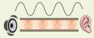
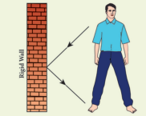
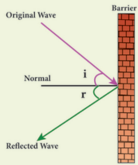
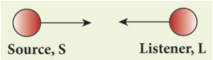
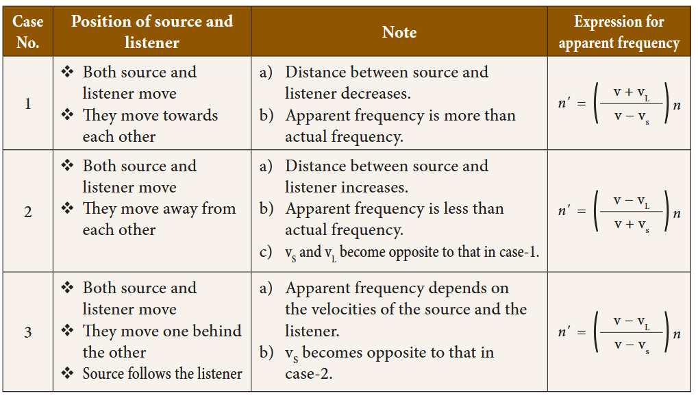

# UNIT 5 : ACOUSTICS

## Learning Objectives
By the end of this section, the students will be able to:
- Understand how sound is produced and transmitted.
- Relate the speed of sound, its frequency, and its wavelength.
- Know the speed of sound in various media.
- Explain the factors affecting the speed of sound in a gaseous medium.
- Demonstrate the phenomenon of reflection of sound.
- Determine the speed of sound using the method of echo.
- Understand Doppler Effect.
- Solve numerical problems related to the above.

---

## INTRODUCTION
Sound plays a major role in our lives. We communicate with each other mainly through sound. In our daily life, we hear a variety of sounds produced by different sources like humans, animals, vehicle horns, etc. Hence, it becomes inevitable to understand how sound is produced, how it is propagated and how you hear the sound from various sources. It is sometimes misinterpreted that acoustics only deals with musical instruments and design of auditoria and concert halls. But, acoustics is a branch of physics that deals with production, transmission, reception, control, and effects of sound. You have studied about propagation and properties of sound waves in IX standard. In this lesson we will study about reflection of sound waves, Echo and Doppler effect.

---

## 5.1 SOUND WAVES
When you think about sound, the questions that arise in your minds are: How is sound produced? How does sound reach our ears from various sources? What is sound? Is it a force or energy? Let us answer all these.

By touching a ringing bell or a musical instrument while it is producing music, you can conclude that sound is produced by vibrations. The vibrating bodies produce energy in the form of waves, which are nothing but sound waves.



**Figure 5.1** Production of sound waves

Suppose you and your friend are on the Moon. Will you be able to hear any sound produced by your friend? As the Moon does not have air, you will not be able to hear any sound produced by your friend. Hence, you understand that the sound produced due to the vibration of different bodies needs a material medium like air, water, steel, etc, for its propagation. Hence, sound can propagate through a gaseous medium or a liquid medium or a solid medium.

### ACTIVITY 1
Take a squeaky toy or old mobile phone and put it inside a plastic bag. Seal the bag with the help of a candle or with a thread. Fill a bucket with water and place the bag in the water bucket and squeeze the toy or ring the mobile. You will hear a low sound. Now place your ear against the side of the bucket and squeeze the toy or ring the mobile phone again. You will hear a louder sound.

---

### 5.1.1 Longitudinal Waves
Sound waves are longitudinal waves that can travel through any medium (solids, liquids, gases) with a speed that depends on the properties of the medium. As sound travels through a medium, the particles of the medium vibrate along the direction of propagation of the wave. This displacement involves the longitudinal displacements of the individual molecules from their mean positions. This results in a series of high and low pressure regions called compressions and rarefactions.


**Figure 5.2** Sound propagates as longitudinal waves

---

### 5.1.2 Categories of sound waves based on their frequencies

**(i) Audible waves** – These are sound waves with a frequency ranging between 20 Hz and 20,000 Hz. These are generated by vibrating bodies such as vocal cords, stretched strings.

**(ii) Infrasonic waves** – These are sound waves with a frequency below 20 Hz that cannot be heard by the human ear. e.g., waves produced during earthquake, ocean waves, sound produced by whales.

**(iii) Ultrasonic waves** – These are sound waves with a frequency greater than 20 kHz. Human ear cannot detect these waves, but certain creatures like mosquito, dogs, bats, dolphins can detect these waves.

---

### 5.1.3 Difference between the sound and light waves

| S.No. | SOUND | LIGHT |
|:---|:---|:---|
| 1 | Medium is required for the propagation. | Medium is not required for the propagation. |
| 2 | Sound waves are longitudinal. | Light waves are transverse. |
| 3 | Wavelength ranges from 1.65 cm to 1.65 m. | Wavelength ranges from 4 × 10⁻⁷ m to 7 × 10⁻⁷ m. |
| 4 | Sound waves travel in air with a speed of about 340 ms⁻¹ at NTP. | Light waves travel in air with a speed of 3 × 10⁸ ms⁻¹. |

---

### 5.1.4 Velocity of sound waves
When you talk about the velocity associated with any wave, there are two velocities, namely particle velocity and wave velocity. SI unit of velocity is ms⁻¹.

**Particle velocity:** The velocity with which the particles of the medium vibrate in order to transfer the energy in the form of a wave is called particle velocity.

**Wave velocity:** The velocity with which the wave travels through the medium is called wave velocity. In other words, the distance travelled by a sound wave in unit time is called the velocity of a sound wave.


\therefore \text{Velocity} = \frac{\text{Distance}}{\text{Time taken}}


If the distance travelled by one wave is taken as one wavelength (λ) and the time taken for this propagation is one time period (T), then the expression for velocity can be written as:


\therefore V = \frac{\lambda}{T}


Therefore, velocity can be defined as the distance travelled per second by a sound wave. Since, Frequency (n) = 1/T, equation (5.1) can be written as:


V = n\lambda


Velocity of a sound wave is maximum in solids because they are more elastic in nature than liquids and gases. Since, gases are least elastic in nature, the velocity of sound is the least in a gaseous medium.


V_S \geq V_L \geq V_G


---

### 5.1.5 Factors affecting velocity of sound
In the case of solids, the elastic properties and the density of the solids affect the velocity of sound waves. Elastic property of solids is characterized by their elastic moduli. The speed of sound is directly proportional to the square root of the elastic modulus and inversely proportional to the square root of the density. Thus the velocity of sound in solids decreases as the density increases whereas the velocity of sound increases when the elasticity of the material increases.

In the case of gases, the following factors affect the velocity of sound waves.

**Effect of density:** The velocity of sound in a gas is inversely proportional to the square root of the density of the gas. Hence, the velocity decreases as the density of the gas increases.

v \propto \sqrt{\frac{1}{d}}


**Effect of temperature:** The velocity of sound in a gas is directly proportional to the square root of its temperature. The velocity of sound in a gas increases with the increase in temperature. 
v \propto \sqrt{T}


Velocity at temperature T is given by the following equation:

v_T = (v_0 + 0.61T) \text{ m s}^{-1}


Here,
v_0 is the velocity of sound in the gas at 0°C. For air, v_0 = 331 ms⁻¹. Hence, the velocity of sound changes by 0.61 ms⁻¹ when the temperature changes by one degree celsius.

**Effect of relative humidity:** When humidity increases, the speed of sound increases. That is why you can hear sound from long distances clearly during rainy seasons.

Speed of sound waves in different media are given in table 5.1.

**Table 5.1** Speed of sound in different media

| S. No. | Nature of the medium | Name of the Medium | Speed of sound (in ms⁻¹) |
|:---|:---|:---|:---|
| 1 | Solid | Copper | 5010 |
| 2 | Solid | Iron | 5950 |
| 3 | Solid | Aluminium | 6420 |
| 4 | Liquid | Kerosene | 1324 |
| 5 | Liquid | Water | 1493 |
| 6 | Liquid | Seawater | 1533 |
| 7 | Gas | Air (at 0°C) | 331 |
| 8 | Gas | Air (at 20°C) | 343 |

---

### Example Problem 5.1
**1. At what temperature will the velocity of sound in air be double the velocity of sound in air at 0°C?**

**Solution:**
Let T°C be the required temperature. Let v_1 and v_2 be the velocity of sound at temperatures T_1K and T_2K respectively. T_1 = 273 K (0°C) and T_2 = (T°C + 273) K


\frac{v_2}{v_1} = \sqrt{\frac{T_2}{T_1}} = \sqrt{\frac{273+T}{273}} = 2


Here, it is given that, 
v_2/v_1 = 2
.

So, 
\frac{273+T}{273} = 4



T = (273 \times 4) - 273 = 819°C


---

## 5.2 REFLECTION OF SOUND
When you speak in an empty room, you hear a soft repetition of your voice. This is nothing but the reflection of the sound waves that you produce. Let us discuss about the reflection of sound in detail through the following activity.

When sound waves travel in a given medium and strike the surface of another medium, they can be bounced back into the first medium. This phenomenon is known as reflection. In simple terms the reflection and refraction of sound is actually similar to the reflection of light. Thus, the bouncing of sound waves from the interface between two media is termed as the reflection of sound. The waves that strike the interface are termed as the incident wave and the waves that bounce back are termed as the reflected waves.



**Figure 5.3** Reflection of sound

---

### 5.2.1 Laws of reflection
Like light waves, sound waves also obey some fundamental laws of reflection. The following two laws of reflection are applicable to sound waves as well.

- The incident wave, the normal to the reflecting surface and the reflected wave at the point of incidence lie in the same plane.
- The angle of incidence ∠i is equal to the angle of reflection ∠r.

These laws can be observed from Figure 5.4.



**Figure 5.4** Laws of reflection

In the above Figure 5.4, the sound waves that travel towards the reflecting surface are called the incident waves. The sound waves bouncing back from the reflecting surface are called reflected waves. For all practical purposes, the point of incidence and the point of reflection is the same point on the reflecting surface.

A perpendicular line drawn at the point of incidence is called the normal. The angle which the incident sound wave makes with the normal is called the angle of incidence, 'i'. The angle which the reflected wave makes with the normal is called the angle of reflection, 'r'.

> **DO YOU KNOW?**
> **Acoustical wonder of Golconda fort (Hyderabad, Telangana)**
> The Clapping portico in Golconda Fort is a series of arches on one side, each smaller than the preceding one. So, a sound wave generated under the dome would get compressed and then bounce back amplified sufficiently to reach a considerable distance.

---

### 5.2.2 Reflection at the boundary of a denser medium
A longitudinal wave travels in a medium in the form of compressions and rarefactions. Suppose a compression travelling in air from left to right reaches a rigid wall. The compression exerts a force F on the rigid wall. In turn, the wall exerts an equal and opposite reaction R = -F on the air molecules. This results in a compression near the rigid wall. Thus, a compression travelling towards the rigid wall is reflected back as a compression. That is the direction of compression is reversed.


**Figure 5.5** Reflection of sound at a denser medium

---

### 5.2.3 Reflection at the boundary of a rarer medium
Consider a wave travelling in a solid medium striking on the interface between the solid and the air. The compression exerts a force F on the surface of the rarer medium. As a rarer medium has smaller resistance for any deformation, the surface of separation is pushed backwards. As the particles of the rarer medium are free to move, a rarefaction is produced at the interface. Thus, a compression is reflected as a rarefaction and a rarefaction travels from right to left.


**Figure 5.6** Reflection of sound at a rarer medium

> **More to know:**
> **What is meant by rarer and denser medium?**
> The medium in which the velocity of sound increases compared to other medium is called rarer medium. (Water is rarer compared to air for sound).
> The medium in which the velocity of sound decreases compared to other medium is called denser medium. (Air is denser compared to water for sound)

---

### 5.2.4 Reflection of sound in plane and curved surfaces
When sound waves are reflected from a plane surface, the reflected waves travel in a direction, according to the law of reflection. The intensity of the reflected wave is neither decreased nor increased. But, when the sound waves are reflected from the curved surfaces, the intensity of the reflected waves is changed. When reflected from a convex surface, the reflected waves are diverged out and the intensity is decreased. When sound is reflected from a concave surface, the reflected waves are converged and focused at a point. So the intensity of reflected waves is concentrated at a point. Parabolic surfaces are used when it is required to focus the sound at a particular point. Hence, many halls are designed with parabolic reflecting surfaces. In elliptical surfaces, sound from one focus will always be reflected to the other focus, no matter where it strikes the wall.

This principle is used in designing whispering halls. In a whispering hall, the speech of a person standing in one focus can be heard clearly by a listener standing at the other focus.

> **YOU KNOW?**
> **Whispering Gallery**
> One of the famous whispering galleries is in St. Paul's cathedral church in London. It is built with elliptically shaped walls. When a person is talking at one focus, his voice can be heard distinctly at the other focus. It is due to the multiple reflections of sound waves from the curved walls.

---

## 5.3 ECHOES
An echo is the sound reproduced due to the reflection of the original sound from various rigid surfaces such as walls, ceilings, surfaces of mountains, etc.

If you shout or clap near a mountain or near a reflecting surface, like a building you can hear the same sound again. The sound, which you hear is called an echo. It is due to the reflection of sound. One does not experience any echo sound in a small room. This does not mean that sound is not reflected in a small room. This is because smaller rooms do not satisfy the basic conditions for hearing an echo.

---

### 5.3.1 Conditions necessary for hearing echo
1. The persistence of hearing for human ears is 0.1 second. This means that you can hear two sound waves clearly, if the time interval between the two sounds is at least 0.1 s. Thus, the minimum time gap between the original sound and an echo must be 0.1 s.

2. The above criterion can be satisfied only when the distance between the source of sound and the reflecting surface would satisfy the following equation:


\text{Velocity} = \frac{\text{distance travelled by sound}}{\text{time taken}}



v = \frac{2d}{t}



d = \frac{vt}{2}


Since, t = 0.1 second, then 
d = \frac{v \times 0.1}{2} = \frac{v}{20}


Thus the minimum distance required to hear an echo is 1/20th part of the magnitude of the velocity of sound in air. If you consider the velocity of sound as 344 ms⁻¹, the minimum distance required to hear an echo is 17.2 m.

---

### 5.3.2 Applications of echo
- Some animals communicate with each other over long distances and also locate objects by sending the sound signals and receiving the echo as reflected from the targets.
- The principle of echo is used in obstetric ultrasonography, which is used to create real-time visual images of the developing embryo or fetus in the mother's uterus. This is a safe testing tool, as it does not use any harmful radiations.
- Echo is used to determine the velocity of sound waves in any medium.

---

### 5.3.3 Measuring velocity of sound by echo method

**Apparatus required:**
A source of sound pulses, a measuring tape, a sound receiver, and a stop watch.

**Procedure:**
1. Measure the distance 'd' between the source of sound pulse and the reflecting surface using the measuring tape.
2. The receiver is also placed adjacent to the source. A sound pulse is emitted by the source.
3. The stopwatch is used to note the time interval between the instant at which the sound pulse is sent and the instant at which the echo is received by the receiver. Note the time interval as 't'.
4. Repeat the experiment for three or four times. The average time taken for the given number of pulses is calculated.

**Calculation of speed of sound:**
The sound pulse emitted by the source travels a total distance of 2d while travelling from the source to the wall and then back to the receiver. The time taken for this has been observed to be 't'. Hence, the speed of sound wave is given by:


\text{Speed of sound} = \frac{\text{distance travelled}}{\text{time taken}} = \frac{2d}{t}


---

## 5.4 APPLICATIONS OF REFLECTION OF SOUND

### 5.4.1 Sound board
These are basically curved surfaces (concave), which are used in auditoria and halls to improve the quality of sound. This board is placed such that the speaker is at the focus of the concave surface. The sound of the speaker is reflected towards the audience thus improving the quality of sound heard by the audience.

### 5.4.2 Ear trumpet
Ear trumpet is a hearing aid, which is useful by people who have difficulty in hearing. In this device, one end is wide and the other end is narrow. The sound from the sources fall into the wide end and are reflected by its walls into the narrow part of the device. This helps in concentrating the sound and the sound enters the ear drum with more intensity. This enables a person to hear the sound better.

### 5.4.3 Megaphone
A megaphone is a horn-shaped device used to address a small gathering of people. Its one end is wide and the other end is narrow. When a person speaks at the narrow end, the sound of his speech is concentrated by the multiple reflections from the walls of the tube. Thus, his voice can be heard loudly over a long distance.

---

## 5.5 DOPPLER EFFECT
The whistle of a fast moving train appears to increase in pitch as it approaches a stationary listener and it appears to decrease as the train moves away from the listener. This apparent change in frequency was first observed and explained by Christian Doppler (1803-1853), an Austrian Mathematician and Physicist. He observed that the frequency of the sound as received by a listener is different from the original frequency produced by the source whenever there is a relative motion between the source and the listener. This is known as Doppler effect. This relative motion could be due to various possibilities as follows:

(i) The listener moves towards or away from a stationary source
(ii) The source moves towards or away from a stationary listener
(iii) Both source and listener move towards or away from one other
(iv) The medium moves when both source and listener are at rest

### DEFINITION
Whenever there is a relative motion between a source and a listener, the frequency of the sound heard by the listener is different from the original frequency of sound emitted by the source. This is known as "Doppler effect".

For simplicity of calculation, it is assumed that the medium is at rest. That is the velocity of the medium is zero.

Let S and L be the source and the listener moving with velocities 
v_S and v_L
 respectively. Consider the case of source and listener moving towards each other. As the distance between them decreases, the apparent frequency will be more than the actual source frequency.



**Figure 5.7** Source and listener moving towards each other

Let n and n' be the frequency of the sound produced by the source and the sound observed by the listener respectively. Then, the expression for the apparent frequency n' is:


n' = \left(\frac{v + v_L}{v - v_S}\right) n


Here, v is the velocity of sound waves in the given medium. Let us consider different possibilities of motions of the source and the listener. In all such cases, the expression for the apparent frequency is given in table 5.2.

**Table 5.2** Expression for apparent frequency due to Doppler effect


Suppose the medium (say wind) is moving with a velocity W in the direction of the propagation of sound. For this case, the velocity of sound, v should be replaced with
(v + W). If the medium moves in a direction opposite to the propagation of sound, then 'v' should be replaced with (v - W)
.

---

### Solved problems

**1. A source producing a sound of frequency 90 Hz is approaching a stationary listener with a speed equal to (1/10) of the speed of sound. What will be the frequency heard by the listener?**

**Solution:** When the source is moving towards the stationary listener, the expression for apparent frequency is:


n' = n \frac{v}{v - v_s} = n \frac{v}{v - \frac{v}{10}} = n \frac{10}{9} = \frac{10}{9} \times 90 = 100 \text{ Hz}


---

**2. A source producing a sound of frequency 500 Hz is moving towards a listener with a velocity of 30 ms⁻¹. The speed of the sound is 330 ms⁻¹. What will be the frequency heard by listener?**

**Solution:** When the source is moving towards the stationary listener, the expression for apparent frequency is:


n' = n \frac{v}{v - v_s} = 500 \times \frac{330}{330 - 30} = 550 \text{ Hz}


---

**3. A source of sound is moving with a velocity of 50 ms⁻¹ towards a stationary listener. The listener measures the frequency of the source as 1000 Hz. What will be the apparent frequency of the source when it is moving away from the listener after crossing him? (velocity of sound in the medium is 330 m s⁻¹)**

**Solution:** When the source is moving towards the stationary listener, the expression for apparent frequency is:


n' = n \frac{v}{v - v_s}



1000 = n \frac{330}{330 - 50}



n = \frac{1000 \times 280}{330} = 848.48 \text{ Hz}


The actual frequency of the sound is 848.48 Hz. When the source is moving away from the stationary listener, the expression for apparent frequency is:


n' = n \frac{v}{v + v_s} = 848.48 \times \frac{330}{330 + 50} = 736.84 \text{ Hz}


---

**4. A source and listener are both moving towards each other with a speed v/10 where v is the speed of sound. If the frequency of the note emitted by the source is f, what will be the frequency heard by the listener?**

**Solution:** When source and listener are both moving towards each other, the apparent frequency is:


n' = n \frac{v + v_L}{v - v_S} = n \frac{v + \frac{v}{10}}{v - \frac{v}{10}} = n \frac{11}{9} = 1.22f


---

**5. At what speed should a source of sound move away from a stationary observer so that observer finds the apparent frequency equal to half of the original frequency?**

**Solution:** When the source is moving away from the stationary listener, the expression for the apparent frequency is:


n' = n \frac{v}{v + v_s}



\frac{n}{2} = n \frac{v}{v + v_s}



v_s = v


---

### 5.5.1 Conditions for no Doppler effect
Under the following circumstances, there will be no Doppler effect and the apparent frequency as heard by the listener will be the same as the source frequency.

(i) When source (S) and listener (L) both are at rest.
(ii) When S and L move in such a way that distance between them remains constant.
(iii) When source S and L are moving in mutually perpendicular directions.
(iv) If the source is situated at the center of the circle along which the listener is moving.

---

### 5.5.2 Applications of Doppler effect

**(a) To measure the speed of an automobile**
An electromagnetic wave is emitted by a source attached to a police car. The wave is reflected by a moving vehicle, which acts as a moving source. There is a shift in the frequency of the reflected wave. From the frequency shift, the speed of the car can be determined. This helps to track the over speeding vehicles.

**(b) Tracking a satellite**
The frequency of radio waves emitted by a satellite decreases as the satellite passes away from the Earth. By measuring the change in the frequency of the radio waves, the location of the satellites is studied.

**(c) RADAR (RAdio Detection And Ranging)**
In RADAR, radio waves are sent, and the reflected waves are detected by the receiver of the RADAR station. From the frequency change, the speed and location of the aeroplanes and aircrafts are tracked.

**(d) SONAR**
In SONAR, by measuring the change in the frequency between the sent signal and received signal, the speed of marine animals and submarines can be determined.

---

## Points to Remember
- Wave velocity is the velocity with which the wave travels through the medium.
- Velocity of a sound wave is maximum in solids because they are more elastic in nature than liquids and gases. Since gases are least elastic in nature.
- Infrasonic waves are sound wave with a frequency below 20 Hz. A human ear cannot hear these waves.
- Ultrasonic waves are sound waves with frequency greater than 20 kHz. A human ear cannot detect these waves.
- Reflection of sound waves obey the laws of reflection.
- When a compression hits the boundary of a rarer medium, it is reflected as a rarefaction.
- An echo is the sound reproduced due to the reflection of the original sound wave. The minimum distance between the source and the reflecting surface should be 17.2 m to hear an echo clearly.
- "The apparent frequency" is the frequency of the sound as heard by the listener.

---


## REFERENCE BOOKS
1. Fundamental Physics by K.L. Gomber and K.L. Gogia
2. Fundamentals of sound and vibration by Franky Fahy and David Thombson
3. The theory of sound by Rayleigh and John William Strutt

## INTERNET RESOURCE
1. http://people.bath.ac.uk/ensmjc/Notes/acoustics.pdf

---

## Concept Map

**ACOUSTICS** branches into:
- **Sound waves**
  - Longitudinal wave
  - Characteristics: Velocity, Frequency, Amplitude, Time period, Wavelength
  - Properties: Quality, Loudness, Pitch
  - Categories: 
    - Infrasonics (<20 Hz)
    - Audible (20-20 kHz)
    - Ultrasonics (>20000 Hz)

- **Reflection of sound wave**
  - Laws of Reflection
  - At Denser Medium
  - At Rarer medium
  - Echo
    - Measuring velocity
    - Applications: Sound Board, Ear Trumpet, Megaphone, SONAR

- **Doppler effect**
  - Different conditions
  - Application

---

## ICT CORNER
### Doppler effect
In this activity you will be able to learn how the observed frequencies of a sound changes with the velocities of the source and the observer (Doppler effect).

**Steps:**
- Open the browser and type "vlab.amrita.edu" in the address bar. Click 'Physical Sciences' and then click 'Harmonic Motion and Waves Virtual Lab'. Click 'Doppler Effect' and Go to "simulator" tab to do the experiment. Sign up one time with your e-mail.
- Select medium of travel, detector direction and source direction by clicking the drop down menu.
- Change relative motion between source and observer by adjusting the velocity of the source and observer using the slider.
- Discuss how apparent frequency changes with respect to actual frequency by changing position of source and listener. Also try for different source frequencies.

**Link:** http://vlab.amrita.edu/?sub=1&brch=1&sim=368&cnt=4
```

