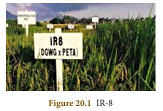
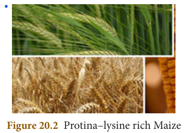
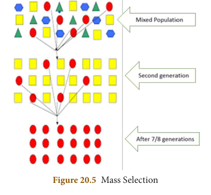
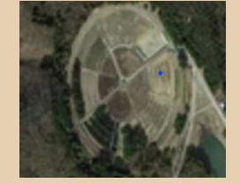

# UNIT 20:BREEDING AND BIOTECHNOLOGY

## Learning Objectives

At the end of this lesson the students will be able to:
- Define and discuss the steps and methods involved in plant breeding.
- Know the crop varieties produced by crop improvement.
- Understand animal breeding and its implications.
- Point out the differences between inbreeding and outbreeding.
- Know what is hybrid vigour and its importance.
- Identify the steps involved in genetic engineering.
- Understand the practical applications of DNA fingerprinting.
- Gain knowledge on gene therapy.
- Know the importance of stem cells.

## Introduction

India's population is likely to reach 1.7 billion by 2050. Current rate of India's food production will be able to meet only 59% of the country's food demand at that time. How can India feed 1.7 billion people by 2050? This can be made possible by 'Plant breeding' and 'Animal husbandry'.

**Plant breeding** is the art of developing economically important plants with superior quality.

**Animal husbandry** involves the breeding of animals. It aims at improving the genotypes of animals to make them more useful to the welfare of mankind. This emphasizes domestication and propagation of animals, under controlled conditions to enhance food production and food security.

Another breakthrough was the emergence of **biotechnology** as an entity of modern biology, which paved way to develop advanced healthcare products, diagnostic kits and food production to improve the quality of human life.

---

## 20.1 Modern Agricultural Practices and Crop Improvement

Modern agricultural practices are activities carried out to improve cultivation of plants. It includes preparation of soil, sowing, application of manures and fertilizers, proper irrigation, protection from weeds and pests harvesting, threshing and storage.

The aim of **crop improvement** is to develop improved crop varieties possessing higher yield, better quality, resistance to diseases and shorter duration.

### 20.2 Green Revolution

**Green Revolution** is the process of increasing food production through high yielding crop varieties and modern agricultural techniques in underdeveloped and developing nations. **Dr. Norman E. Borlaug**, an American agronomist the "Father of the Green Revolution", received the Nobel Peace Prize in 1970. In India **Dr. M.S. Swaminathan** joined with Dr. Borlaug in bringing Green Revolution by introducing Mexican wheat varieties. This eventually increased wheat and rice production between 1960 and 2000.

#### 20.2.1 Breeding for high yield and better quality

Major challenge that India faced during post-independence period was having enough food production for the growing population. Efforts were taken to develop high yielding varieties of crops, leading to Green Revolution.

**Semi-Dwarf varieties in Wheat and Rice:**
- **Sonalika, Kalyan Sona** are semi-dwarf varieties of wheat developed from high yielding, semi-dwarf, fertilizer responsive wheat varieties from Mexico.
- **IR-8 (Miracle rice)** is a high-yielding semi-dwarf rice variety developed by International Rice Research Institute (IRRI), Philippines. In 1966, this was first introduced in Philippines and India. It was a hybrid of a high yielding rice variety **Peta** from Indonesia, and **Dee-geo-woo-gen (DGWG)** a dwarf variety from China.



> **More to Know: Dr. M.S. Swaminathan**
> Dr. Mankombu Sambasivan Swaminathan is an Indian scientist known for his leading role in India's Green Revolution. His research on potato, wheat, rice and jute are well known plant breeding experiments. Due to his efforts the wheat production increased from twelve million tonnes in 1960's to seventy million tonnes now. He is aptly called as the "Father of Indian Green Revolution."

> **More to Know: Dr. G. Nammalvar**
> Dr. G. Nammalvar (1938-2013) was a Tamil agricultural scientist, environmental activist and organic farming expert. He founded Nammalvar Ecological Foundation for Farm Research and Global Food Security Trust (NEFFFRGFST Vanagam) to create public awareness about the benefits of organic farming.

#### 20.2.2 Plant Breeding for Disease Resistance

Plant diseases are caused by pathogens like viruses, bacteria and fungi. This affects crop yield. Hence, it is important to develop disease resistant varieties of crops, that would increase the yield and reduce the use of fungicides and bactericides.

**Table 20.1: Disease resistant crop varieties**

| Crop | Variety | Resistance to diseases |
|------|---------|------------------------|
| Wheat | Himgiri | Leaf and stripe rust, hill bunt |
| Cauliflower | Pusa Shubhra, Pusa Snowball K-1 | Black rot |
| Cowpea | Pusa Komal | Bacterial blight |

#### 20.2.3 Plant Breeding for Insects/Pests Resistance

In addition to microorganisms, a large number of insects and pests also cause damage to the crops. Hence, insect and pest resistant crop varieties were developed.

**Table 20.2: Insects/pests resistant varieties**

| Crop | Variety | Resistant to Insects/Pests |
|------|---------|---------------------------|
| Brassica | Pusa Gaurav | Aphids |
| Flat Bean | Pusa Sem 2, Pusa Sem 3 | Leaf hopper, aphids and fruit borer |
| Lady's finger | Pusa Sawani, Pusa A4 | Shoot and fruit borer |

#### 20.2.4 Plant Breeding for Improved Nutritional Quality

Undernutrition and protein malnutrition among human population is a major health problem which has been receiving much focus throughout the world. Apart from humans it also affects the health of farm animals. To combat these conditions, human and animal health are to be determined by the nutritional quality of the feed crops. The nutritional quality of crops depends on quality and quantity of nutrients. The nutritional quality may be improved with respect to its:
1. Protein content and quality of protein
2. Oil content
3. Mineral content

**Biofortification**

Biofortification is the scientific process of developing crop plants enriched with high levels of desirable nutrients like vitamins, proteins and minerals. Some examples of crop varieties developed as a result of biofortification are given below:

1. **Protina, Shakti and Rathna** are lysine rich maize hybrids (developed in India)



2. **Atlas 66**, a protein rich wheat variety


3. Iron rich fortified rice variety
4. Vitamin A enriched carrots, pumpkin and spinach

---

## 20.3 Methods of Plant Breeding for Crop Improvement

Methods of plant breeding to develop high yielding varieties are given below:
1. Introduction of new varieties of plants
2. Selection
3. Polyploidy breeding
4. Mutation breeding
5. Hybridization

### 20.3.1 Introduction of New Varieties of Plants

It is a process of introducing high yielding varieties of plants from one place to another. Such plants are called as **exotic species**. These imported plant materials may carry pathogens and pests, hence they are thoroughly tested in a plant quarantine before being introduced to the fields. e.g. *Phaseolus mungo* was introduced from China.

### 20.3.2 Selection

Selection is one of the oldest methods of plant breeding in which individual plants or groups of plants are sorted out from a mixed population based on the morphological characters.

#### Methods of selection

There are three methods of selection:
1. **Mass selection**
2. **Pureline selection**
3. **Clonal selection**

**1. Mass Selection**

Seeds of best plants showing desired characters are collected from a mixed population. The collected seeds are allowed to raise the second generation. This process is carried out for seven or eight generations. At the end, they will be multiplied and distributed to the farmers for cultivation.

Some common examples for mass selection are groundnut varieties like **TMV-2** and **AK-10**.



**2. Pureline Selection**

Pureline is "the progeny of a single individual obtained by self breeding". This is also called as individual plant selection. In pureline selection large numbers of plants are selected from a self-pollinated crop and harvested separately. Individual plant progenies from them are evaluated separately. The best one is released as a pureline variety. Progeny is similar both genotypically and phenotypically.

**3. Clonal Selection**

A group of plants produced from a single plant through vegetative or asexual reproduction are called **clones**. All the plants of a clone are similar both in genotype and phenotype. Selection of desirable clones from the mixed population of vegetatively propagated crop is called clonal selection.

### 20.3.3 Polyploidy Breeding

Sexually reproducing organisms have two complete set of chromosomes in their somatic cells. This is called **diploid (2n)**. The gametic cells have only one set of chromosome. This is called **haploid (n)**. An organism having more than two sets of chromosomes is called **polyploid** (Greek: Polys = many + aploos = one fold + eidos = form). Such condition is called **Polyploidy**. It can be induced by physical agents such as heat or cold treatment, X-rays and chemical agents like colchicine.

#### Achievements of polyploidy breeding

Some achievements of polyploidy breeding are:
- Seedless watermelons (3n) and bananas (3n)
- TV-29 (triploid variety of tea) with larger shoots and drought tolerance
- **Triticale (6n)** is a hybrid of wheat and rye. To make this plant fertile polyploidy is induced. It has higher dietary fibre and protein.
- **Raphano brassica** is an allotetraploid by colchicine treatment

### 20.3.4 Mutation Breeding

**Mutation** is defined as the sudden heritable change in the nucleotide sequence of DNA in an organism. It is a process by which genetic variations are created which in turn brings about changes in the organism. The organism which undergoes mutation is called a **mutant**.

The factors which induce mutations are known as **mutagens** or mutagenic agents. Mutagens are of two types:
- **Physical mutagens**
- **Chemical mutagens**

> **More to Know: Gamma Garden**
> Gamma garden or Atomic garden is a concept popularised after World War II for the peaceful use of atomic energy for crop improvement. This is a type of induced mutation breeding where radioactive sources particularly gamma rays from Cobalt-60 or Caesium-137 are used to induce desirable mutations in crop plants.



**i. Physical mutagens:** Radiations like X-rays, α, β and γ-rays, UV rays, temperature etc. which induce mutations are called physical mutagens.

**ii. Chemical mutagens:** Chemical substances that induce mutations are called chemical mutagens. e.g. Mustard gas and nitrous acid.

The utilisation of induced mutation in crop improvement is called **mutation breeding**.

#### Achievements of mutation breeding

Some achievements of mutation breeding are:
- **Sharbati Sonora** wheat produced from Sonora-64 by using gamma rays
- **Atomita 2** rice with saline tolerance and pest resistance
- Groundnuts with thick shells

### 20.3.5 Hybridization

**Hybridization** may be defined as the process of crossing two or more types of plants for bringing their desired characters together into one progeny called **hybrid**. Hybrid is superior in one or more characters to both parents. Hybridization is the common method of creating genetic variation to get improved varieties.

#### Hybridization Experiment: Triticale (The first man-made cereal)

Triticale is the first manmade cereal hybrid. It is obtained by crossing wheat (*Triticum durum*, 2n = 28) and rye (*Secale cereal*, 2n = 14). The F1 hybrid is sterile (2n = 21). Then the chromosome number is doubled using colchicine and it becomes a hexaploid Triticale (2n = 42).

The cycle of crop raising and selection continues till the plants with the desired characters are finally obtained. The development of new varieties is a long-drawn process. Two main aspects of hybridization are to combine the characters of two plants in one plant and to utilize hybrid vigour.

---

## 20.4 Animal Breeding

A **breed** is a group of animals of common origin within a species that has certain distinguishing characters that are not found in other members of the same species like general appearance and others striking features.

Breeding involves mating parents of different varieties each having some desired trait which are passed onto the offspring.

### Objectives of Animal Breeding

Animal breeding aims at improving the genotypes of domesticated animals to increase their yield and improve the desirable qualities to produce milk, egg and meat.

When breeding takes place between animals of the same breed, it is called **inbreeding**. The cross between different breeds is called **outbreeding**.

### 20.4.1 Inbreeding

Inbreeding refers to the mating of closely related animals within the same breed for about 4-6 generations. Superior males and superior females of the same breed are identified and mated in pairs. It helps in the accumulation of superior genes and elimination of genes which are undesirable.

**Hissardale** is a new breed of sheep developed in Punjab by crossing Bikaneri (Magra) ewes and Australian Marino rams.

**Inbreeding depression:** Continued inbreeding reduces fertility and productivity. Inbreeding exposes harmful recessive genes that are eliminated by selection.

### 20.4.2 Outbreeding

It is the breeding of unrelated animals. The offsprings formed are called **hybrids**. The hybrids are stronger and vigorous than their parents. Cross between two different species with desirable features of economic value are mated.

**Example: Mule**
- Cross between Male Donkey × Female Horse = Mule
- Mule is superior to horse in strength, intelligence, ability to work and resistance to diseases but they are sterile.


**Info bits: Cross breed of fowls:**
- White Leghorn × Plymouth Rock = Hybrid fowl - yield more eggs

**Cross breed of cows:**
- Developed by mating the bulls of exotic breeds and cows of indigenous breeds.
- Brown Swiss × Sahiwal = Karan Swiss - yield 2-3 times more milk than indigenous cows.

### 20.4.3 Heterosis

The superiority of the hybrid obtained by cross breeding is called as **heterosis** or **hybrid vigour**.

#### Effects of hybrid vigour in animal breeding
- Increased production of milk by cattle
- Increased production of egg by poultry
- High quality of meat is produced
- Increased growth rate in domesticated animals

---

## 20.5 Genetic Engineering

**Genetic engineering** is the manipulation and transfer of genes from one organism to another organism to create a new DNA called as **recombinant DNA (rDNA)**.

The term recombinant is used because DNA from two different sources can be joined together. Hence, genetic engineering is also called as **recombinant DNA technology**.

**Plasmid** is the small circular double stranded DNA molecule found in the cytoplasm of bacterial cell and separated from chromosomal DNA. It can replicate independently.

> **DO YOU KNOW?**
> Restriction enzymes recognises a specific base pair sequence (palindromic sequence) in DNA called as restriction site and cleaves the phosphodiester bond within the DNA.

### 20.5.1 Techniques of Genetic Engineering – Basic Requirements

Important discoveries that led to the stepping stone of rDNA technology were:
- Presence of plasmid in bacteria that can undergo replication independently along with chromosomal DNA.
- **Restriction enzymes** cuts or break DNA at specific sites and are also called as **molecular scissors**.
- **DNA ligases** are the enzymes which help in ligating (joining) the broken DNA fragments.

### 20.5.2 Gene Cloning

What reminds to your mind when you hear the word clone? Of course, 'DOLLY' the cloned sheep. The carbon copy of an individual is often called a clone. However, more appropriately, a clone means to make a genetically exact copy of an organism.

In **gene cloning**, a gene or a piece of DNA fragment is inserted into a bacterial cell where DNA will be multiplied (copied) as the cell divides.

**Basic steps involved in gene cloning:**
1. Isolation of desired DNA fragment by using restriction enzymes
2. Insertion of the DNA fragment into a suitable vector (Plasmid) to make rDNA
3. Transfer of rDNA into bacterial host cell (Transformation)
4. Selection and multiplication of recombinant host cell to get a clone
5. Expression of cloned gene in host cell

Using this strategy several enzymes, hormones and vaccines can be produced commercially.


> **Info bits: Development of Dolly**
> Dolly was the first cloned female sheep, developed by Dr. Ian Wilmut and his colleagues at the Roslin Institute, Scotland in July 1996. She was created by somatic cell nuclear transfer technique. She lived for 6.5 years and died in 2003 because of lung disease.


---

## 20.6 Biotechnology in Medicine

Using genetic engineering techniques medicinally important valuable proteins or polypeptides that form the potential pharmaceutical products for treatment of various diseases have been developed on a commercial scale.

### Pharmaceutical products developed by rDNA technique
- **Insulin** used in the treatment of diabetes.
- **Human growth hormone** used for treating children with growth deficiencies.
- **Blood clotting factors** are developed to treat haemophilia.
- **Tissue plasminogen activator** is used to dissolve blood clots and prevent heart attack.
- Development of **vaccines** against various diseases like Hepatitis B and rabies.

> Eli Lilly and Company, United States, in 1979 first started commercial production of human insulin by using rDNA technology.

### Gene Therapy

**Gene therapy** refers to the replacement of defective gene by the direct transfer of functional genes into humans to treat genetic disease or disorder. The genetic makeup of the 'patient' cell is altered using recombinant DNA technology. It was first successfully implemented in 1990.

- **Somatic gene therapy** is the replacement of defective gene in somatic cells.
- **Germ line gene therapy** replacement of defective gene in germ cell (egg and sperm).

Gene therapy conducted till date has targeted only somatic (non-reproductive) cells. Correction of genetic defects in somatic cells may be beneficial to the patient but the corrected gene may not be carried to the next generation.

---

## 20.7 Stem Cells

Our body is composed of over 200 specialised cell types, that can carry out specific functions. e.g. neurons or nerve cell that can transmit signals, or heart cells which contract to pump blood or pancreatic cells to secrete insulin. These specialised cells are called as **differentiated cells**.

In contrast to differentiated cells, **stem cells** are undifferentiated or unspecialised mass of cells. The stem cells are the cells of variable potency. **Potency** refers to the number of possible fates that a cell can acquire.

The two important properties of stem cells that differentiate them from other cells are:
1. Its ability to divide and give rise to more stem cells by **self-renewal**
2. Its ability to give rise to specialised cells with specific functions by the process of **differentiation**

### Types of stem cells

**Embryonic stem cells** can be extracted and cultured from the early embryos. These cells are derived from the inner cell mass of blastocyst. These cells can be developed into any cell in the body.

**Adult stem cell** or **somatic stem cell** are found in the neonatal (new born) and adults. They have the ability to divide and give rise to specific cell types. Sources of adult stem cells are amniotic fluid, umbilical cord and bone marrow.


### Stem-cell therapy

Sometimes cells, tissues and organs in the body may be permanently damaged or lost due to genetic condition or disease or injury. In such situations stem cells are used for the treatment of diseases which is called **stem-cell therapy**. In treating neurodegenerative disorders like Parkinson's disease and Alzheimer's disease neuronal stem cells can be used to replace the damaged or lost neurons.

---

## 20.8 DNA Fingerprinting Technology

The human genome has 3 billion base pairs. The DNA pattern of two individuals cannot be same except for identical twins. Each person's DNA sequence is unique due to the small difference in the base pairs. Therefore, if we want to compare the genetic difference among the two individuals, **DNA fingerprinting** is the easier and quicker method. This technique was developed by **Alec Jeffreys** in 1985.

The technique analyses each individual's unique DNA sequences and provides distinctive characteristics of individual which helps in identification. **Variable number of tandem repeat sequences (VNTRs)** serve as molecular markers for identification.

In human beings, 99% of the DNA base sequences are the same and this is called as **bulk genomic DNA**. The remaining 1% DNA sequence differs from one individual to another. This 1% DNA sequence is present as small stretch of repeated sequences which is known as **satellite DNA**. The number of copies of the repeat sequence also called as VNTRs differs from one individual to another, and results in variation in the size of the DNA fragment.


### Applications of DNA Fingerprinting
1. DNA fingerprinting technique is widely used in forensic applications like crime investigation such as identifying the culprit. It is also used for paternity testing in case of disputes.
2. It also helps in the study of genetic diversity of population, evolution and migration of population.

---

## 20.9 Genetically Modified Organisms (GMOs)

One of the most tremendous development of genetic engineering is the production of genetically modified (GM) plants and animals. **Genetic modification** refers to the alteration or manipulation of genes in the organisms using rDNA techniques in order to produce the desired characteristics. The DNA fragment inserted is called **transgene**. Plants or animals expressing a modified endogenous gene or a foreign gene are also known as **transgenic organisms**.

The transgenic plants are much stable, with improved nutritional quality, resistant to diseases and tolerant to various environment conditions. Similarly transgenic animals are used to produce proteins of medicinal importance at low cost and improve livestock production.

### Some examples of genetically modified plants and animals:

**Genetically Modified Plants**

| Objective | Gene inserted | Achievement |
|-----------|--------------|-------------|
| Improved nutritional quality in Rice | Beta carotene gene (In humans, Beta carotene is required for the synthesis of Vitamin A) | Golden Rice (Genetically modified rice can produce beta carotene, that can prevent Vitamin A deficiency) |
| Increased crop production | Bt gene from bacteria *Bacillus thuringiensis* (Bt gene produces a protein that is toxic to insects) | Insect resistant plants (These plants can produce the toxin protein that kills the insects which attack them) |

**Genetically Modified Animals**

| Objective | Gene inserted | Achievement |
|-----------|--------------|-------------|
| Improved wool quality and production | Genes for synthesis of amino acid, cysteine | Transgenic sheep (gene expressed) |
| Increased growth in fishes | Salmon or Rainbow trout or Tilapia growth hormone gene | Transgenic fish (gene expressed) |

---

## Points to Remember

- Crop improvement is the development of improved crop varieties possessing higher yield, better quality, resistance to diseases and shorter duration.
- When breeding takes place between animals of the same breed, it is called **inbreeding**. The cross between different breeds is called **outbreeding**.
- The superiority of the hybrid obtained by cross breeding is called as **heterosis** or **hybrid vigour**.
- **Genetic engineering** is the manipulation and transfer of genes from one organism to another organism.
- **Stem cells** are undifferentiated or unspecialised mass of cells and can be used for the treatment known as stem cell therapy.

---

## TEXTBOOK EVALUATION

### I. Choose the correct answer

1. Which method of crop improvement can be practised by a farmer if he is inexperienced?
   - a. clonal selection
   - b. mass selection
   - c. pureline selection
   - d. hybridisation

2. Pusa Komal is a disease resistant variety of
   - a. sugarcane
   - b. rice
   - c. cow pea
   - d. maize

3. Himgiri developed by hybridisation and selection for disease resistance against rust pathogens is a variety of
   - a. chilli
   - b. maize
   - c. sugarcane
   - d. wheat

4. The miracle rice which saved millions of lives and celebrated its 50th birthday is _______
   - a. IR 8
   - b. IR 24
   - c. Atomita 2
   - d. Ponni

5. Which of the following is used to produce products useful to humans by biotechnology techniques?
   - a. enzyme from organism
   - b. live organism
   - c. vitamins
   - d. both (a) and (b)

6. We can cut the DNA with the help of
   - a. scissors
   - b. restriction endonucleases
   - c. knife
   - d. RNAase

7. rDNA is a
   - a. vector DNA
   - b. circular DNA
   - c. recombinant of vector DNA and desired DNA
   - d. satellite DNA

8. DNA fingerprinting is based on the principle of identifying _______ sequences of DNA
   - a. single stranded
   - b. mutated
   - c. polymorphic
   - d. repetitive

9. Organisms with modified endogenous gene or a foreign gene are also known as
   - a. transgenic organisms
   - b. genetically modified
   - c. mutated
   - d. both a and b

10. In a hexaploid wheat (2n = 6x = 42) the haploid (n) and the basic (x) number of chromosomes respectively are
    - a. n = 7 and x = 21
    - b. n = 21 and x = 21
    - c. n = 7 and x = 7
    - d. n = 21 and x = 7

### II. Fill in the blanks

1. Economically important crop plants with superior quality are raised by _________.
2. A protein rich wheat variety is ________.
3. ________ is the chemical used for doubling the chromosomes.
4. The scientific process which produces crop plants enriched with desirable nutrients is called ________.
5. Rice normally grows well in alluvial soil, but ________ is a rice variety produced by mutation breeding that grows well in saline soil.
6. ________ technique made it possible to genetically engineer living organism.
7. Restriction endonucleases cut the DNA molecule at specific positions known as ________.
8. Similar DNA fingerprinting is obtained for ________.
9. ________ cells are undifferentiated mass of cells.
10. In gene cloning the DNA of interest is integrated in a ________.

### III. State whether true or false. If false, write the correct statement

1. Raphano brassica is a man-made tetraploid produced by colchicine treatment.
2. The process of producing an organism with more than two sets of chromosome is called mutation.
3. A group of plants produced from a single plant through vegetative or asexual reproduction are called a pureline.
4. Iron fortified rice variety determines the protein quality of the cultivated plant.
5. Golden rice is a hybrid.
6. Bt gene from bacteria can kill insects.
7. In vitro fertilisation means the fertilisation done inside the body.
8. DNA fingerprinting technique was developed by Alec Jeffrey.
9. Molecular scissors refers to DNA ligases.

### IV. Match the following

| Column A | Column B |
|----------|----------|
| 1. Sonalika | Phaseolus mungo |
| 2. IR 8 | Sugarcane |
| 3. Saccharum | Semi-dwarf wheat |
| 4. Mung No. 1 | Ground nut |
| 5. TMV – 2 | Semi-dwarf Rice |
| 6. Insulin | Bacillus thuringiensis |
| 7. Bt toxin | Beta carotene |
| 8. Golden rice | first hormone produced using rDNA technique |

### V. Understand the assertion statement, justify the reason given and choose the correct choice

a. Assertion is correct and reason is wrong
b. Reason is correct and the assertion is wrong
c. Both assertion and reason is correct
d. Both assertion and reason is wrong.

1. **Assertion:** Hybrid is superior than either of its parents.
   **Reason:** Hybrid vigour is lost upon inbreeding.

2. **Assertion:** Colchicine reduces the chromosome number.
   **Reason:** It promotes the movement of sister chromatids to the opposite poles.

3. **Assertion:** rDNA is superior over hybridisation techniques.
   **Reason:** Desired genes are inserted without introducing the undesirable genes in target organism.

### VI. Answer in a sentence

1. Give the name of wheat variety having higher dietary fibre and protein.
2. Semi-dwarf varieties were introduced in rice. This was made possible by the presence of dwarfing gene in rice. Name this dwarfing gene.
3. Define genetic engineering.
4. Name the types of stem cells.
5. What are transgenic organisms?
6. State the importance of biofortification.

### VII. Short answers questions

1. Discuss the method of breeding for disease resistance.
2. Name three improved characteristics of wheat that helped India to achieve high productivity.
3. Name two maize hybrids rich in amino acid lysine.
4. Distinguish between:
   - a. somatic gene therapy and germ line gene therapy
   - b. undifferentiated cells and differentiated cells
5. State the applications of DNA fingerprinting technique.
6. How are stem cells useful in regenerative process?
7. Differentiate between outbreeding and inbreeding.

### VIII. Long answers questions

1. What are the effects of hybrid vigour in animals?
2. Describe mutation breeding with an example.
3. Biofortification may help in removing hidden hunger. How?
4. With a neat labelled diagram explain the techniques involved in gene cloning.
5. Discuss the importance of biotechnology in the field of medicine.

### IX. Higher Order Thinking Skills (HOTS)

1. A breeder wishes to incorporate desirable characters into the crop plants. Prepare a list of characters he will incorporate.
2. Organic farming is better than Green Revolution. Give reasons.
3. Polyploids are characterised by gigantism. Justify your answer.
4. 'P' is a gene required for the synthesis of vitamin A. It is integrated with genome of 'Q' to produce genetically modified plant 'R'.
   - i. What is P, Q and R?
   - ii. State the importance of 'R' in human diet.

---

## REFERENCE BOOKS

1. Chaudhari, H.K., Elementary Principles of Plant Breeding, 2nd Edition.
2. Dubey, R.C., A Text book of Biotechnology. 5th Edition. S. Chand and Company

## INTERNET RESOURCES

- https://www.embibe.com/study/transgenic-cow-rosie-concept
- https://en.wikipedia.org/wiki/DNA_profiling
- https://www.krishijagran.com/news/tomato-at-shoots-potato-in-roots
```
