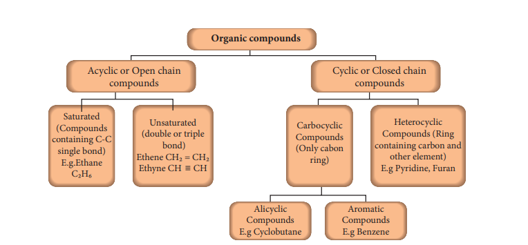
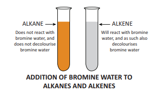
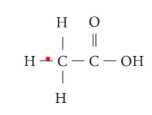
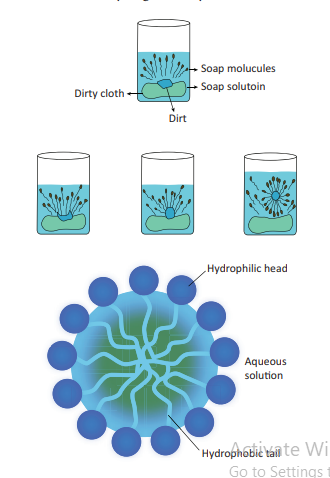

---
title: 'CARBON AND ITS COMPOUND'
weight: 11
---

# UNIT 11:CARBON AND ITS COMPOUNDS

## Learning Objectives
After studying this lesson, the student will be able to:
- Know the importance of organic compounds.
- Classify the organic compounds and name them based on IUPAC rules.
- Identify the functional groups of organic compounds.
- Explain the preparation, properties and uses of ethanol and ethanoic acids.
- Know the composition and preparation of soap and detergent.
- Understand the cleansing action of soap and detergents.
- Differentiate soap and detergents.

---

## INTRODUCTION
You have studied, in your lower classes, that carbon is an inseparable element in human life as we use innumerable number of carbon compounds in our day to day life. Because, the food we eat, medicines we take when ill, clothes we wear; domestic and automobile fuels, paint, cosmetics, automobile parts, etc., that we use contain carbon compounds. The number of carbon compounds found in nature and man-made, is much higher than that of any other element in the periodic table. In fact there are more than 5 million compounds of carbon. The unique nature of carbon, such as catenation, tetravalency and multiple bonding, enables it to combine with itself or other elements like hydrogen, oxygen, nitrogen, sulphur etc., and hence form large number of compounds. All these compounds are made of covalent bonds. These compounds are called organic compounds. In this lesson, you will learn about carbon and its compounds.

---

## 11.1 GENERAL CHARACTERISTICS OF ORGANIC COMPOUNDS
Everything in this world has unique character, similarly organic compounds are unique in their characteristics. Some of them are given below:
- Organic compounds have a high molecular weight and a complex structure.
- They are mostly insoluble in water, but soluble in organic solvents such as ether, carbon tetrachloride, toluene, etc.
- They are highly inflammable in nature
- Organic compounds are less reactive compared to inorganic compounds. Hence, the reactions involving organic compounds proceed at slower rates.
- Mostly organic compounds form covalent bonds in molecules.
- They have lower melting point and boiling point when compared to inorganic compounds
- They exhibit the phenomenon of isomerism, in which a single molecular formula represents several organic compounds that differ in their physical and chemical properties
- They are volatile in nature.
- Organic compounds can be prepared in the laboratory

---

## 11.2 CLASSIFICATION OF ORGANIC COMPOUNDS BASED ON THE PATTERN OF CARBON CHAIN

What is the significance of classification? There are millions of organic compounds known and many new organic compounds are discovered every year in nature or synthesized in laboratory. This may mystify organic chemistry to a large extent. However, a unique molecular structure can be assigned to each compound and it can be listed by using systematic methods of classification and eventually named on the basis of its structural arrangements. In early days, chemists recognised that compounds having similar structural features have identical chemical properties. So they began to classify compounds based on the common structural arrangements found among them.

Organic chemistry is the chemistry of catenated carbon compounds. The carbon atoms present in organic compounds are linked with each other through covalent bonds and thus exist as chains. By this way, organic compounds are classified into two types as follows:

### 1. Acyclic or Open chain compounds:
These are the compounds in which the carbon atoms are linked in a linear pattern to form the chain. If all the carbon atoms in the chain are connected by single bonds, the compound is called as saturated. If one or more double bonds or triple bonds exist between the carbon atoms, then the compound is said to be unsaturated.

- **CH₃-CH₂-CH₃** (Propane) - Saturated compound
- **CH₃-CH=CH₂** (Propene) - Unsaturated compound

### 2. Cyclic Compounds:
Organic compounds in which the chain of carbon atoms is closed or cyclic are called cyclic compounds. If the chain contains only carbon atoms, such compounds are called carbocyclic (Homocyclic) compounds. If the chain contains carbon and other atoms like oxygen, nitrogen, sulphur, etc., these compounds are called heterocyclic compounds. Carbocyclic compounds are further subdivided into alicyclic and aromatic compounds. Alicyclic compounds contain one or more carbocyclic rings which may be saturated or unsaturated whereas aromatic compounds contain one or more benzene rings (ring containing alternate double bonds between carbon atoms).


**Figure 11.1** depicts the classification of organic compounds based on the pattern of carbon arrangements and their bonding in organic compounds.





---

## 11.3 CLASSES OF ORGANIC COMPOUNDS (BASED ON THE KIND OF ATOMS)

Other than carbon, organic compounds contain atoms like hydrogen, oxygen, nitrogen, etc., bonded to the carbon. Combination of these kinds of atoms with carbon gives different classes of organic compounds. In the following section, let us discuss various classes of organic compounds.

### 11.3.1 Hydrocarbons
The organic compounds that are composed of only carbon and hydrogen atoms are called hydrocarbons. The carbon atoms join together to form the framework of the compounds. These are regarded as the parent organic compounds and all other compounds are considered to be derived from hydrocarbons by replacing one or more hydrogen atoms with other atoms or group of atoms. Hydrocarbons are, further, sub divided into three classes such as:

**(a) Alkanes:** These are hydrocarbons, which contain only single bonds. They are represented by the general formula **CₙH₂ₙ₊₂** (where n = 1, 2, 3, ...). The simplest alkane (for n=1) is methane (CH₄). Since, all are single bonds in alkanes, they are saturated compounds.

**(b) Alkenes:** The hydrocarbons, which contain one or more C=C bonds are called alkenes. These are unsaturated compounds. They are represented by the general formula CₙH₂ₙ. The simplest alkene contains two carbon atoms (n=2) and is called ethylene (C₂H₄).

**(c) Alkynes:** The hydrocarbons containing carbon to carbon triple bond are called alkynes. They are also unsaturated as they contain triple bond between carbon atoms. They have the general formula CₙH₂ₙ₋₂. Acetylene (C₂H₂) is the simplest alkyne, which contains two carbon atoms.

**Table 11.1** lists the first five hydrocarbons of each class:

| No. of carbon atoms | Alkane (CₙH₂ₙ₊₂) | Alkene (CₙH₂ₙ) | Alkyne (CₙH₂ₙ₋₂) |
|:---|:---|:---|:---|
| 1 | Methane (CH₄) | - | - |
| 2 | Ethane (C₂H₆) | Ethene (C₂H₄) | Ethyne (C₂H₂) |
| 3 | Propane (C₃H₈) | Propene (C₃H₆) | Propyne (C₃H₄) |
| 4 | Butane (C₄H₁₀) | Butene (C₄H₈) | Butyne (C₄H₆) |
| 5 | Pentane (C₅H₁₂) | Pentene (C₅H₁₀) | Pentyne (C₅H₈) |

---

### 11.3.2 Characteristics of hydrocarbons:
- Lower hydrocarbons are gases at room temperature E.g. methane, ethane are gases.
- They are colourless and odourless.
- The boiling point of hydrocarbons increases with an increase in the number of carbon atoms.
- They undergo combustion reaction with oxygen to form CO₂ and water.
- Alkanes are least reactive when compared to other classes of hydrocarbons.
- Alkynes are the most reactive due to the presence of the triple bond.
- Alkanes are saturated whereas alkenes and alkynes are unsaturated.
- They are insoluble in water.

**Test to identify saturated and unsaturated compounds:**
- Take the given sample solution in a test tube.
- Add a few drops of bromine water and observe any characteristic change in colour.
- If the given compound is unsaturated, it will decolourise bromine water.
- Saturated compounds do not decolourise bromine.



**Figure 11.2** Test to identify unsaturated compounds

---

### 11.3.3 Classification of organic compounds based on functional groups
The structural frameworks of organic compounds are made of carbon and hydrogen, which are relatively less reactive. But, the presence of some other atoms or group of atoms makes the compounds more reactive and thus determines the chemical properties of the compound. These groups are called functional groups.

**A functional group is an atom or group of atoms in a molecule, which gives its characteristic chemical properties.**

The chemical properties of an organic compound depend on its functional group whereas its physical properties rely on remaining part of the structure. Carbon to carbon multiple bonds (C=C, C≡C) also are considered as functional groups as many of the properties are influenced by these bonds. Other functional groups include, –OH, –CHO, –COOH, etc.

For example, ethane is a hydrocarbon having molecular formula C₂H₆. If one of its hydrogen is replaced by –OH group, you will get an alcohol. Leaving the functional group, the rest of the structure is represented by 'R'. Thus an alcohol is represented by 'R-OH'.


A series of compounds containing the same functional group is called a class of organic compounds. **Table 11.2** shows various classes or families of organic compounds and their functional groups:

Table 11.2 Classes of organic compounds based on functional group

| Class of the compound | Functional group | Common Formula | Examples |
|:---|:---|:---|:---|
| Alcohol | –OH | R-OH | Ethanol, CH₃CH₂OH |
| Aldehyde | −CHO (O=C-H) | R-CHO | Acetaldehyde, CH₃CHO |
| Ketone | >C=O | R–CO-R | Acetone, CH₃COCH₃ |
| Carboxylic acid | –COOH | R-COOH | Acetic acid, CH₃COOH |
| Ester | –COOR | R-COOR | Methyl acetate, CH₃COOCH₃ |
| Ether | –O–R | R-O-R | Dimethyl ether, CH₃OCH₃ |

---

## 11.4 HOMOLOGOUS SERIES
Homologous series is a group or a class of organic compounds having same general formula and similar chemical properties in which the successive members differ by a -CH₂ group.

Let us consider members of alkanes given in Table 11.1. Their condensed structural formulas are given below:
- Methane - CH₄
- Ethane - CH₃CH₃
- Propane - CH₃CH₂CH₃
- Butane - CH₃(CH₂)₂CH₃
- Pentane - CH₃(CH₂)₃CH₃

If you observe the above series, you can notice that each successive member has one methylene group more than the precedent member of the series and hence they are called homologs.

### 11.4.1 Characteristics of homologous series
- Each member of the series differs from the preceding or succeeding member by one methylene group (–CH₂) and hence by a molecular mass of 14 amu.
- All members of a homologous series contain the same elements and functional group.
- They are represented by a general molecular formula. e.g. Alkanes, CₙH₂ₙ₊₂.
- The members in each homologous series show a regular gradation in their physical properties with respect to their increase in molecular mass.
- Chemical properties of the members of a homologous series are similar.
- All the members can be prepared by a common method.

---

## 11.5 NOMENCLATURE OF ORGANIC COMPOUNDS

### 11.5.1 Why do we need nomenclature?
In ancient days, the names of organic compounds were related to the natural things from which they were obtained. For example, the formic acid was initially obtained by distillation of 'red ants'. Latin name of the red ant is 'Formica'. So, the name of the formic acid was derived from the Latin name of its source. Later, the organic compounds were synthesized from sources other than the natural sources. So scientists framed a systematic method for naming the organic compounds based on their structures. Hence, a set of rules was formulated by IUPAC (International Union of Pure and Applied Chemistry) for the nomenclature of chemical compounds.

### 11.5.2 Components of an IUPAC name
The IUPAC name of the any organic compound consists of three parts:

i. Root word

ii. Prefix

iii. Suffix

These parts are combined as per the following sequence to get the IUPAC name of the compound:


**Prefix + Root Word + Suffix → IUPAC Name**


**(i) Root word:** It is the basic unit, which describes the carbon skeleton. It gives the number of carbon atoms present in the parent chain of the compound and the pattern of their arrangement. Based on the number of carbon atoms present in the carbon skeleton, most of the names are derived from Greek numerals (except the first four). **Table 11.3** shows the root words for the parent chain of hydrocarbons containing 1 to 10 carbon atoms:


Table 11.3  Root words of hydrocarbons


| No. of carbon atoms | Root word |
|:---|:---|
| 1 | Meth- |
| 2 | Eth- |
| 3 | Prop- |
| 4 | But- |
| 5 | Pent- |
| 6 | Hex- |
| 7 | Hept- |
| 8 | Oct- |
| 9 | Non- |
| 10 | Dec- |

**(ii) Prefix:** The prefix represents the substituents or branch present in the parent chain. Atoms or group of atoms, other than hydrogen, attached to carbon of the parent chain are called substituents. **Table 11.4** presents the major substituents of organic compounds and respective prefix used for them:


Table 11.4 Prefix for IUPAC Name


| Substituent | Prefix used |
|:---|:---|
| -F | Fluoro |
| -Cl | Chloro |
| -Br | Bromo |
| -I | Iodo |
| -NH₂ | Amino |
| -CH₃ | Methyl |
| -CH₂CH₃ | Ethyl |

**(iii) Suffix:** The suffix forms the end of the name. It is divided into two parts such as (a) Primary suffix and (b) Secondary suffix. The primary suffix comes after the root word. It represents the nature in carbon to carbon bonding of the parent chain. If all the bonds between the carbon atoms of the parent chain are single, then suffix 'ane' has to be used. Suffix 'ene' and 'yne' are used for the compounds containing double and triple bonds respectively. The secondary suffix describes the functional group of the compound.

**Table 11.5** Suffix for IUPAC Name

| Class of the Compound | Functional group | Suffix used |
|:---|:---|:---|
| Alcohol | –OH | -ol |
| Aldehyde | –CHO | -al |
| Ketone | >C=O | -one |
| Carboxylic acid | –COOH | -oic acid |

---

### 11.5.3 IUPAC rules for naming organic compounds:

**Rule 1:** Identify the longest chain of carbon atoms to get the parent name (root word).

**Rule 2:** Number the carbon atoms of the parent chain, beginning at the closest end of the substituent or functional group. These are called locant numbers. If both functional group and substituent are present, then the priority will be given to the functional group.

**Rule 3:** In case of alkenes and alkynes, locate the double bond or triple bond and use its locant number followed by a dash and a primary suffix. The carbon chain is numbered in such a way that the multiple bonds have the lowest possible locant number.

**Rule 4:** If the compound contains functional group, locate it and use its locant number followed by a dash and a secondary suffix.

**Rule 5:** When the primary and secondary suffixes are joined, the terminal 'e' of the primary suffix is removed.

**Rule 6:** Identify the substituent and use a number followed by a dash and a prefix to specify its location and identity.

---

### 11.5.4 IUPAC Nomenclature of hydrocarbons – Solved examples

Let us try to name, systematically, some of the linear and substituted hydrocarbons by following IUPAC rules:

**Example 1:** CH₃-CH₂-CH₂-CH₂-CH₃

- **Step 1:** It is a five carbon chain and hence the root word is 'Pent'. (Rule 1)
- **Step 2:** All the bonds between carbon atoms are single bonds, and thus the suffix is 'ane'.
- So, its name is Pent + ane = **Pentane**

**Example 2:**
```
    CH₃
    |
CH₃-CH-CH₂-CH₂-CH₃
```

- **Step 1:** The longest chain contains five carbon atoms and hence the root word is 'Pent'.
- **Step 2:** There is a substituent. So, the carbon chain is numbered from the left end, which is closest to the substituent. (Rule 2)
- **Step 3:** All are single bonds between the carbon atoms and thus the suffix is 'ane'.
- **Step 4:** The substituent is a methyl group and it is located at second carbon atom. So, its locant number is 2. Thus the prefix is '2-Methyl'. (Rule 6).
- The name of the compound is 2-Methyl + pent + ane = **2-Methylpentane**

**Example 3:**
```
CH₃-CH-CH₂-CH₂-CH₂-CH₃
      |
      CH₂
      |
      CH₃
```

- **Step 1:** The longest chain contains seven carbon atoms and hence the root word is 'Hept'.
- **Step 2:** There is a substituent. So, the carbon chain is numbered from the end, which is closest to substituent. (Rule 2)
- **Step 3:** All are single bonds between the carbon atoms and thus the suffix is 'ane'.
- **Step 4:** The substituent is a methyl group and it is located at third carbon. So, its locant number is 3. Thus the prefix is '3-Methyl'. (Rule 6)
- Hence the name of the compound is 3-Methyl + hept + ane = **3-Methylheptane**

**Example 4:** CH₃-CH₂-CH₂-CH=CH₂

- **Step 1:** It is a 'five carbon atoms chain' and hence the root word is 'Pent'. (Rule 1)
- **Step 2:** There is a carbon to carbon double bond. The suffix is 'ene'.
- **Step 3:** The carbon chain is numbered from the end such that double bond has the lowest locant number as shown below: (Rule 3):


- **Step 4:** The locant number of the double bond is 1 and thus the suffix is '-1-ene'.
- So, the name of the compound is Pent + (-1-ene) = **Pent-1-ene**

---

### 11.5.5 IUPAC Nomenclature of other classes – Solved examples

**Example 1:** CH₃-CH₂-CH₂-OH

- **Step 1:** The parent chain consists of 3 carbon atoms. The root word is 'Prop'.
- **Step 2:** There are single bonds between the carbon atoms of the chain. So, the primary suffix is 'ane'.
- **Step 3:** Since, the compound contains –OH group, it is an alcohol. The carbon chain is numbered from the end which is closest to –OH group. (Rule 3)


- **Step 4:** The locant number of –OH group is 1 and thus the secondary suffix is '1-ol'.
- The name of the compound is Prop + ane + (1-ol) = **Propan-1-ol**
- Note: Terminal 'e' of 'ane' is removed as per Rule 5

**Example 2:** CH₃COOH

- **Step 1:** The parent chain consists of 2 carbon atoms. The root word is 'Eth'.
- **Step 2:** All are single bonds between the carbon atoms of the chain. So the primary suffix is 'ane'.
- **Step 3:** Since the compound contains the –COOH group, it is a carboxylic acid. The secondary suffix is 'oic acid'
- The name of the compound is Eth + ane + oic acid = **Ethanoic acid**

**Table 11.6** lists IUPAC names homologs of various classes of organic compounds

| No. of carbons atoms | Alcohols | Aldehydes | Ketones | Carboxylic acid |
|:---|:---|:---|:---|:---|
| 1 | Methanol (CH₃OH) | Methanal (HCHO) | - | Methanoic acid (HCOOH) |
| 2 | Ethanol (CH₃CH₂OH) | Ethanal (CH₃CHO) | - | Ethanoic acid (CH₃COOH) |
| 3 | Propanol (CH₃CH₂CH₂OH) | Propanal (CH₃CH₂CHO) | Propanone (CH₃COCH₃) | Propanoic acid (CH₃CH₂COOH) |
| 4 | Butanol (CH₃CH₂CH₂CH₂OH) | Butanal (CH₃CH₂CH₂CHO) | Butanone (CH₃COCH₂CH₃) | Butanoic acid (CH₃CH₂CH₂COOH) |
| 5 | Pentanol (CH₃CH₂CH₂CH₂CH₂OH) | Pentanal (CH₃CH₂CH₂CH₂CHO) | Pentanone (CH₃COCH₂CH₂CH₃) | Pentanoic acid (CH₃CH₂CH₂CH₂COOH) |

**Test yourself:**
Obtain the IUPAC name of the following compounds systematically:
- (a) CH₃CHO
- (b) CH₃CH₂COCH₃
- (c) ClCH₂-CH₂-CH₂-CH₃

---

## 11.6 ETHANOL (CH₃CH₂OH)
Ethanol is commonly known as alcohol. All alcoholic beverages and some cough syrups contain ethanol. Its molecular formula is C₂H₅OH.


### 11.6.1 Manufacture of ethanol
Ethanol is manufactured in industries by the fermentation of molasses, which is a by-product obtained during the manufacture of sugar from sugarcane. Molasses is a dark coloured syrupy liquid left after the crystallization of sugar from the concentrated sugarcane juice. Molasses contain about 30% of sucrose, which cannot be separated by crystallization. It is converted into ethanol by the following steps:

#### (i) Dilution of molasses
Molasses is first diluted with water to bring down the concentration of sugar to about 8 to 10 percent.

#### (ii) Addition of Nitrogen source
Molasses usually contains enough nitrogenous matter to act as food for yeast during the fermentation process. If the nitrogen content of the molasses is poor, it may be fortified by the addition of ammonium sulphate or ammonium phosphate.

#### (iii) Addition of Yeast
The solution obtained in step (ii) is collected in large 'fermentation tanks' and yeast is added to it. The mixture is kept at about 303K for a few days. During this period, the enzymes invertase and zymase present in yeast, bring about the conversion of sucrose into ethanol:

```
C₁₂H₂₂O₁₁ + H₂O → C₆H₁₂O₆ + C₆H₁₂O₆
(Sugar)          (Glucose)  (Fructose)

C₆H₁₂O₆ → 2C₂H₅OH + 2CO₂
(Glucose or fructose)   (Ethanol)
```

The fermented liquid is technically called 'Wash'.

#### (iv) Distillation of 'Wash'
The fermented liquid (i.e. wash), containing 15 to 18 percent alcohol, is now subjected to fractional distillation. The main fraction drawn is an aqueous solution of ethanol which contains 95.5% of ethanol and 4.5% of water. This is called rectified spirit. This mixture is then refluxed over quicklime for about 5 to 6 hours and then allowed to stand for 12 hours. On distillation of this mixture, pure alcohol (100%) is obtained. This is called absolute alcohol.

> **More to know**
> **Yeast and Fermentation:** Yeasts are single–celled microorganisms, belonging to the class of fungi. The enzymes present in yeasts catalyse many complex organic reactions. Fermentation is conversion of complex organic molecules into simpler molecules by the action of enzymes. E.g. Curdling of milk.

---

### 11.6.2 Physical properties
i) Ethanol is a colourless liquid, having a pleasant smell and a burning taste.
ii) It is a volatile liquid. Its boiling point is 78°C (351K), which is much higher than that of its corresponding alkane, i.e. ethane (Boiling Point = 184K).
iii) It is completely miscible with water in all proportions.

---

### 11.6.3 Chemical Properties

#### (i) Dehydration (Loss of water)
When ethanol is heated with con H₂SO₄ at 443K, it loses a water molecule i.e. dehydrated to form ethene.

```
CH₃CH₂OH → CH₂=CH₂ + H₂O
(Ethanol)   (Ethene)   443K, Conc.H₂SO₄
```

#### (ii) Reaction with sodium:
Ethanol reacts with sodium metal to form sodium ethoxide and hydrogen gas.

```
2C₂H₅OH + 2Na → 2C₂H₅ONa + H₂↑
              (Sodium ethoxide)
```

#### (iii) Oxidation:
Ethanol is oxidized to ethanoic acid with alkaline KMnO₄ or acidified K₂Cr₂O₇

```
CH₃CH₂OH + 2[O] → CH₃COOH + H₂O
(Ethanol)           (Ethanoic acid)   K₂Cr₂O₇/H⁺
```

During this reaction, the orange colour of K₂Cr₂O₇ changes to green. Therefore, this reaction can be used for the identification of alcohols.

#### (iv) Esterification:
The reaction of an alcohol with a carboxylic acid gives a compound having fruity odour. This compound is called an ester and the reaction is called esterification. Ethanol reacts with ethanoic acid in the presence of conc. H₂SO₄ to form ethyl ethanoate, an ester.

```
C₂H₅OH + CH₃COOH → CH₃COOC₂H₅ + H₂O
(Ethanol)  (Ethanoic acid)   (Ethyl ethanoate)   conc.H₂SO₄
```

#### (v) Dehydrogenation:
When the vapour of ethanol is passed over heated copper, used as a catalyst at 573K, it is dehydrogenated to acetaldehyde.

```
CH₃CH₂OH → CH₃CHO + H₂
(Ethanol)   (Acetaldehyde)   Cu, 573K
```

#### (vi) Combustion:
Ethanol is highly inflammable liquid. It burns with oxygen to form carbon dioxide and water.

```
C₂H₅OH + 3O₂ → 2CO₂ + 3H₂O
(Ethanol)      (Carbon dioxide)
```

---

### 11.6.4 Uses of ethanol
Ethanol is used:
- In medical wipes, as an antiseptic.
- As an anti-freeze in automobile radiators.
- For effectively killing micro organisms like bacteria, fungi, etc., by including it in many hand sanitizers.
- As an antiseptic to sterilize wounds in hospitals.
- As a solvent for drugs, oils, fats, perfumes, dyes, etc.
- In the preparation of methylated spirit (mixture of 95% of ethanol and 5% of methanol), rectified spirit (mixture of 95.5% of ethanol and 4.5% of water), power alcohol (mixture of petrol and ethanol) and denatured spirit (ethanol mixed with pyridine).
- To enhance the flavour of food extracts, for example vanilla extract; a common food flavour, which is made by processing vanilla beans in a solution of ethanol and water.

---

## 11.7 ETHANOIC ACID (CH₃COOH)
Ethanoic acid or acetic acid is one of the most important members of the carboxylic acid family. Its molecular formula is C₂H₄O₂.





### 11.7.1 Manufacture of ethanoic acid
Ethanoic acid is prepared in large scale, by the oxidation of ethanol in the presence of alkaline potassium permanganate or acidified potassium dichromate.

```
CH₃CH₂OH + 2[O] → CH₃COOH + H₂O
(Ethanol)           (Ethanoic acid)   KMnO₄/OH⁻
```

---

### 11.7.2 Physical Properties

(i) Ethanoic acid is a colourless liquid having an unpleasant odour.

(ii) It is sour in taste.

(iii) It is miscible with water in all proportions.

(iv) Its boiling point is higher than the corresponding alcohols, aldehydes and ketones.

(v) On cooling, pure ethanoic acid is frozen to form ice like flakes. They look like glaciers, so it is called glacial acetic acid.

---

### 11.7.3 Chemical Properties

**(i) Reaction with metal:** Ethanoic acid reacts with active metals like Na, Zn, etc., to liberate hydrogen and form their ethanoate.

```
2CH₃COOH + Zn → (CH₃COO)₂Zn + H₂↑
2CH₃COOH + 2Na → 2CH₃COONa + H₂↑
```

**(ii) Reaction with carbonates and bicarbonates:** Ethanoic acid reacts with sodium carbonate and sodium bicarbonate, which are weaker bases and liberates CO₂, with brisk effervescence.

```
2CH₃COOH + Na₂CO₃ → 2CH₃COONa + CO₂↑ + H₂O
CH₃COOH + NaHCO₃ → CH₃COONa + CO₂↑ + H₂O
```

**(iii) Reaction with base:** Ethanoic acid reacts with sodium hydroxide to form sodium ethanoate and water.

```
CH₃COOH + NaOH → CH₃COONa + H₂O
```

**(iv) Decarboxylation (Removal of CO₂):**
When a sodium salt of ethanoic acid is heated with soda lime (solid mixture of 3 parts of NaOH and 1 part of CaO), methane gas is formed.

```
CH₃COONa → CH₄↑ + Na₂CO₃
            NaOH/CaO
```

---

### 11.7.4 Uses of ethanoic acid
Acetic acid, in lower concentration, (vinegar) is used as a food additive, a flavoring agent and a preservative.

Ethanoic acid is used:
- In the manufacture of plastic.
- In making dyes, pigments and paint.
- In printing on fabrics.
- As a laboratory reagent.
- For coagulating rubber from latex.
- In the production of pharmaceuticals.

---

## 11.8 ORGANIC COMPOUNDS IN DAILY LIFE
Organic compounds are inseparable in human life. They are used by mankind or associated at all stages of life right from one's birth to death. Various classes of organic compounds and their uses in our daily life as follows:

### Hydrocarbons
- Fuels like LPG, Petrol, Kerosene.
- Raw materials for various important synthetic materials.
- Polymeric materials like tyre, plastic containers.

### Alcohols
- As a solvent and an antiseptic agent.
- Raw materials for various important synthetic materials.

### Aldehydes
- Formaldehyde as a disinfectant.
- Raw materials for synthetic materials.

### Ketones
- As a solvent.
- Stain Remover.

### Ethers
- Anaesthetic agents.
- Pain Killer.

### Esters
- All the cooking oils and lipids contain esters.

---

## 11.9 SOAPS AND DETERGENTS
Soaps and the Detergents are materials that are used by us for cleaning purposes because pure water alone cannot remove all types of dirt or any oily substance from our body or clothes. They contain 'surfactants', which are compounds with molecules that line up around water to break the 'surface tension'. Both of them having a different chemical nature. Soap is a cleaning agent that is composed of one or more salts of fatty acids. Detergent is a chemical compound or a mixture of chemical compounds, which is used as a cleaning agent, also. They perform their cleaning actions in certain specific conditions. You will learn more about this in detail, in the following units.

### 11.9.1 Soap
Soaps are sodium or potassium salts of some long chain carboxylic acids, called fatty acids. Soap requires two major raw materials: i) fat and ii) alkali. The alkali, most commonly used in the preparation of soap is sodium hydroxide. Potassium hydroxide can also be used. A potassium-based soap creates a more water-soluble product than a sodium-based soap. Based on these features, there are two types of soaps:

#### A. HARD SOAP
Soaps, which are prepared by the saponification of oils or fats with caustic soda (sodium hydroxide), are known as hard soaps. They are usually used for washing purposes.

#### B. SOFT SOAP
Soaps, which are prepared by the saponification of oils or fats with potassium salts, are known as soft soaps. They are used for cleansing the body.

---

### Manufacture of soap

#### KETTLE PROCESS:
This is the oldest method. But, it is still widely used in the small scale preparation of soap. There are mainly, two steps to be followed in this process:

##### i) Saponification of oil:
The oil, which is used in this process, is taken in an iron tank (kettle). The alkaline solution (10%) is added into the kettle, a little in excess. The mixture is boiled by passing steam through it. The oil gets hydrolysed after several hours of boiling. This process is called Saponification.

##### ii) Salting out of soap:
Common salt is then added to the boiling mixture. Soap is finally precipitated in the tank. After several hours the soap rises to the top of the liquid as a 'curdy mass'. The neat soap is taken off from the top. It is then allowed to cool.

---

### Effect of hard water on soap
Hard water contains calcium and magnesium ions (Ca²⁺ and Mg²⁺) that limit the cleaning action of soap. When combined with soap, hard water develops a thin layer (precipitates of the metal ions) called 'scum', which leaves a deposit on the clothes or skin and does not easily rinse away. Over time, this can lead to the deterioration of the fabric and eventually ruin the clothes. On the other hand, detergents are made with chemicals that are not affected by hard water.

> **DO YOU KNOW?**
> **Why ordinary soap is not suitable for using with hard water?**
> Ordinary soaps when treated with hard water, precipitate as salts of calcium and magnesium. They appear at the surface of the cloth as sticky grey scum. Thus, the soaps cannot be used conveniently in hard water.

---

### 11.9.2 Detergents
Development of synthetic detergents is a big achievement in the field of cleansing. These soaps possess the desirable properties of ordinary soaps and also can be used with hard water and in acidic solutions. These are salts of sulphonic acids or alkyl hydrogen sulphates in comparison to soap, which are salts of carboxylic acids. The detergents do not form precipitates with Ca²⁺ and Mg²⁺ present in hard water. So, the cleansing action of detergents is better than that of soaps.

#### Preparation of detergents
Detergents are prepared by adding sulphuric acid to the processed hydrocarbon obtained from petroleum. This chemical reaction result in the formation of molecules similar to the fatty acid in soap. Then, an alkali is added to the mixture to produce the 'surfactant molecules', which do not bond with the minerals present in the hard water, thus preventing the formation of their precipitates.

In addition to a 'surfactant', the modern detergent contains several other ingredients. They are listed as follows:

i) Sodium silicate, which prevents the corrosion and ensures that the detergent does not damage the washing machine.

ii) Fluorescent whitening agents that give a glow to the clothes.

iii) Oxygen bleaches, such as 'sodium perborate', enable the removal of certain stains from the cloth.

iv) Sodium sulphate is added to prevent the caking of the detergent powder.

v) Enzymes are added to break down some stains caused by biological substances like blood and vegetable juice.

vi) Certain chemicals that give out a pleasant smell are also added to make the clothes fragrant after they are washed with detergents.

---

### 11.9.3 Cleansing action of soap
A soap molecule contains two chemically distinct parts that interact differently with water. It has one polar end, which is a short head with a carboxylate group (–COONa) and one non-polar end having the long tail made of the hydrocarbon chain.

The polar end is hydrophilic (Water loving) in nature and this end is attracted towards water. The non-polar end is hydrophobic (Water hating) in nature and it is attracted towards dirt or oil on the cloth, but not attracted towards water. Thus, the hydrophobic part of the soap molecule traps the dirt and the hydrophilic part makes the entire molecule soluble in water.

When a soap or detergent is dissolved in water, the molecules join together as clusters called 'micelles'. Their long hydrocarbon chains attach themselves to the oil and dirt. The dirt is thus surrounded by the non-polar end of the soap molecules (Figure 11.3). The charged carboxylate end of the soap molecules makes the micelles soluble in water. Thus, the dirt is washed away with the water.

---

### Advantages of detergents over soaps
Detergents are better than soaps because they:
- Can be used in both hard and soft water and can clean more effectively in hard water than soap.
- Can also be used in saline and acidic water.
- Do not leave any soap scum on the tub or clothes.
- Dissolve freely even in cool water and rinse freely in hard water.
- Can be used for washing woollen garments, where as soap cannot be used.
- Have a linear hydrocarbon chain, which is biodegradable.
- Are active emulsifiers of motor grease.
- Do an effective and safe cleansing, keeping even synthetic fabrics brighter and whiter.

### Biodegradable and Non-biodegradable detergents:

#### a) Biodegradable detergents:
They have straight hydrocarbon chains, which can be easily degraded by micro-organisms.


**Figure 11.3** Cleansing action of soap


#### b) Non-biodegradable detergents:
They have highly branched hydrocarbon chains, which cannot be degraded by micro-organisms.

### Disadvantages of Detergents
1. Some detergents having a branched hydrocarbon chain are not fully biodegradable by micro-organisms present in water. So, they cause water pollution.
2. They are relatively more expensive than soaps.

---

### 11.9.4 Comparison between soap and detergents

| Soap | Detergent |
|:---|:---|
| It is a sodium salt of long chain fatty acids. | It is sodium salts of sulphonic acids. |
| The ionic part of a soap is –COO⁻Na⁺. | The ionic part in a detergent is –SO₃⁻Na⁺. |
| It is prepared from animal fats or vegetable oils. | It is prepared from hydrocarbons obtained from crude oil. |
| Its effectiveness is reduced when used in hard water. | It is effective even in hard water. |
| It forms a scum in hard water. | Does not form a scum in hard water. |
| It has poor foaming capacity. | It has rich foaming capacity. |
| Soaps are biodegradable. | Most of the detergents are non-biodegradable. |

> **Have you noticed the term "TFM" in soap?**
> TFM means TOTAL FATTY MATTER. It is the one of the important factors to be considered to assess the quality of soap. A soap, which has higher TFM, is a good bathing soap.

---

## Points to Remember
- A group or class of organic compounds related to each other by a general molecular formula constitutes homologous series.
- The IUPAC name of the any organic compound consist of three parts: ROOT WORD, PREFIX and/or SUFFIX.
- Functional group may be defined as an atom or group of atom or reactive part which is responsible for the characteristic properties of the compounds.
- Ethanoic acid is most commonly known as acetic acid and belongs to a group of acids called carboxylic acids.
- Ethanol or ethyl alcohol or simply alcohol is one of the most important members of the family of alcohols.
- The slow chemical change that takes place in complex organic compounds by the action of enzymes leading to the formation of simple molecules is called fermentation.
- Soaps are sodium or potassium salts of some long chain carboxylic acids.
- Detergents are sodium salts of sulphonic acids. Thus instead of –COOH group in soaps, detergents contain –SO₃H group.

---


## REFERENCE BOOKS
1. Organic chemistry - B.S. Bahl & Arun Bahl S. Chand publishers, New delhi.
2. Organic chemistry - R.T. Morrison & R.M.N. Boyd - Prentice Hall Publishers. New Delhi

## INTERNET RESOURCES
- https://www.tutorvista.com/
- https://www.topperlearning.com/
- http://www.chem4kids.com/

---

## Concept Map

**Carbon and its compounds** branches into:
- **Functional group**: Ether, Ester, Carboxylic acids, Ketones, Aldehydes, Alcohols
- **Daily use**: alcohol, Organic acid, Drugs, Fuel, Tyre, Plastic
- **Classification**:
  - Open chain compounds: Saturated, Unsaturated
  - Closed chain compounds: Carbocyclic compounds, Heterocyclic compounds
- **Naming**:
  - IUPAC: Root word, Prefix, Suffix
  - Common name: Source

---

## ICT CORNER

### Organic Carbon and its Compounds
The students can know about the Hydrocarbons, its formulae, descriptions and also in animated form.

**Steps:**
- Type the URL or use the QR code to access the application "Organic chemistry visualized / OCV" and install in the mobile.
- Click 'Content' to view the list of Hydrocarbon. Explore about the hydrocarbons by clicking those.
- On clicking 'anim' button, you can view the formulae of hydrocarbon as well as in animated form.
- Click 'Quiz' to evaluate yourself in this topic.

**URL:** https://play.google.com/store/apps/details?id=com.budgietainment.oc

```


