You have already learnt about electricity in your lower classes, haven't you? Well, electricity deals with the flow of electric charges through a conductor. As a common term it refers to a form of energy. The usage of electric current in our day to day life is very important and indispensable. You are already aware of the fact that it is used in houses, educational institutions, hospitals, industries, etc. Therefore, its generation and transmission becomes a very crucial aspect of our life. In this lesson you will learn various terms used in understanding the concept of electricity. Eventually, you will realise the importance of the applications of electricity in day to day life.

---

## Electric Current
The motion of electric charges (electrons) through a conductor (e.g., copper wire) will constitute an electric current. This is similar to the flow of water through a channel or flow of air from a region of high pressure to a region of low pressure.

In a similar manner, the electric current passes from the positive terminal (higher electric potential) of a battery to the negative terminal (lower electric potential) through a wire as shown in the Figure 4.1.

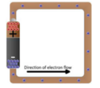

### Definition of electric current
Electric current is often termed as 'current' and it is represented by the symbol 'I'. It is defined as the **rate of flow of charges** in a conductor. This means that the electric current represents the amount of charges flowing in any cross section of a conductor (say a metal wire) in unit time. If a net charge 'Q' passes through any cross section of a conductor in time 't', then the current flowing through the conductor is:

$$I = \frac{Q}{t}$$

### SI unit of electric current
The SI unit of electric current is **ampere (A)**. The current flowing through a conductor is said to be one ampere, when a charge of one coulomb flows across any cross-section of a conductor, in one second. Hence,

$$
1 \text{ ampere} = \frac{1 \text{ coulomb}}{1 \text{ second}}
$$

#### Solved Problem-1
**Problem:** A charge of 12 coulomb flows through a bulb in 5 second. What is the current through the bulb?

**Solution:**
- Charge Q = 12 C
- Time t = 5 s
- Therefore, current $$I = \frac{Q}{t} = \frac{12}{5} = 2.4 \text{ A}$$

---

## Electric Circuit
An electric circuit is a closed conducting loop (or) path, which has a network of electrical components through which electrons are able to flow. This path is made using electrical wires so as to connect an electric appliance to a source of electric charges (battery).

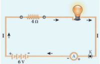

In this circuit, if the switch is 'on', the bulb glows. If it is switched off, the bulb does not glow. Therefore, the circuit must be closed in order that the current passes through it. The potential difference required for the flow of charges is provided by the battery. The electrons flow from the negative terminal to the positive terminal of the battery.

By convention, the direction of current is taken as the direction of flow of positive charge (or) opposite to the direction of flow of electrons. Thus, electric current passes in the circuit from the positive terminal to the negative terminal.

### Electrical components

The electric circuit given in Figure 4.2 consists of different components, such as a battery, a switch and a bulb. All these components can be represented by using certain symbols. It is easier to represent the components of a circuit using their respective symbols.

The symbols that are used to represent some commonly used components are given in Table 4.1. The uses of these components are
also summarized in the table.

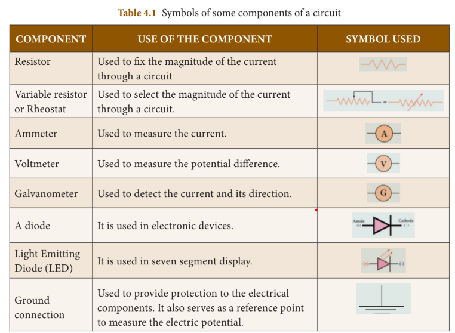

---

## Electric Potential and Potential Difference
You are now familiar with the water current and air current. You also know that there must be a difference in temperature between two points in a solid for the heat to flow in it. Similarly, a difference in electric potential is needed for the flow of electric charges in a conductor. In the conductor, the charges will flow from a point in it, which is at a higher electric potential to a point, which is at a lower electric potential.

### Electric Potential
The electric potential at a point is defined as the amount of work done in moving a unit positive charge from infinity to that point against the electric force.

### Electric Potential Difference
The electric potential difference between two points is defined as the amount of work done in moving a unit positive charge from one point to another point against the electric force.

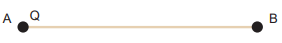

Suppose, you have moved a charge Q from a point A to another point B. Let 'W' be the work done to move the charge from A to B. Then, the potential difference between the points A and B is given by:

$$
\text{Potential Difference (V)} = \frac{W}{Q}
$$

Potential difference is also equal to the difference in the electric potential of these two points. If $$
V_A and V_B
$$ represent the electric potential at the points A and B respectively, then:

$$
f(x) = \int_{-\infty}^\infty\hat f(\xi)\,e^{2 \pi i \xi x}\,d\xi
$$

$$
V = V_A - V_B \text{ (if } V_A \text{ is more than } V_B)$$
$$
V = V_B - V_A \text{ (if } V_B \text{ is more than } V_A)
$$

### Volt
The SI unit of electric potential or potential difference is **volt (V)**.

The potential difference between two points is one volt, if one joule of work is done in moving one coulomb of charge from one point to another against the electric force.

$$
1 \text{ volt} = \frac{1 \text{ joule}}{1 \text{ coulomb}}
$$

#### Solved Problem-2
**Problem:** The work done in moving a charge of 10C across two points in a circuit is 100J. What is the potential difference between the points?

**Solution:**
- Charge, Q = 10 C
- Work Done, W = 100 J
$$
Potential Difference V = \frac{W}{Q} = \frac{100}{10} = 10 \text{ volt}
$$
---

## Ohm's Law
A German physicist, Georg Simon Ohm established the relation between the potential difference and current, which is known as **Ohm's Law**.

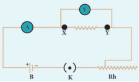

According to Ohm's law, at a constant temperature, the steady current 'I' flowing through a conductor is directly proportional to the potential difference 'V' between the two ends of the conductor.

$$
I \propto V
$$
$$
Hence, \frac{V}{I} = \text{constant}
$$
The value of this proportionality constant is found to be$$ \frac{1}{R}$$

Therefore:
$$
I = \frac{V}{R}
\text{or } V = IR
$$

Here, R is a constant for a given material (say Nichrome) at a given temperature and is known as the **resistance** of the material. Since the potential difference V is proportional to the current I, the graph between V and I is a straight line for a conductor.

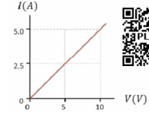

---

## Resistance of a Material
Resistance of a material is its property to oppose the flow of charges and hence the passage of current through it. It is different for different materials.

From Ohm's Law:
$$
\frac{V}{I} = R
$$

The resistance of a conductor can be defined as the ratio between the potential difference across the ends of the conductor and the current flowing through it.

### Unit of Resistance
The SI unit of resistance is **ohm** and it is represented by the symbol **Ω**.

Resistance of a conductor is said to be one ohm if a current of one ampere flows through it when a potential difference of one volt is maintained across its ends.

$$
1 \text{ ohm} = \frac{1 \text{ volt}}{1 \text{ ampere}}
$$

#### Solved Problem-3
**Problem:** Calculate the resistance of a conductor through which a current of 2A passes, when the potential difference between its ends is 30V.

**Solution:**
- Current through the conductor I = 2 A
- Potential Difference V = 30 V
- From Ohm's Law:$$ R = \frac{V}{I}
- Therefore, R = \frac{30}{2} = 15 \Omega$$

---

## Electrical Resistivity & Electrical Conductivity

### Electrical Resistivity
You can verify by doing an experiment that the resistance of any conductor 'R' is directly proportional to the length of the conductor 'L' and is inversely proportional to its area of cross section 'A'.
$$
R \propto L, \quad R \propto \frac{1}{A}$$

Hence,$$ R \propto \frac{L}{A}$$

Therefore:
$$
R = \rho \frac{L}{A}
$$

Where,$$ \rho (rho) $$is a constant, called as **electrical resistivity** or **specific resistance** of the material of the conductor.

From the equation:
$$
\rho = \frac{RA}{L}
$$

If L = 1 m, A = 1 m² then $$\rho = R$$

Hence, the electrical resistivity of a material is defined as the resistance of a conductor of unit length and unit area of cross section. Its unit is **ohm metre**.

Electrical resistivity of a conductor is a measure of the resisting power of a specified material to the passage of an electric current. It is a constant for a given material.

> **Do You Know?**
> Nichrome is a conductor with highest resistivity equal to$$  1.5 \times 10^{-6} \Omega m. $$Hence, it is used in making heating elements.

### Conductance and Conductivity
**Conductance** of a material is the property of a material to aid the flow of charges and hence, the passage of current in it. The conductance of a material is mathematically defined as the reciprocal of its resistance (R). Hence, the conductance 'G' of a conductor is given by:

$$
G = \frac{1}{R}
$$

Its unit is ohm⁻¹. It is also represented as 'mho'.

The reciprocal of electrical resistivity of a material is called its **electrical conductivity**.

$$
\sigma = \frac{1}{\rho}
$$

Its unit is ohm⁻¹ metre⁻¹. It is also represented as mho metre⁻¹. The conductivity is a constant for a given material. Electrical conductivity of a conductor is a measure of its ability to pass the current through it.

Some materials are good conductors of electric current (Example: copper, aluminium, etc.) while some other materials are non-conductors of electric current (insulators) (Example: glass, wood, rubber, etc.).

Conductivity is more for conductors than for insulators. But, the resistivity is less for conductors than for insulators.

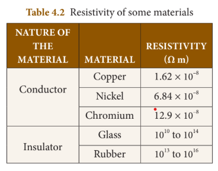

#### Solved Problem-4
**Problem:** The resistance of a wire of length 10m is 2 ohm. If the area of cross section of the wire is$$ 2 \times 10^{-7} m^2 $$, determine its:
(i) resistivity
(ii) conductance and
(iii) conductivity

**Solution:**
Given: Length, L = 10 m, Resistance, R = 2 ohm and Area, A =$$ 2 \times 10^{-7} m^2$$

(i) Resistivity, $$\rho = \frac{RA}{L} = \frac{2 \times 2 \times 10^{-7}}{10} = 4 \times 10^{-8} \Omega m$$

(ii) Conductance,$$ G = \frac{1}{R} = \frac{1}{2} = 0.5 \text{ mho}$$

(iii) Conductivity,$$ \sigma = \frac{1}{\rho} = \frac{1}{4 \times 10^{-8}} = 0.25 \times 10^{8} \text{ mho m}^{-1}$$

---

## System of Resistors
So far, you have learnt how the resistance of a conductor affects the current through a circuit. You have also studied the case of the simple electric circuit containing a single resistor. Now in practice, you may encounter a complicated circuit, which uses a combination of many resistors. This combination of resistors is known as 'system of resistors' or 'grouping of resistors'. Resistors can be connected in various combinations. The two basic methods of joining resistors together are:
a) Resistors connected in series
b) Resistors connected in parallel

### Resistors in Series
A series circuit connects the components one after the other to form a 'single loop'. A series circuit has only one loop through which current can pass. If the circuit is interrupted at any point in the loop, no current can pass through the circuit and hence no electric appliances connected in the circuit will work.

If resistors are connected end to end, so that the same current passes through each of them, then they are said to be connected in series.

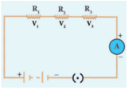

Let three resistances$$ R_1, R_2 and R_3 $$ be connected in series. Let the current flowing through them be I. According to Ohm's Law, the potential differences $$V_1, V_2 and V_3 $$across$$  R_1, R_2 and R_3$$ respectively, are given by:
$$ 
V_1 = IR_1$$
$$
V_2 = IR_2$$
$$
V_3 = IR_3$$

The sum of the potential differences across the ends of each resistor is given by:
$$ 
V = V_1 + V_2 + V_3
$$
Using the above equations:
$$ 
V = IR_1 + IR_2 + IR_3
$$
The effective resistor is a single resistor, which can replace the resistors effectively, so as to allow the same current through the electric circuit. Let the effective resistance of the series-combination of the resistors be R_S. Then:
$$
V = IR_S
$$

Combining equations:
$$
IR_S = IR_1 + IR_2 + IR_3
$$
$$
R_S = R_1 + R_2 + R_3
$$

Thus, when a number of resistors are connected in series, their equivalent resistance or effective resistance is equal to the sum of the individual resistances. When 'n' resistors of equal resistance R are connected in series, the equivalent resistance is 'nR'.

$$
\text{i.e., } R_S = nR
$$

The equivalent resistance in a series combination is greater than the highest of the individual resistances.

#### Solved Problem-5
**Problem:** Three resistors of resistances 5 ohm, 3 ohm and 2 ohm are connected in series with 10V battery. Calculate their effective resistance and the current flowing through the circuit.

**Solution:**
$$ 
- R_1 = 5\Omega, R_2 = 3\Omega, R_3 = 2\Omega, V = 10V$$
$$ 
- R_S = R_1 + R_2 + R_3 = 5 + 3 + 2 = 10\Omega$$

- The current, $$ I = \frac{V}{R_S} = \frac{10}{10} = 1A
$$

### Resistances in Parallel
A parallel circuit has two or more loops through which current can pass. If the circuit is disconnected in one of the loops, the current can still pass through the other loop(s). The wiring in a house consists of parallel circuits.

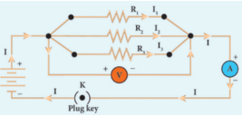

Consider that three resistors $$ R_1, R_2 and R_3 $$are connected across two common points A and B. The potential difference across each resistance is the same and equal to the potential difference between A and B. The current I arriving at A divides into three branches$$  I_1, I_2 and I_3$$ passing through $$ R_1, R_2 and R_3 $$respectively.

According to Ohm's law:
$$ 
I_1 = \frac{V}{R_1}$$
$$
I_2 = \frac{V}{R_2}$$
$$
I_3 = \frac{V}{R_3}$$

The total current through the circuit is given by:
$$
I = I_1 + I_2 + I_3
$$

Using the equations:
$$
I = \frac{V}{R_1} + \frac{V}{R_2} + \frac{V}{R_3}
$$

Let the effective resistance of the parallel combination of resistors be $$
R_P
$$. Then:
$$
I = \frac{V}{R_P}
$$

Combining equations:
$$
\frac{V}{R_P} = \frac{V}{R_1} + \frac{V}{R_2} + \frac{V}{R_3}
$$

$$
\frac{1}{R_P} = \frac{1}{R_1} + \frac{1}{R_2} + \frac{1}{R_3}
$$

Thus, when a number of resistors are connected in parallel, the sum of the reciprocals of the individual resistances is equal to the reciprocal of the effective or equivalent resistance.

When 'n' resistors of equal resistances R are connected in parallel:
$$
\frac{1}{R_P} = \frac{1}{R} + \frac{1}{R} + \frac{1}{R} + ... + \frac{1}{R} = \frac{n}{R}
$$

Hence,$$ R_P = \frac{R}{n}$$

The equivalent resistance in a parallel combination is less than the lowest of the individual resistances.

### Series Connection of Parallel Resistors
If you consider the connection of a set of parallel resistors that are connected in series, you get a series-parallel circuit. Let $$R_1 and R_2 $$be connected in parallel to give an effective resistance of $$ R_{P1} $$. Similarly, let$$  R_3 and R_4  $$be connected in parallel to give an effective resistance of $$  R_{P2}. $$Then, both of these parallel segments are connected in series.

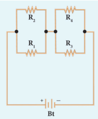

Using the parallel formula:
$$ 
\frac{1}{R_{P1}} = \frac{1}{R_1} + \frac{1}{R_2}$$
$$ 
\frac{1}{R_{P2}} = \frac{1}{R_3} + \frac{1}{R_4}
$$
Finally, the net effective resistance is given by:
$$
R_{total} = R_{P1} + R_{P2}
$$

### Parallel Connection of Series Resistors
If you consider a connection of a set of series resistors connected in a parallel circuit, you get a parallel-series circuit. Let $$ R_1 and R_2 $$be connected in series to give an effective resistance of$$  R_{S1} $$. Similarly, let $$ R_3 and R_4 $$ be connected in series to give an effective resistance of $$ R_{S2} $$. Then, both of these serial segments are connected in parallel.

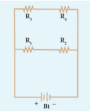Parallel-series combination of resistors

Using the series formula:
$$
R_{S1} = R_1 + R_2
$$
$$
R_{S2} = R_3 + R_4
$$

Finally, the net effective resistance is given by:
$$
\frac{1}{R_{total}} = \frac{1}{R_{S1}} + \frac{1}{R_{S2}}
$$

### Difference between Series and Parallel Connections

| S. No. | Criteria | Series | Parallel |
|--------|----------|--------|----------|
| 1 | Equivalent resistance | More than the highest resistance | Less than the lowest resistance |
| 2 | Amount of current | Current is less as effective resistance is more | Current is more as effective resistance is less |
| 3 | Switching ON/OFF | If one appliance is disconnected, others also do not work | If one appliance is disconnected, others will work independently |

---

## Heating Effect of Current
Have you ever touched the motor casing of a fan, which has been used for a few hours continuously? The motor casing is warm. This is due to the heating effect of current. The same can be observed by touching a bulb, which was used for a long duration.

Generally, a source of electrical energy can develop a potential difference across a resistor, which is connected to that source. This potential difference constitutes a current through the resistor. For continuous drawing of current, the source has to continuously spend its energy. A part of the energy from the source can be converted into useful work and the rest will be converted into heat energy. Thus, the passage of electric current through a wire, results in the production of heat. This phenomenon is called **heating effect of current**.

### Joule's Law of Heating
Let 'I' be the current flowing through a resistor of resistance 'R', and 'V' be the potential difference across the resistor. The charge flowing through the circuit for a time interval 't' is 'Q'.

The work done in moving the charge Q across the ends of the resistor with a potential difference of V is VQ. This energy spent by the source gets dissipated in the resistor as heat. Thus, the heat produced in the resistor is:
$$
H = W = VQ
$$

Using Q = It:
$$
H = VIt
$$

From Ohm's Law, V = IR. Hence:
$$
H = I^2Rt
$$

This is known as **Joule's law of heating**.

Joule's law of heating states that the heat produced in any resistor is:
- directly proportional to the square of the current passing through the resistor.
- directly proportional to the resistance of the resistor.
- directly proportional to the time for which the current is passing through the resistor.

### Applications of Heating Effect

#### 1. Electric Heating Device
The heating effect of electric current is used in many home appliances such as electric iron, electric toaster, electric oven, electric heater, geyser, etc. In these appliances **Nichrome**, which is an alloy of Nickel and Chromium is used as the heating element. Because:
- (i) it has high resistivity
- (ii) it has a high melting point
- (iii) it is not easily oxidized

#### 2. Fuse Wire
The fuse wire is connected in series, in an electric circuit. When a large current passes through the circuit, the fuse wire melts due to Joule's heating effect and hence the circuit gets disconnected. Therefore, the circuit and the electric appliances are saved from any damage. The fuse wire is made up of a material whose melting point is relatively low.

#### 3. Filament in Bulbs
In electric bulbs, a small wire is used, known as **filament**. The filament is made up of a material whose melting point is very high. When current passes through this wire, heat is produced in the filament. When the filament is heated, it glows and gives out light. **Tungsten** is the commonly used material to make the filament in bulbs.

#### Solved Problem-6
**Problem:** An electric heater of resistance 5Ω is connected to an electric source. If a current of 6A flows through the heater, then find the amount of heat produced in 5 minutes.

**Solution:**
- Given resistance R = 5Ω
- Current I = 6A
- Time t = 5 minutes = 5 × 60s = 300s
- Amount of heat produced, $$H = I^2Rt$$
$$H = 6^2 \times 5 \times 300 = 36 \times 5 \times 300 = 54000 \text{ J}$$

---

## Electric Power
In general, power is defined as the rate of doing work or rate of spending energy. Similarly, the electric power is defined as the rate of consumption of electrical energy. It represents the rate at which the electrical energy is converted into some other form of energy.

Suppose a current 'I' flows through a conductor of resistance 'R' for a time 't', then the potential difference across the two ends of the conductor is 'V'. The work done 'W' to move the charge across the ends of the conductor is:

$$
W = VIt
$$
$$
Power P = \frac{W}{t}$$

$$
P = VI
$$

Thus, the electric power is the product of the electric current and the potential difference due to which the current passes in a circuit.

### Unit of Electric Power
The SI unit of electric power is **watt**. When a current of 1 ampere passes across the ends of a conductor, which is at a potential difference of 1 volt, then the electric power is:

$$
P = 1 \text{ volt} \times 1 \text{ ampere} = 1 \text{ watt}
$$

Thus, one watt is the power consumed when an electric device is operated at a potential difference of one volt and it carries a current of one ampere. A larger unit of power, which is more commonly used is **kilowatt**.

> **Horse Power:**
> The horse power (hp) is a unit in the foot-pound-second (fps) or English system, sometimes used to express the electric power. It is equal to **746 watt**.

### Consumption of Electrical Energy
Electricity is consumed both in houses and industries. Consumption of electricity is based on two factors:
- (i) Amount of electric power
- (ii) Duration of usage

Electrical energy consumed is taken as the product of electric power and time of usage. For example, if 100 watt of electric power is consumed for two hours, then the power consumed is $$100 \times 2 = 200 $$watt hour.

Consumption of electrical energy is measured and expressed in watt hour, though its SI unit is watt second. In practice, a larger unit of electrical energy is needed. This larger unit is **kilowatt hour (kWh)**. One kilowatt hour is otherwise known as **one unit of electrical energy**.

One kilowatt hour means that an electric power of 1000 watt has been utilized for an hour. Hence:

$$
1 \text{ kWh} = 1000 \text{ watt hour} = 1000 \times (60 \times 60) \text{ watt second} = 3.6 \times 10^6 \text{ J}
$$

---

## Domestic Electric Circuits
The electricity produced in power stations is distributed to all the domestic and industrial consumers through overhead and underground cables.

In our homes, electricity is distributed through the domestic electric circuits wired by the electricians. The first stage of the domestic circuit is to bring the power supply to the main-box from a distribution panel, such as a transformer. The important components of the main-box are:
- (i) a fuse box
- (ii) a meter

The meter is used to record the consumption of electrical energy. The fuse box contains either a fuse wire or a miniature circuit breaker (MCB). The function of the fuse wire or a MCB is to protect the house hold electrical appliances from overloading due to excess current.

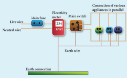

An **MCB** is a switching device, which can be activated automatically as well as manually. It has a spring attached to the switch, which is attracted by an electromagnet when an excess current passes through the circuit. Hence, the circuit is broken and the protection of the appliance is ensured.

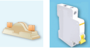A fuse and an MCB

The electricity is brought to houses by two insulated wires. Out of these two wires:
- One wire has a **red insulation** and is called the **'live wire'**
- The other wire has a **black insulation** and is called the **'neutral wire'**

The electricity supplied to your house is actually an alternating current having an electric potential of 220V. Both, the live wire and the neutral wire enter into a box where the main fuse is connected with the live wire. After the electricity meter, these wires enter into the main switch, which is used to discontinue the electricity supply whenever required.

After the main switch, these wires are connected to live wires of two separate circuits:
- One circuit is of a **5A rating**, which is used to run the electric appliances with a lower power rating, such as tube lights, bulbs and fans.
- The other circuit is of a **15A rating**, which is used to run electric appliances with a high power rating, such as air-conditioners, refrigerators, electric iron and heaters.

All the circuits in a house are connected in **parallel**, so that:
- The disconnection of one circuit does not affect the other circuit.
- Each electric appliance gets an equal voltage.

> **Do You Know?**
> In India, domestic circuits are supplied with an alternating current of potential 220/230V and frequency 50Hz. In countries like USA and UK, domestic circuits are supplied with an alternating current of potential 110/120V and frequency 60Hz.

### Overloading and Short Circuiting
The fuse wire or MCB will disconnect the circuit in the event of an **overloading** and **short circuiting**.

**Overloading** happens when a large number of appliances are connected in series to the same source of electric power. This leads to a flow of excess current in the electric circuit. When the amount of current passing through a wire exceeds the maximum permissible limit, the wires get heated to such an extent that a fire may be caused.

**Short Circuit** occurs when a live wire comes in contact with a neutral wire. This happens when the insulation of the wires get damaged due to temperature changes or some external force. Due to a short circuit, the effective resistance in the circuit becomes very small, which leads to the flow of a large current through the wires. This results in heating of wires to such an extent that a fire may be caused in the building.

### Earthing
In domestic circuits, a third wire called the **earth wire** having a **green insulation** is usually connected to the body of the metallic electric appliance. The other end of the earth wire is connected to a metal tube or a metal electrode, which is buried into the Earth.

This wire provides a low resistance path to the electric current. The earth wire sends the current from the body of the appliance to the Earth, whenever a live wire accidentally touches the body of the metallic electric appliance. Thus, the earth wire serves as a protective conductor, which saves us from electric shocks.

---

## LED Bulb
An **LED bulb** is a semiconductor device that emits visible light when an electric current passes through it. The colour of the emitted light will depend on the type of materials used. With the help of the chemical compounds like Gallium Arsenide and Gallium Phosphide, the manufacturer can produce LED bulbs that radiates red, green, yellow and orange colours.

Displays in digital watches and calculators, traffic signals, street lights, decorative lights, etc., are some examples for the use of LEDs.

### Seven Segment Display

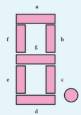

A **'Seven Segment Display'** is the display device used to give an output in the form of numbers or text. It is used in digital meters, digital clocks, microwave ovens, etc. It consists of 7 segments of LEDs in the form of the digit 8. These seven LEDs are named as a, b, c, d, e, f and g. An extra 8th LED is used to display a dot.

### Merits of a LED Bulb
1. As there is no filament, there is no loss of energy in the form of heat. It is cooler than the incandescent bulb.
2. In comparison with the fluorescent light, the LED bulbs have significantly low power requirement.
3. It is not harmful to the environment.
4. A wide range of colours is possible here.
5. It is cost-efficient and energy efficient.
6. Mercury and other toxic materials are not required.

> One way of overcoming the energy crisis is to use more LED bulbs.

---

## LED Television
LED Television is one of the most important applications of Light Emitting Diodes. An LED TV is actually an LCD TV (Liquid Crystal Display) with LED display.

An LED display uses LEDs for backlight and an array of LEDs act as pixels. LEDs emitting white light are used in monochrome (black and white) TV; Red, Green and Blue (RGB) LEDs are used in colour television.

The first LED television screen was developed by James P. Mitchell in 1977. It was a monochromatic display. But, after about three decades, in 2009, SONY introduced the first commercial LED Television.

### Advantages of LED Television
- It has brighter picture quality.
- It is thinner in size.
- It uses less power and consumes very less energy.
- Its life span is more.
- It is more reliable.

---

## Points to Remember
- The magnitude of current is defined as the rate of flow of charges in a conductor.
- The SI unit of electric current is ampere (A).
- The SI unit of electric potential and potential difference is volt (V).
- An electric circuit is a network of electrical components, which forms a continuous and closed path for an electric current to pass through it.
- The parameters of conductors like its length, area of cross-section and material, affect the resistance of the conductor.
- SI unit of electrical resistivity is ohm metre. The resistivity is a constant for a given material.
- The reciprocal of electrical resistivity of a material is called its electrical conductivity.$$ \sigma = \frac{1}{\rho}$$
- The passage of electric current through a wire results in the production of heat. This phenomenon is called heating effect of current.
- One horse power is equal to 746 watts.
- The function of a fuse wire or a MCB is to protect the house hold electrical appliances from excess current due to overloading or a short circuit.

---

## Solved Problems

### Problem 1
Two bulbs are having the ratings as 60W, 220V and 40W, 220V respectively. Which one has a greater resistance?

**Solution:**
Electric power$$ P = \frac{V^2}{R}$$

For the same value of V, R is inversely proportional to P.

Therefore, lesser the power, greater the resistance.

Hence, the bulb with 40W, 220V rating has a greater resistance.

---

### Problem 2
Calculate the current and the resistance of a 100W, 200V electric bulb in an electric circuit.

**Solution:**
- Power P = 100W
- Voltage V = 200V
- Power P = VI
- So, Current$$ I = \frac{P}{V} = \frac{100}{200} = 0.5A$$
- Resistance$$ R = \frac{V}{I} = \frac{200}{0.5} = 400\Omega$$

---

### Problem 3
In the circuit diagram given below, three resistors $$ R_1, R_2 and R_3 $$of 5Ω, 10Ω and 20Ω respectively are connected as shown. Calculate:

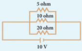

A) Current through each resistor
B) Total current in the circuit
C) Total resistance in the circuit

**Solution:**

**A)** Since the resistors are connected in parallel, the potential difference across each resistor is same (i.e. V = 10V)

Therefore:
- Current through $$ R_1: I_1 = \frac{V}{R_1} = \frac{10}{5} = 2A$$
- Current through $$ R_2: I_2 = \frac{V}{R_2} = \frac{10}{10} = 1A$$
- Current through $$ R_3: I_3 = \frac{V}{R_3} = \frac{10}{20} = 0.5A$$

**B)** Total current in the circuit:
$$I = I_1 + I_2 + I_3 = 2 + 1 + 0.5 = 3.5A$$

**C)** Total resistance in the circuit:$$
\frac{1}{R_P} = \frac{1}{R_1} + \frac{1}{R_2} + \frac{1}{R_3} = \frac{1}{5} + \frac{1}{10} + \frac{1}{20} = \frac{4+2+1}{20} = \frac{7}{20}$$

Hence, $$R_P = \frac{20}{7} = 2.857\Omega$$

---

### Problem 4
Three resistors of 1Ω, 2Ω and 4Ω are connected in parallel in a circuit. If a 1Ω resistor draws a current of 1A, find the current through the other two resistors.

**Solution:**$$
- R_1 = 1\Omega, R_2 = 2\Omega, R_3 = 4\Omega
- Current I_1 = 1A$$

The potential difference across the 1Ω resistor = $$I_1R_1 = 1 \times 1 = 1V$$

Since the resistors are connected in parallel, the same potential difference exists across the other resistors.

- Current in the 2Ω resistor: $$I_2 = \frac{V}{R_2} = \frac{1}{2} = 0.5A$$
- Current in the 4Ω resistor:$$ I_3 = \frac{V}{R_3} = \frac{1}{4} = 0.25A$$

---

