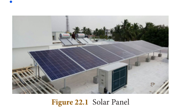
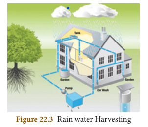
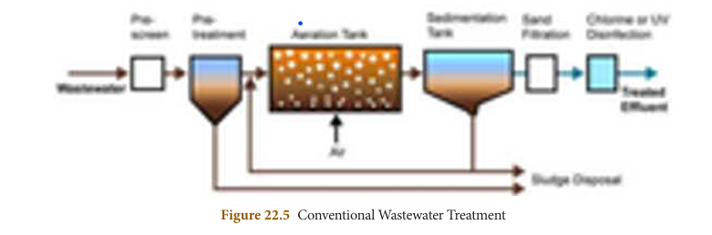
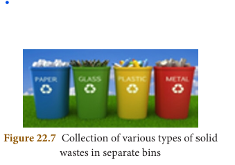

# ENVIRONMENTAL MANAGEMENT

## Learning Objectives

At the end of this lesson the students will be able to:
- Differentiate between renewable and non-renewable resources.
- Gain knowledge about the need for conservation of various natural resources.
- To know the various methods which can be adopted for conservation of natural resources.
- Create awareness about the limited exploitation of natural resources.
- Get motivated to participate in the protection of environment and its management.

## Introduction

**Environmental management** deals with the different aspects of environment, its structure, function, its quality and its maintenance including conservation of its living and non-living components. The diversified natural resources on this earth provide the necessities for survival of all forms of life including man. Everything that comes from nature has some utility for man but its utilization is possible based on the availability of appropriate technology.

Resources can be renewed simultaneously along with their exploitation (forests, crops, wildlife, groundwater, wind and solar energy). They can maintain themselves by natural recycling or can be replenished by proper management. Simultaneously, **non-renewable resources** cannot be recycled and can get exhausted by unlimited and continuous use (mineral ores, coal, petroleum etc). They cannot be replaced easily. This would lead to a situation where non-renewable resources may come to an end after a certain period of time.

Expanding human population resulted in expanding needs of man. With scientific and technological advancement man started utilizing natural resources at a much larger scale. Continuous increase in population caused an increased demand for resources. Therefore, conservation of natural resources makes important contributions to the social and economic development of the country.

---

## 22.1 Conservation and Judicious Use of Resources

Natural resources are conserved for their biological, economic and recreational values. The use of natural resources in excess and unplanned way leads to imbalance in the environment. A judicious balance should be maintained between exploitation of resources and its replenishment. Proper utilization and management of nature and its resources is termed as **conservation**.

We have to build a sustainable world, which should last forever. Some of the ways to sustain continuous use of resources are practices to utilise energy efficiently, avoid wastage of water, avoid usage of plastics and other non-biodegradable materials and to take care for the environment we live. It is important that we manage and use our resources carefully so as to preserve for the future generation.

---

## 22.2 Forest and its Importance

Forests are an important component of our environment and are dominated by microorganisms, flowering plants, shrubs, climbers, dense trees and provide a vast habitat for wild animals. Forests also contribute to the economic development of our country. Forests are vital for human life, it is a source for a wide range of renewable natural resource. They provide wood, food, fodder, fibre and fuel.

Forests are major factor of environmental concern. They act as carbon sink, regulate climatic conditions, increase rainfall, reduce global warming, prevent natural hazards like flood and landslides, protect wildlife and also act as catchments for water conservation. They also play a vital role in maintaining the ecological balance.

### 22.2.1 Deforestation and its Effects

**Deforestation** is the destruction of large area of forests. This happens for many reasons like intensive agriculture, urbanization, construction of dams, roads, buildings and industries, hydroelectric projects, forest fires, construction of mountain and forest roads. It is a threat to the economy, quality of life and future of the environment. India is losing about 1.5 million hectares of forest cover every year.

> **More to Know: Chipko Movement**
> The Chipko movement was a non-violent agitation in 1973 that was aimed at protection and conservation of trees. The name of the movement 'Chipko' comes from the word 'embrace', as the villagers hugged the trees and encircled them to prevent them from being cut. The movement originated in the Chamoli district of Uttar Pradesh (now Uttarakhand). The protest of Chipko movement achieved a major victory in 1980 with a 15 year ban on cutting trees in the Himalayan forests.

#### Effects of Deforestation

Deforestation gives rise to ecological problems like floods, drought, soil erosion, loss of wild life, extinction of species, imbalance of biogeochemical cycles, alteration of climatic conditions and loss of biodiversity.

### 22.2.2 Conservation of Forests

India has an area of 752.3 lakh hectare classified as reserved forests and 215.1 lakh hectare as protected forests. The important measures taken for conservation of forests are as follows:

**Afforestation:** Activities for afforestation programme (Van Mahotsav) includes planting and protecting trees with multiple uses which help in restoration of green cover. Destruction of trees should be avoided.

**Social forestry programme:** It should be undertaken on a large scale with active participation of the public and utilization of common land to produce firewood, fodder and timber for the benefit of the rural community. This relieves pressure on existing forests and to safeguard future of forests.

**Forest Conservation through Laws:** Adopting stringent laws and policies to conserve and protect forests are through National Forest Policy, (1952 and 1988) and Forest Conservation Act, 1980.

---

## 22.3 Wildlife and its Conservation

Wild life refers to the undomesticated animals living in their natural habitats (forests, grasslands and deserts) an area without human habitation. They are needed for maintaining biological diversity. It also helps in promoting economic activities that generates revenue through tourism. Conservation of forest and wildlife is interrelated with each other.

### 22.3.1 Decline in Wildlife Population

Wildlife of India is a great natural heritage. Exploitation of wildlife resources has decreased global wildlife population by 52% between 1970 and 2014. Over exploitation and shrinking of forest cover areas has resulted in animals becoming extinct, some are threatened and some are on the verge of extinction. In recent years, increase in human encroachment has posed a threat to India's wildlife.

### 22.3.2 Aims of Wildlife Management

The main aim of wildlife conservation are:
- To control and limit exploitation of species.
- To preserve the plants and animals from extinction.
- Maintenance of threatened species and protect species which are on the verge of extinction.
- Preserve the endangered species.
- To study the ecological relationship of the plants and animals in natural habitat.
- Hunting and poaching should be prohibited.
- Establishment of National parks, Wildlife sanctuaries, protected areas and Biosphere reserves.

> **DID YOU KNOW?**
> - Jim Corbett National Park was the first to be established in 1936 in Uttarakhand.
> - There are 15 biosphere reserves in India.
> - The Nilgiris is a biosphere reserve in Tamil Nadu.

### 22.3.4 Organisations Involved in Conservation of Wildlife

1. Indian Board for WildLife (IBWL)
2. World Wildlife Fund (WWF) for Nature
3. World Conservation Union (WCN)
4. International Union for Conservation of Nature and Natural resources (IUCN)
5. Convention of International Trade in Endangered Species (CITES)
6. Bombay Natural History Society (BNHS)
7. Wild life Preservation Society of India, Dehradun

> **Rathika Ramasamy**, a native of Venkatachalapuram village, Theni District in Tamil Nadu was the first Indian woman to strike an International reputation as wildlife photographer. Her passion is towards bird photography. A photobook on wildlife titled "The best of wildlife moments" was published in November 2014.

> **Info bits: Wildlife Conservation Initiatives In India**
> - Project Tiger and Project Elephant has been launched in 1973 and 1992 respectively
> - Crocodile Conservation Project was launched in 1976.
> - Sea Turtle Conservation Project was launched in 1999.
> - Indian Rhino Vision 2020 is to conserve at least 3000 greater one-horned rhinos in Assam, India by 2020.

---

## 22.4 Soil Erosion

The top layers of soil contain humus and mineral salts, which are vital for the growth of plants. Removal of upper layer of soil by wind and water is called **soil erosion**. Soil erosion causes a significant loss of humus, nutrients and decrease the fertility of soil.

### 22.4.1 Agents of Soil Erosion

Agents of soil erosion are high velocity of wind, air currents, flowing water, landslide, human activities (deforestation, farming and mining) and overgrazing by animals.

### 22.4.2 Management of Soil Erosion

- Retain vegetation cover, so that soil is not exposed.
- Cattle grazing should be controlled.
- Crop rotation and soil management improve soil organic matter.
- Runoff water should be stored in the catchment.
- Reforestation, terracing and contour ploughing.
- Wind speed can be controlled by planting trees in form of a shelter belt.

---

## 22.5 Renewable and Non-Renewable Energy Resources

Energy is an important input for development. The expansion of possible energy resources has been directly related with the pace of agricultural and industrial development in every part of the world. Energy resources can be classified as non-renewable and renewable.

### Non-renewable (Exhaustible) Energy Resources

Energy obtained from sources that cannot renew themselves over a short period of time is known as **non-renewable energy**. These are available in limited amount in nature. They include coal, petroleum, natural gas and nuclear power. These conventional energy resources account for 90% of the world's production of commercial energy and nuclear power account for 10%.

### Renewable (Inexhaustible) Energy Resources

These energy resources are available in unlimited amount in nature and they can be renewed over a short period of time, inexpensive and can be harvested continuously. These comprise the vast potential of non-conventional energy resources which include biofuel, biomass energy, geothermal energy, water energy (hydroelectric energy and tidal energy), solar energy, wave energy and wind energy.

### 22.5.1 Fossil Fuels

**Fossil fuels** are found inside the earth's crust and are energy rich substances formed by natural process, such as anaerobic decomposition of buried dead organisms, over millions of years. As the accumulating sediment layers produce heat and pressure, the remains of the organisms are gradually transformed into hydrocarbons. e.g. petroleum, coal and natural gas.

### 22.5.2 Coal and Petroleum

Coal and Petroleum are natural resources. They are called fossil fuels as they are formed from the degradation of biomass buried deep under the earth millions of years ago.

India is the third largest consumer of crude oil in the world, after the United States and China.

- **Coal** is used for generation of electricity at Thermal power plants.
- **Petroleum** also known as crude oil is processed in oil refineries to produce petrol and diesel which are used to run automobiles, trucks, trains, ships and airplanes etc.
- **Kerosene and LPG** (Liquefied Petroleum Gas) obtained from petroleum is used as domestic fuel for cooking.

The coal and petroleum reserves can get exhausted if we continue using them at a rapid rate. The formation of these fossil fuels is a very slow process and takes very long period of time for formation.

### 22.5.3 Steps to Conserve Coal and Petroleum Resources

It is necessary to conserve or save coal and petroleum resources for the future use, which can be done by reducing their consumption:

1. If electricity is saved, it will in turn reduce the use of coal indirectly.
2. Using bicycle for covering short distances instead of using cars, scooters or motorcycles.
3. Using pressure cooker can reduce the consumption of kerosene and LPG while cooking food. Solar cooker and solar heaters can be used wherever possible.
4. Motor vehicles should be designed with fuel efficient engines to increase efficiency and also reduce air pollution.

> **Case Study of Taj Mahal**
> The Taj Mahal is one of the seven wonders of the world and is located in Agra, Uttar Pradesh. It is built with white marble. The Mathura oil refinery owned by Indian Oil Corporation present around this area produce sulphur and nitrogen oxides. The white marble became yellow due to air pollution. The Government of India has set up emission standards around the monument to protect it from the pollution.

---

## 22.6 Non-Conventional (Alternative) Energy Resources

The energy crisis has shown that for sustainable development in energy sector we must conserve the non-renewable conventional resources from its rapid depletion and replace them by non-polluting, renewable sources which are environmentally friendly.

Efforts are made to develop new sources of energy which is called **non-conventional sources of energy**. It would provide greater initiative to local people who could assess their needs and resources and plan a strategy that could be useful to them.

### 22.6.1 Solar Energy

Solar energy is the energy obtained from the sun. The sun gives out vast amount of light and heat. It is only a little less than half (47%) of solar energy which falls on the atmosphere reaches the earth's surface. If we could use just a small part of this energy it would fulfill all the country's need for power. Solar energy has advantages and also certain limitations.

#### Solar Energy Devices

The energy from the sun can be harnessed to provide power. The various devices used for harnessing sun's energy are called solar energy devices.

**Solar Cells**

Solar cells (Photovoltaic devices) is made up of silicon that converts sunlight directly into electricity. Solar cell produces electricity without polluting the environment. Since it uses no fuel other than sunlight, no harmful gases, no burning and no wastes are produced. These can be installed in remote and inaccessible areas (forests and hilly regions) where setting up of power plant is difficult.

**Uses of Solar cells:**
- It can be used for street lighting, traffic signals, water pumping, battery charging system etc.
- It is used in artificial satellites and space probes
- It provides radio and TV transmission to remote areas
- It is used in calculators, electronic toys and watches.

**Solar Panel**

Arrangement of many solar cells side by side connected to each other is called solar panel. The capacity to provide electric current is much increased in the solar panel. But the process of manufacture is very expensive.



**Solar Cooker**

It consist of an insulated metal box or wooden box which is painted from inside so as to absorb maximum solar radiations. A thick glass sheet forms the cover over the box. The reflector is the plane mirror which is attached to the box. The food is cooked by energy radiated by the sun.


**Solar Thermal Power Plant**

In solar thermal power plants, many solar panels are used to concentrate sun rays, to heat up water into steam. The steam is used to run the turbines to produce electricity.

A capacity of 100 litres solar heater can save up to 1500 units of electricity per year.

#### Advantages of Solar Energy

1. It is available in abundance in our country and is free of cost.
2. It is a renewable source of energy.
3. It can be used for generating electricity or heat.
4. It does not cause pollution.

### 22.6.2 Biogas

**Biogas** is the mixture of methane (nearly 75%), hydrogen sulphide, carbon dioxide and hydrogen. It is produced by the decomposition of animal wastes (cow dung) and plant wastes in the absence of oxygen. It is also commonly called as 'Gobar gas' since the starting material used is cow dung which means gobar in Hindi.

#### Uses of Biogas

1. It is used as fuel for cooking.
2. It is used to run motors and pump sets.
3. It is used to generate electricity.

#### Advantages of Biogas

1. It burns without smoke and therefore causes less pollution.
2. An excellent way to get rid of organic wastes like bio-waste and sewage material.
3. Left over slurry is a good manure rich in nitrogen and phosphorus.
4. It is safe and convenient to use.
5. It can reduce the amount of greenhouse gases.

### 22.6.3 Shale Gas

**Shale** refers to the soft finely stratified sedimentary rock that is formed from the compaction of small old rocks containing mud and minerals – such as quartz and calcite, trapped beneath earth's surface. These rocks contain fossil fuels like oil and gas in their pores.

The fuel is extracted by a technique called **hydraulic fracturing** (drilling or well boring of sedimentary rocks layers to reach productive reservoir layers).

#### Environmental Concerns of Shale Gas

1. Shale drilling could affect groundwater reserves, which can contaminate the drinking water resources and also affect the fertility of the soil.
2. Million gallons of water is needed to break and release the shale gas, which in turn can affect the water table.

> **More to Know**
> India has identified six basins as areas for shale gas exploration: Cambay (Gujarat), Assam-Arakan (North East), Gondwana (Central India), Krishna Godavari onshore (East Coast), Cauvery onshore and Indo-Gangetic basins.

### 22.6.4 Wind Energy

The kinetic energy possessed by the wind is due to its high speed, that can be converted into mechanical power by wind turbines. The rotatory motion of wind mill produces wind energy. It can be used for generating electricity, run water pumps, flour mills, draw water from wells.

The world's largest and tallest wind turbine is situated in Hawaii.
- One wind turbine can produce electricity for 300 homes.

**Windmill**

Windmill is a machine that converts the energy of wind into rotational energy by broad blade attached to the rotating axis. When the blowing air strikes the blades of the windmill, it exerts force and causes the blades to rotate. The rotational movement of the blades operate the generator and the electricity is produced. The energy output from each windmill is coupled together to get electricity on a commercial scale.


#### Advantages of Wind Energy

1. Wind energy is free, eco-friendly, renewable source of energy.
2. It does not cause pollution.
3. Expenses on periodic maintenance is low when compared to the other power sources.

> **Activity 1**
> Collect information regarding the:
> - (i) Tehri Dam project
> - (ii) Sardar Sarovar Dam project

### 22.6.5 Water Energy

Earth's surface is covered with nearly 71% of water. Harnessing the energy from the flowing water can be used to produce electricity. The technique to harness the water energy is called **hydroelectricity**.

The electrical energy is derived from water flow, water falling from a height. Hilly areas are suitable for this purpose where there is continuous flow of water in large amounts falling from high slopes. It does not cause environmental pollution or waste generation.

Hydropower plants converts the kinetic energy of flowing water into electricity. This is called **hydroelectric power**.

### 22.6.6 Tidal Energy

**Tidal energy** is the energy obtained from the movement of water due to ocean tides. Tides are the rise and fall of sea levels caused by the combined effects of the gravitational forces exerted on the oceans of the earth.

A tidal stream is a fast flowing body of water created by tides. Turbines are placed in tidal streams. When the tides hit the turbine, the turbine rotates and converts the tidal energy into electric energy.

#### Advantages of Tidal Energy

1. Tidal energy does not produce any pollution.
2. It does not use any fuel and does not produce any waste.
3. Tides are predictable, so tidal energy can be produced at any time.
4. Water is denser than air and therefore can generate electricity at lower speeds than wind.

---

## 22.7 Rainwater Harvesting

**Rainwater harvesting** is a technique of collecting and storing rainwater for future use. It is a traditional method of storing rain water in underground tanks, ponds, lakes, check dams and used in agriculture.

The main purpose of rainwater harvesting is to make the rainwater percolate under the ground so as to recharge 'groundwater table'.

### Methods of Rainwater Harvesting

**(i) Roof top rainwater harvesting:** Rooftops are excellent rain catchers. The rain water that falls on the roof of the houses, apartments, commercial buildings etc. is collected and stored in the surface tank and can be used for domestic purposes.

**(ii) Recharge pit:** In this method, the rainwater is first collected from the roof tops or open spaces and is directed into the percolation pits through pipes for filtration. After filtration the rainwater enters the recharge pits or ground water.




People living in rural areas adopt a variety of water collecting methods to capture and store as rain water. Some of the methods used are:

**(i) Digging of tanks or lakes (Eris):** It is one of the traditional water harvesting system in Tamil Nadu. Eris are constructed in such a way that if the water in one eri overflows, it automatically gets diverted to the eri of the next village, as these eris are interconnected.

**(ii) Ooranis:** These are small ponds to collect rainwater. The water is used for various domestic purposes (drinking, washing and bathing). These ponds cater the nearby villages.

> **More to Know**
> **Kallanai Dam**, also known as Grand Anicut, is the fourth oldest dam in the world, constructed by King Karikala Chola of the Chola Dynasty in the 2nd century A.D. (CE). It still serves the people of Tamilnadu. The dam is located on the River Kaveri, approximately 20 km from the city of Tiruchirapalli.

### Advantages of Rainwater Harvesting

Rainwater harvesting helps to:
1. Overcome the rapid depletion of ground water levels.
2. Meet the increase demand of water.
3. Reduces flood and soil erosion.
4. Water stored in ground is not contaminated by human and animal wastes and hence can be used for drinking.

---

## 22.8 Electrical Energy Management

Electricity or electric power is produced by generators. The generators are operated by the turbines attached to it. The turbines are rotated by steam, moving water or wind power to produce electricity.

### Conservation of Electrical Energy

The following measures can be taken even at home and school to save electricity:

1. Use energy efficient appliances to save electricity like Compact Fluorescent Lamps (CFL), Light Emitting Diode (LED) bulbs and other electric equipments.
2. Switch off the lights and fans, television and other electrical appliances when not in use.
3. Switch off the mobile phone chargers when not in use.
4. Maximise the use of solar radiation. Solar water heating system can be used instead of electric geysers.
5. Minimise the use of air conditioners.

---

## 22.9 E-Wastes and its Management

**E-wastes** are generally called as electronic wastes, which includes the spoiled, outdated, non-repairable electrical and electronic devices. These wastes contain toxic metals like lead, cadmium, chromium and mercury, though also contain iron, copper, silicon, aluminum and gold which can be recovered. Nevertheless, only 5% of e-wastes produced are recycled.

### Sources of E-wastes

**Electronic devices:** Computers, laptops, mobile phones, printers, monitors, televisions, DVD players, calculators, toys, sport equipments, etc.

**Household electrical appliances:** Refrigerators, washing machine, microwave oven, mixer, grinder, water heater, etc.

**Accessories:** Printing cartridges, batteries and chargers.

**E-wastes include:**
- Computer components - 66%
- Telecommunication components - 12%
- Electronic components - 5%
- Biomedical components - 7%
- Other components - 6%

### Environmental Impact of E-wastes

Disposal of any kind of electrical and electronic devices without knowledge can become the landfill and water pollutants.

Electronic equipments contain many hazardous heavy metals such as lead, cadmium that can cause severe soil and groundwater pollution.

E-waste dumping yards and the places nearby are polluted and cause severe health problems.

> **More to Know: Health Effects of E-Wastes**
> - **Lead:** Damages central and peripheral nervous system; affect brain development in children
> - **Chromium:** Asthmatic bronchitis
> - **Cadmium:** Accumulates in kidney and liver; neural damage
> - **Mercury:** Chronic damage to brain and respiratory system
> - **Plastics including Polyvinyl Chloride (PVC):** Burning produces dioxin which can cause developmental and reproductive problems, damages the immune system.

---

## 22.10 Sewage Management

Untreated sewage or wastewater generated from domestic and industrial process is the leading polluter of water sources in India. Sewage water results in agricultural contamination and environmental degradation.

### Sources of Sewage/Wastewater

- Domestic purpose or household activities
- Dye and textile industries
- Leather industries
- Sugar and breweries industries
- Paper and pulp industries


### Sewage/Wastewater Treatment Method

The conventional wastewater treatment methods involve the following steps:
1. Pre-screening
2. Aeration
3. Sludge Management
4. Water recycling

**Pre-screening:** Wastewater generated from domestic and industrial activities is screened to remove soil and solid particles.

**Aeration:** Screened wastewater is then pumped to an aeration tank. Here the microbial contaminants are removed by the biological degradation that occurs in the presence of air.

**Sedimentation process:** In this process, the solid particles in suspension form are allowed to settle. The particles that settle out from the suspension is known as sludge.

**Sludge removal:** The sludge generated by the degradation process is transferred periodically from the tank for safe disposal.

**Disinfection:** Chlorination and ultraviolet (UV) radiation of treated water is required to remove any microorganism present.

**Water recycling:** The water will then be supplied for domestic or industrial purposes.



---

## 22.11 Solid Waste Management

Solid wastes mainly include municipal wastes, hospital wastes, industrial wastes and e-wastes etc. The solid wastes are dumped in the soil which results in landscape pollution.

Solid-waste management involves the collection, treatment and proper disposing of solid material that is discarded from the household and industrial activities.

### Methods of Solid Wastes Disposal

**(i) Segregation:** It is the separation of different type of waste materials like biodegradable and non biodegradable wastes.

**(ii) Sanitary landfill:** Solid wastes are dumped into low lying areas. The layers are compacted by trucks to allow settlement. The waste materials get stabilised in about 2-12 months. The organic matter undergoes decomposition.


**(iii) Incineration:** It is the burning of non-biodegradable solid wastes (medical wastes) in properly constructed furnace at high temperature.

**(iv) Composting:** Biodegradable matter of solid wastes is digested by microbial action or earthworms and converted into compost.



### Recycling of Wastes

- Papers from old books, magazines and newspapers are recycled to produce papers in paper mills.
- Agricultural wastes like coconut shells, jute cotton stalk, bagasse of sugarcane can be used to make paper and hard board. Paddy husk can be used as livestock fodder.
- Cowdung and other organic wastes can be used in gobar gas plant to provide biogas and manure for fields.

### 4R Approach

The **4R approach** such as **Reduce, Reuse, Recovery and Recycle** may be followed for effective waste management.

---

## Points to Remember

- **Conservation** is a process which is concerned with the use, preservation and proper management of natural resources from destructive activities of human being.
- Conservation of natural resources contributes to the social and economic development of the country.
- Forests of a country constitute a major asset for the people of the country.
- **National park** is a reserved area for the conservation of entire wildlife including plants and animals.
- **Sanctuary** is a place reserved exclusively for the use of animals.
- **Solar cell** is a device that absorbs sunlight and converts it into electric energy.
- Solar water heater does not require electricity, they heat up water directly from sunlight.
- **Biogas** is produced by the anaerobic decomposition of cow dung.
- The technique of collecting and storing rain water for future purpose is known as **rainwater harvesting**.
- Unwanted, non-working and outdated electronic products become **e-wastes**.

---

## TEXTBOOK EVALUATION

### I. Fill in the blanks

1. Deforestation leads to ______________ in rainfall.
2. Removal of soil particles from the land is called ______________.
3. Chipko movement is initiated against ______________.
4. ______________ is a biosphere reserve in Tamilnadu.
5. Tidal energy is ___________ type of energy.
6. Coal, petroleum and natural gas are called ______________ fuels.
7. ______________ is the most commonly used fuel for the production of electricity.

### II. State whether True or False. Correct the statements which are false

1. Biogas is a fossil fuel.
2. Planting trees increases the groundwater level.
3. Habitat destruction cause loss of wild life.
4. Nuclear energy is a renewable energy.
5. Overgrazing prevents soil erosion.
6. Poaching of wild animals is a legal act.
7. National park is a protected park.
8. Wild life protection act was established in ______________.

### III. Match the following

| Column A | Column B |
|----------|----------|
| 1. Soil erosion | energy saving |
| 2. Bio gas | acid rain |
| 3. Natural gas | removal of vegetation |
| 4. Green house gas | renewable energy |
| 5. CFL bulbs | CO2 |
| 6. Wind | non-renewable energy |
| 7. Solid waste | lead and heavy metals |

### IV. Choose the correct answer

1. Which of the following is /are a fossil fuel?
   - i. Tar
   - ii. Coal
   - iii. Petroleum
   - a) i only
   - b) i and ii
   - c) ii and iii
   - d) i, ii and iii

2. What are the steps will you adopt for better waste management?
   - a) reduce the amount of waste formed
   - b) reuse the waste
   - c) recycle the waste
   - d) all of the above

3. The gas released from vehicles exhaust are
   - i. carbon monoxide
   - ii. Sulphur dioxide
   - iii. Oxides of nitrogen
   - a) i and ii
   - b) i and iii
   - c) ii and iii
   - d) i, ii and iii

4. Soil erosion can be prevented by
   - a) deforestation
   - b) afforestation
   - c) over growing
   - d) removal of vegetation

5. A renewable source of energy is
   - a) petroleum
   - b) coal
   - c) nuclear fuel
   - d) trees

6. Soil erosion is more where there is
   - a) no rain fall
   - b) low rainfall
   - c) rain fall is high
   - d) none of these

7. An inexhaustible resources is
   - a) wind power
   - b) soil fertility
   - c) wild life
   - d) all of the above

8. Common energy source in village is
   - a) electricity
   - b) coal
   - c) biogas
   - d) wood and animal dung

9. Green house effect refers to
   - a) cooling of earth
   - b) trapping of UV rays
   - c) cultivation of plants
   - d) warming of earth

10. A cheap, conventional, commercial and inexhaustible source of energy is
    - a) hydropower
    - b) solar energy
    - c) wind energy
    - d) thermal energy

11. Global warming will cause
    - a) raise in level of oceans
    - b) melting of glaciers
    - c) sinking of islands
    - d) all of these

12. Which of the following statement is wrong with respect to wind energy
    - a) wind energy is a renewable energy
    - b) the blades of wind mill are operated with the help of electric motor
    - c) production of wind energy is pollution free
    - d) usage of wind energy can reduce the consumption of fossil fuels

### V. Answer in a sentence

1. What will happen if trees are cut down?
2. What would happen if the habitat of wild animals is disturbed?
3. What are the agents of soil erosion?
4. Why fossil fuels are to be conserved?
5. Solar energy is a renewable energy. How?
6. How are e-wastes generated?

### VI. Short answer questions

1. What is the importance of rainwater harvesting?
2. What are the advantages of using biogas?
3. What are the environmental effect caused by sewage?
4. What are the consequences of deforestation?

### VII. Long answer questions

1. How does rainwater harvesting structures recharge ground water?
2. How will you prevent soil erosion?
3. What are the sources of solid wastes? How are solid wastes managed?
4. Enumerate the importance of forest.
5. What are the consequences of soil erosion?
6. Why is the management of forest and wildlife resource considered as a challenging task?

### VIII. Assertion and Reasoning

In each of the following question a statement of assertion(A) is given and a corresponding statement of reason (R). Of the four statements given below mark the correct answer:

a. Both assertion and reason are true and reason is correct explanation of assertion.
b. Both assertion and reason are true but reason is not the correct explanation of assertion.
c. Assertion is true but reason is false.
d. Both assertion and reason are false.

1. **Assertion:** Rainwater harvesting is to collect and store rain water.
   **Reason:** Rainwater can be directed to recharge the underground water table.

### IX. Higher Order Thinking Skills (HOTS)

1. Although coal and petroleum are produced by degradation of biomass, yet we need to conserve them. Why?
2. What are the objectives for replacing non-conventional energy resources from conventional energy resources?
3. Why is the Government imposing ban on the use of polythene bags and plastics? Suggest alternatives. How is this ban likely to improve the environment?

### X. Value based questions

1. Why is it not possible to use solar cells to meet our energy needs? State three reason to support your answer.
2. How would you dispose the following wastes?
   - a. Domestic wastes like vegetable peels
   - b. Industrial wastes like metallic cans
   Can the disposal protect the environment? How?
3. List any three activities based on 4R approach to conserve natural resources.

---

## REFERENCE BOOKS

1. Ghatwal G.T. and Harish Sharma, 2005. 'A Text Book of Environmental Studies', Himalaya Publishing House.
2. P.D. Sharma, 2013. Ecology and Environment, Rastogi Publications, Meerut.

## INTERNET RESOURCES

1. http://envfor.nic.in
2. https://www.ovoenergy.com/guides/energy-guides/120-ways-to-save-energy.html
```

