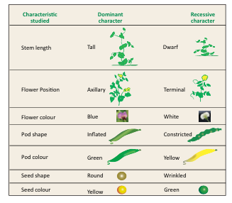
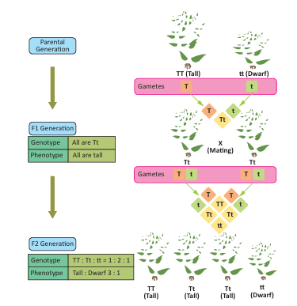
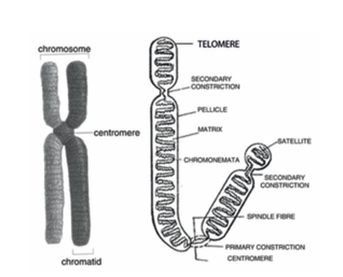
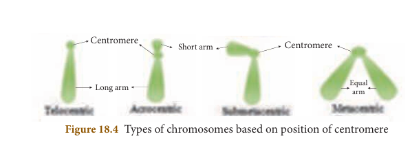
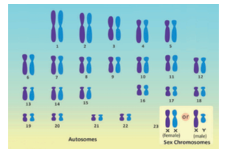
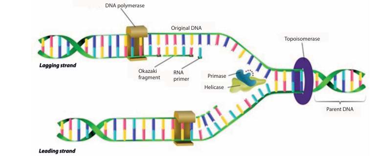
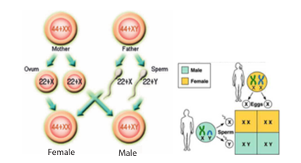

# UNIT 18: GENETICS

## Learning Objectives
At the end of this lesson the students will be able to:
- Know about Mendelian laws.
- Differentiate between phenotype and genotype.
- Understand the process of monohybrid and dihybrid cross.
- Differentiate between a chromosome, DNA and gene.
- Understand the structure of chromosome.
- Classify the chromosomes based on the position of centromere.
- Understand the structure and replication of DNA.
- Define mutation and classify the chromosomal and gene mutation.
- Identify the chromosomal abnormality of Down's syndrome.

## INTRODUCTION

"Like Begets Like" is an important and universal phenomenon of life as the living beings produce offspring of their own kind. Colour of eye, color of hair, shape of nose, type of earlobe, etc, are inheritable traits. Have you ever wondered, how do we inherit traits and characteristics from our father and mother? Some of our characteristics might have been inherited from our grandparents. How do we inherit characters from one generation to another? It is because of the genes we inherit from our parents. These genes are responsible for the physical outlook and biological functions. The branch of biology that deals with the genes, genetic variation and heredity of living organisms is called genetics. Heredity is transmission of characters, from one generation to the next generation, while variation refers to the differences shown by the individuals of the same species and also by the offspring of the same parents. All these can happen only due to chromosomes. Now let's see what chromosomes are and how they are composed with DNA, that form the genetic material.

---

## 18.1 Gregor Johann Mendel - Father of Genetics

Mendel (1822-1884) was an Austrian monk who discovered the basic principles of heredity through his experiments. His experiments are the foundation for modern genetics. He was born in 1822 to a family of farmers in Silesian of Czechoslovakia. After finishing his high school at the age of 18, he entered the Augustinian Monastery at Brunn as a priest. From there he went to the University of Vienna for training in physics, mathematics and natural science. Mendel returned to the monastery in 1854 and continued to work as a priest and teach in high school. In his leisure time he started his famous experiments on the garden pea plant. He conducted his experiments in the monastery for about seven years from 1856 to 1863. He had worked on nearly 10000 pea plants of 34 different varieties. Mendel noted that they differ from one another in many ways. Thus Mendel had chosen 7 pairs of contrasting characters for his study as shown in the table.

**Table 18.1 Constrasting characters of pea plant used by Mendel**




---

## 18.2 Monohybrid Cross

### Inheritance of One Gene
Crosses involving inheritance of only one pair of contrasting characters are called monohybrid crosses. For example it is a cross between two forms of a single trait like a cross between tall and dwarf plant.

### Mendel's Explanation of Monohybrid Cross
**Parental generation:** Pure breeding tall plant and a pure breeding dwarf plant.

**F_{1} generation:** Plants raised from the seeds of pure breeding parental cross in F_{1} generation were tall and monohybrids.

**F_{2} generation:** Selfing of the F_{1} monohybrids resulted in tall and dwarf plants respectively in the ratio of 3:1. The actual number of tall and dwarf plants obtained by Mendel was 787 tall and 277 dwarf. External expression of a particular trait is known as phenotype. So the phenotypic ratio is 3:1.

In the F_{2} generation 3 different types were obtained:
- Tall Homozygous - TT (Pure) - 1
- Tall Heterozygous - Tt - 2
- Dwarf Homozygous - tt - 1



**Figure 18.1** Monohybrid cross

So the genotypic ratio 1:2:1. A genotype is the genetic constitution of an organism

### Reasons for Mendel's success
He chose the pea plant as it was advantageous for experimental work in many aspects
1. It is naturally self-pollinating and so is very easy to raise pure breeding individuals.
2. It has a short life span as it is an annual and so it was possible to follow several generations.
3. It is easy to cross-pollinate.
4. It has deeply defined contrasting characters.
5. The flowers are bisexual.

### Mendel's Interpretation on Monohybrid cross
Based on these observations it was confirmed by Mendel that 'factors' are passed on from one generation to another, now refered to as genes. Tallness and Dwarfness are determined by a pair of contrasting factors, tall plant possess a pair of factors (represented by T- taking the first letter of the dominant character) and a plant is dwarf because it possess factors for dwarfness (represented as t- recessive character). These factors occur in pairs and may be alike as in pure breeding tall plants (TT) and dwarf plants (tt). This is referred to as homozygous. If they are unlike (Tt) they are referred to as heterozygous.

1. Two factors making up a pair of contrasting characters are called alleles. Phenotypic expression of alleles are called allelomorphs. One member of each pair is contributed by one parent.
2. When two factors for alternative expression of a trait are brought together by fertilization. The character which expresses itself is called dominant (Tallness) condition and that which is masked is called recessive condition (Dwarfness).
3. The factors are always pure and when gametes are formed, the unit factors segregate so that each gamete gets one of the two alternative factors. It means that factors for tallness(T) and dwarfness(t) are separate entities and in a gamete either T or t is present. When F_{1} hybrids are self crossed the two entities separate and then unite independently, forming tall and dwarf plants.

> **Info bits**
> Punnett square is a checker board form devised by a British geneticist R.C.Punnett for study of genetics. It is a graphical representation to calculate the probability of all possible genotypes of offsprings in a genetic cross.

---

## 18.3 Dihybrid Cross- Inheritance Two Genes and Law of Independent Assortment

Dihybrid cross involves the inheritance of two pairs of contrasting characteristics (or contrasting traits) at the same time. The two pairs of contrasting characteristics chosen by Mendel were shape and colour of seeds: round-yellow seeds and wrinkled-green seeds.

Mendel crossed pea plants having round-yellow seeds with pea plants having wrinkled-green seeds. Mendel made the following observations:

1. Mendel first crossed pure breeding pea plants having round-yellow seeds with pure breeding pea plants having wrinkled-green seeds and found that only round-yellow seeds were produced in the first generation (F_{1}). No wrinkled-green seeds were obtained in the F_{1} generation. From this it was concluded that round shape and yellow colour of the seeds were dominant traits over the wrinkled shape and green color of the seeds.
2. When the hybrids of F_{1} generation pea plants having round-yellow seeds were cross-bred by self pollination, then four types of seeds having different combinations of shape and color were obtained in second generation or F_{2} generation. They were round yellow, round-green, wrinkled yellow and wrinkled-green seeds.


**Figure 18.2** Dihybrid Cross

The ratio of each phenotype (or appearance) of seeds in the F_{2} generation is 9:3:3:1. This is known as the Dihybrid ratio.

From the above results it can be concluded that the factors for each character or trait remain independent and maintain their identity in the gametes. The factors are independent to each other and pass to the offsprings (through gametes).

### Results of a Dihybrid Cross:
Mendel got the following results from his dihybrid cross
1. **Four Types of Plants:** A dihybrid cross produced four types of F_{2} offsprings in the ratio of 9 with two dominant traits, 3 with one dominant trait and one recessive trait, 3 with another dominant trait and another recessive trait and 1 with two recessive traits.
2. **New Combination:** Two new combinations of traits with round green and wrinkled yellow had appeared in the dihybrid cross (F_{1} generation).

---

## 18.4 Mendel's Laws

Based on his experiments of monohybrid and dihybrid cross, Mendel proposed three important laws which are now called as Mendel's Laws of Heredity.

**Law of Dominance:**
"When two homozygous individuals with one or more sets of contrasting characters are crossed, the characters that appear in the F_{1} hybrid are dominant and those that do not appear in F_{1} are recessive characters".

**Law of Segregation or Law of purity of gametes:**
"When a pair of contrasting factors are brought together in a F_{1} hybrid. The two factors of the allelic pair remain together without mixing and when gametes are formed, the two separate out, so that only one enters each gamete."

**Law of independent assortment:**
"In case of inheritance of two or more pairs of characters simultaneously, the factors or genes of one pair assort out independently of the other pair."

> **More to Know**
> T.H. Morgan was awarded Nobel Prize in 1993 for determining the role of chromosomes in heredity.

---

## 18.5 Chromosomes, DNA and Genes

The human body is made up of million cells. The nucleus of each cell contains thin thread like structures called chromosomes. The term 'chromosomes' was first coined by Waldeyer in 1888. The chromosomes are the carrier of genetic material which contain the heredity information.

The chromosomes are highly condensed coiled chromatin fibres packed with the DNA (Deoxyribonucleic acid) that forms the genetic material. Genes are segments of DNA, which are responsible for the inheritance of a particular phenotypic character. Each gene is present at a specific position on a chromosome called its locus. During cell division, the genetic information present in the genes are passed from one generation to another.

### 18.5.1 Structure of a Chromosome

The chromosomes are thin, long and thread like structures consisting of two identical strands called sister chromatids. They are held together by the centromere. Each chromatid is made up of spirally coiled thin structure called chromonema. The chromonema has number of bead-like structures along its length which are called chromomeres.

The chromosomes are made up of DNA, RNA, chromosomal proteins (histones and non-histones) and certain metallic ions. These proteins provide structural support to the chromosome.



**Figure 18.3** Structure of chromosome

A chromosome consists of the following regions
- **Primary constriction:** The two arms of a chromosome meet at a point called primary constriction or centromere. The centromere is the region where spindle fibres attach to the chromosomes during cell division.
- **Secondary constriction:** Some chromosomes possess secondary constriction at any point of the chromosome. They are known as the nuclear zone or nucleolar organizer (formation of nucleolus in the nucleus).
- **Telomere:** The end of the chromosome is called telomere. Each extremity of the chromosome has a polarity and prevents it from joining the adjacent chromosome. It maintains and provides stability to the chromosomes.
- **Satellite:** Some of the chromosomes have an elongated knob-like appendage at one end of the chromosome known as satellite. The chromosomes with satellites are called as the sat-chromosomes.

> **DO YOU KNOW?**
> Telomeres act as aging clock in every cell. Telomeres are protective sequences of nucleotides found in chromosomes. As a cell divides every time, they become shorter. Telomeres get too short to do their job, causing our cells to age.

### 18.5.2 Types of Chromosomes based on the position of Centromere

Based on the position of centromere, the chromosomes are classified as Telocentric, Acrocentric, Submetacentric and Metacentric

1. **Telocentric:** The centromere is found on the proximal end. They are rod shaped chromosomes.
2. **Acrocentric:** The centromere is found at the one end with a short arm and a long arm. They are also rod-shaped chromosomes.
3. **Submetacentric:** The centromere is found near the centre of the chromosome. Thus forming two unequal arms. They are J shaped or L shaped chromosomes.
4. **Metacentric:** The centromere occurs in the centre of the chromosome and form two equal arms. They are V shaped chromosomes.



**Figure 18.4** Types of chromosomes based on position of centromere

### 18.5.3 Types of Chromosomes based on function

The eukaryotic chromosomes are classified into autosomes and allosomes.

**Autosomes** contain genes that determine the somatic (body) characters. Male and female have equal number of autosomes.

**Allosomes** are chromosomes which are responsible for determining the sex of an individual. They are also called as sex chromosomes or hetero-chromosomes. There are two types of sex chromosomes, X and Y- chromosomes. Human males have one X chromosome and one Y chromosome and human females have two X chromosomes.

### 18.5.4 Karyotype

The number of chromosomes in any living organism (animal or plant) is constant. In human, each cell normally contains 23 pairs of chromosomes. Out of which 22 pairs are autosomes and the 23rd pair is the allosome or sex chromosome.

In the body cells of sexually reproducing organisms, the chromosomes generally occur in pairs. This condition is called diploid (2n). The gametes produced by the organisms contain a single set of chromosomes. Hence, the gametes are said to be haploid (n).

Karyotype is the number, size and shape of chromosomes in the cell nucleus of an organism. Idiogram is the diagrammatic representation of karyotype of a species. It consists of all the metaphasic chromosomes arranged in homologous pairs according to decreasing length, thickness, position of centromere, shape etc., with the sex chromosomes placed at the end.



**Figure 18.5** Normal human karyotype

---

## 18.6 Structure of DNA

DNA is the hereditary material as it contains the genetic information. It is the most important constituent of a chromosome. The most widely accepted model of DNA is the double helical structure of James Watson and Francis Crick. They proposed the three-dimensional model of DNA on the basis of X-ray diffraction studies of DNA obtained by Rosalind Franklin and Maurice Wilkins. In appreciation of their discoveries on the molecular structure of nucleic acids Watson, Crick and Wilkins were awarded Nobel prize for Medicine in 1962.

**Chemical Composition of DNA molecule**
DNA is a large molecule consisting of millions of nucleotides. Hence, it is also called a polynucleotide. Each nucleotide consists of three components.
1. A sugar molecules - Deoxyribose sugar.
2. A nitrogenous base. There are two types of nitrogenous bases in DNA. They are
   (a) Purines (Adenine and Guanine)
   (b) Pyrimidines (Cytosine and Thymine)
3. A phosphate group

**Nucleoside and Nucleotide**
- Nucleoside = Nitrogen base + Sugar
- Nucleotide = Nucleoside + Phosphate

The nucleotides are formed according to the purines and pyrimidines present in them.


**Figure 18.6** Structure of DNA

### 18.6.1 Watson and Crick model of DNA

1. DNA molecule consists of two polynucleotide chains.
2. These chains form a double helix structure with two strands which run anti-parallel to one another.
3. Nitrogenous bases in the centre are linked to sugar-phosphate units which form the backbone of the DNA.
4. Pairing between the nitrogenous bases is very specific and is always between purine and pyrimidine linked by hydrogen bonds.
   * Adenine (A) links Thymine (T) with two hydrogen bonds (A = T)
   * Cytosine (C) links Guanine (G) with three hydrogen bonds (C \equiv G)
   This is called complementary base pairing.
5. Hydrogen bonds between the nitrogenous bases make the DNA molecule stable.
6. Each turn of the double helix is 34 Å (3.4 nm). There are ten base pairs in a complete turn.
7. The nucleotides in a helix are joined together by phosphodiester bonds.


**Figure 18.7** Nucleotides in a DNA

> **More to Know**
> **Chargaff rule of DNA base pairing**
> Erwin Chargaff states that in DNA, the proportion of adenine is always equal to that of thymine. and the proportion of guanine always equal to that of cytosine.

### 18.6.2 DNA Replication

DNA replication is one of the basic process that occurs within a cell. DNA molecule produces exact copies of its own structure during replication process. The two strands of a DNA molecule have complementary base pairs, the nucleotides of each strand provide the information needed to produce its new strand. The two resulting daughter cells contain exactly the same genetic information as the parent cell.

DNA replication involves the following steps:

**Origin of replication**
The specific points on the DNA, where the replication begins, is the site of origin of replication. The two strands open and separate at this point forming the replication fork.

**Unwinding of DNA molecule**
The enzyme called helicase, bind to the origin of replication site. Helicase separates the two strands of the DNA. The enzyme called topoisomerase separates the double helix above the replication fork and removes the twists formed during the unwinding process. Each of the separated DNA strands function as a template.

**Formation of RNA primer**
An RNA primer is a short segment of RNA nucleotides. The primer is synthesized by the DNA template close to the origin of replication site.

**Synthesis of new complementary strand from the parent strand**
After the formation of RNA primer, nucleotides are added with the help of an enzyme DNA polymerase and a new complementary strand of DNA is formed from each of the parent strand. The synthesis is unidirectional.

In one strand, the daughter strand is synthesized as a continuous strand which is called **leading strand**. In the other strand, short segments of DNA are synthesized. This strand is called **lagging strand**. The short segments of DNA are called **Okazaki fragments**. The fragments are joined together by the enzyme, **DNA ligase**.

The replication stops when the replication fork of the two sides meet at a site called terminus, which is situated opposite to origin of replication site.



**Figure 18.8** Replication of DNA

### 18.6.3 Significance of DNA
- It is responsible for the transmission of hereditary information from one generation to next generation.
- It contains information required for the formation of proteins.
- It controls the developmental process and life activities of an organism.

---

## 18.7 Sex Determination

The formation of zygote into male or female sex during development is called sex determination. Sex is determined by the chromosomes of an individual.

### 18.7.1 Sex Determination in Human

Recall that human beings have 23 pairs of chromosomes out of which 22 pairs are autosomes and one pair (23rd pair) is the sex chromosome. The female gametes or the eggs formed are similar in their chromosome type (22+XX). Therefore, human females are homogametic.

The male gametes or sperms produced are of two types. They are produced in equal proportions. The sperm bearing (22+X) chromosomes and the sperm bearing (22+Y) chromosomes. The human males are called heterogametic.



**Figure 18.9** Sex determination in human

It is a chance of probability as to which category of sperm fuses with the egg. If the egg (X) is fused by the X-bearing sperm an XX individual (female) is produced. If the egg (X) is fused by the Y-bearing sperm an XY individual (male) is produced. The sperm, produced by the father, determines the sex of the child. The mother is not responsible in determining the sex of the child.

Now let's see how the chromosomes take part in this formation. Fertilization of the egg (22+X) with a sperm (22+X) will produce a female child (44+XX). while fertilization of the egg (22+X) with a sperm (22+Y) will give rise to a male child (44+XY).

### 18.7.2 Mutation

The term mutation was introduced by Hugo De Vries in 1901 when he observed phenotypic changes in the evening primrose plant, Oenothera lamarckiana. Mutation is an inheritable sudden change in the genetic material (DNA) of an organism. Mutations are classified into two main types, namely chromosomal mutation and gene mutation.

**1. Chromosomal mutation**
The sudden change in the structure or number of chromosomes is called chromosomal mutation. This may result in:
**(i) Changes in the structure of chromosomes:** Structural changes in the chromosomes usually occurs due to errors in cell division. Changes in the number and arrangement of genes takes place as a result of deletion, duplication, inversion and translocation in chromosomes.
**(ii) Changes in the number of chromosomes:** They involve addition or deletion in the number of chromosomes present in a cell. This is called ploidy. There are two types of ploidy:
(a) Euploidy (b) Aneuploidy.

**Euploidy:** It is the condition in which the individual bears more than the usual number of diploid (2n) chromosomes. If an individual has three haploid sets of chromosomes, the condition is called triploidy (3n). Triploid plants and animals are typically sterile. If it has four haploid sets of chromosomes, the condition is called tetraploidy (4n). Tetraploid plants are advantageous as they often result in increased fruit and flower size.

> **DO YOU KNOW?**
> Sickle cell anaemia is caused by the mutation of a single gene. Alteration in the gene brings a change in the structure of the protein part of haemoglobin molecule. Due to the change in the protein molecule, the red blood cell (RBC) that carries the haemoglobin is sickle shaped.


**Figure 18.10** Euploidy

**Aneuploidy:** It is the loss or gain of one or more chromosomes in a set. It is of three types. Monosomy (2n-1), Trisomy (2n+1) and Nullisomy (2n-2). In man, Down's syndrome is one of the commonly known aneuploid condition.

**Down's syndrome**
This condition was first identified by a doctor named Langdon Down in1866. It is a genetic condition in which there is an extra copy of chromosome 21 (Trisomy 21). It is associated with mental retardation, delayed development, behavioural problems, weak muscle tone, vision and hearing disability are some of the conditions seen in these children.


**Figure 18.11** Aneuploidy

**2. Gene or point mutation**
Gene mutation is the changes occurring in nucleotide sequence of a gene. It involves substitution, deletion, insertion or inversion of a single or more than one nitrogenous base. Gene alteration results i   n abnormal protein formation in an organism.

---

## Points to Remember

- Variations are quite apparent among closely related groups of organisms.
- Mendel had choosen seven pairs of distinguishing traits: flower colour, position, seed colour, shape, pod colour, pod shape, stem length.
- Every pea plant has two 'factors' which are responsible for producing a particular character or trait is called allele.
- The process of acquiring characters or traits from parents is called 'Heredity'.
- Each human cell contains 23 pairs of chromosomes. Out of these 22 pairs are called autosomes and one pair is called allosomes.
- A chromosome consists of the regions: primary constriction, centromere, secondary constriction, telomere and satellite.
- Based on the position of the centromere, the chromosomes are classified as telocentric, acrocentric, sub metacentric and metacentric chromosomes.
- Each nucleotide of DNA consists of a deoxyribose sugar, a nitrogenous base and a phosphate group. Pairing is always between a purine and a pyrimidine.
- The sperm, produced by the father, determines the sex of the child. The mother is not responsible in determining the sex of the child.
- Mutation is an inheritable change in the genetic material of an organism.

---

## TEXTBOOK EVALUATION

### I. Choose the correct answer

1. According to Mendel alleles have the following character
   - a) Pair of genes
   - b) Responsible for character
   - c) Production of gametes
   - d) Recessive factors

2. 9:3:3:1 ratio is due to
   - a) Segregation
   - b) Crossing over
   - c) Independent assortment
   - d) Recessiveness

3. The region of the chromosome where the spindle fibres get attached during cell division
   - a) Chromomere
   - b) Centrosome
   - c) Centromere
   - d) Chromonema

4. The centromere is found at the centre of the chromosome.
   - a) Telocentric
   - b) Metacentric
   - c) Sub-metacentric
   - d) Acrocentric

5. The ________ units form the backbone of the DNA.
   - a) 5 carbon sugar
   - b) Phosphate
   - c) Nitrogenous bases
   - d) Sugar phosphate

6. Okasaki fragments are joined together by
   - a) Helicase
   - b) DNA polymerase
   - c) RNA primer
   - d) DNA ligase

7. The number of chromosomes found in human beings are
   - a) 22 pairs of autosomes and 1 pair of allosomes.
   - b) 22 autosomes and 1 allosome
   - c) 46 autosomes
   - d) 46 pairs autosomes and 1 pair of allosomes.

8. The loss of one or more chromosome in a ploidy is called
   - a) Tetraploidy
   - b) Aneuploidy
   - c) Euploidy
   - d) polyploidy

### II. Fill in the blanks

1. The pairs of contrasting character (traits) of Mendel are called ________
2. Physical expression of a gene is called ________
3. The thin thread like structures found in the nucleus of each cell are called ________
4. DNA consists of two ________ chains
5. An inheritable change in the amount or the structure of a gene or a chromosome is called ________

### III. Identify whether the statement are True or False. Correct the false statement

1. A typical Mendelian dihybrid ratio of F_{2} generation is 3:1.
2. A recessive factor is altered by the presence of a dominant factor.
3. Each gamete has only one allele of a gene.
4. Hybrid is an offspring from a cross between genetically different parent.
5. Some of the chromosomes have an elongated knob-like appendages known as telomere.
6. New nucleotides are added and new complementary strand of DNA is formed with the help of enzyme DNA polymerase.
7. Down's syndrome is the genetic condition with 45 chromosomes.

### IV. Match the following

| | |
|:---|:---|
| 1. Autosomes | Trisomy 21 |
| 2. Diploid condition | 9:3:3:1 |
| 3. Allosome | 22 pair of chromosome |
| 4. Down's syndrome | 2n |
| 5. Dihybrid ratio | 23rd pair of chromosome |

### V. Answer in a sentence

1. What is a cross in which inheritance of two pairs of contrasting characters are studied?
2. Name the conditions when both the alleles are identical?
3. A garden pea plant produces axial white flowers. Another of the same species produced terminal violet flowers. Identify the dominant trait?
4. What is the name given to the segments of DNA, which are responsible for the inheritance of a particular character?
5. Name the bond which binds the nucleotides in a DNA.

### VI. Short answers questions

1. Why did Mendel select pea plant for his experiments?
2. What do you understand by the term phenotype and genotype?
3. What are allosomes?
4. What are Okazaki fragments?
5. Why is euploidy considered to be advantageous to both plants and animals?
6. A pure tall plant (TT) is crossed with pure dwarf plant (tt), what would be the F_{1} and F_{2} generations? Explain.
7. Explain the structure of a chromosome.
8. Label the parts of the DNA in the diagram given below. Explain the structure briefly.

### VII. Long answer questions

1. Explain with an example the inheritance of dihybrid cross. How is it different from monohybrid cross?
2. How is the structure of DNA organised? What is the biological significance of DNA?
3. The sex of the new born child is a matter of chance and neither of the parents may be considered responsible for it. What would be the possible fusion of gametes to determine the sex of the child?

### VIII. Higher Order Thinking Skills (HOTS)

1. Flowers of the garden pea are bisexual and self-pollinated. Therefore, it is difficult to perform hybridization experiment by crossing a particular pistil with the specific pollen grains. How Mendel made it possible in his monohybrid and dihybrid crosses?
2. Pure-bred tall pea plants are first crossed with pure-bred dwarf pea plants. The pea plants obtained in F_{1} generation are then selfed to produce F_{2} generation of pea plants.
   - a. What do the plants of F_{1} generation look like?
   - b. What is the ratio of tall plants to dwarf plants in F_{2} generation?
   - c. Which type of plants were missing in F_{1} generation but reappeared in F_{2} generation?
3. Kavitha gave birth to a female baby. Her family members say that she can give birth to only female babies because of her family history. Is the statement given by her family members true. Justify your answer.

### IX. Value based question

1. Under which conditions does the law of independent assortment hold good and why?

---

## REFERENCE BOOKS

1. Veer Bala Rastogi, Introductory Cytology, Rastogi Publications, Meerut
2. P. S. Verma and V.K. Agarwal, Genetics, S. Chand and Company, New Delhi
3. Gerald Karp, Janet Iwasa and Wallace Marshall, Cell and Molecular Biology Concepts and Experiment, 8th Edition, Wiley and Sons Publishers

## INTERNET RESOURCES

1. https://www.genome.gov
2. https://www.genetics.edu.au
3. https://www.bioexplorer.net/chromosomal-mutation.html/
4. https://www.ndss.org/about-down-syndrome/down-syndrome/

---

## Concept Map

```text
Genetics
├── Chromosomes
│   ├── Structure
│   │   ├── Primary constriction
│   │   ├── Secondary constriction
│   │   ├── Centromere
│   │   ├── Telomere
│   │   └── Satellite
│   ├── Types of chromosome
│   │   ├── Telocentric
│   │   ├── Acrocentric
│   │   ├── Submetacentric
│   │   └── Metacentric
│   ├── Kinds of chromosomes
│   │   ├── Autosomes
│   │   └── Allosomes
│   └── Sex determination in human
│       ├── Male (44+XY)
│       └── Female (44+XX)
├── DNA
│   ├── Nucleotide
│   │   ├── a pentose sugar
│   │   ├── a nitrogenous base
│   │   └── a phosphate group
│   └── Replication
│       ├── Origin of replication
│       ├── Unwinding of DNA
│       ├── Formation of RNA primer
│       ├── Synthesis of new complementary DNA
│       └── Termination
├── Mutation
│   ├── Chromosomal mutation
│   │   ├── Changes in the structure
│   │   └── Changes in number
│   │       ├── Euploidy
│   │       ├── Aneuploidy
│   │       └── Down's syndrome
│   └── Gene mutation
│       ├── Substitution
│       ├── Deletion
│       ├── Insertion
│       └── Inversion
└── Mendel's Laws of Heredity
    ├── Law of Dominance
    ├── Law of Segregation
    └── Law of Independent assortment