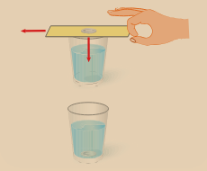
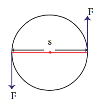
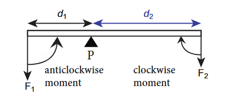
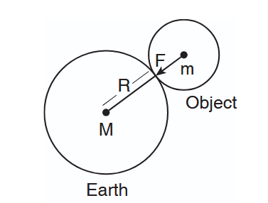
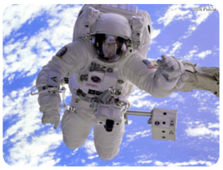

# UNIT1:LAWS OF MOTION

## Learning Objectives

At the end of this lesson students will be able to:

- Understand the concepts of force and motion.
- Explain inertia and its types.
- State the three laws of Newton.
- Apply Newtonian concept of force and motion.
- Define force, momentum and impulse.
- Distinguish between mass and weight
- Analyze weightlessness and the principle of conservation of momentum.
- Explain the law of gravitation and its applications.
- Understand the variations in 'g' due to height and depth.
- Solve numerical problems related to force and motion.

---

## INTRODUCTION

Human beings are so curious about things around them. Things around us are related to one another. Some bodies are at rest and some are in motion. Rest and motion are interrelated terms.

In the previous classes you have learnt about various types of motion such as linear motion, circular motion, oscillatory motion, and so on. So far, you have discussed the motion of bodies in terms of their displacement, velocity, and acceleration. In this unit, let us investigate the cause of motion.

When a body is at rest, starts moving, a question that arises in our mind is 'what causes the body to move?' Similarly, when a moving object comes to rest, you would like to know what brings it to rest? If a moving object speeds up or slows down or changes its direction, what speeds up or slows down the body? What changes the direction of motion?

One answer for all the above questions is 'Force'. In a common man's understanding of motion, a body needs a **push or pull** to move, or bring to rest or change its velocity. Hence, this 'push' or 'pull' is called as 'force'.

Let us define force in a more scientific manner using the three laws proposed by Sir Isaac Newton. These laws help you to understand the motion of a body and also to predict the future course of its motion, if you know the forces acting on it. Before Newton formulated his three laws of motion, a different perception about the force and motion of bodies prevailed. Let us first look at these ideas and then eventually learn about Newton's laws in this unit.

> **Mechanics** is the branch of physics that deals with the effect of force on bodies. It is divided into two branches, namely, statics and dynamics.
>
> **Statics:** It deals with the bodies, which are at rest under the action of forces.
>
> **Dynamics:** It is the study of moving bodies under the action of forces. Dynamics is further divided as:
>
> - **Kinematics:** It deals with the motion of bodies without considering the cause of motion.
> - **Kinetics:** It deals with the motion of bodies considering the cause of motion.

---

## 1.1 FORCE AND MOTION

According to Aristotle a Greek Philosopher and Scientist, the natural state of earthly bodies is 'rest'. He stated that a moving body naturally comes to rest without any external influence of the force. Such motions are termed as 'natural motion' (Force independent). He also proposed that a force (a push or a pull) is needed to make the bodies to move from their natural state (rest) and behave contrary to their own natural state called as 'violent motion' (Force dependent). Further, he said, when two different mass bodies are dropped from a height, the heavier body falls faster than the lighter one.

Galileo proposed the following concepts about force, motion and inertia of bodies:

(i) The natural state of all earthly bodies is either the state of rest or the state of uniform motion.

(ii) A body in motion will continue to be in the same state of motion as long as no external force is applied.

(iii) When a force is applied on bodies, they resist any change in their state. This property of bodies is called 'inertia'.

(iv) When dropped from a height in vacuum, bodies of different size, shape and mass fall at the same rate and reach the ground at the same time.

---

## 1.2 INERTIA

While you are travelling in a bus or in a car, when a sudden brake is applied, the upper part of your body leans in the forward direction. Similarly, when the vehicle suddenly is move forward from rest, you lean backward. This is due to, any body would like to continue to be in its state of rest or the state of motion. This is known as **inertia**.

The inherent property of a body to resist any change in its state of rest or the state of uniform motion, unless it is influenced upon by an external unbalanced force, is known as **inertia**.

### Activity 1

Take a glass tumbler and place a small cardboard on it as shown in the figure. Now, keep a coin at the centre of the cardboard. Then, flick the cardboard quickly. What do you observe?

The cardboard falls off the ground and the coin falls into the glass tumbler.



_Figure: Inertia of rest_

In activity described above, the inertia of the coin keeps it in the state of rest when the cardboard moves. Then, when the cardboard has moved, the coin falls into the tumbler due to gravity. This happen due to 'inertia of rest'.

### 1.2.1 Types of Inertia

a) **Inertia of rest:** The resistance of a body to change its state of rest is called inertia of rest.

b) **Inertia of motion:** The resistance of a body to change its state of motion is called inertia of motion.

c) **Inertia of direction:** The resistance of a body to change its direction of motion is called inertia of direction.

### 1.2.2 Examples of Inertia

- An athlete runs some distance before jumping. Because, this will help him jump longer and higher. _(Inertia of motion)_
- When you make a sharp turn while driving a car, you tend to lean sideways. _(Inertia of direction)._
- When you vigorously shake the branches of a tree, some of the leaves and fruits are detached and they fall down. _(Inertia of rest)._


_Figure 1.1 Inertia of motion_

---

## 1.3 LINEAR MOMENTUM

The impact of a force is more if the velocity and the mass of the body is more. To quantify the impact of a force exactly, a new physical quantity known as linear momentum is defined. The linear momentum measures the impact of a force on a body.

The product of mass and velocity of a moving body gives the magnitude of linear momentum. It acts in the direction of the velocity of the object. Linear momentum is a vector quantity.

**Linear Momentum = mass × velocity**

p=mv

It helps to measure the magnitude of a force. Unit of momentum in SI system is kg m s⁻¹ and in C.G.S system its unit is g cm s⁻¹.

---

## 1.4 NEWTON'S LAWS OF MOTION

### 1.4.1 Newton's First Law

This law states that every body continues to be in its state of rest or the state of uniform motion along a straight line unless it is acted upon by some external force. It gives the definition of force as well as inertia.

### 1.4.2 Force

Force is an external effort in the form of push or pull, which:

1. produces or tries to produce the motion of a static body.
2. stops or tries to stop a moving body.
3. changes or tries to change the direction of motion of a moving body.

Force has both magnitude and direction. So, it is a vector quantity.

### 1.4.3 Types of forces

Based on the direction in which the forces act, they can be classified into two types as:
(a) **Like parallel forces** and
(b) **Unlike parallel forces**.

**(a) Like parallel forces:** Two or more forces of equal or unequal magnitude acting along the same direction, parallel to each other are called like parallel forces.

**(b) Unlike parallel forces:** If two or more equal forces or unequal forces act along opposite directions parallel to each other, then they are called unlike parallel forces.

### 1.4.4 Resultant Force

When several forces act simultaneously on the same body, then the combined effect of the multiple forces can be represented by a single force, which is termed as 'resultant force'. It is equal to the vector sum (adding the magnitude of the forces with their direction) of all the forces.

Table 1.1 Action of forces


_a) Unlike parallel forces –Tug of war_


_b) Unbalanced forces -Action of a lever_


_(c) Like parallel forces_

_Figure 1.2: Combined effect of forces_

If the resultant force of all the forces acting on a body is equal to zero, then the body will be in equilibrium. Such forces are called **balanced forces**. If the resultant force is not equal to zero, then it causes the motion of the body due to **unbalanced forces**.

Examples: Drawing water from a well, force applied with a crow bar, forces on a weight balance, etc.

A system can be brought to equilibrium by applying another force, which is equal to the resultant force in magnitude, but opposite in direction. Such force is called as **'Equilibrant'**.

### 1.4.5 Rotating Effect of Force

Have you observed the position of the handle in a door? It is always placed at the edge of door and not at some other place. Why? Have you tried to push a door by placing your hand closer to the hinges or the fixed edge? What do you observe?

The door can be easily opened or closed when you apply the force at a point far away from the fixed edge. In this case, the effect of the force you apply is to turn the door about the fixed edge. This turning effect of the applied force is more when the distance between the fixed edge and the point of application of force is more.


_Figure 1.3: Rotating effect of a force_

The axis of the fixed edge about which the door is rotated is called as the **'axis of rotation'**. Fix one end of a rod to the floor/wall, and apply a force at the other end tangentially. The rod will be turned about the fixed point is called as **'point of rotation'**.

### 1.4.6 Moment of the Force

The rotating or turning effect of a force about a fixed point or fixed axis is called **moment of the force** about that point or **torque (τ)**. It is measured by the product of the force (F) and the perpendicular distance (d) between the fixed point or the fixed axis and the line of action of the force.

\tau = F \times d \quad ...(1.2)


Torque is a vector quantity. It is acting along the direction, perpendicular to the plane containing the line of action of force and the distance. Its SI unit is Nm.

**Couple:** Two equal and unlike parallel forces applied simultaneously at two distinct points constitute a couple. The line of action of the two forces does not coincide. It does not produce any translatory motion since the resultant is zero. But, a couple results in causes the rotation of the body. Rotating effect of a couple is known as moment of a couple.

Examples: Turning a tap, winding or unwinding a screw, spinning of a top, etc.

Moment of a couple is measured by the product of any one of the forces and the perpendicular distance between the line of action of two forces. The turning effect of a couple is measured by the magnitude of its moment.

M = F \times S \quad ...(1.3)


The unit of moment of a couple is newton metre (N m) in SI system and dyne cm in CGS system.

By convention, the direction of moment of a force or couple is taken as **positive** if the body is rotated in the anti-clockwise direction and **negative** if it is rotate in the clockwise direction.


_Figure 1.4(a): Clockwise moment_



_Figure 1.4(b): Anticlockwise moment_

### 1.4.7 Application of Torque

**1. Gears:**
A gear is a circular wheel with teeth around its rim. It helps to change the speed of rotation of a wheel by changing the torque and helps to transmit power.

**2. Seesaw**
Most of you have played on the seesaw. Since there is a difference in the weight of the persons sitting on it, the heavier person lifts the lighter person. When the heavier person comes closer to the pivot point (fulcrum) the distance of the line of action of the force decreases. It causes less amount of torque to act on it. This enables the lighter person to lift the heavier person.

**3. Steering Wheel**
A small steering wheel enables you to manoeuvre a car easily by transferring a torque to the wheels with less effort.

### 1.4.8 Principle of Moments

When a number of like or unlike parallel forces act on a rigid body and the body is in equilibrium, then the algebraic sum of the moments in the clockwise direction is equal to the algebraic sum of the moments in the anticlockwise direction. In other words, at equilibrium, the algebraic sum of the moments of all the individual forces about any point is equal to zero.



_Figure 1.5: Principle of moments_

In the illustration given in figure 1.5, the force F₁ produces an anticlockwise rotation at a distance d₁ from the point of pivot P (called fulcrum) and the force F₂ produces a clockwise rotation at a distance d₂ from the point of pivot P. The principle of moments can be written as follows:

\text{Moment in clockwise direction} = \text{Moment in anticlockwise direction}


F_1 \times d_1 = F_2 \times d_2 \quad ...(1.4)


---

## 1.5 NEWTON'S SECOND LAW OF MOTION

According to this law, "the force acting on a body is directly proportional to the rate of change of linear momentum of the body and the change in momentum takes place in the direction of the force".

This law helps us to measure the amount of force. So, it is also called as 'law of force'. Let, 'm' be the mass of a moving body, moving along a straight line with an initial speed 'u'. After a time interval of 't', the velocity of the body changes to **v** due to the impact of an unbalanced external force F.

- Initial momentum of the body: P_i = mu
  
- Final momentum of the body: P_f = mv
  
- Change in momentum: \Delta p = P_f - P_i = mv - mu
  

By Newton's second law of motion,

F \propto \text{rate of change of momentum}

F \propto \frac{\text{change in momentum}}{\text{time}}

F \propto \frac{mv - mu}{t}

F = k\frac{m(v-u)}{t}


Here, k is the proportionality constant. k = 1 in all systems of units. Hence,

\mathbf{F} = \frac{m(v-u)}{t}


Since, acceleration = change in velocity/time, a = \frac{(v-u)}{t}
. Hence, we have

\mathbf{F} = m \times \mathbf{a}


\text{Force} = \text{mass} \times \text{acceleration}


No external force is required to maintain the motion of a body moving with uniform velocity. When the net force acting on a body is not equal to zero, then definitely the velocity of the body will change. Thus, change in momentum takes place in the direction of the force. The change may take place either in magnitude or in direction or in both.

Force is required to produce the acceleration of a body. In a uniform circular motion, even though the speed (magnitude of velocity) remains constant, the direction of the velocity changes at every point on the circular path. So, the acceleration is produced along the radius called as centripetal acceleration. The force, which produces this acceleration is called as centripetal force, about which you have learnt in class IX.

**Units of force:** SI unit of force is newton (N) and in C.G.S system its unit is dyne.

**Definition of 1 newton (N):** The amount of force required for a body of mass 1 kg produces an acceleration of 1 m s⁻², 1 N = 1 \text{ kg m s}^{-2}


**Definition of 1 dyne:** The amount of force required for a body of mass 1 gram produces an acceleration of 1 cm s⁻², \mathbf{1 \text{ dyne}} = \mathbf{1} \text{ g cm s}^{-2}; also \mathbf{1 N} = \mathbf{10}^5 \text{ dyne}
.

**Unit force:** The amount of force required to produce an acceleration of 1 ms⁻² in a body of mass 1 kg is called 'unit force'.

**Gravitational unit of force:** In the SI system of units, gravitational unit of force is kilogram force, represented by kg f. In the CGS system its unit is gram force, represented by g f.

1 \text{ kgf} = 1 \text{ kg} \times 9.8 \text{ ms}^{-2} = 9.8 \text{ N};

1 \text{ gf} = 1 \text{ g} \times 980 \text{ cms}^{-2} = 980 \text{ dyne}


---

## 1.6 Impulse

A large force acting for a very short interval of time is called as **'Impulsive force'**. When a force F acts on a body for a period of time t, then the product of force and time is known as **'impulse'** represented by J.

\text{Impulse, } \mathbf{J} = \mathbf{F} \times \mathbf{t}


By Newton's second law:

F = \frac{\Delta p}{t} \quad (\Delta \text{ refers to change})

\Delta p = F \times t


From 1.7 and 1.8:

J = \Delta p


Impulse is also equal to the magnitude of change in momentum. Its unit is kg ms⁻¹ or Ns.

Change in momentum can be achieved in two ways. They are:
i. a large force acting for a short period of time and
ii. a smaller force acting for a longer period of time.

**Examples:**

- Automobiles are fitted with springs and shock absorbers to reduce jerks while moving on uneven roads.
- In cricket, a fielder pulls back his hands while catching the ball. He experiences a smaller force for a longer interval of time to catch the ball, resulting in a lesser impulse on his hands.


_Figure 1.6: Example of impulsive force_

---

## 1.7 NEWTON'S THIRD LAW OF MOTION

Newton's third law states that **'for every action, there is an equal and opposite reaction. They always act on two different bodies'**.

If a body A applies a force F_A on a body B, then the body B reacts with force F_B on the body A,

which is equal to F_A in magnitude, but opposite in direction. F_B = -F_A


**Examples:**

- When birds fly they push the air downwards with their wings (Action) and the air pushes the bird upwards (Reaction).
- When a person swims he pushes the water using the hands backwards (Action), and the water pushes the swimmer in the forward direction (Reaction).
- When you fire a bullet, the gun recoils backward and the bullet is moving forward (Action) and the gun equalises this forward action by moving backward (Reaction).

---

## 1.8 PRINCIPLE OF CONSERVATION OF LINEAR MOMENTUM

> There is no change in the linear momentum of a system of bodies as long as no net external force acts on them.

Let us prove the law of conservation of linear momentum with the following illustration:


_Figure 1.7: Conservation of linear momentum_

### Proof:

Let two bodies A and B having masses m_1 and m_2 move with initial velocity u_1 and u_2 in a straight line. Let the velocity of the first body be higher than that of the second body. i.e., u_1 > u_2. During an interval of time t second, they tend to have a collision. After the impact, both of them move along the same straight line with a velocity v_1 and v_2
 respectively.

Force on body B due to A,
F_A = \frac{m_2(v_2 - u_2)}{t}


Force on body A due to B,
F_B = \frac{m_1(v_1 - u_1)}{t}


By Newton's III law of motion,

\text{Action force} = \text{Reaction force}

F_B = -F_A

\frac{m_1(v_1 - u_1)}{t} = -\frac{m_2(v_2 - u_2)}{t}


m_1v_1 + m_2v_2 = m_1u_1 + m_2u_2 \quad ...(1.9)


The above equation confirms in the absence of an external force, the algebraic sum of the momentum after collision is numerically equal to sum of the momentum before collision.

Hence the law of conservation linear momentum is proved.

---

## 1.9 ROCKET PROPULSION

Propulsion of rockets is based on the law of conservation of linear momentum as well as Newton's III law of motion. Rockets are filled with a fuel (either liquid or solid) in the propellant tank. When the rocket is fired, this fuel is burnt and a hot gas is ejected with a high speed from the nozzle of the rocket, producing a huge momentum. To balance this momentum, an equal and opposite reaction force is produced in the combustion chamber, which makes the rocket project forward.

While in motion, the mass of the rocket gradually decreases, until the fuel is completely burnt out. Since, there is no net external force acting on it, the linear momentum of the system is conserved. The mass of the rocket decreases with altitude, which results in the gradual increase in velocity of the rocket. At one stage, it reaches a velocity, which is sufficient to just escape from the gravitational pull of the Earth. This velocity is called escape velocity. (This topic will be discussed in detail in higher classes).

---

## 1.10 GRAVITATION

### 1.10.1 Newton's universal law of gravitation

This law states that **every particle of matter in this universe attracts every other particle with a force**. This force is directly proportional to the product of their masses and inversely proportional to the square of the distance between the centers of these masses. The direction of the force acts along the line joining the masses.

Force between the masses is always attractive and it does not depend on the medium where they are placed.


_Figure 1.8: Gravitational force between two masses_

Let, m_1 and m_2
 be the masses of two bodies A and B placed r metre apart in space

\text{Force } F \propto m_1 \times m_2

F \propto \frac{1}{r^2}


On combining the above two expressions:

F \propto \frac{m_1 \times m_2}{r^2}


F = G\frac{m_1m_2}{r^2} \quad ...(1.10)


Where G is the **universal gravitational constant**. Its value in SI unit is 6.674 \times 10^{-11} \text{ N m}^2 \text{ kg}^{-2}
.

### 1.10.2 Acceleration due to gravity (g)

When you throw any object upwards, its velocity ceases at a particular height and then it falls down due to the gravitational force of the Earth.

The velocity of the object keeps changing as it falls down. This change in velocity must be due to the force acting on the object. The acceleration of the body is due to the Earth's gravitational force. So, it is called as **'acceleration due to the gravitational force of the Earth'** or **'acceleration due to gravity of the Earth'**. It is represented as **'g'**. Its unit is ms⁻².

Mean value of the acceleration due to gravity is taken as **9.8 m s⁻²** on the surface of the Earth. This means that the velocity of a body during the downward free fall motion varies by 9.8 ms⁻¹ for every 1 second. However, the value of g is not the same at all points on the surface of the earth.

### 1.10.3 Relation between g and G

When a body is at rests on the surface of the Earth, it is acted upon by the gravitational force of the Earth. Let us compute the magnitude of this force in two ways. Let, M be the mass of the Earth and m be the mass of the body. The entire mass of the Earth is assumed to be concentrated at its centre. The radius of the Earth is R = 6378 km (= 6400 km approximately). By Newton's law of gravitation, the force acting on the body is given by

F = \frac{GMm}{R^2}




_Figure 1.9: Relation between g and G_

Here, the radius of the body considered is negligible when compared with the Earth's radius. Now, the same force can be obtained from Newton's second law of motion. According to this law, the force acting on the body is given by the product of its mass and acceleration (called as weight). Here, acceleration of the body is under the action of gravity hence a = g

F = ma = mg

F = \text{weight} = mg \quad ...(1.12)


Comparing equations (1.7) and (1.8), we get

mg = \frac{GMm}{R^2}


\text{Acceleration due to gravity } \mathbf{g} = \frac{\mathbf{GM}}{\mathbf{R}^2}


### 1.10.4 Mass of the Earth (M)

Rearranging the equation (1.14), the mass of the Earth is obtained as follows:

\text{Mass of the Earth } M = \frac{gR^2}{G}


Substituting the known values of g, R and G, you can calculate the mass of the Earth as

\mathbf{M} = 5.972 \times 10^{24} \text{ kg}


### 1.10.5 Variation of acceleration due to gravity (g):

Since, g depends on the geometric radius of the Earth, (g \propto 1/R^2)
, its value changes from one place to another on the surface of the Earth. Since, the geometric radius of the Earth is maximum in the equatorial region and minimum in the polar region, the value of g is **maximum in the polar region** and **minimum at the equatorial region**.

When you move to a higher altitude from the surface of the Earth, the value of g reduces. In the same way, when you move deep below the surface of the Earth, the value of g reduces. (This topic will be discussed in detail in the higher classes). Value of g is zero at the centre of the Earth.

---

## 1.11 MASS AND WEIGHT

**Mass:** Mass is the basic property of a body. Mass of a body is defined as the quantity of matter contained in the body. Its SI unit is kilogram (kg).

**Weight:** Weight of a body is defined as the gravitational force exerted on a body due to the gravity.

\text{Weight} = \text{Gravitational Force} 
= \text{mass (m)} \times \text{acceleration due to gravity (g)}.


g = acceleration due to gravity for Earth (at sea level) = 9.8 ms⁻².

Weight is a vector quantity. Direction of weight is always towards the centre of the Earth. SI unit of weight is newton (N). Weight of a body varies from one place to another place on the Earth since it depends on the acceleration due to gravity of the Earth g (weight of a body is more at the poles than at the equatorial region.

The value of acceleration due to gravity on the surface of the moon is 1.625 ms⁻². This is about 0.1654 times the acceleration due to gravity of the Earth. If a person whose mass is 60 kg stands on the surface of Earth, his weight would be 588 N (W = mg = 60 × 9.8). If the same person goes to the surface of the Moon, he would weigh only 97.5 N (W = 60 × 1.625). But, his mass remains the same (60 kg) on both the Earth and the Moon.

---

## 1.12 APPARENT WEIGHT

The weight that you feel to possess during up and down motion, is not same as your actual weight. Apparent weight is the weight of the body acquired due to the action of gravity and other external forces acting on the body.

Let us see this from the following illustration:


_Figure 1.10: A person in a moving lift_

Let us consider a person of mass m, who is travelling in lift. The actual weight of the person is W = mg which is acting vertically downwards. The reaction force exerted by the lift's surface \mathbf{R}, taken as apparent weight is acting vertically upwards.

Let us see different possibilities of the apparent weight 'R' of the person that arise, depending on the motion of the lift; upwards or downwards which are given in Table 1.2

### 1.12.1 Weightlessness

Have you gone to an amusement park and taken a ride in a roller coaster? or in a giant wheel? During the fast downward and upward movement, how did you feel?


_Figure 1.11: Weightlessness in a roller coaster_

Its amazing!!. You actually feel as if you are falling freely without having any weight. This is due to the phenomenon of **'weightlessness'**. You seem to have lost your weight when you move down with a certain acceleration. Sometimes, you experience the same feeling while travelling in a lift.

When the person in a lift moves down with an acceleration (a) equal to the acceleration due to gravity (g), i.e., when a = g, this motion is called as **'free fall'**. Here, the apparent weight (R = m(g – g) = 0) of the person is zero. This condition or state refers to the **state of weightlessness**. (Refer case 4 from Table 1.2).

The same effect takes place while falling freely in a roller coaster or on a swing or in a vertical giant wheel. You feel an apparent weight loss and weight gain when you are moving up and down in such rides.

### 1.12.2 Weightlessness of the astronauts

Some of us believe that the astronauts in the orbiting spacestation do not experience any gravitational force of the Earth. So they float. But this is absolutely wrong.

Astronauts are not floating but falling freely around the earth due to their huge orbital velocity. Since spacestation and astronauts have equal acceleration, they are under free fall condition. (R = 0, refer case 4 in Table 1.2). Hence, both the astronauts and the spacestation are in the state of weightlessness.



_Figure 1.12: Weightlessness of astronauts_

### Table 1.2: Apparent weight of a person in a moving lift

| Case 1: Lift is moving upward with an acceleration 'a'                  | Case 2: Lift is moving downward with an acceleration 'a'                | Case 3: Lift is at rest.                                         | Case 4: Lift is falling down freely                                        |
| :---------------------------------------------------------------------- | :---------------------------------------------------------------------- | :--------------------------------------------------------------- | :------------------------------------------------------------------------- |
| R - W = F_net = ma_net <br> R = W + ma <br> R = mg + ma <br> R = m(g+a) | W - R = F_net = ma_net <br> R = W - ma <br> R = mg - ma <br> R = m(g-a) | Here, the acceleration is zero <br> a = 0 <br> R = W <br> R = mg | Here, the acceleration is equal to g <br> a = g <br> R = m(g-g) <br> R = 0 |
| R > W                                                                   | R < R = W                                                               | R = W                                                            | R = 0                                                                      |
| Apparent weight is greater than the actual weight.                      | Apparent weight is lesser than the actual weight.                       | Apparent weight is equal to the actual weight.                   | Apparent weight is equal to zero.                                          |

### 1.12.3 Application of Newton's law of gravitation

1. Dimensions of the heavenly bodies can be measured using the gravitation law. Mass of the Earth, radius of the Earth, acceleration due to gravity, etc. can be calculated with a higher accuracy.
2. Helps in discovering new stars and planets.
3. One of the irregularities in the motion of stars is called 'Wobble' lead to the disturbance in the motion of a planet nearby. In this condition the mass of the star can be calculated using the law of gravitation.
4. Helps to explain germination of roots is due to the property of geotropism which is the property of a root responding to the gravity.
5. Helps to predict the path of the astronomical bodies.

---

## Points to Remember

- Mechanics is divided into statics and dynamics.
- Ability of a body to maintain its state of rest or motion is called Inertia.
- Moment of the couple is measured by the product of any one of the forces and the perpendicular distance between two forces.
- SI unit of force is newton (N). C.G.S unit is dyne.
- When a force F acts on a body for a period of time t, then the product of force and time is known as 'impulse'.
- The unit of weight is newton or kg f
- The weight of a body is more at the poles than at the equatorial region.
- Mass of a body is defined as the quantity of matter contained in the object. Its SI unit is kilogram (kg).
- Apparent weight is the weight of the body acquired due to the action of gravity and other external forces on the body.
- Whenever a body or a person falls freely under the action of Earth's gravitational force alone, it appears to have zero weight. This state is referred to as 'weightlessness'.

---

## SOLVED PROBLEMS

**Problem-1:** Calculate the velocity of a moving body of mass 5 kg whose linear momentum is 2.5 kg m s⁻¹.

**Solution:**
Linear momentum = mass × velocity
Velocity = linear momentum / mass.
V = 2.5 / 5 = 0.5 m s⁻¹

---

**Problem 2:** A door is pushed, at a point whose distance from the hinges is 90 cm, with a force of 40 N. Calculate the moment of the force about the hinges.

**Solution:**
Formula: The moment of a force M = F × d
Given: F = 40 N and d = 90 cm = 0.9 m.
Hence, moment of the force = 40 × 0.9 = 36 N m.

---

**Problem 3:** At what height from the centre of the Earth the acceleration due to gravity will be 1/4th of its value as at the Earth.

**Solution:**
Data: Height from the centre of the Earth, R' = R + h
The acceleration due to gravity at that height, g' = g/4

g = GM/R², g' = GM/R'²

\frac{g}{g'} = \left(\frac{R'}{R}\right)^2 = \left(\frac{R+h}{R}\right)^2 = \left(1 + \frac{h}{R}\right)^2


4 = \left(1 + \frac{h}{R}\right)^2

2 = 1 + \frac{h}{R} \quad \text{or } h = R


From the centre of the Earth, the object is placed at twice the radius of the earth.

---

## REFERENCE BOOKS

- Concept of physics - HC verma
- Interactive physics (Newton's law) MTG learning.

## INTERNET RESOURCES

- https://www.grc.nasa.gov
- https://www.physicsclassroom.com
- https://www.britannica.com/science/Newtons-law-of-gravitation

---

## Concept Map

```
Kinematics
├── Statics
└── Dynamics
    ├── Aristotle
    ├── Galileo
    └── Issac Newton
        ├── First law of motion → Inertia and its types
        ├── Second law of motion → Momentum and force → Mass and weight
        ├── Third law of motion → Apparent weight → Weightlessness
        └── Gravitation → Universal law of gravitation → Variation of g
```

---

## ICT CORNER

### Newton's second law

- Open the browser and type "olabs.edu.in" in the address bar. Click physics tab and then click "Newton's second " under class 9 section. Go to "simulator" tab to do the experiment.
- Select the desired Cart mass (M₁) and vertical mass (M₂) using respective slider. Also select the desired distance (s) by moving the slider. Click on the "Start" button to start the experiment.
- Observe the time and note it down. Calculate acceleration (a) of the cart using the formula a = 2s/t². Find the force due to rate of change of momentum using (M₁+M₂)a.
- Calculate force F = M₂g.
- You will observe (M₁+M₂)a = M₂g. Hence Newton's Second Law is verified. Repeat the experiment with different masses. Also do this in different environment like Earth, Moon, Uranus and Jupiter. Click reset to restart the experiment.

**Link:** http://amrita.olabs.edu.in/?sub=1&brch=1&sim=44&cnt

```

```
