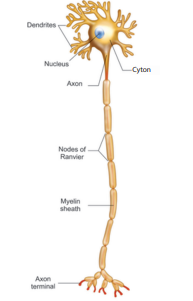

# UNIT 15: NERVOUS SYSTEM

## Learning Objectives
At the end of the lesson the students will be able to:
* Admire nervous system as the control and coordinating centre of the body.
* Learn the components of the nervous system.
* Analyse the transmission of nerve impulses.
* Understand the divisions of human nervous system.
* Interpret the different sections of brain which handle different functions.
* Know the significance of reflex action and its operative pathway.

## Introduction
One of the characteristic features of all living organisms is responding to stimuli. 'Stimulus' refers to the changes in the environmental condition, that are detected by receptors present in the body. Relevant changes in the activities of organisms to a particular stimuli are called their reactions or responses. Living organisms show their response to different kinds of stimuli like light, heat, cold, sound, smell, taste, touch, pressure, pain or the force of gravity etc. For example, withdrawal of hand when we touch hot objects or closing the eyes when flashed with bright light, in this condition heat or light is the stimulus to which the body shows its response. Thus, on receiving a stimulus, the body responds in a manner that is most appropriate for its survival and functioning.

To provide the correct response to a stimulus, it is necessary that all the organs work together in a proper coordinated manner. This working together of various organs in a systematic, controlled and efficient way to produce proper response to various stimuli is called coordination. In animals including human the coordination between the various cells and organs is essential for their diverse activities to maintain physiological balance called homeostasis. In this unit we shall learn about one of the major regulatory systems the nervous system and its control over the body activities.

## 15.1 Nervous System
The nervous system is made up of nervous tissues. It is formed of three distinct components namely the neurons, neuroglia and nerve fibres.

(i) **Neuron or nerve cell:** A neuron or nerve cell is the structural and functional unit of the nervous system. It is the longest cell of the human body with a length of over 100µm. These cells are highly specialised to detect, receive and transmit different kinds of stimuli. Information is conducted through neurons in the form of electrical impulses from one part of the body to another.

(ii) **Neuroglia:** Neuroglia are also called as glial cells. They are non-exciting, supporting cell of the nervous system. They do not initiate or conduct nerve impulses.

(iii) **Nerve fibres:** The nerve fibres are the long slender processes of neurons. A number of nerve fibres are bundled up together to form nerves.

### 15.1.1 Structure of Neuron
A neuron typically consists of three basic parts: Cyton, Dendrites and Axon.



**Fig. 15.1** Structure of Neuron

(i) **Cyton:** Cyton is also called cell body or perikaryon. It has a central nucleus with abundant cytoplasm called neuroplasm. The cytoplasm has large granular body called Nissl's granules and the other cell organelles like mitochondria, ribosomes, lysosomes, and endoplasmic recticulum. Neurons do not have the ability to divide. Several neurofibrils are present in the cytoplasm that help in transmission of nerve impulses to and from the cell body.

(ii) **Dendrites:** These are the numerous branched cytoplasmic processes that project from the surface of the cell body. They conduct nerve impulses towards the cyton. The branched projections increase the surface area for receiving the signals from other nerve cells.

(iii) **Axon:** The axon is a single, elongated, slender projection. The end of axon terminates as fine branches which terminate into knob like swellings called synaptic knob. The plasma membrane of axon is called axolemma, while the cytoplasm is called axoplasm. It carries impulses away from the cyton. The axons may be covered by a protective sheath called myelin sheath which is further covered by a layer of Schwann cells called neurilemma. Myelin sheath breaks at intervals by depressions called Nodes of Ranvier. The region between the nodes is called as internode. Myelin sheath acts as insulator and ensures rapid transmission of nerve impulses.

**Synapse:** A junction between synaptic knob of axon of one neuron and dendron of next neuron is called synaptic junction. Information from one neuron can pass to another neuron through these junctions with the release of chemicals known as neurotransmitters from the synaptic knob.

**Activity 1**
Create a model of a neuron using clay or beads.

### 15.1.2 Types of Neurons
The neurons may be of different types based on their structure and functions.


**Fig. 15.2** Unipolar (A), Bipolar (B) and multipolar (C) neurons

Structurally the neurons may be of the following types:
(i) **Unipolar neurons:** Only one nerve process arises from the cyton which acts as both axon and dendron.
(ii) **Bipolar neurons:** The cyton gives rise to two nerve processes of which one acts as an axon while another as a dendron.
(iii) **Multipolar neurons:** The cyton gives rise to many dendrons and an axon.

| Types | Location |
| :--- | :--- |
| **Unipolar Neurons** | Found in early embryos but not in adult |
| **Bipolar Neurons** | Found in retina of eye and olfactory epithelium of nasal chambers |
| **Multipolar Neurons** | Found in cerebral cortex of brain |

On the basis of functions neurons are categorised as:-
(i) Sensory or afferent neurons which carry impulses from the sense organ to the central nervous system.
(ii) Motor or efferent neurons which carry impulses from the central nervous system to effector organ such as the muscle fibre or the gland.
(iii) Association neurons conduct impulses between sensory and motor neurons.

### 15.1.3 Types of Nerve Fibres
Nerve fibres are of two types based on the presence or absence of myelin sheath.
(i) **Myelinated nerve fibre:** The axon is covered with myelin sheath.
(ii) **Non-myelinated nerve fibre:** The axon is not covered by myelin sheath.

Myelinated and non-myelinated nerve fibres form the white matter and grey matter of the brain.

## 15.2 Transmission of Nerve Impulse
All the information from the environment are detected by the receptors located in our sense organs such as the eyes, the nose, the skin etc. Information from the receptors is transmitted as electrical impulse and is received by the dendritic tips of the neuron. This impulse travels from the dendrite to the cell body and then along the axon to its terminal end. On reaching the axonal end, it causes the nerve endings to release a chemical (neurotransmitter) which diffuses across a synapse and starts a similar electrical impulse in the dendrites of the next neuron, then to their cell body to be carried along the axon.

In this way, the electrical signal reaches the brain or spinal cord. The response from brain (or spinal cord) is similarly passed on to the effector organs such as the muscle or gland cell, that undergoes the desired response.


**Fig. 15.3** Nerve impulse transmission

The flow of nerve impulses from axonal end of one neuron to dendrite of another neuron through a synapse is called synaptic transmission.

**DO YOU KNOW?**
Each neuron can transmit 1,000 nerve impulses per second and make as many as ten thousands of synaptic contacts with other neurons.

### 15.2.1 Neurotransmitters
Neurotransmitters are the chemicals which allow the transmission of nerve impulse from the axon terminal of one neuron to the dendron of another neuron or to an effector organ. The important neurotransmitter released by neurons is called Acetylcholine.

## 15.3 Human Nervous System
The complexity of nervous system can be observed during the course of evolution. We the human beings differ from other animals in our ability to think and take actions, which is due to the well developed nervous system.

Human nervous system is differentiated into central nervous system (CNS), peripheral nervous system (PNS) and autonomic nervous system (ANS).
The CNS acts as centre for information processing and control. It consists of the brain and the spinal cord. The PNS is made up of the nerves which connect the brain and spinal cord to all parts of the body. The ANS is formed of sympathetic and parasympathetic nerves.

### 15.3.1 Central Nervous System
The brain and the spinal cord being delicate vital structures are well protected in bony cavities of the skull and the vertebral column respectively. CNS is formed of two types of matter such as white matter or grey matter with respect to the presence or absence of myelin sheath which we have discussed earlier.

**Brain**


**Fig. 15.4** Meninges of Brain

The brain is the controlling centre of all the body activities. It is covered by three connective tissue membrane or meninges:
(i) **Duramater** (dura: tough; mater: membrane) is the outermost thick fibrous membrane
(ii) **Arachnoid membrane** (arachnoid: spider) is the middle, thin vascular membrane providing web like cushion
(iii) **Piamater** (Pia: soft or tender) is the innermost, thin delicate membrane richly supplied with blood.

Meningeal membranes protect the brain from mechanical injury.

**DO YOU KNOW?**
Meningitis is an inflammation of the meninges. It can occur when fluid surrounding the meninges becomes infected. The most common causes of meningitis are viral and bacterial infections.

A human brain is formed of three main parts: (a) forebrain (b) midbrain and (c) hindbrain.


**Fig. 15.5** L.S of Human Brain

**Forebrain:** The forebrain is formed of cerebrum and diencephalon. The latter consists of dorsal thalamus and ventral hypothalamus.

**Cerebrum**
It is the largest portion forming nearly two-third of the brain. The cerebrum is longitudinally divided into two halves as right and left cerebral hemispheres by a deep cleft called median cleft. Two cerebral hemispheres are interconnected by thick band of nerve fibres called corpus callosum. The outer portion of each cerebral hemisphere is formed of grey matter and is called cerebral cortex. The inner or deeper part is formed of white matter and is called cerebral medulla. The cortex is extremely folded forming elevations called gyri with depressions between them termed as sulci that increase its surface area. Each cerebral hemisphere is divisble into a frontal lobe, a parietal lobe, a temporal lobe and an occipital lobe. These lobes are also known as cerebral lobes and are associated with specific functions. Any damage in specific lobe inturn affects its function. The cerebrum is responsible for the thinking, intelligence, consciousness, memory, imagination, reasoning and willpower.

**Thalamus**
Thalamus present in cerebral medulla is a major conducting centre for sensory and motor signalling. It acts as a relay centre.

**Hypothalamus**
It lies at the base of the thalamus. It controls involuntary functions like hunger, thirst, sleep, sweating, sexual desire, anger, fear, water balance, blood pressure etc. It acts as a thermoregulatory (temperature control) center of the body. It controls the secretion of hormones from anterior pituitary gland and is an important link between nervous system and endocrine system.

**Midbrain**
It is located between thalamus and hind brain. The dorsal portion of the mid brain consists of four rounded bodies called corpora quadrigemina that control visual and auditory (hearing) reflexes.

**Hindbrain**
It is formed of three parts cerebellum, pons and medulla oblongata.

**DO YOU KNOW?**
The human brain constitutes nearly 60 percent of fat. The most crucial molecules that determine our brain's integrity and the ability are Essential Fatty Acids (EFAs). EFAs cannot be synthesised and must be obtained from food. Fish, green leafy vegetables, almond, walnut are rich sources of EFAs.

**Cerebellum**
It is second largest part of the brain formed of two large sized hemispheres and middle vermis. It coordinates voluntary movements and also maintains body balance.

**Pons**
'Pons' a latin word meaning bridge. It is a bridge of nerve fibre that connects the lobes of cerebellum. It relay signals between the cerebellum, spinal cord, midbrain and cerebrum. It controls respiration and sleep cycle.

**Medulla Oblongata**
Medulla oblongata is the posterior most part of the brain that connects spinal cord and various parts of brain. It has cardiac centres, respiratory centres, vasomotor centres to control heart beat, respiration and contractions of blood vessels respectively. It also regulates vomiting and salivation.

**Table 15.1 Overview of brain functions**

| Structure | Functions |
| :--- | :--- |
| **Cerebral cortex** | Sensory preception, control of voulntary functions, language, thinking, memory, decision making, creativity |
| **Thalamus** | Acts as relay station |
| **Hypothalamus** | Temperature control, thirst, hunger, urination, important link between nervous system and endocrine glands |
| **Cerebellum** | Maintenance of posture and balance, coordinate voluntary muscle activity |
| **Pons and medulla** | Role in sleep-awake cycle, cardiovascular, respiratory and digestive control centers |

**More to Know**
Electroencephalogram (EEG) is an instrument which records the electrical impulses of brain. An EEG can detect abnormalities in the brain waves and help in diagnoses of seizures, epilepsy, brain tumors, head injuries, etc.

**Spinal Cord**
Spinal cord is a cylindrical structure lying in the neural canal of the vertebral column. It is also covered by meninges. It extends from the lower end of medulla oblongata to the first lumbar vertebra. The posterior most region of spinal cord tapers into a thin fibrous thread like structure called filum terminale. Internally, the spinal cord contains a cerebrospinal fluid filled cavity known as the central canal.

The grey matter of spinal cord is 'H' shaped. The upper end of letter 'H' forms posterior horns and lower end forms anterior horns. A bundle of fibres pass into the posterior horn forming dorsal or afferent root. Fibres pass outward from the anterior horn forming ventral or efferent root. These two roots joins to form spinal nerves. The white matter is external and have bundle of nerve tracts. Spinal cord conducts sensory and motor impulses to and from the brain. It controls reflex actions of the body.


**Fig. 15.6** Structure of spinal cord

## 15.4 Cerebrospinal Fluid
The brain is suspended in a special fluid environment called cerebrospinal fluid (CSF). It is lymph like, watery fluid that surrounds and protects the brain within the skull. It also fills the central canal of the spinal cord.

**Functions:**
(i) It acts as shock absorbing fluid and protects the brain from damage when it is subjected to sudden jerk.
(ii) It supplies nutrients to the brain.
(iii) It collects and removes wastes from the brain.
(iv) It is also responsible for maintaining a constant pressure inside the cranium.

## 15.5 Reflex Action
A reflex is any response that occurs automatically without consciouness. There are two types of reflexes.
(i) **Simple or basic reflexes:** These reflexes are inbuilt and unlearned responses. Many of the actions we perform in our day to day life are simple reflexes. e.g., winking of eyes when any dust particles enters, sneezing, coughing, yawning, etc. We perform these actions without thinking.
(ii) **Acquired or conditioned reflexes:** These reflexes are the result of practice and learning. Playing harmonium by striking a particular key on seeing a music note is an example of conditioned reflexes which required conscious training effort. Can you think of some more examples of conditioned reflexes?

Most of the reflex actions are monitored and controlled by the spinal cord, hence also known as spinal reflexes. The pathway taken by nerve impulse to accomplish reflex action is called reflex arc.

Now, let us understand how the body executes reflex action when we touch a hot plate.
(i) When we touch a very hot pan, the stimulus is the heat which is sensed by receptor called as heat receptors or thermoreceptors in our hand. This stimulus (heat) inturn triggers an impulse in sensory neuron.


**Fig. 15.7** Reflex action and its pathway

(ii) The sensory neuron transmits or conveys the message to the spinal cord.
(iii) Spinal cord interprets the stimulus and the impulse is passed on to the relay neuron which inturn transmits it to a motor neuron.
(iv) Motor neurons carry command from spinal cord to our arm.
(v) Muscle in our arm contracts and we withdraw our hand immediately from the pan.

In this example, muscle is an effector organ which has responded to the heat. You will study in higher classes how the neuronal impulse triggers the muscular movement.

## 15.6 Peripheral Nervous System
Peripheral nervous system is formed by the nerves arising from the brain and the spinal cord. The nerves arising from the brain are called cranial nerves. Nerves arising from spinal cord are called spinal nerves.

**Cranial Nerves**
In man, there are 12 pairs of cranial nerves. Some of the cranial nerves are sensory e.g. optic nerve which innervates the eye. Some are motor nerves which helps in rotation of eyeball. It also innervates the eye muscles, muscles of iris and tear gland.

**Spinal Nerves**
There are 31 pairs of spinal nerves. Each spinal nerve has a dorsal sensory root and the ventral motor root. The direction of impulses in dorsal spinal root is towards the spinal cord and in ventral spinal root away from the spinal cord.

## 15.7 Autonomic Nervous System
Autonomic nervous system (ANS) is also called as visceral nervous system as it regulates the function of internal visceral organs of our body through its two antagonistic (opposite) components sympathetic and parasympathetic systems. They enable the body to perform rapid and specific visceral activities in order to maintain steady state. It controls the involuntary functions of the visceral organs.


**Fig. 15.8** Sympathetic and Parasympathetic nervous system

**Activity 2**
You must say the colour of the word but not the name of the word.

| | | | |
| :--- | :--- | :--- | :--- |
| BLUE | RED | YELLOW | ORANGE |
| GREEN | BLUE | PURPLE | RED |
| PURPLE | YELLOW | RED | BLUE |

**Activity 3**


## Points to Remember
* Nervous system controls and coordinates the activities of our body.
* Neuron is the structural and functional unit of the cell and has three parts- cyton, dendrites and axon.
* A receptor is a cell or group of cells that receives the stimuli.
* An effector is a part of the body which can respond to a stimulus according to the instructions from the brain or the spinal cord.
* CNS is formed of brain and spinal cord. PNS consists of all nerves which connect brain and spinal cord to all parts of the body.
* ANS operates automatically and formed of sympathetic and parasympathetic nerves.
* A reflex action is a rapid, automatic response to a stimulus which is not under the voluntary control of the brain.


## REFERENCE BOOKS
1. Guyton and Hall, 2003, Textbook of Medical Physiology; Harcourt Indian Private Limited.
2. Sherwood. L., 2007, Human Physiology: From cells to systems 6th Edition, Indian edition, Thomson Brooks/Cole.
3. Singh, H.D., 2007, Handbook of Basic Human Physiology for Paramedical Students. S. Chand and Company Ltd. New Delhi.

## INTERNET RESOURCES
1. http://www.britannica.com/science/nervous-system
2. http://www.sumanasine.com/webcontent/animations/neurobiology.html

## Concept Map
```text
HUMAN NERVOUS SYSTEM
├── Central Nervous System
│   ├── Brain
│   └── Spinal Cord
├── Peripheral Nervous System
│   ├── Cranial Nerves
│   └── Spinal Nerves
└── Autonomic Nervous System
    ├── Parasympathetic Nerves
    └── Sympathetic Nerves