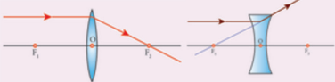
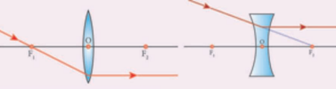
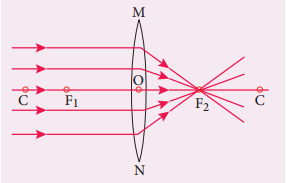
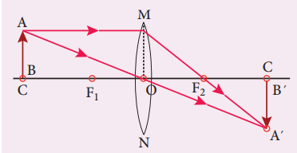
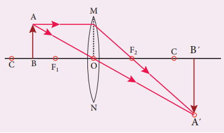
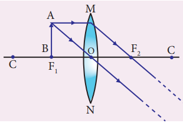
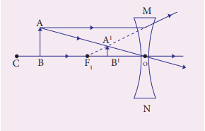
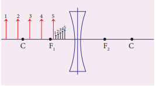
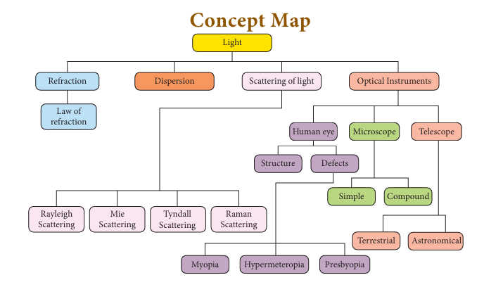
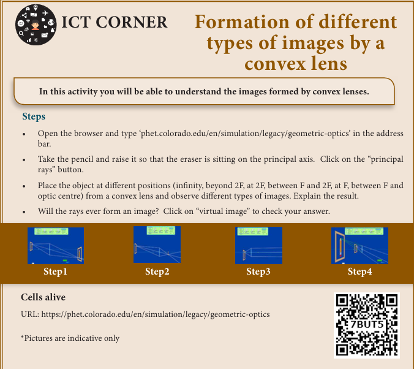

# UNIT 2: OPTICS

## Learning Objectives
At the end of this lesson, students will be able to:
- State the laws of refraction.
- List the properties of light.
- Explain the scattering of light and its various kinds.
- Understand the images formed by concave and convex lens.
- Analyze the ray diagram of concave and convex lens.
- Understand the working of human eye and optical instruments.
- Solve numerical problems.

---

## INTRODUCTION

Light is a form of energy which travels in the form of waves. The path of light is called ray of light and group of these rays are called as beam of light. Any object which gives out light are termed as source of light. Some of the sources emit their own light and they are called as luminous objects. All the stars, including the Sun, are examples for luminous objects.

We all know that we are able to see objects with the help of our eyes. But, we cannot see any object in a dark room. Can you explain why? If your answer is 'we need light to see objects', the next question is 'if you make the light from a torch to fall on your eyes, will you be able to see the objects?' Definitely, 'NO'. We can see the objects only when the light is made to fall on the objects and the light reflected from the objects is viewed by our eyes.

You would have studied about the reflection and refraction of light elaborately in your previous classes. In this chapter, we shall discuss about the scattering of light, images formed by convex and concave lenses, human eye and optical instruments such as telescopes and microscopes.

---

## 2.1 PROPERTIES OF LIGHT

Let us recall the properties of light and the important aspects on refraction of light.

1. Light is a form of energy.
2. Light always travels along a straight line.
3. Light does not need any medium for its propagation. It can even travel through vacuum.
4. The speed of light in vacuum or air is, c = 3 × 10⁸ ms⁻¹.
5. Since, light is in the form of waves, it is characterized by a wavelength (λ) and a frequency (ν), which are related by the following equation: c = νλ (c - velocity of light).
6. Different coloured light has different wavelength and frequency.
7. Among the visible light, violet light has the lowest wavelength and red light has the highest wavelength.
8. When light is incident on the interface between two media, it is partly reflected and partly refracted.

---

## 2.2 REFRACTION OF LIGHT

When a ray of light travels from one transparent medium into another obliquely, the path of the light undergoes deviation. This deviation of ray of light is called refraction. Refraction takes place due to the difference in the velocity of light in different media. The velocity of light is more in a rarer medium and less in a denser medium. Refraction of light obeys two laws of refraction.

### 2.2.1 First law of refraction:
The incident ray, the refracted ray of light and the normal to the refracting surface all lie in the same plane.

### 2.2.2 Second law of refraction:
The ratio of the sine of the angle of incidence and sine of the angle of refraction is equal to the ratio of refractive indices of the two media. This law is also known as Snell's law.


\frac{\sin i}{\sin r} = \frac{\mu_2}{\mu_1}


- Refractive index gives us an idea of how fast or how slow light travels in a medium. The ratio of speed of light in vacuum (c) to the speed of light in a medium (v) is defined as refractive index 'μ' of that medium.


\mu = \frac{c}{v}


- The speed of light in a medium is low if the refractive index of the medium is high and vice versa.
- When light travels from a denser medium into a rarer medium, the refracted ray is bent away from the normal drawn to the interface.
- When light travels from a rarer medium into a denser medium, the refracted ray is bent towards the normal drawn to the interface.

---

## 2.3 REFRACTION OF A COMPOSITE LIGHT - DISPERSION OF LIGHT

We know that Sun is the fundamental and natural source of light. If a source of light produces a light of single colour, it is known as a monochromatic source. On the other hand, a composite source of light produces a white light which contains light of different colours. Sun light is a composite light which consists of light of various colours or wavelengths. Another example for a composite source is a mercury vapour lamp.

What do you observe when a white light is refracted through a glass prism?

When a beam of white light or composite light is refracted through any transparent media such as glass or water, it is split into its component colours. This phenomenon is called as 'dispersion of light'.

The band of colours is termed as spectrum. This spectrum consists of following colours: Violet, Indigo, Blue, Green, Yellow, Orange, and Red. These colours are represented by the acronym "VIBGYOR".

Why do we get the spectrum when white light is refracted by a transparent medium? This is because, different coloured lights are bent through different angles. That is the angle of refraction is different for different colours.

Angle of refraction is the smallest for red and the highest for violet. From Snell's law, we know that the angle of refraction is determined in terms of the refractive index of the medium. Hence, the refractive index of the medium is different for different coloured lights. This indicates that the refractive index of a medium is dependent on the wavelength of the light.

---

## 2.4 SCATTERING OF LIGHT

When sunlight enters the Earth's atmosphere, the atoms and molecules of different gases present in the atmosphere refract the light in all possible directions. This is called as 'Scattering of light'. In this phenomenon, the beam of light is redirected in all directions when it interacts with a particle of medium. The interacting particle of the medium is called as 'scatterer'.

*Figure 2.1 Scattering of light*

### 2.4.1 Types of scattering

When a beam of light, interacts with a constituent particle of the medium, it undergoes many kinds of scattering. Based on initial and final energy of the light beam, scattering can be classified as:

1. **Elastic scattering**
2. **Inelastic scattering**

#### 1) Elastic scattering
If the energy of the incident beam of light and the scattered beam of light are same, then it is called as 'elastic scattering'.

#### 2) Inelastic scattering
If the energy of the incident beam of light and the scattered beam of light are not same, then it is called as 'inelastic scattering'.

The nature and size of the scatterer results in different types of scattering. They are:
- Rayleigh scattering
- Mie scattering
- Tyndall scattering
- Raman scattering

### Rayleigh scattering
The scattering of sunlight by the atoms or molecules of the gases in the earth's atmosphere is known as Rayleigh scattering.

#### Rayleigh's scattering law
Rayleigh's scattering law states that, "The amount of scattering of light is inversely proportional to the fourth power of its wavelength".


\text{Amount of scattering} \propto \frac{1}{\lambda^4}


According to this law, the shorter wavelength colours are scattered much more than the longer wavelength colours.

When sunlight passes through the atmosphere, the blue colour (shorter wavelength) is scattered to a greater extent than the red colour (longer wavelength). This scattering causes the sky to appear in blue colour.

At sunrise and sunset, the light rays from the Sun have to travel a larger distance in the atmosphere than at noon. Hence, most of the blue lights are scattered away and only the red light which gets least scattered reaches us. Therefore, the colour of the Sun is red at sunrise and sunset.

### Mie scattering
Mie scattering takes place when the diameter of the scatterer is similar to or larger than the wavelength of the incident light. It is also an elastic scattering. The amount of scattering is independent of wavelength.

Mie scattering is caused by pollen, dust, smoke, water droplets, and other particles in the lower portion of the atmosphere.

Mie scattering is responsible for the white appearance of the clouds. When white light falls on the water drop, all the colours are equally scattered which together form the white light.

### Tyndall Scattering
When a beam of sunlight, enters into a dusty room through a window, then its path becomes visible to us. This is because, the tiny dust particles present in the air of the room scatter the beam of light. This is an example of Tyndall Scattering.

The scattering of light rays by the colloidal particles in the colloidal solution is called Tyndall Scattering or Tyndall Effect.

&gt; **Do you Know**
&gt; Colloid is a microscopically small substance that is equally dispersed throughout another material. Example: Milk, Ice cream, muddy water, smoke

### Raman scattering
When a parallel beam of monochromatic (single coloured) light passes through a gas or liquid or transparent solid, a part of light rays are scattered.

The scattered light contains some additional frequencies (or wavelengths) other than that of incident frequency (or wavelength). This is known as Raman scattering or Raman Effect.

Raman Scattering is defined as "The interaction of light ray with the particles of pure liquids or transparent solids, which leads to a change in wavelength or frequency."

The spectral lines having frequency equal to the incident ray frequency is called 'Rayleigh line' and the spectral lines which are having frequencies other than the incident ray frequency are called 'Raman lines'. The lines having frequencies lower than the incident frequency is called stokes lines and the lines having frequencies higher than the incident frequency are called Antistokes lines.

You will study more about Raman Effect in higher classes.

---

## 2.5 LENSES

A lens is an optically transparent medium bounded by two spherical refracting surfaces or one plane and one spherical surface.

Lens is basically classified into two types. They are:
(i) Convex Lens
(ii) Concave Lens

**(i) Convex or bi-convex lens:** It is a lens bounded by two spherical surfaces such that it is thicker at the centre than at the edges. A beam of light passing through it, is converged to a point. So, a convex lens is also called as converging lens.

**(ii) Concave or bi-concave Lens:** It is a lens bounded by two spherical surfaces such that it is thinner at the centre than at the edges. A parallel beam of light passing through it, is diverged or spread out. So, a concave lens is also called as diverging lens.

### 2.5.1 Other types of Lenses

**Plano-convex lens:** If one of the faces of a bi-convex lens is plane, it is known as a plano-convex lens.

**Plano-concave lens:** If one of the faces of a bi-concave lens is plane, it is known as a plano-concave lens.

---

## 2.6 IMAGES FORMED DUE TO REFRACTION THROUGH A CONVEX AND CONCAVE LENS

When an object is placed in front of a lens, the light rays from the object fall on the lens. The position, size and nature of the image formed can be understood only if we know certain basic rules.

**Rule-1:** When a ray of light strikes the convex or concave lens obliquely at its optical centre, it continues to follow its path without any deviation (Figure 2.3).

**Rule-2:** When rays parallel to the principal axis strikes a convex or concave lens, the refracted rays are converged to (convex lens) or appear to diverge from (concave lens) the principal focus (Figure 2.4).

**Rule-3:** When a ray passing through (convex lens) or directed towards (concave lens) the principal focus strikes a convex or concave lens, the refracted ray will be parallel to the principal axis (Figure 2.5).

---

## 2.7 REFRACTION THROUGH A CONVEX LENS

Let us discuss the formation of images by a convex lens when the object is placed at various positions.

### Object at infinity
When an object is placed at infinity, a real image is formed at the principal focus. The size of the image is much smaller than that of the object (Figure 2.6).

### Object placed beyond C (&gt;2F)
When an object is placed behind the center of curvature (beyond C), a real and inverted image is formed between the center of curvature and the principal focus. The size of the image is the smaller than that of the object (Figure 2.7).

### Object placed at C
When an object is placed at the center of curvature, a real and inverted image is formed at the other center of curvature. The size of the image is the same as that of the object (Figure 2.8).

### Object placed between F and C
When an object is placed in between the center of curvature and principal focus, a real and inverted image is formed behind the center of curvature. The size of the image is bigger than that of the object (Figure 2.9).

### Object placed at the principal focus F
When an object is placed at the focus, a real image is formed at infinity. The size of the image is much larger than that of the object (Figure 2.10).

### Object placed between the principal focus F and optical centre O
When an object is placed in between principal focus and optical centre, a virtual image is formed. The size of the image is larger than that of the object (Figure 2.11).

---

## 2.8 APPLICATIONS OF CONVEX LENSES

1. Convex lenses are used as camera lenses
2. They are used as magnifying lenses
3. They are used in making microscope, telescope and slide projectors
4. They are used to correct the defect of vision called hypermetropia

---

## 2.9 REFRACTION THROUGH A CONCAVE LENS

Let us discuss the formation of images by a concave lens when the object is placed at two possible positions.

### Object at Infinity
When an object is placed at infinity, a virtual image is formed at the focus. The size of the image is much smaller than that of the object (Figure 2.12).

### Object anywhere on the principal axis at a finite distance
When an object is placed at a finite distance from the lens, a virtual image is formed between optical center and focus of the concave lens. The size of the image is smaller than that of the object (Figure 2.13).

But, as the distance between the object and the lens is decreased, the distance between the image and the lens also keeps decreasing. Further, the size of the image formed increases as the distance between the object and the lens is decreased. This is shown in (Figure 2.14).

---

## 2.10 APPLICATIONS OF CONCAVE LENSES

1. Concave lenses are used as eye lens of 'Galilean Telescope'
2. They are used in wide angle spy hole in doors.
3. They are used to correct the defect of vision called 'myopia'

---

## 2.11 LENS FORMULA

Like spherical mirrors, we have lens formula for spherical lenses. The lens formula gives the relationship among distance of the object (u), distance of the image (v) and the focal length (f) of the lens. It is expressed as:


\frac{1}{f} = \frac{1}{v} - \frac{1}{u}


It is applicable to both convex and concave lenses. We need to give an at most care while solving numerical problems related to lenses in taking proper signs of different quantities.

---

## 2.12 SIGN CONVENTION

Cartesian sign conventions are used for measuring the various distances in the ray diagrams of spherical lenses. According to cartesian sign convention,

1. The object is always placed on the left side of the lens.
2. All the distances are measured from the optical centre of the lens.
3. The distances measured in the same direction as that of incident light are taken as positive.
4. The distances measured against the direction of incident light are taken as negative.
5. The distances measured upward and perpendicular to the principal axis is taken as positive.
6. The distances measured downward and perpendicular to the principal axis is taken as negative.

---

## 2.13 MAGNIFICATION OF A LENS

Like spherical mirrors, we have magnification for spherical lenses. Spherical lenses produce magnification and it is defined as the ratio of the height of the image to the height of an object. Magnification is denoted by the letter 'm'. If height of the object is h and height of the image is h', the magnification produced by lens is:


m = \frac{\text{height of the image}}{\text{height of the object}} = \frac{h'}{h}


Also it is related to the distance of the object (u) and the distance of the image (v) as follows:


m = \frac{\text{Distance of the image}}{\text{Distance of the object}} = \frac{v}{u}


If the magnification is greater than 1, then we get an enlarged image. On the other hand, if the magnification is less than 1, then we get a diminished image.

---

## 2.14 LENS MAKER'S FORMULA

All lenses are made up of transparent materials. Any optically transparent material will have a refractive index. The lens formula relates the focal length of a lens with the distance of object and image. For a maker of any lens, knowledge of radii of curvature of the lens is required. This clearly indicates the need for an equation relating the radii of curvature of the lens, the refractive index of the given material of the lens and the required focal length of the lens. The lens maker's formula is one such equation. It is given as:


\frac{1}{f} = (\mu - 1)\left(\frac{1}{R_1} - \frac{1}{R_2}\right)


where μ is the refractive index of the material of the lens; R₁ and R₂ are the radii of curvature of the two faces of the lens; f is the focal length of the lens.

---

## 2.15 POWER OF A LENS

When a ray of light falls on a lens, the ability to converge or diverge these light rays depends on the focal length of the lens. This ability of a lens to converge (convex lens) or diverge (concave lens) is called as its power. Hence, the power of a lens can be defined as the degree of convergence or divergence of light rays. Power of a lens is numerically defined as the reciprocal of its focal length.


P = \frac{1}{f}


The SI unit of power of a lens is dioptre. It is represented by the symbol D. If focal length is expressed in 'm', then the power of lens is expressed in 'D'. Thus 1D is the power of a lens, whose focal length is 1 metre. 1D = 1 m⁻¹.

By convention, the power of a convex lens is taken as positive whereas the power of a concave lens is taken as negative.

&gt; **More to Know**
&gt; The lens formula and lens maker's formula are applicable to only thin lenses. In the case of thick lenses, these formulae with little modifications are used.

### Table 2.1 Differences between a Convex Lens and a Concave Lens

| S. No | Convex Lens | Concave Lens |
|-------|-------------|--------------|
| 1 | A convex lens is thicker in the middle than at edges. | A concave lens is thinner in the middle than at edges. |
| 2 | It is a converging lens. | It is a diverging lens. |
| 3 | It produces mostly real images. | It produces virtual images. |
| 4 | It is used to treat hypermeteropia. | It is used to treat myopia. |

---

## 2.16 HUMAN EYE

The human eyes are most valuable and sensitive organs responsible for vision. They are the gateway to the wonderful world.

### Structure of the eye
The eye ball is approximately spherical in shape with a diameter of about 2.3 cm. It consists of a tough membrane called sclera, which protects the internal parts of the eye.

**Important parts of human eye are:**

**Cornea:** This is the thin and transparent layer on the front surface of the eyeball as shown in figure 2.15. It is the main refracting surface. When light enters through the cornea, it refracts or bends the light on to the lens.

**Iris:** It is the coloured part of the eye. It may be blue, brown or green in colour. Every person has a unique colour, pattern and texture. Iris controls amount of light entering into the pupil like camera aperture.

**Pupil:** It is the centre part of the Iris. It is the pathway for the light to retina.

**Retina:** This is the back surface of the eye. It is the most sensitive part of human eye, on which real and inverted image of objects is formed.

**Eye Lens:** It is the important part of human eye. It is convex in nature.

**Ciliary muscles:** Eye lens is fixed between the ciliary muscles. It helps to change the focal length of the eye lens according to the position of the object.

### Working of the eye
The transparent layer cornea bends the light rays through pupil located at the centre part of the Iris. The adjusted light passes through the eye lens. Eye lens is convex in nature. So, the light rays from the objects are converged and a real and inverted image is formed on retina. Then, retina passes the received real and inverted image to the brain through optical nerves. Finally, the brain senses it as erect image.

### Power of Accommodation
The ability of the eye lens to focus nearby as well as the distant objects is called power of accommodation of the eye. This is achieved by changing the focal length of the eye lens with the help of ciliary muscles.

Eye lens is made of a flexible, jelly-like material. By relaxing and contracting the ciliary muscle, the curvature and hence the focal length of the eye lens can be altered. When we see distant objects, the ciliary muscle relaxes and makes the eye lens thinner. This increases the focal length of the eye lens. Hence, the distant object can be clearly seen. On the other hand, when we look at a closer object, the focal length of the eye lens is decreased by the contraction of ciliary muscle. Thus, the image of the closer object is clearly formed on the retina.

### Persistence of vision
If the time interval between two consecutive light pulses is less than 1/16 second, human eye cannot distinguish them separately. It is called persistence of vision.

### The far point and near point of the human eye
The minimum distance required to see the objects distinctly without strain is called least distance of distinct vision. It is called as near point of eye. It is 25 cm for normal human eye.

The maximum distance up to which the eye can see objects clearly is called as far point of the eye. It is infinity for normal eye.

---

## 2.17 DEFECTS IN EYE

A normal human eye can clearly see all the objects placed between 25 cm and infinity. But, for some people, the eye loses its power of accommodation. This could happen due to many reasons including ageing. Hence, their vision becomes defective. Let us discuss some of the common defects of human eye.

### Myopia
Myopia, also known as short sightedness, occurs due to the lengthening of eye ball. With this defect, nearby objects can be seen clearly but distant objects cannot be seen clearly. The focal length of eye lens is reduced or the distance between eye lens and retina increases. Hence, the far point will not be infinity for such eyes and the far point has come closer. Due to this, the image of distant objects are formed before the retina (Figure 2.16-a). This defect can be corrected using a concave lens (Figure 2.16-b).

The focal length of the concave lens to be used is computed as follows:

Let a person with myopia eye can see up to a distance x. Suppose that he wants to see all objects farther than this distance, i.e., up to infinity. Then the focal length of the required concave lens is f = -x.

If the person can see up to a distance x and if he wishes to see up to a distance y, then, the focal length of the required concave lens is:


f = \frac{xy}{x-y}


### Hypermeteropia
Hypermeteropia, also known as long sightedness, occurs due to the shortening of eye ball. With this defect, distant objects can be seen clearly but nearby objects cannot be seen clearly. The focal length of eye lens is increased or the distance between eye lens and retina decreases. Hence, the near point will not be at 25 cm for such eyes and the near point has moved farther. Due to this, the image of nearby objects are formed behind the retina (Figure 2.17-a). This defect can be corrected using a convex lens (Figure 2.17-b).

The focal length of the convex lens to be used is computed as follows:

Let a person with hypermeteropia eye can see object beyond a distance d. Suppose that he wants to see all objects closer than this distance up to a distance D. Then, the focal length of the required convex lens is:


f = \frac{dD}{d-D}


### Presbyopia
Due to ageing, ciliary muscles become weak and the eye-lens become rigid (inflexible) and so the eye loses its power of accommodation. Because of this, an aged person cannot see the nearby objects clearly. So, it is also called as 'old age hypermetropia'.

Some persons may have both the defects of vision - myopia as well as hypermetropia. This can be corrected by 'bifocal lenses'. In which, upper part consists of concave lens (to correct myopia) used for distant vision and the lower part consists of convex lens (to correct hypermetropia) used for reading purposes.

### Astigmatism
In this defect, eye cannot see parallel and horizontal lines clearly. It may be inherited or acquired. It is due to the imperfect structure of eye lens because of the development of cataract on the lens, ulceration of cornea, injury to the refracting surfaces, etc. Astigmatism can be corrected by using cylindrical lenses.

---

## 2.18 MICROSCOPE

This is an optical instrument, which helps us to see tiny (very small) objects. It is classified as:
1. Simple microscope
2. Compound microscope

### Simple Microscope
Simple microscope has a convex lens of short focal length. It is held near the eye to get enlarged image of small objects.

Let an object (AB) is placed at a point within the principal focus (u &lt; f) of the convex lens and the observer's eye is placed just behind the lens. As per this position the convex lens produces an erect, virtual and enlarged image (A'B'). The image formed is in the same side of the object and the distance equal to the least distance of distinct vision (D) (For normal human eye D = 25 cm).

#### Uses of Simple microscope
Simple microscopes are used:
a) by watch repairers and jewellers.
b) to read small letters clearly.
c) to observe parts of flower, insects etc.
d) to observe finger prints in the field of forensic science.

### Compound microscope
Compound microscope is also used to see the tiny objects. It has better magnification power than simple microscope.

Magnification power of microscopes can be increased by decreasing the focal length of the lens used. Due to constructional limitations, the focal length of the lens cannot be decreased beyond certain limit. This problem can be solved by using two separate biconvex lenses.

#### Construction
A compound microscope consists of two convex lenses. The lens with the shorter focal length is placed near the object, and is called as 'objective lens' or 'objective piece'. The lens with larger focal length and larger aperture placed near the observer's eye is called as 'eye lens' or 'eye piece'. Both the lenses are fixed in a narrow tube with adjustable provision.

#### Working
The object (AB) is placed at a distance slightly greater than the focal length of objective lens (u &gt; f). A real, inverted and magnified image (A'B') is formed at the other side of the objective lens. This image behaves as the object for the eye lens. The position of the eye lens is adjusted in such a way, that the image (A'B') falls within the principal focus of the eye piece. This eye piece forms a virtual, enlarged and erect image (A"B") on the same side of the object.

Compound microscope has 50 to 200 times more magnification power than simple microscope.

### Travelling Microscope
A travelling microscope is one of the best instrument for measuring very small length with high degree of accuracy at the order of 0.01 mm. It works based on the principle of vernier. Its least count is 0.01 mm.

---

## 2.19 TELESCOPE

Have you seen the recent lunar eclipse? With our naked eye we can't visualize the phenomena distinctly. Then, how can we see the distant object in clearer manner? It is possible with telescope.

Telescope is an optical instrument to see the distant objects. The first telescope was invented by Johann Lippershey in 1608. Galileo made a telescope to observe distant stars. He got the idea, from a spectacle maker who one day observed that the distant weather cock appeared magnified through his lens system fitted in his shop. Galileo observed the satellites of Jupiter and the rings of Saturn through his telescope. Kepler invented Telescope in 1611 which was fundamentally similar to the astronomical telescope.

### Types of Telescope
According to optical property, it is classified into two groups:
i) refracting telescope
ii) reflecting telescope

In refracting telescope lenses are used. Galilean telescope, Keplerian telescope, Achromatic refractors, are some refracting telescopes.

In reflecting telescope parabolic mirrors are used. Gregorian, Newtonian, Cassegrain telescope are some Reflecting telescopes.

According to the things which are observed, Astronomical Telescope and Terrestrial Telescopes are the two major types of telescopes.

### Astronomical Telescope
An astronomical telescope is used to view heavenly bodies like stars, planets galaxies and satellites.

### Terrestrial Telescopes
The image in an astronomical telescope is inverted. So, it is not suitable for viewing objects on the surface of the Earth. Therefore, a terrestrial telescope is used. It provides an erect image. The major difference between astronomical and terrestrial telescope is erecting the final image with respect to the object.

### Advantages of Telescopes
- Elaborate view of the Galaxies, Planets, stars and other heavenly bodies is possible.
- Camera can be attached for taking photograph for the celestial objects.
- Telescope can be viewed even with the low intensity of light.

### Disadvantages
- Frequent maintenances needed.
- It is not easily portable.

---

## Points to Remember

- Light is a form of energy which travels along a straight line
- The deviation in the path of light ray is called refraction.
- The ratio of speed of light in vacuum to the speed of light in a medium is defined as refractive index 'μ' of that medium.
- Lens formula: 
\frac{1}{f} = \frac{1}{v} - \frac{1}{u}

- Magnification (m) = 
\frac{h'}{h} = \frac{v}{u}

- Power of lens 
P = \frac{1}{f}

- The ability of the eye lens to focus nearby as well as the distant objects is called power of accommodation of the eye.
- A microscope is an optical instrument which helps us to see the objects which are very small in dimension.
- Telescope is an optical instrument used to see the distant objects clearly.

---

## SOLVED PROBLEMS

### Problem 1
Light rays travel from vacuum into a glass whose refractive index is 1.5. If the angle of incidence is 30°, calculate the angle of refraction inside the glass.

**Solution:**
According to Snell's law,

\frac{\sin i}{\sin r} = \frac{\mu_2}{\mu_1}


Here μ₁ = 1.0, μ₂ = 1.5, i = 30°

(1.0) sin 30° = 1.5 sin r


\frac{1}{2} = 1.5 \sin r



\sin r = \frac{1}{2 \times 1.5} = 0.333


r = sin⁻¹(0.333)

**r = 19.45°**

---

### Problem-2
A beam of light passing through a diverging lens of focal length 0.3 m appear to be focused at a distance 0.2 m behind the lens. Find the position of the object.

**Solution:**
f = −0.3 m, v = −0.2 m


\frac{1}{f} = \frac{1}{v} - \frac{1}{u}



\frac{1}{u} = \frac{1}{v} - \frac{1}{f}



\frac{1}{u} = \frac{1}{-0.2} - \frac{1}{-0.3} = -5 + 3.33 = -\frac{10}{6}


**u = −0.6 m**

---

### Problem-3
A person with myopia can see objects placed at a distance of 4 m. If he wants to see objects at a distance of 20 m, what should be the focal length and power of the concave lens he must wear?

**Solution:**
Given that x = 4 m and y = 20 m.

Focal length of the correction lens is:


f = \frac{xy}{x-y}
 (Refer eqn. 2.7)


f = \frac{4 \times 20}{4-20} = \frac{80}{-16} = -5 \text{ m}


Power of the correction lens:


P = \frac{1}{f} = -\frac{1}{5} = -0.2 \text{ D}


---

### Problem-4
For a person with hypermeteropia, the near point has moved to 1.5 m. Calculate the focal length of the correction lens in order to make his eyes normal.

**Solution:**
Given that, d = 1.5 m; D = 25 cm = 0.25 m (For a normal eye).

From equation (2.8), the focal length of the correction lens is:


f = \frac{d \times D}{d-D} = \frac{1.5 \times 0.25}{1.5-0.25} = \frac{0.375}{1.25} = 0.3 \text{ m}


---

## TEXTBOOK EVALUATION

### I. Choose the correct answer

1. The refractive index of four substances A, B, C and D are 1.31, 1.43, 1.33, 2.4 respectively. The speed of light is maximum in
   - a) A
   - b) B
   - c) C
   - **d) D**

2. Where should an object be placed so that a real and inverted image of same size is obtained by a convex lens
   - a) f
   - **b) 2f**
   - c) infinity
   - d) between f and 2f

3. A small bulb is placed at the principal focus of a convex lens. When the bulb is switched on, the lens will produce
   - a) a convergent beam of light
   - b) a divergent beam of light
   - **c) a parallel beam of light**
   - d) a coloured beam of light

4. Magnification of a convex lens is
   - a) Positive
   - **b) negative**
   - c) either positive or negative
   - d) zero

5. A convex lens forms a real, diminished point sized image at focus. Then the position of the object is at
   - a) focus
   - **b) infinity**
   - c) at 2f
   - d) between f and 2f

6. Power of a lens is –4D, then its focal length is
   - a) 4m
   - b) –40m
   - **c) –0.25m**
   - d) -2.5 m

7. In a myopic eye, the image of the object is formed
   - a) behind the retina
   - b) on the retina
   - **c) in front of the retina**
   - d) on the blind spot

8. The eye defect 'presbyopia' can be corrected by
   - a) convex lens
   - b) concave lens
   - c) convex mirror
   - **d) Bi focal lenses**

9. Which of the following lens would you prefer to use while reading small letters found in a dictionary?
   - **a) A convex lens of focal length 5cm**
   - b) A concave lens of focal length 5cm
   - c) A convex lens of focal length 10cm
   - d) A concave lens of focal length 10cm

10. If V_B, V_G, V_R be the velocity of blue, green and red light respectively in a glass prism, then which of the following statement gives the correct relation?
    - a) V_B = V_G = V_R
    - b) V_B &gt; V_G &gt; V_R
    - **c) V_B &lt; V_G &lt; V_R**
    - d) V_B &lt; V_G &gt; V_R

---

### II. Fill in the blanks:

1. The path of the light is called as **ray of light**
2. The refractive index of a transparent medium is always greater than **one**
3. If the energy of incident beam and the scattered beam are same, then the scattering of light is called as **elastic** scattering.
4. According to Rayleigh's scattering law, the amount of scattering of light is inversely proportional to the fourth power of its **wavelength**
5. Amount of light entering into the eye is controlled by **iris**

---

### III. True or False. If false correct it.

1. Velocity of light is greater in denser medium than in rarer medium
   - **False** - Velocity of light is greater in rarer medium than in denser medium

2. The power of lens depends on the focal length of the lens
   - **True**

3. Increase in the converging power of eye lens cause 'hypermetropia'
   - **False** - Increase in the converging power of eye lens causes 'myopia'

4. The convex lens always gives small virtual image.
   - **False** - The convex lens gives enlarged virtual image when object is placed between F and O

---

### IV. Match the following:

| Column - I | Column - II |
|------------|-------------|
| 1. Retina | **d. Screen of the eye** |
| 2. Pupil | **a. Path way of light** |
| 3. Ciliary muscles | **f. Power of accommodation** |
| 4. Myopia | **b. Far point comes closer** |
| 5. Hypermetropia | **c. near point moves away** |

---

### V. Assertion and reasoning type

Mark the correct choice as:
- a) If both assertion and reason are true and reason is the correct explanation of assertion.
- b) If both assertion and reason are true but reason is not the correct explanation of assertion.
- c) Assertion is true but reason is false.
- d) Assertion is false but reason is true.

1. **Assertion:** If the refractive index of the medium is high (denser medium) the velocity of the light in that medium will be small
   **Reason:** Refractive index of the medium is inversely proportional to the velocity of the light
   - **Answer: a**

2. **Assertion:** Myopia is due to the increase in the converging power of eye lens.
   **Reason:** Myopia can be corrected with the help of concave lens
   - **Answer: b**

---

### VI. Answer Briefly

1. What is refractive index?
2. State Snell's law.
3. Draw a ray diagram to show the image formed by a convex lens when the object is placed between F and 2F.
4. Define dispersion of light
5. State Rayleigh's law of scattering
6. Differentiate convex lens and concave lens.
7. What is power of accommodation of eye?
8. What are the causes of 'Myopia'?
9. Why does the sky appear in blue colour?
10. Why are traffic signals red in colour?

---

### VII. Give the answer in detail

1. List any five properties of light
2. Explain the rules for obtaining images formed by a convex lens with the help of ray diagram.
3. Differentiate the eye defects: Myopia and Hypermetropia
4. Explain the construction and working of a 'Compound Microscope'

---

### VIII. Numerical Problems:

1. An object is placed at a distance 20 cm from a convex lens of focal length 10 cm. Find the image distance and nature of the image.

2. An object of height 3 cm is placed at 10 cm from a concave lens of focal length 15 cm. Find the size of the image.

---

### IX. Higher order thinking (HOT) questions:

1. While doing an experiment for the determination of focal length of a convex lens, Raja Suddenly dropped the lens. It got broken into two halves along the axis. If he continues his experiment with the same lens,
   - (a) can he get the image?
   - (b) Is there any change in the focal length?

2. The eyes of the nocturnal birds like owl are having a large cornea and a large pupil. How does it help them?

---

## REFERENCE BOOKS

1. Fundamentals of optics by D.R. Khanna and H.R. Gulati, R. Chand & Co.
2. Principles of Physics – Halliday, Resnick & Walker, Wiley Publications, New Delhi

## INTERNET RESOURCES

1. www.physicsabout.com
2. www.khanacademy.org

---

## Concept Map

---

## ICT CORNER

### Formation of different types of images by a convex lens

In this activity you will be able to understand the images formed by convex lens.

**Steps:**
- Open the browser and type 'phet.colorado.edu/en/simulation/legacy/geometric-optics' in the address bar.
- Take the pencil and raise it so that the eraser is sitting on the principal axis. Click on the "principal rays" button.
- Place the object at different positions (infinity, beyond 2F, at 2F, between F and 2F, at F, between F and optic centre) from a convex lens and observe different types of images. Explain the result.
- Will the rays ever form an image? Click on "virtual image" to check your answer.

**Cells alive**
URL: [Resources available]