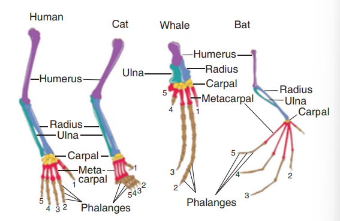
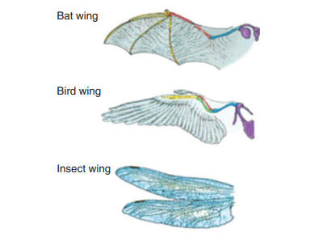
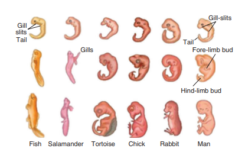

# UNIT 19: Origin and Evolution of Life

## Learning Objectives
At the end of this lesson the students will be able to:
- Know about Big Bang theory on the origin of universe.
- Understand theories of origin of life.
- Discuss the process of evolution on the basis of the available evidences.
- Relate the principles of Lamarck and Darwin with evolution.
- Know how variation occurs and its significance.
- List the importance of fossils and describe the process of fossilization.
- Identify the plants of ethnobotanical importance.
- Realize about extraterrestrial life.

## Introduction
Living organisms possess distinct characteristics, display organisational and functional unity, entail a mechanism of origin and evolution of diversities and maintain a balanced relationship with nature. Most aspects of evolution indicate that the knowledge of the past has become essential for fully understanding the present. Life since its beginning on earth had changed through time. The history of life comprises of two aspects, one is the origin of life on earth and the other is mechanism involved in the gradual changes and adaptations of living organisms through time which is known as the evolution of life.

### Origin of Earth
Origin of life is linked with the origin of earth. The Big Bang theory explains the Origin of Universe. It proposes that the universe had an explosive beginning (Big Bang) and originated 15 billion years ago. The universe comprised of stars, clouds of gas and dust which form the galaxies. The solar system was probably created when the gaseous clouds started to collapse due to the force of its own gravity forming atoms and particles. Atoms, dust grains and gaseous disc aggregated to form clumps and gave rise to planets. This forms the solar system of the milky way galaxy. Earth was supposed to have been formed about 4.5 billion years back. Life appeared 500 million years after the formation of earth.

---

## 19.1 Theories on Origin of Life
Many theories have been postulated to explain the origin of life. The views on the origin of life has been put forth as:

### Special Creation
This idea embodies that life on Earth is a divine creation and also attributes to supernatural event at a particular time in the past. It also emphasizes that life has not changed ever since its creation.

### Spontaneous Generation (Abiogenesis)
According to this theory life originated spontaneously from lifeless matter. It was believed that fishes originated from mud, frogs from moist soil and insects from decaying matter.

### Biogenesis
It was speculated by Louis Pasteur (1862) that life originates from preexisting life. He showed that pre-sterilised flasks kept closed airtight, with killed yeast, did not give rise to any life form, while in another flask kept open to air living organisms arose from killed yeast.

### Extraterrestrial or Cosmic Origin
Some scientists still believe that life came from outer space. This states that units of life called spores (Panspermia) were transferred to different planets including earth. This is still an idea of some scientists.

### Chemical Evolution of Life
This idea was developed by Oparin (1922) and Haldane (1929). They proposed that with the conditions prevailing on earth, life arose by a series of sequential chemical reactions. The first form of life could have come from pre-existing nonliving inorganic molecules which gave rise to formation of diverse organic molecules which are transformed into colloid system to produce life. The modern concept on chemical evolution regarding origin of life was established by them.

---

## 19.2 Evidences of Evolution
Evolution can be better understood only by observing the interrelationship between the existing organisms and also relating the similarities with the extinct organisms. The inter relationship of the organisms is also supported by evidences from different branches of biology. These evidences support the concept that all organisms have evolved from common ancestors.

### 19.2.1 Evidences from Morphology and Anatomy
The comparative study of morphology and anatomy of animals, reveal that they possess common set of structures.

#### i. Homologous Organs
The homologous organs are those which have inherited from common ancestors with similar developmental pattern in embryos. The fore limbs of mammals are homologous structures. A human hand, a front leg of a cat, flipper of a whale and a bat's wing look dissimilar and adapted for different functions. Their mode of development and basic structure of bone are similar.

*Figure 19.1: Forelimbs of vertebrates showing homologous structure*
#### ii. Analogous Organs
The analogous organs look similar and perform similar functions but they have different origin and developmental pattern. The function of the wings of a bat, the wings of a bird and wings of an insect are similar, but their basic structures are different.

*Figure 19.2: Analogous structure showing a bat wing, a bird wing and an insect wing*

#### iii. Vestigial Organs
The degenerated and non-functional organs of animals are called vestigial organs. The same organs are found to be well developed and functional, in some of the related forms. Some of the vestigial organs in man are vermiform appendix, nictitating membrane, caudal vertebra, coccyx.

#### iv. Atavism
The reappearance of ancestral characters in some individuals is called atavism. e.g. Presence of rudimentary tail in new born babies, presence of thick hair on the human body.

---

### 19.2.2 Evidences from Embryology
The study of comparative embryology of different animals, supports the concept of evolution. The embryos from fish to mammals are similar in their early stages of development. The differentiation of their special characters appear in the later stages of development.

*Figure 19.3: Embryonic development of vertebrates*

**Biogenetic law or Recapitulation theory** was given by Ernst Haeckel. According to this theory, **Ontogeny recapitulates Phylogeny**. The stages of development of the individual animal repeats the evolutionary history of the entire race of the animal.

---

### 19.2.3 Evidences from Palaeontology
Palaeontology deals with the study of fossils. Leonardo da Vinci is called the Father of Palaeontology. The study of fossils helps us to understand the line of evolution of many invertebrates and vertebrates. Fossil records show that the evolution has taken a gradual process from simple to complex organisms. The origin of modern birds is supported by the evidences from fossils.

#### Archaeopteryx
Archaeopteryx is the oldest known fossil bird. It was an early birdlike form found in the Jurassic period. It is considered to be a connecting link between reptiles and birds. It had wings with feathers, like a bird. It had long tail, clawed digits and conical teeth, like a reptile.

*Figure 19.4: Archaeopteryx - Fossil bird*

---

## 19.3 Theories of Evolution
Life had evolved along with evolution of earth towards the end of 18th century. Evolution is the gradual change occurring in living organisms over a period of time. Formation of new species due to changes in specific characters over several generations as response to natural selection, is called evolution. The natural changes occurring is explained through the theories of evolution as proposed by Lamarck and Darwin.

### 19.3.1 Lamarckism
Jean Baptiste Lamarck (1744-1829) was a French naturalist, well known for his theory of evolution. Lamarck's theory of evolution was published in 'Philosophic Zoologique' in the year 1809. It is popularly known as 'Theory of inheritance of Acquired Characters" or "Use and Disuse theory".

#### Principles of Lamarckism

##### i. Internal Vital Force
Living organisms or their component parts tend to increase in size continuously. This increase in size is due to the inherent ability of the body.

##### ii. Environment and New Needs
A change in the environment brings about changes in the need of the organisms. In response to the changing environment, the organisms develop certain adaptive characters. The adaptations of the organisms may be in the form of development of new parts of the body.

##### iii. Use and Disuse Theory
Lamarck's use and disuse theory states that if an organ is used constantly, the organ develops well and gets strengthened. When an organ is not used for a long time, it gradually degenerates.

The ancestors of giraffe were provided with short neck and short forelimbs. Due to shortage of grass, they were forced to feed on leaves from trees. The continuous stretching of their neck and forelimbs resulted in the development of long neck and long forelimbs which is an example for constant use of an organ. The degenerated wing of Kiwi is an example for organ of disuse.

##### iv. Theory of Inheritance of Acquired Characters
When there is a change in the environment, the animals respond to the change. They develop adaptive structures. The characters developed by the animals during their life time, in response to the environmental changes are called acquired characters. According to Lamarck, the acquired characters are transmitted to the offspring by the process of inheritance.

*Flow chart showing the postulates of Lamarckism*

---

### 19.3.2 Darwinism or Theory of Natural Selection
Charles Darwin (1809-1882) was one of the great naturalist and philosopher of 18th century. He was born in England in 1809. While studying in college through his friendship with Professor J.S. Henslow he was fascinated towards nature. At that time the British Admiralty planned a voyage of exploration for 5 years on a ship named H.M.S. Beagle around South America. Dr Henslow was asked to nominate a young naturalist for the voyage. Darwin was given the opportunity. During his five years (1831–1835) voyage he visited many parts of the world, a number of islands including the Galapagos island and Pacific island. Darwin made elaborate observations on nature of the land, plants and animals of the regions he visited. He further worked for a period of 20 years to develop the theory of natural selection.

Darwin published his observations and conclusions under the name 'Origin of species' in 1859. The book of Darwin demonstrates the fact of evolution. It elaborates on the theory of Natural selection for evolutionary transformation.

#### Principles of Darwinism

##### i. Overproduction
Living beings have the ability to reproduce more individuals and form their own progeny. They have the capacity to multiply in a geometrical manner. This will increase reproductive potential leading to overproduction.

##### ii. Struggle for Existence
Due to over production, a geometric ratio of increase in population occurs. The space to live and food available for the organisms remain the same. This creates an intense competition among the organisms for food and space leading to struggle. The struggle for existence are of three types:
- **a. Intraspecific struggle**: Competition among the individuals of same species.
- **b. Interspecific struggle**: Competition between the organisms of different species living together.
- **c. Environmental struggle**: Natural conditions like extreme heat or cold, drought and floods can affect the existence of organisms.

##### iii. Variations
The occurrence of variation is a characteristic feature of all plants and animals. Small variations are important for evolution. According to Darwin favourable variations are useful to the organism and unfavourable variations are harmful or useless to the organism.

##### iv. Survival of the Fittest or Natural Selection
During the struggle for existence, the organisms which can overcome the challenging situation, survive and adapt to the surrounding environment. Organisms which are unable to face the challenges, are unfit to survive and disappear. The process of selection of organisms with favourable variation is called as natural selection.

##### v. Origin of Species
According to Darwin, new species originates by the gradual accumulation of favourable variations for a number of generations.

*Flowchart showing the postulates of Darwinism*

---

## 19.4 Variation
Sexual reproduction, which involves meiosis helps in recombination of genes during gametic fusion. This leads to differences in the phenotype of the offspring from its parents. These differences are called variations.

Variation is the difference found among individuals of the same species and the offspring of the same parent. Variation is the raw material which plays an important role in evolution. Evolution would not be possible without variation.

### Types of Variations

#### Somatic Variation
These are the variations which affect the body (somatic) cells of the organisms. They are not heritable. They occur due to environmental factors.

#### Germinal Variation
These variations are produced in germ cells of an organism. They are inherited. They may be present in ancestors or may occur suddenly. They are classified into two types:
1. Continuous variation
2. Discontinuous variation

**Continuous variation**: These are small variations which occur among individuals of a population. They are also called as fluctuating variations. They occur by gradual accumulation in a population. e.g. skin colour, height and weight of an individual, colour of eye.

**Discontinuous variation**: These are sudden changes which occur in an organism due to mutations. They do not have any intermediate forms. These large variations are not useful for evolution. e.g. short legged Ancon sheep, six or more digits (fingers) in human.

Discontinuous variation form the basis for Mutation theory proposed by De Vries.

### Relationship between Mutation and Variation
Mutation and Variation are two events involved in the process of evolution. Mutation arises due to errors occurring in DNA during replication or exposure to UV rays or chemicals. Mutation leads to variation. It brings about changes in a single step.

---

## 19.5 Paleobotany
Paleobotany is derived from Greek words paleon that means "old" and botany the study of plants. It is the branch of paleontology that deals with recovery and identification of plant remains of geological past.

A plant fossil is any preserved part of a plant that has died long back. Fossils may be a prehistoric impression that may be hundred to millions of years old. Majority of the plant fossils are disarticulated parts of plants, it is rare to find plants to be preserved as whole.

### Importance of Fossils
i. They throw light on phylogeny and evolution of plants.
ii. Fossil plants give a historical approach to plant kingdom.
iii. Fossils are useful in classification of plants.
iv. Fossil plants can be used in the field of descriptive and comparative anatomy.

### Kaspar Maria Von Sternberg
He is the "Father of Paleobotany" (1761–1838) was born in Europe. He established the Bohemian National Museum in Prague and is deemed to be the founder of Modern Paleobotany.

### Birbal Sahni
He is the "Father of Indian Paleobotany" (1891–1949). He presented his research on two different areas of Paleobotany (i) The anatomy and morphology of Paleozoic Ferns (ii) The fossil plants of the Indian Gondwana Formations.

---

### 19.5.1 Fossilization
The process of formation of fossil in the rocks is called fossilization.

Common methods of fossilization includes petrifaction, molds and cast, carbonization, preservation, compression and infiltration.

#### Petrifaction
Minerals like silica slowly penetrate in and replace the original organic tissue and forms a rock like fossil. This method of fossilization can preserve hard and soft parts. Most bones and wood fossils are petrified.

#### Mold and Cast
A replica of a plant or animal is preserved in sedimentary rocks. When the organism gets buried in sediment it is dissolved by underground water leaving a hollow depression called a mold. It shows the original shape but does not reveal the internal structure. Minerals or sediment fill the hollow depression and forms a cast.

#### Preservation
Original remains can be preserved in ice or amber (tree sap). They protect the organisms from decay. The entire plant or animal is preserved.

#### Compression
When an organism dies, the hard parts of their bodies settle at the bottom of the sea bed and are covered by sediment. The process of sedimentation goes on continuously and fossils are formed.

#### Infiltration or Replacement
The precipitation of minerals takes place which later on infiltrate the cell wall. The process is brought about by several mineral elements such as silica, calcium carbonate and magnesium carbonate. Hard parts are dissolved and replaced by these minerals.

**Living Fossils**: These are living organisms that are similar in appearance to their fossilized distant ancestors and usually have no extinct close features. e.g. Ginko biloba.

---

### 19.5.2 Determination of Age of Fossils
The age of fossils is determined by radioactive elements present in it. They may be carbon, uranium, lead or potassium. It is used in paleobotany and anthropology for determining the age of human fossils and manuscripts.

#### Radioactive Carbon (C14) Dating Method
This method was discovered by W.F. Libby (1956). Carbon consumption of animals and plants stops after death and since then, only the decaying process of C¹⁴ occurs continuously. The time passed since death of a plant or animal can be calculated by measuring the amount of C¹⁴ present in their body.

**More to Know: What is the Geologic Time Scale?**
The geological time scale is a system of chronological dating that relates geological rock strata to time, and is used by geologists, paleontologists, and other Earth scientists to describe the timing and relationships of events that have occurred during Earth's history.

**Thiruvakkarai fossil wood park** (Villupuram district, Tamil Nadu): 2 million years ago tree trunks that got buried along the river, in course of time the organic matter was replaced by silica and was fossilized. They retained their color, shape and texture and was converted into solid rocks. The annular rings, the texture, colors of the layers, nodes and every properties of plants are still seen.

---

## 19.6 Ethnobotany
Ethnobotany is the study of a region's plants and their practical uses through the traditional knowledge of the local culture of people. The term Ethnobotany was coined by J.W. Harshberger in 1895 to include the study of plants used by the primitive and aboriginal people. Though this discipline has existed for ages, ethnobotany emerged as a distinct academic branch of natural science in 20th century.

### Aspects of Ethnobotany
Ethnobotany has relevance with problems of nutrition, health care and life support system, faith in plants, cottage industries, economic upliftment, conservation of biodiversity and sustainable use of plant resources.

### Importance of Ethnobotany
- It provides traditional uses of plant.
- It gives information about certain unknown and known useful plants.
- The ethnomedicinal data will serve as a useful source of information for the chemists, pharmacologists and practitioners of herbal medicine.
- Tribal communities utilize ethnomedicinal plant parts like bark, stem, roots, leaves, flower bud, flowers, fruits, seeds, oils, resins, dyes, gum for the treatment of diseases like diarrhoea, fever, headache, diabetes, jaundice, snakebites, leprosy, etc.

---

## 19.7 Astrobiology/Exobiology
Are we alone in the universe? If your answer is no, then how do you detect the existence of life in space? Astrobiology/exobiology is the science which looks for the presence of extra terrestrial life in the universe.

Astrobiology deals with the origin, evolution and distribution of life in the universe and to investigate the possibility of life in other planets.

The major concept in astrobiology is the habitable zone. The theory explains that any planets can support the existence of life, if it fulfills two important criteria:
i. It must have a right mass to retain an atmosphere.
ii. It must have an orbit at just the right distance from its star (Sun) that it allows liquid water to exist. Thus, the distance need to be neither too hot or not too cold and is often referred as Goldilock Zone for life.

In our solar system 'Earth' is the only planet in the goldilock zone. Since, this zone varies at times as the star evolves, we know that Mars have also been habitable. The life on Mars are likely to be the creatures, we find in extreme environments on earth.

The organisms which live in extreme environmental conditions on earth are called extremophiles. Thus, within our own Solar System, there are many areas that are different from the Earth where it is probable to find the presence of life similar to extremophile bacteria.

*Figure 19.5: Microbial diversity from sandstone and granite from the McMurdo Dry Valleys, Antarctica*

NASA is developing the Mars 2020 astrobiology to investigate an astrobiologically relevant ancient environment on Mars, its surface geological processes and the possibility of past life on Mars and preservation of biosignatures within accessible geological materials.

---

## Points to Remember
- Lamarck proposed that the acquired characters are passed on to the offsprings in the next generation
- Internal vital force, environment and new needs, use and disuse theory and inheritance of acquired characters are the main principles of Lamarckism.
- Overproduction, struggle for existence, variations, survival of the fittest or Natural selection and origin of species are the main postulates of Darwinism.
- Each species tends to produce large number of offsprings, but only the fittest can survive.
- Homologous, analogous organs and embryological evidences explain evolutionary relationships.
- Some traits in organisms would be similar because they are inherited from a common ancestor.
- Fossils are evidences of ancient life forms or ancient habitats which have been preserved by natural processes.
- Ethnobotanical importance of various types of plants are know through traditional knowledge.
- Astrobiology/exobiology is the science which looks for the presence of extra terrestrial life in the universe

---

## REFERENCE BOOKS

1. B.S. Tomar and S.P. Singh, An Introduction to General Biology, 9th Edition, Rastogi Publications
2. Stephen.C. Stearns and Rolf.F. Hoekstra Evolution - An introduction
3. Archer, S.D.J., Asuncion de los, R., Lee, K.C., Niederberger, T.S., Cary, S.C., Coyne, K.J., Douglas, S., Lacap-Bugler, D.C. and Pointing, S.B., 2017. A Endolithic microbial diversity in sandstone and granite from the McMurdo Dry Valleys, Antarctica. Polar biology, 40(5)

## INTERNET RESOURCES
- http://www.nhs.uk
- http://www.eniscuola.net/en/2012/11/29/exobiology/

---

## Concept Map

*Concept Map showing: Evolution → Origin of life (Views: Special creation, Spontaneous generation, Biogenesis, Extra terrestrial origin, Chemical evolution) / Evidences for evolution (Morphology and Anatomy: Homologous organs, Analogous organs, Vestigial organs, Atavism; Embryology: Biogenetic law; Paleontology: Fossils) / Theories of evolution (Lamarckism: Use and Disuse Theory; Darwinism: Theory of Natural Selection)*

*Concept Map showing: Evolution → Ethnobotany (Ethnic groups in India, Importance of ethnobotany) / Paleobotany (Fossilization: Petrifaction, Mold and cast, Preservation, Compression, Replacement; Determination of age of fossils: Radioactive carbon dating method)*

---

## ICT CORNER: ORIGIN AND EVOLUTION OF LIFE

This game will enable the students to understand the evolution of living organisms. But it was created on the basis of general truths and not specific scientific facts.

### Steps
- Access the application "HUMAN EVOLUTION CLICKER GAME: RISE OF MANKIND" with the help of provided URL or QR code. Download and Install it in the mobile.
- You can view a bubble for ten seconds, touch it to reveal the hidden DNA.
- By joining two DNAs, a bacteria will be formed. By joining two bacteria, amoeba will be appeared.
- Continue the same to form many other species by combining different species. There are 52 living organism exist now in the application. Explore.

---
