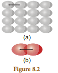
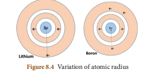
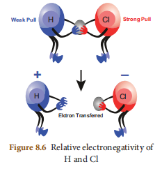
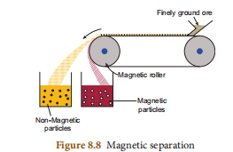
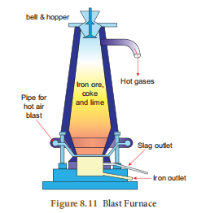

# UNIT-8 : PERIODIC CLASSIFICATION OF ELEMENTS

## Learning Objectives
After a thorough perusal of this unit, the students will be able to:
- recognize the basis of the modern periodic law and its development.
- list the features of groups and periods of the modern periodic table.
- explain the trend in periodic properties along the periods and groups.
- distinguish between ores and minerals.
- list out the types of separation of impurities from the ores.
- recall the various places of occurrences of minerals in the state of Tamil Nadu.
- put forth the properties of metals.
- identify the stages involved in metallurgical processes.
- think scientifically on alloys and their types.
- develop an idea on amalgam.
- understand the reason for corrosion and the methods of its prevention.

## INTRODUCTION
The eighteenth and nineteenth centuries witnessed a rapid development in chemistry in all spheres of scientific activities. By 1860, scientists had already discovered 60 elements and determined their atomic masses. They noticed that some elements had similar properties and hence arranged them into groups. During this period, several new elements were discovered. These elements were found to have different properties. It was realized that instead of studying the properties of all these elements individually, it would be more convenient to divide them into groups and periods in such a way that each group contained a certain number of elements (like an array of fruits and vegetables showing orderliness) with similar properties and periods showing a regular gradation. So, scientists made several attempts to arrange elements in a logical way. You have studied about all these early attempts of arrangement of elements in standard IX. In continuation of the knowledge gained in the topic periodic classification of elements in standard IX with earlier concepts and their subsequent deliberations, you get set to go ahead with the higher order of thinking to enhance your knowledge on the properties of elements.

---

## 8.1 MODERN PERIODIC LAW

Mendeleev's periodic table had some discrepancies, which were difficult to overcome. For example, the atomic mass of argon (39.95 amu) is greater than that of potassium (39.10 amu), but argon comes before potassium in the periodic table. If elements were arranged solely according to increasing atomic mass, argon would appear in the position occupied by potassium in our modern periodic table (see in Figure 8.1). No chemist would place argon, a gas with no tendency to react, in the same group as lithium and sodium, which are two highly reactive metals. This kind of discrepancies suggested that some fundamental property other than atomic mass must be the basis of periodicity. The fundamental property turned out to be the number of protons in an atom's nucleus, something that could not have been known by Mendeleev and his contemporaries.

Henry Moseley, a British scientist in 1912, discovered a new property of elements called atomic number, which provided a better basis for the periodic arrangement of the elements. It is a well-known fact that atomic number of an element is equal to the number of protons or the number of electrons present in the neutral atom of an element. The periodic law was, therefore, modified to frame a modern periodic law, which states that:

> **"The physical and chemical properties of the elements are the periodic functions of their atomic numbers."**

---

## 8.2 MODERN PERIODIC TABLE

With reference to the modern periodic law, the elements were arranged in the increasing order of their atomic numbers to form the modern periodic table. The modern periodic table is a tabular arrangement of elements in periods and groups, highlighting the regular repetition of properties of the elements.

Figure 8.1 shows the modern periodic table of 118 elements discovered so far.

As you have studied the features of the modern periodic table in standard IX, here let us confine to the study of the features of periods and groups.

### 8.2.1 Features of Periods

- The horizontal rows are called periods. There are seven periods in the periodic table.
- **First period** (Atomic number 1 and 2): This is the shortest period. It contains only two elements (Hydrogen and Helium).
- **Second period** (Atomic number 3 to 10): This is a short period. It contains eight elements (Lithium to Neon).
- **Third period** (Atomic number 11 to 18): This is also a short period. It contains eight elements (Sodium to Argon).
- **Fourth period** (Atomic number 19 to 36): This is a long period. It contains eighteen elements (Potassium to Krypton). This includes 8 representative elements and 10 transition elements.
- **Fifth period** (Atomic number 37 to 54): This is also a long period. It contains 18 elements (Rubidium to Xenon). This includes 8 representative elements and 10 transition elements.
- **Sixth period** (Atomic number 55 to 86): This is the longest period. It contains 32 elements (Caesium to Radon). This includes 8 representative elements, 10 transition elements and 14 inner transition elements (Lanthanides).
- **Seventh period** (Atomic number 87 to 118): Like the sixth period, this period also accommodates 32 elements. Recently 4 elements have been included by IUPAC.

### 8.2.2 Features of Groups

- The vertical columns in the periodic table starting from top to bottom are called groups. There are 18 groups in the periodic table.
- Based on the common characteristics of elements in each group, they can be grouped as various families:

| Group Number | Family |
|:---|:---|
| 1 | Alkali Metals |
| 2 | Alkaline earth metals |
| 3 to 12 | Transition metals |
| 13 | Boron Family |
| 14 | Carbon Family |
| 15 | Nitrogen Family |
| 16 | Oxygen Family (or) Chalcogen family |
| 17 | Halogens |
| 18 | Noble gases |

- The Lanthanides and Actinides, which form part of Group 3 are called inner transition elements.
- Except 'group 18', all the elements present in each group have the same number of electrons in their valence shell and thus have the same valency. For example, all the elements of group 1 have one electron in their valence shells (1s¹). So, the valency of all the alkali metals is one.
- As the elements present in a group have identical valence shell electronic configurations, they possess similar chemical properties.
- The physical properties of the elements in a group such as melting point, boiling point and density vary gradually.
- The atoms of the 'group 18' elements have stable electronic configuration in their valence shells and hence they are chemically inert.

---

## 8.3 PERIODIC TRENDS IN PROPERTIES

The electronic configurations of elements help us to explain the periodic recurrence of physical and chemical properties. Anything which repeats itself after a regular interval is called periodic and this behaviour is called periodicity. Some of the atomic properties of the elements are periodic.

Properties such as atomic radius, ionic radius, ionisation energy, electronegativity, electron affinity, show a regular periodicity and hence they are called periodic properties. The main significance of the modern periodic table is that it gives a clear understanding of the general properties and trends within a group or a period to predict with considerable accuracy, the properties of any element, even though that element may be unfamiliar to us.

### 8.3.1 Atomic Radius

Atomic radius of an atom is defined as the distance between the centre of its nucleus and the outermost shell containing the valence electron. Direct measurement of the radius of an isolated atom is not possible. Except for noble gases, usually the atomic radius is referred to as covalent radius or metallic radius depending on the nature of the bonding between the concerned atoms.

Atomic radius in metal atoms is known as **metallic radius**. It is defined as half the distance between the nuclei of adjacent metal atoms.

In non-metallic elements, their atomic radius is known as **Covalent radius**. It is defined as half the distance between the adjacent nuclei of two covalently bonded atoms of the same element in a molecule. For example, let us consider H₂ molecule. The distance between the two hydrogen nuclei of the molecule is 0.74 Å. So its covalent radius is:
> Atomic radius of Hydrogen = 0.74/2 = 0.37 Å

When you look at the variation of the atomic radii in the periodic table, there are two distinct trends:

**Along the period**, from left to right, the atomic radius of the elements **decreases** whereas **along the groups**, from the top to bottom, the atomic radius **increases**. 

The increase, down a group, is due to the increase in the valence shell number down the group. As the shell number increases, the distance between the valence shell and the nucleus increases. In contrast, when you observe along the period, the shell number remains the same but the number of protons (i.e. atomic number) increases. More and more positive charges impose a strong attraction over the electrons and thus the electron cloud shrinks towards the nucleus, which results in the decrease in the atomic size.

### 8.3.2 Ionic Radii

It is defined as the distance from the centre of the nucleus of the ion upto the point where it exerts its influence on the electron cloud of the ion.

You know that ions are formed when an atom lose or gain electrons. When a neutral atom loses an electron, it becomes a positively charged ion called **cation**, whereas the gain of an electron by a neutral atom forms a negatively charged ion called **anion**. The size of the ions is important to determine their behaviours in solutions and the structure of ionic solids.

The size of a **cation is always smaller** than its corresponding neutral atom. But, the **anion is larger** than its neutral atom.

> **Note:** 
> - As the positive charge increases the size of the cation decreases
> - As the negative charge increases the size of the anion increases

For instance, lithium and sodium lose the single electron from their outermost energy level to form cations. The ions so formed are smaller because the remaining electrons are at inner cells and attracted more strongly by the nucleus. Fluorine and chlorine become negative ions by gaining an electron. When electrons are added, the charge on the nucleus is not great enough to hold the increased number of electrons as closely as it holds the electrons in the neutral atom.

So, as seen in atomic radius, ionic radii also **decrease along the period** from left to right and **increase down the group**.

### 8.3.3 Ionisation Energy

Ionisation energy is the minimum energy required to remove an electron from an isolated gaseous atom in its ground state to form a cation. It is otherwise called ionisation enthalpy. It is measured in kJ/mol. Higher the ionisation energy, it is more difficult to remove the electron.

As the atomic size decreases from left to right in a period, more energy is required to remove the electrons. So, the ionisation energy **increases along the period**. But, down the group, the atomic size increases and hence the valence electrons are loosely bound. They require relatively less energy for the removal. Thus, ionisation energy **decreases down the group** in the periodic table.

### 8.3.4 Electron Affinity

Electron affinity is the amount of energy released when an isolated gaseous atom gains an electron to form its anion. It is also measured in kJ/mol and represented by the following equation:


\mathrm{A_{(g)} + e^{-} \rightarrow A_{(g)}^{-} + Energy}



\mathrm{Cl_{(g)} + e^{-} \rightarrow Cl_{(g)}^{-} + energy}


Like ionisation energy, electron affinity also **increases from left to right in a period** and **decreases from top to bottom in a group**.

> **More to Know**
> Noble gases show no tendency to accept electrons because the outer s and p orbitals of noble gases are completely filled. No more electrons can be added to them and hence their electron affinities are zero.

### 8.3.5 Electronegativity

Electronegativity of an element is the measure of the tendency of its atom to attract the shared pair of electrons towards itself in a covalent bond.

Let us consider HCl molecule. Both the hydrogen and chlorine atoms share one electron each to form the covalent bond between them. Chlorine atom has a higher electronegativity and hence it pulls the shared electrons towards itself more strongly than hydrogen. Thus, when the bond breaks, the bonding electrons are left with chlorine forming H⁺ and Cl⁻ ions.

Electronegativity is based on various experimental data such as bond energy, ionization potential, electron affinity, etc.

**Pauling scale** is the widely used scale to determine the electronegativity, which in turn predicts the nature of bonding (ionic or covalent) between the atoms in a molecule.

Electronegativity of some of the elements are given below:
- F = 4.0
- Cl = 3.0
- Br = 2.8
- I = 2.5
- H = 2.1
- Na = 0.9

If the difference in electronegativity between two elements is 1.7, the bond has 50% ionic character and 50% covalent character.
- If the difference is **less than 1.7**, the bond is considered to be **more covalent**.
- If the difference is **greater than 1.7**, the bond is considered to be **more ionic**.

Along the period, from left to right in the periodic table, the electronegativity **increases** because of the increase in the nuclear charge which in turn attracts the electrons more strongly. On moving down a group, the electronegativity of the elements **decreases** because of the increased number of valence shells.

### Summary of Periodic Properties

| Periodic Property | In Periods | In Groups |
|:---|:---|:---|
| Atomic radius | Decreases | Increases |
| Ionic radius | Decreases | Increases |
| Ionisation energy | Increases | Decreases |
| Electron affinity | Increases | Decreases |
| Electronegativity | Increases | Decreases |

> **Test yourself**
> Predict the nature of the bond in the following molecules.

 (i) NaCl

 (ii) NaBr

(iii) NaI 

(iv) NaF 

(v) NaH

---

## 8.4 METALLURGY

Human life is associated with various metals. We use metals in our day to day activities. It is the utmost need to have some metals like sodium, potassium, calcium, iron, etc. in the human body. Deficiency of these metals affects the metabolic activities thereby playing a vital role in our life.

**Metallurgy** is a science of extracting metals from their ores and modifying the metals into alloys for various uses, based on their physical and chemical properties and their structural arrangement of atoms.

A metallurgical process involve three main steps as follows:
1. **Concentration or Separation of the ore**: It is the process of removal of impurities from the ore.
2. **Production of the metal**: It is the conversion of the ore into metal.
3. **Refining of the metal**: It is the process of purification of the metal.

### 8.4.1 Terminology in metallurgy

- **Minerals**: A mineral may be a single compound or a complex mixture of various compounds of metals found in the Earth.
- **Ore**: The mineral from which a metal can be readily and economically extracted on a large scale is said to be an ore.
  
  > For example: Clay (Al₂O₃·2SiO₂·2H₂O) and bauxite (Al₂O₃·2H₂O) are the two minerals of aluminium, but aluminium can be profitably extracted only from bauxite. Hence, bauxite is an ore of aluminium and clay is its mineral.

- **Mining**: The process of extracting the ores from the Earth's crust is called mining.
- **Gangue or Matrix**: The rocky impurity associated with an ore is called gangue or matrix.
- **Flux**: It is the substance added to the ore to reduce the fusion temperature and to remove the impurities. E.g. Calcium oxide (basic), Silica (acidic). If the gangue is acidic, then basic flux is added and vice versa.
- **Slag**: It is the fusible product formed when a flux reacts with a gangue during the extraction of metals.
  > Flux + Gangue → Slag
- **Smelting**: Smelting is the process of reducing the roasted metallic oxide from the metal in its molten condition. In this process, impurities are removed as slag by the addition of flux.

### 8.4.2 Types of separation or concentration of an ore

There are four major types of separation of ores based on the nature of the ore.

> **More to Know**
> Extraction of metal from metal oxide can be categorized into three types.

| More reactive metals | Medium reactive metals | Less reactive metals |
|:---|:---|:---|
| Na, K, Ca, Mg, Al | Zn, Fe, Pb, Cu | Ag, Hg |
| Electrolytic reduction of metal oxide into metal | Chemical reduction of metal oxide into metal using coke | Thermal decomposition of metal oxide into metal |

The ore is treated with a suitable reagent such that the ore is soluble in it but the impurities are not. The impurities are removed by filtration. The solution of the ore, i.e., the filtrate is treated with a suitable reagent which precipitates the ore.

**E.g.** Bauxite Al₂O₃·2H₂O (the ore of aluminium).

 

 

---

## 8.5 OCCURRENCE OF ORES IN TAMIL NADU

- **Lime stone**: Coimbatore, Cuddalore, Dindugul
- **Gypsum**: Tiruchi and Coimbatore Districts
- **Titanium minerals**: Kanyakumari, Tirunelveli and Tuticorin
- **Chromite**: Coimbatore and Salem district
- **Magnetite**: Dharmapuri, Erode, Salem, Thiruvannamalai
- **Tungsten**: Madurai and Dindugal

(Reference: mineral resources of Tamil Nadu-ENVIS Centre, Tamil Nadu)

---

## 8.6 PROPERTIES OF METALS

### 8.6.1 Physical properties

1. **Physical state**: All metals are solids at room temperature except mercury and gallium.
2. **Lustre**: Metals possess a high lustre (called metallic lustre).
3. **Hardness**: Most of the metals are hard and strong (exceptions: sodium and potassium can be cut with a knife)
4. **Melting point and Boiling point**: Usually, metals possess high melting and boiling points and vaporize only at high temperatures (exceptions: gallium, mercury, sodium and potassium).
5. **Density**: Metals have a high density (exceptions: sodium and potassium are less dense than water).
6. **Ductility**: Metals are usually ductile. In other words, they can be drawn into thin wires without breaking.
7. **Malleability**: Metals are usually malleable, i.e, they can be beaten into thin sheets without cracking (except zinc and mercury).
8. **Conduction of heat and electricity**: Metals are good conductors of heat and electricity; silver and copper excel in this property (exception: tungsten)
9. **Solubility**: Usually, metals do not dissolve in liquid solvents.

### 8.6.2 Chemical Properties

- **Valence electrons**: Atoms of metals usually have 1, 2 or 3 electrons in their outermost shell.
- **Formation of ions**: Metals form Positive ions by the loss of electrons and hence they are electro positive.
- **Discharge of ions**: Metals are discharged at the cathode during the electrolysis of their compounds.
- **Atomicity**: Molecules of metals in their vapour state are usually monoatomic.
- **Nature of oxides**: Oxides of metals are usually basic.

---

## 8.7 METALLURGY OF ALUMINIUM

Aluminium is the metal found most abundantly in the Earth's crust. Since it is a reactive metal, it occurs in the combined state.

The important ores of aluminium are as follows:

| Ores of Aluminium | Formula |
|:---|:---|
| Bauxite | Al₂O₃·2H₂O |
| Cryolite | Na₃AlF₆ |
| Corundum | Al₂O₃ |

Bauxite is the chief ore of aluminium. The extraction of aluminium from bauxite involves two steps:

### (i) Conversion of bauxite into alumina – Baeyer's Process

The conversion of Bauxite into Alumina involves the following steps:

Bauxite ore is finely ground and heated under pressure with a solution of concentrated caustic soda solution at 150°C to obtain sodium meta aluminate.


\mathrm{Al_2O_3 + 2NaOH \rightarrow 2NaAlO_2 + H_2O}


On diluting sodium meta aluminate with water, a precipitate of aluminium hydroxide is formed.


\mathrm{NaAlO_2 + 2H_2O \rightarrow Al(OH)_3 + NaOH}


The precipitate is filtered, washed, dried and ignited at 1000°C to get alumina.


\mathrm{2Al(OH)_3 \xrightarrow{1000°C} Al_2O_3 + 3H_2O}


### (ii) Electrolytic reduction of alumina – Hall's Process

Aluminium is produced by the electrolytic reduction of fused alumina (Al₂O₃) in the electrolytic cell.

- **Cathode**: Iron tank lined with graphite
- **Anode**: A bunch of graphite rods suspended in molten electrolyte.
- **Electrolyte**: Pure alumina + molten cryolite + fluorspar (fluorspar lowers the fusion temperature of electrolyte)
- **Temperature**: 900-950°C
- **Voltage used**: 5-6V

**Overall reaction:**

\mathrm{2Al_2O_3 \rightarrow 4Al + 3O_2 \uparrow}


Aluminium is deposited at the cathode and oxygen gas is liberated at the anode. Oxygen combines with graphite to form CO₂.

### Physical Properties of Aluminium

- It is a silvery white metal
- It has low density (2.7) and it is light
- It is malleable and ductile
- It is a good conductor of heat and electricity.
- Its melting point is 660°C.
- It can be polished to produce a shiny attractive appearance.

### Chemical Properties of Aluminium

**i. Reaction with air**: It is not affected by dry air. On heating at 800°C, aluminium burns very brightly forming its oxide and nitride.


\mathrm{4Al + 3O_2 \rightarrow 2Al_2O_3 \text{ (Aluminium oxide)}}



\mathrm{2Al + N_2 \rightarrow 2AlN \text{ (Aluminium nitride)}}


**ii. Reaction with water**: Water does not react with aluminium due to the layer of oxide on it. When steam is passed over red hot aluminium, hydrogen is produced.


\mathrm{2Al + 3H_2O \text{ (steam)} \rightarrow Al_2O_3 + 3H_2 \uparrow}


**iii. Reaction with alkalis**: It reacts with strong caustic alkalis forming aluminates.


\mathrm{2Al + 2NaOH + 2H_2O \rightarrow 2NaAlO_2 + 3H_2 \uparrow}

(Sodium meta aluminate)

**iv. Reaction with acids**: With dilute and con. HCl it liberates H₂ gas.


\mathrm{2Al + 6HCl \rightarrow 2AlCl_3 + 3H_2 \uparrow \text{ (Aluminium chloride)}}


Aluminium liberates hydrogen on reaction with dilute sulphuric acid and liberates sulphur dioxide on reaction with hot concentrated sulphuric acid


\mathrm{2Al + 3H_2SO_4 \text{ (Dilute)} \rightarrow Al_2(SO_4)_3 + 3H_2 \uparrow}



\mathrm{2Al + 6H_2SO_4 \text{ (Con.)} \rightarrow Al_2(SO_4)_3 + 6H_2O + 3SO_2 \uparrow}


> **More to Know**
> Dilute or concentrated nitric acid does not attack aluminium, but it renders aluminium passive due to the formation of an oxide film on its surface.

**v. As reducing agent**: Aluminium is a powerful reducing agent. When a mixture of aluminium powder and iron oxide is ignited, the latter is reduced to metal. This process is known as **aluminothermic process**.


\mathrm{Fe_2O_3 + 2Al \rightarrow 2Fe + Al_2O_3 + Heat}


### Uses

Aluminium is used in:
- household utensils
- electrical cable industry
- making aeroplanes and other industrial machine parts

---

## 8.8 METALLURGY OF COPPER

### Occurrence:
It was named as cuprum by the Romans because they got it from the Island of Cyprus. Copper is found in the native state as well as combined state.

**Ores of copper**

| Ore | Formula |
|:---|:---|
| Copper pyrites | CuFeS₂ |
| Cuprite or ruby copper | Cu₂O |
| Copper glance | Cu₂S |

The chief ore of copper is copper pyrite. It yields nearly 76% of the world production of copper. Extraction of copper from copper pyrites involves the following steps:

**i. Concentration of ore**: The ore is crushed and the concentrated by froth floatation process.

**ii. Roasting**: The concentrated ore is roasted in excess of air. During the process of roasting, the moisture and volatile impurities are removed. Sulphur, phosphorus, arsenic and antimony are removed as oxides. Copper pyrite is partly converted into sulphides of copper and iron.


\mathrm{2CuFeS_2 + O_2 \rightarrow Cu_2S + 2FeS + SO_2 \uparrow}


**iii. Smelting**: The roasted ore is mixed with powdered coke and sand and is heated in a blast furnace to obtain matte (Cu₂S + FeS) and slag. The slag is removed as waste.

**iv. Bessemerisation**: The molten matte is transferred to Bessemer converter in order to obtain blister copper. Ferrous sulphide from matte is oxidized to ferrous oxide, which is removed as slag using silica.


\mathrm{2FeS + 3O_2 \rightarrow 2FeO + 2SO_2 \uparrow}



\mathrm{FeO + SiO_2 \rightarrow FeSiO_3 \text{ (slag) (Iron silicate)}}



\mathrm{2Cu_2S + 3O_2 \rightarrow 2Cu_2O + 2SO_2 \uparrow}



\mathrm{2Cu_2O + Cu_2S \rightarrow 6Cu + SO_2 \uparrow \text{ (Blister copper)}}


**v. Refining**: Blister copper contains 98% of pure copper and 2% of impurities and is purified by electrolytic refining. This method is used to get metal of a high degree of purity.

For electrolytic refining of copper, we use:
- **Cathode**: A thin plate of pure copper metal.
- **Anode**: A block of impure copper metal.
- **Electrolyte**: Copper sulphate solution acidified with sulphuric acid.

When electric current is passed through the electrolytic solution, pure copper gets deposited at the cathode and the impurities settle at the bottom of the anode in the form of sludge called anode mud.

### Physical Properties of Copper

Copper is a reddish brown metal, with high lustre, high density and high melting point (1356°C).

### Chemical Properties of Copper

**i. Action of Air and Moisture**: Copper gets covered with a green layer of basic copper carbonate in the presence of CO₂ and moisture.


\mathrm{2Cu + O_2 + CO_2 + H_2O \rightarrow CuCO_3 \cdot Cu(OH)_2}


**ii. Action of Heat**: On heating at different temperatures in the presence of oxygen, copper forms two types of oxides CuO and Cu₂O.


\mathrm{2Cu + O_2 \xrightarrow{\text{below 1370K}} 2CuO \text{ (copper II oxide – black)}}



\mathrm{4Cu + O_2 \xrightarrow{\text{above 1370K}} 2Cu_2O \text{ (copper I oxide – red)}}


**iii. Action of Acids**:

**a) With dilute HCl and dilute H₂SO₄:**
Dilute acids such as HCl and H₂SO₄ have no action on these metals in the absence of air. Copper dissolves in these acids in the presence of air.


\mathrm{2Cu + 4HCl + O_2 \text{ (air)} \rightarrow 2CuCl_2 + 2H_2O}


**b) With dil. HNO₃:**
Copper reacts with dil. HNO₃ with the liberation of Nitric Oxide gas.


\mathrm{3Cu + 8HNO_3 \rightarrow 3Cu(NO_3)_2 + 2NO \uparrow + 4H_2O}


**iv) Action of Chlorine**:

Chlorine reacts with copper, resulting in the formation of copper(II) chloride.


\mathrm{Cu + Cl_2 \rightarrow CuCl_2}


**v) Action of Alkalis:**
Copper is not attacked by alkalis.

### Uses of Copper:

i. It is extensively used in manufacturing electric cables and other electric appliances.

ii. It is used for making utensils, containers, calorimeters and coins,

iii. It is used in electroplating.

iv. It is alloyed with gold and silver for making coins and jewels

---

## 8.9 METALLURGY OF IRON

### Occurrence:
Iron is the second most abundant metal available next to aluminium. It occurs in nature as oxides, sulphides and carbonates.

The ores of iron are as follows:

| Ores of iron | Formula |
|:---|:---|
| Haematite | Fe₂O₃ |
| Magnetite | Fe₃O₄ |
| Iron pyrite | FeS₂ |

Iron is chiefly extracted from haematite ore (Fe₂O₃)

**i. Concentration by Gravity Separation**: The powdered ore is washed with a steam of water. As a result, the lighter sand particles and other impurities are washed away and the heavier ore particles settle down.

**ii. Roasting and Calcination**: The concentrated ore is strongly heated in a limited supply of air in a reverberatory furnace. As a result, moisture is driven out and sulphur, arsenic and phosphorus impurities are oxidized off.

**iii. Smelting (in a Blast Furnace)**: The charge consisting of roasted ore, coke and limestone in the ratio 8:4:1 is smelted in a blast furnace by introducing it through the hopper arrangement at the top. There are three important regions in the furnace.

**(a) The Lower Region (Combustion Zone)** - The temperature is at 1500°C. In this region, coke burns with oxygen to form CO₂ when the charge comes in contact with a hot blast of air.


\mathrm{C + O_2 \xrightarrow{1500°C} CO_2 + Heat}


It is an exothermic reaction since heat is liberated.

**(b) The Middle Region (Fusion Zone)** – The temperature prevails at 1000°C. In this region, CO₂ is reduced to CO.


\mathrm{CO_2 + C \xrightarrow{1000°C} 2CO - Heat}


Limestone decomposes to calcium oxide and CO₂.


\mathrm{CaCO_3 \xrightarrow{1000°C} CaO + CO_2 - Heat}


These two reactions are endothermic due to absorption of heat. Calcium oxide combines with silica to form calcium silicate slag.


\mathrm{CaO + SiO_2 \longrightarrow CaSiO_3}


**(c) The Upper Region (Reduction Zone)** - The temperature prevails at 400°C. In this region carbon monoxide reduces ferric oxide to form a fairly pure spongy iron.


\mathrm{Fe_2O_3 + 3CO \xrightarrow{400°C} 2Fe + 3CO_2 \uparrow}


The molten iron is collected at the bottom of the furnace after removing the slag. The iron thus formed is called **pig iron**.

It is remelted and cast into different moulds. This iron is called **cast iron**.

### Physical properties:

i. It is a lustrous metal, greyish white in colour.
ii. It has high tensility, malleability and ductility.
iii. It can be magnetized.

### Chemical properties:

**i. Reaction with air or oxygen**: Only on heating in air, iron forms magnetic oxide.


\mathrm{3Fe + 2O_2 \rightarrow Fe_3O_4 \text{ (black)}}


**ii. Reaction with moist air**: When iron is exposed to moist air, it forms a layer of brown hydrated ferric oxide on its surface. This compound is known as **rust** and the phenomenon of formation of rust is known as **rusting**.


\mathrm{4Fe + 3O_2 + xH_2O \rightarrow 2Fe_2O_3 \cdot xH_2O \text{ (rust)}}


**iii. Reaction with steam**: When steam is passed over red hot iron, magnetic oxide is formed.


\mathrm{3Fe + 4H_2O \text{ (steam)} \rightarrow Fe_3O_4 + 4H_2 \uparrow}


**iv. Reaction with chlorine**: Iron combines with chlorine to form ferric chloride.


\mathrm{2Fe + 3Cl_2 \rightarrow 2FeCl_3 \text{ (ferric chloride)}}


**v. Reaction with acids**: With dilute HCl and dilute H₂SO₄ it liberates H₂ gas.


\mathrm{Fe + 2HCl \rightarrow FeCl_2 + H_2 \uparrow}



\mathrm{Fe + H_2SO_4 \rightarrow FeSO_4 + H_2 \uparrow}


With dilute HNO₃ in cold condition it gives ferrous nitrate and ammonium nitrate.


\mathrm{4Fe + 10HNO_3 \rightarrow 4Fe(NO_3)_2 + NH_4NO_3 + 3H_2O}


With con. H₂SO₄ it forms ferric sulphate and liberates SO₂.


\mathrm{2Fe + 6H_2SO_4 \rightarrow Fe_2(SO_4)_3 + 3SO_2 + 6H_2O}


When iron is dipped in con. HNO₃ it becomes chemically passive or inert due to the formation of a layer of iron oxide (Fe₃O₄) on its surface.

### Types and uses of iron

- **Pig iron** (Iron with 2.0%-4.5% of carbon): It is used in making pipes, stoves, radiators, railings, manhole covers and drain pipes.
- **Steel** (Iron with 0.25%-2.0% of carbon): It is used in the construction of buildings, machinery, transmission cables and T.V towers and in making alloys.
- **Wrought iron** (Iron with <0.25% of carbon): It is used in making springs, anchors and electromagnets.

---

## 8.10 ALLOYS

An **alloy** is a homogeneous mixture of two or more metals or of one or more metals with certain non-metallic elements.

The properties of alloys are often different from those of its components. Pure gold is brittle to be used. The addition of small percentage of copper enhances its strength and utility.

### 8.10.1 Amalgam

An **amalgam** is an alloy of mercury with another metal. These alloys are formed through metallic bonding with the electrostatic force of attraction between the electrons and the positively charged metal ions. Silver tin amalgam is used for dental filling.

### Reasons for alloying:

i. To modify appearance and colour
ii. To modify chemical activity.
iii. To lower the melting point.
iv. To increase hardness and tensile strength.
v. To increase resistance to electricity.

### 8.10.2 Method of making alloys

(a) By fusing the metals together. E.g. Brass is made by melting zinc and copper.

(b) By compressing finely divided metals. E.g. Wood metal: an alloy of lead, tin, bismuth and cadmium powder is a fusible alloy.

### Alloys as solid solutions:

Alloys can be considered as solid solutions in which the metal with high concentration is solvent and other metals are solute.

For example, brass is a solid solution of zinc (solute) in copper (solvent).

### 8.10.3 Types of Alloys

Based on the presence of Iron, alloys can be classified into:

- **Ferrous alloys**: Contain Iron as a major component. A few examples of ferrous alloys are Stainless Steel, Nickel Steel etc.
- **Non-ferrous alloys**: These alloys do not contain Iron as a major component. For example, Aluminium alloy, Copper alloy etc.

**Copper Alloys (Nonferrous)**

| Alloys | Uses |
|:---|:---|
| Brass (Cu, Zn) | Electrical fittings, dial, decorative items, hardware |
| Bronze (Cu, Sn) | Statues, coins, bells, gongs |

**Aluminium Alloys (Nonferrous)**

| Alloys | Uses |
|:---|:---|
| Duralumin (Al, Mg, Mn, Cu) | Aircrafts, tools, pressure cookers |
| Magnalium (Al, Mg) | Aircraft, scientific instruments |

**Iron Alloys (Ferrous)**

| Alloys | Uses |
|:---|:---|
| Stainless steel (Fe, C, Ni, Cr) | Utensils, cutlery, automobile parts |
| Nickel steel (Fe, C, Ni) | Cables, aircraft parts, propeller |

---

## 8.11 CORROSION

It is the gradual destruction of metals by chemical or electrochemical reaction with the environment. It is a natural process which converts a metal into its oxide, hydroxide or sulphide so that it loses its metallic characteristics.

### Rusting

**Rust** is chemically known as **hydrated ferric oxide** (it is formulated as Fe₂O₃·xH₂O). Rusting results in the formation of scaling reddish brown hydrated ferric oxide on the surface of iron and iron containing materials.

### 8.11.1 Types of Corrosion

**i. Dry Corrosion or Chemical Corrosion**: The corrosive action in the absence of moisture is called dry corrosion. It is the process of a chemical attack on a metal by a corrosive liquids or gases such as O₂, N₂, SO₂, H₂S etc. It occurs at high temperature. Of all the gases mentioned above O₂ is the most reactive gas to impart the chemical attack.

**ii. Wet Corrosion or Electrochemical Corrosion**: The corrosive action in the presence of moisture is called wet corrosion. It occurs as a result of electrochemical reaction of metal with water or aqueous solution of salt or acids or bases.

### 8.11.2 Methods of preventing corrosion

**i. Alloying**: The metals can be alloyed to prevent from the process of corrosion. E.g: Stainless Steel

**ii. Surface Coating**: It involves application of a protective coating over the metal. It is of the following types:

a) **Galvanization**: It is the process of coating zinc on iron sheets by using electric current.

b) **Electroplating**: It is a method of coating one metal over another metal by passing electric current.

c) **Anodizing**: It is an electrochemical process that converts the metal surface into a decorative, durable and corrosion resistant. Aluminium is widely used for anodizing process.

d) **Cathodic Protection**: It is the method of controlling corrosion of a metal surface protected is coated with the metal which is easily corrodible. The easily corrodible metal is called **Sacrificial metal** to act as anode ensuring cathodic protection.

---

## 8.12 PAMBAN BRIDGE

It is a railway bridge which connects the town of Rameshwaram on Pamban Island to mainland India. Opened on 1914, it was India's first sea bridge in India until the opening of the Bandra-Worli Sea Link in 2010. We can control the corrosion and renovation of historical pamban bridge by a periodical protective coating which will be the strong example for applied chemistry to uphold our history.

---

## Points to Remember

- Modern periodic law states that, the physical and chemical properties of the elements are the periodic functions of their atomic numbers.
- The table in which elements are arranged in rows and columns in regular gradation is called periodic table.
- Smelting is the process of reducing the roasted metallic oxide into metal in molten condition.
- Dilute or con. HNO₃ does not attack aluminium metal, as it renders aluminium passive due to oxide film formation on its surface.
- The charge used in the metallurgy of iron consists of roasted ore, coke and limestone in the ratio, 8:4:1.
- Copper vessel on exposure to air and moisture forms a green layer on its surface due to basic copper carbonate.
- An alloy is a homogeneous mixture of two or more metals.
- An amalgam is an alloy of mercury with another metal. E.g. Ag-Sn amalgam is used for dental filling.
- The chemical name of rust is hydrated ferric oxide and its formula is Fe₂O₃·xH₂O.

---

## REFERENCE BOOKS

1. Inorganic chemistry by PL Soni
2. Physical chemistry by Puri and Sharma
3. Inorganic chemistry by Atkins
4. Oxford Inorganic chemistry

## INTERNET RESOURCES

- https://www.webelements.com
- www.rsc.org/periodic-table
- https://www.tcyonline.com
