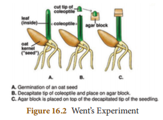
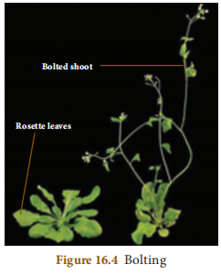

#  UNIT 16 : PLANT AND ANIMAL HORMONES

## Learning Objectives
At the end of this lesson the students will be able to:
- Define hormone
- List out plant hormones.
- Classify plant hormones into growth promoters and growth inhibitors.
- Differentiate the physiological effects of various plant hormones.
- Understand how plant hormones control and coordinate various physiological activities in plants.
- Know the various endocrine glands in the human body. 
- Identify the location and structure of the endocrine glands in the human body.
- Differentiate exocrine and endocrine glands.
- Know the specific site of action and their functions.
- Identify the disorders which occur due to decreased or increased hormone secretion.


## Introduction
The word hormone is derived from the Greek word “hormon” meaning “ to excite”. The function of control and coordination in plants is performed by chemical substances produced by the plants called plant hormones. In plants several cells are capable of producing hormones. These phytohormones are transported to different parts of the plants to perform various physiological functions. 

Endocrine glands in vertebrate animals possess a diversified communication system to co-ordinate physiological and metabolic functions by chemical integration. The endocrine system acts through chemical messengers known as hormones which are produced by specialized glands. Physiological processes such as digestion, metabolism, growth, development and reproduction are controlled by hormones.

## 16.1 Plant Hormones
Plant hormones are organic molecules that are produced at extremely low concentration in plants. These molecules control morphological, physiological and biochemical responses. 

## Types of Plant Hormones

There are five major classes of plant hormones:

1. **Auxins**
2. **Cytokinins**
3. **Gibberellins**
4. **Abscisic Acid (ABA)**
5. **Ethylene**

Among all these plant hormones, **auxins, cytokinins, and gibberellins** promote plant growth while **abscisic acid and ethylene** inhibit plant growth.

---


## 16.1.1 Auxins

Auxins (Gk. *auxein* = to grow) were the first plant hormones discovered. The term auxin was introduced by Kogl and Haagen-Smith (1931). Auxins are produced at the tip of stems and roots from where they migrate to the zone of elongation.

Charles Darwin (1880) observed unilateral growth and curvature of canary grass (*Phalaris canariensis*) coleoptiles. He concluded that some 'influence' was transmitted from the tip of the coleoptile to the basal region. This 'influence' was later identified as Auxin.

### 16.1.1.1 Went's Experiment

Frits Warmolt Went (1903–1990), a Dutch biologist, demonstrated the existence and effect of auxin in plants. He did a series of experiments in Avena coleoptiles. 

In his first experiment he removed the tips of Avena coleoptiles. The cut tips did not grow indicating that the tips produced something essential for growth.In his second experiment he placed the agar blocks on the decapitated coleoptile tips. The coleoptile tips did not show any response. In his next experiment he placed the detached coleoptile tips on agar blocks. After an hour, he discarded the tips and placed this agar block on the decapitated coleoptile. It grew straight up indicating that some chemical had diffused from the cut coleoptile tips into the agar block which stimulated the growth. 

From his experiments Went concluded that a chemical diffusing from the tip of coleoptiles was responsible for growth, and he named it as “Auxin” meaning "to grow”.



 **Types of Auxins:** Auxins are classified into two types, namely natural auxins and synthetic auxins.
1.  **Natural Auxins:** Auxins produced by the plants are called natural auxins. Example: IAA (Indole – 3 - Acetic Acid)
2.  **Synthetic Auxins:**  Artificially synthesized auxins that have properties like auxins are called as synthetic auxins. Example: 2,4 D (2,4 Dichlorophenoxy Acetic Acid). 

**Physiological effects of auxins:** Auxins bring about a variety of physiological effects in different parts of the plant body. 

1. Auxins promote the elongation of stems and coleoptiles which makes them to grow.

2. Auxins induce root formation at low concentration and inhibit it at higher concentration.
3. The auxins produced by the apical buds suppress growth of lateral buds. This is called apical dominance.
4. Seedless fruits without fertilization are induced by the external application of auxins. (Parthenocarpy). Examples: Watermelon, Grapes, Lime etc.
5. Auxins prevent the formation of abscission layer. 


> **Do You Know** Phenyl Acetic Acid (PAA) and Indole 3 Acetonitrile (IAN) are natural auxins. Indole 3 Butyric Acid (IBA), Indole-3-Propionic Acid, α-Naphthalene Acetic Acid (NAA), 2, 4, 5-T (2,4,5 Trichlorophenoxy Acetic Acid) are some of the synthetic auxins.

---

## 16.1.2 Cytokinins

Cytokinins (*Cytos* = cell; *kinesis* = division) are plant hormones that promote cell division or cytokinesis in plant cells. First isolated from Herring fish sperm. **Zeatin** was the cytokinin isolated from *Zea mays*. Found abundantly in liquid endosperm of coconut.

### Physiological Effects of Cytokinins

1. Cytokinin induces cell division (cytokinesis) in the presence of auxins.
2. Cytokinin also causes cell enlargement.
3. Both auxins and cytokinins are essential for the formation of new organs from the callus in tissue culture (Morphogenesis).
4. Cytokinins promote the growth of lateral buds even in the presence of apical bud.
5. Application of cytokinin delays the process of ageing in plants. This is called Richmond Lang effect.

---

## 16.1.3 Gibberellins

Gibberellins are the most abundantly found plant hormones. Kurosawa (1926) observed **Bakanae disease** or  **foolish seedling disease** in rice crops. This internodal elongation in rice was caused by fungus Gibberella fujikuroi. The active substance was identified as **Gibberellic acid**.

The most abundantly found plant hormones. Kurosawa (1926) observed  (foolish seedling disease) in rice crops. This internodal elongation was caused by fungus *Gibberella fujikuroi*. The active substance was identified as Gibberellic acid.

### Physiological Effects of Gibberellins

1. Application of gibberellins on plants stimulate extraordinary elongation of internode. e.g. Corn and Pea.



2. Treatment of rosette plants with gibberellin induces sudden shoot elongation followed by flowering. This is called bolting.
3. Gibberellins promote the production of male flowers in monoecious plants (Cucurbits).
4. Gibberellins break dormancy of potato tubers.
5. Gibberellins are efficient than auxins in inducing the formation of seedless fruit - Parthenocarpic fruits (Development of fruits without fertilization) e.g. Tomato.

---

## 16.1.4 Abscisic Acid (ABA)

Abscisic acid (ABA) is a growth inhibitor which regulates abscission and dormancy. It increases tolerance of plants to various kinds of stress. So, it is also called as**stress hormone**. It is found in the chloroplast of plants. 

### Physiological Effects of Abscisic Acid

1. ABA promotes the process of abscission (separation of leaves, flowers and fruits from the branch).
2. During water stress and drought conditions ABA causes stomatal closure. 


> **Activity** Place two or three unripe tomatoes in a brown paper bag with a ripe bananas and roll the top closed. In another bag place two or three unripe tomatoes only and roll the top closed, Observe what happens to the tomatoes? Why?

As the banana continues to ripen in the first bag, it produces ethylene gas. The gas trapped in the bag will cause tomatoes to ripen.The tomatoes remain unripe in the second bag


3. ABA promotes senescence in leaves by causing loss of chlorophyll.
4. ABA induces bud dormancy towards the approach of winter in trees like birch.
5. ABA is a powerful inhibitor of lateral bud growth in tomato.

---

## 16.1.5 Ethylene

A **gaseous plant hormone** and growth inhibitor. Mainly concerned with maturation and ripening of fruits. Maximum synthesis occurs during ripening of apples, bananas, and melons.

### Activity: Fruit Ripening

Place unripe tomatoes in a paper bag with a ripe banana. The banana produces ethylene gas, causing tomatoes to ripen. Tomatoes without banana remain unripe.

### Physiological Effects of Ethylene

1. Promotes ripening of fruits (Tomato, Apple, Mango, Banana, etc)

2. Inhibits elongation of stem and root in dicots
3. Hastens senescence of leaves and flowers
4. Stimulates formation of abscission zone → premature shedding
5. Breaks dormancy of buds, seeds, and storage organs

---

# 16.2 Human Endocrine Glands

Endocrine glands possess a versatile communication system to coordinate biological functions.

| Feature | Endocrine Glands | Exocrine Glands |
|---------|------------------|-----------------|
| Ducts | Ductless | Have specific ducts |
| Secretions | Hormones (minute quantities) | Enzymes, other substances |
| Transport | Diffuse into bloodstream | Through ducts to target site |
| Examples | Pituitary, Thyroid, Adrenal | Salivary, mammary, sweat glands |

> **Endocrinology**: Branch of biology dealing with endocrine glands and their physiology. **Thomas Addison** = Father of Endocrinology. **W.M. Bayliss and E.H. Starling** (1909) introduced the term "hormone" and discovered secretin.

### Endocrine Glands in Humans

- Pituitary gland
- Thyroid gland
- Parathyroid gland
- Pancreas (Islets of Langerhans)
- Adrenal gland (Cortex and Medulla)
- Gonads (Testes and Ovary)
- Thymus gland

---

## 16.2.1 Pituitary Gland

Pea-shaped compact mass of cells located at the base of midbrain, attached to hypothalamus by pituitary stalk. Called the **"Master gland"** as it regulates and controls other endocrine glands.

### Structure
- **Anterior lobe (Adenohypophysis)**
- **Posterior lobe (Neurohypophysis)**
- Intermediate lobe (non-existent in humans)

### Hormones of Anterior Pituitary

| Hormone | Function |
|---------|----------|
| **Growth Hormone (GH)** | Development and enlargement of all tissues; stimulates muscle, cartilage, long bone growth; controls cell metabolism |
| **Thyroid Stimulating Hormone (TSH)** | Controls growth and activities of thyroid gland |
| **Adrenocorticotropic Hormone (ACTH)** | Stimulates adrenal cortex; influences protein synthesis |
| **Gonadotropic Hormones (GTH)** | FSH and LH - essential for normal development of gonads |
| **Prolactin (PRL)** | Initiates mammary gland development; stimulates milk production |

#### Growth Hormone Disorders

| Condition | Cause | Characteristics |
|-----------|-------|---------------|
| **Dwarfism** | Decreased GH in children | Stunted growth, delayed skeletal formation, mental disability |
| **Gigantism** | Oversecretion of GH in children | Overgrowth of all tissues, abnormal height increase |
| **Acromegaly** | Excess GH in adults | Abnormal enlargement of head, face, hands, feet |

#### FSH and LH Functions

**FSH (Follicle Stimulating Hormone):**
- Male: Stimulates germinal epithelium of testes for sperm formation
- Female: Initiates growth and development of ovarian follicles

**LH (Luteinizing Hormone):**
- Male: Promotes Leydig cells to secrete testosterone
- Female: Causes ovulation, develops corpus luteum, produces estrogen and progesterone

### Hormones of Posterior Pituitary

| Hormone | Function | Deficiency |
|---------|----------|------------|
| **Vasopressin / ADH** | Increases water reabsorption in kidney tubules; reduces urine output | Diabetes insipidus (polyuria) |
| **Oxytocin** | Uterine contraction during childbirth; milk ejection from mammary glands | — |

> **Melatonin**: Hormone from pineal gland; "time messenger" signaling nighttime. Light exposure at night decreases melatonin, interrupting sleep.

---

## 16.2.2 Thyroid Gland

Composed of two distinct lobes on either side of trachea, connected by **isthmus**. Contains glandular follicles filled with colloid material called **thyroglobulin**.

**Hormones**: Triiodothyronine (**T3**) and Tetraiodothyronine/Thyroxine (**T4**)

### Functions of Thyroid Hormones

- Production of energy by maintaining Basal Metabolic Rate (BMR)
- Maintain normal body temperature
- Influence central nervous system activity
- Control growth and bone formation
- Essential for physical, mental, and personality development → **"Personality hormone"**
- Regulate cell metabolism

> Requires **120 μg of iodine** daily for thyroxine production.

### Thyroid Dysfunction

#### Hypothyroidism (Decreased secretion)

| Condition | Cause | Symptoms |
|-----------|-------|----------|
| **Simple Goitre** | Inadequate iodine in diet | Enlargement of thyroid gland, neck swelling |
| **Cretinism** | Decreased thyroid hormones in children | Stunted growth, mental defect, lack of skeletal development, deformed bones |
| **Myxoedema** | Deficiency in adults | Mentally sluggish, weight gain, puffiness of face and hands |

#### Hyperthyroidism (Excess secretion)

| Condition | Symptoms |
|-----------|----------|
| **Grave's Disease** | Protrusion of eyeballs (exophthalmia), increased metabolic rate, high temperature, profuse sweating, weight loss, nervousness |

---

## 16.2.3 Parathyroid Gland

Four small oval bodies on posterior surface of thyroid lobes. Chief cells secrete **Parathormone (PTH)**.

### Functions
Regulates calcium and phosphorus metabolism; acts on bone, kidney, and intestine to maintain blood calcium levels.

### Dysfunction
**Tetany**: Removal during thyroidectomy causes decreased parathormone → muscle spasms, painful cramps in face, larynx, hands, feet.

---

## 16.2.4 Pancreas (Islets of Langerhans)

Elongated, yellowish gland in loop of stomach and duodenum. Both exocrine (digestive enzymes) and endocrine.

**Islets of Langerhans**:
- **Alpha cells** → secrete **Glucagon**
- **Beta cells** → secrete **Insulin**

> Discovered by Fredrick Banting, Charles Best, and MacLeod (1921). First used to treat diabetes on January 11, 1922.

### Functions

| Hormone | Function |
|---------|----------|
| **Insulin** | Converts glucose to glycogen (stored in liver and muscles); promotes glucose transport into cells; decreases blood glucose |
| **Glucagon** | Breaks down glycogen to glucose in liver; increases blood glucose |

### Diabetes Mellitus
Caused by insulin deficiency:
- Hyperglycemia (increased blood sugar)
- Glycosuria (glucose in urine)
- Polyuria (frequent urination)
- Polydipsia (increased thirst)
- Increased appetite

---

## 16.2.5 Adrenal Gland

Located above each kidney (suprarenal). Two distinct parts:

### Adrenal Cortex (Outer)
Three layers: zona glomerulosa, zona fasciculata, zona reticularis

| Hormone Type | Secreted By | Hormones | Functions |
|--------------|-------------|----------|-----------|
| **Glucocorticoids** | Zona fasciculata | Cortisol, Corticosterone | Regulate cell metabolism; stimulate glucose formation from glycogen; anti-inflammatory and anti-allergic |
| **Mineralocorticoids** | Zona glomerulosa | Aldosterone | Reabsorb sodium from renal tubules; increase potassium excretion; regulate electrolyte balance, fluid volume, blood pressure |

> **Cortisol** = "Life-saving hormone" – maintains body in living condition during shock.

### Adrenal Medulla (Inner)
Composed of chromaffin cells. Secretes **"Emergency hormones"** or **"Flight, fright, and fight hormones"**:

| Hormone | Functions |
|---------|-----------|
| **Epinephrine (Adrenaline)** | Converts glycogen to glucose; increases heartbeat and blood pressure; increases respiration rate; dilates pupil; decreases skin blood flow |
| **Norepinephrine (Noradrenaline)** | Similar actions to epinephrine |

---

## 16.2.6 Reproductive Glands (Gonads)

### Testes (Male)
- Seminiferous tubules, Leydig cells, Sertoli cells
- **Leydig cells** secrete **Testosterone**

**Functions of Testosterone:**
- Influences spermatogenesis
- Stimulates protein synthesis and muscular growth
- Develops secondary sexual characteristics (body/facial hair, deep voice)

### Ovary (Female)
- **Estrogen** (from Graafian follicles)
- **Progesterone** (from corpus luteum)

**Functions of Estrogen:**
- Puberty changes
- Initiates oogenesis
- Stimulates ovarian follicle maturation
- Develops secondary sexual characteristics (breast development, high-pitched voice)

**Functions of Progesterone:**
- Premenstrual uterine changes
- Prepares uterus for implantation
- Maintains pregnancy
- Essential for placenta formation

---

## 16.2.7 Thymus Gland

Partly endocrine, partly lymphoid. Located in upper chest covering lower trachea.

**Hormone**: **Thymosin**

**Functions:**
- Stimulatory effect on immune function
- Stimulates production and differentiation of T-lymphocytes

---

# Points to Remember

- Auxins are produced at tips of stems and roots; migrate to zone of elongation
- Cytokinins promote cell division/cytokinesis
- Gibberellins induce seedless fruit and parthenocarpic fruits
- Abscisic acid = growth inhibitor; regulates abscission and dormancy; stress hormone
- Ethylene = gaseous hormone; concerned with maturation and ripening
- Pituitary gland = "Master gland"
- Thyroid hormones: T3 and T4
- Parathormone maintains blood calcium levels
- Pancreas secretes insulin and glucagon to maintain blood glucose
- Adrenal cortex: cortisol and aldosterone; Adrenal medulla: epinephrine and norepinephrine
- Sex glands: testes (testosterone) and ovaries (estrogen/progesterone)

---

# Textbook Evaluation

## I. Choose the Correct Answer

1. Gibberellins cause: **b) Elongation of dwarf plants**
2. Hormone with positive effect on apical dominance: **b) Auxin**
3. Not naturally found in plants: **a) 2,4-D**
4. Avena coleoptile test by: **d) F.W. Went**
5. LH secreted by: **c) Anterior pituitary**
6. Exocrine gland: **c) Salivary gland**
7. Both exocrine and endocrine: **a) Pancreas**
8. "Master Gland": **b) Pituitary gland**

## II. Fill in the Blanks

1. **Auxin** causes cell elongation, apical dominance and prevents abscission
2. **Ethylene** is a gaseous hormone involved in abscission and fruit ripening
3. **Abscisic acid** causes stomatal closure
4. Gibberellins induce stem elongation in **rosette/dwarf** plants
5. Hormone with negative effect on apical dominance: **Cytokinin**
6. Calcium metabolism controlled by **Parathormone**
7. Beta cells secrete **Insulin**
8. Thyroid gland controlled by **Thyroid Stimulating Hormone (TSH)**
9. Decreased thyroid in children leads to **Cretinism**

## III. Matching

### a) Column Matching

| Column I | Column II | Column III |
|----------|-----------|------------|
| Auxin | Coleoptile tip | Apical dominance |
| Ethylene | Fruits | Ripening |
| Abscisic acid | Chloroplast | Abscission |
| Cytokinin | Coconut milk | Cell division |
| Gibberellins | *Gibberella fujikuroi* | Internodal elongation |

### b) Hormone-Disorder Matching

| Hormone | Disorder |
|---------|----------|
| Thyroxine | Simple goitre |
| Insulin | Diabetes mellitus |
| Parathormone | Tetany |
| Growth hormone | Acromegaly |
| ADH | Diabetes insipidus |

## IV. True or False

1. Cytokinin stimulates cell division and nutrient mobilization: **TRUE**
2. Gibberellins cause parthenocarpy in tomato: **TRUE**
3. Ethylene retards senescence: **FALSE** (It hastens senescence)
4. Exophthalmic goitre due to over-secretion of thyroxine: **TRUE**
5. Pituitary divided into four lobes: **FALSE** (Two lobes in humans)
6. Estrogen secreted by corpus luteum: **FALSE** (Secreted by Graafian follicles; progesterone by corpus luteum)

## V. Assertion and Reasoning

1. **(a)** Both true; R correctly explains A
2. **(a)** Both true; R correctly explains A  
3. **(a)** Both true; R correctly explains A

## VI. Answer in a Word or Sentence

1. Male flowers in Cucurbits: **Gibberellin**
2. Synthetic auxin: **2,4-D / NAA / IBA**
3. Parthenocarpy in tomatoes: **Gibberellins**
4. Milk secretion after childbirth: **Prolactin / Oxytocin**
5. Water and mineral metabolism: **Aldosterone / ADH**
6. Emergency hormone: **Epinephrine/Adrenaline (or Norepinephrine)**
7. Digestive enzymes and hormones: **Pancreas**
8. Endocrine glands associated with kidneys: **Adrenal glands**

## VII. Short Answer Questions

*(Key points for answers)*

1. **Synthetic auxins**: Artificially synthesized compounds with auxin-like properties. Examples: 2,4-D, NAA, IBA, 2,4,5-T

2. **Bolting**: Sudden shoot elongation followed by flowering in rosette plants. Induced artificially by gibberellin application.

3. **Abscisic acid activities**: (a) Promotes abscission (b) Causes stomatal closure during water stress (c) Induces dormancy (d) Promotes senescence

4. **Prevent leaf/fruit drop**: Apply auxins. Reason: Auxins prevent formation of abscission zone.

5. **Chemical messengers**: Hormones - substances produced in minute quantities by endocrine glands, transported via blood to target organs.

6. **Endocrine vs Exocrine**: See table in section 16.2

7. **Parathormone role**: Regulates calcium and phosphorus metabolism; maintains blood calcium levels.

8. **Posterior pituitary hormones**: Vasopressin/ADH (acts on kidney tubules) and Oxytocin (acts on uterus and mammary glands).

9. **Personality hormone**: Thyroid hormones influence physical, mental, and personality development; maintain normal body functions.

10. **Iodine requirement**: Thyroxine (T4) requires iodine. Low intake causes simple goitre.

## VIII. Long Answer Questions

*(Detailed answers based on content above)*

1. (a) **Ethylene** - gaseous hormone; actions: fruit ripening, promotes abscission, breaks seed dormancy
   (b) **Abscisic acid** - stress hormone; increases tolerance to various stresses, causes stomatal closure

2. **Went's experiment** - see section 16.1.1.1

3. **Gibberellin effects** - see section 16.1.3

4. **Estrogens** - produced by Graafian follicles of ovary; roles in puberty, oogenesis, secondary sexual characteristics

5. **ADH deficiency**: Diabetes insipidus (excessive urine). **Insulin deficiency**: Diabetes mellitus (high blood sugar). Difference: ADH affects water reabsorption; insulin affects glucose metabolism.

## IX. Higher Order Thinking Skills (HOTS)

1. a. **Gibberellin on rice**: Elongated internodes, Bakanae disease symptoms
   b. **Rotten fruit with unripe fruits**: Unripe fruits ripen faster due to ethylene from rotten fruit
   c. **No cytokinin in culture**: No cell division, no organ formation from callus

2. a. **Gibberellin**
   b. **Internodal elongation**
   c. Functions: Stem elongation, bolting, parthenocarpy, breaking dormancy

3. **Thyroid gland**; **Excess thyroxine** (Hyperthyroidism/Grave's disease)

4. **Adrenal medulla** secretes epinephrine/norepinephrine during stress ("fight or flight" response)

5. **Diabetes mellitus** (insulin deficiency). Prevention: Balanced diet, regular exercise, maintain healthy weight, regular blood sugar monitoring.

---

# Reference Books

1. Helgi Opik and Stephen Rolfe, *The Physiology of Flowering Plants*, Cambridge University Press
2. Berry AK, *A Textbook of Endocrinology*, 11th edition, Emkay Publications, New Delhi
3. Prakash S Lohar, *Endocrinology, Hormones and Human Health*, MJP Publishers, Chennai

# Internet Resources

1. https://www.biologydiscussion.com/auxins
2. https://www.mcdaniel.edu/biology
3. https://www.ndsu.edu/pubweb/chiwonlee/plsc210
```