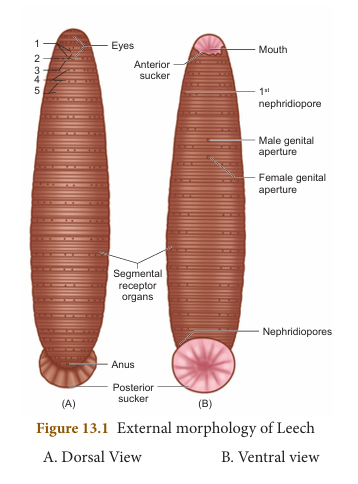
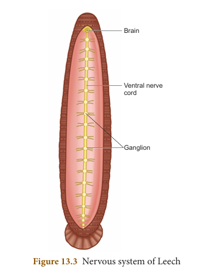
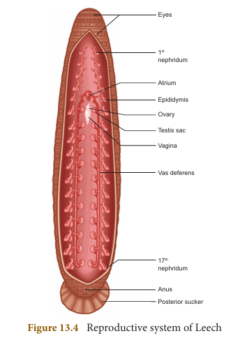
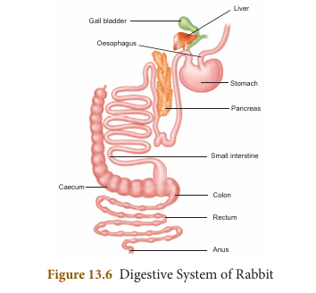
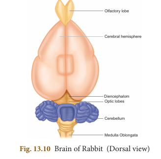
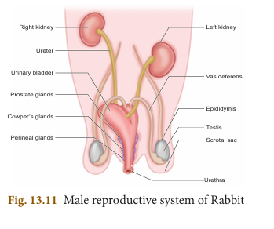

# STRUCTURAL ORGANISATION OF ANIMALS

## Learning Objectives
At the end of this lesson the students will be able to:
- Understand the external morphology of the leech and rabbit.
- Recognise the structural features of different organ systems.
- Will be able to understand the physiology of various organ systems of leech and rabbit.
- Learn the parasitic adaptations of leech.
- Identify the type of dentition and its significance in rabbit.
- Perceive the differences between the structural organisation of an invertebrate (leech) and vertebrate (rabbit).

---
## Introduction
The variety in nature and habits of animals in the biosphere are quite amazing and interesting. What we see around us may be just few, but there are innumerable species living in this world. You have learnt in lower classes about the classification of animal kingdom. We will recall here that 'Kingdom Animalia' is divided into two groups, Invertebrates and Vertebrates.

There occurs a great diversity in the habit, habitat, structural organisation and mode of reproduction between the animals existing on earth. In this chapter, you will understand the structural morphology and anatomy of an Invertebrate (Leech) and a Vertebrate (Rabbit).

The scientific name of the Indian cattle leech is **Hirudinaria granulosa** which belongs to Phylum Annelida. Annelids are metamerically segmented worms with well developed organ systems.

The scientific name of the common rabbit is **Oryctolagus cuniculus**. It represents Phylum Chordata and Class Mammalia. Mammals occupy the highest group in the animal kingdom and show advancement over the other groups of animals. They are warm blooded and possess covering of hair on the body. Mammary gland in females is the most striking feature of a mammal.


# 13.1 The Indian Cattle Leech (Hirudinaria granulosa)

## Taxonomic Position

| Rank | Classification |
|:---|:---|
| Phylum | Annelida |
| Class | Hirudinea |
| Order | Gnathobdellida |
| Genus | Hirudinaria |
| Species | granulosa |

## 13.1.1 Habit and Habitat
Hirudinaria granulosa (Indian Cattle Leech) is found in India, Bangladesh, Pakistan, Myanmar and Srilanka. It lives in freshwater ponds, lakes, swamps and slow streams. They are ectoparasitic and feed on the blood of fishes, frogs, cattle and human. It is sanguivorous (blood sucking) in nature.

## 13.1.2 External Morphology

**Shape and Size:** The body of a leech is soft, vermiform, elongated and segmented. It becomes ribbon shaped when extended and almost cylindrical when contracted. Leeches may grow to a length of 35 cm.

**Colouration:** Dorsal surface is olive green in colour and the ventral surface is orange yellow or orange red in colour.

**Segmentation:** Metamerism is the segmentation of the body. The body of leech is metamerically divided into **33 segments**. The segments are arranged one behind the other. Each segment is further superficially subdivided into rings or annuli. A temporary clitellum is formed on segments 9-11, which is meant to produce a cocoon during the breeding season.

**Receptors:** On the dorsal side there are five pairs of eyes on the first five segments. Each segment bears a number of sensory projections called receptors. Annular receptors are located in each annulus and segmental receptors are located on the first annulus of each segment.



**Suckers:** Leech has two suckers. The sucker located at the anterior end is called anterior sucker or oral sucker which is ventral in position occupying the first five segments. The posterior sucker is formed by the fusion of the last seven segments. The anterior sucker helps in feeding, while both the suckers help in attachment and locomotion.

### External Apertures

(i) **Mouth:** It is located in the middle of anterior sucker.

(ii) **Anus:** Anus is a small aperture that opens on the mid-dorsal side of 26th segment.

(iii) **Nephridiopores:** Nephridia open to the exterior by 17 pairs of nephridiopores. They lie ventrally on the last annulus of each segment from 6 to 22.

(iv) **Male genital pore:** It is a mid-ventral opening, situated between second and third annuli of 10th segment.

(v) **Female genital pore:** It lies mid-ventrally between second and third annuli of 11th segment.

## 13.1.3 Divisions of the Body
The body of leech is divided into six regions:

| Region | Segments |
|:---|:---|
| Cephalic region | 1st-5th |
| Pre-clitellar region | 6th, 7th and 8th |
| Clitellar region | 9th, 10th and 11th |
| Middle region | 12th-22nd |
| Caudal region | 23rd-26th |
| Posterior sucker | 27th-33rd |

## 13.1.4 Body Wall
Body wall of leech includes five layers:
(i) Cuticle (outermost layer)
(ii) Epidermis which lies below the cuticle
(iii) Dermis which lies below the epidermis formed of connective tissue
(iv) Muscular layer formed of circular and longitudinal muscles
(v) Botryoidal tissue lies beneath longitudinal muscles and fills the entire coelom around the viscera

## 13.1.5 Locomotion
Locomotion in leech takes place by:
(i) Looping or crawling movement
(ii) Swimming

### (i) Looping or Crawling Movement
This type of movement is brought about by the contraction and relaxation of muscles. The two suckers serve for attachment during movement on a substratum.

### (ii) Swimming Movement
Leeches swim very actively and perform undulating movements in water.

## 13.1.6 Digestive System
The digestive system includes the long alimentary canal and the digestive glands.

### Alimentary Canal
The alimentary canal of leech is a straight tube running from the mouth to the anus. Mouth is a triradiate aperture situated in the middle of the anterior sucker that leads into the small buccal cavity. The wall of the buccal cavity bears three jaws with single row of minute teeth. The jaws are provided with papillae which bear the openings of salivary glands. Mouth and buccal cavity occupy the first five segments.

The buccal cavity leads into muscular pharynx. It is surrounded by salivary glands. The secretion of saliva contains **hirudin** which prevents the coagulation of blood. Pharynx leads into crop through a short and narrow oesophagus.

Crop is the largest portion of the alimentary canal. It is divided into a series of 10 chambers. The chambers communicate with one another through circular apertures surrounded by sphincters. A pair of lateral, backwardly directed caecae arises as blind outgrowth from each chamber known as caeca or diverticula. Crop and its diverticula can store large amount of blood which can be slowly digested.

The last chamber of crop opens into stomach. The stomach leads into intestine which is a small straight tube that opens into rectum. The rectum opens to the exterior by anus.

*Figure 13.2 Digestive system of Leech*

### Food, Feeding and Digestion
The leech feeds by sucking the blood of cattle and other domestic animals. During feeding the leech attaches itself to its victim strongly by the posterior sucker. The leech makes a triradiate or Y shaped incision in the skin of the host by the jaws protruded through the mouth. The blood is sucked by muscular pharynx and the salivary secretion is poured.

The ingested blood is stored in crop chambers and its diverticulum. The blood passes from the crop into the stomach. Digestion takes place in stomach by the action of proteolytic enzyme. The digested blood is then absorbed slowly by the intestine. Undigested food is stored in rectum and egested through anus.

Leeches prevent blood clotting by secreting a protein called hirudin. They also inject an anaesthetic substance that prevents the host from feeling their bite.


> **More to Know**
> - Leeches do not have ear, hence can sense vibrations through their skin.
> - Leeches have 2 to 10 tiny eyes, which helps them to locate their food.
> - Leeches can suck blood five times more than their body weight.
> - It may take more than a year for the complete digestion and absorption of a full meal.

### Table 13.1 Segmentation of Leech

| External and Internal features | Segments in which the structures are present |
|:---|:---|
| Body segments | 33 |
| Anterior Sucker, Mouth, Eyes | 1st-5th |
| Posterior sucker | 27th-33rd |
| Pharynx | 5th-8th |
| Crop | 9th-18th |
| Stomach | 19th |
| Intestine | 10th-22nd |
| Rectum | 23rd-26th |
| Anus | 26th |
| Nephridiopores | 6th-22nd |
| Male genital aperture | 10th |
| Female genital aperture | 11th |

## 13.1.7 Respiratory System
Respiration takes place through the skin in leech. Dense network of tiny blood vessels called as capillaries containing the haemocoelic fluid extend in between the cells of the epidermis. The exchange of respiratory gases takes place by diffusion. Oxygen dissolved in water diffuses through the skin into haemocoelic fluid, while carbon dioxide diffuses out. The skin is kept moist and slimy due to secretion of mucus which also prevents it from drying.

## 13.1.8 Circulatory System
In leech, circulation is brought about by haemocoelic system. There are no true blood vessels. The blood vessels are replaced by channels called haemocoelic channels or canals filled with blood like fluid. The coelomic fluid contains haemoglobin.

There are four longitudinal channels. One channel lies above (dorsal) the alimentary canal, one below (ventral) the alimentary canal. The other two channels lie on either (lateral) side of the alimentary canal which serve as heart and have inner valves. All the four channels are connected together posteriorly in the 26th segment.

## 13.1.9 Nervous System
The central nervous system of leech consists of a nerve ring and a paired ventral nerve cord. The nerve ring surrounds the pharynx and is formed of suprapharyngeal ganglion (brain), circumpharyngeal connective and subpharyngeal ganglion. The subpharyngeal ganglion lies below the pharynx and is formed by the fusion of four pairs of ganglia.



## 13.1.10 Excretory System
In leech, excretion takes place by segmentally arranged paired tubules called nephridia. There are 17 pairs of nephridia which open out by nephridiopores from 6th to 22nd segments.

## 13.1.11 Reproductive System
Leech is **hermaphrodite** because both the male and female reproductive organs are present in the same individual.

### Male Reproductive System
There are eleven pairs of testes, one pair in each segment from 12 to 22 segments. They are in the form of spherical sacs called testes sacs. From each testis arises a short duct called vas efferens, which join with the vas deferens. The vas deferens becomes convoluted to form the epididymis or sperm vesicle, to store sperms.

The epididymis leads to a short duct called ejaculatory duct. The ejaculatory ducts on both sides join to form the genital atrium. The atrium consists of two regions, the coiled prostate glands and the penial sac consisting of penis that opens through the male genital pore.

### Female Reproductive System
It consists of ovaries, oviducts and vagina. There is a single pair of ovary in the 11th segment on the ventral side. Each ovary is a coiled ribbon-shaped structure.

The ova are budded off from the ovary. From each ovary runs a short oviduct. The oviducts of the two sides joins together, to form a common oviduct. The common oviduct opens into a pear-shaped vagina which lies mid-ventrally in the posterior part of the 11th segment.



### Development
(i) Internal fertilization takes place. This is followed by cocoon formation. Cocoon is also known as egg case which is formed around the 9th, 10th and 11th segments.

(ii) Development is direct and proceeds in cocoon which contain one to 24 embryos.

(iii) Young leech resembling the adult emerges out of the cocoon.

> **More to Know: Medicinal value of Leech**
> Leeches are effective in increasing blood circulation and breaking up blood clots. It is surprising that they can be used to treat cardiovascular diseases. Biochemical substances derived from leech saliva are used for preparation of pharmaceutical drugs that can treat hypertension.

## 13.1.12 Parasitic Adaptations of Leech
Leeches lead a parasitic mode of life by sucking the blood of vertebrates and show several important adaptations in their structure:

1. Blood is sucked by pharynx.
2. Anterior and posterior ends of the body are provided with suckers by which the animal attaches itself to the body of the host.
3. The three jaws inside the mouth, causes a painless Y-shaped wound in the skin of the host.
4. The salivary glands produce hirudin which does not allow the blood to coagulate. Thus, a continuous supply of the blood is maintained.
5. Parapodia and setae are completely absent.
6. Blood is stored in the crop. It gives nourishment to the leech for several months. Due to this reason there is no elaborate secretion of the digestive juices and enzymes.

> Blood letting is a technique of bleeding in a patient to remove toxic impurities from the blood.

---

# 13.2 Rabbit (Oryctolagus cuniculus)

## Taxonomic Position

| Rank | Classification |
|:---|:---|
| Phylum | Chordata |
| Sub-phylum | Vertebrata |
| Class | Mammalia |
| Order | Lagomorpha |
| Genus | Oryctolagus |
| Species | cuniculus |

## 13.2.1 Habit and Habitat
Rabbits are gentle and timid animals. They show leaping movement and live in burrows. They are distributed throughout the world. They are herbivorous animals feeding on grass and vegetables like turnips, carrots and lettuce. Rabbits are gregarious (moving in groups) animals.

> **Do You Know?**
> The pygmy rabbit was listed as a threatened species in Washington in 1990, because of decline in its population size and distribution due to habitat loss. In March 2003, the Columbia Basin Pygmy Rabbit was federally listed as an endangered species.

## 13.2.2 External Morphology


**Shape, Size and Colouration:** It has an elongated and cylindrical body. Males and females are of the same size. They grow about 45 cm in length and weigh about 2.25 kg as adult. The colour varies from white to black and white. Body is covered with fur which serves to keep it warm.

**Body-division:** The body of the rabbit is divisible into the head, neck, trunk and tail.

**Head:** Head is ovoid, flattened and bears a truncate snout. It contains mouth, external nares, eyes, ears and vibrissae. The mouth is a transverse slit-like bounded by upper lip and lower lip. Just above the mouth are two oblique openings called nostrils. From each side of the upper lip tactile hairs or vibrissae (whiskers) project outwards. A pair of large, movable external ear or pinnae is situated at the top of the head.

**Neck:** The neck connects the head with the trunk. It helps to turn the head.

**Trunk:** The trunk is divisible into an anterior thorax and a posterior abdomen. In females, four or five teats or nipples are present on the ventral surface between the thorax and abdomen.

The trunk bears two pairs of pentadactyl limbs. The forelimbs are shorter than the hind limbs. All the digits bear claws.

The anus is present at the posterior end of the abdomen at the base of tail. In females on the ventral side a slit like vulva is present. In males penis is present in the ventral side of anus. The male has a pair of testes enclosed by scrotal sacs.

**Tail:** The tail is short. It is used to give signals to other rabbits in the event of danger.

**Integument (Skin):** The integument forms the outer covering of the body. The structures which are derived from it are hairs, claws, nails and glands like sweat glands, sebaceous glands and mammary glands.

Mammary glands are modified glands of the skin. They secrete milk and help in nourishing young ones. The sweat glands and sebaceous glands embedded in the skin regulate the body temperature.

## 13.2.3 Coelom (Body cavity)
Rabbit is a coelomate animal. The body is divisible into thoracic cavity and abdominal cavity separated by transverse partition called **diaphragm**. Diaphragm is the characteristic feature of mammals. Breathing movements are brought by the movement of the diaphragm.

Lungs and heart lie in the thoracic cavity, whereas, abdominal cavity encloses digestive and urinogenital organs.

## 13.2.4 Digestive System
The digestive system includes the alimentary canal and the associated digestive glands. The alimentary canal consists of mouth, buccal cavity, pharynx, oesophagus, stomach, small intestine, caecum, large intestine and anus.

Mouth is a transverse slit bounded by upper and lower lips. It leads into the buccal cavity. The floor of the buccal cavity is occupied by a muscular tongue. Jaws bear teeth.

The buccal cavity leads into the oesophagus through the pharynx. Oesophagus opens into the stomach followed by small intestine. Caecum is a thin walled sac present at the junction of small intestine and large intestine. It contains bacteria that helps in digestion of cellulose. The small intestine opens into the large intestine which has colon and rectum. The rectum finally opens outside by the anus.

*Figure 13.6 Digestive System of Rabbit*

### Digestive Glands
The digestive glands are salivary glands, gastric glands, liver, pancreas and intestinal glands. The secretions of digestive glands help in digestion of food in the alimentary canal.

### Dentition in Rabbit
Teeth are hard bone-like structures used to cut, tear and grind the food materials. The rabbit has two sets of teeth. The existence of two sets of teeth in the life of an animal is called **diphyodont dentition**. The two types of teeth are milk teeth (young ones) and permanent teeth (in adults).

In rabbit the teeth are of different types. Hence, the dentition is called **heterodont**. There are four kinds of teeth in mammals viz. the incisors (I), canines (C), premolars (PM) and molars (M). This is expressed in the form of a dental formula.



Dental formula is the simple method of representing the teeth of a mammal. The number of each kind of tooth in the upper and the lower jaws on one side is counted.

**Dental formula in rabbit:**

\frac{I\frac{2}{1}, C\frac{0}{0}, PM\frac{3}{2}, M\frac{3}{3}}{I\frac{1}{1}, C\frac{0}{0}, PM\frac{2}{1}, M\frac{3}{3}}


Or written as: **2033/1023**


Canines are absent. The gap between the incisors and premolar is called **diastema**. It helps in mastication and chewing of food in herbivorous animals.

## 13.2.5 Respiratory System
Respiration takes place by a pair of lungs, which are light spongy tissues enclosed in the thoracic cavity. The thoracic cavity is bound dorsally by the vertebral column and ventrally by the sternum, laterally by the ribs. On the lower side of the thoracic cavity is the dome shaped diaphragm.


Each lung is enclosed by a double membranous pleura. Atmospheric air passes through the external nostril and nasal passages into the pharynx. From the pharynx it passes through the glottis into the wind pipe.

The anterior part of the wind pipe is enlarged to form the larynx or voice box with its wall supported by four cartilaginous plates. Inside the larynx lies the vocal cord and its vibrations result in the production of sound. The larynx leads into trachea or wind pipe.

Tracheal walls are supported by rings of cartilage which help in the free passage of air. The epiglottis prevents the entry of food into the trachea through the glottis. The trachea divides into two branches called the bronchi one entering into each lung and dividing into further branches called bronchioles which end in alveoli.

The respiratory events consist of inspiration (breathing in) and expiration (breathing out) allowing exchange of gases (oxygen and carbon dioxide). Inspiration is an active process while expiration is a passive process.

## 13.2.6 Circulatory System
The circulatory system is formed of blood, blood vessels and heart. The heart is pear shaped and lies in the thoracic cavity in between the lungs. It is enclosed by pericardium, a double layered membrane.


The heart is four chambered with two auricles and two ventricles. The right and left auricles are separated by interauricular septum, similarly right and left ventricles are separated by interventricular septum.

The right auricle opens into the right ventricle by right auriculoventricular aperture, guarded by a tricuspid valve. The left auricle opens into the left ventricle by left auriculoventricular aperture guarded by a bicuspid valve or mitral valve. The opening of the pulmonary artery and aorta are guarded by three semilunar valves.

The right auricle receives deoxygenated blood through two precaval (superior vena cava) and one postcaval (inferior vena cava) veins from all parts of the body. The left auricle receives oxygenated blood from the pulmonary veins from the lungs. From the right ventricle arises pulmonary trunk which carries the deoxygenated blood to the lungs and from the left ventricle arises the systemic arch (aorta) which supplies oxygenated blood to all parts of the body.

## 13.2.7 Nervous System
The nervous system in rabbit is formed of the central nervous system (CNS), peripheral nervous system (PNS) and autonomic nervous system (ANS).

CNS consists of brain and spinal cord. PNS is formed of 12 pairs of cranial nerves and 37 pairs of spinal nerves. ANS comprises sympathetic and parasympathetic nerves.

Brain is situated in the cranial cavity and covered by three membranes called an outer duramater, an inner piamater and a middle arachnoid membrane. The brain is divided into forebrain (prosencephalon), midbrain (mesencephalon) and hindbrain (rhombencephalon).



Forebrain consists of a pair of olfactory lobes, cerebral hemispheres and diencephalon. The right and left cerebral hemispheres are connected by transverse band of nerve tissue called corpus callosum.

The midbrain includes the optic lobes. The hindbrain consists of the cerebellum, pons varolii and medulla oblongata.

## 13.2.8 Urinogenital System
It comprises the urinary or excretory system and the genital or reproductive system. Therefore, they are usually described as urinogenital system in vertebrates.

### Excretory System
Each kidney is made of several nephrons. It separates the nitrogenous wastes from blood and excretes it in the form of urea. Kidneys are dark red, bean shaped organs situated in the abdominal cavity. From each kidney arises the ureters which open posteriorly into the urinary bladder and leads into a thick walled muscular duct called urethra.

### Reproductive System
Sexual dimorphism is exhibited in rabbits. The male and female sexes are separate and are morphologically different.

#### Male Reproductive System
The male reproductive system of rabbit consists of a pair of testes which are ovoid in shape. Testes are enclosed by scrotal sacs in the abdominal cavity. Each testis consists of numerous fine tubules called seminiferous tubules. This network of tubules lead into a coiled tubule called epididymis, which lead into the sperm duct called vas deferens. The vas deferens join in the urethra just below the urinary bladder. The urethra runs backward and passes into the penis.

There are three accessory glands namely prostate gland, cowper's gland and perineal gland. Their secretions are involved in reproduction.



#### Female Reproductive System
The female reproductive system of rabbit consists of a pair of ovaries which are small ovoid structures. They are located behind the kidneys in the abdominal cavity.

A pair of oviducts opens into the body cavity by a funnel shaped opening from each side of the ovary. The anterior part of the oviduct is the fallopian tube. It leads into a wider tube called the uterus. The uterus join together to form a median tube called vagina. The common tube is formed by the union of urinary bladder and the vagina and is called the urinogenital canal or vestibule. It runs backwards and opens to the exterior by a slit-like aperture called vulva.

A pair of Cowper's gland and perineal gland are the accessory glands present in the female reproductive system.


---

# Points to Remember

- Leech is metamerically segmented and has 33 segments.
- It has two suckers which are used to attach to the body of the host. It is also involved in locomotion.
- The salivary glands of leech produce an anticoagulating substance called hirudin.
- Leech is a hermaphrodite.
- Rabbits are warm blooded vertebrates.
- Canine teeth are absent in rabbit.
- Respiration takes place through a pair of lungs in rabbit.
- The heart is four chambered consisting of two auricles and two ventricles.
- Urinogenital system comprises the urinary (or) excretory system and the genital (or) reproductive system.
- Mammary glands are modified glands of the skin and help in nourishing the young ones.

---

# TEXTBOOK EVALUATION

## I. Choose the correct answer

1. In leech locomotion is performed by
   - a) Anterior sucker
   - b) Parapodia
   - c) Setae
   - d) **Contraction and relaxation of muscles**

2. The segments of leech are known as
   - a) **Metameres (somites)**
   - b) Proglottids
   - c) Strobila
   - d) All the above

3. Pharyngeal ganglion in leech is a part of
   - a) Excretory system
   - b) **Nervous system**
   - c) Reproductive system
   - d) Respiratory system

4. The brain of leech lies above the
   - a) Mouth
   - b) Buccal Cavity
   - c) **Pharynx**
   - d) Crop

5. The body of leech has
   - a) 23 segments
   - b) **33 segments**
   - c) 38 segments
   - d) 30 segments

6. Mammals are ______________
   - a) Cold blooded
   - b) **Warm blooded**
   - c) Poikilothermic
   - d) All the above

## II. Fill in the blanks

1. The posterior sucker is formed by the fusion of the **last seven** segments.
2. The existence of two sets of teeth in the life of an animal is called **diphyodont** dentition.
3. The anterior end of leech has a lobe-like structure called **anterior/oral sucker**.
4. The blood sucking habit of leech is known as **sanguivorous**.
5. **Kidneys** separate nitrogenous waste from the blood in rabbit.
6. **37 pairs of** spinal nerves are present in rabbit.

## III. Identify whether the statements are True or False. Correct the false statement

1. An anticoagulant present in saliva of leech is called **hirudin**. (True)
2. The vas deferens serves to transport the **sperms**. (True)
3. Diastema is a gap between premolar and molar teeth in **rabbit**. (False - *It is a gap between incisors and premolars*)
4. The cerebral hemispheres of rabbit are connected by band of nerve tissue called **corpus callosum**. (True)

## IV. Match columns I, II and III correctly

| Organs | Membranous Covering | Location |
|:---|:---|:---|
| Brain | **meninges** | **cranial cavity** |
| Kidney | **capsule** | **abdominal cavity** |
| Heart | **pericardium** | **enclosed in thoracic cavity** |
| Lungs | **pleura** | **mediastinum** |

## V. Answer in a sentence

1. **Give the common name of the Hirudinaria granulosa.**
   - Indian Cattle Leech.

2. **How does leech respire?**
   - Through the skin (cutaneous respiration).

3. **Write the dental formula of rabbit.**
   - 2033/1023 or I²/₁, C⁰/₀, PM³/₂, M³/₃ / I¹/₁, C⁰/₀, PM²/₁, M³/₃

4. **How many pairs of testes are present in leech?**
   - Eleven pairs (11 pairs).

5. **How is diastema formed in rabbit?**
   - Due to the absence of canines, creating a gap between incisors and premolars.

6. **What organs are attached to the two bronchi?**
   - Lungs.

7. **Which organ acts as suction pump in leech?**
   - Pharynx.

8. **What does CNS stand for?**
   - Central Nervous System.

9. **Why is the teeth of rabbit called heterodont?**
   - Because the teeth are of different types (incisors, premolars, and molars).

10. **How does leech suck blood from the host?**
    - By making a Y-shaped incision with its jaws and sucking blood through the pharynx.

## VI. Short answer questions

1. **Why are the rings of cartilages found in trachea of rabbit?**
   - The rings of cartilage help in the free passage of air and prevent the collapse of the trachea during breathing.

2. **List out the parasitic adaptations in leech.**
   - Two suckers for attachment to host
   - Three jaws for making Y-shaped wound
   - Hirudin secretion to prevent blood clotting
   - Anaesthetic substance to prevent host from feeling the bite
   - Absence of parapodia and setae
   - Blood storage in crop for several months
   - Reduced digestive secretions

## VII. Long answer questions

1. **How is the circulatory system designed in leech to compensate the heart structure?**
   - Leech has no true heart. Instead, it has four longitudinal haemocoelic channels (canals) filled with blood-like fluid. Two lateral channels serve as hearts with inner valves. These channels are connected posteriorly in the 26th segment. This haemocoelic system compensates for the absence of a true heart and blood vessels.

2. **How does locomotion take place in leech?**
   - **Looping/Crawling movement:** By contraction and relaxation of muscles using two suckers for attachment.
   - **Swimming movement:** By performing undulating movements in water.

3. **Explain the male reproductive system of rabbit with a labelled diagram.**
   - The male reproductive system consists of:
     - A pair of ovoid testes enclosed in scrotal sacs
     - Seminiferous tubules in each testis
     - Epididymis (coiled tubule) for sperm storage
     - Vas deferens (sperm duct)
     - Urethra running through the penis
     - Three accessory glands: prostate gland, cowper's gland, and perineal gland
     - Their secretions help in reproduction

## VIII. Higher Order Thinking Skills (HOTS)

1. **Arjun is studying in tenth standard. He was down with fever and went to meet the doctor. As he went to the clinic he saw a patient undergoing treatment for severe leech bite. Being curious, Arjun asked the doctor why leech bite was not felt as soon as it attaches to the skin? What would have been the reply given by the doctor?**
   - The doctor would explain that leeches inject an anaesthetic substance through their saliva that numbs the area, preventing the host from feeling the bite immediately.

2. **Shylesh has some pet animals at his home. He has few rabbits too, one day while feeding them he observed something different with the teeth. He asked his grandfather, why is it so? What would have been the explanation of his grandfather?**
   - The grandfather would explain that rabbits have heterodont dentition with different types of teeth. They have diphyodont dentition (two sets of teeth). Importantly, canines are absent, creating a diastema (gap) between incisors and premolars. This adaptation helps in grinding and chewing plant material efficiently.

## IX. Value based questions

1. **Leeches do not have an elaborate secretion of digestive juices and enzymes - Why?**
   - Because leeches store blood in their crop chambers, which can nourish them for several months. Since they feed infrequently on blood (a protein-rich food), they do not need elaborate digestive secretions.

2. **How is the digestive system of rabbit suited for herbivorous mode of feeding?**
   - The digestive system is adapted for herbivorous feeding through:
     - Chisel-like incisors for cutting grass
     - Diastema for manipulation of food
     - Well-developed caecum containing bacteria for cellulose digestion
     - Complex stomach and long intestine for thorough digestion of plant material

---

# REFERENCE BOOKS

1. Kotpal R.L, 2014 Modern Text Book of Zoology - Invertebrates, Rastogi Publications, Meerut.
2. Ekambaranatha Ayyar M and Anantha krishnan T.N. 2003. Manual of Zoology, Vol I, Part I & II (Invertebrates), S. Viswanathan Printers and Publishers Pvt Ltd.
3. Kotpal R.L, 2012 Modern Text Book of Zoology - Vertebrates, Rastogi Publications, Meerut
4. Jordan E.L. and Verma P.S. 2003 Chordate Zoology, S. Chand and Company Ltd, New Delhi.

## INTERNET RESOURCES
- http://leeches-medicinalis.com/
- http://www.biologydiscussion.com/zoology
- http://animaldiversity.org/accounts/Hirudo_medicinalis/
- http://www.notesonzoology.com/rabbit/external-morphology/external-morphology-of-rabbit-with-diagram-chordata-zoology/7642

---

# Concept Map

The concept map shows comparative organization of Leech and Rabbit:

**LEECH**
- External Morphology: Moist slimy skin, Metameres, Annular/Segmental Receptors, Anterior/Posterior Sucker
- Organ Systems:
  - Digestion: Crop, Stomach, Intestine
  - Respiration: Cutaneous (Skin)
  - Circulation: Haemocoelomic channels
  - Brain: Supra and Sub pharyngeal ganglion
  - Excretion: Nephridia
  - Reproduction: Hermaphrodite (Testis and Ovary)

**RABBIT**
- External Morphology: Skin, Hairs, Claws and Nails, Head/Trunk/Tail, External Ear, Sweat/Sebaceous/Mammary Glands
- Organ Systems:
  - Digestion: Buccal cavity, Stomach, Intestine, Liver, Pancreas
  - Respiration: Pulmonary (Lungs)
  - Circulation: Heart
  - Brain: Fore, Mid and Hind Brain
  - Excretion: Metanephric Kidney
  - Reproduction: Sexual Dimorphism (Testis in Male and Ovary in Female)
```