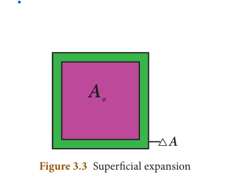
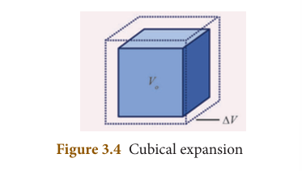
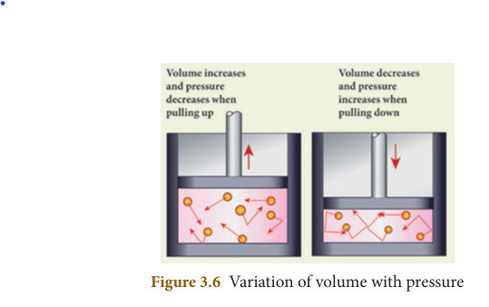

# UNIT3:THERMAL PHYSICS

## Learning Objectives
At the end of this lesson, students will be able to
- Understand the concept of heat and temperature
- Know the absolute scale of temperature
- Understand the thermal energy and the thermal equilibrium
- Classification of expansion of substances
- Know the fundamental laws of gases
- Distinguish between real gas and ideal gas
- Derive the ideal gas equation
- Solve the numerical problems

---

## INTRODUCTION

Sun is the primary source of thermal energy for all living organisms. Thermal energy is the cause and temperature is the effect. All living organisms need a particular temperature for their survival. In the kitchen, a container with a steel bottom is placed on the induction stove. Do you know why? All of us have a common man's understanding of thermal energy and temperature. But, in this chapter, you shall learn about thermal energy and temperature in a scientific manner. We shall also discuss about how thermal energy is transferred and the effects of thermal energy.

---

## 3.1 TEMPERATURE

Temperature is defined as the degree of hotness of a body. The temperature is higher for a hotter body than for a colder body. It is also be defined as the property which determines whether a body is in equilibrium or not with the surroundings (or average kinetic energy of the molecules). Further, temperature is the property, which determines the direction of flow of heat. It is a scalar quantity. The SI unit of temperature is **kelvin (K)**. There are other commonly used units of temperature such as degree celsius (°C) and degree fahrenheit (°F).

### 3.1.1 Absolute scale (kelvin scale) of temperature

The temperature measured in relation to absolute zero using the kelvin scale is known as absolute scale temperature. It is also known as the thermodynamic temperature. Each unit of the thermodynamic scale of temperature is defined as the fraction of 1/273.16th part of the thermodynamic temperature of the triple point of water. A temperature difference of 1°C is equal to that of 1K. Zero Kelvin is the absolute scale of temperature of the absolute zero.

**The relation between the different types of scale of temperature:**

- **Celsius and Kelvin:** K = C + 273
- **Fahrenheit and Kelvin:** K = (F + 460) × 5/9

  0K=-273°C

### 3.1.2 Thermal equilibrium

Two or more physical systems or bodies are said to be in **thermal equilibrium** if there is no net flow of thermal energy between the systems. Heat energy always flows from one body to the other due to a temperature difference between them. Thus, you can define thermal equilibrium in another way. If two bodies are said to be in thermal equilibrium, then, they will be at the same temperature.

What will happen if two bodies at different temperatures are brought in contact with one other? There will be a transfer of heat energy from the hot body to the cold body until a thermal equilibrium is established between them.

When a cold body is placed in contact with a hot body, some thermal energy is transferred from the hot body to the cold body. As a result, there is some rise in the temperature of the cold body and decrease in the temperature of the hot body. This process will continue until these two bodies attain the same temperature.

---

## 3.2 THERMAL ENERGY

If you leave a cup of hot milk on a table for some time, what happens? The hotness of the milk decreases after some time. Similarly, if you keep a bottle of cold water on a table, the water becomes warmer after some time. What do you infer from these observations?

In the case of hot milk, there is a flow of energy from the cup of milk to the environment. In the second case, the energy is transferred from the environment to the water bottle. This energy is termed as **"thermal energy"**.

When a hot object is in contact with another cold object, a form of energy flows from the hot object to the cold object, which is known as thermal energy. Thus, **thermal energy** is a form of energy which is transferred between any two bodies due to the difference in their temperatures. Thermal energy is also known as 'heat energy' or simply 'heat'.

Heat energy is the agent, which produces the sensation of warmth and makes bodies hot. The process in which heat energy flows from a body at a higher temperature to another object at lower temperature is known as **heating**. This process of transmission of heat may be done in any of the ways like conduction, convection or radiation.

Heat is a scalar quantity. The SI unit of heat energy absorbed or evolved is **joule (J)**.

During the process of transferring heat energy, the body at lower temperature is heated while the body at higher temperature is cooled. Thus, sometimes, this process of transfer of heat energy is termed as 'cooling'. But, in most of the cases the term 'heating' is used instead of 'cooling'. When the thermal energy is transferred from one body to another, this results in the rise or lowering of the temperature of either of the bodies.

### 3.2.1 Characteristic features of heat energy transfer

1. Heat always flows from a system at higher temperature to a system at lower temperature.
2. The mass of a system is not altered when it is heated or cooled.
3. For any exchange of heat, the heat gained by the cold system is equal to heat lost by the hot system.
   
   **Heat gained = Heat lost**

### 3.2.2 Other units of Heat energy

Though the SI unit of heat energy is joule, there are some other commonly used units.

**Calorie:** One calorie is defined as the amount of heat energy required to rise the temperature of 1 gram of water through 1°C.

**Kilocalorie:** One kilocalorie is defined as the amount of heat energy required to rise the temperature of 1 kilogram of water through 1°C.

---

## 3.3 EFFECT OF HEAT ENERGY

When a certain amount of heat energy is given to a substance, it will undergo one or more of the following changes:
- Temperature of the substance rises.
- The substance may change its state from solid to liquid or from liquid to gas.
- The substance will expand when heated.

The rise in temperature is in proportion to the amount of heat energy supplied. It also depends on the nature and mass of the substance. About the rise in temperature and the change of state, you have studied in previous classes. In the following section, we shall discuss about the expansion of substances due to heat.

### 3.3.1 Expansion of Substances

When heat energy is supplied to a body, there can be an increase in the dimension of the object. This change in the dimension due to rise in temperature is called **thermal expansion** of the object. The expansion of liquids (e.g. mercury) can be seen when a thermometer is placed in warm water. All forms of matter (solid, liquid and gas) undergo expansion on heating.

#### a) Expansion in solids

When a solid is heated, the atoms gain energy and vibrate more vigorously. This results in the expansion of the solid. For a given change in temperature, the extent of expansion is smaller in solids than in liquids and gases. This is due to the rigid nature of solids.

The different types of expansion of solid are listed and explained below:
1. Linear expansion
2. Superficial expansion
3. Cubical expansion

**1. Linear expansion:**

When a body is heated or cooled, the length of the body changes due to change in its temperature. Then the expansion is said to be **linear** or **longitudinal expansion**.

The ratio of increase in length of the body per degree rise in temperature to its unit length is called as the **coefficient of linear expansion**. The SI unit of Coefficient of Linear expansion is **K⁻¹**. The value of coefficient of linear expansion is different for different materials.

**Figure 3.2** Linear expansion

The equation relating the change in length and the change in temperature of a body is given below:


\frac{\Delta L}{L_o} = \alpha_L \Delta T


Where:
- ΔL = Change in length (Final length - Original length)
- L₀ = Original length
- ΔT = Change in temperature (Final temperature - Initial temperature)
- αₗ = Coefficient of linear expansion

**2. Superficial expansion:**

If there is an increase in the area of a solid object due to heating, then the expansion is called **superficial** or **areal expansion**.

Superficial expansion is determined in terms of coefficient of superficial expansion. The ratio of increase in area of the body per degree rise in temperature to its unit area is called as **coefficient of superficial expansion**. Coefficient of superficial expansion is different for different materials. The SI unit of Coefficient of superficial expansion is **K⁻¹**.

The equation relating to the change in area and the change in temperature is given below:


\frac{\Delta A}{A_o} = \alpha_A \Delta T


Where:
- ΔA = Change in area (Final area - Initial area)
- A₀ = Original area
- ΔT = Change in temperature (Final temperature - Initial temperature)
- αₐ = Coefficient of superficial expansion

**3. Cubical expansion:**

If there is an increase in the volume of a solid body due to heating, then the expansion is called **cubical** or **volumetric expansion**.

As in the cases of linear and areal expansion, cubical expansion is also expressed in terms of coefficient of cubical expansion. The ratio of increase in volume of the body per degree rise in temperature to its unit volume is called as **coefficient of cubical expansion**. This is also measured in **K⁻¹**.

The equation relating to the change in volume and the change in temperature is given below:


\frac{\Delta V}{V_o} = \alpha_V \Delta T


Where:
- ΔV = Change in volume (Final volume - Initial volume)
- V₀ = Original volume
- ΔT = Change in temperature (Final temperature - Initial temperature)
- αᵥ = Coefficient of cubical expansion

Different materials possess different coefficient of cubical expansion. Table 3.1 gives the coefficient of cubical expansion for some common materials.

**Table 3.1 Coefficient of cubical expansion of some materials**

| S.No. | Name of the material | Coefficient of cubic expansion (K⁻¹) |
|:---|:---|:---|
| 1 | Aluminium | 7 × 10⁻⁵ |
| 2 | Brass | 6 × 10⁻⁵ |
| 3 | Glass | 2.5 × 10⁻⁵ |
| 4 | Water | 20.7 × 10⁻⁵ |
| 5 | Mercury | 18.2 × 10⁻⁵ |

#### b) Expansion in liquids and gases

When heated, the atoms in a liquid or gas gain energy and are forced further apart. The extent of expansion varies from substance to substance. For a given rise in temperature, a liquid will have more expansion than a solid and a gaseous substance has the highest expansion when compared with the other two. The coefficient of cubical expansion of liquid is independent of temperature whereas its value for gases depends on the temperature of gases.

When a liquid is heated, it is done by keeping the liquid in some container and supplying heat energy to the liquid through the container. The thermal energy supplied will be partly used in expanding the container and partly used in expanding the liquid. Thus, what we observe may not be the actual or real expansion of the liquid. Hence, for liquids, we can define real expansion and apparent expansion.

**1) Real expansion**

If a liquid is heated directly without using any container, then the expansion that you observe is termed as **real expansion** of the liquid.

**Coefficient of real expansion** is defined as the ratio of the true rise in the volume of the liquid per degree rise in temperature to its unit volume. The SI unit of coefficient of real expansion is **K⁻¹**.

**2) Apparent expansion**

Heating a liquid without using a container is not possible. Thus, in practice, you can heat any liquid by pouring it in a container. A part of thermal energy is used in expanding the container and a part is used in expanding the liquid. Thus, what you observe is not the actual or real expansion of the liquid. The expansion of a liquid apparently observed without considering the expansion of the container is called the **apparent expansion** of the liquid.

**Coefficient of apparent expansion** is defined as the ratio of the apparent rise in the volume of the liquid per degree rise in temperature to its unit volume. The SI unit of coefficient of apparent expansion is **K⁻¹**.

### 3.3.2 Experiment to measure real and apparent expansion of liquid

To start with, the liquid whose real and apparent expansion is to be determined is poured in a container up to a level. Mark this level as L₁. Now, heat the container and the liquid using a burner as shown in the Figure 3.5. Initially, the container receives the thermal energy and it expands. As a result, the volume of the liquid appears to have reduced. Mark this reduced level of liquid as L₂.

On further heating, the thermal energy supplied to the liquid through the container results in the expansion of the liquid. Hence, the level of liquid rises to L₃. Now, the difference between the levels L₁ and L₃ is called as **apparent expansion**, and the difference between the levels L₂ and L₃ is called **real expansion**. The real expansion is always more than that of apparent expansion.

- Real expansion = L₃ - L₂
- Apparent expansion = L₃ - L₁

---

## 3.4 FUNDAMENTAL LAWS OF GASES

The three fundamental laws which connect the relation between pressure, volume and temperature are as follows:
1. Boyle's Law
2. Charles's law
3. Avogadro's law

### 3.4.1 Boyle's law

When the temperature of a gas is kept constant, the volume of a fixed mass of gas is **inversely proportional** to its pressure.


P \propto \frac{1}{V}


In other words, for an invariable mass of a perfect gas, at constant temperature, the product of its pressure and volume is a constant.


PV = \text{constant}


### 3.4.2 Charles's law (The law of volume)

Charles's law was formulated by a French scientist Jacques Charles. According to this law, When the pressure of gas is kept constant, the volume of a gas is **directly proportional** to the temperature of the gas.


V \propto T \quad \text{or} \quad \frac{V}{T} = \text{constant}


### 3.4.3 Avogadro's law

Avogadro's law states that at constant pressure and temperature, the volume of a gas is directly proportional to number of atoms or molecules present in it.


V \propto n \quad \text{or} \quad \frac{V}{n} = \text{constant}


**Avogadro's number (Nₐ)** is the total number of atoms per mole of the substance. It is equal to **6.023 × 10²³ / mol**.

---

## 3.5 GASES

Gases are classified as real gases and ideal gases.

### 3.5.1 Real Gases

If the molecules or atoms of a gases interact with each other with a definite amount of intermolecular or inter atomic force of attraction, then the gases are said to be **real gases**. At very high temperature or low pressure, a real gases behaves as an ideal gases because in this condition there is no interatomic or intermolecular force of attraction.

### 3.5.2 Ideal Gases

If the atoms or molecules of a gas do not interact with each other, then the gas is said to be an **ideal gas** or a **perfect gas**.

Actually, in practice, no gas is ideal. The molecules of any gas will have a certain amount of interaction among them. But, these interactions are weaker when the pressure is low or the temperature is high because the interatomic or intermolecular forces of attraction are weak in ideal gas. Hence, a real gas at low pressure or high temperature can be termed as a perfect gas.

Ideal gases obey Boyle's law, Charles's law and Avogadro's law. All these laws state the relationship between various properties of a gas such as pressure (P), volume (V), temperature (T) and number of atoms (n). In a given state of the gas, all these parameters will have a definite set of values. When there is a change in the state of the gas, any one or more of these parameters change its value. The above said laws relate these changes.

### 3.5.3 Ideal Gas Equation

The ideal gas equation is an equation, which relates all the properties of an ideal gas. An ideal gas obeys Boyle's law and Charles' law and Avogadro's law.

According to Boyle's law,

PV = \text{constant} \quad \text{(3.1)}


According to Charles's law,

\frac{V}{T} = \text{constant} \quad \text{(3.2)}


According to Avogadro's law,

\frac{V}{n} = \text{constant} \quad \text{(3.3)}


After combining equations (3.1), (3.2) and (3.3), you can get the following equation.


\frac{PV}{nT} = \text{constant}


The above relation is called the **combined law of gases**. If you consider a gas, which contains μ moles of the gas, the number of atoms contained will be equal to μ times the Avogadro number, Nₐ.


n = \mu N_A \quad \text{(3.5)}


Using equation (3.5), equation (3.4) can be written as


\frac{PV}{\mu N_A T} = \text{constant}


The value of the constant in the above equation is taken to be k_B which is called as **Boltzmann constant** (1.38 × 10⁻²³ JK⁻¹). Hence, we have the following equation:


\frac{PV}{\mu N_A T} = k_B


PV = \mu N_A k_B T


Here, 
\mu N_A k_B = R
, which is termed as **universal gas constant** whose value is **8.31 J mol⁻¹ K⁻¹**.


PV = RT


Ideal gas equation is also called as **equation of state** because it gives the relation between the state variables and it is used to describe the state of any gas.

---

## Points to Remember

- The SI unit of heat energy absorbed or evolved is joule (J)
- Heat always flows from a system at higher temperature to a system at lower temperature.
- Temperature is defined as the degree of hotness of a body. The SI unit of temperature is kelvin (K).
- All the substances will undergo one or more of the following changes when heated:
  - Temperature of the substance rises.
  - The substance may change state from solid to liquid or gas.
  - The substance will expand when heated.
- All forms of matter (solid, liquid and gas) undergo expansion on heating.
- For a given rise in temperature, a liquid will have more expansion than a solid and a gaseous substance has the highest expansion than the other two.
- If a liquid is heated directly without using any container, then the expansion that you observe is termed as real expansion of the liquid.
- The expansion of a liquid apparently observed without considering the expansion of the container is called the apparent expansion of liquid.
- For a given heat energy, the real expansion is always more than that of apparent expansion.
- If the atoms or molecules of a gas do not interact with each other, then the gas is said to be an ideal gas or a perfect gas.
- Ideal gas equation, also called as equation of state is **PV = RT**. Here, R is known as universal gas constant whose value is **8.31 J mol⁻¹ K⁻¹**.

---

## Solved Problems

### Example 1

A container whose capacity is 70ml is filled with a liquid up to 50ml. Then, the liquid in the container is heated. Initially, the level of the liquid falls from 50ml to 48.5ml. Then we heat more, the level of the liquid rises to 51.2ml. Find the apparent and real expansion.

**Data:**
- Level of the liquid L₁ = 50 ml
- Level of the liquid L₂ = 48.5 ml
- Level of the liquid L₃ = 51.2 ml

**Solution:**

Apparent expansion = L₃ - L₁
= 51.2 ml - 50 ml
= **1.2 ml**

Real expansion = L₃ - L₂
= 51.2 ml - 48.5 ml
= **2.7 ml**

So, Real expansion &gt; apparent expansion

---

### Example 2

Keeping the temperature as constant, a gas is compressed four times of its initial pressure. The volume of gas in the container changing from 20 cc (V₁) to V₂ cc. Find the final volume V₂.

**Data:**
- Initial pressure (P₁) = P
- Final Pressure (P₂) = 4P
- Initial volume (V₁) = 20 cc = 20 cm³
- Final volume (V₂) = ?

**Solution:**

Using Boyle's Law, PV = constant


P_1V_1 = P_2V_2



V_2 = \frac{P_1}{P_2} \times V_1 = \frac{P}{4P} \times 20 \text{ cm}^3



V_2 = \textbf{5 cm}^3


---

## TEXTBOOK EVALUATION

### I. Choose the correct answer

1. The value of universal gas constant
   - a) 3.81 J mol⁻¹ K⁻¹
   - b) 8.03 J mol⁻¹ K⁻¹
   - c) 1.38 J mol⁻¹ K⁻¹
   - d) **8.31 J mol⁻¹ K⁻¹** ✓

2. If a substance is heated or cooled, the change in mass of that substance is
   - a) positive
   - b) negative
   - c) **zero** ✓
   - d) none of the above

3. If a substance is heated or cooled, the linear expansion occurs along the axis of
   - a) X or –X
   - b) Y or –Y
   - c) both (a) and (b)
   - d) **(a) or (b)** ✓

4. Temperature is the average ___________ of the molecules of a substance
   - a) difference in K.E and P.E
   - b) sum of P.E and K.E
   - c) difference in T.E and P.E
   - d) **difference in K.E and T.E** ✓

5. In the Given diagram, the possible direction of heat energy transformation is    
   - (Diagram showing: A = 303 K, B = 304 K, C = 305 K)
   - a) A ← B, A ← C, B ← C
   - b) A → B, A → C, B → C
   - c) **A → B, A ← C, B → C** ✓
   - d) A ← B, A → C, B ← C

### II. Fill in the blanks:

1. The value of Avogadro number **6.023 × 10²³ / mol**
2. The temperature and heat are **scalar** quantities
3. One calorie is the amount of heat energy required to raise the temperature of **1 gram** of water through **1°C**.
4. According to Boyle's law, the shape of the graph between pressure and reciprocal of volume is **a straight line**

### III. State whether the following statements are true or false, if false explain why?

1. For a given heat in liquid, the apparent expansion is more than that of real expansion.
   - **False** - Real expansion is always more than apparent expansion.

2. Thermal energy always flows from a system at higher temperature to a system at lower temperature.
   - **True**

3. According to Charles's law, at constant pressure, the temperature is inversely proportional to volume.
   - **False** - According to Charles's law, volume is directly proportional to temperature at constant pressure.

### IV. Match the items in column-I to the items in column-II

| Column-I | Column-II |
|:---|:---|
| 1. Linear expansion | (d) change in length |
| 2. Superficial expansion | (e) change in area |
| 3. Cubical expansion | (a) change in volume |
| 4. Heat transformation | (b) hot body to cold body |
| 5. Boltzmann constant | (c) 1.381 × 10⁻²³ JK⁻¹ |

### V. Assertion and reason type questions

**a.** Both the assertion and the reason are true and the reason is the correct explanation of the assertion

**b.** Both the assertion and the reason are true but the reason is not the correct explanation of the assertion

**c.** Assertion is true but the reason is false

**d.** Assertion is false but the reason is true

1. **Assertion:** If one end of the rod is heated, other end also is heated.
   **Reason:** Heat always flows from a region of lower temperature to higher temperature of the body.
   - **Answer: (c)** - Assertion is true but the reason is false. (Heat flows from higher to lower temperature)

2. **Assertion:** Gas is highly compressible than solid and liquid
   **Reason:** Interatomic or intermolecular distance in the gas is comparably high.
   - **Answer: (a)** - Both true and reason correctly explains the assertion.

### VI. Answer in briefly

1. **Define one calorie.**
   - One calorie is defined as the amount of heat energy required to rise the temperature of 1 gram of water through 1°C.

2. **Distinguish between linear, arial or superficial and cubical expansion.**

3. **What is co-efficient of cubical expansion?**
   - The ratio of increase in volume of the body per degree rise in temperature to its unit volume is called as coefficient of cubical expansion.

4. **State Boyle's law**
   - When the temperature of a gas is kept constant, the volume of a fixed mass of gas is inversely proportional to its pressure. (PV = constant)

5. **State the law of volume (Charles's law)**
   - When the pressure of gas is kept constant, the volume of a gas is directly proportional to the temperature of the gas. (V/T = constant)

6. **Distinguish between ideal gas and real gas.**

7. **What is co-efficient of real expansion?**
   - Coefficient of real expansion is defined as the ratio of the true rise in the volume of the liquid per degree rise in temperature to its unit volume.

8. **What is co-efficient of apparent expansion?**
   - Coefficient of apparent expansion is defined as the ratio of the apparent rise in the volume of the liquid per degree rise in temperature to its unit volume.

### VII. Numerical problems

1. **Find the final temperature of a copper rod. Whose area of cross section changes from 10 m² to 11 m² due to heating. The copper rod is initially kept at 90 K. (Coefficient of superficial expansion is 0.0021/K)**

2. **Calculate the coefficient of cubical expansion of a zinc bar. Whose volume is increased 0.25 m³ from 0.3 m³ due to the change in its temperature of 50**

### VIII. Answer in detail

1. **Derive the ideal gas equation.**

2. **Explain the experiment of measuring the real and apparent expansion of a liquid with a neat diagram.**

### IX. HOT question

**If you keep ice at 0°C and water at 0°C in either of your hands, in which hand you will feel more chillness? Why?**

---

## REFERENCE BOOKS

- Thermodynamics and an introduction to thermo statistics by Herbert Hallen
- Fundamentals of Engineering Thermodynamics by Michael

## INTERNET RESOURCE

http://alluom/courses/honors.thermo/thermophysics.htm

---

## CONCEPT MAP

*Visual concept map showing:*
- THERMAL PHYSICS branches into:
  - Temperature (Thermal Equilibrium, Kelvin scale)
  - Thermal Energy (Units: Calorie, Kilocalorie)
  - Effects of Heat Energy → Expansion of Substances
    - Solid (Linear, Superficial, Cubical)
    - Liquid (Real Expansion, Apparent Expansion)
    - Gas (Real Gas, Ideal Gas → Obeys Boyle's Law, Charles's Law, Avogadro's Law → Ideal Gas Equation)
  - Fundamental Laws

---

## ICT CORNER

### Boyle's law

In this activity you will be able to verify pressure is proportional to reciprocal of volume (Boyle's Law)

**Steps:**
- Open the browser and type "physics-chemistry-interactive-flash-animation.com/matter_change_state_measurement_mass_volume/pressure_volume_boyle_mariotte_law_ideal_gas_closed_system_MCQ.htm" in the address bar. Click enter to start the experiment.
- Change the volume by adjusting the piston of the syringe (between 20ml to 80ml) and observe how the pressure changes.
- Tabulate observed values. You will observe when volume decreases pressure inside the syringe gets increased and vice versa. Thus Boyle's law (PV = constant)

**Cells alive**
URL: http://www.physics-chemistry-interactive-flash-animation.com/matter_change_state_measurement_mass_volume/pressure_volume_boyle_mariotte_law_