# UNIT-14 : Transportation in Plants and Circulation in Animals

## Learning Objectives

At the end of this lesson the students will be able to:
- Learn how the water and minerals move from soil to the plant.
- Learn how prepared food by the leaf is translocated to various parts of the plant.
- Understand the role of osmosis and transpiration.
- Understand the composition of blood.
- Identify and explain the structure of heart and associated blood vessels.
- Understand systemic, pulmonary and coronary circulation.
- Differentiate the events of the cardiac cycle.
- Know about blood pressure and heart beat.
- Understand the use of stethoscope and sphygmomanometer.
- Identify the different blood groups.
- Understand the role of lymphatic system.

## Introduction

Multicellular organisms possess millions of cells in their body. Every cell needs a constant supply of essential substances like nutrients and oxygen to maintain life and survival. Food is the only source of energy and every cell gets its energy by the breakdown of glucose. The cells utilise this energy and govern various vital activities of life.

Have you ever wondered how water and nutrients absorbed by the root are transported to the leaves? How is the food prepared by the leaves carried to the other parts of the plant? Do you know how water reaches the top of tall plants in spite of not having a circulatory system like animals?

Water absorbed by the roots have to reach entire plant and the food synthesised by the leaves have to be distributed to all the parts of the plant. To understand this we need to recall the anatomy of the plants. Water and mineral salts absorbed by the roots reach all parts of the plant through the **xylem**. The food synthesised by the leaves are translocated to all parts of the plant through the **phloem**. The bulk movement of substances through the vascular tissue is called **translocation**.

'Transport' means to carry things from one place to another. Have you ever wondered how in animals the useful substances are transported to other cells and toxic substances are removed? In larger organisms transport of nutrients, salts, oxygen, hormones and waste products around the body are performed by the **'Circulatory system'**. The circulatory system consists of the circulating fluids, the blood and lymph and the heart and blood vessels which form the collecting and transporting system.

---

## 14.1 Means of Transport in Plants

The transport of materials in and out of the cells is carried out by diffusion and active transport in plants.

### 14.1.1 Diffusion

The movement of solid liquid and gaseous molecules from a region of higher concentration to a region of their lower concentration without the utilization of energy is called diffusion. This is a passive process.

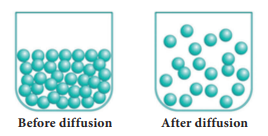

**Figure 14.1:** Diffusion

### 14.1.2 Active Transport

Active transport utilizes energy to pump molecules against a concentration gradient. Active transport is carried out by membrane bound proteins. These proteins use energy to carry substances across the cell membrane hence they are often referred to as pumps. These pumps can transport substances from a low concentration to a high concentration ('uphill' transport).

### 14.1.3 Osmosis

Osmosis is the movement of solvent or water molecules from the region of higher concentration to the region of lower concentration through a semi-permeable membrane. This process is carried out till an equilibrium is reached. Osmosis is the passive movement of water or any other solvent molecules.

#### Plasmolysis

It occurs when a living plant cell is placed in a hypertonic solution water molecule moves out of the cell and resulting in the shrinkage of protoplasm away from the cell wall.

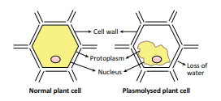

**Figure 14.2:** Plasmolysis

**Activity 1: Demonstration of Osmosis**

A thistle funnel whose mouth is covered with a semipermeable membrane, is filled with sucrose solution. It is kept inverted in a beaker containing water. The water will diffuse across the membrane due to osmosis and raise the level of the solution in the stem of the funnel.

#### Imbibition

Imbibition is a type of diffusion in which a solid plant material absorbs water and gets swelled up. eg. absorption of water by dry seeds and grapes. If it were not for imbibition, seedlings would not have been able to emerge out of the soil.

---

## 14.2 Root Hair - Water Absorbing Unit

There are millions of root hairs on the tip of the root which absorb water and minerals by diffusion. Root hairs are thin walled, slender extension of epidermal cell that increase the surface area of absorption.

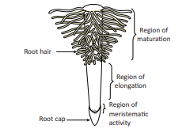

**Figure 14.3:** Root Tip with Root Hairs

---

## 14.3 Pathway of Water Absorbed by Roots

Once the water enters the root hairs, the concentration of water molecules in the root hair cells become more than that of the cortex. Thus water from the root hair moves to the cortical cells by osmosis and then reaches the xylem. From there the water is transported to the stem and leaves.

**Figure 14.4:** T.S. of the root showing movement of water from soil to xylem

---

## 14.4 Types of Movement of Water into the Root Cells

Once water is absorbed by the root hairs, it can move deeper into root layers by two distinct pathways:

- **Apoplast pathway**
- **Symplast pathway**

### 14.4.1 Apoplast Pathway

The apoplastic movement of water occurs exclusively through the intercellular spaces and the walls of the cells. Apoplastic movement does not involve crossing the cell membrane. This movement is dependent on the gradient.

### 14.4.2 Symplast Pathway

In this method, water molecules move to the adjacent cells, through the plasma membrane, cytoplasm and plasmodesmata. This method of transport is slow as water moves through plasma membrane. It is in accordance to the concentration gradient.

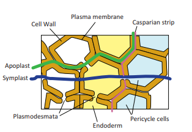

**Figure 14.5:** Symplastic and Apoplastic pathways of Water

---

## 14.5 Transpiration

Transpiration is the evaporation of water from the aerial parts of the plant especially through stomata in leaves. Stomata are open in the day and closed at night. The opening and closing of the stomata is due to the change in turgidity of the guard cells. When water enters into the guard cells, they become turgid and the stoma open. When the guard cells lose water, it becomes flaccid and the stoma closes.

**Figure 14.6:** Process of Transpiration

Water evaporates from mesophyll cells of leaves through the open stomata, this lowers water concentration in mesophyll cells. As a result, more water is drawn into these cells from the xylem present in the veins through the process of osmosis. As water is lost from the leaves, pressure is created at the top to pull more water from the xylem to the mesophyll cells, this process is called **transpiration pull**. This extends up to the roots causing the roots to absorb more water from the soil to ensure continuous flow of water from the roots to the leaves.

### 14.5.1 Factors affecting Transpiration

Transpiration is affected by several external factors such as temperature, light, humidity, and wind speed. Internal factors that affect transpiration include number and distribution of stomata, percentage of open stomata, water status of the plant, canopy structure etc.

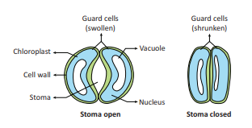

**Figure 14.7:** Guard cell in turgid and flaccid condition

### Significance of Transpiration

- Creates transpirational pull for transport of water
- Supplies water for photosynthesis
- Transports minerals from soil to all parts of the plant
- Cools the surface of the leaves by evaporation.
- Keeps the cells turgid; hence, maintains their shape

---

## 14.6 Root Pressure

As mineral ions from the soil are actively transported into the xylem tissue of the root, water moves along and increases the pressure inside the xylem. This pressure is called **root pressure** and is responsible for pushing water upward to some extent.

---

## 14.7 Uptake of Minerals

Plants depend on minerals from soil for its nutritional requirements. All minerals cannot be passively absorbed by the roots. Two factors account for this:
1. Minerals are present in the soil as charged particles (ions) that cannot move across cell membranes and
2. The concentration of minerals in the soil is usually lower than the concentration of minerals in the root.

Therefore, most minerals enter the root by active absorption through the cytoplasm of epidermal cells. This needs energy in the form of ATP. Then it is transported to all parts by transpiration pull.

---

## 14.8 Translocation of Mineral Ions

Minerals are remobilised from older dying leaves to younger leaves. This phenomenon can be seen in deciduous plants. Elements like phosphorus, sulphur, nitrogen and potassium are easily mobilised, while elements like calcium are not remobilised. Small amounts of material exchange takes place between xylem and phloem.

---

## 14.9 Phloem Transport

The food synthesised by the leaves are transported by the phloem either to the area of requirement or stored. Phloem tissue is composed of sieve tubes which have sieve plates. Cytoplasmic strands pass through the pores in the sieve plates.

Phloem transports food (sucrose) from a **source** to a **sink**. The source is part of the plant that synthesize food, i.e., the leaf, and sink, is the part that needs or stores the food. But, the source and sink may be reversed depending on the season, or the plant's needs.

Since the source-sink relationship is variable, the direction of movement in the phloem can be upwards or downwards, i.e., **bidirectional**. In contrast, the movement is always **unidirectional** in xylem (upwards).

---

## 14.10 Translocation of Sugars

The mechanism of translocation of sugars from source to sink is through **pressure flow hypothesis**. Glucose prepared at source (by photosynthesis) is converted to sucrose. Sucrose moves into the companion cells, then into the living phloem sieve tube cells by active transport. This process produces a hypertonic condition in the phloem. Water in the adjacent xylem moves into the phloem by osmosis. As osmotic pressure builds up, the phloem sap moves to areas of lower pressure. By active transport sucrose moves into the cells where it is utilised or stored. As sugars are removed, the osmotic pressure decreases and water moves out of the phloem.

---

## 14.11 Ascent of Sap and its Events – An Overview

The upward movement of water and minerals from roots to different plant parts is called **ascent of sap**. A number of factors play a role in ascent of sap and it takes places in following steps:

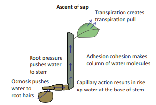

**Figure 14.8:** Ascent of Sap

1. **Root Pressure**: Water from soil enters the root hairs due to osmosis. Root pressure is responsible for movement of water up to the base of the stem.
2. **Capillary Action**: Water or any liquid rises in a capillary tube because of physical forces, this phenomenon is called capillary action. In the same way, in stem water rises up to certain height because of capillary action.
3. **Adhesion-cohesion of Water Molecules**: Water molecules form a continuous column in the xylem because of forces of adhesion and cohesion among the molecules.

4. **Cohesion**: The force of attraction between molecules of water is called cohesion.
5. **Adhesion**: The force of attraction between molecules of different substances is called adhesion. Water molecules stick to a xylem because of force of adhesion.

> **More to Know**
> 
> **Guttation**: Dews like water droplets on the leaves of grass seen in the early mornings, when the climate is humid and excess of water is present in the plants, the excess water is exudated in the form of liquid. This is due to root pressure. This phenomenon is called Guttation which takes place through specialized cells called hydathodes.
> 
> **Transpiration Pull**: Transpiration through stomata creates vacuum which creates a suction called transpiration pull. The transpiration pull sucks the water column from the xylem tubes and thus water is able to rise to great heights even in the tallest plants.

**Activity 2: Demonstration of Root Pressure**

Choose a small soft stemmed plant. Cut the stem horizontally near the base with a blade in the morning. You will see drops of solution oozing out of the cut stem due to root pressure.

---

## 14.12 Blood

Blood is the main circulatory medium in the human body. It is a red coloured fluid connective tissue.

### Components of Blood

The blood consists of two main components. The fluid **plasma** and the **formed elements** (blood cells) which are found suspended in the plasma.

**Plasma**: It is slightly alkaline, containing non-cellular substance which constitutes about 55% of the blood. Organic substances like proteins, glucose, urea, enzymes, hormones, vitamins and minerals are present in the plasma.

### Formed Elements of Blood

Blood corpuscles are of three types:
1. Red blood corpuscles (RBC) or Erythrocytes
2. White blood corpuscles (WBC) or Leucocytes
3. Blood platelets or Thrombocytes.

#### Red blood corpuscles (Erythrocytes)

They are the most abundant cells in the human body. RBCs are formed in the bone marrow. The RBCs impart red colour to the blood due to presence of respiratory pigment **haemoglobin**. Matured mammalian RBCs do not have cell organelles and nucleus. They are biconcave and disc-shaped. Their life span is about 120 days. RBC is involved in the transport of oxygen from lungs to tissues.

> **Do You Know?**
> 
> **Why does mammalian RBC lack cell organelles and nucleus?**
> 
> Mammalian RBC lack nucleus and makes the cells biconcave and increase surface area for oxygen binding, loss of mitochondria allows the RBC to transport all the oxygen to tissues, and loss of endoplasmic reticulum allows more flexibility for RBC to move through the narrow capillaries.

#### White blood corpuscles (Leucocytes)

WBC's are colourless. They do not have haemoglobin and are nucleated cells. It is found in the bone marrow, spleen, thymus and lymph nodes. They are capable of amoeboid movement.

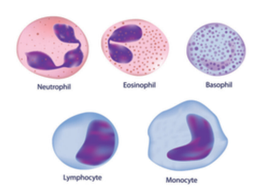

**Figure 14.9:** Leucocytes

The white blood corpuscles can be grouped into two categories:
1. **Granulocytes**
2. **Agranulocytes**

##### Granulocytes

They contain granules in their cytoplasm. Their nucleus is irregular or lobed. The granulocytes are of three types:

**(i) Neutrophils**
They are large in size and have a 2-7 lobed nucleus. These corpuscles form 60%-65% of the total leucocytes. Their numbers are increased during infection and inflammation.

**(ii) Eosinophils**
It has a bilobed nucleus and constitute 2%-3% of the total leucocytes. Their number increases during conditions of allergy and parasitic infections. It brings about detoxification of toxins.

**(iii) Basophils**
Basophils have lobed nucleus. They form 0.5-1.0% of the total leucocytes. They release chemicals during the process of inflammation.

##### Agranulocytes

Granules are not found in the cytoplasm of these cells. The agranulocytes are of two types:

**(i) Lymphocytes**
These are about 20-25% of the total leucocytes. They produce antibodies during bacterial and viral infections.

**(ii) Monocytes**
They are the largest of the leucocytes and are amoeboid in shape. These cells form 5-6% of the total leucocytes. They are phagocytic and can engulf bacteria.

#### Blood Platelets or Thrombocytes

These are small and colourless. They do not have nucleus. There are about 2,50,000–4,00,000 platelets/cubic mm of blood. Life span of platelets is 8–10 days. They play an important role in clotting of blood. Platelets form clot at the site of injury and prevent blood loss.

> **More to Know**
> 
> - **Anaemia**: Decrease in number of erythrocytes.
> - **Leucocytosis**: Increase in the number of leukocytes.
> - **Leukopenia**: Decrease in number of leukocytes.
> - **Thrombocytopenia**: Decrease in the number of thrombocytes.

### Functions of blood

i) Transport of respiratory gases (Oxygen and CO₂).

ii) Transport of digested food materials to the different body cells.

iii) Transport of hormones.

iv) Transport of nitrogenous excretory products like ammonia, urea and uric acid.

v) It is involved in protection of the body and defense against diseases.

vi) It acts as buffer and also helps in regulation of pH and body temperature.

vii) It maintains proper water balance in the body.

---

## 14.13 Blood Vessels - Arteries and Veins

Blood vessels are a network of branched tubes that transport blood. There are three types of blood vessels namely **arteries**, **veins** and **capillaries**.

**Arteries**: They are thick and elastic vessels that carry blood away from the heart to various organs of the body. All arteries carry oxygenated blood except the **pulmonary artery** which carry deoxygenated blood to the lungs.

**Veins**: Veins are thin and non-elastic vessels that transport blood to the heart from the different organs. All veins carry deoxygenated blood except the **pulmonary vein** which carry oxygenated blood from the lungs to the heart.

**Capillaries**: Capillaries are narrow tubes formed by branching of arterioles which then unite to form the venules and veins. They are about 8μm in diameter. Capillaries are formed of single layer of endothelial cells.

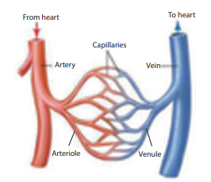

**Figure 14.10:** Structure of blood vessel

### Table 14.1: Differences between Artery and Vein

| S.No | Artery | Vein |
|:---|:---|:---|
| 1 | Distributing vessel | Collecting vessel |
| 2 | Pink in colour | Red in colour |
| 3 | Deep location | Superficial in location |
| 4 | Blood flow with high pressure | Blood flow with low pressure |
| 5 | Wall of artery is strong, thick and elastic | Wall of vein is weak, thin and non-elastic |
| 6 | All arteries carry oxygenated blood except pulmonary arteries | All veins carry deoxygenated blood except pulmonary veins |
| 7 | Internal valves are absent | Internal valves are present |

---

## 14.14 Types of Circulatory System

Animals possess two types of circulatory system. They are:
1. **Open type**
2. **Closed type**

### Open type

In open type the blood is pumped by heart into blood vessels that open into blood spaces called as **sinuses**. These sinuses are the body cavities which are called **haemocoel**. Capillary system is absent. e.g. Arthropods, Molluscs and some other invertebrates.

### Closed type

In closed type the blood flows in a complete circuit around the body through specific blood vessels. The blood flows from arteries to veins through small blood vessels called capillaries.

> **More to Know**
> 
> Closed circulatory system was discovered by **William Harvey (1628)** who is regarded the Father of Modern Physiology.

---

## 14.15 Structure of Human Heart

Heart is a muscular pumping organ that pumps out the blood into the blood vessels. Human heart is situated between the lungs, slightly tilted toward the left and above the diaphragm in the thoracic cavity. The heart is made of specialized type of muscle called the **cardiac muscle**.

The heart is enclosed in a double walled sac called **pericardium**. It contains lubricating pericardial fluid which reduces friction during heart beat and protects it from mechanical injuries.

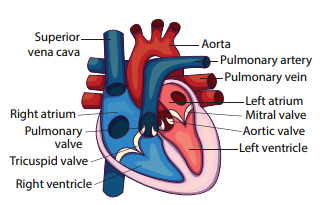

**Figure 14.11:** External structure of human heart

The human heart is **four chambered**. The two upper thin walled chambers of the heart are called **auricle** or **atria** (sing: atrium) and two lower thick walled chambers are called **ventricles**. The chambers are separated by partition called **septum**. The septum between auricles and ventricles prevents the mixing of oxygenated and deoxygenated blood.

The two auricles are separated from each other by **interatrial septum**. The left atrium is smaller than the right atrium. The right atrium receives deoxygenated blood from different parts of the body through the main veins **superior vena cava**, **inferior vena cava** and **coronary sinus**. **Pulmonary veins** bring oxygenated blood to the left atrium from the lungs. The right and left auricles pump blood into the right and left ventricles respectively.

The ventricles form the lower part of the heart. The two ventricles are separated from each other by an **interventricular septum**. The left and right ventricles have thick walls because the ventricles have to pump out blood with force away from the heart. From the right ventricle arises the **pulmonary trunk** which bifurcates to form right and left **pulmonary arteries**. The right and left pulmonary arteries supply deoxygenated blood to the lungs of the respective side. The left ventricle is longer and narrower than the right ventricle. The walls are about three times thicker than the right ventricle. The left ventricle gives rise to **aorta**. The oxygenated blood is supplied by the aorta to various organs of the body. The **coronary arteries** supply blood to the heart muscles.

**Figure 14.12:** Internal structure of human heart

### Valves

The valves are the muscular flaps that regulate the flow of blood in a single direction and prevent back flow of blood. The heart contains three types of valves:

**Right atrioventricular valve**: It is located between the right auricle and right ventricle. It has three thin triangular leaf like flaps and therefore called **tricuspid valve**. The apices of the flaps are held in position by **chordae tendinae** arising from the muscular projection of the ventricle wall known as **papillary muscles**.

**Left atrioventricular valve**: It is located between the left auricle and left ventricle. It has two cusps and therefore called **bicuspid** or **mitral valve**.

> **More to Know**
> 
> **Heart chambers in vertebrate animals**
> - Two chambered: Fishes
> - Three chambered: Amphibians
> - Incomplete four chambered: Reptiles
> - Four chambered: Aves, Mammals and Crocodiles (Reptile)

**Semilunar valves**: The major arteries (pulmonary artery and aorta) which leave the heart have semilunar valves which prevent backward flow of blood into the ventricles. They are the **pulmonary** and **aortic semilunar valves**.

### 14.15.1 Types of Blood Circulation

The blood circulates in our body as oxygenated and deoxygenated blood. The types of circulation are:

**i) Systemic circulation**: Circulation of oxygenated blood from the left ventricle of the heart to various organs of the body and return of deoxygenated blood to the right atrium. Aorta carries oxygenated blood to all the organs of the body.

**ii) Pulmonary circulation**: The path of pulmonary circulation starts in the right ventricle. Pulmonary artery arises from the right ventricle and reaches the lungs with deoxygenated blood. Pulmonary veins collect the oxygenated blood from the lungs and supplies it to the left atrium of the heart.

**iii) Coronary circulation**: The supply of blood to the heart muscles (cardiac muscles) is called as coronary circulation. Cardiac muscles receive oxygenated blood from coronary arteries that originate from the aortic arch. Deoxygenated blood from the cardiac muscles drains into the right atrium by the coronary sinus.

When the blood circulates twice through the heart in one complete cycle it is called **double circulation**. In double circulation the oxygenated blood do not mix with the deoxygenated blood.

However, in some animals the oxygenated and deoxygenated blood are mixed and pass through the heart only once. This type of circulation is called **single circulation**. e.g., fishes, amphibians and certain reptiles.

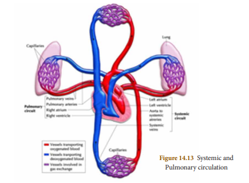

**Figure 14.13:** Pulmonary Systemic and circulation

### 14.15.2 Heart Beat

One complete contraction (systole) and relaxation (diastole) of the atrium and ventricles of the heart constitute heartbeat. The heart normally beats **72-75 times per minute**.

> **More to Know**
> 
> **Neurogenic and Myogenic Heart Beat**
> 
> **Neurogenic** heart beat is initiated by a nerve impulse caused from a nerve ganglion situated near the heart. e.g. Annelids, most arthropods.
> 
> **Myogenic** heart beat is initiated by a specialized group of modified heart muscle fibres. e.g. Mollusca and Vertebrates.

#### Initiation and conduction of Heart beat

The human heart is **myogenic** in nature. Contraction is initiated by a specialized portion of the heart muscle, the **sino-atrial (SA) node** which is situated in the wall of the right atrium near the opening of the superior vena cava. The SA node is broader at the top and tapering below. It is made up of thin fibres.

**Sino-atrial node** acts as the **'pacemaker'** of the heart because it is capable of initiating impulse which can stimulate the heart muscles to contract. The impulse from the sinoatrial node spreads as a wave of contraction over the right and left atrial wall pushing the blood through the atrioventricular valves into the ventricles. The wave of contraction from SA node reaches the **atrioventricular (AV) node** which is stimulated to emit an impulse of contraction spreading to the ventricular muscle via the **atrioventricular bundle** and the **Purkinje fibres**.

> **Note**: Atrioventricular bundle was discovered by His (1893). So is called **Bundle of His**.

**Pulse**: When the heart beats the blood is forced into the arteries. The expansion of the artery every time the blood is forced into it is called **pulse**. It can be felt by placing the fingertip on the artery near the wrist. Normal pulse rate ranges from **70-90/min**.

**Activity 3: Determining Heart Rate**

**Materials**: Stop watch or Stop clock.

**Procedure**:
1. Have your partner to find the pulse in your wrist and count your heartbeats for 15 seconds while you are seated. Calculate your resting heart rate in beats per minute.
2. Have your partner to count your heart beats for 15 seconds after you jog or run for 5 minutes. Calculate your heart rate in beats per minute.

**Analyse**:
- What causes your pulse?
- What causes the change in your heart beat rate in each situation?

### 14.15.3 Cardiac Cycle

The sequence of events occurring from the beginning to the completion of one heart beat is called **cardiac cycle**. During cardiac cycle blood flows through the chambers of the heart in a specific direction. Each cardiac cycle lasts about **0.8 second**. The events during a single cardiac cycle involves:

(a) **Atrial systole**: Contraction of auricles (0.1 sec)
(b) **Ventricular systole**: Contraction of ventricles (0.3 sec)
(c) **Ventricular diastole**: Relaxation of ventricles (0.4 sec)

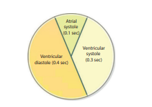

### 14.15.4 Heart Sound

The rhythmic closure and opening of the valves cause the sound of the heart.

The first sound **LUBB** is of longer duration and is produced by the closure of the tricuspid and bicuspid valves after the beginning of ventricular systole. The second sound **DUPP** is of a shorter duration and produced by the closure of semilunar valves at the end of ventricular systole.

---

## 14.16 Blood pressure

Blood pressure is the force exerted during the flow of blood against the lateral walls of arteries. The blood pressure is high in the arteries gradually drops in the arterioles and capillaries and become very low in the veins.

Blood pressure is usually expressed in terms of the **systolic pressure** and **diastolic pressure**.

**Systolic pressure**: During ventricular systole, the left ventricle contracts and forces blood into the aorta. The pressure rises to a peak which is referred as systolic pressure.

**Diastolic pressure**: During diastole, the ventricles relax and the pressure falls to the lowest value which is referred as diastolic pressure.

In a healthy adult during normal resting condition systolic and diastolic blood pressure is expressed as **120mm/80mm Hg**. Blood pressure varies during conditions of physical exercise, anxiety, emotions, stress and sleep.

A prolonged or constant elevation of blood pressure is a condition known as **hypertension** (High blood pressure) can increase the risk of heart attack and stroke. Decrease in blood pressure is termed **hypotension** (Low blood pressure).

### Stethoscope

A stethoscope is used to detect the sound produced by the internal organs of human body. The heart sound is heard by placing the stethoscope on the chest. It is a useful diagnostic tool to identify and localize health problems and diagnose disease. The modern electronic stethoscopes are high precisioned instruments.

**Figure 14.14:** Stethoscope

### Sphygmomanometer

Sphygmomanometer is a clinical instrument used to measure blood pressure when a person is in a relaxed and resting condition. The pressure of the brachial artery is measured. It helps to estimate the state of blood circulation and the working of the heart. It helps to diagnose conditions such as increased or decreased blood pressure. Monometric and modern digital types are the apparatus used to measure blood pressure.

**Figure 14.15:** Monometric (A) and Digital (B) type blood pressure apparatus

---

## 14.17 Blood Groups

The concept of blood grouping was developed by **Karl Landsteiner (1900)**. He identified blood groups A, B and O. AB blood group was recognized by Decastello and Sturli (1902).

Human blood contains certain specific substances called **agglutinogens** or **antigens (Ag)** and **agglutinins** or **antibodies (Ab)**. Antigens are found on the membrane surface of RBC. Antibodies are present in blood plasma. Based on the presence or absence of antigen and antibodies human blood group is classified into four groups called **A, B, AB and O**. An individual has one of the four blood groups.

**(i) 'A' group individuals**: Antigen A is present on the surface of RBC and antibody b (anti-b) is present in the plasma.

**(ii) 'B' group individuals**: Antigen B is present on the surface of RBC and antibody a (anti-a) is present in the plasma.

**(iii) 'AB' group individuals**: Antigens A and B are present on the surface of RBC and both the antibodies are absent in the plasma.

**(iv) 'O' group individuals**: Antigen A or B are absent on the surface of RBC. However, the plasma contains both the antibodies a and b (anti a and b).

### Blood donation

In blood transfusion one must consider the antigen and antibody compatibility (matching) between the donor and the person receiving blood (recipient). When an individual receives a mismatched blood group from the donor agglutination (clumping) of blood occurs in the body which leads to death.

Persons with **'AB' blood group** are called **'Universal Recipient'** as they can receive blood from persons with any blood group.

Persons with **'O' blood group** are called **'Universal Donor'** as they can donate blood to persons with any blood group.

### Rh factor

**Rh factor** was discovered by **Landsteiner and Wiener in 1940** in Rhesus monkey. The surface of RBC contains the antigen for Rh factor. **Rh+ (positive)** persons have Rh antigen on the surface of RBC while, **Rh- (negative)** persons do not have Rh antigen on the surface of RBC. Antibodies developed against this Rh antigen is called Rh antibodies.

### Table 14.2: Distribution of Antigen (RBC) and Antibody (Plasma) in different Blood Groups

| Blood Group | Antigens on RBC | Antibodies in Plasma | Can donate to | Can receive from |
|:---|:---|:---|:---|:---|
| A | Antigen A | anti-b | A and AB | A and O |
| B | Antigen B | anti-a | B and AB | B and O |
| AB | Antigen A and B | No antibody | AB | A, B, AB and O (Universal Recipient) |
| O | No Antigen | Both anti a and b | A, B, AB and O (Universal Donor) | O |

---

## 14.18 Lymphatic System

The lymphatic system comprises of lymphatic capillaries, lymphatic vessels, lymph nodes and lymphatic ducts. Lymph is the fluid that flows through the lymphatic system.

The lymphatic capillaries unite to form large lymphatic vessels. Lymph nodes are small oval or pear shaped structures located along the length of lymphatic vessels.

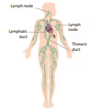

**Figure 14.16:** Lymphatic System in Man

### Lymph

Lymph from the intercellular spaces drains into lymphatic capillaries. Lymph is a colourless fluid formed when plasma, proteins and blood cells escape into intercellular spaces in the tissues through the pores present in the walls of capillaries. It is similar to blood plasma, but is colourless and contains less proteins. The lymph contains very small amount of nutrients, oxygen, CO₂, water and lymphocytes.

### Functions of Lymph

- Supplies nutrients and oxygen to those parts where blood cannot reach
- It drains away excess tissue fluid and metabolites and returns proteins to the blood from tissue spaces.
- The lymph also carries absorbed fats from small intestine to the blood. The lymphatic capillaries of intestinal villi (lacteals) absorb digested fats.
- Lymphocytes in the lymph defend the body from infections.

---

## Points to Remember

- The movement of molecules from a region of higher concentration to a region of their lower concentration without the utilization of energy is called diffusion.
- Osmosis is the movement of solvent or water molecules from the region of higher concentration to the region of lower concentration through a semi-permeable membrane.
- Transpiration is the evaporation of water in plants through stomata in the leaves.
- The circulatory system consists of the circulating fluids, the blood and lymph and the heart and its blood vessels.
- The blood consists of two main components. The fluid plasma and the formed elements (blood cells) which are found suspended in the plasma.
- A muscular pumping organ that pumps out the blood into the blood vessels is called heart.
- The blood circulates in our body as oxygenated and deoxygenated blood.
- The supply of blood to the heart muscles (cardiac muscles) is called as coronary circulation.
- One complete contraction (systole) and relaxation (diastole) of atrium and ventricles of heart is called a heartbeat.
- The sequence of events which occur during the beginning and completion of one heart beat is called cardiac cycle.
- Blood pressure is usually expressed as systolic pressure and diastolic pressure (120mm/80mm Hg)
- An individual has one of the four blood groups A, B, AB and O.
- Rh factor was discovered by Landsteiner and Wiener in 1940.
- Lymph is a colourless fluid formed when plasma, proteins and blood cells escape into intercellular spaces in the tissues through the pores present in the walls of capillaries.

---

## Reference Books

1. V.K. Jain, Fundamentals of Plant physiology, S. Chand and Company, New Delhi
2. D.G Maclean and Dave Hayward, Biology Cambridge IGCSE
3. S.C. Rastogi., Essential of Animal Physiology, 4th Edition, New Age International Publishers
4. Elain N. Marieb and Katja Hoehn, 2011, Anatomy and Physiology, 4th Edition, Pearson

## Internet Resources

- http://www.britannica.com/science/human-circulatory-system
- http://biologydictionary.net/circulatory-system/

---

## Concept Maps

*Figure: Transportation in Plants - Concept Map*

*Figure: Circulatory System - Concept Map*

---

## ICT Corner

**CHE-cardiovascular system** - This 3D application enables the student to know about the structure and functions of cardio vascular system.

**Steps**:
- Access the application CHE – cardiovascular system with the help of URL or QR code given below.
- After installing it in your device, when you open the app, you can see 4 sections as Introduction, Heart – structure & functions, Blood circulatory system and Blood.
- In each section, description as well as supportive images will be given.
- If you click the picture, a video will be played in it. You can zoom in and zoom out the images and also you can see its any direction by making movements.
- We can maximize as well as minimize the speed of the 3D animation to get clear details of the structures.

---

*Pictures are indicative only*

---
