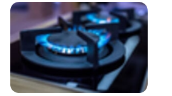

# 10 TYPES OF CHEMICAL REACTIONS

## Learning Objectives

After completing this lesson learners will be able to:
- Infer different types of chemical reaction.
- Acquire knowledge about combination reaction and skill to perform a combination reaction using quick lime and water.
- Identify and differentiate between reversible and irreversible reactions.
- Explain the reversible reaction occurring at the equilibrium state.
- List and explain characteristics of equilibrium state.
- Define rate of reaction.
- Discuss the dependence of rate of reactions on concentration, temperature and catalyst.
- Define pH.
- Correlate the concentration of hydrogen ions and pH with neutral, acidic and basic nature of aqueous solutions.
- Recognize the importance of pH in everyday life.
- Explain the term ionic product of water.

---

## INTRODUCTION

As you know from your earlier studies, a chemical reaction involves breaking of old chemical bonds and formation of new chemical bonds. This change may happen spontaneously or it may be facilitated by external forces or energy. Chemistry is all about chemical reactions. In your day to day life, you could observe many chemical reactions. A clear understanding of these reactions is essential in order to manipulate them for the sake of human life and environment. So, chemistry mainly focuses on chemical reactions.

**Let us try to find the answer for the following questions:**
- You need energy to play, walk, run or to perform various physical activities. Where do you get the energy from?
- How do plants grow and get their food?
- How does a car move using fuel?
- Why does iron rust on its exposure to water or air?

**Answers:**
- You get energy from the digestion of the food you eat.
- Plants grow by absorbing nutrients from the Earth and get their food by photosynthesis.
- The combustion of a fuel makes the car to move.
- Oxidation of iron causes rusting.

So, all these processes are chemical changes i.e. the materials, which undergo changes are converted into some other new materials. For example, by burning petrol, the hydrocarbons present in it are converted into carbon dioxide and water.

---

## What happens during a chemical reaction?

- In a chemical reaction, the atoms of the reacting molecules or elements are rearranged to form new molecules.
- Old chemical bonds between atoms are broken and new chemical bonds are formed.
- Bond breaking absorbs energy whereas bond formation releases energy.

---

## How are chemical reactions represented?

When methane reacts with oxygen, it forms carbon dioxide and water.

**Word equation:**
> Methane + Oxygen → Carbon dioxide + Water

**Chemical equation:**
```
CH₄ + O₂ → CO₂ + H₂O
```

**Balanced chemical equation:**
```
CH₄ + 2O₂ → CO₂ + 2H₂O
```

With physical states:
```
CH₄(g) + 2O₂(g) → CO₂(g) + 2H₂O(g)
```

### Physical State Symbols

| Symbol | Phase or Physical State |
|--------|------------------------|
| s | Solid |
| l | Liquid |
| g | Gas |
| aq | Aqueous Solution |

**Example:**
```
2K(s) + 2H₂O(l) → 2KOH(aq) + H₂(g)
```

---

## 10.1 TYPES OF CHEMICAL REACTIONS

### Classification based on the nature of rearrangements of atoms

#### (a) Combination reactions

A combination reaction is a reaction in which two or more reactants combine to form a compound. It is otherwise called 'synthesis reaction' or 'composition reaction'.


**Example:** Hydrogen gas combines with chlorine gas to form hydrogen chloride gas.
```
H₂(g) + Cl₂(g) → 2HCl(g)
```

**Three classes of combination reactions:**

1. **Element + Element → Compound**
   
   *Example 1:* When solid sulphur reacts with oxygen, it produces sulphur dioxide.
   ```
   S(s) + O₂(g) → SO₂(g)
   ```
   
   *Example 2:* Sodium combines with chlorine to form sodium chloride.
   ```
   2Na(s) + Cl₂(g) → 2NaCl(s)
   ```

2. **Compound + Element → Compound**
   
   *Example:* Phosphorous trichloride reacts with chlorine gas.
   ```
   PCl₃(l) + Cl₂(g) → PCl₅(s)
   ```

3. **Compound + Compound → Compound**
   
   *Example:* Silicon dioxide reacts with calcium oxide.
   ```
   SiO₂(s) + CaO(s) → CaSiO₃(s)
   ```

> **Note:** Most of the combination reactions are exothermic in nature.

---

#### (b) Decomposition reactions

In a decomposition reaction, a single compound splits into two or more simpler substances under suitable conditions. It is the opposite of the combination reaction.


**Three main classes:**

**(i) Thermal Decomposition Reactions (Thermolysis)**

In this type of reaction, the reactant is decomposed by applying heat (Thermolysis).

Similarly, when calcium carbonate is heated, it breaks down into calcium oxide and carbon dioxide.

$$\text{CaCO}_{3(s)} \xrightarrow{\text{Heat}} \text{CaO}_{(s)} + \text{CO}_{2(g)}$$

In thermal decomposition reaction, heat is supplied to break the bonds. Such reactions, in which heat is absorbed, are called **'Endothermic reactions'**.

**(ii) Electrolytic Decomposition Reactions (Electrolysis)**

Electrical energy is used to bring about the reaction.

*Example:* Decomposition of sodium chloride.
```
2NaCl(aq) --Electricity→ 2Na(s) + Cl₂(g)
```

**(iii) Photo Decomposition Reactions**

Light facilitates the decomposition (Photolysis).

*Example:* Silver bromide exposed to light.
```
2AgBr(s) --Light→ 2Ag(s) + Br₂(g)
```

> The yellow coloured silver bromide turns into grey coloured silver metal.

---

#### (c) Single Displacement Reactions

It is a reaction between an element and a compound. When they react, one of the elements of the compound-reactant is replaced by the element-reactant.

**General scheme:**
```
A + BC → AC + B
```

*Example 1:* Zinc metal in hydrochloric acid.
```
Zn(s) + 2HCl(aq) → ZnCl₂(aq) + H₂(g)
```

*Example 2:* Iron nail in copper (II) sulphate solution.
```
Fe(s) + CuSO₄(aq) → FeSO₄(aq) + Cu(s)
```

**Activity Series** (mnemonic: Please Send Lions, Cats, Monkeys, And Zebras Into Lovely Hot Countries Signed General Penguin)

| Activity | Element |
|----------|---------|
| Most active | Potassium (K) |
| | Sodium (Na) |
| | Lithium (Li) |
| | Calcium (Ca) |
| | Magnesium (Mg) |
| | Aluminium (Al) |
| | Zinc (Zn) |
| | Iron (Fe) |
| | Lead (Pb) |
| | Hydrogen (H) |
| | Copper (Cu) |
| | Silver (Ag) |
| | Gold (Au) |
| Least active | Platinum (Pt) |

> More active elements readily displace less active elements from their aqueous solution.

---

#### (d) Double Displacement Reactions

When two compounds react, if their ions are interchanged, then the reaction is called double displacement reaction (Metathesis Reaction).


**Two major classes:**

**(i) Precipitation Reactions**

When aqueous solutions of two compounds are mixed, if they react to form an insoluble compound and a soluble compound.

*Example:* Potassium iodide and lead (II) nitrate.
```
Pb(NO₃)₂(aq) + 2KI(aq) → PbI₂(s)↓ + 2KNO₃(aq)
```

**(ii) Neutralization Reactions**

Acid reacts with base to form salt and water.

*Example 1:* Sodium hydroxide with hydrochloric acid.
```
NaOH(aq) + HCl(aq) → NaCl(aq) + H₂O(l)
```

*Example 2:* Ammonium hydroxide with nitric acid.
```
HNO₃(aq) + NH₄OH(aq) → NH₄NO₃(aq) + H₂O(l)
```

---

#### (e) Combustion Reactions

A **combustion reaction** is one in which the reactant rapidly combines with oxygen to form one or more oxides and energy (heat). So in combustion reactions, one of the reactants must be oxygen. Combustion reactions are majorly used as heat energy sources in many of our day to day activities.

**Example:** LPG is a mixture of hydrocarbon gases like propane, butane, propylene, etc. All these hydrocarbons burn with oxygen to form carbon dioxide and water.

$$\text{C}_3\text{H}_{8(g)} + 5\text{O}_{2(g)} \rightarrow 3\text{CO}_{2(g)} + 4\text{H}_2\text{O}_{(l)} + \text{Heat}$$

Since heat is evolved, it is an **exothermic reaction**. As oxygen is added, it is also an oxidation. So combustion may be called as an **exothermic oxidation**. If a flame is formed, then it is called **burning**.




**Figure 10.4** Combustion of LPG gas


> **Conceptual Thought:** All combustion reactions are oxidations but all oxidations are not combustions. Why?
> 
> **Answer:** Combustion requires rapid reaction with oxygen producing heat and light (flame). Oxidation is a broader term that includes slow processes like rusting that don't produce flames.

---

### Table 10.1: Differences between combination and decomposition reactions

| COMBINATION REACTIONS | DECOMPOSITION REACTIONS |
|----------------------|------------------------|
| One or more reactants combine to form a single product | A single reactant is decomposed to form one or more products |
| Energy is released | Energy is absorbed |
| Elements or compounds may be the reactants | Single compound is the reactant |

---

### 10.1.2 Classification based on the direction of the reaction


**Figure 10.5** Burning of wood and recharging of mobile battery

#### Reversible Reactions

A reversible reaction is a reaction in which the products can be converted back to the reactants. Represented by a double arrow.

**General scheme:**
```
AB ⇌ A + B
```

*Example:* Decomposition of phosphorous pentachloride.
```
PCl₅(g) ⇌ PCl₃(g) + Cl₂(g)
```

> Initially, the forward reaction proceeds faster than the backward reaction. After some time, the speed of both reactions become equal.

#### Irreversible Reactions

The reaction that cannot be reversed is called **irreversible reaction**. The irreversible reactions are unidirectional, i.e., they take place only in the forward direction.

**Example:** The combustion of coal into carbon dioxide and water.

$$\text{C}_{(s)} + \text{O}_{2(g)} \rightarrow \text{CO}_{2(g)} + \text{Heat}$$

In this reaction, solid coal burns with oxygen and gets converted into carbon dioxide gas. As the product is a gas, as soon as it is formed it escapes out of the reaction container. It is extremely hard to decompose a gas into a solid. Thus, the backward reaction is not possible in this case.

### Table 10.2: Differences between reversible and irreversible reactions

| REVERSIBLE REACTION | IRREVERSIBLE REACTION |
|---------------------|----------------------|
| It can be reversed under suitable conditions | It cannot be reversed |
| Both forward and backward reactions take place simultaneously | It is unidirectional. It proceeds only in forward direction |
| It attains equilibrium | Equilibrium is not attained |
| The reactants cannot be converted completely into products | The reactants can be completely converted into products |
| It is relatively slow | It is fast |

---

## 10.2 RATE OF A CHEMICAL REACTION

**Definition:** "Rate of a reaction is the change in the amount or concentration of any one of the reactants or products per unit time."

For reaction: A → B
```
Rate = -d[A]/dt = +d[B]/dt
```

### 10.2.1 Factors influencing the rate of a reaction

1. **Nature of the reactants**
2. **Concentration of the reactants**
3. **Temperature**
4. **Catalyst**
5. **Pressure**
6. **Surface area of the reactants**

| Factor | Effect |
|--------|--------|
| Nature of reactants | Stronger acids react faster (e.g., HCl vs CH₃COOH with Na) |
| Concentration | Higher concentration = faster reaction |
| Temperature | Higher temperature = faster reaction |
| Catalyst | Increases reaction rate without being consumed |
| Pressure | Increasing pressure (for gases) increases rate |
| Surface area | Powdered form reacts more readily than solid chunks |

*Example:* Manganese dioxide as catalyst for potassium chlorate decomposition.

---

## 10.3 STATE OF EQUILIBRIUM

In a reversible reaction, both forward and backward reactions take place simultaneously. When the rate of the forward reaction becomes equal to the rate of backward reaction, then no more product is formed. This stage is called **'equilibrium state'**.

**Chemical Equilibrium:** It is state of a reversible chemical reaction in which no change in the amount of the reactants and products takes place.

At equilibrium:
$$\text{Rate of forward reaction = Rate of backward reaction}$$

*Example:*
```
CaCO₃(s) ⇌ CaO(s) + CO₂(g)
```

**Physical Equilibrium:** When water kept in closed vessel evaporates, it forms water vapour. At equilibrium:
```
H₂O(l) ⇌ H₂O(g)
```

### Characteristics of equilibrium

- In a chemical equilibrium, the rates of the forward and backward reactions are equal.
- The observable properties such as pressure, concentration, colour, density, viscosity etc., of the system remain unchanged with time.
- The chemical equilibrium is a **dynamic equilibrium**, because both the forward and backward reactions continue to occur even though it appears static externally.
- In physical equilibrium, the volume of all the phases remain constant.

**DO YOU KNOW?** Aerated soft drinks contain dissolved carbon dioxide in equilibrium with gaseous CO₂. When you open the bottle, the gaseous CO₂ can escape, so the dissolved CO₂ begins to undissolve back to the gas phase. That's why if you leave it open long enough, it will go 'flat'.

---

## 10.4 IONIC PRODUCT OF WATER

Self-ionisation of water:
```
H₂O(l) + H₂O(l) ⇌ H₃O⁺(aq) + OH⁻(aq)
```

**Ionic product of water (Kw):**
```
Kw = [H₃O⁺][OH⁻] = [H⁺][OH⁻]
```

Unit: mol² dm⁻⁶

At 25°C: **Kw = 1.00 × 10⁻¹⁴**

---

## 10.5 pH SCALE

pH scale is a scale for measuring the hydrogen ion concentration in a solution. The 'p' in pH stands for 'Potenz' in German meaning 'power'. Devised by Sorensen in 1909.

**pH scale:** 0 to 14

| Solution Type | pH Range |
|--------------|----------|
| Acids | pH < 7 |
| Neutral | pH = 7 |
| Bases | pH > 7 |

**Formula:**
```
pH = -log₁₀[H⁺]
```

### Common pH Values

| Common Acids | pH | Common Bases | pH |
|-------------|-----|-------------|-----|
| HCl (4%) | 0 | Blood plasma | 7.4 |
| Stomach acid | 1 | Egg white | 8 |
| Lemon juice | 2 | Seawater | 8 |
| Vinegar | 3 | Baking soda | 9 |
| Oranges | 3.5 | Antacids | 10 |
| Soda, grapes | 4 | Ammonia water | 11 |
| Sour milk | 4.5 | Lime water | 12 |
| Fresh milk | 5 | Drain cleaner | 13 |
| Human saliva | 6-8 | Caustic soda 4% (NaOH) | 14 |
| Pure water | 7 | Milk of magnesia | 10 |
| Tomato juice | 4.2 | Coffee | 5.6 |

---


**Figure 10.7** pH Indicator


## 10.6 ROLE OF pH IN EVERYDAY LIFE

### Are plants and animals pH sensitive?

Our body works within the pH range of **7.0 to 7.8**. Living organisms can survive only in a narrow range of pH change.

- **pH of blood:** 7.35 to 7.45 (ideal: 7.4)

### pH in our digestive system

- Stomach produces hydrochloric acid (pH ≈ 2.0)
- Helps in digestion without harming the stomach
- Indigestion causes excess acid → pain and irritation

### pH changes as the cause of tooth decay

- pH of saliva: 6.5 to 7.5
- When pH falls below 5.5, enamel (calcium phosphate) gets weathered
- Toothpastes (basic) neutralize excess acid

### pH of soil

| Crop | Soil pH |
|------|---------|
| Citrus fruits | Slightly alkaline |
| Rice | Acidic |
| Sugarcane | Neutral |

### pH of rain water

- Normal rain water pH ≈ 7 (neutral)
- If polluted with SOₓ, NOₓ gases → pH < 7 (**acid rain**)
- Acid rain lowers pH of river water, affecting aquatic life

---

## 10.7 pH CALCULATION

**pH formula:**
```
pH = -log₁₀[H⁺]
```

**pOH formula:**
```
pOH = -log₁₀[OH⁻]
```

**Relationship:**
```
pH + pOH = 14 (at 25°C)
```

### Example Problems

**Example 1:** Calculate the pH of 0.01 M HNO₃
```
[H⁺] = 0.01 = 1 × 10⁻²
pH = -log₁₀(10⁻²) = 2
```

**Example 2:** Calculate the pH of 0.001 M HCl
```
[H⁺] = 1 × 10⁻³
pH = -log₁₀(10⁻³) = 3
```

**Example 3:** Calculate the pH of 1 × 10⁻⁴ M NaOH
```
[OH⁻] = 1 × 10⁻⁴
pOH = -log₁₀(10⁻⁴) = 4
pH = 14 - 4 = 10
```

---

## 10.8 PROBLEMS

**Example 4:** Calculate the pH of a solution in which [H⁺] = 1.0 × 10⁻⁸ mol litre⁻¹
```
pH = -log₁₀(10⁻⁸) = 8
```

**Example 5:** If pH = 4.5, what is pOH?
```
pOH = 14 - 4.5 = 9.5
```

---

## Points to Remember

- A chemical change is a change in which one or more new substances are formed.
- Most combination reactions are exothermic.
- All photo decomposition reactions are endothermic reactions.
- Double displacement reaction or metathesis may occur by the mutual exchange of ions.
- Precipitation reaction gives an insoluble salt as the product.
- Neutralisation reactions are reactions between an acid and a base that forms salt and water.
- Neutralisation prevents tooth decay.
- Most reactions in chemistry are irreversible reactions.
- Chemical equilibrium: the rate of the forward reaction is equal to rate of the backward reactions.
- Equilibrium is possible in a closed system.
- Temperature increases the reaction rate.
- Pressure increases the reaction rate.
- The term pH means power of hydrogen.
- pH plays a vital role in everyday life.
- In humans all biochemical reactions take place between the pH value of 7.0 to 7.8.
- If pH of rain water is below 5.6 it's called acid rain.
- Pure water is a weak electrolyte.

---

## TEXTBOOK EVALUATION

### I. Choose the correct answer

1. H₂(g) + Cl₂(g) → 2HCl(g) is
   - a. Decomposition Reaction
   - b. **Combination Reaction** ✓
   - c. Single Displacement Reaction
   - d. Double Displacement Reaction

2. Photolysis is a decomposition reaction caused by
   - a. heat
   - b. electricity
   - c. **light** ✓
   - d. mechanical energy

3. C(s) + O₂(g) → CO₂(g) + Heat can be classified as:
   - (i) Combination Reaction
   - (ii) Combustion Reaction
   - (iii) Decomposition Reaction
   - (iv) Irreversible Reaction
   - **Answer: d. i, ii and iv** ✓

4. Na₂SO₄(aq) + BaCl₂(aq) → BaSO₄(s)↓ + 2NaCl(aq) represents:
   - a. Neutralisation
   - b. Combustion
   - c. **Precipitation** ✓
   - d. Single displacement

5. Correct statements about chemical equilibrium:
   - (i) It is dynamic in nature
   - (ii) The rate of forward and backward reactions are equal
   - (iii) Irreversible reactions do not attain chemical equilibrium
   - (iv) The concentration of reactants and products may be different
   - **Answer: a. i, ii and iii** ✓

6. X(s) + 2HCl(aq) → XCl₂(aq) + H₂(g). Which could be X?
   - (i) Zn (ii) Ag (iii) Cu (iv) Mg
   - **Answer: d. i and iv** ✓

7. Which is NOT "element + element → compound"?
   - a. C(s) + O₂(g) → CO₂(g)
   - b. 2K(s) + Br₂(l) → 2KBr(s)
   - c. **2CO(g) + O₂(g) → 2CO₂(g)** ✓ (compound + element)
   - d. 4Fe(s) + 3O₂(g) → 2Fe₂O₃(s)

8. Which represents a precipitation reaction?
   - **Answer: c. A(aq) + B(aq) → C(s) + D(aq)** ✓

9. The pH of a solution is 3. Its [OH⁻] concentration is
   - a. 1 × 10⁻³ M
   - b. 3 M
   - c. **1 × 10⁻¹¹ M** ✓
   - d. 11 M

10. Powdered CaCO₃ reacts more rapidly than flaky CaCO₃ because of
    - a. **large surface area** ✓
    - b. high pressure
    - c. high concentration
    - d. high temperature

### II. Fill in the blanks

1. A reaction between an acid and a base is called **neutralisation**.
2. When lithium metal is placed in hydrochloric acid, **hydrogen** gas is evolved.
3. The equilibrium attained during the melting of ice is known as **physical equilibrium**.
4. The pH of a fruit juice is 5.6. If you add slaked lime to this juice, its pH **increase**.
5. The value of ionic product of water at 25°C is **1 × 10⁻¹⁴**.
6. The normal pH of human blood is **7.4**.
7. Electrolysis is type of **decomposition** reaction.
8. The number of products formed in a synthesis reaction is **one**.
9. Chemical volcano is an example for **thermal decomposition** type of reaction.
10. The ion formed by dissolution of H⁺ in water is called **hydronium ion (H₃O⁺)**.

### III. Match the following

| REACTION | TYPE |
|:---|:---|
| $\text{NH}_4\text{OH}_{(aq)} + \text{CH}_3\text{COOH}_{(aq)} \rightarrow \text{CH}_3\text{COONH}_{4(aq)} + \text{H}_2\text{O}_{(l)}$ | Single Displacement |
| $\text{Zn}_{(s)} + \text{CuSO}_{4(aq)} \rightarrow \text{ZnSO}_{4(aq)} + \text{Cu}_{(s)}$ | Combustion |
| $\text{ZnCO}_{3(s)} \xrightarrow{\text{Heat}} \text{ZnO}_{(s)} + \text{CO}_{2(g)}$ | Neutralisation |
| $\text{C}_2\text{H}_{4(g)} + 4\text{O}_{2(g)} \rightarrow 2\text{CO}_{2(g)} + 2\text{H}_2\text{O}_{(g)} + \text{Heat}$ | Thermal decomposition |

### IV. True or False

1. **FALSE** - Silver metal cannot displace hydrogen gas from nitric acid (Silver is below hydrogen in activity series).
2. **TRUE** - The pH of rain water containing dissolved gases like SO₃, CO₂, NO₂ will be less than 7.
3. **FALSE** - At equilibrium, the **rates** of forward and backward reactions are equal, not necessarily the concentrations.
4. **TRUE** - Periodical removal of one of the products increases the yield (Le Chatelier's principle).
5. **FALSE** - Yellow colour indicates acidic solution (pH ~6), not basic.

### V. Short answer questions

**1. White precipitate reaction:**
```
KCl(aq) + AgNO₃(aq) → AgCl(s)↓ + KNO₃(aq)
```

**2. Why reaction rate increases with temperature:**
Adding heat provides energy to break more bonds and thus speeds up the reaction.

**3. Combination reaction:** A reaction in which two or more reactants combine to form a compound.
*Example:* Burning of coal: C + O₂ → CO₂ + Heat (exothermic)

**4. Reversible vs Irreversible reactions:**

| Reversible | Irreversible |
|------------|--------------|
| Can be reversed | Cannot be reversed |
| Both directions occur | Unidirectional |
| Attains equilibrium | No equilibrium |
| Relatively slow | Fast |

### VI. Answer in detail

**1. Thermolysis reactions:** Decomposition reactions caused by heat/thermal energy. Heat is absorbed (endothermic). Examples: 2HgO → 2Hg + O₂; CaCO₃ → CaO + CO₂

**2. Types of double displacement reactions:**
- Precipitation: Forms insoluble product (PbI₂ from KI + Pb(NO₃)₂)
- Neutralisation: Acid + Base → Salt + Water

**3. Factors influencing rate:** Nature of reactants, concentration, temperature, catalyst, pressure, surface area

**4. Role of pH in everyday life:** Digestive system, tooth decay prevention, soil pH for agriculture, blood pH maintenance, acid rain effects

**5. Chemical equilibrium:** State where forward and backward reaction rates are equal. Characteristics: dynamic nature, constant observable properties, closed system required.

### VII. HOT questions

**1. Compound A:** Calcium carbonate (CaCO₃)
- **B:** Calcium oxide (CaO)
- **C:** Carbon dioxide (CO₂)

**2. Nickel spatula in copper sulphate:** Yes, because nickel is above copper in the activity series and can displace it.

### VIII. Solve the following problems

1. **Lemon juice pH = 2:**
   ```
   [H⁺] = 10⁻² = 0.01 M
   ```

2. **pH of 1.0 × 10⁻⁴ M HNO₃:**
   ```
   pH = -log(10⁻⁴) = 4
   ```

3. **pH of 1.0 × 10⁻⁵ M KOH:**
   ```
   pOH = 5, pH = 14 - 5 = 9
   ```

4. **[OH⁻] = 1 × 10⁻¹¹ M:**
   ```
   pOH = 11, pH = 14 - 11 = 3
   ```

---

## REFERENCE BOOKS

1. Text book of inorganic chemistry - P.L. Soni - S. Chand & sons publishers, New Delhi.
2. Principles of Physical Chemistry - B.R. Ruri, L.R. Sharma, Vishal publishing Co Punjab.

## INTERNET RESOURCES

- www.chem4kids.com
- http://aravindguptatoys.com/filims.html

---

## Concept Map

```
CHEMICAL REACTIONS
├── Occur only with
│   ├── Change in state
│   ├── Change in colour
│   ├── Change in Temperature
│   └── Evolution of gas
├── Factors affecting rate
│   ├── Nature of reactants
│   ├── Concentration
│   ├── Temperature
│   ├── Catalyst
│   ├── Pressure
│   └── Surface area
└── Types of Chemical Reaction
    ├── Combination Reaction: 2Na + Cl₂ → 2NaCl
    ├── Decomposition Reaction: CaCO₃ → CaO + CO₂
    ├── Double Displacement Reaction
    │   ├── Precipitation: Na₂CO₃ + CaCl₂ → CaCO₃ + 2NaCl
    │   └── Neutralisation
    ├── Reversible Reaction
    └── Irreversible Reaction
```

---