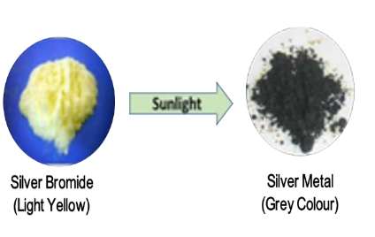
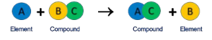
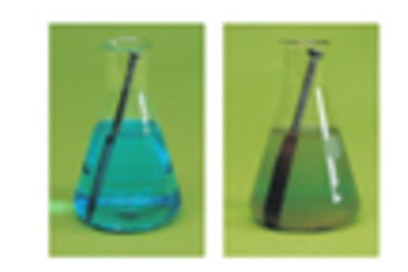
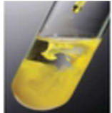
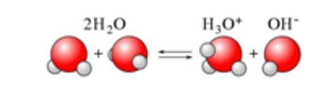

# 10 TYPES OF CHEMICAL REACTIONS

## Learning Objectives

After completing this lesson learners will be able to:

- Infer different types of chemical reaction.
- Acquire knowledge about combination reaction and skill to perform a combination reaction using quick lime and water.
- Identify and differentiate between reversible and irreversible reactions.
- Explain the reversible reaction occurring at the equilibrium state.
- List and explain characteristics of equilibrium state.
- Define rate of reaction.
- Discuss the dependence of rate of reactions on concentration, temperature and catalyst.
- Define pH.
- Correlate the concentration of hydrogen ions and pH with neutral, acidic and basic nature of aqueous solutions.
- Recognize the importance of pH in everyday life.
- Explain the term ionic product of water.

---

## INTRODUCTION

As you know from your earlier studies, a chemical reaction involves breaking of old chemical bonds and formation of new chemical bonds. This change may happen spontaneously or it may be facilitated by external forces or energy. Chemistry is all about chemical reactions. In your day to day life, you could observe many chemical reactions. A clear understanding of these reactions is essential in order to manipulate them for the sake of human life and environment.

**Questions to consider:**
- You need energy to play, walk, run or to perform various physical activities. Where do you get the energy from?
- How do plants grow and get their food?
- How does a car move using fuel?
- Why does iron rust on its exposure to water or air?

You get energy from the digestion of the food you eat. Plants grow by absorbing nutrients from the Earth and get their food by photosynthesis. The combustion of a fuel makes the car to move. Oxidation of iron causes rusting. So, all these processes are chemical changes i.e. the materials, which undergo changes are converted into some other new materials.

---

## What happens during a chemical reaction?

- In a chemical reaction, the atoms of the reacting molecules or elements are rearranged to form new molecules.
- Old chemical bonds between atoms are broken and new chemical bonds are formed.
- Bond breaking absorbs energy whereas bond formation releases energy

## How are chemical reactions represented?

When methane reacts with oxygen, it forms carbon dioxide and water.

**Word equation:**
> Methane + Oxygen → Carbon dioxide + Water

**Chemical equation:**

(\text{CH}_4 + \text{O}_2 \rightarrow \text{CO}_2 + \text{H}_2\text{O})


**Balanced chemical equation:**

(\text{CH}_4 + 2\text{O}_2 \rightarrow \text{CO}_2 + 2\text{H}_2\text{O})


With physical states:

(\text{CH}_{4(g)} + 2\text{O}_{2(g)} \rightarrow \text{CO}_{2(g)} + 2\text{H}_2\text{O}_{(g)})


> **Definition:** A balanced chemical equation is the simplified representation of a chemical reaction which describes the chemical composition, physical state of the reactants and the products, and the reaction conditions.

### Physical State Symbols

| Symbol | Phase or Physical State |
|--------|------------------------|
| s | Solid |
| l | Liquid |
| g | Gas |
| aq | Aqueous Solution |

**Example:**

(2\text{K}_{(s)} + 2\text{H}_2\text{O}_{(l)} \rightarrow 2\text{KOH}_{(aq)} + \text{H}_{2(g)})


---

## 10.1 TYPES OF CHEMICAL REACTIONS

### Classification based on the nature of rearrangements of atoms

#### (a) Combination reactions

A combination reaction is a reaction in which two or more reactants combine to form a compound. It is otherwise called 'synthesis reaction' or 'composition reaction'.

**Example:** Hydrogen gas combines with chlorine gas to form hydrogen chloride gas.

(\text{H}_{2(g)} + \text{Cl}_{2(g)} \rightarrow 2\text{HCl}_{(g)})


**Three classes of combination reactions:**

1. **Element + Element → Compound**
   
   Example 1: When solid sulphur reacts with oxygen, it produces sulphur dioxide.

   

   
(\text{S}_{(s)} + \text{O}_{2(g)} \rightarrow \text{SO}_{2(g)})

   
   Example 2: Sodium combines with chlorine to form sodium chloride.
   
(2\text{Na}_{(s)} + \text{Cl}_{2(g)} \rightarrow 2\text{NaCl}_{(s)})


2. **Compound + Element → Compound**
   
   Example: Phosphorous trichloride reacts with chlorine gas and forms phosphorous pentachloride.
   
(\text{PCl}_{3(l)} + \text{Cl}_{2(g)} \rightarrow \text{PCl}_{5(s)})


3. **Compound + Compound → Compound**
   
   Example: Silicon dioxide reacts with calcium oxide to form calcium silicate.
   
(\text{SiO}_{2(s)} + \text{CaO}_{(s)} \rightarrow \text{CaSiO}_{3(s)})


> **Note:** Most of the combination reactions are exothermic in nature because they involve the formation of new bonds, which releases a huge amount of energy in the form of heat.

#### (b) Decomposition reactions

In a decomposition reaction, a single compound splits into two or more simpler substances under suitable conditions. It is the opposite of the combination reaction.

Breaking of bonds is the major phenomenon in a decomposition reaction and hence it requires energy to break the bonds.

**Three main classes of decomposition reactions:**

1. **(i) Thermal Decomposition Reactions (Thermolysis)**
   
   In this type of reaction, the reactant is decomposed by applying heat.
   
   Example 1: Mercury (II) oxide is decomposed into mercury metal and oxygen gas.
   
(2\text{HgO}_{(s)} \xrightarrow{\text{Heat}} 2\text{Hg}_{(l)} + \text{O}_{2(g)})

   
   Example 2: Calcium carbonate breaks down into calcium oxide and carbon dioxide.
   
(\text{CaCO}_{3(s)} \xrightarrow{\text{Heat}} \text{CaO}_{(s)} + \text{CO}_{2(g)})

   
   > Such reactions, in which heat is absorbed, are called **Endothermic reactions**.

2. **(ii) Electrolytic Decomposition Reactions (Electrolysis)**
   
   In some decomposition reactions, electrical energy is used to bring about the reaction.
   
   Example: Decomposition of sodium chloride on passing electric current through its aqueous solution.
   
(2\text{NaCl}_{(aq)} \xrightarrow{\text{Electricity}} 2\text{Na}_{(s)} + \text{Cl}_{2(g)})


3. **(iii) Photo Decomposition Reactions (Photolysis)**
   
   Light is another form of energy which facilitates some decomposition reactions.
   
   Example: When silver bromide is exposed to light, it breaks down into silver metal and bromine gas.
   
(2\text{AgBr}_{(s)} \xrightarrow{\text{Light}} 2\text{Ag}_{(s)} + \text{Br}_{2(g)})


**Figure 10.1** Photo decomposition of silver bromide
   
   The yellow coloured silver bromide turns into grey coloured silver metal.

> **DO YOU KNOW?**
> A solution of slaked lime is used for white washing walls. Calcium hydroxide reacts slowly with the carbon dioxide in air to form a thin layer of calcium carbonate on the walls.
> 
(\text{Ca(OH)}_{2(aq)} + \text{CO}_{2(g)} \rightarrow \text{CaCO}_{3(s)} + \text{H}_2\text{O}_{(l)})


#### (c) Single Displacement Reactions

It is a reaction between an element and a compound. When they react, one of the elements of the compound-reactant is replaced by the element-reactant to form a new compound and an element.

'A' displaces element 'B' from the compound 'BC'.

**Examples:**


(\text{Zn}_{(s)} + 2\text{HCl}_{(aq)} \rightarrow \text{ZnCl}_{2(aq)} + \text{H}_{2(g)})



(\text{Fe}_{(s)} + \text{CuSO}_{4(aq)} \rightarrow \text{FeSO}_{4(aq)} + \text{Cu}_{(s)})


**Figure 10.2** Displacement of copper

> **Activity Series (Most reactive to Least reactive):**
> 
> **To remember:** Please Send Lions Cats Monkeys And Zebras Into Lovely Hot Countries Signed General Penguin
> 
> K > Na > Li > Ca > Mg > Al > Zn > Fe > Pb > H > Cu > Ag > Au > Pt

More active elements readily displace less active elements from their aqueous solution.

#### (d) Double Displacement Reactions

When two compounds react, if their ions are interchanged, then the reaction is called double displacement reaction. This reaction is also called 'Metathesis Reaction'.

**Two major classes:**

1. **(i) Precipitation Reactions**
   
   When aqueous solutions of two compounds are mixed, if they react to form an insoluble compound and a soluble compound, then it is called precipitation reaction.
   
   Example: When clear aqueous solutions of potassium iodide and lead (II) nitrate are mixed, a yellow precipitate of lead (II) iodide is formed.
   
(\text{Pb(NO}_3)_{2(aq)} + 2\text{KI}_{(aq)} \rightarrow \text{PbI}_{2(s)}\downarrow + 2\text{KNO}_{3(aq)})


**Figure 10.3** Precipitation of PbI2

2. **(ii) Neutralization Reactions**
   
   The reaction between an acid and a base to form a salt and water. It is called 'neutralization reaction' as both acid and base neutralize each other.
   
   
   
   Example:
   
(\text{NaOH}_{(aq)} + \text{HCl}_{(aq)} \rightarrow \text{NaCl}_{(aq)} + \text{H}_2\text{O}_{(l)})


#### (e) Combustion Reactions

A combustion reaction is one in which the reactant rapidly combines with oxygen to form one or more oxides and energy (heat). So in combustion reactions, one of the reactants must be oxygen.

**Example:**

(\text{C}_3\text{H}_{8(g)} + 5\text{O}_{2(g)} \rightarrow 3\text{CO}_{2(g)} + 4\text{H}_2\text{O}_{(g)} + \text{Heat})


**Figure 10.4** Combustion of LPG gas

> **Conceptual Thought:** All combustion reactions are oxidations but all oxidations are not combustions. Why?

Since heat is evolved, it is an exothermic reaction. As oxygen is added, it is also an oxidation. So combustion may be called as an exothermic oxidation. If a flame is formed, then it is called burning.

---

### Table 10.1: Differences between combination and decomposition reactions

| Combination Reactions | Decomposition Reactions |
|----------------------|------------------------|
| One or more reactants combine to form a single product | A single reactant is decomposed to form one or more products |
| Energy is released | Energy is absorbed |
| Elements or compounds may be the reactants | Single compound is the reactant |

---

### 10.1.2 Classification based on the direction of the reaction

**Figure 10.5** Burning of wood and recharging of mobile battery

#### Reversible Reactions

A reversible reaction is a reaction in which the products can be converted back to the reactants. A reversible reaction is represented by a double arrow.

**Example:**

(\text{PCl}_{5(g)} \rightleftharpoons \text{PCl}_{3(g)} + \text{Cl}_{2(g)})


> **MORE TO KNOW:** If hydrogen peroxide is poured on a wound, it decomposes into water and oxygen. The gaseous oxygen bubbles away as it is formed and thus prevent the formation of H₂O₂.
> 
(2\text{H}_2\text{O}_{2(aq)} \rightleftharpoons 2\text{H}_2\text{O}_{(l)} + \text{O}_{2(g)})


#### Irreversible Reactions

The reaction that cannot be reversed is called irreversible reaction. The irreversible reactions are unidirectional.

**Example:**

(\text{C}_{(s)} + \text{O}_{2(g)} \rightarrow \text{CO}_{2(g)} + \text{Heat})


---

### Table 10.2: Differences between reversible and irreversible reactions

| Reversible Reaction | Irreversible Reaction |
|--------------------|----------------------|
| It can be reversed under suitable conditions | It cannot be reversed |
| Both forward and backward reactions take place simultaneously | It is unidirectional. It proceeds only in forward direction |
| It attains equilibrium | Equilibrium is not attained |
| The reactants cannot be converted completely into products | The reactants can be completely converted into products |
| It is relatively slow | It is fast |

---

## 10.2 RATE OF A CHEMICAL REACTION

**Definition:** "Rate of a reaction is the change in the amount or concentration of any one of the reactants or products per unit time".


(\text{Rate} = -\frac{d[\text{A}]}{dt} = +\frac{d[\text{B}]}{dt})


Where:
- [A] – Concentration of A
- [B] – Concentration of B
- The negative sign indicates the decrease in the concentration of A with time
- The positive sign indicates the increase in the concentration of B with time

### 10.2.1 Factors influencing the rate of a reaction

1. **Nature of the reactants**
2. **Concentration of the reactants**
3. **Temperature**
4. **Catalyst**
5. **Pressure**
6. **Surface area of the reactants**

---

## 10.3 STATE OF EQUILIBRIUM

**Chemical Equilibrium:** It is state of a reversible chemical reaction in which no change in the amount of the reactants and products takes place.

At equilibrium:

(\text{Rate of forward reaction} = \text{Rate of backward reaction})


**Physical Equilibrium:** A state of a physical change at which the volume of all the phases remain unchanged.


(\text{H}_2\text{O}_{(l)} \underset{\text{Condensation}}{\stackrel{\text{Evaporation}}{\rightleftharpoons}} \text{H}_2\text{O}_{(g)})


**Figure 10.6** State of physical equilibrium

### Characteristics of equilibrium

- In a chemical equilibrium, the rates of the forward and backward reactions are equal.
- The observable properties such as pressure, concentration, colour, density, viscosity etc., of the system remain unchanged with time.
- The chemical equilibrium is a dynamic equilibrium, because both the forward and backward reactions continue to occur even though it appears static externally.
- In physical equilibrium, the volume of all the phases remain constant.

---

## 10.4 IONIC PRODUCT OF WATER

Self-ionisation or auto ionisation is a reaction in which two like molecules react to give ions.


(2\text{H}_2\text{O}_{(l)} \rightleftharpoons \text{H}_3\text{O}^+_{(aq)} + \text{OH}^-_{(aq)})


The product of the concentration of the hydronium ion and the hydroxyl ion is called **'ionic product of water'**. It is denoted as **'K_w'**.


(K_w = [\text{H}_3\text{O}^+][\text{OH}^-])


or simply:

(K_w = [\text{H}^+][\text{OH}^-])


- Unit: mol² dm⁻⁶
- At 25°C: 
(K_w = 1.00 \times 10^{-14})


---

## 10.5 pH SCALE

pH scale is a scale for measuring the hydrogen ion concentration in a solution. The 'p' in pH stands for 'Potenz' in German meaning 'power'. pH notation was devised by the Danish biochemist Sorensen in 1909.

- **Acids have pH less than 7**
- **Bases have pH greater than 7**
- **A neutral solution has pH equal to 7**


(\text{pH} = -\log_{10}[\text{H}^+])


### Common pH Values

| Common Acids | pH | Common Bases | pH |
|-------------|-----|-------------|-----|
| HCl (4%) | 0 | Blood plasma | 7.4 |
| Stomach acid | 1 | Egg white | 8 |
| Lemon juice | 2 | Sea water | 8 |
| Vinegar | 3 | Baking soda | 9 |
| Oranges | 3.5 | Antacids | 10 |
| Soda, grapes | 4 | Ammonia water | 11 |
| Sour milk | 4.5 | Lime water | 12 |
| Fresh milk | 5 | Drain cleaner | 13 |
| Human saliva | 6-8 | Caustic soda 4% (NaOH) | 14 |
| Pure water | 7 | Milk of magnesia | 10 |
| Tomato juice | 4.2 | Coffee | 5.6 |

---

**Figure 10.7** pH Indicator

## 10.6 ROLE OF pH IN EVERYDAY LIFE

### Are plants and animals pH sensitive?

Our body works within the pH range of 7.0 to 7.8. Living organisms can survive only in a narrow range of pH change. The ideal pH for blood is 7.4.

### pH in our digestive system

Our stomach produces hydrochloric acid. It helps in the digestion of food without harming the stomach. pH of the stomach fluid is approximately 2.0.

### pH changes as the cause of tooth decay

pH of the saliva normally ranges between 6.5 to 7.5. When the pH of the mouth saliva falls below 5.5, the enamel gets weathered. Toothpastes, which are generally basic, are used for cleaning the teeth that can neutralise the excess acid and prevent tooth decay.

### pH of soil

In agriculture, the pH of the soil is very important. Citrus fruits require slightly alkaline soil, while rice requires acidic soil and sugarcane requires neutral soil.

### pH of rain water

The pH of rain water is approximately 7, which means that it is neutral. If the atmospheric air is polluted with oxide gases of sulphur and nitrogen, they get dissolved in the rain water and make its pH less than 7. Thus, if the pH of rain water is less than 7, then it is called **acid rain**.

---

## 10.7 pH CALCULATION


(\text{pH} = -\log_{10}[\text{H}^+])


**Example:** Calculate the pH of 0.01M HNO₃?

**Solution:**

([\text{H}^+] = 0.01)


(\text{pH} = -\log_{10}[0.01] = -\log_{10}[1 \times 10^{-2}] = 0 + 2 = 2)


### pOH


(\text{pOH} = -\log_{10}[\text{OH}^-])


### Relationship between pH and pOH


(\text{pH} + \text{pOH} = 14)


---

## 10.8 PROBLEMS

**Example 1:** Calculate the pH of 0.001 molar solution of HCl.

**Solution:** 

([\text{H}^+] = 1 \times 10^{-3} \text{ mol litre}^{-1})


(\text{pH} = -\log_{10}[10^{-3}] = 3)


**Example 2:** What would be the pH of an aqueous solution of sulphuric acid which is 
(5 \times 10^{-5})
 mol litre⁻¹ in concentration.

**Solution:**

([\text{H}^+] = 1.0 \times 10^{-4} \text{ mol litre}^{-1})


(\text{pH} = 4)


**Example 3:** Calculate the pH of 
(1 \times 10^{-4})
 molar solution of NaOH.

**Solution:**

([\text{OH}^-] = 1 \times 10^{-4} \text{ mol litre}^{-1})


(\text{pOH} = 4)


(\text{pH} = 14 - 4 = 10)


**Example 4:** Calculate the pH of a solution in which the concentration of the hydrogen ions is 
(1.0 \times 10^{-8})
 mol litre⁻¹.

**Solution:**

(\text{pH} = 8)


**Example 5:** If the pH of a solution is 4.5, what is its pOH?

**Solution:**

(\text{pOH} = 14 - 4.5 = 9.5)


---

## Points to Remember

- A chemical change is a change in which one or more new substances are formed.
- Most combination reactions are exothermic
- All photo decomposition reaction are endothermic reactions.
- Double displacement reaction or metathesis may occur by the mutual exchange of ions.
- Precipitation reaction gives an insoluble salt as the product.
- Neutralisation reactions are reactions between an acid and a base that forms salt and water.
- Neutralisation prevents tooth decay.
- Most reactions in chemistry are irreversible reactions.
- Chemical equilibrium—the rate of the forward reaction is equal to rate of the backward reactions.
- Equilibrium is possible in a closed system.
- Temperature increases the reaction rate.
- Pressure increases the reaction rate.
- The term pH means power of hydrogen.
- pH plays a vital role in everyday life.
- In humans all bio chemical reactions take place between the pH value of 7.0 to 7.8.
- If pH of rain water is below 5.6 its called acid rain.
- Pure water is a weak electrolyte.

---

## REFERENCE BOOKS

1. Text book of inorganic chemistry - P.L. Soni - S. Chand & sons publishers, New Delhi.
2. Principles of Physical Chemistry - B.R. Ruri, L.R. Sharma, Vishal publishing Co, Punjab.

## INTERNET RESOURCES

- www.chem4kids.com
- http://aravindguptatoys.com/filims.html

## Concept Map

