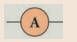

# Electricity

**Learning Objectives**

At the end of this lesson, students will be able to: 

‹ Make an electric circuit. 
‹ Differentiate between electric potential and potential difference. 
‹ Infer what electrical resistivity and conductivity mean. 
‹ Know the effective resistance of a system of resistors connected in series and parallel. 
‹ Understand the heating effect of the electric current. 
‹ Define electric power and electric energy and explain domestic electric circuits. 
‹ Know the modern appliances such as LED bulb and LED television.

**INTRODUCTION**

You have already learnt about electricity in your lower classes, haven’t you? Well, electricity deals with the flow of electric charges through a conductor. As a common term it refers to a form of energy. The usage of electric current in our day to day life is very important and indispensable. You are already aware of the fact that it is used in houses, educational institutions, hospitals, industries, etc. Therefore, its generation and transmission becomes a very crucial aspect of our life. In this lesson you will learn various terms used in understanding the concept of electricity. Eventually, you will realise the importance of the applications of electricity in day to day situations.

## ELECTRIC CURRENT

The motion of electric charges (electrons) through a conductor (e.g., copper wire) will constitute an electric current. This is similar to

the flow of water through a channel or flow of air from a region of high pressure to a region of low pressure.

In a similar manner, the electric current passes from the positive terminal (higher electric potential) of a battery to the negative terminal (lower electric potential) through a wire as shown in the Figure 4.1.

**4.1.1   Definition of electric  current**

Electric current is often termed as ‘current’ and it is represented by the symbol ‘I’. **It is defined as the rate of flow of charges in a conductor.** This means that the electric current** represents the amount of charges flowing in any cross section of a conductor (say a metal wire) in unit time. If a net charge ‘Q’ passes through any cross section of a conductor time ‘t’, then the current flowing through the conductor is

I = Q / t

**4.1.2  SI unit of electric current**

The SI unit of electric current is ampere (A). The current flowing through a conductor is said to be one ampere, when a charge of one coulomb flows across any cross-section of a conductor, in one second. Hence,

1 ampere = .//todo

**Solved Problem-1** 

A charge of 12 coulomb flows through a
bulb in 5 second. What is the current through the bulb?

**Solution:**
//todo
Charge Q = 12 C, Time t = 5 s. Therefore,

current I = = = 2.4 A

## ELECTRIC CIRCUIT

An electric circuit is a closed conducting loop (or) path, which has a network of electrical components through which electrons are able to flow. This path is made using electrical wires so as to connect an electric appliance to a source of electric charges (battery). A schematic diagram of an electric circuit comprisisng of a battery, an electric bulb, and a switch is given in Figure 4.2.

**Figure 4.2** A simple electric circuit

**Table 4.1** Symbols of some components of a circuit

| C OMPONENT |USE OF THE  C OMPONENT |SYMB OL USED |
|------|------|------|
| Resi stor |Used t o x t he m agnitude o f t he c ur rentthroug h a cir cuit |  |
| Variable r esi storor R heostat |Used t o s ele ct t he m agnitude o f t he c ur rentthroug h a cir cuit. |  |
| Ammeter |Used t o m easure t he cur rent. |  |
| Voltmeter |Used t o m easure t he p otential difference. |  |
| Galvanometer |Used t o det ect t he cur rent a nd its direction. |  |
| A dio de |It i s u sed in e le ctronic devices. |  |
| Lig ht Emi ttingDio de (LED) |It i s u sed in s even s eg ment display. |  |
| Groundconnection |Used t o provide p rotection t o t he e le ctric alcomp onents. It a lso s er ves a s a r eference p ointto m easure t he e le ctric p otential. |  |

In this circuit, if the switch is‘on’, the bulb glows. If it is switched off, the bulb does not glow. Therefore, the circuit must be closed in order that the current passes through it. The potential difference required for the flow of charges is provided by the battery. The electrons flow from the negative terminal to the positive terminal of the battery.

**By convention, the direction of current is taken as the direction of flow of positive charge (or) opposite to the direction of flow of electrons. Thus, electric current passes in** the circuit from the positive terminal to the negative terminal.

**4.2.1  Electrical components**

 The electric circuit given in Figure 4.2 consists of different components, such as a battery, a switch and a bulb. All these components can be represented by using certain symbols. It is easier to represent the components of a circuit using their respective symbols.

The symbols that are used to represent some commonly used components are given in Table 4.1. The uses of these components are also summarized in the table.

## ELECTRIC POTENTIAL AND POTENTIAL DIFFERENCE

You are now familiar with the water current and air current. You also know that there must be a difference in temperature between two points in a solid for the heat to flow in it. Similarly, a difference in electric potential is needed for the flow of electric charges in a conductor. In the conductor, the charges will flow from a point in it, which is at a higher electric potential to a point, which is at a lower electric potential.

**4.3.1  Electric Potential** The electric potential at a point is defined

as the amount of work done in moving a unit positive charge from infinity to that point against the electric force.

**4.3.2 Electric Potential Difference** The electric potential difference between

two points is defined as the amount of work done in moving a unit positive charge from one point to another point against the electric force.

**Figure 4.3** Electric potential

Suppose, you have moved a charge Q from a point A to another point B. Let ‘W’ be the work done to move the charge from A to B. Then, the potential difference between the points A and B is given by the following expression:

Potential = (4.2) Difference (V)//todo

Potential difference is also equal to the difference in the electric potential of these two points. If VA and VB represent the electric potential at the points A and B respectively, then, the potential difference between the points A and B is given by:

V = VA – VB(if VA is more than VB) 
V = VB – VA (if VB is more than VA)

**Volt**

The SI unit of electric potential or potential difference is volt (V).

The potential difference between two points is one volt, if one joule of work is done in moving one coulomb of charge from one point to another against the electric force.

1volt =//todo

**Solved Problem-2 The work done in moving a charge of 10 C** across two points in a circuit is 100 J. What is the potential difference between the points?

**Solution:** 

Charge, Q = 10 C Work Done, W = 100 J

Potential Difference V =w/q = 100/10.//todo Therefore, V = 10 volt

## OHM’S LAW

A German physicist, Georg Simon Ohm established the relation between the potential difference and current, which is known as Ohm’s Law. This relationship can be understood from the following activity.

**Figure 4.4** Electric circuit to understand Ohm’s law

According to Ohm’s law, at a constant temperature, the steady current ‘I’ flowing through a conductor is directly proportional to the potential difference ‘V’ between the two ends of the conductor.

I V. Hence, = constant.//todo

The value of this proportionality constant is

found to be

Therefore, I = V

**V = I R** (4.3)
//todo

Here, R is a constant for a given material (say Nichrome) at a given temperature and is known as the **resistance** of the material. Since, the potential difference V is proportional to the current I, the graph between V and I is a straight line for a conductor, as shown in the Figure 4.5.

**Figure 4.5** Relation between potential difference and current

## RESISTANCE OF A MATERIAL

In Figure 4.4, a Nichrome wire was connected between X and Y. If you replace the Nichrome wire with a copper wire and conduct the same experiment, you will notice a different current for the same value of the potential difference across the wire. If you again replace the copper wire with an aluminium wire, you will get another value for the current passing through it. From equation (4.3), you have learnt that V/I must be equal to the resistance of the conductor used. The variations in the current for the same values of potential difference indicate that the resistance of different materials is different. Now, the primary question is, “what is resistance?”

Resistance of a material is its property to oppose the flow of charges and hence the passage of current through it. It is different for **_different materials._**

From Ohm’s Law, = R.//todo

**_The resistance of a conductor can be defined as the ratio between the potential difference across the ends of the conductor and the current flowing through it._**

**4.5.1 Unit of Resistance**

The SI unit of resistance is ohm and it is represented by the symbol Ω.

**_Resistance of a conductor is said to be one ohm if a current of one ampere flows through it when a potential difference of one volt is maintained across its ends_**.

1 ohm = 1 //todo

**Solved Problem-3** 

Calculate the resistance of a conductor
through which a current of 2 A passes, when the potential difference between its ends is 30 V.

**Solution:** 
Current through the conductor I = 2 A, Potential Difference V = 30 V
//todo
From Ohm’s Law: R = .

Therefore, R = = 15 Ω

## ELECTRICAL RESISTIVITY & ELECTRICAL CONDUCTIVITY

###   Electrical Resistivity

You can verify by doing an experiment that the resistance of any conductor ‘R’ is directly proportional to the length of the conductor ‘L’ and is inversely proportional to its area of cross section ‘A’.

//todo
R L, R ,

Hence , R

Therefore, R = ρ (4.4)

Where, ρ (rho) is a constant, called as electrical resistivity or specific resistance of the material of the conductor.
//todo
From equation (4.4), ρ =

If L = 1 m, A = 1 m2 then, from the above equation ρ = R

Hence, the electrical resistivity of a material is defined as the resistance of a **_conductor of unit length and unit area of cross section_**. Its unit is **ohm metre**.

Electrical resistivity of a conductor is a measure of the resisting power of a specified material to the passage of an electric current. It is a constant for a given material.

---
**do you know ?**

Nichrome is a conductor with highest resistivity equal to 1.5 × 10–6 Ω m. Hence, it is used in making heating elements.

---

###    Conductance and  Conductivity

Conductance of a material is the property of a material to aid the flow of charges and hence, the passage of current in it. The conductance of a material is mathematically **_defined as the reciprocal of its resistance (R)._** Hence, the conductance ‘**G**’ of a conductor is given by

**G** = 1 / R  (4.5)

Its unit is ohm–1. It is also represented as ‘mho’.

**_The reciprocal of electrical resistivity of a material is called its electrical conductivity_**.

\= (4.6)//todo

Its unit is ohm–1 metre–1. It is also represented as mho metre–1. The conductivity is a constant for a given material. Electrical conductivity of a conductor is a measure of its ability to pass the current through it. Some materials are good conductors of electric current. Example: copper, aluminium, etc. While some other materials are non- conductors of electric current (insulators). Example: glass, wood, rubber, etc.

conductors than for insulators. The resistivity of some commonly used materials is given in Table 4.2.

**Table 4.2** Resistivity of some materials

| NATURE  OFTHEMATERIAL |MATERIAL |RESISTIVIT Y(Ω m) |
|------|------|------|
| Conductor |Copper |1.62 × 10–8 |
| Nickel |6.84 × 10–8 |
| Chromium |12.9 × 10–8 |
| Insulator |Glass |to10 1010 14 |
| Rubber |to10 1013 16 |

**Solved Problem-4** The resistance of a wire of length 10 m is 2 ohm. If the area of cross section of the wire is 2 × 10–7 m2, determine its 

(i) resistivity 

(ii) conductance and 

(iii) conductivity 

**Solution:**
//todo
Given: Length, L = 10 m, Resistance, R = 2 ohm and Area, A = 2 × 10–7 m2

Resistivity, = =

\= 4 × 10–8 Ω m

Conductance, **G** = = = 0.5 mho

Conductivity, = =

\= 0.25 × 108 mho m–1
//todo 
## SYSTEM OF RESISTORS

So far, you have learnt how the resistance of a conductor affects the current through a circuit. You have also studied the case of the simple electric circuit containing a single resistor. Now in practice, you may encounter a complicated circuit, which uses a combination of many resistors. This combination of resistors

is known as ‘system of resistors’ or ‘grouping of resistors’. Resistors can be connected in various combinations. The two basic methods of joining resistors together are:

a) Resistors connected in series, and b) Resistors connected in parallel.

In the following sections, you shall compute the effective resistance when many resistors having different resistance values are connected in series and in parallel.

**4.7.1 Resistors in series**

A series circuit connects the components one after the other to form a ‘single loop’. A series circuit has only one loop through which current can pass. If the circuit is interrupted at any point in the loop, no current can pass through the circuit and hence no electric appliances connected in the circuit will work. Series circuits are commonly used in devices such as flashlights. Thus, if resistors **_are connected end to end, so that the same current passes through each of them, then they are said to be connected in series_**.

  

**Figure 4.6** Series connection of resistors

Let, three resistances R1, R2 and R3 be connected in series (Figure 4.6). Let the current flowing through them be I. According to Ohm’s Law, the potential differences V1, V2 and V3 across R1, R2 and R3 respectively, are given by:

V1 = I R1 (4.7) 
V2 = I R2 ( 4.8) 
V3 = I R3 (4.9) 
The sum of the potential differences across

the ends of each resistor is given by: V = V1 + V2 + V3

Using equations (4.7), (4.8) and (4.9), we get 

V = I R1 + I R2 + I R3 (4.10)//todo

The effective resistor is a single resistor,

which can replace the resistors effectively, so as to allow the same current through the electric circuit. Let, the effective resistance of the series-combination of the resistors, be RS. Then,
//todo
V = I RS (4.11) Combining equations (4.10) and (4.11),

you get, I RS = I R1 + I R2 + I R3

RS = R1 + R2 + R3 (4.12) Thus, you can understand that when a number of resistors are connected in series, their equivalent resistance or effective resistance is equal to the sum of the individual resistances. When ‘n’ resistors of equal resistance R are connected in series, the equivalent resistance is ‘n R’.

i.e., RS = n R //todo

**_The equivalent resistance in a series_**

**_combination is greater than the highest of the individual resistances_**. **Solved Problem-5** Three resistors of resistances 5 ohm, 3 ohm and 2 ohm are connected in series with 10 V battery. Calculate their effective resistance and the current flowing through the circuit. **Solution:** R1 = 5 Ω, R2 = 3 Ω, R3 = 2 Ω, V = 10 V Rs = R1 + R2 + R3, Rs = 5 + 3 + 2 = 10, hence Rs = 10 Ω The current, I = = = 1 A

###  Resistances in Parallel
 A parallel circuit has two or more loops

through which current can pass. If the circuit is disconnected in one of the loops, the current can still pass through the other loop(s). The wiring in a house consists of parallel circuits.

**Figure 4.7** Parallel connections of resistors

Consider that three resistors R1, R2 and R3 are connected across two common points A and B. The potential difference across each resistance is the same and equal to the potential difference between A and B. This is measured using the voltmeter. The current I arriving at A divides into three branches I1, I2 and I3 passing through R1, R2 and R3 respectively.

According to the Ohm’s law, you have,
//todo
I1 = (4.13)

I2 = (4.14)

I3 = (4.15)
//todo
The total current through the circuit is given by

I = I1 + I2 + I3 //todo

Using equations (4.13), (4.14) and (4.15), you get

I = + + (4.16) //todo

Let the effective resistance of the parallel combination of resistors be RP. Then,

I = (4.17) //todo

Combining equations (4.16) and (4.17), you have
//todo
\= + +

\= + + (4.18)
//todo

Thus, when a number of resistors are connected in parallel, the sum of the reciprocals of the individual resistances is equal to the reciprocal of the effective or equivalent resistance. When ‘n’ resistors of equal resistances R are connected in parallel, the equivalent resistance is .
//todo
i.e., = + + ... + = .

Hence, Rp =

**_The equivalent resistance in a parallel combination is less than the lowest of the individual resistances_**.

###  Series Connection of  Parallel Resistors

If you consider the connection of a set of parallel resistors that are connected in series, you get a series – parallel circuit. Let R1 and R2 be connected in parallel to give an effective resistance of RP1. Similarly, let R3 and R4 be connected in parallel to give an effective resistance of RP2. Then, both of these parallel segments are connected in series (Figure 4.8).

Using equation (4.18), you get
//todo
\= +

\= +

Finally, using equation (4.12), the net effective resistance is given by Rtotal = RP1 + RP2

###  Parallel Connection of  Series Resistors

If you consider a connection of a set of series resistors connected in a parallel circuit, you get a parallel-series circuit. Let R1 and R2 be connected in series to give an effective resistance of RS1. Similarly, let R3 and R4 be connected in series to give an effective resistance of RS2. Then, both of these serial segments are connected in parallel (Figure 4.9).

**Figure 4.9** Parallel-series combination of resistors

Using equation (4.12), you get 

RS1 = R1 + R2, RS2 = R3 + R4
//todo

Finally, using equation (4.18), the net effective resistance is given by
//totdo
\= +

**4.7.5 Difference between series  and parallel connections**

The difference between series and parallel circuits may be summed as follows in Table 4.3

| S. No. |CRITERI A |SERIES |PAR ALLEL |
|------|------|------|------|
| 1 |Equivalent resistance |More than the highest resistance. |Less than the lowest resistance. |
| 2 |Amount of current |Current i s les s a s e ective resistance is more. |Current is more as eective re-sistance is les s. |
| 3 |Switching ON/OFF |If one appliance i s di sconnected, others also do not work. |If one appliance is disconnected,others will work independently. |

## HEATING EFFECT OF CURRENT

Have you ever touched the motor casing of a fan, which has been used for a few hours continuously? What do you observe? The motor casing is warm. This is due to the heating effect of current. The same can be observed by touching a bulb, which was used for a long duration. Generally, a source of electrical energy can develop a potential difference across a resistor, which is connected to that source. This potential difference constitutes a current through the resistor. For continuous drawing of current, the source has to continuously spend its energy. A part of the energy from the source can be converted into useful work and the rest will be converted into heat energy. Thus, the passage of electric current through a wire, results in the production of heat. This phenomenon is called heating effect of current. This heating effect of current is used in devices like electric heater, electric iron, etc.

### Joule’s Law of Heating

Let ‘I’ be the current flowing through a resistor of resistance ‘R’, and ‘V’ be the potential difference across the resistor. The charge flowing through the circuit for a time interval ‘t’ is ‘Q’.

The work done in moving the charge Q across the ends of the resistor with a potential difference of V is VQ. This energy spent by the source gets dissipated in the resistor as heat. Thus, the heat produced in the resistor is:

H = W = VQ

You know that the relation between the charge and current is Q = I t. Using this, you get

H = V I t (4.19) From Ohm’s Law, V = I R. Hence, you have

**H = I2 R t** (4.20) This is known as Joule’s law of heating. Joule’s law of heating states that the heat produced in any resistor is: • directly proportional to the square of the

current passing through the resistor. • directly proportional to the resistance of

the resistor. • directly proportional to the time for

which the current is passing through the resistor.

**4.82 Applications of Heating Effect**

**1\. Electric Heating Device:** The heating effect of electric current is used in many home appliances such as electric iron, electric toaster, electric oven, electric heater, geyser, etc. In these appliances Nichrome, which is an alloy of Nickel and Chromium is used as the heating element. Why? Because:

(i) it has high resistivity, 
(ii) it has a high melting point,(iii) it is not easily oxidized.

**2\. Fuse Wire:** The fuse wire is connected in series, in an electric circuit. When a large current passes through the circuit, the fuse wire melts due to Joule’s heating effect and hence the circuit gets disconnected. Therefore, the circuit and the electric appliances are saved from any damage. 
The fuse wire is made up of a material whose melting point is relatively low.

**3\. Filament in bulbs:** In electric bulbs, a small wire is used,

known as filament. The filament is made up of a material whose melting point is very high. When current passes through this wire, heat is produced in the filament. When the filament is heated, it glows and gives out light. Tungsten is the commonly used material to make the filament in bulbs.

**Solved Problem-6** An electric heater of resistance 5 Ω is connected to an electric source. If a current of 6 A flows through the heater, then find the amount of heat produced in 5 minutes. 

**Solution:**
  Given resistance R = 5 Ω, Current I
  
= 6 A, Time t = 5 minutes = 5 × 60 s = 300 s

Amount of heat produced, H = I2Rt, H = 62 × 5 × 300. Hence, H = 54000 J

## ELECTRIC POWER

In general, power is defined as the rate of doing work or rate of spending energy. Similarly, the electric power is defined as the rate of consumption of electrical energy. It represents the rate at which the electrical energy is converted into some other form of energy.

Suppose a current ‘I’ flows through a conductor of resistance ‘R’ for a time ‘t’, then the potential difference across the two ends of the conductor is ‘V’. The work done ‘W’ to move the charge across the ends of the conductor is given by the equation (4.19) as follows:

W = V I t, Power P = work / Time =VIt / t

**P = V I** (4.21) Thus, the electric power is the product of

the electric current and the potential difference due to which the current passes in a circuit.

### Unit of Electric Power** 

The SI unit of electric power is watt. When a current of 1 ampere passes across the ends of a conductor, which is at a potential difference of 1 volt, then the electric power is

P = 1 volt × 1 ampere = 1 watt 

Thus, one watt is the power consumed when an electric device is operated at a potential difference of one volt and it carries a current of one ampere. A larger unit of power, which is more commonly used is kilowatt.

**HORSE POWER:**

**The horse power (hp) is a unit in the foot-pound-second (fps) or English system, sometimes used to express the electric power. It is equal to 746 watt.**

### Consumption of  electrical  energy

Electricity is consumed both in houses and industries. Consumption of electricity is based on two factors: (i) Amount of electric power and (ii) Duration of usage. Electrical energy consumed is taken as the product of electric power and time of usage. For example, if 100 watt of electric power is consumed for two hours, then the power consumed is 100 × 2 = 200 watt hour. Consumption of electrical energy is measured and expressed in watt hour, though its SI unit is watt second. In practice, a larger unit of electrical energy is needed. This larger unit is kilowatt hour (kWh). One kilowatt hour is otherwise known as one unit of electrical energy. One kilowatt hour means that an electric power of 1000 watt has been utilized for an hour. Hence,

1 kWh = 1000 watt hour = 1000 × (60 × 60) watt second = 3.6 × 106 J

## DOMESTIC ELECTRIC CIRCUITS

The electricity produced in power stations is distributed to all the domestic and industrial consumers through overhead and underground cables. The diagram, which shows the general scheme of a domestic electric circuit, is given in Figure 4.10.

In our homes, electricity is distributed through the domestic electric circuits wired by the electricians. The first stage of the domestic circuit is to bring the power supply to the main-box from a distribution panel, such as a transformer. The important components of the main-box are: (i) a fuse box and (ii) a meter. The meter is used to record the consumption of electrical energy. The fuse box contains either a fuse wire or a miniature circuit breaker (MCB). The function of the fuse wire or a MCB is to protect the house hold electrical appliances from overloading due to excess current.

**Figure 4.10** Domestic electric circuit

You have learnt about a fuse wire in section 4.8.2. An MCB is a switching device, which can be activated automatically as well as manually. It has a spring attached to the switch, which is attracted by an electromagnet when an excess current passes through the circuit. Hence, the circuit is broken and the protection of the appliance is ensured. Figure 4.11 represents a fuse and an MCB.

**Figure 4.11** A fuse and an MCB

The electricity is brought to houses by two insulated wires. Out of these two wires, one wire has a red insulation and is called the ‘live wire’. The other wire has a black insulation and is called the ‘neutral wire’. The electricity supplied to your house is actually an alternating current having an electric potential of 220 V. Both, the live wire and the neutral wire enter into a box where the main fuse is connected with the live wire. After the electricity meter, these wires enter into the main switch, which is used to discontinue the electricity supply whenever required. After the main switch, these wires are connected to live wires of two separate circuits. Out of these two circuits, one circuit is of a 5 A rating, which is used to run the electric appliances with a lower power rating, such as tube lights, bulbs and fans. The other circuit is of a 15 A rating, which is used to run electric appliances with a high power rating, such as air-conditioners, refrigerators, electric iron and heaters. It should be noted that all the circuits in a house are connected in parallel, so that the disconnection of one circuit does not affect the other circuit. One more advantage of the parallel connection of circuits is that each electric appliance gets an equal voltage.

---

**DO YOU KNOWN**
In India, domestic circuits are supplied with an alternating current of potential 220/230V

and frequency 50 Hz. In countries like USA and UK, domestic circuits are supplied with an alternating current of potential 110/120 V and frequency 60 Hz.

---

### 4.10.1   Overloading and Short  circuiting

The fuse wire or MCB will disconnect the circuit in the event of an overloading and short circuiting. Over loading happens when a large number of appliances are connected in series to
the same source of electric power. This leads to a flow of excess current in the electric circuit. When the amount of current passing through a wire exceeds the maximum permissible limit, the wires get heated to such an extent that a fire may be caused. This is known as overloading. When a live wire comes in contact with a neutral wire, it causes a ‘short circuit’. This happens when the insulation of the wires get damaged due to temperature changes or some external force. Due to a short circuit, the effective resistance in the circuit becomes very small, which leads to the flow of a large current through the wires. This results in heating of wires to such an extent that a fire may be caused in the building.

### Earthing

In domestic circuits, a third wire called the earth wire having a green insulation is usually connected to the body of the metallic electric appliance. The other end of the earth wire is connected to a metal tube or a metal electrode, which is buried into the Earth. This wire provides a low resistance path to the electric current. The earth wire sends the current from the body of the appliance to the Earth, whenever a live wire accidentally touches the body of the metallic electric appliance. Thus, the earth wire serves as a protective conductor, which saves us from electric shocks.

## LED BULB

An LED bulb is a semiconductor device that emits visible light when an electric current passes through it. The colour of the emitted light will depend on the type of materials used. With the help of the chemical compounds like Gallium Arsenide and Gallium Phosphide, the manufacturer can produce LED bulbs that radiates red, green, yellow and orange colours. Displays in digital watches and calculators, traffic signals,street lights, decorative lights, etc., are some examples for the use of LEDs.

### Seven Segment Display

**Figure 4.12** Seven segment display

A ‘Seven Segment Display’ is the display device used to give an output in the form of numbers or text. It is used in digital meters, digital clocks, micro wave ovens, etc. It consists of 7 segments of LEDs in the form of the digit 8. These seven LEDs are named as a, b, c, d, e, f and g (Figure 4.12). An extra 8th LED is used to display a dot.

### Merits of a LED bulb 

1\. As there is no filament, there is no loss of energy in the form of heat. It is cooler than the incandescent bulb.

2\. In comparison with the fluorescent light, the LED bulbs have significantly low power requirement.

3\. It is not harmful to the environment. 

4\. A wide range of colours is possible here. 

5\. It is cost-efficient and energy efficient. 

6\. Mercury and other toxic materials are not required.

**One way of overcoming the energy crisis is to use more LED bulbs.**

## LED TELEVISION

LED Television is one of the most important applications of Light Emitting Diodes. An LED TV is actually an LCD TV (Liquid Crystal Display) with LED display. An LED display uses LEDs for backlight and an array of LEDs act as pixels. LEDs emitting white light are used in monochrome (black and white) TV; Red, Green and Blue (RGB) LEDs are used in colour television. The first LED television screen was developed by James P. Mitchell in 1977. It was a monochromatic display. But, after about three decades, in 2009, SONY introduced the first commercial LED Television.

### Advantages of LED  television

• It has brighter picture quality. 
• It is thinner in size. 
• It uses less power and consumes very less energy. 
• Its life span is more. 
• It is more reliable.

**Points to Remember**
™ The magnitude of current is defined 
as the rate of flow of charges in a 
conductor.
™ The SI unit of electric current is ampere (A).
™ The SI unit of electric potential and 
potential difference is volt (V). 
™ An electric circuit is a network of electrical 
components, which forms a continuous 
and closed path for an electric current to 
pass through it.
™ The parameters of conductors like 
its length, area of cross-section and 
material, affect the resistance of the 
conductor.
™ SI unit of electrical resistivity is ohm 
metre. The resistivity is a constant for a 
given material.
™ The reciprocal of electrical resistivity 
of a material is called its electrical 
conductivity. 
σ = 1
ρ
™ The passage of electric current through 
a wire results in the production of heat.
This phenomenon is called heating effect 
of current.
™ One horse power is equal to 746 watts. 
™ The function of a fuse wire or a MCB 
is to protect the house hold electrical appliances from excess current due to 
overloading or a short circuit.

