---

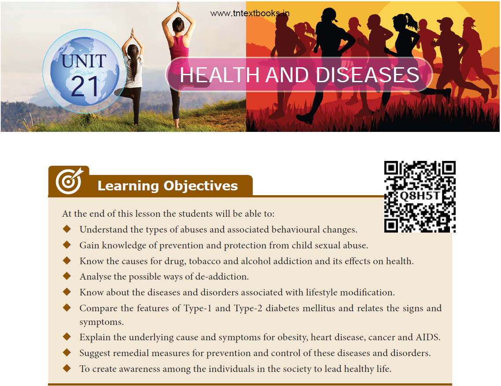  

  

Abuses occur in a variety of forms and are deeply rooted in cultural, social and economic practices. Solving this global problem however requires a much better understanding of its occurrence, causes and consequences with context to sexual and childhood abuse, this is followed by substance abuse. Are people leading healthier lives in today’s modern world than their generations did in the past? For instance, smoking cigarettes, alcohol addiction, use of drugs, eating high fat and cholesterol rich diets, excessive intake of junk foods, reduced physical activity are some of the risk factors for illness and early death. The role of behaviour in health has been receiving increased attention in countries around the world. The health habits of the individuals and their behaviour influence the development of chronic and fatal diseases such as diabetes, obesity, heart disease, cancer and AIDS. These conditions can be substantially reduced by adopting lifestyles that promote wellness and protect their health by taking nutritious diet, regular exercise and by avoiding drugs, alcohol and smoking.

 ## 21.1 Abuse and Types of Abuse

**Abuse** refers to cruel, violent, harmful or injurious treatment of another human being. It includes **physical**, **emotional** or **psychological**, **verbal, child** and **sexual** abuses. Abuse can occur within the family and with people who are not associated with the family.

These days the use of drugs, alcohol and tobacco has been increasing especially among teenagers and adolescents for adventure, excitement, curiosity and experimentation.
Let's analyse some of the consequences of sexual and childhood abuse, its prevention and protection.

### 21.1.1 Child Abuse
Child abuse constitutes all forms of physical or emotional ill treatment, sexual abuse, **exploitation** resulting in child’s ill health, survival and development. **Physical abuse of a child is defined as those acts that** cause physical harm such as threatening, beating, kicking and hitting the child.

### 21.1.2 Sexual Abuse
Sexual harassment is a form of power and dominance of one person over another, which can result in harmful consequence to  

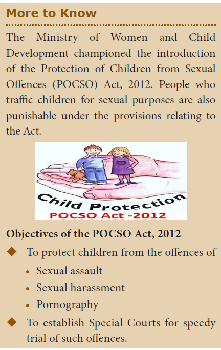

   

the victim. It refers to inappropriate or forced sexual contact. Adolescent girls and women encounter sexual harassment in different forms. Sexual abuse is more common at work places. Verbal remarks, comments, gestures and looks are the most common forms of abuse. This results in psychological distress, physical illness and eating disorders in the affected individuals.

### 21.1.3 Child Sexual Abuse
Children are considered soft targets for sexual abuse because they may not realize that they are being abused. Commonly, abusers are persons well known to the child, may even be living in the same locality. Abusers also bribe (use chocolates and toys) to lure children and take advantage of the child’s innocence.
Sexually abused children show symptoms of genital injury, abdominal pain, frequent urinary infection and behavioural problems.

### 21.1.4 Approaches for Protection of an Abused Child
Measures adopted for monitoring and assessment of abused child who have undergone signs and symptoms of distress are:

**Child Helpline:** The Child Helpline provides a social worker who can assist the child by providing food, shelter and protection. 

**Counselling the child:** Psychologists and social workers should provide guidance, counselling and continous support to a victimized child.   

**Family support:** The victimized child should be supported by the family members. They should be provided with proper care and attention to overcome their sufferings. 

**Medical care:** A child victim of sexual offences should receive medical care and treatment from health care professionals to overcome mental stress and depression.

**Legal Counsel:** The family or the guardian of the child victim shall be entitled to free assistance of a legal counsel for such offence. 

**Rehabilitation:** Enrolling in schools and resuming their education is an important step towards rehabilitation of the child. It is essential that the child’s life is gradually returned to normal after the incidence of abuse.  

**Community based efforts:** Conducting awareness campaign on child abuse and its prevention.

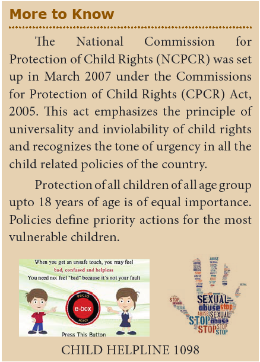

**Prevention of child sexual abuse**  
&nbsp;&nbsp;&nbsp;&nbsp;&nbsp;&nbsp;&nbsp;The most important social policy proclaimed universally is the prevention of child abuse. Taking steps to prevent childhood sexual abuse is parental and institutional responsibility. Instructions to be given by parents and teachers to the child are.   
&#9670;
  Do not talk to any suspected person or strangers and to maintain a distance. -  Not to be alone with unknown person.   
&#9670;
  To be careful while travelling alone in public or private transport.  
&#9670;
  Not to receive money, toys, gifts or chocolates from known or unknown person to them without the knowledge of their parents.   
&#9670;
 Not to allow known or unknown person to touch them.

&nbsp;&nbsp;&nbsp;&nbsp;&nbsp;&nbsp;&nbsp;It is the responsibility of every individual living in a society to ensure a safe and protected environment for our children to enable them to live with dignity and free from any form of violence.

## 21.2 Drug, Alcohol and Tobacco Abuse

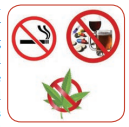

&nbsp;&nbsp;&nbsp;&nbsp;&nbsp;&nbsp;&nbsp;&nbsp;&nbsp;&nbsp;The physical and mental dependency on alcohol, smoking and drugs is called addiction. The addictive potential of these substances pulls an individual into a **vicious cycle** leading to **regular abuse and dependency. This is of serious concern** because abuse of tobacco, alcohol or drugs produce many harmful effects in an individual, to the family and even to the society. This dangerous behavior pattern among youth can be prevented through proper guidance.

## 21.3 Drug Abuse
Drugs are normally used for the treatment of disease on advice of a physician and withdrawn after recovery. A person who is habituated to a drug due to its prolonged use is called drug addict. This is called drug **addiction** or **drug abuse**.

A drug that modifies the physical, biological, psychological or social behaviour of a person by stimulating, depressing or disturbing the functions of the body and the mind is called **addictive drug.** These drugs interact with the central nervous system and affect the individual physically and mentally.

### 21.3.1 Types of Drugs
There are certain drugs called **psychotropic drugs** which acts on the brain and alter the behaviour, consciousness, power of thinking and perception. They are referred as **mood altering drugs**.

### 21.3.2 Drug Dependence
Persons who consume these drugs become fully dependent on them, they cannot live without drugs. This condition is referred as **drug dependence**.

• **Physical and** **mental dependence** Dependence on the drug for normal condition of well being and to maintain physiological state.

• **Psychological dependence** is a feel that drugs help them to reduce stress.

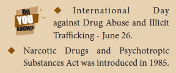

### 21.3.3 Behavioural Changes of Drug Users

Adverse effects of drug use among adolescents are

• Drop in academic performance, absence from school or college.

• Lack of interest in personal hygiene, isolation, depression, fatigue and aggressive behaviour.

• Deteriorating relationship with family and friends.

• Change in food and sleeping habits.

• Fluctuation in body weight and appetite

• Always looking out for an easy way to get money for obtaining drugs.

• Prone to infections like AIDS and Hepatitis-B.

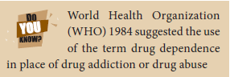

### 21.3.4 Drug De-addiction

Management of de-addiction is a complicated and difficult task. The path to recovery of drug addicts is long and often slow.

Family members, friends and society on the whole have a very important role to play.

**Detoxification:** The first phase of treatment is detoxification. The drug is stopped gradually and the addict is helped to **overcome the withdrawal symptoms**. The addict undergoes severe physical and emotional disturbance. This is taken care by specific medication.

**Psychotherapy:** Individual and group counselling is given by psychologists and counsellors. The treatment includes efforts to reduce the addict’s stress, taught new ways to solve everyday’s problems, adequate diet, rest and relaxation.

**Counselling to family members:** Social workers counsell family members in order to change the **attitude of rejection** so that the addict is accepted by the family and the society.

**Rehabilitation:** They are given proper **vocational training** so that they can lead a healthy life and become useful members of the society.

## 21.4 Tobacco Abuse

Tobacco is obtained from the tobacco plant _Nicotiana tobaccum and Nicotiana rustica. The_ dried and cured leaves of its young branches make the commercial tobacco used worldwide. Addiction to tobacco is due to ‘**nicotine**’ an alkaloid present in it. Nicotine is a **stimulant**, highly harmful and poisonous substance.

### 21.4.1 Tobacco Use

Tobacco is used for smoking, chewing and snuffing. Inhaling tobacco smoke from cigars, cigarettes, bidis, pipes, hukka is called **smoking**. Tobacco in powder form is **chewed** with pan. When powdered tobacco is taken through nose, it is called snuffing.

### 21.4.2 Smoking Hazards and Effects of Tobacco

When smoke is inhaled, the chemicals get absorbed by the tissues and cause the following harmful effects

(i) **Benzopyrene** and **polycyclic hydrocarbons** present in tobacco smoke is carcinogenic causing lung cancer.

(ii) Causes inflammation of throat and bronchi leading to conditions like **bronchitis** and **pulmonary tuberculosis.**

(iii) Inflammation of lung alveoli, decrease surface area for gas exchange and cause **emphysema.**

(iv) **Carbon monoxide** of tobacco smoke binds to haemoglobin of RBC and decreases its oxygen carrying capacity causing **hypoxia** in body tissues.

(v) **Increased blood pressure** caused by smoking leads to increased risk of heart disease.

(vi) Causes **increased gastric secretion** which leads to gastric and duodenal ulcers.

(vii) Tobacco chewing causes **oral cancer** (mouth cancer).

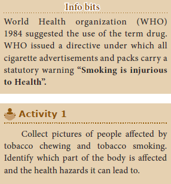

### 21.4.3 Prevention of Smoking

Knowing the dangers of smoking and chewing tobacco adolescents and the old people need to avoid these habits. Proper counselling and medical assistance can help an addict to give up the habit of smoking.

## 21.5 Alcohol Abuse

The consumption of alcohol is a social evil practiced by the wealthier and poorer sections of the society. The dependence of alcohol is called **alcoholism** and the addict is termed as **alcoholic**. It is called **alcohol abuse**. Drinking of alcohol 

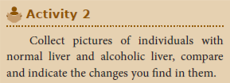

### 21.5.1 Harmful Effects of Alcohol to Health

Prolonged use of alcohol depresses the nervous system, by acting as a sedative and analgesic substance. Some of the harmful effects are 
• Nerve cell damage resulting in various mental and physical disturbances 
• Lack of co-ordination of body organs 
• Blurred or reduced vision, results in road accidents 
• Dilation of blood vessels which may affect functioning of the heart 
• Liver damage resulting in fatty liver which leads to cirrhosis and formation of fibrous tissues
• Body loses its control and consciousness eventually leading to health complications and ultimately to death 

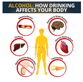

## 21.6 Rehabilitation Measures for Alcoholics

**Education and counselling**: Education and proper counselling will help the alcoholics to overcome their problems and stress, to accept failures in their life. 
**Physical activity**: Individuals undergoing rehabilitation should be channelized into healthy activities like reading, music, sports, yoga and meditation.
**Seeking help from parents and peer groups**: When a problematic situation occurs, the affected individuals should seek help and guidance from parents and peers. This would help them to share their feeling of anxiety, wrong doing and get rid of the habit. 
**Medical assistance**: Individual should seek help from psychologists and psychiatrists to get relieved from this condition and to lead a relaxed and peaceful life.

Alcohol de-addiction and rehabilitation programmes are helpful to the individual so that they could get rid of the problem completely and can lead a normal and healthy life.

## 21.7 Diseases and Disorders due to Lifestyle Modifications

Diseases are prevalent in our society due to our improper way of living, conditions of stress and strain. These diseases are non-communicable and affect the person who are suffering from particular symptoms. It is an impairment of the body tissue or organ, disturbances in metabolic function which require modification of an individual's normal life.

## 21.8 Diabetes Mellitus

Diabetes mellitus is a chronic metabolic disorder. In Greek (Diabetes – running through; mellitus- sweet). It is characterised by **increased blood glucose level** due to **insufficient, deficient or failure of insulin secretion. This is the most common pancreatic** endocrine disorder. The incidence of Type-1 and Type-2 diabetes is increasing worldwide.

### 21.8.1 Type-1 Insulin Dependent Diabetes Mellitus (IDDM)

IDDM accounts for 10 to 20% of the known diabetics. The condition also occurs in children (**juvenile** **onset diabetes**) and **young adults**, the onset is usually sudden and can be life threatening. This is caused by the **destruction of β-cells of the pancreas**. It is characterized by abnormally elevated blood glucose levels (**hyperglycemia**) resulting from **inadequate insulin secretion**. 
**Causes**: Genetic inheritance and environmental factors (infections due to virus, acute stress) are the cause for this condition.

### 21.8.2 Type-2 Non-Insulin Dependent Diabetes Mellitus (NIDDM)

This is also called as adult onset diabetes and accounting for 80 to 90% of the diabetic population. It develops slowly, usually milder and more stable. **Insulin production by the pancreas is normal** but its **action is impaired**. The target cells do not respond to insulin. It does not allow the movement of glucose into cells.

**Causes: The causes are multifactorial** which include increasing age (affecting middle aged and older people), obesity, sedentary life style, overeating and physically inactive.

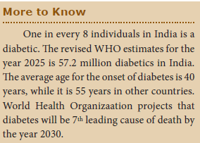

**Symptoms:** Diabetes mellitus is associated with several metabolic alterations.The most important symptoms are

• Increased blood glucose level (**Hyperglycemia**)

• Increased urine output (**Polyuria**) leading to dehydration

• Loss of water leads to thirst (**Polydipsia**) resulting in increased fluid intake

• Excessive glucose excreted in urine (**Glycosuria**)

• Excess hunger (**Polyphagia**) due to loss of glucose in urine.

• Fatigue and loss of weight

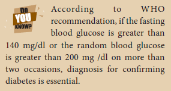

### 21.8.3 Prevention and Control of Diabetes

Diet, hypoglycemic drugs, insulin injection and exercise are the management options based on the type and severity of the condition. The overall goal of diabetes management is to maintain normal blood glucose level.

**Table 21.1 Differences between Type-1 and Type-2 Diabetes Mellitus**

|  Factors |Type-1 Insulin dependent diabetes mellitus (IDDM) |Type-2 Non-insulin dependent diabetes mellitus (NIDDM) |
|------|------|------|
| Prevalence |10-20% |80-90% |
| Age of onset |Juvenile onset (< 20 years) |Maturity onset (>30 years) |
| B ody weight |Normal or Under weight |Obese |
| Defect |Insulin deciency due to destruction of β-cells |Target cells do respond to insulin |
| Treatment |Insulin administration is necessar y |Can be controlled by diet, exercise and medicine |

  

**Dietary management**: Low carbohydrate and fibre rich diets are more appropriate. Carbohydrates should be taken in the form of starch and complex sugars. Refined sugars (sucrose and glucose) should be avoided. Diet comprising whole grains, millets (jowar, bajra, ragi), green leafy vegetables, wheat and unpolished rice should be included in diet regularly.

Carbohydrates is maintained to about 50- 55% of the total calories. High protein content of 10-15% of the total intake is required to supply essential amino acids. Fat content in the diet should be 15-25% of the total calories. Saturated fat intake should be reduced. Polyunsaturated fatty acid content should be higher.

**Management with insulin**: Commercially available insulin preparations (short and long acting) are also used to maintain blood glucose levels.

**Physical activity**: Exercise plays an important role in facilitating a good control of diabetes, in addition to strengthening and toning up the muscles.

**Education and Awareness**: People with diabetics should be educated on the nature of disease they have and the possibility of complications of the disease, if blood sugar is not kept under control. Instructions regarding diet, exercise and drugs should be explained.

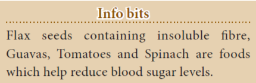

## 21.9 Obesity

Obesity is the state in which there is an accumulation of excess body fat with an **abnormal increase in body weight**. Obesity is a complex multifactorial chronic disease developing from influence of social, behavioural, psychological, metabolic and cellular factors.

Obesity occurs if intake of calories is more than the expenditure of energy. Over weight and obesity are conditions where the body weight is greater than the mean standard weight for age and height of an individual. Body mass index (BMI) is an estimate of body fat and health risk.

BMI = Weight (kg) / Height (m)2

**Causes and risk factors**: Obesity is due to genetic factors, physical inactivity, eating habits (overeating) and endocrine factors. Obesity is a positive risk factor in development of hypertension, diabetes, gall bladder disease, coronary heart disease and arthritis.

### 21.9.1 Prevention and Control of Obesity

**Diet Management:** Low calorie, normal protein, vitamins and mineral, restricted carbohydrate and fat, high fiber diet can prevent overweight. Calorie restriction for weight reduction is safe and most effective. 

**Physical exercise**: A low calorie diet accompanied by moderate exercise will be effective in causing weight loss. Meditation, yoga and physical activity can also reduce stress related to overeating.

## 21.10 Heart Disease

Cardiovascular disease (CVD) is associated with diseases of the heart and blood vessels. **Coronary heart disease** (CHD) is the most common form and is caused by **deposition of cholesterol in the blood vessels**.

It usually develops slowly over many years beginning from childhood, they may form a fatty streak to a fibrous complicated plaque. It leads to the narrowing of blood vessels leading to **atherosclerosis** in the large and medium sized arteries that supply the heart muscle with oxygen. It leads to sudden ischemia (deficient blood supply to heart muscle) and **myocardial infarction** (death of the heart muscle tissue).

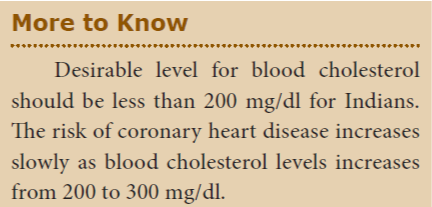

**Risk factors**: Hypercholesterolemia (High blood cholesterol) and high blood pressure (Hypertension) are the major causes and contributing factors for heart disease and if untreated may cause severe damage to brain, kidney and eventually lead to stroke. **Causes**: Heredity (family history), diet rich in saturated fat and cholesterol, obesity, increasing age, cigarette smoking, emotional stress, sedentary lifestyle, excessive alcohol consumption and physical inactivity are some of the causes.   
**Symptoms:** Shortness of breath, headache, tiredness, dizziness, chest pain, swelling of leg, and gastrointestinal disturbances. 

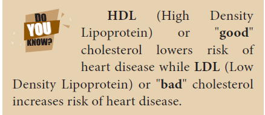

### 21.10.1 Prevention and Control of Heart Disease

**Diet management:** Reduction in the intake of calories, low saturated fat and cholesterol rich food, low carbohydrates and common salt are some of the dietary modifications. Diet rich in polyunsaturated fatty acids (PUFA) is essential. Increase in the intake of fibre diet, fruits and vegetables, protein, minerals and vitamin are required. 
**Physical activity:** Regular exercise, walking and yoga are essential for body weight maintenance 
**Addictive substance avoidance**: Alcohol consumption and smoking are to be avoided.

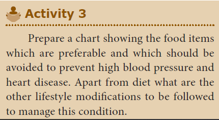

## 21.11 Cancer

Cancer causes about 4 million deaths annually throughout the world. In India more than one million people suffer from cancer. Cancer is derived from Latin word meaning crab. The study of cancer is called Oncology (**Oncos- Tumor**).

Cancer is an abnormal and uncontrolled division of cells that invade and destroy surrounding tissue forming a tumor or **neoplasm** (new growth). It is a heterogenous group of cells that do not respond to the normal cell division.

The cancerous cells migrate to distant parts of the body and affect new tissues. This process is called metastasis. The frequent sites of metastasis are lungs, bones, liver, skin and brain. 

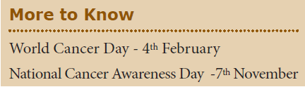

### 21.11.1 Types of Cancers

Cancers are classified on the basis of the tissues from which they are formed. 
1. **Carcinomas** arise from **epithelial** and **glandular tissues. They include cancers of** skin, lung, stomach and brain. About 85% of the tumours are carcinomas

2. **Sarcomas** are occur in the **connective** and **muscular tissue. They include the cancer** of bones, cartilage, tendons, adipose tissue and muscles. These form 1% of all tumours.

3. **Leukaemia** are characterized by an increase in the formation of white blood cells in the bone marrow and lymph nodes. Leukaemia are called **blood cancers.** Most common type of cancer which also affect children below 15 years of age.

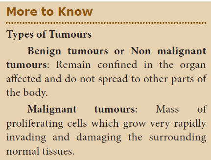

### 21.11.2 Carcinogenic Agents

Cancer causing agents are called **carcinogens**. They are physical, chemical agents, ionizing radiations and biological agents.

**Physical Irritant:** Heavy smoking causes lung cancer and cancers of oral cavity, pharynx (throat) and larynx. Betel and tobacco chewing causes oral cancer. Excessive exposure to sunlight may cause skin cancer. 

**Chemical agents:** Nicotine, caffeine, products of combustion of coal and oil, pesticides, asbestos, nickel, certain dyes and artificial sweetners induce cancer. 

**Radiations:** Ionizing radiations like X-rays, gamma- rays, radioactive substances and non- ionising radiations like UV rays cause DNA damage leading to cancer. 

**Biological agents:** Cancer causing viruses are called oncogenic viruses.

### 21.11.3 Treatment of Cancer

The treatment of cancer involves the following methods:     
**Surgery:** Tumours are removed by surgery to prevent further spread of cancer cells.   
**Radiation therapy**: Tumour cells are irradiated by lethal doses of radiation while protecting the surrounding normal cells.   
**Chemotherapy:** It involves administration of anticancerous drugs which prevent cell division and are used to kill cancer cells.  
 **Immunotherapy:** Biological response modifiers like interferons are used to activate the immune system and help in destroying the tumors.

### 21.11.4 Preventive measures for Cancer

Cancer control programmes should focus on primary prevention and early detection.
To prevent lung cancer tobacco smoking is to be avoided and protective measures to be taken against exposure to toxic pollutants of industries. Excessive exposure to radiation is to be avoided to prevent skin cancer.

## 21.12 AIDS (Acquired Immunedeficiency Syndrome)

AIDS is a severe viral disease and caused by Human Immunodeficiency Virus (HIV). It is a condition in which immune system fails and suppress the body’s disease fighting **mechanism. They attack the lymphocytes and** the affected individual is prone to infectious diseases. 

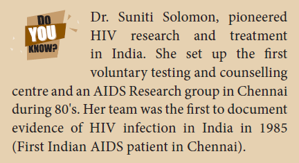

### 21.12.1 Transmission of HIV

AIDS virus has been found in urine, tears, saliva, breast milk and vaginal secretions. The virus is transmitted by an infected patient who comes in contact with blood of a healthy person. HIV/AIDS is not transmitted by touch or any physical contact. It spreads through contact of body fluids or blood.
HIV is transmitted generally by   
(i) Sexual contact with infected person  
(ii) Use of contaminated needles or syringes especially in case of intravenous drug abusers  
(iii) By transfusion of contaminated / infected blood or blood products  
(iv) From infected mother to her child through placenta.

### 21.12.2 Symptoms and Treatment of AIDS

**Symptoms:** Infected individuals become immunodeficient. The person becomes more susceptible to viral, bacterial, protozoan and fungal infections. Swelling of lymph nodes, damage to brain, loss of memory, lack of appetite and weight loss, fever, chronic diarrhoea, cough, lethargy, pharyngitis, nausea and headache. **Diagnosis: The presence of HIV virus can be** confirmed by Western Blot analysis or Enzyme **Linked Immunosorbent Assay** (ELISA) **Treatment:** Anti-retroviral drugs and immunostimulative therapy can prolong the life of the infected person.

### 21.12.3 Prevention and Control of AIDS

The following steps may help in controlling and prevent the spreading of HIV infection 
(i)&nbsp;&nbsp;&nbsp; Screening of blood from blood banks for HIV before transfusion.   
(ii)&nbsp;&nbsp;&nbsp;Ensuring the use of disposable needles and syringes in hospitals and clinics.   
(iii)&nbsp;&nbsp;&nbsp;Advocating safe sex and advantages of using condoms.   
(iv)&nbsp;&nbsp;&nbsp;Creating awareness campaign and educating people on the consequences of AIDS.  
(v) &nbsp;&nbsp;&nbsp;Persons with HIV/AIDS should not be isolated from the family and society.  

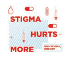

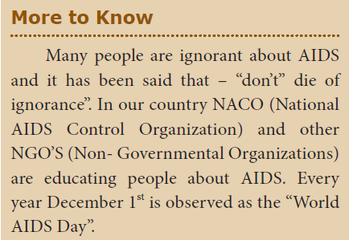

## Points to Remember

&#9670;
  Use of certain drugs by an individual as a regular habit. This is called drug addiction or drug abuse. -  Tobacco is used for smoking, chewing and snuffing. Inhaling tobacco smoke is called smoking.   
&#9670;
 The dependence of alcohol is called alcoholism and the addict is termed as alcoholic.  
&#9670;
  Prolonged use of alcohol depresses the nervous system, by acting as a sedative and analgesic substance and causes fatty liver (cirrhosis).   
&#9670;
  Diabetes mellitus is a chronic metabolic disorder. It is characterised by increased blood glucose level due to insufficient, deficient or failure of insulin secretion and insulin resistance.   
&#9670;
 Obesity is the state in which there is an accumulation of excess body fat with an abnormal increase in body weight.   
&#9670;
  Coronary heart disease is the most common form and is caused by deposition of cholesterol in the blood vessels.   
&#9670;
  Cancer is an abnormal and uncontrolled division of cells that invade and destroy surrounding tissue forming a tumor or neoplasm.   
&#9670;
  AIDS is caused by Human immunodeficiency virus.
