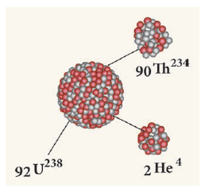
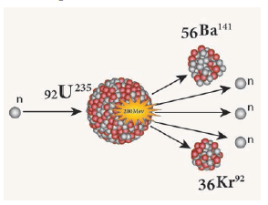
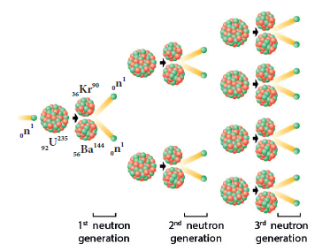
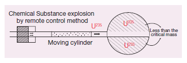
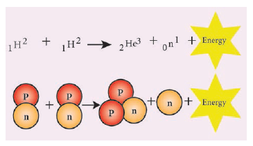
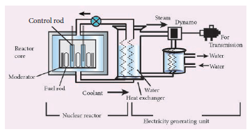
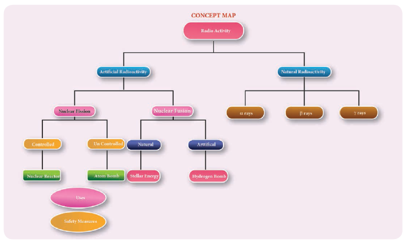

**Learning Objectives**

After learning this unit, students will be able to

- Define radio activity.

- Distingush between natural and artificial radio activity.

- Relate the properties of alpha, beta and gamma rays.

- State Soddy and Fajan’s displacement law of nuclear disintegration.

- Understand the concept of nuclear fission and nuclear fusion.

- Identify fissionable materials.

- Analyze controlled and uncontrolled chain reactions.

- Explain the principle of atom bomb and hydrogen bomb.

- List the uses of radio activity.

- Understand the components of a nuclear reactor.

- Identify the precautionary measures while handling a radioactive material.

**INTRODUCTION**

Humans are very much interested in knowing about atoms. Things around us are made up of atoms. A Greek Philosopher 'Democritus' in 400 BC(BCE) believed that matter is made up of tiny indestructible units called atoms. Later, in 1803, John Dalton considered that elements consist of atoms, which are identical in nature. J J Thomson discovered cathode rays, known as electrons, experimentally and

Goldstein discovered positive rays, which were named as protons by Rutherford. In 1932, James Chadwick discovered the chargeless particles called neutrons. Presently, a large number of elementary particles like photon, meson, positron and nutrino have been discovered. In 1911, the British scientist, Ernest **Rutherford** explained that the mass of an atom is concentrated in its central part called **Nucleus**. You have already learnt about the atomic structure in the earlier classes.

## RADIOACTIVITY

### Discovery of radioactivity

In 1896, French physicist **Henri Becquerel** finished his research for the week and stored a certain amount of uranium compound away in a drawer for the week end. By chance, an unexposed photographic plate was also stored in the same drawer. After a week he returned and noticed that the film had been exposed to some radiation. He discovered that he could reproduce the effect whenever he placed uranium near a photographic film. Apparently, uranium radiated something that could affect a photographic plate. This phenomenon was called as **Radioactivity**. Uranium was identified to be a radioactive element.

Two years later, the Polish physicist **Marie Curie** and her husband **Pierre Curie** detected radioactivity in 'Pitchblende', a tiny black substance. They were not surprised at the radioactivity of pitchblende, which is known as an ore of uranium. Later, they discovered that the radiation was more intense from pure uranium. Also, it was found that the pitchblende had less concentration of uranium. They concluded that **some other substance** was present in pitchblende. After separating this new substance, they discovered that it had unknown chemical properties and it also emitted radiations spontaneously like uranium. They named this new substance as **'Radium'**.The radioactive elements emit harmful radioactive radiations like alpha rays or beta rays or gamma rays.

### Definition of radioactivity

The nucleus of some elements is unstable. Such nuclei undergo nuclear decay and get converted into more stable nuclei. During this nuclear reaction, these nuclei emit certain harmful radiations and elementary particles. The phenomenon of nuclear decay of certain elements with the emission of radiations like alpha, beta, and gamma rays is called 'radioactivity' and the elements, which undergo this phenomenon are called 'radioactive elements'.

### Natural Radioactivity

The elements such as uranium and radium undergo radioactivity and emit the radiations on their own without any human intervention. This phenomenon of spontaneous emission of radiation from certain elements on their own is called 'natural radioactivity'.

The elements whose atomic number is more than 82 undergo spontaneous radioactivity. Eg: uranium, radium, etc. There are only two elements, which have been identified as radioactive substances with atomic number less than 82. They are technetium (Tc) with atomic number 43 and promethium (Pm) with atomic number 61.

There have been 29 radioactive substances discovered so far. Most of them are rare earth metals and transition metals.

### Artificial Radioactivity (or) Induced Radioactivity

The phenomenon by which even light elements are made radioactive, by artificial or induced methods, is called 'artificial radioactivity' or 'man-made radioactivity'.

This kind of radioactivity was discovered by Irene Curie and F.Joliot in 1934. Artificial radioactivity is induced in certain lighter elements like boron, aluminium etc., by bombarding them with radiations such as 'alpha particles' emitted during the natural radioactivity of uranium. This also results in the emission of invisible radiations and elementary particles. During such a disintegration, the nucleus which undergoes disintegration is called 'parent nucleus' and that which is produced after the disintegration is called a 'daughter nucleus'. The particle, which 

| S.No. |Natural radioactivity |Articial radioactivity |
|------|------|------|
| 1 |Emission of radiation due to self-disintegration of a nucleus. |Emission of radiation due to disintegration of a nucleus through induced process. |
| 2 |Alpha, beta and gamma radiations are emitted. |Mostly elementar y particles such as neutron, positron, etc. are emitted. |
| 3 |It is a spontaneous process. |It is an induced process. |
| 4 |Exhibited by elements with atomic number more than 83. |Exhibited by elements with atomic number less than 83. |
| 5 |This cannot be controlled. |This can be controlled. |

**Table 6.1 Comparison between Natural and Artificial Radioactivity**

is used to induce the artificial disintegration is termed as projectile and the particle which is produced after the disintegration is termed as ejected particle. When the projectile hits the parent nucleus, it is converted into an unstable nucleus, which in turn decays spontaneously emitting the daughter nucleus along with an ejected particle.

**Activity 6.1**

Using the periodic table, list out the radioac- tive elements. Also identify the name of the groups in which they are present.

If you denote the parent and daughter nu→clei as X and Y respectively, then the nuclear disintegration is represented as follows: X (P,E) Y. Here, P and E represent the projectile particle and ejected particle respectively.

**Example:**

~4~Be^9^ + ~2~He^4^ → ~6~C^13^

~6~C^13^ → ~6~C^12^ + ~0n~^1^

In the above nuclear reaction, ~6~C^13^ is unstable

and is radioactive. This reaction can be represented as ~4~Be^9^ (α, n) ~6~C^12^

~4~Be^9^ + ~2~He^4^ → ~6~C^12^ + ~0n~^1^

### Units of Radioactivity

**Curie:** It is the traditional unit of radioactivity. It is defined as the quantity of a radioactive substance which undergoes 3.7 × 10^10^ disintegrations in one second. This is actually close to the activity of 1 g of radium 226. 1 curie = 3.7 × 10^10^ disintegrations per second. **Rutherford (Rd):** It is another unit of radioactivity. It is defined as the quantity of a radioactive substance, which produces 10^6^ disintegrations in one second.

1 Rd = 10^6^ disintegrations per second. **Becquerel (Bq) :** It is The SI unit of radioactivity is becquerel. It is defined as the quantity of one disintegration per second. **Roentgen (R):** It is The radiation exposure of γ and x-rays is measured by another unit called roentgen. One roentgen is defined as the quantity of radioactive substance which produces a charge of 2.58 × 10^-4^ coulomb in 1 kg of air under standard conditions of pressure, temperature and humidity.

### Radioactive displacement law

In 1913, Soddy and Fajan framed the displacement laws governing the daughter nucleus produced during an alpha and beta decay. They are stated below:

(i) When a radioactive element emits an alpha particle, a daughter nucleus is formed whose mass number is less by 4 units and the atomic number is less by 2 units, than the mass number and atomic number of the parent nucleus.

(ii) When a radioactive element emits a beta particle, a daughter nucleus is formed whose mass number is the same and the atomic number is more by 1 unit, than the atomic number of the parent nucleus.

## ALPHA, BETA AND GAMMA RAYS

When a radioactive nucleus undergoes radioactivity, it emits harmful radiations. These radiations are usually comprised of any of the three types of particles. They are **alpha(α), beta (β) and gamma(γ)** rays.

Uranium, named after the planet Uranus, was discovered by Martin Klaproth, a German chemist in a mineral called pitchblende.

### Properties of Alpha, Beta and Gamma rays

These three particles possess certain similarities and dissimilarities in their properties as listed below in Table 6.2.

| Properties |α  rays |β  rays |γ rays |
|------|------|------|------|
| What are they? |Helium nucleus ( He ) consisting of two protons and two neutrons.42 |ey are electrons( e ), basic elementary particle in all atoms.0–1 |ey are electromagnetic waves consisting of photons. |
| Charge |Positively charged particles.Charge of each alpha particle = +2e |Negatively charged particles.Charge of each beta particle = –e |Neutral particles.Charge of each gamma particle = zero |
| Ionising power |100 time greater than β rays and 10,000 times greater than γ rays |Comparatively low |Very less ionization power |
| Penetrating power |Low penetrating power (even stopped by a thick paper) |Penetrating power is greater than that of α rays. ey can penetrate through a thin metal foil. |ey have a very high penetrating power greater than that of β rays. ey can penetrate through thick metal blocks. |
| Eect of electric and magnetic eld |Deected by both the elds.(in accordance with Fleming’s le hand rule) |Deected by both the elds; but the direction of deection is opposite to that for alpha rays. (in accordance with Fleming’s le hand rule) |ey are not deected by both the elds. |
| Speed |eir speed ranges from 1/10 to 1/20 times the speed of light. |eir speed can go up to 9/10 times the speed of light. |ey travel with the speed of light. |

**Table 6.2 Properties of alpha, beta and gamma rays**

### Alpha decay

A nuclear reaction in which an unstable parent nucleus emits an alpha particle and forms a stable daughter nucleus, is called 'alpha decay'.

**E.g.:** Decay of uranium (U^238^) to thorium (Th^234^) with the emission of an alpha particle.

~92~U^238^ → 90 Th^234^ +~2~He^4^ ( α - decay ) In α - decay, the parent nucleus emits an α particle and so it is clear that for the daughter nucleus, the mass number decreases by four and the atomic number decreases by two as illustrated in Figure 6.1

**Figure 6.1** Alpha decay

### Beta decay

A nuclear reaction, in which an unstable parent nucleus emits a beta particle and forms a stable daughter nucleus, is called 'beta decay'. **E.g.:** Beta decay of phosphorous.

~15~P^32^ → ~16~S^32^ + ~-1~e^0^ (β - decay)

In β - decay there is no change in the mass number of the daughter nucleus but the atomic number increases by one. **Note:** In a nuclear reaction, the element formed as the product nucleus is identified by the atomic number of the resulting nucleus and not by its mass number.

### Gamma decay

In a γ - decay, only the energy level of the nucleus changes. The atomic number and mass number of the radioactive nucleus remain the same.

## NUCLEAR FISSION

### Definition

In 1939, German Scientist Otto Hahn and F.Strassman discovered that when a uranium nucleus is bombarded with a neutron, it breaks up into two smaller nuclei of comparable mass along with the emission of a few neutrons and energy. This process of breaking (splitting) up of a heavier nucleus into two smaller nuclei with the release of a large amount of energy and a few neutrons is called 'nuclear fission'.

**E.g.:** Nuclear fission of a uranium nucleus (U^235^)

~92~U^235^ + ~0~n^1^ → ~56~Ba^141^ + ~36~Kr^92^ + 3~0n~^1^ + Q (energy) The average energy released in each fission process is about 3.2 × 10^-11^ J. Nuclear fission is pictorially represented in Figure 6.2.

**Figure 6.2 Nuclear fission**

### Fissionable materials

A fissionable material is a radioactive element, which undergoes fission in a sustained manner when it absorbs a neutron. It is also termed as 'fissile material'.

**E.g.:** U^235^, plutonium (Pu^239^ and Pu^241^) 

All isotopes of uranium do not undergo nuclear fission when they absorb a neutron. For example, natural uranium consists of 99.28 % of ~92~U^238^ and 0.72 % of ~92~U^235^. Of these two, U^238^ does not undergo fission whereas U^235^ undergoes fission. Hence, U^235^ is a fissionable material and U^238^ is non- fissionable.

There are some radioactive elements, which can be converted into fissionable material. They are called as **fertile materials**.

**E.g.:** Uranium-238, Thorium-232, Plutonium-240.

### Chain Reaction

A uranium nucleus (U-235) when bombarded with a neutron undergoes fission producing three neutrons. These three neutrons in turn can cause fission in three other uranium nuclei present in the sample, thus producing nine neutrons. These nine neutrons in turn may produce twenty seven neutrons and so on. This is known as 'chain reaction'. A chain reaction is a self- propagating process in which the number of neutrons goes on multiplying rapidly almost in a geometrical progression.

Two kinds of chain reactions are possible. They are: (i) controlled chain reaction and (ii)uncontrolled chain reaction.

**(a) Controlled chain reaction**

In the controlled chain reaction the number of neutrons released is maintained to be one. This is achieved by absorbing the extra neutrons with a neutron absorber leaving only one neutron to produce further fission. Thus, the reaction is sustained in a controlled manner. The energy released due to a controlled chain reaction can be utilized for constructive purposes. Controlled chain reaction is used in a nuclear reactor to produce energy in a sustained and controlled manner.

**(b) Uncontrolled chain reaction**

In the uncontrolled chain reaction the number of neutrons multiplies indefinitely and causes fission in a large amount of the fissile material. This results in the release of a huge amount of energy within a fraction of a second. This kind of chain reaction is used in the atom bomb to produce an explosion. Figure 6.3 represents an uncontrolled chain reaction.

 

**Figure 6.3** Uncontrolled chain reaction

### Critical Mass

During a nuclear fission process, about 2 to 3 neutrons are released. But, all these neutrons may not be available to produce further fission. Some of them may escape from the system, which is termed as 'leakage of neutrons' and some may be absorbed by the non-fissionable materials present in the system. These two factors lead to the loss of neutrons. To sustain the chain reaction, the rate of production of neutrons due to nuclear fission must be more than the rate of its loss. This can be achieved only when the size (i.e., mass) of the fissionable material is equal to a certain optimum value. This is known as 'critical mass'.

The minimum mass of a fissile material necessary to sustain the chain reaction is called 'critical mass (mc)'. It depends on the nature, density and the size of the fissile material.

If the mass of the fissile material is less than the critical mass, it is termed as 'subcritical'. If the mass of the fissile material is more than the critical mass, it is termed as 'supercritical'.

**Activity 6.2**

Using beads make a chain reaction model

### Atom bomb

The atom bomb is based on the principle of uncontrolled chain reaction. In an uncontrolled chain reaction, the number of neutrons and the number of fission reactions multiply almost in a geometrical progression. This releases a huge amount of energy in a very small time interval and leads to an explosion.

**Structure:**

An atom bomb consists of a piece of fissile material whose mass is subcritical. This piece has a cylindrical void. It has a cylindrical fissile material which can fit into this void and its mass is also subcritical. When the bomb has to be exploded, this cylinder is injected into the void using a conventional explosive. Now, the two pieces of fissile material join to form the supercritical mass, which leads to an explosion. The structure of an atom bomb is shown in Figure 6.4

**Figure 6.4** Atom bomb

During this explosion tremendous amount of energy in the form of heat, light and radiation is released. A region of very high temperature and pressure is formed in a fraction of a second along with the emission of hazardous radiation like γ rays, which adversely affect the living creatures. This type of atom bombs were exploded in 1945 at Hiroshima and Nagasaki in Japan during the World War II.

Electron Volt (eV) is the unit used in nuclear physics to measure the energy of small particles. It is nothing but the energy of one electron when it is accelerated using an electric potential of one volt.

1eV = 1.602 × 10^-19^ joule.

1 million electron volt = 1 MeV = 10^6^ eV (mega electron volt)

The energy released in a nuclear fission process is about 200 MeV.

## NUCLEAR FUSION

You have learnt that energy can be produced when a heavy nucleus is split up into two smaller nuclei. Similarly, energy can be produced when two lighter nuclei combine to form a heavier nucleus. This phenomenon is known as nuclear fusion.

### Definition

The process in which two lighter nuclei combine to form a heavier nucleus is termed as 'nuclear fusion'.

**E.g.:** ~1~H^2^ + ~1~H^2^ ~2~He^4^ + Q (Energy) Here, ~1~H^2^ represents an isotope of hydrogen known as 'deuterium'. The average energy released in each fusion reaction is about 3.84 × 10^-12^ J. Figure 6.5 represents this.

**Figure 6.5** Nuclear fusion

The mass of the daughter nucleus formed during a nuclear reaction (fission and fusion) is lesser than the sum of the masses of the two parent nuclei. This difference in mass is called mass defect. This mass is converted into energy, according to the mass-energy equivalence. This concept of mass-energy equivalence was proposed by Einstein in 1905. It stated that mass can be converted into energy and vice versa. The relation between mass and energy proposed by Einstein is **E = mc^2^** where c is the velocity of light in vacuum and is equal to 3 × 10^8^ ms–1.

The nuclear bomb that was dropped in Hiroshima during World War II was called as 'Little boy'. It was a gun-type bomb which used a uranium core. The bomb, which was subsequently dropped over Nagasaki was called as 'Fat man'. It was an explosion type bomb, which used a plutonium core.

### Conditions necessary for nuclear fusion

Earth’s atmosphere contains a small trace of hydrogen. If nuclear fusion is a spontaneous process at normal temperature and pressure, then a number of fusion processes would happen in the atmosphere which may lead to explosions. But, we do not encounter any such explosions. Can you explain why?

The answer is that nuclear fusion can take place only under certain conditions.

Nuclear fusion is possible only at an extremly high temperature of the order of 107 to 10^9^ K and a high pressure to push the hydrogen nuclei closer to fuse with each other. Hence, it is named as 'Thermonuclear reaction'.

Nuclear fusion is the combination of two lighter nuclei. The charge of both nuclei is positive. According to electrostatic theory, when they come closer they tend to repel each other. This repulsive force will be overcome by the kinetic energy of the nuclei at higher temperature of the order of 107 to 10^9^ K.

### Stellar Energy

The stars like our Sun emit a large amount of energy in the form of light and heat. This energy is termed as the stellar energy. Where does this high energy come from? All stars contain a large amount of hydrogen. The surface temperature of the stars is very high which is sufficient to induce fusion of the hydrogen nuclei.

Fusion reaction that takes place in the cores of the Sun and other stars results in an enormous amount of energy, which is called as 'stellar energy. Thus, nuclear fusion or thermonuclear reaction is the source of light and heat energy in the Sun and other stars.

### Hydrogen Bomb

Hydrogen bomb is based on the principle of nuclear fusion. A hydrogen bomb is always designed to have an inbuilt atom bomb which creates the high temperature and pressure required for fusion when it explodes. Then, fusion takes place in the hydrogen core and leads to the release of a very large amount of energy in an uncontrolled manner. The energy released in a hydrogen bomb (or fusion bomb) is much higher than that released in an atom bomb (or fission bomb).

| S.No. |NUCLEAR  FISSION |NUCLEAR  FUSION |
|------|------|------|
| 1 |e process of breaking up (splitting) of a heavy nucleus into two smaller nuclei is called 'nuclear ssion' . |Nuclear fusion is the combination of two lighter nuclei to form a heavier nucleus. |
| 2 |Can be performed at room temperature. |Extremely high temperature and pressureis needed. |
| 3 |Alpha, beta and gamma radiations are emitted. |Alpha rays, positrons, and neutrinos are emitted. |
| 4 |Fission leads to emission of gamma radiation. is triggers the mutation in the human gene and causes genetic transform diseases. |Only light and heat energ y is emitted. |

**Table 6.3 Features of Nuclear fission and nuclear fusion**

Sun fuses about 620 million metric tons of hydrogen each second and radiates about 3.8 × 10^26^ joule of energy per second. When this energy is radiated towards the Earth, it decreases in its intensity. When it reaches the Earth its value is about 1.4 kilo joule per unit area in unit time.

## USES OF RADIOACTIVITY

Many radio isotopes can be obtained from radioactivity. These radio isotopes have found wide variety of applications in the fields of medicine, agriculture, industry and archeological research.

### Agriculture

The radio isotope of phosphorous (P-32) helps to increase the productivity of crops. The radiations from the radio isotopes can be used to kill the insects and parasites and prevent the wastage of agricultural products. Certain perishable cereals exposed to radiations remain fresh beyond their normal life, enhancing the storage time. Very small doses of radiation prevent sprouting and spoilage of onions, potatoes and gram.

### Medicine

Medical applications of radio isotopes can be divided into two parts:

i) Diagnosis 

ii) Therapy 

Radio isotopes are used as tracers to

diagnose the nature of circulatory disorders of blood, defects of bone metabolism, to locate tumors, etc. Some of the radio isotopes which are used as tracers are: hydrogen, carbon, nitrogen, sulphur, etc. 

- Radio sodium (Na^24^) is used for the effective functioning of heart. 

- Radio – Iodine (I^131^) is used to cure goiter. 

- Radio-iron is (Fe^59^) is used to diagnose anaemia and also to provide treatment for the same.

- Radio phosphorous (P^32^) is used in the treatment of skin diseases.

- Radio cobalt (Co^60^) and radio-gold (Au^198^) are used in the treatment of skin cancer.

- Radiations are used to sterilize the surgical devices as they can kill the germs and microbes.

### Industries

In industries, radioactive isotopes are used as tracers to detect any manufacturing defects such as cracks and leaks. Packaging faults can also be identified through radio activity. Gauges, which have radioactive sources are used in many industries to check the level of gases, liquids and solids.

- An isotope of californium (Cf^252^) is used in the airlines to detect the explosives in the luggage.

- An isotope of Americium (Am^241^) is used in many industries as a smoke detector.

### Archeological research

Using the technique of radio carbon dating, the age of the Earth, fossils, old paintings and monuments can be determined. In radio carbon dating, the existing amount of radio carbon is determined and this gives an estimate about the age of these things.

## SAFETY MEASURES

In day to day life, you do receive some natural radiation from the Sun. The radioactive elements present in the soil and rocks, the house hold appliances like television, microwave ovens, cell phones and the X-rays used in hospitals. These radiations do not produce any severe effects as they are very low in intensity.

The second source of radiation exposure is man-made. These are due to nuclear reactors and during the testing of the nuclear devices in the atmosphere or in the ground.

Improper and careless handling of radioactive materials release harmful radiations in our environment. These radiations are very harmful to the human body. A person who is exposed to radiations very closely or for a longer duration, is at a greater health risk and can be affected genetically.

How old is our mother Earth? Any guess?? It is nearly 4.54 × 10^9^ years (around 45 Crore 40 lakh years). Wow!!

### Permitted range

The International Commission on Radiological Protection (ICRP) has recommended certain maximum permissible exposure limits to radiation that is believed to be safe without producing any appreciable injury to a person. Safe limit of overall exposure to radiation is given as 20 milli sievert per year. In terms of roentgen, the safe limit of receiving the radiation is about 100 mR per week. If the exposure is 100 R, it may cause fatal diseases like leukemia (death of red blood corpuscle in the blood) or cancer. When the body is exposed to about 600 R, it leads to death.

\*Dosimeter is a device used to detect the levels of exposure to an ionizing radiation. It is frequently used in the environments where exposure to radiation may occur such as nuclear power plants and medical imaging facilities. Pocket dosimeter is used to provide the wearer with an immediate reading of his/her exposure to X-rays and γ rays.

### Preventive measures

**Figure. 6.6** Lead coated aprons model.

- Radioactive materials should be kept in a thick walled lead container.

- Lead coated aprons and lead gloves should be used while working with hazardous radioactive materials.

- You should avoid eating while handling radioactive materials.

- The radioactive materials should be handled only by tongs or by a remote control device.

- Dosimeters should be worn by the users to check the level of radiation.

## NUCLEAR REACTOR

A Nuclear reactor is a device in which the nuclear fission reaction takes place in a self-sustained and controlled manner to produce electricity. The first nuclear reactor was built in 1942 at Chicago, USA.

### Types of nuclear reactors

Breeder reactor, fast breeder reactor, pressurized water reactor, pressurized heavy water reactor, boiling water reactor, water- cooled reactor, gas-cooled reactor, fusion reactor and thermal reactor are some types of nuclear reactors, which are used in different places world-wide.

### Components of a nuclear reactors

The essential components of a nuclear reactor are (i) fuel, (ii) moderator, (iii) control rod, (iv) coolant and (v) protection wall.

**i. Fuel:** A fissile material is used as the fuel. The commonly used fuel material is uranium.

**ii. Moderator:** A moderator is used to slow down the high energy neutrons to provide slow neutrons. Graphite and heavy water are the commonly used moderators.

**iii. Control rod:** Control rods are used to control the number of neutrons in order to have sustained chain reaction. Mostly boron or cadmium rods are used as control rods. They absorb the neutrons.

**iv. Coolant:** A coolant is used to remove the heat produced in the reactor core, to produce steam. This steam is used to run a turbine in order to produce electricity. Water, air and helium are some of the coolants.

**v. Protection wall:** A thick concrete lead wall is built around the nuclear reactor in order to prevent the harmful radiations from escaping into the environment. 

**Figure 6.7** Schematic diagram of a nuclear reactor

### Uses of a nuclear reactor

 - Nuclear reactors are widely used in power generation. 
 
 - They are also used to produce radio isotopes, which are used in a variety of applications. 
 
 - Some reactors help us to do research in the field of nuclear physics. 
 
 - Breeder reactors are used to convert nonfissionable materials into fissionable materials.

### Nuclear power plants in India

Indian Atomic Energy Commission (AEC) was established in August 1948 by the Department of Indian Scientific Research committee at Bombay (now Mumbai) in Maharashtra. It is the nodal agency for all the research done in the field of atomic energy. Dr. Homi Jahangir Bhaba was the first chairman of Indian Atomic Energy Commission. Now, it is known as Bhaba Atomic Research Centre (BARC).

Nuclear power is the fifth largest source of power in India. Tarapur Atomic Power Station is India’s first nuclear power station. Now, there are a total of seven power stations, one each in Maharashtra, Rajasthan, Gujarat, Uttar Pradesh and two in Tamilnadu. In Tamilnadu, we have nuclear power stations in Kalpakkam and Kudankulam. Apsara was the first nuclear reactor built in India and Asia. Now, there are 22 nuclear reactors which are operating in India. Some other operating reactors are

- Cirus 

- Dhuruva 

- Purnima

**Solved problem 6.1**

Identify A, B, C, and D from the following nuclear reactions.

(i) ~13~Al^27^ + A --------> ~15~P^30^ + B

(ii) ~12~Mg^24^ + B --------> ~11~Na^24^ + C

(iii) ~92~U^238^ + B --------> ~93~Np^239^ + D

**Solution:**

(i) ~13~Al^27^ + ~2~He^4^ --------> ~15~P^30^ + ~0~n^1^

(ii) ~12~Mg^24^ + ~0n~^1^ --------> 11Na^24^ + ~1~H^1^

(iii) ~92~U^238^ + ~0~n^1^ --------> ~93~Np^239^ + ~–1~e^0^

A is alpha particle, B is neutron, C is proton, and D is electron.

**Solved problem 6.2**

A radon specimen emits radiation of 3.7 × 10^3^ GBq per second. Convert this disintegration in terms of curie. (one curie = 3.7 × 10^10^ disintegration per second)

1 Bq = one disintegration per second one curie = 3.7 × 10^10^ Bq

1 Bq = 1 / 3.7 × 10^10^ curie

∴ 3.7 × 10^3^ G Bq = 3.7 × 10^3^ × 10^9^ × 1 / 3.7 × 10^10^

\= 100 curie 

**Solved problem 6.3**

**92U^235^** experiences one **α -** decay and one **β -** decay. Find number of neutrons in the final daughter nucleus that is formed.

**Solution:**

Let X and Y be the resulting nucleus after the emission of the alpha and beta particles respectively.

~92~U^235^ α decay ~90~X^231^ + ~2~He^4^

~90~X^231^ β decay ~91~Y^231^ + ~-1~e^0^

Number of neutrons = Mass number – Atomic number = 231 – 91 = 140

**Solved problem 6.4**

Calculate the amount of energy released when a radioactive substance undergoes fusion and results in a mass defect of 2 kg.

**Solution:**

Mass defect in the reaction (m) = 2 kg 

Velocity of light (c) = 3 × 10^8^ m s^-1^

By Einstein’s equation, 

Energy released E = mc^2^

So E = 2 × (3 × 10^8^)^2^ = 1.8 × 10^17^ J

**Points to Remember**

- This phenomenon of spontaneous emission of radiation from certain elements on its own is called 'natural radioactivity'. 

- **Curie is defined as the quantity of a radioactive** substance, which undergoes 3.7 × 10^10^ disintegrations in one second. This is actually close to the activity of 1 g of radium-226. 1 3.7 × 10^10^

- **Rutherford (Rd)** is defined as the quantity of a radioactive substance which produces 10^6^ disintegrations in one second. 1 Rd = 10^6^ disintegrations per second. 

- The SI unit of radioact iv ity i s **becquerel.** It is defined as the quantity of one disintegration per second. 

- Helium nucleus (~2~He^4^) consisting of two protons and two neutrons is known as alpha particle. 

- Beta particles are electrons (~-1~e^0^), which are the basic elementary particles present in all atoms. 

- Gamma rays are electromagnetic waves consisting of photons. 

- A nuclear reaction in which an unstable parent nucleus emits an alpha particle and forms a stable daughter nucleus is called as 'alpha decay'. 

- A nuclear reaction in which an unstable parent nucleus emits a beta particle and forms a stable daughter nucleus is called as 'beta decay'. 

- The process of breaking (splitting) up of a heavier nucleus into two smaller nuclei with the release of a large amount of energy is called **'nuclear fission'.** 

- The energy released in a nuclear fission process is about 200 MeV. 

- There are some radioactive elements which can be converted into a fissionable material. They are called as '**fertile materials**'. e.g. Uranium-238, Thorium-232, Plutonium-240. 

- Controlled chain reaction is used in a nuclear reactor to produce energy in a sustained and controlled manner. 

- The process in which two lighter nucleicombine to form a heavier nucleus is termed as **'nuclear fusion'.** 

- Nuclear fusion or thermonuclear reaction is the source of light and heat energy in the Sun and other stars. 

- The safe limit of receiving the radiation is about 100 mR per week.

