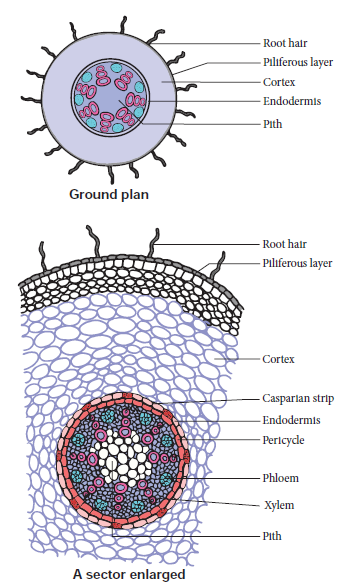

**Learning Objectives**

At the end of this lesson the students will be able to: 

- Understand vascular tissue system- their types and functions. 

- Know the structure of dicot root, stem, leaf and monocot root, stem, leaf. 

- Differentiate the internal structure of dicot root, stem, leaf with that of monocot root, stem, leaf. 

- Name the different pigments found in chloroplast. 

- Elaborate on the structure and functions of plastids. 

- Enumerate the steps involved in photosynthesis. 

- Understand the structure of mitochondria 

- List the basic events of aerobic and anerobic respiration.

**Introduction**

Plants exhibits varying degrees of organization. Atoms are organized into molecules, molecules into organelles, organelles into cells, cells into tissues and tissues into organs. The first account of internal structure of plants was published by English Physician **Nehemiah Grew**. He is known as **Father of Plant Anatomy**. Plant anatomy (Gk _Ana_ = as under; _Temnein_ = to cut) is the study of internal structure of plants. You have already studied the different kinds of tissues in standard IX. In this lesson, you will study about the internal structure of plant tissues, process of photosynthesis and respiration.

## Tissues

Tissues are the group of cells that are similar or dissimilar in structure and origin, but perform similar function. Plant tissues can be broadly classified into two, based on their ability to divide. They are

i) Meristamatic tissue 

ii) Permanent tissue.

## Tissue system

Sachs (1875) classified tissue system in plants into three types

i) Dermal or Epidermal tissue system 

ii) Ground tissue system 

iii) Vascular tissue system

The functions of these tissues are given in Table 12.1.

### Dermal or Epidermal Tissue System

It consists of epidermis, stomata and epidermal outgrowths. Epidermis is the outer most layer. It has many minute pores called stomata.

**Table 12.1** Tissue system and its functions **Tissue System Components Functions**

| Tissue System |C omponents |Functions |
|------|------|------|
| Dermal Tissue System |Epidermis and Periderm(in older stems and roots) |- Protection- Prevention of water loss |
| Ground Tissue System |Parenchyma tissueCollenchyma tissueSclerenchyma tissue |- Photosynthesis- Food storage- Regeneration- Support- Protection |
| Vascular Tissue System |Vascular tissues- Xylem tissue- Phloem tissue |- Transport of water and minerals- Transport of food |
  

Cuticle is present on the outer wall of epidermis to check evaporation of water. Trichomes and root hairs are the epidermal outgrowths.

**Functions:** 

i) Epidermis protects the inner tissues. 

ii) Stomata helps in transpiration. 

iii) Root hairs help in absorption of water and minerals.

### Ground Tissue System

It includes all the tissues of the plant body except epidermal and vascular tissues like 

(i) Cortex 

(ii) Endodermis 

(iii) Pericycle 

(iv) Pith

### Vascular Tissue System

It consists of xylem and phloem tissues. They are present in the form of bundles called vascular bundles. Xylem conducts water and minerals to different parts of the plant. Phloem conducts food materials to different parts of the plant.

There are three different types of vascular bundles namely (i) Radial (ii) Conjoint (iii) Concentric 

**(i) Radial Bundles**

Xylem and phloem are present in different radii alternating with each other. e.g. roots

**(ii) Conjoint bundles** 

Xylem and phloem lie on the same radius. There are two types of conjoint bundles.

**a) Collateral** 

Xylem lies towards the centre and phloem lies towards the periphery. When cambium is present in collateral bundles, it is called open. e.g. dicot stem and collateral bundle without cambium is called closed. e.g. monocot stem.

**b) Bicollateral** 

In this type of bundle, the phloem is present on both outer and inner side of xylem. e.g. _Cucurbita_

**(iii) Concentric Bundles** 

Vascular bundle in which xylem completely surrounds the phloem or viceversa is called concentric vascular bundle. It is of two types:

1\. **Amphivasal:** Xylem surrounds phloem. e.g. _Dracaena_

2\. **Amphicribral:** Phloem surrounds xylem. e.g. Ferns

**Endarch:** Protoxylem lies towards the centre and metaxylem lies towards the periphery. e.g. stem.

**Exarch :** Protoxylem lies towards the periphery and metaxylem lies towards the centre. e.g. roots.

**Figure 12.1** Types of vascular bundle

## Internal Structure of Dicot Root (Bean)

A thin transverse section of dicot root shows the following structures.

**(i) Epiblema:** It is the outermost layer. Cuticle and stomata are absent. Unicellular root hairs are present. It is also known as **Rhizodermis** or **Piliferous layer**.

**(ii) Cortex:** It is a multilayered large zone made of thin-walled parenchymatous cells with intercellular spaces. It stores food and water.

**(iii) Endodermis:** It is the innermost layer of cortex. The cells are barrel - shaped, closely packed, and show band like thickenings on their radial and inner tangential walls called **casparian strips**. But these casparian strips are absent in the endodermis cells which are located opposite the protoxylem these thin walled cells without casparian strips are called passage cell. It helps in the movement of water and dissolved salts from cortex into xylem.

**(iv) Stele:** All tissues inner to endodermis constitute stele. It includes pericycle and vascular bundle.

**(a) Pericycle:** Inner to endodermis lies a single layer of pericycle. It is the site of origin of lateral roots.

**(b) Vascular bundle:** It is radial. Xylem is **exarch** and **tetrach**. The tissue present between xylem and phloem is called conjunctive tissue. In dicot root, it is made up of parenchyma.

**(c) Pith:** Young root contains pith whereas in old root pith is absent.

## Internal Structure of Monocot Root (Maize)

A thin transverse section of monocot root, shows the following characteristic features.

**i. Epiblema or Rhizodermis:** It is the outermost layer of the root, and is made up of single layer of thin walled, parenchymatous cell. Stomata and cuticle are absent. The root hair helps in absorption of water and minerals from the soil. This layer also protects the inner tissues.

**Figure 12.2** Transverse section of Dicot root

**ii. Cortex:** It is multilayered large zone, composed of parenchymatous cells with intercellular spaces. It stores water and food material.

**iii. Endodermis:** It is the innermost layer of cortex with characteristic casparian strips and passage cells. **Casparian strips** are band like thickening made of **suberin**.

**iv. Stele:** All the tissues inner to endodermis constitute stele. It includes pericycle, vascular tissues and pith. 

**a) Pericycle:** It is a single layer of thin walled cells. The lateral roots originate from this layer. 

**b) Vascular tissues:** It consists of many patches of xylem and phloem arranged radially. 
The xylem is exarch and polyarch. The conjunctive tissue is made up of sclerenchyma.

**Figure 12.3** Transverse section of Monocot root

**c) Pith:** It is present at the center. It is made up of parenchyma cells with intercellular spaces. It contains abundant amount of starch grains. It stores food.

## Internal Structure of Dicot Stem (Sunflower)

The transverse section of a dicot stem reveals the following structures.

**1\. Epidermis:** It is the outermost layer. It is made up of single layer of parenchyma cells, its outer wall is covered with cuticle. It is protective in function.

**2\. Cortex:**\- It is divided into three regions: 

(i) **Hypodermis:** It consists of 3 - 6 layers of collenchyma cells. It gives mechanical support.

**Table 12.2 Differences between Dicot and Monocot root**

| S. No. |Tissues |Dicot Root |Monocot Root |
|------|------|------|------|
| 1 |Number of Xylem |Tetrarch |Polyarch |
| 2 |Cambium |Present (During secondar y growth only) |Absent |
| 3 |Secondar y Growth |Present |Absent |
| 4 |Pith |Absent |Present |
| 5 |Conjunctive TissueEx. |ParenchymaBean |SclerenchymaMaize |

**(ii) Middle cortex:** It is made up of few layers of chlorenchyma cells. It is involed in photosynthesis due to the presence of chloroplast.

**(iii) Inner cortex:** It is made up of few layers of parenchyma cells. It helps in gaseous exchange and stores food materials.

**Endodermis** is the inner most layer of cortex it consists of a single layer of barrel shaped cells, these cells contain starch grains. So it is also called **starch sheath**. 

**3\. Stele:** The central part of the stem inner to endodermis is known as stele. It consists of pericycle, vascular bundle and pith. 

**(i) Pericycle:** It occurs between vascular bundle and endodermis. It is multilayered, parenchymatous with alternating patches of sclerenchyma.

**(ii) Bundle Cap:** There is a patch of hard sclerenchyma tissue outside to the phloem of vascular bundle is calld Bundle Cap.

**(iii) Vascular bundle:** Vascular bundles are conjoint, collateral, endarch and open. They are arranged in the form of a ring around the pith.

**(iv) Pith: The large central parenchymatous** zone with intercellular spaces is called pith. It helps in the storage of food materials.

## Internal Structure of Monocot Stem (Maize)

A transverse section of monocot stem reveals the following structures.

**1\. Epidermis:** It is the outermost layer. It is made up of single layer of parenchyma cells. It is covered with thick cuticle. Multicellular hairs are absent and stomata are also less in number.

**2\. Hypodermis:** It is made up of few layers of sclerenchyma cells interrupted by chlorenchyma. Sclerenchyma provides mechanical support to plant.

**3\. Ground tissue: The entire mass of** parenchyma cells next to hypodermis

**Figure 12.4** Transverse section of Dicot stem

and extending to the centre is called **ground tissue. It is not differentiated into** endodermis, cortex, pericycle and pith.

**4\. Vascular Bundle:** Vascular bundles are skull shaped and scattered in the ground tissue. Vascular bundles are conjoint, collateral, endarch and closed. Each vascular bundle is surrounded by few layer of sclerenchyma cells called **bundle sheath**. 

**(a) Xylem:** It consists of metaxylem and protoxylem. Xylem vessels are arranged in V or Y shape. In mature vascular bundle, the lower most protoxylem disintegrates and form a cavity. This is called **protoxylem lacuna.**

**(b) Phloem:** It consists of sieve tube elements and companion cells. Phloem parenchyma, and phloem fibers are absent.

**5\. Pith: Pith is not differentiated in monocot** stems.

**Figure 12.5** Transverse section of Monocot stem

| S. No. |Tissues |Dicot Stem |Monocot Stem |
|------|------|------|------|
| 1 |Hypodermis |Collenchymatous |Sclerenchymatous |
| 2 |Ground tissue |Dierentiated into cortex, endodermis, pericycle and pith |Undierentiated |
| 3 |Vascular bundles |(i) Less in number(ii) Uniform in size(iii) Arranged in a ring(iv) Open (Cambium present)(v) Bundle sheath absent |(i) Numerous(ii) Smaller near peripher y, bigger in the centre(iii) Scattered(iv) Closed (Cambium absent)(v) Bundle sheath present |
| 4 |Secondar y growth |Present |Mostly absent |
| 5 |Pith |Present |Absent |
| 6 |Medullar y rays |Present |Absent |

**Table 12.3 Differences between Dicot Stem Ex.Sunflower and Monocot Stem Ex.Maize**

## Internal Structure of Dicot Leaf (Dorsiventral Leaf) Ex. Mango Leaf

The transverse section of leaf shows the following structures.

**(i) Upper epidermis: This is the outermost layer** made of single layered parenchymatous cells without intercellular spaces. The outer wall of the cells are cuticularized. Stomata are less in number.

**Figure 12.6** Transverse section of Dicot leaf

**(ii) Lower epidermis:** It is a single layer of parenchymatous cells with a thin cuticle. It contains numerous stomata. Chloroplasts are present only in guard cells. The lower epidermis helps in the exchange of gases. The loss of water vapour is facilitated through this chamber.

**(iii) Mesophyll: The tissue present between** the upper and lower epidermis is called mesophyll. It is differentiated into Palisade parenchyma and Spongy parenchyma.

**a) Palisade parenchyma:** It is found just below the upper epidermis. The cells are elongated. These cells have more number of chloroplasts. The cells do not have intercellular spaces and they take part in photosynthesis.

**b) Spongy parenchyma:** It is found below the palisade parenchyma tissue. Cells are almost spherical or oval and are irregularly arranged. Cells have intercellular spaces. It helps in gaseous exchange.

(**iv) Vascular bundles:** Vascular bundle are present in mid-rib and lateral veins. Vascular bundles are conjoint, collateral and closed. Each vascular bundle is surrounded by a sheath of parenchymatous cells called **bundle sheath**. Each vascular bundle consists of xylem lying towards the upper epidermis and phloem towards the lower epidermis.

## Internal Structure of Monocot Leaf (Isobilateral Leaf) Ex.Grass Leaf

The transverse section of a monocot leaf reveals the following structures.

**(i) Epidermis:** Monocot leaf has upper and lower epidermis. Epidermis is made up of parenchyma cells. Cuticle is present on the outer wall stomata are present on both upper and lower epidermis. Some cells of upper epidermis are large and thin walled they are known as **bulliform cells**.

**(ii) Mesophyll:** It is the ground tissue that is present between both epidermal layers. Mesophyll is not differentiated into palisade and spongy parenchyma. The cells are irregularly arranged with inter-cellular spaces. These cells contain chloroplasts.

**(iii) Vascular bundles:** Large number of vascular bundles are present, some of which are small and some are large.

**Figure 12.7** Transverse section of Monocot Leaf

Each vascular bundle is surrounded by parenchymatous bundle sheath. Vascular bundles are conjoint, collateral and closed. Xylem is present towards upper epidermis and phloem towards lower epidermis.

**Table 12.4 Differences between of Dicot and Monocot Leaf**

| S. No. |Dicot L eaf |Monocot L eaf |
|------|------|------|
| 1 |Dorsiventral leaf |Isobilateral leaf |
| 2 |Mesophyll is dierentiated into palisade and spong y parenchyma |Mesophyll is not dierentiated into palisade and spong y parenchyma |

## Plant Physiology

### Plastids

Plastids are double membrane bound organelles found in plants and some algae. They are responsible for preparation and storage of food. There are three types of plastids.

Chloroplast - green coloured plastids 

Chromoplast - yellow, red, orange coloured

plastids Leucoplast - colourless plastids

### Structure of Chloroplast

Chloroplasts are green plastids containing green pigment called **chlorophyll**. Chloroplasts are oval shaped organelles having a diameter of 2-10 micrometer and a thickness of 1-2 micrometer.

**Figure 12.8** Ultrastructure of Chloroplast

**1\. Envelope:** Chloroplast envelope has outer and inner membranes which is seperated by intermembrane space.

**2\. Stroma:** Matrix present inside to the membrane is called stroma. It contains DNA, 70 S ribosomes and other molecules required for protein synthesis.

**3\. Thylakoids: It consists of thylakoid** membrane that encloses thylakoid lumen. Photosynthetic pigments are present in thylakoids. Thylakoids forms a stack of disc **like structures** called a grana (singular- granum).

**4\. Grana: Thylakoids arranged in the form** of discs stacked one above the other called granum. Grana are inter connected by stroma lamella.

### Functions of Chloroplast

1\. Photosynthesis 2. Storage of starch 3. Synthesis of fatty acids 4. Storage of lipids 5. Formation of chloroplasts

### Photosynthesis

Photosynthesis (Photo = light; synthesis = to build) is a process by which autotrophic organisms like green plants, algae and chlorophyll containing bacteria utilize the energy from sunlight to synthesize their own food. In this process, carbon dioxide combines with water in the presence of sunlight and chlorophyll to form carbohydrates. During this process oxygen is released as a byproduct.

### Where does photosynthesis occur?

Photosynthesis occurs in all green parts of the plant especially in green leaves.

### Photosynthetic Pigments

Pigments involved in photosynthesis are called **Photosynthetic pigments.** Photosynthetic pigments are of two classes namely, the primary pigments and accessory pigments. Chlorophyll a is the **primary pigment** that traps solar energy and converts it into electrical and chemical energy. Thus it is called the reaction centre. Other pigments such as chlorophyll b and carotenoids are called **accessory pigments** as they pass on the absorbed energy to chlorophyll a (Chl.a) molecule. Reaction centre (Primary pigments) and harvesting centre (Accessary pigments) together form Pigment systems.

### Role of Sunlight in Photosynthesis

The entire process of photosynthesis takes place inside the chloroplast. The structure of chloroplast is such that the light dependent (**Light reaction**) and light independent (**Dark reaction) take place at different sites in the** organelle

**1\. Light dependent Reaction (Hill reaction \\ Light reaction)** This was discovered by Robin Hill (1939).

This reaction takes place in the presence of light energy in **thylakoid membranes** (grana) of the chloroplasts. Photosynthetic pigments absorb the light energy and convert it into chemical energy ATP and NADPH2. These products of light reaction move out from the thylakoid to the stroma of the chloroplast.

**More to Know**

| ATP |Adenosine Triphosphate |
|------|------|
| ADP |Adenosine Diphosphate |
| NAD |Nicotinamide Adenine Dinucleotide |
| NADP |Nicotinamide Adenine Dinucleotide Phosphate |

A cell cannot get its energy directly from glucose. So in respiration the energy released from glucose is used to make ATP (Adenosine Triphosphate)

**2\. Light independent reactions (Dark reaction) (Biosynthetic phase)**

Dark reaction or biosynthetic pathway is takes place in **stroma**. During this reaction CO~2~ is reduced into carbohydrates with the help of light generated ATP and NADPH2. This is also called as **Calvin cycle** and is carried out in the absence of light. It is called    dark reaction.

In Calvin cycle the inputs are CO~2~ from the atmosphere and the ATP and NADPH2 produced from light reaction.

**Figure 12.9** Overview of Hill and Calvin cycle

Melvin Calvin, an American biochemist, discovered chemical pathway for photosynthesis. The cycle is named as Calvin cycle. He was awarded with Nobel Prize in the year 1961 for his discovery.

### Factors Affecting Photosynthesis

**a) Internal Factors**: 

i) Pigments ii) Leaf age iii) Accumulation of carbohydrates iv) Hormones

**b) External Factors**: 

i) Light ii) Carbon dioxide iii) Temperature iv) Water v) Mineral elements

**Info bit**

Artificial photosynthesis is a method for producing renewable energy by the use of sunlight. Indian scientist C.N.R. Rao who was conferred the Bharat Ratna (2013) is also working on similar technology of artificial photosynthesis to produce - Hydrogen fuel (renewable energy).

## Mitochondria

Mitochondria are filamentous or granular cytoplasmic organelles present in cells. The mitochondria were first discovered by Kolliker in 1857 as granular structures in striated muscles. Mitochondria (singular: mitochondrion) are organelles within eukaryotic cells that produce adenosine triphosphate (ATP) which form the energy currency of the cell, for this reason, the mitochondria is referred to as the “**Power house of the cell**”. Mitochondria vary in size from 0.5 µm to 2.0 µm. Mitochondria contain 60-70% protein, 25-30% lipids, 5-7% RNA and small amount of DNA and minerals.

### Structure of Mitochondria 

Mitochondrial Membranes:

It consists two membranes called inner and outer membrane. Each membrane is 60-70 Å thick. Outer mitochondrial membrane is smooth and freely permeable to most small molecules. It contains enzymes, proteins and lipids. It has **porin molecules** (proteins) which form channels for passage of molecules through it.

**Figure 12.10** Structure of Mitochondria

Inner mitochondrial membrane is semi permeable membrane and regulates the passage of materials into and out of the mitochondria. It is rich in enzymes and carrier proteins. It consists of 80% proteins and lipids.

**Cristae:** The inner mitochondrial membrane gives rise to finger like projections called cristae. These cristae increase the inner surface area (fold in inner membrane) of the mitochondria to hold variety of enzymes.

**Oxysomes:** The inner mitochondrial membrane bear minute regularly spaced tennis racket shaped particles known as oxysomes (F1 particle). They involve in ATP synthesis.

**Figure 12.11** Structure of Oxysomes

**Mitochondrial matrix** - It is a complex mixture of proteins and lipids. Matrix contains enzymes for Krebs cycle, mitochondrial ribosomes(70 S), tRNAs and mitochondrial DNA.

### Functions of Mitochondria

- Mitochondria is the main organelle of cell respiration. They produce a large number of ATP molecules. So they are called as **power houses** **of the cell** or **ATP factory of the cell**.

- It helps the cells to maintain normal concentration of calcium ions.

- It regulates the metabolic activity of the cell.

## TYPES OF RESPIRATION

Respiration involves exchange of gases between the organism and the external environment. The plants obtain oxygen from their environment and release carbon dioxide and water vapour. This exchange of gases is known as **external respiration**. It is a physical process. Biochemical process occurs within cells where the food is oxidized to obtain energy, this is known as cellular respiration

### Aerobic respiration

Aerobic respiration is the type of celluar respiration in which organic food is completely oxidized with the help of oxygen into carbon dioxide, water and energy. It occurs in most plants and animals.

C~6~H~12~O~6~ + 6O~**2**~ → 6CO~2~ + 6H~2~O + ATP

**Stages of Aerobic respiration**

**a. Glycolysis** (Glucose splitting): It is the breakdown of one molecule of glucose (6 carbon) into two molecules of pyruvic acid (3 carbon). Glycolysis takes place in cytoplasm of the cell. It is the first step of both aerobic and anerobic respiration.

**b. Krebs Cycle: This cycle occurs in** mitochondria matrix. At the end of glycolysis, 2 molecules of pyruvic acid enter into mitochondria. The oxidation of pyruvic acid into CO~2~ and water takes place through this cycle. It is also called **Tricarboxylic Acid Cycle** (TCA).

**c. Electron Transport Chain: This is** accomplished through a system of electron carrier complex called **electron transport chain** (ETC) located on the inner membrane of the mitochondria. NADH~2~ and FADH~2~ molecules formed during glycolysis and Krebs cycle are oxidised to NAD^+^ and FAD^+^ to release the energy via electrons. The electrons, as they move through the system, release energy which is trapped by ADP to synthesize ATP. This is called **oxidative phosphorylation**. In this process, O2 the ultimate acceptor of electrons gets reduced to water.

### Anaerobic respiration

Anaerobic respiration takes place without oxygen. Glucose is converted into ethanol (Ethanol fermentation by yeast) or lactic acid (lactic acid fermentation by bacteria).

C~6~H~12~O~6~ → 2CO~2~ + 2C~2~H~5~OH + Energy (ATP)

### Respiratory quotient (R.Q)

Respiratory quotient is the ratio of volume of carbon dioxide liberated and the volume of oxygen consumed during respiration. It is expressed as

RQ = Volume of CO~2~ liberated / Volume of O2 consumed

**Points to Remember**

- Tissue is a group of similar or dissimilar cells, having a common orgin and performing similar functions. 

- Plants are capable of synthesizing glucosefrom CO~2~ and H~2~O in the presence of light, by the process of photosynthesis. 

- Light reaction takes place in grana of chloroplast. 

- Dark reaction takes place in stroma of chloroplast. 

- Respiration involves both external and cellular respiration. 

- Aerobic respiration takes place in the presence of oxygen. 

- Aerobic respiration occurs in three major steps like Glycolysis, Krebs cycle and Electron transport chain.

