
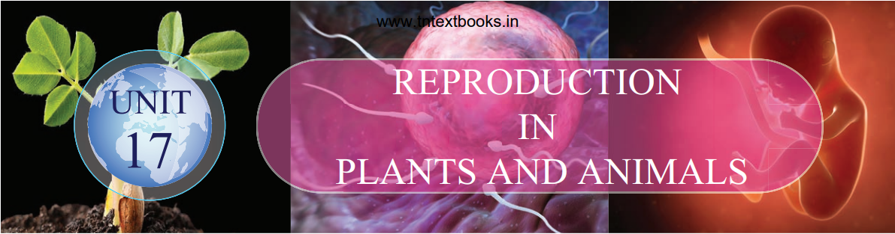

>### Learning Objectives
>At the end of this lesson the students will be able to: 
>- Differentiate vegetative, asexual and sexual reproduction.
>- Describe parts of flower and their functions.
>- Understand the types and modes of pollination and their significance.
>- Understand the process of double fertilization, steps involved in fertilization (syngamy and triple fusion), embryo development, endosperm development and formation of seed.
>- Understand the process of sexual reproduction in human beings.
>- Know the structure of testicular and ovarian cells.
>- Know the structural details of human sperm and ovum.
>- Realize the events of menstrual cycle and fertilization.
>- Gain awareness on reproductive health and strategies.
>- Gain knowledge on personal and social hygiene.

>### Introduction

&nbsp;&nbsp;&nbsp;&nbsp;&nbsp;&nbsp;“Living organisms cannot survive for an indefinite period on earth. All living organisms have the ability to produce more of its own kind by the process called reproduction.Reproduction is the unfolding of life forms where new individuals are formed. It ensures continuity and survival of the species. This process is to preserve individual species and it is called as self-perpetuation. The time required to reproduce also varies from organism to organism. You may find great variations in period of reproduction in yeast, bacteria, rat, cow, elephant and humans. In sexual reproduction offsprings are produced by the union of male and female gametes (sperm and egg). The male and female gametes contain the genetic material or genes present on the chromosomes which transmit the characteristic traits to the next generation. There are three types of reproduction in plants namely i) Vegetative ii) Asexual and iii) Sexual reproduction.

>### 17.1 Vegetative Reproduction

&nbsp;&nbsp;&nbsp;&nbsp;&nbsp;&nbsp;In this type, new plantlets are formed from vegetative (somatic) cells, buds or organs of plant. The vegetative part of plant (root, stem, leaf or bud) gets detached from the parent body and grows into an independent daughter plant. It has only mitotic division, no gametic fusion and daughter plants are genetically similar to the parent plant.  
&nbsp;&nbsp;&nbsp;&nbsp;&nbsp;&nbsp;Vegetative reproduction may take place through   
**(i) Leaves:** In Bryophyllum small plants grow at the leaf notches

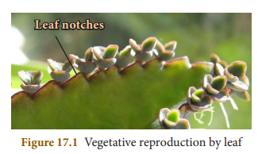

**(ii) Stems:** In strawberry aerial weak stems touch the ground and give off adventitious roots and buds. When the connections with the parent plant is broken, the offspring beomes independent.

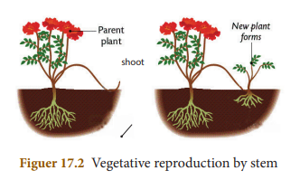

(**iii) Root:** Tuberous roots (Asparagus and Sweet potato) can be used for vegetative propagation.
 **(iv) Bulbils:** In some plants the flower buds modified into globose which are called as bulbils. When these falls on the ground they grow into new plants. e.g. Agave.   
 **(v) Other types of Vegetative Reproduction**    
 **a. Fragmentation:** In filamentous algae, breaking of the filament into many fragments is called fragmentation. Each fragment having atleast one cell, may give rise to a new filament of the algae by cell division e.g. Spirogyra.

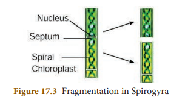

**b. Fission:** In this type the parent cell divides into two daughter cells and each cell develops into a new adult organism e.g. Amoeba.

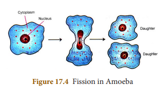

**c. Budding:** Formation of a daughter individual from a small projection, the bud, arising on the parent body is called budding. e.g. Yeast.

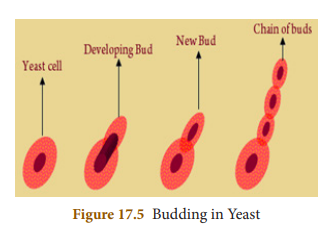

**d. Regeneration:** The ability of the lost body parts of an individual organism to give rise to an whole new organism is called regeneration. It takes place by specialized mass of cells e.g _Hydra_ and _Planaria._

>### 17.2 Asexual Reproduction

&nbsp;&nbsp;&nbsp;&nbsp;&nbsp;&nbsp;Production of an offspring by a single parent without the formation and fusion of gametes is called asexual reproduction. It involves only mitotic cell divisions and meiosis does not occur. Offspring produced by asexual reproduction are not only identical to parents but are also exact copies of their parent.  
&nbsp;&nbsp;&nbsp;&nbsp;&nbsp;&nbsp;Asexual reproduction occurs by **spore formation. This is the most common method** of asexual reproduction in fungi and bacteria.  
&nbsp;&nbsp;&nbsp;&nbsp;&nbsp;&nbsp;During spore formation a structure called **sporangium** develops from the **fungal hypha**. The nucleus divides several times within the sporangium and each nucleus with small amount of cytoplasm develops into a spore. The spores are liberated and they develop into new hypha after reaching the ground or substratum.

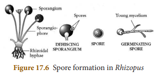

>**Activity 1**
>- Wet a slice of bread, and keep it in a cool, moist and dark place. 
>- Observe the surface of the slice with a
magnifying glass. 
>- Record your observations for a week.

>### 17.3 Sexual Reproduction in Plants

&nbsp;&nbsp;&nbsp;&nbsp;&nbsp;&nbsp;Sexual reproduction is the process in which two gametes (male and female) are fused to produce offspring of their own kind. In such cases both sexes, male and female sex organs are needed to produce gametes. You have already learnt that the flower is a reproductive organ of a flowering plant.  
&nbsp;&nbsp;&nbsp;&nbsp;&nbsp;&nbsp;To understand this further we need to study the structure of a flower.

>### 17.3.1 Parts of a Typical Flower

&nbsp;&nbsp;&nbsp;&nbsp;&nbsp;&nbsp;A flower is a modified shoot with limited growth to carry out sexual reproduction. A flower consists of four whorls borne on a thalamus. These whorls are from outside  
a) Calyx – consisting of sepals   
b) Corolla – consisting of petals   
c) Androecium – consisting of stamens   
d) Gynoecium or pistil – consisting of carpels

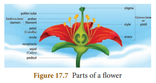

>**Activity 2**
>- Take a shoe flower from a growing plant. 
>- Observe the floral parts Calyx, Corolla, Androecium and Gynoecium. 
>- Separate the stamens and carpels and observe the parts.
>- Dust the pollen grains on a slide and observe under a microscope.

&nbsp;&nbsp;&nbsp;&nbsp;&nbsp;&nbsp;The two outermost whorls calyx and corolla are **non–essential** or **accessory whorls** as they do not directly take part in the reproduction. The other two whorls **androecium** and **gynoecium** are known as the **essential whorls**, because both take part directly in reproduction.  
&nbsp;&nbsp;&nbsp;&nbsp;&nbsp;&nbsp;**Androecium:** Androecium, the **male part** of flower is composed of stamens. Each stamen consists of a stalk called the filament and a small bag like structure called **anther** at the tip. The pollen grains are produced in the anther within the pollen sac.

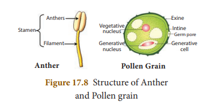

&nbsp;&nbsp;&nbsp;&nbsp;&nbsp;&nbsp;**Pollen grain:** Pollen grains are usually spherical in shape. It has two layered wall. The hard- outer layer is known as **exine**. It has prominent apertures called germpore. The inner thin layer is known as **intine**. It is a thin and continuous layer made up of cellulose and pectin. Mature pollen grains contain two cells, the **vegetative** and the **generative cell**. Vegetative cell contains a large nucleus. The generative cell divides mitotically to form two male gametes.  
&nbsp;&nbsp;&nbsp;&nbsp;&nbsp;&nbsp;**Gynoecium:** Gynoecium is the female part of the flower and is made up of carpels. It has three parts:   
1. Ovary 
2. Style         
3. Stigma 

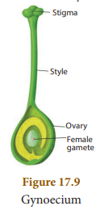

The ovary contains the ovules.

>### 17.3.2 Structure of the Ovule

&nbsp;&nbsp;&nbsp;&nbsp;&nbsp;&nbsp;The main part of the ovule is the nucellus which is enclosed by two integuments leaving an opening called as micropyle. The ovule is attached to the ovary wall by a stalk known as **funiculus**. **Chalaza** is the basal part.
 
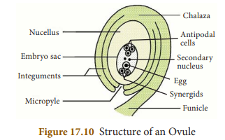

&nbsp;&nbsp;&nbsp;&nbsp;&nbsp;&nbsp;The embryo sac contains seven cells and the eighth nuclei located within the **nucellus**. Three cells at the micropylar end form the egg apparatus and the three cells at the **chalaza** end are the antipodal cells. The remaining two nuclei are called **polar nuclei** found in the centre. In the egg apparatus one is the egg cell (female gamete) and the remaining two cells are the **synergids**.
&nbsp;&nbsp;&nbsp;&nbsp;&nbsp;&nbsp;Process of sexual reproduction in flowering plants. It involves: 
1. Pollination 
2. Fertilization

>### 17.4 Pollination

&nbsp;&nbsp;&nbsp;&nbsp;&nbsp;&nbsp;The transfer of pollen grains from anther to stigma of a flower is called as pollination

**Importance of Pollination**     
1\. It results in fertilization which leads to the formation of fruits and seed.    
2\. New varieties of plants are formed through new combination of genes in case of cross pollination.

>### 17.4.1 Types of Pollination

1\. Self-pollination  
2. Cross pollination

**Self-pollination (Autogamy)**  
&nbsp;&nbsp;&nbsp;&nbsp;&nbsp;&nbsp;Self-pollination is also known as autogamy. The transfer of pollen grains from the anther to the stigma of same flower or another flower borne on the same plant is known as self- pollination. e.g. _Hibiscus_.

**Advantages of self-pollination**  
1\. Self-pollination is possible in bisexual flowers.   
2. Flowers do not depend on agents for pollination.   
3. There is no wastage of pollen grains.

**Disadvantages of self-pollination**   
1\. The seeds are less in numbers.  
2\. The endosperm is minute. Therefore, the seeds produce weak plants.  
3\. New varieties of plants cannot be produced.

**Cross pollination**  
&nbsp;&nbsp;&nbsp;&nbsp;&nbsp;&nbsp;Cross-pollination is the transfer of pollen from the anthers of a flower to the stigma of a flower on another plant of the same species e.g. apples, grapes, plum, etc.

**Advantages of cross pollination**   
1\. The seeds produced as a result of cross
pollination, develop and germinate properly and grow into better plants, i.e. cross pollination leads to the production of new varieties.  
2\. More viable seeds are produced.

**Disadvantages of cross-pollination**   
1\. Pollination may fail due to distance barrier.  
2\. More wastage of pollen grains.  
3\. It may introduce some unwanted characters.  
4\. Flowers depend on the external agencies for pollination.

>**Activity 3**
>- Observe the flowers in a garden. Identify the insects and birds that act as pollinating agents.
>- Maintain a record of pollinating agents and the plants.

>#### 17.5 Agents of Cross Pollination

&nbsp;&nbsp;&nbsp;&nbsp;&nbsp;&nbsp;In order to bring about cross pollination, it is necessary that the pollen should be carried from one flower to another of a different plant.  
&nbsp;&nbsp;&nbsp;&nbsp;&nbsp;&nbsp;This takes place through the agency of animals, insects, wind and water.

**1\. Pollination by wind**   
&nbsp;&nbsp;&nbsp;&nbsp;&nbsp;&nbsp;The pollination with the help of wind is called anemophily. The anemophilous flowers produce enormous amount of pollen grains. The pollen grains are small, smooth, dry and light in weight. Pollen of such plants are blown off at a distance of more than 1,000 km. The stigmas are comparatively large, protruding and sometimes hairy to trap the pollen grains. e.g. Grasses and some cacti.

**2\. Pollination by insects**  
&nbsp;&nbsp;&nbsp;&nbsp;&nbsp;&nbsp;Pollination with the help of insects like honey bees, flies are called entomophily. To attract insects these flowers are brightly coloured, have smell and nectar. The pollen grains are larger in size, the exine is pitted, spiny etc., so they can be adhered firmly on the sticky stigma. Approximately, 80% of the pollination done by the insects is carried by honey bees.

3\. **Pollination by water**   
&nbsp;&nbsp;&nbsp;&nbsp;&nbsp;&nbsp;The pollination with the help of water is called hydrophily.This takes place in aquatic plants.  
(i) Pollen grains are produced in large numbers.  
(ii) Pollen grains float on surface of water till they land on the stigma of female flowers e.g. _Hydrilla, Vallisneria_.

<!-- 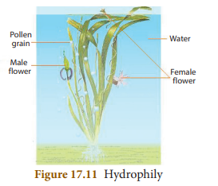 -->

3. **Pollination by Animals**   
&nbsp;&nbsp;&nbsp;&nbsp;&nbsp;&nbsp;When pollination takes place with the help of animals, it is called **Zoophily**. Flowers of such plants attract animals by their bright color, size, scent etc. e.g. sun bird pollinates flowers of Canna, Gladioli etc., Squirrels pollinate flowers of silk cotton tree.

>### 17.6 Fertilization in Plants

<!-- 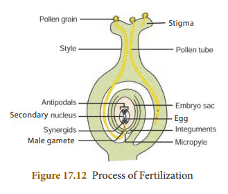 -->

- Pollen grains reach the right stigma and begin to germinate.
- Pollen grain forms a small tube-like structure called pollen tube which emerges through the germ pore. The contents of the pollen grain move into the tube.
- Pollen tube grows through the tissues of the stigma and style and finally reaches the ovule through the micropyle.
- Vegetative cell degenerates and the generative cell divides to form two sperms (or male gametes).
- Tip of pollen tube bursts and the two sperms enter the embryo sac.
- One sperm fuses with the egg (syngamy) and forms a diploid zygote. The other sperm fuses with the secondary nucleus (Triple fusion) to form the primary endosperm nucleus which is triploid in nature. Since two types of fusion syngamy and triple fusion take place in an embryo sac the process is termed as **double fertilization**.
- After triple fusion, primary endosperm nucleus develops into an endosperm.
- Endosperm provides food to the developing embryo.
- Later the synergids and antipodal cells degenerate.

**Significance of Fertilization**   
(i) It stimulates the ovary to develop into fruit.   
(ii) It helps in development of new characters from two different individuals.

**Post fertilization changes:**  
1\. The ovule develops into a seed.   
2. The integuments of the ovule develop into the seed coat.   
3. The ovary enlarges and develops into a fruit.  

&nbsp;&nbsp;&nbsp;&nbsp;&nbsp;&nbsp;The seed contains the future plant or embryo which develops into a seedling under appropriate conditions.

>### 17.7 Sexual Reproduction in Human

&nbsp;&nbsp;&nbsp;&nbsp;&nbsp;&nbsp;You have studied the structural details of the male and female reproductive system in 9th standard. In human beings the male and female reproductive organs differnt anatomically and physiologically. New individuals develop by the fusion of gametes. Sexual reproduction involves the fusion of two haploid gametes (male and the female gametes) to form a diploid individual (zygote).  
&nbsp;&nbsp;&nbsp;&nbsp;&nbsp;&nbsp;Organs of the reproductive system are divided into primary and secondary (accessory) sex organs.
- Primary reproductive organs include the gonads (Testes in male and Ovaries in female). 
    <li>Accessory sex organs</li>
    <ul>
      <li> Male: Vas deferens, epididymis, seminal vesicle, prostate gland and penis.</li>
      <li>Female: Fallopian tubes, uterus, cervix and vagina.</li>
    </ul>
    </li>

&nbsp;&nbsp;&nbsp;&nbsp;&nbsp;&nbsp;The secondary (accessory) sex organs include those structures which are involved in the
- Process of ovulation 
- Fusion of the male and female gametes (fertilization) 
- Division of the fertilized egg upto the formation of embryo 
- Pregnancy 
- Development of foetus 
- Child birth.

&nbsp;&nbsp;&nbsp;&nbsp;&nbsp;&nbsp;Now let’s see the cells of the primary reproductive organs in human male and female and their role in reproduction.

>### 17.7.1 Male Reproductive Organ - Structure of Testes

&nbsp;&nbsp;&nbsp;&nbsp;&nbsp;&nbsp;Testes are the reproductive glands of the male that are oval shaped organs which lie outside the abdominal cavity of a man in a sac like structure called **scrotum**. Now we shall study the various cells which are present in the testes.  
&nbsp;&nbsp;&nbsp;&nbsp;&nbsp;&nbsp;Each testes is covered with a layer of fibrous tissue called **tunica albuginea**. Many septa from this layer divide the testes into pyramidal lobules, in which lie seminiferous tubules, cells of Sertoli, and the Leydig cells (interstitial cells).  
&nbsp;&nbsp;&nbsp;&nbsp;&nbsp;&nbsp;The process of **spermatogenesis** takes place in the **seminiferous tubules**. The **Sertoli cells** are the supporting cells and provide **nutrients** to the developing sperms. The **Leydig cells** are polyhedral in shape and lie between the seminiferous tubules and secrete testosterone. It initiates the process of spermatogenesis. 

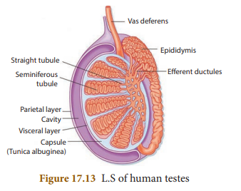

>### 17.7.2 Female Reproductive Organ - Structure of Ovary

&nbsp;&nbsp;&nbsp;&nbsp;&nbsp;&nbsp;The ovaries are located on either side of the lower abdomen composed of two almond shaped bodies, each lying near the lateral end of fallopian tube. Each ovary is a compact structure consisting of an outer cortex and an inner medulla. The cortex is composed of a network of connective tissue called as stroma and is lined by the **germinal epithelium**. The epithelial cells called the granulosa cells surround each ovum in the ovary together forming the primary follicle. As the egg grows larger, the follicle also enlarges and gets filled with the fluid and is called the Graafian **follicle**.

>**Info bits**  
The number of primordial follicles in new born female child ranges over 7 million and during reproductive period (at puberty) the number is around 60,000 to 70,000. During a woman’s lifetime, she will only ovulate 300 to 400 of the 1-2 million eggs, she was initially born with. On the other side, men will produce over 500 billion sperms in their lifetime.

<!-- 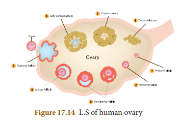 -->

>### 17.8 Gametogenesis

&nbsp;&nbsp;&nbsp;&nbsp;&nbsp;&nbsp;The formation of the sperm in male and the **ovum in female** is called **gametogenesis**. It involves **spermatogenesis** (formation of spermatozoa) and **oogenesis** (the formation of ova). Gametes with **haploid cells** are produced through gametogenesis.

>### 17.8.1 Structure of Human Sperm

&nbsp;&nbsp;&nbsp;&nbsp;&nbsp;&nbsp;The spermatozoan consists of head, a middle piece and tail. The sperm head is elongated and formed by the condensation of nucleus. The anterior portion has a cap

<!-- 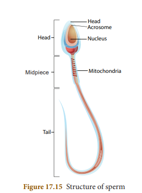 -->

like structure called **acrosome**. It contains **hyaluronidase** an enzyme that helps the sperm to enter the ovum during fertilization. A short neck connects the head and **middle piece which comprises the centrioles.The** middle piece contains the **mitochondria** which provides energy for the movement of tail. It brings about **sperm motility** which is essential for fertilization.

>### 17.8.2 Structure of Human Ovum

&nbsp;&nbsp;&nbsp;&nbsp;&nbsp;&nbsp;The mature ovum or egg is spherical in shape.The ovum is almost free of yolk. It contains abundant cytoplasm and the nucleus. The ovum is surrounded by three membranes. The plasma membrane is surrounded by inner thin **zona pellucida** and an outer thick **corona radiata. The corona radiata is formed of follicle cells. The membrane forming the surface layer** of the ovum is called vitelline membrane. The fluid-filled space between zona pellucida and the surface of the egg is called **perivitelline space**.

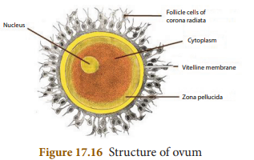

**Puberty**

&nbsp;&nbsp;&nbsp;&nbsp;&nbsp;&nbsp;&nbsp;The reproductive system in both males and females becomes functional and an increase in sex hormone production resulting in puberty. This phenomenon tends to start earlier in females than in males. Generally boys attain puberty between the age of 13 to 14 years, while girls reach puberty between 11 to 13 years. In male, the onset of puberty is triggered by the secretion of the hormone testosterone in the testes, in female the secretion of estrogens and progesterone from the ovary. The secretion of both male and female hormones are under the control of the pituitary gonadotropins luteinizing hormone (LH) and follicle stimulating hormone (FSH).

>### 17.9 Menstrual Cycle-Process of Ovulation

&nbsp;&nbsp;&nbsp;&nbsp;&nbsp;&nbsp;&nbsp;The cyclic events that take place in a rhythmic fashion during the reproductive period of a woman’s life is called menstrual cycle. In human females the menstrual cycle starts at the age of 11-13 years which marks the onset of puberty and is called **menarche**, and ceases around 48-50 years of age and this stage is termed menopause. The reproductive period is marked by characteristic events repeated almost every month in physiologically normal women (28 days with minor variation) in the form of a menstrual flow. The menstrual cycle consists of 4 phases 
1. Menstrual or Destructive Phase 
2. Follicular or Proliferative Phase
3. Ovulatory Phase 
4. Luteal or Secretory Phase

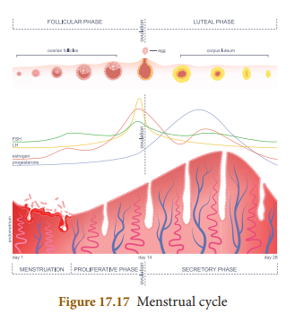

&nbsp;&nbsp;&nbsp;&nbsp;&nbsp;&nbsp;These phases show simultaneous synchrony of events in both ovary and uterus. Changes in the ovary and the uterus are

**Table 17.1** Events of Menstrual Cycle and the Role of Hormones

**Phase Days Changes in Ovary Changes in Uterus Hormonal Changes**  
| Phase |Days |Changes in Ovar y |Changes in Uterus |Hormonal Changes |
|------|------|------|------|------|
| Menstrual phase |4–5 days |Development of primar y follicles |Breakdown of uterine endometrial lining leads to bleeding |Decrease in progesterone and oestrogen |
| Follicular phase |6 –13dayth th |Primar y follicles grow to become a fully mature Graafian follicle |Endometrium regenerates through proliferation |FSH and oestrogen increase |
| Ovulator y phase |14  dayth |e Graafian follicle ruptures, and releases the ovum(egg) |Increase  in endometrial thickness |LH peak |
| Lutealphase |15 –28  daythth |Emptied Graafian follicle develops into corpus luteum |Endometrium is prepared for implantation if fertilization of egg takes place, if fertilization does not occur corpus luteum degenerates, uterine wall ruptures, bleeding starts and unfertilized egg is expelled |LH and FSH decrease, Corpus luteum produces progesterone  and its level increases followed by a decline, if menstrual bleeding occurs induced by the pituitary hormones (LH and FSH) and ovarian hormones (estrogen and progesterone).

>**Info bit**  
Menstruation is a periodical phenomenon that continues from puberty to menopause. This will happen if the released ovum is not fertilized by the sperm. Lack of menstruation generally indicates pregnancy.

>### 17.10 Fertilization to Foetal Development

**Fertilization**   
&nbsp;&nbsp;&nbsp;&nbsp;&nbsp;&nbsp;&nbsp;Fertilization in human is internal and occurs in the oviduct of the female genital tract. It takes place usually in the ampulla of the fallopian tube. An oocyte is alive for about 24 hours after it is released from the follicle. Fertilisation must take place within 24 hours. The sperm enters into the ovum and fuses with it, resulting in the formation of a ‘**zygote**’. This process is called fertilization. The zygote is a **fertilized ovum**.

**Cleavage and Formation of Blastula**   
&nbsp;&nbsp;&nbsp;&nbsp;&nbsp;&nbsp;The first cleavage takes place about 30 hours after fertilization. Cleavage is a series of rapid mitotic divisions of the zygote to form many celled blastula (**Blastocyst**) which comprises an outer layer of smaller cells and inner mass of larger cells.

**Implantation**   
&nbsp;&nbsp;&nbsp;&nbsp;&nbsp;&nbsp;The blastocyst (fertilized egg) reaches the uterus and gets implanted in the uterus. The process of attachment of the blastocyst to the uterine wall (**endometrium**) is called implantation. The fertilized egg becomes implanted in about 6 to 7 days after fertilization.

**Gastrulation**   
&nbsp;&nbsp;&nbsp;&nbsp;&nbsp;&nbsp;The transformation of blastula into gastrula and the formation of **primary germ**

>**Info bits**
Normally one egg matures in the ovary each month. Ovulation is the rupture of the follicle releasing the egg or ovum . The uterus prepares itself to receive the fertilized egg every month. The uterine lining becomes thick and spongy for implantation of the fertilized egg.  
**Events leading to when fertilization occurs and does not occur**
If fertilization takes place the corpus luteum persists, continues to secrete progesterone maintains the thickened state of uterine wall and prevents maturation of another follicle till the end of pregnancy  
If fertilization does not occur, corpus luteum degenerates, the egg disintegrates and the uterine lining slowly breaks, discharged as blood and mucus leading to menstrual events.

**layers** (ectoderm, mesoderm and endoderm) by rearrangement of the cells is called gastrulation. This takes place after the process of implantation.

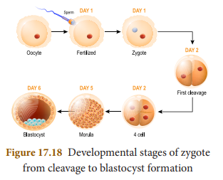

**Organogenesis**   
&nbsp;&nbsp;&nbsp;&nbsp;&nbsp;&nbsp;The establishment of the germ layers namely ectoderm, mesoderm and endoderm initiates the final phase of embryonic development. During organogenesis the various organs of the foetus are established from the different germ layers attaining a functional state.

**Formation of Placenta**   
&nbsp;&nbsp;&nbsp;&nbsp;&nbsp;&nbsp;The placenta is a disc shaped structure attached to the uterine wall and is a temporary association between the developing embryo and maternal tissues. It allows the exchange of food materials, diffusion of oxygen, excretion of nitrogenous wastes and elimination of carbon dioxide. A cord containing blood vessels that connects the placenta with the foetus is called the **umbilical cord**.

**Pregnancy (Gestation)**   
&nbsp;&nbsp;&nbsp;&nbsp;&nbsp;&nbsp;It is the time period during which the embryo attains its development in the uterus. Normally gestation period of human last for about 280 days. During pregnancy the uterus expands upto 500 times of its normal size.

**Parturition (Child Birth)**   
&nbsp;&nbsp;&nbsp;&nbsp;&nbsp;&nbsp;Parturition is the **expulsion** of young one from the mother’s uterus at the end of gestation. **Oxytocin** from the posterior pituitary stimulates the **uterine contractions** and provides force to expel the baby from the uterus, causing birth.

>Sometimes ovaries releases two eggs and each is fertilised by a different sperm, resulting in **Non-Identical Twins (Fraternal Twins)**. If single egg is fertilised and then divides into two foetus, **Identical Twins** develop.

**Lactation**   
&nbsp;&nbsp;&nbsp;&nbsp;&nbsp;&nbsp;The process of milk production after child birth from mammary glands of the mother is called lactation. The first fluid which is released from the mammary gland after child birth is called as **colostrum.** Milk production from alveoli of mammary glands is stimulated by **prolactin** secreted from the anterior pituitary.  
&nbsp;&nbsp;&nbsp;&nbsp;&nbsp;&nbsp;&nbsp;The ejection of milk is stimulated by posterior pituitary hormone **oxytocin**.

>**Info bits**  
The milk produced from the breast during the first 2 to 3 days after child birth is called colostrum. It contains immune substances and provides immunity to the new born which is essential for the body.

>### 17.11. Reproductive Health

&nbsp;&nbsp;&nbsp;&nbsp;&nbsp;&nbsp;According to World Health Organization (WHO) reproductive health means a total well being in all aspects of reproduction, ability to reproduce and regulate fertility, women's ability to undergo pregnancy and safe child birth,maternal and infant survival and well being.  
&nbsp;&nbsp;&nbsp;&nbsp;&nbsp;&nbsp;&nbsp;Several measures were undertaken by the government to improve the reproductive health of the people by launching **National Health Programmes** such as the  
i. Family Welfare Programme   
ii. Reproductive and Child Health Care (RCH) Programme

**Family welfare programme:** The National Family Welfare Programme is a comprehensive scheme which includes: 
1. Maternal and child health care (MCH) 
2. Immunization of mothers, infants and children. 
3. Nutritional supplement to pregnant women and children. 
4. Contraception with health education, to motivate couples to accept contraceptive methods and to have small family norms, which improve economic status, living status and the quality of life.

**Reproductive and Child Health Care (RCH) Programme:** It has integrated all services which include   
• Pregnancy and child birth.   
• Postnatal care of the mother and child.  
• Importance of breast feeding.   
• Prevention of reproductive tract infections and sexually transmitted diseases.

>### 17.12 Population Explosion and Family Planning

&nbsp;&nbsp;&nbsp;&nbsp;&nbsp;&nbsp;Population explosion defined as the sudden and rapid rise in the size of population, especially human population. Realizing the dangers inherent in population growth, the Government of India has taken several measures to check population growth and introduced family planning. **India** has been one of the first country in the world to launch **the nation wide family planning programme in 1952**.

&nbsp;&nbsp;&nbsp;&nbsp;&nbsp;&nbsp;&nbsp;Family planning is a way of living that is adopted voluntarily by couples on the basis of knowledge and responsible decisions to promote the health and welfare of the family group and society. The WHO (World Health Organisation) has also stressed the importance of family planning as global strategy health for all.

>The inverted red triangle is a symbol of family planning in India for family welfare. It is displayed prominently at all hospitals, primary health clinics and family welfare centres where any help or advice about family planning is available free of cost. The symbol is displayed along with a slogan _Small Family, Happy Family._

>### 17.12.1. Contraception

&nbsp;&nbsp;&nbsp;&nbsp;&nbsp;&nbsp;Contraception is one of the best **birth control measures**. A number of techniques or methods have been developed to prevent pregnancies in women. The devices used for contraception are called **contraceptive devices**. Common contraceptive methods used to prevent pregnancy are discussed here.

1\. Barrier methods   
2. Hormonal methods   
3. Intra-Uterine Devices (IUDs)   
4. Surgical methods  

**Barrier Methods**   
This method prevents sperms from meeting the ovum. Its entry into the female reproductive tract is prevented by barrier.  
**(a) Condom:** Condom prevents deposition of sperms in the vagina. Condoms are made of thin rubber or latex sheath. Condom also protect against sexually transmitted diseases (STD) like syphilis, AIDS.  
**(b) Diaphragm (Cervical cap):** Vaginal diaphragm fitting into the vagina or a cervical cap fitting over the cervix. This prevents the entry of sperms into the uterus.

**Hormonal Methods**   
Hormonal preparations are in the form of **pills or tablets (contraceptive pills). These** hormones stop (**interfere with ovulation**) the release of egg from the ovary.

**Intra-Uterine Devices (IUDs)**  
&nbsp;&nbsp;&nbsp;&nbsp;&nbsp;&nbsp;The intrauterine device (IUD) are contraceptive devices inserted into the uterus. There are two synthetic devices commonly used in India are **Lippe’s Loop** and **Copper-T** made of copper and plastic (non irritant). This can remain for a period of 3 years. This reduces the sperm fertilizing capacity and prevents implantation. This also helps to give adequate time interval between pregnancies.

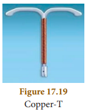

**Surgical Methods**   
&nbsp;&nbsp;&nbsp;&nbsp;&nbsp;&nbsp;&nbsp;Surgical contraception or sterilization techniques are terminal methods to prevent any pregnancy. This procedure in males is vasectomy **(ligation of vas deferens)** and in females it is **tubectomy (ligation of fallopian tube). These** are methods of permanent birth control.

>### 17.13 Urinary Tract Infection (UTI)

&nbsp;&nbsp;&nbsp;&nbsp;&nbsp;&nbsp;&nbsp;Many diseases affect both women and men, but a few diseases occur at a higher frequency in woman. Woman are susceptible to UTI from the bacteria that are present on skin, rectum or vagina. This will enter the urethra, before moving upwards. The types of UTI are:  
**1\. Cystitis or Bladder infection**   
&nbsp;&nbsp;&nbsp;&nbsp;&nbsp;&nbsp;Bacteria lodged in the urinary bladder thrive and multiply leading to inflammation. It is most common in the age group of 20 to 50.

**2\. Kidney Infection**   
&nbsp;&nbsp;&nbsp;&nbsp;&nbsp;&nbsp;The bacteria can travel from the urinary bladder and upward to ureter and affect one **or both the kidneys**. It also **infects the blood stream** and leads to serious life-threatening complications.

**3\. Asymptomatic Bacteriuria**   
&nbsp;&nbsp;&nbsp;&nbsp;&nbsp;&nbsp;The bacteria present in the urinary bladder which may not show any symptoms.

>### 17.14 Personal Hygiene

&nbsp;&nbsp;&nbsp;&nbsp;&nbsp;&nbsp;&nbsp;Hygiene is the practice of healthy living and personal cleanliness. Personal hygiene is caring of one’s own body and health. Social hygiene is proper care of the surrounding environment. The main aspect of hygiene are body hygiene, food hygiene, sanitary hygiene and hygienic environment.

>### 17.14.1 Body Hygiene

&nbsp;&nbsp;&nbsp;&nbsp;&nbsp;&nbsp;&nbsp;Washing is vital to all age group of people which maintains our personal hygiene. A daily bath regularly keeps skin clean and free of germs. Hair should be kept clean by frequent washing. Mouth wash should be done after every meal. We should wash our hands many times during the day.  
&nbsp;&nbsp;&nbsp;&nbsp;&nbsp;&nbsp;Cloth towels used to dry our hands or body should be dried after each use and laundered regularly. Clothes, handkerchief, undergarments and socks should be washed daily. Washing prevents body odour, infections and skin irritation.

>### 17.14.2 Toilet Hygiene  

&nbsp;&nbsp;&nbsp;&nbsp;&nbsp;&nbsp;The toilet has a lot to do with personal hygiene and general health as it is a place that cannot be avoided and used regularly. Parents should guide and practice their children on how to use the toilets at home, in schools and other public places so that it will protect the children from various contagious infections and diseases.The following measures can ensure toilet hygiene
1. The floors of the toilet should be maintained clean and dry. This helps to reduce the bad odour and also infection.
2. Toilet flush handles, door knobs, faucets, paper towel dispensers, light switches and walls should be cleaned with disinfectants to kill harmful germs and bacteria.
3. Hands should be washed thoroughly with soap before and after toilet use.

>### 17.14.3 Menstrual and Napkin Hygiene

&nbsp;&nbsp;&nbsp;&nbsp;&nbsp;&nbsp;Women’s health depends upon the level of cleanliness to keep them free from skin and genitourinary tract infection.

**Menstrual hygiene**   
&nbsp;&nbsp;&nbsp;&nbsp;&nbsp;&nbsp;Maintaining menstrual hygiene is important for the overall health of women. The basic menstrual hygiene ways are 
1. Sanitary pads should be changed regularly, to avoid infections due to microbes from vagina and sweat from genitals.
2. Use of warm water to clean genitals helps to get rid of menstrual cramps.
3. Wearing loose clothing rather than tight fitting clothes will ensure the airflow around the genitals and prevent sweating.

>**More to Know**
Every year May 28 is observed as Menstrual Hygiene day to make girls and women aware of maintaining menstrual hygiene and importance of menstrual hygiene for good health. By way of awareness through films, discussions and campaigns menstrual hygiene has taken quite the centre stage in recent days.

**Napkin hygiene**   
&nbsp;&nbsp;&nbsp;&nbsp;&nbsp;&nbsp;The parents and teachers are to create awareness among the school girls about the use of napkins and their proper disposal. Girls should be educated in the following ways 
1. The sanitary pad and tampons should be wrapped properly and discarded because they can spread infections.
2. Sanitary pad or tampon should not be flushed down the toilet.
3. Napkin incinerators are to be used properly for disposal of used napkins.

>**Info bits**  
The menstrual hygiene scheme to provide subsidized sanitary napkins was launched by the Health ministry in 2011.  
In Tamil Nadu, UNICEF has developed an affordable incinerator that uses firewood to handle sanitary napkin waste at schools and special wells are equipped where sanitary napkins are composted.

>**Points to Remember**
- Many bacteria and protozoa simply divide into two or more daughter cells by fission.
- Organisms such as hydra can regenerate if they are broken into pieces. They can also give out buds which mature into new individuals. 
- Reproduction in flowering plants involves transfer of pollen grains from the anther to the stigma which is referred to as pollination. This is followed by fertilization. 
- Sexual reproduction involves the fusion of two haploid gametes (male and the female gametes) to form a diploid individual (zygote). 
- The formation of the sperm in male and the ovum in female is called gametogenesis. It involves spermatogenesis (formation of spermatozoa) and oogenesis (the formation of ova). 
- The cyclic events that take place in a rhythmic manner during the reproductive period of a woman’s life is called menstrual cycle. 
- The process of attachment of the blastocyst to the uterine wall (endometrium) is called implantation. 
- The placenta is a temporary association between the developing embryo and maternal tissues. 
- Parturition is the expulsion of young one from the mother’s uterus. 
- Contraception is one of the best birth control measures. The devices used for contraception are called contraceptive devices.

>**TEXTBOOK EVALUATION**

**I. Choose the correct answer**  
1\. The plant which propagates with the help of its leaves is \_\_\_\_\_\_\_\_\_\_\_ .   
a) Onion  &nbsp;&nbsp;&nbsp;&nbsp;b) Neem   
c) Ginger &nbsp;&nbsp;&nbsp;d) _Bryophyllum_

2\. Asexual reproduction takes place through budding in \_\_\_\_\_\_\_\_\_\_\_ .  
a) _Amoeba_ &nbsp;&nbsp;&nbsp;&nbsp;&nbsp;&nbsp;&nbsp;&nbsp;b) Yeast   
c) _Plasmodium_ &nbsp;&nbsp;d) Bacteria

3\. Syngamy results in the formation of \_\_\_\_\_\_\_\_\_ .   
a) Zoospores &nbsp;&nbsp;&nbsp;&nbsp;&nbsp;b) Conidia   
c) Zygote &nbsp;&nbsp;&nbsp;&nbsp;&nbsp;&nbsp;&nbsp;&nbsp;&nbsp;&nbsp;&nbsp;d) Chlamydospores

4\. The essential parts of a flower are \_\_\_\_\_\_\_\_\_\_\_ .  
a) Calyx and Corolla &nbsp;&nbsp;&nbsp;&nbsp;&nbsp;&nbsp;&nbsp;&nbsp;&nbsp;&nbsp;b) Calyx and Androecium   
c) Corolla and Gynoecium &nbsp;d) Androecium and Gynoecium

5\. Anemophilous flowers have \_\_\_\_\_\_\_\_\_\_ .  
a) Sessile stigma &nbsp;&nbsp;&nbsp;b) Small smooth stigma   
c) Colored flower &nbsp;&nbsp;&nbsp;d) Large feathery stigma

6\. Male gametes in angiosperms are formed by the division of \_\_\_\_\_\_\_\_\_\_\_ .   
a) Generative cell &nbsp;&nbsp;&nbsp;&nbsp;&nbsp;&nbsp;&nbsp;&nbsp;&nbsp;&nbsp;&nbsp;&nbsp;&nbsp;&nbsp;b) Vegetative cell   
c) Microspore mother cell &nbsp;&nbsp;d) Microspore

7 What is true of gametes?   
a) They are diploid   
b) They give rise to gonads   
c) They produce hormones   
d) They are formed from gonads  

8\. A single highly coiled tube where sperms are stored, get concentrated and mature is known as   
a) Epididymis &nbsp;&nbsp;&nbsp;&nbsp;b) Vasa efferentia   
c) Vas deferens &nbsp;d) Seminiferous tubules

9\. The large elongated cells that provide nutrition to developing sperms are   
a) Primary germ cells &nbsp;&nbsp;&nbsp;b) Sertoli cells   
c) Leydig cells &nbsp;&nbsp;&nbsp;&nbsp;&nbsp;&nbsp;&nbsp;&nbsp;&nbsp;&nbsp;&nbsp;&nbsp;&nbsp;&nbsp;d) Spermatogonia

10 Estrogen is secreted by   
a) Anterior pituitary &nbsp;&nbsp;b) Primary follicle   
c) Graffian follicle &nbsp;&nbsp;&nbsp;&nbsp;d) Corpus luteum

11\. Which one of the following is an IUCD?   
a) Copper – T &nbsp;&nbsp;&nbsp;b) Oral pills   
c) Diaphragm &nbsp;&nbsp;&nbsp;d) Tubectomy

**II. Fill in the blanks**  
1\. The embryo sac in a typical dicot at the time of fertilization is \_\_\_\_\_\_\_\_\_\_\_.  
2\. After fertilization the ovary develops into \_\_\_\_\_\_\_\_\_\_\_ .  
3\. _Planaria_ reproduces asexually by \_\_\_\_\_\_\_\_\_\_\_ .  
4\. Fertilization is \_\_\_\_\_\_\_\_\_\_ in humans  
5\. The implantation of the embryo occurs at about \_\_\_\_\_\_\_\_\_\_\_ day of fertilization  
6\. \_\_\_\_\_\_\_\_\_\_\_ is the first secretion from the mammary gland after child birth  
7\. Prolactin is a hormone produced by \_\_\_\_\_\_\_\_\_\_\_ .

**III. (a) Match the following**

| Column 1 |Column 2 |
|------|------|
| Fission |Spirogyra |
| Budding |Amoeba |
| Fragmentation |Yeast |
  
**III. (b) Match the following terms with their respective meanings**  
a) Parturition - &nbsp;&nbsp;&nbsp;1) Duration between pregnancy and birth  
b) Gestation - &nbsp;&nbsp;&nbsp;&nbsp;2) Attachment of zygote to endometrium  
c) Ovulation - &nbsp;&nbsp;&nbsp;&nbsp;3) Delivery of baby from uterus  
d) Implantation - 4) Release of egg from Graafian follicle

**IV. State whether the following statements are True or False. Correct the false statement**  
1\. Stalk of the ovule is called pedicle.   
2\. Seeds are the product of asexual reproduction.  
3\. Yeast reproduces asexually by means of multiple fission.  
4\. The part of the pistil which serves as a receptive structure for the pollen is called as style.  
5\. Insect pollinated flowers are characterized by dry and smooth pollen.  
6\. Sex organs produce gametes which are diploid.  
7\. LH is secreted by the posterior pituitary.   
8\. Menstrual cycle ceases during pregnancy.  
9\. Surgical methods of contraception prevent gamete formation.   
10\. The increased level of estrogen and progesterone is responsible for menstruation.

**V. Answer in a word or sentence**   
1\. If one pollen grain produces two male gametes, how many pollen grains are needed to fertilize 10 ovules?  
2\. In which part of the flower germination of pollen grains takes place?  
3\. Name two organisms which reproduces through budding.  
4\. Mention the function of endosperm. 5. Name the hormone responsible for the vigorous contractions of the uterine muscles.   
6\. What is the enzyme present in acrosome of sperm?   
7\. When is World Menstrual Hygiene Day observed?   
8\. What is the need for contraception ?   
9\. Name the part of the human female reproductive system where the following occurs.   
a. Fertilization &nbsp;&nbsp;b. Implantation

**VI. Short answer question**  
1\. What will happen if you cut planaria into small fragments?  
2\. Why is vegetative propagation practiced for growing some type of plants?  
3\. How does binary fission differ from multiple fission?  
4\. Define triple fusion.   
5\. Write the characteristics of insect pollinated flowers.   
6\. Name the secondary sex organs in male  
7\. What is colostrum? How is milk production hormonally regulated ?   
8\. How can menstrual hygiene be maintained during menstrual days?   
9\. How does developing embryo gets its
nourishment inside the mother's body?   
10\. Identify the parts A, B, C and D

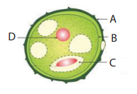

11\. Write the events involved in the sexual reproduction of a flowering plant.  
a. Discuss the first event and write the types.   
b. Mention the advantages and the disadvantages of that event.  
12\. Why are the human testes located outside the abdominal cavity? Name the pouch in which they are present .  
13\. Luteal phase of the menstrual cycle is also called the secretory phase. Give reason.  
14\. Why are family planning methods not adopted by all the people of our country?

**VII. Long answer questions**  
1\. With a neat labelled diagram describe the parts of a typical angiospermic ovule.  
2\. What are the phases of menstrual cycle? Indicate the changes in the ovary and uterus.

**VIII. Higher Order Thinking Skills (HOTS)**   
1\. In angiosperms the pollen germinates to produce pollen tube that carries two gametes. What is the purpose of carrying two gametes when single gamete can fertilize the egg?  
2\. Why menstrual cycle does not take place before puberty and during pregnancy ?  
3\. Read the following passage and answer the questions that follow  
Rahini and her parents were watching a television programme. An advertisement flashed on the screen which was promoting use of sanitary napkins. Rahini’s parents suddenly changed the channel, but she objected to her parents and explained the need and importance of such advertisement.   
a) What is first menstruation called? When does it occur ?  
b) List out the napkin hygiene measures taken during menstruation ?   
c) Do you think that Rahini’s objection towards her parents was correct? If so, Why?

**REFERENCE BOOKS**  
1\. Verma P.S and Agarwal, V.K. and Tyagi B.S, Animal Physiology, S.Chand and Company, New Delhi  
2\. Knut Schmidt and Nielsen, Animal Physiology, Foundations of Modern Biology series  
3\. Rastogi S.C. Essentials of Animal Physiology, 3rd Edition, Rastogi Publications, Meerut.  
4\. Winwood R.S. and Smith J. L., Sear’s Anatomy and Physiology for Nurses, 6th Edition, Edward Arnold and Jaypee Brothers.

**INTERNET RESOURCES**  
1\. http://www.importantindia.com/10606/population-explosion-in-India/  
2\. http://www.yourarticlelibrary.com/population/3-important...control-overpopulation/26950  
3\. http://www.momjunction.com>pregnancy>Health  
4\. https://leadership.ng/2018/04/08/toilet-hygiene  
5\. https://www.boldsky.com/health/wellness/2018/world-menstrual-hygiene-day

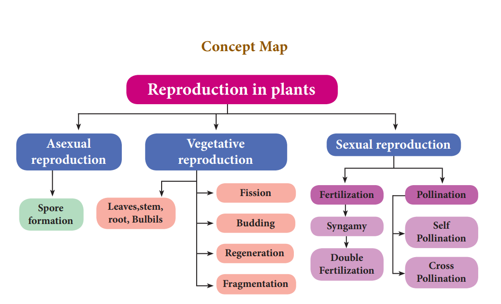

 

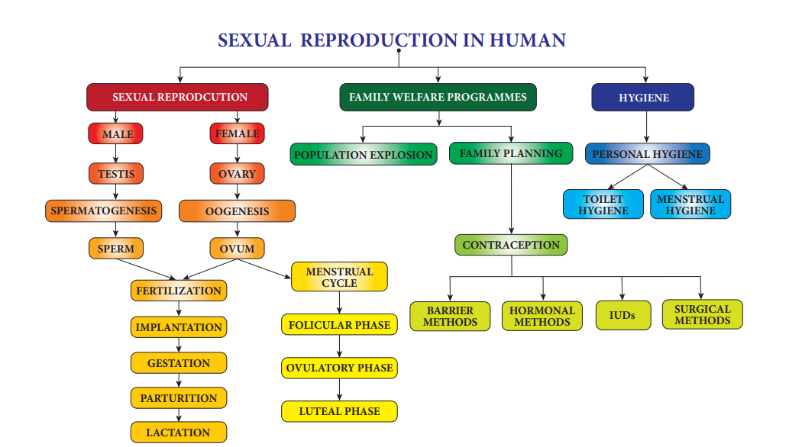

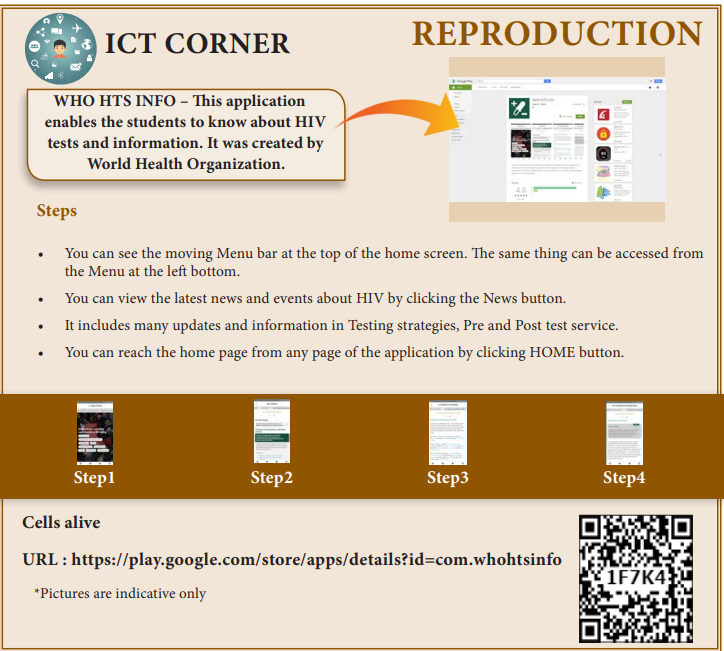

