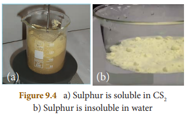
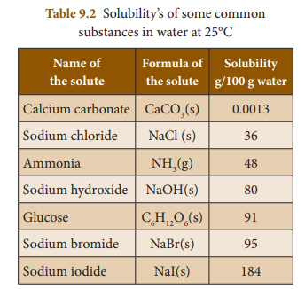
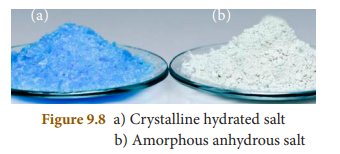

**INTRODUCTION**

You have learnt about mixtures in your lower classes. Most of the substances that we encounter in our daily life are mixtures of two or more substances. The substances present in a mixture may exist in one or more physical state. For example, when we burn wood, the smoke released is a mixture of solid carbon and gases like CO2, CO, etc.

In some cases of mixtures, their components can be separated easily whereas in some other cases they cannot be. Consider the two mixtures, one which contains salt and water, and the another which contains sand and water. Water is the one of the components in both the mixtures. In the first case salt disolves in water. In the second case the sand does not disolve in water. Sand in water can be separated by filtration but salt cannot be separated as it dissolves in water to form a homogeneous mixture. This kind of homogenous mixtures are termed as “**solutions**”.

## SOLUTIONS IN DAY-TO-DAY LIFE

One of the naturally existing solutions is sea water. We cannot imagine life on earth without sea water. It is a mixture of many dissolved salts. The another one is air. It is a mixture of gases like nitrogen, oxygen, carbon dioxide and other gases.

All the life forms on the earth are associated with solutions. Plants take solutions of nutrients for their growth from the soil. Most of the liquids found in human body including blood, lymph and urine are solutions. Day to day human activities like washing, cooking, cleaning and few other activities involve the formation of solutions with water. Similarly, the drinks what we take, like fruit juice, aerated drinks, tea, coffee etc. are also solutions. Therefore, the ability of water to form solutions is responsible for sustenance of life.

## COMPONENTS OF SOLUTIONS

We know that, a **solution is a homogeneous mixture of two or more substances**. In a solution, the component which is present in lesser amount (by weight), is called **solute** and the component, which is present in a larger amount (by weight) is called solvent. The solute gets distributed uniformly throughout the solvent and thus forming the mixture homogeneous. So, the solvent acts as a dissolving medium in a solution. The process of uniform distribution of solute into solvent is called **dissolution**. Figure 9.2 shows the schematic representation of solution.

A solution must at least be consisting of two components (a solute and a solvent). Such solutions which are made of one solute and one solvent (two components) are called **binary solutions**. e.g. On adding copper sulphate crystals to water, it dissolves in water forming a solution of copper sulphate as shown in Figure 9.3. It contains two components i.e. one solute- copper sulphate and one solvent-water. So it is a binary solution. Similarly, a solution may contain more than two components. For example if salt and sugar are added to water, both dissolve in water forming a solution. Here two solutes are dissolved in one solvent. Such kind of solutions which contain three components are called **ternary solutions**.

## Types of Solutions

### Based on the physical state of the solute and the solvent

We know that substances normally exist in three physical states (phases) i.e., solid, liquid and gas. In binary solutions, both the solvent and solute may exist in any of these physical states. But the solvent constitutes the major part of the solution. Its physical state is the primary factor which determine the characteristics of the solution. Therefore, there are different types of binary solutions as listed in Table 9.1.

### Based on the type of solvent

Most of the substances are soluble in water. That is why, water is called as ‘Universal solvent”. However some substances do not dissolve in water. Therefore, other solvents such as ethers, benzene, alcohols etc., are used to prepare a solution. On the basis of type of solvent, solutions are classified into two types. They are aqueous solutions and non-aqueous solutions.

**a) Aqueous solution:**

The solution in which water acts as a solvent is called aqueous solution. E.g. Common salt in water, Sugar in water, Copper sulphate in water etc.

**b) Non – Aqueous solution:**

The solution in which any liquid, other than water, acts as a solvent is called non- aqueous solution. Solvent other than water is referred to as non-aqueous solvent. Generally, alcohols, benzene, ethers, carbon disulphide, acetone, etc., are used as non-aqueous solvents. Examples for non-aqueous solutions: Sulphur dissolved in carbon disulphide, Iodine dissolved in carbon tetrachloride.

### Based on the amount of solute

The amount of the solute that can be dissolved in the given amount of solvent is limited under any given conditions. Based on the amount of solute, in the given amount of solvent, solutions are classified into the following types:

(i) Saturated solution

(ii) Unsaturated solution

(iii) Super saturated solution

**(i)** **Saturated solution:** A solution in which no more solute can be dissolved in a definite amount of the solvent at a given temperature is called saturated solution. e.g. 36 g of sodium chloride in 100 g of water at 25°C forms saturated solution.

Further addition of sodium chloride, leave it undissolved.

**(ii) Unsaturated solution:** Unsaturated solution is one that contains less solute than that of the saturated solution at a given temperature. e.g. 10 g or 20 g or 30 g of Sodium chloride in 100 g of water at 25°C forms an unsaturated solution.

**(iii)** **Super saturated solution:** Supersaturated solution is one that contains more solute than the saturated solution at a given temperature. e.g. 40 g of sodium chloride in 100 g of water at 25°C forms super saturated solution. This state can be achieved by altering any other conditions liken temperature, pressure. Super saturated solutions are unstable, and the solute is reappearing as crystals when the solution is disturbed.

### Concentrated and dilute solutions

It is another kind of classification of unsaturated solutions. It expresses the relative concentration of two solutions with respect to their solutes present in the given amount of the solvent. For example, you are given two cups of tea. When you taste them, you feel that one is sweeter than the other. What do you infer from it? The tea which sweet more contains higher amount of sugar than the other. How can you express your observation? You can say that the tea is stronger. But a chemist would say that it is ‘concentrated’.

When we compare two solutions having same solute and solvent, the one which contains higher amount of solute per the given amount of solvent is said to be ‘**concentrated solution**’ and the another is said to be ‘**dilute solution**’. They are schematically represented by Figure 9.5.

Differentiating solutions as dilute and concentrated is a qualitative representation. It does not imply the quantity of the solute. This difference is observed by means of some physical characteristics such as colour, density, etc.

## Solubility

Usually, there is a limit to the amount of solute that can be dissolved in a given amount of solvent at a given temperature. When this limit is reached, we have a saturated solution and any excess solute that is added, simply settle down at the bottom of the solution. The extent of dissolution of a solute in a solvent can be better explained by its solubility. Solubility is a measure of how much of a solute can be dissolved in a specified amount of a solvent.

**Solubility** is defined as the number of grams of a solute that can be dissolved in 100 g of a solvent to form its saturated solution at a given temperature and pressure. For example, 36 g of sodium chloride need to be dissolved in 100 g of water to form its saturated solution at 25°C. Thus the solubility of NaCl in water is 36 g at 25°C. The solubility is mathematically expressed as

Solubility = Mass of the solute/ 
Mass of the solvent × 100

### 9.4.1  Factors affecting solubility

There are three main factors which govern the solubility of a solute. They are: 
(i) Nature of the solute and solvent 
(ii) Temperature 
(iii) Pressure

**(i) Nature of the solute and solvent**

The nature of the solute and solvent plays an important role in solubility. Although water dissolves an enormous variety of substances, both ionic and covalent, it does not dissolve everything. The phrase that scientists often use when predicting solubility is “like dissolves like.” This expression means that dissolving occurs when similarities exist between the solvent and the solute. For example: Common salt is a polar compound and dissolves readily in polar solvent like water.

Non-polar compounds are soluble in non-polar solvents. For example, Fat dissolved in ether. But non-polar compounds, do not dissolve in polar solvents; polar compounds do not dissolve in non-polar solvents.

**(ii) Effect of Temperature**

**Solubility of Solids in Liquid:** Generally, solubility of a solid solute in 9a liquid solvent increases with increase in temperature. For example, a greater amount of sugar will dissolve in warm water than in cold water.

In endothermic process, solubility increases with increase in temperature.

In exothermic process, solubility decreases with increase in temperature. **Solubility of Gases in liquid**

Do you know why is it bubbling when water is boiled? Solubility of gases in liquid decrease with increase in temperature. Generally, water contains dissolved oxygen. When water is heated, the solubility of oxygen in water decreases, so oxygen escapes in the form of bubbles.

Aquatic animals live more in cold regions because, more amount of dissolved oxygen is present in the water of cold regions. This shows that the solubility of oxygen in water is more at low temperatures.

**(iii) Effect of Pressure**

Effect of pressure is observed only in the case of solubility of a gas in a liquid. When the pressure is increased, the solubility of a gas in liquid increases.

The common examples for solubility of gases in liquids are carbonated beverages, i.e. soft drinks, household cleaners containing aqueous solution of ammonia, formalin- aqueous solution of formaldehyde, etc.

## Concentration of a Solution

So far, we discussed what is a solution? what does it consist of and its types. Most of the chemical reactions take place in solutions form. So it is essential to quantify the solute in solvent to study the reactions. To quantify the solute in a solution, we can use the term “**concentration**”.

**Concentration of a solution may be defined as the amount of solute present in a given amount of solution or solvent.**

Quantitatively, concentration of a solution may be expressed in different methods. But here, we shall discuss percentage by mass (% mass) and percentage by volume (% volume).

### Mass percentage

Mass percentage of a solution is defined as the percentage by mass of the solute present in the solution. It is mostly used when solute is solid and solvent is liquid.

Mass Percentage = Mass of the solute /Mass of the solution × 100 

Mass Percentage = Mass of the solute / Mass of the solute + Mass of the solvent × 100

For example: 5% sugar solution (by mass) means 5 g of sugar in 95 g of water. Hence it is made 100g of solution.

Usually, mass percentage is expressed as w/w (weight / weight); mass percentage is independent of temperature.

### Volume percentage

Volume percentage is defined as the percentage by volume of solute (in ml) present in the given volume of the solution.

Volume Percentage = Volume of the solute/Volume of the solution × 100 

Volume Percentage =Volume of the solute/Volume of the solute + volume of the solvent × 100

For example, 10% by volume of the solution of ethanol in water, means 10 ml of ethanol in 100 ml of solution (or 90 ml of water)

Usually volume percentage is expressed as v/v (volume / volume). It is used when both the solute and solvent are liquids. Volume percentage decreases with increases in temperature, because of expansion of liquid.

You can notice that in the commercial products that we come across in our daily life such as a solution of syrups, mouth wash, antiseptic solution, household disinfectants etc., the concentration of the ingredients is expressed as v/v. Similarly, in ointments, antacid, soaps, etc., the concentration of solutions are expressed as w/w.

## Hydrated salts and Water of Crystallization

When ionic substances are dissolved in water to make their saturated aqueous solution, their ions attract water molecules which then attached chemically in certain ratio. This process is called hydration. These ionic substances crystallize out from their saturated aqueous solution with a definite number of molecules of water. The number of water molecules found in the crystalline substance is called **water of crystallization**. Such salts are called hydrated salts.

n heating these hydrated crystalline salts, they lose their water of crystallization and become amorphous or lose their colour (if they are coloured). 
Table 9.3 shows some common hydrated salts:

### Copper sulphate pentahydrate CuSO4
**.5H2O (Blue vitriol)**

The number of water molecules in blue vitriol is five. So its water of crystallization is 5. When blue coloured copper sulphate crystals are gently heated, it loses its five water molecules and becomes colourless anhydrous copper sulphate.

If you add few drops of water or allow it to cool, the colourless anhydrous salt again turns back into blue coloured hydrated salt.

### Magnesium sulphate heptahydrate MgSO4 **.7H2O (Epsom salt)**

Its water of crystallization is 7. When magnesium sulphate heptahydrate crystals are gently heated, it loses seven water molecules, and becomes anhydrous magnesium sulphate.

If you add few drops of water or allow it to cool, the colourless anhydrous salt again turns back into hydrated salt.

## Hygroscopy

Certain substances, when exposed to the atmospheric air at ordinary temperature, absorb moisture without changing their physical state. Such substances are called **hygroscopic substances** and this property is called hygroscopy.

Hygroscopic substances are used as drying agents.

**Example:** 
1. Conc.Sulphuric acid (H2SO4). 
2. Phosphorus Pentoxide (P2O5). 
3. Quick lime (CaO). 
4. Silica gel (SiO2).

## Deliquescence

Certain substances which are so hygroscopic, when exposed to the atmospheric air at ordinary temperatures, absorb enough water and get completely dissolved. Such substances are called **deliquescent substances** and this property is called **deliquescence**.

Deliquescent substances lose their crystalline shape and ultimately dissolve in the absorbed water forming a saturated solution. Deliquescence is maximum when:

1) The temperature is low 
2) The atmosphere is humid 
**Examples:** Caustic soda (NaOH), Caustic potash (KOH) and Ferric chloride (FeCl3).

| Hygroscopic substances |Deliquescence substances |
|------|------|
| When exp os ed t o t he atmosphere at ordin ar ytemp erature, t hey a bs orb m oisture a nd do n otdissolve. |When exp os ed t o t he atmospher ic a ir a tordin ar y t emp erature, t hey a bs orb m oistureand d issolve. |
| Hyg ros copic s ubstances do n ot c hange itsphysic al s tate on exp osure t o a ir. |Deliq ues cent s ubstances c hange its p hysic alstate on exp osure t o a ir. |
| Hyg ros copic s ubstances m ay b e a mor phoussolid s or liq uid s. |Deliq ues cent s ubstances a re cr ystallin e s olid s. |

## Problems Based on Solubility and Percentage by Mass and Volume

**I. Problems based on solubility**

1) 1.5 g of solute is dissolved in 15 g of water to form a saturated solution at 298K. Find out the solubility of the solute at the temperature.

Mass of the solute = 1.5 g 
Mass of the solvent = 15 g

Solubility of the = Mass of the solute/Mass of the solvent × 100 

Solubility of the solute = 1.5/15 × 100 = 10 g

2) Find the mass of potassium chloride would be needed to form a saturated solution in 60 g of water at 303 K? Given that solubility of the KCl is 37/100 g at this temperature.

Mass of potassium chloride in 100 g of water in saturated solution = 37 g

Mass of potassium chloride in = 60 g of water in saturated solution

37/100 × 60 = 22.2 g

3) What is the mass of sodium chloride that would be needed to form a saturated solution in 50 g of water at 30°C. Solubility of sodium chloride is 36 g at 30°C? At 30°C, 36 g of sodium chloride is dissolved in 100 g of water. 

∴ Mass of sodium chloride that would be need for 100 g of water = 36 g

∴ Mass of sodium chloride dissolved in 50 g of water = 36/100 × 50 = 18 g

4) The solubility of sodium nitrate at 50°C and 30°C is 114 g and 96 g respectively. Find the amount of salt that will be thrown out when a saturated solution of sodium nitrate containing 50 g of water is cooled from 50°C to 30°C? 

Amount of sodium nitrate dissolved in 100 g of water at 50°C is 114 g

∴ Amount of sodium nitrate dissolving in 50 g of water at 50°C is = 114 × 50 / 100 = 57 g

Similarly amount of sodium nitrate dissolving in 50g of water at 30°C is = 96 × 50 / 100 = 48g 

Amount of sodium nitrate thrown when 50g of water is cooled from 50°C to 30°C is 57 – 48 = 9 g

**II. Problem based on mass percentage**

1) A solution was prepared by dissolving 25 g of sugar in 100 g of water. Calculate the mass percentage of solute.

Mass of the solute = 25 g 
Mass of the solvent = 100 g

Mass Percentage = Mass of the solute/Mass of the solution × 100 

Mass Percentage = Mass of the solute / Mass of the solute + Mass of the solvent × 100

= 25/25+100 × 100

= 25/125 × 100  = 20%

2) 16 grams of NaOH is dissolved in 100 grams of water at 25°C to form a saturated solution. Find the mass percentage of solute and solvent.

Mass of the solute (NaOH) = 16 g

Mass of the solvent H2O = 100 g

(i) **Mass percentage of the solute**

Mass percentage of solute = Mass of the solute / Mass of the solute + Mass of the solvent × 100

= 16 × 100 /16 + 100

= 1600 / 116

Mass percentage of the solute = 13.79 %

(ii) Mass percentage of solvent = 100 – (Mass percentage of the solute)

= 100 – 13.79 = 86.21%

3) Find the amount of urea which is to be dissolved in water to get 500 g of 10% w/w aqueous solution?

Mass  percentage (w/w) = Mass of the solute / Mass of the solution × 100 

10 = Mass of the urea / 500 × 100

Mass of urea = 50g

(iii) **Problem based on volume – volume percentage.**

1) A solution is made from 35 ml of Methanol and 65 ml of water. Calculate the volume percentage.

Volume of the ethanol = 35 ml 

Volume of the water = 65 ml

Volume percentage = Volume of the solute/Volume of the solution × 100 

Volume percentage = Volume of the solute/Volume of the solute + Volume of the solvent × 100

Volume percentage = 35/35+65 × 100 

Volume percentage = 35 / 100 × 100 = 35%

2) Calculate the volume of ethanol in 200 ml solution of 20% v/v aqueous solution of ethanol.

Volume of aqueous solution = 200 ml

Volume percentage = 20%

Volume percentage = Volume of solute + Volume of solution × 100 

20 = Volume of ethanol / 200 × 100

Volume of ethanol = 20 × 200 / 100 = 40 ml

**Points to Remember**

- A solution is a homogeneous mixture of two or more substances.

- An aqueous solution is a solution in which the solvent is water.

- A non-aqueous solution is a solution in which the solvent is a liquid, other than water

- A solution in which no more solute can be dissolved in a definite amount of the solvent at a given temperature is called saturated solution.

- An unsaturated solution is one that contains less solute than the saturated solution at a given temperature.

- A supersaturated solution is one that contains more solute than the saturated solution at a given temperature.

- Polar compounds are soluble in polar solvents.

- Non-polar compounds are soluble in non-polar solvents.

- In endothermic process, solubility of solid solute increases with increase in temperature.

- In exothermic process, solubility of solid solute decreases with increase in temperature.

