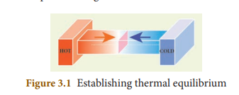
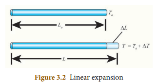
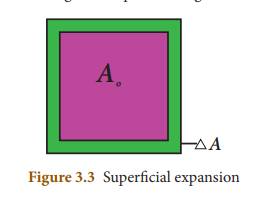
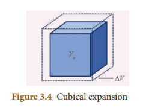
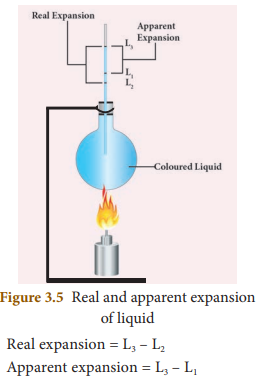
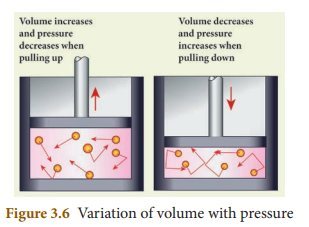

## INTRODUCTION 

&nbsp;&nbsp;&nbsp;&nbsp;&nbsp;&nbsp;&nbsp;Sun is the primary source of thermal energy for all living organisms. Thermal energy is the cause and temperature is the effect. All living organisms need a particular temperature for their survival. In the kitchen, a container with a steel bottom is placed on the induction stove. Do you know why? All of us have a common man’s understanding of thermal energy and temperature. But, in this chapter, you shall learn about thermal energy and temperature in a scientific manner. We shall also discuss about how thermal energy is transferred and the effects of thermal energy.

##  3.1 TEMPERATURE 

&nbsp;&nbsp;&nbsp;&nbsp;&nbsp;&nbsp;&nbsp;Temperature is defined as the degree of hotness of a body. The temperature is higher for a hotter body than for a colder body. It is also be defined as the property which determines whether a body is in equilibrium or not with the surroundings. (or average kinetic enegy of the molecules). Further, temperature is the property, which determines the direction of flow of heat. It is a scalar quantity. The SI unit of temperature is kelvin (K). There are other commonly used units of temperature such as degree celsius (°C) and degree fahrenheit (°F).

### <strong> 3.1.1 Absolute scale (kelvin scale) of temperature </strong>

&nbsp;&nbsp;&nbsp;&nbsp;&nbsp;&nbsp;&nbsp;&nbsp;&nbsp;&nbsp;The temperature measured in relation to absolute zero using the kelvin scale is known as absolute scale temperature. It is also known as the **thermodynamic temperature.** Each unit of the thermodynamic scale of temperature is defined as the fraction of 1/273.16th part of the thermodynamic temperature of the triple point of water. A temperature difference of 1°C is equal to that of 1K. Zero Kelvin is the absolute scale of temperature of the body.

&nbsp;&nbsp;&nbsp;&nbsp; The relation between the different types of scale of temperature:

$$ \text{Celsius and Kelvin:} K = C + 273, $$

$$ \text{Fahrenheit to Kelvin: } [K] = (F + 460) × \frac{5}{9} \ $$

$$  0 K = –273°C. $$

### <strong> 3.1.2 Thermal equilibrium </strong>

&nbsp;&nbsp;&nbsp;&nbsp;&nbsp;&nbsp;&nbsp; _Two or more physical systems or bodies are said to be in thermal equilibrium if there is no net flow of thermal energy between the systems._ Heat energy always flows from one body to the other due to a temperature difference between them. Thus, you can define thermal equilibrium in another way. If two bodies are said to be in thermal equilibrium, then, they will be at the same temperature. What will happen if two bodies at different temperatures are brought in contact with one other? There will be a transfer of heat energy from the hot body to the cold body until a thermal equilibrium is established between them. This is depicted in Figure 3.1.

  

&nbsp;&nbsp;&nbsp;&nbsp;&nbsp;&nbsp;&nbsp;When a cold body is placed in contact with a hot body, some thermal energy is transferred from the hot body to the cold body. As a result, there is some rise in the temperature of the cold body and decrease in the temperature of the hot body. This process will continue until these two bodies attain the same temperature.

##  3.2 THERMAL ENERGY 

&nbsp;&nbsp;&nbsp;&nbsp;&nbsp;&nbsp;&nbsp;If you leave a cup of hot milk on a table for some time, what happens? The hotness of the milk decreases after some time. Similarly, if you keep a bottle of cold water on a table, the water becomes warmer after some time. What do you infer from these observations? In the case of hot milk, there is a flow of energy from the cup of
milk to the environment. In the second case, the energy is transferred from the environment to the water bottle. This energy is termed as “thermal energy”.

&nbsp;&nbsp;&nbsp;&nbsp;&nbsp;&nbsp;&nbsp;When a hot object is in contact with another cold object, a form of energy flows from the hot object to the cold object, which is known as **thermal energy.** Thus, thermal energy is a form of energy which is transferred between any two bodies due to the difference in their temperatures. Thermal energy is also known as 'heat energy' or simply 'heat'.

&nbsp;&nbsp;&nbsp;&nbsp;&nbsp;&nbsp;&nbsp;Heat energy is the agent, which produces the sensation of warmth and makes bodies hot. The process in which heat energy flows from a body at a higher temperature to another object at lower temperature is known as **heating.** This process of transmission of heat may be done in any of the ways like conduction, convection or radiation. Heat is a scalar quantity. The SI unit of heat energy absorbed or evolved is joule (J) .

&nbsp;&nbsp;&nbsp;&nbsp;&nbsp;&nbsp;&nbsp;During the process of transferring heat energy, the body at lower temperature is heated while the body at higher temperature is cooled. Thus, sometimes, this process of transfer of heat energy is termed as 'cooling'. But, in most of the cases the term 'heating' is used instead of 'cooling'. When the thermal energy is transferred from one body to another, this results in the rise or lowering of the temperature of either of the bodies.

### <strong> 3.2.1 Characteristic features of heat energy transfer </strong>

1\. Heat always flows from a system at higher temperature to a system at lower temperature.

2\. The mass of a system is not altered when it is heated or cooled.

3\. For any exchange of heat, the heat gained by the cold system is equal to heat lost by the hot system.

**_Heat gained = Heat lost_**

### <strong> 3.2.2 Other units of Heat energy </strong>

&nbsp;&nbsp;&nbsp;&nbsp;&nbsp;&nbsp;&nbsp;Though the SI unit of heat energy is joule, there are some other commonly used units.

**Calorie:** *One calorie is defined as the amount of _heat energy required to rise the temperature of 1 gram of water through 1°C._*

**Kilocalorie:** *One kilocalorie is defined as the _amount of heat energy required to rise the temperature of 1 kilogram of water through 1°C._*

##  3.3 EFFECT OF HEAT ENERGY 

&nbsp;&nbsp;&nbsp;&nbsp;&nbsp;&nbsp;&nbsp;When a certain amount of heat energy is given to a substance, it will undergo one or more of the following changes:

• &nbsp;&nbsp; Temperature of the substance rises. 

• &nbsp;&nbsp; The substance may change its state from solid to liquid or from liquid to gas. 

•&nbsp;&nbsp;&nbsp; The substance will expand when heated.

&nbsp;&nbsp;&nbsp;&nbsp;&nbsp;&nbsp;The rise in temperature is in proportion to the amount of heat energy supplied. It also depends on the nature and mass of the substance. About the rise in temperature and the change of state, you have studied in previous classes. In the following section, we shall discuss about the expansion of substances due to heat.

### <strong> 3.3.1 Expansion of Substances </strong>

&nbsp;&nbsp;&nbsp;&nbsp;&nbsp;&nbsp;&nbsp;&nbsp;When heat energy is supplied to a body, there can be an increase in the dimension of the object. This change in the dimension due to rise in temperature is called thermal expansion of the object. The expansion of liquids (e.g. mercury) can be seen when a thermometer is placed in warm water. All forms of matter (solid, liquid and gas) undergo expansion on heating.

**a) Expansion in solids** 

&nbsp;&nbsp;&nbsp;&nbsp;&nbsp;&nbsp;&nbsp;&nbsp;When a solid is heated, the atoms gain energy and vibrate more vigorously. This results in the expansion of the solid. For a given change in temperature, the extent of expansion is smaller in solids than in liquids and gases. This is due to the rigid nature of solids.

&nbsp;&nbsp;&nbsp;&nbsp;&nbsp;&nbsp;The different types of expansion of solid are listed and explained below:

1. Linear expansion 
2. Superficial expansion 
3. Cubical expansion

**1\. Linear expansion:** 

&nbsp;&nbsp;&nbsp;&nbsp;&nbsp;&nbsp;When a body is heated or cooled, the length of the body changes due to change in its temperature. Then the expansion is said to be **linear or longitudinal expansion**.

&nbsp;&nbsp;&nbsp;&nbsp;&nbsp;&nbsp;The ratio of increase in length of the body per degree rise in temperature to its unit length is called as the **coefficient of linear expansion.** The SI unit of Coefficient of Linear expansion is K-1. The value of coefficient of linear expansion is different for different materials.

  

&nbsp;&nbsp;&nbsp;&nbsp;&nbsp;&nbsp; The equation relating the change in length and the change in temperature of a body is given below:

$$ \frac{\Delta L}{L_{0}} = \alpha_{L}\Delta T $$

∆ L - Change in length (Final length- Original length)

Lo - Original length

∆T - Change in temperature (Final temperature - Initial temperature)

αL - Coefficient of linear expansion.

**2\. Superficial expansion:**

&nbsp;&nbsp;&nbsp;&nbsp;&nbsp;&nbsp;If there is an increase in the area of a solid object due to heating, then the expansion is called **superficial or areal expansion.**

&nbsp;&nbsp;&nbsp;&nbsp;&nbsp;&nbsp;Superficial expansion is determined in terms of coefficient of superficial expansion. The ratio of increase in area of the body per degree rise in temperature to its unit area is called as **coefficient of superficial expansion.** Coefficient of superficial expansion is different for different materials. The SI unit of Coefficient of superficial expansion is K-1

&nbsp;&nbsp;&nbsp;&nbsp;&nbsp;&nbsp;The equation relating to the changein area and the change in temperature is given below:

  

$$ \frac{\Delta A}{A_{0}} = \alpha_{A}\Delta T $$

∆A - Change in area (Final area - Initial area)

Ao - Original area ∆T - Change in temperature (Final temperature - Initial temperature)

αA - Coefficient of superficial expansion.

**3\. Cubical expansion:**

 &nbsp;&nbsp;&nbsp;&nbsp;&nbsp;&nbsp;If there is an increase in the volume of a solid body due to heating, then the expansion is called **cubical or volumetric expansion.**

&nbsp;&nbsp;&nbsp;&nbsp;&nbsp;&nbsp;As in the cases of linear and areal expansion, cubical expansion is also expressed in terms of coefficient of cubical expansion. The ratio of increase in volume of the body per degree rise in temperature to its unit volume is called as **coefficient of cubical expansion.** This is also measured in K-1.

  

&nbsp;&nbsp;&nbsp;&nbsp;&nbsp;&nbsp;The equation relating to the change in volume and the change in temperature is given below:

$$ \frac{\Delta V}{V_{0}} = \alpha_{V}\Delta T $$

∆V - Change in volume(Final volume - Intial volume)

Vo - Original volume ∆T - Change in temperature (Final temperature - Initial temperature)

 αV - Coefficient of cubical expansion.

&nbsp;&nbsp;&nbsp;&nbsp;&nbsp;&nbsp;Different materials possess different coefficient of cubical expansion. Table 3.1 gives the coefficient of cubical expansion for some common materials.

### Table 3.1 Coefficient of cubical expansion of some materials

| S.No |Name of the material |Coefficient of cubic expansion (K–1) |
|------|------|------|
| 1 |Aluminium |7 × 10–5 |
| 2 |Brass |6 × 10–5 |
| 3 |Glass |2.5 × 10–5 |
| 4 |Water |20.7 × 10–5 |
| 5 |Mercur y |18.2 × 10–5 |

**b) Expansion in liquids and gases** 

&nbsp;&nbsp;&nbsp;&nbsp;&nbsp;&nbsp;&nbsp;&nbsp;When heated, the atoms in a liquid or gas gain energy and are forced further apart. The extent of expansion varies from substance to substance. For a given rise in temperature, a liquid will have more expansion than a solid and a gaseous substance has the highest expansion when compared with the other two. The coefficient of cubical expansion of liquid is independent of temperature whereas its value for gases depends on the temperature of gases.

&nbsp;&nbsp;&nbsp;&nbsp;&nbsp;&nbsp;When a liquid is heated, it is done by keeping the liquid in some container and supplying heat energy to the liquid through the container. The thermal energy supplied will be partly used in expanding the container and partly used in expanding the liquid. Thus, what we observe may not be the actual or real expansion of the liquid. Hence, for liquids, we can define real expansion and apparent expansion.

**1) Real expansion** 

&nbsp;&nbsp;&nbsp;&nbsp;&nbsp;&nbsp;&nbsp;If a liquid is heated directly without using any container, then the expansion that you observe is termed as **real expansion** of the liquid.

&nbsp;&nbsp;&nbsp;&nbsp;&nbsp;&nbsp;**Coefficient of real expansion** is defined as the ratio of the true rise in the volume of the liquid per degree rise in temperature to its unit volume. The SI unit of coefficient of real expansion is K–1.

 **2) Apparent expansion**

&nbsp;&nbsp;&nbsp;&nbsp;&nbsp;&nbsp;&nbsp;&nbsp;Heating a liquid without using a container is not possible. Thus, in practice, you can heat any liquid by pouring it in a container. A part of thermal energy is used in expanding the container and a part is used in expanding the liquid. Thus, what you observe is not the actual or real expansion of the liquid. The expansion of a liquid apparently observed without considering the expansion of the container is called the **apparent expansion** of the liquid.

&nbsp;&nbsp;&nbsp;&nbsp;&nbsp;&nbsp;&nbsp;**Coefficient of apparent expansion** is defined as the ratio of the apparent rise in the volume of the liquid per degree rise in temperature to its unit volume. The SI unit of coefficient of apparent expansion is K–1.

### <strong> 3.3.2 Experiment to measure real and apparent expansion of liquid </strong>

&nbsp;&nbsp;&nbsp;&nbsp;&nbsp;&nbsp;&nbsp;&nbsp;To start with, the liquid whose real and apparent expansion is to be determined is poured in a container up to a level. Mark this level as L1. Now, heat the container and the liquid using a burner as shown in the Figure 3.5. Initially, the container receives the thermal energy and it expands. As a result, the volume of the liquid appears to have reduced. Mark this reduced level of liquid as L2.

&nbsp;&nbsp;&nbsp;&nbsp;&nbsp;&nbsp;On further heating, the thermal energy supplied to the liquid through the container results in the expansion of the liquid. Hence, the level of liquid rises to L3. Now, the difference between the levels L1 and L3 is called as **apparent expansion,** and the difference between the levels L2 and L3 is called **real expansion.** The real expansion is always more than that of apparent expansion.

  

## <strong> 3.4 FUNDAMENTAL LAWS OF GASES
</strong>
&nbsp;&nbsp;&nbsp;&nbsp;&nbsp;&nbsp;The three fundamental laws which connect the relation between pressure, volume and temperature are as follows:

1) Boyle’s Law 
2) Charles's law 
3) Avogadro's law

##  3.4.1 Boyle’s law: 

&nbsp;&nbsp;&nbsp;&nbsp;&nbsp;&nbsp;_When the temperature of a gas is kept constant, the volume of a fixed mass of gas is inversely proportional to its pressure_. 

This is shown in Figure 3.6.

$$ P \, α \,1/V $$

  

&nbsp;&nbsp;&nbsp;&nbsp;&nbsp;&nbsp;In other words, for an invariable mass of a perfect gas, at constant temperature, the product of its pressure and volume is a constant.

$$ \text{(i.e) PV = constant} $$

## <strong> 3.4.2 Charles's law (The law of volume) </strong>

&nbsp;&nbsp;&nbsp;&nbsp;&nbsp;&nbsp;&nbsp;&nbsp;Charles’s law was formulated by a French scientist Jacques Charles. According to this law, _When the pressure of gas is kept constant, the volume of a gas is directly proportional to the temperature of the gas_.

$$ \text{V α T} $$

$$ \text{(or)} \frac{V}{T} = \text{constant} $$

## 3.4.3 Avogadro's law 

&nbsp;&nbsp;&nbsp;&nbsp;&nbsp;&nbsp;&nbsp;&nbsp;Avogadro's law states that at constant pressure and temperature, the volume of a gas is directly proportional to number of atoms or molecules present in it.

 $$ \text{i.e.\,  V α n} $$

$$ \text{(or)} \frac{V}{n} = \text{constant} $$

&nbsp;&nbsp;&nbsp;&nbsp;&nbsp;&nbsp;&nbsp;Avogadro’s number (NA) is the total number of atoms per mole of the substance. It is equal to 6.023 × 1023 /mol.

## <strong> 3.5 GASES </strong>

&nbsp;&nbsp;&nbsp;&nbsp;&nbsp;Gases are classified as real gases and ideal gases.

### <strong> 3.5.1 Real Gases </strong>

&nbsp;&nbsp;&nbsp;&nbsp;&nbsp;&nbsp;If the molecules or atoms of a gases interact with each other with a definite amount of intermolecular or inter atomic force of attraction, then the gases are said to be **real gases.** At very high temperature or low pressure, a real gases behaves as an ideal gases because in this condition there is no interatomic or intermolecular force of attraction.

### <strong> 3.5.2 Ideal Gases </strong>

&nbsp;&nbsp;&nbsp;&nbsp;&nbsp;&nbsp;If the atoms or molecules of a gas do not interact with each other, then the gas is said to be an **ideal gas** or a **perfect gas.**

&nbsp;&nbsp;&nbsp;&nbsp;&nbsp;&nbsp;Actually, in practice, no gas is ideal. The molecules of any gas will have a certain amount of interaction among them. But, these interactions are weaker when the pressure is low or the temperature is high because the interatomic or intermolecular forces of attraction are weak in ideal gas. Hence, a real gas at low pressure or high temperature can be termed as a perfect gas.

&nbsp;&nbsp;&nbsp;&nbsp;&nbsp;&nbsp;Ideal gases obey Boyle’s law, Charles’s law and Avogadro’s law. All these laws state the relationship between various properties of a gas such as pressure (P), volume (V), temperature (T) and number of atoms (n). In a given state of the gas, all these parameters will have a definite set of values. When there is a change in the state of the gas, any one or more of these parameters change its value. The above said laws relate these changes.

### <strong> 3.5.3 Ideal Gas Equation </strong>

&nbsp;&nbsp;&nbsp;&nbsp;&nbsp;&nbsp;The ideal gas equation is an equation, which relates all the properties of an ideal gas. An ideal gas obeys Boyle’s law and Charles’ law and Avogadro’s law. According to Boyle’s law,

$$ \text{PV = constant  (3.1)} $$ 

&nbsp;&nbsp;&nbsp;&nbsp;&nbsp;&nbsp;According to Charles’s law,

$$ \text{V/T = constant  (3.2)} $$

&nbsp;&nbsp;&nbsp;&nbsp;&nbsp;&nbsp;According to Avogadro’s law,

$$ \text {V/n = constant (3.3)} $$

&nbsp;&nbsp;&nbsp;&nbsp;&nbsp;&nbsp;After combining equations (3.1), (3.2) and (3.3), you can get the following equation.

$$ \text{PV/nT = constant (3.4)} $$

&nbsp;&nbsp;&nbsp;&nbsp;&nbsp;&nbsp;The above relation is called the combined law of gases. If you consider a gas, which contains µ moles of the gas, the number of atoms contained will be equal to µ times the Avogadro number, NA

 $$ i.e. \, \, \,  \, \, n = µN_A. (3.5) $$

&nbsp;&nbsp;&nbsp;&nbsp;&nbsp;&nbsp;Using equation (3.5), equation (3.4) can be written as

$$ PV/ µN_AT = constant $$

&nbsp;&nbsp;&nbsp;&nbsp;&nbsp;&nbsp;The value of the constant in the above equation is taken to be kB, which is called as **Boltzmann constant (1.38 × 10–23 JK–1).** Hence, we have the following equation:

 $$ PV/ µN_AT = k_B $$

$$ PV = µN_Ak_BT $$

&nbsp;&nbsp;&nbsp;&nbsp;&nbsp;&nbsp;Here, _µNAkB = R,_ which is termed as universal gas constant whose value is

$$ 8.31 \, \text{J mol}^{−1} \, \text{K}^{−1}. $$

$$ \text{PV = RT \, (3.6)} $$

&nbsp;&nbsp;&nbsp;&nbsp;&nbsp;&nbsp;Ideal gas equation is also called as _equation of state_ because it gives the relation between the state variables and it is used to describe the state of any gas. 

## Points to Remember

&#9670; The SI unit of heat energy absorbed or evolved is joule (J) 

&#9670; Heat always flows from a system at higher
temperature to a system at lower temperature. 

&#9670; **Temperature** is defined as the degree of hotness of a body. The SI unit of temperature is kelvin (K).

&#9670; All the substances will undergo one or more of the following changes when heated:

&nbsp;&nbsp;&nbsp;&nbsp;&nbsp;&nbsp;i) Temperature of the substance rises. 

&nbsp;&nbsp;&nbsp;&nbsp;&nbsp;&nbsp;ii) The substance may change state from solid to liquid or gas. 

&nbsp;&nbsp;&nbsp;&nbsp;&nbsp;&nbsp;iii) The substance will expand when heated.

&#9670; All forms of matter (solid, liquid and gas) undergo expansion on heating. 

&#9670; For a given rise in temperature, a liquid will have more expansion than a solid and a gaseous substance has the highest expansion than the other two. 

&#9670; If a liquid is heated directly without using any container, then the expansion that you observe is termed as **real expansion** of the liquid.

&#9670; The expansion of a liquid apparentl observed without considering the expansion of the container is called the **apparent expansion** of liquid. 

&#9670; For a given heat energy, the real expansion is always more than that of apparent expansion. ™ If the atoms or molecules of a gas do not interact with each other, then the gas is said to be an **ideal gas** or a **perfect gas**. ™ Ideal gas equation, also called as equation of state is PV = RT. Here, R is known as universal gas constant whose value is 8.31 J mol−1K−1

## <strong> Solved Problems </strong>

 ### <strong> Example 1 </strong>

&nbsp;&nbsp;&nbsp;&nbsp;&nbsp;&nbsp;&nbsp; A container whose capacity is 70 ml is filled with a liquid up to 50 ml. Then, the liquid in the container is heated. Initially, the level of the liquid falls from 50 ml to 48.5 ml. Then we heat more, the level of the liquid rises to 51.2 ml. Find the apparent and real expansion.

### <strong> Data: </strong>

Level of the liquid L1 = 50 ml

Level of the liquid L2 = 48.5 ml 

Level of the liquid L3 = 51.2 ml

&nbsp;&nbsp;&nbsp;&nbsp;&nbsp;&nbsp;Apparent expansion = L3 − L1

&nbsp;&nbsp;&nbsp;&nbsp;&nbsp;&nbsp;&nbsp;&nbsp;&nbsp;&nbsp;&nbsp;&nbsp;&nbsp;&nbsp;&nbsp;&nbsp;&nbsp;&nbsp;&nbsp;&nbsp;&nbsp;&nbsp;&nbsp;&nbsp;= 51.2 ml – 50 ml = 1.2ml 

&nbsp;&nbsp;&nbsp;&nbsp;&nbsp;&nbsp;&nbsp;&nbsp;&nbsp;&nbsp;&nbsp;&nbsp;&nbsp;&nbsp;&nbsp;Real expansion = L3 − L2

&nbsp;&nbsp;&nbsp;&nbsp;&nbsp;&nbsp;&nbsp;&nbsp;&nbsp;&nbsp;&nbsp;&nbsp;&nbsp;&nbsp;&nbsp;&nbsp;&nbsp;&nbsp;&nbsp;&nbsp;&nbsp;&nbsp;&nbsp;&nbsp;= 51.2 ml – 48.5ml = 2.7ml 

&nbsp;&nbsp;&nbsp;&nbsp;&nbsp;&nbsp;So, Real expansion > apparent expansion

### <strong> Example 2 </strong>
 
 &nbsp;&nbsp;&nbsp;&nbsp;&nbsp;&nbsp;&nbsp; Keeping the temperature as constant,a gas is compressed four times of its initial pressure. The volume of gas in the container changing from 20cc (V1cc) to V2cc. Find the final volume V2.

### <strong> Data: </strong> 

Initial pressure (P1)= P 

Final Pressure (P2) = 4P 

Initial volume (V1) = 20cc = 20cm3

Final volume (V2) = ? 

&nbsp;&nbsp;&nbsp;&nbsp;&nbsp;&nbsp;Using Boyle's Law, PV = constant

$$ P_1V_1 = P_2V_2 $$

$$ V_2 = \frac{P_1}{P_2} \times V_1 $$

$$ = \frac{P}{4P} \times 20 \, \text{cm}^3 $$

$$ V_2 = 5 \, \text{cm}^3 $$
