**Learning Objectives**

&#9670; After completing this lesson learners will be able to 

&#9670; infer different types of chemical reaction. 

&#x2756; acquire knowledge about combination reaction and skill to perform a combination reaction using quick lime and water. 

&#9670; identify and differentiate between reversible and irreversible reactions. 

&#9670; explain the reversible reaction occurring at the equilibrium state. 

&#9670; list and explain characteristics of equilibrium state. 

&#9670; define rate of reaction. 

&#9670; discuss the dependence of rate of reactions on concentration, temperature and catalyst. 

&#9670; define pH. 

&#9670; correlate the concentration of hydrogen ions and pH with neutral, acidic and basic nature of aqueous solutions. 

&#9670; recognize the importance of pH in everyday life. 

&#9670; explain the term ionic product of water.

**INTRODUCTION**

As you know from your earlier studies, a chemical reaction involves breaking of old chemical bonds and formation of new chemical bonds. This change may happen spontaneously or it may be facilitated by external forces or energy. Chemistry is all about chemical reactions. In your day to day life, you could observe many chemical reactions. A clear understanding of these reactions is essential in order to manipulate them for the sake of human life and environment. So, chemistry mainly focuses on chemical reactions. Let us try to find the answer for the following questions:

 &#9670; You need energy to play, walk, run or to perform various physical activities. Where do you get the energy from?

&#9670; How do plants grow and get their food? 

&#9670; How does a car move using fuel? ‹ Why does iron rust on its exposure to water or air?

&nbsp;&nbsp;&nbsp;&nbsp;&nbsp;&nbsp;&nbsp;&nbsp;&nbsp;You get energy from the digestion of the food you eat. Plants grow by absorbing nutrients from the Earth and get their food by photosynthesis. The combustion of a fuel makes the car to move. Oxidation of iron causes rusting. So, all these processes are chemical changes i.e. the materials, which undergo changes are converted into some other new materials. For example, by burning petrol, the hydrocarbons present in it are converted into carbon dioxide and water. In this chapter, let us discuss the nature and types of chemical reactions.

**What happens during a chemical reaction?**

&#9670; In a chemical reaction, the atoms of the reacting molecules or elements are rearranged to form new molecules.

&#9670; Old chemical bonds between atoms are broken and new chemical bonds are formed.

&#9670; Bond breaking absorbs energy whereas bond formation releases energy 

**How are chemical reactions represented?**

&nbsp;&nbsp;&nbsp;&nbsp;&nbsp;&nbsp;&nbsp;When methane reacts with oxygen, it forms carbon dioxide and water. How can you represent this reaction? It can be written as a word equation as shown below:

**Methane + Oxygen → Carbon dioxide + Water** 

&nbsp;&nbsp;&nbsp;&nbsp;&nbsp;&nbsp;&nbsp;But, this equation does not give the chemical composition of the reactants and products. So, to learn the characteristics of a chemical reaction, it is represented by a chemical equation. In the chemical equation, the chemicals of the reaction are represented by their chemical formulas.The compounds or elements, which undergo reactions (reactants) are shown to the left of an arrow and the compounds formed (products) are shown to the right of the arrow. The arrow indicates the direction of the reaction. Thus, the aforesaid reaction can be written as follows:

&nbsp;&nbsp;&nbsp;&nbsp;&nbsp;&nbsp;&nbsp;&nbsp;&nbsp;&nbsp;&nbsp;&nbsp;&nbsp;&nbsp;&nbsp;&nbsp;&nbsp;&nbsp;&nbsp;CH4 + O2 → CO2 + H2O

&nbsp;&nbsp;&nbsp;&nbsp;&nbsp;&nbsp;&nbsp;But, this is also an incomplete chemical equation. Because, the law of conservation of matter states that matter cannot be created or destroyed. You cannot create new atoms by a chemical reaction. In contrast, they are rearranged in different ways by a chemical reaction to form a new compound. So, in a chemical equation, the number of atoms of the reactants and that of the products must be equal. The number of hydrogen and oxygen atoms in the reactants and the products are not equal in the given equation. On balancing the number of atoms, the following equation can be obtained:

&nbsp;&nbsp;&nbsp;&nbsp;&nbsp;&nbsp;&nbsp;&nbsp;&nbsp;&nbsp;&nbsp;&nbsp;&nbsp;&nbsp;&nbsp;&nbsp;CH4 + 2O2 → CO2 + 2H2O

&nbsp;&nbsp;&nbsp;&nbsp;&nbsp;&nbsp;&nbsp;&nbsp;Further, the chemical equation provides information on the physical state of the substances and the conditions under which the reaction takes place.

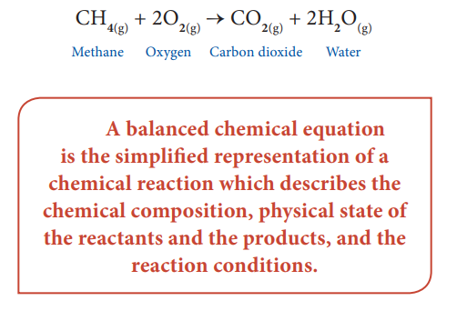

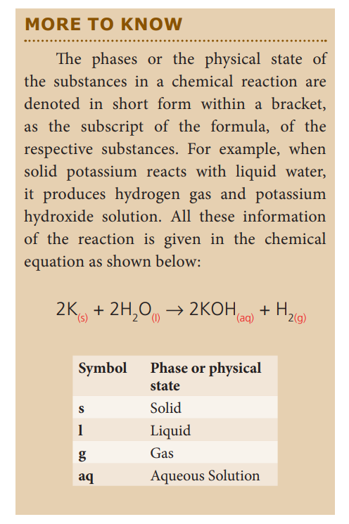

## 10.1 TYPES OF CHEMICAL REACTIONS

**Classification based on the nature of rearrangements of atoms**

&nbsp;&nbsp;&nbsp;&nbsp;&nbsp;&nbsp;So far you studied about a chemical reaction and how it can be described as a chemical equation. A large number of chemical reactions are taking place around us every day.Are they taking place in a similar way? No. Each reaction involves different kinds of atoms and hence the way they react also differs. Thus, based on the manner by which the atoms of the reactants are rearranged, chemical reactions are classified as follows.

**(a) Combination reactions** 

&nbsp;&nbsp;&nbsp;&nbsp;&nbsp;&nbsp;A combination reaction is a reaction in which two or more reactants combine to form a compound. It is otherwise called 'synthesis reaction' or 'composition reaction'. When a reactant ‘A’ combines with ‘B’, it forms the product ‘AB’. The generalised scheme of a combination reaction is given below:

  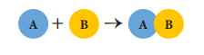

**Example:** Hydrogen gas combines with chlorine gas to form hydrogen chloride gas.

&nbsp;&nbsp;&nbsp;&nbsp;&nbsp;&nbsp;&nbsp;&nbsp;&nbsp;&nbsp;&nbsp;&nbsp;&nbsp;&nbsp;&nbsp;&nbsp;&nbsp;H2(g) + Cl2(g) → 2HCl(g)

&nbsp;&nbsp;&nbsp;&nbsp;&nbsp;&nbsp;Depending on the chemical nature of the reactants, there are **three classes** of combination reactions: 

&#x2756; Element + Element → Compound

&nbsp;&nbsp;&nbsp;&nbsp;&nbsp;&nbsp;&nbsp;&nbsp;&nbsp;&nbsp;In this type of combination reaction, two elements react with one other to form a compound. The reaction may take place between a metal and a non-metal or two non-metals.

**Example 1:** When solid sulphur reacts with oxygen, it produces sulphur dioxide. Here both the reactants are non-metals.

   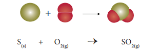

**Example 2:** Sodium, a silvery-white metal, combines with chlorine, a pale yellow green gas, to form sodium chloride, an edible compound. Here one of the reactants is a metal (sodium) and the other (chlorine) is a non- metal.

&nbsp;&nbsp;&nbsp;&nbsp;&nbsp;&nbsp;&nbsp;&nbsp;&nbsp;&nbsp;2Na(s) + Cl2(g) → 2NaCl(s)

**Test Yourself:** 

Identify the possible combination reactions between the metals and non-metals given in the following table and write their balanced chemical equations:

| **Metals** | **Non-metals** |
| ----------- | ----------- |
| **Na, K, Cs, Ca, Mg** | F, Cl, Br, I |

&#x2756; Compound + Element → Compound

 &nbsp;&nbsp;&nbsp;&nbsp;&nbsp;&nbsp;&nbsp;&nbsp;&nbsp;&nbsp;In this case, a compound reacts with an element to form a new compound. For instance, phosphorous trichloride reacts with chlorine gas and forms phosphorous pentachloride.

&nbsp;&nbsp;&nbsp;&nbsp;&nbsp;&nbsp;&nbsp;&nbsp;&nbsp;&nbsp;PCl3(I) + Cl2(g) → PCl5(s)

&#x2756; Compound + Compound → Compound 

&nbsp;&nbsp;&nbsp;&nbsp;&nbsp;&nbsp;&nbsp;&nbsp;&nbsp;&nbsp;It is a reaction between two compounds to form a new compound. In the following reaction, silicon dioxide reacts with calcium oxide to form calcium silicate.

&nbsp;&nbsp;&nbsp;&nbsp;&nbsp;&nbsp;&nbsp;&nbsp;&nbsp;&nbsp;SiO2(s) + CaO(s) → CaSiO3(s)

&nbsp;&nbsp;&nbsp;&nbsp;&nbsp;&nbsp;&nbsp;&nbsp;&nbsp;&nbsp;Most of the combination reactions are exothermic in nature. Because, they involve the formation of new bonds, which releases a huge amount of energy in the form of heat.

**(b) Decomposition reactions** 

&nbsp;&nbsp;&nbsp;&nbsp;&nbsp;&nbsp;&nbsp;&nbsp;&nbsp;&nbsp;In a decomposition reaction, a single compound splits into two or more simpler substances under suitable conditions. It is the opposite of the combination reaction. The **generalised scheme** of a decomposition reaction is given below:

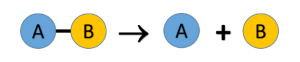

&nbsp;&nbsp;&nbsp;&nbsp;&nbsp;&nbsp;&nbsp;&nbsp;&nbsp;&nbsp;Breaking of bonds is the major phenomenon in a decomposition reaction and hence it requires energy to break the bonds, depending on the nature of the energy used in the decomposition reaction.

&nbsp;&nbsp;&nbsp;&nbsp;&nbsp;&nbsp;&nbsp;&nbsp;&nbsp;&nbsp;There are three main classes of decomposition reactions. They are 

(i) Thermal Decomposition Reactions 

(ii) Electrolytic Decomposition Reactions 

(iii) Photo Decomposition Reactions

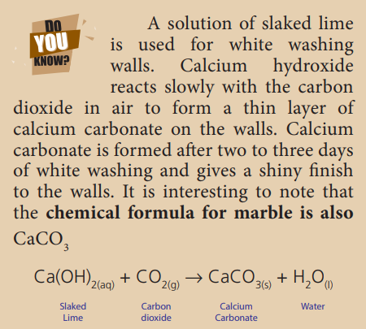

**(i) Thermal Decomposition Reactions**

 &nbsp;&nbsp;&nbsp;&nbsp;&nbsp;&nbsp;&nbsp;&nbsp;&nbsp;&nbsp;In this type of reaction, the reactant is decomposed by applying heat. For example, on heating mercury (II) oxide is decomposed into mercury metal and oxygen gas. As the molecule is dissociated by the absorption of heat, it is otherwise called **‘Thermolysis’**. It is a class of compound to element/element decomposition. i.e. a compound (HgO) is decomposed into two elements (Hg and Oxygen).

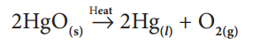

&nbsp;&nbsp;&nbsp;&nbsp;&nbsp;&nbsp;&nbsp;&nbsp;&nbsp;&nbsp;Similarly, when calcium carbonate is heated, it breaks down in to calcium oxide and carbon dioxide. It is a type of compound to compound/compound decomposition.

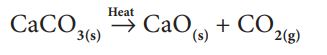

&nbsp;&nbsp;&nbsp;&nbsp;&nbsp;&nbsp;&nbsp;&nbsp;&nbsp;&nbsp;In thermal decomposition reaction, heat is supplied to break the bonds. Such reactions, in which heat is absorbed, are called **‘Endothermic reactions’**.

**(ii) Electrolytic Decomposition Reactions** 

&nbsp;&nbsp;&nbsp;&nbsp;&nbsp;&nbsp;&nbsp;&nbsp;&nbsp;&nbsp;In some of the decomposition reactions, electrical energy is used to bring about the reaction. For example, decomposition of sodium chloride occurs on passing electric current through its aqueous solution. Sodium chloride decomposes in to metallic sodium and chlorine gas. This process is termed as ‘Electrolysis’.

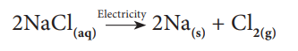

&nbsp;&nbsp;&nbsp;&nbsp;&nbsp;&nbsp;&nbsp;&nbsp;&nbsp;&nbsp;Here, a compound (NaCl) is converted into elements (Na and chlorine). So it is a type of compound to element/element decomposition.

**(iii) Photo Decomposition Reactions** 

Light is an another form of energy, which facilitates some of the decomposition reactions. For example, when silver bromide is exposed to light, it breaks down into silver metal and bromine gas. As the decomposition is caused by light, this kind of reaction is also called **‘Photolysis’.**

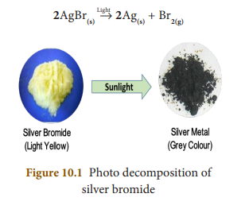

&nbsp;&nbsp;&nbsp;&nbsp;&nbsp;&nbsp;&nbsp;&nbsp;&nbsp;&nbsp;The yellow coloured silver bromide turns into grey coloured silver metal. It is also a compound to element/element decomposition.

**(c) Single Displacement Reactions** 

&nbsp;&nbsp;&nbsp;&nbsp;&nbsp;&nbsp;&nbsp;&nbsp;&nbsp;&nbsp;It is a reaction between an element and a compound. When they react, one of the elements of the compound-reactant is replaced by the element-reactant to form a new compound and an element. The general schematic representation of a single displacement reaction is given as:

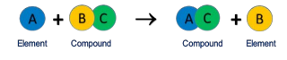

&nbsp;&nbsp;&nbsp;&nbsp;&nbsp;&nbsp;&nbsp;&nbsp;&nbsp;&nbsp;‘A’ displaces element ‘B’ from the compound ‘BC’ and hence a single displacement reaction occurs. If zinc metal is placed in hydrochloric acid, hydrogen gas is evolved. Here, hydrogen is displaced by zinc metal and zinc chloride is formed.

&nbsp;&nbsp;&nbsp;&nbsp;&nbsp;&nbsp;&nbsp;&nbsp;&nbsp;&nbsp;&nbsp;&nbsp;&nbsp;&nbsp;&nbsp;&nbsp;&nbsp;&nbsp;&nbsp;&nbsp;Zn(s) + 2HCl(aq) → ZnCl2(aq) + H2(g)

&nbsp;&nbsp;&nbsp;&nbsp;&nbsp;&nbsp;&nbsp;&nbsp;&nbsp;&nbsp;&nbsp;&nbsp;&nbsp;&nbsp;&nbsp;&nbsp;&nbsp;&nbsp;&nbsp;&nbsp;Fe(s) + CuSO4(aq) → FeSO4(aq) + Cu(s)

&nbsp;&nbsp;&nbsp;&nbsp;&nbsp;&nbsp;&nbsp;&nbsp;If an iron nail is placed in an aqueous solution of copper (II) sulphate as shown in Fig. 10.2, the iron displaces copper from its aqueous solution and the so formed copper deposits over the iron nail.

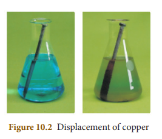

&nbsp;&nbsp;&nbsp;&nbsp;&nbsp;&nbsp;&nbsp;&nbsp;&nbsp;&nbsp;It is easy to propose so many reactions of this kind with different combinations of reactants. Will they all occur in practice? No. This is most easily demonstrated with halogens. Let us consider the following two reactions:

&nbsp;&nbsp;&nbsp;&nbsp;&nbsp;&nbsp;&nbsp;&nbsp;&nbsp;&nbsp;&nbsp;&nbsp;&nbsp;&nbsp;&nbsp;&nbsp;&nbsp;&nbsp;&nbsp;&nbsp;2NaCl**(aq)** + F**2(g)** → 2NaF**(aq)** + Cl**2(g)**

&nbsp;&nbsp;&nbsp;&nbsp;&nbsp;&nbsp;&nbsp;&nbsp;&nbsp;&nbsp;&nbsp;&nbsp;&nbsp;&nbsp;&nbsp;&nbsp;&nbsp;&nbsp;&nbsp;&nbsp;2NaF**(aq)** + Cl**2(g)** → 2NaCl**(aq)** + F**2(g)**

&nbsp;&nbsp;&nbsp;&nbsp;&nbsp;&nbsp;&nbsp;&nbsp;&nbsp;&nbsp;The first reaction involves the displacement of chlorine from NaCl, by fluorine. In the second reaction, chlorine displaces fluorine from NaF. Out of these two, the second reaction will not occur. Because, fluorine is more active than chlorine and occupies the upper position in the periodic table. So, in displacement reactions, the activity of the elements and their relative position in the periodic table are the key factors to determine the feasibility of the reactions. More active elements readily displace less active elements from their aqueous solution.

&nbsp;&nbsp;&nbsp;&nbsp;&nbsp;&nbsp;&nbsp;&nbsp;&nbsp;&nbsp;The activity series of some elements is given below:

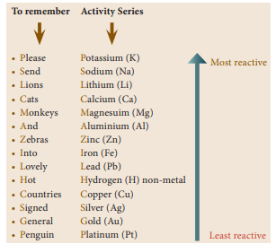

&nbsp;&nbsp;&nbsp;&nbsp;&nbsp;&nbsp;&nbsp;&nbsp;&nbsp;&nbsp;By referring the activity series, try to answer the following questions:

Which of the metals displaces hydrogen gas from hydrochloric acid? Silver or Zinc. Give the chemical equation of the reaction and Justify your answer.

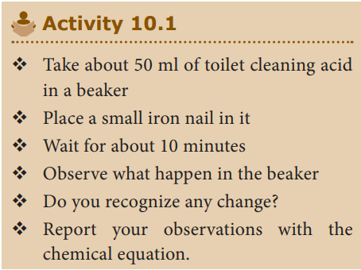

**(d) Double Displacement Reactions** 

&nbsp;&nbsp;&nbsp;&nbsp;&nbsp;&nbsp;&nbsp;&nbsp;&nbsp;&nbsp;When two compounds react, if their ions are interchanged, then the reaction is called double displacement reaction. The ion of one compound is replaced by the ion of the another compound. Ions of identical charges are only interchanged, i.e., a cation can be replaced by other cations. This reaction is also called **‘Metathesis Reaction’**. The schematic representation of a double displacement reaction is given below:

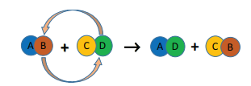

&nbsp;&nbsp;&nbsp;&nbsp;&nbsp;&nbsp;&nbsp;&nbsp;&nbsp;&nbsp;In a double displacement reaction either one of the products must be either a precipitate or water. By this way, there are major classes of double displacement reactions. They are:

(i) Precipitation Reactions 

(ii) Neutralization Reactions

**(i) Precipitation Reactions** 

&nbsp;&nbsp;&nbsp;&nbsp;&nbsp;&nbsp;&nbsp;When aqueous solutions of two compounds are mixed, if they react to form an insoluble compound and a soluble compound, then it is called precipitation reaction. Because the insoluble compound, formed as one of the products, is a precipitate and hence the reaction is so called.

Table 10.1 Differences between combination and decomposition reactions

| COMBINATION REACTIONS |DECOMPOSITION REACTIONS |
|------|------|
| One or more reactants combine to form a single product |A single reactant is decomposed to form one or moreproducts |
| Energy is released |Energy is absorbed |
| Elements or compounds may be the reactants |Single compound is the reactant |

&nbsp;&nbsp;&nbsp;&nbsp;&nbsp;&nbsp;&nbsp;When the clear aqueous solutions of potassium iodide and lead (II) nitrate are mixed, a double displacement reaction takes place between them.

&nbsp;&nbsp;&nbsp;&nbsp;&nbsp;&nbsp;&nbsp;&nbsp;&nbsp;&nbsp;Pb(NO**3**)**2(aq)** + 2KI**(aq)** → PbI**2(s)**↓ + 2KNO**3(aq)**

&nbsp;&nbsp;&nbsp;&nbsp;&nbsp;&nbsp;Potassium and lead displace or replace one other and form a yellow precipitate of lead (II) iodide as shown in Fig. 10.3.

&nbsp;&nbsp;&nbsp;&nbsp;&nbsp;&nbsp;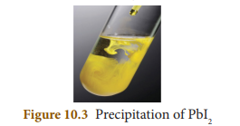
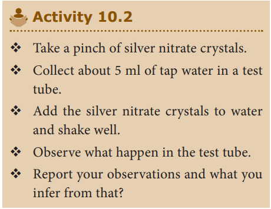

**(ii) Neutralization Reactions** 

&nbsp;&nbsp;&nbsp;&nbsp;&nbsp;&nbsp;&nbsp;&nbsp;&nbsp;&nbsp;In your lower classes, you have learned the reaction between an acid and a base. It is another type of displacement reaction in which the acid reacts with the base to form a salt and water. It is called 'neutralization reaction' as both acid and base neutralize each other.

&nbsp;&nbsp;&nbsp;&nbsp;&nbsp;&nbsp;&nbsp;&nbsp;&nbsp;&nbsp;Reaction of sodium hydroxide with hydrochloric acid is a typical neutralization reaction. Here, sodium replaces hydrogen from hydrochloric acid forming sodium chloride, a neutral soluble salt.

&nbsp;&nbsp;&nbsp;&nbsp;&nbsp;&nbsp;&nbsp;&nbsp;&nbsp;&nbsp;&nbsp;&nbsp;&nbsp;&nbsp;&nbsp;&nbsp;&nbsp;&nbsp;&nbsp;&nbsp;NaOH**(aq)** + HCl**(aq)** → NaCl**(aq)** + H**2**O**(l)**

&nbsp;&nbsp;&nbsp;&nbsp;&nbsp;&nbsp;&nbsp;&nbsp;&nbsp;&nbsp;Similarly, when ammonium hydroxide reacts with nitric acid, it forms ammonium nitrate and water.

&nbsp;&nbsp;&nbsp;&nbsp;&nbsp;&nbsp;&nbsp;&nbsp;&nbsp;&nbsp;&nbsp;&nbsp;&nbsp;&nbsp;&nbsp;&nbsp;&nbsp;&nbsp;&nbsp;&nbsp;HNO**3(aq)** + NH**4**OH**(aq)** → NH**4**NO**3(aq)** + H**2**O**(l)**

**(e) Combustion Reactions**

 &nbsp;&nbsp;&nbsp;&nbsp;&nbsp;&nbsp;&nbsp;&nbsp;&nbsp;A combustion reaction is one in which
the reactant rapidly combines with oxygen to form one or more oxides and energy (heat). So in combustion reactions, one of the reactants must be oxygen. Combustion reactions are majorly used as heat energy sources in many of our day to day activities. For instance, we use LPG gas for domestic cooking purposes. We get heat and flame from LPG gas by its combustion reaction of its constituent gases. LPG is a mixture of hydrocarbon gases like propane, butane, propylene, etc. All these hydrocarbons burn with oxygen to form carbon dioxide and water.

&nbsp;&nbsp;&nbsp;&nbsp;&nbsp;&nbsp;Since heat is evolved, it is an exothermic reaction. As oxygen is added, it is also an oxidation. So, combustion may be called as an exothermic oxidation. If a flame is formed (as shown in Fig. 10.4), then it is called **burning**.

&nbsp;&nbsp;&nbsp;&nbsp;&nbsp;&nbsp;&nbsp;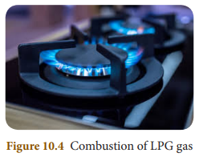

&nbsp;&nbsp;&nbsp;&nbsp;&nbsp;&nbsp;&nbsp;&nbsp;Which of the following is a combustion? 

(i) Digestion of Food 

(ii) Rusting of iron

&nbsp;&nbsp;&nbsp;&nbsp;Many thousands of reactions fall under these five categories and further you will learn in detail about these reactions in your higher classes.

### 10.1.2 Classification based on the direction of the reaction 

&nbsp;&nbsp;&nbsp;&nbsp;&nbsp;&nbsp;&nbsp;&nbsp;&nbsp;&nbsp;You know that innumerable changes occur every day around us. Are all they permanent? For example, liquid water freezes into ice, but then ice melts into liquid water. In other words, freezing is reversed. So, it is not a permanent change. Moreover, it is a physical change. Physical changes can be reversed easily. Can chemical changes be reversed? Can the products be converted into reactants? Let us consider the burning of a wood. The carbon compounds present in the wood are burnt into carbon dioxide gas and water. Can we get back the wood immediately from carbon dioxide and water? We cannot. So, it is a permanent change. In most of the cases, we cannot. But, some chemical reactions can be reversed. Our mobile phone gets energy from its lithium ion battery by chemical reactions. It is called discharging. On recharging the mobile, these chemical reactions are reversed. Thus, chemical reactions may be reversed under suitable conditions. Hence, they are grouped into two categories such as reversible and irreversible reactions.

**Reversible Reactions** 

&nbsp;&nbsp;&nbsp;&nbsp;&nbsp;&nbsp;&nbsp;&nbsp;A reversible reaction is a reaction in which the products can be converted back to the reactants. A reversible reaction is represented by a double arrow with their heads in the direction opposite to each other. Thus, a reversible reaction can be represented by the following equation:

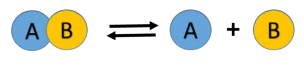

&nbsp;&nbsp;&nbsp;&nbsp;&nbsp;&nbsp;&nbsp;&nbsp;&nbsp;&nbsp;&nbsp;&nbsp;&nbsp;&nbsp;&nbsp;**Explanation:** Here, the compound ‘AB’ undergoes decomposition to form the products ‘A’ and ‘B’. It is the **forward reaction**. As soon as the products are formed, they combine together to form ‘AB’. It is the **backward reaction**. So, the reaction takes place in both the directions. Do you think then that no products are formed in the aforesaid reaction? If you think so, you are wrong. Because, even though the reaction takes place in both the directions, at the initial stage the rates (speed) of these reactions are not equal. Consider the following decomposition reaction of phosphorous pentachloride into phosphorous trichloride and chlorine.

&nbsp;&nbsp;&nbsp;&nbsp;&nbsp;&nbsp;&nbsp;&nbsp;&nbsp;&nbsp;&nbsp;&nbsp;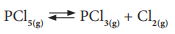

&nbsp;&nbsp;&nbsp;&nbsp;&nbsp;&nbsp;&nbsp;The forward reaction is the decomposition of PCl5 and the backward reaction is the combination of PCl3 and Cl2. Initially, the forward reaction proceeds faster than the backward reaction. After sometimes, the speed of both the reactions become equal. So, PCl5 cannot be completely converted into the products as the reaction is reversed. It is a reversible reaction. The actual measurements of the given reaction show that the reaction is at equilibrium, but the amount of PCl5 is more than that of PCl3 and Cl2.

&nbsp;&nbsp;&nbsp;&nbsp;&nbsp;&nbsp;&nbsp;&nbsp;&nbsp;&nbsp;&nbsp;&nbsp;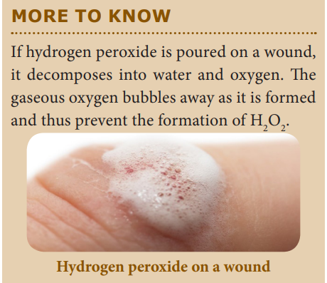

&nbsp;&nbsp;&nbsp;&nbsp;&nbsp;Thus, more amount of products can be obtained in a reversible reaction by the periodical removal of one of the products or the periodical addition of the reactants.

&nbsp;&nbsp;&nbsp;&nbsp;&nbsp;&nbsp;&nbsp;&nbsp;&nbsp;&nbsp;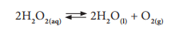

**Irreversible Reactions** 

&nbsp;&nbsp;&nbsp;&nbsp;&nbsp;&nbsp;The reaction that cannot be reversed is called irreversible reaction. The irreversible reactions are unidirectional, i.e., they take place only in the forward direction. Consider the combustion of coal into carbon dioxide and water.

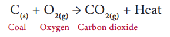

&nbsp;&nbsp;&nbsp;&nbsp;&nbsp;&nbsp;In this reaction, solid coal burns with oxygen and gets converted into carbon dioxide gas and water. As the product is a gas, as soon as it is formed it escapes out of the reaction container. It is extremely hard to decompose a gas into a solid. Thus, the backward reaction is not possible in this case. So, it is an irreversible reaction. Table 10.2 provides the main differences between a reversible and an irreversible reaction:

**Table 10.2 Differences between reversible and** irreversible reactions

REVERSIBLE REACTION| IRREVERSIBLE REACTION|
|------|------|
|It can be reversed under suitable conditions.|It cannot be reversed.|
|Both forward and backward reactions take place simultaneously.| It is unidirectional. It proceeds only in forward direction.|
|It attains equilibrium.|Equilibrium is not attained.|
|The reactants cannot be converted completely into products.|The reactants can be completely converted into products.|
|It is relatively slow. |It is fast.|

&nbsp;&nbsp;&nbsp;&nbsp;&nbsp;&nbsp;&nbsp;&nbsp;You will learn more about these reactions in your higher classes.

## 10.2 RATE OF A CHEMICAL REACTION

&nbsp;&nbsp;&nbsp;&nbsp;&nbsp;&nbsp;&nbsp;&nbsp;So far we discussed various types of chemical reactions and the nature of the reactants and products. Let us consider the following reactions:

&#9670; Rusting of iron

&#9670; Digestion of food

&#9670; Burning of petrol

&#9670; Weathering of rock

&nbsp;&nbsp;&nbsp;&nbsp;&nbsp;&nbsp;&nbsp;&nbsp;&nbsp;&nbsp;How fast is each reaction? Rank them from the slowest to fastest. How will you determine, which is the fastest and which is the slowest? One of the ways to find out how fast a reaction is as follows: Measure the amount of reactants or products before and after a specific period of time. For example, let us assume that 100 g of a substance ‘A’ undergoes a reaction and after an hour 50 g of ‘A’ is left.

&nbsp;&nbsp;&nbsp;&nbsp;&nbsp;&nbsp;&nbsp;&nbsp;&nbsp;&nbsp;&nbsp;&nbsp;&nbsp;&nbsp;&nbsp;&nbsp;&nbsp;&nbsp;&nbsp;&nbsp;&nbsp;&nbsp;A → Product 

&nbsp;&nbsp;&nbsp;&nbsp;&nbsp;In another instance, 100 g of substance ‘C’ undergoes a reaction and after an hour, 20 g of ‘C’ is left.

&nbsp;&nbsp;&nbsp;&nbsp;&nbsp;&nbsp;&nbsp;&nbsp;&nbsp;&nbsp;&nbsp;&nbsp;&nbsp;&nbsp;&nbsp;&nbsp;&nbsp;&nbsp;&nbsp;&nbsp;&nbsp;C → Product 

&nbsp;&nbsp;&nbsp;&nbsp;&nbsp;Can you say which is the faster reaction? In the first reaction, 50 g of the reactant (A) is converted into products whereas in the second reaction 80 g of the reactant is converted into products in one hour. So, the second reaction is faster. This measurement is called ‘the reaction rate’.

&nbsp;&nbsp;&nbsp;&nbsp;&nbsp;&nbsp;&nbsp;“Rate of a reaction is the change in the amount or concentration of any one of the reactants or products per unit time”.

&nbsp;&nbsp;&nbsp;&nbsp;&nbsp;&nbsp;Consider the following reaction 

&nbsp;&nbsp;&nbsp;&nbsp;&nbsp;&nbsp;&nbsp;&nbsp;&nbsp;&nbsp;&nbsp;&nbsp;&nbsp;&nbsp;&nbsp;&nbsp;&nbsp;&nbsp;&nbsp;&nbsp;&nbsp;&nbsp;&nbsp;&nbsp;&nbsp;&nbsp;A → B

&nbsp;&nbsp;&nbsp;&nbsp;&nbsp;The rate of this reaction is given by

$$ \text{Rate} = -\frac{d[A]}{dt} = +\frac{d[B]}{dt} $$

&nbsp;&nbsp;&nbsp;&nbsp;&nbsp;&nbsp;&nbsp;Where, 

&nbsp;&nbsp;&nbsp;&nbsp;&nbsp;&nbsp;&nbsp;\[A\] – Concentration of A 

&nbsp;&nbsp;&nbsp;&nbsp;&nbsp;&nbsp;&nbsp;\[B\] – Concentration of B

&nbsp;&nbsp;&nbsp;&nbsp;&nbsp;&nbsp;&nbsp;The negative sign indicates the decrease in the concentration of A with time.

&nbsp;&nbsp;&nbsp;&nbsp;&nbsp;&nbsp;&nbsp;The postive sign indicates the increase in the concentration of B with time. 

**Note:** ‘\[ \]’ represents the concentration, ‘d’ represents the infinitesimal change in the concentration.

 **Why is reaction rate important?**

&nbsp;&nbsp;&nbsp;&nbsp;&nbsp;&nbsp;Faster the reaction, more will be the amount of the product in a specified time. So, the rate of a reaction is important for a chemist for designing a process to get a good yield of a product. Rate of reaction is also important for a food processor who hopes to slow down the reactions that cause food to spoil.

### 10.2.1 Factors influencing the rate of a reaction

&nbsp;&nbsp;&nbsp;&nbsp;&nbsp;&nbsp;Can the rate of a reaction be changed? The rate of a reaction can be changed. For example, iron gets rusted faster in an acid than in water. Important factors that affect rate of a reaction are 

(i) Nature of the reactants 

(ii) Concentration of the reactants 

(iii) Temperature 

(iv) Catalyst 

(v) Pressure 

(vi) Surface area of the reactants

**(i) Nature of the reactants** The reaction of sodium with hydrochloric acid is faster than that with acetic acid. Do you know why? Hydrochloric acid is a stronger acid than acetic acid and thus more reactive. So, the nature of the reactants influence the reaction rate.

&nbsp;&nbsp;&nbsp;&nbsp;&nbsp;&nbsp;2Na**(s)**+ 2HCl**(aq)** → 2NaCl**(aq)** + H**2 (g)** (fast) 

2Na**(s)** + 2CH**3**COOH**(aq)** → 2CH**3**COONa**(aq)** + H**2(g)**(slow)

**(ii) Concentration of the reactants** 

&nbsp;&nbsp;&nbsp;&nbsp;&nbsp;&nbsp;&nbsp;Changing the amount of the reactants also increases the reaction rate. The amount of the substance present in a certain volume of the solution is called **‘concentration’**. More the concentration, more particles per volume exist in it and hence faster the reaction. Granulated zinc reacts faster with 2M hydrochloric acid than 1M hydrochloric acid. 

**(iii) Temperature**

&nbsp;&nbsp;&nbsp;&nbsp;&nbsp;&nbsp;Most of the reactions go faster at higher temperature. Because adding heat to the reactants provides energy to break more bonds and thus speed up the reaction. Calcium carbonate reacts slowly with hydrochloric acid at room temperature. When the reaction mixture is heated the reaction rate increases.

**(iv) Pressure** 

&nbsp;&nbsp;&nbsp;&nbsp;&nbsp;&nbsp;&nbsp;If the reactants are gases, increasing their pressure increases the reaction rate. This is because, on increasing the pressure the reacting particles come closer and collide frequently. 

**(v) Catalyst**

&nbsp;&nbsp;&nbsp;&nbsp;&nbsp;&nbsp;&nbsp;A catalyst is a substance which increases the reaction rate without being consumed in the reaction. In certain reactions, adding a substance as catalyst speeds up the reaction. For example, on heating potassium chlorate, it decomposes into potassium chloride and oxygen gas, but at a slower rate. If manganese dioxide is added, it increases the reaction rate.

**(vi) Surface area of the reactants** 

&nbsp;&nbsp;&nbsp;&nbsp;&nbsp;&nbsp;&nbsp;When solid reactants are involve in a reaction, their powdered form reacts more readily. For example, powdered calcium carbonate reacts more readily with hydrochloric acid than marble chips. Because, powdering of the reactants increases the surface area and more energy is available on collision of the reactant particles. Thus, the reaction rate is increased.

&nbsp;&nbsp;&nbsp;&nbsp;&nbsp;&nbsp;&nbsp;You will study more about reaction rate in you higher classes.

## 10.3 STATE OF EQUILIBRIUM

&nbsp;&nbsp;&nbsp;&nbsp;&nbsp;&nbsp;&nbsp;In a reversible reaction, both forward and backward reactions take place simultaneously. When the rate of the forward reaction becomes equal to the rate of backward reaction, then no more product is formed. This stage of the reaction is called ‘equilibrium state’. After this stage, no net change in the reaction can occur and hence in the amount of the reactants and products. Since this equilibrium is attained in a chemical reaction, it is called ‘Chemical Equilibrium’. **Chemical Equilibrium: It is state of a reversible chemical reaction in which no change in the amount of the reactants and products takes place. At equilibrium,**

**Rate of forward reaction = Rate of &nbsp;&nbsp;&nbsp;&nbsp;&nbsp;&nbsp;&nbsp;&nbsp;&nbsp;&nbsp;&nbsp;&nbsp;&nbsp;&nbsp;&nbsp;&nbsp;&nbsp;&nbsp;&nbsp;&nbsp;&nbsp;&nbsp;&nbsp;&nbsp;&nbsp;&nbsp;&nbsp;&nbsp;&nbsp;&nbsp;&nbsp;&nbsp;&nbsp;&nbsp;&nbsp;&nbsp;&nbsp;&nbsp;&nbsp;&nbsp;&nbsp;&nbsp;&nbsp;backward reaction**

&nbsp;&nbsp;&nbsp;&nbsp;&nbsp;&nbsp;&nbsp;**Explanation:** Initially the rate of the forward reaction is greater than the rate of the backward reaction. However, during the course of reaction, the concentration of the reactants decreases and the concentration of the products increases. Since the rate of a reaction is directly proportional to the concentration, the rate of the forward reaction decreases with time, whereas the rate of the backward reaction increases.

&nbsp;&nbsp;&nbsp;&nbsp;&nbsp;&nbsp;At a certain stage, both the rates become equal. From this point onwards, there will be no change in the concentrations of both the reactants and the products with time. This state is called as equilibrium state.

&nbsp;&nbsp;&nbsp;&nbsp;&nbsp;&nbsp;Let us consider the decomposition of calcium carbonate into lime and carbon dioxide. It is a reversible reaction. The speed of each reaction can be determined by how quickly the reactant disappears. If the reaction is carried out in a closed vessel, it reaches a chemical equilibrium. At this stage,

  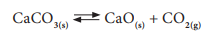

The rate of decomposition of CaCO3 = The rate of combination of CaO and CO2

&nbsp;&nbsp;&nbsp;&nbsp;&nbsp;Not only chemical changes, physical changes also may attain equilibrium. When water kept in a closed vessel evaporates, it forms water vapour. No water vapour escapes out of the container as the process takes place in a closed vessel. So, it builds up the vapour pressure in the container. At one time, the water vapour condenses back into liquid water and when the rate of this condensation becomes equal to that of vapourisation, the process attains equilibrium.

&nbsp;&nbsp;&nbsp;&nbsp;&nbsp;At this stage, the volume of the liquid and gaseous phases remain constant. Since it is a physical change, the equilibrium attained is called **‘Physical Equilibrium’.** Physical equilibrium is a state of a physical change at which the volume of all the phases remain unchanged. 

  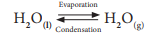

  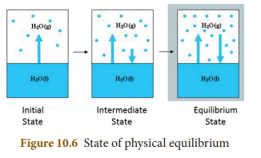

**Characteristics of equilibrium** 

&#9670; In a chemical equilibrium, the rates of
the forward and backward reactions are equal.

&#9670; The observable properties such as pressure, concentration, colour, density, viscosity etc., of the system remain unchanged with time.

&#9670; The chemical equilibrium is a dynamic equilibrium, because both the forward and backward reactions continue to occur even though it appears static externally.

&#9670; In physical equilibrium, the volume of all the phases remain constant.

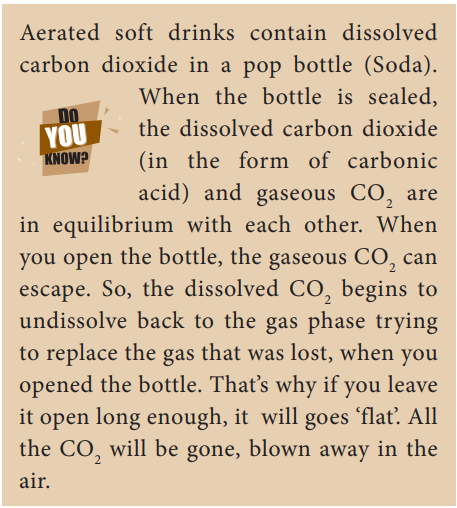

## 10.4 IONIC PRODUCT OF WATER

&nbsp;&nbsp;&nbsp;&nbsp;&nbsp;&nbsp;Although pure water is often considered as a non-conductor of electricity, precise measurements show that it conducts electricity to a little extent. This conductivity of water has resulted from the self-ionisation of water. Self- ionisation or auto ionisation is a reaction in which two like molecules react to give ions. In the process of ionisation of water, a proton from one water molecule is transferred to another water molecule leaving behind an OH— ion. The proton gets dissolved in water forming the hydronium ion as shown in the following equation:

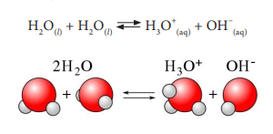

&nbsp;&nbsp;&nbsp;&nbsp;&nbsp;&nbsp;The hydronium ion formed is a strong acid and the hydroxyl ion is a strong base. So as fast as they are formed, they react again to produce water. Thus, it is a reversible reaction and attains equilibrium very quickly. So, the extent of ionisation is very little and the concentration of the ions produced is also very less. The product of the concentration of the hydronium ion and the hydroxyl ion is called **‘ionic product of water’**. It is denoted as **‘Kw’**. It is mathematically expressed as follows:

&nbsp;&nbsp;&nbsp;&nbsp;&nbsp;&nbsp;&nbsp;&nbsp;&nbsp;&nbsp;&nbsp;&nbsp;&nbsp;&nbsp;&nbsp;&nbsp;&nbsp;&nbsp;&nbsp;&nbsp;&nbsp;Kw = \[H3O**+**\] \[OH-\]

&nbsp;&nbsp;&nbsp;&nbsp;&nbsp;&nbsp;&nbsp;&nbsp;\[H3O+\] may be simply written as \[H+\].

Thus the ionic product of water may also be expressed as

&nbsp;&nbsp;&nbsp;&nbsp;&nbsp;&nbsp;&nbsp;&nbsp;&nbsp;&nbsp;&nbsp;&nbsp;&nbsp;&nbsp;&nbsp;&nbsp;&nbsp;&nbsp;&nbsp;&nbsp;&nbsp;Kw = \[H+\] \[OH-\]

&nbsp;&nbsp;&nbsp;&nbsp;&nbsp;&nbsp;Its unit is mol2 dm-6. At 25° C, its value is 1.00 × 10-14.

## 10.5 pH SCALE

&nbsp;&nbsp;&nbsp;&nbsp;&nbsp;&nbsp;&nbsp;&nbsp;All the aqueous solutions may contain hydrogen and hydroxyl ions due to self- ionisation of water. In addition to this ionisation, substances dissolved in water also may produce hydrogen ions or hydroxyl ions. The concentration of these ions decides whether the solution is acidic or basic. pH scale is a scale for measuring the hydrogen ion concentration in a solution. The 'p' in pH stands for ‘Potenz’ in German meaning 'power'. pH notation was devised by the Danish biochemist Sorensen in 1909. pH scale is a set of numbers from 0 to 14 which is used to indicate whether a solution is acidic, basic or neutral. 

✓ Acids have pH less than 7 

✓ Bases have pH greater than 7 

✓ A neutral solution has pH equal to 7

**The pH is the negative logarithm of the hydrogen ion concentration**

&nbsp;&nbsp;&nbsp;&nbsp;&nbsp;&nbsp;&nbsp;&nbsp;&nbsp;&nbsp;&nbsp;&nbsp;&nbsp;&nbsp;&nbsp;&nbsp;&nbsp;&nbsp;&nbsp;&nbsp;&nbsp;**i.e pH = –log10\[H+\]**

| COMMON ACIDS          | pH  | COMMON BASES            | pH  |
|----------------|-----|-------------------------|-----|
| HCl (4%)                | 0   | Blood plasma            | 7.4 |
| Stomach acid             | 1   | Egg white               | 8   |
| Lemon juice              | 2   | Sea water               | 8   |
| Vinegar                  | 3   | Baking soda             | 9   |
| Oranges             | 3.5   | Antacids                | 10|
| Soda, grapes             |4   | Ammonia Water                | 11|
| Sour milk                | 4.5 | Lime Water                | 12  |
| Fresh milk             | 5 | Drain cleaner           | 13  |
| Human saliva                 | 6-8 | Caustic soda 4% (NaOH)               | 14 |
| Pure water               | 7   | Milk of magnesia              | 10  |
| Tomato juice             | 4.2 | Coffee              | 5.6   |
| 

**How can we measure the pH of a given solution using pH Paper**

&nbsp;&nbsp;&nbsp;&nbsp;&nbsp;The pH of a solution can be determined by using a universal indicator. It contains a mixture of dyes. It comes in the form of a solution or a pH paper.

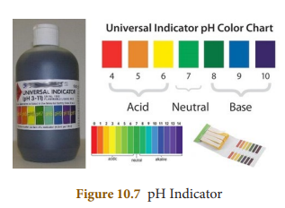

&nbsp;&nbsp;&nbsp;&nbsp;&nbsp;&nbsp;A more common method of measuring pH in a school laboratory is by using the pH paper. A pH paper contains a mixture of indicators. It shows a specific colour at a given pH. A colour guide is provided with the bottle of the indicator or the strips of paper impregnated with it, which are called pH paper strips. The test solution is tested with a drop of the universal indicator, or a drop of the test solution is put on the pH paper. The colour of the solution on the pH paper is compared with the colour chart and the pH value is read from it. The pH values thus obtained are only approximate values.

## 10.6 ROLE OF pH IN EVERYDAY LIFE

**Are plants and animals pH sensitive?** 

&nbsp;&nbsp;&nbsp;&nbsp;&nbsp;Our body works within the pH range of 7.0 to 7.8. Living organisms can survive only in a narrow range of pH change. Different body fluids have different pH values. For example, pH of blood is ranging from 7.35 to 7.45. Any increase or decrease in this value leads to diseases. The ideal pH for blood is 7.4.

**pH in our digestive system** 

&nbsp;&nbsp;&nbsp;&nbsp;&nbsp;It is very interesting to note that our stomach produces hydrochloric acid. It helps in the digestion of food without harming the stomach. During indigestion the stomach produces too much acid and this causes pain and irritation. pH of the stomach fluid is approximately 2.0.

**pH changes as the cause of tooth decay** 

&nbsp;&nbsp;&nbsp;&nbsp;&nbsp;&nbsp;pH of the saliva normally ranges between 6.5 to 7.5. White enamel coating of our teeth is calcium phosphate, the hardest substance in our body. When the pH of the mouth saliva falls below 5.5, the enamel gets weathered. Toothpastes, which are generally basic are used for cleaning the teeth that can neutralise the excess acid and prevent tooth decay.

**pH of soil** 

&nbsp;&nbsp;&nbsp;&nbsp;&nbsp;In agriculture, the pH of the soil is very important. Citrus fruits require slightly alkaline soil, while rice requires acidic soil and sugarcane requires neutral soil.

**pH of rain water** 

&nbsp;&nbsp;&nbsp;&nbsp;&nbsp;The pH of rain water is approximately 7, which means that it is neutral and also represents its high purity. If the atmospheric air is polluted with oxide gases of sulphur and nitrogen, they get dissolved in the rain water and make its pH less than 7. Thus, if the pH of rain water is less than 7, then it is called acid rain. When acid rain flows into the rivers it lowers the pH of the river water also.

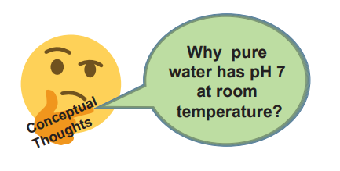

&nbsp;&nbsp;&nbsp;&nbsp;&nbsp;The survival of aquatic life in such rivers becomes difficult.

## 10.7 pH CALCULATION

The pH is the negative logarithm of the hydrogen ion concentration

&nbsp;&nbsp;&nbsp;&nbsp;&nbsp;&nbsp;&nbsp;&nbsp;&nbsp;&nbsp;&nbsp;&nbsp;&nbsp;&nbsp;&nbsp;&nbsp;&nbsp;&nbsp;&nbsp;&nbsp;**pH = –log10 \[H+**\] 

**Example:** Calculate the pH of 0.01 M HNO3? 
**Solution:**

&nbsp;&nbsp;&nbsp;&nbsp;&nbsp;&nbsp;\[H+\] = 0.01 

&nbsp;&nbsp;&nbsp;&nbsp;&nbsp;&nbsp;pH = –log10 \[H+\] 

&nbsp;&nbsp;&nbsp;&nbsp;&nbsp;&nbsp;pH = –log10 \[0.01\] 

&nbsp;&nbsp;&nbsp;&nbsp;&nbsp;&nbsp;pH = –log10 \[1 × 10-2\] 

&nbsp;&nbsp;&nbsp;&nbsp;&nbsp;&nbsp;pH = –(log101 – 2 log1010) 

&nbsp;&nbsp;&nbsp;&nbsp;&nbsp;&nbsp;pH = 0 + 2 × log1010 

&nbsp;&nbsp;&nbsp;&nbsp;&nbsp;&nbsp;pH = 0 + 2 × 1 = 2 

&nbsp;&nbsp;&nbsp;&nbsp;&nbsp;&nbsp;pH = 2

**pOH:** The pOH of an aqueous solution is realted to the pH. 

The pOH is the negative logarithm of the hydroxyl ion concentration

&nbsp;&nbsp;&nbsp;&nbsp;&nbsp;&nbsp;&nbsp;&nbsp;&nbsp;&nbsp;&nbsp;&nbsp;&nbsp;&nbsp;&nbsp;&nbsp;&nbsp;&nbsp;&nbsp;&nbsp;&nbsp;&nbsp;&nbsp;&nbsp;&nbsp;**pOH = –log10\[OH–\]** 

Example: The hydroxyl ion concentration of a solution is 1 × 10-9M. What is the pOH of the solution? 

Solution

&nbsp;&nbsp;&nbsp;&nbsp;&nbsp;&nbsp;pOH = –log10 \[OH–\] 

&nbsp;&nbsp;&nbsp;&nbsp;&nbsp;&nbsp;pOH = –log10 \[1 × 10-9\] 

&nbsp;&nbsp;&nbsp;&nbsp;&nbsp;&nbsp;pOH = –(log10 1.0 + log10 10-9) 
 
&nbsp;&nbsp;&nbsp;&nbsp;&nbsp;&nbsp;pOH = –(0–9 log1010) 

&nbsp;&nbsp;&nbsp;&nbsp;&nbsp;&nbsp;pOH = –(0 – 9) 

&nbsp;&nbsp;&nbsp;&nbsp;&nbsp;&nbsp;pOH = 9

**Relationship between pH and pOH** The pH and pOH of a water solution at 25oC are related by the following equation.

&nbsp;&nbsp;&nbsp;&nbsp;&nbsp;&nbsp;&nbsp;&nbsp;&nbsp;&nbsp;&nbsp;&nbsp;&nbsp;&nbsp;&nbsp;&nbsp;&nbsp;&nbsp;&nbsp;&nbsp;&nbsp;&nbsp;&nbsp;&nbsp;&nbsp;&nbsp;**pH + pOH = 14** 

If either the pH or the pOH of a solution is known, the other value can be calculated. 

**Example:** A solution has a pOH of 11.76. What is the pH of this solution?

 &nbsp;&nbsp;&nbsp;&nbsp;&nbsp;&nbsp;&nbsp;&nbsp;&nbsp;&nbsp;&nbsp;&nbsp;&nbsp;&nbsp;&nbsp;&nbsp;&nbsp;&nbsp;&nbsp;&nbsp;&nbsp; pH = 14 – pOH 

&nbsp;&nbsp;&nbsp;&nbsp;&nbsp;&nbsp;&nbsp;&nbsp;&nbsp;&nbsp;&nbsp;&nbsp;&nbsp;&nbsp;&nbsp;&nbsp;&nbsp;&nbsp;&nbsp;&nbsp;&nbsp;pH = 14 – 11.76 = 2.24

## 10.8 PROBLEMS

**Example 1:** Calculate the pH of 0.001 molar &nbsp;&nbsp;&nbsp;&nbsp;&nbsp;&nbsp;&nbsp;&nbsp;&nbsp;&nbsp;&nbsp;&nbsp;&nbsp;&nbsp;&nbsp;&nbsp;&nbsp;&nbsp;&nbsp;&nbsp;&nbsp; &nbsp;&nbsp;&nbsp;&nbsp;&nbsp;&nbsp;&nbsp;&nbsp;&nbsp;&nbsp;&nbsp;&nbsp;&nbsp;&nbsp;&nbsp;&nbsp;&nbsp;&nbsp;&nbsp;&nbsp;&nbsp;solution of HCl.

**Solution:** HCl is a strong acid and is completely dissociated in its solutions according to the process:

&nbsp;&nbsp;&nbsp;&nbsp;&nbsp;&nbsp;&nbsp;&nbsp;&nbsp;&nbsp;&nbsp;HCl(aq) → H+(aq) + Cl-(aq)

&nbsp;&nbsp;&nbsp;&nbsp;&nbsp;&nbsp;&nbsp;&nbsp;&nbsp;&nbsp;&nbsp;&nbsp;&nbsp;&nbsp;&nbsp;&nbsp;From this process it is clear that one mole of HCl would give one mole of H+ ions. Therefore, the concentration of H+ ions would be equal to that of HCl, i.e., 0.001 molar or 1.0 × 10–3 mol litre–1. 

Thus, \[H+\] = 1 × 10–3 mol litre–1

pH = –log10\[H+\] = –log1010–3

&nbsp;&nbsp;&nbsp;&nbsp;&nbsp;&nbsp;\= –(–3 × log10) = –(3 × 1) = 3 

Thus, pH = 3 

**Example 2:** What would be the pH of an aqueous solution of sulphuric acid which is 5 × 10–5 mol litre–1 in concentration.

**Solution:** Sulphuric acid dissociates in water as: 

H2SO4(aq) → 2 H+(aq) + SO4 2–(aq)

Each mole of sulphuric acid gives two mole of H+ ions in the solution. One litre of H2SO4 solution contains 5 × 10–5 moles of H2SO4 which would give 2 × 5 × 10–5 = 10 × 10–5 or 1.0 × 10–4 moles of H+ ion in one litre of the solution. 

Therefore, 

\[H+\] = 1.0 × 10–4 mol litre–1

pH = –log10\[H+\] = –log1010-4 = –(–4 × log10) 

 &nbsp;&nbsp;&nbsp;&nbsp;&nbsp;&nbsp;&nbsp;&nbsp;&nbsp;&nbsp;&nbsp;&nbsp;&nbsp;&nbsp;&nbsp;&nbsp;&nbsp;&nbsp;&nbsp;&nbsp;&nbsp;&nbsp;&nbsp;&nbsp;&nbsp;&nbsp;&nbsp;&nbsp;= –(–4 × 1) = 4 

**Example 3:** Calculate the pH of 1 × 10–4 molar solution of NaOH. 

**Solution:** NaOH is a strong base and dissociates in its solution as:

NaOH(aq) → Na+ (aq) + OH–(aq)

One mole of NaOH would give one mole of OH– ions. Therefore,

\[OH–\] = 1 × 10–4 mol litre–1

pOH = –log10\[OH–\] = –log10 × \[10–4\] 

&nbsp;&nbsp;&nbsp;&nbsp;&nbsp;&nbsp;&nbsp;&nbsp;&nbsp;&nbsp;&nbsp;&nbsp;&nbsp;&nbsp;&nbsp;&nbsp;&nbsp;&nbsp;&nbsp;&nbsp;&nbsp;&nbsp;&nbsp;&nbsp;&nbsp;&nbsp;&nbsp;&nbsp;&nbsp;&nbsp;= –(–4 × log1010)= –(–4) = 4 

Since, pH + pOH = 14 

pH = 14 – pOH = 14 – 4 = 10 

**Example 4:** Calculate the pH of a solution in which the concentration of the hydrogen ions is 1.0 × 10–8 mol litre–1.

**Solution:** Here, although the solution is extremely dilute, the concentration given is not of an acid or a base but that of H+ ions. Hence, the pH can be calculated from the relation: 

pH = –log10\[H+\] 

given \[H+\] = 1.0 × 10–8 mol litre–1

pH = –log1010–8 = –(–8 × log1010) 

&nbsp;&nbsp;&nbsp;&nbsp;&nbsp;&nbsp;&nbsp;&nbsp;&nbsp;&nbsp;&nbsp;&nbsp;&nbsp;&nbsp;&nbsp;&nbsp;&nbsp;&nbsp;&nbsp;&nbsp;&nbsp;&nbsp;&nbsp;&nbsp;&nbsp;&nbsp;&nbsp;= –(–8 × 1) = 8 

**Example 5:** If the pH of a solution is 4.5, what is its pOH? 

**Solution:** 

pH + pOH = 14 

pOH = 14 – 4.5 = 9.5 pOH = 9.5

**Points to Remember**

&#x2756;
 A chemical change is a change in which one or more new substances are formed.

&#x2756; Most combination reactions are exothermic

&#x2756; All photo decomposition reaction are endothermic reactions.

&#x2756; Double displacement reaction or metathesis may occur by the mutal exchange of ions.

&#x2756; Precipitation reaction gives an insoluble salt as the product.

&#x2756; Neutralisation reactions are reactions between an acid and a base that forms salt and water.

&#x2756; Neutralisation prevents tooth decay.

&#x2756; Most reactions in chemistry are irreversible reactions.

&#x2756; Chemical equilibrium-the rate of the forward reaction is equal to rate of the back ward reactions.

&#x2756; Equilibrium is possible in a closed system.

&#x2756; Temperature increases the reaction rate.

&#x2756; Pressure increases the reaction rate.

&#x2756; The term pH means power of hydrogen.

&#x2756; pH plays a vital role in everyday life.

&#x2756; In humans all bio chemical reactions take place between the pH value of 7.0 to 7.8.

&#x2756; If pH of rain water is below 5.6 its called acid rain.

&#x2756; Pure water is a weak electrolyte.

**TEXTBOOK EVALUATION**

**I. Choose the correct answer.**

1\. H2(g) + Cl29(g) → 2HCl(g) is a 

&nbsp;&nbsp;&nbsp;&nbsp;a. Decomposition Reaction 

&nbsp;&nbsp;&nbsp;&nbsp;b. Combination Reaction 

&nbsp;&nbsp;&nbsp;&nbsp;c. Single Displacement Reaction 

&nbsp;&nbsp;&nbsp;&nbsp;d. Double Displacement Reaction

2\. Photolysis is a decomposition reaction caused by \_\_\_\_\_\_\_\_\_\_\_ 

&nbsp;&nbsp;&nbsp;&nbsp;&nbsp;a. heat 
&nbsp;&nbsp;&nbsp;&nbsp;&nbsp;&nbsp;&nbsp;&nbsp;&nbsp;&nbsp;&nbsp;b. electricity 

&nbsp;&nbsp;&nbsp;&nbsp;&nbsp;c. light 
&nbsp;&nbsp;&nbsp;&nbsp;&nbsp;&nbsp;&nbsp;&nbsp;&nbsp;&nbsp;&nbsp;d. mechanical energy

3\. A reaction between carbon and oxygen is represented by C(s) + O2(g) → CO2(g) + Heat. In which of the type(s), the above reaction can be classified? 

(i) Combination Reaction

(ii) Combustion Reaction
 
(iii) Decomposition Reaction 

(iv) Irreversible Reaction 

a. i and ii &nbsp;&nbsp;&nbsp;&nbsp;&nbsp;&nbsp;&nbsp;&nbsp;&nbsp;&nbsp;&nbsp;&nbsp;&nbsp;&nbsp;&nbsp;b. i and iv 

c. i, ii and iii &nbsp;&nbsp;&nbsp;&nbsp;&nbsp;&nbsp;&nbsp;&nbsp;&nbsp;&nbsp;&nbsp;d. i, ii and iv

4\. The chemical equation Na2SO4(aq) + BaCl2(aq) → BaSO4(s)↓ + 2NaCl(aq)

represents which of the following types of reaction?

a. Neutralisation 

b. Combustion 

c. Precipitation 

d. Single displacement

5\. Which of the following statements are correct about a chemical equilibrium? 

(i) It is dynamic in nature 

(ii) The rate of the forward and backward reactions are equal at equilibrium 

(iii) Irreversible reactions do not attain

chemical equilibrium 

(iv) The concentration of reactants and products may be different

a. i, ii and iii &nbsp;&nbsp;&nbsp;&nbsp;&nbsp;&nbsp;&nbsp;&nbsp;&nbsp;&nbsp;&nbsp;&nbsp;&nbsp;&nbsp;&nbsp;b. i, ii and iv 

c. ii, iii and iv &nbsp;&nbsp;&nbsp;&nbsp;&nbsp;&nbsp;&nbsp;&nbsp;&nbsp;&nbsp;&nbsp;&nbsp;&nbsp;d. i, iii and iv

6\. A single displacement reaction is represented by X(s) + 2HCl(aq) → XCl2(aq) + H2(g). Which of the following(s) could be X.

(i) Zn (ii) Ag (iii) Cu (iv) Mg. 

Choose the best pair. 

a. i and ii &nbsp;&nbsp;&nbsp;&nbsp;&nbsp;&nbsp;&nbsp;&nbsp;&nbsp;&nbsp;&nbsp;&nbsp;&nbsp;b. ii and iii 

c. iii and iv &nbsp;&nbsp;&nbsp;&nbsp;&nbsp;&nbsp;&nbsp;&nbsp;&nbsp;&nbsp;&nbsp;d. i and iv

7\. Which of the following is not an “element + element → compound” type reaction?

a. C(s) + O2(g) → CO2(g) 

b. 2K(s) + Br2(l) → 2KBr(s) 

c. 2CO(g) + O2(g) → 2CO2(g) 

d. 4Fe(s) + 3O2(g) → 2Fe2O3(s)

8\. Which of the following represents a precipitation reaction? 

a. A(s) + B(s) → C(s) + D(s) 

b. A(s) + B(aq) → C(aq) + D(_l_) 

c. A(aq) + B(aq) → C(s) + D(aq) 

d. A(aq) + B(s) → C(aq) + D(_l_)

9\. The pH of a solution is 3. Its \[OH–\] concentration is

 a. 1 × 10–3 M 
 
 b. 3 M 
 
 c. 1 × 10–11 M 
 
 d. 11 M

10\. Powdered CaCO3 reacts more rapidly than flaky CaCO3 because of \_\_\_\_\_\_\_\_\_\_\_. 

a. large surface area 

b. high pressure 

c. high concentration 

d. high temperature

**II. Fill in the blanks** 

1\. A reaction between an acid and a base is

called \_\_\_\_\_\_\_\_\_\_\_\_\_\_\_\_\_.

2\. When lithium metal is placed in hydrochloric

acid, \_\_\_\_\_\_\_\_ gas is evolved.

3\. The equilibrium attained during the melting of ice is known as \_\_\_\_\_\_\_\_\_\_\_.

4\. The pH of a fruit juice is 5.6. If you add slaked lime to this juice, its pH \_\_\_\_\_\_\_\_\_\_\_\_\_ (increse/decrese)

5\. The value of ionic product of water at 250 C is \_\_\_\_\_\_\_\_\_\_\_\_\_.

6\. The normal pH of human blood is \_\_\_\_\_\_\_\_\_

7\. Electrolysis is type of \_\_\_\_\_\_\_\_\_\_\_\_\_\_\_ reaction

8\. The number of products formed in a synthesis reaction is \_\_\_\_\_\_\_\_\_

9\. Chemical volcano is an example for \_\_\_\_\_\_\_\_\_\_\_\_\_\_\_ type of reaction

10\. The ion formed by dissolution of H+ in water is called \_\_\_\_\_\_\_\_\_\_\_\_\_\_\_

**III. Match the following**

**1\.** Identify the types of reaction 
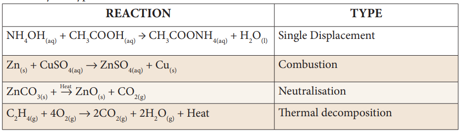

**IV. True or False: (If false give the correct statement)**

1\. Silver metal can displace hydrogen gas from nitric acid.

2\. The pH of rain water containing dissolved gases like SO3, CO2, NO2 will be less than 7.

3\. At the equilibrium of a reversible reaction, the concentration of the reactants and the products will be equal.

4\. Periodical removal of one of the products of a reversible reaction increases the yield.

5\. On dipping a pH paper in a solution, it turns into yellow. Then the solution is basic.

**V. Short answer questions:** 

1\. When an aqueous solution of potassium chloride is added to an aqueous solution of silver nitrate, a white precipitate is formed. Give the chemical equation of this reaction.

2\. Why does the reaction rate of a reaction increase on raising the temperature?

3\. Define combination reaction. Give one example for an exothermic combination reaction.

4\. Differentiate reversible and irreversible reactions

**VI. Answer in detail** 

1\. What are called thermolysis reactions? 

2\. Explain the types of double displacement

reactions with examples. 

3\. Explain the factors influencing the rate of a

reaction 

4\. How does pH play an important role in

everyday life? 

5\. What is a chemical equilibrium? What are

its characteristics?

**VII. HOT questions** 

1\. A solid compound ‘A’ decomposes on heating into ‘B’ and a gas ‘C’. On passing the gas ‘C’ through water, it becomes acidic. Identify A, B and C.

2\. Can a nickel spatula be used to stir copper sulphate solution? Justify your answer.

**VIII. Solve the following problems** 

1\. Lemon juice has a pH 2, what is the concentration of H+ ions? 

2\. Calculate the pH of 1.0 ×10–4 molar solution

of HNO3. 

3/. What is the pH of 1.0 × 10–5 molar solution of KOH? 4. The hydroxide ion concentration of a solution is 1 × 10–11M. What is the pH of the solution?

**REFERENCE BOOKS**

1\. Text book of inorganic chemistry-P.L.Soni- S.Chand & sons publishers, New Delhi.

2\. Principles of Physical Chemistry- B.R.Ruri, L.R. Sharma, Vishal publishing Co Punjab.

**INTERNET RESOURCES**

Webliography:www.chem4kids.com

http://aravindguptatoys.com/filims.html

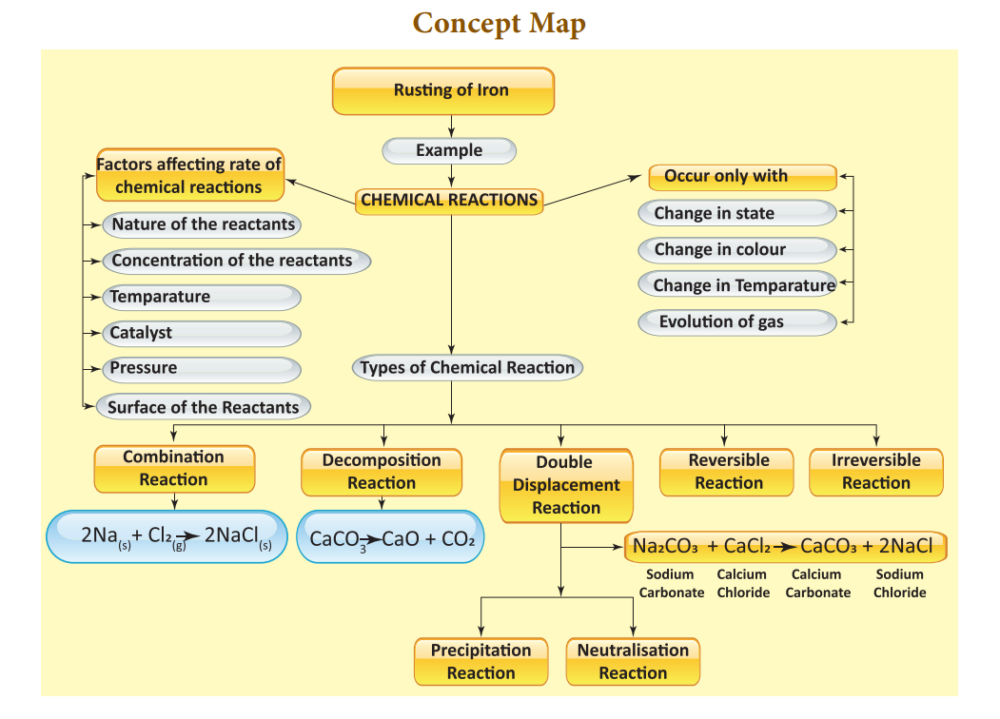

