&nbsp;&nbsp;&nbsp;&nbsp;&nbsp;&nbsp;In general, whenever we think of computers, the things that come to our mind is computer screen, keyboard , mouse and CPU. We learnt about computer and parts of a computer as introductory part in standard VI. Apart from that, software and hardware also plays vital role in the working of computer. Now, shall we learn how to operate the computer?

<!--  -->

&nbsp;&nbsp;&nbsp;&nbsp;&nbsp;&nbsp;The reason we prefer computer is its speed and the ability to store data. How can we save data and information in computer? We can save them in folders which accommodate multiple files or a single file. Let us understand the terminologies like file and folder before moving further.

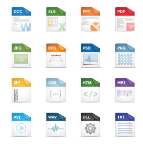

&nbsp;&nbsp;&nbsp;&nbsp;&nbsp;&nbsp;The output we get from any application is commonly referred as ‘file’. Therefore the application for the specific purposes determines the nature of the file.

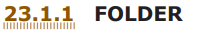 

&nbsp;&nbsp;&nbsp;&nbsp;&nbsp;&nbsp;A folder is a storage space that contains multiple files. We can create files as per the user’s need. For clear understanding, we can take the example of a bookshelf in a library.The individual book can be considered as a ‘file’ and the whole set of books in a shelf can be considered as folders. When we right click on the mouse, the popup menu appears on the screen with multiple options. Select ‘NEW’ option and a secondary menu comes up with another set of options. Select ‘Folder’ option in the menu. You can now save your file(s) in the newly created folder.

&nbsp;&nbsp;&nbsp;&nbsp;&nbsp;&nbsp;More people are using Windows and LINUX operating systems in their computers. We can do many activities like collect notes, draw/paint, create animations /spreadsheets/ word docs/PPTs etc.

&nbsp;&nbsp;&nbsp;&nbsp;&nbsp;&nbsp;We use ‘Guide Board’ to go to the unknown places like that when we ‘On’ the computer click the ‘START’ button at the left corner of the computer, it shows the list of all programs in the computer. Now select the required program and create the required files.

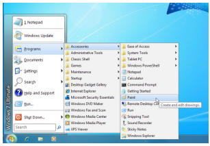

**How can we create Files?**
<!-- **How can we create Files?** -->

&nbsp;&nbsp;&nbsp;&nbsp;&nbsp;&nbsp;For example if the computer is operating on the Windows OS, we can collect our notes in ‘Notepad’ application and draw pictures in ‘Paint’ application.

&nbsp;&nbsp;&nbsp;&nbsp;&nbsp;&nbsp;As per it’s name we can type notes in ‘Notepad’ and save the created files in a folder. Likewise in the ‘Paint’ app we can draw and edit pictures. With these pictures, let us see how we can create image gallery, animations and graphics easily.

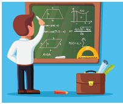

&nbsp;&nbsp;&nbsp;&nbsp;&nbsp;&nbsp;Pictures and audio-visuals gives us more understanding than teaching and writing on the black board. Is it right?

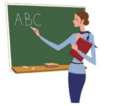

&nbsp;&nbsp;&nbsp;&nbsp;&nbsp;&nbsp;Instead of saying a story like ‘once upon a time there was a king’ we can understand the concept easily by seeing the video and also it registers firmly in the minds of the students. The device which helps in explaining the concepts easily through pictures is known as ‘Visual Communication Device’. For example photos, audio -visuals, drawings, animations all these can be created easily with the help of computer. Cinema is a good example for ‘Visual Communication Device’.

<!-- ### **23.2 SCRATCH** -->

**Introduction** 
<!-- **Introduction** -->
&nbsp;&nbsp;&nbsp;&nbsp;&nbsp;&nbsp;‘Scratch’ is a software used to create animations, cartoons and games easily. Scratch is a visual programming language. It was developed in the Massachusetts Institute of Technology (MIT) Media Lab to make programming easier and more fun to learn.

**Scratch Environment Editor** 
<!-- **Scratch Environment Editor** -->
&nbsp;&nbsp;&nbsp;&nbsp;&nbsp;&nbsp;The Scratch editor has three main parts:
They are Stage, Sprite and Script editor.

**Stage**: Stage is the background appearing when we open the scratch window. The background will most often be white. You can change the background colour as you like.

**Sprite:** The characters on the background of a Scratch window are known as Sprite. Usually acat appears as a sprite when the Scratch window is opened. The software provides facilities to make alternations in sprite.

**Script editor / costume editor:** Where you edit your programs or your sprite’s pictures.

&nbsp;&nbsp;&nbsp;&nbsp;&nbsp;&nbsp;You should see a single window with at least the following three panes: the Stage (top left), the Sprite List (bottom left), and the Scripts tab (right), which contains the Blocks tab and the Scripts Area. The right pane also contains two additional tabs, Costumes and Sounds.

**The script editor has three main parts:**

• **Script area:** Where you build scripts.

• **Block menu:** Where you choose the category of blocks (programming statements) to use.

• **Block palette:** Where you choose the block to use.

When the Costumes tab is chosen, the costume editor is shown (outlined in red):

**Movement and Loops**
<!-- **Movement and Loops** -->
 _Click File/New to create a new project and enter a project name ._

&nbsp;&nbsp;&nbsp;&nbsp;&nbsp;&nbsp;Click the menu **Script → Event, drag a when green flag clicked block to the scripts** area. Your scripts area should look like this:

&nbsp;&nbsp;&nbsp;&nbsp;&nbsp;&nbsp;Click the menu **Script → Motion** menu, drag a **goto x: 0 y: 0** block to the scripts area and snap it to the bottom of the when green flag **clicked** block. Your script should look like this:

&nbsp;&nbsp;&nbsp;&nbsp;&nbsp;&nbsp;**Add a move 10 steps block to the bottom of your script and change the 10 into 100.**

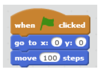

&nbsp;&nbsp;&nbsp;&nbsp;&nbsp;&nbsp;Click the green flag at the top right corner of the stage to run your program.

**Adding Sound** 
<!-- **Adding Sound** -->
1. Click Sprite1 in the sprite list and click the Sounds tab. 

2. Try the meow sound already there. If you don’t like it, click the speaker icon to choose a different sound from the sound library.

3. Click the Scripts tab and find the play sound block from the Sound menu. Add this block to the when space key pressed script. (Select the sound you want from the drop-down list.)

4. Run your program.

**Example:** 
Program for print the word “Hello” with sound

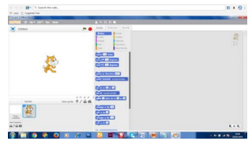

1\. Click events in script option

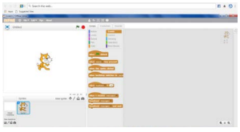

2\. Drag  tab to script area

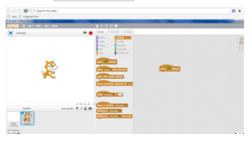

3\. Click Looks in script option. Drag “say” to script area.

4\. Type “Hello “ word in say tab.

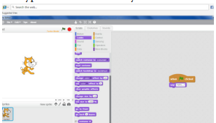

5\. Click sounds in script option. Drag play sound to script area. Choose the hello sound from the audio file.

6\. From File menu choose the Save option.

7\. Click the green flag at the top right corner of the stage window to run the program

**Output:**

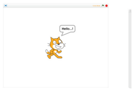
