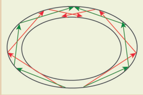
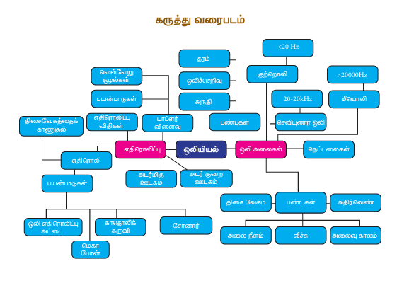

# ஒலியியல் 

## கற்றல் குறிக்கோள்கள் 

இந்தப் பாடத்தின் முடிவில் மாணவர்கள் பின்வரும் திறன்களைப் பெறுவர்:

- ஒலி உருவாக்கம் மற்றும் பேசுவது பற்றி புரிந்து கொள்ள முடியும்
- திசை வேகம், அதிர்வெண் மற்றும் அலை நீளம் வேறுபாடு தொடர்புபடுத்த இயலும்
- பல்வேறு ஊடகங்களில் ஒலியின் திசை வேகத்தைத் தெரிந்து கொள்ள இயலும்
- வாயுக்களில் ஒலியின் திசை வேகத்தைப் பொதிக்கும் காரணிகளை விளக்க இயலும்
- ஒலியின் எதிரொலித்திறனை விரிவாக்க இயலும்
- எதிரொலி பயன்படுத்தி ஒலியின் திசை வேகத்தைக் காண இயலும்
- தொப்ளர் விளைவைப் புரிந்து கொள்ள இயலும்
- ஒலி அலைகளின் எதிரொலிப்பு விதிகளைத் தெரிந்து கொள்ள இயலும்

---

## அறிமுகம்

ஒலி நமது அன்றாட வாழ்வில் முக்கிய பங்கு வகிக்கிறது. நாம் ஒருவருக்கு ஒருவர் தகவல் தெரிவிக்க ஒலியைப் பயன்படுகிறது. தினமும் நம் வச்சுற்றியிருக்கும் மனிதர்கள், வாகனங்கள், விலங்குகள் போன்றவை எழுப்பும் பல்வேறு வகையான ஒலிகளைக் கேட்கிறோம். ஆதலால், ஒலி எவ்வாறு உருவாகிறது?, ஒலி எவ்வாறு பேசுகிறது?, ஒலியின் வழி நாம் எவ்வாறு கேட்கிறோம்? என்ற கேள்விகளுக்கு விடை தெரிந்து கொள்வது அவசியமாகிறது. இவ்வகைக் கேள்விகளுக்கு உருவாக்குதலும் மற்றும் இவ்வச் செயல்களின் விளைவுகளைப் பற்றி புரிந்து கொள்ளுதலும் சில சமயங்களில் ஏற்படுகிறது. ஒலியியல் என்பது ஒலி உருவாதல், ஒலி பேசல், ஒலியைத் தடுப்பது மற்றும் ஒலியினால் ஏற்படும் விளைவுகள் ஆகியவை பற்றி அறிந்து கொள்ளும் இயற்பியலின் ஒரு பிரிவு ஆகும். நீங்கள் ஏற்கனவே ஒன்பதாம் வகுப்பில் ஒலி பேசுதல் மற்றும் ஒலி அலைகளின் பண்புகளைப் பற்றி படித்துள்ளீர்கள். நாம் இந்தப் பாடத்தில் ஒலி அலைகளின் எதிரொலிப்பு, எதிரொலி, மற்றும் தொப்ளர் விளைவு ஆகியவை பற்றி படிக்க இருக்கிறோம்.

நாம் ஒலி பற்றி நினைக்கும்போது, ஒலி எவ்வாறு உருவாகிறது?, பல்வேறு ஒலி மூலங்களிலிருந்து வரும் ஒலி எவ்வாறு நமது காதுகளில் அடைகிறது?, ஒலி என்பது என்ன? அது விசையா அல்லது ஆற்றலா? என்பனவற்றின் கேள்விகள் நமது மனதில் எழும். இந்தப் பாடத்தில் இது போன்றவற்றின் கேள்விகளுக்கு விடை தெரிவோம்.

ஒலிக்கும் மணி அல்லது இவ்வகைக் கருவியைத் தொடர்புடையதாக்கும்போது ஒலியானது அதிரவுகளால் உருவாகின்றது என்பதை அறியலாம். அதிர்வையும் தீர்மங்களை அலை வடிவில் ஆற்றல் உருவாக்குகிறது. அதுவே ஒலி அலைகளாகும் (படம் 5.1).


_Figure 5.1 Production of sound waves_

நீயும், உனது நண்பர்களும் நிலவில் இருப்பதாகக் கருதிக் கொள்ளுங்கள். உனது நண்பன் எழுப்பும் ஒலியை நீ கேட்க இயலுமா?. நிலவில் வளிமண்டலம் இல்லாததால் உனது நண்பனின் ஒலியைக் கேட்க இயலாது. எனவே அதிரவுறும் தீர்மங்கள் உருவாக்கும் ஒலி பேசுவதற்கு, திட, திரவ, வாயு போன்ற பருப்பொருள் ஊடகங்கள் தேவை என்பதைப் புரிந்து கொள்ளலாம். இதிலிருந்து ஒலியானது திட, திரவ அல்லது வாயு ஊடகங்களில் பேசும்.

---

## 5.1 ஒலி அலைகள்

### செயல்பாடு 5.1

ஒரு இவ்வகைக் கோம்பு அல்லது பவுடர் பர்பசிவை எடுத்து ஒரு பிளாஸ்டிக் பையினுள் வைக்கவும். பிளாஸ்டிக் பையை தமிழ் கயிற்றால் அல்லது நூலினால் பயன்படுத்தி மூடவும். ஒரு மேஜையில் நீவே நேர்ப்பிப் பிளாஸ்டிக் பையை அதனுள் வைக்கவும். தற்போது தீர்மம் அல்லது பவுடர் பர்பசிவை ஒலிக் காட்சிய்யவும். இப்போது உங்களால் தமது கான் ஒலியைக் கேட்க இயலும். இப்போது மேஜையின் அருகருகே கொண்டு தீர்மம் அல்லது பவுடர் பர்பசிவை ஒலிக் காட்சிய்தால் உங்களால் உறுத்த ஒலியைக் கேட்க இயலும். இது ஏன் என்று கீழ்க்காணும் விளக்கத்தில் விளக்கியுள்ளோம்.

### 5.1.1 ஒலி அலைகளின் இயல்பு

ஒலி அலைகள் தசைவலைகள். அவை அனைத்து ஊடகங்களிலும் (திண்ம, திரவ, வாயு) பேசும். அவற்றின் திசை வேகம் பருப்பொருள் ஊடகங்களின் பண்புகளைப் பொறுத்து அவையும். ஒரு ஊடகத்தில் ஒலியவல் பேசும் திசையிரண்டு புள்ளிகள் அதிரவுற்றால் அவைகளின் தசைவலை எனலாம். ஒவ்வொரு மூலக்கூறும் அதன் வழக்கப் பகுதியிலிருந்து நிலை இடக்கில் இப்படியாகச் சுற்றி அவைகளால் தசைவலைகள் உருவாகிறது. இதனால் ஊடகத்தின் அடர்த்தி தசைவலைகள் பேசும்போது இறுக்கங்களும் தளர்ச்சிகளும் உருவாகின்றன. ஊடகத்தின் அடர்த்தி பேசும் தசைவலைகளில் இறுக்கங்கள் என்பது அதிக அழுத்தம் உள்ள பகுதி மற்றும் தளர்ச்சிகள் என்பது குறைந்த அழுத்தம் உள்ள பகுதியாகும்.


_Figure 5.2 Sound propagates as longitudinal waves_
 
### 5.1.2 வகைப்பாடு

**(i) செவியுறு ஒலி அலைகள்:** இவை 20 Hz முதல் 20,000 Hz க்கு இடைப்பட்ட அதிர்வெண் உடைய ஒலி அலைகள். இவை அதிர்வையும் தீர்மங்களை நாம் கேட்கும் மற்றும் இழுத்துக் கட்டும் பிர்ப்பன்றவைகளால் உருவாக்கப்படுகிறது.

**(ii) குற்றொலி அலைகள்:** இவை 20 Hz க்குக் குறைவான அதிர்வெண் உடைய ஒலி அலைகள். மனிதர்களால் கேட்க இயலாது. நிலநடுக்கத்தின் போது உருவாகும் அதிர்வலைகள், வேல் அலைகள் மற்றும் திமிங்கலங்கள் ஏற்படுத்தும் ஒலி போன்ற ஒலிகள் குற்றொலி அலைகள் ஆகும்.

**(iii) மீயொலி:** இவை 20,000 Hz க்கும் அதிகமான அதிர்வெண் கொண்ட ஒலி அலைகள். மனிதர்களால் கேட்க இயலாது. ஆனால் தேள், நாய், வௌவால் மற்றும் டால்பின் போன்ற உயிரினங்களால் கேட்க இயலும். வௌவால் ஏற்படுத்தும் ஒலியின் வழி மீதொலிக்க எடுத்துக்காட்டாகக் கூறலாம்.

### 5.1.3 இடையயான வேறுபாடுகள்

| வ.எண் | ஒலி அலைகள் | ஒளி அலைகள் |
|-------|-----------|-----------|
| 1 | தசை வலைகள் | மின்காந்த அலைகள் |
| 2 | அனைத்து ஊடகங்களிலும் பேசும் | வெற்றிடத்திலும் பேசும் |
| 3 | வேகம் குறைவு (காற்றில் 330 m/s) | வேகம் அதிகம் (3 × 10⁸ m/s) |
| 4 | அதிர்வெண் 20 Hz - 20,000 Hz | அதிர்வெண் 4 × 10¹⁴ - 7 × 10¹⁴ Hz |

### 5.1.4 அலை நீளம்

ஒரு அலையின் திசை வேகம் பற்றி விளக்கும்போது, இரு வகையான திசை வேகங்களை நாம் கணக்கில் எடுத்துக்கொள்ள வேண்டும். அவைகள் அதிர்வையுடையதின் திசை வேகம் மற்றும் அலையின் திசை வேகம் ஆகும். திசை வேகத்தின் அலகு மீட்டர்/வினாடி⁻¹ ஆகும்.

**வரையறை:**
ஒரு ஊடகத்தில் அலைகள் இடையில் ஆற்றலக் கடத்துவதற்காக உள்ள புள்ளிகள் அதிர்வையும் திசை வேகமதுடையதின் திசை வேகம் எனப்படும்.

**அலை திசை வேகம்:**
ஒரு ஊடகத்தின் அடர்த்தி அலை பேசும் திசை வேகம் அலைத் திசை வேகம் எனப்படுகிறது. இதனை வேகம் எனவும் குறிப்பிடலாம்.


\text{அலைத் திசை வேகம்} = \frac{\text{அலை நீளம்}}{\text{காலம்}}



ஒரு அலையானது λ என்ற தூரத்தை (அலை நீளம்) T காலத்தில் கடந்தால் அதன் அலைத் திசை வேகம் V எனக் குறிப்பிடலாம்.


V = \frac{\lambda}{T}



ஆதலால் ஒரு வினாடிக்கு, ஒலி அலை எந்தத்த தூரம் அலைத் திசை வேகம் ஆகும். (n) = 1/T என்பது அலையின் அதிர்வெண் எனக் கருதினால் சமன்பாடு (5.1) ஐ


V = n\lambda



என எழுதலாம்.

திடப் பொருட்களில் மீள்ச்சிப் பண்பு அதிகமாக இருப்பதால் அதன் வழியாக ஒலியவல் செல்லும்போது ஒலியின் திசை வேகம் அதிகமாக இருக்கும். வாயுக்களுக்கும் மீள்ச்சிப் பண்பு குறைவாக இருப்பதால் ஒலியவல் வாயுக்களை வழியாகச் செல்லும்போது அதன் திசை வேகம் குறைவாக இருக்கும்.

எனவே:

v_{\text{திட}} > v_{\text{திரவ}} > v_{\text{வாயு}}



### 5.1.5 பாதிக்கும் காரணிகள்

திடப் பொருட்களின் வழியாக ஒலித் செல்லும்போது அதன் மீள்ச்சிப் பண்பு மற்றும் அடர்த்தி ஒலியின் திசை வேகத்தைப் பொதிக்கிறது. மீள்ச்சிப் பண்பு என்பது மீள்சிக்குணத்தினால் குறிக்கப்படுகிறது. ஒலியின் திசை வேகம் என்பதும் மீள்சிக்குணத்தின் இருமடி மூலத்திற்கு நேரத்தகவிலும், அடர்த்தியின் இருமடி மூலத்திற்கு எதிரத்தகவிலும் அவையும்.

எனவே அடர்த்தி அதிகரிக்கும்போது, ஒலியின் வேகம் குறைகிறது. மீள்சிப் பண்பு அதிகரிக்கும்போது ஒலியின் திசை வேகமும் அதிகரிக்கிறது. வாயுக்களின் வழியாக ஒலியின் திசை வேகத்தைப் பொதிக்கும் கீழ்க்காணும் காரணிகள்:

**அடர்த்தியின் விளைவு:** வாயுக்களில் ஒலியின் திசை வேகம் அதன் அடர்த்தியின் இருமடி மூலத்திற்கு எதிரத்தகவில் அவையும். எனவே வாயுக்களின் அடர்த்தி அதிகரிக்கும்போது திசை வேகம் குறைகிறது.

v \propto \sqrt{\frac{1}{d}}



**வெப்பநிலை:** வாயுக்களில் ஒலியின் திசை வேகம், அதன் வெப்பநிலையின் இருமடி மூலத்திற்கு நேரத்தகவில் அவையும். எனவே வெப்பநிலை அதிகரிக்கும்போது, திசை வேகமும் அதிகரிக்கிறது.

v \propto \sqrt{T}



வெப்பநிலை T°Cல் திசை வேகம் என்பது:

V_T = (V_0 + 0.61T) \text{ m s}^{-1}



இங்கு V₀ என்பது 0°C வெப்பநிலையில் வாயுக்களில் ஒலியின் திசை வேகம் ஆகும். எடுத்துக்காட்டாக V₀ = 331 மீவி⁻¹ எனவே ஒவ்வொரு டிகிரி செல்சியஸ் வெப்பநிலை அதிகரிப்பிற்கும் திசை வேகம் என்பது 0.61 மீவி⁻¹ அதிகரிக்கிறது.

ஈரப்பதம் அதிகரிக்கும்போது ஒலியின் திசை வேகமும் அதிகரிக்கிறது. எனவே தோனமவைக் கொலங்களில் அதிக தூரத்திலிருந்து கேட்கூடிய ஒலியைத் தளிமாகக் கேட்க முடிகிறது.

**பல்வேறு ஊடகங்களில் ஒலியின் திசை வேகம்:**

| வ.எண் | ஊடகம் | வெப்பநிலை | திசை வேகம் (மீ/வி) |
|-------|--------|-----------|-------------------|
| 1 | காற்று | 0°C | 331 |
| 2 | | 20°C | 343 |
| 3 | நீர் | | 1493 |
| 4 | இரும்பு | | 5130 |
| 5 | அலுமினியம் | | 6420 |
| 6 | கண்ணாடி | | 5170 |
| 7 | ஈயம் | | 1324 |
| 8 | நிக்கல் | | 6040 |

**வினா:** எந்த வெப்பநிலையில் ஒலியின் திசை வேகம் 0°Cல் உள்ளதைவிட இரட்டிப்பாகும்?

**தீர்வு:**
ரவையான வெப்பநிலையை T°C எனக் கொள்வோம். V₁ மற்றும் V₂ என்பவை முறையே T₁ K மற்றும் T₂ K வெப்பநிலையில் ஒலியின் திசை வேகம் ஆகும்.

T₁ = 273K (0°C) மற்றும் T₂ = (T°C + 273) K

இங்கு V₂/V₁ = 2 எனக் காட்டப்பட்டுள்ளது.


\frac{V_2}{V_1} = \sqrt{\frac{T_2}{T_1}} = \sqrt{\frac{273+T}{273}} = 2



எனவே:

\frac{273+T}{273} = 4



T = (273 \times 4) - 273 = 819°C



---

## 5.2 ஒலியின் எதிரொலிப்பு 

நீங்கள் தெற்று ஒன்றில் அமர்ந்து கொண்டுருப்போது, நீங்கள் பேசிய ஒலி மீண்டும் மீண்டும் உங்களை நெருங்குவதைக் குறிப்பிட்டிருப்பீர்கள். இது நீங்கள் பேசிய ஒலியின் எதிரொலிப்பு ஆகும். கீழ்க்காணும் செயல்பாட்டின் மூலம் ஒலி எதிரொலிப்பு:

ஒலியானது ஒரு ஊடகத்திலிருந்து மற்றொரு ஊடகத்திற்கு பேசும்போது இணைந்தொளித் ஊடகத்தால் எதிரொலிக்கப்படும் முதலாம் ஊடகத்திற்குத் திருப்பி அனுப்பப்படுகிறது. இந்த எதிரொலிப்பு என்பது ஒளி அலைகளில் நவீதபறும் எதிரொளிப்பு போன்றதாகும். இணைந்தொளிம் ஊடகத்தைத் தொடர்புடையதாக்கிச் செல்லும் கதிர் படுகதிர் எனவும் இணைந்தொளிம் ஊடகத்தில் பட்டுத் திரும்பி வரும் கதிர் எதிரொலித்தக் கதிர் எனவும் அவைக் கப்படுகிறது. இது படம் 5.3ல் காட்டப்பட்டுள்ளது.


_Figure 5.3 ஒலியின் எதிரொலிப்பு_

### 5.2.1 எதிரொலிப்பு விதிகள்

ஒளி அலைகளைப் போல, ஒலி அலைகளும் அடிப்படை எதிரொலிப்பு விதிகளைப் பூர்த்திச் செய்யும். கீழ்க்காணும் இரு எதிரொலிப்பு விதிகளும் ஒலி அலைகளுக்கும் பொருந்தும்:

- படுகதிர், எதிரொலிக்கும் தளத்தில் வைக்கப்படும் செங்குத்துக் கோடும் எதிரொலிப்புக் கதிர் ஆகியவை ஒரே தளத்தில் அவையும்.
- படுகோணம் ∠i மற்றும் எதிரொலிப்புக் கோணம் ∠r ஆகியவை சமமான

படம் 5.4ல் எதிரொலிப்புத் தளத்தைத் தொடர்புடையதாக்கிச் செல்லும் கதிர்கள் படுகதிர்கள் எனப்படும். எதிரொலிப்புத் தளத்தில் பட்டு மீண்டும் திரும்பி வரும் கதிர்கள் எதிரொலித்தக் கதிர்கள் எனப்படும். அவைகளைப் பயன்படுத்துவதற்கும் படுகதிர் மற்றும் எதிரொலிப்புக் கதிர் ஆகியவை எதிரொலிப்புத் தளத்தில் ஒரே புள்ளி வழியாகச் செல்லும்.


_Figure 5.4 எதிரொலிப்பு விதிகள்_

எதிரொலிப்புத் தளத்துக்குச் செங்குத்தாக வைக்கப்பட்டுள்ள கோடுத் செங்குத்துக் கோடு என அவைக் கப்படுகிறது. செங்குத்துக் கோட்டுடன், படுகதிர் உருவாக்கும் கோணம் படுகோணம் (i) ஆகும். அதற்குப் பதில் செங்குத்துக் கோட்டுடன் எதிரொலித்த கதிர் உருவாக்கும் கோணம் எதிரொலிப்புக் கோணம் (r) எனவும்.

### 5.2.2 அடர்மிகு ஊடகத்தின் விளிம்பில் ஒலி அலைகளின் எதிரொலிப்பு

ஒரு தசைவலையானது ஊடகத்தில் பேசும்போது இறுக்கங்களோ, தளர்ச்சிகளோ பேசும். ஒலி அலையின் இறுக்கங்கள் இம்மிருந்து நிலைமாறப் பேசி ஒரு சுவரில் ரமாதிக் கொளைதாகக் கருதிக் கொள்வோம். அவ்வாறு ரமாதிக் கொள்ளும்போது இறுக்கங்கள் சுவரிவனத் தொடர்பு F என்ற ஒரு விசையைச் செயல்படுத்தும். அதற்குச் சமமான மற்றும் எதிரதிசையில் R = -F என்ற விசையைத் திரும்பச் செலுத்தும். இதனால் சுவற்றின் அருகில் மீண்டும் இறுக்கங்கள் ஏற்படும். இவ்வாறு இறுக்கங்கள் சுவரில் ரமாதி மீண்டும் இறுக்கங்களோடு எதிரொலிக்கிறது. அதன் திசை மட்டும் மாறியிருக்கும். இதனை கீழ்க்காணும் படம் 5.5ல் காட்டப்பட்டுள்ளது.


_Figure 5.5 அடர்மிகு ஊடகத்தின் விளிம்பில் ஒலி அலைகளின் எதிரொலிப்பு_

### 5.2.3 அடர்குறை ஊடகத்தின் விளிம்பில் ஒலி அலைகளின் எதிரொலிப்பு

திடப் பொருளில் பயணிக்கும் அலையின் இறுக்கங்கள் ஒலி அலையின் இறுக்கங்கள் குறைந்து ஊடகத்தின் விளிம்பு அவைதாகக் கொள்ளப்படும். குறைந்து ஊடக அவைதாக அப்போது இறுக்கங்களோனது, குறைந்து ஊடகம் (காற்று) அடர்குறை ஊடகம் (காற்று) குறைந்த அளவு உருக்குவலக்கும் பண்புகளைப் பெற்றுள்ளதால் இணைவையும் பிரிக்கும் ரமற் பேபுபினரனாக்கித் தள்ளப்படுகிறது. இதனால் அடர்குறை ஊடகத்தில் துளைளமிக் எளிதாக இயங்குவதால் விளிம்புப்பகுதியில் தளர்ச்சிகள் உருவாகின்றன. இம்மிருந்து நிலைமாறப் பயணித்த இறுக்கங்கள் எதிரொலிக்கப்படுபின தளர்ச்சிகளோடு மாறி நிலைமாறுப் புறத்திலிருந்து இதுபுறமாகப் பேசுகிறது. இவை படம் 5.6ல் காட்டப்பட்டுள்ளது.


_Figure 5.6 அடர்குறை ஊடகத்தின் விளிம்பில் ஒலி அலைகளின் எதிரொலிப்பு_

> **நன்கு அறிந்து கொள்வோம்:**
> அடர்குறை மற்றும் அடர்மிகு ஊடகம் என்றால் என்ன?
> 
> ஒலியானது ஒரு ஊடகத்திலிருந்து மற்றொரு ஊடகத்திற்குச் செல்லும்போது அதன் திசை வேகம் அதிகரித்தால் அது அடர்குறை ஊடகமாகும் (காற்று என ஒப்பிடும்போது நீரானது ஒலிக்கு அடர்குறை ஊடகமாகும்)
> 
> ஒலியானது ஒரு ஊடகத்திலிருந்து மற்றொரு ஊடகத்திற்குச் செல்லும்போது அதன் திசை வேகம் குறையுமானால் அது அடர்மிகு ஊடகமாகும் (நீர் என ஒப்பிடும்போது காற்றானது ஒலிக்கு அடர்மிகு ஊடகமாகும்)

### 5.2.4 சமதளம் மற்றும் வளைவான பகுதிகளில் ஒலி எதிரொலிப்பு

ஒலி அலைகள் சமதளப் பேபுகளில் ரமாத எதிரொலிக்கும்போது ஒலி எதிரொலிப்பு விதிகளுக்கு ஏற்பப் பேசுகிறது. அவ்வாறு ஒலி அலைகள் எதிரொலிக்கும்போது ஒலி அலைகளின் சறிவு கூடுதலாக அல்லது குறைவாக ஆனால் வளைவான பகுதிகளில் பட்டு ரமாத எதிரொலிக்கும்போது அதன் சறிவும் மாறுகிறது. குவிந்த பகுதிகளில் ரமாதி எதிரொலிக்கும்போது எதிரொலித்த அலைகள் விரிவெந்துச் செல்கிறது. அதன் சறிவும் குறைகிறது. அதற்குப் பதில் குழி வளையான பகுதிகளில் ரமாதி எதிரொலிக்கும்போது எதிரொலித்த அலைகள் ஒரு புள்ளியில் குவிக்கப்படுகிறது. எனவே எதிரொலித்தக் கதிர்களின் சறிவும் ஒரு புள்ளியில் ஒலியை ஒரு குறிப்பிட்ட புள்ளியில் குவிக்கிறது.

> **உங்களுக்குத் தெரியுமா?**
> ஒலி வழி ஒரு குறிப்பிட்ட பகுதியில் குவிக்கப்படும் பயன்படுத்தப்படுகிறது. தபரும் போல் ஒன்று பசும் கூங்களின் ரமற் பகுதி பேசுவளைத்தின் வடிவில் அமைக்கப்பட்டுள்ளது. பேசுவளைத்தில் பிரதிபலிக்கும் ஒலியானது சுவரில் எங்கு ரமாதினாலும் பேசுவளைத்தில் ஒரு குவியப் புள்ளியிலிருந்து மற்றொரு குவியப் புள்ளியில் குவிக்கப்படுகிறது. இதனால் இதனுள் அமர்ந்து ஒருவரதம் அல்லியகுடையில் இருப்பினாலும், மீண்டும் மீண்டும் எதிரொலித்து வரும் ஒலியினால் அங்கத்தில் அமர்ந்திருக்கும் அவனைரின் சவிவையும் வமதுவாகப் பசும் கூடம் மிகவும் புரித்தற்றதமது கான் பசும் கூம் இலண்டனில் உள்ள புனித பால் தேவாலயத்தில் அமைந்துள்ளது. அந்த அவறையில் பகுதியில் பச்சப்படும் ஒலியானது ஒரு குறிப்பிட்ட பகுதியில் பச்சப்படும் ஒலியானது எதிரபுறம் உள்ள குறிப்பிட்ட பகுதியில் தளிமாகக் கேட்கும் வகையில் அமைக்கப்பட்டுள்ளது. வளைவான பகுதிகளில் நவீதபறும் பல்முனை எதிரொலிப்பு இதற்குக் காரணம்.



---

## 5.3 எதிரொலி 

ஒலி அலைகள் சுவர்கள், ரமற்கூவைகள், மலைகள் போன்றவற்றின் பேபுகளில் ரமாதி பிரதிபலிக்கப்படும் நிகழ்வே எதிரொலி ஆகும்.

நீங்கள் மலையின் அருகிலோ அல்லது ஒரு கட்டிடத்தின் அருகிலோ நின்று கூவும்போது உங்களால் அரத ஒலியை மீண்டும் கேட்க இயலும். இவ்வாறு உங்களால் மீண்டும் கேட்கக்கூடிய ஒலியே எதிரொலி ஆகும். சிறிய அவறைகளில் எதிரொலியைக் கேட்க இயலாது. சிறிய அவறைகளில் எதிரொலியைக் கேட்க இயலாது என்பதால் அங்கு எதிரொலிப்பு நவீதபறவில் வலை என்பது பொருளல்ல. ஏனெனில் சிறிய அவறைகள் எதிரொலிக்குரிய அடிப்படை நிபந்தனைகளின் பூர்த்தியில் வல.

### 5.3.1 நிபந்தனைகள்

மனிதர்களால் கேட்கப்படும் ஒலியானது, நமது காதுகளில் 0.1 வினாடிகளுக்கு நிலைத்திருக்கும். எனவே நாம் இரண்டு ஒலிகளைக் கேட்கும்போது மானால் இரண்டு ஒலிகளுக்கும் இவையாக இவைதைளிக்குறைந்த பட்சம் 0.1 வினாடிகள் இருக்க வேண்டும். எனவே எழுப்பப்படும் ஒலிக்கும், எதிரொலிக்கும் இவையாக 0.1 வினாடிகள் இருக்க வேண்டும்.

ரமற் கோணும் நிபந்தனையானது பூர்த்தியாக இருப்பதில் ஒலி மூலத்திற்கும் எதிரொலிக்கும் பேபிற்கும் இவையான தூரம் கீழ்க்காணும் சமன்பாட்டின் மூலம் காணலாம்.


\text{திசை வேகம்} = \frac{\text{ஒலி சென்ற தூரம்}}{\text{பேச எடுத்துக் கொண்ட காலம்}}




v = \frac{2d}{t}




d = \frac{vt}{2}



எனவே, t = 0.1 வினாடி எனில்:

d = \frac{v \times 0.1}{2} = \frac{v}{20}



ஆதலால் எதிரொலி கேட்கும்போது மானால் குறைந்த பட்சத்த தூரமானது காற்றில் ஒலியின் திசை வேகத்தின் மதிப்பில் 1/20 பகுதியாக இருக்க வேண்டும். ஒலியின் திசை வேகம் காற்றில் 344 மீவி⁻¹ எனக் கருதினால் எதிரொலி கேட்பதற்கான குறைந்த பட்சத்த தூரவு 17.2 மீ ஆகும்.

### 5.3.2 பயன்பாடுகள்

- சில விலங்குகள் தங்களுக்குள் தகவல் தெரிவிக்கவும், ஒலிச் சமிக்ஞைகளின் அனுபவித்திருந்து வரும் எதிரொலி மூலம் எதிரிலுள்ள பொருட்களைக் கண்டறியவும் பயன்படுகிறது.
- எதிரொலித்தல் மருத்துவத் துறையில் அல்ட்ராசோனோகிராபி கருவியில் பயன்படுகிறது. இவைப் பயன்படுத்தி தாயின் கருபையில் உள்ள கருவின் ஆரோக்கியத்தை அறியப் பயன்படுகிறது. இந்தக் கருவி மிகப் போது குழந்தையின் ஏதேனும் இதில் தீங்கு விளைவிக்கும் கதிர்கள் எதுவும் பயன்படுத்தப்படுவதில் வல.

### 5.3.3 தினசரி வாழ்வில் காணுதல்

**செயல்பாடு 5.2: ஒலி மூலம், அளவு நோக்கோ, ஒலி ஏற்பி மற்றும் நிறுத்துக் கடிகாரம்**

**படிகள்:**
1. ஒலி மூலத்திற்கும், எதிரொலிப்புப் பேபிற்கும் இவையான தூரத்தை (d) அளவு நோக்கோவைப் பயன்படுத்தி அளந்து கொள்ளவும்.
2. ஒலி ஏற்பியை ஒலி மூலத்திற்கு அருகில் வைக்கவும். தற்போது ஒலிச் சமிக்ஞைகள் ஒலி மூலத்திலிருந்து தளிப்படும்.
3. நிறுத்துக் கடிகாரத்தைப் பயன்படுத்தி ஒலி மூலத்திலிருந்து தளிப்படும் ஒலிச் சமிக்ஞைகளுக்கும், எதிரொலித்து வந்த ஒலிச் சமிக்ஞைகளுக்கும் இவையான இவைதைளிவைக் குறித்துக் கொள்ளவும். இவைதைளிவை 't' எனில் ஒலியின் திசை வேகம் என்பது:
4. இந்த சோதனையை மூன்று அல்லது நான்கு முறை செய்து பார்க்கவும். சராசரி இவைதைளிவைக் கணக்கிடவும்.

**கணக்கீடு:**
ஒலி மூலத்திலிருந்து தளியான ஒலித் துடிப்பு ஒலி மூலத்திலிருந்து சுவரை வேகமாகச் சென்று பின்னர் எதிரொலித்து ஒலி மூலம் வைக்குள்ள 2d தூரத்தை t காலத்தில் சென்று செல்கிறது. எனவே:


\text{ஒலியின் திசை வேகம்} (v) = \frac{\text{சென்ற தூரம்}}{\text{எடுத்துக் கொண்ட காலம்}} = \frac{2d}{t}



---

## 5.4 ஒலி எதிரொலிப்பின் பயன்பாடுகள்

### 5.4.1 ஒலி பதிப்பி

இது பொதுவாக வளைந்த (குழிந்த) பேபுகள் ஆகும். இவை அங்கங்களிலும், இவ்சயேங்கங்களிலும் ஒலியின் தேவை அதிகரிக்கப் பயன்படுகிறது. ஒலிபதருக்கியானது ஒலி எதிரொலிப்பு அடையின குவியப்பகுதியில் இருக்குமாறு பொருத்தப்படுகிறது. ஒலிபதருக்கியிலிருந்து வரும் ஒலியானது, ஒலி எதிரொலிப்பு அடையால் எதிரொலிக்கப்படுப் அதிகத்தேத்து நொப் பரவையாளர்களில் செலுத்தப்படுகிறது.

### 5.4.2 காது கேட்பது 

இது செவிட்டுடையவருக்குப் புரியும் கருவி ஆகும். இது செவிட்டுடையவருக்குப் பயன்படுகிறது. இந்தக் கருவியின் ஒரு முனை அகன்றும் மறு முனை குறுகலானவும் இருக்கும். ஒலி மூலத்திலிருந்து வரும் ஒலியானது அகன்ற பகுதியின் சுவரில் எதிரொலித்துக் குறுகலான பகுதி வழி அவைகிறது. இந்தக் கருவியானது ஒலியைக் குவிக்கவும், அதிகச் செறிவுடன் செவிப்புறவை அவையவும் பயன்படுகிறது. இந்தக் கருவியால் செவிட்டுடையவர்கள் நன்றாகக் கேட்க இயலுகிறது.

### 5.4.3 கூம்பு ஒலி பதருக்கி 

கூம்பு ஒலி பதருக்கி என்பது சிறிய அளவுக்கூடுத்தின் அருகே உவேயான உதவும் குடில் வடிவக் கருவியாகும். இதன் ஒரு முனை அகன்றும், மற்றொரு முனை குறுகலானவும் இணைப்படும். குறுகலான பகுதியில் பசும் ஒலியானது பனமுடை எதிரொலிப்பவைகிறது. எனவே ஒலியானது அகன்ற பகுதியின் வழியாகத் தகுத்த தூரத்தில் அதிகச் செறிவுடன் கேட்க இயலுகிறது.

---

## 5.5 தொப்ளர் விளைவு 

ரயில் மான இயங்கும் இயந்திரம் ஒன்றுடனியானது, ஓய்வு நிலையில் உள்ள கேட்குநவே நோக்கி நகரும்போது அதன் ஊதல் ஒலியின் சுருதி அதிகரிப்பது போன்றும், கேட்குநவே விட்டுவிலகிச் செல்லும்போது ஊதல் ஒலியின் சுருதி குறைவது போன்றும். இந்த அதிர்வெண்ணில் ஏற்படும் மாற்றம் முதன்முதலில் ஆஸ்திரிய நாட்டைச் சேர்ந்த கணிதவியலாளரும், இயற்பியலாளருமான கிறிஸ்டியன் தொப்ளர் (1803–1853) கண்டறிந்து விளக்கினார். கேட்குநருக்கும் ஒலி மூலத்திற்கும் இவையான சொர்பியக் கமம் இருக்கும்போது கேட்குநரால் கேட்கப்படும் ஒலியின் அதிர்வெண்ணுக்கும், ஒலி மூலத்தின் அதிர்வெண்ணுக்கும் இவையான வேறு பாடு உள்ளவதக் கண்டறிந்தார். இது ரைல் தொப்ளர் விளைவு ஆகும்.

இந்தச் சொர்பியக் கமம் என்பது கீழ்க்காணும் வகைகளில் இருக்கலாம்:

**(i)** கேட்குநர் நிலையான ஒலி மூலத்தை நோக்கியோ அல்லது விலகியோ செல்லுதல்

**(ii)** ஒலி மூலம் என்பது நிலையான கேட்குநவே நோக்கியோ அல்லது விலகியோ செல்லுதல்

**(iii)** ஒலி மூலமும், கேட்குநரும் ஒன்றுக்கொன்று நோக்கியோ அல்லது விலகியோ செல்லுதல்

**(iv)** ஒலி மூலமும், கேட்குநரும் ஓய்வு நிலையில் இருக்கும்போது ஒலி பேசும் ஊடகம் நகருதல்

### தொப்ளர் விளைவின் சூத்திரம்

ஒலி மூலத்திற்கும், கேட்குநருக்கும் இவையான சொர்பியக் கமம் இருக்கும்போது, கேட்குநரால் கேட்கப்படும் ஒலியின் அதிர்வெண்ணானது, ஒலி மூலத்தின் அதிர்வெண்ணிலிருந்து மாறுவதால் ரதொற்ற அதிர்வெண் எனப்படும். இந்நிகழ்வே தொப்ளர் விளைவு எனப்படும்.

கணக்கீடுகளின் எளிமைக்காக ஒலி பேசும் ஊடகம் ஓய்வு நிலையில் உள்ளதாகக் கருதுவோம். எனவே ஊடகத்தின் திசை வேகம் சுழி ஆகும்.

ஒலி மூலம் S மற்றும் கேட்குநர் L முறையே Vₛ மற்றும் Vₗ மற்றும் திசை வேகத்தில் நகரைதாகக் கருதுவோம். ஒலி மூலமும், கேட்குநரும் ஒன்றையொன்று நோக்கி நகரைதாக எடுத்துக் கொள்வோம் (படம் 5.7). ஒலி மூலத்திற்கும், கேட்குநருக்கும் இவையான தூரம் குறையும்போது ரதொற்ற அதிர்வெண்ணானது, உண்மையான அதிர்வெண்ணைவிட அதிகமாக இருக்கும்.


_Figure 5.7 Source and listener moving towards each other_

ஒலி மூலத்தின் அதிர்வெண் 'n' எனவும், கேட்குநரால் கேட்கப்படும் ஒலியின் அதிர்வெண் n' எனவும் கொள்வோம். அப்படியானால் ரதொற்ற அதிர்வெண் n' க்கான சமன்பாடு:


n' = \left(\frac{v + v_L}{v - v_S}\right) n



இங்கு V என்பது குறிப்பிட்ட ஊடகத்தில் ஒலியின் திசை வேகம் ஆகும். நாம் தற்போது ஒலி மூலம் மற்றும் கேட்குநரின் இயக்கங்களின் பல்வேறு சூழ்நிலைகளுக்கான சமன்பாடுகளைக் காண்போம்.

### அட்டவணை 5.2: தொப்ளர் விளைவினால் உருவாகும் சராசரி அதிர்வெண்ணிற்கான சமன்பாடுகள்


### சூழ்நிலைகள்

ஒலி பேசும் ஊடகம் என்பது (காற்று) W என்ற திசை வேகத்தில், ஒலி பேசும் திசையிரண்டு புள்ளிகள் நகரைதாகக் கொள்வோம். இந்நிகழ்வில் ஒலியின் திசை வேகம் 'v' ஆனது (V + W) ஆக மாறுகிறது. அதற்குப் பதில் ஊடகம் என்பது, ஒலி பேசும் திசைக்கு எதிர திசையில் நகருமானால் ஒலியின் திசை வேகம் 'v' ஆனது (V – W) ஆக மாறுகிறது.

### பயிற்சி வினாக்கள்

**1.** 90 Hz அதிர்வெண் வகை ஒலி மூலம் என்பது ஒலியின் திசை வேகத்தில் (1/10) மடங்கு வேகத்தில் ஓய்வு நிலையில் உள்ள கேட்குநவே அவைகிறது. கேட்குநரால் கேட்கப்படும் அதிர்வெண் என்ன?

**தீர்வு:** ஓய்வு நிலையில் உள்ள கேட்குநவே நோக்கி, ஒலி மூலம் நகரும்போது, ரதொற்ற அதிர்வெண்ணுக்கான சமன்பாடு:

n' = n \frac{v}{v - v_s} = n \frac{v}{v - \frac{v}{10}} = n \frac{10}{9} = 90 \times \frac{10}{9} = 100 \text{ Hz}



**2.** 500 Hz அதிர்வெண் வகை ஒலி மூலம் என்பது, 30 மீவி⁻¹ வேகத்தில் கேட்குநவே நோக்கி நகர்கிறது. காற்றில் ஒலியின் வேகம் 330 மீவி⁻¹ எனில் கேட்குநரால் கேட்கப்படும் ஒலியின் அதிர்வெண் என்ன?

**தீர்வு:** ஓய்வு நிலையில் உள்ள கேட்குநவே நோக்கி, ஒலி மூலம் நகரும்போது, ரதொற்ற அதிர்வெண்ணுக்கான சமன்பாடு:

n' = n \frac{v}{v - v_s} = \frac{330}{330-30} \times 500 = 550 \text{ Hz}



**3.** ஒரு ஒலி மூலம் என்பது 50 மீவி⁻¹ திசை வேகத்தில் ஓய்வு நிலையில் உள்ள கேட்குநவே நோக்கி நகருகிறது. கேட்குநரால் கேட்கப்படும் ஒலி மூலத்தின் அதிர்வெண்ணானது 1000 Hz ஆகும். அந்த ஒலி மூலம் என்பது ஓய்வு நிலையில் உள்ள கேட்குநவே விட்டுவிலகிச் செல்லும்போது கேட்கப்படும் ரதொற்ற அதிர்வெண் என்ன? (ஒலியின் திசை வேகம் 330 மீவி⁻¹)

**தீர்வு:**

1000 = n \frac{330}{330-50}



n = \frac{1000 \times 280}{330} = 848.48 \text{ Hz}



ஒலி மூலத்தின் உண்மையான அதிர்வெண் 848.48 Hz ஆகும். ஒலி மூலம் என்பது கேட்குநவே விட்டு விலகிச் செல்லும்போது உள்ள ரதொற்ற அதிர்வெண்ணிற்கான சமன்பாடு:

n' = n \frac{v}{v + v_s} = \frac{330}{330+50} \times 848.48 = 736.84 \text{ Hz}



**4.** ஒலி மூலமும், கேட்குநரும் V/10 வேகத்தில் ஒருவேதையொருவர் நோக்கி நகர்கின்றனர். இங்கு V என்பது ஒலியின் வேகம் ஆகும். ஒலி மூலத்தில் தளிப்படும் ஒலியின் அதிர்வெண் 'f' எனில், கேட்குநரால் கேட்கப்படும் ஒலியின் அதிர்வெண் என்ன?

**தீர்வு:** ஒலி மூலமும், கேட்குநரும் V/10 வேகத்தில் ஒருவேதையொருவர் நோக்கி நகரும்போது, ரதொற்ற அதிர்வெண்ணானது:

n' = \left(\frac{v + v_L}{v - v_S}\right) n = \left(\frac{v + \frac{v}{10}}{v - \frac{v}{10}}\right) f = \frac{11}{9}f = 1.22f



**5.** கேட்குநரால் கேட்கப்படும் ரதொற்ற அதிர்வெண்ணானது உண்மையான அதிர்வெண்ணில் பாதியாக இருக்கும்போது மானால் ஒலி மூலம் எவ்வளவு வேகத்தில் கேட்குநவே விட்டுவிலகிச் செல்ல வேண்டும்?

**தீர்வு:** ஒலி மூலம் என்பது, ஓய்வு நிலையில் உள்ள கேட்குநவே விட்டுவிலகிச் செல்லும்போது, ரதொற்ற அதிர்வெண்ணிற்கான:

n' = n \frac{v}{v + v_s}



\frac{n}{2} = n \frac{v}{v + v_s}



v_S = v



### 5.5.1 தொப்ளர் விளைவு நடைபெறாமல் இருக்க நிபந்தனைகள்

கீழ்க்காணும் சூழல்களில் தொப்ளர் விளைவு நடைபெறுவதில் வலமற்றும் கேட்குநரால் கேட்கப்படும் ரதொற்ற அதிர்வெண்ணானது, ஒலி மூலத்தின் அதிர்வெண்ணுக்குச் சமமாக இருக்கும்:

**(i)** ஒலி மூலம் (S) மற்றும் கேட்குநர் (L) இரண்டும் ஓய்வு நிலையில் இருக்கும்போது.

**(ii)** ஒலி மூலம் (S) மற்றும் கேட்குநர் (L) சம இவைதைளியில் நகரும்போது.

**(iii)** ஒலி மூலம் (S) மற்றும் கேட்குநர் (L) ஒன்றுக்கொன்று செங்குத்தாக நகரும்போது.

**(iv)** ஒலி மூலம் என்பது வட்டப்பாதையின் வமயப்பகுதியில் அமைந்து, கேட்குநர் வட்டப்பாதையில்

### 5.5.2 தொப்ளர் விளைவின் பயன்பாடுகள்

**அ. வாகனம் ஒன்றின் வேகத்தை அளவிடுதல்**
சாலையின் ஓரில் பொருத்தப்பட்டிருக்கும் கருவி ஒன்று மின்னஞ்சல் அலையை உமிழும். இந்த அலையானது சாலையில் வேகமாகச் செல்லும் வாகனத்தின் மீது பட்டு எதிரொளிக்கப்படும். எதிரொளித்த அலையின் அதிர்வெண்ணில் மாற்றம் ஏற்படும். அந்த அதிர்வெண்ணின் மாற்றத்தைப் பயன்படுத்தி வாகனத்தின் வேகத்தைக் காண இயலும். இது அதிரை வாகனங்களைக் கண்காணிக்கப் பயன்படுகிறது.

**ஆ. துணைக்கோள் ஒன்றின் வானிலை கைக்கிடுதல்**
துணைக்கோள் ஒன்று புவியிலிருந்து தகுத்த தூரத்திற்குச் செல்லும்போது, அதனால் உமிழப்படும் ரேடியோ அலைகளின் அதிர்வெண் மாறும். அந்த அதிர்வெண்ணின் மாற்றத்தைப் பயன்படுத்தி துணைக்கோளின் இருப்பிடத்தைக் காணலாம்.

**இ. ரேடார் **
ரேடார் என்பது அதிர்வெண் மிக்க ரேடியோ அலைகளை ஆகாயவிமானத்தை நோக்கி அனுப்பும். எதிரொளித்து வரும் ரேடியோ அலைகளை ரேடார் நிலையத்தில் உள்ள ஏற்பிக் கண்டறியும் அதிர்வெண்ணில் உள்ள வேறு பாடவைக் கொண்டு விமானத்தின் வேகத்தைக் காணலாம்.

**ஈ. சோனார் **
சோனார் கருவியின் மூலம் நீரில் அனுப்பப்படும் மற்றும் எதிரொளித்தக் கதிரின் அதிர்வெண் வேறு பாடவைக் கொண்டு கடல் வாழ் உயிரினங்களையும் நீர்மூழ்கிக் கப்பல்களையும் காணலாம்.

---

## நினைவில் கொள்க

- ஒரு ஊடகத்தில் பேசும் அலையின் திசை வேகம் அலைத் திசை வேகம் ஆகும்.
- திடப் பொருளின் மீள்ச்சிப் பண்பு திரவ, வாயு பொருட்களைவிட அதிகமாக இருப்பதால் ஒலியின் திசை வேகம் அதிகமாக இருக்கும். வாயுக்களுக்கு குறைந்த மீள்சித்தன்மை உடையவை.
- 20 Hz க்குக் குறைவான அதிர்வெண் உடைய ஒலி குற்றொலி ஆகும். இவைகளை மனிதனால் கேட்க இயலாது.
- 20,000 Hz க்கு அதிகமான அதிர்வெண் வகை ஒலி மீயொலி ஆகும். இவைகளை மனிதனால் உணர இயலாது.
- ஒலி அலைகள் எதிரொலிப்பு விதிகளைப் பூர்த்திச் செய்யும்.
- அடர்குறை ஊடகத்தின் விளிம்பில் ரமாதும் இறுக்கங்கள் எதிரொலிப்புக்குப் பின் தளர்ச்சிகளோடு எதிரொலிக்கும்.
- எதிரொலி என்பது ஒலியானது பிரதிபலித்தும் மீண்டும் மீண்டும் கேட்கப்படுவதுஆகும்.
- எதிரொலி கேட்கும்போது ஒலி மூலத்திற்கும், எதிரொலிப்புப் பேபிற்கும் இவையாக குறைந்த பட்சம் 17.2 மீ தூரம் இருக்க வேண்டும்.
- ரதொற்ற அதிர்வெண் என்பது கேட்குநரால் கேட்கப்படும் ஒலியின் அதிர்வெண்

---

## மதிப்பீடு வினாக்கள்

### I. ஒரு வார்த்தை விடையளி:

1. ஒலி அலைகள் பேசும் போது ஊடகத்தின் துகள்கள் _________
   - அ. அளவின் திசையில் அதிரவுறும்
   - ஆ. அதிரவுறும், ஆனால் குறிப்பிட்ட திசை இல்லை
   - இ. அளவின் திசைக்குக் குறுக்காக அதிரவுறும்
   - ஈ. அதிரவுறுவதில்லை

2. 330 காற்று வெப்பநிலை மாறாக இருக்கும்போது, அதன் அழுத்தம் 4 மடங்கு உயர்த்தப்பட்டால், ஒலியின் திசை சவகம்
   - அ. 330 மீவி⁻¹
   - ஆ. 660 மீவி⁻¹
   - இ. 156 மீவி⁻¹
   - ஈ. 990 மீவி⁻¹

3. அதிர்வெண்: 50 kHz | 20 kHz | 15000 kHz | 10000 kHz

4. காற்றில் ஒலியின் திசை சவகம் 330 மீவி⁻¹. அதன் வெப்பநிலை இரட்டிப்பாக்கப்படு, அழுத்தம் மாறாகக் குறைக்கப்பட்டால் ஒலியின் திசை சவகம் காண்க.
   - அ. 330 மீவி⁻¹
   - ஆ. 165 மீவி⁻¹
   - இ. 330 × √2 மீவி⁻¹
   - ஈ. 320 × √2 மீவி⁻¹

5. 1.25 × 10⁴ Hz அதிர்வெண் உடைய ஒலியானது 344 மீவி⁻¹ சவகத்தில் பரவுகிறது எனில், அதன் அலை நீளம்?
   - அ. 27.52 மீ
   - ஆ. 275.2 மீ
   - இ. 0.02752 மீ
   - ஈ. 2.752 மீ

6. மீண்டும் அச்சு ஊடகத்தில் பரவும்போது, கீழ்கண்டவற்றுள் எது மாற்றமடையும்?
   - அ. அலை நீளம்
   - ஆ. அதிர்வெண்
   - இ. அலை நீளம்
   - ஈ. எதுவுமில்லை

7. ஒரு சுவரின் வளிமண்டலத்தில் ஒலியின் திசை சவகம் 500 மீவி⁻¹ எனில் எதிரொலிச் செல்லும் ஒலி மூலத்திற்கும், எதிரொலிக்கும் பரப்பிற்கும் இடையே சமதள தூரம் என்ன?
   - அ. 17 மீ
   - ஆ. 20 மீ
   - இ. 25 மீ
   - ஈ. 50 மீ

### II. காலிட்ட இடங்களை நிரப்புக:

1. முன்னும், பின்னும் கதிரடர்ச்சியற்ற இயங்குவது _________ ஆகும்.
2. வடிவறாகப் பரவுகிறது எனில், ஊடகத்தின் துகள்கள் _________ இருந்து _________ சந்திக்க அதிரவளடகிறது.
3. 450 Hz அதிர்வெண் உடைய ஊதல் ஒலியானது 33 மீவி⁻¹ சவகத்தில் ஓய்வு நிலையில் உள்ள கேட்குநரை அடைகிறது. கேட்குநரால் கேட்கப்படும் ஒலியின் அதிர்வெண் _________ (ஒலியின் திசை சவகம் = 330 மீவி⁻¹).
4. ஒரு ஒலி மூலமானது 40 கிமீ/மணி சவகத்தில், 2000 Hz அதிர்வெண்ணுடன் கேட்குநரை சந்திக்க நகர்கிறது. ஒலியின் திசை சவகம் 1220 கிமீ/மணி எனில் கேட்குநரால் கேட்கப்படும் சராசரி அதிர்வெண் _________

### III. சரியா? தவறா? (தவறு எனில் கூற்றினைத் திருத்துக):

1. ஒலி அலைகள் வெற்றிடத்திலும் பரவும்.
2. குற்றொலி அலைகளின் அதிர்வெண் 20 kHz ஐ விட அதிகம்.
3. ஒலியின் திசை சவகம் திரவங்களைவிட வாயுக்களில் அதிகம்.
4. அழுத்தம் மிகுந்த பகுதி – அல்ட்ராசோனோகிராபி

### IV. பொருத்துக:

| எதிரொலி | (b) 22 kHz |
| மீயொலி | (c) 10 Hz |
| குற்றொலி | (d) அல்ட்ராசோனோகிராபி |

### V. பின்வரும் வினாக்களில் கூற்றும் அதனையடுத்து காரணமும் விளக்கப்பட்டுள்ளன:

**1. கூற்று:** காற்றின் அழுத்த மாறா படி ஒலியின் திசை சவகத்தைப் பாதிக்கும்.
**காரணம்:** ஏனெனில் ஒலியின் திசை சவகம், அழுத்தத்தின் இருமடிக்கு நேரதகவில் இருக்கும்.

**2. கூற்று:** ஒலி வாயுக்களைவிட திடப் பொருளில் சவகமாகச் செல்லும்.
**காரணம்:** திடப் பொருளின் அடர்த்தி, வாயுக்களைவிட அதிகம்.

### VI. சுருக்கமாக விடையளி:

1. அலை நீளம் என்றால் என்ன?
2. கேவியுறு ஒலியின் அதிர்வெண் என்ன?
3. எதிரொலிக்குத் சமதள வேறுபாடு என்ன?
4. அலை நீளம் 0.20 மீ உடைய ஒலியானது 331 மீவி⁻¹ சவகத்தில் பரவுகிறது எனில், அதன் அதிர்வெண் என்ன?
5. மீயொலியை உணரும் ஏற்பிகளும் மூன்று வகைகளைக் கூறுக?

### VII. விரிவாக விடையளி:

1. காற்றங்களில் சவகமாகப் பரவுவது ஏன்?
2. நிரம்பிய பாத்திரத்தைவிட காலி பாத்திரம் அதிக ஒலியை ஏற்படுத்துவது ஏன்?
3. இராஜஸ்தான் பாளைவனங்களில் காற்றின் வெப்பநிலை 46°C இயலும். அந்த வெப்பநிலையில் காற்றில் ஒலியின் திசை சவகம் என்ன? (V₀ = 331 மீவி⁻¹).
4. இளையரங்கங்களின் சமதூரமாக இருப்பது ஏன்?
5. தொப்ளர் விளைவு நடைபெற முடியாத இரண்டு சூழல்களைக் கூறுக.

### VIII. கணக்கிடுக:

1. 200 Hz ஒலியானது 400 மீவி⁻¹ சவகத்தில் பரவுகிறது ஒலி அலையின் அலை நீளம் காண்க.
2. வானத்தில் மின்னல் ஏற்படும் 9.8 வினாடிகளுக்குப் பின் இடி கேட்கிறது. காற்றில் ஒலியின் திசை சவகம் 300 மீவி⁻¹ எனில் சமக்கூடங்கள் எவ்வளவு உயரத்தில் உள்ளது?
3. ஒருவர் 600 Hz அதிர்வெண் உடைய ஒலி மூலத்திலிருந்து 400 மீ தூரத்தில் அமர்ந்துள்ளார். ஒலி மூலத்திலிருந்து வரும் அடுத்தடுத்த இருக்கங்களுக்கான அளவு சமதளத்தைக் காண்க?
4. ஒரு கப்பலிலிருந்து கடலின் ஆழத்தை சோனார் மீயொலிக் கதிர்கள் கேளுத்தப்படுகிறது. கடலின் ஆழத்தை அடைந்து எதிரொலித்து 1.6 வினாடிகளுக்குப் பிறகு ஏற்படைய அடைகிறது எனில் கடலின் ஆழம் என்ன? (கடல் நீரில் ஒலியின் திசை சவகம் 1400 மீவி⁻¹)
5. ஒருவர் 680 மீ இடைவெளியில் அமைந்துள்ள இரண்டு கேட்புத்திறன் சுவர்களுக்கு இடையே நிறகிறார். அவரது உள்ளங்கைகளைத் தட்டும் ஒலியானது எதிரொளித்தும் முழுவை 0.9 வினாடி மற்றும் 1.1 வினாடி இடைவெளியில் கேட்கிறது காற்றில் ஒலியின் திசை சவகம் என்ன?
6. இரண்டு கேட்குநர்கள் 4.5 கி.மீ இடைவெளியில் இரண்டு படகுகளை நிறுத்தியுள்ளனர். ஒரு படகிலிருந்து, நீரின் மூலம் கேளுத்தப்படும் ஒலியானது 3 வினாடிகளுக்குப் பிறகு மற்றொரு படகை அடைகிறது. நீரில் ஒலியின் திசை சவகம் என்ன?
7. கப்பலிலிருந்து அனுப்பப்பட்ட மீயொலியானது கடலின் ஆழத்தில் எதிரொலித்து மீண்டும் ஏற்படைய அடைய 1 வினாடி எடுத்துக்கொள்கிறது. நீரில் ஒலியின் சவகம் 1450 மீவி⁻¹ எனில் கடலின் ஆழம் என்ன?

### IX. உயர் சிந்தனை வினாக்கள்:

1. ஒலி அலையும் ஒளி அலையும் ஒரே அதிர்வெண்ணைக் கொண்டிருந்தால் கீழ்க்காண்பவற்றுள் எந்த அலை அதிக அலை நீளத்தைக் கொண்டிருக்கும்?
   - அ. ஒலி
   - ஆ. ஒளி
   - இ. அமற்றும் ஆ
   - ஈ. சரியான தகவல் இல்லை

2. ஒலியானது கதிர்வழியில் உள்ள ஒரு தளையின் மீது படும் சரியான எதிரொலி ஏற்படுகிறது. ஒலி மூலத்திற்கும் தளைக்கும் இடையேயான கதிர்வழியும் மாறாத சரியான சுவர்களடைகாங்களில் எதிரொலி செல்லுமா? விளக்கமான காரணத்தைக் கூறு.

---

## மேல் படிப்புக்கு:

### நூல்கள்:
1. Fundamental Physics by K.L.Gomber and K.L.Gogia
2. Fundamentals of sound and vibration by Franky Fahy and David Thombson
3. The theory of sound by Rayleigh and John William Strutt

### இணைய வளங்கள்:
1. http://people.bath.ac.uk/ensmjc/Notes/acoustics.pdf

---

## கருத்துப்படம் 


```
