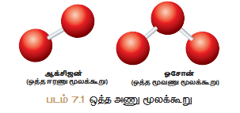
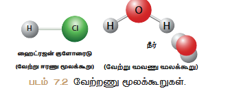
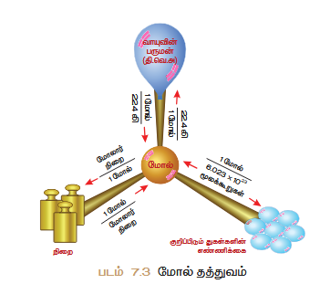

# அணுக்களும் மூலக்கூறுகளும்

## கற்றல் குறிக்கோள்கள் 

இப்பாடத்திற்குப் பிறகு, மாணவர்கள் பின்வரும் திறன்களைப் பெறுவர்:

- அணுக்கள் குறித்தும் மூலக்கூறுகள் பற்றிய அறிவைப் பெறுதல்
- அணுநிறை குறித்தும் மூலக்கூறு நிறையைத் தெரிவுபடுத்துதல்
- கிராம் அணு நிறை குறித்தும் கிராம் மூலக்கூறு நிறை பற்றிய கருத்துக்களைப் பெறுதல்
- வாயுக்கள் பற்றிய அவகாட்ரோ கருத்துக்களின் உள்ளடக்கிய கருத்துக்களைப் புரிந்து கொள்ளுதல்
- அவகாட்ரோ கருத்துக்களினை வாழ்வியல் சூழலுடன் தொடர்புபடுத்துதல்
- மூலக்கூறுகளின் அணுக்கட்டு எண்ணைக் கண்டறிதல்
- ஆவி அடர்த்திக்கும் ஒப்பு மூலக்கூறு நிறைக்கும் உள்ள தொடர்பினை வருவித்தல்
- வாயுக்களின் பருமனுக்கும் மூலக்கூறுகளின் எண்ணிக்கைக்கும் உள்ள தொடர்புகளைப் பெறுதல்
- மேல் தன்மையைப் பயன்படுத்தி கைக்கொள்ளத் தீர்தல்
- வீத இணைப்பினைக் கைக்கிடக் கற்றுக் கொள்ளுதல்

---

## அறிமுகம் 

நம்மைச் சுற்றியுள்ள பொருப்பொருட்கள் அனைத்தும் அணுக்களால் ஆனவை என்பது நாம் முன் வகுப்புகளில் படித்துள்ளோம். முன்முறையாக கி.மு (கி.பி.ஆ.மு) 5ம் நூற்றாண்டில் கிரேக்க தத்துவவியலாளர்கள் அணுவைப் பற்றிய சில கருத்துக்களை வெளியிட்டனர். அவர்களது கருத்துக்களை முற்றிலும் தத்துவம் சார்ந்தவையன்றி எந்தவொரு அறிவியல் அடிப்படையும் இல்லை.

ஜான் டால்டன் அணுவைப் பற்றிய முதல் அறிவியல் முக்கியத்துவத்தை வெளியிட்டார். டால்டனின் சில முக்கியத்துவங்கள் ஜே.ஜே.தாம்சன், ரூதர்ஃபோர்டு, நீல்ஸ்போர், ஷ்ரோடிங்கர்(Schrodinger) போன்ற பிற அறிவியல் அறிஞர்களின் ஆய்வுகளால் சரி எனக் கண்டறியப்பட்டது. அவர்களது ஆய்வு முடிவுகளின் அடிப்படையில் டால்டன் முக்கியத்துவத்தின் குறைகள் நீக்கப்பட்டு 'நவீன அணுக்கோட்பாடு' என முக்கிய முன்மொழியப்பட்டது.

### நவீன அணுக் கோட்பாடுகளின் சில முக்கிய கருத்துக்கள்:

- அணு என்பது பிளக்கக்கூடியது (எலக்ட்ரான், புரோட்டான் நியூட்ரான் கண்டுபிடிப்புக்குப் பிறகு)
- ஒரே தனிமத்தின் அணுக்கள் வெவ்வேறு அணு நிறைகளைப் பெற்றுள்ளன. (ஐசோடோப்புகளின் கண்டுபிடிப்புகளுக்குப் பிறகு எ.கா. ₁₇Cl³⁵, ₁₇Cl³⁷)
- வெவ்வேறு தனிமங்களின் அணுக்கள் ஒரே அணுநிறையைப் பெற்றுள்ளன. (ஐசோபார்களின் கண்டுபிடிப்புகளுக்குப் பிறகு எ.கா. ₁₈Ar⁴⁰, ₂₀Ca⁴⁰)
- அணுவை ஆக்கமவதா, அழிக்கமவதா முடியாது. ஒரு தனிமத்தின் அணுக்களை ஏதையாவது மற்றொரு தனிமத்தின் அணுக்களாக மாற்றமுடியும். (வகையற்ற மாற்று தனிமமாக்கல் முறை)
- அணு என்பது எளிய முழு எண்களின் விகிதத்தில் இருக்க வேண்டிய அவசியமில்லை. (எ.கா. குளுக்கோஸ் C₆H₁₂O₆ C:H:O=6:12:6 அல்லது 1:2:1 மற்றும் சுக்ரோஸ் C₁₂H₂₂O₁₁ C:H:O = 12:22:11)
- அணு என்பது வேதிவினையில் ஈடுபடும் மிகச்சிறிய துகள்

> **குறிப்பு:** ஒரு அணுவின் நிறையிலிருந்து ஆற்றலைக்கிடைக்க முடியும். E = mc² (E = ஆற்றல், m = நிறை, c = ஒளியின் வேகம்)

அணுக்களின் இயற்பியல் மற்றும் வேதியியல் பண்புகளுக்கு அடிப்படையானது. அணுவைப் பற்றிய அடிப்படைக் கருத்துக்களை நீங்கள் முன்வகுப்புகளில் படித்துள்ளீர்கள். இப்போது அணுவைப் பற்றி விரிவாகப் பார்ப்போம்.

---

## 7.1 அணுநிறை

எந்தவொரு பொருளின் நிறையைப் பற்றியும் அறியும்போது, அப்பொருள் பொருப்பொருட்கள் எனப்படும். பொருப்பொருட்களின் அடிப்படைத்துகள்கள், அணுக்கள் ஆகும். இந்த அணுக்களே பொருப்பொருட்களின் நிறைக்குக் காரணம். நவீன அணுக் கோட்பாட்டின்படி அணுவானது எலக்ட்ரான், புரோட்டான், நியூட்ரான் போன்ற உபதுகள்களைக் கொண்டுள்ளது. இவற்றில் புரோட்டான்களும் நியூட்ரான்களும் குறிப்பிடத்தக்க நிறையைப் பெற்றுள்ளன. இவற்றுடன் ஒப்பிடும்போது எலக்ட்ரான்களின் நிறை மிகவும் குறைவு. எனவே ஒரு அணுவின் நிறைக்குப் புரோட்டான்களும் நியூட்ரான்களுமே காரணமாக உள்ளன. இப்படி புரோட்டான்கள் மற்றும் நியூட்ரான்களின் கூடுதல் அந்த அணுவின் "நிறை எண்" எனப்படும்.

அதன் நிறையைக் கைக்கிடுவதும் மிகவும் சிரமமானது. நாம் பொருட்பொருட்களின் நிறையைக் கிராம் அல்லது கிலோகிராமில் கைக்கிடுவதாம். அதும்போல அணுவின் நிறையானது "அணுநிறை அலகு" (amu) அளக்கப்படுகிறது.

கார்பன் ஐசோடோப்புகளில் 6 புரோட்டான்களையும் 6 நியூட்ரான்களையும் கொண்டுள்ள C-12 அணுவின் நிறையில் 12 இல் ஒரு பகுதியே அணுநிறை அலகு ஆகும்.

> **குறிப்பு:** amu எனக் குறியீட்டிற்குப் பதில் 'u' எனக் குறியீடு பயன்படுத்தப்படுகிறது. ஏறத்தாழ ஒரு புரோட்டானின் நிறை அல்லது நியூட்ரானின் நிறையானது 1 amu ஆகும்.

### 7.1.1 ஒப்பு அணுநிறை 

அணுவுடைய நிறையை நேரடியாகக் கைக்கிட முடியாது. எனவே முற்காலத்தில் அதில் அணுநிறையைக் கைக்கிடுவதற்கு, அதனைத் தொடர்புணடையாத ஏதையாவது தனிமத்தின் நிறையுடன் ஒப்பிட்டுக் கைக்கிட்டார்கள். அவர்கள் ஒரே தாதியான நிறையைத் தொடர்புடைய இரண்டு அல்லது அதற்குமேற்பட்ட அணுக்களை ஒருமுறையில் எடுத்துக்கொண்டு, அவற்றில் ஒரு தனிமத்தின் அணுநிறைக்குக் குறிப்பிட்ட நிர்ணய அளவாகக் தொடர்புடையதாக்கி, அதனுடன் ஒப்பிட்டு மற்றைத் தனிமங்களின் அணுநிறைகளைக் கைக்கிட்டனர். இவ்வாறு பெறப்பட்ட அணுநிறை ஒப்பு அணுநிறை எனப்படும்.

முதலில் நைட்ரஜன் அணுவின் நிறையைத் நிர்ணய அளவாகக் தொடர்புடையதாக்கி மற்ற அணுக்களின் நிறைகள் கைக்கிடப்பட்டன. நைட்ரஜனின் (₁H¹, ₁H², ₁H³) ஐசோடோப்பு பண்புகளால் பின்னர் நைட்ரஜன் அணுவிற்குப் பதில் ஆக்ஸிஜன் அணுவானது திட்ட அளவாக எடுத்துக்கொள்ளப்பட்டது. இறுதியாக, அணுநிறை 12 தொடர்புடைய கார்பனின் நிறையான C-12 ஐசோடோப்பானது திட்ட அளவாக எடுத்துக்கொள்ளப்படுகிறது.

ஒரு தனிமத்தின் ஒப்பு அணுநிறை என்பது அத்தனிமத்தின் ஐசோடோப்புகளின் சராசரி அணுநிறைக்கும் C-12 அணுவின் நிறையில் 1/12 பங்கின் நிறைக்கும் உள்ள விகிதமாகும். இது 'Ar' என்று குறிப்பிடப்படுகிறது. இதனை 'திட்ட அணு எடை' எனவும் அழைக்கலாம்.


(A_r = \frac{\text{ஒரு தனிமத்தின் ஐசோடோப்புகளின் சராசரி அணுநிறை}}{\text{ஒரு C-12ன் அணுநிறையில் 1/12 பங்கின் நிறை}})


முன்மையான "நிறை நிர்ணய முறையில்" (mass spectrometric method) C-12 திட்ட அளவாகப் பயன்படுத்தப்படுகிறது. இப்பொழுது பெரும்பாலான தனிமங்களில் ஒப்பு அணுநிறையானது முழு எண்களாக இருப்பதால் கைக்கீட்டிற்கு எளிதாக முழு எண்களாக ஏற்றுமதியாகப் பயன்படுத்துகிறோம்.

**அட்டவணை 7.1: சில தனிமங்களின் ஒப்பு அணுநிறைகள்**

| தனிமம் | குறியீடு | அணுநிறை (C-12 அளவீடு) |
|---------|----------|------------------------|
| ஹைட்ரஜன் | H | 1 |
| கார்பன் | C | 12 |
| நைட்ரஜன் | N | 14 |
| ஆக்ஸிஜன் | O | 16 |
| சோடியம் | Na | 23 |
| மக்னீசியம் | Mg | 24 |
| கந்தகம் | S | 32 |

> **குறிப்பு:** ஒப்பு அணுநிறை என்பது ஒரு விகிதம், எனவே அதற்கு அலகு இல்லை.

ஒரு தனிமத்தின் அணுநிறையை கிராமில் குறிப்பிடுவதற்காகத்தால் அதற்கு நிறை "கிராம் அணுநிறை" என்று குறிப்பிடுவதற்கு:

- நைட்ரஜனின் கிராம் அணுநிறை = 1 கி
- கார்பனின் கிராம் அணுநிறை = 12 கி
- நைட்ரஜனின் கிராம் அணுநிறை = 14 கி
- ஆக்ஸிஜனின் கிராம் அணுநிறை = 16 கி

### 7.1.2 சராசரி அணுநிறை 

ஒரு தனிமத்தின் அணுநிறையை எவ்வாறு கைக்கிடுவது? இவற்றைக் கைக்கிடுவது என்பது மிகவும் சிரமம். ஏனெனில் தனிமங்கள் இயற்கையில் பல ஐசோடோப்புகளின் கலவையாக உள்ளன. ஒவ்வொரு ஐசோடோப்பும் தனித்தனிக் கொண்டுள்ளது. தனிமத்தின் கைக்கிடும் பொழுது இந்தக் கைக்கில் எடுத்துக்கொள்வது அவ்வொரு தனிமத்தின் சராசரி அணுநிறையைக் கணக்கிடுவது அவசியம்.

ஒரு தனிமத்தின் சராசரி அணுநிறை என்பது இயற்கையில் கிடைக்கக்கூடிய கைக்கிடப்பட்ட ஐசோடோப்புகளின் சராசரி நிறையைக் குறிப்பதாகும். ஆனால் இயற்கையில் அனைத்து ஐசோடோப்புகளும் ஒரே அளவில் கிடைப்பதில்லை. அணுநிறையைக் கைக்கிடும் முறையில் அனைத்து ஐசோடோப்புகளின் நிறைகள் மற்றும் சதவீத அளவுகளையும் நிறை கைக்கில் எடுத்துக்கொள்ளப்படுகிறது.

**சராசரி அணுநிறை =** (1வது ஐசோடோப்பின் நிறை × 1வது ஐசோடோப்பின் சதவீத அளவு) + (2வது ஐசோடோப்பின் நிறை × 2வது ஐசோடோப்பின் சதவீத அளவு)

> **குறிப்பு:** கைக்கிடும் முறையில் சதவீதத்தினை, தசாம முறையில் கைக்கிட வேண்டும்.

**எ.கா.:** 9 amu அணுநிறை உள்ள ஐசோடோப்பு 50% மற்றும் 10 amu அணுநிறை உள்ள ஐசோடோப்பு 50% எடுத்துக்கொள்ளப்பட்டதால் அதனுடைய சராசரி அணுநிறை கீழ்க்கண்டவாறு கைக்கிடப்படுகிறது.


(\text{சராசரி அணுநிறை} = (9 \times \frac{50}{100}) + (10 \times \frac{50}{100}) = 4.5 + 5 = 9.5 \text{ amu})


தனிம வரிசை அட்டவணையில் குறிப்பிடப்பட்டுள்ள தனிமங்களின் அணுநிறை என்பது சராசரி அணுநிறையாகும். சில சமயங்களில் அணு எடை என்பது சராசரி அணுநிறையைக் குறிப்பதாகும். தனிம வரிசை அட்டவணையின்படி பெரும்பாலான தனிமங்களின் அணுநிறை என்பது முழு எண்களாக இருப்பதில்லை என அறியப்படுகிறது.

**உதாரணம்:** தனிம வரிசை அட்டவணையில் கார்பனின் அணுநிறை 12.00 amu என்பதற்குப் பதிலாக 12.01 amu என்று குறிக்கப்பட்டுள்ளது. இதற்குக் காரணம் கார்பனின் அணுநிறையைக் கைக்கிடும் முறையில் C-12 மற்றும் C-13 ஐசோடோப்புகள் கைக்கில் எடுத்துக்கொள்ளப்படுகின்றன. கார்பன்-12 மற்றும் கார்பன்-13 ஆகியவற்றின் இயற்கைப் பரவல்கள் முறையே 98.90% மற்றும் 1.10% ஆகும்.

**கார்பனின் சராசரி அணுநிறை:**

(= (12 \times \frac{98.9}{100}) + (13 \times \frac{1.10}{100}))


(= (12 \times 0.989) + (13 \times 0.011))


(= 11.868 + 0.143 = 12.011 \text{ amu})


இதிலிருந்து கார்பனின் அணுநிறை 12 amu என்பது கார்பன் ஐசோடோப்புகளின் சராசரி அணுநிறையைவிட, தனிக் கார்பனின் அணுநிறை அடிப்படை.

**அட்டவணை 7.2: சில தனிமங்களின் அணுநிறைகள்**

| அணு எண் | தனிமம் | குறியீடு | அணுநிறை (u) |
|---------|--------|----------|-------------|
| 1 | ஹைட்ரஜன் | H | 1.008 |
| 2 | ஹீலியம் | He | 4.003 |
| 3 | லித்தியம் | Li | 6.941 |
| 4 | பெரிலியம் | Be | 9.012 |
| 5 | போரான் | B | 10.811 |

### சராசரி அணுநிறையைக் கணக்கிடுதல்

**எ.கா. 1:** பூமியின் மேற்பரப்பு மற்றும் மேனி உடலில் அதிகமாகக் காணப்படக்கூடிய தனிமம் ஆக்ஸிஜன். அது அட்டவணை 7.3 இல் காட்டப்பட்டுள்ளவாறு மூன்று வகையான நிறையான ஐசோடோப்புகளின் கலவையாக உள்ளது.

**அட்டவணை 7.3**

| ஐசோடோப்பு | நிறை (u) | சதவீதம் |
|-----------|----------|---------|
| ₁₆O⁸ | 15.9949 | 99.757 |
| ₁₆O⁹ | 16.9991 | 0.038 |
| ₁₆O¹⁰ | 17.9992 | 0.205 |


(\text{சராசரி அணுநிறை} = (15.9949 \times 0.99757) + (16.9991 \times 0.00038) + (17.9992 \times 0.00205) = 15.999 \text{ amu})


**எ.கா. 2:** இயற்கையில் தனிமம் போரான் என்பது போரான்-10 (5 புரோட்டான்கள் + 5 நியூட்ரான்கள்) மற்றும் போரான்-11 (5 புரோட்டான்கள் + 6 நியூட்ரான்கள்) ஆகியவற்றின் கலவையாக உள்ளது. B-10ன் சதவீதப் பரவல் 20% ஆகவும் B-11ன் சதவீதப் பரவல் 80% ஆகவும் உள்ளது.


(\text{போரானின் அணுநிறை} = (10 \times \frac{20}{100}) + (11 \times \frac{80}{100}) = (10 \times 0.20) + (11 \times 0.80) = 2 + 8.8 = 10.8 \text{ amu})


---

## 7.2 மூலக்கூறு மற்றும் மூலக்கூறு நிறை

தனிமங்களின் அணுக்களானது அம் தனிமத்தின் அணுக்களுடனோ அல்லது பிற தனிமங்களின் அணுக்களுடனோ இணைந்து மூலக்கூறு என்று பெயர். இரண்டு அல்லது அதற்குடமற்பட்ட அணுக்கள் அனைத்துக்கினடையயான ஒரு வலுவான வேதிக்கவர்ச்சியினால் (வேதிப்பிணைப்பால்) ஒன்றினைந்து உருவாகக்கூடியது, ஓர் மூலக்கூறு ஆகும்.

> **சிந்தனை சித்தனை:** அனைத்து சேர்மங்களும் மூலக்கூறுகளே, ஆனால் அனைத்து மூலக்கூறுகளும் சேர்மங்கள் அல்ல; ஏன்?

தனிமத்தின் அணுக்களால் அல்லது வெவ்வேறு தனிமங்களின் அணுக்களால் வேதி விதிப்படி, ஒரு குறிப்பிட்ட விகிதத்தில் ஒன்றிணைந்து உருவாவது மூலக்கூறு எனப்படும். ஆகவே மூலக்கூறு என்பது தனித்தனியாகவோ அல்லது பலவேறாகவோ இருக்கலாம். ஒரு மூலக்கூறானது ஒரே தனிமத்தின் அணுக்களால் உருவாக்கப்பட்டதால் அது ஒத்த அணுமூலக்கூறு என அழைக்கப்படும். ஒரு மூலக்கூறானது வெவ்வேறு தனிமங்களின் அணுக்களால் உருவாக்கப்பட்டதால் அது வேற்று அணுமூலக்கூறு என அழைக்கப்படும். மூலக்கூறில் உள்ள அணுக்களின் எண்ணிக்கையே அம் மூலக்கூறின் "அணுக்கட்டு எண்" ஆகும்.

**வகைப்பாடுகள்:**

| அணுக்களின் எண்ணிக்கை | பெயர் |
|---------------------|-------|
| 1 | ஒரணு மூலக்கூறு |
| 2 | இரணு மூலக்கூறு |
| 3 | மூவணு மூலக்கூறு |
| >3 | பலணு மூலக்கூறு |

ஆக்ஸிஜன் வாயு ஆக்ஸிஜன் (O₂), ஓசோன் (O₃) ஆகிய இரண்டு புரைமாற்று வேறுபட்ட வடிவங்களைக் கொண்டது.

**ஒத்த இரணு மூலக்கூறுகள்:**
ஒரு ஆக்ஸிஜன் (O₂) மூலக்கூறில் இரண்டு ஆக்ஸிஜன் அணுக்கள் உள்ளன. ஆகவே ஆக்ஸிஜனின் அணுக்கட்டு எண்: 2, இதில் இரண்டு அணுக்களும் ஒரே தாதியாக இருப்பதால் இது 'ஒத்த இரணு மூலக்கூறு' எனப்படும். ஒத்த இரணு மூலக்கூறுகளாகக் காணப்படும் பிற தனிமங்களாவன: நைட்ரஜன் (N₂), நைட்ரஜன் (Ne) மற்றும் ஹாலஜன்: (புளூரின் (F₂), குளோரின் (Cl₂), புரோமின் (Br₂), அயோடின் (I₂)).

**ஒத்த மூவணு மூலக்கூறு:**
ஓசோன் (O₃) மூலக்கூறில் மூன்று ஆக்ஸிஜன் அணுக்கள் உள்ளன. எனவே அது 'ஒத்த மூவணு மூலக்கூறு' என அழைக்கப்படுகிறது.

**பலணு மூலக்கூறு:**
ஒரு மூலக்கூறு மூன்றுக்குமேற்பட்ட அணுக்களைக் தொடர்புடையிருந்தால் அது 'பலணு மூலக்கூறு' எனப்படும்.

**வேற்று இரணு மூலக்கூறுகள்:**
ஹைட்ரஜன் குளோரைடு (HCl) எடுத்துக்கொண்டதால் அது நைட்ரஜன் மற்றும் குளோரின் ஆகிய இரண்டு வெவ்வேறு தனிமங்களின் அணுக்களால் ஆனவை. எனவே இதன் அணுக்கட்டு எண் 2. இது வேற்று இரணு மூலக்கூறு ஆகும்.

**வேற்று மூவணு மூலக்கூறு:**
நீர் மூலக்கூறு இரு நைட்ரஜன் அணுக்களையும் ஒரு ஆக்ஸிஜன் அணுவையும் கொண்டது. எனவே இதன் அணுக்கட்டு எண் 3. இது வேற்று மூவணு மூலக்கூறு ஆகும்.

**பிற எடுத்துக்காட்டுகள்:**
பாஸ்பரஸ் (P₄), கந்தகம் (S₈), அம்மோனியா (NH₃), நைட்ரஜன் அயோடைடு (HI), சல்பியூரிக் அமிலம் (H₂SO₄), மீத்தேன் (CH₄), குளுக்கோஸ் (C₆H₁₂O₆), கார்பனமோனாக்ஸைடு (CO).

---

## 7.3 ஒப்பு மூலக்கூறு நிறை 

ஆனவை, ஆலதால் அதற்கு நிறை உண்டு. ஒரு தனிம அல்லது பலவற்றின் மூலக்கூறு நிறையானது C-12 அளவீட்டினைப் பொருத்து அளக்கப்படுவதால் அது ஒப்பு மூலக்கூறு நிறை எனப்படும்.

**ஒப்பு மூலக்கூறு நிறை** என்பது ஒரு மூலக்கூறின் நிறைக்கும், C-12 அணுவின் நிறையில் 1/12 பங்கின் நிறைக்கும் உள்ள விகிதமாகும்.

அம் மூலக்கூறில் உள்ள அனைத்து அணுக்களின் ஒப்பு அணுநிறைகளின் கூடுதலுக்குச் சமம்.

> **குறிப்பு:** ஒப்பு மூலக்கூறு நிறை என்பது ஒரு விகிதம். எனவே அதற்கு அலகு இல்லை. ஒரு பலவற்றின் மூலக்கூறு நிறையை கிராமில் மூலக்கூறு நிறை என்று பெயர்.

- நீரின் கிராம் மூலக்கூறு நிறை = 18 கி
- CO₂ன் கிராம் மூலக்கூறு நிறை = 44 கி
- NH₃ன் கிராம் மூலக்கூறு நிறை = 17 கி
- HCl ன் கிராம் மூலக்கூறு நிறை = 36.5 கி

### மூலக்கூறு நிறையைக் கணக்கிடுதல்

மூலக்கூறு நிறையானது கீழ்க்கண்டவாறு கைக்கிடப்படுகிறது. சல்பியூரிக் அமிலமானது இரண்டு நைட்ரஜன் அணுக்களாலும் ஒரு கந்தக அணுவாலும் நான்கு ஆக்ஸிஜன் அணுக்களாலும் ஆனது.

**ஆகவே, சல்பியூரிக் அமிலத்தின் ஒப்பு மூலக்கூறு நிறை:**

(= (2 \times \text{நைட்ரஜனின் நிறை}) + (1 \times \text{கந்தகத்தின் நிறை}) + (4 \times \text{ஆக்ஸிஜனின் நிறை}))


(= (2 \times 1) + (1 \times 32) + (4 \times 16) = 2 + 32 + 64 = 98)


மூலக்கூறு நிறையானது 1/12 பங்கு C-12 அணுவின் நிறையைவிட 98 மடங்கு அதிகமானது.

**எ.கா. 2:** நீரின் ஒப்பு மூலக்கூறு நிறை கீழ்க்கண்டவாறு கைக்கிடப்படுகிறது. நீர் மூலக்கூறானது 2 நைட்ரஜன் அணுக்களையும் 1 ஆக்ஸிஜன் அணுவையும் கொண்டுள்ளது.


(\text{நீரின் ஒப்பு மூலக்கூறு நிறை} = (2 \times \text{நைட்ரஜனின் நிறை}) + (1 \times \text{ஆக்ஸிஜனின் நிறை}))


(= (2 \times 1) + (1 \times 16) = 18)


ஒரு நீர் மூலக்கூறின் நிறையானது 1/12 பங்கு C-12 அணுவின் நிறையைவிட 18 மடங்கு பெரியது.

---

## 7.4 மோல் தன்மை

இது வரையறையான பொருப்பொருட்களில் உள்ள தனித் அணுக்கள் மற்றும் மூலக்கூறுகளைப் பற்றி படிதமாம். அணுநிறை அலகானது தனிமங்களின் அணுநிறைகளுக்கு இடையயான ஒரு ஒப்பீட்டு நிர்ணயத்தை வழங்குகிறது. ஆனால் அணுக்கள் மிகச்சிறிய நிறையைக் கொண்டிருப்பதால், அணுநிறை அலகுக்கொண்டு பொருட் எண்ணிக்கையிலான அணுக்களின் நிறையைக் கைக்கிடுவது என்பது எளியதான முறையல்ல. நாம் பொருட் தாதிகளின் எண்ணிக்கையை அளவிடுபல் அளவுகள் பலவற்றைக் கொண்டுள்ளோம்.

**உதாரணம்:** கடைஜாடி (2 உருப்படிகள்) மற்றும் டஜன் (12 உருப்படிகள்) போன்றவை அனைவருக்கும் நன்கு தெரிந்த அலகுக்கள் ஆகும். அதும்போல அதிக எண்ணிக்கைக்கொண்ட அணுக்கள் மற்றும் மூலக்கூறுகளைக் குறிப்பிடுவதற்கு ஒரு சிறப்பு அலகும் ஏற்பட்டது. எனவே வேதியியலாளர்கள் அணுக்களையும் மூலக்கூறுகளையும் அளவிடுவதற்கு "மோல்" என அலகு பயன்படுத்துகின்றனர். இங்கு மோல் என்பது துகள்களின் எண்ணிக்கையையே குறிப்பிடுகிறது.

கார்பன்-12 (C-12) ஐசோடோப்பின் 12 கி (அல்லது 0.012 கி.கி) நிறையில் உள்ள அணுக்களின் எண்ணிக்கைக்குச் சமமான அடிப்படைத் துகள்களைக் கொண்டவை (அணுக்கள், மூலக்கூறு மற்றும் பிற) வாண்டவப் பொருளின் அளவு ஆகும். 12 கி நிறைக்கொண்ட C-12 ஐசோடோப்பில் உள்ள அணுக்களின் எண்ணிக்கை மெய்ந்நிரையமாக்கப்பட்டுள்ளது. இது இத்தாலிய அறிவியல் அறிஞர் அவகாட்ரோ என்பவரால் முன்மொழியப்பட்டதால் அவரது பெயரினைமையாக 'அவகாட்ரோ எண்' என அழைக்கப்படுகிறது. இந்த எண் **6.023 × 10²³** ஆகும்.

**ஆகவே ஒரு மோல் என்பது 6.023 × 10²³ துகள்களால் (மூலக்கூறுகளால்) ஆனது.**

> **உதாரணம்:** 5 மோல் ஆக்ஸிஜன் மூலக்கூறுகளில் 5 × 6.023 × 10²³ மூலக்கூறுகள் உள்ளன.

எண்ணிக்கை அலகாகப் பயன்படுத்தி மூலக்கூறுகளின் நிறை மற்றும் பருமனைக் கைக்கிடும் முறையே மோல் தத்துவம் ஆகும்.

கிடைக்கப்பெறும் பல்வேறு வகையான ரவுகளிலிருந்து பின்வருவாறு கைக்கிடப்படுகிறது:
- அணுக்களின் மோல்களின் எண்ணிக்கை
- மூலக்கூறுகளின் மோல்களின் எண்ணிக்கை
- வாயுக்களின் மோல்களின் எண்ணிக்கை (திட்ட வெப்பநிலையில் (S.T.P) திட்டமோலார் பருமன் = 22.400 லி)
- அயனிகளின் மோல்களின் எண்ணிக்கை

> **குறிப்பு:** அழுதநிலை என்பது 273.15 K மற்றும் 1 வளிமண்டல அழுத்தத்தைக் குறிக்கும்.

### ஒரு அணுவின் நிறை:
ஒரு மோல் அணு என்பது 6.023 × 10²³ அணுக்களைக் குறிப்பிடுவதாகும். இது அந்த அணுவின் கிராம் அணுநிறைக்குச் சமம்.

> **உதாரணம்:** ஒரு மோல் ஆக்ஸிஜன் அணு என்பது 6.023 × 10²³ ஆக்ஸிஜன் அணுக்களைக் கொண்டது. அதன் கிராம் அணுநிறை 16.

### ஒரு மூலக்கூறின் நிறை:
ஒரு மோல் மூலக்கூறு என்பது 6.023 × 10²³ மூலக்கூறுகளைக் குறிப்பிடுவதாகும். இது அந்த மூலக்கூறின் கிராம் மூலக்கூறு நிறைக்குச் சமம்.

> **உதாரணம்:** ஒரு மோல் மூலக்கூறு ஆக்ஸிஜன் என்பது 6.023 × 10²³ ஆக்ஸிஜன் மூலக்கூறுகளைக் கொண்டது. அதன் கிராம் மூலக்கூறு நிறை 32.

### மோலார் பருமன்:
திட்ட வெப்ப அழுதநிலையில் (S.T.P) ஒரு மோல் வாயுவானது 22.4 லிட்டர் அல்லது 22400 மி.லி. பருமனை ஆக்கிரமிக்கும். இதுவே மோலார் பருமன் எனவும் அழைக்கப்படுகிறது.

**மோல்களின் எண்ணிக்கையைக் கைக்கிடும் பல்வேறு முறைகள்:**


(\text{மோல்களின் எண்ணிக்கை}
 = \frac{\text{நிறை}}{\text{அணுநிறை}} 

   
   = \frac{\text{நிறை}}{\text{மூலக்கூறு நிறை}} 
   
      
      = \frac{\text{அணுக்களின் எண்ணிக்கை}}{6.023 \times 10^{23}}
 
 
  = \frac{\text{மூலக்கூறுகளின் எண்ணிக்கை}}{6.023 \times 10^{23}})


---

## 7.5 சதவீத இணைப்பு

நாம் இதுவரை, காட்டப்பட்ட பொருப்பொருட்களில் உள்ள துகள்களின் எண்ணிக்கையைப் பற்றி படிதமாம். ஆனால் பெரும்பாலான சமயங்களில் பல்வேறுகளில் உள்ள குறிப்பிட்ட தனிமங்களின் சதவீத இணைப்பு முக்கியமாகும்.

**சதவீத இணைப்பு** என்பது 100 கி பலவற்றில் உள்ள ஒவ்வொரு தனிமத்தின் நிறையைக் குறிப்பதாகும்.


(\text{தனிமத்தின் சதவீத இணைப்பு} = \frac{\text{தனிமத்தின் நிறை}}{\text{பலவற்றின் மூலக்கூறு நிறை}} \times 100)


**உதாரணம்:** நீரில் உள்ள நைட்ரஜன் மற்றும் ஆக்ஸிஜனின் சதவீத இணைப்பு கீழ்க்கண்டவாறு:

நீரின் மூலக்கூறு நிறை H₂O = 2(1) + 16 = 18 கி

- **நைட்ரஜனின் சதவீத இணைப்பு** = (2/18) × 100 = 11.11%
- **ஆக்ஸிஜனின் சதவீத இணைப்பு** = (16/18) × 100 = 88.89%

சதவீத இணைப்பானது பல்வேறுகளின் விகித வாய்ப்பாடு மற்றும் மூலக்கூறு வாய்ப்பாட்டைக் கண்டறிவதில் பயன்படுகிறது.

### சதவீத இணைப்புக் கைக்கீடுகள்:

**எ.கா. 1:** மீத்தேனில் உள்ள தனிமங்களின் சதவீத இணைப்பு

CH₄ன் மூலக்கூறு நிறை = 12 + 4 = 16 கி

- **கார்பனின் சதவீத இணைப்பு** = (12/16) × 100 = 75%
- **நைட்ரஜனின் சதவீத இணைப்பு** = (4/16) × 100 = 25%

---

## 7.6 அவகாட்ரோ கருதுகோட்பாடுகள்

1811 இல் அவகாட்ரோ என்ற அறிவியல் அறிஞர் மூலக்கூறுகளின் எண்ணிக்கைக்கும் அவற்றின் பருமனுக்கும் இடையயான தொடர்பினை வெவ்வேறு சூழ்நிலைகளில் கண்டறிந்து அவரது கருதுகோட்பாடுகளை வெளியிட்டார்.

**அவகாட்ரோ கூற்றின்படி:** "சம வெப்பம் மற்றும் அழுத்தநிலையில் சம பருமனுள்ள வாயுக்கள் அனைத்தும் சம அளவு எண்ணிக்கையிலான மூலக்கூறுகளைக் கொண்டிருக்கும்."

இப்படி காட்டப்பட்ட வாயுக்களின் பருமனையானது அவ்வாயுவின் மூலக்கூறுகளின் எண்ணிக்கைக்கும் நேர விகிதத்தில் தொடர்புணடையதாக இருக்கும்.


(V \propto n \text{ (அல்லது) } \frac{V_1}{n_1} = \frac{V_2}{n_2})


ஒரு லிட்டர் ஆக்ஸிஜனில் உள்ள மூலக்கூறுகளின் எண்ணிக்கைக்கு சமமாக இருக்கும். இந்த மூலம் வாயுக்களின் பருமனையானது அவற்றின் மூலக்கூறுகளின் எண்ணிக்கைக்கும் நேர விகிதத் தொடர்புடையது என்பது தெளிவாகிறது.

### மூலக்கூறு வாய்ப்பாடு கண்டறிதல்:

நைட்ரஜன் குளோரைடு உருவாகும் வினையை எடுத்துக்கொள்வோம்.

→ 1 பருமன் + 1 பருமன் → 2 பருமன்

வாயுக்கள் அனைத்தும் 'n' எண்ணிக்கையிலான மூலக்கூறுகளைப் பெற்றிருக்கும்.

n மூலக்கூறு + n மூலக்கூறு → 2n மூலக்கூறு

n = 1 எனில் → ½ மூலக்கூறு நைட்ரஜனையும் ½ மூலக்கூறு குளோரைடையும் கொண்டது. இந்த மூலம் மூலக்கூறுகளைப் பிரிக்க முடியும் என்பது தெளிவாகிறது. இது டால்டனின் அணுக் கோட்பாட்டை ஒத்திருக்கிறது.

---

## 7.7 ஆவி அடர்த்தி

**ஆவி அடர்த்தி** என்பது குறிப்பிட்ட பருமனுள்ள வாயு அல்லது ஆவியின் நிறைக்கும் அம் பருமனுள்ள நைட்ரஜன் அணுவின் நிறைக்கும் உள்ள விகிதமே ஆவி அடர்த்தி எனப்படும்.


(\text{ஆவி அடர்த்தி} = \frac{\text{வாயு (அ) ஆவியின் நிறை}}{\text{அதே அளவு நைட்ரஜன் அணுவின் நிறை}})


'n' எண்ணிக்கையிலான மூலக்கூறுகள் உள்ளதாகக் கொண்டால்,


(\text{ஆவி அடர்த்தி} = \frac{n \times \text{மூலக்கூறு வாயு (அ) ஆவியின் நிறை}}{n \times \text{மூலக்கூறு நைட்ரஜனின் நிறை}})


n = 1 எனக் கொண்டால்,


(\text{ஆவி அடர்த்தி} = \frac{\text{1 மூலக்கூறு வாயு (அ) ஆவியின் நிறை}}{\text{1 மூலக்கூறு நைட்ரஜனின் நிறை}} = \frac{\text{ஒப்பு மூலக்கூறு நிறை}}{2})


> **குறிப்பு:** நைட்ரஜனின் ஒப்பு மூலக்கூறு நிறை = 28, எனவே 2 × 14 = 28


(\boxed{\text{ஒப்பு மூலக்கூறு நிறை} = 2 \times \text{ஆவி அடர்த்தி}})


---

## பயிற்சிகள்

### I. கீழ்க்கண்டவற்றின் மூலக்கூறு நிறையைக் காண்க:

1. **H₂O**
   - H இன் அணுநிறை = 1, O-ன் அணுநிறை = 16
   - H₂O ன் மூலக்கூறு நிறை = (1 × 2) + (16 × 1) = 2 + 16 = **18 கி**

2. **CO₂**
   - C இன் அணுநிறை = 12, O-ன் அணுநிறை = 16
   - CO₂ன் மூலக்கூறு நிறை = (12 × 1) + (16 × 2) = 12 + 32 = **44 கி**

3. **Ca₃(PO₄)₂**
   - Ca இன் அணுநிறை = 40, P-ன் அணுநிறை = 30, O இன் அணுநிறை = 16
   - Ca₃(PO₄)₂ன் மூலக்கூறு நிறை = (40 × 3) + [(30 + (16 × 4)] × 2 = 120 + (94 × 2) = 120 + 188 = **308**

### II. கணக்கிடுக:

1. **0.3 mol அலுமினியத்தின் நிறை** (Al = 27)
   - நிறை = மோல்களின் எண்ணிக்கை × அணுநிறை = 0.3 × 27 = **8.1 கி**

2. **S.T.P இல் 2.24 லிட்டர் SO₂ன் நிறை**
   - மூலக்கூறு நிறை = 32 + (16 × 2) = 32 + 32 = 64 கி
   - மோல்களின் எண்ணிக்கை = பருமன் / மோலார் பருமன் = 2.24 / 22.4 = 0.1 மோல்
   - நிறை = 0.1 × 64 = **6.4 கி**

3. **1.51 × 10²³ மூலக்கூறுகள் கொண்ட நீரின் நிறை**
   - மோல்களின் எண்ணிக்கை = (1.51 × 10²³) / (6.023 × 10²³) = 0.25 மோல்
   - நிறை = 0.25 × 18 = **4.5 கி**

### III. மோல்களின் எண்ணிக்கையைக் காண்க:

1. **27 கி அலுமினியம்**
   - மோல்களின் எண்ணிக்கை = 27 / 27 = **1 மோல்**

2. **1.51 × 10²³ மூலக்கூறு NH₄Cl**
   - மோல்களின் எண்ணிக்கை = (1.51 × 10²³) / (6.023 × 10²³) = **0.25 மோல்**

### IV. அணுக்களின் எண்ணிக்கையைக் கைக்கிடுதல்:

1. **11.2 லிட்டர் CO₂ன் மூலக்கூறுகளின் எண்ணிக்கை**
   - மோல்களின் எண்ணிக்கை = 11.2 / 22.4 = 0.5 மோல்
   - மூலக்கூறுகளின் எண்ணிக்கை = 0.5 × 6.023 × 10²³ = **3.011 × 10²³ மூலக்கூறுகள்**

2. **1 கி தங்கம் (Au = 198)**
   - அணுக்களின் எண்ணிக்கை = (1 × 6.023 × 10²³) / 198 = **3.042 × 10²¹**

3. **54 கி H₂O**
   - மூலக்கூறுகளின் எண்ணிக்கை = (54 × 6.023 × 10²³) / 18 = **18.069 × 10²³**

4. **5 மோல் CO₂ன் அணுக்களின் எண்ணிக்கை**
   - 1 மோல் CO₂ இல் 2 மோல் ஆக்ஸிஜன் அணுக்கள் உள்ளது
   - 5 மோல் CO₂ இல் 10 மோல் ஆக்ஸிஜன் அணுக்கள் உள்ளது
   - ஆக்ஸிஜன் அணுக்களின் எண்ணிக்கை = 10 × 6.023 × 10²³ = **6.023 × 10²⁴**
   - 1 மோல் CO₂ இல் 1 மோல் கார்பன் அணுக்கள் உள்ளது
   - 5 மோல் CO₂ இல் 5 மோல் கார்பன் அணுக்கள் உள்ளது
   - கார்பன் அணுக்களின் எண்ணிக்கை = 5 × 6.023 × 10²³ = **3.011 × 10²⁴**

### V. மோலார் பருமன் கைக்குகள்:

1. **2.5 மோல் CO₂**
   - பருமன் = 2.5 × 22.4 = **56 லிட்டர்**

2. **12.046 × 10²³ மூலக்கூறு அம்மோனியா**
   - மோல்களின் எண்ணிக்கை = (12.046 × 10²³) / (6.023 × 10²³) = 2 மோல்
   - பருமன் = 2 × 22.4 = **44.8 லிட்டர்**

3. **14 கி N₂**
   - மோல்களின் எண்ணிக்கை = 14 / 28 = 0.5 மோல்
   - பருமன் = 0.5 × 22.4 = **11.2 லிட்டர்**

### VI. சதவீத இணைப்பு:

1. **H₂SO₄ல் உள்ள S இன் சதவீத இணைப்பு**
   - H₂SO₄ன் மூலக்கூறு நிறை = (1 × 2) + (32 × 1) + (16 × 4) = 2 + 32 + 64 = 98
   - S இன் சதவீத இணைப்பு = (32/98) × 100 = **32.65%**

---

## சுருக்கம் 

- **ஐசோடோப்புகள்:** ஒரே அணு எண்ணையும் வேறுபட்ட நிறை எண்களையும் கொண்டு ஒரு தனிமத்தின் வெவ்வேறு அணுக்கள் ஐசோடோப்புகள் எனப்படும். (எ.கா. ₁₇Cl³⁵, ₁₇Cl³⁷)
- **ஐசோபார்கள்:** ஒரே நிறை எண்ணையும் வேறுபட்ட அணு எண்களையும் கொண்டு வெவ்வேறு தனிமத்தின் அணுக்கள் ஐசோபார்கள் எனப்படும். (எ.கா. ₁₈Ar⁴⁰, ₂₀Ca⁴⁰)
- **ஒப்பு அணுநிறை:** ஒரு தனிமத்தின் ஒப்பு அணுநிறை என்பது அத் தனிமத்தின் சராசரி அணுநிறைக்கும் C-12 அணுவின் நிறையில் 1/12 பங்கின் நிறைக்கும் உள்ள விகிதமாகும்.
- **ஒப்பு மூலக்கூறு நிறை:** ஒப்பு மூலக்கூறு நிறை என்பது ஒரு மூலக்கூறின் நிறைக்கும், C-12 அணுவின் நிறையில் 1/12 பங்கின் நிறைக்கும் உள்ள விகிதமாகும்.
- **அவகாட்ரோ கூற்று:** "சம வெப்பம் மற்றும் அழுத்தநிலையில் சம பருமனுள்ள வாயுக்கள் அனைத்தும் சம அளவு எண்ணிக்கையிலான மூலக்கூறுகளைக் கொண்டிருக்கும்."
- **ஆவி அடர்த்தி:** சம வெப்பம் மற்றும் அழுத்தநிலையில் ஒரு குறிப்பிட்ட பருமனுள்ள வாயு அல்லது ஆவியின் நிறைக்கும் அம் பருமனுள்ள நைட்ரஜன் அணுவின் நிறைக்கும் உள்ள விகிதமே ஆவி அடர்த்தி எனப்படும்.
- **அணுக்கட்டு எண்** = மூலக்கூறு நிறை / அணுநிறை
- **ஒப்பு மூலக்கூறு நிறை** = 2 × ஆவி அடர்த்தி

---

## மதிப்பீடு வினாக்கள்

### I. ஒரு வார்த்தை விடையளி:

1. கீழ்க்கண்டவற்றுள் எது குறைந்த நிறையைக் கொண்டது?
   - ஆ. 1 ஹீலியம் அணு
   - இ. 2 கி ஹீலியம்
   - ஈ. 1 மோல் ஹீலியம் அணு

2. 6.023 × 10²³ எண்ணிக்கையிலான அணுக்களைக் கொண்டது?
   - ஆ. ஹீலியம்
   - இ. கார்பன்
   - ஈ. நைட்ரஜன்

3. 1 மோல் வாயுவின் பருமன் S.T.P இல்?
   - அ. 22.4 லிட்டர்
   - ஆ. 2.24 லிட்டர்
   - இ. 0.24 லிட்டர்
   - ஈ. 0.1 லிட்டர்

4. 1 மோல் நைட்ரஜனின் நிறை?
   - இ. 28 கி
   - ஈ. 14 கி

5. 1 amu என்பது?
   - அ. C-12ன் அணுநிறை
   - ஆ. நைட்ரஜனின் அணுநிறை
   - இ. ஒரு C-12ன் அணுநிறையில் 1/12 பங்கின் நிறை
   - ஈ. O-16ன் அணுநிறை

6. சரியானது எது?
   - ஆ. ஒரு மோல் ஆக்ஸிஜன் வாயுவானது அவகாட்ரோ எண்ணிக்கையிலான மூலக்கூறுகளைக் கொண்டது
   - இ. ஒரு மோல் நைட்ரஜன் வாயுவானது அவகாட்ரோ எண்ணிக்கையிலான அணுக்களைக் கொண்டது
   - ஈ. ஒரு மோல் எலக்ட்ரான் என்பது 6.023 × 10²³ எலக்ட்ரான்களைக் குறிக்கிறது

7. திட்ட வெப்ப அழுத்தநிலையில் 1 மோல் இரணு மூலக்கூறு வாயுவின் பருமன்?
   - அ. 11.2 லிட்டர்
   - ஆ. 5.6 லிட்டர்
   - இ. 22.4 லிட்டர்
   - ஈ. 44.8 லிட்டர்

8. ₂₀Ca⁴⁰ தனிமத்தின் உட்கருவில்?
   - அ. 20 புரோட்டான் 40 நியூட்ரான்
   - ஆ. 20 புரோட்டான் 20 நியூட்ரான்
   - இ. 20 புரோட்டான் 40 எலக்ட்ரான்
   - ஈ. 20 புரோட்டான் 20 எலக்ட்ரான்

9. ஆக்ஸிஜனின் கிராம் மூலக்கூறு நிறை?
   - அ. 16 கி
   - ஆ. 18 கி
   - இ. 32 கி
   - ஈ. 17

10. 1 மோல் எந்தவொரு பொருளும் __________ மூலக்கூறுகளைக் கொண்டிருக்கும்
    - அ. 6.023 × 10²³
    - ஆ. 6.023 × 10⁻²³
    - இ. 3.0115 × 10²³
    - ஈ. 12.046 × 10²³

### II. காலிட்ட இடங்களை நிரப்புக:

1. இரு வேறு தனிமங்களின் அணுக்கள் __________ நிறை எண்ணையும் __________ அணு எண்ணையும் கொண்டிருந்தால் அவை ஐசோபார்கள் எனப்படும்.
2. ஒரு தனிமத்தின் அணுக்களை ஏதையாவது மற்றொரு தனிமத்தின் அணுக்களாக __________ முறையில் மாற்றலாம்.
3. புரோட்டான்கள் மற்றும் நியூட்ரான்களின் கூடுதல் அந்த அணுவின் __________ எனப்படும்.
4. ஒப்பு அணுநிறை என்பது __________ எனவும் அழைக்கப்படுகிறது.
5. நைட்ரஜனின் சராசரி அணுநிறை = __________.
6. ஒரு மூலக்கூறானது ஒரே தனிமத்தின் அணுக்களால் உருவாக்கப்பட்டதால் அவை __________ எனப்படும்.
7. ஒரு மூலக்கூறில் உள்ள அணுக்களின் எண்ணிக்கையே அம் மூலக்கூறின் __________ ஆகும்.
8. திட்ட வெப்ப அழுத்தநிலையில் __________ மி.லி இடத்தை ஆக்கிரமிக்கக்கூடிய வாயு 1 மோல் எனப்படும்.
9. பாஸ்பரஸின் அணுக்கட்டு எண் = __________.

### III. பொருத்துக:

| நிறை | மோல்களின் எண்ணிக்கை |
|------|---------------------|
| 8 கி O₂ | 4 மோல்கள் |
| 4 கி H₂ | 0.25 மோல்கள் |
| 52 கி He | 2 மோல்கள் |
| 112 கி N₂ | 0.5 மோல்கள் |
| 35.5 கி Cl₂ | 13 மோல்கள் |

### IV. சரியா? தவறா? (தவறு எனில் கூற்றினைத் திருத்துக):

1. இரு தனிமங்கள் இணைந்து ஒன்றுக்குமேற்பட்ட பலவற்றை உருவாக்கும்.
2. சேர்ந்த வாயுக்கள் அனைத்தும் இரணு மூலக்கூறுகள் ஆகும்.
3. தனிமங்களின் கிராம் அணுநிறைக்கு அலகு இல்லை.
4. 1 மோல் தங்கம் மற்றும் 1 மோல் வெள்ளி ஆகியவை ஒரே எண்ணிக்கையிலான அணுக்களைக் கொண்டிருக்கும்.
5. CO₂ன் மூலக்கூறு நிறை 42.

### V. பின்வரும் வினாக்களில் கூற்றும் அதனையடுத்து காரணமும் விளக்கப்பட்டுள்ளன. பின்வருவனவற்றுள் எது சரியானவை எனத் தெரிவு செய்க:

**1. கூற்று:** அலுமினியத்தின் ஒப்பு அணுநிறை 27. காரணம்: ஒரு அலுமினியம் அணுவின் நிறையானது 1/12 பங்கு கார்பன்-12-ன் நிறையைவிட 27 மடங்கு அதிகம்.

**2. கூற்று:** குளோரினின் ஒப்பு மூலக்கூறு நிறை 35.5 amu. காரணம்: குளோரினின் ஐசோடோப்புகள் இயற்கையில் சம அளவில் கிடைக்கின்றன.

### VI. சுருக்கமாக விடையளி:

1. ஒப்பு அணுநிறை - வரையறு
2. ஆக்ஸிஜனின் பல்வேறு ஐசோடோப்புகளையும் அவற்றின் சதவீதப் பரவலையும் குறிப்பிடுக.
3. அணுக்கட்டு எண் - வரையறு.
4. வேறுபட்ட இரணு மூலக்கூறுகளுக்கு 2 எடுத்துக்காட்டுகள்.
5. வாயுவின் மோலார் பருமன் என்பதால் என்ன?
6. அம்மோனியாவில் உள்ள நைட்ரஜனின் சதவீத இணைப்பைக் கண்டறிக.

### VII. விரிவாக விடையளி:

1. 0.18 கி நீர்த் துளியில் உள்ள நீர் மூலக்கூறுகளின் எண்ணிக்கையைக் கைக்கிடு.
2. N₂ + 3H₂ → 2NH₃ (N = 14, H = 1)
   - 1 மோல் நைட்ரஜன் = __________ கி + 3 மோல் நைட்ரஜன் = __________ கி
   - 2 மோல் அம்மோனியா = __________ கி
3. மோல்களின் எண்ணிக்கையைக் கண்டறிக:
   - அ. 27 கி அலுமினியம்
   - ஆ. 1.51 × 10²³ மூலக்கூறு NH₄Cl
4. நவீன அணுக் கோட்பாட்டின் முக்கியத்துவங்களை எழுதுக.
5. ஒப்பு மூலக்கூறு நிறைக்கும் ஆவி அடர்த்திக்கும் உள்ளத் தொடர்பினை வருவி.

### VIII. செயல்பாட்டு வினாக்கள்:

மேலே கீழ்க்கண்டவாறு சிந்தனைக் கூறு:
CaCO₃ → CaO + CO₂

- அ. இவ்வினையில் எத்தனை மோல்கள் கால்சியம் கார்பனேட்டில் ஈடுபடுகிறது?
- ஆ. கால்சியம் கார்பனேட்டின் கிராம் மூலக்கூறு நிறையைக் கணக்கிடு.
- இ. இவ்வினையில் எத்தனை மோல்கள் கார்பன் டைஆக்ஸைடு வெளிவருகிறது?

### IX. கணக்கிடுக:

1. கீழ்க்கண்டவற்றின் நிறையைக் காண்க:
   - அ. 2 மோல்கள் நைட்ரஜன் மூலக்கூறு
   - ஆ. 3 மோல்கள் குளோரின் மூலக்கூறு
   - இ. 5 மோல்கள் கந்தக மூலக்கூறு
   - ஈ. 4 மோல்கள் பாஸ்பரஸ் மூலக்கூறு

2. கால்சியம் கார்பனேட்டில் உள்ள ஒவ்வொரு தனிமத்தின் சதவீத இணைப்பைக் காண்க (Ca = 40, C = 12, O = 16).

3. Al₂(SO₄)₃ல் உள்ள ஆக்ஸிஜனின் சதவீத இணைப்பைக் காண்க (Al = 27, S = 32, O = 16).

4. போரானின் சராசரி அணுநிறை 10.804 amu எனில் B-10 மற்றும் B-11 சதவீதப் பரவலைக் காண்க?

---

## மேல் படிப்புக்கு:

### நூல்கள்:
1. Modern Applications (9th Edition). Upper Saddle River, NJ: Pearson Prentice Hall, 2007.
2. Raymond Chang. (2010). Chemistry. New York, NY: The Tata McGraw Hill Companies. Inc.
3. Julia Burdge. (2011). Chemistry. New York, NY: The Tata McGraw Hill Companies. Inc.

### இணைய வளங்கள்:
1. https://www.estimate.com/biology/farabee/biobk/BioBookCHEM1.html
2. https://www.toppr.com/guides/chemistry/atomsand-molecules/

---

## கருத்துப்படம் 

---