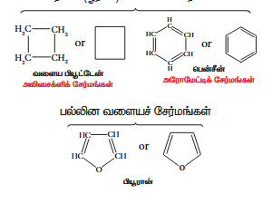
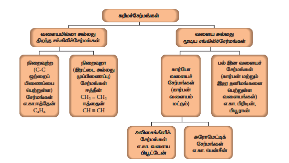
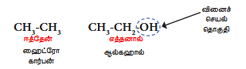
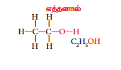
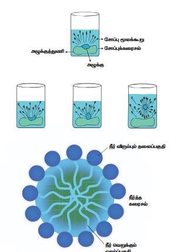
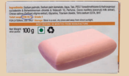
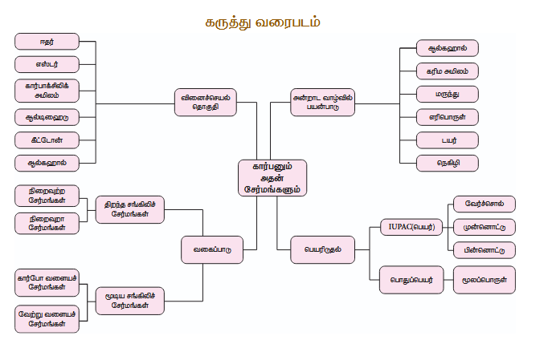

# அலகு 11: கார்பனும் அதன் சேர்மங்களும்

## கற்றல் நோக்கங்கள்

இந்த அலகில் மாணவர்கள் அறிந்து கொள்ள இருப்பது:
- கரிமச் சேர்மங்கள் பற்றி அறிந்து கொள்ளுதல்
- கரிமச் சேர்மங்களை வகைப்படுத்துதல் மற்றும் IUPAC முறையில் பெயரிடுதல்
- கரிமச் சேர்மங்களின் வினைச் செயல் குழுக்களை கண்டறிதல்
- எத்தனால் மற்றும் எத்தனாயிக் அமிலம் ஆகியவற்றின் தயாரிப்பு முறை, பண்புகள் மற்றும் பயன்களை அறிந்து கொள்ளுதல்
- சோப்பு மற்றும் டிடர்ஜெண்டின் இயல்பு மற்றும் தயாரிக்கும் முறையை அறிந்து கொள்ளுதல்
- சோப்பு மற்றும் டிடர்ஜெண்ட் செயல்படும் முறையை அறிந்து கொள்ளுதல்
- சோப்பு மற்றும் டிடர்ஜெண்ட் ஆகியவற்றின் வேறுபாடுகள்

## அறிமுகம்

நமது அன்றாட வாழ்வில் ஏராளமான கார்பன் சேர்மங்களைப் பயன்படுத்தி வருகிறோம். கார்பன் இல்லாத மனித வாழ்க்கையை நினைத்துக் கூடப் பார்க்க முடியாது. நாம் உண்ணும் உணவுகள், உடல் நலக் குறைவு ஏற்படும் சமயத்தில் எடுத்துக் கொள்ளும் மருந்துகள், உடுத்தும் உடைகள், வீடு மற்றும் வாகனங்களில் பயன்படுத்தும் எரிப்பொருட்கள் என நம்மைச் சுற்றியுள்ள அனைத்துப் பொருட்களிலும் கார்பன் அல்லது கார்பனின் சேர்மங்கள் இருக்கின்றன. தனிம வரிசை அட்டவணையில் உள்ள அனைத்துத் தனிமங்களைவிடவும் இயற்கையாக மற்றும் மனிதனால் உருவாக்கப் பட்ட கார்பன் சேர்மங்களின் எண்ணிக்கை அதிகமாக இருக்கின்றன. ஐந்து மில்லியனுக்கும் அதிகமான கார்பன் சேர்மங்கள் பூமியில் காணப் படுகின்றன. சங்கிலித் தொடர்பு (catenation), நான்கு இணைதிறன் அளவு, பிற தனிமங்களுடன் சேர்ந்து அதிக அளவில் சேர்மங்களை உருவாக்கும் தன்மைப் போன்ற கார்பனின் சிறப்புப் பண்புகள் மற் தனிமங்களிலிருந்து கார்பனை வேறுபடுத்துகின்றன. இதனால் ஹைட்ரஜன், ஆக்சிஜன், நைட்ரஜன், சல்பர் போன்ற அனைத்துத் தனிமங்களுடனும் எளிதாகப் பிணைப்பு ஏற்படுத்தி சேர்மங்களை உருவாக்குகிறது. இச் சேர்மங்கள் குறைந்த பாலும் நேர்ப் பிணைப்பினால் தான் உருவாகின்றன. இச் சேர்மங்களை கரிமச் சேர்மங்கள் என்று அழைக்கிறோம். கார்பன் மற்றும் அதன் சேர்மங்களைப் பற்றி இந்தப் பாடத்தில் நாம் அறிந்து கொள்ளலாம்.

## 11.1 கரிமச் சேர்மங்களின் வேதப் பண்புகள்

இந்த அலகில் உள்ள ஒவ்வொரு பொருளுக்கும் சித்தனித்துவமான பண்புகள் இருப்பது போல் கரிமச் சேர்மங்களுக்கும் சில பொதுப் பண்புகள் இருக்கின்றன. அவைகளில் சில கீழே காட்டப்பட்டுள்ளன.

- கரிமச் சேர்மங்கள் சிக்கலான அளைப்பையும், அதிக மூலக்கூறு நிறையையும் கொண்டுள்ளன
- கரிமச் சேர்மங்கள் குறைந்த வற்றாக நீரில் கரையாது. ஆனால் ஈதர், கார்பன் டெட்ராகுளோரைடு, கடல் எண்ணெய் போன்ற கரிமக் கரைப் பொருட்களில் கரையும்
- கரிமச் சேர்மங்கள் எளிதில் எரியக்கூடிய தன்மை உடையவை
- கரிமச் சேர்மங்களை கனிமச் சேர்மங்களோடு ஒப்பிடும்போது குறைந்த வெப்பநிலையில் காணப்படுகின்றன. இதனால் அவற்றின் வினைகளும் குறைந்த வெப்பநிலையில் நிகழ்கின்றன
- குறைந்த பாலான கரிமச் சேர்மங்கள் இயற்கையாகவே நேர்ப் பிணைப்புக் கொண்டுள்ளன
- கரிமச் சேர்மங்கள் கனிமச் சேர்மங்களைவிட குறைந்த உருகுநிலையும் காந்தநிலையும் கொண்டுள்ளன
- கரிமச் சேர்மங்கள் மறைந்திய பண்புகளைப் பற்றுள்ளன. அதாவது ஒரு மூலக்கூறு வகையப் பொருட்களைக் கொண்ட கரிமச் சேர்மங்கள் அதனுடைய இயற்பியல் மற்றும் வேதியியல் பண்புகளில் மாறுகின்றன
- இவை எளிதில் ஆவியாகும் தன்மையுடையது
- பல்வேறு கரிமச் சேர்மங்களை ஆய்வகத்தில் தயாரிக்க முடியும்

## 11.2 கரிமச் சேர்மங்களை அவற்றின் கார்பன் சங்கிலி வடிவனமைப்பு வாயிலாக வகைப்படுத்துதல்

வகைப்படுத்துதலின் முக்கியத்துவம் என்ன?

இந்த அலகில் ஏற்கனவே காணப்படும் கார்பன் சேர்மங்கள் கண்டுபிடிக்கப்பட்டுள்ளன. ஆண்டுதோறும் புதிய சேர்மங்கள் கண்டுபிடிக்கப்படுகின்றன. கரிமச் சேர்மங்கள் அதிக அளவில் காணப்படுவதாலும் தொடர்ந்து புதிய கரிமச் சேர்மங்கள் தயாரிக்கப்படுவதாலும் அவைகளை வகைப்படுத்துதல் சதளவயானதாகிறது. எனவே ஒவ்வொரு சேர்மத்திற்கும் தனியான மூலக்கூறு அளைப்பு வைங்கி, முறையான வகைப்படுத்துதல் மூலம் வரிசைப்படுத்தி, அளைப்பின் அடிப்படையில் அவற்றிற்கு பெயரிடலாம்.

ஆரம்பகாலங்களில், ஒரு விதமான மூலக்கூறு அளைப்புடன் உள்ள சேர்மங்கள், ஒரு மாதிரியான வேதியியல் பண்புகளைப் பற்றிருக்கும் என்று அறிவியலாளர்கள் கருதினர். ஆகவே, அவர்கள் ஒரு மாதிரியான மூலக்கூறு அளைப்புடன் கொண்ட சேர்மங்களை வகைப்படுத்தத் தொடங்கினர். எங்கிலித் தொடர்பின்றான கார்பன் சேர்மங்களை வகைத்துக் காட்டுவது தான் கரிமவேதியியல். கரிமச் சேர்மங்களில், கார்பன் அணுக்கள் மற் அணுக்களோடு நேர்ப் பிணைப்பு மூலம் பிணைக்கப்பட்டிருக்கும். இந்த நேர்ப் பிணைப்பு ஒரு சங்கிலித் தொடரை உருவாக்கும். இதன் அடிப்படையில் கரிமச் சேர்மங்களை இருவகைகளாகப் பிரிக்கலாம்.

### 1. வளையமற்ற அல்லது திறந்த சங்கிலிச் சேர்மங்கள்

இவற்றில் கார்பனும் ஹைட்ரஜனும் சேர்ந்து அளைப்பில் சங்கிலித் தொடரில் இணைகின்றன. அனைத்துக் கார்பன் அணுக்களும் ஒற்றைப் பிணைப்பில் அளைந்திருந்தால், அது நிறைவுற்ற சேர்மம் என்று அழைக்கப்படுகிறது. ஒன்று அல்லது அதற்குச் சமப்பட்ட இரட்டைப் பிணைப்பு அல்லது முப்பிணைப்பு அளைந்திருந்தால் அது நிறைவற்ற சேர்மம் என்று அழைக்கப்படுகிறது.

**எடுத்துக்காட்டுகள்:**

| சேர்மம் | வாய்ப்பாடு | வகை |
|---------|-----------|------|
| புரப்பேன் |   (CH_3-CH_2-CH_3)   | நிறைவுற்ற சேர்மம் |
| புரப்பீன் |   (CH_3-CH=CH_2)   | நிறைவற்ற சேர்மம் |

### 2. வளையச் சேர்மங்கள்

கரிமச் சேர்மங்களின் கார்பன் சங்கிலித் தொடர் மூடியிருந்தால் அவை வளையச் சேர்மங்கள் என்று அழைக்கப்படுகின்றன. ஒரு சங்கிலித் தொடரில் கார்பன் அணுக்கள் மட்டும் அளைந்திருந்தால் அவை கார்பனா (ஓரின) வளையச் சேர்மங்கள் என அழைக்கப்படுகின்றன. கார்பன் அணுக்களோடு ஆக்சிஜன், நைட்ரஜன், சல்பர் போன்ற மற் அணுக்களும் சங்கிலித் தொடரில் இணைந்திருந்தால் அவை பல்லின வளையச் சேர்மங்கள் என அழைக்கப்படுகின்றன.

கார்பனா (ஓரின) வளையச் சேர்மங்களை அலிசைக்ளிக் சேர்மங்கள் மற்றும் அரோமாட்டிக் சேர்மங்கள் என இரண்டாகப் பிரிக்கலாம். அலிசைக்ளிக் சேர்மங்கள் நிறைவுற்ற அல்லது நிறைவற்ற, ஒன்று அல்லது அதற்குச் சமப்பட்ட கார்பனா வளையங்களைப் பற்றிருக்கும். அரோமாட்டிக் சேர்மங்கள் ஒன்று அல்லது ஒன்றுக்குச் சமப்பட்ட பென்சீன் வளையங்களைக் கொண்டிருக்கும். (வளையத்தில் இரண்டு கார்பன் அணுக்களுக்கு இடையில் ஒன்று விட்ட இரட்டைப் பிணைப்பு இருக்கும்).

கார்பன் அணுக்களின் அளைப்பு மற்றும் கரிமச் சேர்மங்களில் அவற்றின் பிணைப்பு ஆகியவற்றின் அடிப்படையில், கரிமச் சேர்மங்களை வகைப்படுத்துவது படம் 11.1 விளக்குகிறது.






**படம் 11.1: கரிமச் சேர்மங்களின் வகைப்பாடு**


## 11.3 அணுக்கரு வாயிலாக கரிமச் சேர்மங்களின் வகைகள்

ஹைட்ரஜன், ஆக்சிஜன், நைட்ரஜன் போன்ற அணுக்களும் கார்பனுடன் பிணைப்பு ஏற்படுத்தியிருக்கும். இதனைப் பொறுத்தும் நாம் கரிமச் சேர்மங்களை வகைப்படுத்தலாம். அதில் சில வகைகளை இங்கு காண்போம்.

### 11.3.1 ஹைட்ரோகார்பன்கள்

கார்பன் மற்றும் ஹைட்ரஜன் மட்டும் இணைந்து உருவாகும் சேர்மங்கள் ஹைட்ரோகார்பன்கள் ஆகும். கார்பன் அணுக்கள் இணைந்து சேர்மத்தின் கட்டமைப்பை உருவாக்குகின்றன. ஹைட்ரோகார்பனைத் தவிர மற்ற கரிமச் சேர்மங்கள் யாவும் ஒன்று அல்லது அதற்குச் சமப்பட்ட ஹைட்ரஜன் அணுக்களுக்குப் பதிலாக மற் அணுக்களைச் சயறா அல்லது அணுக்களின் குழுக்களைச் சயறா பதிலீடு செய்யப்படுவதன் மூலம் கிடைப்பதால் ஹைட்ரோகார்பன்கள் தாய் வழிக் கரிமச் சேர்மங்களாக கருதப்படுகின்றன. ஹைட்ரோகார்பன்கள் சுமார் மூன்று வகைகளாகப் பிரிக்கப்படுகின்றன.

#### அல்கேன்கள்

  CH_4 கொண்டு   n = 1, 2, 3, ...   கார்பன்களுக்கிடையே ஒற்றைப் பிணைப்புடன் கொண்ட சேர்மங்கள் அல்கேன்கள் ஆகும்.   n = 1   என எடுத்துக் கொள்ளும்போது அதன் முதல் உறுப்பான மீத்தேன்  CH_4  கிடைக்கிறது.

#### அல்கீன்கள்

 C_nH_{2n}  என்கிற பொதுவாய்ப்பாட்டுடன் கொண்ட கார்பன்களுக்கிடையே இரட்டைப் பிணைப்புடன் கொண்ட சேர்மங்கள் அல்கீன்கள் ஆகும்.   (n = 2)   என எடுத்துக் கொள்ளும்போது அதன் முதல் உறுப்பான எத்திலீன   C_2H_4   கிடைக்கிறது. இவை நிறைவற்ற கரிமச் சேர்மங்கள் ஆகும்.

#### அல்கைன்கள்

கார்பன்களுக்கிடையே முப்பிணைப்புடன் கொண்ட சேர்மங்கள் அல்கைன்கள் ஆகும். இதன் முதல் உறுப்பு அசிட்டிலீன்   (C_2H_2)   ஆகும்.

**ஒன்று முதல் ஐந்து கார்பன்கள் கொண்ட ஹைட்ரோகார்பன்கள்:**

| கார்பன் எண்ணிக்கை | அல்கேன்கள்   (C_nH_{2n+2})  | அல்கீன்கள்   (C_nH_{2n})   | அல்கைன்கள்  ( C_nH_{2n-2}  ) |
|------------------|---------------------------|--------------------------|---------------------------|
| 1 | மீத்தேன்   (CH_4)   | - | - |
| 2 | ஈத்தேன்   (C_2H_6)   | எத்தீன்   (C_2H_4)  | எத்தைன்  ( C_2H_2)   |
| 3 | புரப்பேன்   (C_3H_8)  | புரப்பீன்   (C_3H_6)   | புரப்பைன் ( C_3H_4)   |
| 4 | பியூட்டேன்   (C_4H_{10})   | பியூட்டீன்   (C_4H_8)   | பியூட்டைன்   (C_4H_6)   |
| 5 | பென்டேன்   (C_5H_{12})   | பென்டீன்   (C_5H_{10})   | பென்டைன்   (C_5H_8)   |

நிறைவற்ற கரிமச் சேர்மங்கள் ஆகும் சமநிலை கொண்ட மூன்று வகை ஹைட்ரோகார்பன் சேர்மங்களின் குடும்பத்தில் உள்ள முதல் ஐந்து சேர்மங்கள் அட்டவணை 11.1-ல் காட்டப்பட்டுள்ளன.

### 11.3.2 ஹைட்ரோகார்பன்களின் பண்புகள்

- குறைந்த கார்பன் எண்ணிக்கையைக் கொண்டிருக்கும் ஹைட்ரோகார்பன்கள் அறை வெப்பநிலையில் வாயுக்களாக உள்ளன. (மீத்தேன், ஈத்தேன் ஆகியவை வாயுக்கள்)
- ஹைட்ரோகார்பன்கள் நிறமற்ற மற்றும் மணமில்லாதவை
- கார்பன் எண்ணிக்கை அதிகரிக்கும்போது ஹைட்ரோகார்பனின் காந்தநிலை அதிகரிக்கும்
- ஆக்சிஜனுடன் வினைபுரிந்து இவை கார்பன் டைஆக்ஸைடு மற்றும் நீராக மாறுகின்றன
- மற் ஹைட்ரோகார்பனுடன் ஒப்பிடும்போது அல்கேன்கள் குறைந்த வினைத்திறன் கொண்டவை
- அல்கைன்களில் முப்பிணைப்பு காணப்படுவதால் அவை அதிக வினைத்திறன் கொண்டுள்ளன

அல்கேன்கள் நிறைவுற்ற கரிமச் சேர்மங்கள், அல்கீன்களும் அல்கைன்களும் நிறைவற்ற கரிமச் சேர்மங்கள் ஆகும்.

**நினைவுறுத்தும் மற்றும் நினைவாடச் சேர்மங்களை கண்டுபிடிப்பதற்கான சோதனை:**

- சோடியம் நைட்ரேட்டில் சிறிதளவு மாதிரியை எடுத்துக் கொள்ளவும்
- புரோமின் நீரின் சிவப்பு நிறத்தைச் சோடியம் நைட்ரேட்டில் கலந்து விட்டு க்ளோரோஃபார்மின் நிறமறைவைக் கவனியுங்கள்
- க்ளோரோஃபார்மின் நிறமறைவினால் காட்டப்பட்டுள்ள மாதிரி நிறைவற்ற சேர்மம் க்ளோரோஃபார்மின் நிறமாறவில்லையென்றால் காட்டப்பட்டுள்ள மாதிரி நிறைவுற்ற சேர்மம் ஆகும்


**படம் 11.2: நிறைவற்ற சேர்மங்களை கண்டறிவதற்கான சோதனை**


### 11.3.3 வினைச் செயல் குழுவின் அடிப்படையில் கரிமச் சேர்மங்களின் வகைப்பாடு

குறைந்த வினைத்திறன் கொண்ட கார்பன், ஹைட்ரஜன் அணுக்களைப் பயன்படுத்தி சய கரிமச் சேர்மங்களின் கட்டமைப்பு அமைந்துள்ளது. ஆனால் இத் தளக் கரிமச் சேர்மங்களுடன் சமான சில அணுக்களைச் சேர்த்தால் பிற சேர்மங்களுடன் வினைபுரியும் தன்மை அதிகரிக்கும். இது சேர்மங்களின் வேதியியல் பண்புகளிலும் பிரதிபலிக்கும். ஒரு சேர்மத்தின் வேதிப் பண்புகளுக்கு காரணமான ஒரு அணு அல்லது அணுக்கள் அடங்கிய குழு சய அச் சேரமத்தின் வினைச் செயல் குழுவாகும். ஒரு கரிமச் சேர்மத்தின் வேதிப் பண்புகள் அனைத்தும் அதன் வினைச் செயல் குழுவால் உறுதிப்படுத்தப்படுகின்றன. ஆனால் அச் சேர்மத்தின் இயற்பியல் பண்புகள் மூலக்கூறின் எஞ்சியப் பகுதியால் உறுதிப்படுத்தப்படுகின்றன.

கார்பன்களுக்கிடையே இருக்கும் பிணைப்புகளின் எண்ணிக்கையையும்   (C-C)  ,   (C=C)  ,   (C \equiv C) வேதியியல் பண்புகளையும் குறிப்பிடும்.   (-OH)  ,   (-CHO)  ,   (-COOH)   ஆகியவை சில வினைச் செயல் குழுக்கள் ஆகும்.

**அட்டவணை 11.2: வினைச் செயல் குழுக்கள்**

| வகை | குழு | பொது வாய்ப்பாடு | எடுத்துக்காட்டு |
|-----|------|---------------|---------------|
| ஆல்கஹால் |   (-OH)   |   (R-OH)   |   (CH_3CH_2OH)   (எத்தனால்) |
| ஆல்டிஹைடு |   (-CHO)  |   (R-CHO)   |   (CH_3CHO)   (எத்தனால்டிஹைடு) |
| கீட்டோன் |   (>C=O)   |   (R-CO-R')   |  (CH_3COCH_3)   (புரப்போன்) |
| கார்பாக்சிலிக் அமிலம் |   (-COOH)   |   (R-COOH)   |  (CH_3COOH)   (எத்தனாயிக் அமிலம்) |
| எஸ்டர் |   (-COOR)  |   (R-COOR')   |   (CH_3COOCH_3)   (மெத்தில் எத்தனோயேட்) |
| ஈதர் |   (-O-)  |   (R-O-R')   |   (CH_3OCH_3)   (டைமெத்தில் ஈதர்) |

காரணமான ஒரு அணு அல்லது அணுக்கள் அடங்கிய குழு சய அச் சேர்மத்தின் வினைச் செயல் குழுவாகும். ஒரு கரிமச் சேர்மத்தின் வேதிப் பண்புகள் அனைத்தும் அதன் வினைச் செயல் குழுவால் உறுதிப்படுத்தப்படுகின்றன. ஆனால் அச் சேர்மத்தின் இயற்பியல் பண்புகள் மூலக்கூறின் எஞ்சியப் பகுதியால் உறுதிப்படுத்தப்படுகின்றன. கார்பன்களுக்கிடையே இருக்கும் பிணைப்புகளின் எண்ணிக்கையையும்   (C-C)  ,   (C=C)  ,  (C \equiv C)   வேதியியல் பண்புகளையும் குறிப்பிடும்.

  (-OH)  ,   (-CHO)  ,   (-COOH)   ஆகியவை சில வினைச் செயல் குழுக்கள் ஆகும். உதாரணமாக ஈத்தேன் என்பது ஒரு ஹைட்ரோகார்பன். இதன் மூலக்கூறு வாய்ப்பாடு   (C_2H_6)  . இதில் இருக்கும் ஒரு ஹைட்ரஜனை எடுத்துவிட்டு ஒரு   (OH)   குழுவைச் சேர்க்கும்போது நமக்கு ஆல்கஹால் கிடைக்கிறது.   (-OH)   என் வினைக் குழுவைத் தவிர மீதமுள்ள அளைப்பை  (R)   என எடுத்துக் கொண்டால் ஆல்கஹால்  (R-OH)   என் வாய்ப்பாட்டால் குறிப்பிடலாம்.

ஒரு வினைச் செயல் குழுவினால் உருவாக்கப்படும் கரிமச் சேர்மங்களை ஒரு வகையைச் சேர்ந்தவை என்கிறோம். அட்டவணை 11.2-ல் பல்வேறு சேர்மங்களின் கரிமச் சேர்மங்களின் வகைகள் மற்றும் வினைச் செயல் குழுக்கள் அட்டவணைப்படுத்தப்பட்டுள்ளது.

**அடிப்படையில் கரிமச் சேர்மங்களின் வகைப்பாடு:**



## 11.4 படிவரிசை

வாய்ப்பாடுகளுடையும் ஒத்த வேதிப் பண்புகளையும் கொண்ட ஒரு குழு அல்லது ஒரு வகையில் உள்ள கரிமச் சேர்மங்களைக் குறிப்பதற்கும். படிவரிசையில் அடுத்தடுத்த சேர்மங்கள்   (CH_2)   என்கிற குழுவால் வேறுபடும். அட்டவணை 11.1-ல் காட்டப்பட்டுள்ள அல்கேன் குடும்பத்தில் உள்ள கவன சில சேர்மங்களை கீழ்கண்டவாறு எழுதலாம்:

- மீத்தேன்:   (CH_4)  
- ஈத்தேன்:   (CH_3CH_3)  
- புரப்பேன்:   (CH_3CH_2CH_3)  
- பியூட்டேன்:   (CH_3(CH_2)_2CH_3)  
- பென்டேன்:   (CH_3(CH_2)_3CH_3)  

சமநிலை கொண்ட வரிசையை உறுதி செய்யும்போது ஒவ்வொரு உறுப்புகளிலும் முந்தைய உறுப்பினை விட ஒரு கமத்திலின குழு அதிகமாக இருப்பதை உணர்ந்து கொள்ளலாம். எனவே இவை படிவரிசைச் சேர்மங்கள் என்று அழைக்கப்படுகிறது.


**11.4.1 படிவரிசையின் பண்புகள்:**

- சேர்மங்கள் கமத்திலீன்   (CH_2)   என்கிற பொதுவாய்ப்பாட்டிலும் மூலக்கூறு நிறை 14 amu (அணு நிறை அலகு) வேறுபடுகின்றன
- ஒரு படிவரிசையில் உள்ள அனைத்துச் சேர்மங்களும் ஒரு வகைத் தனிமங்களையும், வினைச் செயல் குழுக்களையும் பற்றிருக்கும்
- ஒரு படிவரிசையிலுள்ள அனைத்துச் சேர்மங்களையும் ஒரு பொதுவாய்ப்பாட்டினால் குறிப்பிட இயலும். எ.கா. அல்கேன்கள்   (C_nH_{2n+2})  
- மூலக்கூறு நிறையின் அதிகரிப்புப் பொறுத்த சேர்மங்களின் இயற்பண்புகள் ஒழுங்கான முறையில் மாறுகின்றன
- எல்லாச் சேர்மங்களும் ஒத்த வேதி வினைகளில் ஈடுபடுகின்றன
- எல்லாச் சேர்மங்களையும் ஒரு முறையில் தயாரிக்க இயலும்

## 11.5 IUPAC முறையில் பெயரிடுதல்

### 11.5.1 பெயரிடும் முறை எப்படி இருந்தது?

எங்கிருந்து இயற்கையாகக் கிடைக்கிறதோ அதன் பெயரைச் சய கரிமச் சேர்மங்களின் பெயராகச் சூட்டினர். உதாரணமாக பார்மிக் அமிலம் சிவப்பு எறும்புகளிலிருந்து வடிகட்டி கிடைப்பது. எறும்பின் தேன் பெயர் பார்மிக் கார்பன். எனவே பார்மிக் அமிலம் என்கிற பெயர் இத் தேன் கமழியிலிருந்து உருவானது. பின்பு கரிமச் சேர்மங்களை இயற்கையாகக் கிடைப்பதைத் தவிர மற்ற முறைகளிலும் தயாரிக்கத் தொடங்கினர். எனவே அறிவியலாளர்கள் கரிமச் சேர்மங்களின் அளைப்புப் பொறுத்து அதற்கு முறையாகப் பெயரிடும் விதிகளை வகுத்தனர். அடிப்படை மற்றும் பயனேற்ற வேதியியலின் பன்னாட்டுச் சங்கம் (The International Union of Pure and Applied Chemistry - IUPAC) வேதிச் சேர்மங்களுக்குப் பெயரிடுவதற்கு ஒரு பொதுவான முறையைக் கொண்டுவந்தது.

### 11.5.2 IUPAC பெயரிடும் முறை

சேர்மத்தின் பெயரில் மூன்றுப் பகுதிகள் அமைந்திருக்கும்:
1. அடிப்படைச் சொல் (தொடக்கும் சொல்)
2. முன்வையாடை (துவக்கும் கூறு)
3. பின்வையாடை (முடியும் கூறு)

இந்த மூன்று பகுதிகளையும் கீழ்கண்டவாறு இணைத்து ஒரு IUPAC பெயரை உருவாக்கலாம்.

**படம்: IUPAC பெயரின் அமைப்பு**


#### 1. அடிப்படைச் சொல்

இது கார்பனின் கட்டமைப்பை விளக்கும் அடிப்படை அல்லது ஆகும். இது சேர்மத்தின் சங்கிலித் தொடரில் உள்ள கார்பன் அணுக்களின் எண்ணிக்கையைக் குறிக்கிறது. கார்பன் சங்கிலியில் இருக்கும் கார்பன் எண்ணிக்கையைப் பொறுத்து கிரேக்க எண் பெயரைப் பயன்படுத்தி (முதல் நான்கைத் தவிர) வருவிக்கப்படுகிறது.

**அட்டவணை 11.3: அடிப்படைச் சொற்கள்**

| கார்பன் எண்ணிக்கை | IUPAC சொல் |
|------------------|-----------|
| 1 | மெத்- |
| 2 | எத்- |
| 3 | புரப்- |
| 4 | பியூட்- |
| 5 | பென்ட்- |
| 6 | ஹெக்ஸ்- |
| 7 | ஹெப்ட்- |
| 8 | ஆக்ட்- |
| 9 | நோன்- |
| 10 | டெக்- |

#### 2. முன்வையாடை

ஹைட்ரோகார்பன்களின் தாய் வழிச் சங்கிலித் தொடரில் பிணைக்கப்பட்டுள்ள பதிலி மற்றும் கிளைகளைக் குறிக்கிறது. ஹைட்ரஜனைத் தவிர கார்பன் சங்கிலியில் மற் அணுக்கள் மற்றும் அணுக்குழுக்களுக்குப் பதிலிகள் என்று பெயர். அட்டவணை 11.4-ல் கரிமச் சேர்மங்களின் முக்கியப் பதிலிகள் அதன் முன்வையாடைகள் குறிப்பிடப்பட்டுள்ளது.

**அட்டவணை 11.4: முக்கியப் பதிலிகள் மற்றும் முன்வையாடைகள்**

| பதிலி | முன்வையாடை |
|-------|-----------|
|   (-F)   | ஃப்ளூரோ- |
|   (-Cl)   | குளோரோ- |
|   (-Br)   | புரோமோ- |
|   (-I)   | அயோடோ- |
|   (-NH_2)   | அமினோ- |
|   (-CH_3)   | மெத்தில்- |
|   (-CH_2CH_3)   | எத்தில்- |

#### 3. பின்வையாடை

இது கரிமச் சேர்மத்தின் பெயரின் இறுதியில் வருவது. இது இரண்டுப் பகுதியாகப் பிரிக்கப்படுகிறது. அவை முதனிலைப் பின்வையாடை, மற்றும் இரண்டாம் நிலைப் பின்வையாடை ஆகும்.

முதனிலைப் பின்வையாடையானது மூன்று சொற்களால் தொடர்ந்து வரும். கார்பன் அணுக்களுக்கிடையே உள்ள பிணைப்பின் தன்மையைக் குறிக்கிறது. அனைத்துப் பிணைப்புகளும் ஒற்றைப் பிணைப்பாயிருந்தால் "ஏன்" என்பின்வையாடையும், இரட்டைப் பிணைப்பாயிருந்தால் "ஈன்" என்பின்வையாடையும், முப்பிணைப்பாயிருந்தால் "ஐன்" என்பின்வையாடையும் பயன்படுத்தப்படுகிறது.

இரண்டாம் நிலைப் பின்வையாடை கரிமச் சேர்மத்திலுள்ள வினைச் செயல் குழுவைக் குறிப்பிடுகிறது.

**IUPAC பெயரிடுதலில் பின்வையாடை:**

| சேரமம்  | பொது வாய்ப்பாடு | பின்வையாடை |
|------|---------------|-----------|
| ஆல்கஹால் |   (-OH)   | -ஆல் |
| ஆல்டிஹைடு |   (-CHO)   | -ஆல் |
| கீட்டோன் |   (>C=O)   | -ஓன் |
| கார்பாக்சிலிக் அமிலம் |   (-COOH)   | -ஓயிக் அமிலம் |

### வகைப்படுத்துவதற்கான IUPAC விதிகள்

**விதி 1:** விதமாக நீண்ட கார்பன் சங்கிலித் தொடரைக் கண்டறிய வேண்டும்.

**விதி 2:** அண்மையில் அளையும் விதமாகத் தாய்ச் சங்கிலியின் கார்பன் அணுக்களுக்கு எண்ணிட வேண்டும். இதற்கு இட எண்கள் என்று பெயர். வினைச் செயல் குழு மற்றும் பதிலி இரண்டும் இருந்தால் வினைச் செயல் குழுவுக்கு முன்னுரிமை வைக்கப்பட வேண்டும்.

**விதி 3:** பொறுத்தவரையில் இரட்டை மற்றும் முப்பிணைப்பின் இடம் கண்டறியப்பட்டு, அந்த இட எண்ணுடன் தொடர்ந்து சேர்க்கும் மற்றும் முதனிலை நிலைப் பின்வையாடையைக் குறிப்பிட வேண்டும். ஒன்றுக்குச் சமப்பட்ட பிணைப்புகளானது (இரட்டை அல்லது முப்பிணைப்பு) சிறிய இட எண்ணைப் பெறுமாறு தாய்ச் சங்கிலியில் கார்பன் அணுக்களுக்கு எண்ணிடல் வேண்டும்.

**விதி 4:** குழு இருந்தால் அந்த இடம் கண்டறியப்பட்ட இட எண்ணுக்குப் பின்னால் சேர்க்கும் மற்றும் இரண்டாம் நிலைப் பின்வையாடையைக் குறிப்பிட வேண்டும்.

**விதி 5:** முதனிலைப் பின்வையாடையும் மற்றும் இரண்டாம் நிலைப் பின்வையாடையும் சேர்க்கப்பட்ட பின் முதனிலைப் பின்வையாடையில் இருக்கும் 'e' நீக்கப்பட வேண்டும்.

**விதி 6:** பதிலியின் இடம் கண்டறியப்பட்ட இட எண்ணுடன் தொடர்ந்து சேர்க்கும் மற்றும் பதிலியைக் குறிக்கும் முன்வையாடையைக் குறிப்பிட வேண்டும்.

### ஹைட்ரோகார்பன்களுக்குப் பெயரிடுதல்

சில சாதாரண மற்றும் கிளைத் தொடர் ஹைட்ரோகார்பன்களுக்கு IUPAC விதிகளைப் பயன்படுத்தி பெயரிடுவதைப் பார்ப்போம்.

**எடுத்துக்காட்டு 1:**

  (CH_3-CH_2-CH_2-CH_2-CH_3)  

படி 1: ஐந்து கார்பன் அணுக்கள் கொண்ட தொடர். எனவே அடிப்படைச் சொல் 'பென்ட்' என எடுத்துக் கொள்ளலாம். (விதி 1)

படி 2: பிணைப்புகள் எல்லாம் ஒற்றைப் பிணைப்பு உடையதாக இருப்பதால் "ஏன்" என்பின்வையாடையைச் சேர்க்க வேண்டும்.

எனவே IUPAC பெயர்: **பென்டேன்**

**எடுத்துக்காட்டு 2:**

```
    CH₃
    |
CH₃-CH-CH₂-CH₂-CH₃
```

படி 1: ஐந்து கார்பன் அணுக்கள் இருக்கின்றன. எனவே மூவறைத் தொலைவு 'பென்ட்' என எடுத்துக் கொள்ளலாம்.

படி 2: இங்கு பதிலிகள் இருக்கின்றன. எனவே கார்பன் சங்கிலியில் பதிலிகள் மிக அண்மையில் அளையும் விதமாக இடதுப் பக்கத்திலிருந்து எண்ணிடுதல் தொடங்க வேண்டும். (விதி 2)

```
    CH₃
    |
CH₃-CH-CH₂-CH₂-CH₃
  1   2   3   4   5
```

படி 3: பிணைப்புடையதாக இருப்பதால் 'ஏன்' என்பின்வையாடையைச் சேர்க்க வேண்டும்.

படி 4: பதிலியாக இருக்கும் கமத்தில் குழு இரண்டாவது கார்பன் அணுவுடன் இணைந்துள்ளதால் அதற்குரிய இட எண்ணைக் காட்ட வேண்டும். இங்கு இட எண் 2 எனவே முன்வையாடை 2-கமத்தில் ஆகும். (விதி 6)

**பெயர்: 2-கமத்தில் மெத்தில் பென்டேன்** அல்லது **2-மெத்தில்பென்டேன்**

**எடுத்துக்காட்டு 3:**

```
    CH₃
    | 
    CH₂
    |
CH₃-CH-CH₂-CH₂-CH₂-CH₃
  
    
```

படி 1: ஏழு கார்பன் அணுக்கள் இருக்கின்றன. எனவே அடிப்படைச் சொல் 'ஹெப்ட்' என எடுத்துக் கொள்ளலாம்.

படி 2: இங்கு ஒரு பதிலி இருக்கிறது. எனவே கார்பன் கார்பன் சங்கிலியில் பதிலிகள் அண்மையில் அளையும் விதமாக எண்ணிடுதல் தொடங்க வேண்டும். (விதி 2)

சரியான எண்ணிடல்:
```
        CH₃
        |
        CH₂
        |
CH₃-CH-CH₂-CH₂-CH₂-CH₃
  1   2   3   4   5   6   7
```

தவறான எண்ணிடல்:
```  
     CH₃
     |
     CH₂
     |
CH₃-CH-CH₂-CH₂-CH-CH₃
  1   2   3   4   5   6
              
```

படி 3: பிணைப்பு உடையதாக இருப்பதால் 'ஏன்' என்பின்வையாடையைச் சேர்க்க வேண்டும்.

படி 4: மூன்றாவது கார்பன் அணுவுடன் இணைந்து உள்ளது. எனவே இட எண் 3. எனவே முன்வையாடை 3-கமத்தில் எனவே சேர்மத்தின் பெயர்:

**3-கமத்தில் எத்தில் ஹெப்டேன்** அல்லது **3-எத்தில்ஹெப்டேன்**

**எடுத்துக்காட்டு 4:**

  (CH_2=CH-CH_2-CH_2-CH_3)  

படி 1: ஐந்து கார்பன் அணுக்கள் கொண்ட தொடர். எனவே அடிப்படைச் சொல் 'பென்ட்' என எடுத்துக் கொள்ளலாம் (விதி 1).

படி 2: கார்பன்களுக்கிடையே இரட்டைப் பிணைப்புகள் இருப்பதால் "ஈன்" என்பின்வையாடையைச் சேர்க்க வேண்டும்.

படி 3: அணுவிற்குச் சிறிய எண் கிடைக்கும் வகையில் எண்ணிடுதல் ஆரம்பிக்க வேண்டும் (விதி 3)

```
CH₂=CH-CH₂-CH₂-CH₃
  1    2    3    4    5
```

படி 4: இரட்டைப் பிணைப்பில் இருக்கும் கார்பன் அணுவின் இட எண் 1. எனவே பின்வையாடை 1-ஈன் ஆகும்.

சேர்மத்தின் பெயர்: **பென்ட்-1-ஈன்**

### சேர்மங்களுக்குப் பெயரிடுதல்

**எடுத்துக்காட்டு 1:**   (CH_3-CH_2-CH_2-OH)  

படி 1: மூன்று கார்பன் கொண்ட தொடர். எனவே அடிப்படைச் சொல் புரப் ஆகும்.

படி 2: பிணைப்புகள் எல்லாம் ஒற்றைப் பிணைப்புகளாக இருப்பதால் 'ஏன்' என முதனிலைப் பின்வையாடையைச் சேர்க்க வேண்டும்.

படி 3: இருப்பதால் இது ஒரு ஆல்கஹால். எனவே   (-OH)   குழு அண்மையில் அளையும் விதமாக கார்பன் அணுவிலிருந்து எண்ணிடுதல் தொடங்க வேண்டும். (விதி 3)

```
CH₃-CH₂-CH₂-OH
  3    2    1
```

படி 4:   (OH)   குழுவின் இட எண் 1. எனவே இரண்டாம் நிலைப் பின்வையாடையாக 1-ஆல் சேர்க்க வேண்டும்.

எனவே சேர்மத்தின் பெயர்: **புரப்பேன்-1-ஆல்** அல்லது **1-புரப்பனால்**

**எடுத்துக்காட்டு 2:**   (CH_3COOH)  

படி 1: இது இரண்டு கார்பன் இருக்கும் தொடர். எனவே அடிப்படைச் சொல் 'எத்' என எடுத்துக் கொள்ளப்படுகிறது.

படி 2: பிணைப்புகள் எல்லாம் ஒற்றைப் பிணைப்பாய இருப்பதால் 'ஏன்' என்பின்வையாடையைச் சேர்க்க வேண்டும்.

படி 3: இருப்பதால் இது ஒரு கார்பாக்சிலிக் அமிலம். எனவே இரண்டாம் நிலைப் பின்வையாடையாக 'ஓயிக் அமிலம்' என்பின்வையாடையைச் சேர்க்க வேண்டும்.

எனவே சேர்மத்தின் பெயர்: **எத்தனாயிக் அமிலம்**

**அட்டவணை: சேர்மங்களுக்குரிய IUPAC பெயர்கள்**

| கார்பன் எண்ணிக்கை | ஆல்கஹால் | ஆல்டிஹைடு | கீட்டோன் | கார்பாக்சிலிக் அமிலம் |
|------------------|----------|-----------|----------|------------------------|
| 1 | மெத்தனால்   (CH_3OH)   | மெத்தனால்   (HCHO)   | - | மெத்தனாயிக் அமிலம்  ( HCOOH)   |
| 2 | எத்தனால்   (C_2H_5OH)  | எத்தனால்   (CH_3CHO)   | - |எத்தனாயிக் அமிலம் (CH_3COOH)   |
| 3 | புரப்பனால்   (CH_3CH_2CH_2OH)  | புரப்பனால்   (CH_3CH_2CHO)   | புரப்போன்   (CH_3COCH_3)   | புரப்பனாயிக் அமிலம்   (CH_3CH_2COOH)   |
| 4 | பியூட்டனால் | பியூட்டனால் | பியூட்டோன் | பியூட்டனாயிக் அமிலம் |
| 5 | பென்டனால் | பென்டனால் | பென்டோன் | பென்டனாயிக் அமிலம் |

## 11.6 எத்தனால் (  (C_2H_5OH)  )

குறிப்பிடப்படுகிறது. அனைத்து விதமான ஆல்கஹால் பானங்களிலும் சில இருமல் மருந்துகளிலும் எத்தனால் அதனுடைய கட்டமைப்பு வாய்ப்பாடு:

**படம்: எத்தனாலின் கட்டமைப்பு**



### 11.6.1 எத்தனாலின் தயாரிப்பு

பாக்கிலிருந்து கழிவுத் தேனிலிருந்து எத்தனால் தயாரிக்கப்படுகிறது. கழிவுப் பாக்கு என்பது கேறிவு மிகுந்த கரும்புச் சேர்க்கைகளாகளால் இருந்து சேர்க்கைகளைப் படிகமாக்கும் பொழுது மீதமுள்ள ஆழ்ந்த நிறமுள்ள கூழ்ச் பொருளாகும். இதில் 30% சுக்ரோஸ் உள்ளது. இவைப் படிகமாக்கல் மூலம் பிரித்தெடுக்க இயலாது. கீழ்க்காணும் படிகள் மூலமாக கழிவுப் பாக்கு எத்தனாலாக மாற்றப்படுகிறது.

#### படிகள்:

1. கழிவுப் பாக்கிலிருந்து 10 சதவீதமாக நீரினால் நீர்க்கப்படுகிறது.

2. அம்மோனியம் சல்பேட்டு உணவிளைக் கழிவுப் பாக்குக்கொண்டுள்ளது. அம்மோனியம் அளவு குறைந்தாக இருப்பின், அம்மோனியம் சல்பேட் அல்லது அம்மோனியம் பாஸ்பேட் சேர்ப்பதன் மூலம் உரமூட்டப்படுகிறது.

3. கலவைகளில் சேகரிக்கப்படுகிறது. பின்னர் ஈஸ்ட் சேர்க்கப்படுகிறது. க்ளவு 303K குறைந்த வெப்பநிலையில் சில நாட்களுக்கு வைக்கப்படுகிறது. அந்த நாட்களில் ஈஸ்ட்டிலுள்ள இன்வர்ட்டேஸ், மற்றும் ஜைமேஸ் ஆகிய கநாதிகள் சேர்க்கைகளை எத்தனாலாக மாற்றுகின்றன.

**வேதி வினைகள்:**

    (C_{12}H_{22}O_{11} + H_2O \xrightarrow{\text{இன்வர்ட்டேஸ்}} C_6H_{12}O_6 + C_6H_{12}O_6)  
(சுக்கரோஸ் → குளுக்கோஸ் + ஃப்ரக்டோஸ்)

  (C_6H_{12}O_6 \xrightarrow{\text{ஜைமேஸ்}} 2C_2H_5OH + 2CO_2)  
(குளுக்கோஸ் அல்லது ஃப்ரக்டோஸ் → எத்தனால்)

4. வடிகட்டுதல்

நீரறகவும் உள்ள கநாதித்த நீர்மமானது பின்னர் காயச்சிவடித்தலுக்கு உட்படுத்தப்படுகிறது. முக்கியப் பின்னுப் பகுதியாகக் கிடைத்த எத்தனாலின் நீர்க்கலவை 95.5% எத்தனாலையும் 4.5% நீரையும் கொண்டுள்ளது. இது எரிகலவை என அழைக்கப்படுகிறது. இக் கலவை மறுபடி 5லிருந்து 6 மணிநேரம் சுடடசுண்ணாம்பு சேர்த்து காயச்சிவடிக்கப்பட்டு 12 மணிநேரம் வைக்கப்படுகிறது. இக் கலவை மீண்டும் காயச்சிவடிக்கப்படும்போது தூய ஆல்கஹால் (100%) கிடைக்கிறது. இந்தத் தூய ஆல்கஹால் தனி ஆல்கஹால் எனப்படுகிறது.

**குறிப்பு:** ஈஸ்ட் என்பது பூஞ்சை வகுப்பைச் சேர்ந்த ஒரு கோல் நுண்ணுயிரி ஆகும். குறிப்பிட்ட சில கரிம விளைபொருட்களில் பூஞ்சைகளில் கநாதியானது விளைபொருளாக மாற்றியறக்கப்படுகிறது. கநாதிகளின் மூலமாக சிக்கலான கரிமச் சேர்மங்களில், கமழ்வாக வேதி வினை நிகழ்ந்து எளிய மூலக்கூறுகள் உருவாவது கநாதித்தல் எனப்படும்.

### 11.6.2 எத்தனாலின் இயற்பியல் பண்புகள்

- சுளவகக் கொண்ட ஒரு நீர்மம். இது எளிதில் ஆவியாகக்கூடியது.
- இதன் காந்தநிலை 78°C (351K). இது, அதன் ஒத்த அல்கேன்களைக் காட்டிலும் அதிகம். (ஈத்தேனின் காந்தநிலை 184K)
- இது நீருடன் எல்லா விகிதத்திலும் முழுவதுமாகக் கலக்கிறது.

### 11.6.3 எத்தனாலின் வேதியியல் பண்புகள்

#### (i) நீர்நீக்கம்

443K குறைந்த வெப்பநிலையில் அடர்   (H_2SO_4)   முன்னிலையில் எத்தனால் ஈத்தீனைத் தருகிறது.

  (CH_3CH_2OH \xrightarrow[443K]{\text{அடர் } H_2SO_4} CH_2=CH_2 + H_2O)  

#### (ii) உலோகங்களுடன் வினை

சோடியம் ஈத்தறைல்களைடையும், ஹைட்ரஜன் வாயுவையும் தருகிறது.

   (2C_2H_5OH + 2Na \rightarrow 2C_2H_5ONa + H_2 \uparrow)   

(சோடியம் ஈத்தறைல்களைடு)

#### (iii) ஆக்ஸிஜனேற்றம்

அமிலங்கள் கொண்ட   (K_2Cr_2O_7)   கொண்டு ஆக்ஸிஜனேற்றம் செய்யும்போது எத்தனாயிக் அமிலம் உருவாகிறது.

   (CH_3CH_2OH \xrightarrow[K_2Cr_2O_7/H^+]{2[O]} CH_3COOH + H_2O)  

இந்த வினையின்போது ஆரஞ்சு நிறமுடைய   (K_2Cr_2O_7)   பச்சையாக மாறுகிறது. எனவே, இது ஆல்கஹால்களைக் கண்டறியும் சோதனைக்குப் பயன்படுகிறது.

#### (iv) எஸ்டராக்குதல் (Esterification)

ஆல்கஹால், கார்பாக்சிலிக் அமிலத்துடன் வினைபுரிந்து இனிய மணமுடைய சேர்மத்தைத் தருகிறது. இச் சேர்மம் எஸ்டர் என்று அழைக்கப்படுகிறது. எத்தனால், எத்தனாயிக் அமிலத்துடன் அடர்   (H_2SO_4)   முன்னிலையில் எத்தில் எத்தனோயேட் என்னும் எஸ்டரைத் தருகிறது.

   (C_2H_5OH + CH_3COOH \xrightarrow{H_2SO_4} CH_3COOC_2H_5 + H_2O)   

(எத்தனால் + எத்தனாயிக் அமிலம் → எத்தில் எத்தனோயேட் + நீர்)

இந்த வினையை எஸ்டராக்குதல் என அழைக்கிறோம்.

#### (v) நேரடி ஆக்ஸிஜனேற்றம்

காப்பர் வினையூக்கியின் முன்னிலையில் (573K) சூடுபடுத்தும்போது ஹைட்ரஜன் நீக்கமடைந்து அசிட்டால்டிஹைடைத் தருகிறது.

   (CH_3CH_2OH \xrightarrow[573K]{Cu} CH_3CHO + H_2)  

#### (vi) எரிதல்

ஆக்சிஜனுடன் எரிந்து கார்பன் டைஆக்ஸைடையும் நீரையும் தருகிறது.

   (C_2H_5OH + 3O_2 \rightarrow 2CO_2 + 3H_2O)  

(எத்தனால் எரிதல்)

### 11.6.4 எத்தனாலின் பயன்கள்

- குடிக்கும் பழரசத் தடுப்பானாகப் பயன்படுகிறது.
- வாகனங்களிலுள்ள குளிருப் பொருளில் தண்ணீர் உள்வருவதைத் தடுப்பதில் பயன்படுகிறது.
- பூஞ்சைகள் மற்றும் பாக்டீரியா போன்ற நுண்ணுயிரிகளை அழிக்கைகளைத் தூய்மையாக்கும் கிருமிநாசினிகளில் (hand sanitizer) பயன்படுத்தப்படுகிறது.
- காயங்களில் கிருமித்தொற்று ஏற்படாமல் பொதுுக் காக்கிறது.
- மருந்துகள், எண்ணெய்கள், கரைப்பான்கள், வர்ணப்பொருட்கள், தேயிலைகள் போன்றவற்றில் கரைப் பொருளாகப் பயன்படுகிறது.
- கமத்தில் ஆல்கஹால் கலந்தேறல் (95% எத்தனால் மற்றும் 5% கமத்தனால்), கிளவு சரால் மற்றும் எத்தனால் கலந்த க்ளவு (ஆற்ல் ஆல்கஹால்), இயல்புத்தன்மை கொண்ட ஆல்கஹால் (எத்தனால் மற்றும் பிரிடின் கலவை) இவை தயாரிப்பதில் பயன்படுகிறது.
- உணவுப் பொருட்களின் சுவையைக் கூட்டுவதற்குப் பயன்படுகிறது. உதாரணமாக வெண்ணிலா எசன்ஸ் (vanilla essence). இது ஒரு பொதுவான உணவுச் சுவையூட்டி. இவை ஆல்கஹால், நீர் கலந்த கலவையில் வெண்ணிலா விதைகள் விளைவிக்கப்பட்டு தயாரிக்கப்படுகிறது.

## 11.7 எத்தனாயிக் அமிலம்   (CH_3COOH)  

எத்தனாயிக் அமிலம் அல்லது அசிட்டிக் அமிலம் என்பது கார்பாக்சிலிக் அமிலக் குழுவில் முக்கியத்துவம் வாய்ந்த ஒன்று. இதன் மூலக்கூறு வாய்ப்பாடு   (C_2H_4O_2)  ( அல்லது ) (CH_3COOH)  . இதன் அளைப்பு வாய்ப்பாடு:

```
    H   O
    |   ||
H - C - C - O - H
    |
    H
```

### 11.7.1 எத்தனாயிக் அமிலத்தின் தயாரிப்பு

குறைந்த அளவு மதுவினால் ஆக்சிஜனேற்றம் செய்யப்படும் போது எத்தனாயிக் அமிலம் தயாரிக்கலாம்.

    (C_2H_5OH \xrightarrow{2[O]} CH_3COOH + H_2O)   

### 11.7.2 இயற்பியல் பண்பு்கள் 

- மணமுள்ள ஒரு நீர்மம்.
- இது புளிப்புச் சுவையுடையது.
- இது நீருடன் எல்லா விகிதத்திலும் கலக்கிறது.
- இதன் காந்தநிலை 391K (118°C). இதனை ஒத்த ஆல்கஹால், ஆல்டிஹைடுகள், கீட்டோன்களின் காந்தநிலையை விட அதிகம்.
- குளிர்விக்கும்போது தூய எத்தனாயிக் அமிலம் பனிக்கட்டிப் போன்ற படிகங்களை உருவாக்குகிறது. எனவே இது (கிடைசியல்) தூய அசிட்டிக் அமிலம் என்று அழைக்கப்படுகிறது.

### 11.7.3 எத்தனாயிக் அமிலத்தின் வேதியியல் பண்புகள்

#### 1. உலோகங்களுடன் வினை

Na, K, Zn முதலிய உலோகங்களுடன் வினைபுரிந்து ஹைட்ரஜன் வாயுவை வெளியிட்டு அதனுடைய எத்தனோயேற்று உப்புகளைத் தருகிறது.

   (2CH_3COOH + Zn \rightarrow (CH_3COO)_2Zn + H_2 \uparrow)  

   (2CH_3COOH + 2Na \rightarrow (2CH_3COONa) + H_2 \uparrow)   

#### 2. சோடியம் கார்பனேட்டுடனும், சோடியம் பைகார்பனேட்டுடனும் வினை:

எத்தனாயிக் அமிலம், வீரியம் குன்றிய காரமான சோடியம் கார்பனேட்டுடனும், சோடியம் பைகார்பனேட்டுடனும் வினைபுரிந்து நுரைத்துப் பொங்குதல் மூலம் கார்பன் டைஆக்ஸைடு வாயுவை வெளிச்செலுத்துகிறது.

    (2CH_3COOH + Na_2CO_3 \rightarrow 2CH_3COONa + CO_2 \uparrow + H_2O)  

   (CH_3COOH + NaHCO_3 \rightarrow CH_3COONa + CO_2 \uparrow + H_2O)  

சோடியம் ஹைட்ராக்ஸைடுடன் வினைபுரிந்து சோடியம் எத்தனோயேற்றையும், நீரையும் தருகிறது.

   (CH_3COOH + NaOH \rightarrow CH_3COONa + H_2O)  

அமிலத்தின் சோடியம் உப்புச் சோடா சுண்ணாம்புடன் (3 பகுதி NaOH மற்றும் 1 பகுதி CaO திடக்கலவை) சேர்த்துச் சூடுபடுத்தும்போது மீத்தேன் வாயுவாக உருவாகிறது.

   (CH_3COONa \xrightarrow{NaOH/CaO} CH_4 \uparrow + Na_2CO_3)  

### 11.7.4 எத்தனாயிக் அமிலத்தின் பயன்கள்

- சேர்க்கையாகவும், சுவையூட்டியாகவும் மற்றும் உணவுப் பதப்படுத்தியாகவும் பயன்படுகிறது.
- கநிழித் தயாரிப்பில் பயன்படுகிறது.
- தேயிலைகள், நிறங்கள் மற்றும் வண்ணப்பூச்சுகள் தயாரிக்கப் பயன்படுகிறது.
- துணிகளில் அச்சுப் பதிக்கப் பயன்படுகிறது.
- ஆய்வகக் கரணியாகப் பயன்படுகிறது.
- இரப்பர் பால்ஸ் கடைப்படுத்தப் பயன்படுகிறது.
- வர்ணப்பொருட்கள் மற்றும் மருந்துகள் தயாரிக்கப் பயன்படுகிறது.

## 11.8 அன்றாட வாழ்வில் கரிமச் சேர்மங்கள்

மனித வாழ்க்கையும் கரிமச் சேர்மங்களையும் பிரிக்க இயலாது. பிற்ப்பு முதல் இறப்பு வரை உள்ள அனைத்து நிலைகளிலும் கரிமச் சேர்மங்கள் மனிதனுக்குப் பயன்படுகின்றன. பின்வரும் கரிமச் சேர்மங்களையும், அன்றாட வாழ்வில் அவற்றின் பயன்பாடுகளையும் நாம் காண்போம்.

### கரிமச் சேர்மங்களின் பயன்கள்

**எரிபொருட்கள்:**
- மண்கரி, எரிமலை, பெட்ரோலியம்

**சுகாதாரப் பொருட்கள்:**
- சோப்பு, டிடர்ஜெண்ட்

**மருந்துகள்:**
- ஆஸ்பிரின், பாராசிட்டமால்

**உணவுப் பதப்படுத்திகள்:**
- வினிகர், பேக்கிங் சோடா

**பிளாஸ்டிக் பொருட்கள்:**
- பாலித்தீன், பாலிவினைல் குளோரைடு (PVC)

**நைலான் மற்றும் ரேயான்:**
- துணிகள் தயாரிப்பில்

**விவசாயப் பூச்சிக்கொல்லிகள்:**
- DDT, BHC

**புகைப்படத் துறை:**
- பிலிம் தயாரிப்பில்

**செயற்கை நுண்ணுயிரிகள்:**
- சல்பா மருந்துகள்

**சோப்பு மற்றும் டிடர்ஜெண்ட்:**

## 11.9 சோப்பு மற்றும் டிடர்ஜெண்ட்

அழுக்குகளை நீக்கவும் சுத்தப்படுத்துவதற்கும் சோப்பு மற்றும் டிடர்ஜெண்டுகள் பயன்படுகின்றன. தூய நீரை மட்டும் பயன்படுத்தி துணிகள் மற்றும் உடல்களிலுள்ள அழுக்கு மற்றும் எண்ணெய்ப் பொருட்களை அகற்ற முடியாது. சோப்பு மற்றும் டிடர்ஜெண்டுகளில் இருக்கும் பரப்பு இழுவிசைக் குறைப்பிகள், நீர்ம மூலக்கூறுகளைச் சுற்றி நின்று, பரப்பு இழுவிசையைக் குறைக்கின்றன. சோப்பு மற்றும் டிடர்ஜெண்டுகள் கவன சில வேதியியல் இயல்புகளைக் கொண்டது. சோப்பு என்பது ஒன்று அல்லது அதற்குச் சமப்பட்ட காரை அமிலங்களின் உப்பு. இது அழுக்கு நீக்கப் பயன்படும் ஒரு பொருளாகும். டிடர்ஜெண்டுகளும் அழுக்கு நீக்கப் பயன்படும் ஒரு வேதிச் சேர்மம் அல்லது வேதி சேர்மங்களின் குழுவாகும். சில குறிப்பிட்ட சூழ்நிலைகளில் இரண்டும் சுத்தப்படுத்தும் செயல்களைக் காட்டுகின்றன. இதனை இந்தப் பாடத்தில் விரிவாகக் காணலாம்.

### 11.9.1 சோப்பின் தயாரிப்பு

நீண்ட சங்கிலி அமைப்புடைய கார்பாக்சிலிக் அமிலங்களின் (காரை அமிலங்கள்) சோடியம் அல்லது பொட்டாசியம் உப்புகளை சோப்புகள் ஆகும். சோப்பு தயாரிப்பதற்கு இரண்டு மூலப் பொருட்கள் சதவீதப்படுகின்றன:
1. காரை எண்ணெய் அல்லது கொழுப்பு
2. காரம்

குறைந்த பாலும் சோப்பு தயாரிக்க சோடியம் ஹைட்ராக்ஸைடு என்கிற காரத்தைப் பயன்படுத்துகிறார்கள். பொட்டாசியம் ஹைட்ராக்ஸைடையும் கூடப் பயன்படுத்தலாம். பொட்டாசியத்தின் அடிப்படையாகவைத்து உருவாக்கும் சோப்பானது சோடியத்தின் அடிப்படையாகவைத்து உருவாக்கும் சோப்பை விட நீரில் எளிதில் கரைந்து பொதுவான தயாரிப்புகளை உருவாக்குகிறது. இதன் அடிப்படையில் சோப்பை இருவகைகளாகப் பிரிக்கலாம்:

**அ. கடின சோப்பு**

எண்ணெய் அல்லது கொழுப்புடன் எரிசோடா சோடியம் (சோடியம் ஹைட்ராக்ஸைடு) சேர்த்து சோப்பாக்கல் வினைக்கு உட்படுத்தும்போது கடின சோப்புக் கிடைக்கிறது. பொதுவாக குளியலுக்கு இந்த வகை சோப்புகள் பயன்படுத்தப்படுகின்றன.

**ஆ. மென் சோப்பு (குளியல் சோப்பு)**

எண்ணெய் அல்லது கொழுப்புடன் பொட்டாசியம் ஹைட்ராக்ஸைடுடன் பயன்படுத்தி சோப்பாக்கல் வினை உட்படுத்தும்போது மென் சோப்புக் கிடைக்கிறது. உடலின் சுத்தப்படுத்துவதற்கு இந்த வகை சோப்புகள் பயன்படுத்தப்படுகின்றன.

## சோப்பு தயாரிக்கும் முறை

**குளிர்விப்பு முறை**

இது காரை எண்ணெய் முறையான முறை. ஆனாலும் சோப்பு தயாரிக்கும் சிறுதொழில் நிறுவனங்களில் இந்த முறையை இன்றும் பயன்படுத்தப்படுகிறது. இரண்டு படிநிலைகளைப் பின்பற்றி இம் முறையில் சோப்பு தயாரிக்கப்படுகிறது.

**(i) சோப்பாக்கல் வினை**

சோப்பு தயாரிக்கப் பயன்படும் எண்ணெயை ஒரு இரும்புக் குடுவையில் எடுத்து 10% க்கும் மேற்பட்ட அதிகமான காரக் கரைசலைச் சேர்க்க வேண்டும். இந்த கலவையின் மீது நீராவியைக் கடத்திக் காந்த நிலைக்குக் கொண்டு வர வேண்டும். சில மணிநேரங்களுக்குப் பின் எண்ணெய் நீராற் பகுத்துக் கிடைக்கப்படுகிறது. இம் முறைக்கு சோப்பாக்கல் வினை என்று பெயர்.

**(ii) உப்பிடுதல்**

காந்தித்துக் கொண்டிருக்கும் கலவையில் உப்பு சேர்க்கப்படுகிறது. இப் பொழுது கதிரியின் அடியில் சோப்பு வீழ்படிவாகும். சில மணிநேரங்களுக்குப் பின் சோப்பானது திரவத்தின் சமநிலைப் பரப்பில் கடினமான பொருளாக மிதந்து வரும் இதனைப் பிரித்தெடுத்து குளிர்விக்கும்போது சதவீதமான சோப்பு கிடைக்கிறது.

**சோப்பு மீது கடின நீரின் வினை**

கடின நீரில் இருக்கும் கால்சியம் மற்றும் மக்னீசியம் அயனிகள் (  (Ca^{2+}  ( மற்றும் )  Mg^{2+})  ) சோப்பின் சுத்தமையைக் குறைத்து வேலைக் கடைப்படுத்துகிறது. கடின நீரை சோப்புப் பொருட்கள் சேரும்போது களிம்பு (உலோக அயனிகளின் வீழ்படிவு) என்கிற மெல்லியப் படிவம் உருவாகிறது. இது உடலிலும், துணியிலும் எளிதில் நீக்கமுடியாத ஒரு வகைப் படிவமான உருவாக்குகிறது. கார்பன் காரியில் இந்தப் படிவு துணியின் தரத்தைக் குறைத்து சோடா சிறிது கார்த்தில் துணியானது கிழிந்தப் போகவும் செய்கிறது. இதனைத் தவிர கடின நீரால் பொதி க்கப்படாத வேதிப் பொருட்களைப் பயன்படுத்தி டிடர்ஜெண்டுகள் தயாரிக்கப்படுகின்றன.

**குறிப்பு:** ஏன் சோப்புகளை கடின நீரில் பயன்படுத்த இயலாது?

ஏனெனில் சோப்பு கடின நீருடன் பயன்படுத்தப்படும்போது கால்சியம் மற்றும் மக்னீசியம் அயனிகளை வீழ்படியச் செய்கிறது. இது துணிகளின் சமநிலைப் பரப்பில் அடிப்படை உருவாக்குகிறது. எனவே சோப்புகள் கடின நீரில் எளிதாகப் பயன்படுத்த இயலாது.

## 11.9.2 டிடர்ஜெண்டுகள்

டிடர்ஜெண்டுகளை தயாரிப்பதன் மூலமாக ஏராளமான மாற்றங்கள் ஏற்பட்டது. இவற்றை கடின நீரம் மற்றும் அமிலம் கொண்ட நீரில் கூடப் பயன்படுத்தலாம். சோப்பிலுள்ள கார்பாக்சிலிக் அமில உப்பின் பதிலாக டிடர்ஜெண்டுகள் என்பவை சல்போனிக் அமிலத்தின் சோடியம் அல்லது பொட்டாசியம் உப்புகள் ஆகும். இதனால் டிடர்ஜெண்டுகள் கடின நீரில் இருக்கும்   (Ca^{2+}  ( மற்றும் )  Mg^{2+})   ஆகியவற்றுடன் சேர்ந்து வீழ்படிவமாக்கல்கள் உருவாக்குவதில்லை. எனவே குளியலுக்குச் சோப்பை விட டிடர்ஜெண்டுகள் சிறந்தவை.

## டிடர்ஜெண்டுகளைத் தயாரிக்கும் முறை

**கிளவு சராலியத்திலிருந்து கிடைக்கும் ஹைட்ரோகார்பன்களின் மூலம்:**

கிளவு சராலியத்திலிருந்து கிடைக்கும் ஹைட்ரோகார்பன் சோடியம் சல்பியூரிக் அமிலத்துடன் சேர்த்து டிடர்ஜெண்டுகள் தயாரிக்கப்படுகின்றன. இந்த வினைகள் மூலம் கிடைக்கும் மூலக்கூறுகள், சோப்பிலுள்ள காரை அமில மூலக்கூறுகளை ஒத்திருக்கின்றன. இந்த கலவையுடன் ஒரு காரத்துடன் சேர்க்கும்போது பரப்பு இழுவிசைக் குறைப்பி மூலக்கூறுகளை உருவாக்குகிறது. இவை கடின நீரில் உள்ள தாது உப்புகளுடன் வினைபுரியாததால் கடின நீருடன் சேர்ந்து வீழ்படிவம் உருவாக்குவதில்லை.

தற்போது உள்ள டிடர்ஜெண்டுகளில் பரப்பு இழுவிசைக் குறைப்பி மூலக்கூறுகளோடு சமான பொருட்கள் சேர்க்கப்படுகின்றன. அவைகளில் சில கீழே:

- சோடியம் சிலிக்கேட்: சலவை இயந்திரங்களில் அரிப்பு ஏற்படாமல் பொது காக்க இது சேர்க்கப்படுகிறது.
- ஃப்ளூரசன்ட் பிரகாசமூட்டிகள்: துணிகள் பளிச்சிடுவதற்கு இது சேர்க்கப்படுகிறது.
- சோடியம் பெர்போரேட் (ஆக்சிஜன் வழங்குபவர்): சலவையின் போது சிறு வகைகளை நீக்க பயன்படுகிறது.
- சோடியம் சல்பேட்: டிடர்ஜெண்டு துகள்கள் கூடிவிடாமல் தடுக்க, இது பயன்படுகிறது.
- கநாதிகள்: இரத்தம் மற்றும் காயகறி தேய்த்துப் போன களைகளை நீக்க இது சேர்க்கப்படுகிறது.
- சலவைக்குப் பின் துணிகளில் நறுமணம் பெறுவதற்காக சில வேதிப் பொருட்கள்

### 11.9.3 சோப்பின் தூய்மையாக்கல் வினை

ஒரு சோப்பு மூலக்கூறு சுமார் இரு வேதிப் பகுதிகளைக் கொண்டுள்ளன. இப் பகுதிகள் நீருடன் சுமார் முறையில் வினைபுரிகின்றன. ஒரு முனை சிறிய தளப் பொருள் கார்பாக்சிலிக் குழுக்கொண்ட முனைவுள்ள பகுதியையும், மறு முனை பெரிய வற்றால் போன்ற நீண்ட ஹைட்ரோகார்பன் சங்கிலித் தொடரையுடைய முனைவற்ற பகுதியையும் கொண்டுள்ளன.




**படம் 11.3: சோப்பு செயல்படும் விதம்**


முனைவுள்ள பகுதி நீரை விரும்பும் பகுதியாகக் கலைப்படுத்து நீருடன் ஒட்டிக்கொள்கிறது. முனைவற்ற பகுதி நீரை வெறுக்கும் பகுதியாகக் கலைப்படுத்து ஆடைகளில் உள்ள அழுக்கு மற்றும் எண்ணெய் ஆகியவற்றுடன் ஒட்டிக்கொள்கிறது. நீரை வெறுக்கும் பகுதி மறுசிறை தன்னுள் அடக்கிக்கொள்கிறது. நீரை விரும்பும் பகுதி கமழத்த மூலக்கூறுகளும் நீரில் கரையச் செய்கிறது. சோப்பு அல்லது டிடர்ஜெண்டுகளின் நீரில் கரைக்கும் பொழுது சோப்பு மூலக்கூறுகள் ஒன்றாக இணைந்த கூட்டுக்களாக (Micelles) மீசெல்ஸ் உருவாகிறது. இந்த கூட்டுகளில் ஹைட்ரோகார்பன் சங்கிலிப் பகுதியானது, அழுக்கு மற்றும் எண்ணெய் பகுதியையாடு ஒட்டிக்கொள்கிறது. இவ்வாறாக சோப்பின் முனைவற்ற பகுதி அழுக்களைச் சுற்றிக் கொள்கிறது (படம் 11.3). சோப்பின் கார்பாக்சிலேற்ற பகுதி, கூட்டுகளை நீரில் கரையச் செய்கிறது. இவ்வாறாக அழுக்கு சோப்பினால் நீக்கப்படுகிறது.

### டிடர்ஜெண்டுகளின் பயன்கள்

சோப்பை விட டிடர்ஜெண்டுகளைப் பயன்படுத்துவது அதிக நன்மைகளைத் தருகிறது. ஏனென்றால்,

- டிடர்ஜெண்டுகளை கடின நீரம் மற்றும் கமழ நிலையான நீர் இரண்டிலும் பயன்படுத்தலாம். கடின நீரில் சோப்பை விட டிடர்ஜெண்டுகள் சிறப்பாகக் கலைப்புரிகின்றன.
- உப்பு நீரம் மற்றும் அமிலம் கொண்ட நீர் ஆகியவற்றிலும் கூட டிடர்ஜெண்டுகளைப் பயன்படுத்தலாம்.
- சலவைக்குப் பின் துணிகளிற்கு, எந்தவிதமான களைகளையும், அரிப்புகளையும் டிடர்ஜெண்ட் ஏற்படுத்தாது.
- குளிர்ந்த நீரில் எளிதாகக் கரையும். சமான கடின நீரிலும் எளிதாக அழியும்.
- சோப்பைக் கொண்டு சலவை செய்ய முடியாத கம்பளிச் சோடைகளையும் டிடர்ஜெண்ட் கொண்டு சலவை செய்யலாம்.
- நீண்ட ஹைட்ரோகார்பன் சங்கிலித் தொடரைக் கொண்டுள்ள டிடர்ஜெண்டுகள் எளிதில் உயிரியல் சிதைவுக்கு உட்படும்.
- வாகனங்களில் பயன்படுத்தப்படும் கிரிஸ் தயாரித்தலில் பால்மமாக்கியாகப் பயன்படுகிறது.
- சலையாகத் தயாரிக்கப்படும் துணிகளைப் பொது காக்கவும், கவன்மை தன்மையுடன் பிரகாசிக்கவும் டிடர்ஜெண்டுகள் பயன்படுகின்றன.

**உயிரியல் சிதைவுடைய டிடர்ஜெண்டுகள் மற்றும் உயிரியல் சிதைவற்ற டிடர்ஜெண்டுகள்**

**அ. உயிரியல் சிதைவுடைய டிடர்ஜெண்டுகள்**

சிறு சாதாரண ஹைட்ரோகார்பன் சங்கிலித் தொடரைக் கொண்டவை. இவற்றை நுண்ணுயிரிகளால் எளிதில் சிதைக்க முடியும்.

**ஆ. உயிரியல் சிதைவற்ற டிடர்ஜெண்டுகள்**

சிறு மிகுந்த கிளைகளை உடைய ஹைட்ரோகார்பன் சங்கிலித் தொடர். இவற்றை நுண்ணுயிரிகளால் எளிதாய்ச் சிதைக்க இயலாது.

### டிடர்ஜெண்டுகளின் தீமைகள்

- சில டிடர்ஜெண்டுகளின் ஹைட்ரோகார்பன் கிளை சங்கிலித் தொடரைக் கொண்டிருக்கும்.
- தண்ணீரில் இருக்கும் நுண்ணுயிரிகளால் இவற்றை மக்கச் செய்ய இயலாது. இதனால் நீர் மாசுபடுவதுவிடும்.
- சோப்புகளை ஒப்பிடும்போது டிடர்ஜெண்டுகளின் விலை அதிகம்.

**TFM என்றால் என்ன?**

TFM என்றால் மொத்த காரைக் கொழுப்புப் பொருட்கள் (Total Fatty Matter). இது சோப்பின் தரத்தைக் குறிக்கக்கூடிய முக்கிய அம்சமாகும். உயர்ந்த TFM கொண்டுள்ள சோப்புகள் சிறந்த குளியல் சோப்பாகக் கருதப்படுகின்றன.

**படம்: சோப்புப் பொட்டலத்தில் TFM குறிப்பு**



---

## சுருக்கம்

- படிவரிசை என்பது ஒரு பொதுவான மூலக்கூறு வாய்ப்பாடுடையும், ஒத்த வேதிப் பண்புகளையும் கொண்ட கரிமச் சேர்மங்களைக் குறிப்பதற்காகும்.
- IUPAC பெயரானது மூன்று பகுதிகளைக் கொண்டுள்ளது. அவையானவன, அடிப்படைச் சொல், முன்வையாடை மற்றும் பின்வையாடை
- ஒரு சேர்மத்தின் வேதிப் பண்புகளுக்குக் காரணமான ஒரு அணு அல்லது அணுக்கள் அடங்கிய குழு சய அச் சேர்மத்தின் வினைச் செயல் குழுவாகும்.
- எத்தனாயிக் அமிலம் பொதுவாக அசிட்டிக் அமிலம் என்று குறிப்பிடப்படுகிறது. இது கார்பாக்சிலிக் அமிலக் குழுவைச் சேர்ந்தது.
- கநாதிகளின் மூலமாக சிக்கலான கரிமச் சேர்மங்களில், கமழ்வாக வேதி வினை நிகழ்ந்து எளிய மூலக்கூறுகள் உருவாதல் கநாதித்தல் எனப்படும்.
- நீண்ட சங்கிலி அமைப்புடைய கார்பாக்சிலிக் அமிலங்களின் (காரை அமிலங்கள்) சோடியம் அல்லது பொட்டாசியம் உப்புகளை சோப்புகள் ஆகும்.
- டிடர்ஜெண்ட் என்பவை சல்போனிக் அமிலத்தின் சோடியம் உப்பு ஆகும். இதில் சோப்பில் உள்ள   (-COOH)  ( குழுவுக்குப் பதிலாக )  -SO_3H   குழு உள்ளது.

---

## பயிற்சி வினாக்கள்

### I. கீழ்கண்டவற்றில் சரியான விடையைத் தேர்வு செய்க.

1. மூலக்கூறு வாய்ப்பாடு   (C_3H_6)   அந்தச் சேர்மத்தின் வகை:
   - அ. அல்கேன்
   - ஆ. அல்கீன்
   - இ. அல்கைன்
   - ஈ. ஆல்கஹால்

2. ஒரு கரிமச் சேர்மத்தின் IUPAC பெயர் 3-கமத்தில் மெத்தில்-1-ஆல் இது எந்த வகைச் சேர்மம்?
   - அ. அல்கேன்
   - ஆ. அல்கீன்
   - இ. கீட்டோன்
   - ஈ. ஆல்கஹால்

3. சேர்க்கப்படும் இரண்டாம் நிலை முன்வையாடை _________
   - அ. ஓல்
   - ஆ. ஈன்
   - இ. ஏல்
   - ஈ. அல்

4. கீழ்கண்டவற்றில் ஒத்த வகைச் சேர்மங்களைக் குறிப்பிடுவது எது?
   - அ.   (CH_4)  ( மற்றும் )  (C_3H_6)  
   - ஆ.   (C_2H_5OH)  ( மற்றும் )  (C_4H_9OH)  
   - இ.   (C_2H_4)  ( மற்றும் )  (C_3H_4)  
   - ஈ.   (CH_4)  ( மற்றும் ) ( C_4H_{10})  

5.   (C_2H_5OH + 3O_2 \rightarrow 2CO_2 + 3H_2O)   வினையின் பெயர்:
   - அ. எத்தனால் எரிதல்
   - ஆ. எத்தனாயிக் அமிலம் ஆக்ஸிஜனேற்றம்
   - இ. எத்தனால் நீர்நீக்கம்
   - ஈ. எத்தில் ஆக்ஸிஜனேற்றம்

6. எத்தனாலின் நேர்வீதம்:
   - அ. 55.5%
   - ஆ. 45.5%
   - இ. 95.5%
   - ஈ. 4.5%

7.   (CH_3CHO)   இன் பெயர்:
   - அ. எஸ்டர்
   - ஆ. ஆல்டிஹைடு
   - இ. கீட்டோன்
   - ஈ. ஆல்கஹால்

8. TFM என்பது சோப்பின் எந்தப் பகுதிப் பொருளைக் குறிக்கிறது?
   - அ. தாது உப்பு
   - ஆ. வாடை மின்
   - இ. காரைக் கொழுப்பு அமிலம்
   - ஈ. கார்பனா ஹைட்ரைடு

9. கூற்று எது?
   - அ. நீண்ட சங்கிலி அமைப்புக் கொண்ட காரைக் கொழுப்பு அமிலத்தின் சோடிய உப்பு
   - ஆ. சல்போனிக் அமிலத்தின் சோடியம் உப்பு
   - இ. டிடர்ஜெண்டின் அயனிப் பகுதி   (SO_3^-Na^+)  
   - ஈ. கடின நீரிலும் சிறப்பாகக் கலைப்படும்

10. வினைச் செயல் குழு என்பது:
    - அ. காரணமான அணு அல்லது அணுக்கள் அடங்கிய குழு அச் சேர்மத்தின் ________ ஆகும்.

### II. குறுகிய விடை வினாக்கள்

1. அல்கைனின் பொதுவான மூலக்கூறு வாய்ப்பாடு ________________
2. அல்கீனின் பொதுவான மூலக்கூறு வாய்ப்பாடு ________________
3. IUPAC பெயரிடுதலில் கரிமச் சேர்மத்தின் கட்டமைப்பைக் குறிப்பிடுவது ________________ (அடிப்படைச் சொல்/பின்வையாடை/முன்வையாடை)
4. (நிறைவுற்ற/நிறைவற்ற) _______________ சேர்மங்கள் புரோமின் நீரை நிறமறைக்கச் செய்யும்.
5. எத்தனால் நீரை நீக்கம் செய்யும்போது ________________ (ஈத்தீன்/ஈத்தேன்) கிடைக்கிறது.
6. ________________ (கிளை/சாதாரண) சங்கிலித் தொடரில் உள்ளவை.

### III. பொருத்துக

| நிரல் I | நிரல் II |
|---------|---------|
|   (C_2H_5-OH)   | எத்தனால் |
|   (CH_3COOH)   | எத்தனாயிக் அமிலம் |
|   (HCHO)   | மெத்தனால் |
|   (CH_3OCH_3)   | டைமெத்தில் ஈதர் |
|   (CH_3COCH_3)   | புரப்போன் |

### IV. கூற்று மற்றும் காரணம் வினாக்கள்

கூற்று (A) மற்றும் காரணம் (R) கொடுக்கப்பட்டுள்ளன. பின்வருவனவற்றில் உள்ள எது சரியானவை எனத் தேர்வு செய்க.

1. **கூற்று A:** கடின நீரில் சோப்பை விட டிடர்ஜெண்டுகள் சிறப்பாகக் கலைப்புரிகின்றன.
   **காரணம் R:** டிடர்ஜெண்டுகள் கால்சியம் மற்றும் மக்னீசியம் உப்புகளை வீழ்படியச் செய்வதில்லை.

2. **கூற்று A:** அல்கேன்கள் நிறைவுற்ற ஹைட்ரோகார்பன்கள்
   **காரணம் R:** ஹைட்ரோகார்பன்கள் நேர்ப் பிணைப்புக் கொண்டுள்ளன.

### V. விரிவான விடை வினாக்கள்

1. எளிய கீட்டோனின் பெயரையும் மூலக்கூறு வாய்ப்பாடுடையும் எழுதுக.
2. கீழ்க்கண்ட சேர்மங்களின் கார்பன் சங்கிலித் தொடரைப் பொறுத்து வகைப்படுத்துக மற்றும் மூலக்கூறு வாய்ப்பாடுடன் எழுதுக:
   - புரப்பேன்
   - பென்டீன்
   - வளையபியூட்டேன்
   - பியூரான்
3. எத்தனாயிக் அமிலம் எத்தனாலிலிருந்து எவ்வாறு தயாரிக்கப்படுகிறது. அவ்வினைக்கான வேதி வாய்ப்பாடுகளை எழுதுக.
4. டிடர்ஜெண்டுகள் எவ்வாறு நீரை மாசுபடுத்துகின்றன. இம் மாசுப் படுத்தலின் தவிர்க்கும் வழிமுறை யது?
5. சோப்பு மற்றும் டிடர்ஜெண்டுகளை வேறுபடுத்துக.

### VI. விடை எழுதுக

1. படிவரிசை என்றால் என்ன? படிவரிசைச் சேர்மங்களின் மூன்றுப் பண்புகளைக் கூறுக.
2.   (CH_3-CH_2-CH_2-OH)   என்னும் சேர்மத்திற்குப் பெயரிடும் முறையை வரிசைக் கிரமமாக எழுதுக.
3. கரும்புத் தேனிலிருந்து எத்தனால் எவ்வாறு தயாரிக்கப்படுகிறது?
4. கீழ்கண்ட வினைகளின் வேதி வாய்ப்பாடுகளை எழுதுக:
   - அ. NaOH எத்தனாயிக் அமிலத்துடன் ஏற்படுத்தும் நடுநிலையாக்கல் வினை
   - ஆ. எத்தனாயிக் அமிலம்   (NaHCO_3)  ( உடன் வினைபுரிந்து ) ( CO_2)   வாயுவை வெளியிடும் வினை
   - இ. எத்தனால் அமிலப் பொட்டாசியம் டைக்ரோமேட்டுடன் புரியும் ஆக்ஸிஜனேற்ற வினை
   - ஈ. எத்தனாலின் எரிதல் வினை

### VII. உயர்சிந்தனை வினாக்கள்

1. ஆல்கஹாலின் மூலக்கூறு வாய்ப்பாடு   (C_4H_{10}O)  (. அதில் )  (-OH)   இட எண் 2.
   - அ. அதனுடைய அளைப்பு வாய்ப்பாடுடன் எழுதுக.
   - ஆ. IUPAC பெயரை எழுதுக.
   - இ. இச் சேர்மம் நிறைவுற்றதா? நிறைவற்றதா?

2. ஒரு கரிமச் சேர்மம் A என்பதன் மூலக்கூறு வாய்ப்பாடு   (C_2H_4O_2)  . இது பதப்படுத்துதலில் பயன்படுகிறது. சமான எத்தனாலுடன் வினைபுரிந்து இனிய மணமுடைய சேர்மம் B-ஐத் தருகிறது.
   - அ. சேர்மம் A-ஐக் கண்டறிக.
   - ஆ. சேர்மம் B உருவாதல் வினையினை எழுதுக.
   - இ. இந் நிகழ்வின் பெயர் என்ன?

---

## பின்னூல்கள்

1. Organic Chemistry - B.S. Bahl & Arun Bahl, S. Chand Publishers, New Delhi.
2. Organic Chemistry - R.T. Morrison & R.N. Boyd, Prentice Hall Publishers, New Delhi.

## இணைய வளங்கள்

1. https://www.tutorvista.com/
2. https://www.topperlearning.com

## கருத்துவளர்படம்



---
