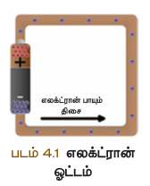
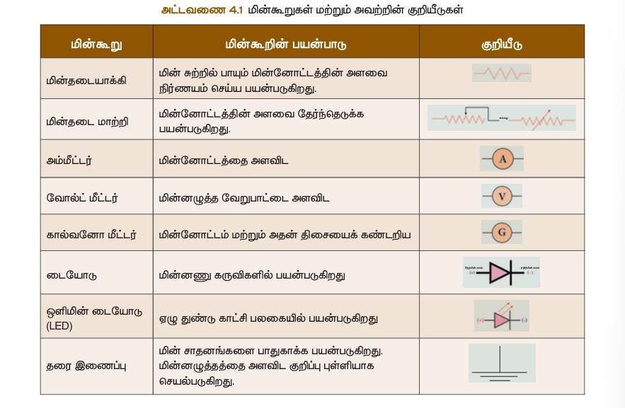
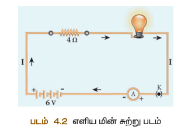
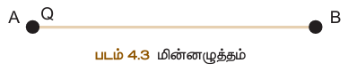
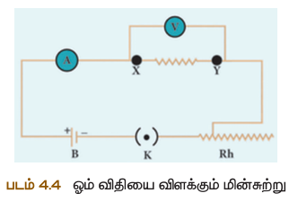
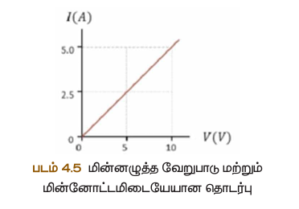

# மின்ணோட்டவியல் 

## கற்றல் விளைவுகள் 
- மின்சுற்றுக்களை உருவாக்குவது
- மின்னழுத்தம் ஏற்படும் மின்னழுத்த வேறுபாட்டினை மாறுபடுத்துவது
- மின்ணோட்டம் மற்றும் மின்கடத்துதிறனைப் பற்றி உயர்ந்து காண்பது
- மின்ணடைத்தாக்கிகளின் தொடர்ஏற்பும் பக்க இணைப்பு ஏற்பும் இத்தொடர்பான கைக்குழுக்களுக்குத் தீர்வு காண்பது
- மின்சாதனங்களின் செயல்பாட்டைப் பற்றி அறிந்து காண்பது ஏற்றும் அனைத்தாடவாழ்விலும் இணைபயன்படுத்துவது
- மின்திறன் ஏற்பும் மின்னாற்றல் வணரயறுதல் ஏற்றும் வீட்டுக்கான மின்சுற்றுகள் பற்றிய விளக்கேளிதல்
- LED விளக்கு ஏற்றும் LED தொலைக்காட்சிகளின் நவீனப் பயன்பாடுகள் பற்றி அறிதல்

---

## 4.1 மின்ணோட்டம் 

மின்னூட்டங்களின் (எலக்ட்ரான்களின்) இயக்கமே மின்ணோட்டம் ஆகும். ஒரு கால்வாய் வழியாக ஓடும் நீர்மம் போல அல்லது உயர அழுத்தப் பகுதியிலிருந்து குறைந்த அழுத்தப் பகுதியை நோக்கி வீசும் காற்றினைப் போல, எலக்ட்ரான்கள் கடத்தியின் வழியாகப் பாய்ந்து செல்வது மின்ணோட்டம் எனக்கிறது.



### 4.1.1 மின்ணோட்டத்தின் வரையறை

கடத்தி ஒன்றின் ஒரு பகுதியின் வழியாக செல்லும் மின்னூட்டங்களின் அளவு மின்ணோட்டம் என வரையறுக்கப்படுகிறது. அதாவது ஓரலகு நேரத்தில் கடத்தியின் ஒரு குறுக்குத்தட்டுப் பகுதியைக் கடந்து செல்லும் மின்னூட்டங்களின் அளவு மின்ணோட்டத்தேகம் ஆகும்.

**சூத்திரம்:**
$$I = \frac{Q}{t}$$

இங்கு:
- $I$ = மின்ணோட்டம் (Ampere)
- $Q$ = மின்னூட்டம் (Coulomb)
- $t$ = நேரம் (விநாடி)

### 4.1.2 அலகு 

கூலும் மின்னூட்டம் ஒரு விநாடி நேரத்தில் கடத்தியின் எதாவது ஒரு குறுக்குத்தட்டுப் பகுதி வழியாகக் கடந்து செல்லும்போது அக்கடத்தியில் பாயும் மின்ணோட்டம் ஒரு ஆம்பியர் என வரையறை செய்யப்படுகிறது.

$$1 \text{ Ampere} = \frac{1 \text{ Coulomb}}{1 \text{ விநாடி}}$$

**தீர்க்கப்பட்ட கணக்கு 1:**
மின்விளக்கின் வழியாகப் பாய்கிறது எனில் அவ்வழியாகச் செல்லும் மின்ணோட்டத்தின் அளவு என்ன?

**தீர்வு:**
- மின்னூட்டம் $Q = 12$ கூலும்
- காலம் $t = 5$ விநாடி
- மின்ணோட்டம் $I = \frac{Q}{t} = \frac{12}{5} = 2.4$ A

---

## 4.2 மின்சுற்று 

வழியாகச் செல்ல அனுமதிக்கும் பல மின்கூறுகளின் வலையமைப்புத் தண்டு உருவாக்கப்பட்ட ஒரு மூடிய சுற்று அல்லது பாதையாகும். மின்சாதனங்களையும் மின்னூட்டத்தின் மூலத்தேகத்தையும் மின்கலனும் இணைக்கும் பாதைகளாக மின்கம்பிகள் பயன்படுத்தப்படுகின்றன.



மின்கலம், மின்விளக்கு, தொழிற்கருவி ஆகியவற்றைக் கொண்டு உருவாக்கப்பட்ட ஒரு எளிய மின்சுற்று படம் 4.2-ல் காட்டப்பட்டுள்ளது.



இந்த மின்சுற்றில் தொழிற்கருவி மூடியிருக்கும்போது மின்விளக்கு ஒளிருகிறது. தொழிற்கருவி திறந்திருக்கும்போது மின்விளக்கு ஒளிராது. எனவே, மின்ணோட்டம் பாய்வதற்கு அச்சுற்றுப் பாதை மூடப்பட வேண்டும். மின்ணோட்டம் பாய்வதற்கு வேண்டிய மின்னழுத்த வேறுபாட்டினை மின்கலம் வழங்குகிறது.

---

## 4.3 மின்னழுத்தம் மற்றும் மின்னழுத்த வேறுபாடு 

### 4.3.1 மின்னழுத்தம் 

மிகர மின்னூட்டம் கொண்டுள்ளதாகக் கருதப்படும் முடிவில்லாத தூரத்திலிருந்து மின்விசைக்கு எதிராக அப்புள்ளிக்குக் கொண்டுவரப்படும் வேலை என வரையறுக்கப்படுகிறது.

### 4.3.2 மின்னழுத்த வேறுபாடு 

மின்னழுத்த வேறுபாடு என்பது ஒரு புள்ளியிலிருந்து மற்றொரு புள்ளிக்கு ஓரலகு மிகர மின்னூட்டத்தை நகர்த்துவதற்கு செய்யப்படும் வேலையின் அளவு ஆகும்.



$$V = \frac{W}{Q}$$

இங்கு:
- $V$ = மின்னழுத்த வேறுபாடு
- $W$ = வேலை
- $Q$ = மின்னூட்டம்

### 4.3.3 அலகு - வோல்ட்

புள்ளியிலிருந்து மற்றொரு புள்ளிக்கு மின்விசைக்கு எதிராக எடுத்துச் செல்லப்படும் வேலையின் அளவு ஒரு ஜூல் எனில் அப்புள்ளிகளுக்கிடையே உள்ள மின்னழுத்த வேறுபாடு ஒரு வோல்ட் ஆகும்.

---

## 4.4 ஓமின் விதி

மின்ணோட்டம் ஏற்படும் மின்னழுத்த வேறுபாடு ஆகியவற்றிற்கிடையேயான தொடர்பை நிறுவினார். இது ஓமின் விதி எனப்படும்.



இவ்விதியின்படி ஒரே வெப்பநிலையில், கடத்தி ஒன்றின் வழியாகப் பாயும் சீரான மின்ணோட்டம் கடத்தியின் முனைகளுக்கிடையே உள்ள மின்னழுத்த வேறுபாட்டிற்கு நேர்கவில அளவுடன் அளவிடப்படும்.

$$I \propto V$$

அல்லது, $\frac{V}{I} = \text{மாறிலி}$

இந்த மாறிலி மின்தடை $R$ ஆகும்.

$$V = IR$$

இங்கு $R$ என்பது மின்தடையாகும். ஒரு குறிப்பிட்ட பொருளுக்கு (எ.கா. நிக்கல் கம்பி) குறிப்பிட்ட வெப்பநிலையில் மின்தடை ஒரு மாறிலி ஆகும்.



---

## 4.5 மின்தடை

### 4.5.1 மின்தடையின் வரையறை

மின்னழுத்தம் ஒரு வோல்ட்டாக இருக்கும்போது கடத்தியில் செல்லும் மின்ணோட்டம் ஒரு ஆம்பியர் எனில் அம்மின்தடை ஒரு ஓம் ஆகும்.

$$1 \text{ Ohm} = \frac{1 \text{ Volt}}{1 \text{ Ampere}}$$

**தீர்க்கப்பட்ட கணக்கு 3:**
30V மின்னழுத்த வேறுபாடுடன் 2A மின்ணோட்டம் பாயும் கடத்தியின் மின்தடையைக் காண்க.

**தீர்வு:**
- $V = 30V$, $I = 2A$
- $R = \frac{V}{I} = \frac{30}{2} = 15\Omega$

---

## 4.6 மின்கடத்தும் எண்

### 4.6.1 மின்தடை எண்

நீளத்திற்கு ($L$) நேர்கவிலும், குறுக்குத்தட்டுப் பரப்பிற்கு ($A$) எதிர்கவிலும் அளவிடப்படும்.

$$R = \rho \frac{L}{A}$$

இங்கு $\rho$ என்பது மின்தடை எண் (Resistivity). இதன் அலகு ஓம்-மீட்டர் ($\Omega \cdot m$).

### 4.6.2 கடத்தும் எண்

$$\sigma = \frac{1}{\rho}$$

| பொருள் | மின்தடை எண் ($\Omega \cdot m$) |
|--------|-------------------------------|
| செம்பு | $1.62 \times 10^{-8}$ |
| தங்கம் | $2.44 \times 10^{-8}$ |
| அலுமினியம் | $2.63 \times 10^{-8}$ |
| கண்ணாடி | $10^{10}$ முதல் $10^{14}$ வரை |
| ரப்பர் | $10^{13}$ முதல் $10^{16}$ வரை |

---

## 4.7 மின்தடையாக்கிகளின் இணைப்பு

### 4.7.1 தொடர் இணைப்பு

மின்கூறுகளை ஒன்றன் பின் ஒன்றாக இணைத்து ஒரு மூடிய சுற்றை உருவாக்குவது ஆகும்.


**தொடர் இணைப்பில்:**
- ஒவ்வொரு மின்தடையாக்கியிலும் ஒரே மின்ணோட்டம் பாயும்
- மொத்த மின்னழுத்தம் = தனித்தனி மின்னழுத்தங்களின் கூடுதல்

$$R_s = R_1 + R_2 + R_3$$

$n$ எண்ணிக்கையிலான சமமான மின்தடைகள் தொடரில் இணைக்கப்படும்போது:
$$R_s = nR$$

### 4.7.2 பக்க இணைப்பு

பாய்வதற்கு இரண்டு அல்லது அதற்கு மேற்பட்ட மூடிய சுற்றுகள் இருக்கும்.


**பக்க இணைப்பில்:**
- ஒவ்வொரு மின்தடையாக்கிக்கும் எதிராக உள்ள மின்னழுத்த வேறுபாடு ஒன்றே
- மொத்த மின்ணோட்டம் = தனித்தனி மின்ணோட்டங்களின் கூடுதல்

$$\frac{1}{R_p} = \frac{1}{R_1} + \frac{1}{R_2} + \frac{1}{R_3}$$

$n$ எண்ணிக்கையிலான சமமான மின்தடைகள் பக்க இணைப்பில் இணைக்கப்படும்போது:
$$R_p = \frac{R}{n}$$

### 4.7.3 கலப்பு இணைப்பு

சுற்றுகள் தொடர் இணைப்பிலும் பக்க இணைப்பிலும் கலந்து இருக்கும்.

---

## 4.8 மின்ணோட்டத்தின் வெப்ப விளைவு

மின்கம்பியின் வழியாக மின்ணோட்டம் தேவைப்படுத்தும்போது வெப்பம் உருவாகிறது. இந்த நிகழ்வு **ஜூலின் வெப்ப விதி** எனப்படும்.

$$H = I^2Rt$$

அல்லது, $H = VIt = \frac{V^2}{R}t$

### பயன்கள்:
1. **மின்வெப்ப அடுப்பு** - மின்சூடாக்கி, தண்ணீர் காய்ச்சி
2. **மின் உருகி இணை** (Fuse) - மின்சுற்றைப் பாதுகாக்க
3. **மின்விளக்கு** - டங்ஸ்டன் இழை பயன்படுத்தப்படுகிறது

---

## 4.9 மின்திறன்

$$P = VI = I^2R = \frac{V^2}{R}$$

### அலகுகள்:
- **வாட் (Watt)** - SI அலகு
- **குதிரைத்திறன்** = 746 வாட்
- **கிலோவாட் மணி (kWh)** = $3.6 \times 10^6$ ஜூல்

---

## 4.10 வீட்டு மின்சுற்று


### முக்கிய அம்சங்கள்:
- **மின்னோட்டக் கம்பி** (Live Wire) - சிவப்பு நிறம்
- **நடுநிலைக் கம்பி** (Neutral Wire) - கருப்பு நிறம்
- **புவித்தாழ்ப்புக் கம்பி** (Earth Wire) - பச்சை நிறம்
- **மின்னாற்றல் மீட்டர்** (kWh Meter)
- **மின் உருகி இணை** அல்லது **MCB** (Miniature Circuit Breaker)

### முக்கிய தகவல்கள்:
- இந்தியாவில்: 220/230V, 50Hz
- USA, UK-ல்: 110/120V, 60Hz

---

## 4.11 LED மின்விளக்கு

**LED** = **Light Emitting Diode** (ஒளிஉமிழ் குறைகடத்தி)

### ஏழுதுண்டுக் காட்சி


### LED மின்விளக்குகளின் நன்மைகள்:
1. மின்இழையில் இல்லாததால் வெப்ப இழப்பு குறைவு
2. குறைந்த மின்திறன் நுகர்வு
3. சுற்றுச்சூழலுக்குப் பாதிப்பு ஏற்படுத்தாது
4. நீண்ட ஆயுள் கொண்டது
5. நம்பகத்தன்மை உள்ளது

---

## 4.12 LED தொலைக்காட்சி

1997-ல் ஜேம்ஸ் P. மிட்டெல் என்பவரால் முதல் LED தொலைக்காட்சி உருவாக்கப்பட்டது.

### நன்மைகள்:
- மிகக் குறைந்த மின்னாற்றல் நுகர்வு
- மிகவும் தட்டையானது
- நீண்ட ஆயுள்
- நம்பகத்தன்மை அதிகம்

---

## சுருக்கம்

| கருத்து | விளக்கம் |
|--------|---------|
| மின்ணோட்டம் | $I = Q/t$ |
| ஓமின் விதி | $V = IR$ |
| மின்தடை | $R = V/I$ |
| மின்தடை எண் | $\rho = RA/L$ |
| தொடர் இணைப்பு | $R_s = R_1 + R_2 + R_3$ |
| பக்க இணைப்பு | $\frac{1}{R_p} = \frac{1}{R_1} + \frac{1}{R_2} + \frac{1}{R_3}$ |
| ஜூலின் வெப்ப விதி | $H = I^2Rt$ |
| மின்திறன் | $P = VI$ |
| 1 குதிரைத்திறன் | 746 வாட் |

---

## தீர்க்கப்பட்ட கணக்குகள்

**கணக்கு 4:**
10 மீட்டர் நீளமும், $2 \times 10^{-7} m^2$ குறுக்குத்தட்டுப் பரப்பும் கொண்ட கம்பியின் மின்தடை 2 ஓம் எனில்:
- (i) மின்தடை எண்
- (ii) மின்கடத்துதிறன்
- (iii) மின்கடத்தும் எண்

**தீர்வு:**
- $\rho = \frac{RA}{L} = \frac{2 \times 2 \times 10^{-7}}{10} = 4 \times 10^{-8} \Omega \cdot m$
- $G = \frac{1}{R} = \frac{1}{2} = 0.5$ mho
- $\sigma = \frac{1}{\rho} = \frac{1}{4 \times 10^{-8}} = 0.25 \times 10^8$ Siemens/m

---

## பயிற்சிக் கேள்விகள்

### II. காலிட்ட இடங்களை நிரப்புக
1. ஒரு மின்சுற்று திறந்திருக்கும்போது அச்சுற்றின் வழியாக ________ பாய்ந்து செல்லாது.
2. மின்னழுத்த வேறுபாட்டிற்கும் மின்ணோட்டத்திற்கும் இடையே உள்ள விகிதம் ________.
3. வீடுகளில் ________ மின்சுற்று பயன்படுத்தப்படுகிறது.
4. ________ மற்றும் ________ ஆகியவற்றின் பெருக்கல் பலன் மின்திறன் ஆகும்.
5. LED என்பதன் விரிவாக்கம் ________.

### III. சரியா/தவறா?
1. திறன் ஏற்றும் மின்னழுத்தம் ஆகியவற்றிற்கு இடையேயான தொடர்பு ஓமின் விதி விளக்குகிறது.
2. வீட்டுப் பயன்பாட்டு மின்சாதனங்களில் குறுக்கீட்டுச் சுற்று ஏற்படும்போது அதிகப்படியான மின்ணோட்டத்திலிருந்து பாதுகாக்கப் பயன்படுத்துவது மின்சுற்று உடைப்பி.
3. மின்ணோட்டத்தின் SI அலகு கூலும் ஆகும்.
4. ஒரு யூனிட் மின்னாற்றல் என்பது 1000 கிலோவாட் மணிக்கு சமமானது.
5. மூன்று மின்தடைகள் தொடர் இணைப்பில் இணைக்கப்படும்போது அவற்றின் தொகு பயன் மின்தடையானது தனித்தனியாக உள்ள மின்தடைகளின் குறைந்த மதிப்பைவிடக் குறைவாக இருக்கும்.

---

## கருத்து வரைபடம்

```
                    மின்ணோட்ட வியல்
                         |
    ---------------------------------------------------------
    |              |              |              |            |
மின்ணோட்டம்    மின் கற்றுகள்    மின்னழுத்தம்   மின்ணோட்டத்தின்   LED மின்விளக்கு
    |              |              |       வெப்ப விளைவு      |
I = Q/t      தொடரிணைப்பில்    மின்தடை    |              LED தொலைக்காட்சி
V = IR       மின்தடை          V = IR    ஜூல் வெப்ப விளைவு
R = V/I      பக்க இணைப்பில்    ஓமின் விதி   மின் திறன்
மின்தடை எண்   மின்தடை                     
மின் கடத்து எண்  வீட்டுக்குரிய மின்கற்றுகள்
```

---

## மேற்கோள்கள்

### பாடநூல்கள்:
1. Electrodynamics by Griffiths
2. Fundamentals of Electric Circuits by Charles Alexander

### இணைய வளங்கள்:
1. https://www.elprocus.com/basic-electrical-circuits-and-their-working-for-electrical-engineers/
2. https://www.physicsclassroom.com/calcpad/circuits
```