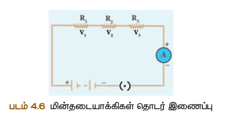
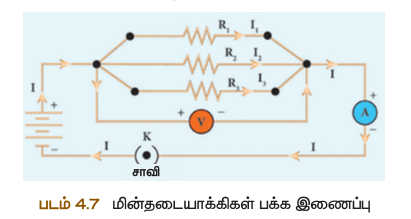
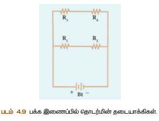
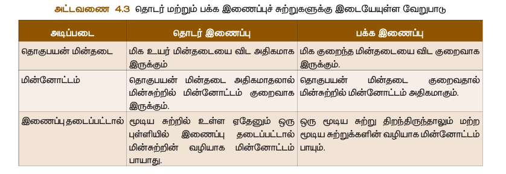
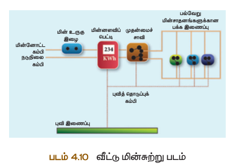
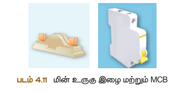
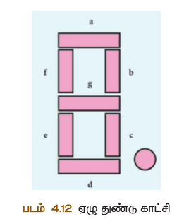

# அலகு 4 :மின்னோட்டவியல்

## கற்றல் விளைவுகள்
* மின்சுற்றுக்களை உருவாக்குதல்.
* மின்னழுத்தம் மற்றும் மின்னழுத்த வேறுபாட்டை வேறுபடுத்துதல்.
* மின்னோட்டம் மற்றும் மின்கடத்துதிறனைப் பற்றி உயர்ந்து கொள்ளுதல்.
* மின்னடையாக்கிகளின் தொடர்ஓட்டம் மற்றும் பக்க இணைப்பு மற்றும் இதன் தாக்கங்களுக்குத் தீர்வு காணுதல்.
* மினமைதாட்டத்தின் வெப்பவிளைவுப் பற்றி அறிந்து கொள்ளுதல் மற்றும் அன்றாட வாழ்வில் இணை பயன்படுத்துதல்.
* மின்திறன் மற்றும் மின்னறைல் வணரயறுதல் மற்றும் வீட்டுக்கான மின்சுற்றுகள் பற்றிய விளக்கங்களைக் கேளிதல்.
* LED விளக்கு மற்றும் LED திரைக்காட்சிகளின் நவீனப் பயன்பாடுகள் பற்றி அறிதல்.

## அறிமுகம்
ஏற்கனவே படித்திருப்பீர்கள். ஒரு கடத்தி வழியாக மின்னூட்டங்களின் இயக்கத்தைப் பற்றிக் கூறுவது மினமைதாட்டம் ஆகும். மினமைதாட்டம் என்பது ஒரு வண்கயதானை ஆறைல். மினமைதாட்டத்தின் பயன்கள் நம் அன்றாட வாழ்வில் இன்றியமையாதாகவும், விரக்கமுடியாதாகவும் இருக்கின்றன. வீடுகள், கல்வி நிறுவனங்கள், சேருதல் வேணைகள் மற்றும் தொழிற்சாலைகளில் மிகப் பொதுவான மினமைதாட்டத்தின் பயன்கள் பற்றி நீங்கள் அறிந்திருப்பீர்கள். இப்பாடத்தில் மினமைதாட்டம் பற்றியும் மினமைதாட்டத்தினால் ஏற்படும் விளைவுகள் பற்றியும் பாரக் கற்றுக் கொள்வோம்.

### 4.1 மின்னோட்டம்
மின்னூட்டங்களின் (எலக்ட்ரான்களின்) இயக்கமே மினமைதாட்டம் ஆகும். ஒரு கால்வாய் வழியாக ஓடும் நீரம் போல அல்லது உயர அழுத்தப் பகுதியிலிருந்து குறைந்த அழுத்தப் பகுதியை நோக்கி வீசும் காற்றினைப் போல, எலக்ட்ரான்கள் கடத்தியின் வழியாகப் பாய்ந்து செல்வது மினமைதாட்டம் எனகிறது.

**மின்னோட்டத்தின் திசை:** எலக்ட்ரான்களின் இயக்கத்திற்கு எதிர்திசையில், உயர மின்னழுத்தத்தில் இருக்கும் நேர மின்முனையிலிருந்து குறைந்த மின்னழுத்தத்தில் இருக்கும் எதிர்முனை ஓட்டம்

**படம் 4.1** எலக்ட்ரான் பாயும் திசை

#### 4.1.1 மின்னோட்டத்தின் அளவு
குறிக்கப்படுகிறது. கடத்தி ஒன்றின் ஒரு பகுதியின் வழியாக ஒரு மின்னூட்டங்கள் பாயும் வீச்சு மினமைதாட்டம் என வணரயறுக்கப்படுகிறது. அதாவது ஒரு அலகு நேரத்தில் கடத்தியின் ஒரு குறுக்குத்தட்டுப் பகுதியைக் கடந்து செல்லும் மின்னூட்டங்களின் அளவு மினமைதாட்டமே ஆகும். ஒரு கடத்தியின் குறுக்குத்தட்டுப் பகுதி வழியாக Q அளவு மின்னூட்டம் 't' காலத்தில் கடந்து சென்றால் அதில் பாயும் மினமைதாட்டமே ஆனது


(I = \frac{Q}{t}) 

#### 4.1.2 மின்னோட்டத்தின் அலகு
கூலும் மின்னூட்டம் ஒரு வினாடி நேரத்தில் கடத்தியின் எத்தாவது ஒரு குறுக்குத்தட்டுப் பகுதி வழியாகக் கடந்து செல்லும் போது அக் கடத்தியில் பாயும் மினமைதாட்டம் ஒரு ஆம்பியர் என வணரயணை செய்யப்படுகிறது. எனவே


(1 \text{ ஆம்பியர்} = \frac{1 \text{ கூலும்}}{1 \text{ வினாடி}}) 

**தீர்க்கப்பட்ட கணக்கு 1**
மின்விளக்கின் வழியாகப் பாய்கிறது எனில் அவ்வழியாகப் பாயும் மினமைதாட்டத்தின் அளவு என்ன?

**தரவுகள்:**
மின்னூட்டம் Q = 12 கூலும், காலம் t = 5 வினாடி.

எனவே, மினமைதாட்டம் I = Q/t = 12/5 = 2.4 A

### 4.2 மின்சுற்று
வழியாக அனுமதிக்கும் பல மின்கூறுகளின் வணலயணைப்புத் கொண்டு உருவாக்கப்பட்ட ஒரு மூடிய சுற்று அல்லது பாதையாகும். மின்சாரங்களைக் கண்காணிக்கும் மின்னூட்டத்தின் மூலேதானை மின்கலத்தையும் இணைக்கும் பாதைகளைக் கம்பிகள் பயன்படுத்தப்படுகின்றன. மின்கலம், மின்விளக்கு, தொழிற்சாலை ஆகியவைக் கொண்டு உருவாக்கப்பட்ட ஒரு எளிய மின்சுற்று படம் 4.3ல் காட்டப்பட்டுள்ளது.

**படம் 4.2** எளிய மின்சுற்றுப் படம்

இம் மின்சுற்றில் தொழிற்சாலை மூடியிருக்கும் போது மின்விளக்கு ஒளிருகிறது. தொழிற்சாலை திறந்திருக்கும் போது மின்விளக்கு ஒளிராது. எனவே, மினமைதாட்டம் பாய்வதற்கு அச்சுற்றுப் பாதை மூடப்பட வேண்டும். மினமைதாட்டம் பாய்வதற்கு வேண்டியதானை மின்னழுத்த வேறுபாட்டினை மின்கலம் வழங்குகிறது.

**அட்டவணை 4.1 மின்கூறுகள் மற்றும் அவற்றின் குறியீடுகள்**

| மின்கூறு | மின்கூறின் பயன்பாடு | குறியீடு |
|---------|------------------|---------|
| மின்னடையாக்கி | மின் சுற்றில் பாயும் மினமைதாட்டத்தின் அளவை நிர்ணயம் செய்ய பயன்படுகிறது. | ⎓ |
| மின்னோட்ட மீட்டர் | மினமைதாட்டத்தின் அளவை அளவிடுக்கப் பயன்படுகிறது. | அம்மீட்டர் |
| மின்னழுத்த மீட்டர் | மின்னழுத்த வேறுபாட்டின் அளவிட | வோல்ட் மீட்டர் |
| கால்வனோ மீட்டர் | மினமைதாட்டம் மற்றும் அவ் திசையைக் கண்டறிய | கல்வனோ மீட்டர் |
| மின்னணு கருவிகளில் பயன்படுகிறது | டையோடு |
| ஒளிமின் டையோடு (LED) | ஏழு துண்டு காட்சிப் பலகையில் பயன்படுகிறது |
| திற இணைப்பு | மின் சாரங்களைப் பாதுகாக்கப் பயன்படுகிறது. |
| மின்னழுத்தத்தின் அளவிட குறிப்பு புள்ளியாகச் செயல்படுகிறது. |

எலக்ட்ரான்கள் மின்கலத்தின் எதிர்மினமுனையிலிருந்து நேர்மினமுனைக்குச் செல்கின்றன. மின்னூட்டத்தின் திசையில் இருக்கும். அல்லது எதிர்மினமைதாட்டம் செல்லும் திசைக்கு எதிர்திசையில் அணைந்திருக்கும் எனவும் கூறலாம். எனவே, மினமைதாட்டத்தின் திசைதானைது ஒரு மின்சுற்றில் நேர்மினமுனையிலிருந்து எதிர்மினமுனையை நோக்கி இருக்கும்.

### 4.3 மின்னழுத்தம் மற்றும் மின்னழுத்த வேறுபாடு
நீர்மதாட்டம் மற்றும் காற்றமைதாட்டம் பற்றி ஏற்கனவே கீழ்வகுப்புகளில் படித்திருப்பீர்கள். ஒரு திண்மப் பொருளில் இரண்டு புள்ளிகளுக்கிடையே தவப்ப நிலை வேறுபாடு இருந்தாலே அவ்வழியாகத் தவப்பம் பாயும் என்பது உங்களுக்குத் தெரியும். இம்மாதிரி ஒரு கடத்தியில் இரு புள்ளிகளுக்கிடையே மின்னழுத்த வேறுபாடு இருந்தாலே அக் கடத்தியில் மின்னூட்டம் பாயும். ஒரு கடத்தியில் மின்னூட்டமே ஆனது உயர் மின்னழுத்தப் புள்ளியிலிருந்து குறைந்த மின்னழுத்தப் புள்ளிக்குப் பாயும்.

#### 4.3.1 மின்னழுத்தம்
நேர்மின்னூட்டத்தின் முடிவில்லாதால் இருந்து மினவிசைக்கு எதிராக அப்புள்ளிக்குக் கொண்டுவரப்படும் முயற்சி என வணரயறுக்கப்படுகிறது.

#### 4.3.2 மின்னழுத்த வேறுபாடு
மின்னழுத்த வேறுபாடு என்பது ஒரு புள்ளியிலிருந்து வேறொரு புள்ளிக்கு ஒரு அலகு நேர்மின்னூட்டத்தின்

மினவிலக்கு விசைக்கு எதிராக நகர்த்தப்படும் முயற்சி என வணரயறுக்கப்படுகிறது.

**படம் 4.3** மின்னழுத்த வேறுபாடு

A புள்ளியிலிருந்து B என்ற புள்ளிக்கு நகர்த்தி உள்ளதாகக் கருதுவோம். இம் மின்னூட்டத்தின் A யிலிருந்து B க்கு நகர்த்துவதற்கு செய்யப்பட்ட முயற்சி W எனக் கொள்வோம். A மற்றும் B க்கு இடையே உள்ள மின்னழுத்த வேறுபாடு கீழ்க்கண்ட வகையிலிருந்து பெறப்படுகிறது.


s1


இங்கு:
- 
s1
 = மின்ணோட்டம் (Ampere)
- 
s1
 = மின்னூட்டம் (Coulomb)
- 
s1
 = நேரம் (விநாடி)

### 4.1.2 அலகு 

கூலும் மின்னூட்டம் ஒரு விநாடி நேரத்தில் கடத்தியின் எதாவது ஒரு குறுக்குத்தட்டுப் பகுதி வழியாகக் கடந்து செல்லும்போது அக்கடத்தியில் பாயும் மின்ணோட்டம் ஒரு ஆம்பியர் என வரையறை செய்யப்படுகிறது.


s1


**தீர்க்கப்பட்ட கணக்கு 2**
இரண்டு புள்ளிகளுக்கிடையே நகர்த்தப்படும் முயற்சி 100 J எனில் அப்புள்ளிகளுக்கிடையே உள்ள மின்னழுத்த வேறுபாடு என்ன?

**தீர்வு:**
- மின்னூட்டம் 
s1
 கூலும்
- காலம் 
s1
 விநாடி
- மின்ணோட்டம் 
s1
 A

---

## 4.2 மின்சுற்று 

வழியாகச் செல்ல அனுமதிக்கும் பல மின்கூறுகளின் வலையமைப்புத் தண்டு உருவாக்கப்பட்ட ஒரு மூடிய சுற்று அல்லது பாதையாகும். மின்சாதனங்களையும் மின்னூட்டத்தின் மூலத்தேகத்தையும் மின்கலனும் இணைக்கும் பாதைகளாக மின்கம்பிகள் பயன்படுத்தப்படுகின்றன.

மின்கலம், மின்விளக்கு, தொழிற்கருவி ஆகியவற்றைக் கொண்டு உருவாக்கப்பட்ட ஒரு எளிய மின்சுற்று படம் 4.2-ல் காட்டப்பட்டுள்ளது.

இந்த மின்சுற்றில் தொழிற்கருவி மூடியிருக்கும்போது மின்விளக்கு ஒளிருகிறது. தொழிற்கருவி திறந்திருக்கும்போது மின்விளக்கு ஒளிராது. எனவே, மின்ணோட்டம் பாய்வதற்கு அச்சுற்றுப் பாதை மூடப்பட வேண்டும். மின்ணோட்டம் பாய்வதற்கு வேண்டிய மின்னழுத்த வேறுபாட்டினை மின்கலம் வழங்குகிறது.

---

## 4.3 மின்னழுத்தம் மற்றும் மின்னழுத்த வேறுபாடு

நீர்மராட்டம் ஏற்படும் காற்றமைதாட்டம் பற்றி ஏற்கனவே கீழ்வகுப்புகளில் படித்திருப்பீர்கள். ஒரு திண்ணைப் பாருளில் இரண்டு புள்ளிகளுக்கிடையே தவப்ப நிலை வேறுபாடு இருந்தால் மட்டுமே அவ்வழியாகத் தவப்பம் பாயும் என்பது உங்களுக்குத் தெரியும். இம்மபானறு ஒரு கடத்தியில் இரு புள்ளிகளுக்கிடையே மின்னழுத்த வேறுபாடு இருந்தால் மட்டுமே அக் கடத்தியில் மின்னூட்டம் பாயும். ஒரு கடத்தியில் மின்னூட்டமேதானது உயர் மின்னழுத்தப்புள்ளியிலிருந்து குறைந்த மின்னழுத்தப்புள்ளிக்குப் பாயும்.

### 4.3.1 மின்னழுத்தம்

மறை மின்னூட்டத்தின் முடிவில்லாத்தாணலவிலிருந்து மின்விசைக்கு எதிராக அப்புள்ளிக்குக் காண்டுவரச் செய்யப்படும் முயற்சி என வணரயறுக்கப்படுகிறது.

### 4.3.2 மின்னழுத்த வேறுபாடு

மின்னழுத்த வேறுபாடு என்பது ஒரு புள்ளியிலிருந்து மற்றொரு புள்ளிக்கு ஓரலகு மிகர மின்னூட்டத்தை நகர்த்துவதற்கு செய்யப்படும் வேலையின் அளவு ஆகும்.


s1


இங்கு:
- 
s1
 = மின்னழுத்த வேறுபாடு
- 
s1
 = வேலை
- 
s1
 = மின்னூட்டம்

### 4.3.3 அலகு - வோல்ட்

புள்ளியிலிருந்து மற்றொரு புள்ளிக்கு மின்விசைக்கு எதிராக எடுத்துச் செல்லப்படும் வேலையின் அளவு ஒரு ஜூல் எனில் அப்புள்ளிகளுக்கிடையே உள்ள மின்னழுத்த வேறுபாடு ஒரு வோல்ட் ஆகும்.

---

## 4.4 ஓமின் விதி

மினமனைதாட்டம் ஏற்படும் மின்னழுத்த வேறுபாடு ஆகியவற்றிற்கிடையேயான தொடர்பினை நிறுவினைதார். இது ஓமின் விதி எனப்படும்.

இவ்விதியின்படி ஏதாவது தவப்ப நிலையில், கடத்தி ஒன்றின் வழியாகப் பாயும் சீரான மினமனைதாட்டம் கடத்தியின் முனைகளுக்கிடையே உள்ள மின்னழுத்த வேறுபாட்டிற்கு நேர்கவில அணையும்.


s1


அல்லது, 
s1


இந்த மாறிலி மின்தடை 
s1
 ஆகும்.


s1


இங்கு 
s1
 என்பது மின்தடையாகும். ஒரு குறிப்பிட்ட பொருளுக்கு (எ.கா. நிக்கல் கம்பி) குறிப்பிட்ட வெப்பநிலையில் மின்தடை ஒரு மாறிலி ஆகும்.

---

## 4.5 மின்தடை

### 4.5.1 மின்தடையின் அலகு

Ω என்னும் குறியீட்டால் குறிக்கப்படுகிறது.

மின்னழுத்த வேறுபாடு ஒரு வோல்ட்டாக இருக்கும்போது கடத்தியில் தெல்லாம் மினமனைதாட்டம் ஒரு ஆம்பியர் எனில் அந்மின்தடை ஒரு ஓமாகும்.


s1


**தீர்க்கப்பட்ட கணக்கு 3**

ஒரு கடத்தியின் முனைகளுக்கு இடையே 2 V மின்னழுத்த வேறுபாடு இருக்கும்போது அதில் 4 A மினமனைதாட்டம் பாய்கிறது. அக் கடத்தியின் மின்தடையைக் காண்க.

**தீர்வு:**
- 
s1

- 
s1


---

## 4.6 மின்கடத்து எண்

### 4.6.1 மின்தடை எண்

நீளத்திற்கு (
s1
) எதிர்கவிலும் அளவிடப்படும்.


s1


இங்கு 
s1
).

கடத்து எண் எனப்படும்.


s1


| பொருள் | மின்தடை எண் (
s1
) |
|--------|-------------------------------|
| செம்பு | 
s1
 |
| தங்கம் | 
s1
 |
| அலுமினியம் | 
s1
 |
| கண்ணாடி | 
s1
 வரை |
| ரப்பர் | 
s1
 வரை |

---

## 4.7 மின்தடையாக்கிகளின் இணைப்பு

மினமனைதாட்டத்தை எவ்வாறு பாதிக்கிறது என்பதனை நீங்கள் இதுவரையில் கற்றுக்கொண்டீர்கள். ஒரு மின்தடையுடைய எளிய மின்சுற்று பற்றியும் அறிந்துகொண்டீர்கள். நண்பர்களில் சில சிக்கலான மின்சுற்றுக்களை நீங்கள் எதிர்கொள்ள நேரிடும். ஒன்றுக்கும் மேற்பட்ட மின்தடைகளின் தொகுப்புகள் மின்சுற்றுக்களில் இணைக்கப்பட்டிருக்கலாம். இவை மின்தடைகளின் அணைப்பு அல்லது மின்தடையின் குழு என அழைக்கலாம். மின்தடைகளை இரண்டு அடிப்படையான முனைகளில் இணைக்கலாம்.

அ) தொடர் இணைப்பில் மின்தடையாக்கிகள்
ஆ) பக்க இணைப்பில் மின்தடையாக்கிகள்

இணைப்பில் இணைக்கப்படும்போது அவற்றின் தொகுபயன் மினத்தாண்டனைக் கைக்கிடும் முனைகளைப் பின்வரும் பிரிவுகளில் நீங்கள் காலாம்.

### 4.7.1 தொடர் இணைப்பு

மின்கூறுகளை ஒன்றன் பின் ஒன்றாக இணைத்து ஒரு மூடிய சுற்றை உருவாக்குவது ஆகும். தொடர் சுற்றில் மினமனைதாட்டமேதானது ஒமரொரு மூடிய சுற்றின் வழியாகப் பாயும். இந்த மூடிய சுற்றில் உள்ள ஏதாவது ஒரு புள்ளியில் இணைப்பு ஏற்பட்டால் மின்சுற்றின் வழியாக மினமனைதாட்டம் பாயாது. எனவே சுற்றில் இணைக்கப்பட்டுள்ள மின்சாதனங்கள் முயற்சி செய்யாது. விளக்குகளில் பயன்படுத்தப்படும் ஒளிரும் தொடர் விளக்குகள் தொடர் இணைப்பில் இணைக்கப்பட்டிருக்கும். எனவே, மின்தடையாக்கிகள் தொடராக உள்ளடங்காது ஒவ்வொரு மின்தடையாக்கியின் வழியாகவும் ஒரே அளவு மின்னோட்டம் பாயும்.

R₁, R₂, R₃ தொடர் இணைப்பில் இணைக்கப்பட்டுள்ளது. (படம் 4.6). I என்ற மினமனைதாட்டம் இந்த மின்தடையாக்கிகள் வழியாகச் செல்கிறது. மின்தடையாக்கிகள் R₁, R₂ ஏற்றும் R₃ வழியாக மினமனைதாட்டம் I செல்கிறது. மின்தடையாக்கிகளின் குறுக்கே உள்ள மின்னழுத்தங்கள் முறையே V₁, V₂ ஏற்றும் V₃ ஆகும்.


s1


வேன்பாடுகள் (4.10) ஏற்றும் (4.11) இலிருந்து,


IR_S = IR_1 + IR_2 + IR_3


s1
 எண்ணிக்கையிலான சமமான மின்தடைகள் தொடரில் இணைக்கப்படும்போது:

s1


### 4.7.2 பக்க இணைப்பு

பாய்வதற்கு இரண்டு அல்லது அதற்கும் மேற்பட்ட மூடிய சுற்று இருக்கும். ஒரு மூடிய சுற்று திறந்திருந்தாலும் மற்றை மூடிய சுற்றுக்களின் வழியாக மினமனைதாட்டம் பாயும். நேதுவீடுகளில் உள்ள மின்கம்பியிடல் பக்க இணைப்பில் இணைக்கப்பட்டுள்ளது.

A ஏற்றும் B புள்ளிகளுக்கிடையே பக்க இணைப்பில் இணைக்கப்பட்டுள்ளன. ஒவ்வொரு மின்தடையாக்கிக்கும் குறுக்கே உள்ள மின்னழுத்த வேறுபாடுதானது மேதாக இருக்கும். இது A ஏற்றும் B புள்ளிகளுக்குக் குறுக்கே உள்ள மின்னழுத்த வேறுபாட்டிற்கு மேதாக இருக்கும். வோல்ட்மீட்டர் மூலமாக இந்த மின்னழுத்த வேறுபாடு அளவிடப்படுகிறது. புள்ளி A ஐயும் அணையும் மினமனைதாட்டம் I ஆனது I₁, I₂ ஏற்றும் I₃ எனப் பிரிந்து முறையே R₁, R₂ ஏற்றும் R₃ வழியாகச் செல்கிறது.

ஓமின் விதியின்படி:

I_1 = \frac{V}{R_1}, \quad I_2 = \frac{V}{R_2}, \quad I_3 = \frac{V}{R_3}


கிர்ச்சாஃபின் மின்னோட்ட விதி:

I = I_1 + I_2 + I_3


வேன்பாடு (4.15) இலிருந்து:

I = \frac{V}{R_1} + \frac{V}{R_2} + \frac{V}{R_3}


மின்தடையாக்கிகள் பக்க இணைப்பில் இணைக்கப்படும்போது தொகுபயன் மின்தடை Rₚ என்க. எனவே,

I = \frac{V}{R_P}


வேன்பாடு (4.16) இலிருந்து:

\frac{V}{R_P} = \frac{V}{R_1} + \frac{V}{R_2} + \frac{V}{R_3}



\frac{1}{R_P} = \frac{1}{R_1} + \frac{1}{R_2} + \frac{1}{R_3}


எனவே பல மின்தடையாக்கிகள் பக்க இணைப்பில் இணைக்கப்படும்போது தொகுபயன் மின்தடையானது னித்தனியான மின்தடைகளின் நிலைகீழிகளின் கூடுதலுக்குச் சமம். மேதிப்பு உள்ள 'n' மின்தடையாக்கிகள் பக்க இணைப்பில் இணைக்கப்படும்போது அந் தொகுபயன் மின்தடை ஆகும்.


s1



s1
 எண்ணிக்கையிலான சமமான மின்தடைகள் பக்க இணைப்பில் இணைக்கப்படும்போது:

s1


தொகுபயன் மின்தடை Rₜₒₜₐₗ = Rₚ₁ + Rₚ₂

### 4.7.4 பக்க-தொடர் இணைப்பு மின்தடையாக்கிகள்

சுற்றுகள் பக்க இணைப்பில் இணைக்கப்படும்போது நேக்கு பக்க-தொடர் இணைப்புச் சுற்றுகளாகிறது. மின்தடையாக்கிகள் R₁ ஏற்றும் R₂ தொடர் இணைப்பில் இணைக்கப்பட்டுத் தொகுபயன் மின்தடை Rₛ₁ தபைப்படுகிறது. இம்மபானறு R₃ ஏற்றும் R₄ தொடர் இணைப்பில் இணைக்கப்பட்டுத் தொகுபயன் மின்தடை Rₛ₂ தபைப்படுகிறது. இந்த இரண்டு தொடர்ச் சுற்றுகளும் பக்க இணைப்பில் இணைக்கப்படுகிறது.

---

## 4.8 மின்ணோட்டத்தின் வெப்ப விளைவு

ஒரு சில நேரங்களில் தாடரந்து ஓடிக்கொண்டிருந்த மின்விசிறியின் மேதாட்டதாரம் மேலுணையைத் தாட்டுபாரதது இருக்கிறீர்களா? தாட்டுப்பாரக்கும் மபாதது என்னை உணர்வீர்கள்?. மேதாட்டதாரம் மேலுணை சூடாக இருக்கும். மினமனைதாட்டத்தினால் ஏற்படும் வெப்ப விளைவினைத்தான் மேதாட்டதார சூடாகிறது. இதுமபானை நிகழ்வினை நீண்ட நேரம் எரிந்துகொண்டிருக்கும் மின்விளக்கினைத் தாடும்போதும் உணரலாம். மின்னாற்றல் மூலதனுடன் இணைக்கப்பட்ட மின்தடை ஒன்றின் குறுக்கே மின்னழுத்த வேறுபாடு உருவாகிறது. இந்த மின்னழுத்த வேறுபாட்டின் காரணமாக மின்தடை வழியாக ஒரு மினமனைதாட்டம் பாய்கிறது. மினமனைதாட்டம் தொடர்ந்தும் மின்தடை வழியாகப் பாய்வதற்கு மின்னாற்றல் மூலேதானைத் தொடர்ந்து ஆற்றல் மின்தடைக்குக் காடுதலுக்காண மடை இருக்கும். தபற்றுக்கொண்ட ஆற்றலின் ஒரு பகுதி பயனுள்ள முயற்சியாக (மின்விளக்கு எரிவது) மாற்றப்படுகிறது. மற்றைய பகுதி வெப்ப ஆற்றலாக மாற்றப்படுகிறது. எனவே, மின்கம்பியின் வழியாக மினமனைதாட்டம் அதெல்லாம் வெப்பம் உருவாகிறது. இந்த நிகழ்வு மினமனைதாட்டத்தின் வெப்ப விளைவு எனப்படுகிறது. மினமனைதாட்டத்தின் இந்த வெப்ப விளைவு மின்சூமடற்றி, மின்சாதனப்பட்டி மபானைணவ்களில் பயன்படுகிறது.

### 4.8.1 ஜூலின் வெப்ப விதி

R மின்தடையுள்ள மின்தடையாக்கியின் வழியாகப் பாயும் மினமனைதாட்டம் I என்க. மின்தடையாக்கியின் முனைகளுக்கிடையே மின்னழுத்த வேறுபாடு V என்க. t விநாடிகளில் மின்தடை வழியாகப் பாயும் மின்னூட்டம் Q என்க.

முனைகளுக்கிடையே உள்ள V மின்னழுத்த வேறுபாட்டில் இயக்கச் செய்யப்படும் முயற்சியானது VQ ஆகும். இந்த முயற்சி மின்தடையில் வெப்ப ஆற்றலாக மாறித் தவளிப்படுகிறது. எனவே உருவாக்கப்பட்ட வெப்பம்


s1


அல்லது, 
s1


இது ஜூல் வெப்ப விதி எனப்படும். இவ்விதியின்படி ஒரு மின்தடையில் உருவாகும் வெப்பமேதானது
- மின்தடைக்கு நேர்விகிதத்திலும்
- மினமனைதாட்டம் பாயும் காலத்திற்கு நேர்விகிதத்திலும் இருக்கும்.

### 4.8.2 வெப்ப விளைவின் பயன்கள்

#### 1. மின் சூமடற்றி
மின்சார அடுப்பு, மின்சூமடற்றி, தவந்நீர்க்காதிக்கலன் மபானை வீட்டுஉபமயதாகப் பாருள்களில் மினமனைதாட்டத்தின் வெப்ப விளைவு பயன்படுத்தப்படுகிறது. இவற்றில் வெப்பதனை உண்டாக்க நிக்கல் ஏற்றும் கும்மரதாமியம் கலந்த நிக்கல்தாம் என்ன உமலாக்கலணவினைத்தால் ஆன சுருள் வெப்பம் ஏற்படும் சாதனமேதாகப் பயன்படுகிறது. ஏனெனில் இப்பாருள் உருகு நிலைக்காண்டது, (iii) விரைவில் ஆக்சிகரைததிற்கு உள்ளதாக இருக்காது.

#### 2. மின் உருகி இழை
இணைக்கப்படும். சுற்றில் அதிகமான மினமனைதாட்டம் பாயும்போது ஜூல் வெப்ப விளைவு காரணமாக மின் உருகி இழை உருகி மின்சுற்று துண்டிக்கப்படுகிறது. எனவே, மின்சுற்றும், மின்சாதனங்களும் மேல்நிலையிலிருந்து பாதுகாக்கப்படுகின்றன. மின் உருகி இழையானது குறைந்த உருகு நிலையைக் கொண்ட பாருள்களால் செய்யப்படுகிறது.

#### 3. மின் இழை விளக்கு
மின்விளக்கில் மின் இழை என்று அழைக்கப்படும் ஒரு சிறிய கம்பி பயன்படுத்தப்படுகிறது. இது மிக அதி உருகு நிலைக்காண்ட பாருளதால் உருவாக்கப்படுகிறது. மினமனைதாட்டம் இவ்வழியாகத் தெல்லாம்போது வெப்பம் உருவாகிறது. மின் இழை சூடுபடுத்தும்போது இது ஒளிரந்து தவளிச் சென்றுகொண்டிருக்கிறது. தபாதுவாகடங்ஸ்டன் என்ன மின்விளக்குகளில் மின் இழையாகப் பயன்படுகிறது.

**தீர்க்கப்பட்ட கணக்கு 6**

மூலதனுடன் இணைக்கப்படுகிறது. 6 A மினமனைதாட்டமேதானது இச் சூமடற்றிகளில் வழியாகப் பாய்கிறது எனில் 5 நிமிடங்களில் உருவாகும் வெப்பத்தின் அளவைக் காண்க.

**தீர்வு:**
மின்தடை R = 5 Ω, மினமனைதாட்டம் I = 6 A, காலம்
t = 5 நிமிடங்கள் = 5 × 60 விநாடி = 300 விநாடி

உருவாகும் வெப்பத்தின் அளவு = H = I²Rt = 6² × 5 × 300 = **54000 J**

---

## 4.9 மின்திறன்

முயற்சி செய்யப்படும் வீதம் அல்லது ஆற்றல் செலவிடப்படும் வீதம் திறன் என வணரயணைச் செய்யப்படுகிறது. இதுமபால மின்னாற்றல் நுகரும் வீதம்தான் மின்திறன். மின்னாற்றல் மற்று எந்த ஆற்றல் வடிவமாக மாற்றப்படுகிறது வீதம்தான் இது குறிக்கிறது. மினமனைதாட்டத்தினால் ஒரு வினைதடியில் செய்யப்படும் முயற்சியின் அளவு மின்திறன் எனப்படும்.

கடத்தியின் இரு முனைகளுக்கு இடையேயுள்ள மின்னழுத்த வேறுபாடு V யாக இருக்கும்போது R மின்தடை கொண்ட கடத்தியின் வழியாக I மினமனைதாட்டம் t காலத்தில் பாய்வதாகக் கொள்வோம். மின்னூட்டங்களைக் கடத்தியின் முனைகளுக்கிடையே நகர்த்துவதற்குச் செய்யப்பட்ட முயற்சி W = VQ,

எனவே மின்திறன் = செய்யப்பட்ட முயற்சி/காலம் = VQ/t = VI


\text{மின்திறன்} = VI = I^2R = \frac{V^2}{R}


எனவே, மின்திறன் என்பது கடத்தியின் முனைகளுக்கிடையே ஏற்படும் மின்னழுத்த வேறுபாடு ஏற்றும் மினமனைதாட்டத்தின் பெருக்கல் பலனுக்குச் சமமாக இருக்கும் எனவும் கூறலாம்.

### 4.9.1 வாட்

மின்னழுத்த வேறுபாட்டில், ஒரு ஆம்பியர் மினமனைதாட்டத்தில் செயல்படும் மின்கருவி பயன்படுத்திக்கொள்ளும் மின்திறன் ஒரு வாட் ஆகும்.


s1


### அலகுகள்:
- **வாட் (Watt)** - SI அலகு
- **குதிரைத்திறன்** = 746 வாட்
- **கிலோவாட் மணி (kWh)** = 
s1
 ஜூல்

---

## 4.10 வீட்டு மின்சுற்று

### முக்கிய அம்சங்கள்:
- **மின்னோட்டக் கம்பி** (Live Wire) - சிவப்பு நிறம்
- **நடுநிலைக் கம்பி** (Neutral Wire) - கருப்பு நிறம்
- **புவித்தாழ்ப்புக் கம்பி** (Earth Wire) - பச்சை நிறம்
- **மின்னாற்றல் மீட்டர்** (kWh Meter)
- **மின் உருகி இணை** அல்லது **MCB** (Miniature Circuit Breaker)

### முக்கிய தகவல்கள்:
- இந்தியாவில்: 220/230V, 50Hz
- USA, UK-ல்: 110/120V, 60Hz

---

## 4.11 LED மின்விளக்கு
LED பல்பு என்பது மின்சாரம் செல்லும்போது கண்ணுறு ஒளியை உமிழக்கூடிய ஒரு குணைக் கடத்திச் சாதனமே ஆகும். உமிழப்படும் ஒளியின் வண்ணம் பயன்படுத்தப்படும் பொருளின் தன்மையைப் பொறுத்து அமையும். சிவப்பு, பச்ணை, மஞ்சள் மற்றும் ஆரஞ்சு வண்ணங்களைக் கொண்டிருக்கும் LED பல்புகள் காலியம் ஆர்சனைடு மற்றும் காலியம் பாஸ்பைடு முதலிய மவதிச் சேர்மங்களைப் பயன்படுத்தி உருவாக்குகிறார்கள். டிஜிட்டல் கடிகாரங்கள், கைக்கீட்டுக் கருவிகள், பொருட்வரத்து எமிக்கைகள், திருவிளக்குகள், அலங்கார விளக்குகள் முதலியவற்றில் LED

### ஏழுதுண்டுக் காட்சி

## 4.11.2 LED மின்விளக்குகளின் நன்மைகள்
1. LED ல் மின் இணைழயில்லாததால் நேரடித் தினைதால் வெப்ப ஆறைல் இழப்பு ஏற்படுவதில்லை. மின் இணைழ மின்விளக்கைவிடக் குறைந்த திணை நுகரும்.
2. ஒளிரும் மின் இணைழ பல்புடன் ஒப்பிடும்போது இது குறைந்த திணை நுகரும்.
3. இது சுற்றுச்சூழலுக்குப் பாதிப்பை ஏற்படுத்தாது.
4. பல நிறங்களில் வெளியீட்டினைத் தருவதற்குத் தொழிநுட்பமே ஆகிறது.
5. வெளிவுவிளை மற்றும் ஆறைல் சிக்கனம் உடையது.
6. பார்சென் மற்றும் பிற நச்சுப் பொருட்கள் பயன்படுத்தப்படுவதில்லை. மின்னறைல் பறை தாக்குணைய நிவர்த்தி செய்யும் வழிகளில் ஒன்று அதிக எண்ணிக்கையில்தானை LED மின்விளக்குகளைப் பயன்படுத்துவது

## 4.12 LED திரைக்காட்சி
LED ஒளிஉமிழ் டையோடின் மற்றொரு முக்கியப் பயன்பாடு LED திரைக்காட்சி ஆகும். LED திரைக்காட்சி உண்மையில் ஒளிஉமிழ் டையோடு பயன்படுத்தப்பட்ட LCD (Liquid Crystal Display) திரைலக் காட்சி ஆகும். LED காட்சிச் சாதனத்தில் ஒளிஉமிழ் டையோடுகள் மின்தனைதாளிக்கப் பயன்படுத்துகின்றனர். ஒளிஉமிழ் டையோடுகளின் வரிசைப் படப்புள்ளிகளாக (pixel) செயல்படும். இப் படப்புள்ளிகள் டிஜிட்டல் படம் அல்லது காட்சிக்கு அடிப்படை ஆகும். கறுப்புத் தவள்ளத் திரைலக் காட்சியில் தவள்ள நிறை ஒளியை உமிழும் ஒளிஉமிழ் டையோடுகள் பயன்படுத்துகின்றனர். சிவப்பு, பச்ணை மற்றும் நீலம் ஆகிய நிறங்களைக் கொண்டிருக்கும் ஒளிஉமிழ் டையோடுகள் பயன்படுத்தி வண்ணத் திரைலக் காட்சிப் பெட்டிகள் தயாரிக்கின்றனர். 1997ல் ஜேம்ஸ் P. மிட்டெல் என்பவரால் முழு LED திரைலக் காட்சி உருவாக்கப்பட்டது. இது ஒரியல் மூல நிறக் காட்சிப் பெட்டி. 2009 இல் வணிகரீதியலதானை LED திரைலக் காட்சி அறிமுகப்படுத்தப்பட்டது,

## 4.12.1 LED திரைக்காட்சியின் நன்மைகள்
- இது தேல்லிய அளவுடையதாக இருக்கும்.
- குறைவானை சக்தியைப் பயன்படுத்துகிறது மற்றும் குறைவானை ஆறைல் நுகர்கிறது.
- இன் ஆயுட்காலம் அதிகம்.
- இது மிகவும் நம்பகத்தன்மை உடையது.

---

## சுருக்கம்

| கருத்து | விளக்கம் |
|--------|---------|
| மின்ணோட்டம் | 
s1
 |
| ஓமின் விதி | 
s1
 |
| மின்தடை | 
s1
 |
| மின்தடை எண் | 
s1
 |
| தொடர் இணைப்பு | 
s1
 |
| பக்க இணைப்பு | 
s1
 |
| ஜூலின் வெப்ப விதி | 
s1
 |
| மின்திறன் | 
s1
 |
| 1 குதிரைத்திறன் | 746 வாட் |

---

## தீர்க்கப்பட்ட கணக்குகள்

**கணக்கு 4:**
10 மீட்டர் நீளமும், 
s1
 குறுக்குத்தட்டுப் பரப்பும் கொண்ட கம்பியின் மின்தடை 2 ஓம் எனில்:
- (i) மின்தடை எண்
- (ii) மின்கடத்துதிறன்
- (iii) மின்கடத்தும் எண்

**தீர்வு:**
- 
s1

- 
s1
 mho
- 
s1
 Siemens/m

---

## கற்றல் பயிற்சி

### I. குறுகிய விடை வகை வினாக்கள்

1. ஒரு மின்சுற்று திறந்திருக்கும்போது அச் சுற்றின் வழியாக _______ பாய்ந்து செல்லாது.
2. மின்னழுத்த வேறுபாட்டிற்கும் மினமனைதாட்டத்திற்கும் இடையே உள்ள விகிதம் ________.
3. வீடுகளில் ______ மின்சுற்று பயன்படுத்தப்படுகிறது.
4. ________ ஏற்றும் ________ ஆகியவைகளின் பெருக்கல் பலன் மின்திறன் ஆகும்.
5. LED என்பதன் விரிவாக்கம் ______________.

### II. கூற்றுகள் சரியா? அல்லது தவறா?

1. திறன் ஏற்றும் மின்னழுத்தம் ஆகியவற்றிற்கு இடையேயான தொடர்பு ஓமின் விதி விளக்குகிறது.
2. வீட்டு உபமயதாக மின்சாதனங்களில் குறுக்குட்ச் சுற்று ஏற்படும்போது அதிகப்படியாக வரும் மினமனைதாட்டத்திலிருந்து பாதுகாக்கப் பயன்படுத்துவது மின்சுற்று உடைப்பி.
3. மினமனைதாட்டத்தின் SI அலகு கூலும் ஆகும்.
4. ஒரு யூனிட் மின்னாற்றல் என்பது 1000 கிலோவாட் மணிக்குச் சமமாக இருக்கும்.
5. மூன்று மின்தடைகள் தொடர் இணைப்பில் இணைக்கப்படும்போது அவைகளின் தொகுபயன் மின்தடையானது னித்தனியாக உள்ள மின்தடைகளின் குறைந்த மதிப்பைவிடக் குறைவாக இருக்கும்.

### III. பொருத்துக

| நிரல் 1 | நிரல் 2 |
|--------|--------|
| (i) மின்னோட்டம் | () வோல்ட் |
| (ii) மின்தடை | () ஆம்பியர் |
| (iii) மின்னழுத்தம் | () ஓம் |
| (iv) மின்திறன் | () வாட் |
| (v) மின்னாற்றல் | () கிலோவாட் மணி |

### IV. கூற்று-காரணம் வினாக்கள்

1. கூற்று: உமலாகப் பரப்புடைய மின்கருவிகளில் மூன்று காப்புனைத் தவிர கம்பிகள் பயன்படுத்தப்பட்டிருக்கும்.
   காரணம்: இந்த் இணைப்பினால் அம்மனைதாடு இணைக்கப்படும் கம்பிகள் சூடாவது தடுக்கப்படும்.

2. கூற்று: மின்கலத்துடன் இருக்கும் ஒரு சிறிய மின்சுற்றில் மின்கலத்தின் மறை மினவதாய் தபரு மின்னழுத்தத்தில் இருக்கும்.
   காரணம்: உயர் மின்னழுத்தப்புள்ளியை நோக்கி மினமனைதாட்டம் பாய்ந்து செல்லும்.

3. கூற்று: LED விளக்குகள் ஒளிரும் மின்னிழை விளக்குகளைவிடச் சிறந்தது.
   காரணம்: LED விளக்குகள் ஒளிரும் மின்னிழை விளக்குகளைவிடக் குறைவானை மின்திறனை நுகர்கின்றன.

### V. சிறு விடை வகை வினாக்கள்

1. மினமனைதாட்டத்தின் அலகைக் கூறுக.
2. ஒரு கடத்தியின் அளவுடன் என்னைத் தாக்கினைதால் அதன் மின்தடையின் மதிப்பு என்னை வாகும்?
3. மின்னிழை விளக்குகளில் டங்ஸ்டன் பயன்படுத்தப்படுகிறது. ஆனதால் மின் உருகி இழையாக அதனைப் பயன்படுத்துவதில்லை. ஏன்?
4. மினமனைதாட்டத்தின் வெப்ப விளைவைப் பயன்படுத்திச் செயல்படும் இரண்டு மின்சாதனங்களின் பெயர்களைக் கூறுக.

### VI. நீள் விடை வகை வினாக்கள்

1. மின்னழுத்தம் ஏற்றும் மின்னழுத்த வேறுபாடு வணரயறு.
2. வீட்டிலுள்ள மின்சுற்றில் புவித் தாடுப்புக் கம்பியின் பங்கு என்ன?
3. ஓமின் விதி வணரயறு.
4. மின்தடை எண் ஏற்றும் மின்கடத்து எண் ஆகியவற்றை மாறுபடுத்து.
5. வீடுகளில் பயன்படுத்தப்படும் மின்சுற்றில் எந்த வணிக மின்சுற்றுகள் பயன்படுத்தப்படுகின்றன?

### VII. விடை தேடுக

1. மூன்று மின்தடைகளை (அ) தொடர் இணைப்பு (ஆ) பக்க இணைப்பில் இணைக்கும்போது கிடைக்கும் தொகுபயன் மின்தடைக்கான முக்காணவியல் மின்சுற்றுப் படம் வரைந்து காட்டுக.

2. அ) மினமனைதாட்டம் என்பதால் என்ன?
   ஆ) மினமனைதாட்டத்தின் அலகைக் கூறுக.
   இ) மினமனைதாட்டத்தை எந்தக் கருவியின் மூலம் அளவிட முடியும்? அதனை ஒரு மின்சுற்றில் எவ்வாறு இணைக்கப்பட வேண்டும்?

3. அ) ஜூல் வெப்ப விதி வணரயறு.
   ஆ) நிக்கல் ஏற்றும் கும்மரதாமியம் கலந்த உமலாக்கலணவு மின்சார வெப்பம் ஏற்படும் சாதனமேதாகப் பயன்படுத்தப்படுவது ஏன்?
   இ) ஒரு மின் உருகி இழை எவ்வாறு மின்சாதனங்களைப் பாதுகாக்கிறது?

4. வீடுகளில் பயன்படுத்தப்படும் மின்சுற்றை விளக்கவும். (படம் மணபயில்லை)

5. அ) பாரம்பரியத் தொலைக்காட்சிப் பட்டியைவிட LED தொலைக்காட்சிப் பட்டியினால் ஏற்படும் நன்மைகள் யாவை?
   ஆ) LED விளக்கின் நன்மைகளைக் கூறுக.

### VIII. கணக்குகள்

1. ஒரு மின்சாதனப்பட்டி அதிகபட்ச வெப்பத்தைத் தவளிவிடும்போது 420 வாட் மின்திறனை நுகர்கிறது. குறைந்தபட்ச வெப்பத்தைத் தவளிவிடும்போது 180 வாட் மின்திறனை நுகர்கிறது. அப்புறம் 220 வோல்ட் மின்னழுத்தம் கொண்டு காக்கப்பட்டதால் இரு நிலைகளிலும் அவ்வழியாகப் பாயும் மினமனைதாட்டத்தின் அளவைக் கைக்கிடு.

2. 100 வாட் மின்திறனுள்ள ஒரு மின்விளக்கு தினமும் 5 மணி நேரம் பயன்படுத்தப்படுகிறது. இதுமபால் நான்கு 60 வாட் மின்விளக்குகள் தினமும் 5 மணி நேரம் பயன்படுத்தப்படுகின்றன. இன்மூலம் ஜனவரி மாதத்தில் நுகரப்பட்ட மின்னாற்றலை கிலோவாட் மணி அலகில் கைக்கிடு.

3. மூன்று வோல்ட் மின்னழுத்தம் ஏற்றும் 600 மில்லி ஆம்பியர் மினமனைதாட்டமும் பாயும் ஒரு டார்ச் விளக்கினால் உருவாகும் அ) மின்திறன் ஆ) மின்தடை ஏற்றும் இ) நான்கு மணி நேரத்தில் நுகரப்படும் மின்னாற்றல் ஆகியவற்றைக் காண்க.

4. R மின்தடையுள்ள ஒரு கம்பியானது ஐந்து நீளமுடைய கம்பிகளாகத் தவற்றப்படுகிறது. அ) தவற்றப்பட்ட கம்பியின் மின்தடை தவற்றப்படாத மற்ற கம்பியின் மின்தடையை ஒப்பிடுகையில் எவ்வாறு மாறுபடுகிறது. ஆ) தவற்றப்பட்ட ஐந்து துண்டு கம்பிகளையும் பக்க இணைப்பில் இணைக்கும்போது அந் தொகுபயன் மின்தடையைக் கைக்கிடுக. இ) தவற்றப்பட்ட ஐந்து துண்டு கம்பிகளையும் தொடர் இணைப்பு ஏற்றும் பக்க இணைப்பில் இணைக்கும்போது கிடைக்கும் தொகுபயன் மின்தடைகளின் விகிதம்

### IX. உயர்ச் சிந்தனைக்கான வினாக்கள்

1. இரு மின்தடையாக்கிகளைப் பக்க இணைப்பில் இணைக்கும்போது அந் தொகுபயன் மின்தடை 2 Ω. தொடர் இணைப்பில் இணைக்கும்போது அந் தொகுபயன் மின்தடை 9 Ω. இரு மின்தடைகளின் மதிப்புகளையும் கைக்கிடு.

2. ஐந்து ஆம்பியர் மினமனைதாட்டம் பாயும் ஒரு மின்சுற்றில் ஒரு வினைதடி நேரத்தில் பாயும் எலக்ட்ரான்களின் எண்ணிக்கையைக் கைக்கிடு.

3. 10 Ω மின்தடையுள்ள ஒரு கம்பித் துண்டின் நீளத்தை அதன் மற்ற நீளத்திலிருந்து மூன்று மடங்கு நீட்டித்தால் அதன் புதிய மின்தடையின் மதிப்பு எவ்வளவு?

---

## பின்னூல்கள்

1. Electrodynamics by Griffiths
2. Fundamentals of Electric Circuits by Charles Alexander

## இணையவளங்கள்

1. https://www.elprocus.com/basic-electrical-circuits-and-their-working-for-electrical-engineers/
2. https://www.physicsclassroom.com/calcpad/circuits

---

## கருத்து வரைபடம்

**மின்னோட்ட வியல்**
- மின்னோட்டம் I = Q/T
- ஓம் விதி V = IR
- மின் தடை R = V/I
- மின்தடை எண்
- மின் கடத்து எண்

**மின் கற்றுகள்**
- தொடரிணைப்பில் மின்தடை
- பக்க இணைப்பில் மின்தடை
- வீட்டுக்குரிய மின்சுற்றுகள்

**மின்னோட்டத்தின் வெப்ப விளைவு**
- ஜூல் வெப்ப விளைவு
- மின் திறன்

**LED மின்விளக்கு**
- LED திரைக்காட்சி

---

## இணையச் செயல்பாடு

**ஓமின் விதி**

இத் தெயல்பாடு மூலம் மாணவர்கள் (i) ஓமின் விதியை முறையினை மூலம் ஏறிப் பார்ப்பார்கள். (ii) மின்னடை மினமைதாட்டம் மற்றும் மின்னழுத்தம் இவற்றுக்கிடையேயுள்ள தொடர்பு புரிந்து

படிகள்:
- கீழே காட்டப்பட்டுள்ள URL/விண்வெளிக்குறியீட்டைப் பயன்படுத்தி "olabs.edu.in" லுள்ளதில் பத்தாம் வகுப்பின் கீழே காட்டப்பட்டுள்ள "Ohm's law and resistance" என்ற பக்கத்திற்குச் சென்று "simulator" என்ற முயற்சியைத் தொடுக்கவும்.
- "show circuit diagram" என்ற பொத்தானைத் தொடுக்கும்போது கிடைக்கும் மின்சுற்றுப் படத்தின்படி மின்சுற்றை உருவாக்கவும்.
- மின்சுற்றுப் படத்தில் காட்டியபடி மின்சுற்றின் பல்வேறு பாகங்களைச் சுட்டியைப் பயன்படுத்திச் சுட்டி இழுத்து இணைப்பு மூலம் மின்சுற்றை உருவாக்கலாம்.
- தொழிற்சாலையைப் பொருத்தி மின்சுற்றை மூடவும். மினமைதாட்டம் (I) மற்றும் மின்னழுத்தம் (V) அளவிடவும். R=V/I என்ற சூத்திரத்தைப் பயன்படுத்தி மின்னடையைக் கைக்கிடவும். தவறான மினமைதாட்டம் மற்றும் மின்னழுத்தத்திற்கு மின்னடையின் மதிப்பு மாறிலியாக வருவதை உறுதி செய்யவும்.
- (மின்னடை)/(கம்பியின் நீளம் (செமீ)) மதிப்புக் கண்டுபிடிக்கவும். கண்டுபிடித்த மதிப்பினைக் காட்டப்பட்டுள்ள கட்டத்தில் குறிக்கவும்.

**URL:** http://amrita &sim=99&cnt=4

---

## மேலும் படிக்க

**நூல்கள்:**
1. Electrodynamics by Griffiths
2. Fundamentals of Electric Circuits by Charles Alexander

**இணைய வளங்கள்:**
1. https://www.elprocus.com/basic-electrical-circuits-and-their-working-for-electrical-engineers/
2. https://www.physicsclassroom.com/calcpad/circuits
