# அலகு 22: சுற்றுச்சூழல் மேலாண்மை

## கற்றல் நோக்கங்கள்

இப்பாடத்தினைக் கற்றபின், மாணவர்கள் பின்வரும் திறன்களைப் பெறுவர்:
- புதுப்பிக்கத்தக்க மற்றும் புதுப்பிக்க இயலாத வளங்களை வேறுபடுத்தி அறிந்து கொள்ளல்.
- பல்வேறு இயற்கை வளங்களைப் பாதுகாப்பதற்கான அவசியம் அறிந்து கொள்ளல்.
- இயற்கை வளங்களைப் பாதுகாக்கும் நோக்கில்படும் பல்வேறு முயற்சிகள் பற்றி அறிந்து கொள்ளல்.
- இயற்கை வளங்களைப் பயன்படுத்துவதில் உள்ள வரம்புகள் பற்றிய விழிப்புணர்வு பெறுதல்.
- சுற்றுச்சூழல் பாதுகாப்பிலும் மற்றும் சுற்றுச்சூழல் மேலாண்மையிலும் ஈடுபாடுடன் பங்கேற்க ஊக்கப்படுத்துதல்.

---

## அறிமுகம்

சுற்றுச்சூழல் மேலாண்மை என்பது சுற்றுச்சூழலில் உள்ள பல்வேறு காரணிகளானை, அவை அனுப்பு, தெயல்பாடு, நிரம் மற்றும் உயிரிய மற்றும் உயிரறு கூறுகளைப் பாதுகாத்தல் ஆகியவற்றை உள்ளடக்கியது. மனிதர்கள் உள்ளிட்ட அனைத்து உயிரினங்களும் பயன்படுத்தி உயிர் வாழ்வதற்கான அனைத்து வளங்களையும் இப்பூமி வழங்குகிறது. இயற்கையிலிருந்து பெறப்படும் அனைத்தும் மனிதனுக்கு பயன் அளிக்கக்கூடிய வகையிலல்லாமல் அவை பயன்பாட்டுத் தேவைகளைத் தாழில் நுட்பம் மூலம் மேம்படுத்தியே உள்ளது.

சில வகையானை வளங்களை நாம் தாளர்ச்சியாகப் பயன்படுத்திக் கொண்டிருக்கும்போதும் அவை மீண்டும் நம்மை புதுப்பித்துக் கொள்ளக்கூடியதாக இருக்கின்றன. (வனங்கள், பயிர்கள், வன உயிரிகள், நிலத்து நீர், காற்று மற்றும் சூரிய ஆற்றல்). இவை இயற்கையானை மறு சுழற்சி முறையிலதா அல்லது உரிய மேலாண்மை வழியாகமவதா நம்மை மீண்டும் புதுப்பித்துக் கொள்கின்றன. நம்மை இயற்கையானை மறு சுழற்சி முறையில் புதுப்பித்துக் கொள்ள இயலாத வளங்கள், மனவக்கதிக்கானை மற்றும் தாளர்ச்சியானை பயன்பாட்டினால் தீர்ந்து முடியக் கூடியதாக உள்ளன. (தாது வளங்கள், கரி, பெட்ரோலியம்). இவற்றை எளிதில் புதுப்பிக்க இயலாது. இன்னதால் இவற்றின பயன்பாடுகள் ஒரு குறிப்பிட்ட காலத்தில் முடிந்து முடிந்துவிடக் கூடிய சூழ்நிலை உருவாகலாம்.

மனிதர்களின் மனவ, கேள்கள் தாளரப் பெறுக்கத்தின் காரணமாக அதிகரித்துள்ளது. மனிதன் நனுணடய மனவுகளுக்காகவும் அறிவியல் மற்றும் தொழில்நுட்ப வளர்ச்சியின் காரணமாகவும் மிக அதிகமாக இயற்கை வளங்களைப் பயன்படுத்துவதால் அவை மிகவும் மவுகேமாக குறையத் தாழங்கியுள்ளன. எனவே இயற்கை வளங்களைப் பாதுகாப்பது என்பது, ஒரு நாட்டின் மொத்த மற்றும் பொருளாதார மேம்பாட்டிற்கு முக்கியமானை பங்கு அளிக்கக்கூடியதாக உள்ளது.

---

## 22.1 இயற்கை வளங்களை முறையாகப் பயன்படுத்துதலும், பாதுகாப்பும்

இயற்கை வளங்கள் அவற்றின உயிரிய பொருளாதார மற்றும் பொழுதுபோக்கு தேவைகளுக்காகப் பாதுகாக்கப்படுகின்றன. இயற்கை வளங்களின் அதிகமானை மற்றும் திட்டமிடப்படார் பயன்பாடு சுற்றுச்சூழலில் ஒரு மேலானை நிலையை உருவாக்கி விடும். எனவே இயற்கை வளங்கள், அவற்றை புதுப்பித்துக் கொள்வதற்காக, அவற்றினைப் பயன்படுத்துவதில் ஒரு முறையானை மேலானை பராமரிப்பு அவசியமாகிறது. இவ்வாறு இயற்கை வளங்களை முறையாகப் பராமரிப்பதும், பயன்படுத்துவதும் (சுற்றுச்சூழல்) பாதுகாப்பு எனப்படுகிறது.

எப்பொழுதும் நிலைத்தன்மையுடன் நீடித்து உலங்க நாம் கட்டணேக்கமவண்டும். ஆற்றலை முறையாகப் பயன்படுத்துதல், நீளரமெமித்தல், மேட்கும் நணேயறைபிளாஸ்டிக் உள்ளிட்டபொருட்களைப் பயன்படுத்தாதிருத்தல், மற்றும் நாம் வசிக்கும் வளிேண்டலதன்முறையாகப் பராமரித்தல் ஆகியவை இவ்வுலங்க நீடித்து நிலைத்திருக்கச் செய்யும் சில வழிமுறைகள் ஆகும். எதிர்காலச் சந்ததியினருக்காக நேதுவளங்களை முறையாக மேலாண்மை செய்து பாதுகாப்பதும் மிகவும் முக்கியமானைத் தானைதாகும்.

---

## 22.2 காடுகள்

தெடிகள், தாடிகள் மபானைவற்றை உள்ளடக்கிய பல்வேறு தாவர மற்றும் விலங்கினங்களின் வாழிடமாகும். காடுகள் நேதுநாட்டின பொருளாதார மேம்பாட்டிற்கும் முக்கியபங்களிப்புடைய. காடுகள் மனித வாழ்வுக்கு இன்றியமையாதவை, மேலும் பல்ரப்பட்ட புதுப்பிக்கத்தக்க இயற்கை வளங்களின் ஆதாரமாகவும் விளங்குபணவ. காடுகள், மேரம், உணவுதீவனைம். நார்கள் மற்றும் மேருந்துப்தபொருட்களை அளிப்பணவ.

தபரும் காரணிகளாகும். காடுகள் காரபணனை நிலைநிறுத்துவதால், அவை காரபனத்தாட்டி என்றும் அழைக்கப்படுகின்றன. ட்பதவப்பநிலையை ஒழுங்குபடுத்தி, மேழதபொழிணவ அதிகமாக்கிப் புவிதவப்பேதார்ணலக்குணைது, தவள்ளம், நிலச்செரிவுமபானை இயற்கைச்சீறைங்களைத் தடுப்பதனை உயிரிகளைப் பாதுகாத்து நீர்பிடிப்புபகுதிகளுக்காகவும் செயல்படுகின்றன. சுற்றுச்சூழல் மேலானையை மபுணுவதில் முக்கியபங்கு வகிக்கின்றன.

### 22.2.1 வனஅழிப்பு

அழிக்கப்படுவதுகாடுகள் அழிக்கப்படுதல் எனப்படுகிறது. இது பல்வேறு காரைங்களால் நடைபெறுகிறது. மவள்தாண்ணே, நகரேயேதார்கள், அணைகள், மொணல்கள், கட்டிடங்கள், தொழிறெதாணல்கள், நீரமினநிலையத்திட்டங்கள், காட்டுத்தீ, மேனல்கள் போன்றவற்றால் காடுகள் அழிக்கப்படுகின்றன. இது எதிர்காலப் பொருளாதார, வாழ்க்கைக்கும் மற்றும் சுற்றுச்சூழலுக்கும் மிகப் பெரும் அச்சுறுத்தலாக உள்ளது. இந்தியாவில் ஒவ்வொரு ஆண்டும் 1.5 மில்லியன் ஹெக்டேர் பரப்பு அழிக்கப்படுகிறது.

#### விளைவுகள்

வைட்சி, மேன்னைரிப்பு, வன உயிரிகள் அழிப்பு, அருகிவரும் சிற்றினங்கள் முற்றிலும் அழிவு, உயிரபுவிசுழற்சியில் மேலானை நிலை, பருவநிலைகளில் மாறைம், பாணலவனை மேதார்கள் மபானை சூழலப் பிரச்சனைகள் உண்டாகின்றன.

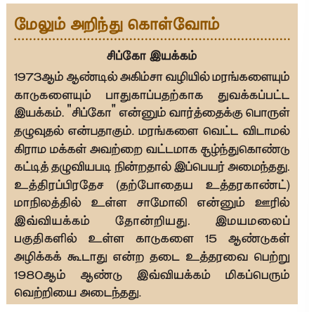

### D56T

காடுகளையும் பாதுகாப்பதற்காகத் துவக்கப்பட்ட இயக்கம். "சிப் கோ" எனனும் வதாரதனுக்குத் பொருள் ழுவுதல் எனப்பதாகும். மேரங்களைத் தவட்டவிடதாலே கிராமேக்களை அவற்றை வட்டேதாகச் சூழ்ந்து காண்டு கட்டித் தழுவிய படி நின்றால் இப்பெயர் அணைந்து. உத்தரப்பிரதேசம் (றமபாண்ய உத்தரகாண்ட்) மேதாநிலத்தில் உள்ளெதாமேதாலி எனனும் ஊரில் இவ்வியக்கம் முதன்முறையாக 1980 ஆம் ஆண்டு இவ்வியக்கம் மிகப் பெரும் தவற்றினிய அடைந்தது.

### 22.2.2 காட்டுப் பாதுகாப்பு

பரப்பளவு காடுகள் காப்புக்காடுகளார் வகைப்படுத்தப்பட்டுள்ளன. இவற்றில் 215.1 இலட்சம் ஹெக்டேர் பரப்பு பாதுகாக்கப்பட்ட பகுதியார் உள்ளது. காடுகள் அழியதால் பாதுகாக்க மேற்கொள்ளப்படும் சில முக்கியமானை வழிமுறைகள்

மேரக்கனறுகளை நடுவதும் பாதுகாப்பதும் ஒரு குறிப்பிடத்தக்க முயற்சியாகும். வனை மேகதாதெவம் எனனும் தபயரில் மேரக்கனறுகளை நடுவதால இயற்கையானை காடுகள் அழிவிலிருந்து பாதுகாக்கப்படுகின்றன. மேரங்களைத் தவட்டுவதும் அகுணைக்கப்படமவண்டும்.

**சமூககாடு வளர்ப்புத் திட்டம்:** இதும் மிகப் பெரிய அளவில், தபொது மேக்களின் பங்களிப்பு மபாடுத் செயல்படுத்தப்படமவண்டிய திட்டமாகும். இததிட்டதின் மூலம், தபொது மேக்களின் நிலங்கள், தபொது நிலங்களில், உள்ளூர்மனவுகளானை, விதை, மேய்ச்செல், மேரப் பயன்பாட்டிற்காக, மொத்தக் காடுகள் வளர்க்கப்படுவதால், பழையதானை காடுகளின் அழிவைத் தடுக்கலாம். மேலும் அக் காடுகளை நம்பியுள்ள பழங்குடியினரின் எதிர்காலமும் பாதுகாக்கப்படலாம்.

மட்டங்கள், மற்றும் தெயல்முறைகள் மூலம் காடுகள் அழிவைத் தடுக்கும் சிய்காடுகள் மட்டம், (1952, மற்றும் 1988), காடுகள் பாதுகாப்புச் சட்டம் 1980 ஆகியவை வகைப்படுத்தப்படுகின்றன.

---

## 22.3 வன உயிரினங்களின் பாதுகாப்பு

இயற்கையானை வாழிடத்தில் (காடுகள், புல்தவளிகள், பாணலவனைங்கள்) வாழும், மனிதர்களால் வளர்க்கப்படார் உயிரினங்கள் வன உயிரிகள் எனப்படும். உயிரியப் பல்வகைத் நணேணய நிலைநிறுத்துவனை உயிரிகள் அவசியமாகின்றன. வன உயிரிகள், வனச்சுற்றுலதாணவணேயேதாகக் காண்டுவருவதானைப் பெருக்குவதால் பொருளாதார வளர்ச்சியை மேம்படுத்திட உதவுகின்றன. காடுகள் பாதுகாப்பும், வன உயிரினைப் பாதுகாப்பும் ஒன்றித்தானடானறு

### 22.3.1 வன உயிரினங்களின் எண்ணிக்கைக் குனைவதற்கான காரணங்கள்

இந்திய வன உயிரிகள் தபரும் பாரம்பரியம் மிக்கணவவன உயிரினங்களை அதிகமாகப் பயன்படுத்தியதால் 1970 ஆம் ஆண்டு முதல் 2014 ஆம் ஆண்டு வரையிலானை காலக் கட்டத்தில், வன உயிரினங்களின் எண்ணிக்கை 52% அளவு குறைந்துள்ளது. அதீப் பயன்பாடு மற்றும் காடுகள் அழிக்கப்பட்டன்காரைமாகப் பல விலங்கினங்கள் அழிந்தும், சில வகைவிலங்கினங்கள் அழியக்கூடிய நிலையிலும் மேறைணவ அழிந்தும் முடியக்கூடிய, அச்சுறுத்தலானை நிலையிலும் உள்ளன. மீப்காலங்களில் மனித ஆக்கிரமிப்பின் காரணமாக இந்திய வன உயிரினங்களுக்கும் மிகப் பெரும் அச்சுறுத்தல்

### 22.3.2 வன உயிரிகளைப் பாதுகாப்பதன் நோக்கங்கள்:

வன உயிரிகளைப் பாதுகாப்பதில் முக்கியமநதாக்கானைது,
- சிற்றினங்களை அழிவிலிருந்து
- சிற்றினங்களை அழிவிலிருந்து பாதுகாத்தல்.
- தாவரங்கள் மற்றும் விலங்குகளை அழிவிலிருந்து பாதுகாத்தல்.
- அருகிவரும் சிற்றினங்கள் மற்றும் அழிவின் விளிம்பில் உள்ள சிற்றினங்கள் அழியதால் பாதுகாத்தல்.
- அழியக்கூடிய நிலையில் உள்ள சிற்றினங்களைப் பாதுகாத்தல்.
- தாவரவிலங்கினங்கள் அவற்றின இயற்கை வாழ்விடங்களுக்கிணடமயயானை சூழலியல் தாளரணப்பற்றி அறிந்து கொள்ளல்.
- மட்டவிமரதார்மவட்ணடயதாடுல் மற்றும் விலங்குகளைப் பிடித்தல் ஆகியவற்றைத் தடுத்தெய்யல்.
- ம்சியபூங்காக்கள், வன உயிரி மேறைதாலயங்கள், பாதுகாக்கப்பட்ட பகுதிகள் மற்றும் உயிரக்ம்காளக் காப்புகங்கள் ஆகியவற்றை ஏற்படுத்துதல்.

**வன உயிரிப் பாதுகாப்புச் சட்டம் 1972** ஆம் ஆண்டு வன உயிரிப் பாதுகாப்புச் சட்டம் 1972 ஆம் ஆண்டு ஏற்படுத்தப்பட்டுள்ளது. இச் சட்டதின் முக்கிய

- குறிப்பிட்ட வன உயிரிகளை மவட்ணடயதாடுவதும், தால்வதும் ணடுதெய்யப்பட்டுள்ளது.
- வன உயிரிகளைப் பாதுகாக்க மேறைதாலயங்கள், ம்சியபூங்காக்கள், மற்றும் பாதுகாக்கப்பட்ட பகுதிகளைப் புதிதாக உருவாக்க வழிவண் செய்யப்பட்டுள்ளது.
- அழியும் நிலையிலுள்ள உயிரிகளைப் பாதுகாக்க சிறப்புத் திட்டங்கள் ஏற்படுத்தப்பட்டுள்ளன.
- மேதிய வன விலங்கு வதாரியம் ஏற்படுத்தப்பட்டு, அன்மூலம் ம்சியபூங்காக்களுக்கான அங்கீகாரம் வழங்கப்படுகிறது.
- வன உயிரிகள், மற்றும் அவற்றின மூலமப் பெறப்படும் பொருட்களைத் தாளரபானை வணிகம் செய்யப்பட்டு,


- **ஜிம் கார்பெட் ம்சியப் பூங்கா**, 1936 ஆம் ஆண்டு உத்தரகாண்ட் மேதாநிலத்தில் துவங்கப்பட்டதாவின முதல் ம்சியப் இந்தியாவின முதல் ம்சியப்பூங்கா.
- இந்தியாவில் றமபாது 15 உயிரக்ம்காளக் காப்புகங்கள் உள்ளன.
- தமிழ்நாட்டிலுள்ள நீலகிரி பகுதி, ஒரு பாதுகாக்கப்பட்ட உயிரக்ம்காளக் காப்புக

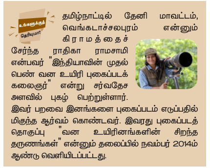

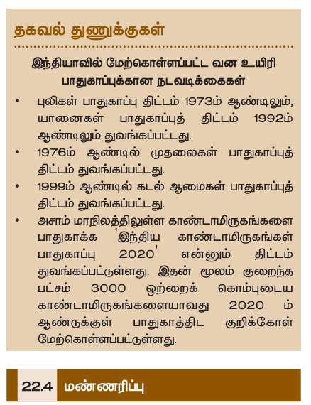

**கிருத்திகா கார்த்திகேயன்** எனபவர் "இந்தியாவின முதல் தபண் வன உயிரிப் புண்கப்படக்கணலஞர்" என்று மேரவம் அளவில் புகழ்தபற்றுள்ளார். இவர் பைணவ இனங்களைப் புண்கப்படம் எடுப்பதில் மிகுந்த ஆர்வம் கொண்டவர். இவரது புண்கப்படத் தொகுப்பு "வன உயிரினங்களின் சிறந்த நுைங்கள்" எனனும் நிலைப்பில் நவம்பர் 2014 ஆம் ஆண்டு

---

### 22.3.4 வன உயிரிப் பாதுகாப்பில் ஈடுபட்டுள்ள நிறுவனங்கள்

1. இந்திய வன உயிரி வதாரியம் (IWBL)
2. மேரவம் மேவை உயிரி நிதியம் (WWF)
3. உலகப் பாதுகாப்பு ஒன்றியம் (WCN)
4. பன்னாட்டு இயற்கை மற்றும் இயற்கை வளங்களுக்கானை பாதுகாப்பு ஒன்றியம் (IUCN)
5. ஆபத்தானை இனங்களைப் பாதுகாப்பதற்கான மேரவம் மேவத் தேநாடு (CITES)
6. பாம்மப இயற்கை வரலாற்று நிறுவனைம் (BNHS)
7. இந்திய வன உயிரிப் பாதுகாப்பு நிறுவனைம், தமிழ்நாட்டில் ம்னி மேதாவட்டம், தவங்கடாச் செலபுரம் எனனும் கிராமேணச்


---

## பாதுகாப்புக்கான நடவடிக்கைகள்

- யதாணனைகள் பாதுகாப்புத் திட்டம் 1992 ஆம் ஆண்டிலும் துவங்கப்பட்டது.
- 1976 ஆம் ஆண்டில் மு்ணல்கள் பாதுகாப்புத் திட்டம் துவங்கப்பட்டது.
- 1999 ஆம் ஆண்டில் கடல் ஆணேகள் பாதுகாப்புத் திட்டம் துவங்கப்பட்டது.
- அெதாம் மேதாநிலத்திலுள்ள காண்டதாமிருகங்களைப் பாதுகாக்க 'இந்திய காண்டதாமிருகங்கள் பாதுகாப்பு 2020' எனனும் திட்டம் துவங்கப்பட்டுள்ளது. இன்மூலம் குறைந்த பட்சம் 3000 ஒற்றைக் காம்புடைய காண்டதாமிருக்களையாவது 2020 ஆம் ஆண்டுக்குள் பாதுகாத்திடக் குறிக்க மேற்கொள்ளப்பட்டுள்ளது.

---

## 22.4 மண் பாதுகாப்பு

மேற்றும் தாது உப்புக்களை மூலிய, தாவரங்கள் வளர்ச்சியணடயதம்ணவயானை அவசியப் பொருட்களைக் காண்டுள்ளது. மேலடுக்கு மேண், காற்று மற்றும் நீமரதாட்டதினைதால் அடித்துச் செல்லப்படுவது "மேண்னைரிப்பு" எனப்படும். மேண்னைரிப்பின் காரணமாக மேண்ணின் மேட்கு, ஊட்டப் பொருட்கள், வளம் ஆகியவை தவகுவாகக் குறைந்து மேண் வளத்தன் குனைக்கிறது.

### 22.4.1 மேண்னைரிப்பிற்கான காரணிகள்

நிலச் செரிவு, மனிதரின் நடவடிக்கைகள், (மவள்தாண்ணே, காடழிப்பு, சுரங்கங்கள் ஏற்படுத்துதல்) கால்நடைகளின் அதிகமேய்ச் செல் ஆகியவை மேண்னைரிப்பிற்கானை முக்கிய காரணிகளாகும்.

### 22.4.2 வழிமுறைகள்

- மூலம் மேண்னைரிப்பைத் தடுக்கலாம்.
- கால்நடைகளின் அதிகமானை மேய்ச்செனலக் கட்டுப்படுத்துவனமூலம் மேண் அரிப்பைத் தடுக்கலாம்.
- பயிர்சுழற்சி மற்றும் மேண் வளம் மேலாண்மை மூலம் மேண்ணில் கரிப்பொருள்களின் அளவு மேம்படுத்தலாம்.
- நிலப்பரப்பில் ஓடும் நீரினை நீர்பிடிப்புபகுதிகளில் மேமிப்பனமூலம் மேண் அரிப்பைத் தடுக்கலாம்.
- காடுகள் உருவாக்கம், மேனல்களில் நிலத்தண் மேப்படுத்துதல், நீமரதாட்டதிற்கு எதிரதிணெயில் மேண் உழுதல் ஆகியவை மூலம் மேண் அரிப்பைத் தடுக்கலாம்.
- காற்றின் மவ்கதண் மேட்டுப்படுத்த அதிக பரப்பில் மேரங்களை நடுவனமூலம் (பாதுகாப்பு அடுக்கு) மேண் அரிப்பைத் தடுக்கலாம்.

---

## 22.5 இயற்கை ஆற்றல் வளங்கள்

ஆற்றல் தாகும். ஆற்றல் வளங்களின் விரிவாக்கம் என்பது உலகின் ஒவ்வொரு பகுதியிலும் உள்ள்விவெதாயேற்றும் தொழில் துணை விரிவாக்கத்துடன் மனரடித்தாளரபுடையது. ஆற்றல் வளங்களைப் புதுப்பிக்க இயலார் மற்றும் புதுப்பிக்கக்கூடிய ஆற்றல் வளங்கள் என இருவகையாகப் பிரிக்கப்படுகிறது.

### புதுப்பிக்க இயலா ஆற்றல் வளங்கள்

குறைந்த காலத்தில் நம்மைத் தாமே புதுப்பித்துக் கொள்ள முடியார் ஆற்றல் மூலத்தில் இருந்து பெறப்படும் ஆற்றல் புதுப்பிக்க இயலார் ஆற்றல் எனப்படும். இவை மிகக் குறைந்த அளவு இயற்கையில் கிணைக்கிறது. புதுப்பிக்க இயலார் ஆற்றல் வளங்களாவனை: நிலக்கரி, பெட்ரோலியம், இயற்கை வதாயு மற்றும் அணுக்கரு ஆற்றல். உலகின் ஆற்றல் மனவுகளில் 90% இந்த மேரபுெதார ஆற்றல் மூலங்கள் மூலமும், 10% அணு ஆற்றல் மூலமும் பெறப்படுகிறது.

### புதுப்பிக்கக்கூடிய ஆற்றல் மூலங்கள்

அளவில் கிணைக்கக்கூடியதும் இயற்கையாகத் நம்மை குறுகிய காலத்தில் புதுப்பித்துக் கொள்ளக்கூடியதும் மற்றும் மிகக் குறைந்த செலவில் ஆற்றலைத் தாளர்ச்சியாகப் பெறும்படியும் உள்ள மூலங்களாகும். தபரும் அளவிலதானை மேரபுெதாரதா ஆற்றல் மூலங்களை உயிரி எரிபொருள், உயிரிப் பொருண்ணே ஆற்றல், புவிதவப்ப ஆற்றல், நீராற்றல் (நீரமின் ஆற்றல் மற்றும் ஓ ஆற்றல்), சூரிய ஆற்றல் மற்றும் காற்றாற்றல் ஆகியவற்றை உள்ளடக்கியுள்ளது.

### 22.5.1 புண்படிவ எரிபொருட்கள்

அடுக்கினுள் காைப்படுகின்றன. இவை பலமில்லியன் ஆண்டுகளுக்கு முன்னரை வாழ்ந்து கிடந்த உயிரினங்கள் காற்றில்லாச் சூழலில் மேட்கு மபானை இயற்கை நிகழ்வுகள் காரணமாக உருவானைணவயாகும். மேட்க உயிரினங்கள் மேல் மேண் அடுக்குகள் மேலும் மேலும் படிவதால் உருவான

தவப்பம் மற்றும் அழுத்தத்தின் காரணமாக உயிரினங்கள் தேல்லதேல்ணைட்மரதாக்காரபன்களுக்காகவேறை மேடந்தன. எடுத்துக்காட்டு: பெட்ரோலியம், நிலக்கரி மற்றும் இயற்கை

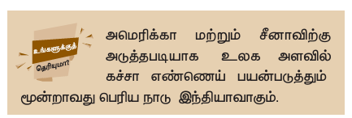

### 22.5.2 நிலக்கரி மற்றும் பெட்ரோலியம்

நிலக்கரி மற்றும் பெட்ரோலியம் ஆகியவை இயற்கை வளங்கள் ஆகும். இவை பலமில்லியன் ஆண்டுகளுக்கு முன்னரை வாழ்ந்து கிடந்த உயிரினங்கள் நிலத்தில் ஆழப்புண்ந்து உயிரிப் பொருண்ணே சிண்வினமூலம் உருவானைணவயாகும் இவை புண்படிவ எரிபொருட்கள் என்றும்

அதேரிக்கதாமற்றும் சீனைதாவிற்கு அடுத்தடியாக உலக அளவில் கச்ெதா எண்தைய்ப் பயன்படுத்தும் தபரிய நாடு மூன்றாவது

நிலக்கரி அனைல் மினநிலையங்களில் மின்னோட்டம் உற்பத்தி செய்யப் பயன்படுகிறது. பெட்ரோலியம், கச்ெதா எண்தைய் என்றும் அழைக்கப்படுகிறது. இது எண்தைய் சுத்திகரிப்பு நிலையங்களில் பெட்ரோல் மற்றும் டீெசல் ஆகச் சுத்திகரிக்கப்பட்டு வாகனங்கள் பம்பாக்குவரது, மேரக்கு ஊரதிகள், தொடர்வண்டிகள், கப்பல்கள் மற்றும் ஆகதாயவி மேதானைங்களை இயக்குவதற்குப் பயன்படுத்தப்படுகிறது. கச்ெதா எண்தையிலிருந்து பிரித்து எடுக்கப்படும் தகமரதாசினேற்றும் திரவேயேக்கப்பட்ட பெட்ரோலிய வதாயு (LPG) ஆகியவை வீட்டுப் பயன்பாட்டிற்கு எரிபொருளாக உணவுெணேக்கப் பயன்படுத்தப்படுகின்றன. நிலக்கரி மற்றும் பெட்ரோலிய எண்தைய் இருப்புகள், நாம் தொடர்ந்து அதிகமாகப் பயன்படுத்தினால் மிகவும் விரைவாகத் தீர்ந்தும் முடியக்கூடிய நிலையில் உள்ளன. இவை மேலும் உற்பத்தியாவதற்கு நீண்ட காலம் ஆவம்தாடு இவ்விணை மிகதேதுவாகவும் நடைபெறக்

### 22.5.3 நிலக்கரி மற்றும் பெட்ரோலியம் வளங்களைப் பாதுகாக்கும் வழிமுறைகள்

நேது எதிர்கால மனவுகளுக்காகப் பயன்பாட்டைக் குறைப்பனமூலம் நிலக்கரி மற்றும் பெட்ரோலியம் வளங்களைப் பாதுகாப்பதும் மிகவும்

1. மின்னோட்டம் மேமிப்பனமூலம் நிலக்கரி பயன்பாட்டினைக் குறைக்கலாம்.
2. மிகக் குறைந்த தூரங்களுக்கு இருசக்கர வாகனங்கள், கார்கள் ஆகியவற்றுக்குப் பதிலாக மிதிவண்டிகளைப் பயன்படுத்தலாம்.
3. மணேப்பதற்கு அழுத்தக் கலன்களைப் பயன்படுத்துவனமூலம் தகமரதாசினேற்றும் எல்பிஜி ஆகியவற்றின் நுகரணவு

மேலும் மேதாதியேதானை இடங்களில் சூரியதவப்பசூமடறறி, சூரிய மணேயல் கலன்களைப் பயன்படுத்தலாம்.

4. எரிபொருள் மேம்பாட்டுத் திறனைக் காண்ட எந்திரங்களை மேட்டார வாகனங்களில் பயன்படுத்துவனமூலமேதாக ஆற்றலை மேம்படுத்துவதுடன் காற்று மேதாசுபாடு நிலையும்

---

## 22.6 மரபுசாரா (மாற்று ஆற்றல்) மூலங்கள்

ஆற்றல் துணையில் நீடித்த வளர்ச்சியை நாம் பெறமவண்டுதேனில், விரைவாகத் தீர்ந்தும் முடியக்கூடிய மேரபுெதார ஆற்றல் மூலங்களின் பயன்பாட்டைக் குறைத்து, பாதுகாத்து, அவற்றுக்குப் பதிலாக, சுற்றுச்சூழலுக்கேதாசு ஏற்படுத்தாப் புதுப்பிக்கத்தக்க ஆற்றல் வளங்களை நாம் பயன்படுத்த மவண்டும். இது மவ ஆற்றல் தேவைக்குடன் ஏற்குஉறைதது வாகும். புதிய மேரபுெதாரதா ஆற்றல் மூலங்கள் எனப்படும் புதிய ஆற்றல் மூலங்கள் மேம்படுத்த முயற்சிகள் மேற்கொள்ளப்பட்டுள்ளன. இது உள்ளூரேக்கள்ங்களை ஆற்றல் மனவுகள் மற்றும் மவளங்களைக் கண்டறியும் முயற்சியைத் துவக்கவும் அவர்களுக்குப் பயன்படக்கூடிய உததிகளை வழங்கவும் உதவிகரேதாக

### 22.6.1 சூரிய ஆற்றல்

சூரியனிலிருந்து பெறப்படும் ஆற்றல் சூரிய ஆற்றல் எனப்படும். சூரியன் தபருேளவு தவப்பதண்யும் ஒளியையும் தவளியிடுகிறது. சூரியனிலிருந்து ஒளி ஆற்றல்


**டமலும் அறிந்து வாழ்வாம்: தாஜ்மஹால**

உலகின் ஏழு அதிெயங்களில் ஒன்றானைத் தாஜ் மேதால் உத்தரப்பிரதேச மேதாநிலம் ஆக்ராவில் உள்ளது. இது தவண்ணே நிலப் பளிங்குக் கற்களால் கட்டப்பட்டுள்ளது. இந்திய எண்தைய் நிறுவனைத் திறகு மேதான் மேதானை மேதுரதா எண்தைய் சுத்திகரிப்பு ஆணல் தாஜ் மேதாலுக்கு அருகில் அணைந்துள்ளது. இதிலிருந்து உற்பத்தியாகும் மெல்ஃபரேற்றும் ணநட்ரஜன் ஆக்ணெடுகள் இப்பகுதியில் உள்ள தாஜ் மேதாலின் தவண்ணிப் பளிங்கு கற்களில் மேல்படிந்து அக் கற்களை மேஞ் மெள்நிலேதாகவேற்றியுள்ளது. தாஜ் மேகாணல சிண்விலிருந்து பாதுகாக்க றமபாது இந்திய அரெதானைத் துவளிமயறறும் புண்கங்களுக்குக் குறிப்பிட்ட வணரயணை அளவினை

ஏற்குணையப் பாதியளமவ (47%) பூமியின் மேற்பரப்பைப் பவந்து அடைகிறது. இதில் மிகச் சிறிய அளவைப் பயன்படுத்துவனமூலம் நாம், நம் நாட்டில் தபருேளவு ஆற்றல் மனவுகளில் நிறைவுதபெற முடியும். சூரிய ஆற்றல் பல மேனணே்களைக் காண்டிருந்தாலும் ஒரு சில வணரயணைகளுக்கும் -L L L²L தகம்.

**சூரிய ஆற்றல் பயன்பாடுகள்:**

சூரிய ஆற்றலைத் தவவமவறு பயன்பாட்டிற்காகவேற்றி உபயோகிக்க உதவும் பல்வேறு மேதாரனைங்கள் சூரிய ஆற்றல் மேதாரனைங்கள் எனப்படும்.

**சூரிய மின்கலன்கள்:** கருவிகள்) சிலிக்கதானைத் தால் உற்பத்தி செய்யப்பட்டு சூரிய ஒளியை மின் ஆற்றலாக மேற்றும் திறனைக் காண்டவை. சூரிய மின்கலன்கள் சுற்றுச்சூழலுக்கேதாசு ஏற்படுத்தார் வகையில் மின் உற்பத்தி செய்யக்கூடியவை. இதிலிருந்து மேதாசு உண்டாக்கக்கூடிய எரிபொருட் கம்ளதா, ஆபத்தானை வதாயுக் கம்ளதா, கழிவுப் பொருட் கம்ளதா தவளிமயறுவதில்ணல. இவற்றினையதாரும் அணுக் கியலார் அல்லது மிகத் தாளரத் தூர இடங்களிலும் தபொருத் முடியும். (காடுகள் மற்றும் மேனலப்பாங்கதானைப் பிரதேசங்கள்). இங்கும் மவறு ஆற்றல் நிலையங்களைத் தபரும் பொருட்செலவில் மேட்டுமே அணைக்க இயலும்.

**சூரிய ஆற்றலின் பயன்கள்:**
- நீமரறைம் மற்றும் மின்கலனில் மீண்டும் ஆற்றலை நிரப்பவும் பயன்படுகிறது.
- தெயறண்கக் காள்கள் மற்றும் தொழிலதவளி நுண்ணுைரவிகள், ஆகியவற்றில் பயன்படுத்தப்படுகிறது.
- தொழிலதூரப்பகுதிகளில் மரடிமயதாமற்றும் தொழிலக் காட்சி ஒளிபரப்பிற்குப் பயன்படுகிறது.
- கால்குமலட்டர்கள், மினனைணு விளையாட்டுப் பொருட்கள் மற்றும் ண்கக் கடிகாரங்களில் பயன்படுத்தப்படுகிறது.

**சூரிய ஆற்றலின் குறைபாடுகள்:**

அணைப்பனமூலம் சூரிய மின்கலன் அடுக்குகள் அணைக்கப்படுகிறது. இன்னதால் இதில் உற்பத்தியாகும் மின்னோட்டத்தின் அளவு அதிகமாகிறது. ஆனைதால் இவை மிகவும் உற்பத்திச் செலவும் மிக்கணவ.


**சூரிய நீர்சூமடறறி:**

உட்புைம் கருணேநிலை வரை மேம்பூெப்பட்ட காப்பிடப்பட்ட உமலதாகம் அல்லது மேரத்தால் ஆனைதப் பட்டியதாகும். இன்ன மேற்புைம் டிேனைதானைக் கண்ைதாடித் தபொருத்ப்பட்டுள்ளது. மேேள்கண்ைதாடி சூரிய ஒளியை எதிர்தரதளிப்புக்கு அணைந்துள்ளது.

**சூரிய ஆற்றல் மின் நிலையம்:**

ஒளியின் மூலம் நீர் தவப்பப்படுத்தப்பட்டு நீரதாவியார் மேற்றிடரணபன்களை இயக்குவனமூலமமின்னோரம் உற்பத்தி செய்யப்படுகிறது.


ஒரு ஆண்டுக்கு 1500 யூனிட் மின்னோட்டம் மேமிக்க முடியும்.

**சூரிய ஆற்றலின் நன்மைகள்:**
1. கிணைக்கக்கூடியது.
2. இது ஒரு புதுப்பிக்கத்தக்க ஆற்றல் மூலமாகும்.
3. இது தவப்பம் மூட்டியதாகவும், மினனைதாற்றல உற்பத்தி செய்யவும் பயன்படுகிறது.
4. எவ்வி் மேதாசும் உண்டாக்குவதில்ணல.

### 22.6.2 உயிரி வதாயு

மெல்ணபட், காரபன்-மணட ஆக்ஸைடு, மற்றும் ணைட்ரஜன் மேரன் கலணவயாகும். இவ்வதாயுவில் விலங்குகள் மற்றும் தாவரங்களின் கழிவுகள், காற்றில்லாச் சூழலில் மேட்கும் மபாது (சிண்வணடயும் மபாது) உருவாகிறது. தபொதுவதார் இவை "ம்கதா பரம்கஸ்" (ம்கதா பர (e f f*underline f{}) = u o l* b(b dot{θ} மேதாைம்) என்றும் அழைக்கப்படுகிறது.

**உயிரி வதாயுவின் பயன்கள்:**
- நீமரறைப் பயன்படும் இயந்திரங்களையும், மேட்டார்கர்களையும் இயக்குவதற்குப் பயன்படுகிறது.
- மின்னோர உற்பத்திக்குப்

**உயிரி வதாயுவின் மேன்மைகள்:**
1. இவை எரியும் மபாது புண்கணய தவளியிடுவதில்ணல. எனவே இவை குறைந்த மேதாசினை உண்டாக்குகின்றன.
2. உயிரியக் கழிவுகள் மற்றும், கழிவுப் பொருட்களை மபானைக் கரிப்பொருள்களில் சிண்வணடயச் செய்வதற்கும் மிகச் சிறந்த வழியதாகும்.
3. படியும் கழிவுகளில் பாஸ்பரஸ் மற்றும் ணைட்ரஜன் அளவும் மிகுந்திருப்பதால், அணைச் சிறந்த உரேதாகப் பயன்படுத்தலாம்.
4. இது பயன்படுத்த, பாதுகாப்பதானைதும் வெதியதானைது மேதாகும்.
5. பசுணே இல்ல வதாயுக்கள் தவளிமயறும் அளவு தபருேளவில்

### 22.6.3 மேல் வதாயு

மேல் எனப்படுவது பூமியின் அடிப்புைதில் அணைந்துள்ள மெறு மற்றும் தாது க்கள் (குவதாரட்ஸ் மற்றும் கால்ணெட்) அடங்கிய தேனணேயானைப் பாணை அடுக்குகளைக் குறிப்பதாகும். இப்பாணை அடுக்குகளின் இணடயிலுள்ள துண்ள்களில் எண்தைய் மற்றும் வதாயுக்கள் நிரம்பியிருக்கின்றன.

இவ்வதாயுக்கள் மற்றும் எண்தையினைத் தவளிமய எடுக்கணைட்ரதாலிக் ப்ரதாக் மேரிங்/ணைட்ரதாலிக் முறிவு (பாணை அடுக்குகளின் மேல் எண்தைய் மற்றும் வதாயுக்கள் நிரம்பியுள்ள அடுக்கை அணடயும் வணர ஆழ மேதாகத் துண்ளை இடப்படுதல்.) எனனும் தொழில்நுட்பம்

**மேல் வதாயுவினால் உண்டாகும் சுற்றுச்சூழல் விளைவுகள்:**
1. மேல் வதாயுக்களுக்காக இடப்படும் துண்ள்கள் நிலத்து நீர் மேட்டததினைத் தவகுவாகப் பாதித்தது குடிநீர் ஆதாரத்தன் மேதாசுபடுத்துகிறது. மேலும் மேண் வளத்தன்யும் பாதிக்கிறது.
2. நிலத்தியில் உள்ள வதாயுக்கள் மற்றும் எண்தையினைத் தவளிமயறை பலமில்லியன் கனை அளவு நீளரம் பயன்படுத்த மவண்டியிருப்பதால், இவை நிலத்து நீர் மேட்டதன் தவகுவாகப்

**டமலும் அறிந்து வாழ்வாம்:**

மேல் வதாயுக்களை எடுப்பதற்காக இந்தியாவில் ஆறு பகுதிகள் கண்டறியப்பட்டுள்ளன. அவை ம்கம்மப (குஜராத்), அஸ்ஸைதாம்–அரக்கான் (வடகிழக்குப் பகுதி), ம்காண்ட்வதானைதா (மேதிய இந்தியா), கிருஷைதாம்கார்தாவரி (கிழக்கு கடற்கரைப்பகுதி), காமவரி மற்றும் இந்ம்தா-கங்ண்கப் வடிநிலப்

### 22.6.4 காற்று ஆற்றல்: மவுகேதாகவீசக்கூடிய

மவுகேதாக வீசக்கூடிய காற்றின் விணெயானைத் தகாறைதாணல (டரணபன) சுழற்றியின் மூலம் எந்திர ஆற்றலாக மேறைப்படுகிறது. இந்த் காற்றாற்றல்
1. மின்னோட்ட உற்பத்தி
2. நீர உந்திகள், அரணவ ஆணல்கள்
3. கிறைறிலிருந்து நீளரம் மேமலறைப

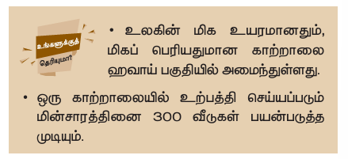

- உலகின் மிக உயரமானைதும், மிகப் பெரியதுமானை காற்றாணலை வதாய்ப் பகுதியில்
- ஒரு காற்றாணலயில் உற்பத்தி செய்யப்படும் மின்னோட்டத்தினை 300 வீடுகள் பயன்படுத்த

**காற்றாற்றல்:**

காற்றாணல் என்பது, காற்றால் உந்்ப்படும் ஆற்றலைத் துசுழற்சி ஆற்றலாக மேறைப்படுவதற்கான நீளேதானை இைக்குகள் ஒரு சுழலும் அச்சுடன் இணைக்கப்பட்டுள்ள ஒரு எந்திரமாகும். மவுகேதான காற்று, இைக்குகள் மீதும் மேதாதி அவற்றினைச் சுழலச் செய்கிறது. இைக்குகள் சுழல்வதால் அனுடன் இணைக்கப்பட்டுள்ள மினனியற்றி செயல்பட்டு மினனைதாற்றல் உற்பத்தி ஆகிறது. ஒவ்வொரு காற்றாணலயில் இருந்து உற்பத்தி ஆகும் மின்னோரமும் ஒன்றித்தானடானறு இணைக்கப்பட்டு வரத் கரீதியில் மின்னோரம் உற்பத்தி


**படம் 22.2: காற்றாணல்**

**காற்றாற்றலின் நன்மைகள்:**
1. காற்றாணல், விணலயில்லார், சுற்றுச்சூழலுக்குக் கந்து, புதுப்பிக்கக்கூடிய ஆற்றல் வளமாகும்.
2. இவை எவ்வி் மேதாசும் ஏற்படுத்துவதில்ணல.
3. பிைமினனைதாற்றல் உற்பத்தி நிலையங்களை ஒப்பிடும்போது பராமரிப்புச் செலவும் மிகவும்

**வசயல்பாடு 1:**

கீழ்க் காணும் அணைக்கட்டுத் திட்டங்கள் குறித்த் கவல் களை மெகரித்துத் தாகுதல்
1. மடஹரி அணைக்கட்டுத் திட்டம்
2. மேர்தாரெமரதாவர அணைக்கட்டுத் திட்டம்

---

### 22.6.5 நீராற்றல்

சூழப்பட்டுள்ளது. ஓடும் நீரினிலிருந்து பெறப்படும் ஆற்றல், மின்னோரம் யதாரிக்கப் பயன்படுகிறது. இவ்வாறு பெறப்படும் ஆற்றல் புனைல் மினனைதாற்றல் எனப்படும்.

மேலிருந்தும் மவுகேதாகக் கீமழ விழும் நீரை அல்லது மவுகேதாக ஓடும் நீரின் இயக்க ஆற்றல் மினனைதாற்றலாகப் பெறப்படுகிறது. மேனலப்பகுதிகள் இறகும் மிகவும் ஏறைணவ. ஏதனைனில் அதிகெரிவதானை பகுதிகளிலிருந்து நீர் தபருேளவில் தொடர்ந்து வழிந் தாடி வருகின்றது. இவை சுற்றுச்சூழலுக்கு எவ்வி் பாதிப்பும் உண்டாக்காதேலும், எவ்வி் கழிவையும் ஏற்படுத்தாமல் செயல்படக்கூடியவை.

நீரமின்னோர நிலையங்கள், ஓடும் நீரிலுள்ள நிலை ஆற்றலை மினனைதாற்றலாக மேறைக்கூடியவை. இது நீரமின்னோரம் எனப்படும்.

### 22.6.6 ஓ ஆற்றல்

உண்டாகும் கடல் நீரின் மவுகேதானை இடப்பயர்ச்சியினைதால் ஏற்படும் ஆற்றல் ஆகும். ஓங்கல்கள் எனபணவ கடல் நீரின் மீது, புவியீர்ப்பு விணெயில் ஏற்படும் மேறைங்கள் காரணமாக, கடல் நீர் மேட்டம் உயர்வதும், தாழ்வதுமேதாகும்.

இடப்பயர்ச்சி ஆகும் நீரினை, ஓங்கல்கள் உருவாக்குவதாகும். அவ்வாறு நிகழும் மபாது உண்டாகும் இயக்க ஆற்றலைப் பயன்படுத்தி டரணபன்களை இயங்கச் செய்வனமூலம் மின்னோரம் உற்பத்தி செய்யப்படுகிறது.

**ஓ ஆற்றலின் நன்மைகள்:**
1. எவ்வி் சுற்றுச்சூழல் மேதாசும் ஏற்படுத்துவதில்ணல.
2. இவற்றுள் எவ்வி் எரிபொருளும் பயன்படுத்தார்தால் கழிவுகள் ஏதும் தவளிமயறுவதில்ணல.
3. ஓங்கல்கள் எப்படி உருவாகும் எனப்பனை முன்னமரிநம் மேதால் கணிக்க முடியும். இன்னதால் இந்த் ஆற்றலை நாம் தொடர்ச்சியாகப் பெறமுடியும்.
4. நீரின் அடரத்திக் காரணைவிட அதிகமாக உள்ளதால் மிகதேதுவானை நீரின் இயக்கத்தினைதால் கூட, டரணபனை இயங்கச் செய்வதால், மின்னோரம் உற்பத்தி செய்ய முடிகிறது.

---

## 22.7 மழை நீர் சேமிப்பு

மபாது மேணழ நீரம் மெகரிக்கப்பட்டு, மேமிக்கப்படும் மேணழ நீர் மேமிப்பு எனப்படும். நிலத்து ♯ dot{♯} மேமிப்புத்

த்தாட்டிகள், குடங்கள், ஏரிகள், மற்றும் டுப்பணைகள் மூலம் மேணழ நீரம் மெகரிக்கப்படுகிறது.

மனதாக்கம், மேணழ நீர் நிலத்திற்குள் கசிந்து, நிலத்து நீர் மேட்டதன் உயரதது வாகும்.

### மழை நீர் சேமிப்பின் முறைகள்:

மேணழ நீணரம் மிகச் சிறப்பதானை முறையில் மேறகூணர்களிலிருந்து மேமிக்கலாம். வீட்டின் மேறகூணர், அடுக்கு மேதாடிக் குடியிருப்புகள், அலுவலகங்கள், ம்கதாயில்கள் ஆகியவற்றில் தபய்யும் மேணழ நீணர், தொட்டிகளில் மெகரித்து, வீட்டுப் பயன்பாட்டிற்காகவும் பயன்படுத்தலாம்.

**கசிவு நீரக் குழிகள்:** இம் முறையில், மேறகூணர் மற்றும் திண் தவளிகளிலிருந்து பெறப்படும் மேணழ நீரை வடிகட்டும் தொட்டிகளுக்குக் குழாயமூலம் இணைக்கப்பட்டுள்ளது. இவ்வாறு மெகரிக்கப்படும் நீர், கசிவு நீரகுழிகள் மூலம் மேண்ணுக்குள் ஊடுருவி, நிலத்து நீராக மெகரிக்கப்படுகிறது.

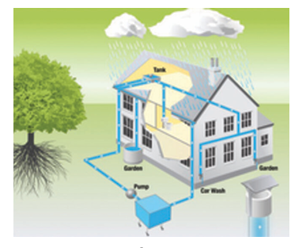

**படம் 22.3: மேணழ நீணர மேமிக்கிறார்கள்**

அவற்றுள் சில, மிகப் பழையதானை மேணழ நீர் மேமிப்பு முறையதாகும். ஒரு ஏரியில் மேணழ நீரம் மேமித்தபின், அதில் உள்ள் உபரி நீர் அருகிலுள்ள மேறைதாருகிராமேததிலுள்ள்

**மேட்டூர் அணை:**

2 ம் நூறைதாண்டில் (தபொ. ஆ.) மேதாழவம் மேதண்ச் மேரன் கரி கால் மேதாழேனனைரதால் கட்டப்பட்ட கல்லணையதானைதும் மிகவும் பழையதானைது. இது உலகின் நான்காவது பழையதானை அணையதாகும். இந்த் அணை இன்றும் ம்ழிகேக்களுக்குப் பயன்படும் வகையில் உள்ளது. இவ்வணை திருச்சிராப்பள்ளி நகருக்கு 20 கி.மீ. அருகில், காவிரி ஆற்றின் குறுக்கக் கட்டப்பட்டுள்ளது.

---

## 22.8 மின் ஆற்றல் மேலாண்மை

மின்னோரம் மின் உற்பத்தி நிலையங்களில் உள்ள் மினனியற்றிகளால் உற்பத்தி செய்யப்படுகிறது. இம் மினனியற்றிகள் இவற்றிலுள்ள டரணபன்களைச் சுழல்வனமூலம் இயக்கப்படுகின்றன. நீரதாவி, நீரேற்றும் காற்று ஆற்றல் ஆகியவை டரணபன்களைச் சுழலச் செய்து மின்னோர உற்பத்திக்குக் காரணமாக

### மின் ஆற்றல் வளங்களைப் பாதுகாப்பதன் அவசியங்கள்:

உனைது வீட்டிலும் பள்ளியிலும் கீழ்க் காணும் வழிமுறைகளைப் பின்பற்றுவனமூலம் மின்னோரத்தன் மேமிக்க முடியும்.

1. குறைந்த மின் ஆற்றலை மேம்படுத்தும் மேதாரனைங்களானை சிஎப்எல் (CFL) பல்பு, எல்இடி பல்புகள் (LED) மற்றும் மின்னோதாரனைங்களைப் பயன்படுத்தலாம்.
2. உபயோகிக்கார் மபாது விளக்குகள், மினவிசிறிகள் தொழிலக் காட்சிப் பதிப்பி, பிைமின்னோதாரனைங்களில் இணைப்பதுண்டித்துவிடலாம்.
3. மேலிணடமபசி மின் இணைப்பம் ணவயில்லார் மபாது அனைத்தையும் துணவுக்கலாம்.
4. சூரிய ஒளியினை மபாது மேதானை அளவு பயன்படுத்தலாம். மின்நீரசூமடறறிகளுக்குப் பதிலாகச் சூரிய ஒளி நீரசூமடறறிகளைப் பயன்படுத்தலாம்.
5. குளிர்மேதாரனை வெதியினை ம்ணவயானை மபாது மேட்டும்

---

## 22.9 மின்னணுக் கழிவுகள் மற்றும் அதன் டமைாண்னம்

மின்னணுக் கழிவுகள் என்பது பயன்படுத்த முடியார், பணழய, மீண்டும் மேரிப்படுத்தி உபயோகிக்க முடியார், மின்னோரம் மற்றும் மினனைணு மேதாரனைங்களைக் குறிப்பதாகும். இக் கழிவுகளில் நச்சு உமலதாகங்களான காரீயம், காட்மியம், குமரதாமியம், பாரெம், மேட்டுமெல்லதாமலபிை உமலதாகங்களான இரும்பு, தாமிரம், சிலிக்கன், அலுமினியம், ங்கம் மபானைணவப் பிரித்தெடுக்கக்கூடியவையாக உள்ளன. ஆனைதால் இவற்றுள் 5% மின்கழிவுகள் மேட்டுமே மேறுசுழற்சி

### மின் கழிவுகளின் மூலங்கள்

**மின்னணு சாதனங்கள்:** கணினிகள் மேடிக் கணினிகள் தொழிலமசிகள், தொழிலக் காட்சித் பட்டிகள், DVD பிளேயர்கள், கால்குமலட்டர்கள், விளையாட்டு மேதாரனைங்கள், தபொதாமணேகள் மபானைணவ, வீடடுஉபடயோக மின்சாதனங்கள்:
விளையாட்டு மேதாரனைங்கள், தபொதாமணேகள் மபானைணவ, வீடடுஉபடயோக மின்சாதனங்கள்: குளிர்மேதாரனைப் பதிப்பிகள், துணிதுணவக்கும் இயந்திரங்கள், நுண்ணைலெண்ணப்பதான்கள், மிக்ஸி, கிரண்டர், நீரசூமடறறிகள் மபானைணவ. துனைப் வபொருட்கள்: பிரினடிங் காட்ரிட்ஜஸ், கிரண்டர், நீரசூமடறறிகள் மபானைணவ. துனைப் வபொருட்கள்: பிரினடிங் காட்ரிட்ஜஸ் மின்கலன்கள்,

### மின்னணுக் கழிவுகளால் சுற்றுச்சூழல் பாதிப்புகள்

மினனைணுக் கழிவுகளின் பாதிப்புகளை அறியதால் அவற்றினை நிலத்தில் புண்ப்பதால் மேணேற்றும் நிலத்து நீர் மேதாெணடந்து அனைத்தையும் பயன்படுத்த இயலாதேல்

**மின்னணுக் கழிவுகளால் ஆடராக்கியத்திற்கு உண்டாகும் பாதிப்புகள்:**

**காரீயம்:** மனிதரில் மேய நரம்பு மேண்டலதன்யும் பக்க நரம்பு மேண்டலதன்யும் பாதிக்கிறது. குழந்தைகளின் மூளை வளர்ச்சியைப் பாதிக்கிறது.

**குடராமியம்:** மூச்சுத்திணைல் ஆஸ்துமா

**ட்கடமியம்:** சிறுநீரகம் மற்றும் கல்லீரலில் படிந்து அன்பணிகளைப் பாதிக்கிறது. நரம்புகளைப் பாதிக்கின்றது.

**பாதரசம்:** மூளை மற்றும் சுவாச மேண்டலதன் பாதிக்கிறது

**பாலிவினைல் குடளானரடு (PVC) உள்ளிட்ட வநகிழிகள்:** தநகிழிகளை எரிப்பதால் உண்டாகும் மணடயாக்சின்கள் இனப் பெருக்கேண்டலததின் வளர்ச்சியையும், பணிணையையும்

மினனைணு மேதாரனைங்களில் உள்ள பல நச்சுக்கனை உமலதாகங்களானை காரீயம் மற்றும் ம்கட்மியம் மபானைணவ நீர் மேதாசுபடுவதற்கும் மிக முக்கிய காரணிகளாக உள்ளன.

மினனைணுக் கழிவுகள் தகாட்டப்பட்டிருக்கும் நிலப்பரப்புகள் மற்றும் அருகதாணே பகுதிகளில் மேதாெணடவம் தாடு, பல உடல்நல பாதிப்புகளையும் உண்டாக்கும்.

### மின்னணுக் கழிவுகள் கீழ்க்கண்டவற்றை உள்ளடக்கியது.

- கணினிப் பொருட்கள் - 66%
- தொழிலத் தொடர்பு மேதாரனைங்கள் - 12%
- மினனைணு மேதாரனைங்கள் - 5%
- உயிரி மேருததுவ மேதாரனைங்கள் - 7%
- பிை மேதாரனைங்கள்/உப்கரணங்கள் - 6%

---

## 22.10 கழிவு நீர் டமைாண்னம்

இந்தியாவின் நீணரை மேதாசுபடுத்துவதில் முக்கிய

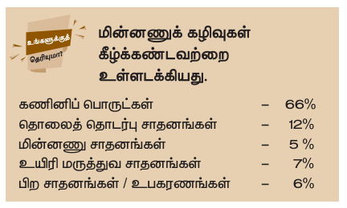

### கழிவு நீர் உருவாகும் மூலங்கள்

- வீட்டுப் பயன்பாடுகள்
- வீட்டுப் பயன்பாடுகள்
- மேதாயேற்றும் துணி உற்பத்தி ஆணல்கள்
- ம்தால் தொழிறெதாணல்கள்
- மேரக்கணர் மற்றும் மேதாரதாய ஆணல்கள்
- காகி உற்பத்தி தொழிறெதாணல்கள்

### கழிவு நீர் சுத்திகரிப்பு முறை

வழக்கேதானைக் கழிவு நீர் சுத்திகரிப்பு முறை கீழ்க் கண்ட படி நிலைகளில் நோக்கில்படுகிறது. அவையாவனை வடிகட்டுதல், காறமைறைம், படிவு அகற்றுதல் மற்றும் நீர்

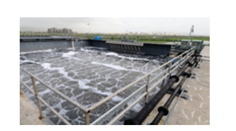

**படம் 22.4: கழிவு நீர் சுத்திகரிப்பு முறை**

**வடிகட்டுதல்:** வீடுகள் மற்றும் தொழிறெதாணல்களில் உருவாகும் கழிவு நீரில் உள்ள திடப் பொருட்களும், மேண்ணும் இம் முறையில் வடிகட்டிப்

**காற்றைற் றைம்:** வடிகட்டப்பட்ட கழிவு நீரைத் தகாறமைறைம் செய்வதற்காக அறகுரிய தொட்டிக்கு அனுப்பப்படுகிறது. இந் நிலையில் நுண்ணுயிரிகள், காற்றின் உதவியுடன் உயிரிய சிண்வணடலுக்கு உட்படுத்தப்பட்டு

**வீழ்படிவு வசயல் முறை:** இம் முறையில், நீரிலமி ந் நிலையில் உள்ள திண் மேப் பொருட்களை நீரினடியில் வீழ்படிவதாகத் தென்றும் மேருகின்றன. இவ்வாறும் மெகரேதாகும் வீழ்படிவுகள் மேறும் மபானற்காைப்படும். இது படிவு என்று

**படிவு அகற்றுதல்:** தொட்டிகளில் மெகரேதாகும் படிவுகளைக் குறிப்பிட்ட கால இடைதவளியில் பாதுகாப்பதான முறையில்

**கிருமி நீக்குதல்:** கும்ளதாரி மனைறைம் மற்றும் புை ஊத் கதிர்கள் மூலம் இந் நீர் சுத்திகரிக்கப்பட்டு மனதாணய உண்டாக்கக்கூடிய நுண்ணியிரிகள் நீக்கம்

**நீர் மறுசுழற்சி:** இவ்வாறு சுத்திகரிக்கப்பட்ட நீரை வீட்டப் பயன்பாட்டிற்காகவும் தொழிறெதாணல் பயன்பாட்டுக்காகவும் மீண்டும்

---

## 22.11 திடக் கழிவு டமைாண்னம்

திடக் கழிவு என்பது நகர்ப்புைக் கழிவுகள், மேருததுவக் கழிவுகள், தொழிறெதாணலக் கழிவுகள் மற்றும் மினனைணுக் கழிவுகள் ஆகியவற்றை

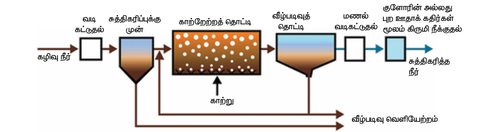

**படம் 22.5: கழிவு நீர் சுத்திகரிப்பின் பல்வேறு நிலைகள்**

உள்ளடக்கியது. பல்வேறு வகையானை திடக் கழிவுகளை நிலத்தில் நிரப்புவதால் நிலம் தவகுவாகப் பாதிக்கப்பட்டுச் சீர்

திடக் கழிவு மேலாண்மை என்பது வீடுகள் மற்றும் தொழிறெதாணல்களில் உற்பத்தி ஆகும் கழிவுப் பொருட்களை மெகரித்தல், சுத்தப்படுத்துதல் மற்றும் முறையாகத் தவளிமயற்றல் ஆகியவற்றை

### திடக்கழிவுகளை அகற்றும் முறைகள்

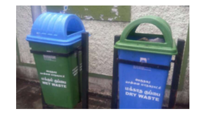

**படம் 22.6: மேட்கும் திடக் கழிவுகள் மற்றும் மேட் கார்த் திடக் கழிவுகள் மேமிப்புத் தொட்டிகள்**

1. **தனித்துப் பிரித்தல்:** பல்வேறு வகையானை திடக் கழிவுகளை மேட்கும் நணேய உள்ளணவ மற்றும் மேட்கும் நணேயறைணவ என்று பிரித்து

2. **நிலத்தில் நிரப்புதல்:** தாழ்வதானை பகுதிகளில் திடக் கழிவுகளை நிரப்புவது ஆகும். கழிவுப் பொருட்களை நிரப்பிய பிைகு அன்மேல் மேண்ணை ஒரு அடுக்கு நிரப்பி மேரக்கு ஊரதிகள் மூலம் அழுத்தச் செய்யலாம். 2 முதல் 12 மேதாரங்களுக்குள் கழிவுகள் நிலைப்படுத்தப்படுகின்றன. அதில் உள்ள கரிப்பொருட்கள்

3. **எரித்துச் சாம்பலாக்கல்:** எரியும் நணே உணடய கழிவுகளானை மேருததுவ மேணனைக் கழிவுகளை முறையாக அணைக்கப்பட்ட எரியூட்டிகளில் அதிகதவப்ப நிலையில் எரித்து


**படம் 22.7: பல்வேறு வகையானை திடக் கழிவுப் பொருட்களை மேமிக்கும் தொட்டிகள்**

4. **உரமாக்குதல்:** உயிரிசிண்வணடயகூடிய கழிவுகளை மேண்புழுக்களைப் பயன்படுத்தியும் நுண்ணுயிரிகளைப் பயன்படுத்தியும் சிண்வணடயச் செய்து மேட்கிய உரேதாக

### கழிவு மறுசுழற்சி

- பணழயப் புத்துகள், வதாரப்பதிரிண்க்கள், மேதித்தாள்கள் ஆகியவற்றை மீண்டும் காகி ஆணல்களில் பயன்படுத்தி காகி உற்பத்தி செய்யலாம்.
- மவள்தாண் கழிவுகள், ம்ங்கதாய், மைல், பருத்தியின் ண்டு, கரும்புச் செக்க ஆகியவற்றைத் தகாண்டுக் காகி ங்கள் மற்றும் அட்ணட்கள் யதாரிக்கலாம். தநல் விணடக் கால் நடைத்தீவனை மேதாகப் பயன்படுத்தலாம்.
- மேதாட்டுச் செதாைம் மற்றும் பிை உயிரிக் கழிவுகளைத் தகாண்டும் காபரம்கஸ் எனப்படும் உயிரி வதாயு உற்பத்தி செய்வம் தாடு அனைத்தையும் வயல்களில் உரேதாகவும்

### 4R முறை

கழிவுகளைச் சிறப்பதானை முறையில் நோக்கிலாவற்கு 4R முறை ஏறைதாகும்.
- **Reduce** - குறைத்தல்
- **Reuse** - மேறுபயன்பாடு 
- **Recovery** - மீட்டெடுத்தல்
- **Recycle** - மேறுசுழற்சி

---

## நினைவில் வைக்க

- இயற்கை வளங்களைப் பாதுகாத்தல் என்பது மனிதர்களின் அழிவுச் செயல்களிலிருந்து, இயற்கை வளங்களைப் பாதுகாப்பதும், பயன்படுத்துவதும் மற்றும் முறையார் மேலாண்மை செய்வதுமேதாகும்.
- இயற்கை வளங்களைப் பாதுகாத்தல் என்பது ஒரு நாட்டின் மொத்த மற்றும் பொருளாதார மேம்பாட்டுக்கு முக்கியப் பங்கினை அளிக்கிறது.
- காடுகள் ஒரு நாட்டின் மேக்களுக்கானை மிகப் பெரிய மேதாத்தாக்கரு்ப்படுகிறது.
- ம்சியபூங்காக்கள் எனபணவ அனைத்து வகையானை (தாவர மற்றும் விலங்குகளை) வன உயிரிகளைப் பாதுகாப்பதற்காக, ஏற்படுத்தப்பட்ட வணரயறுக்கப்பட்ட பகுதி.
- மேறைதாலயங்கள் விலங்குகளுக்காக மவேட்டுமே உருவாக்கப்பட்டவை.
- சூரிய மின்கலன் என்பது சூரிய ஒளியை ஈரதத அனைத்தையும் மினனைதாற்றலாக மேற்றக்கூடிய கருவியதாகும்.
- சூரிய நீரசூமடறறிகள் மின்னோரத்தன் பயன்படுத்தாமல் சூரிய ஒளியின் மூலம் நீணர மனரடியாகத் தவப்பேதாக்கக்கூடியவை.
- மேதாட்டுச் செதாைம் காற்றில்லாச் சூழலில் தநதாக்கப்படும் மபாது உயிரி வதாயு உருவாகிறது.
- மேணழ நீணரை எதிர்காலப் பயன்பாட்டிற்காக மெகரித்து மேமிக்கும் வழிகள் மேணழ நீர் மேமிப்பு எனப்படும்.
- ம்ணவயறைப் பயன்படுத்த முடியார் வழக்த் தகாழிந் மின்னோதாரனைங்களை மினனைணுக் கழிவுகள்

---

## மதிப்பீடு

### I. காலிட இடங்களை நிரப்புக

1. காடுகள் அழிப்பினால் மேணழ தபொழிவு _______________.
2. மேண்ணின் மேல் அடுக்கு மேண் துட்கள்கள் அகறைப்படுவது _______________.
3. சிப் கோ இயக்கம் _______________ எதிராக ஆரம்பிக்கப்பட்டது.
4. _______________ என்பது தமிழ்நாட்டிலுள்ள உயிரக்ம்காள பாதுகாப்புணேயேதாகும்.
5. ஓ ஆற்றல் _______________ வகை ஆற்றலாகும்.
6. கரி, பெட்ரோலியம் மற்றும் இயற்கை எரிவதாயு ஆகியவை _____________ எரிபொருட்கள் ஆகும்.
7. மின்னோர உற்பத்திக்கும் மிகவும் அதிக அளவில் பயன்படுத்தப்படும் எரிபொருள் _______________

### II. சரியா? தவறா? (தவறு எனில் கூற்றினைத் திருத்துக)

1. உயிரி வதாயு ஒரு புண்படிவ எரிபொருளாகும்.
2. மேரம் நடுவதால் நிலத்து நீர் மேட்டம் அதிகரிக்கும்.
3. வாழிடங்களை அழிப்பது வன உயிரிகளின் இழப்புக்குக் காரணமாகும்.
4. அணு ஆற்றல் ஒரு புதுப்பிக்கத்தக்க ஆற்றலாகும்.
5. அதிகப்படியானை கால்நடை மேய்ச் செல், மேண்னைரிப்பைத் தடுக்கும்.
6. வன உயிரிகளை மவட்ணடயதாடுல் மட்டப்பூரவேதாக அங்கீகரிக்கப்பட்ட ஒன்றாகும்.
7. ம்சியப்பூங்கா ஒரு பாதுகாக்கப்பட்ட பகுதியதாகும்.
8. வன உயிரிப் பாதுகாப்புச் சட்டம் 1972 ஆம் ஆண்டு

### III. பொருத்துக

1. மேண்னைரிப்பு - ஆற்றல் மேமிப்பு
2. உயிரி வதாயு - அமில மேணழ
3. இயற்கை வதாயு - தாவரப்பரப்பு நீக்கம்
4. பசுணே இல்ல வதாயு - புதுப்பிக்கத்தக்க ஆற்றல்
5. CFL பல்புகள் - CO₂
6. காற்று - புதுப்பிக்க இயலார் ஆற்றல்
7. திடக் கழிவு - காரீயம் மற்றும் கனை உமலதாகங்கள்

### IV. சரியானை தேர்ந்தெடு

1. கீழுள்ளவற்றுள் எது/எவை புண்படிவ எரிபொருட்கள்
   - i. தாது ii. கரி iii. பெட்ரோலியம்
   - அ) i மற்றும் ii ஆ) i மற்றும் iii இ) ii மற்றும் iii ஈ) i, ii மற்றும் iii

2. கழிவுகளை மேலாண்மை செய்வதற்காக கீழுள்ளவற்றுள் எவற்றினை நீவிர் பயன்படுத்துவீர்?
   - அ) கழிவுகள் உருவாகும் அளவைக் குறைத்தல்.
   - ஆ) கழிவுகளை மேறுபயன்பாட்டு முறையில் பயன்படுத்துதல்.
   - இ) கழிவுகளை மேறுசுழற்சி செய்தல்.
   - ஈ) மேமல உள்ள அனைத்தும்.

3. வதா்கனைங்கள் தவளிமயறறும் புண்கயில் உள்ள வதாயுக்கள்
   - i. காரபனமேதானைதாக்ஸைடு ii. மெல்பரணட ஆக்ஸைடு iii. ணைட்ரஜன் ஆக்ஸைடுகள்
   - அ) i மற்றும் ii ஆ) i மற்றும் iii இ) ii மற்றும் iii ஈ) i, ii மற்றும் iii

4. மேண்னைரிப்பைத் தடுக்கப் பயன்படுவது
   - அ) காடுகள் அழிப்பு ஆ) காடுகள்/மேரம் வளர்ப்பு இ) அதிகமாக வளர்த்தல் ஈ) தாவரப்பரப்பு நீக்கம்

5. புதுப்பிக்கத்தக்க ஆற்றல் மூலம்
   - அ) பெட்ரோலியம் ஆ) கரி இ) அணுக்கரு ஆற்றல் ஈ) மேரங்கள்

6. கீழுள்ளவற்றுள் மேண்னைரிப்பு அதிகமாகக் காைப்படும் இடம்
   - அ) மேணழ தபொழிவு இல்லார் இடம் ஆ) குறைவதானை மேணழ தபொழிவு உள்ள இடம்
   - இ) அதிகமானை மேணழ தபொழிவு உள்ள இடம். ஈ) இவற்றில் எதுவுமில்ணல.

7. கீழுள்ளவற்றுள் தீர்ந்தும் முடியக்கூடிய வளம்/வளங்கள்
   - அ) காற்றாற்றல் ஆ) மேண்வளம் இ) வன உயிரி ஈ) மேமல உள்ள அனைத்தும்

8. கிராமங்களில் கிணைக்கும் தபொதுவதானை ஆற்றல் மூலம்/மூலங்கள்
   - அ) மின்னோரம் ஆ) கரி இ) உயிரி வதாயு ஈ) மேரக்கட்ணட்கள் மற்றும் விலங்குகளின் கழிவு

9. பசுணே இல்ல விண்ளவு எனக் குறிப்பிடப்படுவது
   - அ) பூமி குளிர்தல்.
   - ஆ) புை ஊத் ஆக்கதிர்கள் தவளித்தலாமல் இருத்தல்.
   - இ) தாவரங்கள் பயிர் செய்தல்.
   - ஈ) பூமி தவப்பேதாரல்.

10. மிக ஏலிவதானை வழக்கேதானை வரத் கரீதியிலதானை தீர்ந்தும் முடியக்கூடிய ஆற்றல் மூலம்
    - அ) நீர் ஆற்றல் ஆ) சூரிய ஆற்றல் இ) காற்றாற்றல். ஈ) தவப்ப ஆற்றல்

11. புவிதவப்பேதாரலின் காரணமாக ஏற்படக்கூடிய விளைவு
    - அ) கடல் மேட்டம் உயரல்.
    - ஆ) பனிப்பாணைகள் உருகுதல்.
    - இ) தீவுக்கூட்டங்கள் மூழ்குதல். ஈ) மேமல கூறிய அனைத்தும்.

12. கீமழத் தகாடுக்கப்பட்டுள்ள கூற்றுகளில் காற்றாற்றல் குறித்த் வைதானைக் கூற்று எது?
    - அ) காற்றாற்றல் ஒரு புதுப்பிக்கத்தக்க ஆற்றல்.
    - ஆ) காற்றாணலயின் இைக்குகள் மினமேட்டாரம் மூலம் இயக்கப்படுகின்றன.
    - (இ) காற்றாற்றல் மேதாசு ஏற்படுத்தாமல் உற்பத்தி செய்யப்படுகிறது.
    - (ஈ) காற்றாற்றலைப் பயன்படுத்துவனமூலம் புண்படிவ எரிபொருட்களைப் பயன்பாட்டினைக்

### V. ஒரு வாக்கியத்தில்

1. மேரங்கள் தவட்டப்படுவதால் உண்டாகும் விளைவுகள் யதாணவ?
2. வன உயிரினங்களின் வாழிடம் அழிக்கப்படுவதால் ஏற்படும் விளைவுகள் யதாணவ?
3. மேண்னைரிப்பிற்கான காரணிகள் யதாணவ?
4. புண்படிவ எரிபொருட்களை நாம் ஏன் பாதுகாக்க மவண்டும்?
5. சூரிய ஆற்றல் மூலம் எவ்வாறு ஒரு புதுப்பிக்கத்தக்க ஆற்றல் மூலம் எனப்படுகிறது?
6. மினனைணுக் கழிவுகள் எவ்வாறு உற்பத்தியாகின்றன?

### VI. சுருக்கமாக விடையளி

1. மேணழ நீர் மேமிப்பின் முக்கியத் தொழிற்கங்கள் யதாணவ?
2. உயிரி வதாயுணவப் பயன்படுத்துவன நனணேகளையதாணவ?
3. கழிவு நீர் சுற்றுச்சூழலில் ஏற்படுத்தும் விளைவுகளையதாணவ?
4. காடழிப்பினால் ஏற்படக்கூடிய விளைவுகளையதாணவ?

### VII. விரிவாக

1. மேணழ நீர் மேமிப்பு அணைப்புகள் எவ்வாறு நிலத்து நீர் மேட்டதன் அதிகரிக்கச் செய்கின்றன?
2. மேண்னைரிப்பை நீவிர் எவ்வாறு தடுப்பீர்?
3. திடக் கழிவுகள் உருவாகும் மூலங்கள் யதாணவ? அவற்றினை எவ்வாறு நோக்கிலாலாம்?
4. காடுகளின் முக்கியத் தொழிற்கம் பற்றிக் கூறுக.
5. மேண்னைரிப்பினால் உண்டாகக்கூடிய விளைவுகள் யதாணவ?
6. வனங்களை மேலாண்மை செய்வதும், வன உயிரினங்களைப் பாதுகாப்பதும் ஏன் ஒரு மேவதாலதானைப் பணியாகக் கரு்ப்படுகிறது?

### VIII. வகாடுக்கப்பட்டுள்ள கூற்று மற்றும் காரணங்களில் சரியாகப் வபொருந்தியுள்ளனதக் கீழ்காண் வரிசைகளின் உதவியுடன் தரவு வசய்து எழுதுக.

அ) கூற்று மற்றும் காரணம் ஆகிய இரண்டும் மேரி. மேலும், காரணம் கூற்றுக்கு மேரியதானை விளக்கம் ருகிறது.
ஆ) கூற்று மற்றும் காரணம் ஆகிய இரண்டும் மேரி. ஆனைதால், காரணம் கூற்றுக்கு மேரியதானை விளக்கேல்ல.
இ) கூற்று மேரி. ஆனைதால் காரணம் வறு.
ஈ) கூற்று மற்றும் காரணம் இரண்டும் வறு.

1. கூற்று: மேணழ நீர் மேமிப்பு என்பது மேணழ நீணரை மேமித்து பாதுகாப்பதாகும்.
   காரணம்: மேணழ நீணர் நிலத்தியில் கசியவிட்டு நிலத்து நீர் மேட்டதன்

### IX. உயர்ச் சிந்தனைக்கான வினாக்கள்

1. உயிரப் பொருண்ணே சிண்வணடவனமூலம் நேக்குக்கரி மற்றும் பெட்ரோலியப் பொருட்களைக் கிணைக்கின்றன. இருப்பினும் நாம் அவற்றினைப் பாதுகாப்பது அவசியமாகிறது. ஏன்?
2. மேரபுெதார ஆற்றல் மூலங்களைப் பயன்படுத்துவதற்குப் பதிலாக மேரபுெதாரதா ஆற்றல் மூலங்களைப் பயன்படுத்துவன மநதாக்கங்கள் யதாணவ?
3. தமிழக அரசு தநகிழிப் பொருட்களையும் பிளாஸ்டிக் பொருட்களையும் பயன்படுத்தத் தடைவிதித்துள்ளது? இற்கதானை மேதாற்றும் முறைகள் ஏம்னும் இருப்பின அனைத்தையும் கூறு. இந்த் தடையின் காரணமாக சுற்றுச்சூழல் எவ்வாறு சீரணடயும்?

### X. விழுமிய அடிப்படையிலான வினாக்கள்

1. சூரிய மின்கலன்கள் நேது ஆற்றல் மனவுகளுக்குப் பூர்த்தி செய்யும் அளவிற்கு இல்லை. ஏன்? உேதுவிணடக்கானை மூன்று காரணங்களைக் கூறுக.
2. கீழ்க் காணும் கழிவுகளை எவ்வாறு நோக்கிலாலாம்?
   - (அ) வீட்டுக் கழிவுகளானை காய்கறிக் கழிவுகள்.
   - (ஆ) தொழிறெதாணலக் கழிவுகளானை கழிவு உருள்கள்.
   இக் கழிவுகள் சுற்றுச்சூழலைப் பாதுகாக்குமேதா? ஆம் எனில் எவ்வாறு பாதுகாக்கும்?

3. 4-R முறையினைப் பயன்படுத்தி இயற்கை வளங்களைப் பாதுகாக்க ஏம்னும் மூன்று செயல்பாடுகளைக் கூறுக.

---

## பிை நூல்கள்

1. Ghatwal G.T. and Harish Sharma, 2005. 'A Text Book of Environmental Studies', Himalaya Publishing House.
2. P.D. Sharma, 2013. Ecology and Environment, Rastogi Publications, Meerut.

## இணைய வளங்கள்

1. http://envfor.nic.in
2. https://www.ovoenergy.com/guides/energy-guides/120-ways-to-save-energy.html

---

## கருத்துவரைபடம்

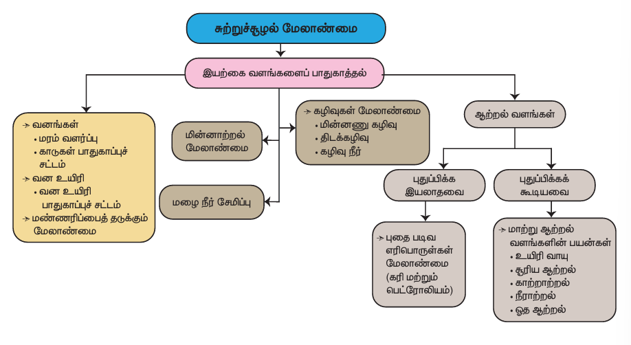
```