# அலகு 22 - சுற்றுச்சூழல் மேலாண்மை

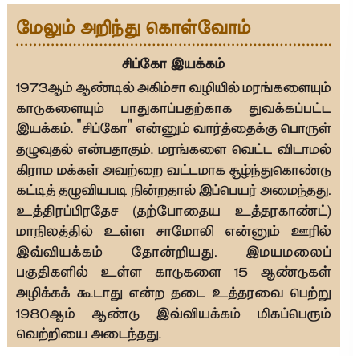

---

## கற்றல் நோக்கங்கள்

இப்பாடதணைக் கற்றபின், மாணவர்கள் பெறும் திறன்களாவன

- புதுப்பிக்கத்தக்க மற்றும் புதுப்பிக்கஇயலாத வளங்களை வேறுபடுத்த தெரிந்து கொள்ளல்.
- பல்வேறு இயற்கை வளங்களைப் பாதுகாப்பதற்கான அவசியதணை அறிந்து கொள்ளுதல்.
- இயற்கை வளங்களை பாதுகாக்க கையாளப்படும் பல்வேறு முறைகள் பற்றி அறிந்து கொள்ளுதல்.
- இயற்கை வளங்களைப் பயன்படுத்துவதில் உள்ள வரையணைகள் பற்றிய விழிப்புணரவு பெறுதல்.
- சுற்றுச்சூழல் பாதுகாப்பிலும் மற்றும் சுற்றுச்சூழல் மேலாண்மையிலும் ஈடுபாட்டோடு பங்கேற்க ஊக்கப்படுத்துதல்.

---

## அறிமுகம்

சுற்றுச்சூழல் மேலாண்மை என்பது சுற்றுச்சூழலில் உள்ள பல்வேறு காரணிகளான, அதன் அமைப்பு, செயல்பாடு, தரம் மற்றும் உயிரிய மற்றும் உயிரற்ற கூறுகளை பாராமரித்தல் ஆகியவற்றை உள்ளடக்கியது. மனிதர்கள் உள்ளிட்ட அனைத்து உயிரினங்களும் பயன்படுத்தி உயிர் வாழ்வதற்கான அனைத்து வளங்களையும் இப்பூமி வழங்குகிறது. இயற்கையிலிருந்து பெறப்படும் அனைத்தும் மனிதனுக்கு பயன் அளிக்கக்கூடிய வகையிலே அமைந்திருந்தாலும் அதன் பயன்பாடு பொருத்தமான தொழில் நுட்பம் மூலமே சாத்தியமாகிறது.

சில வகையான வளங்களை நாம் தொடர்ச்சியாக பயன்படுத்திக் கொண்டிருக்கும்போது அவை மீண்டும் தம்மை புதுப்பித்துக் கொள்ளக்கூடியதாக இருக்கின்றன. (வனங்கள், பயிர்கள், வன உயிரிகள், நிலத்டி நீர், காற்று மற்றும் சூரிய ஆற்றல்). இவை இயற்கையான மறு சுழற்சி முறையிலோ அல்லது உரிய மேலாண்மை வழியாகவோ தம்மை மீண்டும் புதுப்பித்துக் கொள்கின்றன. தம்மை இயற்கையான மறு சுழற்சி முறையில் புதுப்பித்துக் கொள்ள இயலாத வளங்கள், தேவைக்கதிகமான மற்றும் தொடர்ச்சியான பயன்பாட்டினால் தீர்ந்து போகக் கூடியதாக உள்ளன. (தாது வளங்கள், கரி, பெட்ரோலியம்). இவற்றை எளிதில் புதுப்பிக்க இயலாது. இதனால் இவற்றின் பயன்பாடுகள் ஒரு குறிப்பிட்ட காலத்தில் முடிந்து போய்விடக் கூடிய சூழ்நிலை உருவாகலாம்.

மனிதர்களின் தேவை, மக்கள் தொகைப் பெருக்கத்தின் காரணமாக அதிகரித்துள்ளது. மனிதன் தன்னுடைய தேவைகளுக்காகவும் அறிவியல் மற்றும் தொழில்நுட்ப வளர்ச்சியின் காரணமாகவும் மிக அதிகமாக இயற்கை வளங்களைப் பயன்படுத்துவதால் அவை மிகவும் வேகமாக குறையத் தொடங்கியுள்ளன. எனவே இயற்கை வளங்களை பாதுகாப்பது என்பது, ஒரு நாட்டின் சமூக மற்றும் பொருளாதார மேம்பாட்டிற்கு முக்கியமான பங்கை அளிக்கக்கூடியதாக உள்ளது.

---

## 22.1 இயற்கை வளங்களை முறையாக பயன்படுத்துதலும், பாதுகாப்பும்

இயற்கை வளங்கள் அவற்றின் உயிரிய பொருளாதார மற்றும் பொழுதுபோக்கு மதிப்புகளுக்காகப் பாதுகாக்கப்படுகின்றன. இயற்கை வளங்களின் அதிகமான மற்றும் திட்டமிடப்படாத பயன்பாடு சுற்றுச்சூழலில் ஒரு சமசற்ற நிலையை உருவாக்கி விடும். எனவே இயற்கை வளங்கள், அவற்றை புதுப்பித்துக் கொள்வதற்கேற்ப, அவற்றினை பயன்படுத்துவதில் ஒரு முறையான சமநிலை பராமரிப்பு அவசியமாகிறது. இவ்வாறு இயற்கை வளங்களை முறையாக பராமரிப்பதும், பயன்படுத்துவதும் (சுற்றுச்சூழல்) பாதுகாப்பு என்னப்படுகிறது.

எப்பொழுதும் நிலைத்து நிற்கும் வகையில் நீடித்து உலகை நாம் கட்டமைக்க வேண்டும். ஆற்றலை முறையாகப் பயன்படுத்துதல், நீரை சேமித்தல், மட்கும் தன்மையற்ற பிளாஸ்டிக் உள்ளிட்ட பொருட்களை பயன்படுத்தாதிருத்தல், மற்றும் நாம் வசிக்கும் வளிமண்டலதணை முறையாக பராமரித்தல் ஆகியவை இவ்வுலகை நீடித்து நிலைத்திருக்கச் செய்யும் சில வழிமுறைகள் ஆகும். எதிர்கால சந்ததியினருக்காக நமது வளங்களை முறையாக மேலாண்மை செய்து பாதுகாப்பது மிக முக்கியமானதானதாகும்.

---

## 22.2 காடுகளும் அதன் முக்கியத்துவமும்

காடு என்பது அடர்ந்த மரங்கள், புதர்கள், சிறு செடிகள், கொடிகள் போன்றவற்றை உள்ளடக்கிய பல்வேறு தாவர மற்றும் விலங்கினங்களின் வாழிடமாகும். காடுகள் நமது நாட்டின் பொருளாதார மேம்பாட்டிற்கு முக்கிய பங்களிப்பவை. காடுகள் மனித வாழ்வுக்கு இன்றியமையாதணவ, மேலும் பல தரப்பட்ட புதுப்பிக்கத்தக்க இயற்கை வளங்களின் ஆதாரமாகவும் விளங்குபவை. காடுகள், மரம், உணவு தீவனம், நார்கள் மற்றும் மருந்துப் பொருட்களை அளிப்பவை.

காடுகள் சுற்றுச்சூழல் முக்கியத்துவம் உடைய பெரும் காரணிகளாகும். காடுகள் கார்பனை நிலை நிறுத்துவதால், அவை கார்பன் தொட்டி என்றும் அழைக்கப்படுகின்றன. தட்பவெப்ப நிலையை ஒழுங்குபடுத்தி, மழைபொழிவை அதிகமாக்கி புவி வெப்பமாதலைக் குறைத்து, வெள்ளம், நிலச்சரிவு போன்ற இயற்கைச் சீற்றங்களை தடுத்து வன உயிரிகளை பாதுகாத்து நீர் பிடிப்பு பகுதிகளாக மாறி செயல்படுகின்றன. சுற்றுச் சூழல் சமநிலையை பேணுவதில் முக்கிய பங்கு வகிக்கின்றன.

### 22.2.1 காடுகள் அழிக்கப்படுதல் மற்றும் அதன் விளைவுகள்

பெரும்பாலான காட்டுப் பகுதிகள் அழிக்கப்படுவது காடுகள் அழிக்கப்படுதல் என்னப்படுகிறது. இது பல்வேறு காரணங்களால் நடைபெறுகிறது.

வேளாண்மை, நகரமயமாதல், அணைகள், சாலைகள், கட்டிடங்கள், தொழிற்சாலைகள், நீர் மின் நிலைய திட்டங்கள், காட்டுத்தீ, மலைகள் மற்றும் காடுகளை குடைந்து சாலைகள் அமைத்தல் ஆகிய காரணங்களால் காடுகள் அழிக்கப்படுகின்றன. இது எதிர்கால பொருளாதார, வாழ்க்கைத் தரம் மற்றும் சுற்றுச்சூழலுக்கு மிகப் பெரும் அச்சுறுத்தலாக உள்ளது. இந்தியாவில் ஒவ்வொரு ஆண்டும் 1.5 மில்லியன் ஹெக்டேர் வனப்பரப்பு அழிக்கப்படுகிறது.

**காடுகள் அழிக்கப்படுவதால் ஏற்படும் விளைவுகள்**

காடுகள் அழிக்கப்படுவதால் பெரு வெள்ளம், வறட்சி, மண்ணரிப்பு, வன உயிரிகள் அழிப்பு, அருகிவரும் சிற்றினங்கள் முற்றிலுமாக அழிதல், உயிர்ப்புவி சுழற்சியில் சமசற்ற நிலை, பருவ நிலைகளில் மாற்றம், பாலைவனமாதல் போன்ற சூழல் பிரச்சனைகள் உண்டாகின்றன.

> **மேலும் அறிந்து கொள்வோம்**
>
> **சிப்கோ இயக்கம்**
>
> 1973ஆம் ஆண்டில் அகிம்சா வழியில் மரங்களையும் காடுகளையும் பாதுகாப்பதற்காக துவக்கப்பட்ட இயக்கம். "சிப்கோ" என்னும் வார்த்தைக்கு பொருள் தழுவுதல் என்பதாகும். மரங்களை வெட்ட விடாமல் கிராம மக்கள் அவற்றை வட்டமாக சூழ்ந்துகொண்டு கட்டித் தழுவியபடி நின்றதால் இப்பெயர் அமைந்தது.
>
> உத்திரப்பிரதேச (தற்போது உத்தரகாண்ட்) மாநிலத்தில் உள்ள சாமோலி என்னும் ஊரில் இவ்வியக்கம் தோன்றியது. இமயமலைப் பகுதிகளில் உள்ள காடுகளை 15 ஆண்டுகள் அழிக்கக் கூடாது என்ற தடை உத்தரவை பெற்று 1980ஆம் ஆண்டு இவ்வியக்கம் மிகப்பெரும் வெற்றியை அடைந்தது.

### 22.2.2 காடுகளைப் பாதுகாத்தல்

இந்தியாவின் 752.3 இலட்சம் ஹெக்டேர் பரப்பளவு காடுகள் **காப்புக் காடுகளாக** வகைப்படுத்தப்பட்டுள்ளன. இவற்றில் 215.1 இலட்ச ஹெக்டேர் பரப்பு **பாதுகாக்கப்பட்ட வனப்பகுதியாக** உள்ளது. காடுகள் அழியாமல் பாதுகாக்க மேற்கொள்ளப்படும் சில முக்கியமான வழிமுறைகள்:

**மரம் வளர்ப்பு:** பலவிதமான பலன்களிக்கத்தக்க மரக்கன்றுகளை நடுவதும் பாதுகாப்பதும் ஒரு குறிப்பிடத்தக்க முயற்சியாகும். வன மகோத்சவம் என்னும் பெயரில் மரக்கன்றுகள் நடுவதால் இயற்கையான காடுகள் அழிவிலிருந்து பாதுகாக்கப்படுகின்றன. மரங்கள் வெட்டுவதும் குறைக்கப்படவேண்டும்.

**சமூக காடு வளர்ப்பு திட்டம்:** இது மிகப் பெரிய அளவில், பொது மக்களின் பங்களிப்போடு செயல்படுத்தப்பட வேண்டிய திட்டமாகும். இத் திட்டத்தின் மூலம், பொதுமக்களின் நிலங்கள், பொது நிலங்களில், உள்ளூர் தேவைகளான, விறகு, மேய்ச்சல், மரப் பயன்பாட்டிற்காக, சமூகக் காடுகள் வளர்க்கப்படுவதால், பழமையான காடுகளின் அழிவைத் தடுக்கலாம். மேலும் அக்காடுகளை நம்பியுள்ள பழங்குடியினரின் எதிர்காலமும் பாதுகாக்கப்படலாம்.

**சட்டங்கள் மூலம் காடுகள் பாதுகாத்தல்:** கடுமையான சட்டங்கள், மற்றும் செயல்முறைகள் மூலம் காடுகள் அழிவினைத் தடுக்க தேசிய காடுகள் சட்டம், (1952, மற்றும் 1988), காடுகள் பாதுகாப்புச் சட்டம் 1980 ஆகியவை வகை செய்கின்றன.

---

## 22.3 வன உயிரினங்களின் பாதுகாப்பு

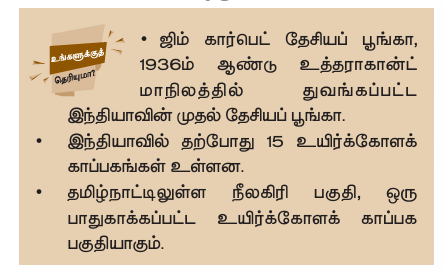

இயற்கையான வாழிடத்தில் (காடுகள், புல்வெளிகள், பாலைவனங்கள்) வாழும், மனிதர்களால் வளர்க்கப்படாத உயிரினங்கள் வன உயிரிகள் என்னப்படும். உயிரியப் பல்வகைத் தன்மையை நிலை நிறுத்த வன உயிரிகள் அவசியமாகின்றன. வன உயிரிகள், வனச் சுற்றுலாவை மையமாகக்கொண்டு வருவாயைப் பெருக்குவதால் பொருளாதார வளர்ச்சியை மேம்படுத்திட உதவுகின்றன. காடுகள் பாதுகாப்பும், வன உயிரின பாதுகாப்பும் ஒன்றோடொன்று தொடர்புடையவை.

### 22.3.1 வன உயிரினங்களின் எண்ணிக்கை குறைவதற்கான காரணங்கள்

இந்திய வன உயிரிகள் பெரும் பாரம்பரியம் மிக்கவை. வன உயிரினங்களை அதிகமாகப் பயன்படுத்தியதால் 1970 ஆம் ஆண்டு முதல் 2014 ஆம் ஆண்டு வரையிலான காலக்கட்டத்தில், வன உயிரினங்களின் எண்ணிக்கை 52% அளவு குறைந்துள்ளது. அதீத பயன்பாடு மற்றும் காடுகள் அழிக்கப்பட்டதன் காரணமாக பல விலங்கினங்கள் அழிந்தும், சில வகை விலங்கினங்கள் அழியக்கூடிய நிலையிலும் மற்றவை அழிந்து போகக்கூடிய, அச்சுறுத்தலான நிலையிலும் உள்ளன. சமீப காலங்களில் மனித ஆக்கிரமிப்பின் காரணமாக இந்திய வன உயிரினங்களுக்கு மிகப் பெரும் அச்சுறுத்தல் ஏற்பட்டுள்ளது.

### 22.3.2 வன உயிர்களை பாதுகாப்பதன் நோக்கங்கள்

வன உயிர்களை பாதுகாப்பதில் முக்கிய நோக்கமானது,

- சிற்றினங்களை அழிவிலிருந்து பாதுகாத்தல்.
- தாவரங்கள் மற்றும் விலங்குகளை அழிவிலிருந்து பாதுகாத்தல்.
- அருகி வரும் சிற்றினங்கள் மற்றும் அழிவின் விளிம்பில் உள்ள சிற்றினங்கள் அழியாமல் பாதுகாத்தல்.
- அழியக்கூடிய நிலையில் உள்ள சிற்றினங்களை பாதுகாத்தல்.
- தாவர விலங்கினங்கள் அவற்றின் இயற்கை வாழ்விடங்களுக்கிடையேயான சூழலியல் தொடர்பைப் பற்றி அறிந்து கொள்தல்.
- சட்டவிரோத வேட்டையாடுதல் மற்றும் விலங்குகளை பிடித்தல் ஆகியவற்றைத் தடை செய்தல்.
- தேசிய பூங்காக்கள், வன உயிரி சரணாலயங்கள், பாதுகாக்கப்பட்ட பகுதிகள் மற்றும் உயிர்க்கோள காப்பகங்கள் ஆகியவற்றை ஏற்படுத்துதல்.

வன உயிரி பாதுகாப்புச் சட்டம் 1972ம் ஆண்டு ஏற்படுத்தப்பட்டுள்ளது. இச் சட்டத்தின் முக்கிய அம்சங்களாவன:

- குறிப்பிட்ட வன உயிரிகளை வேட்டையாடுவதும், கொல்வதும் தடை செய்யப்பட்டுள்ளது.
- வன உயிரிகளை பாதுகாக்க சரணாலயங்கள், தேசிய பூங்காக்கள், மற்றும் பாதுகாக்கப்பட்ட பகுதிகளை புதிதாக உருவாக்க வழி வகை செய்யப்பட்டுள்ளது.
- அழியும் நிலையிலுள்ள உயிரிகளை பாதுகாக்க சிறப்பு திட்டங்கள் ஏற்படுத்தப்பட்டுள்ளன.
- மத்திய வன விலங்கு வாரியம் ஏற்படுத்தப்பட்டு, அதன் மூலம் தேசிய பூங்காக்களுக்கான அங்கீகாரம் வழங்கப்படுகிறது.
- வன உயிரிகள், மற்றும் அவற்றின் மூலம் பெறப்படும் பொருட்கள் தொடர்பான வணிகம் தடை செய்யப்பட்டு, ஒழுங்குபடுத்தப்பட்டுள்ளது.

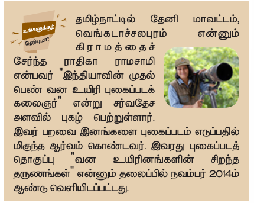

- ஜிம் கார்பெட் தேசியப் பூங்கா, 1936ம் ஆண்டு உத்தராகாண்ட் மாநிலத்தில் துவங்கப்பட்ட இந்தியாவின் முதல் தேசியப் பூங்கா.
- இந்தியாவில் தற்போது 15 உயிர்க்கோளக் காப்பகங்கள் உள்ளன.
- தமிழ்நாட்டிலுள்ள நீலகிரி பகுதி, ஒரு பாதுகாக்கப்பட்ட உயிர்க்கோளக் காப்பக பகுதியாகும்.

### 22.3.4 வன உயிரி பாதுகாப்பில் ஈடுபட்டுள்ள நிறுவனங்கள்

(i) இந்திய வன உயிரி வாரியம் (IWBL).

(ii) சர்வதேச வன உயிரி நிதியம் (WWF).

(iii) உலகப் பாதுகாப்பு ஒன்றியம் (WCN).

(iv) பன்னாட்டு இயற்கை மற்றும் இயற்கை வளங்களுக்கான பாதுகாப்பு ஒன்றியம் (IUCN)

(v) ஆபத்தான இனங்களை பாதுகாப்பதற்கான சர்வதேச வர்த்தக மாநாடு (CITES).

(vi) பாம்பே இயற்கை வரலாற்று நிறுவனம். (BNHS)

(vii) இந்திய வன உயிரி பாதுகாப்பு நிறுவனம், டெஹ்ராடூன்.

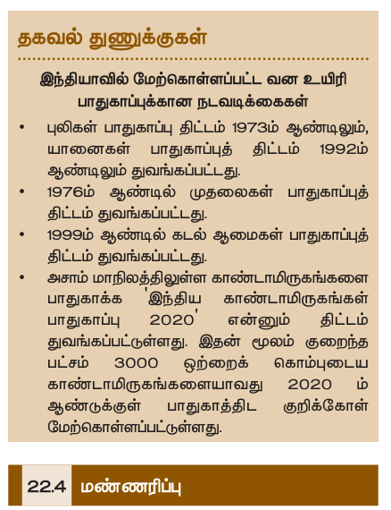

தமிழ்நாட்டில் தேனி மாவட்டம், வெங்கடாச்சலபுரம் என்னும் கிராமத்தைச் சேர்ந்த ராதிகா ராமசாமி என்பவர் "இந்தியாவின் முதல் பெண் வன உயிரி புகைப்படக் கலைஞர்" என்று சர்வதேச அளவில் புகழ் பெற்றுள்ளார். இவர் பறவை இனங்களை புகைப்படம் எடுப்பதில் மிகுந்த ஆர்வம் கொண்டவர். இவரது புகைப்படத் தொகுப்பு "வன உயிரினங்களின் சிறந்த தருணங்கள்" என்னும் தலைப்பில் நவம்பர் 2014ம் ஆண்டு வெளியிடப்பட்டது.

---

## தகவல் துணுக்குகள்

**இந்தியாவில் மேற்கொள்ளப்பட்ட வன உயிரி பாதுகாப்புக்கான நடவடிகைகள்**

- புலிகள் பாதுகாப்பு திட்டம் 1973ம் ஆண்டிலும், யானைகள் பாதுகாப்புத் திட்டம் 1992ம் ஆண்டிலும் துவங்கப்பட்டது.
- 1976ம் ஆண்டில் முதலைகள் பாதுகாப்புத் திட்டம் துவங்கப்பட்டது.
- 1999ம் ஆண்டில் கடல் ஆமைகள் பாதுகாப்புத் திட்டம் துவங்கப்பட்டது.
- அசாம் மாநிலத்திலுள்ள காண்டாமிருகங்களை பாதுகாக்க 'இந்திய காண்டாமிருகங்கள் பாதுகாப்பு 2020' என்னும் திட்டம் துவங்கப்பட்டுள்ளது. இதன் மூலம் குறைந்தது பட்சம் 3000 ஒற்றைக் கொம்புடைய காண்டாமிருகங்களையாவது 2020 ம் ஆண்டுக்குள் பாதுகாத்திட குறிக்கோள் மேற்கொள்ளப்பட்டுள்ளது.

---

## 22.4 மண்ணரிப்பு

மண்ணின் மேல்அடுக்கு, மட்கிய இலை தழைகள், மற்றும் தாது உப்புக்கள் முதலிய, தாவரங்கள் வளர்ச்சியடையத் தேவையான அவசிய பொருட்களைக் கொண்டுள்ளது. மேல்அடுக்கு மண், காற்று மற்றும் நீரோட்டத்தினால் அடித்துச் செல்லப்படுவது "மண்ணரிப்பு" என்னப்படும். மண்ணரிப்பின் காரணமாக மண்ணின் மட்கு, ஊட்டப் பொருட்கள், வளம் ஆகியவை வெகுவாகக் குறைந்து மண் வளத்தை குறைக்கிறது.

### 22.4.1 மண்ணரிப்பிற்கான காரணிகள்

அதி வேகமாக வீசும் காற்று, பெரு வெள்ளம், நிலச்சரிவு, மனிதரின் நடவடிக்கைகள், (வேளாண்மை, காட்டழிப்பு, சுரங்கங்கள் ஏற்படுத்துதல்) மற்றும் கால்நடைகளின் அதிக மேய்ச்சல் ஆகியவை மண்ணரிப்பிற்கான முக்கிய காரணிகளாகும்.

### 22.4.2 மண்ணரிப்பை மேலாண்மை செய்யும் வழிமுறைகள்

- தாவரப்பரப்பை நிலை நிறுத்திக் கொள்வதன் மூலம் மண்ணரிப்பைத் தடுக்கலாம்.
- கால்நடைகளின் அதிகமான மேய்ச்சலைக் கட்டுப்படுத்துவதன் மூலம் மண் அரிப்பைத் தடுக்கலாம்.
- பயிர் சுழற்சி மற்றும் மண்வளம் மேலாண்மை மூலம் மண்ணில் கரிமப் பொருள்களின் அளவை மேம்படுத்தலாம்.
- நிலப்பரப்பில் ஓடும் நீரினை நீர்பிடிப்பு பகுதிகளில் சேமிப்பதன் மூலம் மண் அரிப்பைத் தடுக்கலாம்.
- காடுகள் உருவாக்கம், மலைகளில் நிலத்தை சமப்படுத்துதல், நீரோட்டத்திற்கு எதிர்திசையில் மண் உழுதல் ஆகியவை மூலம் மண் அரிப்பைத் தடுக்கலாம்.
- காற்றின் வேகத்தை மட்டுப்படுத்த அதிக பரப்பில் மரங்களை நடுவதன் மூலம் (பாதுகாப்பு அடுக்கு) மண் அரிப்பைத் தடுக்கலாம்.

---

## 22.5 புதுப்பிக்கத்தக்க மற்றும் புதுப்பிக்க இயலாத ஆற்றல் வளங்கள்

வளர்ச்சி மேம்பாட்டின் முக்கிய உள்ளீடு ஆற்றலாகும். ஆற்றல் வளங்களின் விரிவாக்கம் என்பது உலகின் ஒவ்வொரு பகுதியிலும் உள்ள விவசாய மற்றும் தொழில்துறை விரிவாக்கத்துடன் நேரடித் தொடர்புடையது. ஆற்றல் வளங்களை புதுப்பிக்க இயலாத மற்றும் புதுப்பிக்கக்கூடிய ஆற்றல் வளங்கள் என இரு வகையாக வகைப்படுத்தலாம்.

### புதுப்பிக்க இயலாத (தீர்ந்து போகக் கூடிய) ஆற்றல் வளங்கள்

குறைந்த காலத்தில் தம்மைத் தாமே புதுப்பித்துக் கொள்ள முடியாத ஆற்றல் மூலத்தில் இருந்து பெறப்படும் ஆற்றல் புதுப்பிக்க இயலாத ஆற்றல் என்னப்படும். இவை மிகக் குறைந்த அளவே இயற்கையில் கிடைக்கிறது. புதுப்பிக்க இயலாத ஆற்றல் வளங்களாவன: நிலக்கரி, பெட்ரோலியம், இயற்கை வாயு மற்றும் அணுக்கரு ஆற்றல். உலகின் ஆற்றல் தேவைகளில் 90% இந்த மரபுசார ஆற்றல் மூலங்கள் மூலமும், 10% அணு ஆற்றல் மூலமும் பெறப்படுகிறது.

### புதுப்பிக்கத்தக்க (தீர்ந்து போகாத) ஆற்றல் வளங்கள்

இத்தகைய ஆற்றல் மூலங்கள் எப்போதும் அதிக அளவில் கிடைக்கக் கூடியதும் இயற்கையாகத் தம்மை குறுகிய காலத்தில் புதுப்பித்துக் கொள்ளக் கூடியதும் மற்றும் மிகக்குறைந்த செலவில் ஆற்றலை தொடர்ச்சியாக பெறும்படியும் உள்ள மூலங்களாகும். பெரும் அளவிலான மரபுசாரா ஆற்றல் மூலங்கள் உயிரி எரிபொருள், உயிரிப் பொருண்மை ஆற்றல், புவிவெப்ப ஆற்றல், நீராற்றல் (நீர் மின் ஆற்றல் மற்றும் ஓத ஆற்றல்), சூரிய ஆற்றல் மற்றும் காற்றாற்றல் ஆகியவற்றை உள்ளடக்கியுள்ளது.

### 22.5.1 புதைபடிவ எரிபொருள்கள்

புதைபடிவ எரிபொருட்கள் புவியின் மேல் அடுக்கினுள் காணப்படுகின்றன. இவை பல மில்லியன் ஆண்டுகளுக்கு முன்னர் வாழ்ந்து மடிந்த உயிரினங்கள் காற்றில்லா சூழலில் மட்குதல் போன்ற இயற்கை நிகழ்வுகள் காரணமாக உருவானவையாகும். மடிந்த உயிரினங்கள் மேல் மண் அடுக்குகள் மேலும் மேலும் படிவதால் உருவான வெப்பம் மற்றும் அழுத்தத்தின் காரணமாக உயிரினங்கள் மெல்ல மெல்ல ஹைட்ரோ கார்பன்களாக மாற்றமடைந்தன. எடுத்துக்காட்டு: பெட்ரோலியம், நிலக்கரி மற்றும் இயற்கை வாயு.

### 22.5.2 நிலக்கரி மற்றும் பெட்ரோலியம்

நிலக்கரி மற்றும் பெட்ரோலியம் ஆகியவை இயற்கை வளங்கள் ஆகும். இவை பல மில்லியன் ஆண்டுகளுக்கு முன்னர் வாழ்ந்து மடிந்த உயிரினங்கள் நிலத்தில் ஆழப் புதைந்து உயிர்ப்பொருண்மை சிதைவின் மூலம் உருவானவையாகும். இவை புதைபடிவ எரிபொருட்கள் என்றும் அழைக்கப்படுகின்றன.

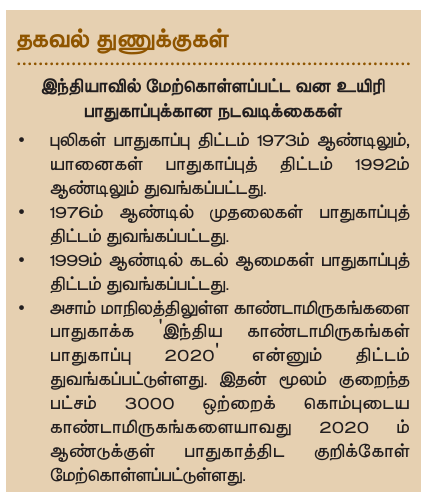

அமெரிக்கா மற்றும் சீனாவிற்கு அடுத்தபடியாக உலக அளவில் கச்சா எண்ணெய் பயன்படுத்தும் மூன்றாவது பெரிய நாடு இந்தியாவாகும்.

நிலக்கரி அனல் மின் நிலையங்களில் மின்சாரத்தை உற்பத்தி செய்யப் பயன்படுகிறது. பெட்ரோலியம், கச்சா எண்ணெய் என்றும் அழைக்கப்படுகிறது. இது எண்ணெய் சுத்திகரிப்பு நிலையங்களில் பெட்ரோல் மற்றும் டீசல் ஆக சுத்திகரிக்கப்பட்டு வாகனப் போக்குவரத்து, சரக்கு ஊர்திகள், தொடர்வண்டிகள், கப்பல்கள் மற்றும் ஆகாய விமானங்களை இயக்குவதற்குப் பயன்படுத்தப்படுகிறது. கச்சா எண்ணெயில் இருந்து பிரித்து எடுக்கப்படும் கெரோசின் மற்றும் திரவ மயமாக்கப்பட்ட பெட்ரோலிய வாயு (LPG) ஆகியவை வீட்டு உபயோக எரிபொருளாக உணவு சமைக்க பயன்படுத்தப்படுகின்றன. நிலக்கரி மற்றும் பெட்ரோலிய எண்ணெய் இருப்புகள், நாம் தொடர்ந்து அதிகமாகப் பயன்படுத்தினால் மிக விரைவாகத் தீர்ந்து போகக்கூடிய நிலையில் உள்ளன. இவை மேலும் உற்பத்தியாவதற்கு நீண்டகாலம் ஆவதோடு இவ்வினை மிக மெதுவாகவும் நடைபெறக் கூடியது.

### 22.5.3 நிலக்கரி மற்றும் பெட்ரோலியம் வளங்களை பாதுகாக்கும் வழிமுறைகள்

நமது எதிர்கால தேவைகளுக்காக பயன்பாட்டை குறைப்பதன் மூலம் நிலக்கரி மற்றும் பெட்ரோலியம் வளங்களை பாதுகாப்பது மிகவும் அவசியமானதாகும்.

(i) மின்சாரத்தை சேமிப்பதன் மூலம் நிலக்கரி பயன்பாட்டினை குறைக்கலாம்.

(ii) மிகக் குறைந்த தூரங்களுக்கு இருசக்கர வாகனங்கள், கார்கள் ஆகியவற்றுக்குப் பதிலாக மிதிவண்டிகளைப் பயன்படுத்தலாம்.

(iii) சமைப்பதற்கு அழுத்தக் கலன்களை பயன்படுத்துவதன் மூலம் கெரோசின் மற்றும் எல்பிஜி ஆகியவற்றின் நுகர்வை குறைக்கலாம். மேலும் சாத்தியமான இடங்களில் சூரிய வெப்பசூடேற்றி, சூரிய சமையல் கலன்களை பயன்படுத்தலாம்.

(iv) எரிபொருள் மேம்பாட்டுத் திறன் கொண்ட எந்திரங்களை மோட்டார் வாகனங்களில் பயன்படுத்துவதன் மூலமாக ஆற்றலை மேம்படுத்துவதுடன் காற்று மாசுபாட்டிலையும் குறைக்கலாம்.

---

## 22.6 மரபுசாரா (மாற்று ஆற்றல்) மூலங்கள்

ஆற்றல் துணையில் நீடித்த வளர்ச்சியை நாம் பெற வேண்டுமெனில், விரைவாக தீர்ந்து போகும் மரபு சாரா ஆற்றல் மூலங்களின் பயன்பாட்டைக் குறைத்து, பாதுகாத்து, அவற்றுக்குப் பதிலாக, சுற்றுச்சூழலுக்கு மாசு ஏற்படுத்தாத புதுப்பிக்கத்தக்க ஆற்றல் வளங்களை நாம் பயன்படுத்த வேண்டும். இதுவே ஆற்றல் நெருக்கடி நமக்கு உணர்த்துவதாகும். புதிய மரபுசாரா ஆற்றல் மூலங்கள் என்னப்படும் புதிய ஆற்றல் மூலங்களை மேம்படுத்த முயற்சிகள் மேற்கொள்ளப் பட்டுள்ளன. இது உள்ளூர் மக்கள் தங்கள் ஆற்றல் தேவைகள் மற்றும் வளங்களை கண்டறியும் முயற்சியைத் துவக்கவும் அவர்களுக்கு பயன்படக்கூடிய உத்திகளை வகுக்கவும் உதவிகரமாக இருக்கும்.

### 22.6.1 சூரிய ஆற்றல்

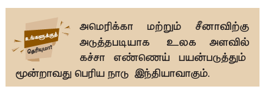

சூரியனில் இருந்து பெறப்படும் ஆற்றல் சூரிய ஆற்றல் என்னப்படும். சூரியன் பெருமளவு வெப்பத்தையும் ஒளியையும் வெளியிடுகிறது. சூரியனிலிருந்து ஒளி ஆற்றல் ஏளக்குறைய பாதியளவே (47%) பூமியின் மேற்பரப்பை வந்து அடைகிறது. இதில் மிகச் சிறிய அளவைப் பயன்படுத்துவதன் மூலம் நாம், நம் நாட்டில் பெருமளவு ஆற்றல் தேவைகளில் நிறைவு பெற முடியும். சூரிய ஆற்றல் பல மேன்மைகளை கொண்டிருந்தாலும் ஒரு சில வரையணைகளுக்கும் உட்பட்டதாகும்.

**சூரிய ஆற்றல் சாதனங்கள்**

சூரிய ஒளியை ஆற்றலாக பயன்படுத்தலாம். சூரிய ஆற்றலை வெவ்வேறு பயன்பாட்டிற்காக மாற்றி உபயோகிக்க உதவும் பல்வேறு சாதனங்கள் சூரிய ஆற்றல் சாதனங்கள் என்னப்படும்.

**சூரிய மின்கலன்கள்**

சூரிய மின்கலன்கள் (ஃபோட்டோவோல்டாயிக் கருவிகள்) சிலிக்கானால் உற்பத்தி செய்யப்பட்டு சூரிய ஒளியை மின் ஆற்றலாக மாற்றும் திறன் கொண்டவை. சூரிய மின்கலன்கள் சுற்றுச்சூழலுக்கு மாசு ஏற்படுத்தாத வகையில் மின் உற்பத்தி செய்யக்கூடியவை. இதிலிருந்து மாசு உண்டாக்கக்கூடிய எரிபொருட்களோ, ஆபத்தான வாயுக்களோ, கழிவுப் பொருட்களோ வெளியேறுவதில்லை. இவற்றினை யாரும் அணுக இயலாத அல்லது மிக தொலைதூர இடங்களிலும் பொருத்த முடியும். (காடுகள் மற்றும் மலைப்பாங்கான பிரதேசங்கள்). இங்கு வேறு ஆற்றல் நிலையங்களை பெரும் பொருட்செலவில் மட்டுமே அமைக்க இயலும்.

**சூரிய மின் கலன்களின் பயன்கள்**

(i) தெருவிளக்குகள், போக்குவரத்து விளக்குகள், நீரேற்றம் மற்றும் மின்கலனில் மீண்டும் ஆற்றலை நிரப்பவும் பயன்படுகிறது.

(ii) செயற்கைக் கோள்கள் மற்றும் தொலைவெளி நுண்ணுணர்விகள், ஆகியவற்றில் பயன்படுத்தப்படுகிறது.

(iii) தொலைதூரப் பகுதிகளில் ரேடியோ மற்றும் தொலைக்காட்சி ஒளிபரப்பிற்கு பயன்படுகிறது.

(iv) கால்குலேட்டர்கள், மின்னணு விளையாட்டுப் பொருட்கள் மற்றும் கைக்கடிகாரங்களில் பயன்படுத்தப்படுகிறது.

**சூரிய மின் கலன் அடுக்குகள்**

சூரிய மின்கலன்களை தொடர் அடுக்காக அமைப்பதன் மூலம் சூரிய மின் கலன் அடுக்குகள் அமைக்கப்படுகிறது. இதனால் இதில் உற்பத்தியாகும் மின்சாரத்தின் அளவு அதிகமாகிறது. ஆனால் இவை மிகவும் உற்பத்தி செலவு மிக்கவை.

**படம் 22.1 சூரிய மின் கலன் அடுக்குகள்**

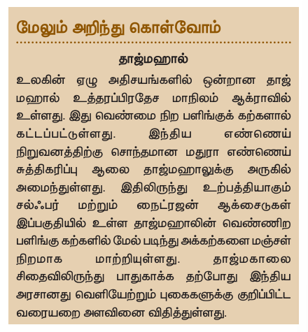

**சூரிய சமையற்கலன்**

சூரிய சமையற்கலன் என்பது உட்புறம் கருமை நிற வர்ணம் பூசப்பட்ட காப்பிடப்பட்ட உலோகம் அல்லது மரத்தால் ஆன பெட்டியாகும். இதன் மேற்புறம் தடிமனான கண்ணாடி பொருத்தப்பட்டுள்ளது. சமதள கண்ணாடி சூரிய ஒளியை எதிரொளிப்பதாக அமைந்துள்ளது. சூரியனில் இருந்து பெறப்படும் கதிர்வீச்சு ஆற்றல் மூலம் உணவு சமைக்கப்படுகிறது.

**சூரிய ஒளி வெப்ப ஆற்றல் நிலையங்கள்**

சூரிய ஒளித் தகடுகள் மூலம் குவிக்கப்பட்ட சூரிய ஒளியின் மூலம் நீர் வெப்பப்படுத்தப் பட்டு நீராவியாக மாற்றி டர்பைன்களை இயக்குவதன் மூலம் மின்சாரம் உற்பத்தி செய்யப்படுகிறது.

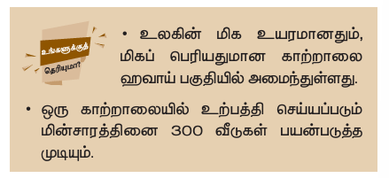

100 சூரிய வெப்ப சூடேற்றிகள் மூலம் ஒரு ஆண்டுக்கு 1500 யூனிட் மின்சாரத்தை சேமிக்க முடியும்.

**சூரிய ஆற்றலின் நன்மைகள்:**

(i) பெருமளவிலும், விலையில்லாமலும் கிடைக்கக்கூடியது.

(ii) இது ஒரு புதுப்பிக்கத்தக்க ஆற்றல் மூலமாகும்.

(iii) இது வெப்பமூட்டியாகவும், மின்னாற்றலை உற்பத்தி செய்யவும் பயன் படுகிறது.

(iv) எவ்வித மாசும் உண்டாக்குவதில்லை.

> **மேலும் அறிந்து கொள்வோம்**
>
> **தாஜ்மஹால்**
>
> உலகின் ஏழு அதிசயங்களில் ஒன்றான தாஜ் மஹால் உத்தரப்பிரதேச மாநிலம் ஆக்ராவில் உள்ளது. இது வெண்மை நிற பளிங்குக் கற்களால் கட்டப்பட்டுள்ளது. இந்திய எண்ணெய் நிறுவனத்திற்கு சொந்தமான மதுரா எண்ணெய் சுத்திகரிப்பு ஆலை தாஜ்மஹாலுக்கு அருகில் அமைந்துள்ளது. இதிலிருந்து உற்பத்தியாகும் சல்ஃபர் மற்றும் நைட்ரஜன் ஆக்சைடுகள் இப்பகுதியில் உள்ள தாஜ்மஹாலின் வெண்ணிற பளிங்கு கற்களில் மேல் படிந்து அக்கற்களை மஞ்சள் நிறமாக மாற்றியுள்ளது. தாஜ்மகாலை சிதைவிலிருந்து பாதுகாக்க தற்போது இந்திய அரசானது வெளியேற்றும் புகைகளுக்கு குறிப்பிட்ட வரையறை அளவினை விதித்துள்ளது.

### 22.6.2 உயிரி வாயு

உயிரி வாயு என்பது மீதேன் (75%), நைட்ரஜன் சல்பைட், கார்பன்-டைஆக்சைடு, மற்றும் நைட்ரஜன் சேர்ந்த கலவையாகும். இவ்வாயு விலங்குகள் மற்றும் தாவரங்களின் கழிவுகள், காற்றில்லாச் சூழலில் மட்கும் போது (சிதைவடையும் போது) உருவாகிறது. பொதுவாக இவை "கோபர் கேஸ்" (கோபர் (ஹிந்தி) = மாட்டுச் சாணம்) என்றும் அழைக்கப்படுகிறது.

**உயிரி வாயுவின் பயன்கள்:**

(i) சமையலுக்கான எரிபொருளாகப் பயன்படுகிறது.

(ii) நீரேற்றப் பயன்படும் இயந்திரங்களையும், மோட்டார்களையும் இயக்குவதற்குப் பயன்படுகிறது.

(iii) மின்சார உற்பத்திக்குப் பயன்படுகிறது.

**உயிரி வாயுவின் மேன்மைகள்:**

(i) இவை எரியும் போது புகையை வெளியிடுவதில்லை. எனவே இவை குறைந்த மாசினை உண்டாக்குகின்றன.

(ii) உயிரியக் கழிவுகள் மற்றும், கழிவுப்பொருட்கள் போன்ற கரிமப் பொருள்களை சிதைவடையச் செய்வதற்கு மிகச் சிறந்த வழியாகும்.

(iii) படியும் கழிவுகளில் பாஸ்பரஸ் மற்றும் நைட்ரஜன் அளவு மிகுந்திருப்பதால், அதனை சிறந்த உரமாக பயன் படுத்தலாம்.

(iv) இது பயன்படுத்த, பாதுகாப்பானதும் வசதியானதுமாகும்.

(v) பசுமை இல்ல வாயுக்கள் வெளியேறும் அளவை பெருமளவில் குறைக்கிறது.

### 22.6.3 ஷேல் வாயு

ஷேல் என்னப்படுவது பூமியின் அடிப்புறத்தில் அமைந்துள்ள சேறு மற்றும் தாதுக்கள் (குவார்ட்ஸ் மற்றும் கால்சைட்) அடங்கிய மென்மையான பாறை அடுக்குகளைக் குறிப்பதாகும். இப்பாறை அடுக்குகளின் இடையிலுள்ள துளைகளில் எண்ணெய் மற்றும் வாயுக்கள் நிரம்பியிருக்கின்றன.

இவ்வாயுக்கள் மற்றும் எண்ணெயினை வெளியே எடுக்க ஹைட்ராலிக் ஃப்ராக்சரிங் / ஹைட்ராலிக் முறிவு (பாறை அடுக்குகளின் மேல் எண்ணெய் மற்றும் வாயுக்கள் நிரம்பியுள்ள அடுக்கை அடையும் வரை ஆழமாகத் துளையிடப்படுதல்.) என்னும் தொழில் நுட்பம் பயன்படுத்தப்படுகிறது.

**ஷேல் வாயுவினால் உண்டாகும் சுற்றுச்சூழல் விளைவுகள்**

(i) ஷேல் வாயுக்களுக்காக இடப்படும் துளைகள் நிலத்டி நீர் மட்டத்தினை வெகுவாகப் பாதித்து குடிநீர் ஆதாரத்தை மாசுபடுத்துகிறது. மேலும் மண் வளத்தையும் பாதிக்கிறது.

(ii) நிலத்டியில் உள்ள வாயுக்கள் மற்றும் எண்ணெயினை வெளியேற்ற பல மில்லியன் கன அளவு நீரைப் பயன்படுத்த வேண்டியிருப்பதால், இவை நிலத்டி நீர் மட்டத்தை வெகுவாகப் பாதிக்கிறது.

> **மேலும் அறிந்து கொள்வோம்**
>
> ஷேல் வாயுக்கள் எடுப்பதற்காக இந்தியாவில் ஆறு பகுதிகள் கண்டறியப்பட்டுள்ளன. அவை கேம்பே (குஜராத்), அஸ்ஸாம் – அரக்கான் (வட கிழக்குப் பகுதி), கோண்ட்வானா (மத்திய இந்தியா), கிருஷ்ணா கோதாவரி (கிழக்கு கடற்கரைப் பகுதி), காவேரி மற்றும் இந்தோ– கங்கைப் வடிநிலப் பகுதி.

### 22.6.4 காற்று ஆற்றல்

வேகமாக வீசக்கூடிய காற்றின் விசையானது காற்றாலை (டர்பைன்) சுழற்றியின் மூலம் எந்திர ஆற்றலாக மாற்றப்படுகிறது. இந்த காற்றாற்றல் (i) மின்சார உற்பத்தி (ii) நீர் உந்திகள், அரவை ஆலைகள் (iii) கிணற்றிலிருந்து நீரை மேலேற்றப் பயன்படுகிறது.

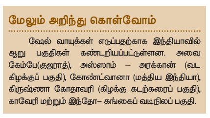

- உலகின் மிக உயரமானதும், மிகப் பெரியதுமான காற்றாலை ஹவாய் பகுதியில் அமைந்துள்ளது.
- ஒரு காற்றாலையில் உற்பத்தி செய்யப்படும் மின்சாரத்தினை 300 வீடுகள் பயன்படுத்த முடியும்.

**காற்றாலை**

காற்றாலை என்பது, காற்றால் உந்தப்படும் ஆற்றலானது சுழற்சி ஆற்றலாக மாற்றப்படுவதற்கு நீளமான இறக்கைகள் ஒரு சுழலும் அச்சுடன் இணைக்கப்பட்டுள்ள ஒரு எந்திரமாகும். வேகமான காற்று, இறக்கைகள் மீது மோதி அவற்றினை சுழலச் செய்கிறது. இறக்கைகள் சுழல்வதால் அதனுடன் இணைக்கப்பட்டுள்ள மின்னியற்றி செயல்பட்டு மின்னாற்றல் உற்பத்தி ஆகிறது. ஒவ்வொரு காற்றாலையில் இருந்து உற்பத்தி ஆகும் மின்சாரமும் ஒன்றோடொன்று இணைக்கப்பட்டு வர்த்தக ரீதியில் மின்சாரம் உற்பத்தி செய்யப்படுகிறது.

**படம் 22.2 காற்றாலை**

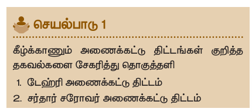

**காற்றாற்றலின் நன்மைகள்:**

(i) காற்றாற்றல், விலையில்லாத, சுற்றுச்சூழலுக்குகந்த, புதுப்பிக்கக்கூடிய ஆற்றல் வளமாகும்.

(ii) இவை எவ்வித மாசும் ஏற்படுத்துவதில்லை.

(iii) பிற மின்னாற்றல் உற்பத்தி நிலையங்களை ஒப்பிடும்போது பராமரிப்பு செலவு மிகவும் குறைவு.

> **செயல்பாடு 1**
>
> கீழ்க்காணும் அணைக்கட்டு திட்டங்கள் குறித்த தகவல்களை சேகரித்து தொகுதளி:
>
> 1. டேஹரி அணைக்கட்டு திட்டம்
> 2. சர்தார் சரோவர் அணைக்கட்டு திட்டம்

---

## 22.6.5 நீராற்றல்

புவியின் மேற்பரப்பு ஏளக்குறைய 71% நீரால் சூழப்பட்டுள்ளது. ஓடும் நீரினில் இருந்து பெறப்படும் ஆற்றல், மின்சாரம் தயாரிக்கப் பயன்படுகிறது. இவ்வாறு பெறப்படும் ஆற்றல் புனல் மின்னாற்றல் என்னப்படும்.

புனல் மின் உற்பத்தி நிலையங்களில் மேலிருந்து வேகமாக கீழே விழும் நீர் அல்லது வேகமாக ஓடும் நீரின் இயக்க ஆற்றல் மின்னாற்றலாகப் பெறப்படுகிறது. மலைப்பகுதிகள் இதற்கு மிகவும் ஏற்றவை. ஏதெனெனில் அதிக சரிவான பகுதிகளிலிருந்து நீர் பெருமளவில் தொடர்ந்து வழிந்தோடி வருகின்றது. இவை சுற்றுச்சூழலுக்கு எவ்வித பாதிப்பையும் உண்டாக்காமலும், எவ்வித கழிவையும் ஏற்படுத்தாமல் செயல்படக்கூடியவை.

நீர் மின்சார நிலையங்கள், ஓடும் நீரிலுள்ள நிலை ஆற்றலை மின்னாற்றலாக மாற்றக்கூடியவை. இது நீர் மின்சாரம் என்னப்படும்.

### 22.6.6 ஓத ஆற்றல்

ஓத ஆற்றல் என்னப்படுவது கடலோரங்களில் உண்டாகும் கடல்நீரின் வேகமான இடப்பெயர்ச்சியினால் ஏற்படும் ஆற்றல் ஆகும். ஓதங்கள் என்பவை கடல் நீரின் மீது, புவியீர்ப்பு விசையில் ஏற்படும் மாற்றங்கள் காரணமாக, கடல் நீர் மட்டம் உயர்வதும், தாழ்வதுமாகும்.

ஓத நீரோட்டம் என்பது மிக வேகமாக இடப்பெயர்ச்சி ஆகும் நீரினை, ஓதங்கள் உருவாக்குவதாகும். அவ்வாறு நிகழும் போது உண்டாகும் இயக்க ஆற்றலைப் பயன்படுத்தி டர்பைன்களை இயங்கச் செய்வதன் மூலம் மின்சாரம் உற்பத்தி செய்யப்படுகிறது.

**ஓத ஆற்றலினால் உண்டாகும் நன்மைகள்:**

(i) எவ்வித சுற்றுச்சூழல் மாசும் ஏற்படுத்துவதில்லை.

(ii) இவற்றுள் எவ்வித எரிபொருளும் பயன்படுத்தாததால் கழிவுகள் ஏதும் வெளியேறுவதில்லை.

(iii) ஓதங்கள் எப்போது உருவாகும் என்பதனை முன்னரே நம்மால் கணிக்க முடியும். இதனால் இந்த ஆற்றலை நாம் தொடர்ச்சியாக பெறமுடியும்.

(iv) நீரின் அடர்த்தி காற்றை விட அதிகமாக உள்ளதால் மிக மெதுவான நீரின் இயக்கத்தினால் கூட, டர்பைணை இயங்கச் செய்வதால், மின்சாரம் உற்பத்தி செய்ய முடிகிறது.

---

## 22.7 மழை நீர் சேகரிப்பு

எதிர்காலப் பயன்பாட்டிற்காக மழை பொழியும் போது மழை நீர் சேகரிக்கப்பட்டு, சேமிக்கப்படுவதே மழை நீர் சேமிப்பு என்னப்படும். நிலத்டி நீர் சேமிப்புத் தொட்டிகள், குளங்கள், ஏரிகள், மற்றும் தடுப்பணைகள் மூலம் மழை நீர் சேகரிக்கப்படுகிறது.

மழை நீரை சேமிப்பதற்கான மிக முக்கிய நோக்கம், மழை நீர் நிலத்திற்குள் கசிந்து, நிலத்டி நீர் மட்டத்தை உயர்த்துவதாகும்.

**மழை நீரை சேமிக்கும் முறைகள்:**

(i) மேற் கூரைகளில் விழும் மழை நீரைச் சேமித்தல்: மழை நீரை மிகச் சிறப்பான முறையில் மேற் கூரைகளிலிருந்து சேமிக்கலாம். வீட்டின் மேற்கூரை, அடுக்கு மாடிக் குடியிருப்புகள், அலுவலகங்கள், கோயில்கள் ஆகியவற்றில் பெய்யும் மழைநீரை, தொட்டிகளில் சேகரித்து, வீட்டு உபயோகத்திற்குப் பயன்படுத்தலாம்.

(ii) கசிவு நீர்க் குழிகள்: இம்முறையில், மேற்கூரை மற்றும் திறந்த வெளிகளிலிருந்து பெறப்படும் மழைநீர் வடிகட்டும் தொட்டிகளுக்கு குழாய் மூலம் இணைக்கப்பட்டுள்ளது. இவ்வாறு சேகரிக்கப்படும் நீர், கசிவு நீர் குழிகள் மூலம் மண்ணுக்குள் ஊடுருவி, நிலத்டி நீராக சேகரிக்கப்படுகிறது.

**படம் 22.3 மழை நீரை சேமிக்கும் முறை**

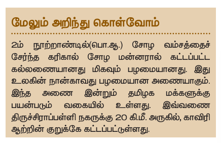

கிராமப்புறங்களில் மக்கள், பல்வேறு வகைகளில் மழைநீரை சேமிக்கிறார்கள். அவற்றுள் சில,

1. **ஏரிகள் அமைத்தல்:** இது தமிழ் நாட்டிலுள்ள மிகப்பழமையான மழை நீர் சேகரிப்பு முறையாகும். ஒரு ஏரியில் மழை நீர் சேகரித்தபின், அதில் உள்ள உபரி நீர் அருகிலுள்ள மற்றோரு கிராமத்திலுள்ள ஏரியை சென்னடைந்து சேமிக்கும்படி அமைக்கப்பட்டிருக்கிறது.

2. **ஊரணிகள்:** ஒவ்வொரு கிராமப் புறத்திலும் சிறிய அளவிலான மழை நீரைச் சேமிக்கும் விதமாக "ஊரணிகள்" அமைந்துள்ளன. அவை கிராமங்களில் உள்ள மக்கள் பயன் படுத்தும் வகையில், குளிக்க, குடிக்க, துணி துவைக்க உதவுகின்றன. இவை அருகிலுள்ள கிராமங்களுக்கும் பயன்படுகின்றன.

> **மேலும் அறிந்து கொள்வோம்**
>
> 2ம் நூற்றாண்டில் (பொ.ஆ.) சோழ வம்சத்தைச் சேர்ந்த கரிகால் சோழ மன்னரால் கட்டப்பட்ட கல்லணையானது மிகவும் பழமையானது. இது உலகின் நான்காவது பழமையான அணையாகும். இந்த அணை இன்றும் தமிழக மக்களுக்கு பயன்படும் வகையில் உள்ளது. இவ்வணை திருச்சிராப்பள்ளி நகருக்கு 20 கி.மீ. அருகில், காவிரி ஆற்றின் குறுக்கே கட்டப்பட்டுள்ளது.

**மழை நீர் சேமிப்பினால் உண்டாகும் நன்மைகள்**

(i) மழைநீர் சேகரிப்பு மிக வேகமாகக் குறைந்து வரும் நிலத்டி நீர்மட்டத்தை அதிகரிக்கப் பயன்படுகிறது.

(ii) பெருகிவரும் நீர்த் தேவைகளை சமாளிக்கப் பயன்படுகிறது.

(iii) பெரு வெள்ளம் மற்றும் மண் அரிப்பைத் தடுக்கப் பயன்படுகிறது.

(iv) நிலத்டியில் சேகரிக்கப்படும் நீர் மனித மற்றும் விலங்கு கழிவுகளால் மாசடைவதில்லை. எனவே இதனை குடிநீராகப் பயன்படுத்த முடியும்.

---

## 22.8 மின்னாற்றல் மேலாண்மை

மின்சாரம் மின் உற்பத்தி நிலையங்களில் உள்ள மின்னியற்றிகளால் உற்பத்தி செய்யப்படுகிறது. இம்மின்னியற்றிகள் இவற்றிலுள்ள டர்பைன்கள் சுழல்வதன் மூலம் இயக்கப்படுகிறது. நீராவி, நீர் மற்றும் காற்று ஆற்றல் ஆகியவை டர்பைன்களை சுழலச் செய்து மின்சார உற்பத்திக்கு காரணமாக உள்ளன.

**மின்னாற்றல் வளங்களை பாதுகாப்பதன் அவசியங்கள்:**

உனது வீட்டிலும் பள்ளியிலும் கீழ்காணும் வழிமுறைகளை பின்பற்றுவதன் மூலம் மின்சாரத்தை சேமிக்க முடியும்.

(i) குறைந்த மின் ஆற்றலை மேம்படுத்தும் சாதனங்களான சிஎஃப்எல் (CFL) பல்பு, எல்இடி பல்புகள் (LED) மற்றும் மின் சாதனங்களை பயன்படுத்தலாம்.

(ii) உபயோகிக்காத போது விளக்குகள், மின்விசிறிகள், தொலைக்காட்சிப்பெட்டி, பிற மின்சாதனங்களில் இணைப்பை துண்டித்து விடலாம்.

(iii) செல்லிடை பேசி மின் இணைப்பை தேவையில்லாத போது அணைத்தை வைக்கலாம்.

(iv) சூரிய ஒளியினை போதுமான அளவு பயன்படுத்தலாம். மின் நீர் சூடேற்றிகளுக்கு பதிலாக சூரிய ஒளி நீர் சூடேற்றிகளை பயன்படுத்தலாம்.

(v) குளிரசாதன வசதியினை தேவையானபோது மட்டும் பயன்படுத்தலாம்.

---

## 22.9 மின்னணுக் கழிவுகள் மற்றும் அதன் மேலாண்மை

மின்னணுக் கழிவுகள் என்பது பயன்படுத்த முடியாத, பழைய, மீண்டும் சரிப்படுத்தி உபயோகிக்க முடியாத, மின்சார மற்றும் மின்னணு சாதனங்களைக் குறிப்பதாகும். இக்கழிவுகளில் நச்சு உலோகங்களான காரீயம், காட்மியம், குரோமியம், பாதரசம், மட்டுமல்லாமல் பிற உலோகங்களான இரும்பு, தாமிரம், சிலிக்கன், அலுமினியம், தங்கம் போன்றவை பிரித்தெடுக்கக் கூடியவையாக உள்ளன. ஆனால் இவற்றுள் 5% மின் கழிவுகள் மட்டுமே மறுசுழற்சி செய்யப்படுகிறது.

**மின்னணு சாதனங்கள்:** கணினிகள், மடிக்கணினிகள், தொலைபேசிகள், தொலைக்காட்சி பெட்டிகள், DVD பிளேயர்கள், கால்குலேட்டர்கள், விளையாட்டு சாதனங்கள், பொம்மைகள் போன்றவை.

**வீட்டு உபயோக மின் சாதனங்கள்:** குளிரசாதனப்பெட்டிகள், துணி துவைக்கும் இயந்திரங்கள், நுண்ணலை சமைப்பான்கள், மிக்ஸி, கிரைண்டர், நீர் சூடேற்றிகள் போன்றவை.

**துணைப்பொருட்கள்:** பிரிண்டிங் கார்ட்ரிட்ஜஸ், மின்கலன்கள், சார்ஜர்கள்.

**மின்னணுக் கழிவுகளால் உண்டாகும் சுற்றுச்சூழல் பாதிப்புகள்**

மின்னணுக் கழிவுகளின் பாதிப்புகளை அறியாமல் அவற்றினை நிலத்தில் புதைப்பதால் மண் மற்றும் நிலத்டி நீர் மாசடைந்து அதனை பயன்படுத்த இயலாமல் போகலாம்.

> **மேலும் அறிந்து கொள்வோம்**
>
> **மின்னணுக் கழிவுகளால் ஆரோக்கியத்திற்கு உண்டாகும் பாதிப்புகள்**
>
> **ஈயம்:** மனிதரில் மைய நரம்பு மண்டலத்தையும் பக்க நரம்பு மண்டலத்தையும் பாதிக்கிறது. குழந்தைகளின் மூளை வளர்ச்சியை பாதிக்கிறது.
>
> **குரோமியம்:** மூச்சுத்திணறல் ஆஸ்துமா.
>
> **கேட்மியம்:** சிறுநீரகம் மற்றும் கல்லீரலில் படிந்து அதன் பணிகளை பாதிக்கிறது. நரம்புகளை பாதிக்கின்றது.
>
> **பாதரசம்:** மூளை மற்றும் சுவாச மண்டலத்தை பாதிக்கிறது.
>
> **பாலிவினைல் குளோரைடு (PVC) உள்ளிட்ட நெகிழிகள்:** நெகிழிகளை எரிப்பதால் உண்டாகும் டையாக்சின்கள் இனப்பெருக்க மண்டலத்தின் வளர்ச்சியையும், பணியையும் பாதிக்கிறது.

மின்னணு சாதனங்களில் உள்ள பல நச்சு கனை உலோகங்களான காரீயம் மற்றும் கேட்மியம் போன்றவை நீர் மாசுபடுவதற்கு மிக முக்கிய காரணிகளாக உள்ளன.

மின்னணுக் கழிவுகள் கொட்டப்பட்டிருக்கும் நிலப்பரப்புகள் மற்றும் அருகாமை பகுதிகளில் மாசடைவதோடு, பல உடல்நல பாதிப்புகளையும் உண்டாக்கும்.

**மின்னணுக் கழிவுகள் கீழ்க்கண்டவற்றை உள்ளடக்கியது.**

| வகை | சதவீதம் |
|-----|---------|
| கணினிப் பொருட்கள் | 66% |
| தொலைத் தொடர்பு சாதனங்கள் | 12% |
| மின்னணு சாதனங்கள் | 5 % |
| உயிரி மருத்துவ சாதனங்கள் | 7% |
| பிற சாதனங்கள் / உபகரணங்கள் | 6% |

---

## 22.10 கழிவுநீர் மேலாண்மை

இந்தியாவின் நீரை மாசுபடுத்துவதில் முக்கிய பங்கு வகிப்பவை வீட்டு உபயோக மற்றும் தொழிற்சாலை உபயோகக் கழிவுநீர் ஆகியவையாகும். கழிவுநீர், விவசாய நிலங்களை அசுத்தப்படுத்துவதோடு, சுற்றுச்சூழல் சீர்கேட்டையும் ஏற்படுத்துகின்றது.

**கழிவுநீர் உருவாகும் மூலங்கள்**

- வீட்டுப் பயன்பாடுகள்
- சாய மற்றும் துணி உற்பத்தி ஆலைகள்
- தோல் தொழிற்சாலைகள்
- சர்க்கரை மற்றும் சாராய ஆலைகள்
- காகித உற்பத்தி தொழிற்சாலைகள்

**கழிவு நீர் சுத்திகரிப்பு முறை**

வழக்கமான கழிவுநீர் சுத்திகரிப்பு முறை கீழ்க்கண்ட படிநிலைகளில் கையாளப்படுகிறது. அவையாவன வடிகட்டுதல், காற்றேற்றம், படிவு அகற்றுதல் மற்றும் நீர் மறுசுழற்சி.

**வடிகட்டுதல்:** வீடுகள் மற்றும் தொழிற்சாலைகளில் உருவாகும் கழிவு நீரில் உள்ள திடப்பொருட்களும், மண்ணும் இம்முறையில் வடிகட்டிப் பிரிக்கப்படுகிறது.

**காற்றேற்றம்:** வடிகட்டப்பட்ட கழிவு நீரானது காற்றேற்றம் செய்வதற்காக அதற்குரிய தொட்டிக்கு அனுப்பப்படுகிறது. இந்நிலையில் நுண்ணுயிரிகள், காற்றின் உதவியுடன் உயிரிய சிதைவடைதலுக்கு உட்படுத்தப்பட்டு நீக்கப்படுகிறது.

**வீழ்படிவு செயல் முறை:** இம்முறையில், நீரில் மிதந்த நிலையில் உள்ள திண்மப் பொருட்கள் நீரினடியில் வீழ்படிவாக சென்று சேருகின்றன. இவ்வாறு சேகரமாகும் வீழ்படிவுகள் சேறு போன்று காணப்படும். இது படிவு என்று குறிப்பிடப்படுகிறது.

**படிவு அகற்றுதல்:** தொட்டிகளில் சேகரமாகும் படிவுகள் குறிப்பிட்ட கால இடைவெளியில் பாதுகாப்பான முறையில் அகற்றப்படுகின்றன.

**கிருமி நீக்குதல்:** குளோரினேற்றம் மற்றும் புற ஊதா கதிர்கள் மூலம் இந்நீர் சுத்திகரிக்கப்பட்டு நோயை உண்டாக்கக்கூடிய நுண்ணியிரிகள் நீக்கம் செய்யப்படுகின்றன.

**நீர் மறுசுழற்சி:** இவ்வாறு சுத்திகரிக்கப்பட்ட நீர் வீட்டு உபயோகத்திற்கும் தொழிற்சாலை பயன்பாட்டுக் காகவும் மீண்டும் பயன்படுத்தப்படுகிறது.

**படம் 22.4 கழிவு நீர் சுத்திகரிப்பு முறை**

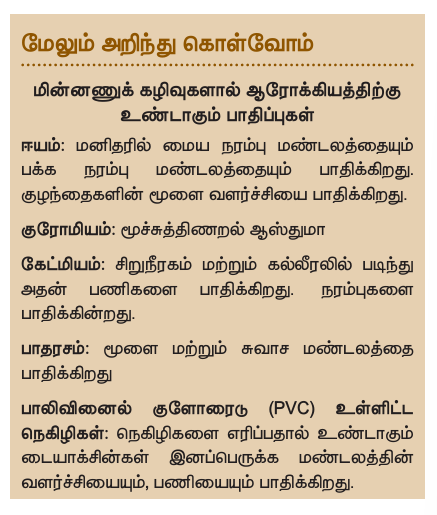

**படம் 22.5 கழிவு நீர் சுத்திகரிப்பின் பல்வேறு நிலைகள்**

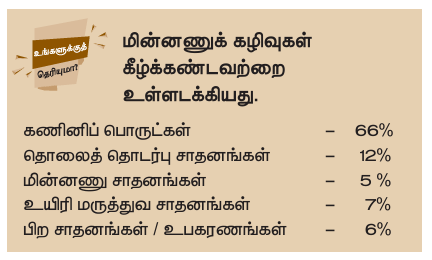

---

## 22.11 திடக்கழிவு மேலாண்மை

திடக்கழிவு என்பது நகர்ப்புறக் கழிவுகள், மருத்துவக் கழிவுகள், தொழிற்சாலைக் கழிவுகள் மற்றும் மின்னணுக் கழிவுகள் ஆகியவற்றை உள்ளடக்கியது. பல்வேறு வகையான திடக்கழிவுகளை நிலத்தில் நிரப்புவதால் நிலம் வெகுவாக பாதிக்கப்பட்டு சீர் குலைகிறது.

திடக்கழிவு மேலாண்மை என்பது வீடுகள் மற்றும் தொழிற்சாலைகளில் உற்பத்தி ஆகும் கழிவுப் பொருட்களை சேகரித்தல், சுத்தப்படுத்துதல் மற்றும் முறையாக வெளியேற்றுதல் ஆகியவற்றை உள்ளடக்கியது.

**திடக்கழிவுகளை அகற்றும் முறைகள்**

(i) **தனித்துப் பிரித்தல்:** பல்வேறு வகையான திடக்கழிவுகளை மக்கும் தன்மை உள்ளவை மற்றும் மக்கும் தன்மையற்றவை என தனித்து பிரிப்பதாகும்.

(ii) **நிலத்தில் நிரப்புதல்:** தாழ்வான பகுதிகளில் திடக்கழிவுகளை நிரப்புவது ஆகும். கழிவுப் பொருட்களை நிரப்பிய பிறகு அதன் மேல் மண்ணை ஒரு அடுக்கு நிரப்பி சரக்கு ஊர்திகள் மூலம் அழுத்தச் செய்யலாம். 2 முதல் 12 மாதங்களுக்குள் கழிவுகள் நிலைப்படுத்தப்படுகின்றன. அதில் உள்ள கரிமப் பொருட்கள் சிதைவடைகின்றன.

(iii) **எரித்து சாம்பலாக்கல்:** எரியும் தன்மை உடைய கழிவுகளான மருத்துவமனை கழிவுகளை முறையாக அமைக்கப்பட்ட எரியூட்டிகளில் அதிக வெப்பநிலையில் எரித்து சாம்பலாக்கலாம்.

(iv) **உரமாக்குதல்:** உயிரி சிதைவடைய கூடிய கழிவுகளை மண்புழுக்களை பயன்படுத்தியும் நுண்ணுயிரிகளைப் பயன்படுத்தியும் சிதை வடையச் செய்து மட்கிய உரமாக மாற்றுவதாகும்.

**கழிவு மறுசுழற்சி**

- பழைய புத்தகங்கள், வாரப் பத்திரிகைகள், செய்தித்தாள்கள் ஆகியவற்றை மீண்டும் காகித ஆலைகளில் பயன்படுத்தி காகித உற்பத்தி செய்யலாம்.
- வேளாண் கழிவுகள், தேங்காய், சணல், பருத்தியின் தண்டு, கரும்புச் சக்கை ஆகியவற்றைக் கொண்டு காகிதங்கள் மற்றும் அட்டைகள் தயாரிக்கலாம். நெல் தவிடைக் கால்நடைத் தீவனமாக பயன்படுத்தலாம்.
- மாட்டுச் சாணம் மற்றும் பிற உயிரி கழிவுகளைக் கொண்டு கோபர் கேஸ் என்னப்படும் உயிரி வாயு உற்பத்தி செய்வதோடு அதனை வயல்களில் உரமாகவும் பயன்படுத்தலாம்.

**4R முறை**

கழிவுகளை சிறப்பான முறையில் கையாளுவதற்கு 4R முறை ஏற்றதாகும். Reduce - குறைத்தல், Reuse - மறுபயன்பாடு, Recovery - மீட்டெடுத்தல் மற்றும் Recycle - மறுசுழற்சி.

---

## நினைவில் கொள்க

- இயற்கை வளங்களைப் பாதுகாத்தல் என்பது மனிதர்களின் அழிவுச் செயல்களிலிருந்து, இயற்கை வளங்களைப் பாதுகாப்பதும், பயன்படுத்துவதும் மற்றும் முறையாக மேலாண்மை செய்வதுமாகும்.
- இயற்கை வளங்களை பாதுகாத்தல் என்பது ஒரு நாட்டின் சமூக மற்றும் பொருளாதார மேம்பாட்டுக்கு முக்கிய பங்கினை அளிக்கிறது.
- காடுகள் ஒரு நாட்டின் மக்களுக்கான மிகப்பெரிய சொத்தாக கருதப்படுகிறது.
- தேசிய பூங்காக்கள் என்பவை அனைத்து வகையான (தாவர மற்றும் விலங்குகளை) வன உயிரிகளை பாதுகாப்பதற்காக, ஏற்படுத்தப்பட்ட வரையறுக்கப்பட்ட பகுதி.
- சரணாலயங்கள் விலங்குகளுக்காகவே மட்டுமே உருவாக்கப்பட்டவை.
- சூரிய மின் கலன் என்பது சூரிய ஒளியை ஈர்த்து அதனை மின்னாற்றலாக மாற்றக்கூடிய கருவியாகும்.
- சூரியநீர் சூடேற்றிகள் மின்சாரத்தை பயன்படுத்தாமல் சூரிய ஒளியின் மூலம் நீரை நேரடியாக வெப்பமாக்கக் கூடியவை.
- மாட்டுச்சாணம் காற்றில்லா சூழலில் நொதிக்கப்படும் போது உயிரி வாயு உருவாகிறது.
- மழைநீரை எதிர்கால பயன்பாட்டிற்காக சேகரித்து சேமிக்கும் வழிகள் மழைநீர் சேமிப்பு என்னப்படும்.
- தேவையற்று பயன்படுத்த முடியாத வழக்கொழிந்த மின் சாதனங்களை மின்னணுக் கழிவுகள் என்கிறோம்.

---

## மதிப்பீடு

### I. கோடிட்ட இடங்களை நிரப்பு.

1. காடுகள் அழிப்பினால் மழை பொழிவு _______________.
2. மண்ணின் மேல் அடுக்கு மண் துகள்கள் அகற்றப்படுவது _______________.
3. சிப்கோ இயக்கம் _______________ எதிராக ஆரம்பிக்கப்பட்டது.
4. _______________ என்பது தமிழ்நாட்டிலுள்ள உயிர்க்கோள பாதுகாப்பு மையமாகும்.
5. ஓத ஆற்றல் _______________ வகை ஆற்றலாகும்.
6. கரி, பெட்ரோலியம் மற்றும் இயற்கை எரிவாயு ஆகியவை _____________ எரிபொருட்கள் ஆகும்.
7. மின்சார உற்பத்திக்கு மிகவும் அதிக அளவில் பயன்படுத்தப்படும் எரிபொருள் _______________ ஆகும்.

### II. சரியா? தவறா? (தவறு எனில் கூற்றினை திருத்துக)

1. உயிரி வாயு ஒரு புதைபடிவ எரிபொருளாகும்.
2. மரம் நடுவதால் நிலத்டி நீர்மட்டம் அதிகரிக்கும்.
3. வாழிடங்களை அழிப்பது வன உயிரிகளின் இழப்புக்குக் காரணமாகும்.
4. அணு ஆற்றல் ஒரு புதுப்பிக்கத்தக்க ஆற்றலாகும்.
5. அதிகப்படியான கால்நடை மேய்ச்சல், மண்ணரிப்பைத் தடுக்கும்.
6. வன உயிர்களை வேட்டையாடுதல் சட்டப்பூர்வமாக அங்கீகரிக்கப்பட்ட ஒன்றாகும்.
7. தேசியப் பூங்கா ஒரு பாதுகாக்கப்பட்டப் பகுதியாகும்.
8. வன உயிரி பாதுகாப்புச் சட்டம் 1972 ஆம் ஆண்டு உருவாக்கப்பட்டது.

### III. பொருத்துக.

| | |
|--|--|
| 1. மண்ணரிப்பு | – ஆற்றல் சேமிப்பு |
| 2. உயிரி வாயு | – அமில மழை |
| 3. இயற்கை வாயு | – தாவரப் பரப்பு நீக்கம் |
| 4. பசுமை இல்ல வாயு | – புதுப்பிக்கத்தக்க ஆற்றல் |
| 5. CFL பல்புகள் | – CO₂ |
| 6. காற்று | – புதுப்பிக்க இயலாத ஆற்றல் |
| 7. திடக்கழிவு | – காரீயம் மற்றும் கன உலோகங்கள் |

### IV. சரியான விடையைத் தேர்ந்தெடு.

1. கீழுள்ளவற்றுள் எது/எவை புதைபடிவ எரிபொருட்கள்?

   i. தார்  ii. கரி  iii. பெட்ரோலியம்

   அ) i மட்டும்  ஆ) i மற்றும் ii  இ) ii மற்றும் iii  ஈ) i, ii மற்றும் iii

2. கழிவுகளை மேலாண்மை செய்வதற்காக கீழுள்ளவற்றுள் எவற்றினை நீவிர பயன்படுத்துவீர்?

   அ) கழிவுகள் உருவாகும் அளவைக் குறைத்தல்.
   ஆ) கழிவுகளை மறு பயன்பாட்டு முறையில் பயன்படுத்துதல்.
   இ) கழிவுகளை மறுசுழற்சி செய்தல்.
   ஈ) மேலே உள்ளவை அனைத்தும்.

3. வாகனங்கள் வெளியேற்றும் புகையில் உள்ள வாயுக்கள்:

   i. கார்பன் மோனாக்சைடு
   ii. சல்பர் டை ஆக்சைடு
   iii. நைட்ரஜன் ஆக்சைடுகள்

   அ) i மற்றும் ii  ஆ) i மற்றும் iii  இ) ii மற்றும் iii  ஈ) i, ii மற்றும் iii

4. மண்ணரிப்பைத் தடுக்கப் பயன்படுவது:

   அ) காடுகள் அழிப்பு  ஆ) காடுகள்/மரம் வளர்ப்பு  இ) அதிகமாக வளர்த்தல்  ஈ) தாவரப் பரப்பு நீக்கம்

5. புதுப்பிக்கத்தக்க ஆற்றல் மூலம்:

   அ) பெட்ரோலியம்  ஆ) கரி  இ) அணுக்கரு ஆற்றல்  ஈ) மரங்கள்

6. கீழுள்ளவற்றுள் மண்ணரிப்பு அதிகமாக காணப்படும் இடம்:

   அ) மழைப்பொழிவு இல்லாத இடம்
   ஆ) குறைவான மழை பொழிவு உள்ள இடம்
   இ) அதிகமான மழைப்பொழிவு உள்ள இடம்.
   ஈ) இவற்றில் எதுவுமில்லை.

7. கீழுள்ளவற்றுள் தீர்ந்து போகாத வளம் / வளங்கள்:

   அ) காற்றாற்றல்  ஆ) மண்வளம்  இ) வன உயிரி  ஈ) மேலே உள்ள அனைத்தும்

8. கிராமங்களில் கிடைக்கும் பொதுவான ஆற்றல் மூலம் / மூலங்கள்:

   அ) மின்சாரம்  ஆ) கரி  இ) உயிரி வாயு  ஈ) மரக்கட்டைகள் மற்றும் விலங்குகளின் கழிவு

9. பசுமை இல்ல விளைவு என்று குறிப்பிடப்படுவது:

   அ) பூமி குளிர்தல்.
   ஆ) புற ஊதாக் கதிர்கள் வெளி செல்லாமல் இருத்தல்.
   இ) தாவரங்கள் பயிர் செய்தல்.
   ஈ) பூமி வெப்பமாதல்.

10. மிக மலிவான வழக்கமான வர்த்தக ரீதியிலான தீர்ந்து போகாத ஆற்றல் மூலம்:

    அ) நீர் ஆற்றல்  ஆ) சூரிய ஆற்றல்  இ) காற்றாற்றல்  ஈ) வெப்ப ஆற்றல்

11. புவி வெப்பமாதலின் காரணமாக ஏற்படக்கூடிய விளைவு:

    அ) கடல் மட்டம் உயர்தல்.
    ஆ) பனிப்பாணைகள் உருகுதல்.
    இ) தீவுக்கூட்டங்கள் மூழ்குதல்.
    ஈ) மேலே கூறிய அனைத்தும்.

12. கீழே கொடுக்கப்பட்டுள்ள கூற்றுகளில் காற்றாற்றல் குறித்த தவறான கூற்று எது?

    அ) காற்றாற்றல் ஒரு புதுப்பிக்கத்தக்க ஆற்றல்.
    ஆ) காற்றாலையின் இறக்கைகள் மின்மோட்டார் மூலம் இயக்கப்படுகின்றன.
    இ) காற்றாற்றல் மாசு ஏற்படுத்தாமல் உற்பத்தி செய்யப்படுகிறது.
    ஈ) காற்றாற்றலைப் பயன்படுத்துவதன் மூலம் புதைபடிவ எரிபொருட்கள் பயன்பாட்டினைக் குறைக்கலாம்.

### V. ஒரு வாக்கியத்தில் விடையளி.

1. மரங்கள் வெட்டப்படுவதால் உண்டாகும் விளைவுகள் யாவை?
2. வன உயிரினங்களின் வாழிடம் அழிக்கப்படுவதால் ஏற்படும் விளைவுகள் யாவை?
3. மண்னரிப்பிற்கான காரணிகள் யாவை?
4. புதைபடிவ எரிபொருள்களை நாம் ஏன் பாதுகாக்க வேண்டும்?
5. சூரிய ஆற்றல் மூலம் எவ்வாறு ஒரு புதுப்பிக்கத்தக்க ஆற்றல் மூலம் என்னப்படுகிறது?
6. மின்னணுக் கழிவுகள் எவ்வாறு உற்பத்தியாகின்றன?

### VI. சுருக்கமாக விடையளி

1. மழைநீர் சேமிப்பின் முக்கியத்துவங்கள் யாவை?
2. உயிரி வாயுவை பயன்படுத்துவதன் நன்மைகள் யாவை?
3. கழிவுநீர் சுற்றுச்சூழலில் ஏற்படுத்தும் விளைவுகள் யாவை?
4. காட்டழிப்பினால் ஏற்படக்கூடிய விளைவுகள் யாவை?

### VII. விரிவாக விடையளி.

1. மழைநீர் சேமிப்பு அமைப்புகள் எவ்வாறு நிலத்டி நீர் மட்டத்தை அதிகரிக்கச் செய்கின்றன?
2. மண்ணரிப்பை நீவிர எவ்வாறு தடுப்பீர்?
3. திடக்கழிவுகள் உருவாகும் மூலங்கள் யாவை? அவற்றினை எவ்வாறு கையாளலாம்?
4. காடுகளின் முக்கியத்துவம் பற்றி கூறுக.
5. மண்ணரிப்பினால் உண்டாகக்கூடிய விளைவுகள் யாவை?
6. வனங்களை மேலாண்மை செய்வதும், வன உயிரினங்களை பாதுகாப்பதும் ஏன் ஒரு சவாலான பணியாகக் கருதப்படுகிறது?

### VIII. கொடுக்கப்பட்டுள்ள கூற்று மற்றும் காரணங்களில் சரியாகப் பொருந்தியுள்ளதை கீழ்காண் வரிசைகளின் உதவியுடன் தேர்வு செய்து எழுதுக.

அ) கூற்று மற்றும் காரணம் ஆகிய இரண்டும் சரி. மேலும், காரணம் கூற்றுக்கு சரியான விளக்கம் தருகிறது.
ஆ) கூற்று மற்றும் காரணம் ஆகிய இரண்டும் சரி. ஆனால், காரணம் கூற்றுக்கு சரியான விளக்கமல்ல.
இ) கூற்று சரி. ஆனால் காரணம் தவறு.
ஈ) கூற்று மற்றும் காரணம் இரண்டும் தவறு.

1. கூற்று: மழை நீர் சேமிப்பு என்பது மழை நீரை சேமித்து பாதுகாப்பதாகும்.
   காரணம்: மழை நீரை நிலத்டியில் கசியவிட்டு நிலத்டி நீர்மட்டத்தை உயர்த்தலாம்.

### IX. உயர் சிந்தனைக்கான வினாக்கள்

1. உயிர்ப்பொருண்மை சிதைவடைவதன் மூலம் நமக்கு கரி மற்றும் பெட்ரோலியப் பொருட்கள் கிடைக்கின்றன. இருப்பினும் நாம் அவற்றை பாதுகாப்பது அவசியமாகிறது. ஏன்?
2. மரபுசார் ஆற்றல் மூலங்களை பயன்படுத்துவதற்கு பதிலாக மரபுசாரா ஆற்றல் மூலங்களை பயன்படுத்துவதன் நோக்கங்கள் யாவை?
3. தமிழக அரசு நெகிழிப் பொருளையும் பிளாஸ்டிக் பொருளையும் பயன்படுத்தத் தடை விதித்துள்ளது? இதற்கான மாற்று முறைகள் ஏதேனும் இருப்பின் அதனை கூறு. இந்தத் தடையின் காரணமாக சுற்றுச்சூழல் எவ்வாறு சீரடையும்?

### X. விழுமிய அடிப்படையிலான வினாக்கள்

1. சூரிய மின்கலன்கள் நமது ஆற்றல் தேவைகளை பூர்த்தி செய்யும் அளவிற்கு இல்லை. ஏன்? உமது விடைக்கான மூன்று காரணங்களை கூறுக.
2. கீழ்க்காணும் கழிவுகளை எவ்வாறு கையாளுவாய்?
   அ) வீட்டுக் கழிவுகளான காய்கறிக் கழிவுகள்.
   ஆ) தொழிற்சாலைக் கழிவுகளான கழிவு உருண்டைகள்.
   இக்கழிவுகள் சுற்றுச்சூழலை பாதுகாக்குமா? ஆம் எனில் எவ்வாறு பாதுகாக்கும்?
3. 4 – R முறையினைப் பயன்படுத்தி இயற்கை வளங்களை பாதுகாக்க ஏதேனும் மூன்று செயல்பாடுகளை கூறுக.

---

## பிற நூல்கள்

1. Ghatwal G.T. and Harish Sharma, 2005. A Text Book of Environmental Studies', Himalaya Publishing House.
2. P. D. Sharma, 2013. Ecology and Environment, Rastogi Publications, Meerut.

---

## கருத்து வரைபடம்

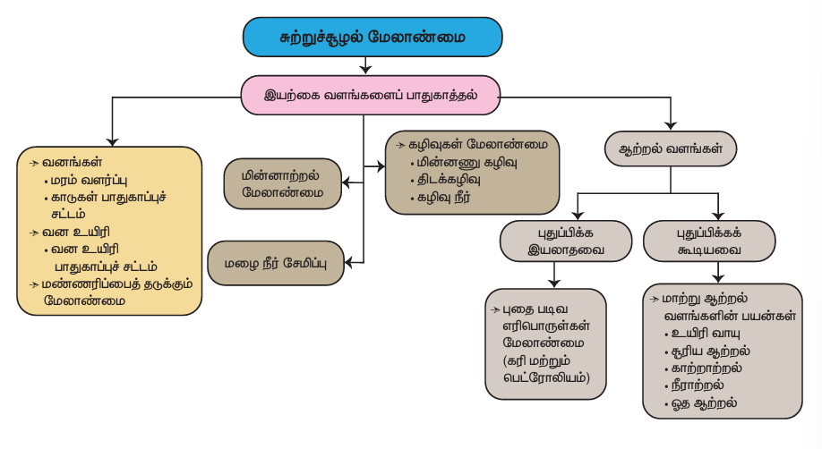
