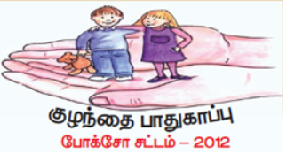
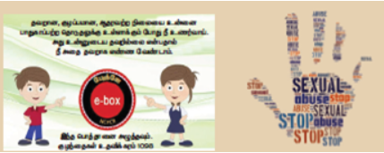
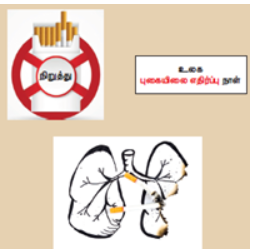

# அலகு 21: உடல் நலம் மற்றும் மனநோய்கள்

## கற்றல் விளைவுகள்

இப்பாடப்பகுதியைக் கற்ற பின், மாணவர்கள் பின்வருவனவற்றை:
- குழந்தைகள் மற்றும் பாலியல் ரீதியான துஷ்பிரயோகம் பற்றியும், அதிலிருந்து பாதுகாப்பு முறைகள் பற்றியும் அறிவர்.
- மருந்து, ஆல்கஹால் மற்றும் புகையிலையின் தவறான பயன்பாடு பற்றியும், அதனால் ஏற்படும் உடல் நலப் பிரச்சனைகள் பற்றியும் அறிவர்.
- நீரிழிவு, உடல்பருமன், இதயநோய்கள், புற்றுநோய் மற்றும் எய்ட்ஸ் ஆகியவற்றிற்கான காரணங்கள் மற்றும் அறிகுறிகளின் விளக்கம் தருவர்.
- மனநோய்கள் மற்றும் குணப்படுத்தும் கட்டுப்பாட்டு முறைகள் பற்றிப் புரிந்துகொள்வர்.
- நல்வாழ்வுக்கான முக்கியமான விழிப்புணர்வு ஏற்படுத்துவர்.

---

## 21.1 தவறான பயன்பாடு

விளைவிக்கின்ற அல்லது தீங்கு ஏற்படுத்துகின்ற தாக்குதலுக்கு ஒருவரைத் தாருவர் உள்ளதாக்குவதை தவறான பயன்பாடு என்படும். இது உடல், உணர்வு அல்லது மனம், வாய்வழி, குழந்தைகள் மற்றும் பாலியல் ரீதியான தவறான பயன்பாடுகளை உள்ளடக்கியதாகும். இது குடும்பம் மற்றும் அக்குடும்பத்தைச் சார்ந்த நபர்களினால் ஏற்படுகிறது.

### 21.1.1 குழந்தைகளின் தவறான பயன்பாடு

குழந்தைகளின் தவறான பயன்பாடு என்பது அனைத்து வகைத் தனிநபர் உடல் மற்றும் உணர்வுரீதியான துன்புறுத்தல், பாலியல் துன்புறுத்தல்கள், சுரண்டல் ஆகியவற்றிற்கு உள்ளதாக்கும் முக்கியமானதாகும். இவ்வாறு காரணமாக அக்குழந்தையின் ஆக்கியம், உயிர்வாழ்வு, வளர்ச்சி ஆகியவை பாதிக்கப்படுகின்றன. குழந்தைகளின் உடல் ரீதியான தவறான பயன்பாடு என்பது குழந்தைக்கு அச்சுறுத்தல், அடித்தல், உண்ணுதல் மற்றும் தாக்குதல் முக்கிய உடலுக்குத் தீங்கு விளைவிக்கும்.

### 21.1.2 பாலியல் துன்புறுத்தல்

ஒருவர் தாருவரின் மீது நின்று அதிகாரத்தையும், ஆதிக்கத்தையும் செலுத்தி பாலியல் ரீதியாக தனிநபருக்குத் தீங்கு விளைவிப்பது பாலியல் துன்புறுத்தலாகும். இது பாதிக்கப்பட்டவரில் மேலும் தனிநபர் விளைவுகளை ஏற்படுத்துகிறது. இளம் சிறுமிகள் மற்றும் பெண்கள் பல்வேறு வகைத் தனிநபர் பாலியல் துன்புறுத்தலுக்கு ஆளாகின்றனர். தவறாக இது பணிபுரியும் இடங்களில் அதிகமாகக் காணப்படுகிறது. வாய்த்தேதல் கருத்துக்கள், நெருக்கமான சூழல் (முகலிதையில்), எண்கள் மற்றும் தவறான பார்வை முக்கியமான அதிகச் சூழல் முறைமைகளாகும். இவைதால் நேர்மையிலும், உடல் மனநோய்களாலும் மற்றும் உணவு உண்ணுவதிலும் (உணவூட்டக்குறைபாடு) குறிப்பிட்ட நபர்கள் பாதிப்புக்கு உள்ளாகின்றனர்.

### 21.1.3 குழந்தைகளின் பாலியல் துன்புறுத்தல்

சிறுவர்கள் தவறான பயன்படுத்துகிறார்கள் என்பதை உணரமுடியாத நிலையில் இருப்பதால், குழந்தைகள் பாலியல் முறையில் தனிநபர் துன்புறுத்தலின் முக்கிய இலக்காகக் கருதப்படுகிறார்கள். தவறாக, இச் செயலில் ஈடுபடுபவர்கள் அக்குழந்தைக்கு நன்கு தெரிந்தவராகவும், அப்பகுதியில் வசிப்பவராகவும் இருப்பார்கள். குழந்தைகளின் தனிமையைப் பயன்படுத்தி, அவர்களைக் கவரும் வகையில் (பொம்மைகள் மற்றும் பதாமணிகளைப் பயன்படுத்தல்) ஏமாற்றி அவர்களைப் பயன்படுத்தி பாலியல் ரீதியான துன்புறுத்தலுக்கு ஆளான குழந்தைகளில் பிறப்புறுப்புக் காயம், வயிற்றுவலி, அடிக்கடி ஏற்படும் சிறுநீரகத்தாற்று மற்றும் நடையில் தோற்றம் முக்கிய அறிகுறிகள்.

&gt; **மேலும் அறிந்துகொள்ளுவோம்**
&gt; 
&gt; பெண்கள் மற்றும் குழந்தைகள் மேம்பாட்டு அமைச்சகம் குழந்தைகளுக்கு எதிரான பாலியல் குற்றங்களிலிருந்து அவர்களைப் பாதுகாப்பதற்காக 2012–இல் போக்சோ (POCSO - Protection of Children from Sexual Offences) சட்டத்தை அறிமுகப்படுத்தியது. பாலியல் தாக்குதல், பாலியல் துன்புறுத்தல் மற்றும் ஆபாசமான குற்றங்களிலிருந்து பாதுகாப்பு. இத்தகைய குற்றங்களை விசாரிப்பவர் சிறப்பு நீதிமன்றங்களில் விசாரணை.

### 21.1.4 தவறான பயன்பாட்டுக்கு உள்ளான குழந்தைகளின் பாதுகாப்புத் தற்கான அணுகுமுறைகள்

தவறான பயன்பாட்டினால் துன்பத்திற்கு உள்ளான குழந்தைகளைக் கண்டறிதல், குறிப்பிடுதல் மற்றும் அவிடுவதற்கான வழிமுறைகளாவன:

#### குழந்தைகள் உதவிக்கரம் (Child Helpline)

குழந்தைகள் உதவிக்கரம் சமூகப் பணியாளர்களை நியமித்து குழந்தைகளுக்கு உணவு, உணைவிடம் மற்றும் பாதுகாப்பு வழங்குவதில் உதவி.

#### குழந்தைகளுக்கு ஆலோசனை வழங்குதல்

உளவியலாளர்கள், சமூகப்பணியாளர்கள் மூலம் பாதிக்கப்பட்ட குழந்தைகளுக்கு ஆலோசனை வழங்கி வழிகாட்டுதல் மற்றும் தொடர்ச்சியான ஆதரவு.

#### குடும்ப ஆதரவு

பாதிக்கப்பட்ட குழந்தைகளுக்கு குடும்பத்தில் உள்ள அனைத்து உறுப்பினர்களும் ஆதரவாக இருக்கவேண்டும். அவர்களுடைய பாதிப்புகளிலிருந்து மீள்வதற்கு முறையான கவனத்துடன் கூடிய பாதுகாப்பு வழங்க.

#### மருத்துவப் பராமரிப்பு

பாலியல் பாதிப்புக்கு உள்ளான குழந்தைகள் மன அழுத்தத்திலிருந்து விடுபட பயிற்சித் துறை சுகாதார நிபுணர்களிடமிருந்து மருத்துவப் பராமரிப்பு மற்றும் சிகிச்சை.

#### சட்ட ஆலோசனை

பாதிக்கப்பட்ட குழந்தையின் குடும்பத்தினர் அல்லது பாதுகாவலர்கள் விருப்பப்படி, சட்ட ஆலோசகர் மூலம் சட்ட ஆலோசனையை வழங்குவதற்கு உரிமை.

&gt; **மேலும் அறிந்துகொள்ளுவோம்**
&gt; 
&gt; குழந்தை உரிமைகள் பாதுகாப்பிற்கான தேசிய ஆணையம் (NCPCR) தேசிய 2007-இல் குழந்தை உரிமைகள் சட்டம் (CPCR), 2005-ன் கீழ் அமைக்கப்பட்டது. இச் சட்டம் தவறாக உள்ளடக்கம், குழந்தை சட்டங்களை மீறமுடியாதவர்கள் மற்றும் நாட்டில் காணப்படும் குழந்தைகள் தொடர்பான தகவல்களின் அவதானிப்பை உறுதி செய்கிறது.
&gt; 
&gt; 18 வயதுவரையிலான அனைத்து குழந்தைகளின் பாதுகாப்புக்கும் மேலான முக்கியத்துவம் உள்ளது. பாதிக்கப்படக்கூடிய வாய்ப்புகள் அதிகமுள்ள குழந்தைகளுக்கு முன்னுரிமை நடவடிக்கைகளுக்கு உட்படுத்தப்படுகின்றன.

#### மறுவாழ்வு

பள்ளியில் மீண்டும் சேர்த்து கல்வியைத் தொடரச் செய்வது பாதிக்கப்பட்ட குழந்தைக்கான மறுவாழ்வாகும். அக்குழந்தையைத் துணைபடிப்படியாக மீண்டும் தன்னுடைய இயல்பான நிலைக்கு மீண்டுவருவதற்கு இது.

#### சமூக அடிப்படையான முயற்சிகள்

குழந்தைகளின் தவறான பயன்பாட்டிலிருந்து தடுக்க விழிப்புணர்வு சமூகம் கொண்ட நடைமுறை.

குழந்தைகளின் பாலியல் ரீதியான தவறான பயன்பாட்டிலிருந்து தடுத்தல் உலகளாவிய முறையில் வலியுறுத்தப்படும் முக்கியமான சமூகக் கொள்கை, குழந்தைகள் பாலியல் முறையில் தவறான பயன்பாட்டிலிருந்து தடுக்கும் முயற்சிகளாகும். இவைமேற்கொள்வதற்கு பெற்றோர்கள் மற்றும் ஆசிரியர்கள் மூலம் குழந்தைகளுக்குத் தெரிவிக்கப்படவேண்டிய அறிவுரைகளாவன,

- எண்மைப்படுகின்ற நபரிடமும் அல்லது தெரியாத அந்நிய நபரிடமும் பேசுவது மற்றும் அவர் அருகில் செல்வதுகூடாது.
- எந்த வகை தெரியாத நபருடனும் நெருக்கமாக இருக்கக்கூடாது.
- அரசு அல்லது தனியார் பொதுவரவு வாகனங்களில் (பேருந்துகள், ஆட்டோ, ரயில்) நெருக்கமாகப் பயணம் செய்யும்போது கவனமாக இருக்கவேண்டும்.
- பெற்றோருக்குத் தெரியாமல், எவரிடமிருந்தும் பணம், பதாமணிகள், பரிசுகள் அல்லது பொம்மைகளைப் பெற்றுக்கொள்ளக்கூடாது.
- தெரிந்த அல்லது தெரியாத நபர்களுடன் தனிமையில் அனுமதிக்கக்கூடாது.

நம் குழந்தைகள் கண்ணியமான, எந்த வகையிலும் வன்முறையற்ற, பாதுகாப்பான வாழ்க்கையை மேற்கொள்வதற்கான சூழலை உறுதி செய்வது சமூகத்தில் உள்ள ஒவ்வொரு நபரின் கடமையாகும்.

---

## 21.2 மருந்து, ஆல்கஹால் மற்றும் புகையிலையின் தவறான பயன்பாடு

ஆல்கஹால், புகைப்பிடித்தல் மற்றும் மருந்துகளில், உடல் மற்றும் மனம் சார்ந்திருப்பது அடிமையாதல் எனப்படும். இப் பொருட்களில் உள்ள அடிமைப்படுத்தும் பண்புடைய பானதியானது, ஒருவரைத் தீய விளைவுகளுக்கு உட்படுத்தி, அவர்களை அப் பொருட்களில் நிரந்தரமாகச் சார்ந்திருப்பதற்கு இட்டுச் செல்கிறது. புகையிலை, ஆல்கஹால் மற்றும் மருந்துகளில் தவறான பயன்பாடு ஒரு நபர், அவரின் குடும்பம் மற்றும் சமூகத்தில் தீய விளைவுகளை உண்டாக்குவது மிகுந்த கவனத்தில் கொள்ளவேண்டிய ஒன்றாகும். இந்த ஆபத்தான நடைமுறையை, முறையான கல்வி மற்றும் வழிகாட்டுதல் மூலம் தடுக்கமுடியும்.

### 21.3 மருந்துகளின் தவறான பயன்பாடு

மருந்துகள் என்பவை:
- நரம்பு மண்டலத்துடன் தொடர்புடைய உடலில் ஏற்படும் மாற்றங்களை ஏற்படுத்துபவை
- மனநிலை மாற்றும் மருந்துகள் என அழைக்கப்படுகின்றன

#### 21.3.1 மருந்து சார்ந்திருத்தல் 

முழுவதுமாக அம் மருந்துகளைச் சார்ந்திருக்கும் நிலையை மருந்து சார்ந்திருத்தல் என்கிறோம்.

#### 21.3.2 மருந்து சார்ந்திருத்தலின் விளைவுகள்

| விளைவு | விளக்கம் |
|--------|----------|
| உடல் செயலியல் நிலை மாற்றம் | உடலில் ஏற்படும் மாற்றங்கள் |
| உளவியல் சார்ந்திருத்தல் | மன அழுத்தம் குறைப்புக்கு உதவுவது |
| சமூக விளைவுகள் | குடும்பம், சமூகத்தில் ஏற்படும் பிரச்சனைகள் |

#### 21.3.3 நடத்தை மாற்றங்கள்

பருவத்தினை எதிர்கொள்ளும் போது ஏற்படும் விளைவுகளாவன:

- படிப்பில் செயல்திறன் குறைவு, கல்லூரி மற்றும் பள்ளிகளில் இடைநிறுதல்
- சுகாதாரத்தில் ஆர்வமின்மை, நிராகரிப்பு, மன அழுத்தம், சோர்வு, ஆக்ரோஷமான நடைமுறைகள்
- குடும்பம் மற்றும் நண்பர்களுடனான உணவுநிலை சிந்தனையில் பாதுகாப்பு
- உணவு மற்றும் தூங்கும் பழக்கங்கள் மாறுபடுதல்
- உடல் எடை மற்றும் பசி ஆகியவற்றில் ஏற்படும் ஏற்ற இறக்கம்
- எப்போதும் மருந்துகளைப் பெறுவதற்கான பைமாற்றக்கூடிய எளிய வழிகளில் தேடுதல்
- எய்ட்ஸ் மற்றும் ஹெபடைட்டிஸ் தாற்றம் ஏற்படுவதற்கான வாய்ப்புகள்

(WHO) 1984 மருந்துகளின் மதுவு (அடிமையாதல்) அல்லது மருந்துகளின் தவறான பயன்பாடு சார்ந்திருத்தல் என வகைப்படுத்த ஆலோசனை வழங்கியுள்ளது.

#### 21.3.4 அடிமையாதலிலிருந்து மீட்பு 

**மீட்பு முறைகள்:**
1. நச்சு நீக்கம் 
2. உளவியல் சிகிச்சை
3. குடும்ப உறுப்பினர்களுக்கு ஆலோசனை
4. மறுவாழ்வு

---

## 21.4 புகையிலையின் தவறான பயன்பாடு

புகையிலையானது நிக்கோட்டியானா டொமபேக்கம் மற்றும் நிக்கோட்டியானா ரஸ்டிகா ஆகிய புகையிலைத் தாவரங்களிலிருந்து பெறப்படுகிறது. இவற்றின் இலைகளின் உலர்ந்த, பதப்படுத்தப்பட்ட இலைகள், உலகளாவிய வணிகரீதியில் புகையிலை உற்பத்தியில் பயன்படுகின்றன. அதிலிருக்கும் "நிகோட்டின்" எனும் ஆல்கலாய்டு புகையிலைக்கு ஒருவர் அடிமையாகல் ஏற்படுத்துகிறது. நிகோட்டின் கிளர்ச்சியைத் தூண்டும், மிகவும் தீங்கு விளைவிக்கின்ற, நச்சுத்தன்மை வாய்ந்தது.

### 21.4.1 புகையிலைப் பயன்பாடு

| வகை | விளக்கம் |
|-----|----------|
| புகைப்பிடித்தல் | சுருட்டு, சிகரெட்டுகள், பீடிகள், குழாய்கள் |
| மெல்லுதல் | புகையிலைத் தூள் |
| மூக்குப்பொடி | மூக்கின் வழியாக எடுத்துக்கொள்ளுதல் |

### 21.4.2 புகைப்பிடித்தலின் ஆபத்துகள்

1. புற்றுநோய்க் காரணிகள் (கார்பன் மோனாக்சைடு, பாலினசைக்ளிக் ஹைட்ரோகார்பன்கள்)
2. மூச்சுக்குழல் அழற்சி , நுண்ணுயிர் நுரையீரல் காசநோய்
3. எம்பிசிமா 
4. இதய நோய்கள்
5. அதிக இரத்த அழுத்தம்
6. வயிற்றுப் புண்

> **குறிப்பு:** புகையிலை எதிர்ப்புச் சட்டம் 2004-ல் கொண்டுவரப்பட்டது. உலக புகையிலை எதிர்ப்பு நாள் - மே 31

---

## 21.5 ஆல்கஹாலின் தவறான பயன்பாடு

கோதுமையால் மேற்கொள்ளப்படும் ஆல்கஹால் பயன்பாடு (நுகர்வு) என்பது ஒரு சமூகத் தீங்காகும். ஆல்கஹால் சார்ந்திருத்தல் மதுபழக்கம் எனவும், அடிமையாதல் மதுவுக்கு அடிமையாதல் எனவும் அழைக்கப்படுகிறது. இது ஆல்கஹால் தவறான பயன்பாடு என்று அழைக்கப்படுகிறது. மது அருந்துதல் ஒருவரின் உடல், உடலியல் மற்றும் உளவியல் செயல்பாடுகள் பாதிப்பிற்கு உள்ளதாக்குகிறது.

### 21.5.1 நலத்திற்கு ஏற்படும் தீனமயமான விளைவுகள்

ஒரு நேர்க்கோட்டிற்கும் மற்றும் வலிநிவாரணமானதற்கும் செயல்பட்டு நரம்பு மண்டலத்தை நலிவடையச் செய்கிறது. அவற்றின் தீமை பயக்கும் சில விளைவுகளாவன:

- நரம்புத் தலைப்பாதித்து பல்வேறு வகைத் தனிநபர் உடல் ரீதியான தான்மைகளை உண்டாக்குகிறது
- உடல் உறுப்புகளின் ஒருங்கிணைப்பைக் குறைக்கிறது
- செங்கல்தன்மை, குறைந்த பார்வை, தொலைதூரங்களில் விபத்துகளில் முடிகிறது
- இரத்தநாளங்களின் விரிவடைவில் இதயத்தின் செயல்பாட்டைப் பாதிக்கின்றது
- கல்லீரல் மெதுவாதலினால் கல்லீரலில் அதிக அளவு கொழுப்பு மெமிக்கப்பட்டு சிரோஸிஸ் மற்றும் மருத்துவத் திசுக்கள் உருவாகல் ஏற்படுத்துகிறது
- உடல் எடைக் கட்டுப்பாட்டையும், எண்ணுருவிணையையும் இழந்து உடல்நலக் கேடுகளை உண்டாக்கி இறுதியில் இழப்பு ஏற்படுத்துகிறது

---

## 21.8 நீரிழிவு நோய் 

### 21.8.1 வகை-1 இன்சுலின் சார்ந்த நீரிழிவு நோய் 

காரணிகள்: வைரஸ் தொற்றுகள், மரபணு காரணிகள்

### 21.8.2 வகை-2 இன்சுலின் சாராத நீரிழிவு நோய் 

80%-லிருந்து 90% நீரிழிவு நோயாளிகளில் காணப்படுகிறது.

**காரணிகள்:**
- வயது அதிகரித்தல்
- உடல்பருமன்
- உடல் உழைப்பில்லாத வாழ்க்கை முறை
- அதிகக் கொழுப்பு உண்ணுதல்

### 21.8.3 நீரிழிவு நோயின் அறிகுறிகள்

- அதிகளவு சிறுநீர் வெளியேறுதல் (பாலியூரியா)
- அதிக தாகம் (பாலிடிப்சியா)
- அதிக பசி (பாலிபாஜியா)
- மெலிவு மற்றும் எடை இழப்பு

**அட்டவணை 21.1 வகை-1 மற்றும் வகை-2 நீரிழிவின் வேறுபாடுகள்**

| முறை | விளக்கம் |
|------|----------|
| உணவுக் கட்டுப்பாடு | கார்போஹைட்ரேட், கொழுப்பு கட்டுப்பாடு |
| மருந்துகள் | இன்சுலின் ஊசிகள், மாத்திரைகள் |
| உடற்பயிற்சி | தினசரி உடற்பயிற்சி |

---

## 21.9 உடல்பருமன் 

உடல்பருமன் என்பது சமூகம், நடத்தை, உளவியல், வளர்ச்சி மற்றும் மரபணு காரணிகளின் தாக்கத்தினால் உருவாகும் ஒரு சிக்கலான நோய் ஆகும்.

### 21.9.1 கட்டுப்பாட்டு முறைகள்

##### உணவுக் கட்டுப்பாடு

காய்கறிகள், பழங்கள், கட்டுப்படுத்தப்பட்ட கார்போஹைடிரேட், கொழுப்பு, அதிக நார்ச் சத்து மிக்க உணவுகள் முக்கியமானவை உடல் எடை அதிகரிப்பதைத் தடுப்பவைகளாகும். எடைகுறைப்பில் கலோரி கட்டுப்பாடு பாதுகாப்பானது மற்றும் மிகவும் பயனுள்ளதுமாகும்.

##### உடற்பயிற்சி

குறைந்த கலோரி உணவு, உடல் எடையைக் குறைப்பதில் திறன்மிக்கதாக விளங்குகிறது. மன அழுத்தம் காரணமாக அதிகப்படியான உணவு உட்படுத்துதல் தவிர்ப்பதன்மை, மயக்கமாக உடல் உணர்வின் மூலம் குறைக்கமுடியும்.

---

## 21.10 இதயநோய்கள்

இதயநோய்கள், இதயம் மற்றும் இரத்த நாளங்களுடன் தொடர்புடையவை. பரவலாகக் காணப்படும் இதயக்குழல்நோய் (குரோனரி இதய நோய் - CHD), இரத்தநாளங்களில் கொலஸ்ட்ரால் படிவதால் ஏற்படுகிறது.

பருவத்திலிருந்து தொடங்கிப் பல ஆண்டுகள் நீடிப்பின் காரணமாக இதயநோய் உண்டாகிறது. இவைதேல்லிய கொழுப்புக் கீரல்கள்மூலம் சிக்கலான நாரிழைத் தட்டுகளான, பிட்டக உருவாவதுவணர் இருக்கலாம். இது இதயத்தசைகளுக்கு இரத்தம் வழங்குகின்ற பரியேற்றும் நடுத்தர அளவுடைய நேரிகளின் சுருங்கச் செய்வன மூலம், ஆர்த்தரோஸ்கிளிரோஸிஸ் நோய்க்கு வழிவகுக்கிறது. மேலும் இது திடீரென்ற மரணத்திற்கும் இஸ்கிமியா (இதயத்தசைகளுக்குக் குறைவான இரத்த ஓட்டம்) மற்றும் இதயத்தசைநசிவு (இதயத்தசைகளின் இழப்பு) நோய்க்கு வழிவகுக்கிறது.

**முக்கிய குறிப்பு:**

இந்தியர்களின் இரத்தத்தில் இருக்கவேண்டிய விரும்பத்தக்க கொழுப்பின் அளவானது 200 மிகி/தடசிலிட்டர் ஆகும். இரத்தத்தில் கொழுப்பின் அளவு 200லிருந்து 300 மிகி/தடசிலிட்டர் ஆக அதிகரிக்கும்போது இதயக்குழல் (குரோனரி இதயநோய்) நோய்க்கான ஆபத்தும் அதிகரிக்கிறது.

**காரணிகள்:**

மற்றும் பங்களிப்புக் காரணிகளாக நைபர் கொலஸ்டீமரதாலீமியா (இரத்தக் கொழுப்பு அதிகரித்தல்) மற்றும் மிதமான இரத்த அழுத்தம் (நைபர்டென்ஷன்) முக்கியமானவைகளாக விளங்குகின்றன. இவைச் சிகிச்சை மேற்கொள்ளாவிடில், மூளை மற்றும் சிறுநீரகங்களில் கடுமையான பாதிப்பை உண்டாக்க இழப்பு ஏற்படுத்தலாம்.

**காரணங்கள்:**

நிறைவுறை கொழுப்பு மற்றும் கொலஸ்ட்ரால் கடந்த உணவு வகைகள், உடற்பருமன், வயது அதிகரித்தல், புகைப்பிடித்தல், உணர்ச்சிவெப்படுதலால் ஏற்படும் மன அழுத்தம், இயக்கமில்லாத வாழ்க்கை முறை, அதிக அளவு ஆல்கஹால் உட்படுத்துதல் மற்றும் உடல் உணர்வினை முக்கியமானவை இதயநோய்க்கான காரணங்களாகும்.

**அறிகுறிகள்:**

சுறைல், தஞ்சுவலி, கால்வீக்கம் மற்றும் இன்சுலின் குடல்த்தான்மைகள் முக்கியமானவை இதயநோயின் அறிகுறிகளாகும்.

HDL (அதிக அடர்த்தி கொண்ட லிப்போபுரதம்) அல்லது நல்ல கொலஸ்ட்ரால் இதயநோய்க்கான ஆபத்தைக் குறைக்கிறது. தேனாமல் LDL கொலஸ்ட்ரால் இதயநோய்க்கான ஆபத்தை அதிகரிக்கிறது.

### 21.10.1 கட்டுப்பாடு

உட்படுத்தல், நிறைவுறை கொழுப்பு மற்றும் அதிக கொலஸ்ட்ரால் கடந்த உணவு வகைகள், குறைவான கார்போஹைடிரேட்டுகள் மற்றும் மேலான உப்பு ஆகியவற்றைக் குறைவாக உடல்படுத்தல் முக்கியமான உணவுமுறையில் மேற்கொள்ளவேண்டிய முறைகளாகும்.

அதிக அளவு நிறைவுறா கொழுப்பு அமிலங்கள் (PUFA) கடந்த உணவு அவசியமானதாகும். நார்ச் சத்து மிக்க உணவுகள், பழங்கள், காய்கறிகள், புரதம், பழங்கள் மற்றும் வைட்டமின்கள் அதிக அளவில் எடுத்துக்கொள்ளுதல் முறையானதாகும்.

**உடற்பயிற்சி:**

நாள்முறை உடற்பயிற்சிச் செயல், நடைப்பயிற்சி மற்றும் மயக்கமாக முக்கியமானவை உடல் எடையைப் பராமரிப்பதற்கு அதிக அவசியமான ஒன்றாகும்.

**விரும்பத்தகாதவை விரக்கமவேண்டும்:**

மிதமான இரத்த அழுத்தம் மற்றும் இதயநோய்களைத் தடுப்பதற்கு எடுத்துக்கொள்ளவேண்டிய மற்றும் விரக்கமவேண்டிய உணவு வகைகள் அடங்கியவை விளக்கப்பட்டமை தெரியவும். இந்நிலையைச் சோதிக்க உணவுக் கட்டுப்பாடு அல்லது மேல்பின்பற்றப்படவேண்டிய வாழ்க்கை நடைமுறை முறைகளைக் கூறுக.

---

## 21.11 புற்றுநோய் 

புற்றுநோய் என்பது கட்டுப்பாடற்ற, அபரிமிதமான செல்பிரிவினை மூலம் புற்றுநோய் ஆகும்.

### புற்றுநோய் வகைகள்

| வகை | விளக்கம் |
|-----|----------|
| கார்சினோமா | புறணி மற்றும் சுரப்பி திசுக்களில் |
| சார்கோமா | இணைப்பு திசுக்களில் |
| லுகேமியா | இரத்தத்தில் |
| லிம்போமா | நிணநீர் முடிச்சுகளில் |

### 21.11.1 புற்றுநோய்க் காரணிகள்

'கார்சினோஜன்கள்' அல்லது புற்றுநோய்க் காரணிகள் என அழைக்கப்படுகின்றன. இவை, இயற்பியல், வேதியியல், அயனியாக்கும் கதிர்வீச்சுகள் மற்றும் உயிரியல் காரணிகளாகும்.

**இயற்பியல் காரணிகள்:**

வாய்க்குழி, தொண்டை மற்றும் குரல்வளைப் புற்றுநோய் உண்டாகிறது. தவறான புகையிலைத் தேள்ளல் வாய்ப்புற்றுநோய் ஏற்படுத்துகிறது. மூளையின் படும் அதிக சூரிய ஒளியினால் மூளைப்புற்றுநோய் ஏற்படலாம்.

**வேதியியல் காரணிகள்:**

புகையிலை, காஃபின், நிலக்கரி மற்றும் எண்ணை ஆகியவற்றை எரிப்பதால் உருவாகும் பொருட்கள், பூச்சிக்கொல்லிகள், கல்நார், நிக்கல், சில தைலங்கள், தேய்மான இனிப்பூட்டிகள் முக்கியமானவை புற்றுநோயை

**கதிரியக்கம்:**

அயனியாக்கும் கதிர்வீச்சுகளான எக்ஸ்-கதிர்கள், காமா கதிர்கள், கதிரியக்கப் பொருட்கள் மற்றும் அயனியாக்காத கதிர்வீச்சுகளான UV கதிர்கள் DNA-வை பாதிப்பிற்கு உள்ளதாக்கி புற்றுநோய் உண்டாக்கும்.

**உயிரியல் காரணிகள்:**

புற்றுநோயை உண்டாக்கும் நோய்க்கிருமிகள் ஆனம்கதாஜெனிக் நோய்க்கிருமிகள்

### 21.11.3 புற்றுநோய் சிகிச்சை

புற்றுநோய் சிகிச்சை கீழ்க்கண்ட வழிமுறைகள்:

#### அறுவைச் சிகிச்சை

புற்றுக் கட்டிகளை அறுவைச் சிகிச்சையின் மூலம் நீக்குவதால், இது அருகிலுள்ள செல்களுக்கும் மேலும் பரவாமல்

#### கதிரியக்கச் சிகிச்சை

சுற்றியுள்ள எதிர்ப்பு செல்களைப் பாதிக்காமல் புற்றுநோய் செல்களை எட்டும் கதிர்வீச்சின் மூலம்

#### வேதிமருந்துச் சிகிச்சை (கீமோதெரபி)

இது எதிர்ப்புற்றுநோய் மருந்துகளை உள்ளடக்கியது. இது செல்பிரிவினைத் தடுப்பதன் மூலம் புற்றுச் செல்களை

#### தடுப்புச் சிகிச்சை

உயிரியல் துலங்கல் மூலம் தடுப்பு மண்டலத்தைத் தூண்டுவன மூலம் கட்டிகளை

### 21.11.4 புற்றுநோய் தடுப்பு வழிமுறைகள்

புற்றுநோய் தடுப்புத் திட்டங்கள், முன்னணித் தடுப்பு மற்றும் ஆரம்பநிலையில் கண்டறிதல் ஆகியவற்றில் கவனம் செலுத்த புகைப்பிடித்தலை விருப்பதால் நுரையீரல் புற்றுநோயைத் தடுக்கலாம். தொழிற்சாலைகளிலிருந்து வெளிப்படும் நச்சு நிறைந்த வேதிச் காரணிகளின் பாதிப்பிலிருந்து விடுபட பாதுகாப்பு நடவடிக்கைகளை மேற்கொள்ளவேண்டும். மூளைப்புற்றுநோயைத் தடுக்க அதிகப்படியான கதிர்வீச்சுக்கு உட்படுதலைத் தவிர்த்துக் கொள்ள

---

## 21.12 எய்ட்ஸ் (வைரஸ் பரவும் தடுப்பாற்றல் குனைவு நோய்)

மனித நோய்த்தடுப்பு மண்டல வைரஸால் (HIV) ஏற்படுத்தப்படும் ஒரு தொற்றிய நோய் எய்ட்ஸ் ஆகும். இதில் நோய்த்தடுப்பு மண்டலம் உடலின் நோய்க்காரணிகளை ஒடுக்குவதில் முடையாக வியாதிகிறது. இவை அலிம்பான சடடுகளைத் தாக்கிப் பாதிப்புடன் நோய்த்தாற்றம்

இந்தியாவின் முதல் மருத்துவர் சுனிதி சோல்மேதான் HIV ஆராய்ச்சி மற்றும் சிகிச்சையின் முன்னோடி ஆவார். இவரது குழுவினர் 1980-களில் ஆராய்ச்சிக்கான முல்லைநகர்

இந்தியாவின் முதல் மருத்துவர் சுனிதி சோல்மேதான் HIV ஆராய்ச்சி மற்றும் சிகிச்சையின் முன்னோடி ஆவார். இவரது குழுவினர் 1985-இல் இந்தியாவில் முதல் முதலில் HIV தாற்றுக்கான ஆராய்ச்சித் திட்டத்தை ஆவைப்படுத்தினார்கள் (இந்தியாவின் முதல் எய்ட்ஸ் நோயாளி என அறியப்படுபவர்)

### 21.12.1 HIV பரவுதல்

**பரவும் வழிகள்:**
- பாதிக்கப்பட்டவருடன் உடலுறவு கொள்ளுதல்
- போதைமருந்து ஊசி பயன்படுத்துதல்
- பாதிக்கப்பட்ட தாயிடமிருந்து குழந்தைக்கு

**பரவாத வழிகள்:**
- கைகுலுக்குதல்
- கட்டிப்பிடித்தல்
- உணவு பகிர்ந்து கொள்ளுதல்

### 21.12.2 எய்ட்ஸ் நோய்க்கான அறிகுறிகள் மற்றும் சிகிச்சை

**அறிகுறிகள்:**
- நிணநீர் முடிச்சுகளில் வீக்கம்
- மூளைச் சோர்வு
- நீடித்த வயிற்றுப்போக்கு
- காய்ச்சல்

**கண்டறிதல்:**

HIV நோய்க்கிருமியை என்சைமா (ELISA - Enzyme Linked Immuno Sorbent Assay) முறை மற்றும் வெஸ்டர்ன் பிளாட் முறை மூலம் உறுதிப்படுத்தலாம்.

**சிகிச்சை:**

தற்போதைய மருத்துவ முறைகள், நோய் எதிர்ப்பு மண்டலத்தைத் தூண்டுகின்ற சிகிச்சையின் மூலம் பாதிக்கப்பட்ட நபரின் வாழ்நாளை

### 21.12.3 எய்ட்ஸ் தடுப்பு மற்றும் கட்டுப்பாடு

கீழ்க்கண்ட படிநிலைகள் HIV நோய்த் தாற்றத்தை பரவாமல் தடுக்கவும், கட்டுப்படுத்தவும் உதவுகிறது.

(i) இரத்தவங்கியிலிருந்து இரத்தம் பெற்று ஏற்றுவதற்கு முன்னர் அக்குறிப்பிட்ட வகை இரத்தமானது HIV முறைக்கு உள்ளதாக்கப்படவேண்டும்.
(ii) மருத்துவ மையங்களில் ஒருமுறை மட்டுமே பயன்படுத்தப்படும் ஊசிகளை மீண்டும் பயன்படுத்தாமல் இருப்பது உறுதி செய்யவேண்டும்.
(iii) பாதுகாப்பான பாலுறவு மற்றும் ஆணுறைகளைப் பயன்படுத்துவது நன்மைகளைப் புரிந்துணர்விக்கவேண்டும்.
(iv) எய்ட்ஸ் நோயின் விளைவுகளை விழிப்புணர்வு பிரச்சாரம் மூலம் அறிவுறுத்தவேண்டும்.
(v) எய்ட்ஸ்/HIV நபர்களைக் குடும்பம் மற்றும் சமூகத்திலிருந்து நிராகரிப்பதைத் தடுக்க

&gt; **மேலும் அறிந்துகொள்ளுவோம்**
&gt; 
&gt; பெரும்பாலும் பலர் எய்ட்ஸ் பற்றிய அறியாமையில் உள்ளனர். இவை மூலம் நாம் கூறுவது "அறியாமையினால் இழக்கக்கூடாது". நம் நாட்டில் தேசிய எய்ட்ஸ் கட்டுப்பாட்டு அமைப்பு (NACO) மற்றும் பிற அரசு சார்பு அல்லாத அமைப்புகள் (NGO's) பெரும்பாலும் எய்ட்ஸ் பற்றிய கல்வியைப் புகட்டுகின்றன. ஒவ்வொரு வருடமும் டிசம்பர் 1 ஆம் நாள் "உலக எய்ட்ஸ் தினம்" ஆக

---

## நினைவில் கொள்க

| கருத்து | விளக்கம் |
|--------|----------|
| மருந்து சார்ந்திருத்தல் | மருந்துகளைத் தொடர்ந்து பயன்படுத்துவது |
| புகைப்பிடித்தல் | நுரையீரல் புற்றுநோய்க்கு முக்கிய காரணி |
| ஆல்கஹால் அடிமையாதல் | கல்லீரல் சிரோஸிஸ் ஏற்படுத்தும் |
| நீரிழிவு நோய் | இன்சுலின் பற்றாக்குறையால் ஏற்படும் |
| உடல்பருமன் | அதிக கொழுப்பு உணவால் ஏற்படும் |
| இதயநோய் | இரத்த நாளங்களில் கொழுப்பு படிவதால் |
| புற்றுநோய் | கட்டுப்பாடற்ற செல்பிரிவினை |
| எய்ட்ஸ் | HIV வைரஸால் ஏற்படும் |

---

## பயிற்சி வினாக்கள்

### I. குறுகிய வினாக்கள்

1. மருந்துகள் என்றால் என்ன?
2. புகைப்பிடித்தலால் வரும் நோய்களைக் குறிப்பிடுக.
3. உடல்பருமனுக்குக் காரணமான காரணிகள் எவை?
4. வயதுமுதிர்ந்த நீரிழிவு என்றால் என்ன?

### II. விரிவான வினாக்கள்

1. போதை அருந்துபவர்களுக்கு ஏற்படும் பிரச்சனைகளை விளக்குக.
2. இதயநோய்கள் ஏற்படக்கூடிய வாழ்க்கை முறைகளை விளக்குக.

### III. உயர்சிந்தனை வினாக்கள்

1. குழந்தைகள் HIV பற்றிய புரிதல் மற்றும் நடவடிக்கைகள் பற்றி விவாதிக்கவும்.

---

## பிற நூல்கள்

1. Edward P Sarafino and Timothy W. Smith. 2012, Health Psychology, International Student Version - 7th Edition, Wiley India (P) Ltd, New Delhi.
2. Srilakshmi, B. Dietetics, 2014, Multi-color Edition, New Age International Publishers, New Delhi.
3. Sathyanarayana U. Biochemistry – Revised Edition, Books and (P) Ltd, Kolkata.

## இணையவளங்கள்

1. https://www.rossandwilson.com/lecturers
2. https://www.elsevierhealth.com
3. https://www.ncpcr.gov.in

---

