# இயக்கவிதிகள் 

## கற்றல் நோக்கங்கள் 

இப்பாடத்திற்குப் பிறகு, மாணவர்கள் பின்வருவனவற்றை அறிந்துகொள்வர்:

- விசை மற்றும் இயக்கம் பற்றிய கருத்துகளை அறிந்துகொள்ளுதல்
- நிறை மற்றும் அதன் வகைகளை விளக்குதல்
- நியூட்டனின் மூன்று இயக்கவிதிகளை வரையறுத்தல்
- விசை மற்றும் இயக்கத்தில் நியூட்டனின் இயக்கவிதிகளைப் பயன்படுத்துதல்
- விசை, உந்தம் மற்றும் கணத்திற்கு விசை இவற்றை விளக்குதல்
- செருகுவிசை மற்றும் உந்தமாற்றாக்கச் செயல்பாடுகளை விளக்குதல்
- நிறை மற்றும் எடையின் வேறுபாட்டை அறிந்துகொள்ளுதல்
- குறைந்த ஈர்ப்பியல் விதியினை அறிந்துகொள்ளுதல் மற்றும் அதன் பயன்களை அறிதல்
- உயரம் மற்றும் ஆழம் பொறுத்து புவி ஈர்ப்பு முடுக்கம் (g) மதிப்பு மாறுபடுவது புரிந்துகொள்ளுதல்
- எடையின்மைப் பற்றி பகுத்தறிதல்
- விசை மற்றும் இயக்கம் பற்றிய கணக்குகளைத் தீர்வு காணுதல்

---

## அறிமுகம் 

மனிதர்கள் மிகுந்த ஆர்வம் உள்ளவர்கள். நம்மைச் சுற்றியுள்ள பொருட்கள் அனைத்தும் ஒன்றுக்கொன்று தொடர்புடையவை. அவற்றில் சில ஓய்வு நிலையிலும், சில இயங்கும் நிலையிலும் உள்ளன. ஓய்வும் இயக்கமும் ஒன்றுடன் ஒன்று தொடர்புடையவை.

முந்தைய வகுப்புகளில் நாம் இயக்கத்தின் பல்வேறு வகைகளான செங்குத்தான இயக்கம், வட்ட இயக்கம், அலை இயக்கம் போன்றவற்றைக் கற்றுள்ளோம். இதுவரை இயக்கத்தின் கூறுகளான இடப்பெயர்ச்சி, திசைவேகம், மற்றும் முடுக்கம் இவற்றைப் பற்றி அறிந்துள்ளோம். இப்பாடத்தில் இயக்கத்திற்கான காரணங்களை ஆய்ந்தறிவோம்.

ஓய்வில் உள்ள ஒரு பொருள் இயக்கத்திற்கு வருவதற்கு எது காரணம்? இயக்கத்தில் உள்ள பொருள் ஓய்வு நிலைக்கு வருவதற்கு என்ன காரணம்? இயங்கும் பொருட்களின் இயக்கத்தில் எந்த அளவு மாற்றம் ஏற்படுகிறது? நகரும் பொருளின் திசையை மாற்ற உதவுவது எது?

சமன்படுத்தப்பட்ட அளவையின் ஒரு வகை 'விசை'. குறிப்பாக விசை என்பது 'தள்ளுதல்' அல்லது 'இழுத்தல்' என்பதைச் சிறப்பாகக் குறிக்கிறது.

ஓய்வு நிலையில் உள்ள பொருள் இயக்கம் அல்லது இயக்க நிலையில் உள்ள பொருள் ஓய்வு நிலைக்குக் கொண்டுவர விசை செலுத்தப்படுகிறது. சமனும் இயக்கத்தில் உள்ள பொருளின் திசைவேகத்தை அதிகரிக்கச் செய்யலாம் அல்லது குறைக்கச் செய்யலாம், அதன் திசையை மாற்றுவதற்கு விசை என்பது அறிவியல் பூர்வமாக விசை என்பதே. ஐசாக் நியூட்டனின் மூன்று இயக்கவிதிகள் மூலம் விளக்க இயலும். இவ்விதிகள் மூலம் பொருளின் இயக்கத்தின் கதிவேகமாகப் புரிந்துகொள்வதுடன், இயக்கத்தில் உள்ள பொருளின் மீது செயல்படும் விசை மதிப்புக்கு, அப்பொருள் எவ்வாறு இயங்கப் போகிறது? என்பதை முன்பறிந்துகொள்ளவும் உதவியாக உள்ளது.

நியூட்டனின் இயக்கவிதிகளுக்கு முன் விசை மற்றும் இயக்கம் பற்றிய பல்வேறு விதமான கருத்துக்கள் இருந்தன. இப்பாடத்தில் அக்கருத்துக்கள் பற்றியும், விசை மற்றும் இயக்கம் பற்றிய நியூட்டனின் மூன்று இயக்கவிதிகளையும் அறிந்துகொள்வோம்.

---

## இயந்திரவியல் 

**இயந்திரவியல்:** விசையின் செயல்பாட்டால் பொருள் மீது ஏற்படும் விளைவுகளைப் பற்றி பயிலும் அறிவியல் பாடம் இயந்திரவியல் ஆகும். இது இரண்டு பிரிவுகளாகப் பிரிக்கப்பட்டுள்ளது. அளவியல் மற்றும் இயங்கியல் ஆகும்.

**நிலையியல் :** விசையின் செயல்பாட்டால் ஓய்வு நிலையிலுள்ள பொருள் மீது ஏற்படும் விளைவுகளைப் பற்றி அறியும் அறிவியல் நிலையியல் ஆகும்.

**இயங்கியல் :** விசையின் செயல்பாட்டால் இயக்க நிலையிலுள்ள பொருள் மீது ஏற்படும் விளைவுகளைப் பற்றி அறியும் அறிவியல் இயக்கவியல் ஆகும். இது சமனும் இரு பிரிவுகளாக கீழ்கண்டவாறு பிரிக்கப்பட்டுள்ளது.

- **அளவு இயக்கவியல் :** ஏற்படுத்தும் விசையின் கருத்தில் கொள்ளாமல் இயக்கத்தின் மடிச்சம விளக்குவது இயக்கவியல் ஆகும்.
- **இயக்கவிசையியல் :** பொருளின் இயக்கத்தையும், அதற்குக் காரணமான விசை பற்றியும் விளக்குவது இயக்கவிசையியல் ஆகும்.

---

## 1.1 காலிக்ஸ் 

காலிக்ஸ் அறிவியல் மற்றும் தத்துவ அறிஞர் ஆவார். அவரது கூற்றுப்படி, இயங்குகின்ற பொருட்கள் யாவும் தாமாகவே சுய இயல்பான தத்தமது ஓய்வு நிலைக்கு வந்து சேரும். அவற்றின் ஓய்வு நிலைக்குக் கொண்டுவர புறவிசை எதுவும் செலுத்தவில்லை என்கிறார்.

இவ்வாறு இயங்கும் பொருட்களின் இயக்கத்தின் "இயற்கையான இயக்கம்" (விசையற்ற இயக்கம்) என வரையறுத்தார். அவ்வாறு இல்லாமல், இயங்கும் பொருட்களை ஓய்வு நிலைக்குக் கொண்டுவர புறவிசை செலுத்தப்படும் எனில், அவ்வகை இயக்கத்தின் "இயற்கைக்குமாறான இயக்கம்" (விசையுறு இயக்கம்) என வரையறுத்தார். சமனும் இரு சுற்று நிலைக்கொண்ட பொருட்களும் ஒரே உயரத்திலிருந்து விழும்போது, அதிக நிறைக்கொண்ட பொருள் கூடுதலாக விழும் என்ற கருத்தை மறுத்தார்.

அறிவியலாளர் கலிலியோ விசை, நிறை மற்றும் இயக்கம் பற்றி கீழ்கண்டவாறு விளக்கினார்:

1. யாவும் தத்தமது இயல்பான ஓய்வு நிலையை அல்லது சீரான இயக்க நிலையைக் கொண்டிருக்கும்.
2. புறவிசை ஏதும் செயல்படாதவரை பொருட்கள் யாவும் தத்தமது முந்தைய நிலையைச் செய்கொண்டிருக்கும்.
3. பொருளின் மீது விசையின் தாக்கம் இருக்கும்போது, தம் நிறையைத் தவிர்க்க முயலும் தன்மை அதன் நிறைமை எனப் படும்.
4. குறிப்பிட்ட இடத்தில் குறிப்பிட்ட நிலைக்கொண்ட பொருட்கள் யாவும் ஒரே உயரத்திலிருந்து விழும்போது, அளவு ஒரே சமயத்தில் தரையை வந்தடையும்.

---

## 1.2 நிறைமை 

காரும் போகாததும், திடீரென நிறுத்தப்படும்போது, நமது உடல் முன்சென்று சாய்கின்றது. ஓய்வு நிலையில் உள்ள பேருந்து, திடீரென நகரும்போது, உள்ளிருக்கும் நாம் பின்சென்று சாய்கின்றோம்.

திடீரென சுவற்றில் ஏற்படும்போது பேருந்து நின்றுவிட்டாலும், பயணியர் கொண்டிருக்கும் இயக்க நிலையைக் கொண்டிருக்க முயற்சிப்பதால் முன்சென்று விழுகின்றனர். அதனால் ஓய்வு நிலையில் உள்ள பேருந்து, திடீரென நகர ஆரம்பிக்கும்போது, அவற்றுடன் இணைந்த பயணியர், கொண்டிருக்கும் ஓய்வில் இருக்க முயல்கின்றனர். எனவே பேருந்து நகர்ந்தாலும், அவர்கள் தமது பழைய நிலையைக் கொண்டிருக்க முயல்கின்றனர்.

காரும் போகாத புறவிசை ஏதும் செயல்படாதவரை, தமது ஓய்வு நிலையையோ, அல்லது கொண்டிருக்கும் செங்குத்தான இயக்க நிலையையோ மாற்ற முயலும் தன்மை 'நிறைமை' எனக்கப்படுகிறது.

### செயல்பாடு: நாணயம் விழுதல்

அட்டையின் மீது கம்பியாக இருந்து அடித்தால் அட்டையின் மையத்தில் நாணயம் ஒன்றுள்ளது. அட்டையின் சுவற்றில் நகர்ந்து B→C→D நாணயம் குவளையில் விழுகிறது.

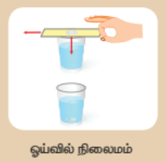

ஓய்வில் நிறைமை: இச்செயல்பாட்டில் கார்டு அட்டை நகர்ந்தாலும், நாணயம் அதன் கொண்டிருக்கும் ஓய்வின் நிலைப்புத்தன்மையை நீடிக்க முயற்சிக்கிறது. இந்த ஓய்விற்கான நிறைப்பண்பினால், அட்டை நகர்ந்தவுடன் புவி ஈர்ப்பு விசையினால் நாணயம் குவளையில் விழுகிறது.

### 1.2.1 நிறைமையின் வகைகள்

- **ஓய்வில் நிறைமை:** நிலையாக உள்ள ஒவ்வொரு பொருளும் தமது ஓய்வு நிறையை எதிர்க்கும் பண்பு ஓய்வில் நிறைமை எனப்படும்.
- **இயக்கத்தில் நிறைமை:** இயக்க நிலையில் உள்ள பொருள், தமது இயக்க நிறையை எதிர்க்கும் பண்பு இயக்கத்தில் நிறைமை எனப்படும்.
- **திசையில் நிறைமை:** உள்ள பொருள், இயங்கும் திசையிலிருந்து மாறாது, திசை மாற்றத்தினை எதிர்க்கும் பண்பு திசையில் நிறைமை எனப்படும்.

### 1.2.2 நிறைமையின் எடுத்துக்காட்டுகள்

- நீளம் தாண்டுதல் செய்பவர்கள் நீண்ட தூரம் தாண்டுவதற்காக, தாம் தாண்டும் முன் சிறிது தூரம் ஓடுவதற்கு காரணம் இயக்கத்திற்கான நிறைமை ஆகும்.
- ஓடும் மகிழுந்து வளைபவதில் கேட்கும்போது பயணியர், ஒரு பக்கமாக சாய்கிறார்கள் காரணம் திசைக்கான நிறைமை ஆகும்.
- கிளைகளை உலுக்கிய பின் மரத்திலிருந்து கீழே விழும் இலைகள், பழுத்த பின் விழும் பழங்கள் இவையாவும் ஓய்விற்கான நிறைமைக்கு எடுத்துக்காட்டுகள் ஆகும்.

---

## 1.3 செங்குத்தான உந்தம் 

விசையின் தாக்கம் அதிகமாகும். விசையின் விளைவானது திசைவேகத்தையும், நிறையினையும் சார்ந்து அளக்கிறது. ஒரு பொருள் மீது செயல்படும் விசையின் தாக்கத்தின் செருகுவிசையின் மூலம் அளவிடலாம்.

திசைவேகத்தின் பெருக்கற்பலன் உந்தம் எனப்படும். இதன் திசையானது பொருளின் திசைவேக திசையை அளிக்கும். இது ஒரு கால்வாய் அளவாகும்.

**குறியீடு:**
- p = உந்தம் 
- m = நிறை 
- v = திசைவேகம் 

**சூத்திரம்:**

(p = mv)


விசையின் எண்மதிப்பானது உந்தத்தால் அளவிடப்படுகிறது. இதன் SI அலகு கி.கி.மீ/வி (kg·m/s), CGS அலகு கி.கி.மீ/வி (g·cm/s) ஆகும்.

---

## 1.4 நியூட்டனின் இயக்கவிதிகள்

### 1.4.1 முதல் விதி 

வெளிப்படாதவரை, தமது ஓய்வு நிலையை அல்லது சீராக இயங்கிக்கொண்டிருக்கும் செங்குத்தான நிலையைக் கொண்டிருக்கும். இவ்விதி விசையினை வரையறுக்கிறது. அது மட்டுமின்றி, பொருட்களின் நிறையையும் விளக்குகிறது.

### 1.4.2 இரண்டாம் விதி 

விசை என்பது 'இழுத்தல்' அல்லது 'தள்ளுதல்' என்பதைச் செயல்வடிவம் ஆகும். இதை கீழ்கண்டவாறு விளக்கலாம்:

1. ஓய்வில் இருக்கும் பொருளை இயக்க முயற்சிப்பதற்கான செயல்.
2. இயங்கிக்கொண்டிருக்கும் பொருளை நிறுத்த அல்லது நிறுத்த முயற்சிப்பதற்கான செயல்.
3. இயங்கிக்கொண்டிருக்கும் பொருளின் திசையினை மாற்ற முயற்சிக்கின்ற செயல் ஆகும்.

### 1.4.3 மூன்றாம் விதி 

கீழ்கண்டவாறு வரையறுக்கலாம்:

**சமன் விசைகள்:** இரண்டிற்கும் சமப்பட்டேமல்லாத அல்லது சமமற்ற விசைகள், ஒரே திசையில் ஒரு பொருள் மீது இணையாக செயல்படும்போது அளவு ஒத்த இணைவிசைகள் எனப்படுகின்றன.

**மாறுபட்ட இணைவிசைகள்:** இரண்டு அல்லது இரண்டிற்கும் சமப்பட்டேமல்லாத அல்லது சமமற்ற விசைகள், எதிர் எதிர்திசையில் ஒரு பொருள் மீது இணையாக செயல்படும்போது அளவு மாறுபட்ட இணைவிசைகள் எனப்படுகின்றன.

### 1.4.4 கூட்டு விசை 

குறிப்பிட்ட திசையில் செயல்படும் அல்லது எதிர் திசையில் செயல்படும் விசைகளின் கூட்டுத்தொகையால் ஏற்படும் விளைவு ஒரு தனித்த விசை 'கூட்டு பயன்விசை' எனப்படுகிறது.

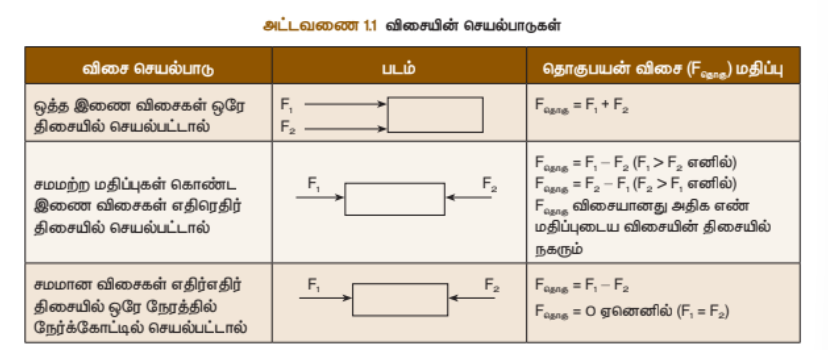

### 1.4.5 திருப்புத்திரன் 

கதவுகளில் கைப்பிடி எந்த இடத்தில் கொண்டுள்ளது? மற்ற இடத்திலுள்ளவைகள் அல்லாமல் ஏன் எப்போதும் கதவு விளிம்பருகில் அளவுகள் கொண்டுள்ளன? கதவின், விளிம்புகளில் பிடித்து இழுப்பது அல்லது தள்ளுவது எளிதானதா?

**விளிம்புகளில் கேலுத்துவது எளிதானதாகும்.** கதவின் இணைப்பு அச்சிலிருந்து விளிம்பறானது குறிப்பிட்ட தூரத்தில் உள்ளது. எனவே அங்கு செயல்படும் விசை அதிக சுழல் விளைவினை ஏற்படுத்துகிறது. கதவில் உள்ள நிலையான இணைப்பு அச்சு, 'சுழல் அச்சு' (Axis of rotation) எனப்படும்.

தண்டறானது நிலைப்புள்ளியை அளவயமாகக் கொண்டு சுழலும். இப்புள்ளி "சுழற்புள்ளி" (Point of rotation) எனப்படும்.

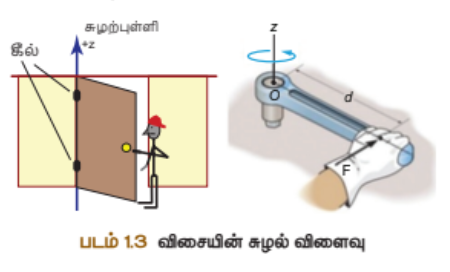

### 1.4.6 திருப்புத்திரனின் வரையறை

அச்சில் ஏற்படும் விளைவினை அதன் திருப்புத்திரன் மதிப்பின் மூலம் அளவிடலாம்.

**திருப்புத்திரன் (τ):** விசையின் எண்மதிப்பு F-ற்கும், நிலையான புள்ளி மற்றும் விசை செயல்படும் அச்சிற்கும் இடையே உள்ள கோணுத்துக்கோட்டுத் தூரம் d க்கும், உள்ள பெருக்கற்பலனாக அளவிடப்படுகிறது.


(\tau = F \times d)


திசையானது விசை செயல்படும் அச்சின் திசை மற்றும் தூரத்தின் தளத்திற்கு, கோணுத்திசையில் இருக்கும். இதன் SI அலகு நியூட்டன் மீட்டர் (N·m) ஆகும்.

**இரட்டை :** இரு சமமற்ற இணைவிசைகள் ஒரே சமயத்தில் ஒரு பொருளின் இரு புள்ளிகளின் மீது எதிர் எதிர்திசையில் செயல்படும்போது, அளவு 'இரட்டை விசைகள்' அல்லது 'இரட்டை' எனப்படும். அளவு ஒரே செங்குத்தான செயல்படாது.

சுழியறாததால் இவை செங்குத்தான இயக்கத்தை ஏற்படுத்தாது. ஆனால் சுழல் விளைவினை ஏற்படுத்தும். இதை இரட்டைகளின் திருப்புத்திரன் எனப்படும்.

**திருகின் சுழற்சி:** பம்பரத்தின் சுழற்சி முதலானவை.

திரன் மதிப்புக்கொண்டு அளவிடப்படுகிறது. இம்மதிப்பு எக்கணமும் ஒரு விசையின் எண்மதிப்பும் மற்றும் இணைவிசைகளுக்கு இடையே உள்ள கோணுத்துக்கோட்டுத் தூரம், இவைகளின் பெருக்கற்பலனுக்கு சமமாகும்.

**இரட்டையின் திருப்புத்திரன் (M):**

(M = F \times S)


அலகு: நியூட்டன்·மீட்டர் ஆகும். விசையின் திருப்புத்திரன் ஒரு கால்வாய் அளவாகும். திருப்புத்திரனின் திசை, பொருட்களின் வலஞ்சுழியாக இருப்பின் எதிர்குறியாகவும், இடஞ்சுழியாக இருப்பின் நேர்குறியாகவும் கொள்ளப்படுவது வழக்கம்.

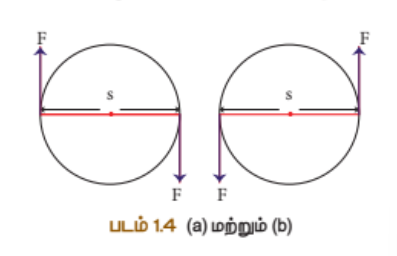

### 1.4.7 சில எடுத்துக்காட்டுகள்

1. **பற்சக்கரங்கள் :** வட்டப் பரப்பின் விளிம்புகளில் பல்சார்ந்தும் மற்றும் மூலம் திருப்பு விசையினை மாற்றி இயங்குகின்றன. சமனும் திசைகடத்துவதற்கும் பற்சக்கரங்கள் உதவுகின்றன.

2. **விளையாட்டு வீரர்கள்:** விளையாட்டு வீரர்கள். அதில் அமர்ந்துள்ள எடை அதிகமான ஒருவர், மற்றொருவரை எளிதில் தூக்குகிறார். எடை அதிகமான நபர்களின் ஆதாரப்புள்ளியின் செங்குத்து நகரும்போது, விசை செயல்படும் தூரம் குறைந்து, திருப்பு விசையின் செயல்பாடு குறைகிறது. இது எடை குறைந்த நபரானவர், எடை அதிகமான நபரைத் தூக்குவதற்கு உதவுகிறது.

3. **செங்குத்து சக்கரம் :** சக்கரங்களின் திசையினை, குறைந்த திருப்பவிசைக்கொண்டு எளிதில் மாற்றித் திருப்புச் சக்கரம் உதவுகிறது.

### 1.4.8 திருப்புத்திரன் தத்துவம் 

சமமதிப்புள்ள அல்லது சமமதிப்பற்ற விசைகள் இணையாகவோ அல்லது எதிர் இணையாகவோ செயல்படும்போது, அப்பொருளின் மீது செயல்படும் கூட்டுத்த வலஞ்சுழித் திருப்புத்திரனும், கூட்டுத்த இடஞ்சுழித் திருப்புத்திரனும் சமமாக இருக்கும்.

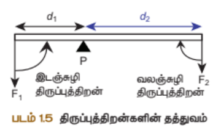

அல்லது சமநிலையில் உள்ளபோது ஒரு புள்ளியின் மீது செயல்படும் அளவு விசைகளின் திருப்புத்திரன்களின் கூடுதல் சுழிக்கு சமமாகும்.


(\tau = F_1 \times d_1 = F_2 \times d_2)


---

## 1.5 நியூட்டனின் இரண்டாம் இயக்கவிதி

பொருள் ஒன்றின் மீது செயல்படும் வினையானது அப்பொருளின் உந்தமாறுபாட்டு வீதத்திற்கு நேர்த்தகவில் அனுமதிக்கும். மேலும் இந்த உந்தமாறுபாட்டு வினையின் திசையிடையே அனுமதிக்கும். இவ்விதி விசையின் எண்மதிப்பை அளவிட உதவுகிறது. எனவே இதை 'விசையின் விதி' என்றும் அழைக்கலாம்.

**தருவிக்கலாம்:**

m என்ற நிறையுடைய பொருள் ஒன்று செங்குத்தான இயக்கத்தில் உள்ளதாகக் கொள்வோம். t என்கிற கால இடைவெளியில் F என்ற சமன் செய்யப்படாத புறவிசையின் தாக்கத்தால், அதன் வேகம் v என்ற மாற்றம் அடைகிறது.

- பொருளின் ஆரம்ப உந்தம்: 
P_i = mu

- இறுதி உந்தம்: 
P_f = mv

- உந்தமாற்றம்: 
\Delta p = P_f - P_i = mv - mu


நியூட்டனின் இரண்டாம் இயக்கவிதிப்படி விசை F ∝ உந்தமாற்றம்/காலம்


(F = K \frac{m(v-u)}{t})


K என்பது விகிதமாறிலி; K=1 (அளவு அலகுகளிலும்) எனவே:


(F = \frac{m(v-u)}{t})


அல்லது 
a = \frac{(v-u)}{t}
 எனவே:


(F = ma)


**விசை = நிறை × முடுக்கம்**

கொண்டு நகர்ந்த புறவிசை ஏதும் செலுத்தவில்லை. புறவிசைகளின் கூட்டு பயன்மதிப்பு சுழியாக இல்லையெனில் திசைவேக மதிப்பில் உறுதியாக மாற்றம் இருக்கும். உந்தமாற்றமானது விசையின் திசையை அளம்படும். இம்மாற்றமானது அதன் எண்மதிப்பைச் சார்ந்து, திசை சார்ந்து அல்லது இரண்டிலும் சமமாக ஏற்படும்.

சீரற்ற வட்ட இயக்கத்தில் உள்ள பொருளின் திசைவேகத்தின் எண்மதிப்பு மாறிலியாகும். இருப்பினும் பொருளானது வட்டப் பாதையின் ஒவ்வொரு புள்ளியிலும் தனது திசையினைக் கொண்டிருக்க மாற்றிக்கொள்வதால், திசைவேக மாற்றம் ஏற்படுகிறது. இது முடுக்கத்தின் சுழற்சி ஆரத்தில் ஏற்படுத்துகிறது. இம் முடுக்கம் நடுவிலக்க முடுக்கம் எனப்படும். இம் முடுக்கம் உருவாக காரணமான விசை நடுவிலக்கு விசை எனப்படுகிறது.

**விசையின் SI அலகு:** நியூட்டன் (N) ஆகும். அதன் CGS அலகு டைன் (dyne) ஆகும்.

**1 நியூட்டன் என்பதன் வரையறை:** 1 கிலோகிராம் நிறையுடைய பொருட்களானவை 1 மீ/வி² அளவிற்கு முடுக்குவிக்கச் செலுத்தப்படும் விசையின் அளவு 1 நியூட்டன் (1N) ஆகும்.


(1N = 1 \text{ kg·m/s}^2)


**1 டைன் என்பதன் வரையறை:** 1 கிராம் நிறையுடைய பொருட்களானவை 1 செ.மீ/வி² அளவிற்கு முடுக்குவிக்கச் செலுத்தப்படும் விசையின் அளவு 1 டைன் ஆகும்.


(1 \text{ டைன்} = 1 \text{ g·cm/s}^2)


---

## 1.6 கணத்தாக்க விசை 

காலும் போகாததும், திடீரென நிறுத்தப்படும்போது, நமது உடல் முன்சென்று சாய்கின்றது. ஓய்வு நிலையில் உள்ள பேருந்து, திடீரென நகரும்போது, உள்ளிருக்கும் நாம் பின்சென்று சாய்கின்றோம்.

திடீரென சுவற்றில் ஏற்படும்போது பேருந்து நின்றுவிட்டாலும், பயணியர் கொண்டிருக்கும் இயக்க நிலையைக் கொண்டிருக்க முயற்சிப்பதால் முன்சென்று விழுகின்றனர்.

**கணத்தாக்கம் (J):** செயல்படும் விசை, காலத்திற்கான விசை எனப்படும்.

F என்ற விசை t கால அளவில் ஒரு குறிப்பிட்ட காலம் செயல்படும்போது, ஏற்படும் கணத்தாக்கம் (J) மதிப்பு, விசை மற்றும் கால அளவின் பெருக்கற்பலனுக்கு சமமாக இருக்கும்.


(J = F \times t)


நியூட்டனின் இரண்டாவது இயக்கவிதிப்படி:


(J = \Delta p)


சமமான அளவாகும். இதன் அலகு கி.கி.மீ/வி அல்லது நியூட்டன் விநாடி ஆகும்.

**கணத்தாக்க விசை இருவழிகளில் செயல்படும்:**

1. பொருளின் மீது செயல்படும் கணத்தாக்க விசையின் மதிப்பு அதிகமாகும்.
2. பொருளின் சமனாக்க கால மதிப்பு அதிகமாகும்போது அப்பொருளின் மீது செயல்படும் கணத்தாக்க விசையின் மதிப்பு குறையும்.

**பயன்கள்:**

- பேருந்து கணத்தாக்க விசை அதிர்வுகளைக் குறைப்பதற்கு சுருள்வில் அமைப்புகளும் அதிர்வு உறிஞ்சிகளும் கொடுக்கப்பட்டுள்ளன.
- கிரிக்கெட் விளையாட்டில், சுவற்றில் வரும் பந்தினைப் பிடிக்க, விளையாட்டு வீரர்கள் தம்முடைய கைகளைப் பின்சென்று இழுத்து சமனாக்க காலத்தை அதிகரிக்கிறார்கள். இது அவரது கைகளில், பந்து ஏற்படுத்தும் கணத்தாக்க விசையின் அளவைக் குறைக்கிறது.

---

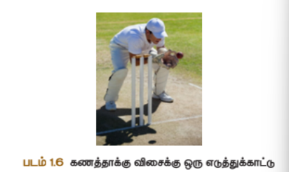

## 1.7 நியூட்டனின் மூன்றாம் விதி

ஒவ்வொரு செயலுக்கும் எதிர்ச்செயல் உண்டு. வினையும் எதிர்வினையும் எப்போதும் இரட்டைப் பொருட்களின் மீது செயல்படும்.

F_A விசையினைக் கொண்டு A எனில், 'B' ஆனது தனது எதிர்விசை F_Bயினை 'A' மீது கொள்ளும். இவற்றின் எண்மதிப்பு சமம். ஆனால் அளவு ஒன்றுக்கொன்று எதிர்திசையில் செயல்படும்.

**எடுத்துக்காட்டுகள்:**

- பறவைகள் தமது சிறகுகளின் விசை (விசை) மூலம் காற்றினைக் கீழே தள்ளுகின்றன. காற்றானது அவ்விசைக்கு சமமான விசையினை (எதிர்விசை) உருவாக்கி பறவையை மேல்நோக்கி உயர்த்துகிறது.
- நீச்சல் வீரர் ஒருவர் நீரினைக் கையால் பின்சென்று தள்ளுதலின் மூலம் விசையினை ஏற்படுத்துகிறார். நீரானது அந்நபரின் விசைக்கு சமமான எதிர்விசைக்கொண்டு முன்சென்று தள்ளுகிறது.
- துப்பாக்கிச் சுடுதலில் குண்டு, விசையுடன் முன்சென்று கொள்ள அதற்கு சமமான எதிர்விசையினால் குண்டுக்கட்டைப் பின்சென்று நகர்கிறது.

---

## 1.8 செங்குத்தான உந்தம் அழிவின்மை விதி

வெளியில் ஒரு பொருள் அல்லது ஒரு அனுமதியின் செல்வாக்கில் செயல்படும் செங்குத்தான உந்தம் மாறாமல் இருக்கும்.

**அழிவின்மை விதியின் கீழ்கண்ட ஒரு எடுத்துக்காட்டின் மூலம் நிரூபிக்கலாம்:**

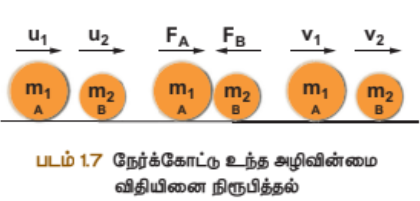

பொருள் A மற்றும் B இரண்டும் செங்குத்தான வழியில் பயணிப்பதாகக் கொள்வோம். u₁ மற்றும் u₂ என்பவை அவற்றின் ஆரம்ப திசைவேகங்களாகக் கொள்வோம். பொருள் A இனது, B ஐ விட அதிக திசைவேகத்தில் கொள்வதாகக் கருதுவோம் (u₁ &gt; u₂). t என்கிற கால இடைவெளியில் பொருள் A இனது, B மீது சமனாக்கம் ஏற்படுத்துகிறது.

சமனாக்கத்திற்குப் பிறகு அப்பொருட்கள் அதே செங்குத்தான வழியில் v₁ மற்றும் v₂ திசைவேகத்தில் பயணிப்பதாகக் கொள்வோம்.

நியூட்டனின் இரண்டாம் விதிப்படி:

(F_A = m_1(v_1 - u_1)/t)


நியூட்டனின் மூன்றாம் விதிப்படி A இன் மீது செயல்படும் விசையானது B இன் மீது செயல்படும் எதிர்விசைக்கு சமம்:


(F_A = -F_B)



(m_1(v_1 - u_1)/t = -m_2(v_2 - u_2)/t)



(m_1v_1 + m_2v_2 = m_1u_1 + m_2u_2)


வெளிவிசையின் தாக்கம் எதுவும் இல்லாதபோது, சமனாக்கத்திற்குப் பின் உள்ள கூட்டுத்த உந்தமதிப்பு, சமனாக்கத்திற்கு முன் உள்ள கூட்டுத்த உந்தமதிப்பிற்கு சமம் என்பதைக் காட்டுகிறது. இது பொருளின் மீது செயல்படும் கூட்டுத்த உந்தம் ஒரு மாறிலி என்ற செங்குத்தான உந்தம் அழிவின்மை விதியினை நிரூபிக்கிறது.

---

## 1.9 ராக்கெட் ஏவுதல் 

செங்குத்தான உந்தம் மற்றும் செங்குத்தான உந்தம் அழிவின்மை விதி, இரண்டும் பயன்படுகின்றன. ராக்கெட்டுகளில் உந்துகலன் (propellant tank) எரிப்பொருட்கள் (திரவ அல்லது திட) நிரப்பப்படுகின்றன. அவை எரியூட்டப்பட்டதும், கவிப்பவாயுக்கள் ராக்கெட்டின் வாய்ப் பகுதியிலிருந்து அதிக திசைவேகத்தில் வெளியேறுகின்றன. அவை மிக அதிக உந்தத்தினை உருவாக்குகின்றன. இந்த உந்தத்தினை சமன்படுத்த, அதற்கு சமமான எதிருந்து விசை எரிகூடத்தில் (combustion chamber) உருவாகி, ராக்கெட் மிகுந்த வேகத்துடன் முன்சென்று பாய்கிறது.

ராக்கெட் உயரப் பயணிக்கும்போது அதில் உள்ள எரிப்பொருள் முழுவதும் எரியும்வரை அதன் நிறைப் படிப்படியாகக் குறைகிறது. உந்தம் அழிவின்மை விதியின்படி நிறைகுறையக் குறைய, அதன் திசைவேகம் படிப்படியாக அதிகரிக்கிறது. ஒரு குறிப்பிட்ட உயரத்தில் ராக்கெட்டானது புவியின் ஈர்ப்பு விசையினைத் தவிர்த்துவிடும் வகையில், அதன் திசைவேக மதிப்பு உச்சத்தை அடைகிறது. இது விடுபடு வேகம் (escape speed) எனப்படுகிறது.

---

## 1.10 பொது ஈர்ப்பியல் விதி 

### 1.10.1 விதியின் வரையறை

அனைத்துப் பொருட்களும் ஒரு குறிப்பிட்ட வினாடி மதிப்பில் ஈர்க்கின்றன. அவ்வினையானது அனைத்தின் நிறைகளின் வர்க்கற்பலனுக்கும், அனைத்தின் நடுவிலுள்ள தூரத்தின் இருமடிக்கு எதிர்விகிதத்திலும் இருக்கும். மேலும் இவ்வினை நிறைகளின் இணைப்புக்கோட்டின் வழியே செயல்படும்.

m₁ மற்றும் m₂ என்ற நிறையுடைய இரு பொருட்கள் r என்ற தூரத்தில் வைக்கப்பட்டுள்ளதாகக் கருதுவோம். இவற்றிற்கிடையே உள்ள ஈர்ப்பு விசை F ஆனது, பொது ஈர்ப்பியல் விதிப்படி:

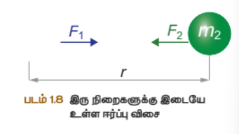


(F \propto \frac{m_1 \times m_2}{r^2})



(F = G\frac{m_1 m_2}{r^2})


G என்பது ஈர்ப்பியல் மாறிலி. இதன் மதிப்பு (SI அலகுகளில்) 6.674 × 10⁻¹¹ N·m²/kg²

### 1.10.2 புவி ஈர்ப்பு முடுக்கம்

ஈர்ப்பு விசையின் தாக்கத்தால், அதன் திசைவேகம் படிப்படியாகக் குறையும். ஒரு குறிப்பிட்ட உயரத்தில் அம்மதிப்பு முழுவதுமாக சுழியாகிறது. ஈர்ப்பு விசையினால் கீழே விழும்போது அதன் திசைவேகம் குறிப்பிட்ட மாற்றம் கொள்கிறது. இது அப்பொருளுக்கும் முடுக்கத்தினை ஏற்படுத்தும். இம் முடுக்கம் புவி ஈர்ப்பு விசையினால் ஏற்படுவதால் புவி ஈர்ப்பு முடுக்கம் எனப்படுகிறது.

**g இன் மதிப்பு:** 9.8 மீ/வி² ஆகும். இதன் பொருள் ஒரு பொருளானது, தரையின்றி கீழே விழும் பொருளின் திசைவேகம், ஒரு வினாடிக்கு 9.8 மீ/வி என்ற அளவில் மாற்றம் கொள்வது என்பதாகும். 'g' இன் மதிப்பு புவியில் அனைத்து இடங்களிலும் ஒரே மதிப்பாக இருக்காது.

### 1.10.3 'g' மற்றும் 'G' இவற்றிற்கு இடையே உள்ள தொடர்பு

m என்ற நிறையுள்ள பொருள் ஒன்று ஓய்வு நிலையில் புவிப்பரப்பின் மீது உள்ளது. பொருளின் மீது செயல்படும் இரு விசைகளை கீழ்கண்டவாறு கணக்கிடலாம். M என்பது புவியின் நிறையாகக் கொள்வோம். புவியின் நிறை புவியமையத்தில் குவிந்திருப்பதாக எடுத்துக்கொள்வோம். புவியின் ஆரம் R = 6378 கி.மீ (சராசரியாக = 6400 கி.மீ) ஆகும்.

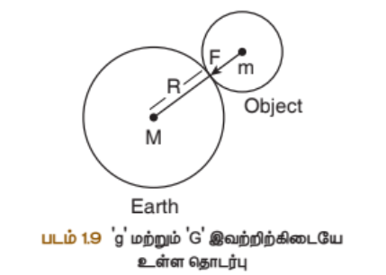

பொருளுக்கும் உள்ள ஈர்ப்பு விசை:

(F = \frac{GMm}{R^2})


மதிப்பு நியூட்டனின் இரண்டாம் விதிப்படி கணக்கிடலாம். இவ்விதிப்படி விசையானது பொருளின் நிறைக்கும், முடுக்கத்திற்கும் உள்ள பெருக்கற்பலனாகும்.

பொருளின் முடுக்கம், புவியின் ஈர்ப்பு முடுக்கத்திற்கு சமமாக இருப்பதால் (a = g):

(F = ma = mg)


இவை சமன்படுத்த:

(mg = \frac{GMm}{R^2})


எனவே புவி ஈர்ப்பு முடுக்கம்:

(g = \frac{GM}{R^2})


இச் சமன்பாடு 'g' மற்றும் 'G' இவற்றிற்கிடையே உள்ள தொடர்பினை அளிக்கிறது.

### 1.10.4 புவியின் நிறையின் கணக்கீடு

சமன்பாடு (1.14) இலிருந்து புவியின் நிறை:

(M = \frac{gR^2}{G})


புவியின் நிறை மதிப்பு M = 5.972 × 10²⁴ கி.கி எனக் கணக்கிடப்படுகிறது.

### 1.10.5 'g' இன் மாறுபாடு

**ஆரத்தைச் சார்ந்து:** (g ∝ 1/R²) புவியின் ஆரம் நடுக்கோட்டுப் பகுதியில் அதிகமாக உள்ளதால், ஈர்ப்பு முடுக்கத்தின் மதிப்பு குறைவாக இருக்கும். துருவப் பகுதியில் ஆர மதிப்பு குறைவாக உள்ளதால், ஈர்ப்பு முடுக்கம் அதிகமாக இருக்கும்.

**உயரத்தைச் சார்ந்து:** புவியின் தளப் பகுதியிலிருந்து உயரச் செல்லச் செல்ல புவி ஈர்ப்பு முடுக்கம் படிப்படியாகக் குறையும். அதனால் புவியின் அடி ஆழத்திற்குச் செல்லச் செல்ல புவி ஈர்ப்பு முடுக்கத்தின் மதிப்பு குறைகிறது. புவியின் மையத்தில் 'g' மதிப்பு சுழியாகும்.

---

## 1.11 நிறை மற்றும் எடை 

**நிறை:** பொருட்களின் நிறை என்பது அதில் அடங்கியுள்ள பொருளின் அளவாகும். இதன் அலகு கிலோகிராம் ஆகும்.

**எடை:** விசையின் மதிப்பு அப்பொருளின் எடை எனப்படுகிறது.


(W = mg)


புவியின் மையத்திற்குச் சென்றால், அதன் அலகு நியூட்டன் (N). எடையானது புவி ஈர்ப்பு முடுக்கத்தைச் சார்ந்தது.

**இடத்திற்கு இடம் மாறுபடுவதால், எடையின் மதிப்பும் இடத்திற்கு இடம் மாறுபடும்.** பொருட்களின் எடை துருவப் பகுதியில் அதிகமாகவும், நடுக்கோட்டுப் பகுதியில் குறைவாகவும் இருக்கும்.

நிலவில் ஈர்ப்பு முடுக்கத்தின் மதிப்பு 1.625 மீ/வி² ஆகும். இது புவியின் ஈர்ப்பு முடுக்கத்தில் 0.1654 மடங்கிற்கு சமமான அளவாகும். 60 கி.கி நிறையுள்ள ஒருவர் பூமியில் 588 N எடையுடன் (W = mg = 60 × 9.8 = 588 N) நிலவில் 97.5 N எடையுடன் (W = mg = 60 × 1.625 = 97.5 N) இருப்பார். ஆனால் அவரது நிறை மதிப்பு (60 kg) புவியிலும் நிலவிலும் மாறாதது இருக்கும்.

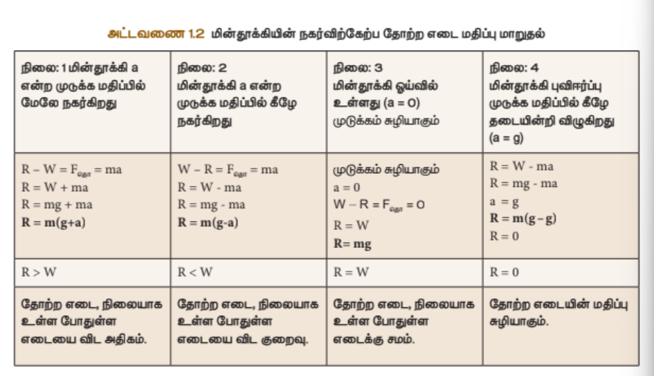

---

## 1.12 எடையின்மை 

உள்ளபோது உள்ள நமது உண்மையான எடை (actual weight), சமச் செங்குத்து கீழே நாம் நகரும்போது அச்சம மதிப்பில் இருக்காது. புவி ஈர்ப்பு விசை மட்டுமின்றி, இன்ன பிற விசைகளால் ஒரு பொருளின் எடையில் மாற்றம் ஏற்படும். இந்த எடை மாற்றம் எனப்படுகிறது.

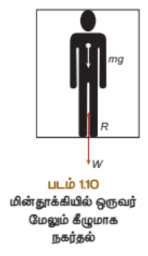

### 1.12.1 இயங்கும் மின்தூக்கியில் எடையின்மை

பூங்கா விளையாட்டு வசதிகளில் உள்ள பொழுது நமது எடை இழப்பது போன்ற உணர்வு ஏற்படுகிறது. இது சில விளையாட்டுகளில் மின்தூக்கியில் நாம் நகரும்போதும் ஏற்படும்.

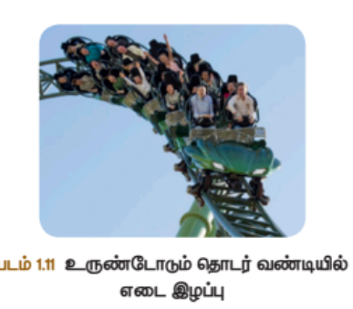

புவியின் ஈர்ப்பு முடுக்கத்திற்கு சமமாக உள்ளபோது (a = g) "தடையின்றி விழும் நிலை" (free fall) ஏற்படுகிறது. இந்நிலையில் பொருளின் எடை முற்றிலும் குறைந்து சுழி நிலைக்கு வருகிறது. (R = m(g - g) = 0) இது "எடையில்லா நிலை" (Weightlessness) என அழைக்கப்படுகிறது.

### 1.12.2 விண்வெளி வீரரின் எடையின்மை

புவியினைச் சுற்றி வரும் விண்கலத்தில் விண்வெளி வீரர், அங்கு புவி ஈர்ப்பு விசை இல்லாததாகச் சிலர் நினைக்கிறார்கள். இது தவறான கருத்து. விண்கலம் மிக அதிக சுற்றியக்க திசைவேகத்தில் நகர்ந்துகொண்டிருக்கிறது. அவர் அக்கலத்துடன் இணைந்து சம வேகத்தில் நகர்கிறார். அவரது முடுக்கம், விண்கல முடுக்கத்திற்கு சமமாக இருப்பதால், அவர் 'தடையின்றி விழும் நிலை'யில் (free fall) உள்ளார். அப்போது அவரது சம எடை மதிப்பு சுழியாகும். (R = 0) எனவே அவர் அக்கலத்துடன் எடையற்ற நிலையில் மிதக்கிறார்.

### 1.12.3 நியூட்டனின் ஈர்ப்பியல் விதியின் பயன்பாடுகள்

1. அண்டத்தில் உள்ள விண்பொருட்களின் பரிமாணங்களை அளவிடுவதற்கு பொது ஈர்ப்பியல் விதி பயன்படுகிறது. புவியின் நிறை, ஆரம், புவி ஈர்ப்பு முடுக்கம் முதலியனவற்றைத் துல்லியமாக கணக்கிட இவ்விதி உதவுகிறது.
2. புதிய விண்மீன்கள் மற்றும் கோள்களைக் கண்டுபிடிக்க இவ்விதி உதவுகிறது.
3. சில சூரியன்களில் விண்மீன்களின் சீரற்ற நகர்வு (Wobble) அருகில் உள்ள கோள்களின் இயக்கத்தைப் பற்றிக் காட்டும். அந்சூரியன்கள் அவ்விண்மீன்களின் நிறையினை அளவிட இவ்விதி பயன்படுகிறது.

4. தாவரங்களின் சுவரமைப்பு வளர்ச்சி புவியின் ஈர்ப்பு விசை சார்ந்து அமைவது 'புவித் திசையேற்பியக்கம்' எனப்படுகிறது. இந்நிகழ்வை விளக்க இவ்விதி பயன்படுகிறது.
5. விண்பொருட்களின் பாதையினை வரையறுக்க இவ்விதி பயன்படுகிறது.

---

## நினைவில் கொள்க 

- **இயந்திரவியல்:** விசையின் செயல்பாட்டால் பொருள் மீது ஏற்படும் விளைவுகளைப் பற்றி பயிலும் பாடம் இயந்திரவியல் ஆகும். இது இரண்டு பிரிவுகளாகப் பிரிக்கப்பட்டுள்ளது. அளவியல் மற்றும் இயங்கியல் ஆகும்.
- **இயங்கியல்** இரண்டு பிரிவுகளாகப் பிரிக்கப்பட்டுள்ளது. அளவு இயக்கவியல் மற்றும் இயக்கவிசையியல் ஆகும்.
- தன் மீது சமமான புற விசை ஏதும் செயல்படாதவரை பொருளானது தமது ஓய்வு நிலையை அல்லது செங்குத்தான இயக்க நிலையைக் கொண்டிருக்கும். இப் பண்பினை நிறைமை எனப்படும். இது ஓய்வில் நிறைமை, இயக்கத்தில் நிறைமை, திசையில் நிறைமை என மூன்று வகைகளாகப் பிரிக்கப்பட்டுள்ளது.
- நகரும் பொருளின் நிறை மற்றும் திசைவேகத்தின் பெருக்கற்பலனுக்கு சமமான அளவு உந்தம் எனப்படும். இது விசையின் திசையைச் செலுத்தும்.
- ஒரு பொருள் மீது பல்வேறு விசைகள் செயல்படும்போது, அளவுகளின் கூட்டுத்த விளைவு ஒரு தனித்த விசை மூலம் அளவிடலாம். இது 'கூட்டு பயன்விசை' எனப்படுகிறது.
- இரட்டையின் திருப்புத்திரன் மதிப்பு ஏக்கணமும் ஒரு விசையின் எண்மதிப்பும் மற்றும் இணை விசைகளுக்கு இடையே உள்ள கோணுத்துக்கோட்டுத் தூரம், இவைகளின் பெருக்கற்பலன் மதிப்பிற்கு சமம்.
- திருப்புத்திரனின் திசை, பொருட்களில் வலஞ்சுழியாக இருப்பின் எதிர்குறியாகவும், இடஞ்சுழியாக இருப்பின் நேர்குறியாகவும் கொள்ளப்படுவது வழக்கம்.
- விசையின் அலகு SI முறையில் நியூட்டன் (N) மற்றும் CGS அலகு முறையில் டைன் (dyne) ஆகும்.
- கணத்தாக்க மதிப்பானது (J) விசை (F) மற்றும் கால அளவின் (t) பெருக்கற்பலனுக்கு சமமாக இருக்கும்.
- புவி ஈர்ப்பு முடுக்கம் g இன் மதிப்பு நடுக்கோட்டுப் பகுதியில் குறைவாகவும் துருவப் பகுதியில் அதிகமாகவும் இருக்கும்.
- ஒரு பொருள் மீது செயல்படும் புவி ஈர்ப்பு விசையின் மதிப்பு அப்பொருளின் எடை எனப்படுகிறது. இதன் அலகு நியூட்டன் அல்லது கிலோகிராம் விசை (kgf).
- புவி ஈர்ப்பு விசை மட்டுமின்றி, இன்ன பிற விசைகளால் ஒரு பொருளின் எடையில் மாற்றம் ஏற்படும். இந்த எடை மாற்றம் சம எடை எனப்படுகிறது.
- சமனிலிருந்து விழும் பொருளின் முடுக்கம், புவியின் ஈர்ப்பு முடுக்கத்திற்கு சமமாக உள்ளபோது எடை முற்றிலும் குறைந்து சுழி நிலைக்கு வருகிறது. இது "எடையில்லா நிலை" என அழைக்கப்படுகிறது.

---

## பயிற்சிக் கணக்குகள்

### எடுத்துக்காட்டு 1
செங்குத்தான உந்தம் 2.5 கி.கி.மீ/வி எனில் அதன் திசைவேகத்தைக் கணக்கிடுக.

**தரவுகள்:**
- நிறை (m) = 5 கி.கி
- செங்குத்தான உந்தம் (p) = 2.5 கி.கி.மீ/வி

**சூத்திரம்:**
செங்குத்தான உந்தம் (p) = நிறை (m) × திசைவேகம் (v)

**திசைவேகம்** = செங்குத்தான உந்தம் / நிறை = 2.5/5 = 0.5 மீ/வி

---

### எடுத்துக்காட்டு 2
கீல் (keel) முளையிலிருந்து 90 செ.மீ தூரத்தில் கைப்பிடிக்கொண்டு கதவறானது 40 N விசைக்கொண்டு திறக்கப்படுகிறது. கதவின் கீல் முளைப்பகுதியில் ஏற்படும் திருப்புத்திரன் மதிப்பினைக் கணக்கிடு.

**தீர்வு:**
- அமைந்துள்ள தூரம் = d = 90 செ.மீ = 0.9 மீ
- விசை செயல்படும் தூரம் d
- திருப்புத்திரன் = 40 × 0.9 = 36 நியூட்டன்-மீட்டர்

---

### எடுத்துக்காட்டு 3
எந்த உயரத்தில் புவியின் முடுக்கமானது, புவிசமப் பரப்பு ஈர்ப்பு முடுக்கத்தின் 1/4 மடங்காக அளமயும்?

**தீர்வு:**
புவிமையத்திலிருந்து கணக்கிடுகிறேன்:
- கார்ட்டியின் உயரம் R' = R + h
- அவ்உயரத்தில் புவி ஈர்ப்பு முடுக்கம் g' = GM/(R')²
- புவிப்பரப்பில் ஈர்ப்பு முடுக்கம் g = GM/(R)²


(\frac{g'}{g} = \frac{R^2}{(R')^2} = \frac{R^2}{(R+h)^2} = \frac{1}{4})



(\frac{1}{4} = \left(\frac{R}{R+h}\right)^2)



(\frac{1}{2} = \frac{R}{R+h})



(R + h = 2R)



(h = R)


புவியின் மையத்திலிருந்து, புவி ஆரத்தின் இருமடங்கு தூரத்தில், ஈர்ப்பு முடுக்க மதிப்பு புவிப்பரப்பின் முடுக்கத்தின் போல் 1/4 மடங்காக அளமயும்.

---

## மதிப்பீட்டு வினாக்கள்

### I. ஒரு வார்த்தை விடையளி

1. இடப்பெயர்ச்சி நிகழ்வதற்கு ____________
2. நகர்ந்துகொண்டு உள்ள ஊர்தியில் திடீரென தடை ஏற்படும்போது, பயணியர் முன்சென்று சாய்கின்றனர். இந்நிகழ்வு ____________ மூலம்
3. மரபுரீதியாக வலஞ்சுழித் திருப்புத்திரன் ____________ குறியிலும் இடஞ்சுழித் திருப்புத்திரன் ____________ குறியிலும் குறிக்கப்படுகிறது.
4. மகிழுந்தின் செங்குத்து சுழற்சி சுவற்றினை மாற்ற ____________ பயன்படுகிறது.
5. 100 கி.கி நிறையுடைய மனிதனின் எடை புவிப்பரப்பில் ____________ அளவாக

### II. பொருத்துக

| பகுதி I | பகுதி II |
|---------|---------|
| அ) நியூட்டனின் முதல் விதி | - ராக்கெட் ஏவுதலில் பயன்படுகிறது |
| ஆ) நியூட்டனின் இரண்டாம் விதி | - பொருட்களின் சம நிறை |
| இ) நியூட்டனின் மூன்றாம் விதி | - விசையின் விதி |
| ஈ) செங்குத்தான உந்தம் அழிவின்மை விதி | - பறவைப் பறத்தலில் பயன்படுகிறது |

### III. சரியா? தவறா? (தவறு எனில் கூற்றினை திருத்துக)

1. துகள் அளவில் ஏற்படும் செங்குத்தான உந்தம் எப்போதும் மாறிலியாகும்.
2. பொருட்களானவற்றின் சம எடை எப்போதும் அதன் உண்மையான எடைக்கு சமமாக இருக்கும்.
3. பொருட்களின் எடை நடுக்கோட்டுப் பகுதியில் பெருமமாகவும், துருவப் பகுதியில் குறைவாகவும் இருக்கும்.
4. திருகுமுள் (Screw) ஒன்றின் குறைந்த கைப்பிடி உள்ள திருக்கட்டை (spanner) கொண்டு திருகுதல், நீளமான கைப்பிடிக்கொண்டு திருக்கட்டையின் திருகுதலை விட எளிதானதாகும்.
5. புவியினைச் சுற்றி வரும் விண்கலத்தில் உள்ள விண்வெளி வீரர், புவி ஈர்ப்பு விசை இல்லாததால் எடையிழப்பு

### IV. கூற்று மற்றும் காரணம்

1. **கூற்று:** வலஞ்சுழித் திருப்புத்திரன்களின் கூட்டுத்த மதிப்பு, இடஞ்சுழித் திருப்புத்திரன்களின் கூட்டுத்த மதிப்பிற்கு சமமானதாக இருக்கும்.
   **காரணம்:** உந்தம் அழிவின்மை விதி என்பது புறவிசை மதிப்பு சுழியாக உள்ளபோது மட்டுமே சமநிலையானதாக இருக்கும்.

2. **கூற்று:** 'g' இன் மதிப்பு புவிப்பரப்பிலிருந்து உயரச் செல்லவும் புவிப்பரப்பிற்குக் கீழே செல்லவும் குறையும்.
   **காரணம்:** 'g' மதிப்பானது புவிப்பரப்பில் பொருளின் நிறையினைச் சார்ந்து

### V. சுருக்கமாக விடையளி

1. நிறைமை என்பது யாது? அதன் வகைகள் யாவை?
2. செயல்படும் திசையைச் சார்ந்து விசையினை எவ்வாறு பிரிக்கலாம்?
3. 5N மற்றும் 15N விசை மதிப்புடைய இரு விசைகள் எதிர் எதிர்திசையில் ஒரே சமயத்தில் பொருள் மீது செயல்படுகின்றன. இவைகளின் கூட்டு பயன்விசை மதிப்பு யாது? எத்திசையில் அது செயல்படும்?
4. நிறை – எடை, இவற்றை வேறுபடுத்துக.
5. இரட்டையின் திருப்புத்திரன் வரையறு.
6. திருப்புத்திரன் தத்துவம் வரையறு
7. நியூட்டனின் இரண்டாம் விதியினைக் கூறு.
8. குறைந்த வகையான திருகுமுள்களை (nuts) சுழற்றி இறுக்கம் செய்ய நீளமான கைப்பிடிகள் கொண்ட திருக்கட்டை (spanner) பயன்படுத்தப்படுவது ஏன்?
9. கிரிக்கெட் விளையாட்டில் சமனிலிருந்து விழும் பந்தினைப் பிடிக்கும்போது, விளையாட்டு வீரர் தம்முடைய கைகளைப் பின்சென்று இழுப்பது ஏன்?
10. விண்கலத்தில் உள்ள விண்வெளி வீரர் எவ்வாறு மிதக்கிறார்?

### VI. கணக்குகள்

1. இரு பொருட்களின் நிறை விகிதம் 3:4. அதிக நிறையுடைய பொருள் மீது விசையறானது 12 மீ/வி² மதிப்பில் முடுக்குவித்தால், அச்சு விசைக்கொண்டு மற்றொரு பொருள் முடுக்குவிக்கச் செலுத்தப்படும் முடுக்கம் யாது?
2. 1 கி.கி நிறையுடைய பந்து ஒன்று 10 மீ/வி திசைவேகத்தில் தரையின் மீது விழுகிறது. சமனாக்கத்திற்குப் பின் ஆற்றல் மாற்றமின்றி, அச்சு வேகத்தில் மீண்டும் உயரச் செல்கிறது எனில் அப்பந்தில் ஏற்படும் உந்த மாற்றத்தினைக் கணக்கிடுக.
3. இயந்திரப் பணியாளர் ஒருவர் 40 cm கைப்பிடி நீளம் உள்ள திருக்கட்டைக்கொண்டு 140 N விசை மூலம் திருகுமுள் ஒன்றைத் திறக்கிறார். 40 N விசைக்கொண்டு அச்சு திருகுமுளைத் திறக்க எவ்வளவு நீள கைப்பிடிக்கொண்டு திருக்கட்டை செலுத்த வேண்டும்?
4. இரு கோள்களின் நிறை விகிதம் முறையே 2:5, அவைகளின் ஆர விகிதம் முறையே 4:7 எனில், அவற்றின் ஈர்ப்பு முடுக்கம் விகிதத்தினைக் கணக்கிடுக.

### VII. விரிவாக விடையளி

1. நிறைமையின் பல்வேறு வகைகளை எடுத்துக்காட்டுகளுடன் விளக்குக.
2. நியூட்டனின் இயக்கத்திற்கான விதிகளை விளக்குக.
3. விசையின் சமன்பாடுடன் நியூட்டனின் இரண்டாம் விதி மூலம் தருவிக்க.
4. உந்தம் மாற்றாக்கச் செயல்பாடுடன் கூறி அதனைக் கரைப்பிக்க.
5. ராக்கெட் ஏவுதலை விளக்குக.
6. பொது ஈர்ப்பியல் விதியினைக் கூறுக. அதன் கணிதவியல் சூத்திரத்தைத் தருவிக்க.
7. பொது ஈர்ப்பியல் விதியின் பயன்பாடுகளைக் கூறுக.

### VIII. உயர்சிந்தனைக்கான வினாக்கள்

1. 8 கி.கி மற்றும் 2 கி.கி நிறையுடைய இரு பொருட்களவை வழுவான உள்ள பரப்பில் ஒன்றாகடைந்து கொண்டிருக்கின்றன. அவை 15 N அளவிற்கான கிளைமடை விசைக்கொண்டு நகர்த்தப்படுகின்றன எனில், 2 கி.கி நிறையுடைய பொருள் பெறும் விசையினைக் கணக்கிடுக.
2. கன உந்து (Heavy vehicle) ஒன்றும் இரு சக்கர வாகனம் ஒன்றும் சம இயக்க ஆற்றுடன் பயணிக்கின்றன. கன உந்தின் நிறையானது இரு சக்கர வாகன நிறையினை விட ஐந்து மடங்கு அதிகம் எனில், இவைகளுக்கிடையே உள்ள உந்த வீதத்தினைக் கணக்கிடுக.
3. பயணத்தின் போது தலைக்கவசம் அணிவதும் இரு கால்களைப் பிரித்து அணிவதும் நமக்குப் பாதுகாப்பான பயணத்தினை அளிக்கும். இக்கூற்றினை நியூட்டனின் இயக்கவிதிகள் கொண்டு நிரூபிப்படுத்துக.

---

## பயிற்சி நூல்கள்

1. Concept of physics - H.C. Verma
2. Interactive physics (Newton's law) - MTG

## இணையவளங்கள்

- https://www.grc.nasa.gov
- https://www.physicsclassroom.com
- https://www.britannica.com/science/Newtons-law-of-gravitation