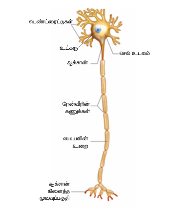
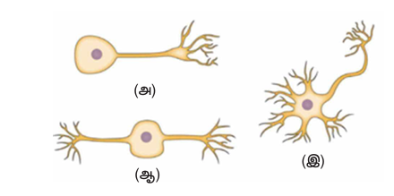
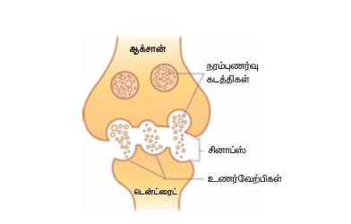
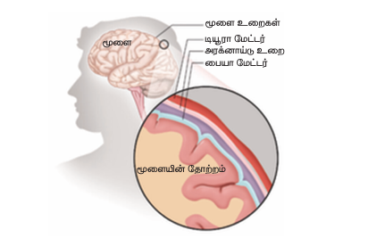
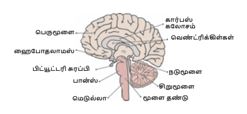
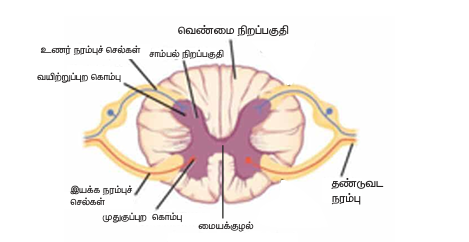
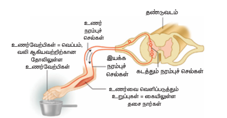
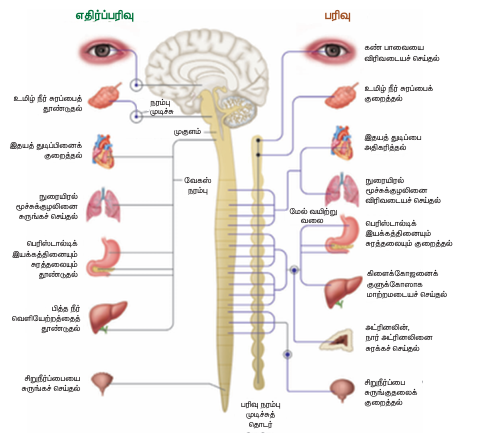

# நரம்பு மண்டலம் 

## அறிமுகம் 

கற்றல் குறிக்கோள்கள் (Learning Objectives):
- நரம்பு மண்டலத்தின் உட்கூறுகளை அறிந்து கொள்ளுதல்
- நரம்புத் தூண்டல்கள் எவ்வாறு கடத்தப்படுகின்றன என அறிந்து கொள்ளுதல்
- மனித நரம்பு மண்டலத்தின் பல்வேறு பிரிவுகளை அறிந்து கொள்ளுதல்
- மனித மூளையின் பல்வேறு பகுதிகளையும் அவற்றின் பணிகளையும் அறிந்து கொள்ளுதல்
- அனிச்சை செயலின் முக்கியத்துவம் மற்றும் செயல்படும் பாணியினை அறிந்து கொள்ளுதல்

தெயல்படமவண்டியது அவசியமாகும். தவவமவறவி்ேதானைதூண்டல்்களுக்குரியதபதாருத்ேதானதுலங்்கணலதவளிப்படுத்,பல்மவறுஉறுப்பு்களுமமுணையதா்க,வரிணெக்கிரேேதா்க,சிைப்பதா்கதெயல்படுவதஅவசியேதாகும்.இவவதாறுதெயல்படுவண்"ஒருஙகினைவு"எனகிமைதாம்.ேனி்னஉட்படஅணனைததுவிலங்கினைங்்களிலும்அ்னஉயிரதெயலியல்தெயல்பதாடு்க்ளதானைதன்நினைக்காத்தலஎனபண்பரதாேரிக்்க,அணனைததுதெல்்களும்,உறுப்பு்களும்ஒருங்கிணைந்துபணியதாறறு்லஅவசியேதாகிைது.இந்்அலகில்ேனி்ன \text{o n n p i o}விலங்கு்களினதெயல்பதாட்டிணனைஒழுங்குபடுததுவதிலமுக்கியபங்குவகிக்கும்நரம்புேண்டலம்ேறறும்அதஎவவதாறுஉடலினஅணனைததுதெயல்்கண்ளயும்கட்டுப்படுததுகிைதுஎனப்ணனைக்்கதாண்மபதாம்.

எதிர்வினையாக தவளிப்படுத்துவது அவற்றின் முக்கியமான பண்பாகும். இங்கு தூண்டல் எனக் குறிப்பிடப்படுவது புறச்சூழ்நிலையில் ஏற்படும் மேற்கொள்ளப்படுவதாகும். இவ்வகையில் உயிரினங்கள் உடலில் உயிர்வு உறுப்புகள் உள்ளன. அதாவது குறிப்பிட்ட தூண்டல்களின் காரணமாக உயிரினங்கள் தவளிப்படுத்தும் குறிப்பிட்ட பதில் வினையூக்கல் எனப்படும். உயிருள்ள அனைத்து உயிரினங்களும் கீழ்க்கண்ட தூண்டல்களான ஒளி, வெப்பம், குளிர், ஒலி, நெருப்பு, சுவை, தொடல், அழுத்தம், வலி ஆகியவற்றுக்கு எதிரான துலங்கல்களை தவளிப்படுத்துகின்றன.

எடுத்துக்காட்டாக ஒரு சூடான பொருளைத் தொடும்போது, நம் கையை உடனடியாக விலக்கிக் கொள்வது அல்லது பிரகாசமான ஒளி பட்டவுடன் நம் கண்கள் மூடிக் கொள்வது போன்றவை. இதில் வெப்பம் அல்லது பிரகாசமான ஒளி என்பது உடலில் மேற்கொள்ளப்படும் தூண்டல் ஆகும். உடல் இதற்குரிய உடனடியான துலங்கலை தவளிப்படுத்தும்.

---

## 15.1 நரம்பு மண்டலத்தின் உட்கூறுகள் 

ஆனைது.இவ்வமூன்று வகையான உட்கூறுகள் கொண்டுள்ளது. அவையாவன: நியூரான்கள், நியூரோக்ளியா அல்லது நரம்பு இழைகள்.

அல்லது நரம்பு செல்கள் எனப்படும் நரம்பு மண்டலத்தின் அணுப்புரிய மற்றும் செயல்ரீதியிலான அடிப்படை அலகுகள் ஆகும். மனித உடலின் மிக நீளமான செல் நரம்பு செல் ஆகும். இவ்வசுரேகை 100μm வரை நீளமுடையன. இந்த செல்கள் ஒவ்வொரு தூண்டலுக்குரிய பொருத்தமான துலங்கலை தவளிப்படுத்துவதற்கு உடலின் பல்வேறு வி்ேதானை தூண்டல்களை அறிவுறுத்தும், உயிர்வும், கடத்துவதற்கும் ஏற்ப சிறப்புத் திறன் கொண்டதாகும். நரம்பு செல்களில் கவல்கள் உடலின் ஒரு பகுதியிலிருந்து மற்றொரு பகுதிக்கும் இத்தூண்டல்களை கடத்தப்படுகின்றன.

**(ii) நியூரோக்ளியா:** நியூரோக்ளியா எனப்படும் க்ளியல் செல்கள் என்றும் அழைக்கப்படுகின்றன. இவ்வநரம்பு மண்டலத்தின் துணைச் செல்கள் ஆக செயல்படுகின்றன.

இவ்வநியூரான்கள் மட்டுமே நரம்புத் தூண்டல்களின் உருவாக்கத்தில் அல்லது கடத்துவதில் மட்டும் தேர்ச்சியாக செயல்படும் பகுதி நரம்பு இழைகள் ஆகும். பல நரம்பு இழைகள் ஒன்றிணைந்து கற்றையாகவேற்று நரம்புகள் ஆக செயல்படுகின்றன.

### 15.1.1 நியூரானின் அமைப்பு 

பகுதிகள் கொண்டுள்ளது. (i) டென்ட்ரைட் (ii) தடண்டிரைட்டுகள் மற்றும் (iii) ஆக்சான்

**[Figure 15.1: நியூரானின் அமைப்பு]**

(i) **டென்ட்ரைட்** என்பது செல் உடலம் அல்லது பெரிமையமயமான என்றும் அழைக்கப்படும். இதன் அணு உட்பகுதியில் நெட்வொர்க் போன்று நிரம்பியுள்ள பகுதி நியூக்ளியஸ் என்று அழைக்கப்படுகிறது. இதில் அனைத்து வகையான தனிமங்கள் நிரம்பியுள்ளன. இதில் தனிமங்கள் நிசில் தனிமங்கள் எனப்படுகின்றன. மேலும் மற்ற செல் நுண்ணுறுப்புகளான டென்ட்ரைட் காண்ட்ரியா, ரிபோசோம்கள், கோல்கி உடலம் ஆகியவையும் டென்ட்ரைட் போன்றவையும் டென்ட்ரைட் போன்றவையும் டென்ட்ரைட் போன்றவையும் உள்ளன. இவ்வசெல் உடலத்தின் வழியாக நரம்புத் தூண்டல்களை முன்னும் பின்னும் கடத்துவதற்கு உதவுகின்றன.

(ii) **தடண்டிரைட்டுகள்:** செல் உடலத்தின் தவளிப்பு மேற்கொள்ளும் பல்வேறு கிளை பகுதிகள் காணப்படுகின்றன. இவ்வநரம்புத் தூண்டல்களை டென்ட்ரைட் என மாற்றிக் கடத்துகின்றன. பிற நரம்பு செல்களிலிருந்து பெறப்படும் மிகச் சிறிய உள்வாங்கிக் கொள்ளும் பரப்பினை அதிகரிக்கின்றன.

(iii) **ஆக்சான்:** ஆக்சான் என்பது நீளமான, நீளமான, தேர்ச்சியான அணுப்பு ஆகும். ஆக்சானின் முடிவுப் பகுதி நுண்ணிய கிளைகளாகப் பிரிந்து குமிழ்மயமான "சினாப்டிக் குமிழ்" பகுதிகளாக முடிகின்றது. ஆக்சானின் போது ஸ்வான், ஆக்சோலெம்மா என்றும், நெட்வொர்க் போன்றவையும், ஆக்சோபிளாசம் என்றும் அழைக்கப்படும். இவ்வதூண்டல்களை டென்ட்ரைட் இலிருந்து எடுத்துச் செல்கின்றன. ஆக்சானின் மேற்புறம் ஒரு பொருத்தமான உறையால் மற்றும் பாதுகாக்கப்பட்டுள்ளது. இவ்வுறையின் மயலின் உன் எனப்படும். இவற்றின் மேற்புறம் ஸ்வான் செல்களால் ஆன உறையால் பொருத்தப்படுகிறது. இவ்வுறை நியூரிலெம்மா எனப்படும். நியூரானின் உறைத் தொடர்ச்சியாக இல்லாவிட்டால் குறிப்பிட்ட இடைவெளிகளுடன் அணைந்திருக்கிறது. இந்த இடைவெளிகள் ரான்வியர் கணுக்கள் எனப்படுகின்றன. இக் கணுக்களுக்கு இடையில் உள்ள பகுதி கணுவின் பகுதி எனப்படுகிறது. நியூரானின் உறையானது ஒரு பொருத்தமான உறையாக செயல்பட்டு நரம்புத் தூண்டல்கள் மின் வினைவாக கடத்தப்பட உதவுகிறது.

ஒரு பகுதிக்கும், மற்றொரு நியூரானின் தடண்டிரைட்டு இணையும் பகுதிக்கும் இடையிலுள்ள இடைவெளிப் பகுதி சினாப்டிக் இணைப்புப் பகுதி எனப்படுகிறது. ஒரு நியூரானிலிருந்து கவல்கள் மற்றொரு நியூரானுக்கு கடத்தப்படுவது சினாப்டிக் குமிழ் பகுதியில் தவளிப்படுத்தப்படும் மருந்துப் பொருள் மூலமாக நடைபெறுகிறது. இவ்வமருந்துப் பொருட்கள் நியூரோடிரான்ஸ்மிட்டர்கள் அல்லது நரம்பு வழி கடத்திகள் எனப்படுகின்றன.

---

### 15.1.2 நியூரான்களின் வகைகள் 

செயல்படும் விதத்தின் அடிப்படையில் பல்வேறு வகைகளாகப் பிரிக்கப்பட்டுள்ளன.

**[Figure 15.2: நியூரான்களின் வகைகள்]**
- (அ) ஒருமுணை நியூரான்கள்
- (ஆ) இருமுணை நியூரான்கள்  
- (இ) பல்முணை நியூரான்கள்

அணுப்பின் அடிப்படையில் நியூரான்கள் கீழ்க்கண்டவாறு வகைப்படுத்தப்பட்டுள்ளன.

(i) **ஒருமுணை நியூரான்கள்:** இவ்வகை நியூரான்களில் ஒரு முணை மட்டுமே டென்ட்ரைட் இலிருந்து கிளைப்படும். இது மற்றும் ஆக்சான் மற்றும் தடண்டிரைட்டு ஆக செயல்படும். இரு நரம்புப் பகுதிகள் இருபுறமும் இணைக்கப்பட்டிருக்கும். ஒன்று ஆக்சான் மற்றும் மற்றொன்று தடண்டிரைட்டு ஆகவும் செயல்படும்.

(ii) **இருமுணை நியூரான்கள்:** இவ்வகை நியூரான்களில் தடண்டிரைட்டுகள் கிளைப்படும் ஒரு முணையிலும், ஆக்சான் ஒரு முணையிலும் காணப்படும்.

| வகை | விளக்கம் |
|:---|:---|
| ஒரு முணை நியூரான்கள் | ஒரு முணை மட்டுமே டென்ட்ரைட் இலிருந்து கிளைப்படும் |
| இரு முணை நியூரான்கள் | தடண்டிரைட்டுகள் ஒரு முணையிலும், ஆக்சான் மற்றொரு முணையிலும் காணப்படும் |
| பல் முணை நியூரான்கள் | பல முணைகள் கொண்டவை |

கீழ்க்கண்டவாறு வகைப்படுத்தப்பட்டுள்ளன.

(i) **உணர்ச்சி அல்லது உடலுணர் நரம்பு செல்கள்:** உணர்வு உறுப்புகளிலிருந்து தூண்டல்களை மைய நரம்பு மண்டலத்திற்கு எடுத்துச் செல்லும் நரம்புச் செல்கள்.

(ii) **இயக்க நரம்பு செல்கள்:** மைய நரம்பு மண்டலத்திலிருந்து தூண்டல்களை (கவல்கள்) இயக்க உறுப்புகளான நெருப்பிழைகள் அல்லது சுரப்பிகளுக்கு எடுத்துச் செல்லும் நரம்பு செல்கள்.

(iii) **சங்கம நரம்பு செல்கள்:** இவ்வகை நரம்பு செல்கள் உணர்ச்சி மற்றும் இயக்க நரம்பு செல்களுக்கிடையே தூண்டல்களை கடத்தும் நரம்பு செல்கள் ஆகும்.

### 15.1.3 நரம்பு செல்களின் வகைப்பாடு

வகைப்படுத்தப்பட்டுள்ளன. அவையாவன: மயலின் உறையுடன் கூடிய நரம்பு செல்கள் மற்றும் மயலின் உறையற்ற நரம்பு செல்கள்.

**மயலின் உறையுடன் கூடிய நரம்பு செல்கள்:** நரம்புச் செல்லிலுள்ள ஆக்சான் மீது மயலின் உறை மற்றும் பாதுகாக்கப்பட்டிருந்தால் அவ்வகை மயலின் உறையுடன் கூடிய நரம்பு செல்கள்.

**மயலின் உறையற்ற நரம்பு செல்கள்:** நரம்புச் செல்லிலுள்ள ஆக்சான் மீது மயலின் உறை மற்றும் பாதுகாக்கப்படாமல் இருந்தால் அவை மயலின் உறையற்ற நரம்புச் செல்கள் என்றும் அழைக்கப்படும். மூளையின் தவண்ணே நிறப்பகுதி மயலின் உறையுடன் கூடிய நரம்புச் செல்களையும், வெள்ளை நிறப்பகுதி மயலின் உறையற்ற நரம்புச் செல்களையும் கொண்டது.

---

## 15.2 நரம்புத் தூண்டல்களின் கடத்தல் 

மட்டுமே வழியாக, புறச்சூழ்நிலையிலிருந்து பெறப்படும் தூண்டல்கள் உணர்வுறுப்புகளின் மூலம் உணரப்படுகின்றன. இத்தூண்டல்கள் மின் தூண்டல்களாக நியூரான்கள் வழி கடத்தப்படுகின்றன. இத்தூண்டல்கள் தடண்டிரைட்டு முணை வழியாக செல் உடலத்திற்குள் கடத்தப்பட்ட ஆக்சான் முணையை தென்னிடுகின்றன. இப்பொருத்தமான ஆக்சான் முணையானது நரம்பு வழி கடத்தி (நியூரோடிரான்ஸ்மிட்டர்) தவளியிடுகிறது. இவ்வநரம்பு இணைப்புப் பகுதியில் பரவி அடுத்த நியூரானிலுள்ள தடண்டிரைட்டு முணை அணைந்து செல் உடலத்தில் மின் தூண்டல்களாக கடத்தப்படுகின்றன. இவ்வாறு தொடர்ந்து கடத்தப்பட்டு மின் தூண்டல்கள் மூளை அல்லது தண்டுவடம் சென்றடைகின்றன. இறக்குரிய துலங்கல்கள் (Response) மூளை அல்லது தண்டுவடத்திலிருந்து தவளிப்பட்டு குறிப்பிட்ட நெருப்புகள் அல்லது சுரப்பிகளுக்கு சென்றடைகின்றன.

நடைபெறும் நரம்புத் தூண்டல்கள் தெல்லும் பாணியானது, எப்பொழுதும் ஒரு நியூரானின் ஆக்சான் முணையிலிருந்து மற்றொரு நியூரானின் தடண்டிரைட்டு முணைக்கு சினாப்ஸ் அல்லது சினாப்டிக் குமிழ் மூலம் கடத்தப்படுவது "சினாப்டிக் கடத்துதல்" எனக்கூறப்படும்.

**[Figure 15.3: தூண்டல்களின் ஒரு வினைதடி]**

மனிதனில் கடத்தக்கூடியவை. மேலும் பத்தாயிரத்திற்கும் அதிகமான நரம்பிணைப்புகள் கொண்ட பிற நியூரான் கம்ப்ளக்ஸ் உருவாக்கக்கூடியன.

### 15.2.1 நியூரோடிரான்ஸ்மிட்டர்கள் 

செல்லின் ஆக்சான் முணையிலிருந்து மற்றொரு நரம்புச் செல்லின் தடண்டிரைட்டு முணைக்கு அல்லது எந்த இலக்கு உறுப்புக்கு நரம்புத் தூண்டல்களை கடத்தும் மருந்துப் பொருட்கள் ஆகும். அசிட்டைல்கோலின் எனப்படும், நியூரான்கள் தவளியிடும் மருந்துப் பொருள் ஒரு குறிப்பிட்ட குறிப்பிட்ட நரம்பு வழி கடத்தி ஆகும்.

---

## 15.3 மனித நரம்பு மண்டலம் 

காரணமாக நரம்பு மண்டலம் ற்றுக்காலத்தில் சிறப்பானைத் தாக்கவும் சிக்கலானைத் தாக்கவும் மேற்கொள்ளப்பட்டுள்ளது. மனிதர்களாகிய நாம் தெயல்படும் ஆற்றலின் காரணமாக பிற விலங்கினங்களிலிருந்தும் வேறுபட்டிருக்கிறோம். சிறப்பானை நரம்பு மண்டலம் காரணமாக அணைந்துள்ளது. மனித நரம்பு மண்டலமானது மூன்று பகுதிகளாகப் பிரிக்கப்பட்டுள்ளது. அவையாவன, மைய நரம்பு மண்டலம் (CNS), புற அணுவு நரம்பு மண்டலம் (PNS), தானியங்கு நரம்பு மண்டலம் (ANS) ஆகும். மைய நரம்பு மண்டலமானது கவல்களை பரிசீலித்து செயல்படுத்தும் கட்டுப்பாட்டு மையமாக செயல்படுகிறது. இது மூளை மற்றும் தண்டுவடம் உள்ளடக்கியது. புற அணுவு நரம்பு மண்டலம் மூளை மற்றும் தண்டுவடத்திலிருந்து உடலின் பிற பகுதிகளை இணைக்கும் நரம்புகளை உள்ளடக்கியது. தானியங்கு நரம்பு மண்டலமானது பரிவு நரம்புகளையும் எதிர்ப்பரிவு நரம்புகளையும் கொண்டது.

### 15.3.1 மைய நரம்பு மண்டலம் 

மண்டலமானது மூளை மற்றும் தண்டுவடம் ஆகிய தேன்மையமான முக்கிய உறுப்புகளை உள்ளடக்கியது. இவ்வபொருத்தமான கேண்மையமாட்டின் உள்மையும்,

**[Figure 15.4: மூளையின் பாதுகாப்பு ]**

மைய நரம்பு மண்டலமானது மயலின் உறையுடன் கூடிய தவண்ணே நிறப்பகுதி அல்லது மயலின் உறையற்ற வெள்ளை நிறப்பகுதிகளால் ஆனது. இவ்வகையில் நாம் முன்பே அறிந்திருக்கிறோம்.

மூளையானது மூன்று பொருத்தமான உறைகளால் சூழப்பட்டிருக்கிறது. அவைவற்றை மெனிஞ்சஸ் அல்லது மூன்று உறைகள் எனப்படும்.

(i) **டியூரா மேட்டர்** (Dura Mater): என்பது தவளிப்பு மேற்கொள்ளும் வெளிப்புறமான உறை ஆகும்.

(ii) **அரக்னாய்டு உறை:** (அரக்னாய்டு: சிலந்தி) என்பது நடுப்புறை தேன்மையமான சிலந்தி வலை போன்ற வெளிப்புறமான உறை ஆகும். இது அதிர்வுத் தாங்கியாக செயல்படுகிறது.

(iii) **பியா மேட்டர்:** (பியா: தேன்மையமான) இது உட்புறை செல்லிய உறையாகும். இதில் அதிகமான இரத்த நாளங்கள் காணப்படுகின்றன.

**[QR Code: D09PB]**

மூளை உறைகளில் ஏற்படும் வீக்கம் ஆகும். மூளை உறையைச் சுற்றி உள்ள திரவத்தில் ஏற்படும் வைரஸ் மற்றும் பாக்டீரியாக்களின் மாற்றால் இறக்குக் காரணமாகிறது.

---

### மனித மூளையின் பகுதிகள் 

மனித மூளை மூன்று பகுதிகளாகப் பிரிக்கப்பட்டுள்ளது. அவையாவன: (1) முன்மூளை (2) நடுமூளை (3) பின்மூளை

**[Figure 15.5: மனித மூளையின் அமைப்பு ]**

#### 1) முன்மூளை (Forebrain)

முன்மூளையானது பெருமூளை (செரிப்ரம்) மற்றும் டயன்செஃபலான் எனப்படுவையால் ஆனது. டயன்செஃபலான் மேற்புறம் லிம்பிக் மற்றும் கீழ்ப்புறம் ஹைபோதலாமஸ்

**வபருமூளை (Cerebrum)**

மூளையின் மூன்றில் இரண்டு பகுதி அளவுக்கு பெரும்பான்மையான இப்பகுதி அணைந்துள்ளது. பெருமூளையானது நீள்வட்டத்தில் வலது மற்றும் இடது என இரு பிரிவுகளாக ஒரு ஆழமான பிளவு மூலம் பிரிக்கப்பட்டுள்ளது. இப்பிளவு நடுப்பிளவு (median Cleft) எனப்படும். இப்பிரிவுகள் செரிப்ரல் ஹெமிஸ்பியர்/பெருமூளை அரைக்கோளங்கள் என்று அழைக்கப்படும். இப்பிரிவுகள் மூளையின் அடிப்பகுதியில் கார்பஸ் காலோசம் என்னும் அடர்த்தியான நரம்புத் திசுக் கற்றையால் இணைக்கப்பட்டுள்ளன. பெருமூளையின் தவளிப்புறைப் பகுதி, வெள்ளை நிறப்பகுதியால் ஆனது. இது பெருமூளைப் புறணி எனப்படும். பெருமூளையின் உட்புற ஆழமான பகுதி தவண்ணே நிறப்பொருட்களால் ஆனது. பெருமூளைப் புறணி அதிகமான ஏற்புகளுடன் பல சுருக்கங்கள் கொண்டதாக காணப்படும். இவற்றின் மேடு "கிரை" என்றும், பள்ளங்கள் "சல்சி" என்றும் அழைக்கப்படும். இவ்வாறு ஏற்புகள் இருப்பதால் பெருமூளைப் புறணி அதிக பரப்பளவு கொண்டதாக

ஒவ்வொரு பெருமூளை அரைக்கோளமும், முன்புறக் கதுப்பு, பக்கவாட்டுக் கதுப்பு, மேற்புறக் கதுப்பு மற்றும் பின்புறக் கதுப்பு எனப் பிரிக்கப்பட்டுள்ளது. இவ்வனைத்தும் பெருமூளை கதுப்புகள் என அழைக்கப்படும். இவ்வொவ்வொன்றும் குறிப்பிட்ட செயலுக்குப் பொருத்தமானவை. ஏனெனில் ஒரு குறிப்பிட்ட கதுப்பில் ஏற்படும் மென்மை அப்பகுதிக்கான செயல்களை

பெருமூளையானது சிந்தித்தல், நுண்ணறிவு, விழிப்புணர்வு நிலை, நினைவுத்திறன், கற்பணித்திறன், காரண காரியம் ஆராய்வது மற்றும் மேன்மை உறுதி ஆகியவற்றுக்கு

**தைலமஸ் (Thalamus)**

பெருமூளையின் உட்புற ஆழமான பகுதியானது தேடல்லதாணவச் சூழ்ந்து லிம்பிக் அணைந்துள்ளது. உயிர்வு மற்றும் இயக்கத் தூண்டல்களைக் கடத்தும் முக்கியமான கடத்து மையமாக லிம்பிக்

**ஹைபோதலாமஸ் (Hypothalamus)**

ஹைபோதலாமஸ் என்பதற்கு கீழ்தாக என்று பொருள். இப்பொருளுக்கு மற்றும் இது லிம்பிகின் கீழ்ப்பகுதியில் உள்ளது. இது உள்ளதார்ந்த உயிர்வுகளான பசி, தாகம், தூக்கம், வியர்வை, பாலுணர்வுக்கிளர்ச்சி, மகிழ்ச்சி, பயம், இரத்த அழுத்தம், உடலின் நீர்ச் சமநிலை பணுடல் ஆகியவற்றைக் கட்டுப்படுத்துகிறது. இது உடலின் வெப்பநிலையை ஒழுங்குபடுத்தும் மையமாக செயல்படுகிறது. மேலும் இது பிட்யூட்டரி சுரப்பியின் முன்கதுப்பைத் தாரமேற்கொள்ள சுரப்புகளைக் கட்டுப்படுத்துகிறது. லிம்பிக் நரம்பு மண்டலம் மற்றும் நாளமில்லாச் சுரப்பு மண்டலத்திற்கும் இணைப்பாக

#### 2) நடுமூளை (Midbrain)

இது லிம்பிக்கும் பின்மூளைக்கும் இடையில் அணைந்துள்ளது. நடுமூளையின் பின்புறத்தில் நான்கு முக்கோண வடிவிலான பகுதிகள் உள்ளன. இவை கார்ப்டபாரா குவாடிரிஜெமினா என அழைக்கப்படும். இவை பார்வை மற்றும் கேட்டலின் அனிச்சை செயல்களுக்கு

#### 3) பின்மூளை (Hindbrain)

பின்மூளையானது சிறுமூளை, பான்ஸ் மற்றும் முகுளம் ஆகிய 3 பகுதிகள்

**சிறுமூளை (Cerebellum)**

மூளையின் இரண்டாவது மிகப் பெரிய பகுதி சிறுமூளை ஆகும். சிறுமூளையானது மையப்பகுதியில் இரண்டு பக்கவாட்டுக் கதுப்புகளுடன் காணப்படும். இது இயக்கு நெருப்புகளின் இயக்கங்களைக் கட்டுப்படுத்துவது மற்றும் உடல் சமநிலையைப் பணுடல் ஆகியவற்றை

**[Did You Know?]**
மனித மூளையின் 60% பகுதி கொழுப்பால் ஆனது. நேர்மூளையை ஒன்றிணைக்கும் மற்றும் செயல்படும் திறனுக்கு அதிகமான அவசியமான கொழுப்பு அமிலங்கள். இவை நம் உடலில் உற்பத்தி செய்ய இயலாத காரணத்தால் உணவின் மூலமே பெறமுடியும். மீன், பச்சைக் காய்கறிகள் போன்றவை, வறுத்த உணவுகள் ஆகியவற்றில் அதிகமான அவசியமான கொழுப்பு அமிலங்கள் (EFA) அதிகம்

காரணமான அவசியமான கொழுப்பு அமிலங்கள். இவை நம் உடலில் உற்பத்தி செய்ய இயலாத காரணத்தால் உணவின் மூலமே பெறமுடியும். மீன், பச்சைக் காய்கறிகள் போன்றவை, வறுத்த உணவுகள் ஆகியவற்றில் அதிகமான அவசியமான கொழுப்பு அமிலங்கள் (EFA) அதிகம்

---

**"பான்ஸ்"** என்னும் இலத்தின் தேழிதெல்லுக்கு "இணைப்பு" என்று பொருள். இது மூளையின் இருபுறப் பக்கவாட்டுக் கதுப்புகளை இணைக்கும் இணைப்புப் பகுதியாக செயல்படுகிறது. இது சிறுமூளை, தண்டுவடம், நடுமூளை மற்றும் பெருமூளை ஆகியவற்றிற்கிடையே மிகச் சிறிய கடத்தும் மையமாக செயல்படுகிறது. இது சுவாசம் மற்றும் உயிர்க்குழற்சியைக் கட்டுப்படுத்துகிறது.

**முகுளம் (Medulla Oblongata)**

தண்டுவடமும் மூளையின் பிறபகுதிகளையும் இணைக்கின்றது. இது இதயத்துடிப்பினைக் கட்டுப்படுத்தும் மையம், சுவாசத்தினைக் கட்டுப்படுத்தும் சுவாச மையம், இரத்தக்குழாய்களின் சுருக்கத்தினைக் கட்டுப்படுத்தும் மையம் ஆகிய மையங்களை உள்ளடக்கியது. மேலும் உமிழ்நீர் சுரப்பது மற்றும் வாந்தி எடுத்தல் ஆகியவற்றை ஒழுங்குபடுத்துகிறது.

| பகுதி | பணி |
|:---|:---|
| முகுளம் | இதயத்துடிப்பு, சுவாசம், வாந்தி எடுத்தல் போன்ற அனிச்சை செயல்களை கட்டுப்படுத்துகிறது |
| பான்ஸ் | சிறுமூளையை மற்றும் மூளையின் பிற பகுதிகளை இணைக்கிறது |
| சிறுமூளை | உடல் சமநிலை, இயக்க ஒருங்கிணைப்பு |
| ஹைபோதலாமஸ் | உடல் வெப்பநிலை, பசி, தாகம், தூக்கம் ஆகியவற்றை கட்டுப்படுத்துகிறது |

**தண்டுவடம் (Spinal Cord)**

முதுகெலும்பின் உள்மையமுள்ள தள்ளலும்புத் தொடரின் நரம்புக்குழலுக்குள் அணைந்துள்ளது. மூளையைப் பட்டுள்ளது. இது முகுளத்தின் கீழ்ப்புறத்தில் தொடங்க இடுப்பெலும்பின் கீழ்ப்புறம் வரை அணைந்துள்ளது. தண்டுவடத்தின் கீழ்ப்புறம் குறுகிய தேல்லிய நாள்கள் இணைந்தும் போன்ற அணைப்பு காணப்படுகிறது. இது "ஃபைலம் டெர்மினேல்" எனப்படுகிறது.

தண்டுவடத்தின் உட்புறம், தண்டுவடத் திரவத்தால் நிரம்பியுள்ள குழல் உள்ளது. இதன் மையக்குழல் (central canal) எனப்படுகிறது. தண்டுவடத்தின் வெள்ளை நிறப்பகுதியானது ஆங்கில எழுத்தான "H" மட்டுமே அணைந்துள்ளது. "H" எழுத்தின் மேற்பக்க முணைகள் "வயிற்றுப்புறக் காம்புகள்" (posterior horns) என்றும், கீழ்ப்பக்க முணைகள் "முதுகுப்புறக் காம்புகள்" (anterior horns) என்றும் குறிப்பிடப்படுகிறது. வயிற்றுப்புறக் காம்புப் பகுதியில் கற்றையான நரம்பிழைகள் மெருந்து பரிவு நரம்புகளை உண்டாக்குகின்றன. முதுகுப்புறக் காம்புப் பகுதிகளிலிருந்து தவளிப்பு மேற்கொள்வரும் நரம்பிழைகள் எதிர்ப்பரிவு நரம்புகளை உண்டாக்குகின்றன. இவ்விரண்டும் இணைந்த தண்டுவட நரம்புகள் (spinal nerves) உண்டாக்குகின்றன. தவளிப்புறை தவண்ணே நிறப்பகுதி நரம்பிழைக் கற்றை கொண்டுள்ளது. தண்டுவடமானது, மூளைக்கும் புற உணர்ச்சி உறுப்புகளுக்கும் இடையே உயிர்வுத் தூண்டல்களையும், இயக்கத் தூண்டல்களையும்,

**[Figure 15.6: தண்டுவடத்தின் குறுக்குவெட்டுத் தோற்றம்]**

முன்னும் பின்னுமாக கடத்தக்கூடியது. இது உடலின் அனிச்சை செயல்களைக்

---

### 15.4 மூளைத் தண்டுவடத் திரவம் 

மூளையானது சிறப்புத் திரவத்தினுள் மிதந் நிலையில் காணப்படுகிறது. இச்சிறப்புத் திரவம் மூளைத் தண்டுவடத் திரவம் என்றழைக்கப்படுகிறது. மையமாட்டினுள் நிறை நீரம்பொருத்துள்ள இத்திரவம் மூளையின் அதிர்வுகளிலிருந்து பொருத்தமாக்கின்றது. தண்டுவடத்தின் மையக்குழலினுள்ளும் இத்திரவம்

#### பணிகள் 

1. திடீர் அதிர்வுகளின் மபொருத்தும் மூளைப் பொருத்திப்பணடயதால் பொருத்தமாக்கின்றது.
2. மூளைக் கானை ஊட்டச் சத்துக்களை அளிக்கும் பணியை மேற்கொள்கிறது.
3. மூளையில் உருவாகும் கழிவுகளை மெகரித்து தவளிமயற்றும் பணியினை மேற்கொள்கிறது.
4. மூளைப் பொருத்துக்கததின் உள்மை நிலையானை அழுத்தம் பராமரிக்க

---

## 15.5 அனிச்சை செயல் 

அனிச்சை செயல் என்பது அனிச்சையார் ஒரு தூண்டலுக்குப் பதில் வினைவாக நடக்கும் எதிர்வினை ஆகும். இரு வகையான அனிச்சை செயல்கள்

1. **எளிய அல்லது அடிப்படையான அனிச்சை செயல்கள்:** இவ்வகையான அனிச்சை செயல்கள் உள்ளதார்ந்த மற்றும் குறுகிய காலத்து துலங்கல்கள் ஆகும். நம் முண்டய அனைத்தடவையிலும் நாம் பல எளிமையான அனிச்சை செயல்களைப் பயன்படுத்துகிறோம். உதாரணமாக நேற்று கண்ணில் தூசி விழும்போது இமைகள் மூடுதல், தும்முதல், இருமுதல், காட்டாவிடுதல் போன்ற இச்செயல்களில் நாம் அறியாமலையும், சிந்திக்காமலையும் உடனடியாக

2. **பயிற்சிப் பெற்ற அல்லது கட்டுப்படுத்தப்பட்ட அனிச்சை செயல்கள்:** இவ்வகையான அனிச்சை செயல்கள் கறைல் மற்றும் பயிற்சியின் மூலம் செயல்படுத்தப்படுபவையாகும். வைரமேற்கொள்ளியம் வாசித்தலின் மபொருத்தும் இக்குறிப்புகளுக்கு மற்றும் பெரியதான கட்சீடணய அழுத்துவதும், விடுவிப்பதும் கறைல் மூலம் பயிற்றப்பட்ட அனிச்சை செயலாகும். தொடர்ச்சியான பயிற்சியின் மூலமே இதனை மேற்கொள்ளமுடியும். இது மட்டுமே மற்றும்

ஏனெனில் சில எடுத்துக்காட்டுகளில் நீங்கள் கூட முடியுமே?

பெரும்பாலான அனிச்சை செயல்கள் தண்டுவடத்தினால் கண்காணிக்கப்பட்டு கட்டுப்படுத்தப்படுகின்றன. எனவே இவை தண்டுவட அனிச்சை செயல்கள் என்றும் நரம்பு செல்களுக்கிடையே நடைபெறும் தூண்டல் துலங்கல் அனிச்சை செயல்பாணிகள் அனைத்தும் ஒருங்கிணைந்து அனிச்சைவில்

ஒரு சூடான பொருளைத் தொட்டிணை நாம் தொடும்போது, நம் உடலில் நடைபெறும் செயல்பாடுகளில் நாம் மற்றும் பொருத்த அறிந்து

(i) சூடான பொருளைத் தொடும்போது நம் தொடும் வெப்பம் எனும் தூண்டல் நம் கைகளில் உயிர்ப்படும் அணைப்புகள் வெப்ப உயிரடைவுகள் அல்லது வெப்ப உயிரடைவுகள் எனப்படுகிறது. இந்தத் தூண்டலானது (வெப்பம்) உயிர் நரம்பு செல்களில் தூண்டல்களை

**[Figure 15.7: அனிச்சை செயல் மற்றும் அதன் செயல்படும் பாணி]**

(ii) தண்டுவடத்துக்கு இக் கவல்கள் உயிர் நரம்பு வழிகள் மூலம் கடத்தப்படுகிறது.

(iii) தண்டுவடமானது இத்தூண்டல்களைப் பகுதறிந்து, உரிய துலங்கல் கடத்தும் மையத்தின் நரம்புச் செல்கள் மூலமாக இயக்க நரம்பு செல்களுக்கு

(iv) தண்டுவடம் பிறப்பிக்கும் கட்டண்களுக்கு இயக்க நரம்புச் வழிகள் நம் கைகளுக்கு எடுத்துச் செல்கிறது.

நாள்கள் சுருங்குவதன் மூலம் நம் கையை சூடான பொருளைத் தொடுதலிலிருந்து உடனடியாக விலக்கிக் கொள்கிறோம்.

என்பது தவறுதலின் காரணமான வினைவினை தவளிப்படுத்தும் உறுப்பாகும். நரம்புச் செல்களின் தூண்டல் காரணமாக நெருப்புகளின் இயக்கத்தினைப் பற்றி மேல்வகுப்புகளில் நீங்கள் அறிந்து கொள்வீர்கள்.

---

## 15.6 புற அணுவு நரம்பு மண்டலம் 

உருவாகும் நரம்புகள் புற அணுவு நரம்பு மண்டலத்தை உருவாக்குகின்றன. மூளையிலிருந்து உருவாகும் நரம்புகள் மூளை நரம்புகள்/கபால் நரம்புகள் என அழைக்கப்படும். தண்டுவடத்திலிருந்து உருவாகும் நரம்புகள் தண்டுவட நரம்புகள் என அழைக்கப்படும்.

நரம்புகள் உருவாகின்றன. சில கபால நரம்புகள் உணர்ச்சி நரம்புகளாக செயல்படுகின்றன. இவை உணர்வு உறுப்புகளிலிருந்து நரம்புத் தூண்டல்களை மூளைக்கு எடுத்துச் செல்கின்றன. எடுத்துக்காட்டு: கண்ணில் உள்ள பார்வை நரம்புகள். இவற்றுள் சில நரம்புகள் கண் முக்கோளம் சுழலுவதற்கு உதவி புரிகிறது. மேலும் கண்ணிலுள்ள நெருப்புகள், விழித்திரையின் நெருப்புகள், கண்ணீர் சுரப்பி ஆகியவை செயல்படுவதற்கும் இந்நரம்புகள் உதவுகிறது.

நரம்புகள் உருவாகின்றன. ஒவ்வொரு தண்டுவட நரம்பும் கீழ்ப்புற உணர்ச்சி முறைகளையும், மேற்புற இயக்க முறைகளையும் கொண்டுள்ளது. மேற்புற தண்டுவட நரம்பு முறைகள் தூண்டல்களை தண்டுவடம் மாற்றிக் கடத்தும் படியும், கீழ்ப்புற தண்டுவட நரம்பு முறைகள் தண்டுவடத்திலிருந்து தவளிப்பு மேற்கொள்ள கடத்தும் படியும் அணைந்துள்ளது.

நரம்பு மண்டலம் என்றும் அழைக்கப்படுகிறது. இவற்றில்

**[Figure 15.8: பரிவு மற்றும் எதிர்ப்பரிவு நரம்பு மண்டலம்]**

கீழ்க்காணும் எண்கள் மற்றும் எழுத்துக்களையும் பயன்படுத்தி தெரியான பொருள் ரும்வாக்கியதை உருவாக்கு.

| எண்/எழுத்து | மதிப்பு |
|:---|:---|
| 24 | A |
| 18 | B |
| 13 | C |
| 26 | D |
| 8 | E |
| 2 | F |
| 15 | G |
| 24 | H |
| 4 | I |
| 9 | J |
| 4 | K |
| 5 | L |
| 8 | M |
| 25 | N |
| 7 | O |
| 19 | P |
| 1 | Q |
| 15 | R |
| 21 | S |
| 1 | T |
| 9 | U |
| 8 | V |
| 7 | W |
| 22 | X |
| 2 | Y |
| 7 | Z |

உள்ள பரிவு நரம்புகளும், எதிர்ப்பரிவு நரம்புகளும் ஒன்றுக்கொன்று எதிராகச் செயல்பட்டு நம் உடல் உள்ளுறுப்புகளின் இயக்கங்களை ஒழுங்குபடுத்துகிறது. இவ்விரு நரம்புகளும் எதிதரதிராகச் செயல்பட்டு நம் உடலில் உள்ள உள்ளுறுப்புகளை மிகத் துரிதமாகச் செயல்பட வைப்பதன் மூலம் உடல் சமநிலையில் பராமரிக்க

---

## நினைவில் கொள்க 

- நரம்பு மண்டலமானது நம் உடலின் பல்வேறு செயல்களையும் கட்டுப்படுத்தி ஒருங்கிணைக்கிறது.
- நியூரான்கள் நரம்பு மண்டலத்தின் அணுப்புரிய மற்றும் செயல்ரீதியிலான அடிப்படை அலகுகள் ஆகும். இது மூன்று பகுதிகளை உள்ளடக்கியது. அவை: டென்ட்ரைட்கள், தடண்டிரைட்டுகள் மற்றும் ஆக்சான்
- உயிர்மவற்பி என்பது ஒரு செல் அல்லது பல செல்கள் அடங்கிய திசு, இது தூண்டல்களைப் பெறும் உறுப்பு. இயக்க உறுப்புகள் எனப்படுவது தூண்டலுக்கு பதில் வினைவு, மூளை அல்லது தண்டுவடத்தின் கட்டளைக்கு உடலில் தவளிப்படுத்துபவை.
- மைய நரம்பு மண்டலம், மூளை மற்றும் தண்டுவடம் உள்ளடக்கியது. புற அணுவு நரம்பு மண்டலம், மூளை மற்றும் தண்டுவடத்தை இணைக்கும் அனைத்து நரம்புகளையும் உள்ளடக்கியது. தானியங்கு நரம்பு மண்டலம், பரிவு மற்றும் எதிர்ப்பரிவு நரம்புகளை உள்ளடக்கியது.
- அனிச்சை செயல் என்பது ஒரு தூண்டலுக்கு மிக வினைவாக தவளிப்படும் பதில் வினைவு. இது மூளையின் கட்டுப்பாட்டில் இல்லாமல்

---

## மதிப்பீடு 

### I. சரியான விடையைத் தேர்வு செய்க

1. இரு முணை நியூரான்கள் காணப்படும் இடம் அ) கண் விழித்திரை ஆ) பெருமூளைப் புறணி இ) வளைகரு ஈ) சுவாச எபிதீலியம்

2. பார்வை, கேட்டல், நினைவுத்திறன், மசுல், அறிவுக்கூர்மை மற்றும் சிந்தித்தல் ஆகிய செயல்களுக்கான இடம் அ) சிறுநீரகம் ஆ) குடல் இ) மூளை ஈ) நுணரைீரல்

3. அனிச்சை செயலின் பொருத்தமான அனிச்சைவில் உருவாக்குபவை அ) மூளை, தண்டுவடம், நெருப்புகள் ஆ) உயிர்மவற்பி, நெருப்புகள், தண்டுவடம் இ) நெருப்புகள், உயிர்மவற்பி, மூளை ஈ) உயிர்மவற்பி, தண்டுவடம், நெருப்புகள்

4. தடண்டிரைட்டுகள் செல் உடலத்தில் ____________ தூண்டலையும், ஆக்சான்கள் செல் உடலத்திலிருந்து ____________ தூண்டலையும் அ) தவளிமய/தவளிமய ஆ) மாற்றிக்/தவளிமய இ) மாற்றிக்/மாற்றிக் ஈ) தவளிமய/மாற்றிக்

5. மூளை உறைகளுள் தவளிப்பு மேற்கொள்ளும் உறையின் பெயர் அ) அரக்னாய்டு வெவு ஆ) பியா மேட்டர் இ) டியூரா மேட்டர் ஈ) மயலின் உறை

6. ____________ இணை மூளை நரம்புகளும் ____________ இணை தண்டுவட நரம்புகளும் அ) 12, 31 ஆ) 31, 12 இ) 12, 13 (ஈ) 12, 21

7. மைய நரம்பு மண்டலத்திலிருந்து, நெருப்புகளுக்குத் தூண்டல்களை கடத்தும் நியூரான்கள் அ) உட்செல் நியூரான்கள் ஆ) கடத்து நரம்பு செல்கள் இ) தவளிச் செல் நரம்பு செல்கள் ஈ) ஒரு முணை நியூரான்கள்

8. மூளையின் இருபுற பக்கவாட்டுக் கதுப்புகளையும் இணைக்கும் நரம்புப் பகுதி எது? அ) லிம்பிக் ஆ) ஹைபோதலாமஸ் இ) பான்ஸ் ஈ) கார்பஸ் காலோசம்

9. மருந்து வீர்கணுக்கள் காணப்படும் இடம் அ) நெருப்புகள் ஆ) ஆக்சான்கள் இ) தடண்டிரைட்டுகள் ஈ) டென்ட்ரைட்

10. வாந்தியைக் கட்டுப்படுத்தும் மையம் அ) முகுளம் ஆ) வயிறு இ) மூளை ஈ) ஹைபோதலாமஸ்

11. கீழுள்ளவற்றுள் நரம்புச் செல்களில் காணப்படாதது அ) நியூரிதலம்மா ஆ) பொரும்கதாதலம்மா இ) ஆக்சோன் (ஈ) தடண்டிரைட்டுகள்

12. ஒருவர் விபத்தின் காரணமாக உடல் வெப்பநிலை, நீரச் சமநிலை மற்றும் பசி எடுத்தல் ஆகியவற்றுக்கான கட்டுப்பாட்டினை இழந்திருக்கிறார். அவருக்குக் கீழுள்ளவற்றுள் மூளையின் எப்பகுதி பொருத்திப்பணட ந்ந்தால் இந்நிலை ஏற்பட்டுள்ளது? இ) பான்ஸ் ஈ) ஹைபோதலாமஸ்

### II. குறுகிய விடை

1. ____________ என்பது மிக நீளமான செல்லாகும்.

2. ____________ நியூரான்களில் தூண்டல்கள் மிகத் துரிதமாக கடத்தப்படும்.

3. புறச்சூழ்நிலையில் ஏற்படும் மேற்கொள்ளப்படும் விண்ணவு ____________ எனப்படும்.

4. செல் உடலத்தில் மாற்றித் தூண்டல்களைக் கொண்டதாக செல்பவை ____________.

5. தானியங்கு நரம்பு மண்டலத்தில் உள்ள ________________ மற்றும் ________________ ஒன்றுக்கொன்று எதிராகச் செயல்படுகின்றன.

6. நியூரானில் ______________________ என்னும் நுண்ணுறுப்பு மட்டுமே காணப்படுவதில் மல்ல.

7. மூளைப் பொருத்துக்கததின் உள் நிலையானை அழுத்தம் ________________ பணுகிறது.

8. பெருமூளையின் புறப்பரப்பு ____________ மற்றும் ________________ ஆகியவற்றைத் தால் அதிகரிக்கின்றது.

9. மனித மூளையில் கடத்து மையமாக செயல்படும் ________________.

### III. திருத்தி எழுதவும்

1. உடலத்திலிருந்து தூண்டல்களை தவளிப்பு மேற்கொள்ள கடத்தும் நீளமான நரம்பு நாளிழைகள்.

2. பரிவு நரம்பு மண்டலம் மைய நரம்பு மண்டலத்தின் ஒரு பகுதியாக செயல்படுகின்றது.

3. மனித உடலில் உடல் வெப்பநிலையைக் கட்டுப்படுத்தும் மையம் ஹைபோதலாமஸ் உள்ளது.

4. பெருமூளை உடலின் அனிச்சையான செயல்படும் செயல்களைக் கட்டுப்படுத்துகிறது.

5. மைய நரம்பு மண்டலத்தின் தவண்ணே நிறப்பகுதிகள் மயலின் உறையுடன் கூடிய நரம்பு நாளிழைகளால் உருவாகின்றன.

6. உடலின் அனைத்து நரம்புகளும் மெனிஞ்சஸ் என்னும் உறையால் மற்றும் பொருத்தப்பட்டுப் பொருத்தமாக்கப்படுகின்றன.

7. மூளைக்குத் தேவையான ஊட்டச் சத்துக்களை மூளைத் தண்டுவடத் திரவம் அளிக்கின்றது.

8. உடலில் ஒரு தூண்டப்படக்கூடிய மிகத் துரிதமான பதில் வினைவு அனிச்சைவில் ஆகும்.

9. சுவாசத்தை ஒழுங்குபடுத்துவதில் முகுளம் முக்கியப் பங்காற்றுகிறது.

### IV. பொருத்துக

| A | B |
|:---|:---|
| ஒருமுணை நியூரான்கள் | மூளை, தண்டுவடம் |
| பரிவு | உட்செல் |
| தானியங்கு | லிம்பிக் |
| மைய நரம்பு மண்டலம் | எதிர்ப்பரிவு நரம்புகள் |

### V. கூற்று - காரணம்

அதன் கீழ் அதற்கான காரணமும் வகுக்கப்பட்டுள்ளது. கீழ் வகுக்கப்பட்டுள்ள நான்கு வாக்கியங்களில் ஒன்றை சரியாகப் பதிவாக்குறிக்கவும்.

அ) கூற்று மற்றும் காரணம் இரண்டும் சரி. மேலும் காரணம் கூற்றிற்கான சரியான விளக்கமாகும்.
ஆ) கூற்று மற்றும் காரணம் இரண்டுமே சரி. ஆனால் காரணம் கூற்றிற்கான சரியான விளக்கம் அல்ல.
இ) கூற்று சரி ஆனால் காரணம் வறு
ஈ) கூற்று மற்றும் காரணம் வறு

1. **கூற்று (A):** மைய நரம்பு மண்டலம் முழுமையும், மூளைத் தண்டுவடத் திரவத்தால் நிரம்பியுள்ளது.
   **காரணம் (R):** மூளைத் தண்டுவடத் திரவத்திற்கு இதற்கான பணிகள் கிடையாது.

2. **கூற்று (A):** டியூரா மேட்டர் மற்றும் பியா மேட்டர்களுக்கிடையேயுள்ள இடைவெளியில் கார்பஸ் காலோசம் அணைந்துள்ளது.
   **காரணம் (R):** இது மூளைப் பொருத்துக்கததின் உள் நிலையானை உள் அழுத்தம் பராமரிக்க உதவுகிறது.

### VI. விடையளி

1. பின்மூளையின் பாகங்கள் யாவை?
2. மூளையைப் பொருத்தமாக்கும் உறுப்புகள் யாவை?
3. கட்டுப்படுத்தப்பட்ட அனிச்சை செயலுக்கு ஒரு எடுத்துக்காட்டு கூறுக.
4. நரம்பு மண்டலத்திற்கும், நாளமில்லாச் சுரப்பு மண்டலத்திற்கும் இடையே இணைப்பாக செயல்படும் உறுப்பு எது?
5. அனிச்சைவில் எனப்பண்வரையறு.

### VII. விரிவான விடை

1. நியூரானின் அமைப்பைப் படத்துடன் விவரி.
2. மூளையின் அமைப்பையும் பணிகளையும் விளக்குக.
3. உனது கையையோ சிறு ஊசி மூலம் குத்தும்போது நீ என்ன செய்வாய்? என்பதனையும் இந்த நரம்புத் தூண்டல் செல்லக்கூடிய பாணியைப் படம் வரைந்து பாகங்களுடன் விளக்குக.
4. தண்டுவடத்தின் அமைப்பினை விவரி.
5. ஒரு நியூரானிலிருந்து மற்றொரு நியூரானுக்கு நரம்புத் தூண்டல்கள் எவ்வாறு கடத்தப்படுகின்றன?
6. நியூரான்கள் அவற்றின் அமைப்பின் அடிப்படையில் எவ்வாறு வகைப்படுத்தப்பட்டுள்ளது என்று விளக்குக.

### VIII. செயல்பாட்டு வினாக்கள்

1. முகுளத்தின் கீழ்ப்புறத்தில் தொடங்கும் உருளையான அணைப்பு "A", கீழ்ப்புறமாக நீண்டுள்ளது. இது "B" என்னும் எலும்புத் தொகுதிக்குள், "C" எனை உறைகளால் மற்றும் பாதுகாக்கப்பட்டுள்ளது. "A" இலிருந்து, "D" எண்ணிக்கையிலான இணை நரம்புகள் கிளைப்பட்டு வருகின்றன.
   
   i. "A" என்பது எந்த உறுப்பைக் குறிக்கிறது?
   ii. அ) "B" எனப்படும் எலும்புத் தொகுதி மற்றும் ஆ) "C" எனப்படும் உறைகள் ஆகியவற்றின் பெயர்களைக் கூறுக.
   iii. "D" என்பது எத்தனை இணை நரம்புகள்?

2. நம் உடலில் அதிகமான அளவு காணப்படும் நீளமான "L" செல்கள் ஆகும். "L" செல்களில் நீண்ட கிளைப்பகுதி "M" என்றும், குறுகிய கிளைப்பகுதிகள் "N" என்றும் அழைக்கப்படும். இரண்டு "L" செல்களுக்கிடையேயான இடைவெளிப் பகுதி "O" என்று அழைக்கப்படும். இந்த இடைவெளிப் பகுதியில் தவளியிடப்படும் மருந்துப் பொருளானது "P" நரம்புத் தூண்டல் கடத்த உதவுகிறது.
   
   i. "L" செல்களின் பெயரைக் கூறுக.
   ii. "M" மற்றும் "N" எனப்படுவையாவை?
   iii. "O" என்னும் இடைவெளிப் பகுதியின் பெயர் என்ன?
   iv. "P" எனப்படும் மருந்துப் பொருளின் பெயரைக் கூறுக.

---

## பயிற்சி வினாக்கள் (Exercise Questions)

### VII. விரிவான விடை

1. மயலின் உறை உள்ள மற்றும் மயலின் உறையற்ற நரம்பு நாளிழைகள்.

---

## பி்நூல்கள் (References)

1. Guyton and Hall, 2003, Textbook of Medical Physiology; Harcourt Indian Private Limited.
2. Sherwood.L., 2007, Human Physiology: From cells to systems 6th Edition, Indian edition, Thomson Brooks/Cole.
3. Singh, H.D., 2007, Handbook of Basic Human Physiology for Paramedical Students. S.Chand and Company Ltd. New Delhi.

## இணையவளங்கள் (Web Resources)

1. http://www.britannica.com/science/nervous-system
2. http://www.sumanasine.com/webcontent/animations/neurobiology.html

---
மனித நரம்பு மண்டலம்
├── மைய நரம்பு மண்டலம்
│   ├── மூளை
│   └── தண்டுவடம்
├── புற அணுவு நரம்பு மண்டலம்
│   ├── மூளை/கபால் நரம்புகள்
│   └── தண்டுவட நரம்புகள்
└── தானியங்கு நரம்பு மண்டலம்
    ├── எதிர்ப்பரிவு நரம்புகள்
    └── பரிவு நரம்புகள்
