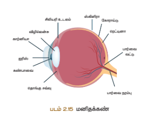

# ஒளியியல்

## கற்றல் நோக்கங்கள்

இப்பாடத்திற்குப் பிறகு, மாணவர்கள் பின்வருவனவற்றை அறிந்துகொள்வர்:

- ஒளிவிலகல் விதிகளைக் கூற இயலும்
- ஒளியின் பண்புகளைப் பட்டியலிட முடியும்
- ஒளிச்சிதைலின் பல்வேறு வகைகளை விளக்க இயலும்
- குவிதல் வில்லை மற்றும் குழிதல் வில்லை உருவாக்கும் பிம்பங்களைப் புரிந்துகொள்ளுதல்
- குவிதல் வில்லை மற்றும் குழிதல் வில்லையின் கதிர்படங்களை வரைய இயலும்
- லென்ஸ் கொண்ட ஒளியியல் கருவிகளின் செயல்பாடுகளைப் புரிந்துகொள்ள இயலும்
- ஒளிவிலகல் தொடர்பான கணக்குகளைத் தீர்க்க இயலும்

---

## அறிமுகம்

'ஒளி' என்பது ஒரு வகை ஆற்றல். இது அலை வடிவில் பரவுகிறது. ஒளி தெல்லும் போது, 'ஒளிக் கதிர்' என்றும் ஒளிக் கதிர்களின் தொகுப்பு 'ஒளிக் கற்றை' என்றும் அழைக்கப்படுகிறது. ஒளியை வெளிவிடும் பொருட்கள் 'ஒளிமூலங்கள்' எனப்படுகின்றன. சில ஒளிமூலங்கள் தாங்களே உண்டாக்கிய ஒளியை வெளியிடுகின்றன. இவை 'ஒளிரும் பொருட்கள்' (luminous objects) என்று அழைக்கப்படுகின்றன. சூரியன் உள்ளிட்ட அனைத்து விண்மீன்களும் ஒளிரும் பொருட்களுக்கு எடுத்துக்காட்டுகள் ஆகும்.

கண்களின் உதவியால் தான் நம் மூலம் பொருட்களைக் காண முடிகிறது என அறிந்திருப்பீர்கள். ஆனால் ஒரு இருள் நிறைந்த அறையில் உள்ள பொருள்களைக் காண்பதில் காண முடிவதில்லை. ஏனென்று விளக்க முடியுமா? ஆம். பொருட்களைக் காண நேரடி ஒளி வேண்டும். ஒரு விலக்கில் இருந்து வரும் ஒளிக் கதிர்கள் நேரடியாக நம் கண்களின் மீது விழுந்தால் பொருள் காண முடியுமா? நிச்சயமாக முடியாது. ஒளிக் கதிர்கள் பொருட்களின் மீது பட்டு அவற்றிலிருந்து எதிரொளிக்கப்பட்ட கதிர்கள் நம் கண்கள் அடைந்தால் தான் பொருள் காண இயலும்.

ஒளி எதிரொளிதல் பற்றியும் ஒளிவிலகல் பற்றியும் முந்தைய வகுப்புகளில் கற்றிருப்பீர்கள். இப்பாடத்தில் ஒளிச்சிதைல், குவிதல் வில்லை மற்றும் குழிதல் வில்லை ஆகியவற்றை நினைவுகூர முயல்வோம்.

---

## 2.1 ஒளியின் பண்புகள்

1. ஒளி எனபது ஒருவண்க ஆறைல்.
2. ஒளி எப்போதும் நேர்க்கோட்டில் பயணிக்கிறது.
3. ஒளி பரவுவதற்கு ஊடகம் வேண்டியதில்லை. வெற்றிடத்தின் வழியாகவும் ஒளிக் கதிர் பயணிக்கும்.
4. காற்றில் அல்லது வெற்றிடத்தில் ஒளியின் வேகம் C = 3 × 10⁸ மீ/வி
5. ஒளியானது அலை வடிவில் பயணிப்பதால் அதன் அலைநீளம் (λ) மற்றும் அதிர்வெண் (ν) ஆகிய பண்புகளைப் பற்றி இருக்கும். இவை C = νλ என்ற சமன்பாட்டின் மூலம் தொடர்புபடுத்தப்படுகிறது.
6. ஒளியின் வெவ்வேறு நிறங்கள் வெவ்வேறு அலைநீளங்களையும், அதிர்வெண்களையும் பற்றி இருக்கும்.
7. கண்ணுக்கு ஒளியில் ஊதா நிறம் குறைந்த அலைநீளதையும், சிவப்பு நிறம் அதிக அலைநீளதையும் கொண்டிருக்கும்.
8. ஒளியானது இரு வேறு ஊடகங்களின் இடைமுகப்பில் அடையும்போது, அது பகுதியளவு எதிரொளிக்கும், பகுதியளவு விலகல் அடையும்.

---

## 2.2 ஒளிவிலகல்

ஒரு ஒளிமூலத்திலிருந்து வரும் ஒளி புகும் ஊடகத்திற்குச் செல்வதாக இல்லாமல், ஒளிக் கதிரின் பாதையில் இருந்து விலகிச் செல்கிறது. ஒளிக் கதிரின் பாதையில் ஏற்படும் இந்த விலகல் 'ஒளிவிலகல்' எனப்படுகிறது. ஒளியானது வெவ்வேறு ஊடகத்தில், வெவ்வேறு திண்மவகையில் பயணிப்பதால் ஒளிவிலகல் ஏற்படுகிறது. ஒளியின் திண்மவகை, அடர்த்தி குறைந்த ஊடகத்தில் அதிகமாகவும், அடர்த்தி மிகுந்த ஊடகத்தில் குறைவதாகவும் இருக்கும்.

ஒளிவிலகலானது, இரு ஒளிவிலகல் விதிகளுக்கு உட்பட்டு அமைகிறது.

### 2.2.1 முதல் விதி

ஊடகத்திற்குச் செல்லும்போது, படும் கதிர், விலகு கதிர், படு புள்ளியில் விலகல் அடையும் பரப்புக்குச் செங்குத்தாகவும் அமையப்படும் கோட்டு ஆகியவை ஒரே தளத்தில் அமைகின்றன.

### 2.2.2 இரண்டாம் விதி (ஸ்னெல்ஸ் விதி)

ஊடகத்திற்குச் செல்லும்போது, படும் கோணத்தின் சைன் மதிப்பிற்கும், விலகும் கோணத்தின் சைன் மதிப்பிற்கும் இடையே உள்ள தகவு அவ்விரு ஊடகங்களின் ஒளிவிலகல் எண்களின் விகிதத்திற்கு சமம். இவ்விதி 'ஸ்னெல்ஸ் விதி' என்றும் அழைக்கப்படுகிறது.


\frac{\sin i}{\sin r} = \frac{\mu_2}{\mu_1}


- ஒளிக் கதிரின் திண்மவகை எவ்வாறு இருக்கும் என்பதைத் தெரிவிக்கின்றது. காற்றில் அல்லது வெற்றிடத்தில் ஒளியின் திண்மவகைக்கும் (c), சம்பந்தப்பட்ட ஊடகத்தில் ஒளியின் திண்மவகைக்கும் (v) இடையே உள்ள தகவு ஒளிவிலகல் எண் (μ) என்று வரையறுக்கப்படுகிறது.


\mu = \frac{c}{v}


- அதிகம் உள்ள ஊடகத்தில் குறைவதாகவும், ஒளிவிலகல் எண் குறைவதாக உள்ள ஊடகத்தில் அதிகமாகவும் அமையும்.
- ஒரு ஒளிக் கதிரானது அடர்த்தி மிகு ஊடகத்திலிருந்து அடர்த்தி குறைந்த ஊடகத்திற்குச் செல்லும்போது, விலகு கதிர் எங்குதும் கோட்டை விட்டு விலகிச் செல்லும்.
- அடர்த்தி மிகு ஊடகத்திற்குச் செல்லும்போது எங்குதும் கோட்டை நோக்கி விலகிச் செல்லும்.

---

## 2.3 கூட்டு வெள்ளையில் ஏற்படும் ஒளிவிலகல்

ஒரு ஒளிமூலத்திலிருந்து வரும் ஒளியை வெளியிடுவதால் அது 'ஒற்றை நிற ஒளிமூலம்' எனப்படும். ஆனால் கூட்டு வெள்ளை மூலங்கள் (Composite Sources) பல்வேறு நிறங்களை உள்ளடக்கியவைத் தோன்றியவை. எனவே சூரிய ஒளியானது பல்வேறு நிறங்களை அல்லது அலைநீளங்களைக் கொண்ட கூட்டு வெள்ளை ஆகும். கூட்டு வெள்ளை மூலத்திலிருந்து வரும் எடுத்துக்காட்டுப் பொருள் ஆவிக்கு ஆகும். வெள்ளையான ஒரு கறையைத் தாண்டியவையாகச் செலுத்தியவை வெளியேறும் ஒளிக் கதிர்கள் உறுதியாகும் போது என்ன நிகழ்கிறது?

வெள்ளை ஒளி புகும் ஊடகத்தில் ஒளிவிலகல் அடையும்போது அதில் உள்ள நிறங்கள் வெவ்வேறியாகப் பிரிக்கப்படுகின்றன. இந்நிகழ்வு 'நிறப்பிரிவு' எனப்படும்.

நிறமாலையானது ஊதா, கருநீலம் , நீலம், பச்சை, மஞ்சள், ஆரஞ்சு மற்றும் சிவப்பு ஆகிய நிறங்களைக் கொண்டுள்ளது. இந்நிறங்கள் 'VIBGYOR' என்ற சுருக்கக் குறியீட்டின் மூலம் குறிப்பிடப்படுகிறது.

வெள்ளையானது, ஒளி புகும் ஊடகத்தில் செல்லும்போது வெவ்வேறு நிறங்கள் ஏற்படக் காரணம் தான் என்ன? வெள்ளையானது ஒளி புகும் ஊடகத்தில் செல்லும்போது வெவ்வேறு நிறங்கள் வெவ்வேறு மகையளவுகளில் விலகல் அடைவதால் நிறப்பிரிவு ஏற்பட்டு நிறமாலை தோன்றுகிறது. ஊடகத்தில் ஒளிக் கதிரின் விலகும் கோணம் தானது நிறங்களைப் பொறுத்து வேறுபடுகிறது.

விலகும் கோணத்தையும், ஊதா நிறம் மிக அதிகமான விலகும் கோணத்தையும் பற்றி உள்ளன. ஸ்னெல்ஸ் விதிப்படி, விலகும் கோணம் தானது ஊடகத்தின் ஒளிவிலகல் எண்ணைச் சார்ந்து அமையும். வெவ்வேறு நிறங்களுக்கு ஊடகத்தின் ஒளிவிலகல் எண் வெவ்வேறாக இருக்கும். எனவே, ஒரு ஊடகத்தின் ஒளிவிலகல் எண் ஒளிக் கதிரின் அலைநீளத்தைச் சார்ந்து என அறியலாம்.

---

## 2.4 ஒளிச்சிதைல்

நுண்ணியும்போது, வளிமண்டலத்தில் உள்ள பல்வேறு வாயு அணுக்கள் மற்றும் மூலக்கூறுகளால் அனைத்து திசைகளிலும் விலகல் அடையச் செய்யப்படுகிறது. இந்நிகழ்வு 'ஒளிச்சிதைல்' எனப்படுகிறது. இந்நிகழ்வில் ஒளிக் கற்றையானது ஊடகத்தில் (காற்றில்) உள்ள துகள்களுடன் இடைவினையில் ஈடுபடும்போது, அவை அனைத்து திசைகளிலும், திருப்பிவிடப்பட்டுச் சிதைல் நிகழ்கிறது. இடைவினையில் ஈடுபடும் துகள்கள் சிதைலை உண்டாக்கும் துகள்கள் எனப்படுகின்றன.


_Figure 2.1 ஒளிச்சிதைல்_

துகள்களுடன் இடைவினையாற்றும்போது, பல்வேறு வகையான சிதைல்கள் ஏற்படுகின்றன. ஆற்றல் அடிப்படையாகக் கொண்டு, ஒளிச்சிதைல் என இருவகைகளாகப் பிரிக்கலாம்.

### 2.4.1 மீட்சிச் சிதைல்

மற்றும் இறுதி ஆற்றல்கள் சமமாக இருப்பின் அச்சிதைல் மீட்சிச் சிதைல் எனப்படும்.

### 2.4.2 மீட்சியற்ற சிதைல்

மற்றும் இறுதி ஆற்றல்கள் சமமற்று இருப்பின் அச்சிதைல் மீட்சியற்ற சிதைல் எனப்படும்.

சிதைலை உண்டாக்கும் துகள்களின் அளவுப்பு பொறுத்து சிதைலை கீழ்கண்டவாறு வகைப்படுத்தலாம்:

- ரேலே ஒளிச்சிதைல்
- மீ ஒளிச்சிதைல்
- டிண்டல் ஒளிச்சிதைல்
- இராமன் ஒளிச்சிதைல்

**ரேலே ஒளிச்சிதைல்:** சூரியனிலிருந்து வரும் ஒளிக் கதிர்கள் வளிமண்டலத்தில் உள்ள வாயு அணுக்கள் மற்றும் மூலக்கூறுகளால் சிதைலடிக்கப்படுவம் 'ரேலே ஒளிச்சிதைல்' ஆகும்.

அலைநீளத்தின் நான்காம் அடுக்குக்கு எதிர் விகிதத்தில் இருக்கும்.


\text{சிதைல் அளவு} \propto \frac{1}{\lambda^4}


காரணமாக, அதிக அலைநீளம் கொண்ட நிறம் விட அதிகமாகச் சிதைல் அடைகிறது.

செல்லும்போது, குறைந்த அலைநீளம் உள்ள நீல நிறமானது, அதிக அலைநீளம் கொண்ட சிவப்பு நிறம் விட அதிகமாகச் சிதைல் அடைகிறது. இன்மையால் வானம் நீல நிறமாகத் தோன்றுகிறது.

ஒளியானது, நண்பகலில் இருப்பதை விட வளிமண்டலத்தில் அதிக தூரமாகப் பயணிக்க வேண்டியிருக்கிறது. எனவே நீல நிற ஒளியானது முற்றிலும் சிதைலடைந்து விடுவதால், குறைவதாகச் சிதைல் அடைந்த சிவப்பு நிற ஒளிமயமாக அடைகிறது. எனவே, சூரிய உதயம் மற்றும் சூரிய அஸ்தமனம் போது சூரியன் சிவப்பாகக் காட்சியளிக்கிறது.

**மீ-ஒளிச்சிதைல் :** ஒளிச்சிதைலை உண்டாக்கும் துகள்களின் விட்டமானது, படும் ஒளிக் கதிரின் அலைநீளத்திற்குச் சமமாக அல்லது அலைநீளத்தை விட அதிகமாக இருக்கும்போது மீ-ஒளிச்சிதைல் ஏற்படுகிறது. இச்சிதைல் மீட்சிச் சிதைல் வகையைச் சார்ந்தது. மேலும் சிதைல் அளவானது ஒளிக் கதிரின் அலைநீளத்தைச் சார்ந்து அன்று.

உள்ள தூசு, புகை, நீர்த்துளிகள் மற்றும் சில துகள்களால் மீ-சிதைல் ஏற்படுகிறது. காட்சியளிக்க மீ-சிதைல் காரணமாக அமைகிறது. வெள்ளையானது மேகத்தில் உள்ள நீர்த்துளிகளின் மீது படும்போது, அந்நீர்த்துளிகள் அனைத்து நிறங்களையும் சமமாகச் சிதைல் அடையச் செய்கின்றன.

இன்மையால் சிதைல் அடைந்த அனைத்து நிறங்களும் ஒன்றாகச் சேர்ந்து வெள்ளை நிறமாகத் தோன்றுகிறது.

**டிண்டல் ஒளிச்சிதைல்:** சூரிய ஒளிக் கற்றையானது, தூசுகள் நிறைந்த ஒரு அறையின் வழியாக நுண்ணியும்போது ஒளிக் கற்றையின் பாதை புலனாகிறது. அறையில் உள்ள காற்றில் கலந்திருக்கும் தூசுகளால் ஒளிக் கற்றையானது சிதைலடிக்கப்படுவதால் ஒளிக் கற்றையின் பாதை புலனாகிறது. இந்நிகழ்வு டிண்டல் ஒளிச்சிதைலுக்கு எடுத்துக்காட்டு ஆகும்.

ஒரு கூழ் கணரெலில் உள்ள கூழ் துகள்களால், ஒளிக் கதிர்கள் சிதைலடிக்கப்படுகின்றன. நிகழ்வு டிண்டல் ஒளிச்சிதைல் அல்லது டிண்டல் விளைவு.

**இராமன் ஒளிச்சிதைல்:** வாயுக்கள் அல்லது திரவங்கள் அல்லது ஒளி புகும் ஒண்மைத் தாண்டிய திண்மங்களின் வழியாக ஒற்றை நிற ஒளியானது இணைக் கற்றைகளாகச் செல்லும்போது அவற்றின் ஒரு பகுதி சிதைல் அடைகிறது. சிதைலடைந்த கதிரானது, படுகின்ற கதிரின் அதிர்வெண்ணைத் விரைவில புதிய அதிர்வெண்களையும் உள்ளடக்கியதாக இருக்கும். இந்நிகழ்வு 'இராமன் ஒளிச்சிதைல்' எனப்படுகிறது.

ஒளிக் கதிரானது, தூய திரவங்கள் மற்றும் ஒளி புகும் ஒண்மைத் தாண்டிய திண்மங்களில் உள்ள துகள்களுடன் இடைவினை புரிவதால் ஒளிக் கதிரின் அலைநீளம் மற்றும் அதிர்வெண்ணில் மாற்றங்கள் ஏற்படும் நிகழ்வு 'இராமன் ஒளிச்சிதைல்' எனப்படுகிறது.

படுகின்ற கதிரின் அதிர்வெண்ணுக்குச் சமமான அதிர்வெண்ணைக் கொண்ட நிறமாலை வரிகள் 'ரேலே வரிகள்' என்றும், புதிய அதிர்வெண்களைக் கொண்ட நிறமாலை வரிகள் 'இராமன் வரிகள்' என்றும் படுகின்ற கதிரின் அதிர்வெண்ணை விட குறைவான அதிர்வெண்ணைக் கொண்ட நிறமாலை வரிகள் 'ஸ்டோக்ஸ் வரிகள்' என்றும், படுகின்ற கதிரின் அதிர்வெண்ணை விட அதிகமான அதிர்வெண்ணைக் கொண்ட நிறமாலை வரிகள் 'ஆண்டி-ஸ்டோக்ஸ் வரிகள்' என்றும் அழைக்கப்படுகின்றன.

இராமன் விளைவு பற்றி மேலும் விரிவாக உயர்வகுப்புகளில் கற்பீர்கள்.

---

## 2.5 வில்லைகள்

இரு பரப்புகளுக்கு இடைப்பட்ட ஒளி புகும் ஒண்மைத் தாண்டிய ஊடகம் 'வில்லை' எனப்படும். இப்பரப்புகள் இரண்டும் கோள் பரப்புகளாகவோ அல்லது ஒரு கோள் பரப்பும், ஒரு சமதளப் பரப்பும் தாண்டியாகவோ அமைந்திருக்கும். இப்படி வில்லைகள் இரண்டு வகைகளாகப் பிரிக்கப்படுகின்றன:

### 1. குவிவில்லை அல்லது இருபுற குவிவில்லை

இவை இருபுறமும் கோள் பரப்புகளைக் கொண்டது. இவை அமையத்தில் குவிந்தும், ஓரங்களில் தேலிந்தும் காணப்படும். இவற்றின் வழியாகச் செல்லும் இணையான ஒளிக் கற்றைகள் ஒரு புள்ளியில் குவிக்கப்படுகின்றன. எனவே இவை 'குவிக்கும் வில்லைகள்' என்று அழைக்கப்படுகின்றன.

### 2. குழிவில்லை அல்லது இருபுற குழிவில்லை

இவை இருபுறமும் உள்முகமாகக் குழிந்த கோள் பரப்புகளைக் கொண்டது. இவை அமையத்தில் தேலிந்தும், ஓரங்களில் குவிந்தும் காணப்படும். இவற்றின் வழியாகச் செல்லும் இணையான ஒளிக் கற்றைகள் விரிந்து செல்கின்றன. எனவே இவை 'விரிக்கும் வில்லைகள்' என்று அழைக்கப்படுகின்றன.

### 2.5.1 பிற வகை வில்லைகள்

**தட்டை குவிவில்லை:** ஒரு இருபுற குவிதல் வில்லையின் ஒரு பரப்பு சமதளப் பரப்பாக அமைந்திருந்தால் அது தட்டை குவிதல் வில்லை.

**தட்டை குழிவில்லை:** ஒரு இருபுற குழிதல் வில்லையின் ஒரு பரப்பு சமதளப் பரப்பாக அமைந்திருந்தால் அது தட்டை குழிதல் வில்லை எனப்படும்.


_Figure 2.2 Types of lenses_

---

## 2.6 குவிவில்லையில் நடைபெறும் ஒளிவிலகலால் பிம்பங்கள் உருவாக்குதல்

குவிவில்லையில் நடைபெறும் ஒளிவிலகலால் பிம்பங்கள் உருவாக்கப்படும்போது, பொருளிலிருந்து வரும் ஒளிக் கதிர்கள் வில்லையின் மீது விழுந்து பிம்பங்கள் மாற்றுவிக்கப்படுகின்றன. வில்லையினால் மாற்றுவிக்கப்படும் பிம்பத்தின் நிலை, அளவு மற்றும் தன்மை ஆகியவற்றைப் புரிந்துகொள்ள சில அடிப்படை விதிகளைத் தெரிந்திருக்க வேண்டும். இவ்விதிகளைப் பின்பற்றி மய வில்லைகளால் உருவாக்கப்படும் பிம்பங்கள் குறித்துப் பகுத்தறிய வேண்டும்.

### அடிப்படை விதிகள்:

**1.** குழிதல் வில்லையின் ஒளியியல் மையத்தின் வழியாகச் செல்லும்போது விலகல் அடையாமலே பாதையில் செல்கிறது.


_Figure 2.3 Rays passing through the optical centre_

**2.** ஒளிக் கதிர்கள், குவிதல் வில்லையின் மீது படும்போது முக்கிய குவியத்தில் குவிக்கப்படும். குழிதல் வில்லையின் மீது படும்போது முக்கிய குவியத்திலிருந்து விலகல் அடைந்து செல்வதுமால் மாற்றும்.


_Figure 2.4 Rays passing parallel to the optic
axis_

**3.** குவிதல் வில்லையின் மீது விழும் ஒளிக் கதிர்களும், முக்கிய குவியத்தை நோக்கிச் சென்று குழிதல் வில்லையின் மீது விழும் ஒளிக் கதிர்களும் விலகல் அடைந்த பிறகு முக்கிய அச்சுக்கு இணையாகச் செல்லும்.


_Figure 2.5 Rays passing through or directed
towards the principal focus_

---

## 2.7 குவிவில்லையில் உருவாகும் பிம்பங்கள்

பொருள் வைக்கப்படும்போது, குவிதல் வில்லையினால் உருவாக்கப்படும் பிம்பங்கள் குறித்து விரிவாகக் காண்போம்.

### பொருள் ஈற்றிலிருந்து வைக்கப்படும்போது

பொருள் ஈற்றிலிருந்து வைக்கப்படும்போது, குவிதல் வில்லையின் முக்கிய குவியத்திற்கும், ஒளியியல் மையத்திற்கும் இடையே வைக்கப்படும்போது, அளவில் பெரிய, நிஜமான, தலைகீழ் பிம்பம் வில்லையின் எதிர்புறத்தில் வைக்கப்படுகிறது.


_Figure 2.6 பொருள் ஈற்றிலிருந்து வைக்கப்படும்போது_

### பொருள் C இல் வைக்கப்படும்போது

பொருள் C இல் வைக்கப்படும்போது, அம் அளவில் தானே, நிஜமான, தலைகீழ் பிம்பம் வில்லையின் எதிர்புறத்தில் வைக்கப்படுகிறது.


_Figure 2.7 பொருள் C இல் வைக்கப்படும்போது_

### பொருள் F க்கும் C க்கும் இடையில் வைக்கப்படும்போது

பொருள் F க்கும் C க்கும் இடையில் வைக்கப்படும்போது, அளவில் பெரிய, நிஜமான, தலைகீழ் பிம்பம் வில்லையின் எதிர்புறத்தில் வைக்கப்படுகிறது.


_Figure 2.9 பொருள் முக்கிய குவியத்தில் வைக்கப்படும்போது_

### பொருள் முக்கிய குவியத்தில் வைக்கப்படும்போது

பொருள் முக்கிய குவியத்தில் வைக்கப்படும்போது, குவிதல் வில்லையின் முக்கிய குவியத்தில் வைக்கப்படும்போது, அளவில் பெரிய, நிஜமான, தலைகீழ் பிம்பம் ஈற்றிலிருந்து வைக்கப்படுகிறது.


_Figure 2.10 பொருள் முக்கிய குவியம் F மற்றும் ஒளியியல் மையம் O ஆகியவற்றுக்கு இடையில் வைக்கப்படும்போது_

### பொருள் முக்கிய குவியம் F மற்றும் ஒளியியல் மையம் O ஆகியவற்றுக்கு இடையில் வைக்கப்படும்போது

பொருள் முக்கிய குவியம் F மற்றும் ஒளியியல் மையம் O ஆகியவற்றுக்கு இடையில் வைக்கப்படும்போது, அளவில் பெரிய, நிஜமான, தலைகீழ் பிம்பம் பொருள் இருக்கும் அம்பக்கத்தில் உருவாக்கப்படுகிறது.


_பொருள் முக்கிய குவியம் F மற்றும் ஒளியியல் மையம் O ஆகியவற்றுக்கு இடையில் வைக்கப்படும்போது_

---

## 2.8 குவிவில்லையின் பயன்பாடுகள்

1. ஒளிப்படக் கருவியில் பயன்படுகின்றன.
2. உருப்பெருக்கும் கண்ணாடிகளுக்குப் பயன்படுகின்றன.
3. நுண்ணோக்கிகள், தொலைநோக்கிகள் மற்றும் நழுவுப்பட வீழ்த்திகள் (Slide Projector) போன்றவற்றின் உருவாக்கத்தில் பயன்படுகின்றன.
4. தூரப்பார்வை மற்றும் நெருக்கப் பார்வைக் குறைபாடுகளை சரிசெய்யப் பயன்படுகின்றன.

---

## 2.9 குழிவில்லையின் வழியாக ஒளிவிலகல்

குழிதல் வில்லையின் முன்பக்க வாய்ப்புள்ள இரண்டு நிலைகளில் பொருள் வைக்கப்படும்போது உருவாக்கப்படும் பிம்பங்கள் குறித்துக் காண்போம்.

### பொருள் ஈற்றிலிருந்து வைக்கப்படும்போது

பொருள் ஈற்றிலிருந்து வைக்கப்படும்போது, குழிதல் வில்லையின் முன்பக்க, ஈற்றிலிருந்து வைக்கப்படும்போது, நிஜமான, சிறிய தலைகீழ் பிம்பம் குழிதல் வில்லையின் முக்கிய குவியத்தில் உருவாக்கப்படுகிறது.


_Figure 2.12 பொருள் ஈற்றிலிருந்து வைக்கப்படும்போது_

### பொருள் அளவிடக்கூடிய வைக்கப்படும்போது

பொருள் அளவிடக்கூடிய வைக்கப்படும்போது, குழிதல் வில்லைக்கு முன்பக்க, அளவிடக்கூடிய தூரத்தில் வைக்கப்படும்போது, குழிதல் வில்லையின் ஒளியியல் மையத்திற்கும், முக்கிய குவியத்திற்கும் இடையமான நிஜமான, சிறிய தலைகீழ் பிம்பம் உருவாக்கப்படுகிறது.


_Figure 2.13 பொருள் அளவிடக்கூடிய வைக்கப்படும்போது_

வில்லைக்கும் பொருளுக்கும் இடையே உள்ள தூரமும், பிம்பத்திற்கும் வில்லைக்கும் இடையே உள்ள தூரமும் குறைகிறது. மேலும் பிம்பத்தின் அளவு அதிகரிக்கிறது. இவை படம் 2.14 இல் காட்டப்பட்டுள்ளன.


_Figure 2.14 Concave lens-Variation in
position and size of image with object distance_

---

## 2.10 குழிவில்லையின் பயன்பாடுகள்

1. கலிமையான தொலைநோக்கியில் கண்ணருகுதலுக்குப் பயன்படுகின்றன.
2. வெளியேற்ற கண்ணாடிகளிலிருந்து காண்பதற்காக வீட்டின் கூரைகளில் ஏற்படுத்தப்படும் உள் வெட்டுத் துளைகளில் பயன்படுகின்றன.
3. கிட்டப்பார்வை மற்றும் தூரப்பார்வைக் குறைபாடுகளை சரிசெய்யப் பயன்படுகின்றன.

---

## 2.11 வில்லை சமன்பாடு

கோள் ஆடிகளின் ஆடிச் சமன்பாட்டின் போலவே, கோள் வில்லைகளுக்கு வில்லை சமன்பாடு உருவாக்கப்பட்டுள்ளது. இச் சமன்பாடு பொருளின் தூரம் (u), பிம்பத்தின் தூரம் (v) மற்றும் குவியத் தூரம் (f) ஆகியவற்றைத் தொடர்புபடுத்துகிறது.

வில்லை சமன்பாடானது,


\frac{1}{f} = \frac{1}{v} - \frac{1}{u}


இது குவிதல் வில்லை மற்றும் குழிதல் வில்லை ஆகியவற்றிற்குப் பொதுவானது. வில்லைத் தொடர்பான கணக்குகளுக்குப் பயன்படுத்தப்படும் அளவுகளுக்குத் தகுந்த குறியீட்டு முறையை மிகுந்த கவனத்துடன் கையாள வேண்டும்.

### 2.12 குறியீட்டு முறை

வில்லைகளின் கதிர்படங்களில் பல்வேறு தூரங்களை அளவிடுவதற்கு கார்ட்டீசியன் குறியீட்டு முறை பயன்படுத்தப்படுகிறது. இக்குறியீட்டு முறையின்படி,

1. பொருள் எப்போதும் வில்லைக்கு இடப்பக்கம் வைக்கப்பட வேண்டும்.
2. அனைத்து தூரங்களும் ஒளியியல் மையத்திலிருந்து அளக்கப்பட வேண்டும்.
3. படும் கதிரின் திசையில் மேற்கொள்ளப்படும் அளவீடுகளை நேர் குறியாகக் கொள்ள வேண்டும்.
4. படும் கதிரின் திசைக்கு எதிர் திசையில் மேற்கொள்ளப்படும் அளவீடுகளை எதிர் குறியாகக் கொள்ள வேண்டும்.
5. முக்கிய அச்சுக்குச் செங்குத்தாக மேல் நோக்கி அளக்கப்படும் அளவுகளை நேர் குறியாகக் கொள்ள வேண்டும்.
6. முக்கிய அச்சுக்குச் செங்குத்தாக கீழ் நோக்கி அளக்கப்படும் அளவுகளை எதிர் குறியாகக் கொள்ள வேண்டும்.

---

## 2.13 வில்லையின் உருப் பெருக்கம்

கோள் ஆடிகளின் போலவே, கோள் வில்லைகளும் உருப் பெருக்கம் செய்கின்றன. பிம்பத்தின் உயரத்திற்கும், பொருளின் உயரத்திற்கும் இடையே உள்ள தகவு 'உருப் பெருக்கம்' எனப்படுகிறது. உருப் பெருக்கம் 'm' என்ற எழுத்தால் குறிக்கப்படுகிறது.

பொருளின் உயரம் h எனவும், பிம்பத்தின் உயரம் h' எனவும் கொண்டால்,


m = \frac{\text{பிம்பத்தின் உயரம்}}{\text{பொருளின் உயரம்}} = \frac{h'}{h}


உருப் பெருக்கமானது, பிம்பத்தின் தூரத்திற்கும் பொருளின் தூரத்திற்கும் இடையே உள்ள தொடர்பு


m = \frac{\text{பிம்பத்தின் தூரம்}}{\text{பொருளின் தூரம்}} = \frac{v}{u}


உருப் பெருக்கத்தின் மதிப்பு 1 விட அதிகமாக இருந்தால், பொருளை விட பெரிய பிம்பமும், 1 விட குறைவதாக இருந்தால் பொருளை விட சிறிய பிம்பமும் உருவாகும்.

---

## 2.14 வில்லை உருவாக்குடார் சமன்பாடு

அனைத்து வில்லைகளும் ஒளி புகும் ஊடகங்களால் உருவாக்கப்படுகின்றன. இந்த் ஊடகங்கள் வெவ்வேறு ஒளிவிலகல் எண்களைக் கொண்டவை. வில்லையை உருவாக்கும் ஒரு வகை வில்லையின் வளைவு ஆரம் மற்றும் ஒளிவிலகல் எண் குறித்து அறிந்திருக்க வேண்டும். வில்லை சமன்பாடானது, குவியத் தூரம், பொருள் மற்றும் பிம்பத்தின் தூரம் ஆகியவற்றைச் சேர்த்தும் தொடர்புபடுத்துவதால், வில்லையின் வளைவு ஆரம், ஒளிவிலகல் எண் மற்றும் குவியத் தூரம் ஆகியவற்றைத் தொடர்புபடுத்தும் சமன்பாடு ஒன்றும் உருவாக்கப்படுகிறது. இதை 'வில்லை உருவாக்குடார் சமன்பாடு' என்று உருவாக்கப்பட்டது. இச் சமன்பாட்டின்படி,


\frac{1}{f} = (\mu - 1)\left(\frac{1}{R_1} - \frac{1}{R_2}\right)


இங்கு, μ என்பது வில்லை செய்யப் பயன்படுத்தப்பட்ட பொருளின் ஒளிவிலகல் எண், R₁, R₂ என்பவை வில்லையின் இரு கோள் பரப்புகளின் வளைவு ஆரங்கள், f என்பது குவியத் தூரம் ஆகும்.

வில்லை சமன்பாடு மற்றும் வில்லை உருவாக்குடார் சமன்பாடு ஆகியவை தேலிய வில்லைகளுக்குச் சேர்த்தும் பயன்படுத்தப்படுகின்றன.

---

## 2.15 வில்லைத் திறன்

ஒளிக் கதிரானது குவிக்கப்படும் அல்லது விரிக்கப்படும் அளவுதானது வில்லையின் குவியத் தூரத்தைப் பொறுத்தது. வில்லை ஒன்றின் மீது விழும் ஒளிக் கதிர்களைக் குவிக்கும் (குவிதல் வில்லை) அல்லது விரிக்கும் (குழிதல் வில்லை) அளவு வில்லையின் திறன் எனப்படுகிறது. எனவே, வில்லையின் திறன் என்பது ஒரு வில்லையின் குவிக்கும் அல்லது விரிக்கும் திறன் என வரையறுக்கப்படுகிறது. வில்லையின் திறன் என்பது எண்ணளவில் அம் வில்லையின் குவியத் தூரத்தின் நேர்வீதத்திற்குச் சமம் என வரையறுக்கப்படுகிறது.


P = \frac{1}{f}


வில்லைத் திறனின் SI அலகு 'டயாப்டர்' ஆகும். இது 'D' என்ற எழுத்தால் குறிக்கப்படுகிறது. வில்லையின் குவியத் தூரம் மீட்டர் (m) என்ற அலகிலும்,


1D = 1 m^{-1}


குவிதல் வில்லையின் திறன் நேர் குறியாகவும், குழிதல் வில்லையின் திறன் எதிர் குறியாகவும் கொள்ளப்படுகிறது.

| வகை | குவிதல் வில்லை                               | குழிதல் வில்லை                                            |
| --- | -------------------------------------------- | --------------------------------------------------------- |
| 1   | குவிக்கும் கற்றைகளை உருவாக்கும்              | விரிக்கும் கற்றைகளை உருவாக்கும்                           |
| 2   | f நேர்                                       | f எதிர்                                                   |
| 3   | மெய்ப் பிம்பம் உருவாக்கும்                   | கற்பனைப் பிம்பம் உருவாக்கும்                              |
| 4   | உருப் பெருக்கம் நேர் அல்லது எதிர்            | உருப் பெருக்கம் நேர்                                      |
| 5   | குவியத் தூரம் குறைவாக இருந்தால் திறன் அதிகம் | குவியத் தூரம் குறைவாக இருந்தால் திறன் அதிகம் (எதிர் குறி) |

---

## 2.16 மனித கண்

நுண்பொருள் காண உதவும் உறுப்பு ஆகும். அற்ப உலகக் காட்சிகளை வழியாகவும் கண் கம் அமைகின்றன.

### கண்ணின் அமைப்பு

விழியானது சுமார் 2.3 செ.மீ விட்டம் கொண்ட கோள வடிவ அமைப்புடையது. கண்ணில் உள் 'ஸ்கிளிரா' என்னும் வலிமையான திசையினால் கண்ணின் உள்ளுறுப்புகள் பொதுவாகக் காக்கப்படுகின்றன.

**கருவிழி :** பகுதியில் காணப்படும் தேலிய ஒளி புகும் படலம் ஆகும். இது முக்கிய கண்ணில் ஒளிவிலகல் நடைபெறும் முக்கியப் பகுதி ஆகும். காற்றிலிருந்து வரும் ஒளிக் கதிர்கள் ஒளிவிலகல் அடையச் செய்யப்பட்டு விழிதலன்சின் மீது குவிக்கப்படுகிறது.

**ஐரிஸ் :** இது கண்ணின் நிறமுடைய பகுதியாகும். இது நீலம், பழுப்பு அல்லது பச்சை நிறத்தில் காணப்படலாம். இது ஒவ்வொரு நபருக்கும் வேறுபட்ட நிறம் மற்றும் அமைப்பைக் கொண்டிருக்கும். இது ஒளிப்படக் கருவியின் முகப்பு போல செயல்பட்டு கண்பான்வையின் அளவைக் கட்டுப்படுத்துகிறது.



**கண்பான்வை :** இது ஐரிஸின் மையப்பகுதியாகும். பொருளிலிருந்து வரும் ஒளிக் கதிர்கள் கண்பான்வையின் வழியாக விழித்திணரை அடைகின்றன.

**விழித்திணர் :** இது விழிக்கோளத்தின் பின்புற உட்பரப்பு ஆகும். மிக அதிக ஒளி நுண்பொருள் உடைய இப்பகுதியில் பொருளின் நிஜமான தலைகீழ் பிம்பம் உருவாக்கப்படுகிறது.

**விழிவில்லை :** இது கண்ணின் மிக முக்கியப் பகுதியாகும். இது இயற்கையில் அமைந்த குவிதல் வில்லையாகச் செயல்படுகிறது.

**சிலியரித்தனைகள்:** விழிதலன்சானது சிலியரித் தசைகளால் தாங்கப்பட்டுள்ளது. பொருட்களின் தூரத்திற்கு ஏற்ப, விழிதலன்சின் குவியத் தூரத்தை மாற்றியமைக்க இத்தசைகள் உதவுகின்றன.

### விழி ஏற்புத்திறன்

அருகில் உள்ள மற்றும் தூர தூரத்தில் உள்ள பொருள் காண்பதற்குக் காண்பதற்கு உதவும் விழிதலன்சின் தன்மையை மாற்றியமைக்கும் திறன், 'விழி ஏற்புத்திறன்' எனப்படுகிறது. விழிதலன்சின் உள்ள குவியத் தூர அளவை மாற்றியமைக்க சிலியரித் தசைகள் உதவுகின்றன.

விழிதலன்சானது, தங்கிழும் தன்மைத் தாண்டிய பொருட்களால் ஆனது. சிலியரித் தசைகள் சுருங்கி, விரிவடையும்போது, வில்லையின் வளைவும், குவியத் தூரமும் மாற்றியமைக்கப்படுகிறது. நெருக்கத் தூரத்தில் உள்ள பொருள் காண்பதற்கும்போது, சிலியரித் தசைகள் விரிவடைவதால் விழிதலன்சின் திறன் குறைந்து தேலியதாக இருப்பதாகும். இன்மையால் விழிதலன்சின் குவியத் தூரம் அதிகரிக்கப்பட்டு பொருள் தெரிவதாகப் புலனாகிறது. தேலியதாக, நெருக்கமான பொருள் காண்பதற்கும்போது சிலியரித் தசைகள் சுருங்குவதால் விழிதலன்சின் திறன் அதிகரிக்கிறது. இன்மையால் விழிதலன்சின் குவியத் தூரம் குறைந்து பொருளின் தெரிவதான பிம்பம் விழித்திணரில் உருவாகிறது.

### பார்வை நீட்டிப்பு

இரு அடுத்தடுத்த ஒளித்தெறிப்புகளுக்கு இடைப்பட்ட கால இடைவெளி 1/16 வினாடி எனில் கண்களால் அவற்றைத் தனித்தனியாகப் பிரித்தறிய இயலாது. இது 'பார்வை நீட்டிப்பு' எனப்படுகிறது.

### கண்ணின் அண்ணெப்புள்ளி மற்றும் மெய்ந்நெப்புள்ளி

லென்ஸ் கொண்ட ஒரு கண்ணினால் எதிரில் உள்ள பொருள் காண்பதற்குக் கூடிய மிகச் சிறிய தூரம் 'தெரிவுறு காட்சியின் மீச்சிறுத் தூரம்' எனப்படும். இது அண்ணெப்புள்ளி என்றும் அழைக்கப்படுகிறது. இது லென்ஸ் கண்ணிற்குப் பொதுவாக 25 செ.மீ என்ற அளவில் உள்ளது.

கண் ஒன்றினால், எவ்வளவு தூரத்தில் உள்ள பொருள் காண்பதற்குக் கூடுமோ, அப்புள்ளி மெய்ந்நெப்புள்ளி என்று அழைக்கப்படுகிறது. பொதுவாக, மெய்ந்நெப்புள்ளியானது ஈற்றிலாத தூரத்தில் உள்ளது.

---

## 2.17 கண்ணின் குறைபாடுகள்

இயல்பான கண்களினால் 25 செ.மீ முதல் ஈற்றிலாத தூரம் வரையுள்ள பொருள் காண்பதற்குக் கூடியும். ஆனால் வயதுமுதிர்வு உள்ளிட்ட பல்வேறு காரணங்களால் சில நபர்களின் பார்வையில் குறைபாடு ஏற்படுகிறது. கண்ணில் ஏற்படும் சில பொதுவான குறைபாடுகளைப் பற்றி காண்போம்.

### கிட்டப்பார்வை

அல்லது நெருக்கப்பார்வை என்றும் அழைக்கப்படும் 'கிட்டப்பார்வை' என்னும் குறைபாடானது விழிக்கோளம் சிறிது நீண்டுவிடுவதால் ஏற்படுகிறது. இக்குறைபாடு உள்ள நபர்களால் அருகில் உள்ள பொருள் காண்பதற்குக் கூடியும். ஆனால் தூரத்தில் உள்ள பொருள் காண்பதற்குக் கூடியதில்லை. விழிதலன்சின் குவியத் தூரம் குறைவதாலும், விழிதலன்சுக்கும் விழித்திணருக்கும் இடையே உள்ள தூரம் அதிகரிப்பதாலும் இக்குறைபாடு ஏற்படுகிறது. இன்மையால் கண்ணின் அண்ணெப்புள்ளியானது, ஈற்றிலாத தூரத்தில் அமையதால், கண்ணின் அண்ணெப்புள்ளியை மாற்றியமைக்கிநகர்ந்துவிடுகிறது. இன்மையால் தூரத்தில் உள்ள பொருட்களின் பிம்பங்கள் விழித்திணருக்கு முன்பாக உருவாக்கப்படுகின்றன.

குறைந்த குவியத் தூரம் கொண்ட குழிதலன்சைப் பயன்படுத்துவதன் மூலம் இக்குறைபாட்டை சரிசெய்யலாம். பயன்படுத்தப்பட வேண்டிய வில்லையின் குவியத் தூரத்தை பின்வருமாறு கண்டறியலாம்:


_Figure 2.16(a) Vision with myopia
b) Corrected vision using a concave lens_

குறைபாட்டைச் சரிசெய்ய பயன்படுத்தப்பட வேண்டிய வில்லையின் குவியத் தூரம்:


f = \frac{xy}{x-y}


அல்லது பவர்:


P = \frac{1}{f} = -\frac{1}{x}


### தூரப்பார்வை

அல்லது நெருக்கப்பார்வை என்றும் அழைக்கப்படும் 'தூரப்பார்வை' என்னும் குறைபாடானது விழிக்கோளம் சுருங்குவதால் ஏற்படுகிறது. இக்குறைபாடு உள்ள நபர்களால் தூரத்தில் உள்ள பொருள் காண்பதற்குக் கூடியும். ஆனால் அருகில் உள்ள பொருள் காண்பதற்குக் கூடியதில்லை. விழிதலன்சின் குவியத் தூரம் அதிகரிப்பதாலும், விழிதலன்சுக்கும் விழித்திணருக்கும் இடையே உள்ள தூரம் குறைவதாலும் இக்குறைபாடு ஏற்படுகிறது. இன்மையால் அண்ணெப்புள்ளியானது 25 செ.மீ என்ற தூரத்தில் அமையதால், மெய்ந்நெப்புள்ளியை மாற்றியமைக்கிநகர்ந்துவிடுகிறது. எனவே, அருகில் உள்ள பொருட்களின் பிம்பங்கள் விழித்திணருக்கு அப்பால் (பின்புறம்) உருவாக்கப்படுகின்றன.


_Figure 2.17 (a) Vision with hypermeteropia
(b) Corrected vision using a convex lens_

கூடிய குவியத் தூரம் கொண்ட குவிதலன்சைப் பயன்படுத்துவதன் மூலம் இக்குறைபாட்டை சரிசெய்யலாம்.

### வயதுமுதிர்வு நெருக்கப்பார்வை

சிலியரித் தசைகள் வலுவிழக்கின்றன. மேலும் விழிதலன்சின் தங்கிழும் தன்மையை இழக்கிறது. இன்மையால் விழியின் ஏற்புத்திறனில் குறைபாடு ஏற்படுகிறது.

பெரியவர்களால் அருகில் உள்ள பொருள் காண்பதற்குக் கூடியதில்லை. எனவே இக்குறைபாடு 'வயதுமுதிர்வு தூரப்பார்வை' என்றும் அழைக்கப்படுகிறது.

கிட்டப்பார்வை மற்றும் தூரப்பார்வை ஆகிய பார்வைக் குறைபாடுகளால் பாதிக்கப்படலாம். இக்குறைபாடானது, "இருகுவிய வில்லைகள்" (Bifocal lenses) மூலம் சரிசெய்யப்படுகிறது. இந்த் வில்லையின் மேற்புறம் குழிதலன்சும் (கிட்டப்பார்வையை சரிசெய்து நீண்ட தூரத்தில் உள்ள பொருள் காண்பதற்கும்), கீழ்ப்பகுதி குவிதலன்சும் (தூரப்பார்வையை சரிசெய்து படிப்பதற்கு உதவுவதற்கும்) தாண்டிய அமைக்கப்பட்டிருக்கும்.

### வளைவுக்குறைபாடு

இணையான தானே மற்றும் கிட்டத்தட்ட முக்கோண வடிவக் கோடுகளைக் கொண்டு காண இயலாது. இக்குறைபாடு மரபுரீதியாகவோ அல்லது கண்ணில் ஏற்படும் பாதிப்புகளினாலோ உண்டாகலாம்.

உருவாகும் புண்கள், விழியின் மேற்பரப்புகளில் உண்டாகும் கோணங்கள் போன்றவற்றால் விழிதலன்சின் ஏற்படும் ஒழுங்கற்ற வடிவத்தால் இக்குறைபாடு ஏற்படுகிறது. உருளை வில்லைகள் (cylindrical lenses) மூலம் இக்குறைபாட்டை சரிசெய்யலாம்.

---

## 2.18 நுண்ணோக்கிகள்

பொருள் காண உதவும் ஒளியியல் கருவியாகும். இவை எளிய நுண்ணோக்கிகள் மற்றும் கூட்டு நுண்ணோக்கிகள் என்று வகைப்படுத்தப்படுகின்றன.


_Figure 2.18 Image formation in simple
microscope_

### எளிய நுண்ணோக்கி

குறைந்த குவியத் தூரம் கொண்ட குவிதலன்சையே எளிய நுண்ணோக்கியாகச் செயல்படுகிறது. குவிதலன்சைக் கண்களுக்கு அருகில் வைத்து, பொருள் காண்பதற்கும்போது, பொருட்களின் பெரிதாக்கப்பட்ட தலைகீழ் பிம்பம் மாற்றுவிக்கப்படுகிறது.

பிம்பத்தின் தூரமானது, தெரிவுறு காட்சியின் மீச்சிறுத் தூரத்திற்குச் சமமாக இருக்கும். (குறைபாடற்ற கண்ணிற்கு D = 25 செ.மீ)

**பயன்கள்:**

1. ஆபரணங்கள் செய்பவர்களால் பயன்படுத்தப்படுகிறது.
2. சிறிய எழுத்துக்களைப் படிக்க உதவுகிறது.
3. பூக்கள் மற்றும் பூச்சிகளின் பாகங்களை உற்று நோக்கப் பயன்படுகிறது.
4. தோல் அறிவியல் துறையில், தோல் மருத்துவர்களால் பகுத்தறியப் பயன்படுகிறது.

### கூட்டு நுண்ணோக்கி

பொருள் காண உதவுகிறது. இன் உருப் பெருக்குத்திறன் எளிய நுண்ணோக்கியின் உருப் பெருக்குத்திறனை விட அதிகம்.


_Figure 2.19 Image formation in compound
microscope_

குறைந்த குவியத் தூரம் கொண்ட குவிதலன்சையே எளிய நுண்ணோக்கியாகச் செயல்படுகிறது. குவிதலன்சைக் கண்களுக்கு அருகில் வைத்து, பொருள் காண்பதற்கும்போது, பொருட்களின் பெரிதாக்கப்பட்ட தலைகீழ் பிம்பம் மாற்றுவிக்கப்படுகிறது.

குவியத் தூரத்தை விடச் சிறிய கூடிய தானே தூரத்தில் வைக்கப்படுகிறது. பொருளருகு வில்லையின் எதிர்புறத்தில் பெரிய, நிஜமான, தலைகீழ் பிம்பம் மாற்றுவிக்கப்படுகிறது. இப் பிம்பமானது (A'B') கண்ணருகு வில்லையின் முக்கிய குவியத்திற்குள் அமையும்படி கண்ணருகு வில்லை சரிசெய்யப்படுகிறது. கண்ணருகு வில்லை, அளவில் பெரிய மெய்ந்நிஜமான தலைகீழ் பிம்பத்தைப் (A"B") பொருள் இருக்கும் அம்பக்கத்தில் மாற்றுவிக்கிறது.

திறனானது, எளிய நுண்ணோக்கியின் உருப் பெருக்குத்திறனை விட 50 முதல் 200 மடங்கு வரை அதிகமாக இருக்கும்.

---

## 2.19 தொலைநோக்கிகள்

தூரத்தில் உள்ள பொருள் காண உதவும் ஒளியியல் கருவிகள் தொலைநோக்கிகள் எனப்படுகின்றன.

### விண்மீன் தொலைநோக்கிகள்

விண்மீன்கள், விண்மீன் திரள்கள், துணைக்கோள்கள் போன்றவற்றைக் காண்பதற்குப் பயன்படுகின்றன.

**நிலப்பரப்பு தொலைநோக்கிகள் :** இறுதி பிம்பமானது நிஜமான பிம்பமாக இருக்கும். எனவே, இத் தொலைநோக்கிகள் புவிப்பரப்பில் உள்ள பொருள் காண்பதற்கு உதவுவதற்கு அல்லது என்பதால் நிலப்பரப்பு தொலைநோக்கிகள் பயன்படுத்தப்படுகின்றன. மெய்ந்நிஜமான இறுதி பிம்பத்தை உருவாக்குவதேட்டுமே வானியல் தொலைநோக்கிகளுக்கும், நிலப்பரப்பு தொலைநோக்கிகளுக்கும் இடையே உள்ள முக்கிய வேறுபாடு ஆகும்.

### தொலைநோக்கிகளின் பயன்கள்

- குறித்த விரிவான பொருள் காட்சியினைத் தருகிறது.
- தொலைநோக்கியுடன் ஒளிப்படக் கருவியை இணைப்பதன் மூலம் வானில் பொருள் காண ஒளிப்படம் எடுக்கலாம்.
- குறைவான ஒளியிலும் தொலைநோக்கியைப் பயன்படுத்தலாம்.

---

## நினைவில் கொள்க

- ஒளி எப்போதும் நேர்க்கோட்டில் பயணிக்கின்றன.
- ஒளிக் கதிரானது தன் பாதையிலிருந்து விலகிச் செல்வது ஒளிவிலகல் எனப்படும்.
- காற்றில் அல்லது வெற்றிடத்தில் ஒளியின் திண்மவகைக்கும், ஊடகத்தில் ஒளியின் திண்மவகைக்கும் இடையே உள்ள தகவு ஊடகத்தின் ஒளிவிலகல் எண் 'μ' எனப்படும்.
- வில்லை சமன்பாடு: 
  \frac{1}{f} = \frac{1}{v} - \frac{1}{u}
  
- உருப் பெருக்கம் (m) = 
  \frac{h'}{h} = \frac{v}{u}
  
- வில்லையின் திறன் P = 
  \frac{1}{f}
  
- அருகில் உள்ள மற்றும் தூர தூரத்தில் உள்ள பொருள் காண்பதற்குக் காண்பதற்கு உதவும் விழிதலன்சின் தன்மையை மாற்றியமைக்கும் திறன் விழி ஏற்புத்திறன் எனப்படுகிறது.
- நுண்ணோக்கிகள் என்பவை மிக நுண்ணிய பொருள் காண உதவும் ஒளியியல் கருவியாகும்.
- தூரத்தில் உள்ள பொருள் காண உதவும் ஒளியியல் கருவிகள் தொலைநோக்கிகள் எனப்படுகின்றன.

---

## பயிற்சிக் கணக்குகள்

### எடுத்துக்காட்டு 1

ஒளிவிலகல் எண் 1.5 உடைய ஊடகத்திற்குள் செல்லும்போது படும் கோணத்தின் சாய்வு 30° எனில் விலகும் கோணம் என்ன?

**தீர்வு:**
μ₁ = 1.0; μ₂ = 1.5; i = 30°


\frac{\sin i}{\sin r} = \frac{\mu_2}{\mu_1}



\sin r = \frac{\mu_1 \sin i}{\mu_2} = \frac{1.0 \times \sin 30°}{1.5} = \frac{0.5}{1.5} = 0.333



r = \sin^{-1}(0.333) = 19.45°


---

### எடுத்துக்காட்டு 2

ஒரு பொருளிலிருந்து செல்லும் ஒளிக் கற்றையானது 0.3 மீ குவியத் தூரம் கொண்ட விரிக்கும் வில்லையால் குவிக்கப்பட்டு 0.2 மீ என்ற தூரத்தில் பிம்பம் ஏற்படுத்துகிறது எனில் பொருளின் தூரத்தைக் கணக்கிடு.

**தீர்வு:**
f = -0.3 மீ, v = -0.2 மீ


\frac{1}{f} = \frac{1}{v} - \frac{1}{u}



\frac{1}{u} = \frac{1}{v} - \frac{1}{f} = \frac{1}{-0.2} - \frac{1}{-0.3} = -5 + 3.33 = -1.67



u = -0.6 \text{ மீ}


---

### எடுத்துக்காட்டு 3

ஒரு நபரால், 4 மீ தூரத்தில் உள்ள பொருள் காண்பதற்குக் கூடியும். அவர் 20 மீ தூரத்தில் உள்ள பொருளைக் காண விரும்பினால் பயன்படுத்தப்பட வேண்டிய குழிதலன்சின் குவியத் தூரம் என்ன?

**தீர்வு:**
x = 4 மீ, y = 20 மீ


f = \frac{xy}{x-y} = \frac{4 \times 20}{4-20} = \frac{80}{-16} = -5 \text{ மீ}


திறன்:

P = \frac{1}{f} = -\frac{1}{5} = -0.2 \text{ D}


---

### எடுத்துக்காட்டு 4

தூரப்பார்வை குறைபாட்டால் பாதிக்கப்பட்ட ஒருவரின் அண்ணெப்புள்ளியானது 1.5 மீ தூரத்தில் உள்ளது. அவருடைய பார்வைக் குறைபாட்டை சரிசெய்ய பயன்படுத்தப்பட வேண்டிய குவிதலன்சின் குவியத் தூரத்தைக் கணக்கிடு.

**தீர்வு:**
d = 1.5 மீ; D = 25 செ.மீ = 0.25 மீ


f = \frac{dD}{d-D} = \frac{1.5 \times 0.25}{1.5 - 0.25} = \frac{0.375}{1.25} = 0.3 \text{ மீ}


---

## பயிற்சி நூல்கள்

1. Fundamentals of optics by D.R. Khanna and H.R. Gulati, R Chand & Co
2. Principles of Physics – Halliday, Resnick & Walker, Wiley Publications, New Delhi

## இணையவளங்கள்

1. www.physicsabout.com
2. www.physicsclassroom.com

---

## கருத்துவரைபடம்

```
ஒளியியல்
├── ஒளிவிலகல்
│   └── ஒளிவிலகல் விதிகள்
├── நிறப்பிரிவு
│   ├── ரேலே சிதைல்
│   ├── மீ சிதைல்
│   ├── டிண்டல் சிதைல்
│   └── இராமன் சிதைல்
├── ஒளிச்சிதைல்
└── ஒளியியல் கருவிகள்
    ├── மனித கண்
    │   ├── அமைப்பு
    │   └── குறைபாடுகள்
    ├── நுண்ணோக்கி
    │   ├── எளிய நுண்ணோக்கி
    │   └── கூட்டு நுண்ணோக்கி
    └── தொலைநோக்கி
        ├── நிலைப்பாடு
        └── வானியல்
```

---

## இணையச் செயல்பாடு

**குவிதலன்சினால் உருவாகும் பல்வேறு வகையான பிம்பங்களின் நிலை**

இச் செயல்பாட்டின் மூலம் மாணவர்கள் குவிதலன்சினால் உருவாகும் பல்வேறு வகையான பிம்பங்களின் நிலை பற்றி புரிந்துகொள்வார்கள்.

**படிகள்:**

- கீழே கொடுக்கப்பட்டுள்ள உரலி/விணரவு குறியீட்டுடன் 'geometric-optics' என்ற பக்கத்திற்குச் செல்லுங்கள்.
- அங்கிருக்கும் பொருளை எடுத்து அச்சில் இருக்கும்போது முன்னே அச்சின் மீது இருக்கும்படி வைத்து விடுங்கள். 'Marginal rays' என்ற பொத்தானைத் தொடுக்குங்கள்.
- பொருளை குவிய ஆடியின் முன்னே அச்சில் வெவ்வேறு இடங்களில் (ஈற்றிலாத் தூரம், 2F க்கு அப்பால், 2F, F மற்றும் 2F க்கு இடையில், F மற்றும் ஆடிமையத்திற்கு இடையில்) வைத்து அச்சுப் பிம்பத்தின் நிலை மற்றும் தன்மையை உற்று நோக்குங்கள். முடிவுக் காட்சியில் விவரியுங்கள்.
- கதிர்கள் எப்படிப் பிம்பங்களை உருவாக்குகின்றன? "virtual image" என்ற பொத்தானைத் தொடுக்கி தலைகீழ் பிம்பங்களைப் பற்றி தெரிந்துகொள்ளுங்கள்.

```

```
