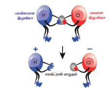
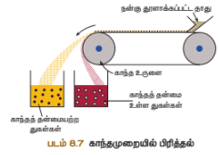
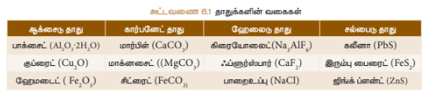
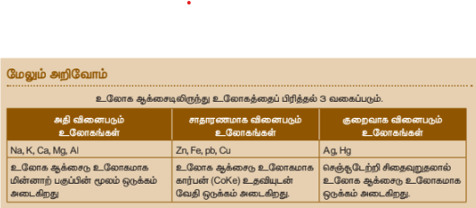
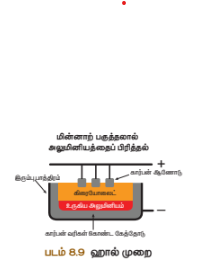
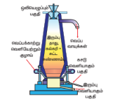
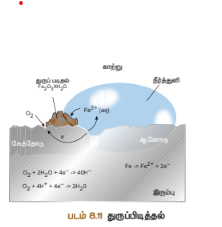

# அலகு 8
## தனிமங்களின் ஆவர்த்தனை வகைப்பாடு

### கற்றல் நோக்கங்கள்

இப்பாடப் பகுதி முடிவுறும்போது, மாணவர்கள் சிறுநிலை விளையாட்டு நன்மைகள் நவீன ஆவர்த்தனை விதியின் அடிப்படையும், அவற்றின் வளர்ச்சியும் பற்றி அறிவர்:
- நவீன ஆவர்த்தனை விதியின் அடிப்படையும், அவற்றின் வளர்ச்சியும் பற்றி அறிவர்
- தாகுதிக் குழுக்களையும், தொடர்களையும் பற்றிய சிறப்புக் குழுக்களை வரிசைப்படுத்துதல்
- தனிமங்களின் ஆவர்த்தனைப் பண்புகளை விவரித்தல்
- தாதுக்களுக்கும், கனிமங்களுக்கும் உள்ள முக்கிய வேறுபாடுகளை அறிதல்
- தாதுக்களில் உள்ள கசடுகளை நீக்கும் முறைகளை அறிதல்
- தமிழ்நாட்டில் உள்ள தவறாமல் பகுதிகளில் கண்டறியப்பட்ட கனிமங்களைப் பற்றி தெரிதல்
- உலோகங்களின் பண்புகளை உணர்தல்
- உலோகவியலில் உள்ள தவறாமல் படிநிலைகள் தெரிதல்
- உலோகக் கலவைகளும் அவற்றின் வகைகளும் பற்றி அறிவியல்பூர்வமாகச் சிந்தித்தல்
- இரெக் கலவைப்பற்றிய உண்மையை உயிர்ப்பித்தல்
- உலோக அரிமானத்தைத் தடுக்கும் முறைகளையும், அவற்றைத் தடுக்கும் முறைகளையும் புரிதல்

---

## அறிமுகம்

விஞ்ஞானத்தில், மவதியியல் துறையில் 18 ஆம் நூற்றாண்டும் 19 ஆம் நூற்றாண்டுகளில், பல பெரிய மாற்றங்கள் நிகழ்ந்தன. கி.பி (சுமார்) 1860ல் விஞ்ஞானிகளால் 60 தனிமங்களும் அவற்றின் நிறைகளும் கண்டுபிடிக்கப்பட்டிருந்தன. அவற்றுள் சில, பண்புகளில் ஒத்திருந்தால், ஒரே தாகுதிகளில் வரிசைப்படுத்தப்பட்டன. இக் காலக் கட்டத்தில் தவறாமல் புதிய தனிமங்கள் தவறாமல் பண்புகளுடன் கண்டுபிடிக்கப்பட்டன. ஒவ்வொரு தனிமத்தின் பண்புகளை நிதானமாக அறிவதற்கு, அவற்றைத் தாகுதிகளாகவும், தொடர்களாகவும் ஒருங்கிணைத்து, பின் பண்புகளை ஒப்பிட்டுப் பார்ப்பது எளிமையாக இருக்கும் என்று கருதப்பட்டது. காய்கனிகளையும், கனிகளையும் அவற்றின் பண்புகளைப் பொறுத்து வகைப்படுத்துவதுபோல் தனிமங்களை ஆவர்த்தனைப் பண்புகள் மூலம் வரிசைப்படுத்தலாம் என்று கருதினர்.

---

## 8.1 நவீன ஆவர்த்தனை விதி

மெண்டலீஃபின் ஆவர்த்தனை அட்டவணையில் தீர்க்க முடியாத சில முரண்பாடுகள் இருந்தன. உதாரணமாக அணு நிறை (39.95 amu) கொண்ட ஆர்கான் தனிமம், முன்னதாகவும், அணு நிறை (39.10 amu) கொண்ட பொட்டாசியம் தனிமம் பின்னதாகவும் வரிசைப்படுத்தப்பட்டன. அணு நிறையையே அடிப்படையாகக் கொண்டு அடுக்கும்போது, பொட்டாசியத்தின் இடம், ஆர்கானுக்குப் பிறகு இருக்கும். இதில் மெண்டலீஃபின் அமைப்பில் ஆர்கானுடன் எந்த மவதியலப் பொருளும் வகைப்படுத்தப்படவில்லை.

இவ்வாறு, அணு நிறை என்ற அடிப்படையை விட வேறு ஒரு அடிப்படைப் பண்பிற்கு வழிவகுத்தன. தேவைப்பட்ட மெண்டலீஃபின் அமைப்பில் இருந்தவர்களுக்கு அணுவில் உள்ள புரோட்டான்களின் எண்ணிக்கை அடிப்படைப் பண்பாக இருக்கிறது என்பது அறியக்கூடியதாக இருந்தது.

1912 பிரிட்டிஷ் விஞ்ஞானி ஆவர்த்தனை வரிசைப்படுத்தலுக்கு, அணு எண் என்பது சிறந்த அடிப்படை என்று உண்மையாகக் கண்டறிந்தார். அணு எண் என்பது ஒரு அணுவின் உள்ள புரோட்டானின் எண்ணிக்கையையோ, அல்லது எலக்ட்ரானின் எண்ணிக்கையையோ குறிக்கும். ஆகவே ஆவர்த்தனை விதியைக் கீழ்க்கண்டவாறு மேம்படுத்தி அறியலாம்.

> **"தனிமங்களின் இயற்பியல் மற்றும் மவதியியல் பண்புகள், அவற்றின் அணு எண்களைச் சார்ந்து அமையும்"**

---

## 8.2 நவீன ஆவர்த்தனை அட்டவணையின் அமைப்பு

அணு எண் அதிகரிப்பிற்கு ஏற்பவே நவீன அட்டவணையில் வரிசைப்படுத்தப்பட்டுள்ளன. மவதியியல் தனிமங்கள், பொருட்கள்பண்புகளை முழுமையாக உயிர்ப்பதும் வகையில், தொடர்களாகவும், தாகுதிகளாகவும், நவீன ஆவர்த்தனை அட்டவணையில் வரிசைப்படுத்தப்பட்டுள்ளன. படம் 8.1 ஆனது 118 தனிமங்கள் கொண்ட நவீன ஆவர்த்தனை அட்டவணையைக் காட்டுகிறது.

அட்டவணையின் சிறப்பம்சங்களின் தொடர்ச்சியாக, தாகுதி என்றும் தொடர்களின் சிறப்பம்சங்களை அறியவிளையாடலாம்.

### 8.2.1 தொடர்கள்

- தொடர்களாகும். ஆவர்த்தனை அட்டவணையில் மொத்தம் 7 தொடர்கள் உள்ளன.
- முதலாம் தொடர் (அணு எண் 1 மற்றும் 2) இது மிகச் சிறிய தொடராகும். இதில் ஹைட்ரஜன் என்றும் ஹீலியம் எனும் 2 தனிமங்கள் உள்ளன.
- இரண்டாம் தொடர் (அணு எண் 3லிருந்து 10 வரை) இது சிறிய தொடராகும். இதில் 'Li' யிலிருந்து 'Ne' வரை 8 தனிமங்கள் உள்ளன.
- மூன்றாம் தொடர் இதுவும் ஒரு சிறிய தொடராகும். (அணு எண் 11லிருந்து 18 வரை) இதில் 'Na' யிலிருந்து 'Ar' வரை 8 தனிமங்கள் உள்ளன.
- நான்காம் தொடர் (அணு எண் 19லிருந்து 36 வரை) இது ஒரு நீண்ட தொடராகும். இதில் "K" யிலிருந்து, "Kr" வரை, 18 தனிமங்கள் உள்ளன. இவற்றில் 8 பிரதிநிதித்துவ தனிமங்களும், 10 இடைநிலைத் தனிமங்களும் உள்ளன.
- ஐந்தாம் தொடர் (அணு எண் 37லிருந்து 54 வரை) இதுவும் ஒரு நீண்ட தொடராகும். இதில் Rb யிலிருந்து Xe வரை 18 தனிமங்கள் உள்ளன. இவற்றில் 8 பிரதிநிதித்துவ தனிமங்களும், 10 இடைநிலைத் தனிமங்களும் உள்ளன.
- ஆறாம் தொடர் (அணு எண் 55லிருந்து 86 வரை) இது மிக நீண்ட தொடராகும். இதில் 'Cs' லிருந்து, 'Rn' வரை 32 தனிமங்கள் உள்ளன. இவற்றுள் 8 பிரதிநிதித்துவ தனிமங்கள், 10 இடைநிலைத் தனிமங்கள் என்றும் 14 உள் இடைநிலைத் தனிமங்கள் (லந்தனைடுகள்) என்றும் ஆகும்.
- ஏழாம் தொடர் (அணு எண் 87லிருந்து 118 வரை) ஆனால் ஆறாம் தொடரைப் போலவே, இதுவும் 32 தனிமங்கள் கொண்டது. இதில், புதிய தனிமங்கள் அட்டவணையில் IUPAC ஆல் உட்படுத்தப்பட்டன.

### 8.2.2 தாகுதிகள்

- வரிசைப்படுத்தப்பட்ட தனிமங்கள், தாகுதிகள் எனப்படும். அட்டவணையில் மொத்தம் 18 தாகுதிகள் உள்ளன.
- தனிமங்களின் பொதுவான இயற்பியல் பண்புகளை அடிப்படையாகக் கொண்டு குடும்பங்களாகத் தாகுதிக் குழுக்களாகப் பிரிக்கப்பட்டுள்ளன.
- தாகுதி 3ல் அங்கே தாக்குதல் கிழும், லந்தனைடு என்றும் ஆக்டினைடு என்றும் உள் இடைநிலைத் தனிமங்கள் என்று அழைக்கப்படும்.
- 18வது தாகுதியைத் தவிர, மற்ற தாகுதிகளில் உள்ள தனிமங்களின் வெளிக்கூட்டில், ஒரே எண்ணிக்கை உள்ள எலக்ட்ரான்களும், ஒரே இணைதிறனும் தங்கியிருக்கும்.

**எடுத்துக்காட்டாக, தாகுதி 1ல் உள்ள தனிமங்கள் தவளி ஆற்றல் நிலையில் ஒரு எலக்ட்ரான் கொண்டு 1S¹ தங்கியிருப்பதால், கார உலோகங்களின் இணைதிறன் 1**

| தாகுதி எண் | தனிமங்களின் பொது பெயர் |
|:---|:---|
| 1 | கார உலோகங்கள் |
| 2 | கார மண் உலோகங்கள் |
| 3-12 | இடைநிலைத் தனிமங்கள் |
| 13 | போரான் குடும்ப தனிமங்கள் |
| 14 | கார்பன் குடும்ப தனிமங்கள் |
| 15 | நைட்ரஜன் குடும்ப தனிமங்கள் |
| 16 | கந்தக குடும்ப தனிமங்கள் |
| 17 | ஹாலஜன்கள் |
| 18 | புனித வாயுக்கள் |

---

**படம் 8.1** நவீன தனிம வரினச அடடவனை.

## 8.3 ஆவர்த்தனைப் பண்புகளில் ஏற்படும் நிகழ்வுகள்

தனிமங்களின் எலக்ட்ரான் அணைப்பு, சீரான நிகழும் இயல் மற்றும் மவதியியல் பண்புகளை விளக்க உதவுகின்றன.

தனிம வரிசை அட்டவணையில் தனிம வரிசை அட்டவணையில் உள்ள தனிமங்களின் பண்புகள், குறிப்பிட்ட சீரான இடைவெளிக்குப் பிறகு மீண்டும் ஒரே தனிமத்திற்கு இருக்கும் நிகழ்வு ஆவர்த்தனைப் பண்பு எனப்படும்.

ஆவர்த்தனைப் பண்புகளான அணு ஆரம், அயனி ஆரம், அயனியாக்கும் ஆற்றல், எலக்ட்ரான் கவர்ச்சி, எலக்ட்ரான் நாட்டம் ஆகியனை ஆவர்த்தனைத் தெளிவுபடுத்துகின்றன. நவீன அட்டவணையானது தனிமங்களின் பொதுப் பண்புகளையும், தாகுதி என்றும் தொடர்களிலும் ஏற்படும் தனிமங்களின் சீரான மாற்றங்களையும் அறிமுகப்படுத்துகிறது தனிமங்களுக்கும் மிகுதிகளுக்கும் இடையே உள்ள தொடர்பைக் காட்டுகிறது.

### 8.3.1 அணு ஆரம்

ஒரு அணுவின் ஆரம் என்பது அத் அணுக்கருவினையும், இணைதிறன் எலக்ட்ரான் உள்ள தவளிக்கூட்டிற்கும் இடையிலான தூரம் என்று வரையறுக்கப்படும். ஒரு தனித்த அணுவின் ஆரத்தை, நேரடியாக அளவிட முடியாது. ஏனெனில் வாயுக்கள் விரைவாக, வழக்கமாக அணு ஆரம் என்பது தொடர்புடைய அணுக்களுக்குக் கிடையே உள்ள பிணைப்பின் நீளமாகும், இப்பிணைப்பு ஆரம் அல்லது உலோக ஆரம் என்று அழைக்கப்படும். அருகருகே உள்ள இரண்டு உலோக அணுக்களின் உட்கருக்களுக்கு இடையே உள்ள தூரத்தின் பாதிமைய உலோக ஆரம் எனப்படும்.

**அ) உலோக ஆரம்** - தனிமங்களில், உள்ள அணு ஆரம் இப்பிணைப்பு ஆரம் என்று அழைக்கப்படும். ஒற்றை இப்பிணைப்பால் பிணைக்கப்பட்டுள்ள இரண்டு ஒத்த அணுக்களின் அணுக்கருக்களுக்கு இடையே ஆன தூரத்தின் பாதியளவு இப்பிணைப்பு ஆரம் எனப்படும்.

**எடுத்துக்காட்டாக,** H₂ மூலக்கூறில், இரண்டு ஹைட்ரஜன் அணுக்கருக்களுக்கு இடையில் உள்ள தூரம் 0.74 Å. இது இப்பிணைப்பு ஆரமேதானது. 0.74/2 = **0.37 Å** என்று கைக்கிடலாம்

**படம் 8.2**
அ. உலோக ஆரம்  
ஆ. சகப்பிணைவு ஆரம்

**படம் 8.3**  ஹைட்ரஜனின் அணு ஆரம்

**ஆ. உடை ஆரம்** - தனிம வரிசை அட்டவணையில் உள்ள தனிமங்களின் அணு ஆரங்களைப் பார்க்கும்போது, இருமடி நிகழ்வுகள் தெரிகின்றன. தொடரில், இடதுபுறத்திலிருந்து வலதுபுறமாகச் செல்லும்போது, தனிமங்களின் அணு ஆரங்கள் குறையும். ஆனால் தாகுதியில் மேலிருந்து கீழமாக இறங்கும்போது அணு ஆரங்கள் அதிகரிக்கும்.

இதற்கான காரணம் கீழ்க்கண்டவாறு அறியலாம்:

தாகுதியில் மேலிருந்து கீழமாக இறங்கும்போது, தவளிக்கூடு எண் அதிகரிக்கும் இதனால், தவளிக்கூட்டிற்கும் ஆற்றல் நிலைக்கும் அணுக்கருவிற்கும் இடைப்பட்ட தூரம் அதிகரித்து கவர்ச்சி விசை குறைந்து, உருவளவு பெரிதாகிறது.

தொடரில் இடதுபுறத்திலிருந்து வலதுபுறமாகச் செல்லும்போது, ஆற்றல் நிலை மேற்படுவதில்லை. ஆனால் புரோட்டானின் எண்ணிக்கை அதிகரித்ததெல்லாம். அதிகரிக்கும் மின்னூட்டத்திற்கு ஏற்ப எலக்ட்ரான்களின் மீதுள்ள கவர்ச்சி விசை அதிகரிப்பதால் அணுவின் உருவ அளவு குறைகிறது. அணு ஆரமேதானது லித்தியத்திலிருந்து பாரதானுக்குத் தெல்லாம் மிகப் பெரியது எவ்வாறு குறைகிறது என்பதைப் படம் 8.4 காட்டுகிறது.

**படம் 8.4** அணு ஆரம் மாறுபாடு

### 8.3.2 அயனி ஆரம்

ஒரு அயனியின் எலக்ட்ரான் திரள் முகில் மீது அக்கருவால் கவர்ச்சி விசை தெலுத்த இயலும் தூரத்திற்கும் இடையிலான தூரலவு அயனி ஆரம் என்று வரையறுக்கப்படும். ஒரு அணுவானது எலக்ட்ரான்களை இழந்தால், ஏறுமுக அயனியாகும். எலக்ட்ரான் இழக்கும் அணு, மின்னூட்டத்தைப் பெற்று, மின்னூட்ட அயனி என்று அழைக்கப்படும். எலக்ட்ரானை ஏற்கும் அணு, எதிர்மின்னூட்டத்தைப் பெற்று, எதிர்மின் அயனி என்று அழைக்கப்படும். கனச்சதுரங்களின் இயல்புகளையும், அயனித் திண்மங்களின் வடிவ அமைப்புகளையும், தீர்மானிக்க, அயனிகளின் உருவளவும் முக்கியமாகும். மின்னூட்ட அயனியானது அத் தொடர்புடைய அணுவைவிட உருவளவில் சிறிதாகவும், எதிர்மின் அயனியானது அத் தொடர்புடைய அணுவைவிட உருவளவில் பெரிதாகவும் காணப்படும்.

> **குறிப்பு:**
> - மின்னூட்டம் அதிகரிக்கும்போதும் மின்னூட்ட அயனியின் உருவளவு குறையும்.
> - எதிர்மின்னூட்டம் அதிகரிக்கும்போதும் எதிர்மின் அயனியின் உருவளவு அதிகரிக்கும்.

**படம் 8.5** நீர்ம மற்றும் திண்மப் பொருட்களின் கற்பித ஆரங்கள் காணப்படுகின்றன.

**உதாரணமாக** லித்தியம் என்றும் சோடியம் என்றும் பொருட்கள் தவளி ஆற்றல் நிலையில் உள்ள ஓர் எலக்ட்ரானை இழந்து மின்னூட்ட அயனிகளாகின்றன. இவ்வயனிகள், முந்தைய தொடர்புடைய அணுக்களைவிட உருவில் சிறிதாக இருக்கக் காரணம், உட்கருவிற்கும், மீதுள்ள உள் ஆற்றல் நிலை எலக்ட்ரான்களுக்கும் இடையே உள்ள அதிக கவர்ச்சி விசையே ஆகும்.

புளூரின் என்றும் குளோரின் என்றும் பொருட்கள் தவளிக்கூட்டில் ஒரு எலக்ட்ரானை ஏற்று எதிர்மின்னூட்டமுள்ள அயனிகளாகின்றன. உட்கருவானது எதிர்மின்னூட்டமுள்ள அயனிகளில் உள்ள தவளிக்கூட்டு எலக்ட்ரான்களில் காட்டும் ஈர்ப்புவிசையானது அத் தனிமத்தின் நடுநிலை அணுவில் காட்டுவதைவிடக் குறைவு. ஆகவே அணு ஆரத்தில் கண்டதும்போல், அயனி ஆரங்களும் தொடரில் இடப்புறத்திலிருந்து வலப்புறமாகக் குறைந்தும், தாகுதியில், மேலிருந்து கீழமாக அதிகரித்தும் காணப்படும்.

### 8.3.3 அயனியாக்கும் ஆற்றல்

நடுநிலைத் தன்மையுடைய தனித்த வாயு நிலை அணு ஒன்றின் இணைதிறன் கூட்டிலிருந்து இலகுவாகப் பிணைக்கப்பட்டுள்ள ஒரு எலக்ட்ரானை நீக்கி மின்னூட்ட அயனியாக்குவதற்கு மிகுந்த சக்தி தேவைப்படும் இந்த ஆற்றல், அயனியாக்கும் ஆற்றல் எனப்படும். இது அயனியாக்கும் என்றாலும் பென்றும் அழைக்கலாம். இது அலகு **KJ/mol**. அயனியாக்கும் ஆற்றல் அதிகரிக்கும்போது, எலக்ட்ரானை நீக்குவது கடினமாகின்றது.

புறமாகச் செல்லும்போது, எலக்ட்ரானை நீக்க, அதிக ஆற்றல் மிகுந்தது. ஆகவே, தொடரில், இடதுபுறத்திலிருந்து வலப்புறமாகச் செல்லும்போது, அயனியாக்கும் ஆற்றல் அதிகரிக்கின்றது. ஆனால் தாகுதியில் மேலிருந்து கீழமாக இறங்கும்போது, அணுவின் உருவளவு அதிகரிப்பதாலும், இணைதிறன் எலக்ட்ரான்கள் இலகுவாகப் பிணைக்கப்பட்டிருப்பதாலும், அயனியாக்கும் ஆற்றல் மிகச் சிறிதாகவும் மிகுந்தது. ஆகவே, தாகுதியில் மேலிருந்து கீழமாக இறங்கும்போது அயனியாக்கும் ஆற்றல் குறையும் தன்மையுடையது.

### 8.3.4 எலக்ட்ரான் நாட்டம்

ஒன்றின் இணைதிறன் கூட்டில், ஒரு எலக்ட்ரான் சேர்ந்து, அத் எதிர்மின்னூட்டமுள்ள அயனியாக உருவாகும்போது தவளிப்படும் ஆற்றல் எலக்ட்ரான் நாட்டம் எனப்படும். அயனியாக்கும் ஆற்றலைப் போலவே, எலக்ட்ரான் நாட்டமும் தொடரில் இடப்புறத்திலிருந்து, வலப்புறமாக அதிகரித்தும், தாகுதியில் மேலிருந்து கீழமாகக் குறைந்தும் காணப்படும்.

$$\mathrm{A_{(g)} + e^- \rightarrow A^-_{(g)} + \mathfrak{E}}$$

$$\mathrm{Cl_{(g)} + e^- \rightarrow Cl^-_{(g)} + 349 \text{ KJ/mol}}$$

**560-960 KJ/mol**

புனித வாயுக்கள் எலக்ட்ரான்களை ஏற்கும் தன்மையற்றவை. ஏனெனில், அவற்றின் தவளி நிலையில் உள்ள s மற்றும் p ஆர்பிட்டல்களும் முழுமையாக எலக்ட்ரான்களால் நிரம்பஉள்ளன. அதனால் மேலும் ஒரு எலக்ட்ரானைச் சேர்ப்பது இயலாது. எனவே இவற்றின் எலக்ட்ரான் நாட்டம் பூஜ்ஜியம் அல்லது எதிர் மதிப்புடையவை.

### 8.3.5 எலக்ட்ரான் கவர்ச்சி

இப்பிணைப்பால் பிணைக்கப்பட்டுள்ள மூலக்கூறில் உள்ள ஒரு அணுவானது, இப்பிணைப்பில் பங்கிடப்பட்டுள்ள எலக்ட்ரான் இணையினைத் தன்மையாக்கி கவரும் பண்பு, எலக்ட்ரான் கவர்திறன் எனப்படும்.

**உதாரணமாக** HCl மூலக்கூறை எடுத்துக்காட்டாகக் கொள்வோம். ஹைட்ரஜன் என்றும் குளோரின் அணுக்கள் ஒரு எலக்ட்ரானைப் பங்கிட்டு இப்பிணைப்பினை உருவாக்கும். குளோரின் அணுவிற்கு எலக்ட்ரான் கவர்ச்சி அதிகம். அதனால், பங்கீட்டு எலக்ட்ரான்களை ஹைட்ரஜனைவிட, குளோரின் அணு தன்மையாக்கி இழுத்துக்கொள்ளும். பிணைப்பு உண்டாகும்போது பிணை எலக்ட்ரான், குளோரினுடன் தங்கி H⁺ என்றும் Cl⁻ அயனிகள் உருவாகும்.

**படம் 8.6** ஹைட்ரஜனுக்கும் குளோரினுக்கும் இடையில் உள்ள ஈர்ப்பு எவ்வாறு உள்ளது என்பதைக் காட்டுகிறது

எலக்ட்ரான் கவர்ச்சியைக் கீழ்க்கண்டவாறு முடிவுகளான, பிணைப்பு ஆற்றல், அயனியாக்கும் ஆற்றல், எலக்ட்ரான் நாட்டம் ஆகியவற்றைச் சேர்ந்து அளவிடலாம்.

எலக்ட்ரான் கவர்ச்சியைக் கைக்கிடுவதில், பாலிங் அளவீடு பெரும் பங்களிக்கின்றது. இதன்மூலம், ஒரு மூலக்கூறின் அணுக்களுக்கு இடையில் உள்ள பிணைப்பின் நீளமான (அயனிப்பிணைப்பு அல்லது இப்பிணைப்பு) சில தனிமங்களின் எலக்ட்ரான் கவர்ச்சியைக் கீழ்க்கண்டவாறு அளவிடலாம்:

**F = 4.0, Cl = 3.0, Br = 2.8, I = 2.5, H = 2.1, Na = 0.9**

இரு அணுக்களுக்கு இடையே உள்ள எலக்ட்ரான் கவர்ச்சி வித்தியாசம் 1.7 என்று இருந்தால், அப்பிணைப்பு 50% அயனித்தன்மையும், 50% இப்பிணைப்புத் தன்மையையும் தங்கியிருக்கும். அவ்வித்தியாசம் 1.7ஐ விடக் குறைவாக இருந்தால் அப்பிணைப்பு அதிக இப்பிணைப்புத் தன்மையுடையது. வித்தியாசமேதானது 1.7ஐ விட அதிகமானால் அப்பிணைப்பு அதிக அயனிப்பிணைப்பு.

தொடரில், இடப்பக்கத்திலிருந்து வலப்பக்கமாகச் செல்லும்போது எலக்ட்ரான் கவர்ச்சி அதிகரிக்கும். ஏனெனில் அணுக்கரு மின்னூட்டம் அதிகரிக்கும்போது, எலக்ட்ரான் கவர்ச்சி விசை அதிகமாகும். தாகுதியில் மேலிருந்து கீழமாக இறங்கும்போது எலக்ட்ரான் கவர்ச்சி குறைகிறது. ஏனெனில், ஆற்றல் நிலையின் எண்ணிக்கை அதிகரிப்பதால்.

| ஆவர்த்தனைப் பண்பு | தொடரில் (இடம் → வலம்) | தாகுதியில் (மேல் → கீழ்) |
|:---|:---|:---|
| அணு ஆரம் | குறைகிறது | அதிகரிக்கிறது |
| அயனி ஆரம் | குறைகிறது | அதிகரிக்கிறது |
| அயனியாக்கும் ஆற்றல் | அதிகரிக்கிறது | குறைகிறது |
| எலக்ட்ரான் நாட்டம் | அதிகரிக்கிறது | குறைகிறது |
| எலக்ட்ரான் கவர்ச்சி | அதிகரிக்கிறது | குறைகிறது |

---

## சுயசோதனை

கீழ்க்கண்ட மூலக்கூறுகளில் உள்ள பிணைப்பின் தன்மையைக் கண்டறிக்க:

| (i) NaCl | (ii) NaBr | (iii) NaI |
|:---|:---|:---|
| (iv) NaF | (v) NaH | |

---

## 8.4 உலோகவியல்

நெடுநிலை வாழ்வுத் தவறாமல் உலோகங்களுடன் தொடர்புடையது. அனைத்து வாழ்வியலில், உலோகங்களின் முக்கிய பயன்பாடுகள் உள்ளன. நெடுநிலை உடலில் மெக்னீசியம், பொட்டாசியம், கால்சியம், இரும்பு முதலான உலோகங்கள் இன்றியமையா இடம்பெற்றுள்ளன. இவ்வுலோகங்களின் குறைபாடுகளால் ஏற்படும் நோய்களைப் பற்றி தெரிந்து, மனிதர்களை உருவாக்குவதற்காகும். ஆகவே, உலோகங்கள், நம்வாழ்வில் முக்கியப் பங்கு வகிக்கின்றன.

இப்பகுதியில், உலோகவியல் மூலம் உலோகங்கள் எவ்வாறு பிரித்தெடுக்கப்படுகின்றன என்பதைப் பார்ப்போம்.

உலோகங்களை அவற்றின் தாதுக்களிலிருந்து பிரித்தெடுத்து, இயல் மற்றும் மவதியியல் பண்புகளுக்கு ஏற்பவாறு அவற்றை உலோகக் கலவைகளாக்கி, தவறாமல் பயன்பாட்டுக்கு உட்படுத்தும் அறிவியல் உலோகவியல் எனப்படும். உலோகவியலின் முக்கிய படிநிலைகள் மூன்று வகையாகக் காணப்படுகின்றன:

1. **தாதுக்களை அடர்ப்பித்தல்** - இம்முறையின் மூலம், தாதுக்களில் உள்ள கசடுகள் நீக்கப்படுகின்றன.
2. **தாதுவை உருவாக்கல்** - இம்முறையில், தாதுவிலிருந்து உலோகம் பிரித்தெடுக்கப்படுகிறது.
3. **தாதுவைத் தூய்மையாக்கல்** - இம்முறையில் உலோகமானது தூய்மையாக்கப்படுகிறது.

### 8.4.1 தாதுக்கள்

அல்லது தவறாமல் பொருட்களைச் சேர்த்து அடக்கிய கூட்டுக் கலவையாகக் காணப்படுவதாகவும் புவியில் காணப்படும்.

சிக்கலானதாக, பெரிய அளவில் பிரித்தெடுக்க முடிகிறதா அதுமவ்தாது எனப்படும்.

**பாக்சைட்** (Al₂O₃·2SiO₂·2H₂O) அலுமினியத்தின் கனிமங்களாகும். ஆனால், பாக்சைட்டிலிருந்து அலுமினியம் இலாபகரமாகப் பிரித்தெடுக்க முடிவதால், பாக்சைட்டானது அலுமினியத்தின் தாது என்றும், களிமண் அக்கனிமம் என்றும் அழைக்கப்படும்.

பிரிக்கும் முறைமை சுரங்க உற்பத்தி எனப்படும்.

தாது பொதுவாகக் கலந்துள்ள கள் என்றும் பொருட்கள் காணப்படுவதால், அளவான காற்றில் கலந்துள்ள கள் தாது கூழ்மம் எனப்படும்.

உருகிடும் பொருளாக்கி, அணு நீக்கித் தாதுவுடன் சேர்க்கும் பொருளும் உள்ள இளக்கி எனப்படும். எ.கா CaO (காரத்தன்மையது), SiO₂ (அமிலத்தன்மையது) கூழ்மத்துடன் வினைபுரிந்து உருவாக்கும் விளை பொருளும் கெடு எனப்படும்.

**வறுத்த உலோக ஆக்ஸைடு**, உலோகமாக உருகிய நிலையில், தேவையான ஒரு ஒடுக்கவினைமை உருக்கிப் பிரித்தல் ஆகும். இம்முறையில் காங்கு எனப்படும் கசடுகள், சேர்க்கப்பட்ட இளக்கியால் கெடுதாக நீக்கப்படுகின்றன.

---

## முனைகள் அல்லது அடர்ப்பிக்கும் முனைகள்

அவற்றிலிருந்து உலோகத்தைப் பிரித்தெடுக்கும் முறையானது நன்கு வகைப்படுத்தப்படும். அட்டவணை-8.1ல் உலோகங்களின் தவறாமல் தாதுக்கள் பட்டியலிடப்பட்டுள்ளது.

நன்கு தூளாக்கப்பட்ட தாதுக்களை அடர்ப்பிக்கும் முறைகள் கீழ்க்கண்டவாறு அணுகின்றன:

### 1. காந்தப் பிரித்தல்

இடையில் உள்ள அடர்த்தி மவறுபாடு இம்முறையின் அடிப்படையாகும். ஆக்ஸைடு தாதுக்கள் இம்முறையினால் தூய்மையாக்கப்படுகின்றன. எ.கா மக்னடைட் Fe₂O₃ (இரும்பின் தாது) கசடுகளைவிட கனமானதாக (அடர்த்தி மிகுந்ததாக) இருக்கும்போது இப்பிரித்தெடுத்தல் முறை பயன்படுகிறது.

தூள் தாதுவின் மேல் தட்டப்படும். பின்னர் நீரானது மேல்பீய்ச்சி அடிக்கப்படும். இதனால், அடர்த்தி மிகு தாது தூள்கள் கீழே இறங்கிவிடாமல் தாதுக் கூழ்மங்கள், நன்னீரால் கழுவி நீக்கப்படுகின்றன.

### 2. மிதப்பு முறை

அடிப்படையாக அணுகின்றது. தாதுமவதா அல்லது தாது கூழ்மமேதாக இருந்தாலும், இம்முறை பயன்படுத்தப்படும். எ.கா காசிட்டரைட் SnO₂ தவள்ளீயத்தின் தாது.

உலோக உருண்டைகளுக்கு ஊம்புதல் மூலம் இயங்கும் பல்டினம் மூலம் தட்டப்படுகின்றது. இவ்வுருண்டைகளில் ஒன்று காந்தத்தன்மையுடன் இருப்பதால், காந்தப்பொருட்கள் காந்தத்தன்மையுடைய உருண்டையால் ஈர்க்கப்பட்டு காந்தத்தன்மையற்றது போன்றவைத் தனலவில் தெறிந்து பிரிக்கப்படும்.

**படம் 8.7** காந்தமுனையில் பிரித்தல்

**படம் 8.8** நுரைமிதப்புமுறை
---

## 8.5 உலோகங்களின் வகைப்பாடு

| உலோகங்கள் | உதாரணங்கள் |
|:---|:---|
| Na, K, Ca, Mg, Al | Zn, Fe, Pb, Cu | Ag, Hg |
| கார உலோகங்கள் | இடைநிலை உலோகங்கள் | புற உலோகங்கள் |

(டங்க்ஸ்டன் விரைவாக)
திரவ கனரப்பொருட்களில் கனரவதில்லை.

### 8.6.2 உலோக அணுக்கள்

பொதுவாக 1, 2 அல்லது 3 எலக்ட்ரான்கள் தவளிக்கூட்டில் தங்கியுள்ளன.

எலக்ட்ரான்களை இழந்து மின்னூட்ட அயனிகளாகும் தன்மை உடையவை. அதனால் அணவமின்னூட்டத்தைப் பெறும்.

பொருட்கள் மின்னறை பகுதியில் வினையினம்போது, உலோக அயனிகள் எதிர்மினவாய்வந்தன.

ஆவி நிலையில், ஒற்றை அணுக்கட்டு எண்ணைத் தங்கியுள்ளன.

பொதுவாக காரத்தன்மை உடையன.

---

## 8.7 அலுமினியம்

உலோகம் அலுமினியம் ஆகும். இது வினைபடும் திறன் அதிகம். அதனால் மறைநிலையில் இது காணப்படும். இதன் முக்கிய தாதுக்கள் கீழ்க்கண்டவாறு எழுதலாம்:

| தாது | வாய்பாடு |
|:---|:---|
| பாக்சைட் | Al₂O₃·2H₂O |
| கிரையோலைட் | Na₃AlF₆ |
| கருந்தாது | Al₂O₃ |

ஆகும். இத்தாதுவிலிருந்து அலுமினியம் பிரித்தெடுத்தல், 2 நிலைகளில் நடைபெறுகிறது.

### (பேயர் முறை)

பாக்சைட்டுடன் அலுமினாவாக்குவதற்காக இரண்டு படிநிலைகளை உள்ளடக்கியது.

மெக்னீசியத்துடன் 1500°C சூடான நிலையில், குறிப்பிட்ட அழுத்தத்தில் வினைப்படுத்தும்போது, மெக்னீசியம் தேட்டா அலுமினைட் உருவாகிறது.

$$\mathrm{Al_2O_3 + 2NaOH \rightarrow 2NaAlO_2 + H_2O}$$

நீரக்கச் செய்வதால், அலுமினியம் ஹைட்ராக்ஸைடு வீழ்படிவு உருவாகிறது.

$$\mathrm{NaAlO_2 + 2H_2O \rightarrow Al(OH)_3 + NaOH}$$

1000°C சூடான நிலையில் உலர்த்திட, அலுமினா உருவாகிறது.

$$\mathrm{2Al(OH)_3 \xrightarrow{1000^{\circ}C} Al_2O_3 + 3H_2O}$$

### ஒடுக்கம் வசப்படுத்தல் (ஹால் முறை)

மின்னறை பகுப்பு கலனில் உருகிய அலுமினாவை, மின்னறை பகுப்புமுறையில் ஒடுக்கிட, அலுமினியம் கிடைக்கிறது.

அலுமினியம் எதிர்மினவாயிலும், ஆக்ஸிஜன் மின்னூட்டவாயிலும் தவளியாகிறது. தவளியாகும் ஆக்ஸிஜன், கிராஃபைட்டுடன் சேர்ந்து CO₂ வாயு தேறுகிறது.

**குறிப்பு:**
- புளூரஸ்பார் (இது மின்படலியின் உருக்கச் சூடான நிலையைக் குறைக்கும்)
- 900°C -950°C மின் அழுத்தம்: 5-6V
- மொத்த வினை: 2Al₂O₃ → 4Al + 3O₂↑

**படம் 8.9** ஹால் முறை

### அலுமினியத்தின் இயல்புகள்

- உலோகம்
- இது மெல்லியது, அடர்த்தி குறைந்த உலோகம் (2.7)
- இது கடினமானது, கம்பியாக நீட்டலாம்.
- இது தவப்பண்ணியும், மின்தாரண்ணியும் நன்கு கடத்தும்.
- இதன் உருகு நிலை 660°C
- பிரகாசமான ஒளிரும் திறன் கொண்டதாகவும் இருக்கிறது.

### வினைகள்

**1. காற்றுடன் வினை:**
வினைபுரியாது. 800°C சூடான நிலையில் அலுமினியம் காற்றுடன் வினைபுரிந்து ஆக்ஸைடு என்றும் நைட்ரைடு என்றும் கொண்ட உருவாக்கும்.

$$4Al + 3O_2 \rightarrow 2Al_2O_3 \text{ (அலுமினியம் ஆக்ஸைடு)}$$

$$2Al + N_2 \rightarrow 2AlN \text{ (அலுமினியம் நைட்ரைடு)}$$

**2. நீருடன் வினை:**
நீருடன் அலுமினியம் வினைபுரியாது. ஆனால் நீராவியுடன் சூடாக்கப்பட்ட அலுமினியம், வினைபுரிந்து அலுமினியம் ஆக்ஸைடும், ஹைட்ரஜன் வாயுவையும் உருவாக்குகிறது.

$$2Al + 3H_2O \rightarrow Al_2O_3 + 3H_2 \uparrow$$

**3. காரங்களுடன் வினை:**
காரங்களுடன் அலுமினியம் வினைபுரிந்து அலுமினைட்டுகளை உருவாக்குகிறது.

$$2Al + 2NaOH + 2H_2O \rightarrow 2NaAlO_2 + 3H_2 \uparrow$$

**அமிலங்களுடன்** அலுமினியம் வினைபுரிந்து H₂ வாயுவை வெளியிடுகிறது.

$$2Al + 6HCl \rightarrow 2AlCl_3 + 3H_2 \uparrow \text{ (அலுமினியம் குளோரைடு)}$$

அலுமினியம் நீர்த்த எல்பியூரிக் அமிலத்துடன் ஹைட்ரஜன் வாயுவையும், அடர் எல்பியூரிக் அமிலத்துடன் எல்பர்-டை-ஆக்ஸைடு வாயுவையும் வெளியிடுகிறது.

$$2Al + 3H_2SO_4 \rightarrow Al_2(SO_4)_3 + 3H_2$$

$$2Al + 6H_2SO_4 \rightarrow Al_2(SO_4)_3 + 6H_2O + 3SO_2 \uparrow$$

**குறிப்பு:**
நீர்த்த என்றும் அடர் நைட்ரிக் அமிலம் அலுமினியத்துடன் வினைபுரிவதில்லை. ஏனெனில் அலுமினியத்தின் மேல் ஆக்ஸைடு படலம் உருவாவதால், அதன் வினைபடும் திறன் தடுக்கப்படுகிறது.

### தேர்மோமைட் வினை

காண்ட் கலவையைச் சூடாக்கும்போது இரும்பு ஆக்ஸைடு இரும்பாக ஒடுக்கப்படுகின்றது. இவ்வினை அலுமினியத் தவப்பு ஒடுக்கவினை ஆகும்.

$$\mathrm{Fe_2O_3 + 2Al \rightarrow 2Fe + Al_2O_3 + \text{சக்தி}}$$

**பயன்கள்:**
- வீட்டுப் பாத்திரங்கள் தயாரிக்கப் பயன்படுகிறது.
- மின்கம்பி தயாரிக்கப் பயன்படுகிறது.
- விமானம் ஏற்றும் தொழிலில் இயந்திரங்களின் பாகங்களைத் தயாரிக்கப் பயன்படுகிறது.

---

## 8.8 செம்பு (தாமிரம்)

மரநேரத்தினர்களால், இவ்வுலோகம் குப்ரம் என்று அழைக்கப்பட்டது. ஏனெனில் சைப்ரஸ் என்னும் தீவிலிருந்து எடுக்கப்பட்டதால் அவ்வாறு அழைக்கப்பட்டது. இது தனித்தும், சேர்ந்தும் காணப்படும்.

| தாது | வாய்பாடு |
|:---|:---|
| கால்கோபைரைட் | CuFeS₂ |
| குப்ரைட் | Cu₂O |
| கால்கோசைட் | Cu₂S |

காப்பரின் முக்கிய தாது காப்பர் பைரைட் CuFeS₂. இதில் சுமார் 1% தாமிரம் இத்தாதுவில் இருந்து பெறப்படுகின்றது. தாமிரம் பிரித்தெடுத்தல் கீழ்க்கண்ட படிநிலைகளில் நடைபெறுகிறது.

1. தாதுவானது, நுணரமைப்பு முறையில் தெறிவூட்டம் செய்யப்படுகிறது.
2. ஆக்ஸிஜன் முன்னிலையில் வறுக்கப்படுகின்றது. அதனால் ஈரம் என்றும் ஆவியாகும் கசடுகளும் நீக்கப்படுகின்றன. சல்பர், பாஸ்பரஸ், ஆர்சனிக் என்றும் ஆன்டிமனி போன்றவை ஆக்ஸைடுகளாகத் தேறி நீக்கப்படுகின்றன.

$$\mathrm{2CuFeS_2 + O_2 \rightarrow Cu_2S + 2FeS + SO_2 \uparrow}$$

காப்பர் பைரைடானது, காப்பர், இரும்பு சல்பைடுகளாகப் பகுதியளவு தேறுகிறது.

**3. உருக்கிப் பிரித்தல்:**
வறுக்கப்பட்ட தாதுவானது தூளாக்கப்பட்ட கார்பன் என்றும் சுண்ணாம்புக் கல் இவற்றை 8:4:1 என்ற விகிதத்தில் எடுத்துக்கொண்டு, உலையின் மேலுள்ள கிண்ணைக் கூம்பு அணைப்புவழியாக, தெளிப்படுகிறது. உலையில் மூன்று முக்கியப் பகுதிகள் உள்ளன.

### அ) உலையின் மேல் பகுதி

1500°C சூடாக்காற்றுடன் தாதுக் கலவை சேரும்போது, ஆக்ஸிஜனுடன் எரிந்து CO₂ வாயாகத் தேறுகிறது.

$$\mathrm{C + O_2 \xrightarrow{1500^{\circ}C} CO_2 + \text{வெப்ப ஆற்றல்}}$$

### ஆ) உலையின் நடுப் பகுதி

1000°C இங்கு CO₂ ஆனது CO ஆக ஒடுக்கேறுகிறது.

$$\mathrm{CO_2 + C \xrightarrow{1000^{\circ}C} 2CO}$$

சுண்ணாம்புக் கல் சிதைந்து, கால்சியம் ஆக்ஸைடாகவும், CO₂ வாயுவையும் தரும்.

$$\mathrm{CaCO_3 \xrightarrow{1000^{\circ}C} CaO + CO_2}$$

உட்கவரப்படுவதால் தவப்பதாகும் வினைகள் ஆகும். கால்சியம் ஆக்ஸைடு சிலிகாவுடன் சேர்ந்து கால்சியம் சிலிகேட் எனும் கெடுதாகிறது.

$$\mathrm{CaO + SiO_2 \rightarrow CaSiO_3}$$

### இ) உலையின் கீழ் பகுதி

இப்பகுதியில் 400°C சூடான நிலையில் ஃபெரிக் ஆக்ஸைடு, கார்பன் மோனாக்ஸைடு மூலம் இரும்பாக ஒடுக்கம் அடைகிறது.

$$\mathrm{Fe_2O_3 + 3CO \xrightarrow{400^{\circ}C} 2Fe + 3CO_2 \uparrow}$$

கெடு நீக்கிய பின்னர், உருகிய இரும்பானது, உலையின் அடியில் சேர்க்கப்படும். இவ்விரும்பம் மீண்டும் உருக்கப்பட்டு விட்டு விட்டு அச்சுகளில் வார்க்கப்படுவதால், இது வார்ப்பு இரும்பு எனப்படும்.

### தாமிரத்தின் இயல்புகள்

- தவள்ள நிறமுடையது.
- இழுவிசை, கடத்தும் தன்மை என்றும் கம்பியாக்கும் தன்மையுடையதாக இருக்கும்.
- காந்தத்தேற்கு இயலும்.
- இதன் உருகு நிலை 1356°C.

### வினைகள்

**1. காற்றுடன் வினை:**
CO₂ என்றும் ஈரப்பதத்துடன் வினைபுரிந்து, பச்சை நிறக் காப்பர் கார்பனைட் படலத்தை உருவாக்குகிறது.

$$2Cu + O_2 + CO_2 + H_2O \rightarrow CuCO_3 \cdot Cu(OH)_2$$

**2. வெப்பத்துடன் வினை:**
தவறாமல் வெப்ப நிலைகளில், தாமிரம், ஆக்ஸிஜனுடன், வினைபுரிந்து இருமடி ஆக்ஸைடுகளை உருவாக்கும். CuO, Cu₂O.

$$2Cu + O_2 \xrightarrow{<1370K} 2CuO \text{ (குப்ரிக் ஆக்ஸைடு - கறுப்பு நிறம்)}$$

$$4Cu + O_2 \xrightarrow{>1370K} 2Cu_2O \text{ (குப்ரஸ் ஆக்ஸைடு - சிவப்பு நிறம்)}$$

**3. அமிலங்களுடன் வினை:**

**அ. நீர்த்த HCl என்றும் H₂SO₄ உடன் வினை:**
காற்றில்லாச் சூழ்நிலையில், நீர்த்த HCl என்றும் H₂SO₄ அமிலங்களுடன் வினைபுரியாது. ஆனால் காற்றின் முன்னிலையில் அமிலத்தில் கரைகின்றது.

$$2Cu + 4HCl + O_2 \rightarrow 2CuCl_2 + 2H_2O$$

$$Cu + 2H_2SO_4 \rightarrow CuSO_4 + SO_2 \uparrow + 2H_2O$$

**HNO₃:**
HNO₃ ஆக்ஸைடு வாயுவை வெளிமயற்றுகின்றது.

$$3Cu + 8HNO_3 \rightarrow 3Cu(NO_3)_2 + 2NO \uparrow + 4H_2O$$

**4. குளோரினுடன் வினை:**
தாமிரம், குளோரினுடன் வினைபுரிந்து காப்பர்(II) குளோரைடை உருவாக்குகின்றது.

$$\mathrm{Cu + Cl_2 \rightarrow CuCl_2}$$

**5. காரத்துடன் வினை:**
தாமிரம் காரத்தினால் எந்தப் பாதிப்பும் அடைவதில்லை.

### பயன்கள்

- உருவாக்கப் பயன்படுகிறது.
- கமலதாரி மீட்டர், பாத்திரங்கள், நதையங்கள் முதலானவற்றை உருவாக்கப் பயன்படுகிறது.
- மினமுலாம்பூசப் பயன்படுகிறது.
- தங்கம் என்றும் தவள்ளியுடன் கலந்து, உலோகக் கலவையாக்கி நதையங்கள் என்றும் அணிகலன்கள் உருவாக்கப் பயன்படுகிறது.

---

## 8.9 இரும்பு

அதிகமாகக் காணப்படும் உலோகம் இரும்பு. இயற்கையில், இது ஆக்ஸைடு, சல்பைடு என்றும் கார்பனைட்டுகளாகக் கிடைக்கின்றன. இரும்பின் தாதுக்களாவன:

| தாது | வாய்பாடு |
|:---|:---|
| ஹேமட்டைட் | Fe₂O₃ |
| மேக்னடைட் | Fe₃O₄ |
| பைரைட் | FeS₂ |

### இரும்பின் பிரித்தெடுத்தல்

தூளாக்கப்பட்ட தாதுவை, சீராக ஓடும் நீரில் கழுவும்போது மலைதான கசடுகள் அகற்றப்பட்டு, கனமானதான தாதுக்கள் கீழே படிகின்றன.

**2. காற்றுள்ள மற்றும் காற்றில் வாசூழலில் வறுத்தல்:**
அடர்ப்பிக்கப்பட்ட தாதுவானது, அளவான காற்றில் உலையில் சூடாக்கப்படும்போது, ஈரப்பதம் தவளிமயறி சல்பர், ஆர்சனிக் என்றும் பாஸ்பரஸ் கசடுகள் ஆக்ஸிஜனுடன் எரிந்து அகற்றப்படுகின்றன.

**3. ஊது உலையில் உருக்கிப் பிரித்தல்:**
வறுக்கப்பட்ட தாது, கல் கரி, சுண்ணாம்புக் கல் இவற்றை 8:4:1 என்ற விகிதத்தில் எடுத்துக்கொண்டு, உலையின் மேலுள்ள கிண்ணைக் கூம்பு அணைப்புவழியாகத் தெளிப்படுகிறது. உலையில் மூன்று முக்கியப் பகுதிகள் உள்ளன.

**படம் 8.10** ஊது வெப்ப உலை
### அ) உலையின் மேல் பகுதி

1500°C சூடாக்காற்றுடன் தாதுக் கலவை சேரும்போது, ஆக்ஸிஜனுடன் எரிந்து CO₂ வாயாகத் தேறுகிறது.

$$\mathrm{C + O_2 \xrightarrow{1500^{\circ}C} CO_2 + \text{வெப்ப ஆற்றல்}}$$

தவளியாவதால் தவப்பு விளைவினை எனப்படும்.

### ஆ) உலையின் நடுப் பகுதி

1000°C இங்கு CO₂ ஆனது CO ஆக ஒடுக்கேறுகிறது.

$$\mathrm{CO_2 + C \xrightarrow{1000^{\circ}C} 2CO}$$

சுண்ணாம்புக் கல் சிதைந்து, கால்சியம் ஆக்ஸைடாகவும், CO₂ வாயுவையும் தரும்.

$$\mathrm{CaCO_3 \xrightarrow{1000^{\circ}C} CaO + CO_2}$$

உட்கவரப்படுவதால் தவப்பதாகும் வினைகள் ஆகும். கால்சியம் ஆக்ஸைடு சிலிகாவுடன் சேர்ந்து கால்சியம் சிலிகேட் எனும் கெடுதாகிறது.

$$\mathrm{CaO + SiO_2 \rightarrow CaSiO_3}$$

### இ) உலையின் கீழ் பகுதி

இப்பகுதியில் 400°C சூடான நிலையில் ஃபெரிக் ஆக்ஸைடு, கார்பன் மோனாக்ஸைடு மூலம் இரும்பாக ஒடுக்கம் அடைகிறது.

$$\mathrm{Fe_2O_3 + 3CO \xrightarrow{400^{\circ}C} 2Fe + 3CO_2 \uparrow}$$

கெடு நீக்கிய பின்னர், உருகிய இரும்பானது, உலையின் அடியில் சேர்க்கப்படும். இவ்விரும்பம் மீண்டும் உருக்கப்பட்டு விட்டு விட்டு அச்சுகளில் வார்க்கப்படுவதால், இது வார்ப்பு இரும்பு எனப்படும்.

### இரும்பின் இயல்புகள்

- தவள்ள நிறமுடையது.
- இழுவிசை, கடத்தும் தன்மை என்றும் கம்பியாக்கும் தன்மையுடையதாக இருக்கும்.
- காந்தத்தேற்கு இயலும்.

### வினைகள்

**1. காற்றுடன் வினை:**
பொதுவாக வினைபுரிந்து இரும்பு ஆக்ஸைடு உருவாகிறது.

$$3Fe + 2O_2 \rightarrow Fe_3O_4 \text{ (மேக்னடைட்)}$$

ஈரக் காற்றுடன் வினைபுரிந்து பழுப்பு நிற, நீரற்ற ஃபெரிக் ஆக்ஸைடு உருவாக்குகின்றது. இச்செயல்முறை துரு எனப்படும். இந்நிகழ்ச்சி துரு பிடித்தல் எனப்படும்.

$$4Fe + 3O_2 + xH_2O \rightarrow 2Fe_2O_3 \cdot xH_2O \text{ (துரு)}$$

மேலும், நீராவியைப் பாய்ச்சும்போது மேக்னடைட்டிக் ஆக்ஸைடு உருவாகிறது.

$$3Fe + 4H_2O \rightarrow Fe_3O_4 + 4H_2$$

**4. குளோரினுடன் வினை:**
இரும்பு குளோரினுடன் சேர்ந்து ஃபெரிக் குளோரைடு உருவாகிறது.

$$2Fe + 3Cl_2 \rightarrow 2FeCl_3 \text{ (ஃபெரிக் குளோரைடு)}$$

நீர்த்த HCl என்றும் H₂SO₄ அமிலங்களுடன் இரும்பு வினைபுரிந்து, H₂ வாயுவை வெளிமயற்றுகின்றது.

$$Fe + 2HCl \rightarrow FeCl_2 + H_2 \uparrow$$

$$Fe + H_2SO_4 \rightarrow FeSO_4 + H_2 \uparrow$$

நிலையில் வினைபுரிந்து பாஸ்பேட் நைட்ரேட்டு என்றும் அம்மோனியம் நைட்ரேட்டுடன் உருவாக்குகின்றது.

$$\mathrm{Fe + 10HNO_3 \rightarrow 4Fe(NO_3)_2 + NH_4NO_3 + 3H_2O}$$

ஃபெரிக் சல்பேட்டு உருவாக்குகின்றது.

$$2Fe + 6H_2SO_4 \rightarrow Fe_2(SO_4)_3 + 3SO_2 + 6H_2O$$

அடர் நைட்ரிக் அமிலத்தில், இரும்பு அமிழ்த்தும்போது இரும்பு ஆக்ஸைடு படலம் உருவாவதால், இரும்பு வினைத்திறனை இழக்கின்றது.

### பயன்கள்

- (இரும்பு) ஸ்டவ்கள், கழிவுநீர்க் குழாய்கள், மரடிமயட்டர்கள், கழிவுநீர்த் தாக்கணக் கூடிகள் இரும்பு மவலிகள் ஆகியவற்றை உருவாக்கப் பயன்படுகிறது.
- கட்டிடக் கட்டுமானங்கள், எந்திரங்கள் மின்கடத்தும் கம்பிகள், T.V ம்கதாபுரங்கள் என்றும் உலோகக் கலவைகள் ஆகியவற்றை உருவாக்கப் பயன்படுகிறது.
- தனிரும்பு (<0.25% கார்பன் உடைய இரும்பு) கம்பிச் சுருள், மின்காந்தங்கள் நங்கூரம் இவற்றைத் தயாரிப்ப பயன்படுகிறது.

---

## 8.10 உலோகக் கலவைகள்

அல்லது உலோகங்களும், அமிலோகங்களும் சேர்ந்த ஒரு படித்தான கலவையான உலோகக் கலவை ஆகும்.

உலோகக் கலவையின் பண்புகள், அக் கலவையில் உள்ள உலோகத்தின் பண்புகளிலிருந்தே தேறுபடும். தூய்ங்கமாக மிகுதேனையான உலோகம். அத்துடன் சிறிதளவு காப்பரைச் சேர்க்கும்போது, வலிமையும், பயன்பாடும் அதிகரிக்கின்றது.

### 8.10.1 உலோகக் கலவையின் வகைகள்

**இருக் கலவை:**
சேர்ந்த கலவையாகும். எலக்ட்ரான்களுக்கும், மின்னூட்டத்தைக் கொண்ட உலோக அயனிகளுக்கும் இடைப்பட்ட நிண்ம மின்கவர்ச்சி விசையால், விளையும் உலோகப் பிணைப்பின் மூலம் இக் கலவைகள் உருவாகின்றன. எ.கா: சில்வர் பிரான்ஸ். இது பறகுழிகள் அணுக்கப் பயன்படுகிறது.

**குணங்கள்:**
- மவதிப் பண்புகளைத் தேற்றியணைக்க
- உருகு நிலையைக் குறைக்க
- கடினத்தன்மை என்றும் இழுவிசையை அதிகரிக்க
- மின்தடையை அதிகரிக்க

### உருவாக்கும் முறைகள்

**8.10.2 உலோகக் கலவை உருவாக்கல்**

உலோகக் கலவைகள் பின்வரும் முறைகள் மூலம் பிதிரள்ள உருவாகிறது.

**கரைத்தல்:**
பிஸ்மத், ஈயம் என்றும் காட்மியம் தூள்மபோன்றவற்றை உருக்கிச் சேர்த்துக் கலவையாகும்.

**திடக்கனசல்களான உலோகக் கலவை:** உலோகக் கலவையின் திடக் கனசல் என்று கூறலாம். இதில், தெறிவு நிறைந்துள்ள உலோகம் கனரப்பொருளாகும். மற்ற உலோகங்கள் கனரப் பொருள்கள் எனப்படும்.

எ.கா: பித்தளை என்ற உலோகக் கனசலில் தவள்ளி என்பது கனரப் பொருள்: காப்பர் என்பது கனரப்பொருளாகும்.

### 8.10.3 உலோகக் கலவையின் வகைகள்

கலவையை இரண்டாகப் பிரிக்கலாம்.

**ஃபெரஸ் இல்லா உலோகக் கலவை:** இதில் இரும்பின் முக்கிய பங்களிப்பு இல்லை. எ.கா: அலுமினியக் கலவை, காப்பர் கலவை.

**காப்பர் கலவை (இரும்பு அற்றது)**

| கலவை | உலோகங்கள் | பயன்கள் |
|:---|:---|:---|
| பித்தளை (Cu, Zn) | குடோணிகள், பல்புகள், கார் பாகங்கள், நகைகள், நாணயங்கள் |
| ப்ரான்ஸ் (Cu, Sn) | ஆபரணங்கள், பல்புகள், பாத்திரங்கள் |

**அலுமினியக் கலவை**

| கலவை | உலோகங்கள் | பயன்கள் |
|:---|:---|:---|
| டுராலுமின் (Al, Mg, Mn, Cu) | விமானங்கள், தறி பாகங்கள் |
| மக்னலியம் (Al, Mg) | கடல் பாகங்கள், தறி பாகங்கள் |

**ஃபெரஸ் கலவை**

| கலவை | உலோகங்கள் | பயன்கள் |
|:---|:---|:---|
| நிக்கல் குரோமியம் (Fe, C, Ni, Cr) | குழாய்கள், நீராவிக் கொள்கலன்கள், கார் பாகங்கள் |
| நிக்கல் (Fe, C, Ni) | விமானங்கள், கடல் பாகங்கள், தறி பாகங்கள் |

---

## 8.11 உலோக அரிமானம்

மூலம் சுற்றுச் சூழலுடன் வினைபுரிந்து படிப்படியாக நடக்கும் உலோகத்தின் சிதைவு, உலோக அரிமானம் ஆகும். இது ஒரு இயற்கை நிகழ்வு. இதில் உலோகமானது, ஆக்ஸைடு, நைட்ராக்ஸைடு அல்லது சல்பைடாகத் தேறித் தன் உலோகத் தன்மையை இழக்கிறது.

துரு என்பது நீரற்ற ஃபெரிக் ஆக்ஸைடு Fe₂O₃·xH₂O என்று மவதியியல் முறையில் அழைக்கப்படும். துருப்பிடித்தல் ஆனது, இரும்பின் புறப்பரப்பில், தேம்பழுப்பு நிற நீரற்ற ஃபெரிக் ஆக்ஸைடு உருவாக்குகின்றது.

 
**படம் 8.11** துருப்பிடித்தல்

### 8.11.1 அரிமானத்தின் வகைகள்

**வறண்ட அரிமானம்:**
ஈரப்பதம் இல்லாத நிலையில், நடைபெறும் அரிமானம் வறண்ட அரிமானம் ஆகும். இந்நிகழ்வில் அரிக்கும் திரவங்கள் அல்லது வாயுக்களான O₂, N₂, SO₂, H₂S ஆகியவை அதிக வெப்ப நிலையில் உலோகத்தின் மேல் மவதி வினைபுரிந்து தேறைமாக நடைபெறுகின்றது. இவ்வணைததிலும் O₂ வானது மவதியியல் முறைப்படி அதிக அளவில் வினைபுரியும் வாயுவாகச் செயல்படுகிறது.

**நினை அரிமானம்:**
ஈர நிலை அரிமானம் ஆகும். உலோகமானது, நீருடன் அல்லது உப்புக் கனசலுடன் அல்லது அமில, காரங்களுடன் மின மவதி வினைபுரிந்து அரிமானத்தை உருவாக்கும்.

### 8.11.2 அரிமானத்தைத் தடுக்கும் முறைகள்

**1. பூச்சு முறை:**
கலவையாக்கல் மூலம், அரிமானத்தைத் தடுக்கலாம். எ.கா: துருப்பிடிக்காத இரும்பு.

**2. முலாம்பூசுதல்:**
அரிமானத்தைத் தடுக்கும். இவ்வணைகளாவன:
- **முலாம்பூசுவதற்கு நதக்கமுலாம்பூசுதல்** என்று பெயர்.
- **மின்முலாம்பூசுதல்:** ஒரு உலோகத்தை மற்றொரு உலோகத்தின் மேல், மின்சாரத்தின் மூலம் பூசுதல் மினமுலாம்பூசுதல் ஆகும்.
- **ஆடையாக்கல்:** உலோகத்தின் புறப்பரப்பு, மின மவதி வினைகளின் மூலம், அரிமானம் எதிர்ப்புள்ளதாய் தேற்றும் நிகழ்வு ஆடையாக்கல் ஆகும். அலுமினியம் இம் முறைக்குப் பயன்படுகிறது.
- **கதிரியக்கப் பாதுகாப்பு:** எளிதில் அரிமானம் அடையும் உலோகத்தை ஆடையாக்கவும், பாதுகாக்கவும் வேண்டிய உலோகத்தைக் கதிர்த்தடமாகவும், பாதுகாக்கவும் கதிர்த்தடப் பாதுகாப்பு ஆகும். இவ்வினையில் எளிதில் அரிபடும் உலோகம் கதிர்த்தட உலோகம் எனப்படும்.

---

## 8.12 பாம்பன் பாலம்

இந்தியாவின் பெரும் நிலப்பரப்பையும் இணைக்கும் ரயில் பாலமே பாம்பன் பாலம் ஆகும். 1914ல் இந்தியாவில் திறக்கப்பட்ட முதல் கடல் பாலம் என்ற பெயர் இறக்குண்டு. 2010ஆம் ஆண்டு திறக்கப்பட்ட பந்தர் தாவல் என்ற கடற்பாலம் நீளமானது. இப்பாம்பன் பாலத்தில் ஏற்படும் உலோக அரிமானமேதானது, குறிப்பிட்ட கால இடைவெளியில் கம்பிகளுக்கு அடிக்கப்படும் உலோக அரிமானத்தைத் தடுக்கும் சிறப்பு வண்ணப் பூச்சுகள் மூலம் தடுக்கப்படுகிறது, மேலும் இது நம்வரலாற்றில் நினைவுச்சின்னமாகப் பாதுகாக்கப்படுகிறது.

**படம் 8.12** பாம்பன்பாலம்

---

## சுருக்கம்

- மற்றும் மவதியியல் பண்புகள் அவற்றின் அணு எண்களின் தேறுபாட்டுக்கு அணையும்.
- தனிம வரிசை அட்டவணையில் சீரான முறையில், தாகுதிகளாகவும், தொடர்களாகவும், வரிசையாகக் கொண்ட அட்டவணை தனிம வரிசை அட்டவணை ஆகும்.
- நன்கு வறுத்த உலோக ஆக்ஸைடு உலோகமாக உருக்கி ஒடுக்கும் முறை உருக்கிப் பிரித்தல் ஆகும்.
- நீர்த்த என்றும் அடர் நைட்ரிக் அமிலம் அலுமினிய உலோகத்துடன் வினைபுரியாது. புறப்பரப்பில் உருவாகும் ஆக்ஸைடு படலமே இதற்காரணம்.
- இரும்பு அக் தாதுவிலிருந்து பிரித்தெடுக்க முடியாததானது, வறுத்தெடுக்கப்பட்ட தாது, கரி, சுண்ணாம்புக் கல் முறையே 8:4:1 என்ற விகிதத்தில் ஆகும்.

---

## மதிப்பீடு

### I. ஒரு வார்த்தை விடை

1. மொத்தம் _________ தாகுதிகள் எண்ணிக்கை _________
   - அ. 8, 18
   - ஆ. 7, 18

2. நவீன ஆவர்த்தனை விதியின் அடிப்படை _________
   - அ. அணு நிறை
   - ஆ. அணு எண்
   - இ. நியூட்ரானின் எண்ணிக்கை

3. _________ வது தாகுதி
   - அ. 18வது
   - ஆ. 16வது

4. _________
   - அ. அயனி ஆரம்
   - ஆ. எலக்ட்ரான் நாட்டம்
   - இ. எலக்ட்ரான் கவர்ச்சி

5. துருவின் வாய்பாடு:
   - அ. FeO·xH₂O
   - ஆ. Fe₃O₄·xH₂O
   - இ. Fe₂O₃·xH₂O
   - ஈ. FeO

6. பங்கு:
   - அ. ஹைட்ரஜன் மற்றும்
   - ஆ. சல்பர் ஏற்றி

7. தாமிரப் பாத்திரம் மீது ஈரக் காற்று படுவதால், அப்புறப்பரப்பில் பச்சை நிறப் படலம் ஆனது காப்பர் கார்பனைட்டால் உருவாகிறது.
   - உலோகக் கலவை என்பது இரண்டு அல்லது அதற்கும் மேற்பட்ட உலோகங்களின் ஒரு படித்தான கலவையாகும்.
   - பார்ட் மெணும் கலந்த கலவையாகும். எ.கா: Ag₃Sn இருக் கலவையானது பறகுழிகள் அணுக்கப் பயன்படுகிறது.
   - Fe₂O₃·xH₂O ஆக்ஸைடு ஆகும். அதனேன்பாடு.

8. உலோகத்தின் மீது ஏற்படுத்தும் நிகழ்வு _________ எனப்படும்.
   - அ. மினமுலாம்பூசுதல்
   - ஆ. தேல்லியாக்கல்

9. ஆற்றல் நிலையில் இரண்டு எலக்ட்ரான்கள் கொண்டது.
   - He, Ne, Ar, Kr

10. _________
    - அ. நியூட்ரானின் உறுதியான வரிசை அமைப்பு
    - ஆ. எலக்ட்ரானின் உறுதியான கட்டமைப்பு
    - இ. குறைந்த உருவளவு
    - ஈ. அதிக அடர்த்தி

11. இருக் கலவை உருவாக்கலில் மிகுந்த முக்கியமான உலோகம் _________
    - அ. Ag
    - ஆ. Hg
    - இ. Mg
    - ஈ. Al

### II. குறுகிய விடை

1. இரண்டு அணுக்களுக்கு இடையில் உள்ள எலக்ட்ரான் கவர் ஆற்றல் வித்தியாசம் 1.7க்கும் மேல் எனில், பிணைப்பின் இயல்பு _________ ஆகும்.

2. _________ ஆகும்.

3. _________

4. தனிம வரிசை அட்டவணையில் மிக நீள் தொடர் _________ ஆகும்.

5. Cl₂ மூலக்கூறில் உள்ள 'Cl' அணுக்களுக்கு இடையில் உள்ள தூரம் 1.98 Å எனில் 'Cl' அணுவின் ஆரம் _________.

6. A⁻, A⁺ என்றும் A இவற்றில் மிகச் சிறிய உருவ அளவு உள்ளது _________.

7. நவீன ஆவர்த்தனை அட்டவணையை உருவாக்கிய விஞ்ஞானியின் பெயர் _________.

8. அயனி ஆரம், தொடரில் _________ (குறைகின்றது, அதிகரிக்கின்றது).

9. _________ என்றும் _________ ஆனது உள் இடைத் தனிமங்கள் எனப்படும்.

10. அலுமினியத்தின் முக்கிய தாது _________ ஆகும்.

11. துருவின் மவதிப் பெயர் _________ ஆகும்.

### III. பொருத்துக

| அ | ஆ |
|:---|:---|
| முலாம்பூசுதல் | புனித வாயுக்கள் |
| காற்றில்லாச் சூழல் | துத்தநாகப் பூச்சு |
| ஆக்ஸிஜனுடன் ஒடுக்கவினை | சில்வர்-டின் |
| பறகுழி அணுக்குதல் | அலுமினா தவப்பு ஒடுக்கவினை |
| 18ஆம் தாகுதி தனிமங்கள் | காற்றில் சூடாக்கப்படும் நிகழ்வு |

### IV. கூற்றுகளை மதிப்பிடுக

1. கூற்று: HF மூலக்கூறில் உள்ள பிணைப்பு அயனிப்பிணைப்பு
   காரணம்: 'H' க்கும் 'F' க்கும் இடையே உள்ள எலக்ட்ரான் கவர் ஆற்றல் வித்தியாசம் 1.9

2. கூற்று: தேக்னீசியத்தை இரும்பின் மீது பூசுவதால், துருப்பிடித்தலிருந்து பாதுகாக்கப்படுகிறது.
   காரணம்: தேக்னீசியம், இரும்பைவிட வினைபுரியும் தன்மை மிக்கது.

3. கூற்று: சுத்தப்படுத்தப்பட்ட தாமிரப் பாத்திரத்தில் பச்சைப் படலம் உருவாகிறது.
   காரணம்: தாமிரம், காரங்களால் பாதிக்கப்படுவதில்லை.

### V. விரிவான விடை

1. 'O₂' வினையுற்று <1370K வெப்ப நிலையில், B என்ற கருவேதானைமான பொருளை உருவாக்கும். >1370K வெப்ப நிலையில் A யானது சிவப்பு நிற C ஐ உருவாக்கும் எனில் A, B, C என்னவென்று வினைகளுடன் விளக்குக.

2. A என்பது தவள்ளியின் தன்மைக்கொண்ட உலோகம். A ஆனது 'O₂' உடன் 800°C இல் வினைபுரிந்து B ணய உருவாக்கும். A இன் உலோகக் கலவை விமானத்தின் பாகங்கள் தயாரிக்கப் பயன்படும். A என்றும் B என்ன?

3. துரு என்பது என்ன? துரு உருவாகுவதற்கான காரணங்களைக் குறிப்பிடுக.

4. இரும்பு துரு பிடித்தலுக்கான இரு காரணங்களைக் குறிப்பிடுக.

### VI. உயர்ச் சிந்தனை வினாக்கள்

1. A என்ற உலோகம் 3ஆம் தொடரையும் 13ம் தாகுதியையும் தேற்றுகிறது. தேஞ்சூடடறிய A நீராவியுடன் சேர்ந்து B ணய உருவாக்கும். உலோகம் A யானது NaOH உடன் சேர்ந்து C ஐ உருவாக்கும். எனில் A, B, C என்னவென்று வினைகளுடன் எழுதுக.

2. எந்த அமிலம், அலுமினிய உலோகத்தைத் தேயல்படாத நிலைக்கு உட்படுத்தும். ஏன்?

3. a. HF மூலக்கூறில் உள்ள H என்றும் F க்கு இடையில் உள்ள பிணைப்பு எது?
   b. இப்பிணைப்பை அறிய உதவும் ஆவர்த்தனைப் பண்பு எது?
   c. இப்பண்பு தொடரிலும், தாகுதியிலும் எவ்வாறு மவறுபடுகிறது?

---

## பின்னூல்கள்

1. Inorganic chemistry by PL Soni
2. Physical chemistry by Puri and Sharma
3. Inorganic chemistry by Atkins
4. Oxford Inorganic chemistry

### இணைய வளங்கள்

1. https://www.webelements.com
2. www.rsc.org/periodic-table
3. https://www.tcyonline.com

---