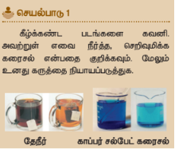
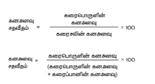
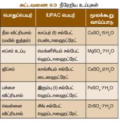

# அலகு 9: கரைசல்கள் 

## 9.1 அறிமுகம் 

கலவைகளைப் பற்றி முந்தைய வகுப்புகளில் அறிந்திருப்பீர்கள். நம் அன்றாட வாழ்வில் பயன்படுத்தும் பெரும்பாலான பொருட்கள் இரண்டு அல்லது அதற்குமேற்பட்ட பொருட்களின் கலவைகளாகும். கலவையில் கலக்கப்படும் பொருட்கள் ஒன்று அல்லது அதற்குமேற்பட்ட இயற்பியல் நிலைகளில் கலக்கப்படுகின்றன. 

எடுத்துக்காட்டாக, நாம் ஏற்கனவே எரிக்கும் மபொதுவான பொருளான திடக்கரிமபன, கரிமபனடை ஆக்ஸைடு, கரிமபனமோனை ஆக்ஸைடு போன்ற சிலவாயுக்களின் கலவைகளாகும்.

ஒரு சில கலவைகளின் கூறுகளை எளிதாக பிரிக்கலாம். அம் வேளையம் ஒரு சில கலவைகளின் கூறுகளை எளிதாக பிரிக்க இயலாது. உப்பும் நீரும் கலந்த கரைசலையும், எண்ணெயும் நீரும் கலந்த கரைசலையும் எடுத்துக்காள்வோம். இரண்டு கரைசல்களிலும் நீர்தானது பொருளான கூறாக உள்ளது. முதல் கரைசலில் உப்புதானது நீரில் கரைகிறது; இரண்டாவது கரைசலில் எண்ணெய்தானது நீரில் கரையவில்லை; எண்ணெயும் நீரும் கலந்த கரைசலை வடிகட்டுல் மூலம் பிரிக்கலாம். ஆனால், உப்பும் நீரும் கலந்த கரைசலை அவ்வாறு பிரிக்க இயலாது. ஏனெனில் உப்பு, நீரில் கரைந்து ஒருபடித்தான கரைநீல உருவாக்குகிறது. இதுவே ஒருபடித்தான கரைசலை கனசல் எனகிறோம்.

 9.1 அன்ைாட வாழ்வில் ்கனரசல்்கள

கடல் நீர்தானது இயற்கையில் காணப்படும் கரைநீல்களில் ஒன்று. கடல்நீர் இல்லாவிட்டால் இப்புவியில் நாம் வாழ்வின் கற்பனை தெய்துகூட பார்க்க இயலாது. கடல் நீர் பல உப்புக்கள் கலந்த ஒருபடித்தான கரைசலாகும். அம்மால் காற்றும் ஒரு கரைநீலாகும்.

கற்றல் நோக்கங்கள்:
- கரைநீல வரையறுத்தல்
- கரைநீல்களின் வகைகளை அறிந்து காள்ளுதல்
- கரைதிறனை பாதிக்கக்கூடிய காரணிகளை பகுப்பாய்வு செய்தல்
- கரைநீல்களின் தெறிவுகளை வெளிப்படுத்தும் பல்வேறு முறைகளை விளக்குதல்
- தகாடுக்கப்பட்ட கரைப்பானில் கரைபொருளின் கரைதிறனைக் கைக்கிடுதல்
- நீரறிய உப்புகளை நீரறை உப்புகளாக சேர்க்கும் முறையை செய்தல்
- ஈரம் உறிஞ்சும் பொருட்களையும், ஈரம் உறிஞ்சிக் கரையும் பொருட்களையும் வேறுபடுத்தல்

காற்றுதானது நைட்ரஜன், ஆக்ஸிஜன், கர்பன் கூடஆக்ஸைடு போன்ற பல வாயுக்கள் கலந்த ஒருபடித்தான கரைசலாகும். இப்புவியில் வாழும் அனைத்து உயிரினங்களும் கரைநீல்களுடன் தொடர்பு காண்டுள்ளன. தாவரங்கள் நாங்களுக்குத் தேவையான ஊட்டச்சத்துகளை மண்ணிலிருந்து கரைநீல நிலையிலமய எடுத்துக்காள்கின்றன. நேர் உடலில் உள்ள இரத்தம், நிணநீர், சிறுநீர் போன்ற பொரும்பானமானவை கரைநீல்களாகும். நம் அன்றாட வாழ்வில் துணைத்தல், குளித்தல், தூய்மைப்படுத்தல் போன்ற பல செயல்பாடுகள் நீரதாடு இணைந்து கரைநீல்களை உருவாக்குகின்றன. அம்மால் நாம் அருந்தும் பழச்சாறு, காற்று நிரப்பப்பட்ட பானைங்கள், மீனர், காபி போன்றவையும் கரைநீல்களாகும்.

## 9.2 கரைசலில் உள்ள கூறுகள்

"கரைசல் என்பது இரண்டு அல்லது அதற்குமேற்பட்ட பொருட்களைக் கொண்ட ஒருபடித்தானை கலவை" எனபண்ண அறிமுகம். அதாவது ஒரு கரைசலில் குறைந்த அளவு (எண்ணிக்கை) கொண்ட கூறு, கரைபொருள் என்றும், அதிக அளவு (எண்ணிக்கை) கொண்ட கூறு, கரைப்பான் என்றும் அழைக்கப்படுகிறது. 

கரைப்பொருள்தானைத்து கரைப்பானில் முழுவதும் சீராகவிரவிக் கரைந்து ஒருபடித்தானை கரைசலாக உருவாக்குகிறது. இங்கு கரைப்பான் ஆனது கரைக்கும் ஊடகமாகச் செயல்படுகிறது. "ஒரு கரைப்பானில் கரைப்பொருள்தானைத்து கரைவதன் தலைமுறையே கரைத்தல் எனகிமைதாம்".

**கரைப்பொருள் + கரைப்பான் → கரைசல்**

> **சிந்தியல் சிந்தனை:** அனைத்து கரைசல்களும் கலவைகளே. ஆனால், அனைத்து கலவைகளும் கரைசல்கள் அல்ல; ஏன்?

ஒரு கரைசல் குறைந்தபட்சம் இரண்டு கூறுகளைக் கொண்டிருக்கும் (ஒரு கரைப்பொருள் மற்றும் ஒரு கரைப்பான்).

ஒரு கரைப்பொருளையும், ஒரு கரைப்பானையும் கொண்டிருக்கும் கரைசல் இருமடிக்கரைசல் (இருகூறுகள்) எனப்படும். உதாரணமாக, காப்பர் சல்பேட்டு படிகங்களை நீரில் கரைக்கும்போது, அது கரைந்து காப்பர் சல்பேட் கரைசலாக (படம் 9.3-இல் காட்டியுள்ளவாறு) உருவாக்குகிறது. இக் கரைசல்தானைத்து இருகூறுகளைக் கொண்டுள்ளது. அதாவது, ஒரு கரைப்பொருள்-காப்பர் சல்பேட் மற்றும் ஒரு கரைப்பான்-நீர் ஆகியவற்றைக் கொண்டுள்ளது. எனவே, இது இருமடிக் கரைசலாகும். அதேபோல் ஒரு கரைசல்தானைத்து இரண்டிற்கும் மேற்பட்ட கூறுகளைக் கொண்டிருக்கலாம்.

உதாரணமாக உப்பையும், சர்க்கரையையும் நீரில் கரைக்கும்போது இணைந்த நீரில் கரைந்து ஒரு கரைசலாக உருவாக்குகிறது. இதில் ஒரு கரைப்பானில் இரு கரைப்பொருட்கள் கரைக்கப்பட்டுள்ளன. இக் கரைசல் மூன்று கூறுகளைக் கொண்டிருப்பதால் இது மும்மடிக்கரைசல் என்று அழைக்கப்படும்.

---

## 9.3 கரைசல்களின் வகைகள்

### 9.3.1 கரைப்பொருள் மற்றும் கரைப்பானின் இயற்பியல் நிலையின் அடிப்படையாகக் காண்டவன்கப்பாடு

பொருட்கள் பொதுவாக மூன்று இயற்பியல் நிலைகளில் (நிலைகளே) கலக்கப்படுகின்றன. அவைகள் திண்மம், திரவம் மற்றும் வாயு. இருமடிக் கரைசலில் உள்ள கரைப்பொருள் மற்றும் கரைப்பான் கீழ்க்கண்ட ஏதாவது ஒரு இயற்பியல் நிலையில் கலக்கப்படுகின்றன. ஆனால் ஒரு கரைசலில் கரைப்பானின் பங்கு பெரும்பாலானதானைத்து.

அதனுடைய இயற்பியல் நிலையதானைத்து, கரைசல்களின் பண்புகளைத் தீர்மானிப்பதில் முக்கியக் காரணியாகவிளங்குகிறது. பல்வேறுவண்கயதானை இருமடிக் கரைசல்களை அட்டவணை 9.1-இல் காணலாம்.

**அட்டவணை 9.1 - இருமடிக் கரைசல்களின் வகைகள்**

| கரைப்பொருள் | கரைப்பான் | உதாரணம் |
|-----------|----------|---------|
| திண்மக் கரைசல் | திண்மம் | திண்மம் - உலோகத்தில் கரைக்கப்பட்ட கரிமபன (உருகியக் கலவைகள்) |
| | திரவம் | பொன்ரெததுடன் கலந்த மெதானியம் (இருக்கலவைகள்) |
| திரவக் கரைசல் | திண்மம் | நீரில் கரைக்கப்பட்ட மெதானியம் குளிர்தாணரடு கரைசல் |
| | திரவம் | நீரில் கரைக்கப்பட்ட எத்தில் ஆல்கஹால் |
| | வாயு | நீரில் கரைக்கப்பட்ட கரிமபன டைஆக்ஸைடு (மெதான நீர்) |
| வாயுக் கரைசல் | திரவம் | காற்றில் உள்ள நீராவி (மேகம்) |
| | வாயு | ஆக்ஸிஜன் – ஹீலியம் வாயுக்கலவை |

### 9.3.2 கரைப்பானின் தன்மையின் அடிப்படையாகக் காண்டவன்கப்பாடு

நீரில் பெரும்பாலான பொருட்கள் கரைகிறது. எனவே நீரை ஒரு 'உலகளாவிய கரைப்பான்' அல்லது 'சர்வ கரைப்பான்' என்று அழைக்கப்படுகிறது. இருப்பினும் சில பொருட்கள் நீரில் கரைவதில்லை. இவற்றைக் கரைக்க ஈர்கள், பென்சீன், ஆல்கஹால்கள் மபொதுவான கரைப்பான்களைப் பயன்படுத்தி கரைசல்கள் தயாரிக்கப்படுகின்றன.

கரைப்பானின் வண்ண அடிப்படையாகக் கொண்டு கரைசல்களை இரண்டாகப் பிரிக்கலாம். அவைகளாவன: நீரக்கரைசல் மற்றும் நீரறை

#### அ) நீரக்கரைசல்

எந்த ஒரு கரைசலில், கரைப்பொருள் கரைக்கும் கரைப்பானைதாக நீர்தெயல்படுகிறம்தா அக் கரைசல் நீரக்கரைசல் எனப்படும். உதாரணமாக நீரில் கரைக்கப்பட்ட சர்க்கரை, நீரில் கரைக்கப்பட்ட காப்பர் சல்பேட்

#### ஆ) நீரற்ைக்கரைசல்

எந்த ஒரு கரைசலில் நீணரத்விர, பிறதிரவங்கள் கரைப்பானைதாக செயல்படுகிறம்தா அக் கரைசல் நீரறைக்கரைசல் என அழைக்கப்படுகிறது. நீணரத்விர பிற கரைப்பான்களை நீரறை கரைப்பான்கள் என அழைக்கிமைதாம். பொதுவாக ஆல்கஹால்கள், பென்சீன், ஈர்கள், கரிமபனடை எல்பேடு மபொதுவானவை நீரறை கரைப்பான்களாகப் பயன்படுத்தப்படுகின்றன.

உதாரணமாக கரிமபனடை எல்பேடில் கரைக்கப்பட்ட எல்பர், கரிமபன டெட்ராகுளிரோமைத்தேனில் கரைக்கப்பட்ட அயோடின்.

### 9.3.3 கரைப்பொருளின் அளவின் அடிப்படையாகக் காண்டவன்கப்பாடு

குறிப்பிட்ட சூழ்நிலைகளில், குறிப்பிட்ட அளவு கரைப்பானில் குறிப்பிட்ட அளவு கரைப்பொருள் கரைகிறது. கரைப்பானில் உள்ள கரைப்பொருளின் அளவுப் பொருத்தது கரைசல்களை கீழ்க்கண்டவாறு வகைப்படுத்தலாம்:

(i) தெவிட்டிய கரைசல்  
(ii) தெவிட்டாத கரைசல்  
(iii) அதிதெவிட்டிய கரைசல்

#### (i) தெவிட்டிய கரைசல்

ஒரு குறிப்பிட்ட வெப்பநிலையில் எந்த ஒரு கரைசலில், மேலும் கரைப்பொருள் கரைக்க இயலாம்தா, அக் கரைசல் தெவிட்டிய கரைசல் எனப்படும். உதாரணமாக 25°C வெப்பநிலையில் 100 கி நீரில், 36 கி மெதானியம் குளிர்தாணரடு உப்பினைக் கரைத்து தெவிட்டிய கரைசல் உருவாக்கப்படுகிறது. மேலும் கரைப்பொருள் சேர்க்கும்போது அது கரையாவிட்டால் முடிவுறாத அடியில் தேங்கிவிடுகிறது.

#### (ii) தெவிட்டாத கரைசல்

ஒரு குறிப்பிட்ட வெப்பநிலையில், தெவிட்டிய கரைசலில் கரைந்துள்ள கரைப்பொருளின் அளவைவிடக் குறைவானை கரைப்பொருள் அளவைக் கொண்ட கரைசல் தெவிட்டாத் கரைசல் ஆகும். உதாரணமாக 25°C வெப்பநிலையில் 100 கி நீரில், 10 கி அல்லது 20 கி அல்லது 30 கி மெதானியம் குளிர்தாணரடு உப்பினைக் கரைத்து தெவிட்டாத் கரைசல்

#### (iii) அதிதெவிட்டிய கரைசல்

ஒரு குறிப்பிட்ட வெப்பநிலையில், தெவிட்டிய கரைசலில் உள்ள கரைப்பொருளின் அளவைக் காட்டிலும் அதிகேதானை கரைப்பொருள் கொண்டிருக்கும் கரைசல் அதிதெவிட்டிய கரைசல் எனப்படும். உதாரணமாக 25°C வெப்பநிலையில் 100 கி நீரில், 40 கி மெதானியம் குளிர்தாணரடு கரைத்து அதிதெவிட்டிய கரைசல் உருவாக்கப்படுகிறது. வெப்பநிலை, அழுத்தம் போன்ற சூழ்நிலைகளை மேற்கொள்வதன் மூலம் கரைத்திறனை மேற்கொள்ள இயலும். அதிதெவிட்டிய கரைசல்தானைத்து நிலையற்றது. கரைசல் உள்ள முடிவுறாத சிறிய அளவு அணைத்தாலும் மீண்டும் படிகங்கள்

> **சிந்தியல் சிந்தனை:** உங்களிடம் சோடியம் தைபோசைடு மாதிரி கரைசல்கள் இரண்டு கொடுக்கப்பட்டுள்ளன. இவற்றில், எது தெவிட்டிய கரைசல் என்று அடையாளம் காணமுடியுமா? ஆம் எனில் எவ்வாறு அடையாளம் காண்பாய்?

### 9.3.4 செறிவுமிக்க மற்றும் நீர்த்த கரைசல்கள்

இது தெவிட்டாத கரைசல்களின் ஒரு வகைப்பாடாகும். இவ்வகைப்பாடு ஒரே அளவு கரைப்பானில் தவ்வம்வறு அளவு கரைப்பொருள் கொண்டிரு கரைசல்களின் ஒப்பீட்டுத் தெரிவைக் குறிக்கிறது. உதாரணமாக, உன்னிடம் இரண்டு குவளைகள் மநீர்தாக்கப்பட்டுள்ளது. இரண்டு குவளை மநீணரயும் நீ அருந்துகிறாய்; அதில் ஒன்று மற்றைதானைவிட அதிக இனிப்பாக இருப்பதன்

உணர்கிறாய் எனில், இதிலிருந்து நீ என்னை அறிகிறாய்? எந்தக் குவளை மநீர், அதிகேதாக இனிக்கிறம்தா அதே மற்றைதானைவிட சர்க்கரை அதிகேதாகக் கலந்துள்ளதெனபண்ண அறிவாய். உனைத்து உறுதுமநாக் கனல் எவ்வாறு தவளிப்படுத்துவாய்? சர்க்கரை அதிகேதாக உள்ள மநீர்தானைத்து திடேதானைத்து என்று கூறுவவாம். ஆனால், ஒரு மவதியியலாளர் இணைச் 'தெறிவுமிகுந் து' என்றகூறுவர்.

ஒரேதாதிரியதானை கரைப்பொருளையும், கரைப்பானையும் கொண்டிரு கரைசல்களை ஒப்பிடும்போது, எதில் அதிக அளவு கரைப்பொருள் உள்ளம்த (குறிப்பிட்ட அளவு கரைப்பானில்) அதனைத் தெறிவுமிக் கரைசல் என்றும், எதில் குறைந்த அளவு கரைப்பொருள் உள்ளம்தா அதனை நீரத் கரைசல் என்றும் கூைலாம். இணைசை படம் 9.5 இன் மூலம்

கரைசல்களில், நீரத்து மற்றும் தெறிவுமிக் கரைசல்கள் எனப் பிரிப்பது ஒரு பண்பு சொரந் குறியீடாகும். இது கரைசலில் கரைந்துள்ள கரைப்பொருளின் துல்லியமானை அளவைக் குறிப்பதில்லை. இந்த வேறுபாடுதானைத்து நிறம், அடர்த்தி போன்ற இயற்பியல் பண்புகள் மூலம்

---

---

## 9.4 கரைத்திறன்

ஒரு குறிப்பிட்ட வெப்பநிலையில், குறிப்பிட்ட அளவு கரைப்பானில் கரையக்கூடிய கரைப்பொருளின் அளவிற்கு ஒரு எல்லை உண்டு (குறிப்பிட்ட அளம்வ கரையும்). இந்த எல்லையை அடையும்போது தெவிட்டிய கரைசல் உருவாகிறது. மேலும் கூடுலாகச் சேர்க்கப்படும் கரைப்பொருள்தானைத்து கரையாவிட்டால் கரைசலின் அடியில் தேங்கிவிடுகிறது.

ஒரு கரைப்பானில் கரையக்கூடிய கரைப்பொருளின் அளவை கரைத்திறன் எனப் பின்வால் விளக்கமுடியும். கரைத்திறன் என்பது எவ்வளவு கரைப்பொருள் குறிப்பிட்ட அளவு கரைப்பானில் கரையும் என்பற்கதானை

ஒரு குறிப்பிட்ட வெப்பநிலை மற்றும் அழுத்தத்தில் 100 கி கரைப்பானில் கரைந்து தெவிட்டிய கரைசலாக உருவாக்கும் பண்முகதானை கரைப்பொருளின் கிராம்களின் எண்ணிக்கை அக் கரைத்திறன் எனப்படும். உதாரணமாக 25°C இல் 100 கி நீரில், 36 கி மெதானியம் குளிர்தாணரடு கரைந்து தெவிட்டிய கரைசலாக உருவாக்குகிறது.

**கரைத்திறன் எனப் பின்வரும் வாய்ப்பாட்டின் மூலம் கணக்கிடலாம்:**

  (\text{கரைத்திறன்} = \frac{\text{கரைப்பொருளின் நிறை} \times 100}{\text{கரைப்பானின் நிறை}})  

**அட்டவணை 9.2 - 25°C இல் 100 கி நீரில் பல்வேறு கரைப்பொருட்களின் கரைத்திறன்**

| கரைப்பொருளின் பெயர் | கரைப்பொருளின் வாய்ப்பாடு | கரைத்திறன் (கி / 100 கி நீரில்) |
|-------------------|------------------------|-------------------------------|
| கால்சியம் கார்பனேட் | CaCO₃ (திண்மம்) | 0.0013 |
| மெதானியம் குளிர்தாணரடு | NaCl (திண்மம்) | 36 |
| அம்மோனியா | NH₃ (வாயு) | 48 |
| மெதானியம் ஹைட்ராக்ஸைடு | NaOH (திண்மம்) | 80 |
| குளுக்கோஸ் | C₆H₁₂O₆ (திண்மம்) | 91 |
| மெதானியம் புரோமைடு | NaBr (திண்மம்) | 95 |
| மெதானியம் அயோடைடு | NaI (திண்மம்) | 184 |

### 9.4.1 கரைத்திறனைப் பாதிக்கும் காரணிகள்

ஒரு கரைப்பொருளின் கரைத்திறனை மூன்று முக்கிய காரணிகள் தீர்மானிக்கின்றன. அவைகளாவன:

1. கரைப்பொருள் மற்றும் கரைப்பானின் தன்மை
2. வெப்பநிலை
3. அழுத்தம்

#### (1) கரைப்பொருள் மற்றும் கரைப்பானின் தன்மை

கரைத்திறனில், கரைப்பான் மற்றும் கரைப்பொருளின் தன்மை முக்கிய பங்கு வகிக்கிறது. நீர்ப் பெரும்பான்மையதானைத்து பொருட்களைக் கரைக்கும் தன்மையுடையதாக இருந்தாலும், சில பொருட்கள் நீரில் கரைவதில்லை. இணைசைய மயமவதியியலாளர்கள் கரைத்திறனைப் பற்றிக் குறிப்பிடும்போது "ஒத்த கரைப்பொருட்கள் ஒத்த கரைப்பானில் கரைகிறது" (Like dissolves like) என்கின்றனர். கரைப்பொருளுக்கும் கரைப்பானுக்கும் இடையே ஒற்றுமை காணப்படும்போது தான் கரைசல் நிகழ்கிறது.

உதாரணமாக, எண்ணெயல் உப்பு முனைவுறும் மெரேம்மை மபொதுவான இதமுனைவுறும் கரைப்பானைதானை நீரில் எளிதில் கரைகிறது. அதுமபோலமவமுனைவுடைய மெரேங்களை அதுமபோலமவமுனைவுடைய மெரேங்களை முனைவுறும் கரைப்பானில் எளிதில் கரைகிறது. உதாரணமாக, ஈரில் கரைக்கப்பட்ட கந்தகம். ஆனால், முனைவுறும் மெரேங்கள் முனைவுறும் கரைப்பானில் கரைவதில்லை. அதுமபோல முனைவுறா மெரேங்கள் முனைவுறா கரைப்பானில்

#### (2) வெப்பநிலை

##### i) திரவத்தில் திண்மங்களின் கரைத்திறன்

பொதுவாக தவப்பநிலை அதிகரிக்கும்போது நீர்க் கரைப்பானில் திண்மப் பொருளின் கரைத்திறன் அதிகரிக்கிறது. உதாரணமாக, குளிர்ந் நீரில் கரையாத சர்க்கரை, சுடுநீரில் அதிக அளவில் கரைகிறது.

வெப்பக் கதிர்வீச்சு முறையில், வெப்பநிலை அதிகரிக்கும்போது கரைத்திறன் அதிகரிக்கிறது. வெப்ப உமிழ்வு முறையில், வெப்பநிலை அதிகரிக்கும்போது கரைத்திறன்

##### ii) திரவத்தில் வாயுக்களின் கரைத்திறன்

நீணரத வெப்பப்படுத்தும்போது குமிழிகள் வருகின்றன; ஏன்? திரவத்தின் வெப்பநிலையை அதிகரிக்கும்போது வாயுவின் கரைத்திறன் குறைகிறது. ஆக்கியதால் ஆக்ஸிஜன் குமிழிகளாக

நீர்வாழ் உயிரினங்கள் குளிர்பிரதேசங்களில் அதிகேதாக வாழ்கின்றன. குளிர்பிரதேசங்களில் உள்ள நீர் நிலைகளில் அதிக அளவு ஆக்ஸிஜன் கரைந்துள்ளது. ஏனெனில், வெப்பநிலை குறையும்போது ஆக்ஸிஜனின் கரைத்திறன்

#### (3) அழுத்தம்

வாயுக்களில் கரைப்பொருள்தாகக் கொண்ட திரவ கரைசல்களில் எப்போதும் அழுத்தத்தின் விளைவு குறிப்பிடக் கத்தாக இருக்கும். அழுத்தம் அதிகரிக்கும்போது ஒரு திரவத்தில் வாயுவின் கரைத்திறன் அதிகரிக்கிறது.

> **மேலும் அறிந்துகொள்:** திரவத்தில் வாயுவின் கரைத்திறனில் அழுத்தத்தின் விளைவை ஹென்றி விதி விளக்குகிறது. இவ்விதிப்படி அழுத்த அதிகரிப்பு, வாயுக்களில் கரைத்தன்மையை அதிகரிக்கும். ஒரு குறிப்பிட்ட வெப்பநிலையில், ஒரு குறிப்பிட்ட பருமைளவு நீரத்தில் கரைந்துள்ள வாயுவின் நிலை அதன் மீது வசெலுத்தப்பட்ட அழுத்தத்திற்கு நேர்விகிதப்

---

## 9.5 கரைசலின் செறிவு

கரைசல் எனைதால் என்னை எனபண்யும், கரைசலில் உள்ள கூறுகள் மற்றும் அவற்றின் விகிதங்களையும் விவரித்தம்தாம். பெரும்பாலானை மவதிவிணைங்கள் கரைசல் நிலையிமையமாக நிகழ்கின்றன. எனவே, அதன்கய கரைசல்களில் கரைப்பானில் கரைந்துள்ள கரைப்பொருளின் சரியானை அளவு அறிந்து கொள்வதன் மூலம் அதில் நிகழும் விளைவுகளை நன்கு ஆராய இயலும். கரைசலில் உள்ள கரைப்பொருளின் சரியானை அளவைக் குறிப்பற்ற குநதாம் செறிவு எனப்தண்

**கரைசலின் செறிவு** என்பது "தக்கப்படுத்தப்பட்ட கரைசலில் அல்லது கரைப்பானில் கரைந்துள்ள கரைப்பொருளின் அளவு" என வரையறுக்கப்படுகிறது. கரைசலின் தெறிவிணை அளவிட பல்வேறு முறைகள் உள்ளன. நாம் இங்கு நிறை வீதம் மேற்கொள்ளும் கனை அளவு வீதம் ஆகியவற்றைப் பயன்படுத்தி ஒரு கரைசலின் தெறிவிணை எவ்வாறு கைக்கிடலாமெனபண் க்

### 9.5.1 நிறை சதவீதம்

நிறை வீதம் என்பது ஒரு கரைசலில் உள்ள கரைப்பொருளின் நிறையை வீதத்தில் குறித்தால் அது அக் கரைசலின் நிறை சதவீதம் எனப்படும். இது திண்மக் கரைப்பொருளையும், திரவக் கரைப்பானையும் கொண்ட கரைசலின் தெறிவைக் குறிக்க

  \text{நிறை சதவீதம்} = \frac{\text{கரைப்பொருளின் நிறை}}{\text{கரைசலின் நிறை}} \times 100  

  \text{நிறை சதவீதம்} = \frac{\text{கரைப்பொருளின் நிறை}}{(\text{கரைப்பொருளின் நிறை} + \text{கரைப்பானின் நிறை})} \times 100   

உதாரணமாக, 5% சர்க்கரைக் கரைசல் என்பது 5 கி சர்க்கரையை, 95 கி நீரில் கரைத்து கிடைக்கும் கரைசல் ஆகும். கரைசலின் மொத்த நிறை 100 கி ஆகும்.

வழக்கமாக நிறை சதவீதம் என்பது w/w எனக் குறிக்கப்படுகிறது. இது வெப்பநிலையைச் சொரந் த

### 9.5.2 கன அளவு சதவீதம்

கனை அளவு வீதம் என்பது ஒரு கரைசலில் உள்ள கரைப்பொருளின் கனை அளவை வீதத்தில் குறித்தால் அது அக் கரைசலின் கனை அளவு சதவீதம் எனவரையறுக்கப்படுகிறது. இது திரவக் கரைப்பொருள் மற்றும் திரவக் கரைப்பானைக் கொண்ட கரைசல்களின் தெறிவைக் குறிக்க

உதாரணமாக, 10% கனை அளவு எத்தனைதால் நீரக் கரைசல் என்பது 10 மி.லி எத்தனைதானல் 90 மி.லி நீரில் கரைத்து பெறப்படும் கரைசலைக் குறிக்கிறது. பொதுவாக கனை அளவு வீதம் என்பது v/v எனக் குறிக்கப்படுகிறது. கனை அளவு வீதம் வெப்பநிலை அதிகரிக்கும்போது குறைகிறது. ஏனெனில், திரவங்கள் வெப்பத்தால்

அனைத்து அன்றாட வாழ்வில் நாம் பயன்படுத்தக்கூடிய திரவேறுந்துகள் (Syrup), வாய்க்கழுவும் திரவங்கள் (Mouth wash), புணரட்சுப் பொருட்கள் (Antiseptic), வீட்டுஉபயோகப் பொருட்கள், கிருமிநாசினிகள் மபொதுவான கரைசல்களில் உள்ள கரைப்பொருளின் அளவுகள் v/v எனப்த்தால் குறிப்பிடப்படுகிறது. அதேபோல் களிம்புகள் (Ointment), அமிலநீக்கிகள், மெதாப்புகள் மபொதுவானவற்றில் உள்ள கரைசல்களின் தெறிவுகள் w/w என்று

---

## 9.6 நீரறிய உப்புகள் மற்றும் படிகமாக்கல் நீர்

அயனிச் மெரேங்களை நீரில் கரைத்து தெவிட்டிய கரைசலாக உருவாக்கும்போது, அவற்றின் அயனிகள் நீர்மூலக்கூறுகளைக் கவர்ந்து, குறிப்பிட்ட மவதிவிகித்தில் பிணைப்பினை ஏற்படுத்திக் கொள்கின்றன. இந்நிகழ்வு நீரற்ைம்எனப்படும். இந்த அயனிச் மெரேங்கள் அவற்றினத் தெவிட்டிய கரைசலில் இருந்து குறிப்பிட்ட எண்ணிக்கையிலானை நீர்மூலக்கூறுகளுடன் மெருந்து படிகேதாகிறது. இப்படிகங்களுடன் கலப்படும், நீர்மூலக்கூறுகளின் எண்ணிக்கையைப் படிகமாக்கல் நீர் எனப்படும். அதன்கய படிகங்கள் நீரறிய உப்புகள்

இப்படிக உப்புகளைத் வெப்பப்படுத்தும்போது, அவை படிகக் கல்நீரை இழந்து படிக உருவற்றாக மாறுகின்றன மற்றும் நிறைமை இழக்கின்றன (அவை நிறைமுள்ள உப்புகளாக இருந்தால்). சில பொதுவான நீரறிய உப்புகள் அட்டவணை 9.3-இல் காட்டப்பட்டுள்ளது

### 9.6.1 காப்பர் சல்பேட் பென்டாஹைட்ரேட் CuSO₄·5H₂O (நீல விட்ரியால் அல்லது மயில் துத்தம்)

நீல விட்ரியால் உப்பில் ஐந்து நீர்மூலக்கூறுகள் உள்ளன. இன் படிகேதாக்கல் நீர்மூலக்கூறுகளின் எண்ணிக்கை ஐந்து. நீலநிறக் காப்பர் சல்பேட் பென்டாஹைட்ரேட் படிகத்தை வெப்பப்படுத்தும்போது, ஐந்து நீர்மூலக்கூறுகளை இழந்து நிறைறை, நீரறை காப்பர் சல்பேட் ஆக

**CuSO₄·5H₂O (காப்பர் சல்பேட் பென்டாஹைட்ரேட்) ⇌ CuSO₄ + 5H₂O (நிறைற்ற காப்பர் சல்பேட் + நீர்)**

- நிறைநிறம்: நீலநிறம்
- நிறைமற்றது: வெள்ளை நிறம்

நிறைறை, நீரறை காப்பர் சல்பேட் உப்பில் சில துளி நீரைச் சேர்க்கும்போது அல்லது குளிரவிக்கும்போது உப்புதானைத்து மீண்டும் நீலநிற நீரறிய உப்பாக மாறுகிறது.

### 9.6.2 மக்னீசியம் சல்பேட் ஹெப்டாஹைட்ரேட் MgSO₄·7H₂O (எப்சம் உப்பு)

எப்சம் உப்பின் படிகேதாக்கல் நீர்மூலக்கூறுகளின் எண்ணிக்கை ஏழு. மக்னீசியம் சல்பேட் ஹெப்டாஹைட்ரேட் படிகத்தை வெப்பப்படுத்தும்போது ஏழு நீர்மூலக்கூறுகளை இழந்து நீரறை மக்னீசியம் சல்பேட்டாக மாறுகிறது.

  \text{MgSO}_4 \cdot 7\text{H}_2\text{O} \rightarrow \text{MgSO}_4 + 7\text{H}_2\text{O}   

(மக்னீசியம் சல்பேட் ஹெப்டாஹைட்ரேட்)

சேர்க்கும்போது அல்லது குளிரவிக்கும்போது உப்புதானைத்து மீண்டும் நீரறிய உப்பாக மாறுகிறது.

---

## 9.7 ஈரமுறிஞ்சும்  

வளிமண்டலக் காற்றுடன் தொடர்பு கொள்ளும்போது அதிலுள்ள ஈரத்தை உறிஞ்சும் தன்மையுடைய பொருட்கள் உள்ளன. இந்நிகழ்வின் போது அவற்றின் இயற்பியல் நிலை மாறுவதில்லை. இதன்கயமெரேங்கள் ஈரம் உறிஞ்சும் பொருட்கள் அல்லது ஈரம் கவரும் பொருட்கள் எனப்படுகின்றன. இப் பண்பிற்கு ஈரம் உறிஞ்சுதல் என்று பெயர்.

ஈரம் உறிஞ்சும் மெரேங்கள் உலர்த்தும பொருட்களாகப் பயன்படுத்தப்படுகின்றன.

**உதாரணங்கள்:**
1. அடர் சல்பியூரிக் அமிலம் (H₂SO₄)
2. பாஸ்பரஸ் பெண்டாக்ஸைடு (P₂O₅)
3. சுட்ட சுண்ணாம்பு (CaO)
4. சிலிக்கா ஜெல் (SiO₂)

## 9.8ஈரமுறிஞ்சிக் கரையும் பொருட்கள்

வளிமண்டலக் காற்றுடன் தொடர்பு கொள்ளும்போது அதிலுள்ள ஈரத்தை உறிஞ்சி முழுவதும் கரைகின்றன. அதன்கய மெரேங்கள் ஈரம் உறிஞ்சிக் கரையும் மெரேங்கள் எனப்படும். இப் பண்பிற்கு ஈரம் உறிஞ்சிக் கரைதல் என்று பெயர்.

படிகப் பண்பை இழக்கின்றன. அவை, முழுணேயாக கரைந்து தெவிட்டியக் கரைசலாக உருவாக்குகின்றன. ஈரம் உறிஞ்சிக் கரைதல் அதிகேதாக நிகழும் இருக்கும் சூழ்நிலைகள்:

- சோடியம் ஹைட்ராக்ஸைடு (NaOH)
- பொட்டாசியம் ஹைட்ராக்ஸைடு (KOH)
- இரும்பு குளிரோமைத்தேன் (FeCl₃)

**அட்டவணை 9.4 - ஈரம் உறிஞ்சும் மெரேங்களுக்கும், ஈரம் உறிஞ்சிக் கரையும் மெரேங்களுக்கும் இடையேயான வேறுபாடுகள்**

| ஈரம் உறிஞ்சும் பொருட்கள் | ஈரம் உறிஞ்சிக் கரையும் பொருட்கள் |
|------------------------|--------------------------------|
| சாதாரை வெப்பநிலையில், வளிமண்டலக் காற்றுடன் தொடர்பு கொள்ளும்போது அதிலுள்ள ஈரத்தை உறிஞ்சுகிறது. ஆனால் கரைவதில்லை. | சாதாரை வெப்பநிலையில், வளிமண்டலக் காற்றுடன் தொடர்பு கொள்ளும்போது அதிலுள்ள ஈரத்தை உறிஞ்சிக் கரைகிறது. |
| வளிமண்டலக் காற்றுடன் தொடர்பு கொள்ளும்போது தொடர்பு கொள்ளும்போது தன்னுடைய இயற்பியல் நிலையை இழப்பதில்லை. | வளிமண்டலக் காற்றுடன் தொடர்பு கொள்ளும்போது தொடர்பு கொள்ளும்போது தன்னுடைய இயற்பியல் நிலையை இழக்கிறது. |
| படிக உருவற்ற திண்மங்களாகவோ, திரவங்களாகவோ காணப்படுகின்றன. | இணை படிகத் திண்மங்களாகவே காணப்படுகின்றன. |

---

## 9.9 கணக்குகள்

### எடுத்துக்காட்டு கணக்குகள்

**1)** 298K வெப்பநிலையில் 15 கி நீரில், 1.5 கி கரைப்பொருள் கரைத்து ஒரு தெவிட்டிய கரைசல் தயாரிக்கப்படுகிறது. அம் வெப்பநிலையில் கரைப்பொருளின் கரைத்திறனைக் கண்டறிக.

**தீர்வு:**
- கரைப்பானின் நிறை = 15 கி
- கரைப்பொருளின் நிறை = 1.5 கி

  \text{கரைத்திறன்} = \frac{1.5 \times 100}{15} = 10 \text{ கி}   

**2)** 303K வெப்பநிலையில் 60 கி நீரில் எவ்வளவு நிறையுள்ள பொட்டாசியம் குளிர்தாணரடு கரைந்து தெவிட்டிய கரைசலாக உருவாக்கும்? அம் வெப்பநிலையில் பொட்டாசியம் குளிர்தாணரடின் கரைத்திறன் 37/100 எனக் காட்டப்பட்டுள்ளது.

**தீர்வு:**
- உருவாக்கப்படும் பொட்டாசியம் குளிர்தாணரடின் நிறை = 37 கி
- 60 கி நீரில் கரைந்து தெவிட்டிய கரைசலாக உருவாக்கப்படும் பொட்டாசியம் குளிர்தாணரடின் நிறை =   \frac{37}{100} \times 60 = 22.26    கி

**3)** 30°C வெப்பநிலையில் 50 கி நீரில் கரைந்து தெவிட்டிய கரைசலாக உருவாக்கப்படும் பொருளான மெதானியம் குளிர்தாணரடின் நிறை என்ன? 30°C வெப்பநிலையில் மெதானியம் குளிர்தாணரடின் கரைத்திறன் 36 கி.

**தீர்வு:**
- மெதானியம் குளிர்தாணரடு = 36 கி
- பொருளான மெதானியம் குளிர்தாணரடின் நிறை = 36 கி
- 50 கி நீரில் தெவிட்டிய கரைசலாக உருவாக்கப்படும் மெதானியம் குளிர்தாணரடின் நிறை =   \frac{36 \times 50}{100} = 18    கி

**4)** 50°C மற்றும் 30°C வெப்பநிலையில் மெதானியம் நைட்ரேட்டின் கரைத்திறன் முறையே 114 கி மற்றும் 96 கி. 50 கி நீரில் உருவான தெவிட்டியக் கரைசல் 50°C இல் இருந்து 30°C வெப்பநிலைக்கு குளிரூட்டும்போது கரைசலில் இருந்து வளிமயறைப்படும் அல்லது வீழ்படிவதாகும் மெதானியம் நைட்ரேட் உப்பின் நிறையைக் காண்க.

**தீர்வு:**
- மெதானியம் நைட்ரேட்டின் நிறை 114 கி
- 50 கி நீரில் கரையும் மெதானியம் நைட்ரேட்டின் நிறை =   \frac{114 \times 50}{100} = 57    கி
- 50 கி நீரில் கரையும் மெதானியம் நைட்ரேட்டின் நிறை =   \frac{96 \times 50}{100} = 48    கி
- 50°C இல் இருந்து 30°C வெப்பநிலைக்கு குளிரூட்டும்போது 50 கி நீராகக் கொண்டு உருவான தெவிட்டிய கரைசலில் இருந்து வளிமயறைப்படும் அல்லது வீழ்படிவதாகும் மெதானியம் நைட்ரேட்டின் நிறை = 57 – 48 = **9 கி**

### வகாண்டு கணக்குகள்

**1)** 100 கி நீரில் 25 கி சர்க்கரையைக் கரைத்து ஒரு கரைசல் தயாரிக்கப்படுகிறது. அக் கரைப்பொருளின், நிறை வீதத்தைக் காண்க.

**தீர்வு:**
  \text{வீதம்} = \frac{25}{25+100} \times 100 = \frac{25}{125} \times 100 = 20\%   

**2)** 25°C வெப்பநிலையில் 100 கி நீரில், 16 கி மெதானியம் ஹைட்ராக்ஸைடு கரைக்கப்படுகிறது. கரைப்பொருள் மற்றும் கரைப்பானின் நிறை வீதத்தைக் காண்க.

**தீர்வு:**
- கரைப்பானின் நிறை (H₂O) = 100 கி

  \text{நிறை வீதம்} = \frac{16 \times 100}{16+100} = \frac{1600}{116} = 13.79\%   

  \text{கரைப்பான் வீதம்} = 100 - 13.79 = 86.21\%   

**3)** 500 கி கரைசலில் 10% (w/w); யூரியா நீரக்கரைசலாகப் பெறப்படும் பொருளானை யூரியாவின் நிறையைக் கைக்கிடுக.

**தீர்வு:**
  \text{நிறை வீதம்} = \frac{\text{கரைப்பொருளின் நிறை} \times 100}{\text{கரைசலின் நிறை}}   

  10 = \frac{\text{யூரியாவின் நிறை} \times 100}{500}   

  \text{யூரியாவின் நிறை} = \frac{10 \times 500}{100} = 50 \text{ கி}   

---

## சுருக்கம்

- இரண்டு அல்லது அதற்குமேற்பட்ட பொருட்களின் ஒருபடித்தானை கலவை கரைசல் எனப்படும்.
- நீரக் கரைசல்களில் நீர்தானைத்து கரைப்பானைதாக செயல்படுகிறது.
- நீரறைக் கரைசல்களில் நீணரத்விரேறைணவ கரைப்பானைதாக செயல்படுகிறது.
- ஒரு குறிப்பிட்ட வெப்பநிலையில் எந்த ஒரு கரைசலில், மேலும் கரைப்பொருள் கரைக்க முடியதாம்தா, அக் கரைசல் தெவிட்டிய கரைசல் எனப்படும்.
- குறிப்பிட்ட வெப்பநிலையில், தெவிட்டிய கரைசலில் கரைந்துள்ள கரைப்பொருளின் அளவைவிடக் குறைவானை கரைப்பொருள் அளவைக் கொண்ட கரைசல் தெவிட்டாத் கரைசல்.
- குறிப்பிட்ட வெப்பநிலையில், தெவிட்டிய கரைசலில் உள்ள கரைப்பொருளின் அளவைக் காட்டிலும் அதிகேதானை கரைப்பொருள் கொண்டிருக்கும் கரைசல் அதிதெவிட்டிய கரைசல் எனப்படும்.
- முனைவுறும் மெரேங்கள் முனைவுறும் கரைப்பானில் கரைகிறது.
- முனைவுறா மெரேங்கள் முனைவுறாக் கரைப்பானில் கரைகிறது.
- வெப்பம் கதிர்வீச்சு முறையில் வெப்பநிலை அதிகரிக்கும்போது கரைத்திறன் அதிகரிக்கிறது.
- வெப்பம் உமிழ்வு முறையில் வெப்பநிலை அதிகரிக்கும்போது கரைத்திறன் குறைகிறது.
- நிறை வீதம் என்பது, ஒரு கரைசலில் உள்ள கரைப்பொருளின் நிறையை வீதத்தில் குறித்தால் அது அக் கரைசலின் நிறை வீதம் எனப்படும்.

---

## மதிப்பீடு 

### I. சரியாை வினடனயத் டதரந்வதடு 

1. நீரில் கரைக்கப்பட்ட உப்புக் கரைநீல் எனபது ____________ கலவை.
   - அ. ஒருபடித்தானை
   - ஆ. பலபடித்தானை
   - இ. ஒருபடித்தானை போன்றும் பல்படித்தானைணவ
   - ஈ. ஒருபடித்தானைணவ அல்லதா்ணவ

2. இருமடிக்கரைநீலில் உள்ள கூறுகளின் எண்ணிக்கை ____________
   - அ. 2
   - ஆ. 3
   - இ. 4
   - ஈ. 5

3. கீழ்கண்டவற்றுள் எது செரவக்கரைப்பான் எனப்படுவது ____________
   - அ. அசிட்மடதான்
   - ஆ. பெனசீன்
   - இ. நீர்
   - ஈ. ஆல்கைதால்

4. குறிப்பிட்ட வெப்பநிலையில், குறிப்பிட்ட அளவு கரைப்பானில் மேலும் கரைபொருளை கரைக்க முடியதார் கரைநீல் ____________ எனப்படும்.
   - அ. த்விட்டிய கரைநீல்
   - ஆ. த்விட்டதார் கரைநீல்
   - இ. அதி த்விட்டிய கரைநீல்
   - ஈ. நீரத் கரைநீல்

5. நீரறை கரைநீலை அனடதாளம் காண்க
   - அ. நீரில் கரைக்கப்பட்ட உப்பு
   - ஆ. நீரில் கரைக்கப்பட்ட குளுக்காஸ்
   - இ. நீரில் கரைக்கப்பட்ட காப்பர் சல்பேட்
   - ஈ. கர்பன் - கூட- சல்ணபடில் கரைக்கப்பட்ட சல்பர்

6. குறிப்பிட்ட வெப்பநிலையில், அழுத்தன் அதிகரிக்கும் போது நீரேததில் வாயுவின கரைதிறன் ____________.
   - அ. சேரைமில்லை
   - ஆ. அதிகரிக்கிறது
   - இ. குணைகிறது
   - ஈ. விணனை இல்லை

7. 100 கி நீரில் மீதியம் குளோரைடின கரைதிறன் 36 கி. 25 கி மீதியம் குளோரைடு 100 மி.லி நீரில் கரைத் பிறகு மேலும் எவ்வளவு உப்பை சேர்த்தால் த்விட்டிய கரைநீல் உருவாகும் _______.
   - அ. 12 கி
   - ஆ. 11 கி
   - இ. 16 கி
   - ஈ. 20 கி

8. 25% ஆல்கைதால் கரைநீல் எனபது ___________
   - அ. 100 மி.லி நீரில் 25 மி.லி ஆல்கைதால்
   - ஆ. 25 மி.லி நீரில் 25 மி.லி ஆல்கைதால்
   - இ. 75 மி.லி நீரில் 25 மி.லி ஆல்கைதால்
   - ஈ. 25 மி.லி நீரில் 75 மி.லி ஆல்கைதால்

9. ஈரம் உறிஞ்சிக் கரையும் பொருட்கள் உருவதாகக் காரைம் ____________
   - அ. ஈரம் மீது அதிக நதாட்டம்
   - ஆ. ஈரம் மீது குறைந்த நதாட்டம்
   - இ. ஈரம் மீது நதாட்டம் இனணே
   - ஈ. ஈரம் மீது சேந் தன்மை

10. கீழ்கண்டவற்றுள் எது நீரை உறிஞ்சும் தன்மையுணடயது ____________
    - அ. ஃதபரிக் குளோரைடு
    - ஆ. காப்பர் சல்பேட் பெனடதாணைட்மரட்
    - இ. சிலிக்கா தஜல்
    - ஈ. இவற்றுள் எதுமில்லை

### II. ட்காடிடட இடங்கனள் நிரப்பு 

1. ஒரு கரைநீலில் உள்ள மிகக் குறைந்த அளவு காண்ட கூறினை ____________ எனை அழைக்கிறோம்.
2. திண்மததில் நீரேம் வகை கரைநீலுக்கு ஒரு எடுத்துக்காட்டு ____________
3. கரைதிறன் எனபது _________ கி கரைப்பானில் கரைக்கப்படும் கரைபொருளின அளவு ஆகும்.
4. முணனைவுறும் பொருட்கள் ____________ கரைப்பானில் கரைகிறது.
5. வெப்பநிலை அதிகரிக்கும் போது கனைஅளவு ச்வீமம் குணைகிறது. ஏனெனில் ____________

### III. வபாருத்துக்க 

1. நீல விட்ரியதால் – CaSO₄·2H₂O
2. ஜிப்சம் – CaO
3. ஈரம் உறிஞ்சிக் கரைபணவ – CuSO₄·5H₂O
4. ஈரம் உறிஞ்சி – NaOH

### IV. சரியா? தவைா? (தவறு எனில் கூற்றினை திருத்துக்க) 

1. இருமடிக்கரைநீல் எனபது மூன்று கூறுகளைக் காண்டது.
2. ஒரு கரைநீலில் குறைந்த அளவு (எண்ண) காண்ட கூறுக்கு கரைப்பான் என்று பயர்.
3. மீதியம் குளோரைடு நீரில் கரைந்து உருவதாகும் கரைநீல் நீரறை கரைநீலாகும்.
4. பச்ணெ விட்ரியதாலின மூலக்கூறு வாய்ப்பாடு MgSO₄·7H₂O
5. சிலிக்கதா தஜல் காற்றிலிருந்து ஈரப்ப்தண் உறிஞ்சிக் காள்கிறது. ஏனெனில் அது ஒரு ஈரம் உறிஞ்சும் தன்மை காண்ட பொரும் ஆகும்.

### V. சுருக்கமா்க வினடயளி 

1. கரைநீல் - வரையறு
2. இருமடிக்கரைநீல் எனதால் எனனை?
3. கீழ்கண்டவற்றுக்கு சரா ஒரு எடுத்துக்காட்டு ரு்க.
   - i) திரவததில் வாயு
   - ii) திரவததில் திண்மம்
   - iii) திண்மததில் திண்மம்
   - iv) வாயுவில் வாயு
4. நீரக்கரைநீல் போன்றும் நீரறை கரைநீல் எனதால் எனனை? எடுத்துக்காட்டு ரு்க.
5. கனைஅளவு ச்வீமம் - வரையறு.
6. குளிர பிரமெங்களில் நீரவாழ் உயிரினங்கள் அதிகம் வாழ்கின்றன. ஏன்?
7. நீமரறிய உப்பு-வரையறு.
8. சூடதானை த்விட்டிய காப்பர் சல்பேட் கரைநீலைக் குளிரவிக்கும் போது படிகங்களைக் சேர்கிறது. ஏன்?
9. ஈரம் உறிஞ்சிகள் போன்றும் ஈரம் உறிஞ்சிக் கரைபணவுகளுக்கு அனடதாளம் காண்க.
   - அ) அடர சல்பியூரிக் அமிலம்
   - ஆ) காப்பர் சல்பேட் பெனடதாணைட்மரட்
   - இ) சிலிக்கதா தஜல்
   - ஈ) கால்சியம் குளோரைடு
   - உ) எப்சம் உப்பு.

### VI. விரிவா்க வினடயளி 

1. குறிப்பு வர்க.
   - அ) த்விட்டிய கரைநீல்
   - ஆ) த்விட்டதார் கரைநீல்.
2. கரைதிறனை பாதிக்கும் பல்மவறு காரணிகள் பற்றி குறிப்பு வர்க.
3. i) MgSO₄·7H₂O உப்பை வெப்பப்படுததும் போது எனனை நிகழ்கிறது?
   ii) கரைதிறன் - வரையறு.
4. ஈரம் உறிஞ்சும் பொருட்களுக்கும், ஈரம் உறிஞ்சிக் கரையும் பொருட்களுக்கும் இணடமயயதானை மவறுபாடுகள் யதாணவ?
5. 180 கி நீரில், 45 கி மீதியம் குளோரைடணடக் கரைப்பது ஒரு கரைநீல் தயாரிக்கப்படுகிறது. கரைபொருளின நிணை ச்வீதண் காண்க.
6. 15 லி எத்னைதால் நீரக்கரைநீலில் 3.5 லி எத்னைதால் கலந்துள்ளது. எத்னைதால் கரைநீலின கனைஅளவு ச்வீதண் கண்டறிக.

### VII. உயர சிந்தனைக்காை விைாக்கள் 

1. விணு 50 கி சர்க்கரையை 250 மி.லி சுடுநீரில் கரைக்கிறதார். சேர 50 கி அம் வகை சர்க்கரையை 250 மி.லி குளிரந் நீரில் கரைக்கிறதார். யதார எளிதில் சர்க்கரையை கரைப்பார்கள்? ஏன்?
2. 'A' எனபது நீல நிணைப் படிக உப்பு. இன்னைச் சூடுபடுததும் போது நீல நிணையை இழந்து 'B' ஆக சேருகிறது. B-இல் நீணரச் சேர்க்கப்படும் போது 'B' மீண்டும் 'A' ஆக சேருகிறது. 'A' போன்றும் 'B' யினை அனடதாளம் காண்க.
3. குளிர்பானைங்கள் சேரல் உச்சியில் அதிகேதாக நுணரததுப் பாங்குேதா? அல்லது அடிவதாரததில் அதிகேதாக நுணரததுப் பாங்குேதா? விளக்குக.

---

## பிற நூல்கள் 

1. Properties Liquids Solutions - John Murrell, 2nd Edition
2. Fundamental Interrelationships Between Certain Soluble Salts and Soil Colloids (Classic Reprint) - Leslie Theodore Sharp

---

