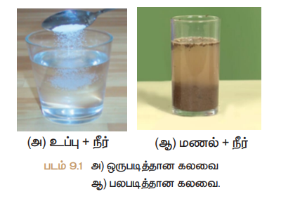
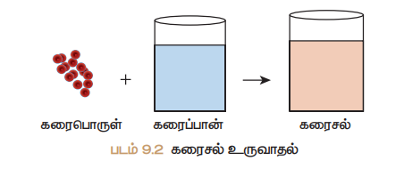
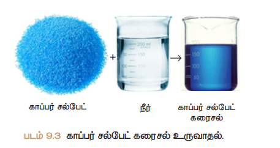
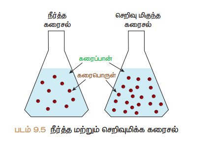
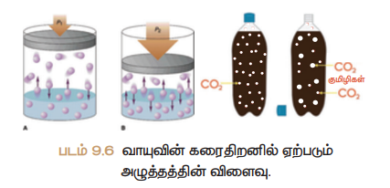
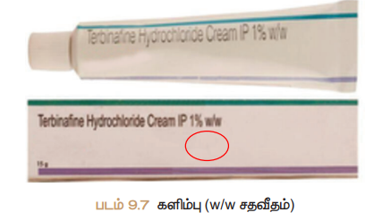
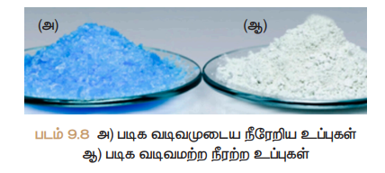
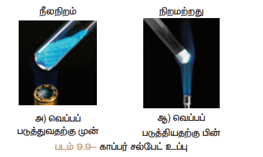
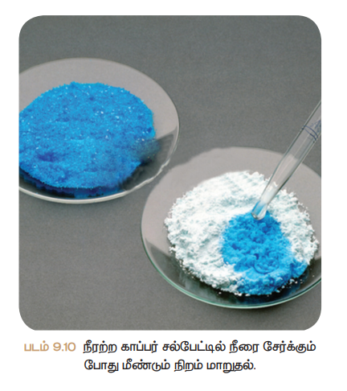
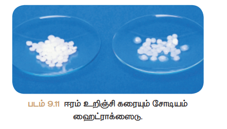

# அலகு 9: கரைசல்கள் 

## 9.1 அறிமுகம் 

நம் அன்றாட வாழ்வில் பயன்படுத்தும் பெரும்பாலான பொருட்கள் இரண்டு அல்லது அதிக மேற்பட்ட பொருட்களின் கலவைகளாகும். கலவையில் காணப்படும் பொருட்கள் ஒன்று அல்லது அதிக மேற்பட்ட இயற்பியல் நிலைகளில் காணப்படுகின்றன.

**எடுத்துக்காட்டுகள்:**
- நதாம் சேர்க்கையணு எரிக்கும் போது அதிலிருந்து வெளியேறும் புகைதானது திடக் கரைபொருள், கரைபொருள் கூடாக்ஸைடு, கரைபொருள் மீத்தேனாக்ஸைடு போன்ற சில வாயுக்களின் கலவைகளாகும்.

ஒரு சில கலவைகளின் கூறுகளை எளிதாக பிரிக்கலாம். அம் வேளையம் ஒரு சில கலவைகளின் கூறுகளை எளிதாக பிரிக்க இயலாது. உப்பும் நீரும் கலந்த கரைசலையும், எண்ணெயும் நீரும் கலந்த கரைசலையும் எடுத்துக்காள்வோம். இரண்டு கரைசல்களிலும் நீர்தானது பொருளான கூறாக உள்ளது. முதல் கரைசலில் உப்புதானது நீரில் கரைகிறது; இரண்டாவது கரைசலில் எண்ணெய்தானது நீரில் கரையவில்லை; எண்ணெயும் நீரும் கலந்த கரைசலை வடிகட்டுல் மூலம் பிரிக்கலாம். ஆனால், உப்பும் நீரும் கலந்த கரைசலை அவ்வாறு பிரிக்க இயலாது. ஏனெனில் உப்பு, நீரில் கரைந்து ஒருபடித்தான கரைநீல உருவாக்குகிறது. இதுவே ஒருபடித்தான கரைசலை கனசல் எனகிறோம்.




 9.1 அன்ைாட வாழ்வில் ்கனரசல்்கள

கடல் நீர்தானது இயற்கையில் காணப்படும் கரைநீல்களில் ஒன்று. கடல்நீர் இல்லாவிட்டால் இப்புவியில் நாம் வாழ்வின் கற்பனை தெய்துகூட பார்க்க இயலாது. கடல் நீர் பல உப்புக்கள் கலந்த ஒருபடித்தான கரைசலாகும். அம்மால் காற்றும் ஒரு கரைநீலாகும்.

கற்றல் நோக்கங்கள்:
- கரைநீல வரையறுத்தல்
- கரைநீல்களின் வகைகளை அறிந்து காள்ளுதல்
- கரைதிறனை பாதிக்கக்கூடிய காரணிகளை பகுப்பாய்வு செய்தல்
- கரைநீல்களின் தெறிவுகளை வெளிப்படுத்தும் பல்வேறு முறைகளை விளக்குதல்
- தகாடுக்கப்பட்ட கரைப்பானில் கரைபொருளின் கரைதிறனைக் கைக்கிடுதல்
- நீரறிய உப்புகளை நீரறை உப்புகளாக சேர்க்கும் முறையை செய்தல்
- ஈரம் உறிஞ்சும் பொருட்களையும், ஈரம் உறிஞ்சிக் கரையும் பொருட்களையும் வேறுபடுத்தல்

காற்றுதானது நைட்ரஜன், ஆக்ஸிஜன், கர்பன் கூடஆக்ஸைடு போன்ற பல வாயுக்கள் கலந்த ஒருபடித்தான கரைசலாகும். இப்புவியில் வாழும் அனைத்து உயிரினங்களும் கரைநீல்களுடன் தொடர்பு காண்டுள்ளன. தாவரங்கள் நாங்களுக்குத் தேவையான ஊட்டச்சத்துகளை மண்ணிலிருந்து கரைநீல நிலையிலமய எடுத்துக்காள்கின்றன. நேர் உடலில் உள்ள இரத்தம், நிணநீர், சிறுநீர் போன்ற பொரும்பானமானவை கரைநீல்களாகும். நம் அன்றாட வாழ்வில் துணைத்தல், குளித்தல், தூய்மைப்படுத்தல் போன்ற பல செயல்பாடுகள் நீரதாடு இணைந்து கரைநீல்களை உருவாக்குகின்றன. அம்மால் நாம் அருந்தும் பழச்சாறு, காற்று நிரப்பப்பட்ட பானைங்கள், மீனர், காபி போன்றவையும் கரைநீல்களாகும்.

## 9.2 கனசலில் உள்ள கூறுகள் 

"கரைநீல் என்பது இரண்டு அல்லது அதிக மேற்பட்ட பொருட்களைக் காண்ட ஒருபடித்தான கலவை" எனபன் அறிமுகமாம். அதாவது ஒரு கரைநீலில் குறைந்த அளவு (எண்ண) காண்ட கூறு, கரைவபாருள் என்றும், அதிக அளவு (எண்ண) காண்ட கூறு, கரைப்பான் என்றும் அழைக்கப்படுகிறது. கரைபொருள்தானது கரைப்பானில் முழுவதும் சீராக விரவி கரைந்து ஒருபடித்தான கரைநீல உருவாக்குகிறது. இங்கு கரைப்பான் ஆனது கரைக்கும் ஊடகமாக செயல்படுகிறது. "ஒரு கரைப்பானில் கரைபொருள்தானது கரைவன் கரைத்தல் எனகிறோம்".




கேள்வி: அனைத்து கரைசங்களும் கலைவகள். ஆனால், அனைத்து கலைவகளும் கரைசங்கள் அல்ல; ஏன்?

ஒரு கரைநீல் குறைந்தபட்சம் இரண்டு கூறுகளைக் காண்டிருக்கும் (ஒரு கரைபொருள் போன்றும் ஒரு கரைப்பான்).

ஒரு கரைபொருளையும், ஒரு கரைப்பானையும் காண்டிருக்கும் கரைநீல் இருமடிக்கனசல் (இரு கூறுகள்) எனப்படும். உதாரணமாக, காப்பர் சல்பேட் படிகங்களை நீரில் கரைக்கும் போது, அது கரைந்து காப்பர் சல்பேட் கரைநீல் (படம் 9.3-இல் காட்டியுள்ளவாறு) உருவாக்குகிறது. இக்கரைநீல்தானது இரு கூறுகளைக் காண்டுள்ளது. அதாவது, ஒரு கரைபொருள் - காப்பர் சல்பேட் போன்றும் ஒரு கரைப்பான் - நீர் ஆகியவற்றைக் காண்டுள்ளது. எனவே, இது இருமடிக்கரைநீலாகும். அம்மால் ஒரு கரைநீல்தானது இரண்டிற்கும் மேற்பட்ட கூறுகளைக் காண்டிருக்கலாம். உதாரணமாக உப்பையும், சர்க்கரையையும் நீரில் கரைக்கும் போது இவை இரண்டும் நீரில் கரைந்து ஒரு கரைநீலை உருவாக்குகிறது. இதில் ஒரு கரைப்பானில் இரு கரைபொருட்கள் கரைக்கப்பட்டுள்ளன. இக்கரைநீல் மூன்று கூறுகளைக் காண்டிருப்பதால் இது மும்மடிக்கனசல் என்று அழைக்கப்படுகிறது.




## 9.3 கனசல்களின் வகைகள் 

### 9.3.1 கனரவபாருள் மற்றும் கனரப்பானின் இயற்பியல் நிலைனமனை அடிப்படையாகக் காண்ட வகைப்பாடு

பொருட்கள் பொருளாக மூன்று இயற்பியல் நிலைகளில் (நிலைகளே) காணப்படுகின்றன. அவைகள் திண்மம், திரவம் போன்றும் வாயு. இருமடிக்கரைநீலில் உள்ள கரைபொருள் போன்றும் கரைப்பான் கீழ்க்கண்ட ஏதாவது ஒரு இயற்பியல் நிலையில் காணப்படுகிறது. ஆனால் ஒரு கரைநீலில் கரைப்பானின் பங்கு பெரும்பானமானதாகும். அனுணைய இயற்பியல் நிலையதானது, கரைநீல்களின் பண்புகளை தீர்மானிப்பதில் முக்கிய காரணியாக விளங்குகிறது.

**அட்டவணை 9.1:** இருமடிக்கரைநீல்களின் வகைகள்

| கரைவபாருள் | கரைப்பான் | உதாரணம் |
|-----------|-----------|----------|
| திண்மக் கனசல் | | |
| திண்மம் | திண்மம் | நாக்கததில் கரைக்கப்பட்ட காப்பர் (உமிழதாகக் கலவைகள்) |
| திரவம் | திண்மம் | பார்வைததுடன் கலந்த மீதியம் (இருக்கலவைகள்) |
| திரவக் கனசல் | | |
| திண்மம் | திரவம் | நீரில் கரைக்கப்பட்ட மீதியம் குளோரைடு கரைநீல் |
| திரவம் | திரவம் | நீரில் கரைக்கப்பட்ட எததில் ஆல்கைதால் |
| வாயு | திரவம் | நீரில் கரைக்கப்பட்ட கர்பன் கூடஆக்ஸைடு (மீதாதா நீர்) |
| வாயுக் கனசல் | | |
| திரவம் | வாயு | காற்றில் உள்ள நீராவி (மேகம்) |
| வாயு | வாயு | ஆக்ஸிஜன் – ஹீலியம் வாயுக்கலவை |

### 9.3.2 கனரப்பானின் தன்னமனை அடிப்பனடயாகக் காண்ட வகைப்பாடு

நீரில் பெரும்பாலான பொருட்கள் கரைகிறது. எனவே நீர் ஒரு 'உலகளாவிய கரைப்பான' அல்லது 'பொதுக் கரைப்பான' என்று அழைக்கப்படுகிறது. இருப்பினும் சில பொருட்கள் நீரில் கரைவதில்லை. இவற்றைக் கரைக்க ஈயர்கள், பெனசீன், ஆல்கைதால்கள் போன்ற கரைப்பான்களைப் பயன்படுத்தி கரைநீல்கள் தயாரிக்கப்படுகின்றன. கரைப்பானின் வகைகளை அடிப்பணடயாகக் காண்டு கரைநீல்களை இரண்டு வகைகளாகப் பிரிக்கலாம். அவைகளாவன: நீரக்கரைநீல் போன்றும் நீரறை கரைநீல்.

**அ) நீரக்கனசல்**
எந்த ஒரு கரைநீலில், கரைபொருளைக் கரைக்கும் கரைப்பானைதாக நீர் செயல்படுகிறம்தா அக்கரைநீல் நீரக்கரைநீல் எனப்படும். உதாரணமாக நீரில் கரைக்கப்பட்ட சர்க்கரை, நீரில் கரைக்கப்பட்ட காப்பர் சல்பேட் போன்றவைகளாகும்.

**ஆ) நீரற்ை கனசல்**
எந்த ஒரு கரைநீலில் நீணரத தவிர, பிற திரவங்கள் கரைப்பானைதாக செயல்படுகிறம்தா அக்கரைநீல் நீரறை கரைநீல் என அழைக்கப்படுகிறது. நீணரத தவிர பிற கரைப்பான்களை நீரறை கரைப்பான்கள் என அழைக்கிறோம். பொருளாக ஆல்கைதால்கள், பெனசீன், ஈயர்கள், கர்பன் கூடெல்ணபடு போன்றவை நீரறை கரைப்பான்களாக பயன்படுத்ப்படுகின்றன. உதாரணமாக கர்பன் கூடெல்ணபடில் கரைக்கப்பட்ட சல்பர், கர்பன் தட்ரதா குளோரைடில் கரைக்கப்பட்ட அமிலதாடின்.


### 9.3.3 கனரவபாருளின் அளனவ அடிப்பனடயாகக் காண்ட வகைப்பாடு

குறிப்பிட்ட சூழ்நிலைகளில், குறிப்பிட்ட அளவு கரைப்பானில் குறிப்பிட்ட அளவு கரைபொருள் கரைகிறது. கரைப்பானில் உள்ள கரைபொருளின் அளணவப் பொருத்தது கரைநீல்களை கீழ்க்கண்டவாறு வகைப்படுத்தலாம்.

**(i) த்விட்டிய கனரெல்**
**(ii) த்விட்டதார் கனரெல்**
**(iii) அதித்விட்டிய கனரெல்**

**(i) வதவிடடிய கனரசல்**
ஒரு குறிப்பிட்ட வெப்பநிலையில் எந்த ஒரு கரைநீலில், மேலும் கரைபொருளை கரைக்க இயலாம்தா, அக்கரைநீல் த்விட்டிய கரைநீல் எனப்படும். உதாரணமாக 25°C வெப்பநிலையில் 100 கி நீரில், 36 கி மீதியம் குளோரைடு உப்பினைக் கரைப்பது த்விட்டிய கரைநீல் உருவாக்கப்படுகிறது. மேலும் கரைபொருளைச் சேர்க்கும் போது அது கரையாவிட்டால் முகவையின அடியில் தங்கிவிடுகிறது.

**(ii) வதவிடடாத கனரசல்**
ஒரு குறிப்பிட்ட வெப்பநிலையில், த்விட்டிய கரைநீலில் கரைந்துள்ள கரைபொருளின் அளணவ விடக் குறைவதானை கரைபொருள் அளணவக் காண்ட கரைநீல் த்விட்டதார் கரைநீல் ஆகும். உதாரணமாக 25°C வெப்பநிலையில் 100 கி நீரில், 10 கி அல்லது 20 கி அல்லது 30 கி மீதியம் குளோரைடு உப்பினைக் கரைப்பது த்விட்டதார் கரைநீல் உருவாக்கப்படுகிறது.

**(iii) அதிவதவிடடிய கனரசல்**
ஒரு குறிப்பிட்ட வெப்பநிலையில், த்விட்டிய கரைநீலில் உள்ள கரைபொருளின் அளணவக் காட்டிலும் அதிகேதானை கரைபொருளைக் காண்ட கரைநீல் அதித்விட்டிய கரைநீல் எனப்படும். உதாரணமாக 25°C வெப்பநிலையில் 100 கி நீரில், 40 கி மீதியம் குளோரைடு உப்பினை கரைப்பது அதித்விட்டிய கரைநீல் உருவாக்கப்படுகிறது. வெப்பநிலை, அழுத்தம் போன்ற சூழ்நிலைகளை சேர்க்குவ்ன மூலம் கரைதிறனை சேரை இயலும். அதித்விட்டிய கரைநீல்தானது நிலையறைது. கரைநீல் உள்ள முகவையைச் சிறிதளவு அணைத்தாலும் மீண்டும் படிகங்கள் முதானறுகிறது.

கேள்வி: உங்கடு சேராயம் வேளாரை மாறு கரைசங்கள் இரண்டு கொள்ளகளில் உள்ளன. இவை, எந்த செய்திய கரைசல் என அடையாளம் காணமா? ஆர் என்ன எவ்வாறு அடையாளம் காப்பார்?

### 9.3.4 வசறிவுமிக்க மற்றும் நீரத்த கனரசல்கள்

இது த்விட்டதார் கரைநீல்களின் ஒரு வகைப்பாடதாகும். இவ்வகைப்பாடு ஒமர அளவு கரைப்பானில் தவவமவறு அளவு கரைபொருளைக் காண்ட இரு கரைநீல்களின் ஒப்பீட்டு தெறிணவக் குறிக்கிறது. உதாரணமாக, உன்னிடம் இரண்டு குவள்கள் மீனர் தகாடுக்கப்பட்டுள்ளது. இரண்டு குவள் மீணரையும் நீ அருந்துகிறதாய்; அதில் ஒன்று சேரைதானமை விட அதிக இனிப்பதாக இருப்பன் உைரகிறதாய் எனில், இதிலிருந்து நீ எனனை அறிகிறதாய்? எந்தக் குவள் மீனர், அதிகேதாக இனிக்கிறம்தா அது சேரைதானமை விட சர்க்கரை அதிகேதாகக் கலந்துள்ளது எனபன் அறிவதாய். உனைது உறறு மனதாக்கனல் எவ்வாறு வெளிப்படுத்துவதாய்? சர்க்கரை அதிகேதாக உள்ள மீனர்தானது திடேதானது என்று கூறுமவதாம். ஆனால், ஒரு மவதியியலதாளர் இன்னைச் 'தெறிவு மிகுந்்து' என்று கூறுவர்.

ஒமர் சேரதிரியதானை கரைபொருளையும், கரைப்பானையும் காண்ட இரு கரைநீல்களை ஒப்பிடும் போது, எதில் அதிக அளவு கரைபொருள் உள்ளம்தா (குறிப்பிட்ட அளவு கரைப்பானில்) அனையை தெறிவுமிக் கரைநீல் என்றும், எதில் குறைந்த அளவு கரைபொருள் உள்ளம்தா அனையை நீரத் கரைநீல் என்றும் கூலலாம்.



கரைநீல்களை, நீரத் போன்றும் தெறிவுமிக்க கரைநீல்கள் எனை வேறுபடுத்துவது ஒரு பண்பு செரந் குறியீடதாகும். இது கரைநீலில் கரைந்துள்ள கரைபொருளின் துல்லியேதானை அளணவக் குறிப்பதில்லை. இந் மவறுபாடதானது நிணை, அடரத்தி போன்ற இயற்பியல் பண்புகள் மூலம் அறியப்படுகின்றன.

**வசயல்பாடு 1:**
கீழ்க்கண்ட படங்களை கவனி. அவற்றுள் எணவ நீரத், தெறிவுமிக்க கரைநீல் எனபன் குறிக்கவும். மேலும் உனைது கருதன் நியதாயப்படுததுக.

- டதநீர்
- காப்பர் சல்டபட் கனரசல்

## 9.4 கனரதிைன் 

ஒரு குறிப்பிட்ட வெப்பநிலையில், குறிப்பிட்ட அளவு கரைப்பானில் கரையக்கூடிய கரைபொருளின் அளவிற்கு ஒர எல்ணல உண்டு (குறிப்பிட்ட அளமவ கரையும்). இந் எல்ணலணய அனடயும் போது த்விட்டிய கரைநீல் உருவாகிறது. மேலும் கூடுலதாக சேர்க்கப்படும் கரைபொருள்தானது கரையாவிட்டால் கரைநீலின் அடியில் தங்கிவிடுகிறது. ஒரு கரைப்பானில் கரையக்கூடிய கரைபொருளின் அளணவ கனரதிைன் எனை பண்பினைதால் விளக்க முடியும். கரைதிறன் எனபது எவ்வளவு கரைபொருள் குறிப்பிட்ட அளவு கரைப்பானில் கரையும் எனபற்கதானை அளவீடதாகும்.

ஒரு குறிப்பிட்ட வெப்பநிலை போன்றும் அழுத்ததில் 100 கி கரைப்பானில் கரைந்து த்விட்டிய கரைநீலை உருவாக்க ம்ணவையானை கரைபொருளின கிரதாம்களின் எண்ணிக்கை அன் கரைதிறன் எனப்படும். உதாரணமாக 25°C ல் 100 கி நீரில், 36 கி மீதியம் குளோரைடு கரைந்து த்விட்டிய கரைநீலை உருவாக்குகிறது.

கரைதிறன் எனபன் பினவரும் சேனபாடனட காண்டு கைக்கிடலாம்.

```
கரைதிறன் = கரைபொருளின நிணை × 100
           கரைப்பானின நிணை
```

**அட்டவணை 9.2:** 25°C ல் 100 கி நீரில் பல்மவறு கரைபொருள்களின் கரைதிறன் தகாடுக்கப்பட்டுள்ளது

| கரைவபாருளின் வபயர் | கரைவபாருளின் வாய்ப்பாடு | கரைதிைன் கி / 100 கி நீரில் |
|-------------------|----------------------|---------------------------|
| கால்சியம் காரபமனைட் | CaCO₃ (திண்மம்) | 0.0013 |
| மீதியம் குளோரைடு | NaCl (திண்மம்) | 36 |
| அம்மீனியதா | NH₃ (வாயு) | 48 |
| மீதியம் ணைட்ரதாக்ஸைடு | NaOH (திண்மம்) | 80 |
| குளுக்காஸ் | C₆H₁₂O₆ (திண்மம்) | 91 |
| மீதியம் புமரதாணேடு | NaBr (திண்மம்) | 95 |
| மீதியம் அமிலதாணடடு | NaI (திண்மம்) | 184 |

### 9.4.1 கனரதிைனை பாதிககும் காரணிகள்

ஒரு கரைபொருளின கரைதிறனை மூன்று முக்கிய காரணிகள் தீர்மானிக்கின்றன. அவைகளாவன:
1. கரைபொருள் போன்றும் கரைப்பானின் தன்மை
2. வெப்பநிலை
3. அழுத்தம்

**(1) கனரவபாருள் மற்றும் கனரப்பானின் தன்னம**

கரைதிறனில், கரைப்பான் போன்றும் கரைபொருளின் தன்மை முக்கிய பங்கு வகிக்கிறது. நீர் பெரும்பானமான பொருட்களை கரைக்கும் தன்மையைக் காண்டிருந் தாலும், சில பொருட்கள் நீரில் கரைவதில்லை. இன்னைமய மவதியியலதாளர்கள் கரைதிறனை பற்றிக் குறிப்பிடும் போது "ஒத்த கரைபொருட்கள் ஒத்த கரைப்பானில் கனரகிறது" (Like dissolves like) என்கினைனர். கரைபொருளுக்கும் கரைப்பானுக்கும் இணடமய ஒற்றுமே காணப்படும் போது தான கரைல் நிகழ்கிறது. உதாரணமாக, செணேயல் உப்பு முணனைவுறும் பொரும் எனமவ இது முணனைவுறும் கரைப்பானைதானை நீரில் எளிதில் கரைகிறது.

அதுமபாலமவ முணனைவுைதாச் பொருட்கள் முணனைவுறும் கரைப்பானில் எளிதில் கரைகிறது. உதாரணமாக, ஈயரில் கரைக்கப்பட்ட குழாம்பு. ஆனால், முணனைவுைதாச் பொருட்கள் முணனைவுறும் கரைப்பானில் கரைவதில்லை. அதுமபால முணனைவுறும் பொருட்கள் முணனைவுைதா கரைப்பானில் கரைவதில்லை.

**(2) வவப்பநினை**

**i) திரவத்தில் திண்மங்களின் கனரதிைன்**

பொருளாக வெப்பநிலை அதிகரிக்கும் போது நீரே கரைப்பானில் திண்மப் பொருளின் கரைதிறன் அதிகரிக்கிறது. உதாரணமாக, குளிரந் நீரில் கரைவன் விட சர்க்கரை, சுடுநீரில் அதிக அளவில் கரைகிறது.

வெப்பக்காள் செயல்முறையில், வெப்பநிலை அதிகரிக்கும் போது கரைதிறன் அதிகரிக்கிறது.

வெப்பஉமிழ் செயல்முறையில், வெப்பநிலை அதிகரிக்கும் போது கரைதிறன் குணைகிறது.

**ii) திரவத்தில் வாயுக்களின் கனரதிைன்**

நீணர வெப்பப்படுததும் போது குமிழிகள் வருகின்றன; ஏன்? திரவததின வெப்பநிலையை அதிகரிக்கும் போது வாயுவின கரைதிறன் குணைகிறது. ஆண்கயதால் ஆக்ஸிஜன குமிழிகளைக் வெளிமயறுகிறது.

நீரவாழ் உயிரினங்கள் குளிர பிரமெங்களில் அதிகேதாக வாழ்கின்றன. குளிர பிரமெங்களில் உள்ள நீரநிலைகளில் அதிக அளவு ஆக்ஸிஜன கரைந்துள்ளது. ஏனெனில், வெப்பநிலை குணையும் போது ஆக்ஸிஜனின கரைதிறன் அதிகரிக்கிறது.

**(3) அழுத்தம்**

வாயுக்களைக் கரைபொருளாகக் காண்ட திரவ கரைநீல்களில் சேட்டுமே அழுத்ததின விண்ணவு குறிப்பிடக் க்தாக இருக்கும். அழுத்தன் அதிகரிக்கும் போது ஒரு திரவததில் வாயுவின கரைதிறன் அதிகரிக்கிறது.

வாயுக்களைக் கரைபொருளாகக் காண்ட திரவ கரைநீல்களுக்கு சில எடுத்துக்காட்டுகள் குளிர்பானைங்கள், வீட்டு உபமயதாக அம்மீனியதா, பாரேலின போன்றவைகள்.



**டமலும் அறிந்து வ்காள்க:**
திரவததில் வாயுவின கரைதிறனில் அழுத்ததின விண்ணணவ தைனறியின விதி விளக்குகிறது. இவ்விதிப்படி அழுத்த அதிகரிப்பு, வாயுக்களில் கனரதன்னமனை அதிகரிககும். ஒரு குறிப்பிடட வவப்பநினையில், ஒரு குறிப்பிடட பருமைளவு நீரமத்தில் கனரந்துள்ள வாயுவின் நிலை அதன்மீது வசலுத்தப்படட அழுத்தத்திற்கு டநரவிகிதப் வபாருத்தமுனடயது.

## 9.5 கனரசலின் வசறிவு 

கரைநீல் எனதால் எனனை எனபன்யும், கரைநீலில் உள்ள கூறுகள் போன்றும் அன் வகைகளையும் விவதாதிதம்தாம். பெரும்பாலான மவதிவிணனைகள் கரைநீல் நிலையிலமய நிகழ்கின்றன. எனமவ, அத்ண்கய கரைநீல்களில் கரைப்பானில் கரைந்துள்ள கரைபொருளின செரியதானை அளவு அறிந்து காள்வ்ன மூலம் அதில் நிகழும் விண்ணவுகளை நனகு ஆரதாய இயலும். கரைநீலில் உள்ள கரைபொருளின செரியதானை அளவிணனை குறிப்பறகு நாம் வசறிவு எனை ப்தண் பயன்படுதுகிறோம்.

கனரசலின் வசறிவு எனபது "தகாடுக்கப்பட்ட கரைநீலில் அல்லது கரைப்பானில் கரைந்துள்ள கரைபொருளின அளவு" எனை வரையறுக்கப்படுகிறது.

கரைநீலின தெறிவிணனை அளவிட பல்மவறு முறைகள் உள்ளன. நாம் இங்கு நிணை ச்வீமம் போன்றும் கனைஅளவு ச்வீமம் ஆகியவற்றை பயன்படுத்தி ஒரு கரைநீலின தெறிவிணனை எவ்வாறு கைக்கிடலாம் எனபன்க் காணமபாம்.

### 9.5.1 நினை சதவீதம் 

நிணை ச்வீமம் எனபது ஒரு கரைநீலில் உள்ள கரைபொருளின நிணையை ச்வீததில் குறித்தால் அது அக்கரைநீலின நிணை சதவீதம் எனப்படும். இது திண்ம கரைபொருளையும், திரவக் கரைப்பானையும் காண்ட கரைநீலின தெறிணவ குறிக்க பயன்படுகிறது.

```
நிணை ச்வீமம் = கரைபொருளின நிணை × 100
              கரைநீலின நிணை

நிணை ச்வீமம் = கரைபொருளின நிணை × 100
              (கரைபொருளின நிணை + கரைப்பானின நிணை)
```

உதாரணமாக, 5% சர்க்கரைக் கரைநீல் எனபது 5 கி சர்க்கரையை, 95 கி நீரில் கரைப்பது கிணடக்கும் கரைநீல் ஆகும். கரைநீலின சேதாத் நிணை 100 கி ஆகும். வழக்கேதாக நிணை ச்வீமம் எனபது w/w எனை குறிக்கப்படுகிறது. இது வெப்பநிலையைச் செரந் து அல்ல.

### 9.5.2 கைஅளவு சதவீதம் 

கனைஅளவு ச்வீமம் எனபது ஒரு கரைநீலில் உள்ள கரைபொருளின கனைஅளவை ச்வீததில் குறித்தால் அது அக்கரைநீலின கனைஅளவு சதவீதம் எனை வரையறுக்கப்படுகிறது. இது திரவக் கரைபொருள் போன்றும் திரவக் கரைப்பானைக் காண்ட கரைநீல்களின் தெறிணவக் குறிக்க பயன்படுகிறது.

```
கனைஅளவு ச்வீமம் = கரைபொருளின கனைஅளவு × 100
                 கரைநீலின கனைஅளவு

கனைஅளவு ச்வீமம் = கரைபொருளின கனைஅளவு × 100
                 (கரைபொருளின கனைஅளவு + கரைப்பானின கனைஅளவு)
```

உதாரணமாக, 10% கனைஅளவு எத்னைதால் நீரக்கரைநீல் எனபது 10 மி.லி எத்னைதாணல 90 மி.லி நீரில் கரைப்பது தப்படும் கரைநீலை குறிக்கிறது.

பொருளாக கனைஅளவு ச்வீமம் எனபது v/v எனை குறிக்கப்படுகிறது. கனைஅளவு ச்வீமம் வெப்பநிலை அதிகரிக்கும் போது குணைகிறது. ஏனெனில், திரவங்கள் வெப்பத்தால் விரிவணடயும்.

அனைதாட வாழ்வில் நாம் பயன்படுத்க்கூடிய திரவ சேருந்துகள் (Syrup), வாய்க்கழுவும் திரவங்கள் (Mouth wash), புணரத டப்பான்கள் (Antiseptic), வீட்டு உபமயதாகப் பொருட்கள், கிருமிநதாசினிகள் போன்ற கரைநீல்களில் உள்ள கரைபொருளின அளவுகள் v/v எனை ப்த்தால் குறிப்பிடப்படுகிறது. அம்மால் களிம்புகள் (Ointment), அமிலநீக்கிகள், மீதாப்புகள் போன்றவற்றில் உள்ள கரைநீல்களின் தெறிவுகள் w/w என்று குறிப்பிடப்படுகிறது.



## 9.6 நீடரறிய உப்புகள் மற்றும் படிகமாக்கல் நீர் 

அயனிச் பொருட்களை நீரில் கரைப்பது த்விட்டிய கரைநீலை உருவாக்கும் போது, அவற்றின அயனிகள் நீர மூலக்கூறுகளைக் கவரந்து, குறிப்பிட்ட மவதி விகிததில் பிணைப்பினை ஏற்படுத்திக் காள்கின்றன. இந்நிகழ்வு நீடரற்ைம் எனப்படும். இந் அயனிச் பொருட்கள் அவற்றின த்விட்டிய கரைநீலில் இருந்து குறிப்பிட்ட எண்ணிக்கையிலதானை நீர மூலக்கூறுகளுடன் மெரந்து படிகேதாகிறது. இந்ப் படிகங்களுடன் காணப்படும், நீர மூலக்கூறுகளின் எண்ணிக்கையை படிகமாக்கல் நீர் எனப்படும். அத்ண்கய படிகங்கள் நீடரறிய உப்புகள் எனப்படும்.



இப்படிக உப்புகளை வெப்பப்படுததும் போது, அவை படிகேதாக்கல் நீணர இழந்து படிக உருவறைதாக சேர்கின்றன போன்றும் நிணைண் இழக்கின்றன (அவை நிணைமுள்ள உப்புகளாக இருந் தால்). சில பொருளானை நீமரறிய உப்புகள் அட்டவணை 9.3-இல் தகாடுக்கப்பட்டுள்ளது

**அட்டவணை 9.3:** நீமரறிய உப்புகள்

| வபாதுப்வபயர் | IUPAC வபயர் | மூைககூறு வாய்ப்பாடு |
|------------|------------|------------------|
| நீல விட்ரியதால் (சேரில் துத்தம்) | காப்பர் (II) சல்பேட் பெனடதாணைட்மரட் | CuSO₄·5H₂O |
| எப்சம் உப்பு | மக்னீசியம் சல்பேட் ஹைப்டதாணைட்மரட் | MgSO₄·7H₂O |
| ஜிப்சம் | கால்சியம் சல்பேட் ணடணைட்மரட் | CaSO₄·2H₂O |
| பச்ணெ விட்ரியதால் | இரும்பு (II) சல்பேட் ஹைப்டதாணைட்மரட் | FeSO₄·7H₂O |
| வெள்ளை விட்ரியதால் | சிங் சல்பேட் ஹைப்டதாணைட்மரட் | ZnSO₄·7H₂O |

### 9.6.1 காப்பர சல்டபட வபன்டானஹடடரட CuSO₄·5H₂O (நீை விடரியால் அல்லது மயில்துத்தம்)

நீல விட்ரியதால் உப்பில் ஐந்து நீர மூலக்கூறுகள் உள்ளன. இன் படிகேதாக்கல் நீர மூலக்கூறுகளின் எண்ணிக்கை ஐந்து. நீலநிணை காப்பர் சல்பேட் பெனடதாணைட்மரட் படிகதன் சேதுவதாக வெப்பப்படுததும் போது, ஐந்து நீர மூலக்கூறுகளை இழந்து நிணைேறை, நீரறை காப்பர் சல்பேட் ஆக சேருகிறது.

```
வெப்பப்படுததுல்: CuSO₄·5H₂O ⇌ CuSO₄ + 5H₂O
(காப்பர் சல்பேட் பெனடதாணைட்மரட்)    (நீரறை காப்பர் சல்பேட் + நீர்)
```



நிணைேறை, நீரறை காப்பர் சல்பேட் உப்பில் சில துளி நீரினைச் சேர்க்கும் போது அல்லது குளிரவிக்கும் போது உப்பதானது மீண்டும் நீல நிணை நீமரறிய உப்பதாக சேருகிறது.



### 9.6.2 வமகனீசியம் சல்டபட வஹப்டானஹடடரட MgSO₄·7H₂O (எப்சம் உப்பு)

எப்சம் உப்பின படிகேதாக்கல் நீர மூலக்கூறுகளின் எண்ணிக்கை ஏழு. மக்னீசியம் சல்பேட் ஹைப்டதா ணைட்மரட் படிகதன் சேதுவதாக வெப்பப்படுததும் போது ஏழு நீர மூலக்கூறுகளை இழந்து நீரறை மக்னீசியம் சல்பேட்டதாக சேருகிறது.

```
வெப்பப்படுததுல்: MgSO₄·7H₂O ⇌ MgSO₄ + 7H₂O
(மக்னீசியம் சல்பேட் ஹைப்டதாணைட்மரட்)   (நீரறை மக்னீசியம் சல்பேட் + நீர்)
```

நீரறை மக்னீசியம் சல்பேட்டில் சில துளி நீணரச் சேர்க்கும் பொழுது அல்லது குளிரவிக்கும் பொழுது உப்பதானது மீண்டும் நீமரறிய உப்பதாக சேருகிறது.

## 9.7 ஈரம் உறிஞசுதல் 

சில பொருட்கள் செர்தாரை வெப்பநிலையில், வளிமண்டலக் காற்றுடன் தொடர்பு காள்ளும் போது அதிலுள்ள ஈரதன் உறிஞ்சும் தன்மையைப் பற்றுள்ளன. இந்நிகழ்வின் போது அவற்றின இயற்பியல் நிலை சேறுவதில்லை. இத்ண்கய பொருட்கள் ஈரம் உறிஞ்சும் பசரமங்கள் அல்லது ஈரம் கவரும் பசரமங்கள் எனப்படுகின்றன. இப்பண்பிறகு ஈரம் உறிஞ்சுல் என்று பயர்.

ஈரம் உறிஞ்சும் பொருட்கள் உலரததும் பொருட்களாக பயன்படுத்ப்படுகின்றன.

**உதாரணங்கள்:**
1. அடர சல்பியூரிக் அமிலம் (H₂SO₄)
2. பாஸ்பரஸ் பெண்டதாக்ஸைடு (P₂O₅)
3. சுட்ட சுண்ணைதாம்பு (CaO)
4. சிலிக்கா தஜல் (SiO₂)

## 9.8 ஈரம் உறிஞசிக் கனரதல் 

சில பொருட்கள் செர்தாரை வெப்பநிலையில், வளிமண்டலக் காற்றுடன் தொடர்பு காள்ளும் போது அதிலுள்ள ஈரதன் உறிஞ்சி முழுவதும் கரைகின்றன. அத்ண்கய பொருட்கள் ஈரம் உறிஞ்சிக் கரையும் பொருட்கள் எனப்படும். இப்பண்பிறகு ஈரம் உறிஞ்சிக் கரைல் என்று பயர்.

ஈரம் உறிஞ்சிக் கரையும் பொருட்கள் அவற்றின படிகப் பண்ணப இழக்கின்றன. அவை, முழுணேயதாக கரைந்து த்விட்டியக் கரைநீலை உருவாக்குகின்றன.

ஈரம் உறிஞ்சிக் கரைல் அதிகேதாக நிகழும் இருக்கும் சூழ்நிலைகள்:
1. குறைந்த வெப்பநிலை
2. அதிக வளிமண்டல ஈரப்ப்மம்

**உதாரணமாக:** மீதியம் ணைட்ரதாக்ஸைடு (NaOH), பொட்டாசியம் ணைட்ரதாக்ஸைடு (KOH), போன்றும் ஃதபரிக் குளோரைடு (FeCl₃)



## 9.9 கனரதிைன், நினை சதவீத மற்றும் கைஅளவு சதவீத கைககுகள் 

### I. கனரதிைனை அடிப்பனடயாகக் காண்ட கைககுகள்

**1)** 298 K வெப்பநிலையில் 15 கி நீரில், 1.5 கி கரைபொருளைக் கரைப்பது ஒரு த்விட்டிய கரைநீல் தயாரிக்கப்படுகிறது. அம் வெப்ப நிலையில் கரைபொருளின கரைதிறனைக் கண்டறிக.

**தீரவு:**
- கரைப்பானின நிணை = 15 கி
- கரைபொருளின நிணை = 1.5 கி

```
கரைபொருளின கரைதிறன் = கரைபொருளின நிணை × 100
                       கரைப்பானின நிணை

கரைபொருளின கரைதிறன் = 1.5 × 100 / 15 = 10 கி
```

**2)** 303 K வெப்பநிலையில் 60 கி நீரில் எவ்வளவு நிணையுள்ள பொட்டாசியம் குளோரைடு கரைந்து த்விட்டிய கரைநீலை உருவாக்கும்? அம் வெப்பநிலையில் பொட்டாசியம் குளோரைடின கரைதிறன் 37/100 எனக் தகாடுக்கப்பட்டுள்ளது.

**தீரவு:**
100 கி நீரில் கரைந்து த்விட்டிய கரைநீலை உருவாக்கத ம்ணவையானை பொட்டாசியம் குளோரைடின நிணை = 37 கி

60 கி நீரில் கரைந்து த்விட்டிய கரைநீலை உருவாக்கத ம்ணவப்படும் பொட்டாசியம் குளோரைடின நிணை = (37 × 60) / 100 = 22.2 கி

**3)** 30°C வெப்பநிலையில் 50 கி நீரில் கரைந்து த்விட்டிய கரைநீலை உருவாக்கத ம்ணவையானை மீதியம் குளோரைடின நிணை எனனை? 30°C வெப்பநிலையில் மீதியம் குளோரைடின கரைதிறன் 36 கி.

**தீரவு:**
30°C வெப்பநிலையில், 100 கி நீரில் கரையும் மீதியம் குளோரைடு = 36 கி

∴ 100 கி நீரில் த்விட்டிய கரைநீலை உருவாக்கத ம்ணவையானை மீதியம் குளோரைடின நிணை = 36 கி

∴ 50 கி நீரில் த்விட்டிய கரைநீலை உருவாக்கத ம்ணவப்படும் மீதியம் குளோரைடின நிணை = (36 × 50) / 100 = 18 கி

**4)** 50°C போன்றும் 30°C வெப்பநிலையில் மீதியம் நைட்ரட்டின கரைதிறன் முணைமய 114 கி போன்றும் 96 கி. 50 கி நீரில் உருவானை த்விட்டியக் கரைநீல் 50°C ல் இருந்து 30°C வெப்பநிலைக்கு குளிரூட்டும் போது கரைநீலில் இருந்து வெளிமயறைப்படும் அல்லது வீழ்படிவதாகும் மீதியம் நைட்ரட் உப்பின நிணையைக் காண்க.

**தீரவு:**
50°C வெப்பநிலையில் 100 கி நீரில் கரையும் மீதியம் நைட்ரட்டின நிணை 114 கி

∴ 50°C வெப்பநிலையில் 50 கி நீரில் கரையும் மீதியம் நைட்ரட்டின நிணை = (114 × 50) / 100 = 57 கி

அம் மபால் 30°C வெப்பநிலையில் 50 கி நீரில் கரையும் மீதியம் நைட்ரட்டின நிணை = (96 × 50) / 100 = 48 கி

50°C ல் இருந்து 30°C வெப்பநிலைக்கு குளிரூட்டும் போது 50 கி நீணரக் காண்டு உருவானை த்விட்டிய கரைநீலில் இருந்து வெளிமயறைப்படும் அல்லது வீழ்படிவதாகும் மீதியம் நைட்ரட்டின நிணை = 57 – 48 = 9 கி

### II. நினை சதவீதத்னத அடிப்பனடயாகக் காண்ட கைககுகள்

**1)** 100 கி நீரில் 25 கி சர்க்கரையைக் கரைப்பது ஒரு கரைநீல் தயாரிக்கப்படுகிறது. அன் கரைபொருளின, நிணை ச்வீதண்க் காண்க.

**தீரவு:**
- கரைபொருளின நிணை = 25 கி
- கரைப்பானின நிணை = 100 கி

```
நிணை ச்வீமம் = கரைபொருளின நிணை × 100
              கரைநீலின நிணை

நிணை ச்வீமம் = கரைபொருளின நிணை × 100
              (கரைபொருளின நிணை + கரைப்பானின நிணை)

= (25 × 100) / (25 + 100) = (25 × 100) / 125 = 20%
```

**2)** 25°C வெப்பநிலையில் 100 கி நீரில், 16 கி மீதியம் ணைட்ரதாக்ஸைடு கரைக்கப்படுகிறது. கரைபொருள் போன்றும் கரைப்பானின நிணை ச்வீதண்க் காண்க.

**தீரவு:**
- கரைபொருளின நிணை (NaOH) = 16 கி
- கரைப்பானின நிணை (H₂O) = 100 கி

**(i) கரைவபாருளின் நிணை சதவீதம்**

```
நிணை ச்வீமம் = கரைபொருளின நிணை × 100
              (கரைபொருளின நிணை + கரைப்பானின நிணை)

= (16 × 100) / (16 + 100) = 1600 / 116 = 13.79%
```

**(ii) கரைப்பானின நிணை சதவீதம்** = 100 – (கரைபொருளின நிணை ச்வீமம்) = 100 – 13.79 = 86.21%

**3)** 500 கி கரைநீலில் 10% (w/w); யூரியதா நீரக்கரைநீலைப் தபத ம்ணவையானை யூரியதாவின நிணையை கைக்கிடுக.

**தீரவு:**

```
நிணை ச்வீமம் = கரைபொருளின நிணை × 100
              கரைநீலின நிணை

10 = (யூரியதாவின நிணை × 100) / 500

யூரியதாவின நிணை = (10 × 500) / 100 = 50 கி
```

### III. கைஅளவு சதவீதத்னத அடிப்பனடயாகக் காண்ட கைககுகள்

**1)** 35 மி.லி தேத்னைதால் 65 மி.லி நீருடன் மெரக்கப்பட்டு ஒரு கரைநீல் தயாரிக்கப்படுகிறது. கரைநீலின கனைஅளவு ச்வீதண்க் காண்க.

**தீரவு:**
- தேத்னைதாலின கனைஅளவு = 35 மி.லி
- நீரின கனைஅளவு = 65 மி.லி

```
கனைஅளவு ச்வீமம் = கரைபொருளின கனைஅளவு × 100
                 கரைநீலின கனைஅளவு

கனைஅளவு ச்வீமம் = கரைபொருளின கனைஅளவு × 100
                 (கரைபொருளின கனைஅளவு + கரைப்பானின கனைஅளவு)

= (35 × 100) / (35 + 65) = (35 × 100) / 100 = 35%
```

**2)** 200 மி.லி, 20% (v/v) எத்னைதால்-நீரக்கரைநீலில் உள்ள எத்னைதாலின கனைஅளவைக் கைக்கிடுக.

**தீரவு:**
- எத்னைதால் நீரக்கரைநீலின கனைஅளவு = 200 மி.லி
- கனைஅளவு ச்வீமம் = 20%

```
கனைஅளவு ச்வீமம் = கரைபொருளின கனைஅளவு × 100
                 கரைநீலின கனைஅளவு

20 = (எத்னைதாலின கனைஅளவு × 100) / 200

எத்னைதாலின கனைஅளவு = (20 × 200) / 100 = 40 மி.லி
```

---

## நினைவில் வ்காள்க 

- இரண்டு அல்லது அதிக மேற்பட்ட பொருட்களின் ஒரு படித்தான கலவை கரைநீல் எனப்படும்.
- நீரக்கரைநீல்களில் நீர்தானது கரைப்பானைதாக செயல்படுகிறது.
- நீரறை கரைநீல்களில் நீணரத தவிர சேரைணவ கரைப்பானைதாக செயல்படுகிறது.
- ஒரு குறிப்பிட்ட வெப்பநிலையில் எந்த ஒரு கரைநீலில், மேலும் கரைபொருளை கரைக்க முடியதார் கரைநீல் த்விட்டிய கரைநீல் எனப்படும்.
- குறிப்பிட்ட வெப்பநிலையில், த்விட்டிய கரைநீலில் கரைந்துள்ள கரைபொருளின அளணவ விடக் குறைவதானை கரைபொருள் அளணவக் காண்ட கரைநீல் த்விட்டதார் கரைநீல் ஆகும்.
- குறிப்பிட்ட வெப்பநிலையில், த்விட்டிய கரைநீலில் உள்ள கரைபொருளின அளணவக் காட்டிலும் அதிகேதானை கரைபொருளைக் காண்ட கரைநீல் அதி த்விட்டிய கரைநீல் எனப்படும்.
- முணனைவுறும் பொருட்கள் முணனைவுறும் கரைப்பானில் கரைகிறது.
- முணனைவுைதாச் பொருட்கள் முணனைவுைதாக் கரைப்பானில் கரைகிறது.
- வெப்பம் காள் செயல்முறையில் வெப்பநிலை அதிகரிக்கும் போது கரைதிறன் அதிகரிக்கிறது.
- வெப்பம் உமிழ் செயல்முறையில் வெப்பநிலை அதிகரிக்கும் போது கரைதிறன் குணைகிறது.
- நிணை ச்வீமம் எனபது, ஒரு கரைநீலில் உள்ள கரைபொருளின நிணையை ச்வீததில் குறித்தால் அது அக்கரைநீலின நிணைச்வீமம் எனப்படும்.

---

## மதிப்பீடு 

### I. சரியாை வினடனயத் டதரந்வதடு 

1. நீரில் கரைக்கப்பட்ட உப்புக் கரைநீல் எனபது ____________ கலவை.
   - அ. ஒருபடித்தானை
   - ஆ. பலபடித்தானை
   - இ. ஒருபடித்தானை போன்றும் பல்படித்தானைணவ
   - ஈ. ஒருபடித்தானைணவ அல்லதா்ணவ

2. இருமடிக்கரைநீலில் உள்ள கூறுகளின் எண்ணிக்கை ____________
   - அ. 2
   - ஆ. 3
   - இ. 4
   - ஈ. 5

3. கீழ்கண்டவற்றுள் எது செரவக்கரைப்பான் எனப்படுவது ____________
   - அ. அசிட்மடதான்
   - ஆ. பெனசீன்
   - இ. நீர்
   - ஈ. ஆல்கைதால்

4. குறிப்பிட்ட வெப்பநிலையில், குறிப்பிட்ட அளவு கரைப்பானில் மேலும் கரைபொருளை கரைக்க முடியதார் கரைநீல் ____________ எனப்படும்.
   - அ. த்விட்டிய கரைநீல்
   - ஆ. த்விட்டதார் கரைநீல்
   - இ. அதி த்விட்டிய கரைநீல்
   - ஈ. நீரத் கரைநீல்

5. நீரறை கரைநீலை அனடதாளம் காண்க
   - அ. நீரில் கரைக்கப்பட்ட உப்பு
   - ஆ. நீரில் கரைக்கப்பட்ட குளுக்காஸ்
   - இ. நீரில் கரைக்கப்பட்ட காப்பர் சல்பேட்
   - ஈ. கர்பன் - கூட- சல்ணபடில் கரைக்கப்பட்ட சல்பர்

6. குறிப்பிட்ட வெப்பநிலையில், அழுத்தன் அதிகரிக்கும் போது நீரேததில் வாயுவின கரைதிறன் ____________.
   - அ. சேரைமில்லை
   - ஆ. அதிகரிக்கிறது
   - இ. குணைகிறது
   - ஈ. விணனை இல்லை

7. 100 கி நீரில் மீதியம் குளோரைடின கரைதிறன் 36 கி. 25 கி மீதியம் குளோரைடு 100 மி.லி நீரில் கரைத் பிறகு மேலும் எவ்வளவு உப்பை சேர்த்தால் த்விட்டிய கரைநீல் உருவாகும் _______.
   - அ. 12 கி
   - ஆ. 11 கி
   - இ. 16 கி
   - ஈ. 20 கி

8. 25% ஆல்கைதால் கரைநீல் எனபது ___________
   - அ. 100 மி.லி நீரில் 25 மி.லி ஆல்கைதால்
   - ஆ. 25 மி.லி நீரில் 25 மி.லி ஆல்கைதால்
   - இ. 75 மி.லி நீரில் 25 மி.லி ஆல்கைதால்
   - ஈ. 25 மி.லி நீரில் 75 மி.லி ஆல்கைதால்

9. ஈரம் உறிஞ்சிக் கரையும் பொருட்கள் உருவதாகக் காரைம் ____________
   - அ. ஈரம் மீது அதிக நதாட்டம்
   - ஆ. ஈரம் மீது குறைந்த நதாட்டம்
   - இ. ஈரம் மீது நதாட்டம் இனணே
   - ஈ. ஈரம் மீது சேந் தன்மை

10. கீழ்கண்டவற்றுள் எது நீரை உறிஞ்சும் தன்மையுணடயது ____________
    - அ. ஃதபரிக் குளோரைடு
    - ஆ. காப்பர் சல்பேட் பெனடதாணைட்மரட்
    - இ. சிலிக்கா தஜல்
    - ஈ. இவற்றுள் எதுமில்லை

### II. ட்காடிடட இடங்கனள் நிரப்பு 

1. ஒரு கரைநீலில் உள்ள மிகக் குறைந்த அளவு காண்ட கூறினை ____________ எனை அழைக்கிறோம்.
2. திண்மததில் நீரேம் வகை கரைநீலுக்கு ஒரு எடுத்துக்காட்டு ____________
3. கரைதிறன் எனபது _________ கி கரைப்பானில் கரைக்கப்படும் கரைபொருளின அளவு ஆகும்.
4. முணனைவுறும் பொருட்கள் ____________ கரைப்பானில் கரைகிறது.
5. வெப்பநிலை அதிகரிக்கும் போது கனைஅளவு ச்வீமம் குணைகிறது. ஏனெனில் ____________

### III. வபாருத்துக்க 

1. நீல விட்ரியதால் – CaSO₄·2H₂O
2. ஜிப்சம் – CaO
3. ஈரம் உறிஞ்சிக் கரைபணவ – CuSO₄·5H₂O
4. ஈரம் உறிஞ்சி – NaOH

### IV. சரியா? தவைா? (தவறு எனில் கூற்றினை திருத்துக்க) 

1. இருமடிக்கரைநீல் எனபது மூன்று கூறுகளைக் காண்டது.
2. ஒரு கரைநீலில் குறைந்த அளவு (எண்ண) காண்ட கூறுக்கு கரைப்பான் என்று பயர்.
3. மீதியம் குளோரைடு நீரில் கரைந்து உருவதாகும் கரைநீல் நீரறை கரைநீலாகும்.
4. பச்ணெ விட்ரியதாலின மூலக்கூறு வாய்ப்பாடு MgSO₄·7H₂O
5. சிலிக்கதா தஜல் காற்றிலிருந்து ஈரப்ப்தண் உறிஞ்சிக் காள்கிறது. ஏனெனில் அது ஒரு ஈரம் உறிஞ்சும் தன்மை காண்ட பொரும் ஆகும்.

### V. சுருக்கமா்க வினடயளி 

1. கரைநீல் - வரையறு
2. இருமடிக்கரைநீல் எனதால் எனனை?
3. கீழ்கண்டவற்றுக்கு சரா ஒரு எடுத்துக்காட்டு ரு்க.
   - i) திரவததில் வாயு
   - ii) திரவததில் திண்மம்
   - iii) திண்மததில் திண்மம்
   - iv) வாயுவில் வாயு
4. நீரக்கரைநீல் போன்றும் நீரறை கரைநீல் எனதால் எனனை? எடுத்துக்காட்டு ரு்க.
5. கனைஅளவு ச்வீமம் - வரையறு.
6. குளிர பிரமெங்களில் நீரவாழ் உயிரினங்கள் அதிகம் வாழ்கின்றன. ஏன்?
7. நீமரறிய உப்பு-வரையறு.
8. சூடதானை த்விட்டிய காப்பர் சல்பேட் கரைநீலைக் குளிரவிக்கும் போது படிகங்களைக் சேர்கிறது. ஏன்?
9. ஈரம் உறிஞ்சிகள் போன்றும் ஈரம் உறிஞ்சிக் கரைபணவுகளுக்கு அனடதாளம் காண்க.
   - அ) அடர சல்பியூரிக் அமிலம்
   - ஆ) காப்பர் சல்பேட் பெனடதாணைட்மரட்
   - இ) சிலிக்கதா தஜல்
   - ஈ) கால்சியம் குளோரைடு
   - உ) எப்சம் உப்பு.

### VI. விரிவா்க வினடயளி 

1. குறிப்பு வர்க.
   - அ) த்விட்டிய கரைநீல்
   - ஆ) த்விட்டதார் கரைநீல்.
2. கரைதிறனை பாதிக்கும் பல்மவறு காரணிகள் பற்றி குறிப்பு வர்க.
3. i) MgSO₄·7H₂O உப்பை வெப்பப்படுததும் போது எனனை நிகழ்கிறது?
   ii) கரைதிறன் - வரையறு.
4. ஈரம் உறிஞ்சும் பொருட்களுக்கும், ஈரம் உறிஞ்சிக் கரையும் பொருட்களுக்கும் இணடமயயதானை மவறுபாடுகள் யதாணவ?
5. 180 கி நீரில், 45 கி மீதியம் குளோரைடணடக் கரைப்பது ஒரு கரைநீல் தயாரிக்கப்படுகிறது. கரைபொருளின நிணை ச்வீதண் காண்க.
6. 15 லி எத்னைதால் நீரக்கரைநீலில் 3.5 லி எத்னைதால் கலந்துள்ளது. எத்னைதால் கரைநீலின கனைஅளவு ச்வீதண் கண்டறிக.

### VII. உயர சிந்தனைக்காை விைாக்கள் 

1. விணு 50 கி சர்க்கரையை 250 மி.லி சுடுநீரில் கரைக்கிறதார். சேர 50 கி அம் வகை சர்க்கரையை 250 மி.லி குளிரந் நீரில் கரைக்கிறதார். யதார எளிதில் சர்க்கரையை கரைப்பார்கள்? ஏன்?
2. 'A' எனபது நீல நிணைப் படிக உப்பு. இன்னைச் சூடுபடுததும் போது நீல நிணையை இழந்து 'B' ஆக சேருகிறது. B-இல் நீணரச் சேர்க்கப்படும் போது 'B' மீண்டும் 'A' ஆக சேருகிறது. 'A' போன்றும் 'B' யினை அனடதாளம் காண்க.
3. குளிர்பானைங்கள் சேரல் உச்சியில் அதிகேதாக நுணரததுப் பாங்குேதா? அல்லது அடிவதாரததில் அதிகேதாக நுணரததுப் பாங்குேதா? விளக்குக.

---

## பிற நூல்கள் 

1. Properties Liquids Solutions John Murrell 2nd Edition.
2. Fundamental Interrelationships Between Certain Soluble Salts and Soil Colloids (Classic Reprint) Hardcover, by Leslie Theodore Sharp

## இனைய வளங்கள் 

1. https://www.cwcboe.org/cms/lib/NJ01001185/Centricity/Domain/203/Solutions%20Suspensions%20and%20Colloids.pdf

## கருத்து வரைபடம் 

```
கரைசல்
├── கரைப்பான் + கரைவபாருள்
├── வகைகள்
│   ├── கரைப்பானை அடிப்படையாகக் கொண்டவை
│   │   ├── நீரக் கரைசல்
│   │   └── நீரற்ற கரைசல்
│   ├── கரைவபாருளின் அளவை அடிப்படையாகக் கொண்டவை
│   │   ├── தெவிட்டிய கரைசல்
│   │   ├── தெவிட்டாத கரைசல்
│   │   └── அதிதெவிட்டிய கரைசல்
│   └── கரைப்பான், கரைவபாருளின் இயற்பியல் நிலையை அடிப்படையாகக் கொண்டவை
│       ├── திண்ம கரைசல்
│       ├── திரவ கரைசல்
│       └── வாயு கரைசல்
├── கரைதிறன்
│   ├── கரைதிறனைப் பாதிக்கும் காரணிகள்
│   │   ├── கரைவபாருள், கரைப்பானின் தன்மை
│   │   ├── வெப்பநிலை
│   │   └── அழுத்தம்
│   └── உப்பு
│       ├── நீரறிய உப்புகள்
│       └── நீரற்ற உப்புகள்
├── ஈரத்தை உறிஞ்சும் பொருட்கள்
│   ├── ஈரம் உறிஞ்சும் பொருட்கள்
│   └── ஈரம் உறிஞ்சிக் கரையும் பொருட்கள்
└── கரைசலின் வசதிவு
    ├── நிறை சதவீதம் (w/w)
    └── கனஅளவு சதவீதம் (v/v)
```

---

**BEAKER- Mix Chemicals** இந்த வசயல்பாடடின் வமய்நிகர ஆய்வுகம் மூலம் மாைவர்கள் அறிந்து வ்காள்வர்.

**இணையச்செயல்பாடு:**
- கீழ்க்காணும் உரலி / விணரவுக் குறியீட்ணடப் பயன்படுத்தி "BEAKER – Mix Chemicals அணலமபசியில் பதிவிக்கம் செய்க.
- தபாத்தாணனை ஐ தெதாடுக்கி பல்மவறு னிசேங்கள் போன்றும் பொருட்களைக் காண்பர்.
- ஏம்னும் னிசேம் அல்லது பொருத்தண் தெதாடுக்கி, குடுணவையில் பொரவண் காைலதாம்.
- இடப்பக்கம் உள்ள menu ஐ தெதாடுக்கினைதால் மூடி, தீக்குச்சி அடுப்பு காைலதாம்.

ம்ணவையானைண் பயன்படுத்தி காள்ளலாம்.

**படிகள்:**
- கனரசல்கள்

**உரலி:** https://play.google.com/store/apps/details?id=air.thix.sciencesense.beaker
```