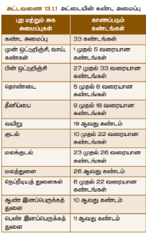

# 13. உயிரினங்களின் அனைப்பு நிலைகள்

## கற்றல் நோக்கங்கள்
இப்பாடப்பகுதியைக் கற்ற பின், மாணவர்கள் பின்வருவனவற்றைச் செய்வார்கள்:

- இவ்வுயிரிகளின் பல் வகையான உறுப்பு அமைப்புகளின் அமைப்புகளை அடையாளம் காணுதல்.
- அட்ணடை ஏற்றும் முயலின் பல் வகை உறுப்பு அமைப்புகளின் செயலியல் நிகழ்வுகளைப் புரிந்து கொள்ளுதல்.
- அட்ணடையின் ஒட்டுண்ணித் தகவல் அமைப்புகளைக் கற்றல்
- முயலின் பல் அமைப்பு அடையாளம் காணுதல் ஏற்றும் அதன் முக்கியத்துவத்தை அறிதல்.
- முதுகெலும்பறை (அட்ணடை) ஏற்றும் முதுகெலும்பு இல்லா (முயல்) உயிரினங்களின் தோற்ற அமைப்பில் காணப்படும் மாறுபாடுகளை அறிந்து கொள்ளல்

## அறிமுகம்

விலங்குகளின் அமைப்பு ஏற்றும் வாழ்முறைகளில் காணப்படும் பல்வகைத்தன்மை மிகுந்த ஆச்சரியப்படுத்தத் தகுந்தது. நம்மைச் சுற்றி நாம் காணக்கூடிய உயிரினங்கள் மிகச் சிலமே. ஆனால் இவ்வுலகில் எண்ணிலடங்கா விலங்கு சிற்றினங்கள் வாழ்ந்து வருகின்றன. விலங்கு இராச்சியம் (Kingdom Animalia) என்பது முதுகெலும்பு உள்ளன அடிப்படையில் முதுகெலும்பு அற்றனவேற்றும் முதுகெலும்பு உள்ளனவை என இரு பிரிவுகளாகப் பிரிக்கப்பட்டுள்ளனதாம் அறிமுகமாம்.

வாழ்முறை, வாழிடம், உருவ அமைப்பு ஏற்றும் இனப் பெறுவதற்கு முனை ஆகியவற்றில் மிகப் பெரும் அளவில்தான் மாறுபாடுகள் காணப்படுகின்றன. இப்பாடப்பகுதியில் ஒரு முதுகெலும்பறை உயிரி (அட்ணடை) ஏற்றும் ஒரு முதுகெலும்பு இல்லா உயிரி (முயல்) ஆகியவற்றின் புரதம் தாங்கும் ஏற்றும் உள் அமைப்பியல் பற்றிக் கற்க உள்ளோம்.

கிரானுலோசா (Hirudinaria granulosa) என்பதாகும். இனத்தாகுதி வகையானது புழுக்களில் சொரணியாகும். வகையான புழுக்கள் என்பவை உறுப்பு அமைப்பு அளவில் ஒருங்கிணைப்புடைய, உடலமைப்புடைய, விலங்குகளாகும்.

(Oryctolagus cuniculus) – முயலின் விலங்கியல் பெயராகும். இனத்தாகுதி முதுகெலும்பு உள்ளனவேற்றும், வகுப்பு – பாலூட்டிகள் ஆகும். பாலூட்டிகளில் விலங்குகளில் மிக உயர்ந்த வகுப்பாகும். மேற்கோள் அனைத்து வகை விலங்குகளின் விடையிலும் மேம்பாடு அடைந்தவை இவ்வுயிரிகள். பாலூட்டிகளின் மிகச் சிறப்பான தாரணப் பண்பு, பெண் உயிரிகளில் காணப்படும் பால் சுரப்பிகள். இவ்வுயிரிகள் தவப்ப இரத்த உயிரிகள் ஏற்றும் உடலமுழுவதும் உமரதோங்குகளால் மூடப்படையணவ.

உள் அமைப்பியல், உறுப்பு அமைப்புகள் ஏற்றும் அவற்றின் செயல்பாடு பற்றி விரிவாகக் கற்போம்.

## 13.1. அட்ணடை

### 13.1.1. வகைப்பாடு

**தாகுதி:** வகையான புழுக்கள்
**வகுப்பு:** ஹிருடினியா
**வரிசை:** மண்டிபுலாட்டா
**குடும்பம்:** ஹிருடினிரியே
**சிற்றினம்:** கிரானுலோசா

### 13.1.2. வாழிடம்

அட்ணடை (கால்நடை அட்ணடை) இந்தியா, வங்காளம், பாகிஸ்தான், மியான்மார் ஏற்றும் இலங்கை ஆகிய நாடுகளில் காணப்படுகிறது. இவ்வுயிரி நன்னீர் ஆகாயங்கள், ஏரிகள், சதுப்பு நிலங்கள் ஏற்றும் சிறு நீர்நிலைகளில் வாழ்கிறது. இவை புல் ஒட்டுண்ணிகளாகவும், மீன்கள், நண்டுகள், கால்நடைகள் ஏற்றும் எந்தனின் இரத்தம் உறிஞ்சும் சாங்குயிரிகள் (இரத்த உறிஞ்சிகள்) வகையினை வாகும் உள்ளன.

**படம் 13.1** அடிநாயின்
(அ) முதுகுப்புறத் தோற்றம்
(ஆ) வயிற்றுப்புறத் தோற்றம்

### 13.1.3. புரதம் தாங்கும்

பட்டுள்ளது.

| உறுப்புகள் | கண்டங்கள் |
|:---|:---|
| வாய் | முதல் ஐந்து (1-5) |
| முதல் நெப்பியத் துணை | 6 |
| ஆண் இனப்பெறுக்கத் துணை | 8, 9, 10 |
| பெண் இனப்பெறுக்கத் துணை | 11 |
| மைத்துனள் | 26 |
| வநப்ரீடியத் துணைகள் | 17 (6-22) |
| மலத்துனை | 26 |
| பின் உறிஞ்சி | 27-33 |

### 13.1.4. அமைப்பு

அட்ணடையின் உடற்சுவர் ஐந்து அடுக்குகளைக் கொண்டது. அவை:

1. கியூட்டிக்கிள்
2. புரதம் தால் – கியூட்டிக்கிள் ஒட்டி அடியில் காணப்படுவது
3. மைதால் – புரதம் தாலுக்கு அடியில் காணப்படுவது; இணைப்புத் திசுவால் ஆனது.
4. நெல் அடுக்கு – வட்ட ஏற்றும் நீளவட்டத் தசைகளால் ஆனது
5. மெசோடர்மல் திசு – நீள் தசைகளுக்குக் கீழ் உள்ளது. உயிருக்குழாயச் சுற்றி, $\frac{1}{4}\text{circ}$ முழுவதும் நிரம்பியுள்ளது.

### 13.1.5 நடமாட்டம்

நிலத்தில் ஊர்தல் முறையிலும், நீரில் நீந்தும் முறையிலும் இடப்பெயர்ச்சி செய்கிறது.

**நடமாட்டம்:**

தசைகளின் சுருக்கம் மற்றும் நீட்டலின் மூலம் நடைபெறுகிறது. இவ்வியக்கத்தின் போது ஒட்டிக்கொள்வதற்கு இரண்டு ஒட்டுறிஞ்சிகளும் உதவுகின்றன.

**நீந்தல்:**

நீரில் நீந்தி அலை இயக்கத்தை மேற்கொள்கிறது.

### 13.1.6 சீரண மண்டலம்

நீண்ட உணவுப்பாதையும் சீரணச் சுரப்பிகளையும் கொண்டது.

**வாய்:**

அடிநாயின் உணவுப்பாதை வாய்முதல் மலத்துவார வரை நீண்ட நேரான குழலாகும்.
மூன்று ஆரத் துளைகளைக் கொண்ட வாய், முன் ஒட்டுறிஞ்சியின் மையப்பகுதியில் அமைந்து, சிறிய வாய்க்குழிக்குள் நீள்கிறது. வாய்க்குழியின் சுவர் ஒரே வரிசையில் அமைந்த நுண்ணிய பற்களைக் கொண்ட மூன்று தாடைகளை உடையது. உமிழ்நீர்ச் சுரப்பிகளின் திறப்புகளைக் கொண்ட பாப்பில்லாக்களும் தாடைகளில் உள்ளன. வாயும் வாய்க்குழியும் முதல் ஐந்து கண்டங்களை ஆக்கிரமித்துள்ளன.

**தொண்டை:**

வாய்க்குழி தசையாலான தொண்டைக்குள் நீள்கிறது. தொண்டையைச் சுற்றி உமிழ்நீர்ச் சுரப்பிகள் அமைந்துள்ளன. இரத்தம் உறையாமல் தடுக்க ஹிருடின் என்ற பொருள் அடிநாயின் உமிழ்நீரில் உள்ளது. தொண்டை குறுகிய உணவுக்குழாய் மூலம் தீனிப்பையுடன் இணைகிறது.

**தீனிப்பை:**

உணவுப்பாதையின் மிகப்பெரிய பகுதி தீனிப்பை ஆகும். இது தொடர்ச்சியாக அமைந்த 10 அறைகளைக் கொண்டது. இவ்வறைகள் வட்டத் துளைகள் மூலம் ஒன்றுடன் ஒன்று தொடர்புடையவை. இத்துளைகள் சுருக்குத் தசைகளால் சூழப்பட்டுள்ளன. ஒவ்வொரு அறையின் பக்கவாட்டிலும் பின்னோக்கி நீண்ட குடல்வால்கள் (டைவர்டிகுலா) அமைந்துள்ளன. தீனிப்பை மற்றும் அதன் குடல்வால்கள் அதிகளவு உறிஞ்சப்பட்ட இரத்தத்தை சேமித்து வைக்கின்றன.

**வயிறு:**

தீனிப்பையின் கடைசி அறை வயிற்றுடன் இணைகிறது. வயிறு சிறிய குடலாகத் தொடர்ந்து மலக்குடலில் திறக்கிறது. மலக்குடல் மலத்துவாரத்தின் வழியாக உடலின் வெளியே திறக்கிறது.

**உணவு மற்றும் சீரணம்**

அடிநாய் கால்நடைகள் மற்றும் பிற விலங்குகளின் இரத்தத்தை உணவாகப் பெறுகிறது.

உணவூட்டத்தின் போது அடிநாய் தனது பின் ஒட்டுறிஞ்சியின் மூலம் விருந்தோம்பியின் உடலில் உறுதியாக ஒட்டிக்கொள்கிறது. தாடைகளின் மூலம் தோலில் மூன்று ஆரம் அல்லது Y வடிவ காயத்தை ஏற்படுத்துகிறது. பின்னர் தொண்டை மூலம் இரத்தத்தை உறிஞ்சுகிறது. உமிழ்நீர் காயத்தின் மீது செலுத்தப்படுகிறது.

சீரணமாகாத இரத்தம் தீனிப்பை அறைகளிலும் குடல்வால்களிலும் சேமிக்கப்படுகிறது. தீனிப்பையிலிருந்து இரத்தம் மெதுவாக வயிற்றுக்கு அனுப்பப்படுகிறது. புரதச் சீரண நொதிகளின் மூலம் வயிற்றில் சீரணம் நடைபெறுகிறது. செரிக்கப்பட்ட உணவு குடலில் உறிஞ்சப்படுகிறது. செரிக்கப்படாத உணவு மலத்துவாரத்தின் வழியாக வெளியேற்றப்படுகிறது.

அடிநாய்கள் ஹிருடின் என்ற புரதச் சுரப்பி மூலம் இரத்த உறைதலைத் தடுக்கின்றன. மேலும் விருந்தோம்பியின் உடலில் மயக்கப்பொருளை செலுத்துவதால் கடிக்கும் போது வலி உணர முடியாது.

**அடிநாயின் மருத்துவப் பயன்கள்**

அடிநாய்கள் இரத்த உறைதலைத் தடுத்து, இரத்த ஓட்டத்தை மேம்படுத்துகின்றன. சுற்றோட்டக் குறைபாடுகள் மற்றும் இரத்த ஓட்டத் தடைகள் போன்ற நோய்களுக்கு பயன்படுத்தப்படுகின்றன. அடிநாயின் உமிழ்நீரிலிருந்து பெறப்படும் மருத்துவப் பொருட்கள் உயர் இரத்த அழுத்தம் உள்ளிட்ட சில நோய்களுக்கு மருந்தாகப் பயன்படுகின்றன.

**படம் 13.2** அடிநாயின் சீரண மண்டலம்

### 13.1.7 சுவாச மண்டலம்

அட்ணடயில் தோல் மூலம் சுவாசம் நடைபெறுகிறது. புறத்தால் செல்களுக்கு இடையில் தசைநார் மற்றும் இரத்தக் குழாய்கள் இணைந்து நெருக்கமான வலையமைப்பு காணப்படுகிறது. இந்த தசைநார்களினுள் இரத்த உடற்குழி திரவம் நிரம்பியுள்ளது.

சுவாச வாயுக்களின் பரிமாற்றம் பரவல் முறையில் நடைபெறுகிறது. நீரில் கரைந்துள்ள ஆக்சிஜன் தோல் மூலம் இரத்த உடற்குழி திரவத்திற்குள் பரவுகிறது. அதே வழியில் கார்பன் டைஆக்சைடு உடலிலிருந்து வெளியே பரவுகிறது.

மெழுகுச் சுரப்பி மூலம் தோல் எப்போதும் ஈரமாகவும் வழுவழுப்பாகவும் வைக்கப்படுகிறது. இது உடல் உலர்ந்து போவதிலிருந்து பாதுகாக்கிறது.

### 13.1.8 சுழற்சிமண்டலம்

இரத்த உடற்குழி மண்டலம் மூலம் அட்ணடயில் சுழற்சி நடைபெறுகிறது. உண்மையான இரத்தக் குழாய்கள் இல்லை. இரத்தக் குழாய்களுக்கு பதிலாக, இரத்தம் போன்ற திரவத்தால் நிரப்பப்பட்ட இரத்த உடற்குழிக் கால்வாய்கள் அமைந்துள்ளன.

இந்த உடற்குழி திரவம் ஹீமோகுளோபின் கொண்டுள்ளது.

சுழற்சி மண்டலத்தில் நான்கு நீண்ட கால்வாய்கள் உள்ளன.

ஒரு கால்வாய் உணவுப்பாதையின் மேற்புறமாகவும், மற்றொரு கால்வாய் உணவுப்பாதையின் கீழ்ப்புறமாகவும் அமைந்துள்ளது. மற்ற இரண்டு கால்வாய்கள் உணவுப்பாதையின் இருபுறங்களிலும் அமைந்துள்ளன.

இந்த இரு கால்வாய்களும் உட்புறத்தில் வால்வுகளை கொண்டுள்ளதால், இதயம் போல செயல்படுகின்றன.

நான்கு கால்வாய்களும் கீழ்ப்புறத்தில் 26-ஆவது கண்டத்தில் ஒன்றாக இணைகின்றன.

### 13.1.9 நரம்பு மண்டலம்

அட்ணடையில் மைய, பக்கவாட்டு மற்றும் பரிவு நரம்பு மண்டலங்கள் காணப்படுகின்றன.

மைய நரம்பு மண்டலம் நரம்பு வளையமும், ஓரிணை வயிற்றுப்புற நரம்பு நாணும் கொண்டுள்ளது.

நரம்பு வளையம் தொண்டையைச் சுற்றி அமைந்துள்ளது. இது தொண்டை மேல் நரம்புத்திரள் (மூளை), தொண்டைச் சுற்று நரம்பு இணைப்பு மற்றும் தொண்டை கீழ் நரம்புத்திரள் ஆகியவற்றைக் கொண்டுள்ளது.

தொண்டை கீழ் நரம்புத்திரள், தொண்டையின் அடிப்பகுதியில் நான்கு இணை நரம்புத் திரள்களின் இணைப்பால் உருவாகியுள்ளது.

**படம் 13.3** அடிநாயின் நரம்பு மண்டலம்

### 13.1.10 கழிவு நீக்க மண்டலம்

அட்ணடயில் கழிவு நீக்கம் நெப்ரீடியா (Nephridia) எனப்படும் கண்டவாரியான, சிறிய சுருண்ட இணைக் குழல்களின் மூலம் நடைபெறுகிறது.

மொத்தம் 17 இணை நெப்ரீடியங்கள் உள்ளன. இவை 6 முதல் 22 வரை உள்ள கண்டங்களில் அமைந்துள்ளன. நெப்ரீடியத் துளைகள் மூலம் கழிவுகள் வெளியேற்றப்படுகின்றன.

### 13.1.11 இனப்பெருக்க மண்டலம்

அட்ணடை ஓரிருபாலுயிரி (Hermaphrodite) ஆகும். அதாவது, ஒரே உயிரியில் ஆண் மற்றும் பெண் இனப்பெருக்க மண்டலங்கள் காணப்படுகின்றன.

**ஆண் இனப்பெருக்க மண்டலம்**

12-ஆவது கண்டம் முதல் 22-ஆவது கண்டம் வரை, ஒவ்வொரு கண்டத்திலும் ஓரிணை வீதம் பதினொன்று இணை விந்துக்கோஷங்கள் உள்ளன. இவை விந்துப்பைகள் எனப்படும் கோள வடிவ அமைப்புகளாக காணப்படுகின்றன.

ஒவ்வொரு விந்துக்கோஷத்திலிருந்தும் விந்து வெளியேற்றும் சிறிய குழாய் உருவாகி, அது விந்து நாளத்துடன் இணைகிறது.

இந்த விந்து நாளம் அதிக சுருள்களைக் கொண்டு, விந்து முதிர்ச்சி பை (எபிடிடைமிஸ்) ஆக மாறுகிறது. விந்தணுக்கள் இதில் சேமிக்கப்பட்டு முதிர்ச்சி அடைகின்றன.

எபிடிடைமிஸ் சிறிய வெளியேற்றும் குழாயாகத் தொடர்கிறது. இருபுற வெளியேற்றும் குழாய்களும் இணைந்து இனப்பெருக்க அணையாக மாறுகின்றன.

இந்த அணை இரண்டு பகுதிகளை கொண்டுள்ளது:

சுருண்ட புரோஸ்டேட் சுரப்பிகள்

ஆண் குறி (பினியல் பை)

ஆண் குறி, ஆண் இனப்பெருக்க துளை மூலம் வெளிப்புறம் திறக்கிறது.

**பெண் இனப்பெருக்க மண்டலம்**

பெண் இனப்பெருக்க மண்டலம் அண்டக்கோஷங்கள், அண்டக் குழாய்கள், பொதுவான அண்ட நாளம் மற்றும் பெண் இனப்பெருக்க உறுப்பு (யோனி) ஆகியவற்றைக் கொண்டுள்ளது.

11-ஆவது கண்டத்தின் வயிற்றுப் பகுதியில் ஓரிணை அண்டக்கோஷங்கள் உள்ளன. ஒவ்வொரு அண்டக்கோஷமும் சுருண்ட நாடா போன்ற அமைப்பைக் கொண்டது.

அண்டக்கோஷத்திலிருந்து அண்டங்கள் (சினை செல்கள்) விடுவிக்கப்படுகின்றன. ஒவ்வொரு அண்டக்கோஷத்திலிருந்தும் ஒரு சிறிய அண்டக் குழாய் உருவாகிறது.

இருபுற அண்டக் குழாய்களும் இணைந்து பொதுவான அண்ட நாளமாக மாறுகின்றன. பின்னர் இது பேரிக்காய் வடிவ யோனியில் திறக்கிறது.

யோனி 11-ஆவது கண்டத்தின் பின்புற வயிற்றுப் பகுதியில் அமைந்துள்ளது.

**கரு வளர்ச்சி**

அகக் கருவுறுதல் நடைபெறுகிறது. இதனைத் தொடர்ந்து கக்கூன் (முட்டைக்கூடு) உருவாகிறது. இது 9, 10 மற்றும் 11-ஆவது கண்டங்களைச் சுற்றி உருவாகிறது.

கரு வளர்ச்சி நேரடியாக நடைபெறுகிறது. ஒரு முட்டைக்கூட்டினுள் 1 முதல் 24 வரை கருக்கள் வளர்கின்றன.

முதிர்ந்த அட்ணடையைப் போன்ற தோற்றமுடைய இளம் அட்ணடைகள் வெளியே வருகின்றன.

**படம் 13.4**  அட்ணடயின இனைப்தபருக்்க ேண்டலம்

### 13.1.12 அட்ணடையின் ஒட்டுண்ணித் தகவனமப்புகள்

அட்ணடைகள் முதுகெலும்பியினரின் இரத்தத்தை உறிஞ்சி ஒட்டுண்ணி வாழ்க்கை முறையை மேற்கொள்வதால், அவற்றின் உடலமைப்பில் பல்வேறு மாற்றங்கள் ஏற்பட்டுள்ளன.

தொண்டை இரத்தத்தை உறிஞ்ச பயன்படுகிறது.

உடலின் இரு முனைகளிலும் உள்ள ஒட்டுறிஞ்சிகள் (Suckers), அட்ணடையை விரும்பிய உடலுடன் உறுதியாக இணைக்க உதவுகின்றன. இவை பிடிப்புறுப்புகளாக செயல்படுகின்றன.

அட்ணடையின் வாயினுள் காணப்படும் மூன்று தாடைகள், விரும்பிய உடலில் வலியில்லாத Y-வடிவ காயத்தை உருவாக்க உதவுகின்றன.

உமிழ்நீர்ச் சுரப்பிகளால் உருவாக்கப்படும் ஹிருடின் (Hirudin) எனும் பொருள், இரத்தம் உறையாமல் தடுக்கும். எனவே, தொடர்ச்சியாக இரத்தம் கிடைப்பது உறுதியாகிறது.

பக்கக் கால்கள் (Parapodia) மற்றும் மயிர்க் கால்கள் (Setae) காணப்படுவதில்லை. ஏனெனில், இவ்வுறுப்புகள் ஒட்டுண்ணி வாழ்க்கைக்கு தேவையில்லை.

தீனிப்பையில் இரத்தம் சேமிக்கப்படுகிறது. இது அட்ணடைக்கு பல மாதங்கள் வரை ஊட்டச்சத்தை வழங்குகிறது. இதன் காரணமாக, சீரண நீர்ச் சாறுகள் அல்லது நொதிகள் அதிக அளவில் சுரக்க வேண்டிய அவசியமில்லை.

## 13.2. முயல்

### வகைப்பாட்டு நிலை

**தாகுதி:** முதுகெலும்பு இல்லாதவை
**துணைத்தாகுதி:** முதுகெலும்பு உள்ளனவே
**வகுப்பு:** பாலூட்டிகள்
**வரிசை:** மலம்கதோதார்பா
**குடும்பம்:** லெபரிடே
**சிற்றினம்:** கியூனிகுலஸ்

### 13.2.1. வாழிடமும், வாழ்முறையும்

முயல் ஒரு தோல் தாங்கும் பயன் சுபாவமுள்ள, விலங்காகும். இது வகையில் வாழும். தாவிடம் பெயரக்கூடிய இவ்விலங்குகள் உலகம் முழுவதும் பரவிக் காணப்படுகின்றன. இவை புல் ஏற்றும் முள்ளங்கி, முரட்டை போன்ற காய்கறிகளையும், கீரைகளையும் உண்கின்றன. இவை கூட்டமாக வாழும்

குள்ள முயல் தானது அழியும் அபாய நிலையில் உள்ள விலங்கு என 1990 இல் வாஷிங்டனில் பட்டியலிடப்பட்டது. வாழிட இழப்பதால் எண்ணிக்கையும், பரவலும் குறைந்து பட்டியலிடப்பட்டது. வாழிட இழப்பதால் இம் முயலின் எண்ணிக்கையும், பரவலும் குறைந்து மபோனைம்இறகுக் காரணம். தோராய் 2003 இல் தாலம்பியதாவடி நிலக் குள்ள முயல் அழியும் நிலையில் உள்ள விலங்கு என

### 13.2.2. புரதம் தாங்கும்

**படம் 13.5** முயல் – புறத் தோற்றம்

**அளவு, வடிவம் மற்றும் நிறம்:**

முயல் தானது நீண்ட, மேமை உருண்ட வடிவ உடலமைப்பைக் கொண்டது. ஆண் ஏற்றும் பெண் முயல்கள் ஒரே அளவுடையவை. இவை சுமார் 45 செ.மீ. நீளமும், சுமார் 2.25 கிலோ எடையுமதப் பொரும் அளவுக்கு வளர்ப்பணவை. தவள் நிற, கருப்பு ஏற்றும் தவள் நிறம் உட்பட பல் வகை நிறங்களில் காணப்படுகின்றன. உடல் ததுத் தவிர்த்து உமரதோங்குகளால்

உடற்பிரிவுகள் முயலின் உடலதானது நிறல, கழுத்து, உடல் ஏற்றும் வால் எனப் தனித்தனி முனை முட்ணட வடிவதானைப் பிளவுபட்ட முகவாய்த் தாண்டது. நிறலயில் வாய், நாசித் துண்டுகள், கண்கள், காதுகள் ஏற்றும் உயிர் உமரதோங்கள் உள்ளன. வாய் மேலுட்டு ஏற்றும் கீழுட்டதால் சூழப்பட்ட கிண்டேட்டப் பிளவாக உள்ளது. வாய்க்கு மேற்கோள் மேல் தாய்வதானைத் துண்டுகளாக இரு நாசித் துண்டுகள் உள்ளன. மேலுட்டின் இருபுரமும் உயிர் உமரதோங்கள் அல்லது மூக்குமுடிகள் (Vibrissae) தவளிமய நீட்டிக் கொண்டுள்ளன. அநேகக்கூடிய, தெரிய இருபுரச் செவிகள் அல்லது செவி மடல்கள் நிறலயின் மேல்பகுதியில்

கழுத்து நிறலையை உடலுடன் கழுத்து இணைக்கிறது. இது நிறலையைத் திருப்புவதற்கு உடல் உடலின் முன்பகுதி மார்பு எனவும், பின்பகுதி வயிறு எனவும் பகுக்கப்பட்டுள்ளது. பெண் உயிரிகளில் மேற்கோளுக்கும், வயிற்றுக்கும் இணைப்புப் பகுதியில் நான்கு அல்லது ஐந்து மார்புக் காம்புகள் அல்லது பால்காம்புகள்

உடலில் ஐந்து விரல் கொண்ட இரு இணைக் கால்கள் இணைக்கப்பட்டுள்ளன. முன்னங்கால்கள் பின்னங்கால்களின் விட குட்டையானவையணவை. அனைத்து விரல்களிலும் வகை நகங்கள் காணப்படுகின்றன.

வயிற்றின் இறுதியில், வாலின் அடியில் மேல் ததுண்ள உள்ளது. பெண் விலங்குகளின் வயிற்றுப்பகுதியில் சிறு பிளவும் போன்ற பெண்குறி உள்ளது. ஆண் விலங்குகளில் மேல் ததுண்ளயின்

அருகு வயிற்றுப்பகுதியில் ஆண்குறி அமைந்துள்ளது.

ஆண்குறியின் இருபுரமும் ஓரிணை விண்ப்பைகள் உள்ளன. விந்தப் பைகளின் உள்ளே விந்துகள் உள்ளன.

வால் வால் குட்டையானது. இது மேற்கோள் முயல்களுக்கு அபாய எச்சரிக்கையளிக்க வழங்க

### புரதம் தால்

உடலின் தவளிப்பு மேல் புரதம் தாலதால் சூழப்பட்டுள்ளது. உடரோமம், வனள் நகங்கள், வியர்வைச் சுரப்பிகள், எண்ணெய்ச் சுரப்பிகள், பால்சுரப்பிகள் ஆகியவை புரதம் தாலின் மேற்புறப் பாடுகளாகும். பால் சுரப்பி மைதாலின் மேற்புறப் பாடதாகும். இது சுரக்கும் பாலம் முயல் குட்டிகளின் உயிரதாகிறது. வியர்வை ஏற்றும் எண்ணெய்ச் சுரப்பிகள் உடல் தவப்ப நிறலையப்

### உடற்குழிவு

### 13.2.3. முயலின் உடற்குழிவு

முயல் ஒரு உண்மையான உடற்குழியுடைய விலங்கு. உடலின் உட்பகுதி குறுக்குத் தட்டுப் போன மார்பு எனையும், வயிற்றையுமாகவும் பிரிக்கப்பட்டுள்ளது. உதரவிதானைம்பாலூட்டிகளில் மட்டுமே காணப்படும் ஒரு சிறப்புப் பண்பாகும். உதரவிதானைததின் வடிவம் வேறுபட்டவன் மூலம் சுவாச இயக்கங்களை நடந்தப் பறுகின்றன.

தோரணையில் இதயமும், நுரையீரல்களும் அமைந்துள்ளன. வயிற்றை நையில் சீரை, கழிவுநீக்க் ஏற்றும் இனப் பெறுக்க அமைப்புகள்

### 13.2.4. சீரை மண்டலம்

சீரை அமைப்பு உயிர்ப் பாண்ணையையும் சீரை சுரப்பிகளையும் உள்ளடக்கியது. உயிர்ப் பாண்ணையில் வாய், வாய்க்குழி, தாடை, உயிருக்குழாய், இரைப்பை, சிறுகுடல், குடல்நீட்சி, பெருங்குடல் ஏற்றும் மேல் ததுண்ள ஆகியவற்றை உள்ளடக்கியது. வாயதானது மேலுட்டு ஏற்றும் கீழுட்டதால்

வாயதானது மேலுட்டு ஏற்றும் கீழுட்டதால் சூழப்பட்ட குறுக்குப் பிளவாகும். இது வாய்க்குழியினுள் நீள்கிறது. வாய்க்குழி மேற்புரம் அனைத்தாலும், அடிப்புரம் தாடை நாக்கதாலும் சூழப்பட்டுள்ளது. வாய்க்குழியின் பக்கப் பகுதியில் நெய் தாலதானை நாக்க உள்ளது. தாடைகளில் பற்கள்

வாய்க்குழியதானது தாடை நாக்கின் மூலம் உயிருக்குழாயாகத் தொடர்கிறது. உயிருக்குழாய் இரைப்பையினுள் திக்கிறது. இரைப்பை நாக்கத்தொடர்ந்து சிறுகுடல் அமைந்துள்ளது. தேல்லிய சுவர் உடைய குடல்வால் நீட்சி, சிறுகுடலும் பெருங்குடலும் சந்திக்கும் இடத்தில் காணப்படுகிறது. இதில் உள்ள பாக்டீரியா, வசல்லுடையான செரிமானம் உதவுகிறது. சிறுகுடல் பெருங்குடலுக்குத் தொடர்கிறது. பெருங்குடலில் டைகாலன் ஏற்றும் மைக்குடல் என

இருபகுதிகள் உள்ளன. மேல் குடல் மேல் ததுண்ள மூலம் தவளித்திக்கிறது.

### செரிமானச் சுரப்பிகள்

உமிழ்நீரச் சுரப்பிகள், இரைப்பைச் சுரப்பிகள், கல்லீரல், கணையம் ஏற்றும் சிறுகுடல் சுரப்பிகள் மபோனை சீரைச் சுரப்பிகளாகும். இச் சுரப்பிகள் சுரக்கும் தநதைகள் உயிர்ப் பாண்ணையில் உயிரின் தெரிமேனைத் திறக்க உதவுகின்றன.

இவை உயிர்ப் பொருட் கொண்டு தவட்டுவதற்கும், தேல்லுவதற்கும், அரிப்பதற்கும் பயன்படுகின்றன. முயலின் வாழ்நாளில் இருத்தாகுதிப் பற்களைப் பொறுத்துள்ளது. இவ்வாறு ஒரு விலங்கின் வாழ்நாளில் இருத்தாகுதிப் பற்கள் காணப்படும் நிலை 'இருமுனைடதான்றும் பல்லினம்பு' எனப்படுகிறது. முயலின் பற்கள் தவிர மாறுவகையினை. இத் தகைய பல் அமைப்புக்கு 'மாறுபடட பல்லினம்பு' என்று பெயர். பாலூட்டிகளில் நான்கு வகைப் பற்கள் காணப்படுகின்றன. அவை வெட்டும் பற்கள் (I), காரைப் பற்கள் (C), முன் கடைவாய்ப் பற்கள் (PM) ஏற்றும் பின் கடைவாய்ப் பற்கள் (M) ஆகும். இவை பல் வகைப் பாட்டின் மூலம் குறிக்கப்படுகின்றன.

**படம் 13.6** முயலின் உணவு மண்டலம்

ஒரு பாலூட்டியில் காணப்படும் பற்களின் பற்றி சுருக்கமாக எழுதும் முறையே பல் வகைப் பாடு ஆகும். ஒரு பாலூட்டியின் மேல் ஏற்றும் கீழ் தாடைகளின் ஒரு பக்கத்தில் மட்டும் காணப்படும் தவிர மாறுவகைப் பற்களின் எண்ணிக்கையை இது குறிக்கிறது. முயலின் பல் வகைப் பாடு ($I\frac{2}{1}, C\frac{0}{0}, PM.\frac{3}{2}, M\frac{3}{3}$.) இது பின்வருமாறு எழுதப்படலாம்:

முயலின் தவட்டும் பற்களுக்கும், முன் கடைவாய்ப் பற்களுக்கும் இடையேயான இடைப்பகுதடையாஸ்டீமா அல்லது பல் இடைவெளி என அழைக்கப்படுகிறது. தேல்லும் போதும், அரிக்கும் போதும் உயிருணவைத் தாளுவதற்கு இந்த் பல் இடைவெளி பயன்படுகிறது.

**படம் 13.7** முயலின் பல்லமைப்பு

### 13.2.5. சுவாச மண்டலம்

நிகழ்த்தப்படுகிறது. இவை தேனணையான பஞ்சமான திசுக்களால் ஆக்கப்பட்டு, தோரணக் கூட்டினுள் அணக்கப்பட்டுள்ளன. தோரணையதானது முதுகுப் புரதத்தில் முதுகெலும்புத் தொடர்தாலும், வயிற்றுப்புரதத்தில் தோரதப் பலும்பதாலும், பக்கவாட்டில் விலா எலும்புகளாலும் சூழப்பட்டுள்ளது. தோரணையின் கீழ்ப்பகுதியில் குவிந்த உதரவிதானைமம் அமைந்துள்ளது.

வெவ்வேறு தாலால் ஆன உணையதால் சூழப்பட்டுள்ளது. தவளிப்புக் காரணம், புரத நாசித் துண்டுகள் வழியாகச் சுவாசப் பாண்ணையில் நுழைந்து தாடை நாக்கை அடைகிறது. தாடை நாக்கிலிருந்து குரல்வளை வழியாக மூச்சுக்குழாயினுள் காற்று நுழைகிறது. மூச்சுக்குழாயின் மேற்பகுதி அகன்று குரல் தப்பட்டியாக வேறுபட்டுள்ளது. டைரிங்ஸ் எனப்படும். இக் குரல் தப்பட்டியின் சுவர் நான்கு குருத்தெலும்புத் கட்டுகளால் வலுவூட்டப்பட்டுள்ளது. குரல் தப்பட்டியினுள் உள்ள குரல் நாண்கள் அதிர்வடைவதால் ஒலி உருவாகிறது. குரல் தப்பட்டடிரக்கையா அல்லது மூச்சுக்குழாயாகத் தொடர்கிறது.

**படம் 13.8** முயலின் நுரையீரல்கள்

மூச்சுக்குழாயின் வழியாகக் காற்று சென்று வரும் வகையில் அச் சுவர்கள் குருத்தெலும்பு வளையங்களால் தாங்கப்படுகின்றன. உயிரதானது குரல்வளை வழியாக மூச்சுக்குழாயினுள் தெல் வகை குரல்வளை மூடிடுக்கிறது. மூச்சுக்குழாய் தோரணப் பகுதியை அடைந்தும் இரு மூச்சுக் கிளைக் குழல்களாகப் பிரிந்து, ஒவ்வொரு கிளைக்குழலும் ஒரு நுரையீரலினுள் நுழைகிறது. இம் மூச்சுக் கிளைக் குழல்கள் மூச்சு நுண்கிளைக் குழல்களாகப் பிரிந்து, காற்று நுண் நைளிகளில் முடிகிறது.

உள்ளிழுத்தல்) ஏற்றும் வெளிச்சுவாசம் (காற்றை வெளியேற்றுதல்) ஆகியவற்றை உள்ளடக்கியது. இந் நிகழ்வுகள் மூலம் வாயுப் பரிமாற்றம் நிகழ்கிறது. உட்சுவாசம் ஒரு தெயல் மிகு நிகழ்வாகும். ஆனால் வெளிச்சுவாசம் ஒரு செயல் நிகழ்வாகும்.

### 13.2.6. இரத்தச் சுற்றோட்ட மண்டலம்

குழாய்கள் ஏற்றும் இதயம் ஆகியவற்றைக் கொண்டது. இதயம் பரிக் காய வடிவத்தில் தோரணையினுள் இரு நுரையீரல்களுக்கும் இடையில் அமைந்துள்ளது. இதயம் பெரிகார்டியம் என்ற இரட்டைச் சவ்வுகளால் ஆன உணையதால் சூழப்பட்டுள்ளது.

இதயம் இரு ஆரிக்கிள்கள் ஏற்றும் இரு தவண்ட்ரிக்கிள்கள் என நான்கு அறைகளைக் கொண்டது. வலது ஏற்றும் இடது ஆரிக்கிள்கள், ஆரிக்கிள் இடைத்தடுப்புச் சுவரால் பிரிக்கப்பட்டுள்ளன. இம் மபோல், வலது ஏற்றும் இடது தவண்ட்ரிக்கிள்கள், தவண்ட்ரிக்கிள் இடைத்தடுப்புச் சுவரால் பிரிக்கப்பட்டுள்ளன. வலது ஆரிக்கிள் – தவண்ட்ரிக்கிள் தாரைத் துண்ள மூலம் வலது ஆரிக்கிள், வலது தவண்ட்ரிக்கிளினுள் திக்கிறது. இத் துண்ள மூவிழ்வதால் விணைதால் காக்கப்படுகிறது. இடது ஆரிக்கிள், இடது தவண்ட்ரிக்கிளினுள் $\textcircled{circ}$ L-S ஆரிக்கிள் – தவண்ட்ரிக்கிள் தாரைத் துண்ள மூலம் திக்கிறது. இத் துண்ளையை ஈரிதழ் வால்வு அல்லது மிட்ரல் வால்வு காக்கிறது. நுரையீரல் வளையேற்றும் தெரிந்து நீக்கும் இடங்களில் அனரச் சந்திர வால்வுகள் உள்ளன.

இரு (முன்முக வலிச் சிணர்கள்) ஏற்றும் ஒரு கீழ்ப் பெருஞ் சிணர் (பின்முக வலிச் சிணர்) மூலம் உடலின் அனைத்துப் பகுதிகளிலிருந்தும் ஆக்சிஜன் நீக்கமப் பறை இரத்தம் வலது ஆரிக்கிளைப் பெறுகிறது. இடது ஆரிக்கிள், நுரையீரல் சிணர்கள் மூலம் நுரையீரல்களிலிருந்து ஆக்சிஜன் நிறைப்பட்ட இரத்தம் பெறுகிறது. வலது தவண்ட்ரிக்கிளிலிருந்து நுரையீரல் வளைக்கிளம்பி, ஆக்சிஜன் குறைந்த இரத்தம் நுரையீரல்களுக்கு எடுத்துச் செல்கிறது. இடது தவண்ட்ரிக்கிளிலிருந்து சிஸ்டமிக் வளைக்கிளம்பி, ஆக்சிஜன் மிகுந்த

இரத்தம் உடலின் அனைத்துப் பகுதிகளுக்கும் அனுப்புகிறது.

**படம் 13.9** முயலின் இதயம் (மேற்புறத் தோற்றம்)

### 13.2.7. நரம்பு மண்டலம்

நரம்பு மண்டலம் மூளை நரம்பு மண்டலம் (CNS), புற அணைவு நரம்பு மண்டலம் (PNS) ஏற்றும் தானியங்கு நரம்பு மண்டலம் (ANS) ஆகியவற்றை உள்ளடக்கியது.

மூளையும் தண்டுவடமும் அடங்கியுள்ளன. புற அணைவு நரம்பு மண்டலத்தில் 12 இணை மூளை நரம்புகளும், 37 இணை தண்டுவட நரம்புகளும் உள்ளன. தானியங்கு நரம்பு மண்டலமேனைதும் மேலும் பரிவு ஏற்றும் இணைப் பரிவு நரம்பு மண்டலங்களாகப் பிரிக்கப்பட்டுள்ளது.

இது மூன்று சவ்வுகளால் சூழப்பட்டுள்ளது. தவளிச் சவ்வுடையூராடமடைடர் எனவும், உட்சவ்வையாடமடைடர் எனவும், இணைச் சவ்வு அரக்னாய்டு எனவும் அழைக்கப்படுகின்றன. மூளையதானது முன்மூளை, நடுமூளை ஏற்றும் பின்மூளை எனப் பிரிக்கப்படுகிறது. முன்மூளை ஓரிணை நுகர்ச்சிக்

கதுப்புகள், பெருமூளை அரைக்கோள்கள் ஏற்றும் நடையன் தெஃபலஸ் ஆகிய பகுதிகளைக் கொண்டுள்ளது. பெருமூளை அரைக்கோள்கள் இரண்டும் கார்பஸ் கலோசம் எனக் குறுக்கு நரம்புப் பட்டையதால்

**படம் 13.10** முயலின் மூளை (மேற்புறத் தோற்றம்)

நடுமூளை, பார்வைக் கால்வாய்கள் ஏற்றும் பின்மூளையில் சிறுமூளை, பானஸ் தவமரதாலி ஏற்றும் முகுளம் ஆகியவை உள்ளன. மூளைக் குறித்து விரிவான தெய்திகள் நரம்பு மண்டலம் என்பதாடத்தில்

### 13.2.8. சிறுநீரக இனப்பெறுக்க மண்டலம்

இது கழிவுநீக்க் ஏற்றும் இனப் பெறுக்க அமைப்புகளை உள்ளடக்கியது. கரு நிலையில் உள்ளபோது இவ்விரு அமைப்புகளும் நித்தனிய வளர்ச்சியடைகின்றன. ஆனால் முதிர உயிரியில் இம் அமைப்புகள் ஒன்றிணைந்து, சிறுநீரக இனப் பெறுக்க அமைப்பு என ஒரு

#### கழிவுநீக்க மண்டலம்

சிறுநீரகங்கள் கருஞ் சிவப்பு நிறமும், அவை விண்வடிவமும் கொண்டு வயிற்றை நையில் அமைந்துள்ளன. ஒவ்வொரு சிறுநீரகமும் பல தநஃப்ரதான்களால் ஆக்கப்பட்ட தேட்டதாத நஃப்ரிக் வகையானவையாகும். சிறுநீரகங்கள் இரத்தத்திலிருந்து நைட்ரஜன் தாங்க கழிவுப் பொருள்களைப் பிரித்தெடுத்து, யூரியா வடிவில் தவளிமயற்றுகின்றன.

இரண்டு சிறுநீரக நாளங்களும் சிறு

இரண்டு சிறுநீரக நாளங்களும் சிறுநீரப் பையின் பின்புரத்தில் திக்கின்றன. சிறுநீர்ப் பை, நெய் தாலதானை சிறுநீர்ப் பை வழி மூலம் தவளித

#### இனப்பெறுக்க மண்டலம்

முயல்களில் ஆண் பெண் உயிரிகள் நித்தனியமாகக் காணப்படுகின்றன. முயல்களின் ஆண், பெண் இனப் பெறுக்க அமைப்புததின் அமைப்பு ஏற்றும் அதன் துணைபால் உறுப்புகள் குறித்தும் கீழே

##### ஆண் இனப்பெறுக்க மண்டலம்

முயலின் ஆண் இனப் பெறுக்க அமைப்பு ஓரிணை விந்துகள் ஏற்றும் அவற்றைத் தொடர்புடைய நாளங்கள் ஆகியவற்றைக் கொண்டுள்ளது. விந்துகள் விந்து செல்களை உற்பத்தி செய்கின்றன. விந்துகள் வயிற்றுக்குத் தவளிமயத்தாங்கிக் கொண்டிருக்கும், மைதாலதாலதானை விண்ப்பைகளினுள் அமைந்துள்ளன. ஒவ்வொரு விந்துகமும் விந்து நுண்குழல்கள்

எனச் சுருண்ட குழல்களின் தொகுப்பாகக் கொண்டுள்ளது. இக் குழல்களில் விந்து செல்கள் முதிர்ச்சியடையும் போது, அவை மேகரிக்கும் நாளங்களில் முக்கியமாகப் பட்டு, எபிடிடிமிஸுக்குக் கடத்தப்படுகின்றன. இருபக்க விந்து நாளங்களும் சிறுநீர்ப் பைக்கு மேற்கீழ் சிறுநீரகடிகுழாயில் இணைகின்றன. சிறுநீரகடிகுழாய் பின்மனைத் தாக்கி தென்று, ஆண்குறியில்

**படம் 13.11** முயல் – ஆண் இனப்பெருக்க மண்டலம்

இனப் பெறுக்கத்தில் பங்குதாள்ளும் மூன்று துணைச் சுரப்பிகள் உள்ளன. அவை முனையப் புரதாஸ்மடட்சுரப்பி, கோப்பர் சுரப்பி ஏற்றும் கழிவிடச் சுரப்பிகள்

##### பெண் இனப்பெறுக்க மண்டலம்

முயலின் பெண் இனப் பெறுக்க அமைப்புததில் ஓரிணை அண்டகங்களும், தொடர்புடைய சுரப்பிகளும் உள்ளன. இவை சிறுநீரகங்களுக்குப் பின்னரால் வயிற்றை நையில் அமைந்துள்ளன. அண்டகங்கள் அண்டச் செல் (முட்ணட) களை உற்பத்தி செய்கின்றன. கிராஃபியன் பாலிக்கிள்கள் எனச் சிறப்புச் செல்களாக ஒவ்வொரு அண்டச் செல்லையும் சூழ்ந்துள்ளது. ஒவ்வொரு அண்டகமும் ஃபிம்பிரியேட்டட குழல் என அண்டக்குழாயினுள் அண்டச் செல்லை விடுவிக்கிறது. இவ்வண்டகக்குழாயின் வாய்ப் பகுதி அண்டகத்தை ஒட்டி அமைந்துள்ளது. இக் குழாய் அகன்ற பகுதியதான

**படம் 13.12** முயல் – பெண் இனப்பெருக்க மண்டலம்

கருப்பையாகத் தொடர்கிறது. முயலின் கருப்பை இரு நித்தனிப் பகுதிகளாக அமைந்து, நோக்கித்தில் ஒன்றாக இணைந்துடையானி அல்லது பைப்புக் கால்வாயாகத் தொடர்கிறது. சிறுநீர்ப் பையும், மயதானியும் இணைந்து, வெஸ்டிபியூல் அல்லது சிறுநீரக இனப்பெறுக்கக் கால்வாய் உருவாகிறது. இக் கால்வாய் பின்மனைத் தாக்கிச் சென்று, சிறிய பிளவும் போன்ற பைப்புறுப்பு அல்லது வல்வாலாகத் தவளித்திக்கிறது. ஓரிணை கோப்பரின் சுரப்பிகளும், கழிவிடச்

ஓரிணை கோப்பரின் சுரப்பிகளும், கழிவிடச் சுரப்பிகளும் பெண் இனப் பெறுக்க அமைப்புததில்

## நினைவில் வைத்திருக்க

- அட்ணடையின் உடல் ஒரே மாதிரியான 33 கண்டங்களாகப் பிரிக்கப்பட்டுள்ளது.
- ஓம்புயிரியின் உடலில் ஒட்டிக் கொள்வதற்கும், இடப்பெயர்ச்சிக்கும் பயன்படும் இரு ஒட்டுறுப்புகளை அட்ணடைப் பொறுத்துள்ளது.
- அட்ணடையின் உமிழ்நீரச் சுரப்பிகள் இரத்தம் உணைவைத் தடுக்கும் ஹிருடின் (எதிர் உணைவி) என்பதால் உள்ளச்

## பிற நூல்கள்

1. Kotpal R.L, 2014 Modern Text Book of Zoology - Invertebrates, Rastogi Publications, Meerut.
2. Ekambaranatha Ayyar M and Anantha krishnan T.N. 2003. Manual of Zoology, Vol I, Part I & II (Invertebrates), S. Viswanathan Printers and Publishers Pvt
3. Kotpal R.L, 2012 Modern Text Book of Zoology - Vertebrates, Rastogi Publications, Meerut
4. Jordan E.L. and Verma P.S. 2003 Chordate Zoology, S. Chand and Company Ltd, New

## இணையவளங்கள்

1. http://leeches-medicinalis.com/
2. http://www.biologydiscussion.com/zoology
3. http://animaldiversity.org/accounts/Hirudo_medicinalis/
4. http://www.notesonzoology.com/rabbit/external-morphology/external-morphology-of-rabbit-with-diagram-chordata-zoology/7642