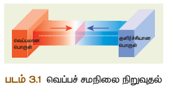
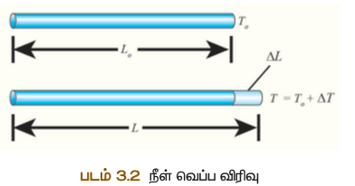
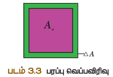
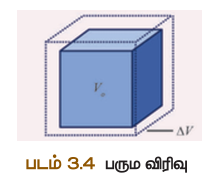
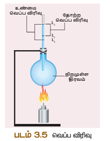
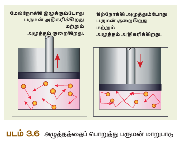
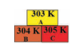

# வெப்ப இயற்பியல்

## அலகு 3

---

## கற்றல் விளைவுகள்

* வெப்ப ஆற்றல் ஏற்றும் வெப்ப நிலை பற்றி புரிந்து கொள்வர்
* வெப்ப நிலையின் அளவுமுறைகள் பற்றி தெரிந்து கொள்வர்
* வெப்ப ஆற்றல் ஏற்றும் வெப்பச் சேமிப்பு பற்றி புரிந்து கொள்வர்
* பொருட்கள் விரிவடைவது பற்றி தெரிவர்
* நல்லியல்பு வாயு விதிகள் பற்றி தெரிந்து கொள்வர்
* இயல்பு வாயு ஏற்றும் நல்லியல்பு வாயு வேறுபடுத்துவர்
* நல்லியல்பு வாயுக்களுக்கான சமன்பாடுகளை நிறுவுவர்
* மேற்கண்ட பாடப்பகுதிகளில் தாளம்புடைய கேள்விகளுக்கு தீர்வு காண்பர்

---

## முகவுரை

அனைத்து உயிரினங்களும் வாழ்வதற்குத் தகுந்த வெப்பநிலையை சூரியனிடமிருந்து பெற்றுக்கொள்கின்றன. வெப்ப ஆற்றல் என்பது காரணி ஏற்றும் வெப்ப நிலை என்பது விளைவு. அனைத்து உயிரினங்களும் உயிர்வாழ்வதற்குக் குறிப்பிட்ட வெப்பநிலையைப் பெற்றுக்கொள்கின்றன.

எண்ணெய் அடுப்பில் தூண்டில் அடுப்பில் வைக்கப்படும் பாத்திரத்தின் அடிப்பகுதி எஃகினால் செய்யப்பட்டிருப்பதை உங்களுக்குத் தெரியுமா?

நம்மில் அனைவருக்கும் வெப்ப ஆற்றல் ஏற்றும் வெப்ப நிலை பற்றிய பொதுவான புரிதல் உண்டு. ஆனால் இப்பாடத்தில் அறிவியலின் கண்ணோட்டத்தில் வெப்ப நிலை ஏற்றும் வெப்ப ஆற்றல் ஆகியவற்றைத் தெரிந்து கொள்வது முக்கியம். மேலும் வெப்ப ஆற்றல் பரிமாற்றம் எவ்வாறு நடைபெறுகிறது என்பதையும் வெப்ப ஆற்றலினால் ஏற்படும் விளைவுகள் பற்றியும் படிக்க உள்ளோம்.

குளிர்ச்சி நிலையின் அளவு வெப்ப நிலை எனவும் அழைக்கப்படுகிறது. குளிர்ச்சியான பொருள் இருக்கும் இடத்தில் சுற்றுப்புறத்துடன் வெப்பச் சேமிப்பு இல்லை என்று கூறும் பண்பையும் வெப்ப நிலை எனவே அழைக்கலாம் (மூலக்கூறுகளின் சராசரி இயக்க ஆற்றல் வெப்ப நிலை ஆகும்).

வெப்ப நிலை என்பது ஒரு பொருளின் வெப்பம் எந்த அளவில் பரவுகிறது என்பதைக் குறிப்பிடும் பண்பு ஆகும். வெப்ப நிலை என்பது ஒரு ஸ்கேலர் அளவு ஆகும். வெப்ப நிலையின் SI அலகு கெல்வின். மேலும் செல்சியஸ் (°C) ஏற்றும் ஃபாரன்ஹீட் (°F) ஆகிய அலகுகளும் வெப்ப நிலையின் அலகுகளாக பயன்படுத்தப்படுகின்றன.

---

## 3.1 வெப்பநிலையின் அளவுமுறைகள் 

நிலையான பொருட்களின் வெப்பநிலையின் அளவிடப்படும் வெப்பநிலையின் அளவுமுறைகள் என அழைக்கப்படுகின்றன. வெப்ப நிலையின் அளவுமுறைகள் என்பதன்படி, வெப்ப இயக்கவியலின் இயக்கங்கள் முடிவுக்கு வருகின்ற வெப்பநிலையானது சுழி வெப்பநிலையைக் காட்டும் ஒரு முழுமையான வெப்பநிலை அளவுமுறை ஆகும். இது வெப்ப இயக்கவியலின் வெப்பநிலை என்றும் அழைக்கப்படுகிறது.

வெப்பநிலையின் ஓர் அலகு என்பது நீரின் மும்மைப்புள்ளியில் 1/273.16 பங்கு ஆகும். ஒரு டிகிரி செல்சியஸ் வெப்பநிலை மாறுபாடு ஒரு கெல்வினுக்குச் சமமாகும்.

### இடையான விதானம்:
**K = C + 273**

**K = (F + 459.67) × 5/9**

**0 K = -273°C**

---

## 3.2 வெப்பப்பரவல் 

பொருட்களுக்கிடையே எந்த வெப்ப ஆற்றல் பரிமாற்றமும் இல்லை எனில் அப்பொருட்கள் வெப்பச் சமநிலையில் உள்ளது என்று பொருள். வெப்பநிலை மாறுபாட்டினால் வெப்ப ஆற்றல் ஒரு பொருளிலிருந்து மற்றொரு பொருளுக்குப் பரவுகிறது. ஒரே வெப்பநிலையில் உள்ள இரண்டு பொருட்கள் வெப்பச் சமநிலையில் உள்ளது எனவும் வரையறுக்கலாம்.

வேறுபட்ட வெப்பநிலையில் உள்ள இரண்டு பொருட்கள் ஒன்றையொன்று தொடர்ந்தால் என்ன நிகழும்? இந்த இரண்டு பொருட்களும் வெப்பச் சமநிலையை அடையும் வரை சூடான பொருளிலிருந்து குளிர்ந்த நிலையில் உள்ள பொருளுக்குத் தொடர்ந்து வெப்ப ஆற்றல் பரிமாற்றம் நடைபெறும்.

உடனடியாக, வெப்ப ஆற்றல் சூடான பொருளிலிருந்து குளிர்ச்சியான பொருளுக்குப் பரிமாற்றம் அடையும். இதனால் குளிர்ச்சியான பொருளின் வெப்பநிலை உயரவும், சூடான பொருளின் வெப்பநிலை குறையவும் செய்கிறது. இந்த இரண்டு பொருட்களும் ஒரே வெப்பநிலையை அடையும் வரை இது தொடர்ந்து நிகழும்.

சிறிது நேரம் மேசையின் மீது வைத்தால், என்ன நிகழும்? சூடான பாலின் வெப்பம் சிறிது நேரத்திற்குப் பிறகு குறையும். இதனால் ஒரு பாத்திரத்தில் உள்ள குளிர்ச்சியான நீரினை சிறிது நேரம் மேசையின் மீது வைக்கும் போது அதனுடைய வெப்பநிலை சிறிது அதிகரிக்கும்.

இந்த நிகழ்வுகளிலிருந்து நாம் என்னைத் தெரிந்து கொள்கிறோம்? சூடான பாலிலிருந்து ஆற்றல் தானே பைத்திரக்கப் பரவுகிறது. அடுத்த நிகழ்வில் ஆற்றல் சுற்றுப்புறத்திலிருந்து நீரால் உள்ள பாத்திரத்திற்குப் பரவுகிறது. இந்த ஆற்றல் மயமான வெப்ப ஆற்றல் எனலாம்.

எனவே சூடான பொருளை குளிர்ச்சியான பொருளுக்கு அருகில் வைக்கப்பட்டால், சூடான பொருளிலிருந்து குளிர்ச்சியான பொருளுக்குப் பரிமாற்றம் அடையும் ஆற்றல் மய வெப்ப ஆற்றல் என அழைக்கப்படுகிறது.

ஆற்றல் இருமாறு வெப்பநிலையில் உள்ள இரண்டு பொருட்களுக்கு இடையே பரிமாற்றம் அடைகிறது. வெப்ப ஆற்றலினை வெப்பம் என்றும் குறிப்பிடலாம்.

அப்பொருள் வெப்பம் அடைவதற்கு வெப்ப ஆற்றல் ஓர் காரணியாகத் தேவைப்படுகிறது. வெப்பநிலை அதிகரிக்க உள்ள பொருளிலிருந்து வெப்பநிலை குறைவதாக உள்ள பொருளுக்கு வெப்ப ஆற்றல் பரவும் இந்த நிகழ்விற்கு வெப்பப்படுத்துதல் என்ற பெயர்.

வெப்பக் கடத்தல், வெப்பச் சலனைம் ஏற்றும் வெப்பக் கதிர்வீச்சு ஆகிய ஏதாவது ஒரு வழிகளில் வெப்பப் பரவல் நடைபெறுகிறது. வெப்பம் என்பது ஒரு ஸ்கேலர் அளவு ஆகும். வெப்ப ஆற்றல் உட்கவர்வு அல்லது வெளியிடுதலின் SI அலகு ஜூல் (J) ஆகும்.

வெப்பநிலையில் உள்ள ஒரு பொருள் வெப்பப்படுத்தப்படுகிறது. இது மாறால் அதிக வெப்பநிலையில் உள்ள ஒரு பொருள் குளிரவிக்கப்படுகிறது. இதனால் சில நேரங்களில் வெப்ப ஆற்றல் பரிமாற்றம் என்பது குளிர்வித்தல் எனவும் குறிப்பிடப்படுகிறது.

ஆனால் பல நிகழ்வுகளில் குளிர்வித்தல் என்பதற்கு வெப்பப்படுத்துதல் எனமே பயன்படுத்தப்படுகிறது. ஒரு பொருளிலிருந்து மற்றொரு பொருளுக்கு வெப்ப ஆற்றல் பரிமாற்றம் அடையும் போது, இரண்டு பொருட்களில் ஒன்றில் வெப்பநிலை குறையவோ அல்லது அதிகரிக்கவோ செய்கிறது.

### 3.2.1 வெப்பப்பரவலின் அம்சங்கள்

1. உள்ள பொருளிலிருந்து வெப்பநிலை குறைவதாக உள்ள பொருளுக்குப் பரவும்.
2. ஒரு பொருளை வெப்பப்படுத்தும் போதோ அல்லது குளிரவிக்கும் போதோ பொருளின் நிலையில் எந்த மாற்றமும் ஏற்படுவது இல்லை.
3. எந்த ஒரு வெப்ப பரிமாற்றத்திலும், குளிர்ச்சியான பொருளினால் ஏற்கப்பட்ட வெப்பம், சூடான பொருளினால் இழக்கப்பட்ட வெப்பத்திற்குச் சமம்.
   
   **ஏற்கப்பட்ட வெப்பம் = இழக்கப்பட்ட வெப்பம்**

---

## 3.2.2 வெப்ப ஆற்றலின் அலகுகள்

சில இரச அலகுகளும் பயன்படுத்தப்படுகின்றன.

### கலோரி 
1°C உயர்த்தத் தேவைப்படும் வெப்ப ஆற்றலின் அளவு ஒரு கலோரி எனவும் அழைக்கப்படுகிறது.

### கிலோகலோரி 
வெப்பநிலையை 1°C உயர்த்தத் தேவைப்படும் வெப்ப ஆற்றலின் அளவு 1 கிலோகலோரி எனவும் அழைக்கப்படுகிறது.

---

## 3.3 வெப்பவிரிவு 

ஆற்றல் அளிக்கும் போது, அப்பொருள் தானே ஒன்று அல்லது அதற்கு மேற்பட்ட கீழ்க்கண்ட மாற்றங்களுக்கு உட்படும்:

* திடநிலையிலுள்ள ஒரு பொருள் திரவநிலைக்கோ அல்லது திரவநிலையிலுள்ள ஒரு பொருள் வாயுநிலைக்கோ மாற்றம் அடையும்.
* வெப்பப்படுத்தும் போது பொருள் தானே விரிவடையும்.

அப்பொருளுக்கு அளிக்கப்பட்ட வெப்ப ஆற்றலின் செயல் முடிவு. மேலும் இது பொருளின் நன்மை ஏற்றும் நிலையான பொருட்களின் மாறுபடும். வெப்ப ஆற்றலினால் பொருளின் வெப்பநிலை உயர்வது பற்றியும் ஏற்றும் நிலை மாற்றம் பற்றியும் முந்தைய வகுப்புகளில் படித்துள்ளோம். பின்வரும் பிரிவுகளில் வெப்ப ஆற்றலினால் பொருள் எவ்வாறு விரிவடைகின்றது என்பதைப் பற்றிப் பார்ப்போம்.

### 3.3.1 வெப்பவிரிவின் வகைகள்

ஆற்றல் அளிக்கும் போது அப்பொருளின் பரிமாணம் (நீளம் அல்லது பரப்பு அல்லது பருமன்) அதிகரிக்கும். வெப்பநிலை உயர்வதால் பொருளின் பரிமாணத்தில் ஏற்படும் மாற்றமே அப்பொருளின் வெப்பவிரிவு என அழைக்கப்படுகிறது.

திரவங்களில் (எ.கா. தேன்குருதி) சூடான நீரில் வைக்கப்பட்ட வெப்பநிலை மாறியில்கால் தாம். எனவே, அனைத்து விதமான பொருட்களும் (திட, திரவ ஏற்றும் வாயு) வெப்பப்படுத்தும்போது விரிவடையும்.

ஆற்றலினைப் பெற்ற மூலக்கூறுகள் அதிர்வுறுகின்றன. இதனால் திடப்பொருள் தானே விரிவடைகிறது. ஒரு பொருள் வெப்பப்படுத்தும் போது, வெப்பநிலை மாற்றத்தினால் ஏற்படும் வெப்பவிரிவு திரவ ஏற்றும் வாயு பொருட்களை ஒப்பிடும் போது திடப்பொருளில் குறைவு. இதற்குக் காரணம் திடப்பொருளின் கடினத்தன்மையே ஆகும்.

வகைகள்:
1. நீள வெப்பவிரிவு
2. பரப்பு வெப்பவிரிவு
3. பரும வெப்பவிரிவு

#### 1. நீள வெப்பவிரிவு 

விளைவாக, அப்பொருளின் நீளம் அதிகரிப்பதால் ஏற்படும் விரிவு நீள வெப்பவிரிவு எனப்படும்.

நீளத்தில் ஏற்படும் மாற்றத்திற்கும் ஓரலகு நீளத்திற்கும் உள்ள தகவு நீள வெப்பவிரிவுக்குணகம் என அழைக்கப்படும். இதன் SI அலகு கெல்வின்⁻¹. நீள வெப்பவிரிவுக்குணகத்தின் மதிப்பு பொருளுக்குப் பொருளே மாறுபடும்.

**மாறுபாட்டுக்கும் உள்ள தொடர்பினை பின்வருமாறு குறிப்பிடலாம்:**


\frac{\Delta L}{L_o} = \alpha_L \Delta T


**இங்கு:**
- ΔL - நீளத்தில் ஏற்படும் மாற்றம்
- L₀ - உண்மையான நீளம்
- ΔT - வெப்பநிலையில் ஏற்படும் மாற்றம்
- αₗ - நீள வெப்பவிரிவுக்குணகம்

#### 2. பரப்பு வெப்பவிரிவு 

விளைவாக, அப்பொருளின் பரப்பு அதிகரிப்பதால் ஏற்படும் விரிவு பரப்பு வெப்பவிரிவு எனப்படும். பரப்பு வெப்பவிரிவினை பரப்பு வெப்பவிரிவுக்குணகத்தின் மூலம் கைக்கிடலாம்.

ஓரலகு வெப்பநிலை உயர்வோடு பொருளின் பரப்பில் ஏற்படும் மாற்றத்திற்கும் ஓரலகு பரப்பிற்கும் உள்ள தகவு பரப்பு வெப்பவிரிவுக்குணகம் என அழைக்கப்படும். இதன் மதிப்பு பொருளுக்குப் பொருளே மாறுபடும். இதன் SI அலகு கெல்வின்⁻¹.

பரப்பு மாற்றத்திற்கும் வெப்பநிலை மாற்றத்திற்கும் உள்ள தொடர்பினை பின்வரும் சமன்பாட்டின் மூலம் அறியலாம்.


\frac{\Delta A}{A_o} = \alpha_A \Delta T


**இங்கு:**
- ΔA - பரப்பில் ஏற்படும் மாற்றம்
- A₀ - உண்மையான பரப்பு
- ΔT - வெப்பநிலையில் ஏற்படும் மாற்றம்
- αₐ - பரப்பு வெப்பவிரிவுக்குணகம்

#### 3. பரும வெப்பவிரிவு 

விளைவாக அப்பொருளின் பருமன் அதிகரிப்பதால் ஏற்படும் விரிவு பரும வெப்பவிரிவு எனவும் எனப்படும். நீள வெப்பவிரிவு ஏற்றும் பரப்பு வெப்பவிரிவினைப் போல, பரும வெப்பவிரிவினை பரும வெப்பவிரிவுக்குணகத்தின் மூலம் கைக்கிடலாம்.

ஓரலகு வெப்பநிலை உயர்வோடு பொருளின் பருமனில் ஏற்படும் மாற்றத்திற்கும் ஓரலகு பருமனுக்கும் உள்ள தகவு பரும வெப்பவிரிவுக்குணகம் என அழைக்கப்படும். இதன் SI அலகு கெல்வின்⁻¹.

**பரும மாற்றத்திற்கும் வெப்பநிலை மாற்றத்திற்கும் உள்ள தொடர்பினை பின்வரும் சமன்பாட்டின் மூலம் அறியலாம்:**


\frac{\Delta V}{V_o} = \alpha_V \Delta T


**இங்கு:**
- V₀ - உண்மையான பருமன்
- ΔT - வெப்பநிலையில் ஏற்படும் மாற்றம்
- αᵥ - பரும வெப்பவிரிவுக்குணகம்

பொருளுக்குப் பொருள் பரும வெப்பவிரிவக்குணகத்தின் மதிப்பு மாறுபடும். சில பொருட்களின் பரும வெப்பவிரிவுக்குணகத்தின் மதிப்புகள் அட்டவணை 3.1-ல் காட்டப்பட்டுள்ளது.

| வ.எண் | பொருள் | பரும வெப்பவிரிவுக்குணகம் (K⁻¹) |
|--------|--------|--------------------------------|
| 1 | எத்தில் ஆல்கஹால் | 75 × 10⁻⁵ |
| 2 | கார்பன் டைசல்பைடு | 115 × 10⁻⁵ |
| 3 | பிரின்ஸ் மெட்டல் | 87 × 10⁻⁵ |
| 4 | மரக்கட்டை | 3 × 10⁻⁵ |
| 5 | பெட்ரோல் | 95 × 10⁻⁵ |
| 6 | காற்று | 36.4 × 10⁻⁵ |

### 3.3.1.1 திரவங்களின் வெப்பவிரிவு

வெப்பப்படுத்தும் போது அவற்றில் உள்ள அணுக்கள் ஆற்றலினைப் பெற்று விலக்குவிசைக்கு உட்படுகின்றன. பொருள் விரிவடைவதன் அளவு பொருளுக்குப் பொருள் மாறுபடும். ஒரு குறிப்பிட்ட அளவு வெப்ப ஆற்றல் அளிக்கப்படும் போது வாயுவில் ஏற்படும் வெப்பவிரிவு திட ஏற்றும் திரவ பொருட்களை விட அதிகரிக்கவும், திடப்பொருளை ஒப்பிடும் போது திரவ பொருட்களில் அதிகரிக்கவும் இருக்கும். பரும வெப்பவிரிவக்குணகத்தின் மதிப்பு திரவத்தில் வெப்பநிலையைச் சார்ந்து இல்லை. ஆனால் வாயுவில், இந்த மதிப்பு வெப்பநிலையைச் சார்ந்து அமையும்.

வெப்பப்படுத்தும் போது கண்ணாடிக் கலனின் வழியாக வெப்ப ஆற்றல் தானே திரவத்திற்கு அளிக்கப்படுகிறது. எனவே, வெப்ப ஆற்றலின் ஒரு பகுதி கண்ணாடிக் கலனை விரிவடையச் செய்யும், மீதுள்ள ஆற்றல் திரவத்தினை விரிவடையச் செய்வதற்குப் பயன்படுகிறது. இதிலிருந்து திரவத்தில் ஏற்படும் உண்மையான விரிவினை நேரடியாகக் கைக்கிட இயலாது. எனவே திரவத்தில் ஏற்படும் வெப்பவிரிவினை உண்மை வெப்பவிரிவு ஏற்றும் மாறை வெப்பவிரிவு என இருவழிகளில் வரையறுக்கலாம்.

#### உண்மை வெப்பவிரிவு 
திரவத்தினை வெப்பப்படுத்தும் போது ஏற்படும் வெப்பவிரிவு உண்மை வெப்பவிரிவு எனப்படும்.

அதிகரிக்கும் உண்மைப் பருமனுக்கும் அத்திரவத்தின் ஓரலகு பருமனுக்கும் உள்ள தகவு உண்மை வெப்பவிரிவுக்குணகம் என அழைக்கப்படும். இதன் SI அலகு கெல்வின்⁻¹ ஆகும்.

#### மாறை வெப்பவிரிவு
வெப்பப்படுத்த முடியாது. இதனால் நேரடியாக கண்ணாடிக் கலனில் வைத்த திரவத்தினை வெப்பப்படுத்த முடியும். அளிக்கப்பட்ட வெப்ப ஆற்றலின் ஒரு பகுதி கண்ணாடிக் கலனை விரிவடையச் செய்யும் மீதுள்ள ஆற்றல் திரவத்தினை விரிவடையச் செய்வதற்குப் பயன்படுகிறது. எனவே, இந்த நிகழ்வில் நீங்கள் காண்பது திரவத்தின் உண்மையான வெப்பவிரிவு அல்ல. கண்ணாடிக் கலனின் விரிவினை பொருட்படுத்தாவிடில் திரவத்தின் மாறை விரிவினை மட்டும் கைக்கில் கண்ணாடி வழி திரவத்தின் மாறை வெப்பவிரிவு என அழைக்கப்படும்.

அதிகரிக்கும் தோற்றப் பருமனுக்கும் அத்திரவத்தின் ஓரலகு பருமனுக்கும் உள்ள தகவு தோற்ற விரிவுக்குணகம் என அழைக்கப்படும். இதன் SI அலகு கெல்வின்⁻¹ ஆகும்.

### 3.3.2 வெப்பவிரிவினைக் கைக்கிடுவதற்கான சாதனை

வெப்பவிரிவு கைக்கிட வேண்டிய திரவத்தினை கண்ணாடிக் கலனில் நிரப்பி மெத்தனமான நிலையில் வைக்கலாம். இப்போது கண்ணாடிக் கலனில் உள்ள திரவத்தின் நிலை L₁ எனக் குறித்துக் கொள்ளலாம். பிறகு கண்ணாடி கலன் ஏற்றும் திரவத்தினை படம் 3.5-ல் காட்டியுள்ளவாறு வெப்பப்படுத்தப்படுகிறது. தொடக்கத்தில் கண்ணாடிக் கலன் தானே வெப்ப ஆற்றலைப் பெற்று விரிவடையும். அப்போது திரவத்தின் பருமன் குறைவதாகத் தான் தெரியும். இப்போது இந்த நிலை L₂ எனக் குறித்துக் கொள்ளலாம். மேலும் வெப்பப்படுத்தும் போது திரவமே தானே விரிவடைகிறது. இதனால் திரவத்தின் நிலை L₃ எனக் குறித்துக் கொள்ளலாம்.

நிலை L₁ ஏற்றும் L₃ க்கு இடையேயான மாறுபாடும் மாறை வெப்பவிரிவு எனவும், நிலை L₂ ஏற்றும் L₃ இடையேயான மாறுபாடும் உண்மை வெப்பவிரிவு எனவும் அழைக்கப்படுகிறது. எப்போதும் உண்மை வெப்பவிரிவும் மாறை வெப்பவிரிவினை விட அதிகரிக்க இருக்கும்.

**மாறை வெப்பவிரிவு = L₃ – L₁**

---

## 3.4 வாயு விதிகள் 

வெப்பநிலை ஆகியவற்றினை மூன்று அடிப்படை விதிகள் கீழே காட்டப்பட்டுள்ளது. அவை:

1. பாயில் விதி
2. சார்லஸ் விதி
3. அவகாட்ரோ விதி

### 3.4.1 பாயில் விதி

நிலையான வெப்பநிலையில் வாயுவின் அழுத்தம் அவ்வாயுவின் பருமனுக்கு எதிர் தகவில் அமையும்.


P \propto \frac{1}{V}


**அழுத்தமும் பருமனும் மாறுபாடு**

நல்லியல்பு வாயுவின் அழுத்தம் ஏற்றும் பருமன் ஆகியவற்றின் பருக்குத் தகாணக்கை எனவும் அழைக்கலாம்.


PV = \text{மாறிலி}


### 3.4.2 சார்லஸ் விதி 

சார்லஸ் என்பவர் இவ்விதியினை நிறுவினார். இவ்விதியின்படி, மாறா அழுத்தத்தில் வாயுவின் பருமன் அவ்வாயுவின் வெப்பநிலைக்கு நேர் தகவில் அமையும்.


V \propto T



\text{அல்லது } \frac{V}{T} = \text{மாறிலி}


### 3.4.3 அவகாட்ரோ விதி 

இவ்விதியின்படி, மாறா வெப்பநிலை மற்றும் அழுத்தத்தில் வாயுவின் பருமன் அவ்வாயுவில் உள்ள அணுக்கள் அல்லது மூலக்கூறுகளின் எண்ணிக்கைக்கு நேர் தகவில் இருக்கும்.


V \propto n



\text{(அல்லது) } \frac{V}{n} = \text{மாறிலி}


அணுக்களின் எண்ணிக்கை அவோகாட்ரோ எண் எனவும் அழைக்கப்படும். இந்த மதிப்பு 6.023 × 10²³/மோல்.

---

## 3.5 நல்லியல்பு வாயு சமன்பாடு 

நல்லியல்பு வாயுக்கள் என்ற இருவகைகளாகப் பிரிக்கலாம்.

### 3.5.1 இயல்பு வாயுக்கள் 

ஒன்றையொன்று தொடர்ந்து இணைந்திருக்கும் அணுக்கள் அல்லது மூலக்கூறுகள் அடங்கிய வாயுக்கள் இயல்பு வாயுக்கள் என அழைக்கப்படும். மிக அதிகளவு வெப்பம் அல்லது மிகக் குறைந்த அளவு அழுத்தம் உள்ள இயல்பு வாயுக்கள் நல்லியல்பு வாயுக்களாகத் தேவைப்படும். ஏனெனில் இந்நிலையில் அணுக்கள் (அ) மூலக்கூறுகளுக்கிடையே எவ்விதக் கவர்ச்சிவிசையும் செயல்படுவது இல்லை.

### 3.5.2 நல்லியல்பு வாயுக்கள் 

ஒன்றையொன்று தொடராமல் இருக்கும் அணுக்கள் அல்லது மூலக்கூறுகளை உள்ளடக்கிய வாயுக்கள் நல்லியல்பு வாயுக்கள் என அழைக்கப்படும்.

நல்லியல்பு என்பது வாயுந்தான் அல்ல. எல்லா வாயுவின் மூலக்கூறுகளும் அணுக்களுக்கிடையே குறிப்பிடத் தக்க அளவுக்கு இணைந்திருக்கின்றன. ஆனால் இந்த இணைந்திருப்புகள் குறைவதானது அழுத்தம் ஏற்றும் உயர் வெப்பநிலையில் வலுக்குறைந்து காணப்படுகின்றன. ஏனெனில் நல்லியல்பு வாயுக்களில் அணுக்கள் அல்லது மூலக்கூறுகளுக்கிடையேயான கவர்ச்சிவிசையின் வலிமை குறைவு. எனவே இயல்பு வாயுவைக் குறைவதானது அழுத்தம் ஏற்றும் உயர் வெப்பநிலையில் நல்லியல்பு வாயு எனக் குறிப்பிடலாம்.

நல்லியல்பு வாயுக்கள் பாயில் விதி, சார்லஸ் விதி ஏற்றும் அவகாட்ரோ விதிகளுக்கு உட்படுகின்றன. இந்த விதிகள் யாவும் வாயுவின் அழுத்தம், பருமன், வெப்பநிலை ஏற்றும் அணுக்களின் எண்ணிக்கை ஆகியவற்றிற்கு இடையேயான தொடர்பைப் புரிகின்றன. ஒரு குறிப்பிட்ட நிலையில் உள்ள நல்லியல்பு வாயுவில் மேற்கண்ட அனைத்து காரணிகளும் ஒரு குறிப்பிட்ட நிபந்தனைக்கு உட்பட்டிருக்கும். அந்நிலையில் மாற்றம் ஏற்படும் போது ஒன்று அல்லது அதற்கு மேற்பட்ட காரணிகளின் மதிப்புகளிலும் மாற்றம் ஏற்படுகிறது. இந்த மாற்றத்தின் மேற்கண்ட மூன்று விதிகளும் பின்பற்றப்படுகின்றன.

### 3.5.3 நல்லியல்பு வாயு சமன்பாடு

பருமன், வெப்பநிலை ஏற்றும் அணுக்களின் எண்ணிக்கைக்கு தொடர்புபடுத்தும் என்பதால் அவ்வாயுக்களின் நல்லியல்பு என்பதால் ஆகும். ஒரு நல்லியல்பு வாயு தானே பாயில் விதி, சார்லஸ் விதி ஏற்றும் அவகாட்ரோ விதிகளுக்கு உட்படும்.


PV = nRT


இதிலிருந்து:


\frac{PV}{nT} = R \text{ (மாறிலி)}


இந்த மாறிலியை பொதுவாக வாயுக்களின் நிலை சமன்பாடு எனவும் அழைக்கப்படும். இதில் R என்பது பொது வாயு மாறிலி (8.31 J mol⁻¹ K⁻¹) ஆகும்.


\mu \text{ மோல் அளவுள்ள வாயுவினைக் கொண்டிருக்கும் வாயுக்களில் உள்ள மொத்த அணுக்களின் எண்ணிக்கை அவகாட்ரோ எண்ணின் (Nₐ) } \mu \text{ மடங்கிற்கு சமமாகும்.}



n = \mu N_A


இந்த மதிப்பினை சமன்பாடு (3.4) இல் பிரதியிட,


\frac{PV}{\mu N_A T} = k_B



k_B = 1.381 \times 10^{-23} \text{ J K}^{-1} \text{ என அழைக்கப்படுகிறது.}



\mu N_A k_B = R


**இதன் மதிப்பு 8.31 J mol⁻¹ K⁻¹**

இந்த நல்லியல்பு வாயு சமன்பாடு, குறிப்பிட்ட நிலையில் உள்ள வாயுவின் பல்வேறு காரணிகளுக்கிடையே உள்ள தொடர்பினை அளிப்பதால் இது வாயுக்களின் நிலை சமன்பாடு எனவும் அழைக்கப்படும். மேலும் இச் சமன்பாடு எந்த வாயுவின் நிலையினையும் விவரிக்கப் பயன்படுகிறது.

---

## சுருக்கம்

* வெளியிடுதலின் SI அலகு ஜூல் (J).
* அனைத்து பொருட்களும் வெப்பப்படுத்தும் போது கீழ்க்கண்ட ஒன்று அல்லது அதற்கு மேற்பட்ட மாற்றங்களுக்கு உட்படுகின்றன:
  * திடநிலையிலுள்ள ஒரு பொருள் திரவநிலைக்கோ அல்லது திரவநிலையிலுள்ள ஒரு பொருள் வாயுநிலைக்கோ மாற்றம் அடையும்.
  * வெப்பப்படுத்தும் போது பொருள் தானே விரிவடையும்.
* திரவ ஏற்றும் வாயு) வெப்பப்படுத்தும் போது விரிவடையும்.
* உயரும் போது, திரவத்தில் ஏற்படும் விரிவு திடப்பொருளை விட அதிகரிக்கவும், வாயுக்களில் ஏற்படும் விரிவு திட ஏற்றும் திரவப் பொருட்களில் ஏற்படும் விரிவினை விட அதிகரிக்க இருக்கும்.
* நேரடியாக திரவத்தினை வெப்பப்படுத்தும் போது ஏற்படும் விரிவு உண்மை வெப்பவிரிவு எனப்படும்.
* கண்ணாடிக் கலனின் விரிவினை பொருட்படுத்தாவிடில் திரவத்தின் மாறை விரிவினை மட்டும் கைக்கில் கண்ணாடி வழி திரவத்தின் மாறை வெப்பவிரிவு என அழைக்கப்படும்.
* அளிக்கும் போது ஏற்படும் உண்மை வெப்பவிரிவு, மாறை வெப்பவிரிவினை விட அதிகரிக்க இருக்கும்.
* ஒன்றையொன்று தொடராமல் இருக்கும் அணுக்கள் அல்லது மூலக்கூறுகளை உள்ளடக்கிய வாயுக்களை நல்லியல்பு வாயுக்கள் எனப்படும்.
* நல்லியல்பு வாயு சமன்பாடு **PV = RT**. இது வாயுக்களின் நிலை சமன்பாடு எனவும் அழைக்கப்படும். இதில் R என்பது பொது வாயு மாறிலி (8.31 J mol⁻¹ K⁻¹) ஆகும்.

---

## மதிப்பீடு 

### I. சரியான விடையைத் தேர்ந்தெடு

1. பொது வாயு மாறிலியின் மதிப்பு
   - அ) 3.81 J மோல்⁻¹ K⁻¹
   - ஆ) 8.03 J மோல்⁻¹ K⁻¹
   - இ) 1.38 J மோல்⁻¹ K⁻¹
   - ஈ) **8.31 J மோல்⁻¹ K⁻¹** ✓

2. ஒரு பொருளை வெப்பப்படுத்தினாலோ அல்லது குளிரவித்தாலோ அப்பொருளின் நிலையில் ஏற்படும் மாற்றம்
   - அ) முனைக்குறி
   - ஆ) எதிர்க்குறி
   - இ) **சுழி** ✓
   - ஈ) இவற்றில் எதுவுமில்லை

3. ஒரு பொருளை வெப்பப்படுத்தும் போதோ அல்லது குளிரவிக்கும் போதோ ஏற்படும் நீள வெப்பவிரிவு எந்த அச்சுவழியாக நடைபெறும்?
   - அ) X அல்லது –X
   - ஆ) Y அல்லது –Y
   - இ) (அ) ஏற்றும் (ஆ)
   - ஈ) **(அ) அல்லது (ஆ)** ✓

4. மூலக்கூறுகளின் வெப்பநிலை ஆகும்
   - அ) இயக்க ஆற்றல் ஏற்றும் நிலை ஆற்றலுக்கிடையே உள்ள மாறுபாடு
   - ஆ) இயக்க ஆற்றல் ஏற்றும் நிலை ஆற்றலின் கூடுதல்
   - இ) தேநீர் ஆற்றல் ஏற்றும் நிலை ஆற்றலுக்கிடையேயான மாறுபாடு
   - ஈ) **இயக்க ஆற்றல் ஏற்றும் தேநீர் ஆற்றலுக்கிடையேயான மாறுபாடு** ✓

5. காட்டப்பட்டுள்ள படத்தில் வெப்ப ஆற்றல் பரவும் திசைகள்
   
   
   
   (303 K, 304 K, 305 K காட்டப்பட்டுள்ளன)
   
   - அ) A→B, A→C, B→C
   - ஆ) A←B, A←C, B←C
   - இ) **A←B, A←C, B←C** ✓
   - ஈ) A→B, A→C, B→C

### II. காலியிடங்களை நிரப்புக

1. அவகாட்ரோ எண்ணின் மதிப்பு **6.023 × 10²³**
2. வெப்பம் ஏற்றும் வெப்பநிலை என்பது **ஸ்கேலர்** அளவுகள்
3. **நான்கு** நிலையுள்ள நீரின் வெப்பநிலையை **273** உயர்த்தும் வைப்பதான வெப்ப ஆற்றலின் அளவு ஒரு கலோரி எனப்படும்
4. பாயில் விதியின்படி, மாறாத வெப்பநிலையில் ஒரு குறிப்பிட்ட நிலையுடைய வாயுவின் அழுத்தம் அவ்வாயுவின் **பருமனுக்கு** எதிரத் தகவில்

### III. சரியா? தவறா? (தவறு எனில் கூற்றினைத் திருத்துக)

1. திரவத்திற்கு ஒரு குறிப்பிட்ட வெப்ப ஆற்றல் அளிக்கும் போது ஏற்படும் மாறை விரிவு என்பது இயல்பு விரிவினை விட அதிகம்.
   - **தவறு** - உண்மை விரிவு இயல்பு விரிவினை விட அதிகம்.

2. ஒரு பொருளில் வெப்ப ஆற்றல் தானே எப்போதும் உயர் வெப்பநிலைப் பகுதியிலிருந்து குறைந்த வெப்பநிலைப் பகுதிக்குப் பரவும்.
   - **சரி**

3. சார்லஸ் விதியின்படி, மாறா அழுத்தத்தில் உள்ள வாயுவில் வெப்பநிலை பருமனுக்கு எதிர் தகவில் அமையும்
   - **தவறு** - நேர் தகவில் அமையும்.

### IV. பொருத்துக

| 1 | பாயில் விதி | B | PV = மாறிலி |
|---|-------------|---|-------------|
| 2 | சார்லஸ் விதி | % | V/T = மாறிலி |
| 3 | போல்ட்மான் மாறிலி | இ | 1.381 × 10⁻²³ J K⁻¹ |
| 4 | அவகாட்ரோ விதி | F | V/n = மாறிலி |
| 5 | நல்லியல்பு வாயு சமன்பாடு | ② | PV = nRT |

### V. பின்வரும் விவாக்களில் கூற்றும் அதனையடுத்து காரணமும் காட்டப்பட்டுள்ளன. பின்வருவனவற்றுள் எது சரியான விடையாகும்?

1. **கூற்று:** ஒரு உமிழ்தாக்கத்தின் ஒரு முனையில் வெப்பப்படுத்தும் போது மற்றொரு முனையும் வெப்பம் அடையும்.
   
   **காரணம்:** வெப்ப ஆற்றல் தானே வெப்பநிலை குறைவதாக உள்ள பகுதியிலிருந்து வெப்பநிலை அதிகரிக்க உள்ள பகுதிக்குப் பரவும்.
   
   - அ) கூற்று சரி, காரணம் சரி, காரணம் கூற்றுக்கு சரியான விளக்கம்
   - ஆ) கூற்று சரி, காரணம் சரி, ஆனால் காரணம் கூற்றுக்கு சரியான விளக்கம் அல்ல
   - இ) கூற்று சரி, ஆனால் காரணம் தவறு
   - ஈ) கூற்று தவறு, ஆனால் காரணம் சரி

2. **கூற்று:** திட ஏற்றும் திரவப் பொருட்களை விட வாயு பொருட்கள் அதிக அமுக்கத்திற்கு உட்படும்.
   
   **காரணம்:** அணுக்கள் அல்லது மூலக்கூறுகளுக்கு இடையே உள்ள தொடர்பு அளவு ஒப்பிடத் தகுந்த வகையில் அதிகம்.

### VI. விடையளி

2. நீள வெப்பவிரிவு ஏற்றும் பரப்பு வெப்பவிரிவு - வேறுபடுத்துக
3. பரும வெப்பவிரிவுக்குணகம் என்பதால் என்ன?
4. பாயில் விதியைக் கூறுக.
5. பரும விதியைக் கூறுக.
6. இயல்பு வாயு ஏற்றும் நல்லியல்பு வாயு - வேறுபடுத்துக.
7. உண்மை வெப்பவிரிவுக்குணகம் என்பதால் என்ன?
8. மாறை வெப்பவிரிவுக்குணகம் என்பதால் என்ன?

### VII. கணக்கிடுக

1. குறுக்குத்தட்டுப் பரப்பு 10 மீ² இருந்து 11 மீ² ஆக உயருகிறது. காப்பரினத்தால் தொடக்க வெப்பநிலை 90 K எனில் அதனுடைய இறுதி வெப்பநிலையைக் கைக்கிடுக. (காப்பரின் பரப்பு வெப்பவிரிவுக்குணகத்தின் மதிப்பு 0.0021 K⁻¹)

2. துத்தநாகக் கட்டின் வெப்பநிலையை 50 K அதிகரிக்கும் போது, அதனுடைய பருமன் 0.25 மீ³ இருந்து 0.3 மீ³ ஆக உயருகிறது எனில், அத் துத்தநாகக் கட்டின் பரும வெப்பவிரிவுக்குணகத்தைக் கைக்கிடுக.

### VIII. விடையளி

2. திரவத்தின் உண்மை வெப்பவிரிவு ஏற்றும் மாறை வெப்பவிரிவினை அளவிடும் மெத்தனமான நிலையைப் படித்துடன் விவரி

### X. விரிவான விடையளி

உள்ள பனிக்கட்டியும் மற்றொரு கோப்பையில் 0°C உள்ள குளிர்ந்த நீரும் உள்ளது எனில் எந்தக் கோப்பை அதிக அளவு குளிர்ச்சியினை உடையும்? ஏன்?

---

## குறிப்பிடத்தக்க புத்தகங்கள் 

1. Thermodynamics and an introduction to thermo statistics by Herbert Hallen
2. Fundamentals of Engineering Thermodynamics by Michael Moran.

## இணையத்தளங்கள்

- http://aplusphysics.com/courses/honors/thermo/thermal_physics.html

---

## கருத்து வரைபடம் 

---

## இணையச் செயல்பாடு: பாயில் விதி

இந்தச் செயல்பாட்டின் மூலம் மாறாத வெப்பநிலையில் அழுத்தம் கை அளவுக்கு எதிர்த்தகவில் இருக்கும் (பாயில் விதி) என்பதை மாணவர்கள் புரிந்துகொள்வார்கள்.

* கீழே காட்டப்பட்டுள்ள உருளி/விளக்கக்குறியீடுடன் பயன்படுத்தித் தேவைப்படும் பகுதிக்கு தெளிவுங்கள்.
* பீற்றுக்குழலில் இருக்கும் உந்து நிலை மாற்றம் செய்து (20 மிலி முதல் 80 மிலி வரை) கன அளவை மாற்றவும். அழுத்தம் கன அளவைப் பொருத்தது எவ்வாறு மாற்றம் ஏற்படுகிறது என்பதை உற்று நோக்குங்கள்.
* கிடைக்கும் விளைவுகளை அட்டவணைப்படுத்துங்கள். கன அளவு குறையும் போது அழுத்தம் அதிகரிப்பதைத் தெரிந்து கொள்ளுங்கள். இதுவே பாயில் விதி. (PV = மாறிலி)

**குறிப்பு:**
* "Show the air inside the syringe" என்பதைத் தேர்ந்தெடுக்கி காற்று மூலக்கூறுகளைப் பாருங்கள்.
* உங்கள் உலாவியில் flash player இல்லையெனில் கீழ்க்கண்ட இணையத்தள முகவரியைப் பயன்படுத்தவும்:
  http://www.physics-chemistry-interactive-flash-animation.com/matter_change_state_measurement_mass_volume/pressure_volume_boyle_mariotte_law_ideal_gas_