# அலகு 14
# தாவரங்களின் கடத்துதல் மற்றும் விலங்குகளின் சுற்றோட்டம்

---

## கற்றல் நோக்கங்கள்

இப்பாடத்தைக் கற்றபின், மாணவர்கள் பெறும் திறன்களாவன

- தாவரங்களுக்கு மண்ணிலிருந்து நீர் மற்றும் கனிமங்கள் எவ்வாறு செல்கிறது.
- தாவரங்களின் இலைகள் மூலம் தயாரிக்கப்படும் உணவானது மற்ற பாகங்களுக்கு எவ்வாறு கடத்தப்படுகிறது.
- சவ்வூடு பரவல் மற்றும் நீராவிப் போக்கு நிகழ்ச்சியினை அறிதல்
- இரத்தின் இணைபினைப் புரிந்து கொள்ளுதல்.
- இதயத்தின் அமைப்பு மற்றும் அதனுடன் தொடர்புடைய இரத்த நாளங்களை அடையாளம் கண்டு விளக்குதல்.
- உடல், நுரையீரல் மற்றும் இதய சுற்றோட்டங்களைப் புரிந்து கொள்ளுதல்.
- இதய சுழற்சியின் பல்வேறு நிகழ்வுகளை வேறுபடுத்துதல்.
- இரத்த அழுத்தம் மற்றும் இதயத் துடிப்பினை அறிந்து கொள்ளுதல்.
- ஸ்டெத்தாஸ்கோப் மற்றும் ஸ்பிக்மோமானோமீட்டர் ஆகியவற்றின் பயன்பாட்டினைப் புரிந்து கொள்ளுதல்.
- வேறுபட்ட இரத்த வண்க்களை அடையாளம் காணுதல்.
- நிறைநீர் மண்டலத்தின் பங்கினைப் புரிந்து கொள்ளுதல்.

---

## அறிமுகம்

உயிரினைங்கள் செல் எனைப்படும் அணைப்பு மற்றும் செயல் அலகுகளால் ஆனைவை. பலசெல் உயிரினைங்களின் உடல்கள் பல மகோடிக்கணக்கான செல்களால் ஆனைவை. ஒவ்வொரு செல்லும் தன் பணியினை செய்யவும், தொடர்ந்து வாழவும் உணவும், ஆக்ஸிஜனும் மிகவும் தேவைப்படுகின்றன. உணவே ஆறலின் மூலமாகும். ஒவ்வொரு செல்லும் குளுக்கோஸை ஆக்சிகரைமண்டியச் செய்து ஆறலைப் பெறுகிறது. இந்த ஆறலைக் கொண்டு செல்கள் பிற முக்கிய பணிகளை மேற்கொள்கின்றன.

தாவரங்களில் வேர்கள் மூலம் உறிஞ்சப்பட்ட நீர் எவ்வாறு இலைகளுக்கு கடத்தப்படுகிறது என்று எப்பொழுதாவது நீங்கள் ஆச்சரியப்பட்டது உண்டா? இலைகளால் தயாரிக்கப்பட்ட உணவானது எவ்வாறு தாவரத்தின் மற்ற பாகங்களுக்கு எடுத்துச் செல்லப்படுகிறது? விலங்குகள் போல் தாவரங்களுக்கு சுற்றோட்ட மண்டலம் இல்லாத போதும் உயரமான தாவரங்களின் மேல்பகுதிக்கு எவ்வாறு நீர் செல்கிறது என்று உங்களுக்குத் தெரியுமா? தாவரங்களின் வேர்கள் மூலம் உறிஞ்சப்பட்ட நீர் முழுத் தாவரத்திற்கும் மற்றும் இலையின் மூலம் தயாரிக்கப்பட்ட உணவு அனைத்து பாகங்களுக்கும் பகிரந்தளிக்கப்பட மேண்டும். இந்நிகழ்ச்சியை புரிந்துக் கொள்ள நாம் தாவர உள்ளமைப்பியலை நினைவுகூர வேண்டும். வேரின் மூலம் உறிஞ்சப்பட்ட நீர் மற்றும் கனிம உப்புக்கள் தாவரங்களின் அனைத்து உறுப்புகளுக்கும் சைலம் வழியாக செல்கின்றன. இலைகள் தயாரித்த உணவுப் பொருள் தாவர உடலின் அனைத்து பகுதிகளுக்கும் புளோயம் வழியாக கடத்தப்படுகிறது. இவ்வாறு பொருட்கள் மொத்தமாக கடத்தும் திசுக்களின் மூலம் கடத்தப்படுவதையே **தாவரங்களில் கடத்துதல்** எனகிறோம்.

ஓர் இடத்திலிருந்து மற்றொரு இடத்திற்கு பொருட்களை எடுத்துச் செல்வதற்கு 'கடத்துதல்' என்று பெயர். விலங்குகளில் பயன்தரும் **பொருட்கள்** மற்ற **செல்களுக்குள்** கடத்தப்படுவதும், நச்சுப் பொருட்கள் வெளியேற்றப்படுவதும் எப்படி நடைபெறுகிறது என்பதைப் பற்றி நீ எப்பொழுதாவது வியந்திருண்டா?. உயர்வகை விலங்குகளில் ஊட்டச்சத்துக்கள், உப்புகள், ஆக்சிஜன், ஹார்மோன் மற்றும் கழிவுப்பொருள்கள் உடல் முழுவதும் கடத்தப்படுவது சுற்றோட்ட மண்டலத்தால் செயல்படுத்தப்படுகிறது. சுற்றோட்ட திரவங்களான இரத்தம், நிறைநீர், இதயம் மற்றும் இரத்த நாளங்கள் போன்றவற்றை உள்ளடக்கிய சுற்றோட்ட மண்டலமானது **சேகரிக்கும் மற்றும் கடத்தும் மண்டலங்களை உருவாக்குகிறது**.

---

## 14.1 தாவரங்களில் கடத்தும் முனைகள்

செல்களின் உள்ளே மற்றும் வெளியே பொருட்கள் கடத்தப்படுவது இரண்டு முக்கிய முணைகளில் நடைபெறுகின்றன. அவை பரவல், மற்றும் ஆறல் சாரந்த கடத்துதல் (செயல்மிகு கடத்துதல்).

### 14.1.1 பரவல்

திட, திரவ, வாயுப் மூலகூறுகள் செறிவு அதிகமுள்ள பகுதியிலிருந்து செறிவு குணைவான பகுதிக்கு எவ்வித ஆறலின் உதவியின்றி இடம் பெயரும் நிகழ்ச்சியே **பரவல்** எனைப்படும். இது ஒர் ஆறல் சாரா கடத்தல் நிகழ்ச்சியாகும்.

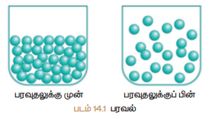

*படம் 14.1 பரவல்*

---

### 14.1.2 செயல்மிகு கடத்துதல் (ஆற்றல் சார்ந்த கடத்துதல்)

ஆறல் சாரந்த கடத்துதலில் ஆறலைப் பயன்படுத்தி மூலக்கூறுகள் செறிவு வாட்ட சரிவிற்கு எதிராக கடத்தப்படுகின்றன. இவ்வகை கடத்துதலில் கடத்து புரதங்கள் ஈடுபடுகின்றன. இவ்வகை புரதங்கள் ஆறலைப் பயன்படுத்தி செல் சவ்வின் வழியாக மூலக்கூறுகளை கடத்துவதால் உந்திகள் (pumps) என அழைக்கப்படுகின்றன. இவ்வகை உந்திகள் மூலக்கூறுகளை செறிவு குணைவான பகுதியிலிருந்து செறிவு அதிகமான பகுதிக்கு கடத்துகின்றன (uphill movement)

---

### 14.1.3 சவ்வூடு பரவல் (ஆஸ்மாஸிஸ)

சவ்வூடு பரவல் என்பது திரவங்களில் காணப்படும் ஒரு சிறப்பான பரவுதல் ஆகும். ஒரு அரை கடத்து சவ்வின் வழியாக கரைப்பான் அல்லது நீர் மூலக்கூறுகள் அதன் செறிவு அதிகமாக உள்ள பகுதியிலிருந்து செறிவு குணைந்த பகுதிக்கு கடத்தப்படுவதாகும்.

இந்நிகழ்ச்சியானது செறிவு சமைமாகும் வரை நடைபெறும். சவ்வூடு பரவல் நீர் அல்லது கரைப்பான் மூலக்கூறின் ஆறல் சாரா கடத்தல் நிகழ்ச்சியாகும்.

#### பிளாஸ்மா சிதைவு (உயிரமைச் சுருக்கம் - Plasmolysis)

ஒரு தாவரச் செல்லை ஹைபர்டோனிக் கரைசலில் (உயர் அடர்வு கரைசல்) வைக்கும்போது செல்லிலிருந்து நீர் வெளியேறுவதால் புரோட்டோபிளாசம் செல் சுவரை விட்டு விலகி சுருங்கி விடுகிறது. இதற்கு **பிளாஸ்மா சிதைவு** என்று பெயர்.

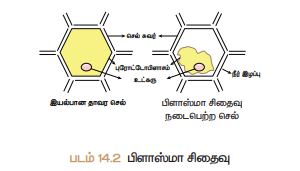

*படம் 14.2 பிளாஸ்மா சிதைவு*

---

### செயல்பாடு 1

**சவ்வூடு பரவல் – செயல்முறை விளக்கம்**

ஒரு திசில் புணலின் வாய்ப்பகுதியை அரைகடத்துச் சவ்வினால் கட்டி அதில் சுக்ரோஸ் கரைசலை நிரப்ப வேண்டும். இணை ஒரு நீருள்ள முகவையில் வைக்க வேண்டும். சிறிது நேரம் கழித்துப் பார்க்க வேண்டும். திசில் புணலில் கரைசலின் மட்டம் உயர்ந்திருக்கும். சவ்வூடு பரவலின் காரணமாக நீர் மூலக்கூறுகள் அரை கடத்து சவ்வின் வழியாக புணலினுள் சென்றதால் புணலின் கரைசல் மட்டம் உயர்ந்துள்ளது.

---

#### உள்ளீரத்தல்

தாவரப் பொருட்கள் நீரில் வைக்கப்படும்போது நீரினை உறிஞ்சி உப்புகின்ற நிகழ்ச்சி **உள்ளீரத்தல்** எனைப்படும். எடுத்துக்காட்டாக உலர் விண்கள் மற்றும் உலர் திராட்சை நீணை உறிஞ்சி உப்பிவிடும். ஆனைதால் நீரில் கரையாது. உள்ளீரத்தல் என்ற நிகழ்ச்சி முணளக்கும் விண்களில் நடைபெறவில்லை என்றால் இளம் நாற்றுக்கள் விண்களிலிருந்து வெளிவர இயலாது.

---

## 14.2 வேர்த்தூவி - நீரை உள்வளடுக்கும் உறுப்பு

ஒரு தாவர வேரின் நுனியில் பல கோடிக்கணக்கான வேரத்தூவிகள் காணப்படுகின்றன. இவை மண்ணிலிருந்து நீரையும், கனிமங்களையும் உறிஞ்சுகின்றன. வேரின் புறத்தோல் செல்களின் நீட்சிகளே வேரத்தூவிகளாகும். வேரத்தூவிகள்

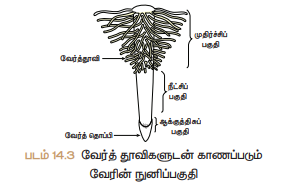

*படம் 14.3 வேரத்தூவிகளுடன் காணப்படும் வேரின் நுனிப்பகுதி*

மென்மையானவை, மெல்லிய சுவருடையவை மற்றும் ஒரு செல்லால் ஆனைவை. வேரத்தூவிகள் தாவரத்தின் உறிஞ்சும் பரப்பினை அதிகரிக்கின்றன.

---

## 14.3 உறிஞ்சப்பட்ட நீர் வேரில் செல்லும் பாதை

நீரானது வேரத்தூவியினுள் சென்றவுடன் நீரின் செறிவானது புறணிப் பகுதியை விட வேரத்தூவியில் அதிகமாக உள்ளது. ஆகவே நீரானது சவ்வூடு பரவலின் காரணமாக வேரத்தூவியிலிருந்து புறணி செல்கள் வழியாக அகத்தோலில் நுழைந்து சைலத்தை அடைகிறது. பிறபு சைலத்திலிருந்து நீரானது மேல்நோக்கி தண்டு மற்றும் இலைகளுக்கு கடத்தப்படுகிறது.

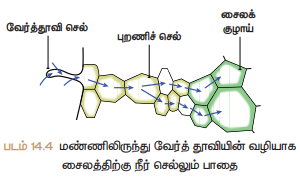

*படம் 14.4 மண்ணிலிருந்து வேரத்தூவியின் வழியாக சைலத்திற்கு நீர் செல்லும் பாதை*

---

## 14.4 வேர் செல்களில் நீர் செல்லும் வழிமுணைகள்

வேரத்தூவியின் மூலம் உறிஞ்சப்பட்ட நீரானது வேரின் உட்புற அடுக்கிற்கு இரண்டு தனித்தனி வழிகளில் செல்கின்றன. அவை

- அப்போபிளாஸ்ட் வழி
- சிம்பிளாஸ்ட் வழி

### 14.4.1 அப்போபிளாஸ்ட் வழி

அப்போபிளாஸ்ட் வழியில் நீரானது முழுக்க முழுக்க செல்சுவர் மற்றும் செல் இடைவெளியின் வழியாகச் செல்கிறது. இவ்வகை கடத்துதலில் நீரானது எவ்வித சவ்வினையும் கடக்காமல் செல்கிறது. இந்த வண்க கடத்துதல் செறிவின் அடிப்படையில் அமைந்துள்ளது.

### 14.4.2 சிம்பிளாஸ்ட் வழி

இம்முணையில் நீரானது செல்லின் வழியாக செல்கிறது. அதாவது செல்லின் பிளாஸ்மா சவ்வில் நுழைந்து சைட்டோபிளாசத்தினை கடந்து பிளாஸ்மோடெஸ்மேட்டா வழியாக அருகிலுள்ள செல்களுக்கு செல்கிறது. செல்சவ்வின் வழியாக நீர் செல்வதால் இவ்வகை கடத்துதல் மெதுவாக நடைபெறுகிறது. சிம்பிளாஸ்ட் வண்க கடத்துதல் செறிவு சரிவின் அடிப்படையிலேயே அமைந்துள்ளன.

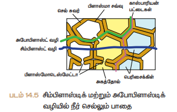

*படம் 14.5 சிம்பிளாஸ்டிக் மற்றும் அபோபிளாஸ்டிக் வழியில் நீர் செல்லும் பாதை*

---

## 14.5 நீராவிப் போக்கு

தாவரத்தின் புற உறுப்புகளிலிருந்து குறிப்பாக இலையின் புறத்தோல் துளை வழியாக நீரானது ஆவியாக வெளியேறுவே **நீராவிப் போக்கு** எனைப்படும். ஒவ்வொரு இலைத்துளையும் இரண்டு **காப்புச் செல்களால்** சூழப்பட்டுள்ளது. இலைத்துளையானது (stomata) பகலில் திறந்தும், இரவில் மூடியும் காணப்படும். இலைத்துளையின் செயல்பாடானது காப்புச் செல்களின் விணைப்பழுத் மாறுபாடுகளால் நடைபெறுகிறது. பகலில் காப்பு செல்களுக்குள் அருகிலுள்ள செல்களிலிருந்து நீர் புகுவதால் விணைப்புத்தண்மை அடைகிறது. அதனால் இலைத்துளை திறந்து கொள்கின்றன. இரவில் காப்பு செல்களை விட்டு நீர் வெளியேறுவதால் விணைப்பழுத்தம் குணைந்து காப்பு செல்கள் சுருங்கிவிடுகின்றன. இதனால் இலைத்துளை மூடிக் கொள்கிறது.

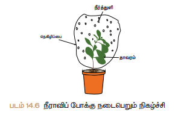

*படம் 14.6 நீராவிப் போக்கு நடைபெறும் நிகழ்ச்சி*

நீராவிப் போக்கின் காரணமாக இலையிணடத்திசுவிலிருந்து (மீசோபில்) நீரானது இலைத்துளை வழியாக வெளியேறுவதால் நீரின் செறிவு இலையிணடத்திசுவில் குணைகிறது. இதனால் சவ்வூடு பரவல் மூலம் சைலத்திலிருந்து நீரானது மீண்டும் இலையிணடத் திசுக்களுக்கு செல்கிறது. இந்த வேறுபாட்டின் காரணமாக இலையில் ஒரு இழுவிணசை உண்டாகிறது. இது **நீராவிப் போக்கு இழுவிணசை** எனைப்படும். இந்த இழுவிணசை வேர் வரை கடத்தப்படுவதால் வேரத்தூவியின் மூலம் மீண்டும் மீண்டும் நீர் மண்ணில் இருந்து உறிஞ்சப்பட்டு தொடர்ச்சியாக இலைக்கு செல்கிறது.

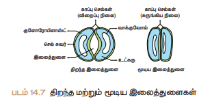

*படம் 14.7 திறந்த மற்றும் மூடிய இலைத்துளைகள்*

### நீராவிப் போக்கினைப் பாதிக்கும் காரணிகள்

நீராவிப் போக்கினைப் பாதிக்கும் வெளிபுறக் காரணிகள் வெப்பநிலை, ஒளி, ஈரப்பதம் மற்றும் காற்றின் திணைவேகம். உட்புறக் காரணிகள் இலைத் துளையின் எண்ணிக்கை மற்றும் விரவல், திறந்த நிலையிலுள்ள இலைத்துளைகளின் சதவீதம், தாவரத்தில் இருக்கும் நீரின் அளவு, தாவரத்தின் அடுக்கு அமைவு போன்றவை.

### நீராவிப் போக்கின் முக்கியத்துவம்

- நீராவிப் போக்கின் இழுவிணசையின் காரணமாக நீரானது மேலே செல்ல காரணமாகிறது.
- ஒளிச்சேர்க்கைக்கு தேவையான நீர் கிடைக்கிறது.
- கனிமங்கள் தாவரத்தின் அனைத்துப் பகுதிகளுக்கும் செல்ல உதவுகிறது.
- இலைகளின் மேற்பரப்பு குளிர்ச்சியாக இருக்க நீராவிப் போக்கு உதவுகிறது.
- செல்கள் விணைப்புத் தண்மையுடன் இருக்கச் செய்கிறது. இதனால் அவற்றின் வடிவம் மாறாமலும் இருக்க உதவுகிறது.

---

## 14.6 வேர் அழுத்தம்

மண்ணிலுள்ள கனிமங்கள் வேரில் கடத்தும் திசுக்களுக்கு ஆறல்சார கடத்தலின் மூலம் செல்லும் போது அதனுடன் சேர்ந்து நீரும் கடத்தப்படுகிறது. இதனால் சைலத்தின் உள்ளே அழுத்தம் அதிகமாகிறது. இந்த அழுத்தமே **வேர் அழுத்தம்** எனைப்படும். இதன் காரணமாக நீரானது தண்டில் சிறிது உயரம் தள்ளப்படுகிறது.

---

## 14.7 கனிமங்களின் உள்வளடுப்பு

உணவூட்டத்தின் தேவைக்காக தாவரங்கள் மண்ணிலுள்ள கனிம அயனிகளைச் சார்ந்துள்ளன. தேவையான அனைத்து கனிம அயனிகளையும் வேர்கள் ஆறல்சாரா கடத்துதல் மூலம் எடுத்துக் கொள்வதில்லை. அவற்றிற்கு இரண்டு காரணங்கள் உள்ளன. 1. கனிமங்கள் மண்ணில் அயனிகளாக உள்ளதால் அவை சவ்வின் வழியாக எளிதில் புக முடியாது. 2. மண்ணிலுள்ள கனிமங்களின் செறிவு வேர்களின் செல்களில் உள்ள செறிவினை விடக் குணைவாக உள்ளது. ஆகவே பெரும்பாலான கனிமங்கள் ஆறல் சாரந்த கடத்துதல் மூலமாக வேரின் புறத்தோல் சைட்டோபிளாசம் வழியாக உள் நுழைகிறது. இதற்கு தேவையான ஆறலை ATP-யின் மூலம் பெறுகிறது. பிறபு, நீராவிப் போக்கின் இழுவிணசையின் காரணமாக அனைத்து பாகங்களுக்கும் கடத்தப்படுகிறது.

---

## 14.8 கனிம அயனிகள் கடத்தப்படுதல்

சில தாவரங்களில் மூப்பணடந்த உதிரும் நிலையிலுள்ள இலைகளில் உள்ள தனிமங்கள் இளம் இலைகளுக்கு இடம் பெயர்கின்றன. இந்நிகழ்ச்சி இலையுதிர தாவரங்களில் நடைபெறுகிறது. பாஸ்பரஸ், சல்பர், நைட்ரஜன் மற்றும் பொட்டாசியம் ஆகியவை மிக விரைவாக இடம் பெயரும் தனிமங்களாகும். கால்சியம் எளிதில் இடம் பெயர்வதில்லை. சிறிதளவு தனிமங்கள் சைலம் மற்றும் புளோயத்தினிடையே பரிமாறிக் கொள்ளப்படுகின்றன.

---

## 14.9 புளோயத்தில் கடத்துதல்

இலைகளின் மூலம் தயாரிக்கப்பட்ட உணவானது புளோயத்தின் வழியாக சேமிக்கும் பகுதிக்கோ அல்லது தேவையான பகுதிக்கோ கடத்தப்படுகிறது. புளோயத்தின் கடத்தும் கூறுகளாக சல்லடைத் தட்டுடன் கூடிய சல்லடைக் குழாய் உள்ளது. சல்லடைக் குழாய் செல்களில் உள்ள சல்லடைத் துளையின் வழியாக உணவானது சைட்டோபிளாச இழையின் மூலம் கடத்தப்படுகிறது.

புளோயம் உணவினை (சுக்ரோஸ்) தோற்றுவாயிலிருந்து தேக்கிடத்திற்கு கடத்துகிறது. உணவு உற்பத்தியாகும் இடமான இலைகள் **தோற்றுவாயாகவும்** (source), சேமிக்கும் அல்லது தேவையான இடம் **தேக்கிடமாகவும்** (sink) கருதப்படுகிறது. ஆனைதால் தோற்றுவாயும், தேக்கிடமும் தேவையைப் பொறுத்தும், பருவகாலத்தைப் பொறுத்தும் மாறுபடலாம்.

தோற்றுவாய்க்கும் தேக்கிடத்திற்கும் உள்ள தொடர்பு அவ்வப்போது மாறுபாடு அடையக்கூடியது. உணவு இடம் பெயர்வது மேல் நோக்கியோ அல்லது கீழ் நோக்கியோ (இரு திணைகளில்) நடைபெறுகிது. ஆனைதால் சைலத்தில் நீரானது மேல் நோக்கி (ஒரு திணையில்) மட்டுமே இடம் பெயர்கிறது.

---

## 14.10 சுக்ரோஸ் இடம்பெயர்தல்

சுக்ரோஸ் தோற்றுவாயிலிருந்து தேக்கிடத்திற்கு இடம்பெயர்வது **அழுத்த மாறுபாட்டுக் கோட்பாட்டின்படி** நடைபெறுகிறது. ஒளிச்சேர்க்கையின் மூலம் உருவான குளுக்கோஸ் சுக்ரோஸாக மாற்றப்படுகிறது. சுக்ரோஸ் முதலில் புளோயத்தின் துணை செல்களுக்கு கடத்தப்படுகிறது. பிறபு ஆறல்சார கடத்தல் மூலம் சல்லடைக் குழாயினுள் செல்கிறது. இந்நிகழ்ச்சியால் புளோயத்தின் செல்கள் இதன் காரணமாக (ஹைபர்டோனிக்) உயர் அடர்வு கரைசல் நிலையை அடைகிறது.

அருகிலுள்ள சைலத்திலிருந்து நீரானது சவ்வூடு பரவல் மூலம் சல்லடைக் குழாயினுள் செல்கிறது. இதனால் ஏற்படும் சவ்வூடு பரவல் அழுத்த வேறுபாட்டின் காரணமாக புளோயத்திலிருந்து உணவானது அழுத்தம் குணைவான செல்களுக்கு கடத்தப்படுகிறது. ஆறல்சார கடத்துதல் மூலம் சுக்ரோஸானது சேமிக்கப்படும் இடத்திற்கோ அல்லது பயன்படுத்தப்படும் இடத்திற்கோ இடம் பெயர்கிறது. இதன் காரணமாக சுக்ரோஸ் வெளியேறுவதால் சவ்வூடு பரவல் அழுத்தம் குணைகிறது. எனவே நீரானது புளோயத்தை விட்டு வெளியேறுகிறது.

---

## 14.11 சாறேற்றம் (Ascent of sap)

வேர்களின் மூலம் உறிஞ்சப்பட்ட நீர் மற்றும் கனிமங்கள் மேல் நோக்கிய கடத்துதல் மூலம் தாவரங்களின் பிறபகுதிகளுக்கு செல்வது **சாறேற்றம்** எனைப்படும். சாறேற்றத்தில் பல காரணிகள் ஈடுபடுகின்றன. சாறேற்றம் பின் வரும் படி நிலைகளில் நடைபெறுகிறது.

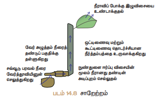

*படம் 14.8 சாறேற்றம்*

### 1. வேர் அழுத்தம்

மண்ணில் உள்ள நீர் வேரத்தூவிகளுக்கு சவ்வூடு பரவலின் காரணமாகச் செல்கிறது. வேர் அழுத்தத்தின் காரணமாக நீரானது வேரிலிருந்து மேல் நோக்கி தண்டின் அடிப்பகுதிக்குச் செல்கிறது.

### 2. நுண்துளை ஈரப்பு விணசை (தந்துகிக்குழாய் விணசை)

நீர் அல்லது எந்த ஒரு திரவமும் நுண்துளைக் குழாய்களில் இயற்பியல் விணசையின் காரணமாக மேலேறுகிறது. இதற்கு **நுண் துளை ஈரப்பு விணசை** என்று பெயர். அம் போல் தண்டிலும் நீரானது குறிப்பிட்ட உயரம் வரை நுண்துளை ஈரப்பு விணசையின் காரணமாக கடத்தப்படுகிறது.

### 3. நீர் மூலக்கூறுகளின் கூட்டினைவு மற்றும் ஒட்டினைவு

கூட்டினைவு மற்றும் ஒட்டினைவு விணசைகளின் ஒருங்கினைந்த செயல்பாட்டின் காரணமாக நீரானது சைலத்தில் ஒரு தொடர்ச்சியான நீர்த்தம்பமாக உளது.

> **மேலும் தெரிந்துக் கொள்வோம்.**
>
> அதிகாலைப் பொழுதில் புற்களின் மேல் பனித்துளிகள் போல நீர்த்துளிகளைப் பார்த்திருப்போம். தாவரங்களில் காற்றில் ஈரப்பதம் அதிகமாக இருக்கும் போது நீராவிப்போக்கின் வீதம் குணையும். உறிஞ்சப்படும் நீர் தாவரத்தின் வேரில் ஒரு அழுத்தத்தை உருவாக்கும். இந்த அதிகப்படியான நீர் தாவர இலைகளின் விளிம்புகளில் நீராக வடிகிறது. இதற்கு **நீர் வடிதல்** (guttation) என்று பெயர். இவ்வாறு நீர் வடிதல் ஒரு சிறப்பான துளை வழியாக வெளியேறுகிறது. இத்துளை **நீரசுரப்பி** அல்லது **ஹைடதாடு** என்று பெயர்.

### 4. நீராவிப்போக்கின் இழுவிணசை

இலைத்துளையின் வழியாக நடைபெறும் நீராவிப்போக்கின் காரணமாக ஒரு வெற்றிடம் உண்டாகும். இதனால் ஒரு இழுவிணசை (suction) உண்டாக்கப்படுகிறது. இந்த விணசையே **நீராவிப் போக்கின் இழுவிணசை** என்று பெயர். நீராவிப்போக்கின் இழுவிணசையின் காரணமாக சைலத்தினுள் உள்ள நீர்த் தம்பமானது மிக உயர்ந்த தாவரங்களிலும் மேலேறுகிறது.

---

### செயல்பாடு 2 - வேர் அழுத்த சோதணை

ஒரு சிறிய மென்மையான தண்டுடைய தாவரத்தை எடுத்துக் கொள். காலைவேளையில் தண்டின் அடிப்பகுதியை சிறிய கத்தியால் குறுக்குவாக்கில் வெட்டு. வெட்டப்பட்ட தண்டுப் பகுதியில் வேர் அழுத்தத்தின் காரணமாக நீர் வடிவதைக் காண்.

---

## 14.12 இரத்தம்

இரத்தம் சிவப்பு நிறம் கொண்ட திரவ இணைப்புத் திசுவாகும். மேலும் இது மனிதனின் உடல் சுற்றோட்டத்தின் முக்கிய ஊடகமாகும்.

### இரத்தத்தின் பகுதிப் பொருள்கள்

இரத்தம் இரண்டு முக்கிய பகுதிப் பொருட்களான **பிளாஸ்மா** எனும் திரவப் பகுதியையும் அதனுள் மிதக்கும் **ஆக்கக் கூறுகளையும்** (இரத்த செல்கள்) கொண்டுள்ளது.

#### பிளாஸ்மா

இரத்தத்தின் 55% பிளாஸ்மா ஆகும். இது சிறிதளவு காரத்தண்மை உடையது. **உயிரற்ற செல் உடல்பொருட்களைக் கொண்டுள்ளது**. கரிம்ப் பொருட்களான புரதங்கள், குளுக்கோஸ், யூரியா, நொதிகள், ஹார்மோன்கள், தாது உப்புக்கள் மற்றும் வைட்டமின்கள் ஆகியவை இதில் உள்ளடங்கியுள்ளன.

### இரத்தத்தின் ஆக்கக் கூறுகள்

இரத்த அணுக்கள் மூன்று வகைப்படும்.

1. இரத்தச் சிவப்பணுக்கள் (RBC) (அ) எரிதரோசைட்டுகள்
2. இரத்த வெள்ளை அணுக்கள் (WBC) (அ) லியூக்கோசைட்டுகள்
3. இரத்தத் தட்டுக்கள் (அ) திராம்போசைட்டுகள்

#### இரத்தச் சிவப்பணுக்கள் – எரித்ரோசைட்டுகள்

இவை மனித உடலில் அதிக அளவில் காணப்படக்கூடிய இரத்த செல்களாகும். இவை எலும்பு மஜ்ஜையிலிருந்து உருவாகின்றன. சுவாச நிறமியான **ஹீமோகுளோபினை** RBC கொண்டுள்ளதால் இரத்தம் சிவப்பு நிறத்துடன் காணப்படுகிறது. பாலூட்டிகளின் முதிர்ச்சி அடைந்த இரத்த சிவப்பணுவில், செல் நுண்ணுறுப்புகள் மற்றும் உட்கரு காணப்படுவதில்லை. இவை இருபுறமும் குழிந்த தட்டு வடிவம் உடையவை. இவற்றின் வாழ்நாள் 120 நாட்கள் ஆகும். RBC ஆக்சிஜணை நுரையீரலிலிருந்து திசுக்களுக்கு கடத்துவதில் பங்கேற்கிறது.

> **பாலூட்டிகளின் RBC-யில் செல் நுண்ணுறுப்புகளும் உட்கருவும் காணப்படவில்லை ஏன்?**
>
> பாலூட்டிகளின் RBC-யில் உட்கரு இல்லாதிருப்பதினால் அச்செல்லானது இருபுறமும் குழிந்த அமைப்பைப் பெற்று, அதிகளவு ஆக்சிஜன் இணைவதற்கான மேற்பரப்பினைப் பெற்றுள்ளது. RBC-ல் மைட்டோகாண்ட்ரியா இல்லாதிருப்பதால் அதிக அளவு ஆக்சிஜணை திசுக்களுக்கு கடத்துவதை அனுமதிக்கிறது. எண்டோபிளாச வலைப்பிண்ணல் இல்லாதிருப்பதினால் மெல்லிய இரத்தத் தந்துகிகளுக்குள் அதிக மீளும் தண்மை பெற்று RBC எளிதாக ஊடுருவுகிறது.

#### இரத்த வெள்ளையணுக்கள் (WBC) லியூக்கோசைட்டுகள்

இவை நிறமற்றவை. இவற்றில் ஹீமோகுளோபின் காணப்படவில்லை மற்றும் உட்கரு கொண்டவை. இவை எலும்பு மஜ்ஜை, மண்ணீரல், தைமஸ் மற்றும் நிறைநீர் முடிச்சு போன்றவற்றில் காணப்படுகின்றன. இவை அமீபா போன்று நகரக் கூடியவை.

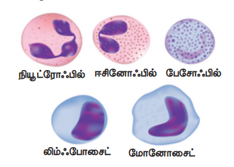

*படம் 14.9 லியூக்கோசைட்டுகள்*

இரத்த வெள்ளையணுக்கள் இரண்டு வகைகளாகப் பிரிக்கப்பட்டுள்ளன

1. துகள்களுடைய செல்கள்
2. துகள்களற்ற செல்கள்

##### துகள்களுடைய செல்கள்

இவை சைட்டோபிளாசத்தில் துகள்களைக் கொண்டுள்ளன. இவற்றின் உட்கருக்கள் ஒழுங்கற்றவை அல்லது கதுப்புக்களுடையவை. இவை மூன்று வகைப்படும்

i. நியூட்ரோஃபில்கள்
ii. ஈசினோஃபில்கள்
iii. பேசோஃபில்கள்

###### (i) நியூட்ரோஃபில்கள்

இவை அளவில் பெரியவை, இவற்றின் உட்கரு 2-7 கதுப்புகளை கொண்டுள்ளது. மொத்த வெள்ளை அணுக்களில் 60% - 65% நியூட்ரோஃபில்கள் காணப்படுகின்றன. **நோய்த்தொற்று மற்றும் வீக்கத்தின்** போது இவற்றின் எண்ணிக்கை அதிகரிக்கிறது.

###### (ii) ஈசினோஃபில்கள்

இவற்றின் உட்கரு இரு கதுப்புகளைக் கொண்டது. மொத்த வெள்ளையணுக்களில் 2% - 3% வரை இவ்வகை செல்கள் உள்ளன. உடலில் சில ஒட்டுண்ணித் தொற்று மற்றும் **ஒவ்வாமை** ஏற்படும் போது இவற்றின் எண்ணிக்கை அதிகரிக்கிறது. நச்சுகளை அழித்தல் மற்றும் நச்சு முறிவினை ஏற்படுத்துவது ஈசினோஃபில்களின் முக்கிய பணிகளாகும்.

###### (iii) பேசோஃபில்கள்

பேசோஃபில்கள் கதுப்புடைய உட்கருவை கொண்டுள்ளன. மொத்த வெள்ளையணுக்களில் 0.5% - 10% வரை இவ்வகை செல்கள் உள்ளன. **வீக்கங்கள்** உண்டாகும் போது வேதிப்பொருள்களை வெளியேற்றுகின்றன.

##### துகள்களற்ற செல்கள்

இவற்றின் சைட்டோபிளாசத்தில் துகள்கள் காணப்படுவதில்லை. இவை இரண்டு வகைப்படும்.

i. லிம்ஃபோசைட்டுகள்
ii. மோனோசைட்டுகள்

###### (i) லிம்ஃபோசைட்கள்

மொத்த வெள்ளையணுக்களில் இவை 20% - 25% உள்ளன. வைரஸ் மற்றும் பாக்டீரியா நோய்த் தொற்றுதலின் போது இவை **எதிர்ப்பொருளை** உருவாக்குகின்றன.

###### (ii) மோனோசைட்டுகள்

இவை லியூக்கோசைட்டுகளிலேயே மிகப் பெரியவை. இவை அமீபாய்டு வடிவம் கொண்டவை. மொத்த வெள்ளையணுக்களில் 5 – 6% உள்ளது. இவை **விழுங்கு செல்களாதலால்** பாக்டீரியாவை விழுங்குகின்றன.

---

### இரத்தத் தட்டுக்கள் அல்லது திராம்போசைட்டுகள்

இவை அளவில் சிறியவை மற்றும் நிறமற்றவை. இவற்றில் உட்கரு இல்லை. ஒரு கன மில்லிமீட்டர் இரத்தத்தில் 2,50,000 – 4,00,000 வரை இரத்தத் தட்டுக்கள் உள்ளன. இவற்றின் வாழ்நாள் 8-10 நாட்களாகும். இரத்தம் உணைதலில் இவை முக்கியப் பங்கு வகிக்கின்றன. காயங்கள் ஏற்படும் பொழுது இரத்த உணைதலை ஏற்படுத்தி இரத்தப் போக்கை தடுக்கின்றன.

> **மேலும் தெரிந்துக் கொள்வோம்.**
>
> அனீமியா : இரத்த சிவப்பணுக்களின் எண்ணிக்கை குணைதல்
>
> லியூக்கோசைட்டோசிஸ்: இரத்த வெள்ளை யணுக்களின் எண்ணிக்கை அதிகரித்தல்
>
> லியூக்கோபினியா: இரத்த வெள்ளை யணுக்களின் எண்ணிக்கை குணைதல்
>
> திராம்போசைட்டோபினியா: இரத்தத் தட்டுக்களின் எண்ணிக்கை குணைதல்

---

### இரத்தத்தின் பணிகள்

i) சுவாச வாயுக்களைக் கடத்துகிறது (ஆக்சிஜன் மற்றும் CO₂)
ii) செரிமானம் அடைந்த உணவுப்பொருட்களை அனைத்து செல்களுக்கும் கடத்துகிறது.
iii) ஹார்மோன்களைக் கடத்துகிறது.
iv) நைட்ரஜன் கழிவுப்பொருட்களான, அம்மோனியா, யூரியா, யூரிக் அமிலம் போன்றவற்றைக் கடத்துகிறது.
v) நோய்தாக்குதலிலிருந்து உடலைப் பாதுகாக்கிறது.
vi) உடலின் வெப்பநிலை மற்றும் pH-ஐ ஒழுங்குபடுத்தும் தாங்கு ஊடகமாக செயல்படுகிறது.
vii) உடலின் நீர்ச் சமநிலையைப் பாரமரிக்கிறது.

---

## 14.13 இரத்த நாளங்கள் – தமனிகள் மற்றும் சிரைகள்

இரத்தத்தை கடத்தக்கூடிய கிளைத் வலைப்பிண்ணல் அமைப்புடைய குழாய்கள் **இரத்த நாளங்கள்** ஆகும். இவை **தமனிகள், சிரைகள்** மற்றும் **இரத்த நுண் நாளங்கள்** (தந்துகிகள்) என மூன்று வகைப்படும்.

### தமனிகள்

இவை தடித்த, மீளும் தண்மை பெற்ற குழாய்கள். இவை இரத்தத்தை இதயத்திலிருந்து பல்வேறு உறுப்புகளுக்கு எடுத்துச் செல்கின்றன. நுரையீரல் தமனியைத் தவிர மற்ற அனைத்து தமனிகளும் ஆக்சிஜன் மிகுந்த இரத்தத்தினை எடுத்துச் செல்கின்றன. நுரையீரல் தமனி மட்டும் ஆக்சிஜன் குணைந்த இரத்தத்தை நுரையீரலுக்கு எடுத்துச் செல்கிறது.

### சிரைகள்

இவை **மெல்லிய சுவரால் ஆன மீள்தண்மையற்ற** குழாய்கள். இவை பல்வேறு உறுப்புகளிலிருந்து இதயத்திற்கு இரத்தத்தினைக் கொண்டு வருகின்றன. நுரையீரல் சிரையினைத் தவிர மற்ற அனைத்து சிரைகளும் ஆக்சிஜன் குணைந்த இரத்தத்தினை எடுத்துச் செல்கின்றன. நுரையீரல் சிரை மட்டும் ஆக்சிஜன் மிகுந்த இரத்தத்தினை நுரையீரலிலிருந்து இதயத்திற்கு எடுதது வருகிறது.

### இரத்த நுண் நாளங்கள் (தந்துகிகள்)

கிளைத் மெல்லிய நுண் தமனிகள் (ஆர்ட்டீரியோல்கள்) இணைந்து குறுகிய இரத்த நுண் நாளங்களை உருவாக்குகின்றன. அவை மீண்டும் ஒன்றினைந்து வெனியூல்கள் மற்றும் சிரைகளாகின்றன. இவை 8µm விட்டமுடையவை. இவை ஒற்றை அடுக்கால் ஆன எண்டோதீலிய செல்களால் ஆனவை.

---

**அட்டவணை 14.1 தமனி மற்றும் சிரை வேறுபாடுகள்**

| வ.எண் | தமனி | சிரை |
|-------|------|------|
| 1. | வழங்கும் குழாய்கள் | பெறும் குழாய்கள் |
| 2. | இளஞ்சிவப்பு நிறத்தினை உடையது | சிவப்பு நிறத்தினை உடையது. |
| 3. | உடலின் ஆழ்பகுதியில் அமைந்துள்ளது | உடலின் மேற்பகுதியில் அமைந்துள்ளது. |
| 4. | அதிக அழுத்ததுடன் கூடிய இரத்த ஓட்டம் | குணைந்த அழுத்ததுடன் கூடிய இரத்த ஓட்டம் |
| 5. | தமனியின் சுவர்கள் வலிமையான தடித்த மீளும் தண்மை உடையவை | சிரையின் சுவர்கள் வலிமை குணைந்த, மிருதுவான மீள்தண்மை அற்றவை |
| 6. | நுரையீரல் தமனியைத் தவிர மற்ற அனைத்து தமனிகளும் ஆக்சிஜன் மிகுந்த இரத்தத்தினை எடுத்து செல்கின்றன. | நுரையீரல் சிரையினைத் தவிர மற்ற அனைத்து சிரைகளும் ஆக்சிஜன் குணைந்த இரத்தத்தினை எடுத்து செல்கின்றன. |
| 7 | உள்ளீடு வால்வுகள் கிடையாது. | உள்ளீடு வால்வுகள் உண்டு. |

---

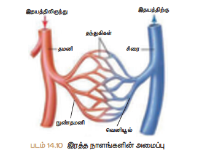

*படம் 14.10 இரத்த நாளங்களின் அமைப்பு*

---

## 14.14 சுற்றோட்ட மண்டலத்தின் வகைகள்

விலங்குகள் இரண்டு வகையான சுற்றோட்ட மண்டலத்தினைக் கொண்டுள்ளன. அவையாவன

1. திறந்த வகை
2. மூடிய வகை

### 1. திறந்த வகை

திறந்த வகை இரத்த ஓட்டத்தில், இதயத்திலிருந்து இரத்த நாளங்களில் உள்ள குழிகளுக்குள் இரத்தம் உந்தித் தள்ளப்படுகிறது. இக்குழி **இரத்த உடற்குழி** எனைப்படும். நுண்நாளங்கள் காணப்படுவதில்லை. எ.கா. கணுக்காலிகள், மெல்லுடலிகள், அசிடியன்கள்.

### 2. மூடிய வகை

இரத்த சுற்றோட்டம் நாளங்கள் மூலம் உடல் முழுவதும் சுற்றி வருகிறது. தமனிகளிலிருந்து சிரைக்கு இரத்தம் தந்துகிகள் வழியே பாய்கின்றது. எ.கா. முதுகெலும்பிகள்

> **மேலும் தெரிந்துக் கொள்வோம்.**
>
> **வில்லியம் ஹார்வி (1628)**
>
> நவீன உடற்செயலியலின் தந்தை என அழைக்கப்படுகின்றார். இவர் மூடிய இரத்த ஓட்ட மண்டலத்தினைக் கண்டறிந்தார்.

---

## 14.5 மனித இதயத்தின் அமைப்பு

இரத்த நாளங்கள் வழியாக இரத்தத்தை உந்தித் தள்ளும் தசையால் ஆன விணசையியக்க உறுப்பு **இதயம்** ஆகும். மனித இதயம் நுரையீரலுக்கு இடையில், மார்புக்குழியில், உதரவிதானத்திற்கு மேலாக சற்று இடது புறம் சாய்ந்த நிலையில் காணப்படுகிறது. இதயம் **கார்டியாக் தசை** எனும் சிறப்புத் தசையால் ஆனது.

இதயம் இரண்டு அடுக்கினால் ஆன **பெரிகார்டியல்** உணையால் சூழப்பட்டுள்ளது. இவ்வடுக்கின் இடைவெளியில் நிரம்பியுள்ள **பெரிகார்டியல் திரவம்** இதய துடிப்பின் போது ஏற்படும் உராய்வு மற்றும் இயக்கத்தினால் ஏற்படும் காயங்களில் இருந்து பாதுகாக்கும் **உயவுப் பொருளாக** உள்ளது.

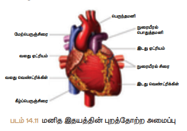

*படம் 14.11 மனித இதயத்தின் புறத்தோற்ற அமைப்பு*

மனித இதயம் நான்கு அணைகளைக்கொண்டது. மெல்லிய தசையால் ஆன மேல் அணைகள் இரண்டும் **ஆரிக்கிள்கள்** அல்லது **ஏட்ரியங்கள்** (ஒருமை – ஏட்ரியம்) என்றும் தடித்த தசையால் ஆன கீழ் அணைகள் இரண்டும் **வெண்ட்ரிக்கிள்கள்** என்றும் அழைக்கப்படும். இவ்வணைகளைப் பிரிக்கின்ற இடைச்சுவர **'செப்டம்'** என்று பெயர். ஆரிக்கிள்கள் மற்றும் வெண்ட்ரிக்கிள்களுக்கு இடையே உள்ள இடைச் சுவரினால், ஆக்சிஜன் மிகுந்த மற்றும் ஆக்சிஜன் குணைந்த இரத்தம் ஒன்றுடன் ஒன்று கலவாமல் தடுக்கப்படுகிறது.

இரண்டு ஆரிக்கிள்களும், **ஆரிக்குலார் இடைத்தடுப்பு சுவரினால்** பிரிக்கப்பட்டுள்ளன. வலது ஆரிக்கிளை விட இடது ஆரிக்கிள் சிறியது. உடலின் பல்வேறு பாகங்களிலிருந்தும் ஆக்சிஜன் குணைந்த இரத்தத்தினை முக்கிய சிரைகளான **மேற் பெருஞ்சிரை, கீழ் பெருஞ்சிரை** மற்றும் **கடரானரி சைனஸ்** மூலம் **வலது ஆரிக்கிள்** பெறுகிறது. நுரையீரலிலிருந்து ஆக்சிஜன் மிகுந்த இரத்தத்தினை **நுரையீரல் சிரைகளின்** மூலம் **இடது ஆரிக்கிள்** பெறுகின்றது. வலது மற்றும் இடது ஆரிக்கிள்கள் முணையே வலது மற்றும் இடது வெண்ட்ரிக்கிள்களுக்கு இரத்தத்தினை (உந்தித்தள்ளுகின்றன) செலுத்துகின்றன.

இதயத்தின் கீழ் அணைகள் **வெண்ட்ரிக்கிள்கள்** என்று பெயர். வலது மற்றும் இடது வெண்ட்ரிக்கிள்கள், **இடை வெண்ட்ரிக்குலார் தடுப்புச் சுவரால்** பிரிக்கப்பட்டுள்ளன. இதயத்திலிருந்து அதிக விணசையுடன் இரத்தத்தை உந்தி செலுத்துவதால் வலது, இடது வெண்ட்ரிக்கிளின் சுவர்கள் தடித்து காணப்படுகின்றன.

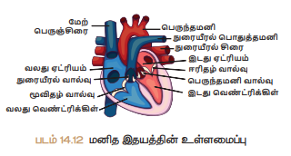

*படம் 14.12 மனித இதயத்தின் உள்ளமைப்பு*

வலது வெண்ட்ரிக்கிளிலிருந்து உருவான **நுரையீரல் பொதுத்தமனி**, வலது மற்றும் இடது நுரையீரல் தமனிகளாகப் பிரிவடைகிறது. வலது மற்றும் இடது நுரையீரல் தமனிகள் முணையே வலது, இடது நுரையீரலுக்கு ஆக்சிஜன் குணைந்த இரத்தத்தை செலுத்துகின்றன. இடது வெண்ட்ரிக்கிளானது வலது வெண்ட்ரிக்கிளை விட சற்று பெரியதாகவும், சிறிது குறுகலாகவும் அமைந்துள்ளது. இதனுடைய சுவர் வலது வெண்ட்ரிக்கிளை விட மூன்று மடங்கு தடிமனானது. இடது வெண்ட்ரிக்கிளிலிருந்து **பெருந்தமனி** தோன்றுகிறது. உடலின் அனைத்து பகுதிகளுக்கும் ஆக்சிஜன் மிகுந்த இரத்தத்தினை பெருந்தமனி அளிக்கின்றது. **கடரானரி தமனி** இதயத்தசைகளுக்கு இரத்தத்தை அளிக்கிறது.

### வால்வுகள்

இதய வால்வுகள் தசையால் ஆன சிறு மடிப்புகள் ஆகும். இவை இரத்த ஓட்டத்தை ஒழுங்குபடுத்துவதற்கு உதவுகின்றன. இரத்தமானது ஒரே திணையில் செல்வதையும் மற்றும் பின்னோக்கி வருவதை தடுக்கவும் உதவுகிறது. இதயம் மூன்று விதமான வால்வுகளைக் கொண்டது.

#### வலது ஏட்ரியோ வெண்ட்ரிக்குலார் வால்வு

இது வலது ஆரிக்கிள் மற்றும் வலது வெண்ட்ரிக்கிள்களுக்கு இடையில் அமைந்துள்ளது. முக்கோண வடிவிலான மூன்று மெல்லிய இழை தசை மடிப்புகளால் ஆனதால் இது **மூவிதழ் வால்வு** என்று அழைக்கப்படுகிறது. வால்வின் இழை முணைகள் **கார்டா வெண்டினை** என்ற தசை நீட்சிகளால் வெண்ட்ரிக்கிளின் **பாப்பில்லரித் தசைகளோடு** பொருத்தப்பட்டுள்ளன.

#### இடது ஏட்ரியோ வெண்ட்ரிக்குலார் வால்வு

இது இடது ஆரிக்கிள் மற்றும் இடது வெண்ட்ரிக்கிள்களுக்கு இடையில் அமைந்துள்ளது. இது இரண்டு கதுப்பு போல அமைந்துள்ளதால், **ஈரிதழ் வால்வு** அல்லது **மிட்ரல் வால்வு** என்றும் அழைக்கப்படுகிறது.

> **மேலும் அறிந்து கொள்வோம்**
>
> முதுகெலும்பிகளின் இதய அணைகள்
>
> இரண்டு அணைகள் : மீன்கள்
>
> மூன்று அணைகள் : இருவாழ்விகள்
>
> முழுமையுறா நான்கு அணைகள் : ஊரவனை
>
> நான்கு அணைகள் : பறவைகள், பாலூட்டிகள் மற்றும் முதலை (ஊரவனை)

#### அரைச்சந்திர வால்வுகள்

இதயத்திலிருந்து வெளியேறும் முக்கியத் தமனிகளில் (பெருந்தமனி, நுரையீரல் தமனி) உள்ள அரைச்சந்திர வால்வுகள் வெண்ட்ரிக்கிளுக்குள் இரத்தம் பின்னோக்கி செல்வதை தடுக்கின்றன. அவை **நுரையீரல் மற்றும் பெருந்தமனி அரைச்சந்திர வால்வுகள்** எனைப்படுகின்றன.

---

## 14.15.1 இரத்த ஓட்டத்தின் வகைகள்

நமது உடலில் இரத்தம் ஆக்சிஜன் மிகுந்த மற்றும் ஆக்சிஜன் குணைந்த சுற்றோட்டங்களைக் கொண்டது. சுற்றோட்டத்தின் வகைகளாவன

### i. சிஸ்டமிக் அல்லது உடல் இரத்த ஓட்டம்

இதயத்தின் இடது வெண்ட்ரிக்கிளிலிருந்து துவங்கி ஆக்சிஜன் மிகுந்த இரத்தத்தினை உடலின் பல உறுப்புகளுக்கு எடுத்து சென்று மீண்டும் ஆக்சிஜன் குணைந்த இரத்தத்தினை வலது ஏட்ரியத்திற்கு கொண்டு வரும் சுற்றோட்டத்தினை **சிஸ்டமிக் அல்லது உடல் இரத்த ஓட்டம்** எனகிறோம். ஆக்சிஜன் மிகுந்த இரத்தத்தினை உடலின் அனைத்து உறுப்புகளுக்கும் **பெருந்தமனி** எடுத்துச் செல்கிறது.

### ii. நுரையீரல் இரத்த ஓட்டம்

வலது வெண்ட்ரிக்கிளிலிருந்து இரத்தம் நுரையீரல் தமனியின் மூலம் நுரையீரலை அடையும். நுரையீரலிருந்து ஆக்சிஜன் பெற்ற இரத்தம் நுரையீரல் சிரைகளின் மூலம் மீண்டும் இதயத்தின் இடது ஏட்ரியத்தை வந்தடையும். இவ்விதம், வலது வெண்ட்ரிக்கிளிலிருந்து நுரையீரல் வழியாக இரத்தம் மீண்டும் இடது வெண்ட்ரிக்கிளைச் சென்றடைவதே **நுரையீரல் இரத்த ஓட்டம்** எனைப்படுகிறது.

### iii. கடரானரி சுற்றோட்டம்

இதயத் தசைகளுக்கு (கார்டியக் தசைகள்) இரத்தம் செல்லுதல் **கடரானரி சுழற்சி** எனைப்படும். இதயத் தசைகளுக்கு ஆக்சிஜன் மிகுந்த இரத்தம் **கடரானரி தமனி** மூலமாக பெறப்படுகிறது. இது **பெருந்தமனியின் வளைவிலிருந்து** உருவாகிறது. இதயத் தசையிலிருந்து ஆக்சிஜன் குணைந்த இரத்தம் **கடரானரி சைனஸ்** மூலம் வலது ஏட்ரியத்தை வந்தடைகிறது.

ஒரு முழு சுழறசியின் போது இரத்தமானது இதயத்தின் வழியாக இருமுணை சுற்றி வருவது **இரட்டை இரத்த ஓட்டம்** எனைப்படும். இம்முணையிலான இரத்த ஓட்டத்தில் ஆக்சிஜன் மிகுந்த இரத்தமும், ஆக்சிஜன் குணைந்த இரத்தமும் ஒன்றுடன் ஒன்று கலப்பதில்லை.

ஆனைதால் சில விலங்கினைங்களில் ஆக்சிஜன் மிகுந்த இரத்தமும் ஆக்சிஜன் குணைந்த இரத்தமும் ஒன்றுடன் ஒன்று கலந்து இதயத்தினுள் ஒரு முணை மட்டுமே சென்று வரும். இத்தகைய சுற்றோட்டம் **ஒற்றை இரத்த ஓட்டம்** எனைப்படும். எ.கா. மீன்கள், இருவாழ்விகள் மற்றும் சில ஊரவனை.

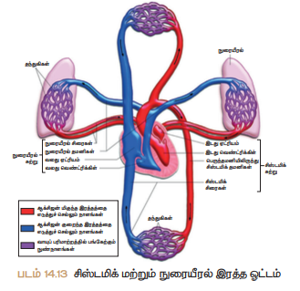

*படம் 14.13 சிஸ்டமிக் மற்றும் நுரையீரல் இரத்த ஓட்டம்*

---

### 14.15.2 இதயத் துடிப்பு

இதயத்தின் ஆரிக்கிள்கள் மற்றும் வெண்ட்ரிக்கிள்கள் முழுமையாக ஒருமுணை சுருங்கி (சிஸ்டால்) விரிவடையும் (டையஸ்டால்) நிகழ்விற்கு **இதயத்துடிப்பு** என்று பெயர். இதயமானது சராசரியாக ஒரு நிமிடத்திற்கு 72 – 75 முணை துடிக்கிறது.

> **மேலும் அறிந்து கொள்வோம்**
>
> **நியூரோஜெனிக் மற்றும் மையோஜெனிக் இதயத் துடிப்பு**
>
> நரம்புத் தூண்டலினால் **நியூரோஜெனிக் இதயத்துடிப்பு** உண்டாகிறது. இத்தூண்டல் இதயத்தின் அருகில் உள்ள நரம்பு முடிச்சினால் தூண்டப்படுகிறது. எ.கா. வளைதசைப் புழுக்கள், பெரும்பாலான கணுக்காலிகள்
>
> **மையோஜெனிக்** இதயத் துடிப்பானது மாறுபாடடைந்த சிறப்புத் தண்மை வாய்ந்த இதயத்தசை நார்களால் தூண்டப்படுகிறது. எ.கா. மெல்லுடலிகள், முதுகெலும்பிகள்.

### இதயத் துடிப்பு பரவுதல்

மனித இதயம் **மையோஜெனிக்** வகையைச் சேர்ந்தது. இதயத்தசையில் காணப்படும் சிறப்பு பகுதியான **சைனோ ஏட்ரியல் கணு** (SA) இதயம் சுருங்குவதை துவக்குகிறது. இது வலது ஏட்ரிய சுவரில் உள்ள **மேற்பெருஞ்சிரைத்** துளையின் அருகில் காணப்படுகிறது. SA கணுவானது மேற்புறம் அகன்றும் கீழ்புறம் குறுகியும் காணப்படுகிறது. இது மெல்லிய தசை நாரிழைகளால் ஆனது.

SA கணுவானது இதயத்தின் **பேஸ்மேக்கராக** செயல்படுகிறது. ஏனெனில் இது இதயத் துடிப்புகளுக்கான மின் தூண்டலைத் தோற்றுவித்து இதயத் தசைகளின் சுருக்கத்தை தூண்டுகிறது. சைனோ ஏட்ரியல் கணுவிலிருந்து தூண்டல்கள் அலைகளாகப் பரவி வலது மற்றும் இடது ஏட்ரிய சுவர்களை சுருங்கச் செய்வதன் மூலம் இரத்தம் **ஆரிக்குலோ வெண்ட்ரிக்குலார் திறப்பின்** வழியாக வெண்ட்ரிக்கிள்களுக்கு உந்தித் தள்ளப்படுகிறது. SA கணுவிலிருந்து மின்தூண்டல் அலைகள் **ஏட்ரியோ வெண்ட்ரிக்குலார்** (AV) கணுவிற்கு பரவுகிறது. **ஏட்ரியோ வெண்ட்ரிக்குலார் கற்றை** மற்றும் **புர்கினஜி கற்றைகள்** வழி வெண்ட்ரிக்கிள்களுக்கு மின்தூண்டல் அலைகள் பரவி அவற்றை சுருங்கச் செய்கிறது.

> **ஹிஸ் (1893) ஏட்ரியோ வெண்ட்ரிக்குலார் கற்றைகளைக் கண்டறிந்தார். அதனால் இது ஹிஸ் கற்றை என்று அழைக்கப்படுகிறது.**

### நாடித்துடிப்பு

இதயத் துடிப்பின் போது இரத்தமானது தமனிகளுக்குள் உந்தித் தள்ளப்படுகிறது. இரத்தம் ஒவ்வொரு முணையும் தமனிகளுக்குள் உந்தப்படும் போது தமனிகள் விரிவடைவதை **நாடித்துடிப்பு** எனகிறோம். இதணை மணிக்கட்டின் அருகில் உள்ள தமனியின் மீது விரல் நுனியினை வைத்து உணரலாம். இயல்பான நாடித்துடிப்பு ஒரு நிமிடத்திற்கு 70 – 90 முணைகள் ஆகும்.

---

### செயல்பாடு 3

**இதயத் துடிப்பினைக் கண்டறிதல்**

**உபகரணங்கள்** : நிறுத்துக் கடிகாரம்

**செய்முணை** : நீ ஓய்வாக அமர்ந்த நிலையில் உன் நண்பனைக் கொண்டு உன் மணிக்கட்டின் நாடித் துடிப்பினை 15 வினாடிகளுக்கு கண்டறியவும். ஒரு நிமிடத்திற்கு ஓய்வு நிலையில் இதயத் துடிப்பைக் கணக்கிடவும்.

நீ 5 நிமிடங்கள் நடந்து அல்லது ஓடிய பிறகு 15 வினாடிகளுக்கு உனது இதயத் துடிப்பினை கணக்கிட்டு, பினனைர ஒரு நிமிடத்திற்கான இதயத் துடிப்பின் வீதத்தினைக் கணக்கிடவும்.

**ஆய்வு** : நாடித் துடிப்பின் காரணம் என்ன ?

ஒவ்வொரு நிலையிலும் இதயத் துடிப்பின் மாற்றத்திற்குக் காரணம் என்ன ?

---

### 14.15.3 இதய சுழற்சி

ஓர் இதயத் துடிப்பு துவங்குவதற்கும் முடிவடைவதற்கும் இடைப்பட்ட வரிசைக்கிரமமான நிகழ்வுகள் **இதய சுழற்சி** (கார்டியாக் சுழறசி) எனைப்படும். இதய சுழறசியின் போது, இரத்தமானது இதயத்தின் அணைகளுக்குள் குறிப்பிட்ட திணையில் செல்லும். ஒவ்வொரு இதய சுழறசியும் **0.8 வினாடிகளில்** முடிவடையும்.

ஒரு இதய சுழறசி கீழ்க்கண்ட நிகழ்வுகளை உள்ளடக்கியது.

1. **ஏட்ரியல் சிஸ்டால்** : ஆரிக்கிள்கள் சுருக்கம் (0.1 வினாடி)
2. **வெண்ட்ரிக்குலார் சிஸ்டால்** : வெண்ட்ரிக்கிள்கள் சுருக்கம் (0.3 வினாடி)
3. **வெண்ட்ரிக்குலார் டயஸ்டால்** : வெண்ட்ரிக்கிள்கள் விரிவடைதல் (0.4 வினாடி)

---

### 14.15.4 இதய ஒலிகள்

இதய ஒலியானது இதய வால்வுகள் சீரான முணையில் திறந்து மூடுவதால் ஏற்படுகிறது.

முதல் ஒலியான **'லப்'** நீண்ட நேரத்திற்கு ஒலிக்கும். வெண்ட்ரிக்குலார் சிஸ்டாலின் ஆரம்ப நிலையில் மூவிழை மற்றும் ஈரிழை வால்வுகள் மூடுவதால் இந்த ஒலி உண்டாகிறது. இரண்டாவது ஒலியான **'டப்'** சற்று குறுகிய காலமே ஒலிக்கும். இவ்வொலியானது வெண்ட்ரிக்குலார் சிஸ்டாலின் முடிவில் அரைச்சந்திர வால்வுகள் மூடுவதால் ஏற்படும்.

---

## 14.16 இரத்த அழுத்தம்

தமனிகளின் வழியே இரத்தம் ஓடும் போது அத்தமனிகளின் பக்கவாட்டுச் சுவர் மீது இரத்தம் ஏற்படுத்தும் அழுத்தமே **இரத்த அழுத்தம்** எனைப்படும். இரத்த அழுத்தமானது தமனிகளில் அதிகரித்து, ஆர்ட்டிரியோல்கள் மற்றும் தந்துகிகளில் படிப்படியாக குணைந்து பிறனைர மிகக் குணைவான இரத்த அழுத்தம் சிரையில் காணப்படுகிறது.

பொதுவாக இரத்த அழுத்தம் **சிஸ்டாலிக் அழுத்தம்** மற்றும் **டயஸ்டாலிக் அழுத்தம்** என குறிப்பிடப்படுகிறது.

### சிஸ்டாலிக் அழுத்தம்

வெண்ட்ரிக்குலார் சிஸ்டால் நிகழ்வின் போது இடது வெண்ட்ரிக்கிள் சுருங்குவதால் இரத்தம் பெருந்தமனிக்குள் மிக வேகமாக செலுத்தப்படுகிறது. இந்நிகழ்வின் போது ஏற்படும் மிண்க அழுத்தம் **சிஸ்டாலிக் அழுத்தம்** எனைப்படும்.

### டயஸ்டாலிக் அழுத்தம்

டயஸ்டால் நிகழ்வின் போது இடது வெண்ட்ரிக்கிள்கள் விரிவடைவதன் காரணமாக அழுத்தம் குணைகிறது. இக்குணை அழுத்தமே **டயஸ்டாலிக் அழுத்தம்** எனைப்படும்.

ஒரு ஆரோக்கியமான மனிதரில் ஓய்வாக உள்ள நிலையில் சிஸ்டாலிக் மற்றும் டயஸ்டாலிக் அழுத்தமானது **120mmHg / 80mmHg** அளவில் காணப்படுகிறது. உடற்பயிற்சி, கவணை, உணர்ச்சி வேகப்படுதல், மன அழுத்தம் மற்றும் உறக்கம் போன்ற நிலைகளில் இவ்வளவீடு மாறுபடுகிறது.

தொடர்ந்து அல்லது அடிக்கடி இரத்த அழுத்தம் அதிகரித்தல் **ஹைபர்டென்ஷன் (உயர் இரத்த அழுத்தம்)** எனைப்படும். ஹைபர்டென்ஷன் அதிகரிப்பதன் மூலம் இதய நோய்கள், பக்கவாதம் போன்ற நோய்கள் உண்டாகின்றன. குணைவான இரத்த அழுத்த நிலை **ஹைப்போடென்ஷன் (குணை இரத்த அழுத்தம்)** எனைப்படும்.

### ஸ்டெத்தாஸ்கோப்

மனித உடலின் உள்ளுறுப்புகள் ஏற்படுத்தும் ஒலிகளைக் கண்டறிய **ஸ்டெத்தாஸ்கோப்** பயன்படுகிறது. ஸ்டெத்தாஸ்கோப்பினை மார்புப் பகுதியில் வைத்து இதயத்தின் ஒலியினைக் கேட்டறியலாம். இது ஒரு குறிப்பிட்ட இடத்தில் சிக்கல் உள்ளதை தெரிந்து கொண்டு நோய்களை அடையாளம் கண்டறிய உதவும் சாதனமாகும். நவீன மின்னணு ஸ்டெத்தாஸ்கோப் மிகவும் துல்லியமானது.

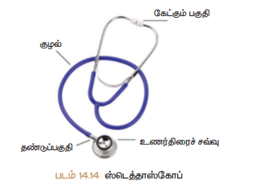

*படம் 14.14 ஸ்டெத்தாஸ்கோப்*

### ஸ்பிக்மோமானோமீட்டர்

இரத்த அழுத்தத்தைக் கண்டறிய உதவும் மருத்துவ உபகரணம் **ஸ்பிக்மோமானோமீட்டர்** ஆகும். இக்கருவியைக் கொண்டு ஒரு மனிதனின் மேற்கரத் தமனியின் அழுத்தம், அவர் ஓய்வாக உள்ள நிலையில் அளவிடப்படுகிறது. மேலும் இக்கருவி இரத்த ஓட்டத்தின் நிலையையும், இதயம் செயல்படுவதையும் கண்டறிய உதவுகிறது. குணைந்த மற்றும் உயர் இரத்த அழுத்த நிலைகளைக் கண்டறிய உதவுகிறது. **மானோமெட்ரிக்** மற்றும் நவீன **எண்ணியல் (டிஜிட்டல்)** வகையிலான உபகரணங்கள் இரத்த அழுத்தத்தினை அளக்க உதவும் சாதனங்களாகும்.

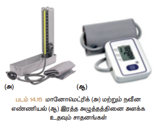

*படம் 14.15 மானோமெட்ரிக் (அ) மற்றும் நவீன எண்ணியல் (ஆ) இரத்த அழுத்தத்தினை அளக்க உதவும் சாதனங்கள்*

## 14.17 இரத்த வகைகள்

**கார்ல் லேண்ட்ஸ்டீனர் (1900)** இரத்த வகைகளைக் கண்டறிந்தார். இவர், A, B மற்றும் O இரத்த வகைகளை அடையாளம் கண்டறிந்தார். **டிகாஸ்டிலோ மற்றும் ஸ்டர்லி (1902)** AB இரத்த வகையினை கண்டறிந்தனர்.

மனித இரத்தத்தில் சில தனிச் சிறப்பு வாய்ந்த **அக்ளுட்டினோஜென்** அல்லது **ஆன்டிஜென்** (Ag) மற்றும் **அக்ளுட்டினின்** (அ) **எதிர்ப்பொருள்கள்** (ஆன்டிபாடிகள்) காணப்படுகின்றன. ஆன்டிஜென்கள் RBC-யின் மேற்புற படலத்தில் காணப்படுகின்றன.

எதிர்ப்பொருட்கள் இரத்த பிளாஸ்மாவில் காணப்படுகின்றன. ஆன்டிஜென் மற்றும் (ஆன்டிபாடி) எதிர்ப்பொருள்கள் காணப்படுவதின் அடிப்படையில் மனித இரத்தத்தினை A, B, AB மற்றும் O என நான்கு வகைகளாக அறியலாம். இந்த நான்கு வகைகளில் ஏதேனும் ஒரு வகையினை ஒரு தனிநபர் பெற்றிருப்பார்.

**'A' வகை** : ஆன்டிஜென் A – RBC யின் மேற்புறப்பரப்பில் காணப்படும். ஆன்டிபாடி B – இரத்த பிளாஸ்மாவில் காணப்படும்.

**'B' வகை** : ஆன்டிஜென் B – RBC யின் மேற்புறப்பரப்பில் காணப்படும். ஆன்டிபாடி A – இரத்த பிளாஸ்மாவில் காணப்படும்.

**'A B' வகை** : ஆன்டிஜென் A மற்றும் B – RBC-யின் மேற்புறப்பரப்பில் காணப்படும். அதற்கான ஆன்டிபாடிகள் பிளாஸ்மாவில் காணப்படாது.

**'O' வகை** : ஆன்டிஜென் A மற்றும் B RBC-யின் மேற்புறப்பரப்பில் காணப்படாது. இருந்த போதிலும் அதற்கான ஆன்டிபாடி A மற்றும் B பிளாஸ்மாவில் காணப்படும்.

### இரத்தம் வழங்குதல்

இரத்தம் செலுத்துவதற்கு முன்னர் இரத்தம் வழங்குபவர் மற்றும் இரத்தம் பெறுபவருக்கு இடையில் ஆன்டிஜெனுக்கும் ஆன்டிபாடிக்கும் உள்ள பொருத்தத்தினை கருத்தில் கொள்ள வேண்டும்.

பொருத்தமில்லா ஒரு இரத்த வகையினை ஒருவர் பெறுவதினால் அவருக்கு **இரத்தத் திரட்சி** ஏற்பட்டு இறக்க நேரிடும்.

AB இரத்த வகை கொண்ட நபரை **'அனைவரிடமிருந்தும் இரத்தம் பெறுவோர் வகை'** என அழைப்பர். இவர் அனைத்து இரத்த வகையினையும் ஏற்றுக் கொள்வார்.

O இரத்த வகை கொண்ட நபரை **'இரத்தக் கொடையாளி'** என அழைப்பர். இவர் அனைத்து வகை இரத்த பிரிவினருக்கும் இரத்தம் வழங்குவார்.

### Rh காரணி

1940 ஆம் ஆண்டு **லேண்ட்ஸ்டெய்னர்** மற்றும் **வியனனைர்** ஆகியோரால் ரீசஸ் இனைக்குரங்கு இரத்தத்தில் இருந்து **Rh காரணியை** கண்டறிந்தனர். Rh நேர்வகை (Rh+) இரத்தத்தை உடையோர் அவர்களது இரத்த சிவப்பணுக்களின் மீது Rh ஆன்டிஜென்களை கொண்டிருந்தனர். Rh எதிர்வகை (Rh-) இரத்தம் உடையோர் இதணை பெற்றிருக்கவில்லை. Rh ஆன்டிஜென்களுக்கு எதிராக உருவாகும் ஆன்டிபாடிகளே **Rh ஆன்டிபாடிகளே** எனைப்படும்.

---

**அட்டவணை 14.2 பல்வேறு வகையான இரத்த வகைகளில் காணப்படக்கூடிய ஆன்டிஜென் (RBC) மற்றும் ஆன்டிபாடிகள் (பிளாஸ்மா)**

| இரத்த வகை | RBC – யின் ஆன்டிஜென் | பிளாஸ்மாவின் ஆன்டிபாடி | எந்த இரத்தவகைக்கு வழங்கலாம் | எந்த இரத்தவகையை பெறலாம் |
|-----------|----------------------|------------------------|------------------------------|--------------------------|
| A | ஆன்டிஜென் A | ஆன்டி B | A மற்றும் AB | A மற்றும் O |
| B | ஆன்டிஜென் B | ஆன்டி A | B மற்றும் AB | B மற்றும் O |
| AB | ஆன்டிஜென் A&B | ஆன்டிபாடி இல்லை | AB | A, B, AB, மற்றும் O (அனைவரிடமிருந்தும் பெறுவோர்) |
| O | ஆன்டிஜென் இல்லை | ஆன்டி A & B உள்ளது | A,B,AB,O (அனைத்து இரத்த வகைகளுக்கும் வழங்கலாம்) | O மட்டும் |

---

## 14.18 நிறைநீர் மண்டலம்

நிறைநீர் மண்டலமானது நிறைநீர், நிறைநீர்த் தந்துகிகள், நிறைநீர் நாளங்கள், நிறைநீர் முடிச்சுகள் மற்றும் நிறைநீர்க் குழாய்களை உள்ளடக்கியது. நிறைநீர் மண்டலத்தின் வழியே பாய்ந்தோடும் திரவம் **நிறைநீர்** எனைப்படும்.

நிறைநீர்த் தந்துகிகள் ஒன்றாக இணைந்து **பெரிய நிறைநீர் நாளங்களை** உருவாக்குகின்றன. சிறிய முட்டை அல்லது பேரிக்காய் வடிவமுடைய **நிறைநீர் முடிச்சுகள்** நிறைநீர் நாளங்களின் பாண்யில் காணப்படுகின்றன.

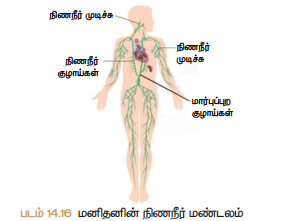

*படம் 14.16 மனிதனின் நிறைநீர் மண்டலம்*

### நிறைநீர்

நிறைநீர்த் தந்துகிகளின் செல் இடைவெளியில் நிறைநீர் காணப்படுகிறது. இரத்தத் தந்துகிகளின் சுவர்களில் உள்ள துளைகளின் வழியாக பிளாஸ்மா, புரதங்கள் மற்றும் இரத்த செல்கள், திசுக்களின் செல் இடைவெளிகளுக்குள் ஊடுருவும் போது நிறைமற்ற நிறைநீராக உருவாகிறது. இது இரத்த பிளாஸ்மாவை ஒத்துள்ளது. ஆனைதால் நிறைமற்றது மற்றும் குணைந்த அளவு புரதத்தைக் கொண்டுள்ளது. இதில் மிகக் குணைந்த அளவே ஊட்டப்பொருட்கள், ஆக்சிஜன், CO₂, நீர் மற்றும் WBC ஆகியவை உள்ளன.

### நிறைநீரின் பணிகள்

- இரத்தம் எடுத்துச் செல்ல இயலாத பகுதிகளுக்கு ஊட்டப்பொருட்களையும் மற்றும் ஆக்சிஜணையும் வழங்குகிறது.
- இது அதிப்படியான திசு திரவத்தையும், வளர்சிதை மாற்றப் பொருட்களையும் திசுக்களின் இடைவெளிகளிலிருந்து புரதங்களையும் இரத்தத்திற்கு மீண்டும் கொண்டு வருகிறது.
- இது சிறு குடலினால் உறிஞ்சப்பட்ட கொழுப்பினை இரத்தத்திற்கு எடுத்துச் செல்கிறது. குடலுறிஞ்சிகளில் காணப்படக்கூடிய நிறைநீர்த் தந்துகிகள் **செரிக்கப்பட்ட** கொழுப்பினை உறிஞ்சுகின்றன.
- நிறைநீரில் உள்ள லிம்ஃபோசைட்டுகள் உடலை நோய்தாக்குதலிலிருந்து பாதுகாக்கின்றன.

---

## நினைவில் கொள்க

- மூலக்கூறுகள் செறிவு மிகுந்த பகுதியிலிருந்து செறிவு குணைந்த பகுதிக்கு எவ்வித ஆறலின் உதவியின்றி கடத்தப்படுவது **பரவல்** எனைப்படும்.
- சவ்வூடு பரவல் என்பது ஒரு அரை கடத்து சவ்வின் வழியாக கரைப்பான் அல்லது நீர் மூலக்கூறுகள் அதன் செறிவு அதிகமாக உள்ள பகுதியிலிருந்து செறிவு குணைந்த பகுதிக்கு கடத்தப்படுவதாகும்.
- தாவர இலைகளிலுள்ள இலைத்துளை வழியாக நீரானது ஆவியாக வெளியேறுதல் **நீராவிப்போக்கு** எனைப்படும்.
- சுற்றோட்ட மண்டலம் இரத்த சுற்றோட்டத் திரவம், இரத்தம், நிறைநீர், இதயம் மற்றும் இரத்தக் குழாய்கள் ஆகியவற்றை உள்ளடக்கியது.
- இரத்தம் இரண்டு பகுதிப் பொருட்களைக் கொண்டுள்ளது. அவை திரவ பிளாஸ்மா மற்றும் அவற்றின் ஆக்கக் கூறுகள்.
- இரத்த குழாய்களுக்குள் இரத்தத்தை உந்தித் தள்ளும் தசையால் ஆன உறுப்பு **இதயம்** எனைப்படும்.
- இரத்தம் ஆக்சிஜன் மிகுந்த மற்றும் ஆக்சிஜன் குணைந்த நிலையில் உடலைச் சுற்றி வருகிறது.
- இதயத் தசைகளுக்கு இரத்தம் செல்வது **கரோனரி இரத்த ஓட்டம்** எனைப்படும்.
- ஒரு முழுமையான இதயத் துடிப்பு என்பது இதயத்தின் ஆரிக்கிள்கள் மற்றும் வெண்ட்ரிக்கிள்கள் சுருங்கி விரிவடைவது.
- இதயத் துடிப்பு துவங்குவதற்கும், முடிவடைவதற்கும் இடைப்பட்ட வரிசைக் கிரமமான நிகழ்வுகள் **'இதய சுழறசி'** எனைப்படும்.
- இரத்த அழுத்தமானது, சிஸ்டாலிக் இரத்த அழுத்தம், டையஸ்டாலிக் இரத்த அழுத்தம். **(120mmHg/80mmHg)** என அளவிடப்படுகிறது.
- A,B,AB மற்றும் O ஆகிய நான்கில், ஏதேனும் ஒரு வகை இரத்தம் மனிதரில் காணப்படும்.
- 1940-இல் லேண்ட்ஸ்டெய்னர் மற்றும் வியனனைர் ஆகியோரால் **Rh காரணி** கண்டறியப்பட்டது.
- இரத்தத் தந்துகிகளின் சுவர்களில் உள்ள துளைகளின் வழியாக பிளாஸ்மா, புரதங்கள் மற்றும் இரத்த செல்கள், திசுக்களின் செல் இடைவெளிகளுக்குள் ஊடுருவும் போது நிறைமற்ற நிறைநீராக உருவாகிறது.

---

## மதிப்பீடு

### I. சரியான விடையைத் தேர்ந்தெடு.

1. ஆறல் சாரந்த கடத்துதலில் (செயல்மிகு கடத்துதல்) ___________
   - அ. மூலக்கூறுகள் செறிவு குணைவான பகுதியிலிருந்து செறிவு அதிகமான பகுதிக்கு இடம் பெயர்கிறது.
   - ஆ. ஆறல் செலவிடப்படுகிறது.
   - இ. அவை மேல் நோக்கி கடத்துத்துல் முணையாகும்.
   - ஈ. இவை அனைத்தும்

2. வேரின் மூலம் உறிஞ்சப்பட்ட நீரானது தாவரத்தின் மேற்பகுதிக்கு இதன் மூலம் கடத்தப்படுகிறது ___________
   - அ. புறணி
   - ஆ. புறத்தோல்
   - இ. புளோயம்
   - ஈ. சைலம்

3. நீராவிப்போக்கின் பொழுது வெளியேற்றப்படுவது
   - அ. கார்பன்டை ஆக்ஸைடு
   - ஆ. ஆக்சிஜன்
   - இ. நீர்
   - ஈ. இவை ஏதுவுமில்லை

4. வேரத் தூவிகளானது ஒரு
   - அ. புறணி செல்லாகும்
   - ஆ. புறத்தோலின் நீட்சியாகும்
   - இ. ஒரு செல் அமைப்பாகும்
   - ஈ. ஆ மற்றும் இ.

5. கீழ்கண்ட எந்த நிகழ்ச்சிக்கு ஆறல் தேவை
   - அ. செயல் மிகு கடத்துதல் (ஆறல் சார் கடத்துதல்)
   - ஆ. பரவல்
   - இ. சவ்வூடு பரவல்
   - ஈ. இவை அனைத்தும்

6. மனித இதயத்தின் சுவர் எதனால் ஆனது?
   - அ) எண்டோகார்டியம்
   - ஆ) எபிகார்டியம்
   - இ) மையோகார்டியம்
   - ஈ) மேற்கூறியவை அனைத்தும்

7. இரத்த ஓட்டத்தின் சரியான வரிசை எது?
   - அ) வெண்ட்ரிக்கிள் → ஏட்ரியம் → சிரை → தமனி
   - ஆ) ஏட்ரியம் → வெண்ட்ரிக்கிள் → சிரை → தமனி
   - இ) ஏட்ரியம் → வெண்ட்ரிக்கிள் → தமனி → சிரை
   - ஈ) வெண்ட்ரிக்கிள் → சிரை → ஏட்ரியம் → தமனி

8. விபத்து காரணமாக 'O' இரத்த வகையைச் சார்ந்த ஒருவருக்கு அதிக இரத்த இழப்பு ஏற்படுகிறது. இந்நிலையில் அவருக்கு எந்த இரத்த வகையை மருத்துவர் செலுத்துவார்?
   - அ) 'O' வகை
   - ஆ) 'AB' வகை
   - இ) A அல்லது B வகை
   - ஈ) அனைத்து வகை.

9. இதயத்தின் இதயம் என அழைக்கப்படுவது ____
   - அ) SA கணு
   - ஆ) AV கணு
   - இ) பர்க்கினஜி இழைகள்
   - ஈ) ஹிஸ் கற்றைகள்

10. பின்வருவனவற்றுள் இரத்தத்தின் இணையபு தொடர்பாக சரியானது எது?
    - அ) பிளாஸ்மா = இரத்தம் + லிம்ஃபோசைட்
    - ஆ) சீரம் = இரத்தம் + ஃபைப்ரினோஜென்
    - இ) நிறைநீர் = பிளாஸ்மா + RBC + WBC
    - ஈ) இரத்தம் = பிளாஸ்மா + RBC +WBC + இரத்த தட்டுகள்

---

### II. கோடிட்ட இடத்தை நிரப்புக.

1. தாவரத்தின் புறப்பகுதியிலிருந்து நீர் ஆவியாகும் நிகழ்ச்சி ___________ எனைப்படும்.
2. நீரானது வேர் தூவி செல்லின் _________ பிளாஸ்மா சவ்வின் வழியாக செல்கிறது.
3. மண்ணிலிருந்து நீணை உறிஞ்சும் வேரின் பகுதி ___________.
4. இயல்பான இரத்த அழுத்தம் ___________
5. சாதாரண மனிதனின் இதயத் துடிப்பின் அளவு நிமிடத்திற்கு ___________ முணைகள் ஆகும்.

---

### III. பொருத்துக.

**பிரிவு I**

1. சிம்பிளாஸ்ட் வழி - அ. இலை
2. நீராவிப்போக்கு - ஆ. பிளாஸ்மோடெஸ்மேட்டா
3. ஆஸ்மோஸிஸ் - இ. சைலத்திலுள்ள அழுத்தம்
4. வேர் அழுத்தம் – ஈ. செறிவு அழுத்த வாட்டம்

**பிரிவு II**

1. லியூக்கிமியா - அ. திராம்போசைட்
2. இரத்தத் தட்டுகள் - ஆ. ஃபேகோசைட்
3. மோனோசைட்டுகள் - இ. லியூக்கோசைட் குணைதல்
4. லியூக்கோபினியா - ஈ. இரத்தப்புற்று நோய்
5. AB இரத்த வகை - உ. ஒவ்வாமை நிலை
6. O இரத்த வகை - ஊ. வீக்கம்
7. ஈசினோ ஃபில்கள் - எ. ஆன்டிஜனற்ற இரத்த வகை
8. நியூட்ரோஃபில்கள் - ஏ. ஆன்டிபாடி அற்ற இரத்த வகை

---

### IV. சரியா, தவறா என கூறுக தவறெனில் வாக்கியத்தை சரிப்படுத்துக.

1. உணவைக் கடத்துதலுக்கு காரணமான திசு புளோயமாகும்.
2. தாவரங்கள் நீராவிப்போக்கின் காரணமாக நீணை இழக்கின்றன.
3. புளோயத்தின் வழியாக கடத்தப்படும் சர்க்கரை – குளுக்கோஸ்.
4. அபோபிளாஸ்ட் வழி கடத்துதலில் நீரானது செல் சவ்வின் வழியாக செல்லினுள் நுழைகிறது.
5. காப்பு செல்கள் நீணை இழக்கும்போது இலைத்துளை திறந்து கொள்ளும்.
6. இதயத்துடிப்பின் துவக்கம் மற்றும் தூண்டலானது நரம்புகளின் மூலமாக நடைபெறும்.
7. அனைத்து சிரைகளும் ஆக்சிஜன் குணைந்த இரத்தத்தை கடத்துபவையாகும்.
8. WBC பாக்டீரியா மற்றும் வைரஸ் தொற்றிலிருந்து உடலைப் பாதுகாக்கிறது.
9. வெண்ட்ரிக்கிள்கள் சுருங்கும் போது மூவிழை மற்றும் ஈரிழை வால்வுகள் மூடிக் கொள்வதால் **லப்** எனும் ஒலி தோன்றுகிறது.

---

### V. ஒரு வாரத்தையில் விடையளி.

1. மனித இதயத்தை மூடியிருக்கும் இரட்டை அடுக்காலான பாதுகாப்பு உணையின் பெயணரக் கூறுக.
2. மனித இரத்தத்தில் உள்ள RBC-யின் வடிவம் என்ன?
3. இரத்தம் சிவப்பு நிறமாக இருப்பேன்?
4. எவ்வகையான செல்கள் நிறைநீரில் காணப்படுகின்றன?
5. வெண்ட்ரிக்கிளிலிருந்து வெளிச் செல்லும் முக்கியத் தமனிகளில் காணப்படும் வால்வு எது?
6. இதயத் தசைகளுக்கு இரத்தத்தை அளிக்கும் இரத்தக் குழாய் எது?

---

### VI. சிறுவிணா.

1. நீராவிப்போக்கின் போது இலைத்துளை திறப்பதற்கும் மூடிக்கொள்வதற்குமான காரணத்தை கூறு.
2. கூட்டினைவு எனைதால் என்ன?
3. வேரினுள் நீர் நுழைந்து, இலையின் மூலம் நீராவியாக வளிமண்டலத்தில் இழக்கப்படும் பாண்ணைக் கோட்டுக.
4. ஒரு தாவரத்தில் வேரின் மூலம் உறிஞ்சப்பட்ட நீரின் அளவைவிட இலையின் மூலம் நீராவிப்போக்கின் காரணமாக வெளியேறும் நீரின் அளவு அதிகமானதால் என்ன நிகழும்?
5. மனித இதயத்தின் அமைப்பு மற்றும் செயல்படும் விதத்தினை விவரி.
6. மனிதர்களின் சுற்றோட்டமானது இரட்டைச் சுற்றோட்டம் என அழைக்கப்படுகிறது ஏன்?
7. இதய ஒலிகள் எனைதால் என்ன? அவை எவ்வாறு உருவாகின்றன?
8. இதய வால்வுகளின் முக்கியத்துவம் என்ன?
9. Rh காரணியைக் கண்டறிந்தவர் யார்? அது ஏன் அவ்வாறு அழைக்கப்படுகிறது?
10. தமனிகளும், சிரைகளும் அமைப்பின் அடிப்படையில் எவ்வாறு வேறுபடுகின்றன?
11. சைனோ ஆரிக்குலார் கணு 'பேஸ் மேக்கர்' என்று ஏன் அழைக்கப்படுகிறது?
12. உடல் இரத்த ஓட்டம் மற்றும் நுரையீரல் இரத்த ஓட்டத்தினை வேறுபடுத்துக.
13. இதய சுழறசியின் நிகழ்வானது 0.8 வினாடிகளில் நிணைவடைகிறது எனில், ஒவ்வொரு நிகழ்வின் கால அளவையும் குறிப்பிடுக?

---

### VII. கீழ்கண்ட கூற்றுக்கான காரணங்களைத் தரு.

1. தாவர வேர்கள் கனிமங்களை ஆறல் சாரா நிகழ்ச்சியின் மூலம் எடுத்துக் கொள்வதில்லை.
2. இலைத்துளைகள் திறப்பதற்கும் மூடுவதற்கும் காரணமான அமைப்பு காப்பு செல்கள் ஆகும்.
3. புளோயத்தின் வழியாக உணவுப்பொருளானது அனைத்து பகுதிகளுக்கும் பல திணைகளில் கடத்தப்படுகிறது.
4. இலைகள் உதிரும்போது தாவரங்களில் கனிமங்கள் இழக்கப்படுவதில்லை.
5. வலது ஆரிக்கிள் சுவணர விட வலது வெண்ட்ரிக்கிள் சுவர் தடிமனாக உள்ளது.
6. பாலூட்டிகளின் முதிர்ந்த RBC யில் செல் நுண்ணுறுப்புக்கள் காணப்படவில்லை.

---

### VIII. விரிவான விடையளி.

1. தாவரங்கள் எவ்வாறு நீணை உறிஞ்சுகின்றன. விவரி.
2. நீராவிப்போக்கு எனைதால் என்ன? நீராவிப்போக்கின் முக்கியத்துவத்தை எழுதுக.
3. லியூக்கோசைட்டுகள் துகள்கள் உடையவை மற்றும் துகள்களற்றவை என வகைப்படுத்தப்பட்டுள்ளன. ஏன்? அவற்றின் பெயர்களையும், பணிகளையும் குறிப்பிடுக.
4. சிஸ்டால் மற்றும் டையஸ்டால் வேறுபடுத்துக. இதயத் துடிப்பின் பரவுதலை விளக்குக.
5. இரத்தத்தின் பணிகளைப் பட்டியலிடுக.

---

### IX. கூற்று மற்றும் காரணம் கூறுதல்.

**வழிமுணைகள்** : கீழ்கண்ட கேள்வியில் கூற்று (A) மற்றும் அதற்குரிய காரணம் (R) கீழே கொடுக்கப்பட்டுள்ளன. கீழே கொடுக்கப்பட்டுள்ள வாக்கியங்களில் சரியான பதிலை குறிப்பிடுக.

- அ) கூற்றும் (A) மற்றும் காரணம் (R) ஆகிய இரண்டும் சரியாக இருந்து, அதில் அந்த காரணம் கூற்றுக்கான சரியான விளக்கம் ஆகும்.
- ஆ) கூற்று (A) மற்றும் காரணம் (R) ஆகிய இரண்டும் சரியாக இருந்து, அதில் காரணம் அந்த கூற்றுக்கான சரியான விளக்கம் அல்ல.
- இ) (A) சரியாக இருந்து காரணம் (R) மட்டும் தவறு.
- ஈ) கூற்று (A) மற்றும் காரணம் (R) இரண்டும் தவறு.

1. **கூற்று (A)** : சுவாச வாயுக்களை கடத்துவதில் RBC முக்கியப் பங்கு வகிக்கின்றது.

   **காரணம் ( R )** : RBC-ல் செல் நுண்ணுறுப்புகளும் உட்கருவும் காணப்படவில்லை.

2. **கூற்று (A)** : 'AB' இரத்த வகை உடையோர் "அனைவரிடமிருந்தும் இரத்தத்தை பெறுவோராக" கருதப்படுகின்றார்கள். ஏனெனில், அவர்கள் அனைத்து வகை இரத்தப் பிரிவினரிடமிருந்தும் இரத்தத்தினைப் பெறலாம்.

   **காரணம் ( R )** : AB இரத்த வகையில் ஆன்டிபாடிகள் காணப்படவில்லை.

---

### X. உயர்சிந்தணை விணாக்கள்.

1. உலர்ந்த தாவரப்பொருளை நீரில் வைக்கும் போது உப்பிவிடும். இதற்கான நிகழ்ச்சி என்ன? வரையணை செய்க.
2. இடது வெண்ட்ரிக்கிள் சுவரானது மற்ற அணைகளின் சுவர்களைவிட தடிமனாக இருப்பது ஏன்?
3. இதய ஒலியைக் கண்டறிய மருத்துவர்கள் ஸ்டெட்தாஸ்கோப்பை பயன்படுத்துவது ஏன்?
4. நுரையீரல் தமனி மற்றும் நுரையீரல் சிரை ஆகியவை சாதாரண தமனி மற்றும் சிரை ஆகியவற்றின் பணிகளோடு ஒப்பிடும் போது எவ்வாறு வேறுபடுகின்றன.
5. நீராவிப்போக்கு ஒரு தேவையான தீங்கு செயல் விளக்குக.

---

## பிற நூல்கள்

1. V.K. Jain, Fundamentals of Plant physiology, S.Chand and Company, New Delhi
2. D.G Maclean and Dave Hayward, Biology Cambridge IGCSE
3. S.C.Rastogi., Essential of Animal Physiology, 4th Edition, New Age International Publishers
4. Elain N. Marieb and Katja Hoehn, 2011, Anatomy and Physiology, 4th Edition, Pearson Publications.

## இணைய வளங்கள்

http://www.britannica.com/science/human-circulatory-system

http://biologydictionary.net/circulatory-system/

---

## இணையச்செயல்பாடு விலங்குகளில் இரத்த சுற்றோட்டம்

இந்த செயல்பாட்டின் மூலம் மாணவர்கள் இதயத்தின் அமைப்பு, மற்றும் இரத்த ஓட்டத்தை பற்றியும் அறிந்து கொள்வர்.

**படிகள்**

படி 1: கீழ்க்காணும் உரலி / விரைவுக் குறியீட்டைப் பயன்படுத்தி "CHE – cardiovascular system" அலைபேசியில் பதிவிறக்கம் செய்க. செயல்பாட்டின் உள் செல்க நான்கு பகுதிகளை காணலாம். அறிமுகம், இதயம்– அமைப்பு பணிகள், இரத்தம் மற்றும் இரத்த சுற்றோட்டம்.

படி – 2: ஒவ்வொரு பகுதியிலும் விளக்கம் மற்றும் படங்கள் காண்பர்.

படி – 3: படத்தை ஐ சொடுக்கி, காணொளியை காணலாம்.

படி – 4: 3D உயிரூட்டத்தை பெரிதாக்கி மற்றும் சிறிதாக்கி காணலாம்.

**உரலி**

URL : https://play.google.com/store/apps/details?id=com.bodyxq.appbookCardio

---

## கருத்து வரைபடம்

**தாவரக் கடத்தல் மற்றும் விலங்கின் சுற்றோட்டம்**

**தாவரங்களில் கடத்துதல்**

- வேர்கள்
  - வேர் அழுத்தம்
  - சாறேற்றம்
  - இடம் பெயர்தல்
- வேர் செல் பாதை
- பரவல்
- ஆறல்சார கடத்தல்
- சவ்வூடு பரவல்
- பிளாஸ்மா சிதைவு
- உதிர்த்தல்
- அபோபிளாஸ்ட் வழி
- சிம்பிளாஸ்ட் வழி
- இலைத்துளை
- நீராவிப்போக்கு
- இழுவிணசை
- கனிம அயனிகள்
- சர்க்கரை

**இரத்த சுற்றோட்டம்**

- Rh காரணி
- ABO வகைகள்
- இரத்த வகைகள்
- இரத்த நாளங்கள் மற்றும் சுற்றோட்ட வகைகள்
  - தமனி
  - சிரை
  - உடல் இரத்த ஓட்டம்
  - நுரையீரல் இரத்த ஓட்டம்
  - கரோனரி இரத்த ஓட்டம்
- இதயம் மற்றும் அதனடைய பகுதி நான்கு அணைகளை கொண்டவை
  - இதய காயாக் சுழறசி
  - இதய ஒலி
  - இரத்த அழுத்தம்
- பிளாஸ்மா சிதைவு
- இரத்தம்
  - இரத்தச் சிவப்பணு (RBC)
  - இரத்த வெள்ளையணு (WBC)
    - நியூட்ரோஃபில்
    - ஈசினோஃபில்
    - பேசோஃபில்
    - லிம்ஃபோசைட்
    - மோனோசைட்
  - இரத்தத் தட்டுகள்