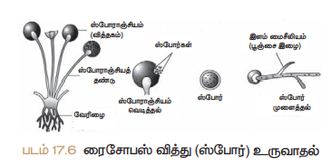

# அறிமுகம்

உயிரினங்களின் வாழ்நாளானது இப்புவியில் வரையறுக்கப்பட்டதாகும். எனவே, எந்த ஒரு உயிரினமும் நீண்ட நாள் உயிர் வாழ இயலாது. அனைத்து உயிரினங்களும் தன்னை ஒத்த உயிரினத்தை உருவாக்கும் திறன் இனப்பெருக்கம் எனப்படும். இனப்பெருக்கம் தன்னைப் போன்ற உயிரினங்களின் தோன்றலுக்கு வழிவகுக்கிறது. இது தொடர்ந்து உயிரினங்கள் உயிர்வாழ்தலை தீர்மானிக்கிறது. இவ்வாறு ஒரு குறிப்பிட்ட சிற்றினம் பாதுகாக்கப்படும் நிகழ்வு சுய நிலைப்பேறுடைமை எனப்படும். இனப்பெருக்கம் நிகழும் காலமானது உயிரினத்திற்கு உயிரினம் மாறுபடுகிறது. ஈஸ்ட், பாக்டீரியா, எலி, பசு, யானை மற்றும் மனிதரில் இனப்பெருக்க காலத்தில் இம்மாறுபட்டைக் காணலாம். பால் இனப்பெருக்கத்தின் மூலம் ஆண் மற்றும் பெண் இனச்செல்கள் (விந்து மற்றும் அண்டம்) இணைந்து புதிய உயிரினம் தோன்றுகிறது.

**தாவரங்களின் இனப்பெருக்கம்**
தாவரங்களில் மூன்று வகையான
இனப்பெருக்கம் நடைபெறுகிறது. அவை,
i) உடல இனப் பெருக்கம்
ii) பாலிலா இனப் பெருக்கம்
iii) பாலினப்பெருக்கம்

##  உடல இனப் பெருக்கம்
இந்த வகை இனப்பெருக்கத்தில் புதிய தாவரத்தின் ஏதேனும் ஒரு இளந்தாவரங்கள்,   வரத்தின் பாகத்தில் உள்ள உடல் செல்களிலிலிருந்து தோன்றுகின்றன. தாய்த்  வரத்தில் உள்ள வேர், தண்டு, இலை அல்லது மொட்டு முதலான ஏதேனும் ஓர் உறுப்பிலிருந்து இளந்தாவரம் தோன்றி அது தனித்தாவரமாக வளர்கிறது. இவ்வாறுனப் பெருக்கம் நடைபெறுவதில் குன்றாப் பகுப்பு (மைட்டாசிஸ்) மட்டும் நடைபெறுவதால் இளந்தாவரங்கள், தாய்த் தாவரங்களைப் போன்றே நடைபெறும் போது  லின செல்கள் (இனச்செல்கள்) காணப்படுகின்றன. இவ்வகை இனப்பெருக்கம் இணைவதில்லை.

1. **இலை உடல இனப்பெருக்கம்**
இரணக்கள்ளி (பிரோயோஃபில்லம்) தாவரத்தின் இலைகளின் விளிம்பில் உள்ள பள்ளங்களிலிருந்து இளந்தாவரம் தோன்றுகிறது.

2. **தண்டு உடல இனப்பெருக்கம்**

ஸ்ட்ராபெர்ரி முதலான மெலிந்த தண்டுகளை உடைய தாவரங்களின் தண்டு தரையில் படும்போது அந்தத் தண்டுப் பகுதியிலிருந்து தரையில் வேர் ஊன்றி புதிய இளந்தாவரம் தோன்றுகிறது. தாய்த் தாவரத்தில் உள்ள தொடர்பு அறுபடும்போது இளந்தாவரம், தனித் தாவரமாக வளர்கிறது.

3. **வேர் உடல இனப்பெருக்கம்**
அஸ்பராகஸ், சர்க்கரைவள்ளிக்கிழங்கு முதலான தாவரங்களின் வேர்க்கிழங்குகள் உடல இனப்பெருக்கத்திற்குப் பயன்படுகின்றன.

4. **குமிழம் (பல்பில்ஸ்) உடல இனப்பெருக்கம்**
சில தாவரங்களில் பூவின் மொட்டானது ஓர் உருண்டை வடிவக் குமிழ் போன்ற அமைப்பை உருவாக்குகின்றது. இதனைக் குமிழம் என்கிறோம். இந்தக் குமிழம் தரையில் விழுந்து வேரூன்றிப் புதிய இளந்தாவரத்தை உருவாக்குகிறது. எ.கா. கற்றாழை.

5. **பிற வகையான உடல இனப்பெருக்கம்**
**அ. துண்டாதல்** 
துண்டாகும் இயல்புடைய இழைகளைக் கொண்டபாசிகளிலிருந்து ஏற்படும் துண்டுகளிலிருந்து புதிய இளந்தாவரம் உருவாகிறது. ஒவ்வொரு சிறிய துண்டுப் பாசியிலும் குறைந்தது ஒரு செல்லாவது இருந்தால் மட்டுமே புதிய தாவரம் உருவாகும். எ.கா. ஸ்பைரோகைரா

**ஆ. பிளத்தல்**
இந்த வகை இனப்பெருக்கத்தில் தாய் செல்லானது இரண்டாகப் பிரிந்து ஒவ்வொன்றிலிருந்தும் சேய் செல் தோன்றுகிறது. 
எ.கா. அமீபா

**இ. மொட்டு விடுதல் அல்லது அரும்புதல்**
இந்த வகை இனப்பெருக்கத்தில் தாய்த் தாவரத்திலிருந்து தோன்றும் புதிய வளரியிலிருந்து மொட்டு தோன்றுகிறது. அது மேலும் வளர்ச்சியடைந்து ஒரு புதிய தாவரத்தை உருவாக்குகிறது.
 எ.கா. ஈஸ்ட்,

**ஈ. மீளுருவாக்கம்** 
இழந்த பாகங்களை மீண்டும் உருவாக்கி புதிய உயிரியைத் தோற்றுவித்தல் இழப்பு மீட்டல் எனப்படும். ஹைட்ரா, பிளனேரியா ஆகிய உயிரினங்கள், சிறு சிறு துண்டுகளாகப் பிரிகின்றன. ஒவ்வொரு துண்டும் ஒரு புதிய உயிரினத்தைத் தோற்றுவிக்கிறது.

## பாலிலா இனப்பெருக்கம்

பாலின செல்கள் இணைவின்றி ஒரே ஒரு தாய்த் தாவரத்திலிருந்து புதிய தாவரம் தோன்றும் முறையைப் பாலிலா இனப்பெருக்கம் என்கிறோம். இந்த வகை இனப்பெருக்கத்தில் குன்றாப் பகுப்பு செல் பிரிதல் மட்டுமே நடைபெறுகிறது. குன்றல் பகுப்பு நடைபெறுவதில்லை. எனவே பாலிலா இனப்பெருக்க முறையில் தோன்றும் இளம் உயிரிகள் தாய்த் தாவரத்தை ஒத்துக் காணப்படுகின்றன. பாலிலா இனப்பெருக்கம் விதைத்துகள்கள் (Spores) மூலம் நடைபெறுகிறது.	

பாலிலா இனப்பெருக்கம் பெரும்பாலும் பூஞ்சைகள் மற்றும் பாக்டீரியாக்களில் நடைபெறுகிறது. பாலிலா இனப் பெருக்கத்தின் போது பூஞ்சை இழையிலிருந்து ஒரு வித்தகம் (ஸ்போராஞ்சியம்) தோன்றுகிறது. இதனுள் இருக்கும் உட்கரு பலமுறை பிரிதல் அடைந்து ஏராளமான உட்கருக்களைத் தோற்றுவிக்கிறது. ஒவ்வொரு உட்கருவும் சிறிதளவு சைட்டோபிளாசத்துடன் சேர்ந்து ஸ்போராக (விதைத்துகள்) உருவாகிறது. வித்தகம் என்னும் ஸ்போராஞ்சியம் வெடித்து விதைத்துகள்கள் வெளியேற்றப்படுகின்றன. இவை நிலத்தில் விழும்போது புதிய உடல இழையைத் (ஹைபா) தோற்றுவிக்கின்றன.

## தாவரங்களின் பாலினப்பெருக்கம

பாலினப்பெருக்கம் என்பது தாவரங்களின் ஆண் மற்றும் பெண் இனச்செல்கள் (கேமீட்டுகள்) இணைந்து தன்னை ஒத்த புதிய தாவர உருவாக்கும் முறையாகும். இந்த வகை இனப்பெருக்கத்தில் ஆண், பெண் பால் உறுப்புகள் பாலினசெல்களை உருவாக்கிடத் தேவைப்படுகின்றன.

மலரானது பூக்கும் தாவரத்தின் இனப்பெருக்க உறுப்பு என்பதை நீங்கள் முந்தைய வகுப்புகளில் படித்திருப்பீர்கள். இதைப் பற்றித் தெரிந்து கொள்ள முதலில் நாம் மலரின் வெவ்வேறு பாகங்களைப் பற்றி தெரிந்து கொள்வோம்.

	
### மலரின் பாகங்கள

மலர் என்பது மாறுபாடு அடைந்த வரம்புடைய வளர்ச்சியினை உடைய தண்டுத் தொகுப்பு ஆகும். இதில் நான்கு அடுக்குகள் உள்ளன. அவை பூத்தளத்தில் வெளிப்புறத்திலிருந்து உள் நோக்கி அமைந்திருக்கின்றன. 
அ) புல்லி வட்டம் (புல்லி இதழ்களால் ஆனது) 
ஆ)அல்லி வட்டம் (அல்லி இதழ்களால் ஆனது)
இ) மகரந்தத்தாள் வட்டம் (மகரந்தத்தாளால் ஆனது) 
ஈ) சூலக வட்டம் (சூலிலைகளால் ஆனது)

வெளிப்புறத்தில் உள்ள இரண்டு அடுக்குகளும் நேரடியாக இனப்பெருக்கத்தில் பங்கெடுப்பதில்லை. எனவே இவை துணை அடுக்குகளாகக் கருதப்படுகின்றன. உட்புறத்தில் இருக்கும் அடுக்குகள் இரண்டும் இனப்பெருக்கத்தில் பங்கெடுப்பதால் முதன்மையான அடுக்குகளாகக் கருதப்படுகின்றன.

மகரந்தத்தாள் வட்டம்: மகரந்தத்தாள் வட்டமானது மலரின் ஆண் இனப்பெருக்கப் பகுதியாகும். இது பல மகரந்தத் தாள்களின் தொகுப்பு ஆகும். ஒவ்வொரு மகரந்தத் தாளும் ஒரு காம்பு போன்ற பகுதியையும் பை போன்ற பகுதியையும் கொண்டிருக்கும். காம்புப் பகுதி மகரந்தக்கம்பி எனவும் அதன் நுனியில் அமைந்த பை போன்ற பகுதி மகரந்தப்பை எனவும் அழைக்கப்படுகின்றன. மகரந்தத்தூள் மகரந்தப் பையின் உள்ளே காணப்படுகிறது.

மகரந்தத்தூள்: மகரந்தத்தூள்கள் கோள வடிவமானவை. இரண்டு உறைகளால் ஆனவை. கடினமான வெளியுறை எக்ஸைன் எனப்படும். இந்த வெளியுறையில் நிலையான துளைகள் உள்ளன. அவை வளர்துளை எனப்படும். உள்ளுறை இன்டைன் எனப்படும். இது மிகவும் மெல்லியதாகவும் தொடர்ச்சியாகவும் காணப்படும். இது செல்லுலோஸ் மற்றும் பெக்டினால் ஆனது. முதிர்ந்த மகரந்தத்தூள்களில் இரண்டு விதமான செல்கள் உள்ளன. இவை முறையே உடல செல் மற்றும் உற்பத்தி செல் எனப்படும். உடல செல்லினுள் ஒரு பெரிய உட்கரு உள்ளது. உற்பத்தி செல்லானது குன்றாப் பகுப்பு (மைட்டாசிஸ்) மூலம் பிரிதல் அடைந்து இரண்டு ஆண் பாலினச் செல்களை உருவாக்குகிறது.

சூலகம்: சூலகமானது மலரின் பெண் இனப் பெருக்கப் பகுதியாகும். இது சூல் இலைகளால் ஆனது. ஒவ்வொரு சூலகமும் மூன்று பகுதிகளைக் கொண்டுள்ளது.
அவை, 
1. சூலகமுடி 
2. சூலகத்தண்டு 
3. சூற்பை ஆகியனவாகும். சூல் பையினுள் சூல்கள் காணப்படுகின்றன.

### சூலின் அமைப்பு
சூலின் முக்கியமான பகுதி சூல் திசு ஆகும். இது இரண்டு சூல் உறைகளால் சூழப்பட்டுள்ளது. மேல பகுதியில் சூல் உறை இணையாமல் அமைந்த இடைவெளியானது சூல்துளை ஆகும்.

சூலானது சூல் அறையினுள் ஒரு சிறிய காம்பின் மூலம் ஒட்டிக் கொண்டுள்ளது. இதற்கு சூல் காம்பு என்று பெயர். சூலின் அடிப்பகுதி சூலடி எனப்படும். கருப்பையினுள் உள்ள சூல் திசுவினுள் ஏழு செல்களும் எட்டு உட்கருக்களும் அமைந்துள்ளன. 
சூல் துளையின் அருகில் உள்ள மூன்று கருப்பை செல்கள், அண்டசாதனத்தை உருவாக்குகின்றன. அடிப்பகுதியில் உள்ள மூன்று உட்கருக்களும் எதிர்த் துருவ செல்களாக உள்ளன. மையத்தில் உள்ள ஒரு செல் துருவ செல்லாகவும் உள்ளது.

அண்ட சாதனமானது ஓர் அண்ட செல்லையும் இரண்டு பக்கவாட்டு செல்களையும் கொண்டுள்ளது. இந்த பக்கவாட்டு செல்கள் சினையாற்றியம் (Synergids) என அழைக்கப்படுகின்றன. 

தாவரங்களின் பால்இனப்பெருக்கம் 

பூக்கும் தாவரங்களின் பாலினப்பெருக்கம் இரண்டு படிநிலைகளில் நடைபெறுகிறது. 
1. மகரந்தச்சேர்க்கை 
2. கருவுறுதல

## மகரந்தச்சேர்க்கை

பூவின் மகரந்தப் பையிலிருந்து மகரந்தத்தூள், சூலக முடியைச் சென்று அடைவது மகரந்தச்சேர்க்கை எனப்படும். 
மகரந்தச்சேர்க்கையின் பயன்கள் 
1. மகரந்தச்சேர்க்கையை த் தொடர்ந்து கருவுறுதல் நடைபெற்று கனியும் விதையும் உருவாகின்றன. 
2. அயல் மகரந்தச்சேர்க்கையின் காரணமாக இருவேறுபட்ட ஜீன்கள் இணைவதால் புதிய வகைத் தாவரம் உருவாகிறது.

### மகரந்தச்சேர்க்கையின்‌ வகைகள்‌

1. தன்‌ மகரந்தச்சேர்க்கை
2. அயல்மகரந்தச்சேர்க்கை:

**தன்‌ மகரந்தச்சேர்க்கை (ஆட்டோகேமி)**

ஒரு மலரிலுள்ள மகரந்தத்தூள்‌ அதே மலரில்‌ உள்ள ரக முடியை சுல்லது. அதே தாவரத்தில்‌ உள்ள வேஹாரு மலரின்‌ கூகை முடியைச்‌ சென்றடைவது தன்‌ மகரந்தச்சேர்க்கை எனப்படும்‌.
எகா. ஹைபிஸ்கஸ்‌.

**தன்‌ மகரந்தச்சேர்க்கையின்‌ நன்மைகள்‌:**

1. இருபால்‌ மலர்களில்‌ தன்‌ மகரந்கச்மேரக்கை நடைபறுகிறது.

2. மலர்கள்‌ பறக்காரணிகளைச்‌ தேவையில்லை. 

3. முரந்கத்தாள்கள்‌ விணடிக்கப்படுவதில்லை.

**தன்‌ மகரந்தச்சேர்க்கையின்‌ தீமைகள்‌:**

1. விதைகள் குறைந்த உருவாகின்றன.

2. கருஷண்‌ மிகர்‌ சிறியது. எனவே விதைகள்‌ மிக நலிவடைந் தாவரங்களை உருவாக்கும்‌.

3. புதிய வகைத்‌ தாவரம்‌ உருவாகாது.

**அயல்‌ மகரந்தச்சேர்க்கை**
ஒரு மலரின்‌ மகரந்தத்நாள்‌ அதே இனத்தைச்‌ சார்ந்த மற்றொரு தாவரத்தின்‌ மலறில்‌ உள்ள சூலக முடியைச்சென்று அடைவது அயல்மகரந்கச்சேர்க்கை: எனப்படும்‌. 

எக. ஆப்பிள்‌, திராட்சை பிளம்‌ முதலியன.

**அயல்‌ மகரந்தச்சேர்க்கையின்‌ நன்மைகள்‌:**

1. அயல் மகரந்தச்சேர்க்கையின் மூலம் உருவாகும் விதைகள், வலிமையான தாவரங்களை உருவாக்கும். இதன் மூலம் புதிய வகைத் தாவரங்கள் உருவாகின்றன.

2. நன்கு முளைக்கும் திறன் கொண்ட விதைகள் உருவாகின்றன .

**அயல் மகரந்தச்சேர்க்கையின் தீமைகள்**
1. அயல் மகரந்தச்சேர்க்கை, புறக்காரணிகளை நம்பி இருப்பதால் மகரந்தச்சேர்க்கை தடைபடுகிறது.
2. அதிக அளவில் மகரந்தத்தூள் வீணாகிறது.
3. சில தேவையில்லாத பண்புகள் தோன்றுகின்றன.
4. மலர்கள் புறக்காரணிகளைச் சார்ந்து இருக்கின்றன.

## அயல் மகரந்தச்சேர்க்கைக்கான காரணிகள்

மலரில் அயல் மகரந்தச்சேர்க்கை நடைபெற வேண்டுமெனில் மகரந்தத்தூளானது ஒரு மலரிலிருந்து மற்றொரு தாவரத்தில் உள்ள மலருக்கு எடுத்துச் செல்லப்பட வேண்டும். இது புறக்காரணிகளான விலங்குகள், பூச்சிகள், காற்று, நீர் முதலானவற்றால் நடைபெறுகிறது.

### காற்று வழி மகரந்தச்சேர்க்கை

காற்றின் மூலம் நடைபெறும் மகரந்தச்சேர்க்கை அனிம�ோஃபிலி எனப்படும். இவ்வகை மலர்கள் ஏராளமான மகரந்தத்தூள்களை உற்பத்தி செய்கின்றன. மகரந்தத்தூள்கள் சிறியதாகவும், மென்மையானதாகவும், உலர்ந்ததாகவும், எடை குறைவாகவும் உள்ளன. இவ்வகைத் தாவரங்களின் மகரந்தத்தூள்கள் 1000 கி.மீ. தூரத்துக்கு மேல் கடக்கின்றன. சூல் முடியானது பெரியதாகவும் வெளியே நீட்டிக் கொண்டும் இருக்கும். சில நேரங்களில் கிளைத்து முடி போன்று மகரந்தத் தூளைப் பிடித்துக் கொள்வதற்கு ஏற்றதாக இருக்கும். எ.கா. புல் மற்றும் சில கள்ளிச் செடிகள்.

### பூச்சிகள் வழி மகரந்தச்சேர்க்கை

தேனீக்கள், ஈக்கள் முதலான பூச்சிகள் மூலம் நடைபெறும் மகரந்தச்சேர்க்கைக்கு எண்டம�ோஃபிலி என்று பெயர். பூச்சிகளைக் கவர்வதற்கு ஏற்றாற் போல பல நிறம், மணம், தேன் சுரக்கும் தன்மை ஆகியவற்றுடன் இவ்வகை மலர்கள் காணப்படும். இவ்வகை மலர்களில் மகரந்தத்தூள் பெரியதாகவும் வெளியுறையானது துளைகளுடனும் வெளிப்பக்கத்தில் முட்களுடனும் காணப்படும். பூச்சிகளால் நடைபெறும் மகரந்தச்சேர்க்கையில் ஏறத்தாழ 80% மகரந்தச்சேர்க்கையானது தேனீக்களால் நடைபெறுகிறது.

### நீர்வழி மகரந்தச்சேர்க்கை

நீரின் மூலம் நடைபெறும் மகரந்தச்சேர்க்கைக்கு ஹைட்ரோஃபிலி என்று பெயர். இது நீர்வாழ் தாவரங்களில் நடைபெறுகிறது. இவ்வகைத் தாவரங்களில் (i) மகரந்தத்தூள் அதிக அளவில் உருவாகின்றன. (ii) மகரந்தத்தூள்கள் பெண் மலர்களில் உள்ள சூலகமுடியை அடையும் வரை நீரில் மிதந்து கொண்டிருக்கும். எ.கா. ஹைட்ரில்லா, வாலிஸ்நீரியா

### விலங்குகள் வழி மகரந்தச்சேர்க்கை

விலங்குகள் மூலம் நடைபெறும் மகரந்தச்சேர்க்கை, விலங்குகள் வழி மகரந்தச்சேர்க்கை (சூஃபிலி) எனப்படும். இவ்வகை மகரந்தச்சேர்க்கையில் மலர்கள், விலங்குகளைக் கவர்வதற்காகப் பிரகாசமான வண்ணங்களைக் கொண்டவையாகவும் அளவில் பெரியவையாகவும் மிகுந்த மணம் கொண்டவையாகவும் இருக்கும்.

எ.கா. தேன்சிட்டு பறவை மூலம் கல்வாழை, கிளாடியோலி போன்ற தாவரங்களில் மகரந்தச்சேர்க்கை நடைபெறுகிறது. 

அணில்கள் மூலமாக இலவம் பஞ்சு மரத்தில் மகரந்தச்சேர்க்கை நடைபெறுகிறது.

## தாவரங்களில் கருவுறுதல்

• மகரந்தத்தூள், பொருத்தமான சூலகமுடியை அடைந்ததும் முளைக்கத் தொடங்கும்.

• மகரந்தத்தூள் ஒரு சிறிய குழாய் போன்ற அமைப்பை உருவாக்குகிறது. அதற்கு மகரந்தக் குழாய் என்று பெயர். இது மகரந்தத் தூளில் உள்ள மகரந்தத் துளை வழியாக வெளிவருகிறது. மகரந்தத் தூளின் உள்ளிருக்கும் பொருள்கள் மகரந்தக் குழாய்க்குள் நகர்கின்றன. 

• மகரந்தக் குழாய் சூலகமுடி மற்றும் சூலகதண்டில் உள்ள திசுக்கள் வழியாக வளர்ந்து இறுதியில் சூலகத்தில் உள்ள சூல் துளையை அடைகிறது.

• உடல செல்லானது அழிந்து விடுகிறது. உற்பத்தி செல்லானது பகுப்படைந்து இரண்டு ஆண் இனச்செல்களை (விந்தணு) உருவாக்குகிறது. 

• மகரந்தக் குழாயின் முனை வெடித்து இரண்டு ஆண் இனச்செல்லும் சூல்பையை அடைகின்றது. 

• ஓர் ஆண் இனச்செல் (விந்தணு) அண்டத்துடன் இணைந்து (சின்கேமி) இரட்டைமய சைகோட்டைத் தோற்றுவிக்கிறது. மற்றோர் ஆணின செல் இரட்டைமய உட்கருவுடன் இணைந்து முதன்மைக் கருவூண் உட்கருவைத் தோற்றுவிக்கிறது. இது மும்மய உட்கரு ஆகும். இங்கு இரண்டு இணைவுகள் – (i) சின்கேமி (ii) மூவிணைவு நடைபெறுவதால் இது இரட்டைக் கருவுறுதல் எனப்படுகிறது. 

• மூவிணைவுக்குப் பின்னர் முதன்மைக் கருவூண் உட்கரு, கருவூணாக மாறுகிறது. 

• கருவூண், உருவாகும் கருவிற்கு ஊட்டமளிக்கிறது.

• சினையாற்றியம் (சினர்ஜிட்) மற்றும் பக்கவாட்டு செல்கள் அழிந்து விடுகின்றன.

**கருவுறுதலின் முக்கியத்துவம்**
• சூற்பையைத் தூண்டி, கனியைஉருவாக்குகிறது.

• புதிய பண்புகள் தோன்றக் காரணமாகிறது.

**கருவுறுதலுக்குப் பின் நடைபெறும் நிகழ்வுகள்**
• சூலானது விதையாக மாறுகிறது.
• சூலுறை, விதையுறையாக மாற்றம் அடைகிறது.
• சூல் பை பெரியதாகி, கனியாக மாறுகிறது.
விதையானது வருங்காலத் தாவரத்தை உள்ளடக்கியுள்ளது. பின்பு இது தகுந்த சூழ்நிலையை அடையும்போது தாவரமாக வளர்கிறது.

## மனிதரில் பால் இனப்பெருக்கம

மனிதரில் ஆண் மற்றும் பெண் இனப்பெருக்க மண்டலத்தின் அமைப்பினைப் பற்றி விரிவாக 9 – ஆம் வகுப்பில் படித்திருப்பீர்கள். மனிதனில் ஆண், பெண் இனப்பெருக்க உறுப்புகள் உள்ளமைப்பிலும், செயல்பாடுகளிலும் வேறுபடுகின்றன. கேமீட்டுகள் (இனச்செல்) இணைவின் மூலம் புதிய உயிரினங்கள் தோற்றுவிக்கப்படுகின்றன. பால் இனப்பெருக்கத்தின் விளைவாக இரண்டு ஒற்றைமய இனச்செல்கள் (ஆண் மற்றும் பெண் இனச்செல்கள்) இணைந்து இரட்டைமயத் தன்மையுடைய கருமுட்டை(சைகோட்) உருவாகிறது. 

இனப்பெருக்க மண்டலத்தின் உறுப்புகள் முதல் மற்றும் இரண்டாம் நிலை பால் உறுப்புகள் என இரு வகைகளாகப் பிரிக்கப்பட்டுள்ளன. 

ஆண்களில் விந்தகங்களும் பெண்களில் அண்டகங்களும் முதல்நிலை பால் இனப்பெருக்க உறுப்புகளாகும்.

**துணை பால் உறுப்புகள**

**ஆண்களில்:** விந்துக்குழல், எபிடிடைமிஸ் (விந்தணு முதிர்ச்சிப்பை), விந்துப்பை (செமினல் வெசிக்கிள்), புராஸ்டேட் சுரப்பி (முன்னிலைச் சுரப்பி), ஆண்குறி (பீனிஸ்) 

**பெண்களில்:** பெலோப்பியன் நாளம் (கருமுட்டைக் குழாய்), கருப்பை, செர்விக்ஸ் (கருப்பை வாய்), புணர் குழாய் (கலவிக் கால்வாய்) இரண்டாம் நிலை பால் உறுப்புகளான இந்த அமைப்புகள்,

• அண்டம் வெளிவிடு நிகழ்வு
• ஆண் மற்றும் பெண் கேமீட்டுகளின் இணைவு 
(கருவுறுதல்)
• கருவுற்ற முட்டை பிளவுற்று கருவாக மாறுதல்
• கருப்பதித்தல்
• கரு வளர்ச்சி
• குழந்தை பிறப்பு ஆகியவற்றில் பங்கேற்கின்றன.

### ஆண் இனப்பெருக்க உறுப்பு - விந்தகத்தின் அமைப்பு

விந்தகம் ஆண் இனப்பெருக்க சுரப்பியாகும். இது முட்டை வடிவமுடையது. வயிற்றுக்குழியின் வெளிப்புறத்தில் காணப்படும் பை போன்ற இந்த அமைப்பு விதைப்பை (Scrotum) என்று அழைக்கப்படுகிறது. இனி விந்தகத்தில் காணப்படும் பல்வேறு செல்கள் பற்றிக் காண்போம். 

ஒவ்வொரு விந்தகத்தையும் சூழ்ந்துள்ள நாரிழைத்திசு அடுக்கு டியூனிகா அல்புஜினியா என அழைக்கப்படுகிறது. விந்தகம் இந்த அடுக்கின் பல இடைச் சுவரினால் பிரமிடு வடிவமுடைய பிரிவுகளாகப் பிரிக்கப்பட்டுள்ளது. அதில் செமினிபெரஸ் குழாய்கள், செர்டோலி செல்கள் மற்றும் லீடிக் செல்கள் ஆகியவை (இடையீட்டுச் செல்கள்) அமைந்துள்ளன.

விந்தணுவாக்க நிகழ்வானது செமினிபெரஸ் குழல்களில் நடைபெறுகிறது. செர்டோலி செல்கள் ஆதரவு செல்களாகும். இவை விந்து உருவாக்கத்திற்குத் தேவையான உணவூட்டத்தை அளிக்கின்றன. பன்முக அமைப்பைக் கொண்ட லீடிக் செல்கள் செமினிபெரஸ் குழல்களுக்கிடையில் அமைந்து டெஸ்டோஸ்டீரானைச் சுரக்கின்றன. இது விந்தணுவாக்க நிகழ்வைத் துவக்குகிறது.

### பெண் இனப்பெருக்க உறுப்பு – அண்டகத்தின் அமைப்பு
அண்டகம் வயிற்றின் அடிப்பகுதியில் பக்கத்திற்கு ஒன்றாக அமைந்துள்ளது. பாதாம் வடிவிலான இவை பெலோப்பியன் நாளங்களின் பக்கவாட்டு முனையில் அமைந்துள்ளன. ஒவ்வொரு அண்டகமும் வெளிப்புற கார்டெக்ஸையும் (புறணி), உட்புற மெடுல்லாவையும் பெ ற் று ள்ள து.இ ணை ப்புத்திசுவாலான வலைப்பின்னல் அமைப்புடைய ஸ்ட்ரோமாக்களால் கார்டெக்ஸ் உருவாக்கப்பட்டுள்ளது. இவை இனச்செல் எபிதீலியத்தால் வரிசைப்படுத்தப்பட்டுள்ளன. கிரானுலோசா செல்கள் என்றழைக்கப்படும் எபிதீலியல் செல்கள் அண்டகத்திலுள்ள அண்டத்தைச் சூழ்ந்து முதல்நிலை பாலிக்கிள்களை உருவாக்குகின்றன. அண்டம் (முட்டை) வளர்ச்சியுறும்போது, பாலிக்கிள்களும் அளவில் பெரிதாகி, திரவம் நிரம்பிய கிராஃபியன் பாலிக்கிள்களாகின்றன.

## இனச்செல் உருவாக்கம் (கேமிட்டோஜெனிஸிஸ்)
ஆண்களில் விந்துவும், பெண்களில் அண்டமும் (முட்டை) உருவாதல் என்பது இனச்செல் உருவாக்கம் என்று அழைக்கப்படுகிறது. இது விந்து செல் உருவாக்கம் (விந்து உருவாதல்) மற்றும் அண்டசெல் உருவாக்கம் ஆகியவற்றை உள்ளடக்கியது. இதன் மூலம் ஒற்றைமய செல்களை உடைய இனச்செல்கள் உருவாக்கப்படுகின்றன.

### மனித விந்துவின் அமைப்பு
விந்து செல்லானது தலை, நடுப்பகுதி மற்றும் வால் ஆகியவற்றைக் கொண்டுள்ளது. விந்து செல்லின் நீண்ட தலைப்பகுதி சுருங்கிய உட்கருவைக் கொண்டுள்ளது. தொப்பி போன்ற முன் மு னைப ்ப கு தி அ க ்ரோசோம்  என்று அ ழை க ்க ப ்படுகிறது. க ருவுறு த லி ன்போ து விந்துவானது அண்டத்தினுள் நுழைவதற்குத் தேவையான ஹயலுரானிடேஸ் என்னும் நொதியை அக்ரோசோம் கொண்டுள்ளது. தலையையும் நடுப்பகுதியையும் இணைக்கின்ற குறுகிய கழுத்துப் பகுதியானது சென்ட்ரியோலை உள்ளடக்கியுள்ளது. மைட்டோகாண்ட்ரியாவால் ஆன நடுப்பகுதி வால்பகுதி நகர்வதற்குத் தேவையான ஆற்றலை அளிக்கிறது. விந்துவின் நகர்வானது கருவுறுதலுக்கு அவசியமாகிறது.

	
### அண்டத்தின் அமைப்பு

முதிர்ச்சியடைந்த அண்டம் அல்லது முட்டையானது கோள வடிவமானது. அண்டமானது கருவுணவு அற்றது. இது அதிகளவு சைட்டோபிளாசத்தையும், உட்கருவையும் கொண்டுள்ளது. அண்டமானது மூன்று சவ்வுகளால் சூழப்பட்டுள்ளது. பிளாஸ்மா படலமானது உட்புற மெலிந்த சோனா பெலுசிடா மற்றும் வெளிப்புற தடித்த கரோனா ரேடியேட்டாவாலும் சூழப்பட்டுள்ளது. கரோனா ரேடியேட்டா பாலிக்கிள் செல்களால் ஆனது. அண்டத்தின் மேற்புற படலத்தின் சவ்வு விட்டலின் சவ்வு என்றழைக்கப்படுகிறது. அண்டத்தின் மேற்பரப்பிற்கும் சோனா பெலுசிடாவிற்கும் இடைப்பட்ட திரவம் நிரம்பிய இடைவெளி பெரிவிட்டலின்இடைவெ ளிஎன்று அழைக்கப்படுகிறது.

யல்‌ மகரந்தச்சேர்க்கையின்‌ தீமைகள்‌: ௩ அயல்‌ மகரந்தச்சேர்க்கை, பறக்காரணிகளை: நம்பி இருப்பதால்‌ மகரந்கச்சேர்க்கை துபைபருகிறது.

அதிக அளவில்‌ மகரந்தத்தூள்‌ வீணாகிறது.

(கல தேவையில்லாத பண்புகள்‌ தோன்றுகின்றன. மலர்கள்‌ புறக்காரணிகளைச்‌ சார்ந்து இருக்கின்றன.

ஈக. நன்‌ பகடி டயட:

மலறில்‌ அவல்‌ மகரந்தச்சேர்க்கை நடையே. வேண்டுமெனில்‌. மகரந்தத்தூளானது ஒரு. மலரிலிருந்து மற்றொரு தாவரத்தில்‌ உள்ள மலருக்கு

எடு்துர்‌ சல்வப்பட. வேண்ரும்‌ இது பக்காரணிகளான விலங்குகள்‌,பூசசகள்‌ கற்ற ர முகலானவற்றால்‌ நடைபபறுகிறது,

3 காற்று வழி மகரந்தச்சேர்க்கை:

காற்றின்‌ மூலம்‌ நடைபெறும்‌ மகரந்தச்சேர்க்கை: அணிமோஃபிலி எனப்படும்‌. இவ்வகை மலர்கள்‌:

எராளமான. மசரந்தத்தூள்களை உற்பத்தி கெய்கின்றன மகரந்தத்தூள்கள்‌. சிறியதாகவும்‌, மென்மையானதாகவும்‌, உலர்ந்ததாகவும்‌, எடை

குறைவாகவும்‌ உள்ளன. இவ்வகைத்‌ தாவரங்களின்‌: மசரந்தத்தாள்கள்‌ 1000 கிமீ, தூரத்துக்கு மேல்‌. கடக்கின்றன சூல்‌ முடியானது. பறியதாகவும்‌ வெளியே நீட்டிக்‌ கொண்டும்‌. இருக்கும்‌. சில. நேரங்களில்‌ கிளைத்து முடி போன்று மகரந்தத்‌ தூளைப்‌ பிடித்துக்‌ கொள்வதற்கு ஏற்றதாக இருக்கம்‌. எகடபுல்‌ மற்றும்‌ சில கள்ளிச்‌ ஊடிகள்‌.

பூச்சிகள்‌ வழி மகரந்தச்சேர்க்கை:

தேனிக்கள்‌, ஈக்கள்‌ முதலான பூச்சிகள்‌ மூலம்‌ நடையறும்‌ மகரந்தச்சேர்க்கைக்கு எண்டமோஃபிலி என்று பெயர்‌. பூச்சிகளைக்‌ கவர்வதற்கு ஏற்றார்‌ போல பல நிறம்‌, மணம்‌, தேன்‌ சரக்கும்‌ தன்மை ஆகியவற்றுடன்‌ இங்வகை மலர்கள்‌ காணப்பமம்‌. இவ்வகை மலர்களில்‌ மகரந்கத்தூள்‌ பெரியதாகவும்‌ வெளியுறையானது. துளைகளுடனும்‌. வளி்ப்கததில்‌முட்கணுடனும்‌ காணப்பமம்‌. பூச்சிகளால்‌ நடைஸனும்‌ மடரந்தச்சேரக்கையில்‌ எறக்காஓு 80%. மரந்த்சேர்க்சையானறு தேனிக்களால்‌ நடைபெறுகிறது
மரம்டுஸ்00க.

£ர்வழி மகரந்தச்சேர்க்கை

நீரின்‌ மூலம்‌ நடையும்‌ மகரந்தச்சே்க்கைக்கு ஹைட்ரோஃபிலி என்று பெயர்‌. இது நீர்வாழ்‌ தாவரங்களில்‌. நடைபெறுகிறது. இவ்வகைத்‌ தாவரங்களில்‌ () மகரந்தத்தாள்‌ அதிக களவில்‌. உருவாகின்றன. |) மகரந்தத்தாள்கள்‌. வண்‌: மலர்களில்‌ உள்ள கூலமுடியை அபையும்‌ வரை நீரில்‌ மிதந்து கொண்டிருக்கும்‌. எகா, ஹைப்ரில்லா, வானில்நீரியா.

1

நவன அனலை பரா நிவி மரரக்கச்சேர்க்கை,

175௯, விலங்குகள்‌ வழி மகரந்தச்சேர்க்கை

விலங்குகள்‌ மூலம்‌ நடைவறும்‌. மகரந்தச்சேர்க்கை, விலங்குகள்‌. வழி. முகரந்தச்சேர்க்கை: (ரூஃபிலி) எனப்படும்‌. இவ்வகை, முகரந்தச்சேர்க்கையில்‌ மலர்கள்‌, விலங்குகளைக்‌: குவர்வதற்காகப்‌ பிரகாசமான வண்ணங்களைக்‌: கொண்டவையாகவும்‌ சனவில்‌ பெறியவையாகவும்‌ மிதந்த மணம்‌ கொண்டவையாகவும்‌ இருக்கம்‌, ஸக௩, தேன்சிட்டு பறவை மூலம்‌ கல்லாஜை,

கிளடியோலி போன்ற. தாவரங்களில்‌. முகரந்கச்சேர்க்கை நடைபெறுகிறது.

அணில்கள்‌ மூலமாக இலவம்‌ பஞ்சு மரத்தில்‌ மகரந்கச்சேர்க்கை நடைபெறுகிறது.

ணாரா

“2 மரரந்தததாள்‌,. பொருத்தமான ஒூகைமுடியை அடைந்ததும்‌ முளைக்கத்‌ தொடங்கும்‌. மகரந்தத்தாள்‌. ஒரு சிறிய குழாய்‌ போன்ற அமைப்பை உருவாக்குகிறது. அதற்கு மகரந்கக்‌ மாய்‌ என்றுபெயர்‌.இது மந்தத்‌ தாளில்‌ உள்ள மகரந்தத்‌ துளை வழியாக வெளிவருகிறது மகரந்தத்‌ தூளின்‌ உள்ளிருக்கும்‌ பொருள்கள்‌ மகரந்கக குழாய்கள்‌ நகர்கின்றன. மகரந்தக்‌. குழாய்‌ லக குலகதண்டில்‌ உள்ள திச வளர்ந்து இறுதியில்‌ கலகத்தில்‌ உள்ள க்‌. துளையை அடைகிறது.

“. உப்ம செல்லானது அழிந்து விடுகிறது. உற்பத்தி சல்லானது. பகப்படைந்து. இரண்டு ஆண்‌: இனச்சால்களை (விந்தணு) உருவாக்குகிறது. மகரந்தக்‌ குழாயின்‌ முனை வெடித்து இரண்ட ஆண்‌ இனச்வல்லும்‌ டல்பையை அடைகின்றது.

\-- “ர்‌ ஆண்‌ இனச்சல்‌ (விந்கணும) கண்டத்துடன்‌ இணைந்து (சின்கேமி, இரட்டைமய சைகோப்டைத்‌ தோற்றுவிக்கிறது மற்றோர்‌ ஆணின்‌ வல்‌. இரட்பைமய உட்கருவுடன்‌ இணைந்து முதன்மைக்‌ கருஷண்‌ உட்கருவைக்‌. தோற்றுவிக்கிறது. இது மும்மய உட்கரு ஆகம்‌. கங்கு கரண்டி இணைவுகள்‌ - () சின்கேமி () மூவிணைவு நடையறுவஷால்‌ இது இரட்டைக்‌ கருவறுகல்‌ எனப்படுகிறது.

2 மூனணையுக்கப்பின்னர்‌ முதன்மைக்‌ கருஷண்‌ உட்கரு, கருஷணாக மாறுகிறது.

உ கருண்‌, உருவாகும்‌ சட்பமளிக்கிறது, சினையாற்றியம்‌ (சினர்ிட) மற்றும்‌ பக்கவாட்ட ங்கள்‌ கழிந்து விடுகின்றன.

கருவிற்கு.

கருவறுகலின்‌ முக்கியத்துவம்‌. உ ரூற்பையைத்தாண்டி கனியை உருவாக்குகிறது. “புதிய பண்புகள்‌ தோன்றக்‌ காரணமாகிறது.

கருவறுசலுக்கப்‌ பின்‌ நடைவறும்‌ நிகழ்வுகள்‌: \*- கலானது விதையாக மாறுகிறது.

உ இலுறை.விதையுறையாக மாற்றம்‌ கடைகிறது. குல்‌ மைவரியதாகி, கனியாக மாறுகிறது.

விதையானது வருங்காலத்‌. தாவரத்தை. உள்ளடக்கியுள்ளது. பின்பு இது தகுந்த கழ்நிலையை அபைபும்போது தாவரமாக வளர்கிறது.

பம்ரல கருவறுகல்‌.
மம்டுஸ்௦0க

| ப்ர மனிதரில்‌ பால்‌ இனப்பெருக்க

மனிதரில்‌ ஆண்‌ மற்றம்‌ பெண்‌ இனப்வருக்க மண்டலத்தின்‌ அமைப்பினைப்‌ பற்றி விரிவாக ௦ - ஆம்‌ வதப்பில்‌ படித்திுப்ீரகள்‌. மனிதனில்‌ ஆண்‌, வண்‌ இனப்வருக்க உறுப்புகள்‌ உள்ளமைப்ில்‌, செயல்பாடுகளிலும்‌ வேறுபடுகின்றன. கெமீட்டுகள்‌ (இனச்௦ல்‌) இணைவின்‌ மூலம்புதிய உயிரனங்கள்‌ தோற்றுவிக்கப்படகின்றன. பால்‌ இனப்பேருக்கத்தின்‌ வளைவாக இரண்டு ஒற்றைமய இனச்செல்கள்‌ (ஆண்‌ மற்றும்‌ வண்‌ இனச்செல்கள்‌) இணைந்து இரட்டைமயத்தன்மையுடைய கருமுட்டை(சைகோப்‌) உருவாகிறது.

'இனப்வருக்க மண்டலத்தின்‌ உறுப்புகள்‌ முதல்‌. மற்றும்‌ இரண்டாம்‌ நிலை பால்‌ உறுப்புகள்‌ என இரு 'வகைகளாகப்பிரிக்கப்பட்டுள்ளன.

ஆண்களில்‌. விந்தகங்களும்‌ பெண்களில்‌. அண்டகங்களும்‌ முதல்நிலை. பால்‌ இனப்பெருக்க உறுப்பகளாகம்‌ துணை பால்‌ உறுப்புகள்‌ ஆண்களில்‌: விந்துக்குழல்‌, ஸபிடிடைமிஸ்‌ (விந்தணு முதிர்சசிப்பை, விந்நம்பை (செமினல்‌ வரிக்கள்‌, மாஸ்டேட்‌ சுரப்பி (முன்னிலைச்‌ சரப்ப, ஆண்களி (னஸ்‌, வண்ககளில்‌: பலோப்பியன்‌ நாளம்‌ (கருமுட்டைக்‌ சஷாய்‌, கருப்பை ஊர்வி்ஸ்‌ (கருப்பை வாய்‌) புணர்‌ சஷாய்‌ (கலவிக்‌ கால்வாய்‌)

இரண்டாம்‌ நிலை பால்‌ உறுப்புகளான இந்த அமைப்புகள்‌

*   சண்பம்‌ வெளிவிரு நிகழ்வு, ஆண்‌ மற்றும்‌ வண்‌ கேமீட்டுகளின்‌ இணைவு

(க்குஷகல்‌, “2. கருவுற்ற முட்டைபிளவுற்று கருவாக மாறுதல்‌ உ கருவ்தித்கல்‌

கருவார்ச்சி

*   குழந்தைபிறப்பு ஆகியவற்றில்‌ பங்கேற்கின்றன.

"ஆண்‌ இனப்பெருக்க உறுப்பு - "விந்தகத்தின்‌ அமைப்பு:

விந்தகம்‌ ஆண்‌ இணப்பெருக்க சுரப்பியாகும்‌. இஇது முட்டை வடவமுடையது விற்று்கழயின்‌ களியத்தில்‌ காணப்படும்‌ பை போன்ற இந்த சணப்பு. விதைய்யை. \[சோரம்‌ என்று அழைக்கப்படுகிறது. இனி விக்ககததில்‌ காணப்ப பல்பேறு சல்கள்‌ பற்றிக்‌ காண்போம்‌.

ஒல்லலாகு ந்ககத்தையம்‌கழ்க்கள்ள. நாரிழைத்தி அடக்கு வயூனிகா அல்புஜினியா என

அழைக்கப்படுகிறது. விந்தகம்‌ இந்த அடுக்கின்‌ பல. இடைச்‌ சுவரினால்‌ பிரமிடு வடிவமுடைய பிறிவுகளாகப்‌ ிறிக்கப்பட்டள்ளது. அதில்‌ செமினிவரஸ்‌ குழாய்கள்‌, செர்டோலி செல்கள்‌ மற்றும்‌ லிடிக்‌ செல்கள்‌ ஆகியவை (இடையீட்டச்‌ செல்கள்‌) அமைந்துள்ளன.

விந்தணுவாக்க நிகழ்வானது செமினியெரஸ்‌, குழல்களில்‌ நடைபெறுகிறது. செர்டோலி செல்கள்‌:

ஆதரவு செல்களாகம்‌. இவை ஸிந்து, உருவாக்கத்திற்குக தேவையான: உணஷட்டத்தை அளிக்கின்றன. பன்முக அமைப்பைக்‌. கொண்ட வீடிக்‌ செல்கள்‌.

செமினிபரஸ்‌ குழல்களுக்கிடையில்‌ அமைந்து, பஸ்டோஸ்கரானைச்‌ சுரக்கின்றன இது வீந்தணுவாக்க நிகழ்வைத்‌ துவக்குகிறது.

12 வண்‌ இனப்வருக்க உறுப்பு- அண்டகத்தின்‌ அமைப்பு

'அண்டகம்‌ வயிற்றின்‌ சடப்பதியில்‌ பக்கத்திற்கு ஒன்றாக அமைந்துள்ளது. பாதாம்‌ வடிவிலான இவை பலோப்பியன்‌ நாளங்களின்‌ பக்கவாட்ட முனையில்‌. அமைந்துள்ளன. ஒவ்வரு அண்டகமும்‌ வெளிப்புற கார்‌டெக்ஸையும்‌ (ரணி) உப்பற மெடல்லாவையும்‌ பற்றுள்ளது.இணைப்புக்கிசுவாலான (வலைப்பின்னல்‌ அமைப்புடைய ஸ்ட்ரோமாக்களால்‌. கார்டக்ஸ்‌ உருவாக்கப்பட்டது. இவை இனச்சாம்‌ எமி்கியத்தால்‌ 'வறிசைப்பததப்பட்டள்ளன. கிரானுலோசா செல்கள்‌ என்றழைக்கப்படும்‌ எமித்கியல்‌ செல்கள்‌ அண்டகத்திலுள்ள அண்டந்தைச்‌ குழ்ந்து முகல்நிலை பாலிக்கிள்களை உருவாக்குகின்றன அண்டம்‌. (மட்டை. வளர்சசியறும்போது, பாலக்கள்களும்‌ அளவில்‌. வெரிதாகி, திரவம்‌ நிரம்பிய கிராஃமியன்‌ பாலிக்கள்களாகின்றன.
மரம்டுஸ்00க.

பம்ராம மனித அண்டகத்தின்‌. நீள்‌ வட்டுத்தோற்றம்‌

பெண்குழந்தைகள்‌ பிறக்கின்ற போது துவக்கிலை பாலிக்கள்களின்‌ எண்ணிக்கை 7 மில்லியன்‌. ஆகும்‌. பருவமபையும்போது 60000 - விருந்து: 70000 மாகக்‌ காணப்படுகிறது. பண்களின்‌ வாழ்‌. நானில்‌ 1-2 மில்லியன்‌ அண்டத்தில்‌, 300 - 400. அண்பம்‌ மப்டுமே அண்டம்‌ விரபும்‌ நிகழ்வின்‌.

எகர கமத டக்‌

ஆண்களில்‌ விந்துவும்‌, பெண்களில்‌ அண்டமும்‌. (மட்பை உருவாதல்‌ என்பது இனச்சல்‌ உருவாக்கம்‌ என்று அழைக்கப்படுகிறது இது விந்து ஊம்‌ உருவாக்கம்‌ (வந்து உருவாகல்‌) மறறும்‌ அண்டம்‌ உருவாக்கம்‌ ஆகியவற்றை உள்ளடக்கியது. இதன்‌ மூலம்‌ ஒற்றைமய செல்களை உடைய இனச்சல்கள்‌ உருவாக்கப்படகின்றன.

டகர, கருவறுகலின்‌ போது வந்தவானது அண்டக்கினுன்‌ நுழைவகற்கக்‌ தேவையான ஹயநரானிடேல்‌ என்னும்‌ சாதியை கக்ரோசோம்‌ கொண்டுள்ளது தலையையும்‌ நடபபதறியையம்‌ இணைக்கின்ற குறுகிய கழக்தம்‌ மகேதியானது ஊன்பரியோலை உள்ளடக்கடன்னத.

பம்பம்‌ விந்து செல்லின்‌ அமைப்பு

1782.  அண்டத்தின்‌ அமைப்பு

முதிர்ச்சியடைந்த. அண்டம்‌. அல்லது முட்டையானது கோள வடிவமானது. அண்டமானது கருவுணவு அற்றது இது. சதிகனவு சைட்போபிளாசத்தையும்‌, உட்கருவையும்‌ கொண்டுள்ளது. அண்டமானது மூன்று சல்வுகளால்‌. குழப்பட்டள்ளது பிளாஸ்மா பலமானது உப்ற மலிந்த சோனா பெலுசிடா மற்றும்‌ வவளிப்புற கடக்க குரோனா. ரேடியேட்பாவாலும்‌ ழப்ப்டள்ளது. 'கரோனா ரேடியேட்டா பாவிக்கள்‌ செல்களால்‌ ஆனது. அண்டத்தின்‌ மேற்புற படலத்தின்‌ சவ்வு விட்டலின்‌ சஸ்வு என்றழைக்கப்பறுகிறது அண்டத்தின்‌ மேற்பரப்சற்கம்‌ சோனா. பெலசிபாவிற்கம்‌ இடைப்பட்ட திரவம்‌ நிரம்பிய இடையளி வெரிவிட்டகின்‌ இடைவளிஎன்றுகழைக்கப்புகிறு.
மரம்டுஸ்00க.

உ ந பயா காப பத உபரி பாப

வண்களின்‌ வாழ்வில்‌ இனப்பெருக்க காலத்தில்‌. நிகழும்‌ ழற்சிமுறையிலான கால ஒழுங்கு மாற்றமே மாதவிப்‌ ற்சி னப்படம்‌ பெண்களில்‌ மாதவிடாய்‌ சுழற்சியானது. ॥ வயது: முதல்‌ ௫ வயகிற்கள்‌ ஆரம்பிக்கும்‌ நிலை பூப்படைதல்‌ (4ளனா௦ய) எனவும்‌, 48 வயது முதல்‌ ௧௦ வயதிற்குள்‌ முடிவடையும்‌ நிலை

மாதவிடைவு அழைக்கப்படுகிறது.

டட லை. மாதவிப்‌ கழற்சியை உள்ளடக்கிய க நிலைகளாவன

ட மாடலியாய்‌ கல்லது அழிவு நிலை.

ஐ பானக்குலார்‌ அல்லது வருக்க நிலை.

க அண்டம்‌ விடயம்‌ நிலை.

க ூப்யல்‌ கல்லது உற்ப்தி நிலை.

'அண்டகம்மற்றும்‌ கருப்பையில்‌ இந்றிகஷ்வானது ஒரே நேரத்தில்‌ ஒக்கிசைவாக நடைவறுகிறது பிட்யூட்டரி ஹார்மோன்‌ (41 ஸல 894) மற்றம்‌ கண்டகத்தின்‌ ஹார்மோன்கள்‌ \[ாஸ்ட்ரோதன்‌ மற்றம்‌. புரோவஷஸ்டரான்‌) கண்டகம்‌. மற்றம்‌ கருப்பையில்‌ ஏற்படக்கூடிய. மாற்றங்களைக்‌. தூண்டுகின்றன.

தகவல்‌ துணுக்கு:

மாதவிடாய்‌ சுழற்சி என்பது. பருவமடைதலில்‌. ஷொடங்கி மாதவிடைவு வரை நடைவறும்‌ தொடர்‌

மாகவிய்‌. நிலை பாலக்கலர்‌| நிலை மாலிக்கிள்களாகல்‌ அண்பம்‌ \[ஸம்‌ \[கிறாமியண்பாலிக்கிள்‌ | எண்போஷப்ரியத்தின்சுவ்‌ |பர-ன்‌ உச்சநிலை. விடையம்‌. நாள்‌. (வெடித்துஅண்டம்‌ |தமமனாகிறது நிலை, விடுபடகல்‌. ட்டில்‌ | 92௯ | காலியான கிராியன்‌. | முட்டையில்‌ கருவுறுதல்‌ பமற்றுமாபப கலைக்‌, நிலை. \[நாள்கள்‌/ பாலிக்கின்‌ ஊர்சசியு்று | நகர்ந்தால்‌ எண்போமெட்ரியம்‌ | கர்பஸ்லூட்டத்தினால்‌ கார்பஸ்லூப்டியமாதல்‌ (கறுபதிவு்குதமாராகிறது உற்பத்தி ெய்யப்ட்ட கருவறுகல்‌ நிஷஜாதபோது | புரோகஸ்டிராண்கனவு. கா்பஸ்லூப்டம்‌ சிதைந்து. கறைந்துமாதவிடாய்‌ கருப்பையின்‌ சவர்‌ உர்து | ஏறும்‌ கருவறாதமுட்டை ிரக்கக்கடன்‌ பட்டா
மரம்டுஸ்00க.

உட்டு

க்கட வைக

படம்‌ ரர மாதவிடாய்‌ சுழற்சி

10, நரன அத பபப பட வளர்‌

கருவம்‌ மனிதரில்‌ அகக்களுவலுககானது. சேய்ுபபப்‌ பாதையில்‌ உள்ள கண்டறாளத்ின்‌கம்பல்லாபதியல்‌. நபையயறுகிறது. பலிக்களிிரந்து விட்ட கண்டம்‌ கெ மணி மட்டிமே உயிருடன்‌ இரக்கம்‌ எனவே கிரவகல்‌, கண்டம்‌. வியப்ப. 2. மணி நேரத்திற்குள்ளாக நடை௨ற வேண்டும்‌ அண்டத்தினுள்‌ முறைப்‌ வந்து அதனுடன்‌ இணைந்து கருமுப்டையை (சசகோப்‌ உருவங்கம்‌ நிகழ்விற்கு கரவறுக்‌ என்று வயு. இந்‌, சைகோட்கருவற்றமுட்டை ஆகம்‌

தகவல்‌,

இனத்தல்‌ மற்றும்‌ கருக்கோளமாதல்‌.

கருவுற்ற முட்டையின்‌. முதல்‌. பிளத்தல்‌. நிகழ்வானது 3௦ மணி நேரத்தில்‌ நடைபெறுகிறது. கருமுட்பையில்‌ நிகழும்‌ விரைவான மறைமுக ஈசல்‌. பகுப்பின்‌ மூலம்‌ பல செல்களை உடைய பிளாஸ்ரூலா உருவாதல்‌ பிளத்தல்‌ எனப்படும்‌. இது சிறிய கல்களாலான வெளிப்புற படலத்தையும்‌, பெரிய ல்களாமான உட்புற படலத்தையும்‌ உள்ளடக்கியது.

பதித்தல்‌.

கருவறுகலுக்குப்ின்‌ க முதல்‌ 7 நாள்களுக்குள்‌ குருமுட்பையானது பிளாஸ்டோசிஸ்ட்‌ என்னும்‌.

நிலையில்‌ கருப்பையின்‌ சுவறில்‌(எண்டோஸெட்ரியம்‌) புதிய வைக்கப்பருகிறது. இந்நிகழ்விற்கு பதித்தல்‌. என்று வயர்‌.

மறு சீரமைப்பின்‌ மூலம்‌ பிளாஸ்ருலாவானது.

படர கருவுற்ற முட்டையின்‌ பிளவிபெருகல்‌. முதல்‌ கருக்கோளம்‌ உருவாதல்‌ வரையிலான. வர்ச்சிநிலைகள்‌

உறும்பாக்கம்‌ அல்லது உறுப்பதல்‌. கருக்கோள கக்கின புறப்படை, இடைப்படை மற்றும்‌ அகப்படை செல்கள்‌ கரு உருவாக்கத்தை துவக்குகின்றன உறுப்பாக்கத்தின்‌ போது, கருக்கோளத்தின்‌ வேறுபட்ட அருக்குகளிலிருந்து பமல்பேறுபட்ட உறுப்புக்‌ உருவாகின்றன.

தாய்‌ சேய்‌ இணைய்ப்திக உருவாக்கம்‌

தாய்‌ சேய்‌ இணைப்புத்‌ திசவானது. கட்ட வடிவமான, கருப்பைர்‌ சுவருடன்‌ இணைத்த, ஊரும்‌ கருவி்கம்‌ நா்க்கும்‌. இடையே தற்காலிக இணைப்பை எற்படுத்தும்‌ ஒரு அமைப்பாகும்‌. இது உணவுப்‌ பொருள்களின்‌. பரிமாற்றம்‌, ஆக்ஸிதன்‌ பரவல்‌, நைப்ரகன்‌ கழிவுகளை வெளியேற்றுவது
மரம்டுஸ்00க.

மற்றும்‌ கார்பன்‌ டைஆக்சைடை நீக்கக்‌. போன்றவற்றை அனுமதிக்கிறது. சேயடன்‌ தாய்‌ சேய்‌ இணைப்புக்‌ திசுவை இணைக்கின்ற ரக்த நாளங்களைக்‌ கொண்ட கொடி தொப்புள்கொடி என்றழைக்கப்பகிறது கர்வ்காலம்‌

இக்காலகட்டத்தில்‌ கருவானது. கருப்பையில்‌ வளர்ச்சியடைகிறது போதுவாக மனிதரில்‌ கற்ப காலம்‌. 28௦. நாள்களாகும்‌. கர்ப்ப. காலத்தில்‌ குருப்பையானது தன்னுபைய இயல்பு நிலையிலிருந்து 500 மடங்கு வரை வ்ரிவடைகிறத.

குழந்தை பிறப்ப

கர்ப்ப கால முடிவில்‌ தாயின்‌ கருப்பையிலிருந்ு சேயானது வெளிவரும்‌ நிலையானது குழந்தை பிறப்பு எனப்படும்‌ மின்‌ மிப்பூட்பரியில்‌ சரக்கும்‌ ஹார்மோனான ஆக்சிடோசின்‌. கருப்பை சுருங்குவதைத்‌ நாண்டுவதுடன்‌, கருப்பையிலிருந்ு குழந்தை வெளிவரத்‌ தேவையான விசையையும்‌ “சுளித்து குழந்தை பிறப்பை எளிதாக்குகிறது.

ஈண்டு உருவாகின்றனர்‌. ஒரு முப்பையானது ஒர. வத்தல்‌ கருஷச்‌ செய்யப்பட்ட. இரண்டு கருவாக. சனவபட்டால்‌ ஒத்த இரட்டையர்கள்‌ உருவாகின்றனர்‌.

பாலூட்டல்‌. "குழந்தை பிறப்பிற்குப்‌ பிறகு, தாயின்‌ பால்‌. சரப்பியிலிருந்து பால்‌ உற்பத்தியாதல்‌ மற்றும்‌ இெனிப்படதல்‌ பால்கரப்பு. அல்லது. லேக்டோன்‌ எனப்பறம்‌ குழந்தை பிறப்பிற்கும்‌ பிறகு பால்‌ சரப்ிிலிருந்து முதன்‌ முதலில்‌ வெளிவரும்‌ பால்‌ கொலஸ்ப்ரம்‌ (சீம்பால்‌) எனப்படும்‌. முன்‌ பிட்பூட்டரி சரக்கும்‌ புரோலாக்கன்‌ எனும்‌ ஹார்மோன்‌ பால்‌ சுரப்பியின்‌ நுண்குழல்களிலிறந்து பால்‌ உற்பத்தியாதலைத்‌. தாண்டுகிறது மின்‌ மிப்டிட்பரிமின்‌ ஹார்மோனான ஆக்சிடோசின்‌ பால்‌ வெளியேறுகலைத்‌ தூண்டுகிறது.

\[றற ளை

உலக சுகாதார அமைப்பின்படி, இனப்பெருக்க ஆரோக்கியம்‌. என்பது இனப்வருக்கத்திறன்‌, கர்பேகால ஒழுங்குபாரு, கருவறுதல்‌, பாதுகாப்பான: குழந்தை பிறப்பு மற்றும்‌ நாய்‌ மற்றும்‌ சேய்‌ உமர்‌ வாழ்வதற்கான. அனைத்து அம்சங்களையும்‌ உள்ளடக்கியதாகும்‌. மக்களின்‌ இனப்பேருக்க சுகாதாரத்தினை: மெம்பரு்துவதற்காக அரசால்‌ மேற்ஷாள்ளப்பட்டு வரும்‌ தேசிய சுகாதார திட்டத்தின்‌ நடவடிக்கைகளாவன: 1 தேசிய குடும்ப நலத்திட்டம்‌. 1 இனப்பெருக்கம்‌ மற்றும்‌ குழந்தை நலம்‌: பேணல்‌. தேசிய குடும்ப நலத்திட்டம்‌ தேசிய குடும்ப நலத்திட்டம்‌ பின்னரும்‌ பலவற்றை. உள்ளடக்கிய இணைப்புக்‌ திட்டமாகம்‌, 1 ய்‌ சேய்நலம்‌ பேணுகல்‌. ௨. தாய்‌, ரேய்‌ மற்றும்‌ குழந்தைகளுக்கு நோய்த்‌ 'தடைகாப்பு ஏற்படுத்து. ௩. கருவுற்ற பெண்களுக்கும்‌ சிறு குழந்தைகளுக்கும்‌ முறையான உணகூட்டம்‌ 4 கருத்தடை. சாதனங்களை: பயன்பருத்துவதற்கான கல்வியறிவு

முறையாகப்‌

இனப்பெருக்கம்‌ மற்றும்‌ குழந்தைறலம்‌ பேணுதல்‌ 05. இவற்றின்‌ ஒருங்கிணைந்த செயல்பாடுகளாவன 1 கருவுறுதல்‌ மற்றும்‌ பதுக்பான முழந்தைபிறப்ப “குழந்தை பிறப்ிற்தப்‌ பின்‌ தாய்‌ சேய்‌ நகம்‌ பேணல்‌. 1 தா்ப்பாலுப்தலின்‌ முக்கியத்துவம்‌ “இனப்பெருக்க. கால்வாயில்‌ ற்பம்‌ நோய்த்‌ காற்று. மற்றம்‌. பானியல்‌ ஷொடர்பான நோய்களுக்கான தட்புமுறைகள்‌

ர டன வா

மக்கள்தொகையின்‌:

எண்ணிக்கையிலும்‌, களிலும்‌ திடஷன ஏற்படக்கூடிய அதிகரிப்ப மக்கள்தொகை வெடிப்பு எனப்படும்‌. மக்கள்தொகை: உயர்வின்‌ உள்ளார்ந்த ஆபத்துக்களை உணர்க

"இந்திய அரச, மக்கள்தொகை உயர்வினைக்‌ கண்காணிக்கவும்‌, கட்டப்படத்தவும்‌ கடம்ப கட்டப்பாட மற்றும்‌ பல்வேறு. நடவடிக்கைகளை எருத்து வருகிறது தேசிய குடும்ப நலத்திட்டமானது.
மம்டுஸ்௦0க

இந்தியாவில்‌ 19௧௨-ல்‌ உருவாக்கப்பட்டது. உலக அளவில்‌ கடம்ப. நலத்திட்டத்தை உருவாக்கிய நாடுகளில்‌ ஒன்றாக இந்தியாவும்‌ திகழ்கிறது. கம்பம்‌ மற்றும்‌ சமுதாய நலன்‌ கருகி, வொறுப்பணிவின்‌ அடிப்படையில்‌ இனம்‌ தம்பதியர்‌ தாமாகவே. முன்வந்து குடும்பக்‌ கப்பட்டு முறைகளை. மேற்கொள்ளுதல்‌. குடம்பநலத்‌ திட்பமாதம்‌ உலகளாவிய நலம்‌ சர்்த செவகோலாக குடும்பக்‌ க்டப்பாட்ட்‌ திட்டம்‌

நிகழ்வதால்‌ உலக சுகாதார அமைப்பும்‌ இதனை: வலியறுக்குகிறது.

“குழந்தை பிறப்பைக்‌ கட்டப்புத்தம்‌ ஒரு சிற்க.

வழிமுறை. கருந்தடையாகும்‌. பெண்களில்‌.

குருவுறுகலைத்‌ தடுக்க மேம்படுத்தப்ப்ட நுட்பங்கள்‌.

அல்லது முறைகள்‌. கையாளப்படுகின்றன.

கருத்தடைக்காகப்‌ பயன்பருத்தப்படம்‌ சாதனங்கள்‌.

கருத்தடைசாதனங்கள்‌ எனப்ரம்‌. கருந்தறித்தலைத்‌.

தடுக்கப்‌ பயன்படுத்தப்படும்‌ பொதுவான கருத்தடை

முறைகள்‌ பற்றி இங்கே விளக்கப்பட்்ளது.

1 கடவபுமுறைகள்‌:

௨ ஹார்மோன்‌ முறைகள்‌

௫: கரும்பையினுள்‌. பொருத்தப்படும்‌ கருத்தடை சாதனங்கள்‌ (09.

4 அறுவைசிகிச்சை முறைகள்‌

கடுப்புமுறைகள்‌ 'இம்முறையானது விந்துவும்‌ அண்டமும்‌ ஒன்று சேர்தலைத்‌ தடுக்கிறது. இத்தருப்பு முறையால்‌. விந்துவானது பெண்ணின்‌ கலவிக்‌ கால்வாயினுள்‌ நுழைதல்‌ தடுக்கப்படும்‌ ௫) கறியுறை(ளேஸ்‌ஈ). இனை. ஆண்கள்‌ பயன்மருத்துவதால்‌ விந்தணுக்கள்‌ பெண்களின்‌ கலவிக்‌ கால்வாயினுள்‌

கொட்டப்படுவது தவிரக்கப்படகிறது. இல்வுறைகள்‌: லேட்டக்ஸ்‌. அல்லது பிளாஸ்மக்‌ கொண்டி தயாறிக்கப்படகிறது. பாலியல்‌ தொடர்பினால்‌. உண்டாகும்‌ நோய்களான (870) சிிலிஸ்‌ மற்றும்‌ எய்ட்ஸ்‌ நோய்களிலிருந்தம்‌, குறியுறை பாதுகாப்பு ளிக்கிறற.

ஒ) வண்ணுறை அல்லது கருக்தடை திரைச்சல்வு

கலவிக்‌. கால்வாய்‌ கல்லது கரும்பை நுழைவாயில்‌ வொருக்கப்பம்‌ சாதனம்‌ பெண்ணுறை அல்லது. கருத்தடை திரைர்சல்வு. எனப்பரகிறற. இவை விர்கணுக்கள்‌ கருப்பையினுள்‌ நுழைவகைக. குக்கின்றன.

ஹார்மோன்‌ முறைகள்‌

ஹார்மோன்கள்‌, மாத்திரைகள்‌ மற்றம்‌ மருந்துகள்‌ (கருப்பை மருந்துகள்‌) ஆகிய வகைகளில்‌.

கிடைக்கிறது இந்த. ஹார்மோன்களால்‌. அண்டகத்திலிறந்து முட்டை பெளியேறுகல்‌. கடக்கப்படகிறது (சண்ட விருபடதலுடன்‌ ஷொடர்புடையது.

கருப்பையினுள்‌ பொருத்தப்படும்‌. கருத்தடை சாதனங்கள்‌ 1009)

உ டைவ

ர ண

கரும்பையினுள்‌ வொருத்தப்படம்‌ கருத்தடை சாதனங்களாகும்‌ இந்தியாவில்‌ நடைமுறையில்‌ உள்ள

இரண்டு. சாதனங்கள்‌. ய்‌ லிப்ஸ்‌ லூப்‌ மற்றும்‌ ்‌ காப்பர்‌-ஆ ஆதம்‌. இவை படம்‌.719 காப்பர்‌-டி தாமிரம்‌ மற்றும்‌ பிளாஸ்லக்‌.

கொண்டி. தயாரிக்கப்பரகிறது (உறுக்குகல்‌ ஏற்படுக்தாதவை இவை கருப்பையினுள்‌

பொருத்தப்பப்டதிலிருந்து. 3 ஆண்டிகள்‌ வரை இருக்கும்‌. இது விந்து ஊல்களால்‌ முட்டை கருவறும்‌.

தன்மையைத்‌ தடப்பதனால்‌ கர பதித்தல்‌. துக்கப்படகிறது. முதல்‌ கருவறுகலுக்கம்‌ அடுக்க கருவறுகலுக்கம்‌ இடையே போதமான இடையவளியையும்‌ ஏற்பரக்துகிறது. அறுவை சிகிக்சை முறை.

கருந்தடை அறுவை. சிகிச்சை கல்லது,

மலபாக்குதல்‌ என்பது ஒரு நிலையான கருத்தடை முறையாகும்‌. ஆண்களில்‌ வாஷக்பமி (வந்து நாளத்‌ துண்டிப்பு. மற்றும்‌ பெண்களில்‌ டிடூவக்டமி (அண்டநாளத்‌ துண்டிப்பு முறையில்‌ கருத்தடை செய்யப்படுகிறது. இவை நிரந்தர குழந்தை பிறப்பு கட்டப்பட்டு முறைகளாகும்‌.
மரம்டுஸ்00க.

ஆண்கள்‌ மற்றும்‌ வண்கள்‌ இருபாலரையும்‌ பல நோய்கள்‌ தாக்குகின்றன. ஆனால்‌ பெண்கள்‌ அதிக அளவில்‌ சில நோய்த்‌ தாக்குதலுக்கு உள்ளாகின்றனர்‌. தோல்‌, மலக்குடல்‌ அல்லது கலவிக்கால்வாயில்‌ உள்ள பாக்கரியாக்களின்‌ மூலமாக பெண்கள்‌ சிறப்‌ பாதை நோய்த்‌ தொற்று பாதிப்பித்கு உள்ளாகின்றனர்‌. \*இது சறநர்பற வழியின்‌ மூலமாக மேலே எல்கிறத. சுகர்‌ பாதை ஷாற்று நோயின்‌ வகைகள்‌. சிறுநீர்ப்பை அழற்சி (07504) சுல்து சிறுநீர்பை காற்று:

பாக்கரியங்கள்‌ சிறுநீர்ப்பையில்‌ தங்கி பல்கிப்‌ வருகி வீக்கத்தை ஏற்படுத்துகின்றன. வொதுவாக (இது 20 முதல்‌ 50 வயநுடையோரைப்‌ பாதிக்கின்ற. உ சிறுநீரகத்‌ ஷாற்று

பாக்மறியாக்கள்‌ சிறுநீர்ப்பையிலிருந்து சிறரர்‌ நாளத்தின்‌ வழியாக மேல்நோக்கிச்‌ சென்று ஒன்று அல்லது இரண்ட சிறுநீரகங்களையும பாதிக்கின்றது. மேலும்‌ இது இரத்த ஒட்டந்தில்‌ தொற்றினை ஏற்படுத்தி, அதன்‌ தொடர்ச்சியாக உயிருக்கு ஆபத்தை. உண்டாக்கும்‌ பிரச்சினைகளுக்கு வழிவகுக்கிறது. ௫. நோய்‌ அறிகறியற்ற பாக்கரியூரியா (ஷாரசாக% நனயா.

சிறுநீர்ப்பையில்‌ காணப்படும்‌ இப்பாக்பரியா எந்த நோய்‌ சறிகுறிபினையும்‌ வவளிப்பக்துவதில்லை.

\[ணை

ஆரோக்கியமான. வாழ்விற்கும்‌, தண்‌ சுத்தத்திற்கம்‌ நாம்‌ மேற்கொள்ளும்‌ பயிற்சியே சுகாதாரம்‌ எனப்படும்‌. தண்‌ சுகாதாரம்‌. என்பது தன்னுடைய உடல்‌ நலத்தைய்‌ பற்றி அக்கறை: ஷாள்ளுதலாகம்‌ தன்னைர்‌ சுற்றியுள்ள சற்றுபபறக்தின்‌ மீது கொண்டுள்ள அக்கறை சமூக சுகாதாரம்‌ எனப்படும்‌ சுகாதாரத்தின்‌ முக்கிய \*ம்சங்களாவன, உடல்‌ சுகாதாரம்‌, உணவு சகாாரம்‌, வண்களுக்கான மாதவிடாய்‌ கால சுகாதாரம்‌ (ளாம (ஏன மற்றும்‌ சுகாதாரமான சுற்றுக்கு ஆகியனவாகம்‌.

ர) உடல்‌ சுகாதாரம்‌.

அனைத்து வயதினருக்கும்‌ அழுக்கு நீக்கல்‌ என்பது முக்கியமானதாகும்‌. இது தன்‌ சுகாதாரத்தைப்‌ பராமரிக்க வழிவகுக்கிறது. தினந்தோறும்‌ முறையாக குளிப்பதன்‌ மூலம்‌ நமது உடல்‌ சுத்தமாவதுடன்‌: கிருமிகளிடமிரு்தம்‌ நம்மைப்‌ பாதுகாக்கிறது. தலை. குளிப்பதன்‌. மூலம்‌ முடியை சத்தமாக

வைத்திருக்கலாம்‌. ஒவ்கவாரு முறையும்‌ சாப்பிட்ட மின்பு வாயைக்‌ கழுவ வேண்டும்‌. ஒரு நாளில்‌. பலமுறை கைகளைக்‌ கழுவவேண்டும்‌.

கைகள்‌ அல்லது உடலினைக்‌ துடைப்பதற்கு. துண்டினைம்‌ பயன்படுத்த வேண்டும்‌. ஒவ்வவாரு முறையும்‌ பயன்படுத்திய பிறகு அத்துண்டினை துவைக்க வேண்டும்‌. துணிகள்‌, கைக்குட்டைகள்‌, உள்ளாடைகள்மற்றும்‌ காலுறைகளை தினந்தோறும்‌ துவைக்க வேண்டும்‌. இதன்‌ மூலம்‌ உடல்‌ த்நாற்ம்‌, நோய்த்தொற்று மற்றும்‌ தோல்‌ அறிப்பினைம்‌. கரக்கலாம்‌.

கழிவறை சுகாதாரம்‌:

தன்‌ ச்ச்‌ மற்றும்‌ பொது சகாஜாரந்தில்‌ நாம்‌ இனங்தோறும்‌ பன்பரந்தும்‌. கழிவறை மிக முக்கியமானதும்‌, தவிர்க்க. முடியாததும்‌ ஆகம்‌ பெற்றோர்கள்‌ தங்கள்‌ குழந்தைகளைப்‌ பரவும்‌: தொற்று நோய்களிலிருந்து பாதுகாத்துக்‌ கொள்ள, "அவர்களுக்கு வீரு, பள்ளி மற்றும்‌ பொது இடங்களில்‌: கழிவறைகளை முறையாகப்‌ பயன்பருத்துவதற்கான மெிற்சியினையம்‌ வழிகப்மதலையும்‌ வழங்க வேண்டும்‌. இதனால்‌ நோய்த்‌ சொற்றுகளையம்‌, நோய்களையும்‌ தக்கல்‌" கரக்கண்ட நடஷங்கைகள்‌ கழிவறை சுகாமாரந்தை உறுமி செய்கின்றன.

கழிவறையின்‌ தரையினை சுத்தமாகல்‌, உலர்ந்த நிலையிலும்‌ பராமரிக்க வேண்டம்‌. இறு நோய்திதொற்றுமற்ும தர்நா்றத்தைக்‌ குறைப்பில்‌ உதவுகிறது.

௨.கழிவறைக்‌ குழாயின்‌ கைப்பிடிகள்‌, கதவின்‌ கைப்பட, ழம்‌ இிறப்பான்கள்‌, காகிக்‌ நுபைபபன்கள்‌, மன்‌ சுவிடசகள்‌ மற்றும்‌ சுவர்க்‌ போன்றவற்றை. கிருமிநாசினி கொண்டு. சத்தப்பருத்துவதனால்‌ தீங்கு தரும்‌ கிருமிகள்‌ மற்றும்‌. பாக்கரியாக்கள்‌ கொல்லப்பகின்றன.

பகழிவறைம்‌. பயன்பாட்டிற்கு. முன்னும்‌ முன்னும்‌ கைகளை சுத்தமாக சோப்பினால்‌ கழுவ வேண்டம்‌.

1715, மாதவிடாய்‌ மற்றும்‌ நாப்கின்‌: சுகாதாரம்‌. மகளிரின்‌ சகாதாறம்‌தோல்மற்றும்‌ இனப்பருக்க சிறுகீரகக்‌ குழாய்களில்‌ உள்ள நோய்த்‌ தொற்றின்‌ கனவின்‌ சடிப்படையைக்‌ கொண்டு அமைகிறது. மாதவிடாய்‌ சுகாதாரம்‌ வண்களின்‌ முழுமையான சகாதாரக்கில்‌ மாதவிடாய்‌ சகாதாரக்தின்‌ பராமரிப்பு முக்கியத்துவம்‌ வறுகின்றது. மாதவிடாய்ககாதாரத்தைப்பேணுகலின்‌

அடிம்படை வழிமுறைகளாவன,.
மம்டுஸ்௦0க

உ நாங்கின்களை முறையாக குறிப்பிட்ட இடைவெளிகளில்‌ மாற்றுவதன்‌ மூலமாக கலவிக்‌ கால்வாயில்‌ நுண்ணுயிர்கள்‌ மூலமாக ஏற்பட்‌ தொற்றினையும்‌, பிற்பறுப்புகளில்‌ உண்டாகும்‌

வியர்வையினையும்‌ தடுக்கலாம்‌. கவறு நாளாகக்‌ கொண்டாடப்புகிறது. இது வண்‌:

முக்கியத்துவத்ை

மதவிபாயை சையப்பக்கி

முகாம்கள்‌ மூலம்‌ விழிப்புணர்வு ஏ்ப்தப்ப்டள்ளு.

உ மய்றுயுகளை. ஷந்தீரைக்‌ வாண்டு நூய்மைப்படத்நவகன்‌ மூலம்‌. மாதவிடாய்‌ நாள்களில்‌ ஏற்படும்‌ துசைப்படப்பகளிலரந்து தவரத்தக்‌ கொள்ளலாம்‌

ட இறுக்கமான ஆடைகளைத்‌ தவிர்த்து, தளர்வான ஆடைகளை அணிவதால்‌, பிறப்புகளில்‌ காற்றோட்டத்தை பெறுவதன்‌ மூலம்‌ வியர்வை

உருவாதல்‌ தரக்கப்புகிறது. நாப்கின்‌ சுகாதாரம்‌ வற்றோர்களும்‌, ஆசிரியர்களும்‌ பள்ளி

மாணவிகளுக்கு நாப்கின்‌ பயன்பாடு மற்றும்‌ அதனை:

முறையாக அகற்றுவது பற்றி விழிப்புணர்வை.

ஏற்படுத்த வேண்டும்‌. மாணவிகளுக்கு கீழ்க்கண்ட வழிகளில்‌ அறிவுரை வழங்க வேண்டும்‌

1.  நுங்கன்கள்‌ மற்றும்‌ டாம்பூன்ஸ்‌ (உறிபஞ்சுகள்‌) 'களைப்‌ பயன்படுத்திய பிது மூடப்பட்ட நிலையில்‌ (தாள்களைக்‌ கொண்டு! அவ்பறப்பு்கப்பட வேண்டம்‌. எனெனில்‌ அவை மூலம்‌ நோய் பரவும்‌,

௨ பயன்படுத்திய நாப்கின்கள்‌ மற்றும்‌ டாம்பூண்களை: கழிவறை சனங்களுக்குள்‌ போடக்கூடாது.

௩ பயன்பருத்திய நாய்கின்களை எரியூட்டுகளைப்‌ மரண்னனிள) பயண்படுத்தி முறையாக அகற்ற வேண்டும்‌

தகவல்‌ துளிகள்‌.

வில்‌.

பாக்கரியாக்கள்‌ மற்றும்‌ புரோட்டோசோவன்கள்‌ மித்தல்‌ மூலம்‌ இரண்டு அல்லது. அதற்க மேற்பட்ட சேய்‌ சல்களை உருவாக்குகிறது.

ஹையர்‌ போன்ற உயிரிகள்‌ இழப்பு மீட்டல்‌. முறையில்‌ துண்டி துண்டாக வெட்டினாலும்‌ புதிய உமறகளை உருவாக்கும்‌. கவை ஷாட்டக்களை உருவாக்கி அதன்‌ மூலமும்‌ பதிய உயிரினங்களைத்‌ தோற்றுவிக்கின்றன. தாவரங்களில்‌. நடைவறும்‌ பாலினம்‌ வெருக்கத்தின்‌ முதல்‌. படநிலையான முகரந்தச்சேர்க்கை என்பது மகரந்தக்தூளானது. மகரந்தப்பையிலிருந்து கல்முடியைச்‌ ஒன்றடைவநாகும்‌ இதனைத்‌ சொடர்ந்து கருவறுகல்‌ நடையறுகிறது.

பால்‌ இனப்வருக்கம்‌ என்பது இரண்டு ஒற்றைமய 'இனச்சால்கள்‌ ஒன்றிணைந்து ஒரு இரட்டைமய உயிரினத்தை (கருவுற்ற முட்டை - சைகோப்‌) உருவாக்குவது,

ஆண்களில்‌ விந்துவும்‌, பெண்களில்‌ அண்டமும்‌ உருவாகும்‌ நிகழ்வு இனச்செல்‌ உருவாக்கம்‌

என்றழைக்கம்படுகிறது. இது விந்கணுவா! மற்றும்‌ அண்டவணுவாக்கத்தை. உள்ளடக்கியது.

வண்களின்‌ வாழ்வில்‌, இனப்பெருக்க காலத்தில்‌. நிகழும்‌ சுழற்சி முறையிலான கால ஒழுங்கு மாற்றமே மாதவிடாய்‌ சுழற்சி எனப்படும்‌

மனாஸ்போசிஸ்ட்‌ கருப்பையின்‌ சுவல்‌.

(எண்போமெட்ரியம்‌) பதித்து வைக்கப்படும்‌ நிகழ்வு பதித்தல்‌ எனப்படும்‌.

தாய்‌ சேய்‌ இணைப்புத்‌ திசுவானது. ஊரும்‌. குருவிற்கும்‌, நாய்க்கும்‌ இடையே தற்காலிக இணைப்பை ஏற்படுத்துகிறது.

நாயின்‌. கருப்பையிலிருந்து சேயானது. வெளிவரும்‌ நிகழ்வு குழந்தை பிறப்பு எனப்பம்‌

கருத்தடை அறுவை சிகிச்சை. கல்லது மலடாக்குதல்‌ என்பதுஒருறிலையான கருந்தடை முறையாகும்‌. ஆண்களில்‌ வாசக்டமி மற்றும்‌ பெண்களில்‌ டியூவெக்டமி முறையில்‌ கருத்தடை செய்யப்படுகிறது. இவைகள்‌ நிரந்தர குழந்தை. பிறப்பு கட்டுப்பட்டு முறைகளாகம்‌
நக்கா ட ட \* டக ங்கள்‌

மம்டுஸ்௦0க

1 சரியான விடையைத்‌ தேர்ந்தெட, ௨ விந்துவை உற்பத்தி செய்யக்கூடிய அடர்த்தியான,

1 இலைகள்‌ மூலம்‌ இனப்பெருக்கம்‌ ய்யும்‌ தாஷம்‌ முதிர்ந்த மிகவும்‌ சுருண்ட தனித்த நானம்‌ ்‌ ்‌ இவ்வாறு அழைக்கப்படுகிறது ? ப வெங்காயம்‌. ஆ) வேண்டு க) இத்ரி அ) ிடிபைசிஸ்‌ ஆ) விந்து நுண்றாளங்கள்‌ ர) மிரையோஃபில்லம்‌ இ அததுகுழல்கள்‌

௨ பாலிலா. இனப்வருக்க முறையான மொட்டி 1) வதம்பை நாளங்கள்‌:

விடதல் மூலம்‌ இனப்வருக்கம்‌ ய்யும்‌ உயிரினம்‌. 9. விந்து உருவாக்கத்திற்கு ஊட்டமளிக்கும்‌ பெரிய ்‌ நீட்சியடைந்த ஊல்கள்‌

௯) முதல்நிலை விந்து வளர்‌ உயிரணு:

ஆ) வர்டோலி செல்கள்‌.

இ) வடக வல்கள்‌

௫) ஸ்வர்மட்டோகோனியா

அ) சமீப ஆ) ஈஸ்ட்‌ இ) பிளாஸ்மோடியம்‌: ௫ பாக்மறியா. ௨. சின்கேமியின்‌ விளைவால்‌ உருவாவது --

௮) கூஸ்போர்கள்‌ ஆ) ஷானிடீயா

ஐ வைப்கப்பை எவ்வா உற்மகி வது பகம்போன்ரக்‌ | அடிப்ப மன்ஷ்‌, 4. மலரின்‌ இன்றியமையாத பாகங்கள்‌ 3

இ) வராஃபியன்‌ பாலிக்கிள்கள்‌ ௫) கார்பஸ்லூட்டியம்‌

௮) ுஸ்லிவட்டம்‌, அஸ்லிவட்டம்‌ ஆ) பல்லிவட்டம்‌,மரந்தத்தாள்‌ வட்டம்‌.

இர சல்வவப்ம்‌, ஒூலகவட்ம்‌ ௩ கககண்பவற்றள் சற பர

1.  மகரந்தத்தள்‌ வட்டம்‌, கலக வட்டம்‌ அகங்ம்‌ ட. ௫. காற்றின்‌ மூலம்‌ மகரந்தச்சேர்க்கை நடைபபறும்‌ ஆ ஊாத்திரைகள்‌(0வகு) மர்களில்‌ காணப்படும்‌ பண்புகள்‌ இ கருக்கடைகிரைசிசல்வு அ காம்பற்றல்மும, ர) அண்டறாளத்‌ தண்டப்பு ஆ) சிரிய ஷன்மையான கூல்மும, . இ வண்ணாமனர்கள்‌ ம கோடிட்ட இடங்களை நிரப்புக. ற) வரிய இறகு போன்ற ல்மும. 1 இருவித்திலை தாஷரத்தில்‌ கருவறுகல்‌: கலு. விதையுபைய தாவரங்களில்‌ நடைவறும்போது கல்பையில்‌ உள்ள வல்களின்‌: (ஆஞ்சியோஸ்வர்்கள்‌) ஆண்‌ கேமீட்‌ எல்வகை, எண்ணிக்ை - ஊல்லிலிரந்து உருவாகிறது? ௨. கருவறுகுக்குப்‌ பின்‌ கற்யை. ௮ உற்பத்தி ல்‌. ஆ) உடலால்‌ ஆக மாறுகிறது. இ மரந்கக்தள்‌ தாய்வ்‌. ௫. மிளனேரியாவில்‌ நடையறம்‌ பாலிலா ர) மைக்ரோஸ்போர்‌

1.  இனச்ஷல்‌ (கேம்கள்‌) பற்றிய சரியான கூற்று எது?

௮) இருமயம்‌ கொண்டவை

ஆ) பாலுறுப்ுகளை உருவாக்குபவை.

இ) ஹார்மோன்களை உற்பத்தி செய்கின்றன.

று இவை பால்‌ உறுப்பிலிருந்து உருவாகின்றன.
௫

மம்டுஸ்௦0க

மடவாருத்துக. மி கீழ்க்கண்ட. வார்த்தைகளை அதற்குறிய வாருளோடி பொருந்த. கலம்‌ கஷ்ட மத்தம்‌ ஸ்லைராகைா. வட்டிலில்‌ கி நண்பா. ஈஸ்ட்‌ ஓ கழக்கண்ட வார்த்தைகளை. அதற்தரிய

பொருளோடு பொருத்துக

அ குழந்தைபிறப்பு - 1) கருவறுசலுக்கும்‌ குழந்தை: பிறப்பிற்கும்‌ இடைப்பட்ட

காலஅளவு

தஷுகர்ப்ப காலம்‌ - 2) கருவற்றமுட்டை எண்டோட்ரியத்தில்‌ பதிவது,

இ)கண்டசணு. - 9) கருப்பையிலிரந்துகுழந்தை.

வெளியேற்றம்‌ வெளியேற்றம்‌.

ரகருபதித்தல்‌. - அ) கிராஃமியன்‌. பாலிக்கிள்களிலிரந்து, முட்டை வெளியேறுகல்‌.

கீழ்க்கண்ட கூற்று சரியா, தவறா எனக்‌

கூறுக. தவறை திருத்தி எழுதுக.

1 ஒரின்‌ காம்புர்பகதியூக்ா்பு எனப்படம.

௨ விதைகள்‌ பாலிலா இனப்வருக்கத்தின்‌ மூலம்‌ உருவாகின்றது.

ஸ்ட்‌ பாலிலா இனப்வருக்க முறையான ெ்மரிதல்‌ மூலம்‌ இனப்பருக்கம்‌ செய்கிறது.

௧௨ மகரந்தத்தாள்களை ஏற்கக்கஷய கலகத்தின்‌ பகதி கல்தண்டாகம்‌.

பூ்சிகள்‌ மூலம்‌ மகரந்தச்சேர்க்கை நடைபெறும்‌

மலரிலுள்ள மகரந்தத்தாள்கள்‌ உலர்ந்து,

ஷன்மையாக, எடையற்றதாகக்‌ காணப்படும்‌.

௨ இனப்பெருக்க உறுப்புகள்‌ உற்பத்தி செய்யக்கூடிய இனச்வல்கள்‌ இரட்டைமயத்‌ தன்மையுடையவை. மீட்யூப்பரியின்‌ பின்கதப்பு (1- ஐச்‌ சரக்கிறது. கருவுற்றிருக்கும்‌ போது மாதவிடாய்‌ சுழற்சி நடைபெறுவதில்லை.

௨ இனர்வல்‌ உருவாதலை. அறுவை சிகிச்சை

முறையிலான கருத்தடை முறை தடை சய்கிறது

ஈஸ்ட்ரோஜன்‌ மற்றும்‌. புரோஷஸ்மரானின்‌ மிகை சரப்ப மாதவிடாய்க்கு காரணமாகிறது.

ஒரு வார்த்தையில்‌ விடையளி. ஒரு மகரந்தத்தளிலிருந்து இரண்டு ஆண்‌: கேமிட்டகள்‌ மட்டும்‌ உருவாகிறது எனில்‌, பதீத. கங்களை கருவச்‌ செய்ய எத்தனை: மகரந்த ்தூள்கள்‌ தேவைப்படும்‌?

கலகத்தின்‌. எப்பகுதியில்‌ முளைத்தல்‌ நடைவறுகிறது? ஷாட்டவிடுகல்‌ மூலம்‌ இனப்பருக்க்‌ செய்யம்‌ இரண்டி உயிர்களைக்‌ குறிப்பிடும்‌.

ஒரு வதையில்‌ உள்ள கருஷணின்‌ வேலை. என்ன?

மகரந்தக்தாள்‌

கருப்பையின்‌ அதிதீவிர தசைச்‌ சுருக்குகலுக்க காரணமான ஹார்மோனின்‌, பெயரைக்‌ கூறுக,

விந்துஉசல்லின்‌ அக்ரோ சாமில்‌, காணப்படக்கூடிய நொதியின்‌ வயஷன்ன?' உலக மாதவிடாய்‌ சுகாதார தினம்‌ எப்போது கொண்டாடப்பகிறது?

கருத்தடையின்‌ தேவை என்ன?

கீழ்க்கண்ட. நிகழ்வுகள்‌ பண்ணின்‌ இனப்பருக்க மண்டலத்தில்‌ எந்த பாகத்தில்‌: (உறுப்ில்‌ நடைபறுகிறது ?

௧) கருவறுகல்‌ ஆ) பதித்தல்‌

குறு வினாக்கள்‌. மிளனேரியாவை துண்டு துண்டாக வெட்டினால்‌. என்ன நிகழும்‌?

உடல இனப்வேருக்கம்‌. ஏன்‌ குறிப்பட்ட தாவரங்களில்‌ மட்டும்‌ நடைபெறுகிறது? இரண்டாகம்பிளத்தல்யல்கூடபபிளத்தலிலிரந்து எவ்வாறு வேறுப௦கிறது?

முவிணைவு - வரையறு.

பர்சிகள்‌ மூலம்‌ மகரந்தச்சேர்க்கை நடைபறும்‌ மலரின்‌ பண்புகள்‌ யாவை?

ஆண்களின்‌ இரண்டாம்‌ நிலை இனப்பெருக்க உறுப்புகளைக்‌ கூறுக,

காலஸ்டரம்‌ (சம்பல்‌) என்றால்‌ என்ன பால்‌ உற்பத்தியானது ஹார்மோன்களால்‌ எவ்வாறு ஒழுங்குபு்தப்பகிறது?.

மாதவிபாயின்‌ போது மாதவிடாய்‌ சுகாதாரம்‌. எவ்வாறு பராமரிக்கப்பகிறது?

தாயின்‌ கருப்பையில்‌ வளர்கின்ற கருவானது எவ்வாறு ஊட்டம்‌ பெறுகிறது ?
மரம்டுஸ்00க.

10.  கொருக்கப்பட்டள்ள படத்தில்‌ 8, 8, ௦ மற்றம்‌ 0. ஆகிய பாகங்களை அடையாளம்‌ காணவும்‌.

பழுக்கும்‌. தாவரங்களில்‌ நபைபபறும்‌ பால்‌

இனப்பருக்க்தின்‌ நிகழ்வுகளை எழுத.

௫) முகல்‌ நிகழ்வின்‌ வகைகளைக்‌ கூறுக.

இ) அந்நகஷ்னின்‌ நன்மைகள்‌ மற்றம்‌ தீமைகளைக்‌ குறிப்பி

ம வந்தம்‌ மனிதனில்‌. வயிற்று்கழக்க இளிப்பறத்தில்‌ அமைக்கிருப்பதன்‌ காரணம்‌. என்ன? அவற்றைக்‌ கொண்டிருக்கும்‌ பையின்‌ வயஷன்ன?

ட. மாதவிாய்‌ சுழற்சியின்‌ ஓூட்டியல்‌ நிலை, சரப்ப நிலை என்றம்‌ அழைக்கப்படுவதன்‌ காரணம்‌ என்ன?

நம்‌ நாப்டல்‌ கும்யத்‌ க்ப்பாப்த்‌ இப்பம்‌ அனைத்து மக்களாலும்‌ ஏற்றுக்‌ கொள்ளப்பபககன்‌ கரணம்‌ சன்ன?

பட விறிவான விடையளி.

டழக்கம்‌ தாஷக்திுள்ள கலகத்தின்‌ அமைப்பை வக்கு.

௨ மாதவிப்‌ சழற்சியின்‌ நிலைகள்‌ யாவை. 7 அந்நிலைகளின்‌ போது அண்டகம்‌. மற்றம்‌ கருப்பையில்‌ நிகழும்‌ மாற்றங்களைக்‌ குறிப்ப

0.  உயர்சிந்தனை வினாக்கள்‌.

உடுக்கும்‌. தாவரத்தில்‌ உள்ள மகரந்தத்தூள்‌ முளைத்து மகரந்கக்‌ குழாயை உருவாக்குகிறது. இது இரண்டு ஆண்‌: கேமீட்டுகளை எடுத்த்‌ ஊல்கிறது. "அண்ட ஊல்லுடன்‌ கருவுறுதல்‌ நடைவருவதற்க ஒரே ஒரு ஆண்‌ கேமீட்‌ மட்டம்‌ போதுமானதனில்‌, இரண்டு ஆண்‌ கேமீட்‌ என்‌ எழுத்துச்‌ ல்லப்படகிறது?.

2.  பருவமடைகலுக்குமுன்னரும்‌.கர்ப்பத்தின்‌ போதும்‌ மாதவிடாய்‌ சுழற்சி நிகழ்வதில்லை,

௩௨ கீழக்கண்டபத்தியைப்படித்து கொருக்கப்பட்டுள்ள வினாக்களுக்கு விடையளி

படி 88 விஷ்‌, 11% ஸம்‌ வழ 05, திறல்‌ நிடவ்ளிஐ உயில்‌ ஸம்‌ மேரவடி, ப்பி

நடுவ ஷ்ஷ்‌ ஷமீரிலிஷு, கிறி லள, நஷம்விமர3மம்ஸ பிவமஜு ஊர

காற்றா பிளா

ப வ ப்ட்ட்டட்ட்ட்ட்டடப ிலளைய்ர்வில

ப ட்ட ட்ட மாவட்‌ அனஷயியவப 26950

நய பப லல ங உரி யக உ௩1உந ௨௨௯ எாஷ்ணஷவும்‌

நடவரவினஸ்ி வத 201808 வரல்ஒுடை நறவாஷைய்விகஷி விடு வளவ! பக/ஸரிம்னைலயவ்‌ பிட்டு
௫

மம்டுஸ்௦0க

கருத்து வரைபடம்‌

மனிதரில்‌ பால்‌ இனப்பெருக்கம்‌:

ட
மரம்டுஸ்00க.

ஐ இணையச்செயல்பாரு இனப்பெருக்கம்‌

“இந்த ஊயல்பாட்டின்‌ மூலம்‌ மாணவர்கள்‌. 19 பற்றி தகவல்கள்‌ மற்றும்சோதனைகள்‌

பற்றி அறிந்து கொள்வர்‌.

படிகள்‌.

படர கீழ்க்காணும்‌ உரலி / விரைவுக்‌ குறிமீட்டைப்‌ பயன்படுத்தி அலைபேசியில்‌ பதிவிறக்கம்‌ செய்து நிறுவக. செயல்பாட்டின்‌ உன்‌ சென்று முகப்பு திரையில்‌ மேலே மற்றும்‌ கீழே நிரல்‌ சட்டை பயன்படுத்தலாம்‌.

(படி 2 பற்றியல தகவல்களை 1424 வாத்தானை சொக்கி அறியலாம்‌.

(டி அபல. சோதனைகள்‌ 141 முன்‌ மற்றும்‌ பின்‌ என்ன என்றும்‌, 1 பற்றி இன்றைய தகவல்களை:

நல்க வாத்தானை ஷொடுக்கி கறியலாம்‌. படி 4:08 வாத்தானை செருக்கி முகப்பு திரை அடையலாம்‌.
