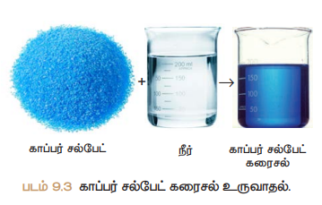

# அறிமுகம் 
கலவைகளைப் பற்றி முந்தைய வகுப்புகளில் அறிந்திருப்பீர்கள். நம் அன்றாட வாழ்வில் பயன்படுத்தும் பெரும்பாலான பொருட்கள் இரண்டு அல்லது அதற்கு மேற்பட்ட பொருட்களின் கலவைகளாகும். கலவையில் காணப்படும் பொருட்கள் ஒன்று அல்லது அதற்கு மேற்பட்ட இயற்பியல் நிலைகளில் காணப்படுகின்றன. எடுத்துக்காட்டாக, நாம் மரக்கட்டையை எரிக்கும் போது அதிலிருந்து வெளியேறும் புகையானது திடக் கார்பன், கார்பன் டைஆக்ஸைடு, கார்பன் மோனாக்ஸைடு மற்றும் சில வாயுக்களைக் கொண்ட கலவைகளாகும். ஒரு சில கலவைகளின் கூறுகளை எளிதாக பிரிக்கலாம். அதே சமயம் ஒரு சில கலவைகளின் கூறுகளை எளிதாக பிரிக்க இயலாது. உப்பும் நீரும் கலந்த கலவையையும், மணலும் நீரும் கலந்த கலவையையும் எடுத்துக்கொள்வோம். இரண்டு கலவைகளிலும் நீரானது பொதுவான கூறாக உள்ளது. முதல் கலவையில் உப்பானது நீரில் கரைகிறது; இரண்டாவது கலவையில் மணலானது நீரில் கரையவில்லை; மணலும் நீரும் கலந்த கலவையை வடிகட்டுதல் முறையின் மூலம் பிரிக்கலாம். ஆனால், உப்பும் நீரும் கலந்த கலவையை அவ்வாறு பிரிக்க இயலாது. ஏனெனில் உப்பு, நீரில் கரைந்து ஒருபடித்தான கரைசலை உருவாக்குகிறது. இத்தகைய ஒருபடித்தான கலவையை கரைசல் என்கிறோம்.

## அன்றாட வாழ்வில் கரைசல்கள் 
கடல் நீரானது இயற்கையில் காணப்படும் கரைசல்களில் ஒன்று. கடல்நீர் இல்லாமல் இப்புவியில் நாம் வாழ்வதை கற்பனை செய்துகூட பார்க்க இயலாது. கடல் நீர் பல உப்புகள் கலந்த ஒருபடித்தான கலவையாகும். அதேபோல் காற்றும் ஒரு கரைசலாகும்.
காற்றானது நைட்ரஜன், ஆக்ஸிஜன், கார்பன் டைஆக்ஸைடு மற்றும் பல வாயுக்கள் கலந்த ஒருபடித்தான கலவையாகும். 
இப்புவியில் வாழும் அனைத்து உயிரினங்களும் கரைசல்களோடு தொடர்பு கொண்டவை. தாவரங்கள் தங்களுக்குத் தேவையான ஊட்டச்சத்துகளை மண்ணிலிருந்து கரைசல் நிலையிலேயே எடுத்துக்கொள்கின்றன. மனித உடலில் உள்ள இரத்தம், நிணநீர், சிறுநீர் போன்ற பெரும்பான்மையானவை கரைசல்களே ஆகும். நம் அன்றாட வாழ்வில் துவைத்தல், சமைத்தல், தூய்மைப்படுத்தல் மற்றும் பல செயல்பாடுகள் நீரோடு இணைந்து கரைசல்களை உருவாக்குகிறது. அதேபோல் நாம் அருந்தும் பழச்சாறு, காற்று நிரப்பப்பட்ட பானங்கள், தேநீர், காபி போன்றவைகளும் கரைசல்களே ஆகும். 

## கரைசலில் உள்ள கூறுகள் 
“கரைசல் என்பது இரண்டு அல்லது அதற்கு மேற்பட்ட பொருட்களைக் கொண்ட ஒருபடித்தான கலவை” என்பதை அறிவோம். அதாவது ஒரு கரைசலில் குறைந்த அளவு (எடை) கொண்ட கூறு, கரைபொருள் என்றும், அதிக அளவு (எடை) கொண்ட கூறு, கரைப்பான் என்றும் அழைக்கப்படுகிறது. கரைபொருளானது கரைப்பானில் முழுவதும் சீராக விரவி கரைந்து ஒருபடித்தான கரைசலை உருவாக்குகிறது. இங்கு கரைப்பான் ஆனது கரைக்கும் ஊடகமாக செயல்படுகிறது. “ஒரு கரைப்பானில் கரைபொருளானது கரைவதை கரைத்தல் என்கிறோம்”. படம் 9.2-இல் ஒரு கரைசல் உருவாகும் விதம் கொடுக்கப்பட்டுள்ளது.

ஒரு கரைசல் குறைந்தபட்சம் இரண்டு கூறுகளைக் கொண்டிருக்கும் (ஒரு கரைபொருள் மற்றும் ஒரு கரைப்பான்).

ஒரு கரைபொருளையும், ஒரு கரைப்பானையும் கொண்டிருக்கும் கரைசல் இருமடிக்கரைசல் (இரு கூறுகள்) எனப்படும். உதாரணமாக, காப்பர் சல்பேட் படிகங்களை நீரில் கரைக்கும் போது, அது கரைந்து காப்பர் சல்பேட் கரைசலை (படம் 9.3-இல் காட்டியுள்ளவாறு) உருவாக்குகிறது. இக்கரைசலானது இரு கூறுகளைக் கொண்டுள்ளது. அதாவது, ஒரு கரைபொருள் -காப்பர் சல்பேட் மற்றும் ஒரு கரைப்பான் -நீர்ஆகியவற்றைக்கொண்டுள்ளது. எனவே, இது இருமடிக்கரைசலாகும். அதேபோல் ஒரு கரைசலானது இரண்டிற்கும் மேற்பட்ட கூறுகளைக் கொண்டிருக்கலாம். உதாரணமாக உப்பை யும், சர்க்கரையையும் நீரில் கரைக்கும் போது இவை நீரில் கரைந்து ஒரு கரைசலை உருவாக்குகிறது. இதில் ஒரு கரைப்பானில் இரு கரைபொருட்கள் கரைக்கப்பட்டுள்ளன. இக்கரைசல் மூன்று கூறுகளைக் கொண்டிருப்பதா ல் இது மும்மடிக்கரைசல் என்று அழைக்கப்படுகிறது.

## கரைசல்களின் வகைகள் 
### கரைபொருள் மற்றும் கரைப்பானின் இயற்பியல் நிலைமையை அடிப்படையாகக் கொண்ட வகைப்பாடு 
பொருள்கள் பொதுவாக மூன்று இயற்பியல் நிலைகளில் (நிலைமை) காணப்படுகிறது. அவைகள் திண்மம், திரவம் மற்றும் வாயு. இருமடிக்கரைசலில் உள்ள கரைபொருள் மற்றும் கரைப்பான் கீழ்க்கண்ட ஏதேனும் ஒரு இயற்பியல் நிலையில் காணப்படுகிறது. ஆனால் ஒரு கரைசலில் கரைப்பானின் பங்கு பெரும்பான்மையானது. அதனுடைய இயற்பியல் நிலையானது, கரைசல்களின் பண்புகளை தீர்மானிப்பதில் முக்கிய காரணியாக விளங்குகிறது. பல்வேறு வகையான இருமடிக்கரைசல்களை அட்டவணை 9.1 -இல் காணலாம்.

|கரைபொருள்| கரைப்பான்| உதாரணம்|
|------------|------------|-------------|
**திண்மக் கரைசல்**
|திண்மம் |திண்மம் |தங்கத்தில் கரைக்கப்பட்ட காப்பர் (உலோகக் கலவைகள்).|
|திரவம்| திண்மம்| பாதரசத்துடன் கலந்த சோடியம் (இரசக்கலவைகள்).|
**திரவக் கரைசல்**
|திண்மம்| திரவம்| நீரில் கரைக்கப்பட்ட சோடியம் குளோரைடு கரைசல்.|
|திரவம்| திரவம்| நீரில் கரைக்கப்பட்ட எத்தில் ஆல்கஹால்.|
|வாயு| திரவம்| நீரில் கரைக்கப்பட்ட கார்பன் டைஆக்ஸைடு (சோடா நீர்)|
**வாயுக் கரைசல்**
|திரவம்| வாயு| காற்றில் உள்ள நீராவி (மேகம்).|
|வாயு| வாயு| ஆக்ஸிஜன் – ஹீலியம் வாயுக்கலவை|

### கரைப்பானின் தன்மையை 
**அடிப்படையாகக் கொண்ட வகைப்பாடு** 
நீரில் பெரும்பாலான பொருட்கள் கரைகிறது. எனவே நீர் ஒரு 'உலகளாவிய கரைப்பான்’ அல்லது ’சர்வக்கரைப்பான்’ என்று அழைக்கப்படுகிறது. இருப்பினும் சில பொருட்கள் நீரில் கரைவதில்லை. இவற்றைக் கரைக்க ஈதர்கள், பென்சீன், ஆல்கஹால்கள் போன்ற கரைப்பான்களைப் பயன்படுத்தி கரைசல்கள் தயாரிக்கப்படுகிறது. கரைப்பானின் வகைகளை அடிப்படையாகக் கொண்டு கரைசல்களை இரண்டு வகைகளாகப் பிரிக்கலாம். அவைகளாவன: நீர்க்கரைசல் மற்றும் நீரற்ற கரைசல். 
**அ) நீர்க்கரைசல்** 
எந்த ஒரு கரைசலில், கரைபொருளைக் கரைக்கும் கரைப்பானாக நீர் செயல்படுகிறதோ அக்கரைசல் நீர்க்கரைசல் எனப்படும். உதாரணமாக நீரில் கரைக்கப்பட்ட சர்க்கரை, நீரில் கரைக்கப்பட்ட காப்பர் சல்பேட் போன்றவைகளாகும். 

**ஆ) நீரற்ற கரைசல்** 
எந்த ஒரு கரைசலில் நீரைத் தவிர, பிற திரவங்கள் கரைப்பானாக செயல்படுகிறதோ அக்கரைசல் நீரற்ற கரைசல் என அழைக்கப்படுகிறது. நீரைத் தவிர பிற கரைப்பான்களை நீரற்ற கரைப்பான்கள் என அழைக்கிறோம். பொதுவாக ஆல்கஹால்கள், பென்சீன், ஈதர்கள், கார்பன் டைசல்பைடு போன்றவை நீரற்ற கரைப்பான்களாக பயன்படுத்தப்படுகின்றன. உதாரணமாக கார்பன் டைசல்பைடில் கரைக்கப்ப ட்ட சல்பர், கார்பன் டெட்ரா குளோரைடில் கரைக்கப்பட்ட அயோடின்.

### கரைபொருளின் அளவை அடிப்படையாகக் கொண்ட வகைப்பாடு
 குறிப்பிட்ட சூழ்நிலைகளில், குறிப்பிட்ட அளவு கரைப்பானில் குறிப்பிட்ட அளவு கரைபொருள் கரைகிறது. கரைப்பானில் உள்ள கரைபொருளின் அளவைப் பொருத்து கரைசல்களை கீழ்க்கண்டவாறு வகைப்படுத்தலாம். 
(i)	தெவிட்டிய கரைசல் 
(ii)தெவிட்டாத கரைசல் 
(iii)அதிதெவிட்டிய கரைசல்

(i)	**தெவிட்டிய கரைசல்**
ஒரு குறிப்பிட்ட வெப்பநிலையில் எந்த ஒரு கரைசலில், மேலும் கரைபொருளை கரைக்க இயலாதோ, அக்கரைசல் தெவிட்டிய கரைசல் எனப்ப டும். உதாரணமாக 25°C வெப்பநிலையில் 100 கி நீரில், 36 கி சோடியம் குளோரைடு உப்பினைக் கரைத்து தெவிட்டிய கரைசல் உருவாக்கப்படுகிறது. மேலும் கரைபொருளைச் சேர்க்கும் போது அது கரையாமல் முகவையின் அடியில் தங்கிவிடுகிறது. 

(ii)	**தெவிட்டாத கரைசல்** 
ஒரு குறிப்பிட்ட வெப்பநிலையில், தெவிட்டிய கரைசலில் கரைந்துள்ள கரைபொருளின் அளவை விடக் குறைவான கரைபொருள் அளவைக் கொண்ட கரைசல் தெவிட்டாத கரைசல் ஆகும். உதாரணமாக 25°C வெப்பநிலையில் 100 கி நீரில், 10 கி அல்லது 20 கி அல்லது 30 கி சோடியம் குளோரைடு உப்பினைக் கரைத்து தெவிட்டாத கரைசல் உருவாக்கப்படுகிறது.
 
(iii)	**அதிதெவிட்டிய கரைசல்** 
 ஒரு குறிப்பிட்ட வெப்பநிலையில், தெவிட்டிய கரைசலில் உள்ளகரைபொருளின்அளவைக்காட்டிலும் அதிகமான கரைபொருளைக் கொண்ட கரைசல் அதிதெவிட்டிய கரைசல் எனப்படும். உதாரணமாக 25°C வெப்பநிலையில் 100 கி நீரில், 40 கி சோடியம் குளோரைடு உப்பினை கரைத்து அதிதெவிட்டிய கரைசல் உருவாக்கப்படுகிறது. வெப்பநிலை, அழுத்தம் போன்ற சூழ்நிலைகளை மாற்றுவதன் மூலம் கரைதிறனை மாற்ற இயலும். அதிதெவிட்டிய கரைசலானது நிலையற்றது. கரைசல் உள்ள முகவையைச் சிறிதளவு அசைத்தாலும் மீண்டும் படிகங்கள் தோன்றுகிறது.

### செறிவுமிக்க மற்றும் நீர்த்த கரைசல்கள் 
இது தெவிட்டாத கரைசல்களின் ஒரு வகைப்பாடாகும். இவ்வகைப்பாடு ஒரே அளவு கரைப்பானில் வெவ்வேறு அளவு கரைபொருளை கொண்ட இரு கரைசல்களின் ஒப்பீட்டு செறிவைக் குறிக்கிறது. உதாரணமாக, உன்னிடம் இரண்டு குவளைகள் தேநீர் கொடுக்கப்பட் டுள்ளது. இரண்டு குவளை தேநீரையும் நீ அருந்துகிறாய்; அதில் ஒன்று மற்றொன்றை விட அதிக இனிப்பாக இருப்பதை உணர்கிறாய் எனில், இதிலிருந்து நீ என்ன அறிகிறாய்? எந்தக் குவளை தேநீர், அதிகமாக இனிக்கிறதோ அது மற்றொன்றை விட சர்க்கரை அதிமாகக் கலந்துள்ளது என்பதை அறிவாய். உனது உற்று நோக்கலைஎவ்வாறு வெளிப்படுத்துவாய்? சர்க்கரை அதிகமாக உள்ள தேநீரானது திடமானது என்று கூறுவோம். ஆனால், ஒரு வேதியியலாளர் இதனைச் ’செறிவு மிகுந்தது’ என்று கூறுவர். 

ஒரே மாதிரியான கரைபொருளையும், கரைப்பானையும் கொண்டஇரு கரைசல்களை ஒப்பிடும் போது, எதில் அதிக அளவு கரைபொருள் உள்ளதோ (குறிப்பிட்ட அளவு கரைப்பானில்) அதனை செறிவுமிக்க கரைசல் என்றும், எதில் குறைந்த அளவு கரைபொருள் உள்ளதோ அதனை நீர்த்த கரைசல் என்றும் கூறலாம். இதனை படம் 9.5 இன் மூலம் அறியலாம்.

கரைசல்களை, நீர்த்த மற்றும் செறிவுமிக்க கரைசல்கள் என வேறுபடுத்துவது ஒரு பண்பு சார்ந்த குறியீடாகும். இது கரைசலில் கரைந்துள்ள கரைபொருளின் துல்லியமான அளவைக் குறிப்பதில்லை. இந்த வேறுபாடானது நிறம், அடர்த்தி போன்ற இயற்பியல் பண்புகள் மூலம் அறியப்படுகின்றன.

## கரைதிறன் 
ஒரு குறிப்பிட்ட வெப்பநிலையில், குறிப்பிட்ட அளவு கரைப்பானில் கரையக்கூடிய கரைபொருளின் அளவிற்கு ஒர் எல்லை உண்டு (குறிப்பிட்ட அளவே கரையும்). இந்த எல்லையை அடையும் போது தெவிட்டிய கரைசல் உருவாகிறது. மேலும் கூடுதலாக சேர்க்கப்படும் கரைபொருளானது கரையாமல் கரைசலின் அடியில் தங்கிவிடுகிறது. ஒரு கரைப்பானில் கரையக்கூடிய கரைபொருளின் அளவை கரைதிறன் என்ற பண்பினால் விளக்க முடியும். கரைதிறன் என்பது எவ்வளவு கரைபொருள் குறிப்பிட்ட அளவு கரைப்பானில் கரையும் என்பதற்கான அளவீடாகும். 
ஒரு குறிப்பிட்ட வெப்பநிலை மற்றும் அழுத்தத்தில் 100 கி கரைப்பானில் கரைந்து தெவிட்டிய கரைசலை உருவாக்க தேவையான கரைபொருளின் கிராம்களின் எண்ணிக்கை அதன் கரைதிறன் எனப்படும். உதாரணமாக 25°C ல் 100  கி நீரில், 36 கி சோடியம் குளோரைடு கரைந்து தெவிட்டிய கரைசலை உருவாக்குகிறது. 
கரைதிறன் என்பதை பின்வரும் சமன்பாட்டை கொண்டு கணக்கிடலாம். 

கரைதிறன் = கரைபொருளின் நிறை/ கரைப்பானின் நிறை × 100 	

**அட்டவணை 9.2** 25°C ல் 100 கி நீரில் பல்வேறு கரைபொருள்களின் கரைதிறன் கொடுக்கப்பட்டுள்ளது.

|கரைபொருளின் பெயர்|கரைபொருளின் வாய்ப்பாடு|கரைதிறன் கி / 100 கி நீரில்|
|--------|-------|---------|
|கால்சியம் கார்பனேட்| CaCO~3(திண்மம்)~ |0.0013|
|சோடியம் குளோரைடு|NaCl~(திண்மம்)~ |36| 
|அம்மோனியா |NH~3(வாயு)~ |48|
|சோடியம் ஹைட்ராக்ஸைடு| NaOH~(திண்மம்)~ |80|
|குளுக்கோஸ்| C~6~H~12~O~6(திண்மம்)~| 91|
|சோடியம் புரோமைடு|NaBr~(திண்மம்)~| 95| 
|சோடியம் அயோடைடு|NaI~(திண்மம்)~| 184|

### கரைதிறனை பாதிக்கும் காரணிகள் 
ஒரு கரைபொருளின் கரைதிறனை மூன்று முக்கிய காரணிகள் தீர்மானிக்கின்றன. அவைகளாவன. 
(1) கரைபொருள் மற்றும் கரைப்பானின் தன்மை 
(2) வெப்பநிலை 
(3) அழுத்தம் 

(1)	**கரைபொருள் மற்றும் கரைப்பானின் தன்மை**

கரைதிறனில், கரைப்பான் மற்றும் கரைபொருளின் தன்மை முக்கிய பங்கு வகிக்கிறது. நீர் பெரும்பான்மையான பொருட்களை கரைக்கும் தன்மையை கொண்டிருந்தாலும், சில பொருள்கள் நீரில் கரைவதில்லை. இதனையே வேதியியலாளர்கள் கரைதிறனை பற்றிக் குறிப்பிடும் போது “**ஒத்த கரைபொருட்கள் ஒத்த கரைப்பானில் கரைகிறது**” (Like dissolves like) என்கின்றனர். கரைபொருளுக்கும் கரைப்பானுக்கும் இடையே ஒற்றுமை காணப்படும் போது தான் கரைதல் நிகழ்கிறது. உதாரணமாக, சமையல் உப்பு முனைவுறும் சேர்மம் எனவே இது முனைவுறும் கரைப்பானான நீரில் எளிதில் கரைகிறது. 
அதுபோலவே முனைவுறாச் சேர்மங்கள் முனைவுறா கரைப்பானில் எளிதில் கரைகிறது. உதாரணமாக, ஈதரில் கரைக்கப்பட்ட கொழுப்பு. ஆனால், முனைவுறாச் சேர்மங்கள் முனைவுறும் கரைப்பானில் கரைவதில்லை. அதுபோல முனைவுறும் சேர்மங்கள் முனைவுறா கரைப்பானில் கரைவதில்லை. 

(2) **வெப்பநிலை** 

i)	**திரவத்தில் திண்மங்களின் கரைதிறன்** 
பொதுவாக வெப்பநிலை அதிகரிக்கும் போது நீர்ம கரைப்பானில் திண்மப் பொருளின் கரைதிறன் அதிகரிக்கிறது. உதாரணமாக, குளிர்ந்த நீரில் கரைவதை விட சர்க்கரை, சுடுநீரில் அதிக அளவில் கரைகிறது. வெப்பக்கொள் செயல்முறையில், வெப்பநிலை அதிகரிக்கும் போது கரைதிறன் அதிகரிக்கிறது. வெப்பஉமிழ் செயல்முறையில், வெப்பநிலை அதிகரிக்கும் போது கரைதிறன் குறைகிறது. 
ii)	**திரவத்தில் வாயுக்களின் கரைதிறன்** 
நீரை வெப்பப்படுத்தும் போது குமிழிகள் வருகின்றன; ஏன்? திரவத்தின் வெப்பநிலையை அதிகரிக்கும் போது வாயுவின் கரைதிறன் குறைகிறது. ஆகையால் ஆக்ஸிஜன் குமிழிகளாக வெளியேறுகிறது.
நீர்வாழ் உயிரினங்கள் குளிர் பிரதேசங்களில் அதிகமாக வாழ்கின்றன. குளிர் பிரதேசங்களில் உள்ள நீர்நிலைகளில் அதிக அளவு ஆக்ஸிஜன் கரைந்துள்ளது. ஏனெனில், வெப்பநிலை குறையும் போது ஆக்ஸிஜனின் கரைதிறன் அதிகரிக்கிறது. 

(3)	**அழுத்தம்**

வாயுக்களை கரைபொருளாக கொண்ட திரவ கரைசல்களில் மட்டுமே அழுத்தத்தின் விளைவு குறிப்பிடதக்கதாக இருக்கும். அழுத்தத்தை அதிகரிக்கும் போது ஒரு திரவத்தில் வாயுவின் கரைதிறன் அதிகரிக்கிறது. 
வாயுக்களை கரைபொருளாக கொண்ட திரவ கரைசல்களுக்கு சில எடுத்துக்காட்டுகள் குளிர்பானங்கள், வீட்டு உபயோக அம்மோனியா, பார்மலின் போன்றவைகள்.

## கரைசலின் செறிவு 
**கரைசல் என்றால் என்ன என்பதையும், கரைசலில் உள்ள கூறுகள் மற்றும் அதன் வகைகளையும் விவாதித்தோம். பெரும்பாலான வேதிவினைகள் கரைசல் நிலையிலேயே நிகழ்கின்றன. எனவே, அத்தகைய கரைசல்களில் கரைப்பானில் கரைந்துள்ள கரைபொருளின் சரியான அளவை அறிந்து கொள்வதன் மூலம் அதில் நிகழும் விளைவுகளை நன்கு ஆராய இயலும். கரைசலில் உள்ள கரைபொருளின் சரியான அளவினை குறிப்பதற்கு நாம் செறிவு என்ற பதத்தை பயன்படுத்துகிறோம்.

**கரைசலின் செறிவு** என்பது ”கொடுக்கப்பட்ட கரைசலில் அல்லது கரைப்பானில் கரைந்துள்ள கரைபொருளின் அளவு” என வரையறுக்கப்படுகிறது. 
கரைசலின் செறிவினை அளவிட பல்வேறு முறைகள் உள்ளன. நாம் இங்கு நிறை சதவீதம் மற்றும் கனஅளவு சதவீதம் ஆகியவற்றை பயன்படுத்தி ஒரு கரைசலின் செறிவினை எவ்வாறு கணக்கிடலாம் என்பதைக் காண்போம். 

### நிறை சதவீதம் 
நிறை சதவீதம் என்பது ஒரு கரைசலில் உள்ள கரைபொருளின் நிறையை சதவீத்தில் குறித்தால் அது அக்கரைசலின் நிறை சதவீதம் எனப்படும். இது திண்ம கரைபொருளையும், திரவக் கரைப்பானையும் கொண்ட கரைசலின்செறிவை குறிக்கபயன்படுகிறது.

நிறை சதவீதம் = கரைபொருளின் நிறை/ கரைசலின் நிறை × 100 

நிறை சதவீதம் = கரைபொருளின் நிறை /(கரைபொருளின் நிறை + கரைப்பானின் நிறை)  × 100 

உதாரணமாக, 5% சர்க்கரைக் கரைசல் என்பது 5 கி சர்க்கரையை, 95 கி நீரில் கரைத்து கிடைக்கும் கரைசல் ஆகும். 

கரைசலின் மொத்த நிறை 100 கி ஆகும். வழக்கமாக நிறை சதவீதம் என்பது w/w என குறிக்கப்படுகிறது. இது வெப்பநிலையைச் சார்ந்தது அல்ல. 

### கனஅளவு சதவீதம் 
கனஅளவு சதவீதம் என்பது ஒரு கரைசலில் உள்ள கரைபொருளின் கனஅளவை சதவீதத்தில் குறித்தால் அது அக்கரைசலின் கனஅளவு சதவீதம் என வரையறுக்கப்படுகிறது. இது திரவக் கரைபொருள் மற்றும் திரவக் கரைப்பானைக் கொண்ட கரைசல்களின் செறிவைக் குறிக்க பயன்படுகிறது. 

கனஅளவு சதவீதம் = கரைபொருளின் கனஅளவு / கரைசலின் கனஅளவு × 100 

கனஅளவு சதவீதம் = கரைபொருளின் கனஅளவு / (கரைபொருளின் கனஅளவு + கரைப்பானின் கனஅளவு)  × 100  

உதாரணமாக, 10% கனஅளவு எத்தனால் நீர்க்கரைசல் என்பது 10 மி.லி எத்தனாலை 90 மி.லி நீரில் கரைத்து பெறப்படும் கரைசலை குறிக்கிறது. 

பொதுவாக கனஅளவு சதவீதம் என்பது v/v என குறிக்கப்படுகிறது. கனஅளவு சதவீதம் வெப்பநிலை அதிகரிக்கும் போது குறைகிறது. ஏனெனில், திரவங்கள் வெப்பத்தால் விரிவடையும். 

அன்றாட வாழ்வில் நாம் பயன்படுத்தக்கூடிய திரவ மருந்துகள் (Syrup), வாய்கழுவும் திரவங்கள் (Mouth wash), புரைத் தடுப்பான்கள் (Antiseptic), வீட்டு உபயோகப் பொருட்கள், கிருமிநாசினிகள் போன்ற கரைசல்களில் உள்ள கரைபொருளின் அளவுகள் v/v என்ற பதத்தால் குறிப்பிடப்படுகிறது. அதேபோல் களிம்புகள் (Ointment), அமிலநீக்கிகள், சோப்புகள் போன்றவற்றில் உள்ள கரைசல்களின் செறிவுகள் w/w என்று குறிப்பிடப்படுகிறது.

## நீரேறிய உப்புகள் மற்றும் படிகமாக்கல் நீர் 
அயனிச் சேர்மங்களை நீரில் கரைத்து தெவிட்டிய கரைசலை உருவாக்கும் போது, அவற்றின் அயனிகள் நீர் மூலக்கூறுகளைக் கவர்ந்து, குறிப்பிட்ட வேதி விகிதத்தில் பிணைப்பினை ஏற்படுத்திக் கொள்கின்றன. இந்நிகழ்வு நீரேற்றம் எனப்படும். இந்த அயனிச் சேர்மங்கள் அவற்றின் தெவிட்டிய கரைசலில் இருந்து குறிப்பிட்ட எண்ணிக்கையிலான நீர் மூலக்கூறுகளுடன் சேர்ந்து படிகமாகிறது. இந்தப் படிகங்களுடன் காணப்படும், நீர் மூலக்கூறுகளின் எண்ணிக்கையே படிகமாக்கல் நீர் எனப்படும். அத்தகைய படிகங்கள் நீரேறிய உப்புகள் எனப்படும்.

இப்படிக உப்புகளை வெப்பப்ப டுத்தும் போது, அவை படிகமாக்கல் நீரை இழந்து படிக உருவற்றதாக மாறுகின்றன மற்றும் நிறத்தை இழக்கின்றன (அவை நிறமுள்ள உப்புகளாக இருந்தால்). சில பொதுவான நீரேறிய உப்புகள் அட்டவணை 9.3-இல் கொடுக்்கப்பட்டுள்ளது.

**அட்டவணை 9.3** நீரேறிய உப்புகள்

|பொதுப்பெயர் |IUPAC பெயர்| மூலக்கூறு வாய்ப்பாடு|
|--------------|--------------|---------------------|
|நீல விட்ரியால் (மயில் துத்தம்)|காப்பர் (ll) சல்பேட்பென்டாஹைட்ரேட்|CuSO~4~.5H~2~O|
|எப்சம் உப்பு| மெக்னீசியம் சல்பேட் ஹெப்டாஹைட்ரேட்|MgSO~4~.7H~2~O|
|ஜிப்சம்| கால்சியம் சல்பேட் டைஹைட்ரேட்|CaSO4.2H2O|
|பச்சை|விட்ரியால்இரும்பு (ll) சல்பேட்ஹெப்டாஹைட்ரேட்|FeSO~4~.7H~2~O|
|வெள்ளை|விட்ரியால் சிங் சல்பேட் ஹெப்டாஹைட்ரேட்|ZnSO~4~.7H~2~O|

### காப்பர் சல்பேட் பென்டாஹைட்ரேட் CuSO~4~ .5H~2~O (நீல விட்ரியால் அல்லது மயில்துத்தம்) 
நீல விட்ரியால் உப்பில் ஐந்து நீர் மூலக்கூறுகள் உள்ளன. இதன் படிகமாக்கல் நீர் மூலக்கூறுகளின் எண்ணிக்கை ஐந்து. நீலநிற காப்பர் சல்பேட் பென்டாஹைட்ரேட் படிகத்தை மெதுவாக வெப்பப்படுத்தும் போது, ஐந்து நீர் மூலக்கூறுகளை இழந்து நிறமற்ற, நீரற்ற காப்பர் சல்பேட் ஆக மாறுகிறது.

நிறமற்ற, நீரற்ற காப்பர் சல்பேட் உப்பில் சில துளி நீரினைச் சேர்க்கும் போது அல்லது குளிர்விக்கும் போது உப்பானது மீண்டும் நீல நிற நீரேறிய உப்பாக மாறுகிறது.

### மெக்னீசியம் சல்பேட் ஹெப்டாஹைட்ரேட் MgSO~4~ .7H~2~O (எப்சம் உப்பு) 
எப்சம் உப்பின் படிகமாக்கல் நீர் மூலக்கூறுகளின் எண்ணிக்கை ஏழு. மெக்னீசியம் சல்பேட் ஹெப்டா ஹைட்ரேட் படிகத்தை மெதுவாக வெப்பப்படுத்தும் போது ஏழு நீர் மூலக்கூறுகளை இழந்து நீரற்ற மெக்னீசியம் சல்பேட்டாக மாறுகிறது.

நீரற்ற மெக்னீசியம் சல்பேட்டில் சில துளி நீரைச் சேர்க்கும் பொழுது அல்லது குளிர்விக்கும் பொழுது உப்பானது மீண்டும் நீரேறிய உப்பாக மாறுகிறது.

## ஈரம் உறிஞ்சுதல் 
சில சேர்மங்கள் சாதாரண வெப்பநிலையில், வளிமண்டலக் காற்றுடன் தொடர்பு கொள்ளும் போது அதிலுள்ள ஈரத்தை உறிஞ்சும் தன்மையைப் பெற்றுள்ளன. இந்நிகழ்வின் போது அவற்றின் இயற்பியல் நிலை மாறுவதில்லை. இத்தகைய சேர்மங்கள் ஈரம் உறிஞ்சும் சேர்மங்கள் அல்லது ஈரம் கவரும் சேர்மங்கள் எனப்படுகின்றன. இப்பண்பிற்கு ஈரம் உறிஞ்சுதல் என்று பெயர். 
ஈரம் உறிஞ்சும் சேர்மங்கள் உலர்த்தும் பொருளாக பயன்படுத்தப்படுகின்றன. உதாரணங்கள் 
1. அடர் சல்பியூரிக் அமிலம் (H~2~SO~4). 
2. பாஸ்பரஸ் பெண்டாக்ஸைடு (P~2~O~5~). 
3. சுட்ட சுண்ணாம்பு (CaO). 
4. சிலிக்கா ஜெல் (SiO~2~).

## ஈரம் உறிஞ்சிக் கரைதல் 
சில சேர்மங்கள் சாதாரண வெப்பநிலையில், வளிமண்டலக் காற்றுடன் தொடர்பு கொள்ளும் போது அதிலுள்ள ஈரத்தை உறிஞ்சி முழுவதும் கரைகின்றன. அத்தகைய சேர்மங்கள் ஈரம் உறிஞ்சிக் கரையும் சேர்மங்கள் எனப்ப டும். இப்பண்பிற்கு ஈரம் உறிஞ்சிக் கரைதல் என்று பெயர். 
ஈரம் உறிஞ்சிக் கரையும் சேர்மங்கள் அவற்றின் படிகப் பண்பை இழக்கின்றன. அவை, முழுமையாக கரைந்து தெவிட்டியக்கரைசலைஉருவாக்குகின்றன. ஈரம் உறிஞ்சிக் கரைதல் அதிகமாக நிகழும் இருக்கும் சூழ்நிலைகள் 
1) குறைந்த வெப்பநிலை. 
2) அதிக வளிமண்டல ஈரப்பதம். 
உதாரணமாக, சோடியம் ஹைட்ராக்ஸைடு (NaOH), பொட்டாசியம் ஹைட்ராக்ஸைடு (KOH), மற்றும் ஃபெர்ரிக் குளோரைடு (FeCl~3~).

**அட்டவணை 9.4**ஈரம் உறிஞ்சும் சேர்மங்களுக்கும், ஈரம் உறிஞ்சிக் கரையும் 
சேர்மங்களுக்கும் இடையேயான வேறுபாடுகள

|ஈரம் உறிஞ்சும் சேர்மங்கள் |ஈரம் உறிஞ்சிக் கரையும் சேர்மங்கள்|
|----------------------------|--------------------------------------|
|சாதாரண வெப்பநிலையில், வளிமண்டலக் காற்றுடன் தொடர்பு கொள்ளும் போது அதிலுள்ள ஈரத்தை உறிஞ்சுகிறது. ஆனால் கரைவதில்லை.|சாதாரண வெப்பநிலையில், வளிமண்டலக் காற்றுடன் தொடர்பு கொள்ளும் போது அதிலுள்ள ஈரத்தை உறிஞ்சிக் கரைகிறது.|
|வளிமண்டலக் காற்றுடன் தொடர்பு கொள்ளும் போது தன்னுடைய இயற்பியல் நிலையை இழப்பதில்லை.|வளிமண்டலக் காற்றுடன் தொடர்பு கொள்ளும் போது தன்னுடைய இயற்பியல் நிலையை இழக்கிறது.|
|இவை படிக திண்மங்களாக மட்டுமே காணப்படுகின்றன.|படிக உருவற்ற திண்மங்களாகவோ, திரவங்களாகவோ காணப்படுகின்றன.|

## கரைதிறன், நிறை சதவீத மற்றும் கனஅளவு சதவீத கணக்குகள். 
**I. கரைதிறனை அடிப்படையாகக் கொ ண்ட கணக்குகள்.**

1) 298 K வெப்ப நிலையில் 15 கி நீரில், 1.5 கி கரைபொருளை கரைத்து ஒரு தெவிட்டிய கரைசல் தயாரிக்கப்படுகிறது. அதே வெப்ப நிலையில் கரைபொருளின் கரைதிறனைக் கண்டறிக. 

**தீர்வு:**  கரைப்பானின் நிறை = 15 கி 
கரைபொருளின் நிறை = 1.5 கி 
கரைபொருளின் கரைதிறன் = கரைபொருளின் நிறை / கரைப்பானின் நிறை × 100 

கரைபொருளின் கரைதிறன் = 1.5 / 15 × 100 
= 10 கி 

2) 303 K வெப்பநிலையில் 60 கி நீரில் எவ்வளவு நிறையுள்ள பொட்டாசியம் குளோரைடு கரைந்து தெவிட்டிய கரைசலை உருவாக் கும்? அதே வெப்பநிலையில் பொட்டாசியம் குளோரைடின் கரைதிறன் 37/100 எனக் கொடுக்கப்பட்டுள்ளது. 

**தீர்வு:**  100 கி நீரில் கரைந்து தெவிட்டிய கரைசலை உருவாக்கத் தேவையான பொட்டாசியம் 
குளோரைடின் நிறை = 37 கி 
60 கி நீரில் கரைந்து தெவிட்டிய 

கரைசலை உருவாக்கத் தேவைப்படும் பொட்டாசியம் குளோரைடின் நிறை = 37 / 100  × 60  = 22.2 கி 

3) 30°C வெப்ப நிலையில் 50கி நீரில் கரைந்து தெவிட்டிய கரைசலை உருவாக்கத் தேவையான சோடியம் குளோரைடின் நிறை என்ன? 30°C வெப்பநிலையில் சோடியம் குளோரைடின் கரைதிறன் 36 கி. 

**தீர்வு:**  
30°C வெப்பநிலையில், 100 கி நீரில் கரையும் சோடியம் குளோரைடு = 36 கி 
ஃ 100 கி நீரில் தெவிட்டிய கரைசலை உருவாக்கத் தேவையான சோடியம் குளோரைடின் நிறை = 36 கி 
∴ 50 கி நீரில் தெவிட்டிய கரைசலை உருவாக்கத் தேவைப்படும் சோடியம் குளோரைடின் நிறை = 36 × 50  / 100 = 18 கி 

4) 50°C மற்றும் 30°C வெப்ப நிலையில் சோடியம் நைட்ரேட்டின் கரைதிறன் முறையே 114 கி மற்றும் 96 கி. 50 கி நீரில் உருவான தெவிட்டியக் கரைசலை 50°C ல் இருந்து 30°C வெப்பநிலைக்கு குளிரூட்டும் போது கரைசலில் இருந்து வெளியேற்றப்படும் அல்லது வீழ்படிவாகும் சோடியம் நைட்ரேட் உப்பின் நிறையைக் காண்க. 

**தீர்வு:**  50°C வெப்பநிலையில் 100 கி நீரில் கரையும் சோடியம் நைட்ரேட்டின் நிறை 114 க
∴ 50°C வெப்பநிலையில் 50 கி நீரில் கரையும் சோடியம் நைட்ரேட்டின் நிறை = 114×50 / 100 = 57 கி 

அதே போல் 30°C வெப்பநிலையில் 50 கி நீரில் கரையும் சோடியம் நைட்ரேட்டின் நிறை = 96 × 50  / 100 = 48 கி 

50°C ல் இருந்து 30°C வெப்பநிலைக்கு குளிரூட்டும் போது 50 கி நீரைக் கொண்டு உருவான தெவிட்டிய கரைசலில் இருந்து வெளியேற்றப்ப டும் அல்லது வீழ்படிவாகும் சோடியம் நைட்ரேட்டின் நிறை = 57 – 48 = 9 கி 

**II. நிறை சதவீதத்தை அடிப்படையாகக் கொண்ட கணக்குகள்.**

1)	100 கி நீரில் 25 கி சர்க்கரையைக் கரைத்து ஒரு கரைசல் தயாரிக்கப்படுகிறது. அதன் கரைபொருளின், நிறை சதவீதத்தைக் காண்க. 

**தீர்வு:** 
கரைபொருளின் நிறை = 25 கி 
கரைப்பானின் நிறை = 100 கி 
நிறை சதவீதம் = கரைபொருளின் நிறை / கரைசலின் நிறை × 100 

நிறை சதவீதம் = கரைபொருளின் நிறை / (கரைபொருளின் நிறை + கரைப்பானின் நிறை)  × 100  
= 25 / 25 + 100  × 100 
= 25 / 125 × 100  = 20% 

2)	25°C வெப்ப நிலையில் 100 கி நீரில், 16 கி சோடியம் ஹைட்ராக்ஸைடு கரைக்கப்ப டுகிறது. கரைபொருள் மற்றும் கரைப்பா னின் நிறை சதவீதத்தைக் காண்க. 
**தீர்வு:**  
கரைபொருளின் நிறை (NaOH) = 16 கி 
கரைப்பானின் நிறை (H2O) = 100 கி 
(i)	கரைபொருளின் நிறை சதவீதம் 
நிறை சதவீதம் = கரைபொருளின் நிறை / (கரைபொருளின் நிறை + கரைப்பானின் நிறை)  × 100 = 16 × 100 / 16 + 100 = 1600 / 116 
கரைபொருளின் நிறை சதவீதம் = 13.79% 

(ii) கரைப்பானின் நிறை சதவீதம் = 
100– (கரைபொருளின் நிறை சதவீதம்) 
= 100 – 13.79 
= 86.21% 

3)	500 கி கரைசலில் 10% (w/w); யூரியா நீர்க் கரைசலைப் பெறத் தேவையான யூரியாவின் நிறையை கணக்கிடுக. 
**தீர்வு:**  
நிறை சதவீதம் = கரைபொருளின் நிறை / கரைசலின் நிறை × 100 
10 = யூரியாவின் நிறை / 500 × 100  
யூரியாவின் நிறை = 10 × 500 / 100 
தேவையான யூரியாவின் நிறை = 50 கி 

**(iii) கனஅளவு சதவீதத்தை அடிப்படையாகக் கொண்ட கணக்குகள்.**

1)	35 மி.லி மெத்தனால் 65 மி.லி நீருடன் சேர்க்கப்பட்டு ஒரு கரைசல் தயாரிக்கப்படுகிறது. கரைசலின் கனஅளவு சதவீதத்தைக் காண்க. 
**தீர்வு:** 
மெத்தனாலின் கனஅளவு = 35 மி.லி 
நீரின் கனஅளவு= 65 மி.லி 
கனஅளவு சதவீதம் = கரைபொருளின் கனஅளவு / கரைசலின் கனஅளவு × 100 
கனஅளவு சதவீதம் = கரைபொருளின்கனஅளவு / (கரைபொருளின் கனஅளவு + கரைப்பானின் கனஅளவு)× 100  
கனஅளவு சதவீதம் = 35 / 35+65 × 100 
கனஅளவு சதவீதம் = 35 / 100 × 100  = 35%

2)	200 மி.லி, 20% (v/v) எத்தனால்-நீர்க்கரைசலில் உள்ள எத்தனாலின் கனஅளவைக் கணக்கிடுக. 
**தீர்வு:** 
எத்தனால் நீர்க்கரைசலின் கனஅளவு = 200 மி.லி 
கனஅளவு சதவீதம் = 20% 
கனஅளவு சதவீதம் = கரைபொருளின் கனஅளவு  / கரைசலின் கனஅளவு × 100 
20 = எத்தனாலின் கனஅளவு / 200 × 100 
எத்தனாலின் கனஅளவு = 20 × 200 = 40 மி. லி

**நினைவில் கொள்க** 
- இரண்டு அல்லது அதற்கு மேற்பட்ட பொருட்களின் ஒரு படித்தான கலவை கரைசல் எனப்படும். 
- நீர்க் கரைசல்களில் நீரானது கரைப்பானாக செயல்படுகிறது. 
- நீரற்ற கரை சல்களில் நீரை த் தவிர மற்றவை கரைப்பானாக செயல்படுகிறது. - ஒரு குறிப்பிட்ட வெப்ப நிலையில் எந்த ஒரு கரைசலில், மேலும் கரைபொருளை கரை க்க முடியாதோ, அக்கரைசல் தெவிட்டிய கரைசல் எனப்படும். 
- குறிப்பிட்ட வெப்ப நிலையில், தெவிட்டிய கரைசலில் கரைந் துள்ள கரைபொருளின் அளவை விடக் குறைவான கரைபொருள் அளவைக் கொண்ட கரை சல் தெவிட்டாத கரைசல் ஆகும் . - குறிப்பிட்ட வெப்ப நிலையில், தெவிட்டிய கரைசலில் உள்ள கரைபொருளின் அளவைக் காட்டிலும் அதிகமான கரைபொருளைக் கொண்ட கரைசல் அதி தெவிட்டிய கரைசல் எனப்படும். - முனைவுறும் சேர்மங்கள் முனைவுறும் கரைப்பானில் கரைகிறது. 
- முனைவுறாச் சேர்மங்கள் முனைவுறாக் கரைப்பானில் கரைகிறது.
- வெப்பம் கொள் செயல்முறையில் வெப்ப நிலை அதிகரிக்கும் போது கரை திறன் அதிகரிக்கிறது. 
- வெப்பம் உமிழ் செயல்முறையில் வெப்ப நிலை அதிகரிக்கும் போது கரைதிறன் குறைகிறது. 
- நிறை சதவீதம் என்பது, ஒரு கரைசலில் உள்ள கரைபொருளின் நிறையை சதவீதத்தில் குறித்தால் அது அக்கரைசலின் நிறைசதவீதம் எனப்படும்.
