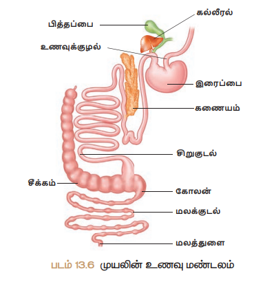

# அறிமுகம்
இந்த உயிர்க்கோளத்தில் காணப்படும் விலங்குகளின் அமைப்பு மற்றும் வாழ்முறைகளில் காணப்படும் பல்வகைத் தன்மை மிகுந்த ஆச்சரியப்படத் தக்கதாகவும், ஆர்வமூட்டக் கூடியதாகவும் உள்ளது. நம்மைச் சுற்றி நாம் காணக்கூடிய உயிரினங்கள் மிகச்சிலவே. ஆனால் இவ்வுலகில் எண்ணிலடங்கா விலங்கு சிற்றினங்கள் வாழ்ந்து வருகின்றன. விலங்குலகம் (Kingdom Animalia) என்பது முதுகுநாண் உள்ளதன் அடிப்படையில் முதுகுநாண் அற்றவை மற்றும் முதுகுநாணுள்ளவை என இரு பிரிவுகளாகப் பிரிக்கப்பட்டுள்ளதை நாம் அறிவோம். 

புவியில் காணும் விலங்குகளிடையே அவற்றின் வாழ்முறை, வாழிடம், உருவ அமைப்பு மற்றும் இனப் பெருக்க முறை ஆகியவற்றில் மிகப்பெரும் அளவிலான வேறுபாடுகள் காணப்படுகின்றன. இப்பாடப்பகுதியில் ஒரு முதுகு நாணற்ற உயிரி (அட்டை) மற்றும் ஒரு முதுகெலும்புள்ள உயிரி (முயல்) ஆகியவற்றின் புறத்தோற்றம் மற்றும் உள்ளமைப்பியல் பற்றிக் கற்க உள்ளோம். 

அட்டையின் விலங்கியல் பெயர் ஹிருடினேரியா கிரானுலலோசா(Hirudinaria granulosa) என்பதாகும். இதன் தொகுதி வளைத்தசைப்புழுக்களைச் சார்ந்ததாகும். வளைத்தசைப் புழுக்கள் என்பவை உறுப்பு மண்டல அளவில் ஒருங்கமைப்புடைய, கண்டங்களாகப் பிரிக்கப்பட்ட, புழு போன்ற உடலமைப்புடைய, விலங்குகளாகும். 

ஒரிக்டோலேகஸ் கியூனிகுலஸ் (Oryctolagues cuniculus) – முயலின் விலங்கியல் பெயராகும். இதன் த�ொகுதி முதுகுநாணுள்ளவை மற்றும், வகுப்பு – பாலூட்டிகள் ஆகும். பாலூட்டிகளே விலங்குலகத்தின் மிக உயர்ந்த வகுப்பாகும். மற்ற அனைத்து வகை விலங்குகளை விட மிகவும் மேம்பாடு அடைந்தவை இவ்வுயிரிகள். பாலூட்டிகளின் மிகச் சிறப்பானதொரு பண்பு, பெண் உயிரிகளில் காணப்படும் பால் சுரப்பிகளே. இவ்வுயிரிகள் வெப்ப இரத்த உயிரிகள் மற்றும் உடல் முழுவதும் உரோமங்களால் மூடப்பெற்றவை. 

அட்டை மற்றும் முயலின் புறத்தோற்றம், உள்ளமைப்பியல், உறுப்பு மண்டலங்கள் மற்றும் அவற்றின் செயல்பாடு பற்றி விரிவாகக் கற்போம். 

## ஹிருடினேரியா கிரானுலோசா (இந்தியக் கால்நடை அட்டை) 
வகைப்பாட்டு நிலை: 
தொகுதி : வளைத்தசைப் புழுக்கள் 
வகுப்பு : ஹிருடினியா 
வரிசை : நேத்தோப்டெலிடா 
பேரினம் : ஹிருடினேரியா 
சிற்றினம் : கிரானுலோசா 

### வாழிடமும், வாழ்முறையும் 
ஹிருடினேரியா கிரானுலலோசா (இந்திய கால்நடை அட்டை) இந்தியா, வங்கதேசம், பாகிஸ்தான், மியான்மர் மற்றும் இலங்கை ஆகிய நாடுகளில் காணப்படுகிறது. இவ்வுயிரி நன்னீர் குளங்கள், ஏரிகள், சதுப்பு நிலங்கள் மற்றும் சிற்றோடைகளில் வாழ்கிறது. இவை புற ஒட்டுண்ணிகளாகவும், மீன்கள், தவளைகள், கால்நடைகள் மற்றும் மனிதனின் இரத்தத்தை உறிஞ்சும் சாங்கிவோரஸ் (இரத்த உறிஞ்சிகள்) வகையினவாகவும் உள்ளன. 
###  புற அமைப்பியல் 
*அளவு மற்றும் உருவம்:** அட்டையானது மென்மையான, புழு போன்ற, நீண்ட, கண்ட அமைப்புடைய உடலைக் கொண்டது. நீளும்போது நாடா போன்றும், சுருங்கும்போ து உருளை போன்றும் மாறக்கூடியது. 35 செ.மீ நீளம் வரை வளரக் கூடியது. 

**நிற அமைப்பு:**  உடலின் முதுகுப் பகுதியானது ஆலிவ் பச்சை நிறமும், வயிற்றுப் பகுதியானது ஆரஞ்சு மஞ்சள் அல்லது ஆரஞ்சு சிவப்பு நிறமும் கொண்டது. 

**கண்ட அமைப்பு:**  மெட்டாமெ ரிசக் கண்ட அமைப்பு உடலில் காணப்படுகிறது. அட்டை யின் உடல் 33 கண்டங்கள் அல்லது சோமைட்டுகள் என்ற பகுதிகளாகப் பிரிக்கப்பட்டுள்ளது. இக்கண்டங்கள் ஒன்றன்பின் ஒன்றாக அடுக்கப்பட்டுள்ளன. ஒவ்வொரு கண்டமும் மேற்கொண்டு, மேலோட்டமாக வளையங்கள் அல்லது அன்னுலையாகப் பிரிக்கப்பட்டுள்ளது. இனப்பெருக்க காலத்தில் கூட்டை (கக்கூன்) உருவாக்குவதற்காக 9 முதல் 11 ஆவது கண்டம் வரையில் தற்காலிக கிளைடெல்லம் உருவாகிறது. 

**உணர்வேற்பிகள்:**  உடலின் முதுகுப்புறத்தில் முதல் ஐந்து கண்டங்களில் ஐந்து இணைகண்கள்உள்ளன. ஒவ்வொரு கண்டமும் பல புடைப்புகளாலான உணர்வேற்பிகளைக் கொண்டுள்ளன. வளைய உணர்வேற்பிகள் ஒவ்வொரு வளையத்திலும், கண்ட உணர்வேற்பிகள் ஒவ்வொரு கண்டத்தின் முதல் வளையத்திலும் காணப்படுகின்றன. 

**ஒட்டுறிஞ்சிகள்:**  அட்டையில் இரண்டு ஒட்டுறிஞ்சிகள் உள்ளன. உடலின் முன் முனையில் உள்ள ஒட்டுறிஞ்சி முன் ஒட்டுறிஞ்சி அல்லது வாய் ஒட்டுறிஞ்சி என அழைக்கப்படுகிறது. இது உடலின் வயிற்றுப்பகுதியில், முதல் ஐந்து கண்டங்களை ஆக்கிரமித்து அமைந்துள்ளது. உடலின் இறுதி ஏழு கண்டங்கள் ஒன்றிைணந்து பின் ஒட்டுறிஞ்சியை உருவாக்குகின்றன. இரு ஒட்டுறிஞ்சிகளும் ஒட்டிக்கொள்ளவும், இடப்பெயர்ச்சிக்கும் பயன்படுகின்றன. முன் ஒட்டுறிஞ்சியானது உணவூட்டத்திற்கும் உதவுகிறது.

**புறத்துளைகள்:**

**i. வாய்:** முன் ஒட்டுறிஞ்சியின் மையத்தில் வாய் காணப்படுகிறது.
**ii. மலத்துளை:** சிறுதுளையான இது 26-ஆவது கண்டத்தின் முதுகுப்புற மையப் (Mid – dorsal) பகுதியில் திறக்கிறது. 
**iii. நெப்ரீடியத்துளைகள்:** நெப்ரீடியங்கள் 17 இணை நெப்ரீடியத்துளைகள் மூலம் உடலின் வெளிப்பகுதியில் திறக்கின்றன. இத்துளைகள் 6 முதல் 22 வரையிலான கண்டங்களில் ஒவ்வொரு கண்டத்தின் கடைசி வளையத்தின் வயிற்றுப்பகுதியிலும் காணப்படுகின்றன. 
**iv. ஆண் இனப்பெருக்கத் துளை:** இத்துளை 10 ஆவது உடற் கண்டத்தின் இரண்டு மற்றும் மூன்றாவது வளையங்களின் வயிற்றுப்பகுதியின் மையத்தில் அமைந்துள்ளது. 
**v. பெண் இனப்பெருக்கத்துளை:** இது 11 ஆவது கண்டத்தின் இரண்டு மற்றும் மூன்றாவது வளையங்களின் வயிற்றுப்பகுதியின் மையத்தில் அமைந்துள்ளந்து.

###  உடற்பகுப்பு 
அட்டையின் உடல் ஆறு பகுதிகளாகப் பிரிக்கப் பட்டுள்ளது. 

|பகுதிகள் |கண்டங்கள் |
|---------------|-----------|
|தலைப்பகுதி| முதல் ஐந்து கண்டங்கள் (1 – 5) வரை |
|முன் கிளைடெல்லப் பகுதி |6,7 மற்றும் 8 ஆவது கண்டங்கள் வரை |
|கிளைடெல்லப் பகுதி |9,10 மற்றும் 11 ஆவது கண்டங்கள் வரை |
|நடுப்பகுதி |12 முதல் 22 வரை |
|பின் அல்லது வால் பகுதி |23 முதல் 26 வரை |
|பின் ஒட்டுறிஞ்சிப் |பகுதி 27 முதல் 33 வரை|

###  உடற்சுவர் 
அட்டையின் உடற்சுவர் ஐந்து அடுக்குகளைக் கொண்டது. அவை 
1. கியூட்டிகிள் – வெளி அடுக்கு 
2. புறத்தோல் – கியூட்டிகிளை ஒட்டி அடியில் காணப்படுவது 
3. தோல் – புறத்தோலுக்கு அடியில் காணப்படுவது; இணைப்பு திசுவால் ஆனது. 
4. தசை அடுக்கு - வட்ட மற்றும் நீளவாட்டுத் தசைகளால் ஆனது 
5. போட்ரியாய்டல் திசு – நீள் தசைகளுக்குக் கீழே உள்ளது. உணவுக் குழாயைச் சுற்றி, உடற்குழி முழுவதும் நிரம்பியுள்ளது. 

### இடப்பெயர்ச்சி 
அட்டை, தளத்தில் 1) வளைதல் அல்லது ஊர்தல் முறையிலும், நீரில் 2) நீந்துதல் முறையிலும் இடப்பெயர்ச்சி செய்கிறது. 

**1)  வளைதல் அல்லது ஊர்தல் இயக்கம்**
 இவ்வகை இயக்கமானது தசைகளின் சுருக்கம் மற்றும் நீள்தல் மூலம் நடைபெறுகிறது. இவ்வியக்கத்தின்போது ஒட்டிக்கொள்வதற்கு இரு ஒட்டுறிஞ்சிகளும் உதவுகின்றன. 

**2)  நீந்துதல் இயக்கம்** 
அட்டையானது நீரில் மிகுந்த செயலாக்கத்துடன் நீந்தி, அலை இயக்கத்தை மேற்கொள்கிறது.

### சீரண மண்டலம் 
அட்டையின் சீரண மண்டலமானது நீண்ட உணவுப் பாதையையும், சீரண சுரப்பிகளையும் கொண்டது. 

**உணவுக்குழல்** 
அட்டையின் உணவுப்பாதை வாய் முதல் மலத்துளை வரை நீண்டுள்ள நேரான குழலாகும். மூன்று ஆரத் துளையாலான வ ாய், முன் ஒட்டுறிஞ்சியின் மையப்பகுதியில் அமைந்து, சிறிய வாய்க்குழியினுள் நீள்கிறது. வாய்க்குழியின் சுவரானது, ஒரு வரிசையிலமைந்த நுண்ணிய பற்களைக் கொண்ட மூன்று தாடைகளைப் பெற்றுள்ளது. உமிழ்நீர்ச் சுரப்பிகளின் திறப்புகளைக் கொண்ட பாப்பில்லாக்களும் தாடைகளில் உள்ளன. வாயும், வாய்க் குழியும் முதல் ஐந்து கண்டங்களை ஆக்கிரமித்துள்ளன. 

வாய்க்குழி, தசையாலான தொண்டையினுள் நீள்கிறது. தொண்டையைச் சுற்றிலும் உமிழ்நீர்ச் சுரப்பிகள் அமைந்துள்ளன. இரத்தம் உறைந்துபோவதைத் தடுக்கும் ஹிருடின் என்ற பொருள் அட்டையின் உமிழ்நீரில் உள்ளது. தொண்டையானது குறுகிய, குட்டையான உணவுக்குழாய் மூலம் தீனிப்பையுடன் இணைகிறது. 

உணவுப்பாதையின் மிகப்பெரிய பகுதி தீனிப்பை ஆகும். இது தொடர்ச்சியாக அமைந்த 10 அறைகளைக் கொண்டது. இவ்வறைகள் வட்டத் துளைகள் மூலம் ஒன்றுடன் ஒன்று தொடர்பு கொண்டுள்ளன. இத்துளைகள் சுருக்குத்தசைகளால் சூழப்பட்டுள்ளன. ஒவ்வொரு அறையின் பக்கவாட்டிலும், பின்னோக்கி நீண்ட, ஓரிணை பை போன்ற குடல்வால்கள் அல்லது டைவர்டிகுலா அமைந்துள்ளன. மெதுவாக செரிப்பதற்காக 

தீனிப்பையும், அதன் குடல்வாலும் அதிகளவு உறிஞ்சப்பட்ட உணவான இரத்தத்தை சேமித்து வைத்துக் கொள்கின்றன. தீனிப்பையின் கடைசி அறையானது வயிற்றினுள் திறக்கிறது. வயிறு சிறிய நேரான குடலாகத் தொடர்ந்து, மலக்குடலில் திறக்கிறது. மலக்குடல் மலத்துளை வழியே உடலின் வெளிப்புறத்தில் திறக்கிறது. 

**உணவு, உணவூட்டம், சீரணம்** 
அட்டை, கால்நடைகள் மற்றும் பிற வீட்டு விலங்குகளின் இரத்தத்தை உணவாகப் பெறுகிறது. உணவூட்டத்தின்போது அட்டை அதன் பின் ஒட்டுறிஞ்சி மூலம் விருந்தோம்பியின் உடலில் உறுதியாக ஒட்டிக்கொள்கிறது. வாய்க்கு வெளிப்புறமாக துருத்திக் கொண்டுள்ள தாடைகளின் மூலம் விருந்தோம்பியின் தோலில் மூன்று ஆர அல்லது Y வடிவ காயத்தை ஏற்படுத்துகிறது. பின்னர் தசையாலான தொண்டை மூலம் இரத்தத்தை உறிஞ்சுகிறது. உமிழ்நீர் இதன் மீது கொட்டப்படுகிறது. 

சீரணமாகாத உணவான இரத்தம் தீனிப்பை அறைகளிலும், குடல்வாலிலும் சேமிக்கப்படுகிறது. தீனிப்பையிலிருந்து சுருக்குத்துளைகள் மூலம் வயிற்றுக்கு இரத்தமானது, சொட்டு சொட்டாக அனுப்பப்படுகிறது. புரதச் சீரண நொதி மூலம் வயிற்றில் சீரணம் நடைபெறுகிறது. செரிக்கப்பட்ட இரத்தத்தை குடல் மெதுவாக உறிஞ்சிக்கொள்கிறது. செரிக்கப்படாத உணவு மலக்குடலில் சேமிக்கப்பட்டு, மலத்துளை வழியே வெளியேற்றப்படுகிறது. 

அட்டைகள் ஹிருடின் என்ற புரதத்தைச் சுரப்பதன் மூலம் இரத்த உறைவைத் தடுக்கின்றன. மேலும் விருந்தோம்பியின் உடலில் ஒரு மயக்கப்பொருளைச் செலுத்துவதன் மூலம் இவை கடிப்பதை விருந்தோம்பிகள் உணர முடிவதில்லை.

**அட்டவணை 13.1.1**  அட்டையின் கண்ட அமைப்பு 
|புற மற்றும் அக அமைப்புகள் |காணப்படும் கண்டங்கள் |
|----------------------------------------------|------------------------------------------------------|
|கண்ட அமைப்பு |33 கண்டங்கள் |
|முன் ஒட்டுறிஞ்சி, வாய், கண்கள் |1 முதல் 5 வரையான கண்டங்கள்|
|பின் ஒட்டுறிஞ்சி |27 முதல் 33 வரையான கண்டங்கள்|
|தொண்டை |5 முதல் 8 வரையான கண்டங்கள் |
|தீனிப்பை |9 முதல் 18 வரையான கண்டங்கள் |
|வயிறு |19 ஆவது கண்டம் |
|குடல் |10 முதல் 22 வரையான கண்டங்கள் |
|மலக்குடல் |23 முதல் 26 வரையான கண்டங்கள் |
|மலத்துளை |26 ஆவது கண்டம் நெப்ரீடியத் துளைகள் 6 முதல் 22 வரையான கண்டங்கள்|
|ஆண் இனப்பெருக்கத் துளை |10 ஆவது கண்டம் |
|பெண் இனப்பெருக்கத் துளை |11 ஆவது கண்டம்|

### சுவாச மண்டலம் 
அட்டையில் தோல் மூலம் சுவாசம் நடைபெறுகிறது. புறத்தோல் செல்களுக்கு இடையே, மெல்லிய இரத்தக் குழல் தந்துகிகளைக் கொண்ட நெருக்கமான வலையமைப்பு காணப்படுகிறது. இத் தந்துகிகளினுள் இரத்த உடற்குழி திரவம் நிரம்பியுள்ளது. சுவாச வாயுக்களின் பரிமாற்றம் பரவல் முறையில் நிகழ்கிறது. நீரில் கரைந்துள்ள ஆக்சிஜன் தோல் மூலம் இரத்த உடற்குழி திரவத்தினுள் பரவுகிறது. அதே வழியில் கார்பன் டைஆக்ஸைடு உடலுக்கு வெளியே பரவுகிறது. கோழைச் சுரப்பு மூலம் தோலானது ஈரமாகவும், வழவழப்பாகவும் வைக்கப்படுகிறது. மேலும் இது உடல் உலர்ந்து போவதிலிருந்தும் பாதுகாக்கிறது. 

### சுற்றோட்ட மண்டலம் 

இரத்த உடற்குழி மண்டலம் மூலம் அட்டையில் சுற்றோட்டம் நடைபெறுகிறது. உண்மையான இரத்தக் குழாய்கள் இல்லை. இரத்தக்குழாய்களுக்குப் பதிலாக இரத்தம் போன்ற திரவத்தால் நிரப்பப்பட்ட இரத்த உடற்குழிக் கால்வாய்கள் அமைந்துள்ளன. இந்த உடற்குழி திரவமானது ஹீமோகுளோபினைக் கொண்டுள்ளது. 

சுற்றோட்ட மண்டலத்தில் நான்கு நீண்ட கால்வாய்கள் உள்ளன. ஒரு கால்வாய் உணவுப்பாதையின் மேல் புறமாகவும், மற்றொரு கால்வாய் உணவுப் பாதையின் கீழ்ப்புறமாகவும் அமைந்துள்ளது. மற்ற இரு கால்வாய்களும் உணவுப்பாதையின் இரு பக்கங்களிலும் அமைந்துள்ளன. இவ்விரு கால்வாய்களும் உட்புறம் வால்வுகளைக் கொண்டு, இதயம் போன்று செயல்படுகின்றன. நான்கு கால்வாய்களும் கீழ்ப்புறத்தில் 26 ஆவது கண்டத்தில் ஒன்றாக இணைகின்றன. 

### நரம்பு மண்டலம் 
அட்டை, மைய, பக்கவாட்டு மற்றும் பரிவு நரம்பு மண்டலங்களைக் கொண்டுள்ளது. மைய நரம்பு மண்டலம் நரம்பு வளையம் மற்றும் ஓரிைண வயிற்றுப்புற நரம்பு நாணைப் பெற்றுள்ளது. நரம்பு வளையமானது தொண்டையைச் சுற்றிலும் அமைந்துள்ளது. . இது தொண்டை மேல் நரம்புத்திரள் (மூளை) தொண்டைச் சுற்று நரம்பு இணைப்பு மற்றும் தொண்டை கீழ் நரம்புத் திரள் ஆகியவற்றை உள்ளடக்கியது.. தொண்டை கீழ் நரம்புத்திரள் தொண்டையின் அடிப்பகுதியில் – நான்கு இணை நரம்புத் திரள்களின் இணைவால் உருவாகியுள்ளது. 

### கழிவு நீக்க மண்டலம் 
அட்டையில் கழிவு நீக்கமானது நெப்ரீடியா எனப்படும் கண்டவாரியாக அமைந்த, சிறிய சுருண்ட, இணை குழல்கள் மூலம் நடைபெறுகிறது 17 இணை நெப்ரீடியங்கள் உள்ளன. இவை 6 முதல் 22 வரையான கண்டங்களில் அமைந்த நெப்ரீடியத்துளைகள் மூலம் வெளித்திறக்கின்றன. 

### இனப்பெருக்க மண்டலம் 
அட்டை ஓர் இருபால் உயிரி. ஏனெனில் ஒரே உயிரியில் ஆண் மற்றும் பெண் இனப்பெருக்க மண்டலங்கள் உள்ளன. 

**ஆண் இனப்பெருக்க மண்டலம்** 
12 ஆவது கண்டம் முதல் 22 ஆவது கண்டம் வரை ஒவ்வொரு கண்டத்திலும் ஓரிணை வீதம் பதினொரு இணை விந்தகங்கள் உள்ளன. அவை விந்தகப் பைகள் என்ற கோள வடிவப் பைகளாக உள்ளன. ஒவ்வொரு விந்தகத்திலிருந்தும் விந்து வெளிச் செலுத்து நாளம் என்ற சிறிய குழாய் தோன்றி, அப்பகுதியிலுள்ள விந்து நாளத்துடன் இணைகிறது. இவ்விந்து நாளமானது மிக அதிக சுருள்களைப் பெற்று, விந்து முதிர்ச்சிப் பை அல்லது எபிடிடைமிஸ் ஆக மாறுகிறது. விந்து நாளத்திலிருந்து பெறப்படும் விந்தணுக்களை சேமிக்க இப்பை பயன்படுகிறது. 

எபிடிடைமிஸ் சிறிய வெளியேற்றும் குழாயாகத் தொடர்கிறது. இருபக்க வெளியேற்றும் குழாய்களும் ஒன்றாக இணைந்து, இனப்பெருக்க அறையாக மாறுகின்றன. இவ்வறையானது இரு பகுதிகளைக் கொண்டது. அவை 1) சுருண்ட புராஸ்டேட் சுரப்பிகள் மற்றும் 2) ஆண் குறியைக் கொண்ட பினியல் பை, ஆண்குறி ஆண் இனப்பெருக்க துைள மூலம் வெளித்திறக்கிறது. 

**பெண் இனப்பெருக்க மண்டலம்** 
இம் மண்டலம் அண்டகங்கள், அண்டக் குழல்கள், பொது அண்ட நாளம் மற்றும் பெண் இனப்பெருக்க உறுப்பைக் (யோனி) கொண்டுள்ளது. 11 ஆவது கண்டத்தின் வயிற்றுப் பகுதியில் ஓரிணை அண்டகங்கள் உள்ளன. ஒவ்வொரு அண்டகமும் சுருண்ட நாடா போன்ற அமைப்புடையது. 

அண்டகத்திலிருந்து அண்டங்கள் (சினைசெல்கள்) விடுவிக்கப்படுகின்றன. ஒவ்வொரு அண்டகத்திலிருந்தும் ஒரு சிறிய அண்டக் குழல் உருவாகிறது. இரு பக்க அண்டக் குழல்களும் இணைந்து ஒரு பொது அண்ட நாளமாகிறது. இப்பொழுது அண்ட நாளமானது பேரிக்காய் வடிவ யோனியினுள் திறக்கிறது. யோனி 11 ஆவது கண்டத்தின் பின்புறத்தில் வயிற்றுப்புற மையப் பகுதியில் அமைந்துள்ளது. 

**கரு வளர்ச்சி** 
1. அகக் கருவுறுதல் நடைபெறுகிறது. இதனைத் தொடர்ந்து கக்கூன் உருவாகிறது. கக்கூன் முட்டைக் கூடு எனப்படும். இது 9,10 மற்றும் 11 ஆவது கண்டங்களைச் சுற்றி உருவாகிறது. 
2. கரு வளர்ச்சி நேரடியானது. முட்டைக் கூட்டினுள் 1 முதல் 24 கருக்கள் வளர்கின்றன. 
3. முதிர்ந்த அட்டையைப் போன்ற தோற்றம் கொண்ட இளம் அட்டைகள் வெளிவருகின்றன.

### அட்டையின் ஒட்டுண்ணித் தகவமைப்புகள் 

அ ட ்டைகள் முதுகெலும்பிகளின் இரத்தத்தை உறிஞ்சி, ஒட்டுண்ணி வாழ்க்கை முறையை மேற்கொள்வதால் அவற்றின் உடலமைப்பில் பல்வேறு மாறுபாடுகளைப் பெற்றுள்ளன.
1. தொண்டை இரத்தத்தை உறிஞ்சப் பயன்படுகிறது. 
2. உடலின் இரு முனைகளிலும் உள்ள ஒட்டுறிஞ்சிகள் அட்டையை விருந்தோம்பியுடன் உறுதியாக இணைத்துக் கொள்ளப் பயன்படும் கவ்வும் உறுப்புகளாகச் செயல்படுகின்றன. 
3. அட்டையின் வாயினுள் காணப்படும் மூன்று தாடைகள் விருந்தோம்பியின் உடலில் வலியில்லாத Y – வடிவ காயத்தை உருவாக்க உதவுகின்றன. 
4. உமிழ் நீர்ச் சுரப்பிகளால் உருவாக்கப்படும் ஹிருடின் என்ற பொருள் இரத்தத்தை உறைய விடுவதில்லை. எனவே தொடர்ச்சியாக இரத்தம் கிடைப்பது உறுதி செய்யப்படுகிறது. 
5. பக்கக் கால்களும் (parapodia) மயிர்க் கால்களும் (Setae) காணப்படுவதில்லை . ஏனெனில் இவ்வுறுப்புகள் எந்த வகையிலும் தேவையில்லை. 
6. தீனிப்பையில் இரத்தம் சேமிக்கப்படுகிறது. இது அட்டைக்கு பல மாதங்களுக்கு ஊட்டமளிக்கிறது. இதன் காரணமாக சீரண நீரோ, நொதிகளோ அதிக அளவில் சுரக்க வேண்டிய தேவையில்லை. இரத்தத்தை வழிய விடுதல் என்பது நோயாளியின் உடலிலிருந்து நச்சு, அசுத்தப் பொருள்களை வெளியேற்றும் ஒரு நுட்பமாகும். 

## ஓரிக்டோலேகஸ் கியூனிகுலஸ் – முயல் 
வகைப்பாட்டு நிலை தொகுதி : முதுகுநாணிகள் 
துணைத் தொகுதி : முதுகெலும்பிகள் 
வகுப்பு : பாலூட்டிகள் 
வரிசை : லேகோமார்ஃபா 
பேரினம் : ஓரிக்டோலேகஸ் 
சிற்றினம் : கியூனிகுலஸ் 

### வாழிடமும், வாழ்முறையும் 
முயல் ஒரு சாந்தமான மற்றும் பயந்த சுபாவமுள்ள, விலங்காகும் . இது வளையில் வாழும். தாவி இடம் பெயரக்கூடிய இவ்விலங்குகள் உலகம் முழுவதும் பரவிக் காணப்படுகின்றன. இவை புல் மற்றும் முள்ளங்கி, கேரட் போன்ற காய்கறிகளையும், கீரைகளையும் உண்கின்றன. இவை கூட்டமாக வாழும் இயல்புடையவை.

### புறத்தோற்றம் 

**அளவு, வடிவம் மற்றும்நிறம்:** – முயலானது நீண்ட, சற்றே உருளை வடிவ உடலைக் கொண்டது. ஆண் மற்றும் பெண் முயல்கள் ஒரே அளவுடையவை. இவை சுமார் 45 செ.மீ. நீளமும், சுமார் 2.25 கிகி எடையும் பெறும் அளவுக்கு வளர்பவை. வெள்ளை, கருப்பு மற்றும் வெள்ளை நிறம் உட்பட பல்வேறு நிறங்களில் காணப்படுகின்றன. உடலை வெது வெதுப்பாக வைத்திருக்க உரோமங்களால் மூடப்பட்டுள்ளது. 

**உடற்பிரிவுகள்**முயலின் உடலானது தலை, கழுத்து, உடல் மற்றும் வால் எனப் பிரிக்கப்பட்டுள்ளது. 

**தலை** தலை முட்டை வடிவமானது பிளவுபட்ட முகவாய் கொண்டது. தலையில் வாய், நாசித்துளைகள், கண்கள், காதுகள் மற்றும் உணர் உரோமங்கள் உள்ளன. வாய் மேலுதடு மற்றும் கீழுதட்டால் சூழப்பட்ட கிடைமட்டப் பிளவாக உள்ளது. வாய்க்கு சற்று மேலே சாய்வான துளைகளாக இரு நாசித்துளைகள் உள்ளன. மேலுதட்டின் இரு புறமும் உணர் உரோமங்கள் அல்லது மூக்கு முடிகள் (Vibrissae) வெளியே நீட்டிக் கொண்டுள்ளன. அசை யக்கூடிய, பெரிய இரு புறச்செவி அல்லது செவி மடல்கள் தலையின் மேல் பகுதியில் காணப்படுகின்றன. 

**கழுத்து**  தலையை உடலுடன் கழுத்து இணைக்கிறது. இது தலையைத் திருப்புவதற்கு உதவுகிறது. 

**உடல்** உடலின் முன்பகுதி மார்பு எனவும், பின்பகுதி வயிறு எனவும் பகுக்கப்பட்டுள்ளது. பெண் உயிரிகளில் மார்புக்கும், வயிற்றுக்கும் இடை ப்பட்ட பகுதியில் நான்கு அல்லது ஐந்து மார்புக் காம்புகள் அல்லது பால் காம்புகள் காணப்படுகின்றன. 
உடலில் ஐந்து விரல்களைக் கொண்ட இரு இணை கால்கள் இணைக்கப்பட்டுள்ளன. முன்னங் கால்கள் பின்னங்கால்களை விடக் குட்டையானவை. அனைத்து விரல்களிலும் வளை நகங்கள் காணப்படுகின்றன. 
வயிற்றின் இறுதியில், வாலின் அடியில் மலத்துளை உள்ளது. பெண் விலங்குகளின் வயிற்றுப்பகுதியில் சிறு பிளவு போன்ற பெண்குறி உள்ளது. ஆண் விலங்குகளில் மலத்துளையின் அருகே வயிற்றுப்புறத்தில் ஆண் குறி அமைந்துள்ளது. ஆண்குறியின் இருபுறமும் ஓரிைண விதைப்பைகள் உள்ளன. விதைப்பைகளின் உள்ளே விந்தகங்கள் உள்ளன. 

**வால்** வால் குட்டையானது. இது மற்ற முயல்களுக்கு அபாய சைகைகளை வழங்க உதவுகிறது. 

**புறத்தோல்** உடலின் வெளிப்புறம் புறத்தோலால் சூழப்பட்டுள்ளது. உரோமம், வளை நகங்கள், வியர்வைச் சுரப்பிகள், எண்ணெய் சுரப்பிகள், பால் சுரப்பிகள் ஆகியவை புறத்தோலின் மாறுபாடுகளாகும். பால் சுரப்பி தோலின் மாறுபாடாகும். இது சுரக்கும் பால் முயல் குட்டிகளின் உணவாகிறது. வியர்வை மற்றும் எண்ணெய் சுரப்பிகள் உடல் வெப்பநிலையைப் பராமரிக்கின்றன. 

### உடற்குழி 
முயல் ஒரு உண்மையான உடற்குழியுடைய விலங்கு. உடலின் உட்பகுதி குறுக்குத் தடுப்பான உதரவிதானம் மூலம் மார்பறையாகவும், வயிற்றறையாகவும் பிரிக்கப்பட்டுள்ளது. உதரவிதானம் பாலூட்டிகளில் மட்டுமே காணப்படும் ஒரு சிறப்புப் பண்பாகும். உதரவிதானத்தின் வடிவத்தை மாற்றுவதன் மூலம் சுவாச இயக்கங்கள் நடைபெறுகின்றன. 
மார்பறையில் இதயமும், நுரையீரல்களும் அமைந்துள்ளன. வயிற்றறையில் சீரண, கழிவு நீக்க மற்றும் இனப்பெருக்க மண்டலங்கள் அமைந்துள்ளன. 

###  சீரண மண்டலம் 
சீரண மண்டலம் உணவுப் பாதை மற்றும் சீரண சுரப்பிகளை உள்ளடக்கியது. உணவுப்பாதையில் வாய், வாய்க்குழி, தொண்டை, உணவுக்குழாய், இரைப்பை, சிறுகுடல், குடல் நீட்சி, பெருங்குடல் மற்றும் மலத்துளை ஆகியவற்றை உள்ளடக்கியது. 
வாயானது மேலுதடு மற்றும் கீழுதட்டால் சூழப்பட்ட குறுக்குப் பிளவாகும். இது வாய்க்குழியினுள் நீள்கிறது. வாய்க் குழி மேற்புறம் அன்னத்தாலும், அடிப்புறம் தொண்டையாலும் சூழப்பட்டுள்ளது. வாய்க்குழியின் தளப்பகுதியில் தசையாலான நாக்கு உள்ளது. தாடைகளில் பற்கள் உள்ளன. 
வாய்க்குழியானது தொண்டையின் மூலமாக உணவுக்குழாயாகத் தொடர்கிறது. உணவுக்குழாய் இரைப்பையினுள் திறக்கிறது. இரைப்பையைத் தொடர்ந்து சிறுகுடல் அமைந்துள்ளது. மெல்லிய சுவருடைய குடல்வால் நீட்சி, சிறுகுடலும் பெருங்குடலும் சந்திக்குமிடத்தில் காணப்படுகிறது. இதில் உள்ள பாக்டீரியா, செல்லுலோசைச் செரிக்க உதவுகிறது. சிறுகுடல் பெருங்குடலாகத் தொடர்கிறது. பெருங்குடலில் கோலன் மற்றும் மலக்குடல் எனற இரு பகுதிகள் உள்ளன. மலக்குடல் மலத்துளை மூலம் வெளித் திறக்கிறது. 

**சீரணச் சுரப்பிகள்** 
உமிழ்நீர்ச் சுரப்பிகள், இரைப்பைச் சுரப்பிகள், கல்லீரல், கணையம் மற்றும் சிறுகுடல் சுரப்பிகள் போன்றவை சீரணச் சுரப்பிகளாகும். இச்சுரப்பிகள் சுரக்கும் நொதிகள் உணவுப் பாதையில் உணவின் செரிமானத்திற்குத் துணை புரியும்.

**முயலின் பல்லமைப்பு** 
பற்கள்கடினமான, எலும்பு போன்றஅமைப்புகள். இவை உணவுப் பொருட்களை வெட்டுவதற்கும், மெல்லுவதற்கும், அரைப்பதற்கும் பயன்படுகின்றன. முயல் தன் வாழ்நாளில் இரு தொகுதி பற்களைப் பெறுகிறது. இவ்வாறு ஒரு விலங்கின் வாழ்நாளில் இரு தொகுதி பற்கள் காணப்படும் நிலை ‘இரு முறை தோன்றும் பல்லமைப்பு’ எனப்படுகிறது. முயலின் பற்கள் வெவ்வேறு வகையின. இத்தகைய பல்லமைப்புக்கு ‘மாறுபட்ட பல்லமைப்பு’ என்று பெயர். பாலூட்டிகளில் நான்கு வகைப் பற்கள் காணப்படுகின்றன. அவை வெட்டும் பற்கள் (I), கோரைப்பற்கள் (C), முன் கடைவாய்ப் பற்கள் (PM) மற்றும் பின்கடைவாய்ப் பற்கள் (M) ஆகும். இவை பல் வாய்பாட்டின் மூலம் குறிக்கப்படுகின்றன. 

ஒரு பாலூட்டியில் காணப்படும் பற்களைப் பற்றி சுருக்கமாக எழுதும் முறையே பல் வாய்ப்பா டு ஆகும். ஒரு பாலூட்டியின் மேல் மற்றும் கீழ்த் தாடைகளின் ஒரு பக்கத்தில் மட்டும் காணப்படும் வெவ்வேறு வகைப் பற்களின் எண்ணிக்கையை இது குறிக்கிறது. முயலின் பல் வாய்ப்பாடு (I 2  / 1 , C 0 / 0 , PM. 3 / 2 , M 3 / 3 .) இது பின்வருமாறு எழுதப்படும் 2033 / 1023 முயலுக்கு கோரைப்பற்கள் கிடையாது.

முயலின் வெட்டும் பற்களுக்கும், முன் கடைவாய்ப் பற்களுக்கும் இடையேயான இடைவெளிப்பகுதி டயாஸ்டீமா அல்லது பல் இடைவெளி என அழைக்கப் படுகிறது. மெல்லும் போதும், அரைக்கும்போதும் உணவைக் கையாளுவதற்கு இந்த பல் இடைவெளி பயன்படுகிறது.

###  சுவாச மண்டலம் 
முயலில் சுவாசம் ஓரிணை நுரையீரல்களால் நிகழ்த்தப்படுகிறது. இவை மென்மையான பஞ்சு போன்ற திசுக்களால் ஆக்கப்பட்டு, மார்புக்கூட்டினுள் வைக்கப்பட்டுள்ளன. மார்பறையானது முதுகுப் புறத்தில் முதுகெலும்புத் தொடராலும், வயிற்றுப்புறத்தில் மார்பெலும்பாலும், பக்கவாட்டில் விலா எலும்புகளாலும் சூழப்பட்டுள்ளது. மார்பறையின் கீழ்ப்பகுதியில் குவிந்த உதரவிதானம் அமைந்துள்ளது. 

ஒவ்வொரு நுரையீரலும் ப்ளூரா என்ற இரட்டைச் சவ்வுகளால் ஆன உறையால் சூழப்பட்டுள்ளது. வெளிப்புறக் காற்று, புற நாசித்துளைகள் வழியாக சுவாசப் பாதையில் நுழைந்து தொண்டையை அடைகிறது. தொண்டையிலிருந்து குரல்வளை வழியாக மூச்சுக் குழாயினுள் காற்று நுழைகிறது. மூச்சுக் குழாயின் மேற்பகுதி அகன்று குரல் பெட்டியாக மாறியுள்ளது. லேரிங்ஸ் எனப்படும். இக் குரல்பெட்டியின் சுவர் நான்கு குருத்தெலும்புத் தகடுகளால் வலுவூட்டப் பெற்றுள்ளது. குரல்பெட்டியினுள் உள்ள குரல் நாண்கள் அதிர்வடைவதால் ஒலி உருவாகிறது. குரல்பெட்டி டிரக்கியா அல்லது மூச்சுக் குழாயாகத் தொடர்கிறது.

மூச்சுக்குழாயின் வழியே காற்று எளிதாகச் சென்று வரும் வகையில் அதன் சுவர்கள் குருத்தெலும்பு வளையங்களால் தாங்கப்படுகின்றன. உணவானது குரல்வளை வழியாக மூச்சுக் குழாயினுள் செல்வதை குரல்வளை மூடி தடுக்கிறது. மூச்சுக்குழாய் மார்புப் பகுதியை அடைந்ததும் இரு மூச்சுக் கிளைக் குழல்களாகப் பிரிந்து, ஒவ்வொரு கிளைக்குழலும் ஒரு நுரையீரலினுள் நுழைகிறது. இம் மூச்சுக் கிளைக் குழல்கள் மூச்சு நுண்கிளைக் குழல்களாகப் பிரிந்து, காற்று நுண்ணறைகளில் முடிகிறது. 

சுவாச நிகழ்வுகள் உட்சுவாசம் (காற்றை உள்ளிழுத்தல்) மற்றும் வெளிச்சுவாசம் (காற்றை வெளித் தள்ளுதல்) ஆகியவற்றை உள்ளடக்கியது. இந்நிகழ்வுகள் மூலம் வாயு பரிமாற்றம் நிகழ்கிறது. உட்சுவாசம் ஒரு செயல்மிகு நிகழ்வாகும். ஆனால் வெளிச்சுவாசம் ஒரு மந்த நிகழ்வாகும். 

### சுற்றோட்ட மண்டலம்
முயலின் சுற்றோட்ட மண்டலம் இரத்தம், இரத்தக் குழாய்கள் மற்றும் இதயம் ஆகியவற்றைக் கொண்டது. இதயம் பேரிக்காய் வடிவத்தில் மார்பறையினுள் இரு நுரையீரல்களுக்கும் இடையில் அமைந்துள்ளது. இதயம் பெரிகார்டியம் என்ற இரட்டைச் சவ்வுகளால் ஆன உறையால் சூழப்பட்டுள்ளது. 

இதயம் இரு ஆரிக்கிள்கள் மற்றும் இரு வெண்ட்ரிக்கிள்கள் என நான்கு அறைகளைக் கொண்டது. வலது மற்றும் இடது ஆரிக்கிள்கள், ஆரிக்கிள் இடைத் தடுப்புச் சுவரால் பிரிக்கப்பட்டுள்ளன. இதேபோல், வலது மற்றும் இடது வெண்ட்ரிக்கிள்கள், வெண்ட்ரிக்கிள் இடைத் தடுப்புச் சுவரால் பிரிக்கப்பட்டுள்ளன. வலது ஆரிக்குலோ- வெண்ட்ரிக்குலார் துளை மூலம் வலது ஆரிக்கிள், வலது வெண்ட்ரிக்கிளினுள் திறக்கிறது. இத்துளை மூவிதழ் வால்வினால் காக்கப்படுகிறது. இடது ஆரிக்கிள், இடது வெண்ட்ரிக்கிளினுள் இடது ஆரிக்குலோ – வெண்ட்ரிக்குலார் துளை மூலம் திறக்கிறது. இத்துளையை ஈரிதழ் வால்வு அல்லது மிட்ரல் வால்வு காக்கிறது. நுரையீரல் வளைவு மற்றும் பெருந்தமனி திறக்கும் இடங்களில் அரைச்சந்திர வால்வுகள் உள்ளன. 

இரு மேற்பெருஞ்சிரைகள் (முன்கேவல் சிரைகள்) மற்றும் ஒரு கீழ்ப்பெருஞ்சிரை (பின்கேவல் சிரை) மூலம் உடலின் அனைத்துப்பாகங்களிலிருந்தும் ஆக்சிஜன் நீக்கம் பெற்ற இரத்தத்தை வலது ஆரிக்கிள் பெறுகிறது. இடது ஆரிக்கிள், நுரையீரல் சிரைகள் மூலம் நுரையீரல்களிலிருந்து ஆக்சிஜனேற்றப்பட்ட இரத்தத்தைப் பெறுகிறது. வலது வெண்ட்ரிக்கிளிலிருந்து நுரையீரல் வளைவு கிளம்பி, ஆக்சிஜன் குறைந்த இரத்தத்தை நுரையீரல்களுக்கு எடுத்துச் செல்கிறது. இடது வெண்ட்ரிக்கிளிலிருந்து சிஸ்டமிக் வளைவு கிளம்பி, ஆக்சிஜன் மிகுந்த இரத்தத்தை உடலின் அனைத்து பாகங்களுக்கும் அனுப்புகிறது.

###  நரம்பு மண்டலம் 
முயலின் நரம்பு மண்டலம் மைய நரம்பு மண்டலம் (CNS), புறஅமைவு நரம்பு மண்டலம் (PNS) மற்றும் தானியங்கு நரம்பு மண்டலம் (ANS) ஆகியவற்றை உள்ளடக்கியது. 

மைய நரம்பு மண்டலத்தில் மூளையும், தண்டுவடமும் அடங்கியுள்ளன. 
புறஅமைவு நரம்பு மண்டலத்தில் 12 இணை மூளை நரம்புகளும், 37 இணைதண்டுவட நரம்புகளும் உள்ளன. தானியங்கு நரம்பு மண்டலமானது மேலும் பரிவு மற்றும் இணைப் பரிவு நரம்பு மண்டலங்களாகப் பிரிக்கப்பட்டுள்ளது. 

மூளை மண்டையோட்டினுள் அமைந்துள்ளது. இது மூன்று சவ்வுகளால் சூழப்பட்டுள்ளது. வெளிச்சவ்வு டியூராமேட்டர் எனவும், உட்சவ்வு பயாமேட்டர் எனவும், இடைச்சவ்வு அரக்னாய்டு உறை எனவும் அழைக்கப்படுகின்றன. மூளையானது முன்மூளை, நடுமூளை மற்றும் பின்மூளை எனப் பிரிக்கப்படுகிறது. முன்மூளை ஓரிணை நுகர்ச்சிக் 

கதுப்புகள், பெருமூளை அரைக் கோளங்கள் மற்றும் டையன்செஃபலான் ஆகிய பகுதிகளைக் கொண்டுள்ளது. பெருமூளை அரைக்கோளங்கள் இரண்டும் கார்பஸ் கலோசம் என்ற குறுக்கு நரம்புப் பட்டையால் இணைக்கப்பட்டுள்ளன. 
நடுமூளை, பார்வைக் கோளங்களைக் கொண்டுள்ளது. பின் மூளையில் சிறுமூளை, பான்ஸ் வெரோலி மற்றும் முகுளம் ஆகியவை உள்ளன. மூளை குறித்த விரிவான செய்திகளை நரம்பு மண்டலம் என்ற பாடத்தில் கற்கலாம். 

### சிறுநீரக இனப்பெருக்க மண்டலம் 
இது கழிவுநீக்க மற்றும் இனப்பெருக்க மண்டலங்களை உள்ளடக்கியது. கருநிலையில் உள்ளபோது இவ்விரு மண்டலங்களும் தனித்தனியே வளர்ச்சியடைகின்றன. ஆனால் முதிர் உயிரியில் இம்மண்டலங்கள் ஒன்றிணைந்து, சிறுநீரக இனப்பெருக்க மண்டலம் என்ற ஒரே மண்டலமாகிறது.

**கழிவுநீக்க மண்டலம்** 
சிறுநீரகங்கள் கருஞ்சிவப்பு நிறமும், அவரை விதை வடிவமும் கொண்டு வயிற்றறையில் அமைந்துள்ளன. ஒவ்வொரு சிறுநீரகமும் பல நெஃப்ரான்களால் ஆக்கப்பட்ட மெட்டாநெஃப்ரிக் வகையைச் சேர்ந்ததாகும். சிறுநீரகங்கள் இரத்தத்திலிருந்து நைட்ரஜன் சார் கழிவுப் பொருள்களைப் பிரித்தெடுத்து, யூரியா வடிவில் வெளியேற்றுகின்றன. 
இரண்டு சிறுநீரக நாளங்களும் சிறு நீர்ப்பையின் பின்புறத்தில் திறக்கின்றன. சிறு நீர்ப்பை, தசையாலான சிறுநீர்ப் புறவழி மூலம் வெளித் திறக்கின்றது. 

**இனப்பெருக்க மண்டலம்** 
முயல்களில் ஆண் பெண் உயிரிகள் தனித்தனியே காணப்படுகின்றன. முயல்களின் ஆண், பெண் இனப்பெருக்க மண்டலத்தின் அமைப்பு மற்றும் அதன் துணை பாலுறுப்புகள் குறித்தும் கீழே காண்போம். 

**ஆண் இனப்பெருக்க மண்டலம்** 
முயலின் ஆண் இனப்பெருக்க மண்டலம் ஓரிணை விந்தகங்கள் மற்றும் அவற்றோடு தொடர்புடைய நாளங்கள் ஆகியவற்றைக் கொண்டுள்ளது. விந்தகங்கள் விந்து செல்களை உற்பத்தி செய்கின்றன. விந்தகங்கள் வயிற்றுக்கு வெளியே தொங்கிக் கொண்டிருக்கும், தோலாலான விதைப்பைகளினுள் அமைந்துள்ளன. ஒவ்வொரு விந்தகமும் விந்து நுண்குழல்கள் என்ற சுருண்ட குழல்களின் தொகுப்பைக் கொண்டுள்ளது. இக்குழல்களில் விந்து செல்கள் முதிர்ச்சியடையும்போது, அவை சேகரிக்கும் நாளங்களில் தேக்கப்பட்டு, எபிடிடைமிசுக்குக் கடத்தப்படுகின்றன. இருபக்க விந்து நாளங்களும் சிறுநீர்ப்பைக்கு சற்று கீழே சிறுநீர் வடிகுழாயில் இணைகின்றன. சிறுநீர் வடிகுழாய் பின்னோக்கி சென்று, ஆண்குறியில் சேர்கிறது.

இனப்பெருக்கத்தில் பங்குகொள்ளும் மூன்று துணைச் சுரப்பிகள் உள்ளன. அவை முறையே புராஸ்டேட் சுரப்பி, கௌப்பர் சுரப்பி மற்றும் கழிவிடச் சுரப்பிகள் ஆகும். 

**பெண் இனப்பெருக்க மண்டலம்** 
முயலின் பெண் இனப்பெருக்க மண்டலத்தில் ஓரிணை அண்டகங்களும், தொடர்புடைய சுரப்பிகளும் உள்ளன. இவை சிறுநீரகங்களுக்குப் பின்னால் வயிற்றறையில் அமைந்துள்ளன. அண்டகங்கள் அண்ட செல்(முட்டை)களை உற்பத்தி செய்கின்றன. கிராஃபியன் பாலிக்கிள்கள் என்ற சிறப்பு செல்கள் கொத்தாக ஒவ்வொரு அண்ட செல்லையும் சூழ்ந்துள்ளது. ஒவ்வொரு அண்டகமும் ஃபெலோப்பியன் குழல் என்ற அண்டக் குழாயினுள் அண்ட செல்லை விடுவிக்கிறது. இவ்வண்டக் குழாயின் வாய்ப் பகுதி அண்டகத்தை ஒட்டி அமைந்துள்ளது. இக்குழாய் அகன்ற பகுதியான ¬கருப்பையாகத் தொடர்கிறது. முயலின் கருப்பை இரு தனித்தனிப் பகுதிகளாக அமைந்து, மையத்தில் ஒன்றாக இணைந்து யோனி அல்லது பிறப்புக் கால்வாயாக மாறுகிறது. சிறுநீர்ப் பையும், யோனியும் இணைந்து, வெஸ்டிபியூல் அல்லது சிறுநீரக இனப்பெருக்க கால்வாய் உருவாகிறது. இக்கால்வாய் பின்னோக்கிச் சென்று, சிறிய பிளவு போன்ற பிறப்புறுப்பு அல்லது வல்வாவாக வெளித் திறக்கிறது. 

ஓரிணை கௌப்பரின் சுரப்பிகளும், கழிவிடச் சுரப்பிகளும் பெண் இனப்பெருக்க மண்டலத்தில் உள்ளன. 

**நினைவில் கொள்க** 
- அட்டையின் உடல் ஒரே மாதிரியான 33 கண்டங்களாகப் பிரிக்கப்பட்டுள்ளது. 
- ஓம்புயிரியின் உடலில் ஒட்டிக் கொள்வதற்கும், இடப்பெயர்ச்சிக்கும் பயன்படும் இரு ஒட்டுறுப்புகளை அட்டை பெற்றுள்ளது. 
- அட்டையின் உமிழ்நீர்ச் சுரப்பிகள் இரத்தம் உறைவதைத் தடுக்கும் ஹிருடின் (எதிர் உறைவி) என்ற பொருளைச் சுரக்கின்றன. 
- அட்டை ஓர் இருபால் உயிரி - முயல்கள் முதுகு நாணுள்ள வெப்ப இரத்த உயிரிகள். 
- முயலுக்கு கோரைப் பற்கள் கிடையாது.
- முயலின் சுவாசம் ஓரிணை நுரை யீரல்கள் மூலம் நடைபெறுகிறது. 
- இதயத்தில் இரு ஆரிக்கிள்கள், இரு வெண்ட்ரிக்கிள்கள் என நான்கு அறைகள் உள்ளன. 
- கழிவுநீக்க இனப்பெருக்க மண்ட லத்தில் சிறுநீரக அல்லது கழிவுநீக்க மண்டலம் மற்றும் இனப்பெருக்க மண்டலம் ஆகியவை உள்ளன. 
- பால் சுரப்பிகள் மாறுபாடடைந்த தோல் சுரப்பிகள் ஆகும். இதன் சுரப்பான பால் இளம் உயிரிகளின் உணவாகும்.
