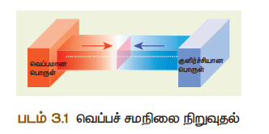
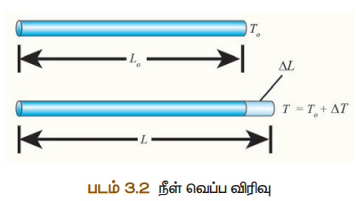
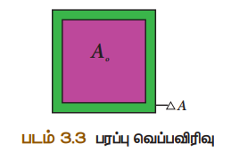
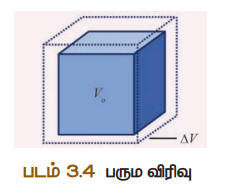
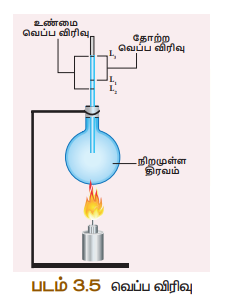
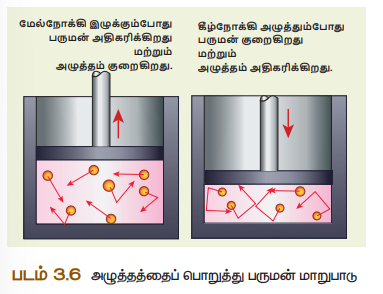

# அறிமுகம்

அனைத்து உயிரினங்களும்‌ வாழ்வதற்கக்‌ தேவையான முதன்மையான வெப்ப. ஆற்றல்‌ கூரியனியமிரந்து. கிடைக்கிறது வெப்ப ஆற்றல்‌. என்பது காரணி மற்றும்‌ வெப்பநிலை என்பது. விளைவு. அனைத்து உயிரினங்களும்‌ உயர்‌ வாழ்வதற்கு குறிப்பிட்ட மவப்பநிலை தேவைப்படுகிறது. சமையலறையில்‌ தூண்டல்‌ அடுப்பில்‌ வைக்கப்படும்‌ பாத்திரத்தின்‌ டிப்பகதி எல்கினால்‌ ஊய்யப்பட்டரப்த்‌ காரணம்‌ உங்களுக்குக்‌ ஷெரியுமா?. நம்மில்‌ அனைவருக்கும்‌ வம்ப. ஆற்றல்‌. மற்றும்‌. எவப்பதிலை. பற்றி வதுவான புரிகல்‌ உண்டு. ஆனால்‌ இப்பாடத்தில்‌ அறிவியலின்‌ கண்ணோடத்தில்‌வெப்பறிலைமற்றம்‌ பப்ப ஆற்றல்‌ ஆகியவற்றை தெறிந்து கொள்ள உள்ளோம்‌. மேலும்‌ வெப்ப ஆற்றல்‌. பரிமாற்றம்‌ எவ்வாறு நடையறுகிறது என்பதை பறறியு்‌ வெப்ப ஆற்றலினால்‌. ஏற்படம்‌ விளைவுகளைப்‌ பற்றியும்‌ மடக்க உள்ளோம்‌.

## வெப்பநிலை

ஒரு பொருளில் இருக்கும் வெப்பம் அல்லது குளிர்ச்சி நிலையின் அளவு வெப்பநிலை என வரையறுக்கப்படுகிறது. குளிர்ச்சியான பொருளைவிட சூடான பொருளின் வெப்பநிலை அதிகம். ஒரு பொருள் சுற்றுப்புறத்துடன் வெப்பச் சமநிலையில் உள்ளதா அல்லது இல்லையா என்று கூறும் பண்பையும் வெப்பநிலை என வரையறுக்கலாம் (மூலக்கூறுகளின் சராசரி இயக்க ஆற்றல் வெப்பநிலை ஆகும்). வெப்பநிலை என்பது ஒரு பொருளின் வெப்பம் எத்திசையில் பரவுகிறது என்பதை குறிப்பிடும் பண்பு ஆகும். வெப்பநிலை என்பது ஒரு ஸ்கேலார் அளவு ஆகும். வெப்பநிலையின் SI அலகு கெல்வின். மேலும் செல்சியஸ் (°C) மற்றும் ஃபாரன்ஹீட் (°F) ஆகிய அலகுகளும் வெப்பநிலையை அளக்கப் பயன்படுத்தப்படுகிறது. 

### வெப்பநிலையின் தனித்த அளவுகோல் (கெல்வின் அளவுகோல்) 
கெல்வின் அளவுகோலிலுள்ள தனிச்சுழி வெப்ப நிலையைப் பொறுத்து அளவிடப்படும் வெப்பநிலையை தனித்த அளவுகோல் என அழைக்கிறோம். வெப்பநிலையின் தனித்த அளவுகோ ல் என்பது பண்டைய எந்திரவியல் கருத்துப்படி, வெப்ப இயக்கவியலின் இயக்கங்கள் முடிவுக்கு வருகின்ற வெப்பநிலையான சுழி வெப்பநிலையை கொண்ட ஒரு முழுமையான வெப்பநிலை அளவுகோல் ஆகும். இது வெப்ப இயக்கவியலின் வெப்பநிலை என்றும் அழைக்கப்படுகிறது. வெப்ப இயக்கவியலிலின் .

வெப்பநிலையின் ஓர் அலகு என்பது நீரின் மும்மைப்புள்ளியில் 1/273.16 பங்கு ஆகும். ஒரு டிகிரி செல்சியஸ் வெப்பநிலை வேறுபாடு ஒரு கெல்வினுக்கு சமமாகும். 

வேறுபட்ட வெப்பநிலை அளவுக க க கோல்களுக்கு இடையேயான தொடர்பு: 
செல்சியஸிலிருந்து கெல்வின் K = C + 273 
ஃபாரன்ஹீட்டிலிருந்து கெல்வின் 
K= (F + 460) × 5/9 
0 K = – 273°C 

### வெப்ப சமநிலை 
இரண்டு அல்லது அதற்கு மேற்பட்ட பொருள்களுக்கிடையே எந்த வெப்பஆற்றல் பரிமாற்றமும் இல்லை எனில் அந்தப் பொருள்கள் வெப்பச் சமநிலையில் உள்ளது என்று பொருள். வெப்பநிலை வேறுபாட்டினால் வெப்ப ஆற்றல் ஒரு பொருளிலிருந்து மற்றொரு பொருளுக்குப் பரவுகிறது. ஒரே வெப்பநிலையில் உள்ள இரண்டு பொருள்கள் வெப்பசமநிலையில் உள்ளது எனவும் வரையறுக்கலாம். மாறுபட்ட வெப்பநிலையில் உள்ள இரண்டு பொருள்கள் ஒன்றோடொன்று தொடுமாறு வைக்கப்பட்டால் என்ன நிகழும்? இந்த இரண்டு பொருட்களும் வெப்பச் சமநிலையினை அடையும் வரை சூடான பொருளிலிருந்து குளிர்ந்த நிலையில் உள்ள பொருளுக்கு தொடர்ந்து வெப்ப ஆற்றல் பரிமாற்றம் நடைபெறும். இதனை கீழ்க்கண்ட படத்தின் மூலம் தெளிவு பெறலாம்.

குளிர்ச்சியான பொருள், சூடான பொருள் உடன் தொடர்பில் உள்ள போது, வெப்ப ஆற்றல் சூடான பொருளிலிருந்து குளிர்ச்சியான பொருளுக்கு பரிமாற்றம் அடையும். இதனால் குளிர்ச்சியான பொருளின் வெப்பநிலை உயரவும், சூடான பொருளின் வெப்பநிலை குறையவும் செய்கிறது. இந்த இரண்டு பொருள்களும் சம வெப்பநிலையினை அடையும் வரை இது தொடர்ந்து நிகழும். 

##  வெப்ப ஆற்றல் 
ஒரு கோப்பையில் உள்ள சூடான பாலினை சிறிது நேரம் மேசையின் மீது வைத்தால், என்ன நிகழும்? சூடான பாலின் வெப்பம் சிறிது நேரத்திற்குப் பிறகு குறையும். இதே போல் ஒரு பாட்டிலில் உள்ள குளிர்ச்சியான நீரினை சிறிது நேரம் மேசையின் மீது வைக்கும்போது அதனுடைய வெப்பநிலை சிறிது அதிகரிக்கும். இந்த நிகழ்வுகளிலிருந்து நாம் என்ன தெரிந்து கொள்கிறோம்? சூடான பாலிலிருந்து ஆற்றலானது சுற்றுப்புறத்திற்குப் பரவுகிறது. அடுத்த நிகழ்வில் ஆற்றல் சுற்றுப்புறத்திலிருந்து நீர் உள்ள பாட்டிலுக்கு பரவுகிறது. இந்த ஆற்றலையே வெப்ப ஆற்றல் எனலாம். எனவே சூடான பொருள் குளிர்ச்சியான பொருளிற்கு அருகில் வைக்கப்பட்டால், சூடான பொருளிலிருந்து குளிர்ச்சியான பொருளிற்கு பரிமாற்றம் அடையும் ஆற்றலே வெப்ப ஆற்றல் என அழைக்கப்படுகிறது. 

எனவே, வெப்ப ஆற்றல் என்பது ஒரு வகையான ஆற்றல். இது இரு வேறு வெப்பநிலையில் உள்ள இரண்டு பொருட்களுக்கு இடையே பரிமாற்றம் அடைகிறது. வெப்ப ஆற்றலினை சாதாரணமாக ‘வெப்பம்’ எனவும் அழைக்கலாம். 

ஒரு பொருள் வெப்பத்தினை உணர்வதற்கும், அந்தப் பொருள் வெப்பம் அடைவதற்கும் வெப்ப ஆற்றல் ஓர் காரணியாகசெயல்படுகிறது. வெப்பநிலை அதிகமாக உள்ள பொருளிலிருந்து வெப்பநிலை குறைவாக உள்ள பொருளிற்கு வெப்ப ஆற்றல் பரவும் இந்த நிகழ்விற்கு வெப்பப்படுத்துதல் என்று பெயர். வெப்பக் கடத்தல், வெப்பச் சலனம் மற்றும் வெப்பக் கதிர்வீசல் ஆகிய ஏதாவது ஒரு வழிகளில் வெப்பப்பரவல் நடைபெறுகிறது. வெப்பம் என்பது ஓர் ஸ்கேலார் அளவு ஆகும். வெப்ப ஆற்றல் உட்கவர்தல் அல்லது வெளியிடுதலின் SI அலகு ஜுல் (J) ஆகும். 

வெப்ப ஆற்றல் பரிமாற்றத்தின் போது குறைந்த வெப்பநிலையில் உள்ள ஒரு பொருள் வெப்பப் படுத்தப்படுகிறது. இதுபோல அதிக வெப்பநிலையில் உள்ள ஒரு பொருள் குளிர்விக்கப் படுகிறது. இதனால் சில நேரங்களில் வெப்ப ஆற்றல் பரிமாற்றம் என்பது குளிர்வித்தல் எனவும் குறிப்பிடப்படுகிறது. ஆனால் பல நிகழ்வுகளில் குளிர்வித்தல் என்பதற்குப் பதிலாக வெப்பப்படுத்துதல் என்றே பயன்படுத்தப்படுகிறது. ஒரு பொருளிலிலிருந்து மற்றொரு பொருளிற்கு வெப்ப ஆற்றல் பரிமாற்றம் அடையும்போது, இரண்டு பொருள்களில் ஒன்றில் வெப்பநிலை குறையவோ அல்லது அதிகரிக்கவோ செய்கிறது. 

### வெப்ப ஆற்றல் மாற்றத்தின் சிறப்பு அம்சங்கள் 
1. வெப்பம் எப்போதும் வெப்பநிலை அதிகமாக உள்ள பொருளிலிருந்து வெப்பநிலை குறைவாக உள்ள பொருளுக்குப் பரவும். 
2. ஒரு பொருளை வெப்பப்படுத்தும் போதோ அல்லது குளிர்விக்கும் போதோ பொருளின் நிறையில் எந்த மாற்றமும் ஏற்படுவது இல்லை. 
3. எந்த ஒரு வெப்ப பரிமாற்றத்திலும், குளிர்ச்சியான பொருளினால் ஏற்கப்பட்ட வெப்பம், சூடான பொருளினால் இழக்கப்பட்ட வெப்பத்திற்குச் சமம். 
ஏற்கப்பட்ட வெப்பம் = இழக்கப்பட்ட வெப்பம் .

###  வெப்ப ஆற்றலின் பிற அலகுகள் 
வெப்ப ஆற்றலின் SI அலகு ஜுல். நடைமுறையில் சில இதர அலகுகளும் பயன்படுத்தப்படுகின்றன. அவை 

**கலோரி**
 ஒரு கிராம் நிறையுள்ள நீரின் வெப்பநிலையை 1 °C உயர்த்தத் தேவைப்படும் வெப்ப ஆற்றலின் அளவு ஒரு கலோரி என வரையறுக்கப்படுகிறது. 

**கிலோகலோரி** 
ஒரு கிலோகிராம் நிறையுள்ள நீரின் வெப்பநிலையை 1°C உயர்த்தத் தேவைப்படும் வெப்ப ஆற்றலின் அளவு 1 கிலோகலோரி என வரையறுக்கப்படுகிறது. 

## வெப்ப ஆற்றலின் விளைவுகள்
ஒரு பொருளிற்கு குறிப்பிட்ட அளவு வெப்ப ஆற்றலை அளிக்கும்போது, அப்பொருளானது ஒன்று அல்லது அதற்கு மேற்பட்ட கீழ்க்கண்ட மாற்றங்களுக்கு உட்படும். 
- பொருளின் வெப்பநிலை உயரும்.
- திட நிலையிலுள்ள ஒரு பொருள் திரவ நிலைக்கோ அல்லது திரவ நிலையிலுள்ள ஒரு பொருள் வாயு நிலைக்கோ மாற்றம் அடையும். 
- வெப்பப்படுத்தும் போது பொருளானது விரிவடையும். 

ஒரு பொருளின் வெப்பநிலை உயர்வானது அப்பொருளிற்கு அளிக்கப்பட்ட வெப்ப ஆற்றலைச் சார்ந்தது. மேலும் இது பொருளின் தன்மை மற்றும் நிறையைப் பொறுத்து மாறுபடும். வெப்ப ஆற்றலினால் பொருளின் வெப்பநிலை உயர்வது பற்றியும் மற்றும் நிலை மாற்றம் பற்றியும் முந்தைய வகுப்புகளில் படித்துள்ளோம். பின்வரும் பிரிவுகளில் வெப்ப ஆற்றலினால் பொருள் எவ்வாறு விரிவடைகின்றது என்பதைப் பற்றிப் பார்ப்போம். 

### பொருளில் வெப்பவிரிவு 
ஒரு பொருளிற்கு குறிப்பிட்ட அளவு வெப்ப ஆற்றலை அளிக்கும் போது அந்த பொருளின்பரிமாணம் (நீளம் அல்லது பரப்பு அல்லது பருமன்) அதிகரிக்கும். வெப்பநிலை உயர்வால் பொருளின் பரிமாணத்தில் ஏற்படும் மாற்றமே அப்பொருளின் வெப்ப விரிவு என அழைக்கப்படுகிறது. திரவங்களில் (எ.கா. மெர்குரி) ஏற்படும் வெப்ப விரிவினை சூடான நீரில் வைக்கப்பட்ட வெப்பநிலைமானியில் காணலாம். எனவே, அனைத்து விதமான பொருட்களும் (திட, திரவ மற்றும் வாயு) வெப்பத்தினால் விரிவடையும்.

**அ. திடப்பொருளில் வெப்ப விரிவு** 
திடப்பொருளை வெப்பப்படுத்தும் போது அணுக்கள் ஆற்றலினைப் பெற்று வேகமாக அதிர்வுறுகிறது. இதனால் திடப் பொருளானது விரிவடைகிறது. ஒரு பொருளை வெப்பப்படுத்தும்போது, வெப்பநிலை மாற்றத்தினால் ஏற்படும் வெப்ப விரிவு திரவ மற்றும் வாயுப் பொருள்களை ஒப்பிடும் போது திடப்பொருளில் குறைவு. இதற்குக் காரணம் 

திடப்பொருளின் கடினத்தன்மையே ஆகும். திடப்பொருளில் ஏற்படும் வெப்ப விரிவின் வகைகள் 
1. நீள் வெப்ப விரிவு 
2. பரப்பு வெப்ப விரிவு 
3. பரும வெப்ப விரிவு 

**1. நீள் வெப்ப விரிவு** 
ஒரு திடப்பொருளை வெப்பப்படுத்துதலின் விளைவாக, அப்பொருளின் நீளம் அதிகரிப்பதால் ஏற்படும் விரிவு நீள் வெப்ப விரிவு எனப்படும். 

ஓரலகு வெப்பநிலை உயர்வால் பொருளின் நீளத்தில் ஏற்படும் மாற்றத்திற்கும் ஓரலகு நீளத்திற்கும் உள்ள தகவு நீள் வெப்ப விரிவு குணகம் என அழைக்கப்படும். இதன் SI அலகு கெல்வின்-1. நீள் வெப்ப விரிவு குணகத்தின் மதிப்பு பொருளுக்கு பொருள் மாறுபடும்.

நீள மாறுபாட்டுக்கும், வெப்பநிலை மாறுபாட்டுக்கும் உள்ள தொடர்பினை பின்வருமாறு குறிப்பிடலாம்.
∆~L~/ L~o~ =  α~L~ ∆T
 ∆L-நீளத்தில் ஏற்படும் மாற்றம் 
Lo-உண்மையான நீளம் 
∆T-வெப்பநிலையில் ஏற்படும் மாற்றம் 
αL-நீள்வெப்ப விரிவு குணகம். 

**2.  பரப்பு வெப்பவிரிவு:** 
ஒரு திடப்பொருளை வெப்பப்படுத்துதலின் விளைவாக, அப்பொருளின் பரப்பு அதிகரிப்பதால் ஏற்படும் விரிவு பரப்பு வெப்ப விரிவு எனப்படும். பரப்பு வெப்ப விரிவினை பரப்பு வெப்பவிரிவு குணகத்தின் மூலம் கணக்கிடலாம்.

ஓரலகு வெப்பநிலை உயர்வால் பொருளின் பரப்பில் ஏற்படும் மாற்றத்திற்கும் ஓரலகு பரப்பிற்கும் உள்ள தகவு பரப்பு வெப்ப விரிவு குணகம் என அழைக்கப்படும். இதன் மதிப்பு பொருளுக்கு பொருள் மாறுபடும். இதன் SI அலகு கெல்வின்^-1^ . 

பரப்பு மாற்றத்திற்கும் வெப்பநிலை மாற்றத்திற்கும் உள்ள தொடர்பினை பின்வரும் சமன்பாட்டின் மூலம் அறியலாம்.

∆A/ A~o~= α~A~∆T

∆A-  பரப்பில் ஏற்படும் மாற்றம் 
Ao-உண்மையான பரப்பு 
∆T-    வெப்பநிலையில் ஏற்படும் மாற்றம் 
αA - பரப்பு வெப்ப விரிவு குணகம் 

**3.  பரும வெப்ப விரிவு:**
 ஒரு திடப்பொருளை வெப்பப்படுத்துதலின் விளைவாக அப்பொருளின் பருமன் அதிகரிப்பதால் ஏற்படும் விரிவு பரும வெப்ப விரிவு என எனப்படும். நீள் வெப்ப விரிவு மற்றும் பரப்பு வெப்ப விரிவினைப் போல், பரும வெப்ப விரிவினை பரும வெப்ப விரிவு குணகத்தின் மூலம் கணக்கிடலாம். 

ஓரலகு வெப்பநிலை உயர்வால் பொருளின் பருமனில் ஏற்படும் மாற்றத்திற்கும் ஓரலகு பருமனுக்கும் உள்ள தகவு பரும வெப்ப விரிவு குணகம் என அழைக்கப்படும். இதன் SI அலகு கெல்வின்^-1^ . 

பருமமாற்றத்திற்கும் வெப்பநிலை மாற்றத்திற்கும் உள்ள தொடர்பினை பின்வரும் சமன்பாடு மூலம் அறியலாம். 
∆V/ V~o~ = α~V~ ∆T
∆V-  பருமனில் ஏற்படும் மாற்றம் 
Vo-உண்மையான பருமன். 
∆T-    வெப்பநிலையில் ஏற்படும் மாற்றம் 
αV - பரும விரிவு குணகம்

பொருளுக்குப் பொருள் பரும வெப்ப விரிவு குணகத்தின் மதிப்பு மாறுபடும். சில பொருள்களின் பரும வெப்ப விரிவு குணகத்தின் மதிப்புகள் அட்டவணை 3.1 ல் கொடுக்கப்பட்டுள்ளது. 
|வ. எண் |பொருளின் பெயர் |பரும வெப்ப விரிவு குணகத்தின் மதிப்பு (K~–1~ )| 
|------------|------------------------|-------------------------------------|
|1| அலுமினியம் |7 × 10~–5~|
|2| பித்தளை |6 × 10~–5~ |
|3| கண்ணாடி| 2.5 × 10~–5~ |
|4| நீர் |20.7 × 10~–5~ |
|5 |பாதரசம் |18.2 × 10~–5~|

**அட்டவனை 3.1**  சில பொருள்களின் பரும வெப்ப விரிவு குணகத்தின் மதிப்பு 

**ஆ. திரவம் மற்றும் வாயுவில் வெப்ப விரிவு** 
திரவ அல்லது வாயுப் பொருள்களை வெப்பப்படுத்தும் போது அவற்றிலுள்ள அணுக்கள் ஆற்றலினைப் பெற்று விலக்கு விசைக்கு உட்படுகிறது. பொருள் விரிவடைவதன் அளவு பொருளுக்கு பொருள் வேறுபடும். ஒரு குறிப்பிட்ட அளவு வெப்ப ஆற்றல் அளிக்கப்படும் போது வாயுவில் ஏற்படும் வெப்ப விரிவு திட மற்றும் திரவப் பொருள்களை விட அதிகமாகவும், திடப் பொருளை ஒப்பிடும் போது திரவப் பொருள்களில் அதிகமாகவும் இருக்கும். பரும வெப்ப விரிவு குணகத்தின் மதிப்பு திரவத்தில் வெப்பநிலையைச் சார்ந்ததல்ல. ஆனால் வாயுவில், இதன் மதிப்பு வெப்ப நிலையைச் சார்ந்து அமையும். 

ஒரு கொள்கலனில் உள்ள திரவத்தினை வெப்பப்படுத்தும்போது கொள்கலனின் வழியாக வெப்ப ஆற்றலானது திரவத்திற்கு அளிக்கப்படுகிறது. எனவே, வெப்ப ஆற்றலின் ஒரு பகுதி கொள்கலன் விரிவடைவதற்கும், மீதமுள்ள ஆற்றல் திரவத்தினை விரிவடையச் செய்வதற்கும் பயன்படுகிறது. இதிலிருந்து திரவத்தில் ஏற்படும் உண்மையான விரிவை நேரடியாக கணக்கிட இயலாது. எனவே திரவத்தில் ஏற்படும் வெப்ப விரிவினை உண்மை வெப்ப விரிவு மற்றும் தோற்ற வெப்ப விரிவு என இருவழிகளில் வரையறுக்கலாம். 

**1. உண்மை வெப்ப விரிவு** 
எந்த ஒரு கொள்கலனும் இல்லாமல் நேரடியாக திரவத்தினை வெப்பப்படுத்தும் போது ஏற்படும் வெப்ப விரிவு உண்மை வெப்ப விரிவு எனப்படும். 

ஓரலகு வெப்பநிலை உயர்வால் திரவத்தில் அதிகரிக்கும் உண்மை பருமனுக்கும் அத்திரவத்தின் ஓரலகு பருமனுக்கும் உள்ள தகவு உண்மை வெப்ப விரிவு குணகம் என அழைக்கப்படும். இதன் SI அலகு கெல்வின்-1 ஆகும்.

**2.  தோற்ற வெப்ப விரிவு**
கொள்கலன் இல்லாமல் திரவத்தினை நேரடியாக வெப்பப்படுத்த முடியாது. இதனால் நடைமுறையில் கொள்கலனில் வைத்தே திரவத்தினை வெப்பப்படுத்த வேண்டும். அளிக்கப்பட்ட வெப்ப ஆற்றலின் ஒரு பகுதி கொள்கலனை விரிவடைய செய்வதற்கும் மீதமுள்ள ஆற்றல் திரவத்தினை விரிவடையச் செய்வதற்கும் பயன்படுகிறது. எனவே, இந்நிகழ்வில் நீங்கள் காண்பது திரவத்தின் உண்மையான வெப்ப விரிவு அல்ல. கொள்கலனின் விரிவினை பொருட்படுத்தாமல் திரவத்தின் தோற்ற விரிவினை மட்டும் கணக்கில் கொள்வதே திரவத்தின் தோற்ற வெப்ப விரிவு என அழைக்கப்படும். 

ஓரலகு வெப்பநிலை உயர்வால் திரவத்தில் அதிகரிக்கும் தோற்ற பருமனுக்கும் அத்திரவத்தின் ஓரலகு பருமனுக்கும் உள்தகவு தோற்ற விரிவு குணகம் என அழைக்கப்படும். இதன் SI அலகு கெல்வின்-1 ஆகும். 

### உண்மை வெப்ப விரிவு மற்றும் தோற்ற வெப்ப விரிவினை கணக்கிடுவதற்கான சோதனை 

உண்மை வெப்ப விரிவு மற்றும் தோற்ற வெப்ப விரிவு கணக்கிட வேண்டிய திரவத்தினை கொள்கலனில் நிரப்பி சோதனையை தொடங்கலாம். இப்பொழுது கொல்கலனில் உள்ள திரவத்தின் நிலையை L~1~ என குறித்துக்கொள்ளலாம். பிறகு கொள்கலன் மற்றும் திரவத்தினை படம் 3.5- ல் காட்டியுள்ளவாறு வெப்பப்படுத்தப்படுகிறது. தொடக்கத்தில் கொள்கலனாது வெப்ப ஆற்றலைப் பெற்று விரிவுடையும். அப்போது திரவத்தின் பருமன் குறைவதாகத் தோன்றும். இப்பொழுது இந்த நிலையை L~2~ எனக் குறித்துக்கொள்ளலாம். மேலும் வெப்பப்படுத்தும் போது திரவமானது விரிவடைகிறது. தற்போது திரவத்தின் நிலையை L~3~ எனக் குறித்துக்கொள்ளலாம். நிலை L~1~ மற்றும் L~3~ க்கு இடையேயான வேறுபாடு தோற்ற வெப்ப விரிவு எனவும், நிலை L~2~ மற்றும் L~3~ இடையேயான வேறுபாடு உண்மை வெப்ப விரிவு எனவும் அழைக்கப்படுகிறது. எப்போதும் உண்மை வெப்ப விரிவு தோற்ற வெப்ப விரிவை விட அதிகமாக இருக்கும் . 
உண்மை வெப்ப விரிவு = L~3~ – L~2~ 
தோற்ற வெப்ப விரிவு = L~3~ – L~1~

## வாயுக்களின் அடிப்படை விதிகள் 
வாயுக்களின் அழுத்தம், கனஅளவு மற்றும் வெப்பநிலை ஆகியவற்றை தொடர்புபடுத்தும் மூன்று அடிப்படை விதிகள் கீழே கொடுக்கப்பட்டுள்ளது. அவை 
1. பாயில் விதி 
2. சார்லஸ் விதி 
3. அவகேட்ரோ விதி 

### பாயில் விதி 

மாறா வெப்பநிலையில், ஒரு குறிப்பிட்ட நிறையுடைய வாயுவின் அழுத்தம் அவ்வாயுவின் பருமனுக்கு எதிர்த்தகவில் அமையும். 

P α 1/V

மாறா வெப்பநிலையில், மாறா நிறையுடைய நல்லியல்பு வாயுவின் அழுத்தம் மற்றும் பருமன் ஆகியவற்றின் பெருக்குத்தொகை மாறிலி எனவும் வரையறுக்கலாம். அதாவது 
PV = மாறிலி 

### சார்லஸ் விதி (பரும விதி) 
பிரெஞ்சு அறிவியல் அறிஞர் ஜேக்கஸ் சார்லஸ் என்பவர் இவ்விதியினை நிறுவினார். இவ்விதியின் படி, மாறா அழுத்தத்தில் வாயுவின் பருமன் அவ்வாயுவின் வெப்பநிலைக்கு நேர்த்தகவில் அமையும்.

அதாவது VαT 
அல்லது V / T = மாறிலி 

### அவகேட்ரோ விதி 
அவோகேட்ரோ விதியின் படி, மாறா வெப்பநிலை மற்றும் அழுத்தத்தில் வாயுவின் பருமன் அவ்வாயுவில் உள்ள அணுக்கள் அல்லது மூலக்கூறுகளின் எண்ணிக்கைக்கு நேர்த்தகவில் இருக்கும். 

அதாவது V α n 
(அல்லது) V / n = மாறிலி 
ஒரு மோல் பொருளில் உள்ள மொத்த அணுக்களின் எண்ணிக்கை அவோகேட்ரோ எண் என வரையறுக்கப்படும். இதன் மதிப்பு 6.023 × 10^23^ / மோல். 

## வாயுக்கள் 
வாயுக்களை இயல்பு வாயுக்கள் மற்றும் நல்லியல்பு வாயுக்கள் என்று இரு வகைகளாகப் பிரிக்கலாம். 

### இயல்பு வாயுக்கள் 
குறிப்பிட்ட கவர்ச்சி விசையினால், ஒன்றோடொன்று இடைவினை புரிந்து கொண்டிருக்கும் அணுக்கள் அல்லது மூலக்கூறுகள் அடங்கிய வாயுக்கள் இயல்பு வாயுக்கள் என அழைக்கப்படும். மிக அதிகளவு வெப்பம் அல்லது மிகக் குறைந்த அளவு அழுத்தத்தை உடைய இயல்பு வாயுக்கள் நல்லியல்பு வாயுக்களாக செயல்படும். ஏனெனில் இந்நிலையில் அணுக்கள் (அ) மூலக்கூறுகளுக்கிடையே எவ்வித கவர்ச்சி விசையும் செயல்படுவது இல்லை.. 

### நல்லியல்பு வாயுக்கள் 
ஒன்றோடொன்று இடைவினை புரியாமல் இருக்கும் அணுக்கள் அல்லது மூலக்கூறுகளை உள்ளடக்கிய வாயுக்கள் நல்லியல்பு வாயுக்கள் என அழைக்கப்படும். 

ஆனால் நடைமுறையில் எந்த வாயுக்களும் நல்லியல்பு தன்மை வாய்ந்தது அல்ல. எல்லா வாயுவின் மூலக்கூறுகளும் அவைகளுக்கிடையே குறிப்பிடத்தக்க அளவுக்கு இடைவினை புரிகின்றன. ஆனால் இந்த இடைவினைகள் குறைவான அழுத்தம் மற்றும் உயர் வெப்ப நிலையில் வலு குறைந்து காணப்படுகின்றன. ஏனெனில் நல்லியல்பு வாயுக்களில் அணுக்கள் அல்லது மூலக்கூறுகளுக்கிடையேயான கவர்ச்சி விசையின் வலிமை குறைவு. எனவே இயல்பு வாயுவை குறைவான அழுத்தம் மற்றும் உயர் வெப்ப நிலையில் நல்லியல்பு வாயு எனக் குறிப்பிடலாம். 

நல்லியல்பு வாயுக்கள் பாயில் விதி, சார்லஸ் விதி மற்றும் அவகேட்ரோ விதிகளுக்கு உட்படுகின்றன. இந்த விதிகள் யாவும் வாயுவின் அழுத்தம், பருமன், வெப்பநிலை மற்றும் அணுக்களின் எண்ணிக்கை ஆகியவற்றிற்கு இடையேயான தொடர்பை தருகின்றன. ஒரு குறிப்பிட்ட நிலையில் உள்ள நல்லியல்பு வாயுவில் மேற்கண்ட அனைத்து காரணிகளும் ஒரு குறிப்பிட்ட மதிப்பைக் கொண்டிருக்கும். அதன் நிலையில் மாற்றம் ஏற்படும் போது ஒன்று அல்லது அதற்கு மேற்பட்ட காரணிகளின் மதிப்புகளிலும் மாற்றம் ஏற்படுகிறது. இந்த மாற்றத்தை மேற்காணும் மூன்று விதிகளும் தொடர்புபடுத்துகின்றன. 

### நல்லியல்பு வாயுச் சமன்பாடு 
நல்லியல்பு வாயுக்களின் பண்புகளை (அழுத்தம், பருமன், வெப்பநிலை மற்றும் அணுக்களின் எண்ணிக்கை) தொடர்பு படுத்தும் சமன்பாடு அவ்வாயுக்களின் நல்லியல்பு சமன்பாடு ஆகும். ஒரு நல்லியல்பு வாயுவானது பாயில் விதி, சார்லஸ் விதி மற்றும் அவகேட்ரோ விதிகளுக்கு உட்படும். 
பாயில் விதிப்படி,
PV = மாறிலி (3.1) 
சார்லஸ் விதிப்படி, 
V/T = மாறிலி (3.2) 
அவகேட்ரோ விதிப்படி V/n = மாறிலி (3.3) 
சமன்பாடு (3.1) (3.2) மற்றும் (3.3) சமன்பாடுகளிலிருந்து 
PV/nT = மாறிலி (3.4) 
மேற்கண்ட இந்த சமன்பாடு வாயு இணை- சமன்பாடு என அழைக்கப்படும். µ மோல் அளவுள்ள வாயுவினைக் கொண்டிருக்கும் வாயுக்களில் உள்ள மொத்த அணுக்களின் எண்ணிக்கை அவகேட்ரோ எண்ணின் (N~A~) µ மடங்கிற்கு சமமாகும். இந்த மதிப்பானது சமன்பாடு (3.4ல்) பிரதியிட, 
அதாவது n = µN~A~. (3.5) 
சமன்பாடு (3.5) ஐ சமன்பாடு (3.4) ல் பிரதியிட, 
PV/ µN~A~T = மாறிலி 
இந்த மாறிலி போல்ட்ஸ்மேன் மாறிலி (k~B~ =1.381 X 10-23 JK-1 ) என அழைக்கப்படுகிறது. 
PV/ µN~A~T = k~B~ 
PV = µN~A~k~B~ T 
இங்கு, µN~A~k~B~ = R, இது பொது வாயு மாறிலி என அழைக்கப்படும். இதன் மதிப்பு 8.31 J mol-1 K-1 
PV = RT (3.6)

இந்த நல்லியல்பு வாயுச் சமன்பாடு, குறிப்பிட்ட நிலையில் உள்ள வாயுவின் பல்வேறு காரணிகளுக்கிடையே உள்ள தொடர்பினை அளிப்பதால் இது வாயுக்களின் நிலைச்சமன்பாடு எனவும் அழைக்கப்படும். மேலும் இச்சமன்பாடு எந்தவொரு வாயுக்களின் நிலையினையும் விவரிக்கப் பயன்படுகிறது. 

**நினைவில் கொள்க** 
- வெப்ப ஆற்றல் உட்கவர்தல் அல்லது வெளியிடுதலின் SI அலகு ஜுல் (J). 
- வெப்ப ஆற்றலானது எப்பொ ழுதும் வெப்ப நிலை அதிகமாக உள்ள பொருளிலிருந்து இருந்து வெப்பநிலை குறைவாக உள்ள பொ ருளிற்கு பரவும். 
- ஒரு பொருளில் இருக்கும் வெப்பத்தின் அளவு வெப்பநிலை என வரை யறுக்கப்படுகிறது. இதன் SI அலகு கெல்வின் (K). 
- அனைத்துப் பொருட்களும் வெப்பப்படுத்தும் போது கீழ்க்கண்ட ஒன்று அல்லது அதற்கு மேற்பட்ட மாற்றங்களுக்கு உட்படுகின்றன. 
• பொருளின் வெப்பநிலை உயரும். 
• திட நிலையிலுள்ள ஒரு பொருள் திரவ நிலைக்கோ அல்லது திரவ நிலையிலுள்ள ஒரு பொருள் வாயு நிலைக்கோ மாற்றம் அடையும். 
• வெப்பப்படுத்தும்போ து பொ ருளானது விரிவடையும். 
- அனைத்து வகையான பொருள்களும் (திட, திரவ மற்றும் வாயு) வெப்பப்படுத்தும் போது விரிவடையும். 
- ஒரு குறிப்பிட்ட அளவு வெப்பநிலை உயரும் போது, திரவத்தில் ஏற்படும் விரிவு திடப்பொருளை விட அதிகமாகவும், வாயுக்களில் எற்படும் விரிவு திட மற்றும் திரவ பொருட்களில் ஏற்படும் விரிவை விட அதிகமாக இருக்கும். 
- எந்த ஒரு கொ ள்கலன்களும் இல்லாமல் நேரடியாக திரவத்தினை வெப்பப்படுத்தும் போது ஏற்படும் விரிவு உண்மை வெப்ப விரிவு எனப்படும். 
- கொள்கலனின் விரிவினை பொருட்படுத்தாமல் திரவத்தின் தோற்ற விரிவினை மட்டும் கணக்கில் கொ ள்வதே திரவத்தின் தோற ்ற வெப்ப விரிவு என அழைக்கப்படும். 
- திரவத்திற்கு குறிப்பட்ட அளவு வெப்ப ஆற்றல் அளிக்கும்போது ஏற்படும் உண்மை வெப்ப விரிவு, தோற்ற வெப்ப விரிவினைவிட அதிகமாக இருக்கும். 
- ஒன்றோடு ஒன்று இடைவினை புரியாமல் இருக்கும் அணுக்கள் அல்லது மூலக்கூறுகளை உள்ளடக்கிய வாயுக்களே நல்லியல்பு வாயுக்கள் எனப்படும் 
- நல்லியல்பு வாயுச்சமன்பா டு PV = RT. இது வாயுக்களின் நிலைச்சமன்பாடு எனவும் அழைக்கப்படும்.இதில் R என்பது பொது வாயு மாறிலி (8.31 J mol-1 K-1) ஆகும். 

**தீர்க்கப்பட்ட கணக்குகள்**

**எடுத்துகாட்டு 1** 
70 மிலி கொள்ளளவு உள்ள கொள்கலனில் 50 மிலி திரவம் நிரப்பப்பட்டுள்ளது. திரவம் அடங்கிய கொள்கலனை வெப்பப்படுத்தும் போது திரவத்தில் நிலை கொள்கலனில் 50 மிலி-லிருந்து 48.5 மிலி ஆக குறைகிறது. மேலும் வெப்பப்படுத்தும் போது கொள்கலனில் திரவத்தின் நிலை 51.2 மிலி ஆக உயருகிறது எனில் திரவத்தின் உண்மை வெப்ப விரிவு மற்றும் தோற்ற வெப்ப விரிவைக் கணக்கிடுக. 

**தீர்வு** 
திரவத்தின் ஆரம்ப நிலை L~1~ = 50 மிலி 
கொள்கலனின் விரிவால் திரவத்தின் நிலை L~2~ = 48.5 மிலி 
திரவத்தின் இறுதி நிலை L~3~ = 51.2 மிலி 
தோற்ற வெப்ப விரிவு = L~3~ - L~1~ 
= 51.2 மிலி - 50 மிலி = 1.2 மிலி 
உண்மை வெப்ப விரிவு = L~3~ - L~2~ 
= 51.2 மிலி – 48.5 மிலி = 2.7 மிலி 

**எடுத்துக்காட்டு 2:** மாறாத வெப்பநிலையில் உள்ள வாயுவின் அழுத்தத்தை நான்கு மடங்கு அதிகரிக்கும்போது, அவ்வாயுவின் பருமன் 20cc (V~1~ cc) லிருந்து V~2~ cc ஆக மாறுகிறது எனில், பருமன் V~2~ cc வைக் கணக்கிடுக. 
**தீர்வு:** 
தொடக்க அழுத்தம் (P~1~ ) = P 
இறுதி அழுத்தம் (P~2~) = 4 P 
தொடக்க பருமன் (V~1~ ) = 20 cc = 20 செ.மீ^3^ 
இறுதி பருமன் (V~2~) = ? 
பாயில் விதியின் படி, 
PV = மாறிலி 
P~1~ V~1~ =P~2~V~2~ 
V~2~ = P~1~ / P~2~ × V~1~ 
= P / 4P × 20 செ.மீ^3^ 
V~2~ = 5 செ.மீ^3^

