பொதுவாகவே கணினி என்றாலே கணினித்திரை, விசைப்பலகை, சுட்டி,மையச்செயலகம் போன்றவை மட்டுமே நினைவுக்கு வரும். கணினி, கணினியின் பாகங்கள் போன்ற கணினியைக் குறித்த அறிமுகத்தை மட்டுமே ஆறாம் வகுப்பில் அறிந்து கொண்டோம். அவற்றைத் தவிர கணினியை இயக்குவதில் சில வன்பொருள்களும் மென்பொருள்களும் முக்கியப் பங்காற்றுகின்றன. நம் தேவைகளுக்கு ஏற்றவாறு கணினியை எவ்வாறு செயல்படுத்துவது என்பதையும் இனி அறிந்து கொள்வோமா!

கணினியை நாம் நாடுவதற்கான காரணம் அதன் வேகமும் சேமிப்புத்திறனுமாகும். கணினியில் எவ்வாறு நம் தகவல்களைச் சேமித்து வைப்பது? பல கோப்புகள் உள்ளடங்கிய கோப்புத்தொகுப்பிலோ அல்லது தனிக் கோப்பிலோ நம் செய்திகளைச் சேமித்து வைக்கலாம். இதன் மூலம் கணினியில் கோப்பும் (Files) கோப்புத்தொகுப்பும் (Folder) முதன்மையானவை என்பதைத் தெரிந்து கொள்ளலாம்.
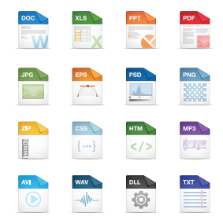

**கோப்பு**
அதென்ன கோப்பு? கணினியில் இடம் பெற்றிருக்கும் செயலி முலம் உருவாக்கப்படும் எந்த ஒரு வெளியீடும் ‘கோப்பு’ என்று அழைக்கப்படும். ஆகவே நாம் பயன்படுத்தும் செயலியின்தன்மையைக் கொண்டே கோப்பின் தன்மை அமையும். 
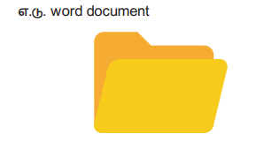

கோப்புத் தொகுப்பு :
கோப்புத் தொகுப்பு என்றால் என்ன? கோப்புத் தொகுப்பு என்பது பல கோப்புகளை உள்ளடக்கிய பெட்டகம் போன்றது ஆகும். இவற்றைத் தேவைக்கேற்ப பயனரால் உருவாக்கிக் கொள்ள முடியும். இன்னும் தெளிவாகக் கூற வேண்டுமெனில் நம் வீட்டில் உள்ள புத்தக அலமாரிகளில் உள்ள ஒரு புத்தகம் என்பது கோப்பு என்றும் புத்தக முழுமையையும் கொண்ட அலமாரியைக் கோப்புத்தொகுப்பு என்றும் எளிதில் கூறிவிடலாம். சரி கோப்புகளை உருவாக்குவது எப்படி? பொதுவாகச் சுட்டியின் வலப்புறப் பொத்தானை அழுத்தியதும் கணினித் திரையில் New எனத் தோன்றும். அதில் Folder என்பதைச் சொடுக்கினால் புதிய கோப்புத் தொகுப்பு நம் பயன்பாட்டிற்குத் தயாராகிவிடும். இந்த கோப்புத் தொகுப்பில் நாம் உருவாக்கிய கோப்புகளை விருப்பப்படி சேமித்து வைக்கலாம்.

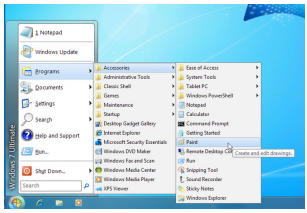

அதிகமானவர்களால் பயன்படுத்தப்படும் இயக்க மென்பொருளான விண்டோஸ் மற்றும் லினக்ஸில் குறிப்புகளைச் சேகரித்தல், படங்கள் வரைதல், அசைவூட்டப் படங்கள் தயாரித்தல் போன்ற பல செயல்களைத் தனித்தனியாக நம்மால் செய்ய இயலும். 

எப்படி முன் பின் தெரியாத ஊர்களுக்குச் செல்ல ஆங்காங்கே வழிகாட்டிப் பலகைகள் இருக்கின்றனவோ அதே போல் கணினியை இயக்கத் தொடங்கியவுடன் இடப்புறத்தின் கீழ் உள்ள START என்பதைக் கிளிக் செய்த உடன் கணினியில் உள்ள அனைத்து நிரல்களின் பட்டியல் திரையில் காட்டப்படும். அதில் நமக்குத் தேவையானதைத் தேர்வு செய்துகொள்வதன் மூலம் அந்த நிரல்களில் தேவைக்கேற்ப கோப்புகளை உருவாக்க முடியும். 

**கோப்புகளை உருவாக்குவது எப்படி?**
சான்றாக விண்டோஸ் இயங்குதளம் உள்ள கணினிகளில் நம் குறிப்புகளைச் சேகரித்து வைக்க நோட்பேடு (Notepad) செயலியையும், படங்கள் வரைய பெயிண்டு (Paint) என்னும் செயலியையும் பயன்படுத்தலாம்.

பெயருக்கேற்றபடி NotePad இல் தேவையான குறிப்புகளைத் தட்டச்சு செய்வதன் மூலம் உருவாக்கப்பட்ட கோப்புகளைக் கோப்புத் தொகுப்புகளில் சேமித்து வைத்துக் கொள்ளலாம். இது போல Paint என்னும் செயலியில் ஒரு படத்தை உருவாக்கவோ உருவாக்கிய படங்களைத் திருத்தம் செய்யவோ இயலும். இந்தப் படங்களைக் கொண்டு படத்தொகுப்பினை உருவாக்குவது பற்றியும், அசைவூட்டப் படங்களையும் வரைகலைப் படங்களையும் எளிமையாக உருவாக்குவது பற்றியும் அது தொடர்பான செயலிகளின் பயன்பாடுகளைப் பற்றியும் இனிக் காண்போம்.

ஒரு செய்தியைப் பேசியும், கரும்பலகையில் எழுதியும் நமக்குப் புரியவைப்பதைவிட காட்சிப்படங்கள், ஒலி ஒளிப் படங்களைக் காண்பித்தால் நமக்கு எளிதில் புரிந்து விடுகிறது அல்லவா ?

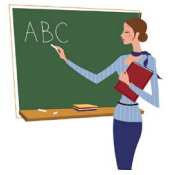

ஒரு ஊர்ல ஒரு ராஜா என்று சொல்லப்படும் கதையை விட, ஒரு காணொளிக் காட்சி எளிதாகப் புரிய வைத்து விடுகிறது. மேலும் அக்காட்சி மனதில் அப்படியே பதிந்தும் விடுகிறது. இவ்வாறு படங்கள் வழியாகக் குறிப்பிட்ட கருத்தினை நமக்கு எளிதில் புரிய வைப்பவையே காட்சித் தொடர்பு சாதனங்கள் ஆகும். உதாரணமாக நிழற்படங்கள், ஒலி- ஒளிப்படங்கள், வரைபடங்கள், அசைவூட்டப்படங்கள் போன்ற அனைத்தையும் கணினியின் உதவியுடன் எளிதாகச் செய்ய முடியும். காட்சித் தொடர்பு சாதனத்துக்குத் திரைப்படம் ஒரு சிறந்த சான்றாகும்.

**ஸ்கிராச்சு (SCRATCH) மென்பொருள்** 
**அறிமுகம்:**
 அசைவூட்டல்களையும் கேலிச்சித்திரங்களையும் விளையாட்டுகளையும் எளிதில் உருவாக்கப் பயன்படும் ஒரு மென்பொருளேஸ்கிராச்சு(SCRATCH). இது ஒரு காட்சி நிரல் மொழி (Visual Programming Language). எம்ஐடி (Massachusetts Institute of Technology - MIT) என்னும் பல்கலைத் தொழில்நுட்ப ஆய்வகம் இந்நிரலை எளிதாகவும் வேடிக்கையாகவும் கற்கும் வண்ணம் வடிவமைத்துள்ளது. 

**ஸ்கிராச்சு சூழல் திருத்தி (Scratch Environment Editor)** 
ஸ்கிராச்சு சூழல் திருத்தி மூன்று முக்கிய பகுதிகளைக் கொண்டது. அவை 
1) ஸ்டேஜ் (Stage) 
2) ஸ்பிரைட் (Sprite) 
3) ஸ்கிரிப்ட் எடிட்டர் (Script Editor) 

**ஸ்டேஜ் (மேடை)** 
ஸ்கிராச்சு சாளரத்தை திறக்கும் போது கிடைக்கும் பின்னணியை ஸ்டேஜ்; என்பர். இதன் பின்னணி நிறம் வெள்ளையாக இருக்கும். தேவைப்படின் பின்னணி நிறத்தை மாற்றலாம். 

**ஸ்பிரைட்** 
ஸ்கிராச்சு சாளரத்தில் பின்னணிக்கு மேல் பகுதியில் உள்ள கணினி மாந்தர்களைக் (Characters) ஸ்பிரைட்கள் என்பர். ஸ்கிராச்சு சாளரத்தை திறக்கும் போது ஒரு பூனை ஸ்பிரைட்டாக காட்சியளிக்கும். ஸ்பிரைட்டை தேவைக்கேற்ப மாற்றும் வசதி இந்த மென்பொருளில் உள்ளது. 

**ஸ்கிரிப்ட் எடிட்டர் அல்லது காஸ்டியூம் (ஒப்பனை) எடிட்டர்:** 
நிரல்களையும் இஸ்பிரைட் படங்களையும் இச்சாளரத்தில் நாம் மாற்ற முடியும்.

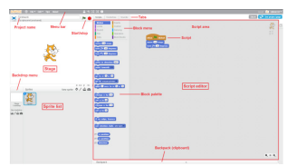

ஸ்கிராச்சு மென்பொருளைத் திறந்தவுடன் மூன்று பிரிவுகளை உள்ளடக்கிய ஒரு சாளரம் புலப்படும். இடப்புற மேல் பகுதியில் ஸ்டேஜ் பிரிவும் இடப்புறக் கீழ்ப்பகுதியில் ஸ்பிரைட் பட்டியல் பிரிவும் வலப்புறத்தில் ஸ்கிரிப்ட் எடிட்டர் பிரிவும் இருக்கும். 

ஸ்கிரிப்ட் எடிட்டரின் மேல்பகுதியில் Script, Costume, Sound என மூன்று தத்தல்கள் இருக்கும். 

ஸ்கிரிப்ட் எடிட்டர் மூன்று முக்கியப் பகுதிகளைக் கொண்டது. 
1) Script Area: இங்கு நிரல் (Script) கட்டமைக்கப்படுகிறது. 
2) Block Menu: இங்கிருந்து பிளாக்கு வகைமையைத் (blocks category-Programming Statements) தேர்வு செய்யமுடியும். 
3) Block Palette: இங்கு பிளாக்குகளை (block) தேர்வு செய்யலாம். 
ஆடை தத்தலைத் (Costume tab) தேர்வு செய்தால் ஆடை திருத்தி (Costume editor) புலப்படும்.

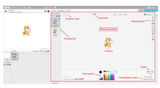

**அசைவூட்டமும் கண்ணியும்:** 
1) File/New தேர்வு செய்க. புதிய செயல்திட்டம் (Project) உருவாகும் 
2) Script Menu வில் Event ஐ தேர்வு செய்க. இப்போது சில கள் தோன்றும். “When green flag clicked” என்ற block ஐ drag செய்து Script area வில் வைக்கவும்.

3) Script → Motion menu வைத் தேர்வு செய்து goto x:0 y:0 என்ற block ஐ drag செய்து ஏற்கனவே நாம் வைத்திருக்கும் “When green flag clicked” block ன் அடியில் சேர்க்கவும். இப்போது நமது Script area பின்வருமாறு தெரியும்.

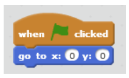

4) “move 10 steps” என்ற block ஐ ஏற்கனவே நாம் வைத்திருக்கும் இரண்டு block களுக்கு அடியில் சேர்க்கவும். மேலும் “move 10 steps” என்பதில் உள்ள 10ஐ 100 ஆக மாற்றவும்.

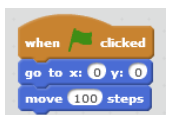

5) இந்த நிரலை இயக்க வலப்புற மேல்பகுதியில் உள்ள பச்சை நிறக் கொடியின் மீது சொடுக்கவும்.

**ஒலியைச் சேர்த்தல்:** 
1. Sound tab ஐ தேர்வு செய்க. இப்போது தெரியும் Sprite list இல் ‘Sprite1’ என்பதைத் தேர்வு செய்யவும். 
2. ‘மியாவ்’ என்ற ஒலி கேட்கும். வேறு ஒலி வேண்டும் எனில் speaker icon ஐ தேர்வு செய்து Sound library இல் இருந்து வெவ்வேறு ஒலிகளைப் பெறலாம். 
3. Script tab → Sound → Play sound block ஐத் தெரிவு செய்க. அத்துடன் “When space key pressed” block ஐச் சேர்க்கவும். 
4. நிரலை இயக்கவும். 

**எடுத்துக்காட்டு** 
“Hello” என்ற சொல்லை ஒலியுடன் பதிவு செய்யும் நிரலை எழுதுக.
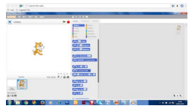

1.	Script tabல் Events option ஐ தேர்வு செய்க .
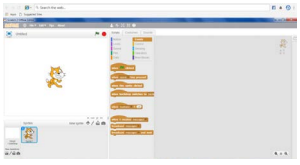

2.	tab ஐ script area விற்குள் இழுத்து வைக்கவும்

3.	Script tab ல் looks option ஐ தேர்வு செய்க. Say “ “ என்ற block ஐ Script area விற்குள் இழுத்து வைக்கவும்

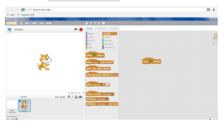

4.	Say tab னுள் “Hello” என்ற வார்த்தையை தட்டச்சு செய்யவும்.
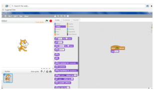

5.	Script tab-> Sounds option ஐ தேர்வு செய்க. “Play sound” block ஐ இழுத்து Script Area வினுள் விடவும். Audio file லிருந்து “Hello” sound ஐ தேர்வு செய்யவும்.
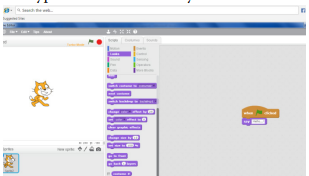

6. File menu -> Save தேர்வு செய்க. இப்போது உங்கள் Project சேமிக்கப்படும்.. 
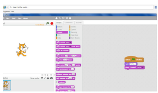
7. நிரலை இயக்க வலது மேல் ஓரத்தில் உள்ள பச்சை நிறக் கொடியை click செய்யவும்.

**வெளியீடு:**
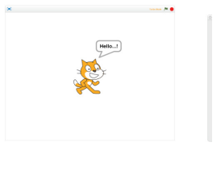
